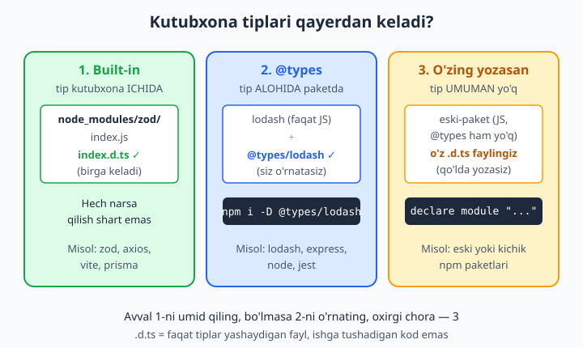
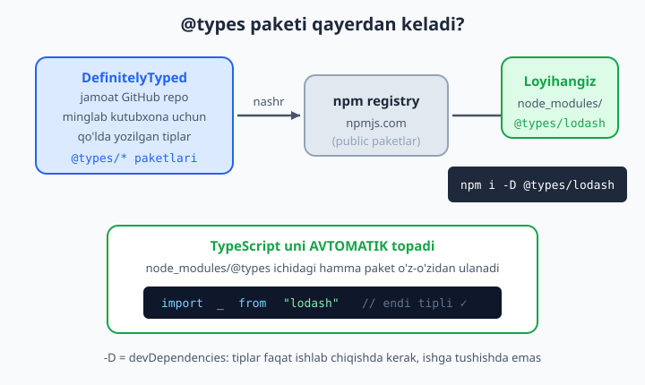
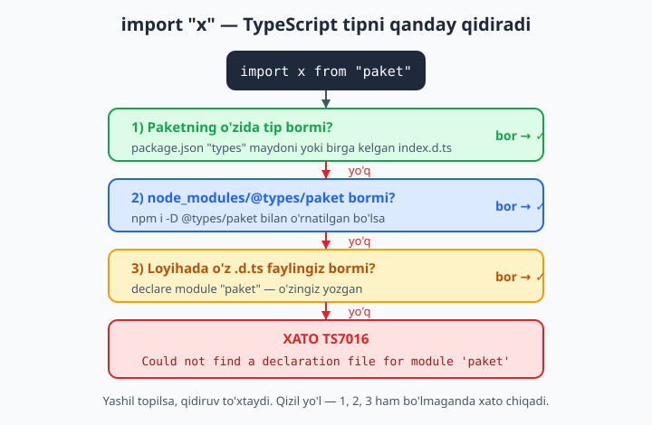

# 21 — Tashqi kutubxonalar va @types

[⬅️ Oldingi: 20 — Async, Promise va tiplangan API](./20-async-promise.md) · [🏠 README](./README.md) · [Keyingi: 22 — React va Node bilan TypeScript ➡️](./22-react-node.md)

> **Bu bobda:** real loyiha hech qachon faqat o'z kodingizdan iborat bo'lmaydi — `npm install` bilan o'nlab tashqi kutubxona qo'shasiz. Lekin ularning hammasi ham TypeScript'ni "bilmaydi". Shu bobda kutubxona tiplari qayerdan kelishini (kutubxona ichidagi built-in `.d.ts`, alohida `@types/...` paketi yoki o'zingiz yozadigan deklaratsiya), TypeScript tipni qanday tartibda qidirishini, tipsiz kutubxonaga `declare module` bilan tez tip berishni, `skipLibCheck`ning nima qilishini, kutubxona tiplarini o'qib chiqishni, versiya mosligini va o'z paketingizga `types` maydoni qo'shishni ko'rib chiqamiz.

---

## Muammo

20-bobgacha biz yozgan kodning hammasi o'zimizniki edi: o'zimiz tiplagan funksiya, interface, generic. Lekin haqiqiy loyihada birinchi kuniyoq begona kod qo'shasiz:

```bash
npm install lodash
```

`lodash` — millionlab loyiha ishlatadigan mashhur JavaScript yordamchi kutubxonasi. Import qilib ishlatamiz:

```ts
import _ from "lodash";

const bo_laklar = _.chunk([1, 2, 3, 4, 5], 2);
```

Va TypeScript darrov qizil chiziq chizadi:

```text
error TS7016: Could not find a declaration file for module 'lodash'.
  '.../node_modules/lodash/lodash.js' implicitly has an 'any' type.
  Try `npm i --save-dev @types/lodash` if it exists or add a new
  declaration (.d.ts) file containing `declare module 'lodash';`
```

Birinchi qarashda g'alati: kutubxona o'rnatildi, `import` to'g'ri, lekin TypeScript "tip topa olmadim" deydi. Sabab oddiy: `lodash` — bu **JavaScript** kutubxonasi. Uning ichida `.js` fayllari bor, lekin TypeScript tiplari (`.d.ts`) yo'q. TypeScript esa har bir import qilingan modulning tipini bilishni xohlaydi — yo'q bo'lsa, "bu narsa `any`" deydi, `strict` rejimda esa buni xato sifatida ko'rsatadi.

Bu bobning butun mavzusi shu bitta savol atrofida: **tashqi kutubxonaning tiplari qayerdan keladi va men nima qilishim kerak?** Javob uchta ehtimoldan iborat, va ularni eng yaxshisidan eng oxirgi chorasigacha tartib bilan ko'ramiz.



## .d.ts nima — ishga tushmaydigan "faqat tip" fayli

Avval bitta tushunchani aniqlab olaylik, chunki bob davomida juda ko'p uchraydi. `.d.ts` — bu **declaration file** (deklaratsiya fayli): ichida faqat tiplar bo'ladi, hech qanday ishga tushadigan kod yo'q. U "filankas funksiya bor, u shunday argument oladi va shunday qiymat qaytaradi" deb **e'lon qiladi**, lekin funksiyaning tanasini yozmaydi.

Tasavvur qiling: kutubxonaning haqiqiy mantig'i `.js` faylda yashaydi (brauzer yoki Node shuni ishlatadi), `.d.ts` esa faqat TypeScript'ga "bu `.js` faylda nima borligini" tushuntiradigan tip xaritasi. Ikkalasi yonma-yon turadi:

```text
lodash/
  lodash.js      <- haqiqiy kod (ishga tushadi)
  index.d.ts     <- faqat tiplar (TypeScript o'qiydi, tushib qoladi)
```

📌 `.d.ts` ichida `function f(x: number): string;` deb yozasiz — nuqta-vergul bilan tugaydi, jingalak qavs (tana) **yo'q**. Bu — 17-bobda ko'rgan `declare` dunyosi: "bu narsa boshqa joyda mavjud, men faqat uning tipini aytyapman". Kompilyatsiyadan keyin `.d.ts` hech qanday JavaScript chiqarmaydi — u faqat tekshiruv uchun.

## 1-yo'l: kutubxonada tip o'zida bor (built-in)

Eng baxtli holat — eng ko'p uchraydigani ham. Zamonaviy kutubxonalarning aksariyati o'z tiplarini **o'zida** olib keladi. Masalan `zod`, `axios`, `vite`, `prisma`, `date-fns` — bularni `npm install` qilsangiz, tiplar avtomatik birga keladi, hech narsa qilish shart emas:

```bash
npm install zod
```

```ts
import { z } from "zod";

const KitobShemasi = z.object({
  id: z.number(),
  nomi: z.string(),
});

type Kitob = z.infer<typeof KitobShemasi>;
// { id: number; nomi: string }  — to'liq tipli, qo'shimcha hech narsasiz
```

Bu qanday ishlaydi? Kutubxonaning `package.json` faylida `types` (yoki eski nomi `typings`) maydoni bor, u `.d.ts` faylga ishora qiladi:

```json
{
  "name": "zod",
  "main": "lib/index.js",
  "types": "lib/index.d.ts"
}
```

TypeScript import paytida `node_modules/zod/package.json`ni o'qiydi, `types` maydonini ko'radi va o'sha `.d.ts` faylni topadi. Sizning ishingiz — shunchaki `import` qilish.

💡 Yangi paket o'rnatishdan oldin "TypeScript'ni qo'llab-quvvatlaydimi?" deb tekshirishning eng tez yo'li — npmjs.com'dagi paket sahifasiga qarash. Agar nom yonida ko'k **TS** belgisi bo'lsa — tip o'zida bor (built-in). **DT** belgisi bo'lsa — tip alohida `@types` paketda (keyingi bo'lim). Hech qaysi bo'lmasa — tip umuman yo'q.

📌 Built-in tipni "ishlatish" uchun hech qanday maxsus import yozmaysiz. `import { z } from "zod"` — bu oddiy import, tiplar fonda o'z-o'zidan ulanadi. `.d.ts` faylni qo'lda import qilish kerak emas — bu eng ko'p uchraydigan boshlovchi tushunmovchiligi.

## 2-yo'l: tip alohida — @types va DefinitelyTyped

Endi `lodash`ga qaytaylik. U eski va sof JavaScript kutubxonasi, tipni o'zida olib kelmaydi. Lekin uni TypeScript'da ishlatadiganlar shunchalik ko'pki, jamoa uning tiplarini **alohida** yozib qo'ygan. Bu tiplar **DefinitelyTyped** degan ulkan jamoat GitHub repozitoriysida yashaydi va npm'ga `@types/...` nomi bilan nashr etiladi:

```bash
npm install --save-dev @types/lodash
```

`--save-dev` (qisqasi `-D`) — bu tip paketi faqat **ishlab chiqish** vaqtida kerak degani: dasturni brauzer yoki Node ishlatganda tiplar kerak emas (ular kompilyatsiyada tushib qoladi), shuning uchun ular `devDependencies`ga tushadi. Endi bir narsa o'zgartirmasdan, o'sha import to'satdan to'liq tipli bo'lib qoladi:

```ts
import _ from "lodash";

const bo_laklar = _.chunk([1, 2, 3, 4, 5], 2);
// bo_laklar: number[][]  — endi aniq tip!
```



TypeScript `@types`ni qanday topadi? Bu yerda sehr yo'q: `node_modules/@types/` ichidagi **hamma** paket avtomatik global ko'rinadi, hech qanday qo'shimcha sozlama yozmaysiz. `@types/lodash`ni o'rnatdingizmi — `import _ from "lodash"` darrov tipli bo'ladi. TypeScript paketning JS kodini (`lodash`) va uning tiplarini (`@types/lodash`) nom bo'yicha bog'laydi.

📌 **`@types/x`ni alohida import qilmaysiz.** `import lodash from "@types/lodash"` deb yozsangiz xato bo'ladi — `@types/lodash` ishlatadigan modul emas, faqat tip paketi. Siz baribir `import _ from "lodash"` deysiz; `@types/lodash` esa fonda o'sha importga tip ulaydi.

💡 Mashhur built-in tipsiz paketlar va ularning `@types`lari: `@types/node` (Node.js o'zi — `fs`, `path`, `process` uchun; har Node loyihada deyarli doim kerak), `@types/express`, `@types/jest`, `@types/react`. Birinchi qadamingiz har doim bir xil: import qizil chizilsa va xato `Try npm i --save-dev @types/...` desa — shuni o'rnatib ko'ring.

## TypeScript tipni qanday tartibda qidiradi

Yuqoridagi ikki yo'lni TypeScript bitta qidiruv jarayonida birlashtiradi. `import x from "paket"` yozganingizda, kompilyator tipni shu **aniq tartibda** qidiradi:

1. **Paketning o'zida tip bormi?** — `node_modules/paket/package.json`dagi `types` maydoni yoki birga kelgan `.d.ts`. Bo'lsa — tugadi.
2. **`node_modules/@types/paket` bormi?** — DefinitelyTyped'dan o'rnatilgan tip paketi. Bo'lsa — tugadi.
3. **Loyihangizda o'z `.d.ts` faylingiz bormi?** — `declare module "paket"` (keyingi bo'lim). Bo'lsa — tugadi.
4. Hech qaysi bo'lmasa — **TS7016 xato**: "tip topilmadi".



Bu tartibni bilish muammoni tezda hal qilishga yordam beradi: import qizil chizildimi — o'zingizdan so'rang "qaysi bosqichda to'xtadi?". Odatda javob 2-bosqich: `@types`ni o'rnatish kifoya. Kamdan-kam hollardagina 3-bosqichgacha — o'z deklaratsiyangizni yozishgacha — borishingizga to'g'ri keladi.

## 3-yo'l: tip umuman yo'q — declare module

Ba'zan kutubxona shunchalik eski yoki kichikki, na o'zida tip bor, na `@types/...` paketi mavjud. U holda `npm install @types/...` xato beradi ("paket topilmadi"), import esa baribir TS7016 chiqaradi. Bu — oxirgi chora: tipni **o'zingiz** yozasiz.

Eng tez yechim — loyihada bitta `.d.ts` fayl yaratib (masalan `tiplar.d.ts` yoki `globals.d.ts`), unga bo'sh `declare module` yozish:

```ts
// tiplar.d.ts
declare module "eski-kutubxona";
```

Bu "shorthand" (qisqartirilgan) deklaratsiya. Endi `eski-kutubxona`ni import qilsa bo'ladi, lekin uning hammasi `any` bo'ladi:

```ts
import eski from "eski-kutubxona";

const natija = eski.istalganNarsa(1, 2, 3); // natija: any — xato bermaydi
```

✅ Bu kompilyatsiyadan o'tadi. Lekin diqqat: `any` — bu "TypeScript bu yerda tekshirmaydi" degani (9-bobni eslang). Siz xato yozsangiz ham aytmaydi. Bu — tez, lekin xavfsizligi past yechim. "Ishlasin, hozir tip yozishga vaqtim yo'q" holatlari uchun.

📌 `declare module "x";` (tanasiz, qisqa shakl) faqat alohida `.d.ts` faylda ishlaydi. Uni oddiy `.ts` faylga (ichida `import`/`export` bo'lgan modul fayliga) yozsangiz, TypeScript `TS2664: Invalid module name in augmentation` xatosini beradi. Qoida: ambient (atrof-muhit) deklaratsiyalar — `.d.ts` faylga.

### To'liq tiplangan declare module

`any`dan ko'ra yaxshiroq variant — kutubxonaning haqiqiy shaklini `declare module` ichida tasvirlash. Faqat o'zingiz ishlatadigan qismini yozsangiz ham bo'ladi:

```ts
// sodda-slug.d.ts
declare module "sodda-slug" {
  // Standart (default) eksport: funksiya
  export default function slugla(matn: string): string;
  // Nomli eksportlar:
  export function tozala(matn: string): string;
  export const versiya: string;
}
```

Endi import to'liq tipli:

```ts
import slugla, { tozala, versiya } from "sodda-slug";

const s: string = slugla("Salom Dunyo"); // ✅ string
const t: string = tozala("  bo'sh  ");    // ✅ string
console.log(s, t, versiya);
```

Va endi noto'g'ri ishlatsangiz — xato chiqadi, xuddi haqiqiy tipli kutubxonadagidek:

```ts
import slugla from "sodda-slug";

const n: number = slugla("Salom");
// ❌ Xato: Type 'string' is not assignable to type 'number'.
```

💡 Hamma narsani yozish shart emas. `declare module` ichida faqat **o'zingiz haqiqatan ishlatadigan** funksiyalarni yozing. Kutubxonada 50 ta funksiya bo'lsa-yu, siz 3 tasini ishlatsangiz — o'sha 3 tasini yozasiz. Keyinroq yana kerak bo'lsa, qo'shasiz. Bu — "etarli darajada tip" yondashuvi.

## Mavjud modulga tip qo'shish: augmentation

Ba'zan kutubxonaning tiplari bor, lekin u yangilik qo'shgan-u, `@types` hali yangilanmagan; yoki siz kutubxonaga o'z plaginingizni ulagansiz. Bunday holatda butun modulni qaytadan yozmay, mavjud tiplarga **qo'shimcha** kiritasiz. Bu — module augmentation (modulni kengaytirish):

```ts
// augment.d.ts
import "sodda-slug"; // avval modulni "olib kelamiz"

declare module "sodda-slug" {
  // Mavjud tiplarni ALMASHTIRMAYMIZ, ustiga yangi a'zo QO'SHAMIZ:
  export function teskari(matn: string): string;
}
```

Endi `teskari` ham xuddi kutubxonaning o'z funksiyasidek import qilinadi:

```ts
import slugla, { teskari } from "sodda-slug";

const a: string = slugla("Salom");
const b: string = teskari("Salom"); // ✅ augmentation orqali qo'shildi
```

📌 Augmentation va qaytadan yozish farqi yuqoridagi birinchi qatorda: `import "sodda-slug";` bo'lsa — TypeScript "bu modul allaqachon bor, men unga qo'shyapman" deb tushunadi. Bu qator bo'lmasa — modulni noldan e'lon qilyapsiz deb o'ylaydi.

💡 Xuddi shu usul bilan **global** obyektlarga ham tip qo'shasiz — masalan `window`ga o'z xossangizni. Buni `declare global` bilan qilamiz (17-bobda ko'rgansiz):

```ts
// global.d.ts
export {}; // faylni modul qilish uchun (aks holda declare global ishlamaydi)

declare global {
  interface Window {
    myApp: { versiya: string; sozlamalar: Record<string, string> };
  }
}
```

```ts
window.myApp = { versiya: "1.0", sozlamalar: { til: "uz" } };
const v: string = window.myApp.versiya; // ✅ endi tipli, xato yo'q
```

## skipLibCheck — kutubxona tiplaridagi xatolarni e'tiborsiz qoldirish

Vaqti-vaqti bilan kutubxonaning `.d.ts` faylining o'zida xato bo'ladi — masalan, ikki kutubxona bir-biriga zid tip e'lon qiladi yoki `@types` paketi eskirgan. Bunday holatda kompilyator sizning kodingizda emas, `node_modules` ichidagi begona `.d.ts`da xato ko'rsatadi:

```text
node_modules/buzuq-paket/index.d.ts(3,20): error TS2304: Cannot find name 'NomavjudTip'.
```

Bu sizning aybingiz emas va siz uni tuzata olmaysiz — fayl begona kutubxonaniki. Aynan shu holat uchun `tsconfig.json`da `skipLibCheck` bor:

```json
{
  "compilerOptions": {
    "skipLibCheck": true
  }
}
```

`skipLibCheck: true` — "barcha `.d.ts` fayllarning ichini tekshirma" degani. TypeScript baribir o'sha tiplardan **foydalanadi** (sizning kodingiz to'liq tipli qoladi), lekin `.d.ts` fayllarning o'z ichidagi muammolarni tekshirib o'tirmaydi. Yuqoridagi buzuq paket xatosi `skipLibCheck` bilan butunlay yo'qoladi.

📌 `skipLibCheck` faqat **`.d.ts` fayllar ichini** tekshirmaydi. Sizning `.ts` kodingiz baribir to'liq tekshiriladi — bu sozlama sizning xatolaringizni yashirmaydi, faqat kutubxonalardagi tip xatolarini o'tkazib yuboradi.

💡 Amalda ko'p loyiha `skipLibCheck: true` bilan ishlaydi, chunki u kompilyatsiyani ham tezlashtiradi (minglab `.d.ts` faylni qayta tekshirmaydi). Ko'plab boshlang'ich shablonlar (Vite, Next.js) buni default yoqib qo'yadi. Faqat bitta xavfi bor: o'zingiz yozgan `.d.ts`dagi xato ham yashirinib qolishi mumkin — shuning uchun uni "muammoni yashirish" emas, "begona kutubxona muammosini chetlab o'tish" deb biling.

## Kutubxona tiplarini o'qish — go-to-definition

Tashqi kutubxonani ishlatayotganda eng kerakli ko'nikma — uning tiplarini **o'qiy olish**. Funksiya qanday argument oladi? Nima qaytaradi? Buni hujjatga qaramay, to'g'ridan-to'g'ri tipdan bilib olish mumkin. Muharriringizda (VS Code) funksiya nomi ustiga kursorni qo'ying — to'liq imzo (signature) ko'rinadi. Yoki nom ustida `F12` (Go to Definition) bossangiz — bevosita o'sha `.d.ts` faylga olib boradi:

```ts
import { z } from "zod";
// z.object ustida F12 bossangiz -> zod/lib/types.d.ts ga olib boradi,
// u yerda object metodining aniq tipi va qaytaradigan qiymati ko'rinadi.
```

💡 Bu — TypeScript'ning eng kuchli, lekin kam baholanadigan tarafi. Kutubxona tiplari aslida **o'qiladigan hujjat**: `function chunk<T>(array: T[], size?: number): T[][]` degan bitta qator sizga `chunk`ning massiv olishini, ixtiyoriy `size` qabul qilishini va massivlar massivini qaytarishini hujjat o'qimasdan aytib beradi. Yangi kutubxona o'rganayotganda `.d.ts`ga "kirib chiqish" odat qiling.

📌 `.d.ts` ichidagi `?` (ixtiyoriy parametr, 6-bob), generic `<T>` (11-bob), union `|` (7-bob) — bularning hammasi siz allaqachon o'rgangan tushunchalar. Kutubxona tiplari sizga begona til emas: ular shu kitobdagi aynan o'sha qurilmalardan yasalgan. Shuning uchun ularni o'qiy olasiz.

## Versiya mosligi: paket va @types

Bir nozik nuqta: `lodash` va `@types/lodash` — bu **ikki alohida paket**, ularning versiyalari alohida yangilanadi. Odatda DefinitelyTyped versiyani kutubxonaga moslashtiradi: `@types/lodash@4.x` — `lodash@4.x` uchun. Lekin ba'zan ular bir-biridan orqada qoladi.

Belgilar:
- Kutubxonaning yangi funksiyasini ishlatmoqchisiz, lekin TypeScript "bunday a'zo yo'q" deydi — `@types` eski bo'lishi mumkin. `npm update @types/...` bilan yangilang.
- Yoki teskari: `@types` yangiroq versiyani tasvirlaydi, siz esa kutubxonaning eski versiyasini o'rnatgansiz — tip bor deydi-yu, ishga tushganda funksiya yo'q. Bu xavfliroq, chunki kompilyatsiya o'tadi, lekin runtime'da uziladi.

📌 Qoidasi: `lodash`ni `4.17` o'rnatdingizmi, `@types/lodash`ni ham `4.x` ichida ushlang. Major versiya (`4.x`, `5.x`) mos kelishi muhim. Kichik farqlar (`4.17` va `4.14`) odatda zararsiz, lekin yangi funksiya ishlatayotganda diqqat qiling.

💡 Modern paketlarning ko'pi (zod, axios...) tipni o'zida olib kelgani uchun bu muammo umuman bo'lmaydi: tip va kod bir paketda, bir versiyada — hech qachon mos kelmay qolmaydi. Bu — built-in tipning yana bir afzalligi.

## O'z paketingizga tip qo'shish — siz kutubxona yozsangiz

Endi teskari tomon. Aytaylik, o'zingiz npm'ga kutubxona nashr qilmoqchisiz va uni TypeScript'da ham, JavaScript'da ham ishlatsa bo'lsin deysiz. Sizning paketingiz ham yuqoridagi 1-yo'l ("built-in tip") bo'lishi kerak — ya'ni `.d.ts` faylni paketga qo'shib, `package.json`da `types` maydonida ko'rsatasiz:

```json
{
  "name": "mening-paketim",
  "version": "1.0.0",
  "main": "dist/index.js",
  "types": "dist/index.d.ts"
}
```

`types` maydoni — bu kutubxonangizdan foydalanadigan har bir TypeScript dasturchi uchun "tip shu yerda" degan ishora. TypeScript import paytida aynan shu maydonni o'qiydi (qidirish tartibining 1-bosqichi).

`.d.ts` faylni qo'lda yozish shart emas — agar paketingizni TypeScript'da yozsangiz, `tsconfig.json`da `"declaration": true` qo'ysangiz, kompilyator har `.ts` fayl yoniga mos `.d.ts` faylni **o'zi yaratadi**:

```json
{
  "compilerOptions": {
    "declaration": true,
    "outDir": "dist"
  }
}
```

📌 Zamonaviy paketlarda `types` o'rniga (yoki bilan birga) `exports` maydoni ham ishlatiladi — u har bir kirish nuqtasi uchun alohida tip va kod yo'lini ko'rsatishga imkon beradi. Boshlovchi uchun `main` + `types` kifoya; `exports`ni kutubxonangiz murakkablashganda o'rganasiz.

💡 Agar siz paketni JavaScript'da yozayotgan bo'lsangiz ham TypeScript foydalanuvchilarini xursand qila olasiz: qo'lda bitta `index.d.ts` yozib, `package.json`da `types` da ko'rsating. Shunday qilib JS kutubxonangiz "TypeScript-do'st" bo'ladi va npmjs'da ko'k TS belgisini oladi.

## Hammasini bir joyda: amaliy oqim

Yangi kutubxona o'rnatganda har safar shu tartibni bosib o'ting:

1. `npm install paket` — o'rnating va import qilib ko'ring.
2. Import qizil chizilmadimi? — **Tabriklayman, tip o'zida bor** (1-yo'l). Hech narsa qilish kerak emas.
3. Qizil chizildi va xato `Try npm i --save-dev @types/...` desa — **o'sha buyruqni ishga tushiring** (2-yo'l). Ko'pincha shu yetadi.
4. `@types/...` paketi topilmasa ("404") — **o'zingiz `declare module` yozing** (3-yo'l): tez kerak bo'lsa bo'sh shorthand bilan, vaqtingiz bo'lsa to'liq tiplab.
5. `node_modules` ichidagi begona `.d.ts`da xato chiqsa — `tsconfig.json`ga `skipLibCheck: true` qo'shing.

Bu besh qadam real loyihalardagi tip muammolarining deyarli barchasini hal qiladi. Eng muhimi shuni eslab qoling: TypeScript hech qachon "sehrli" emas — u faqat `.d.ts` fayllardagi yozilgan tiplarni o'qiydi. Tip qayerdandir kelishi kerak: kutubxonaning o'zidan, `@types`dan yoki sizning qo'lingizdan.

## 21-bob mashqlari

Quyidagi mashqlarni o'zingiz bajaring. Tashqi paket talab qiladigan mashqlar uchun kichik test loyiha (`npm init -y`) yarating va `tsc --noEmit --strict` bilan tekshiring; `declare module` mashqlarini esa alohida `.d.ts` faylga yozing.

1. Bo'sh loyiha yarating va `import _ from "lodash"` yozing. Chiqqan xato xabarini (TS7016 yoki TS2307) izoh sifatida ko'chiring va qaysi raqamli xato ekanini yozing.
2. Built-in tipli kutubxona (`zod`) o'rnating, `z.object({ id: z.number() })` bilan kichik shema yarating va undan `z.infer` orqali tip oling. Hech qanday `@types` o'rnatmasdan ishlaganini tasdiqlang.
3. `@types/lodash` ni o'rnating, `_.chunk([1,2,3,4], 2)` natijasining tipini hover bilan ko'ring va izohda yozing (`number[][]`).
4. `@types/lodash`ni o'rnatgach, `_.chunk`ka noto'g'ri argument (`_.chunk(5, 2)` — birinchi argument massiv emas) bering va xato chiqishini tasdiqlang.
5. `.d.ts` fayl yarating va unda bo'sh shorthand `declare module "qandaydir-paket";` yozing. Shu paketni import qilib, undan biror narsa olib `any` ekanini (hover bilan) tasdiqlang.
6. 5-mashqdagi paketdan olingan qiymat `any` bo'lgani uchun istalgan amalni (`x.istalgan.narsa()`) xatosiz yozib ko'ring. Bu nima xavf tug'dirishini izohda yozing.
7. To'liq tiplangan `declare module "matn-vositasi"` yozing: ichida `export default function teskarila(s: string): string;` bo'lsin. Import qilib, natija `string` ekanini tekshiring.
8. 7-mashqdagi modulga qaytgan `string`ni `number`ga belgilashga urining (`const n: number = teskarila("a")`) va xato chiqishini izohga ko'chiring.
9. To'liq `declare module`ga nomli eksport qo'shing: `export function uzunlik(s: string): number;`. Uni `{ uzunlik }` bilan import qilib ishlating.
10. Module augmentation yozing: avval `import "matn-vositasi";`, keyin `declare module "matn-vositasi" { export function bo_yi(s: string): number; }`. Yangi `bo_yi` funksiyasi import qilinishini tasdiqlang.
11. 10-mashqda boshidagi `import "matn-vositasi";` qatorini olib tashlang va nima o'zgarishini kuzating (augmentation emas, qayta e'lon bo'lib qoladi). Farqni izohda yozing.
12. `declare global` bilan `Window` interface'iga `sozlama: { til: string }` xossasini qo'shing. `window.sozlama.til` ni xatosiz o'qib ko'ring. (`.d.ts` fayl boshida `export {};` borligiga ishonch hosil qiling.)
13. 12-mashqda `export {};` qatorini olib tashlang va `declare global` xato bera boshlaganini ko'ring; xatoni izohga yozib, qatorni qaytaring.
14. Ataylab buzuq `.d.ts` yarating: ichida `export const x: MavjudEmasTip;`. Uni import qiladigan kod yozib, TS2304 xatosi chiqishini tasdiqlang.
15. `tsconfig.json`ga `"skipLibCheck": true` qo'shib, 14-mashqdagi buzuq `.d.ts` xatosi yo'qolganini tekshiring. Sizning `.ts` kodingiz baribir tekshirilishini bir xato yozib (`const y: number = "matn"`) isbotlang.
16. Bir `package.json` yozing va unga `"types": "dist/index.d.ts"` maydonini qo'shing. Bu maydon nima vazifa bajarishini izohda 2 jumlada tushuntiring.
17. Kichik TypeScript fayl (`index.ts`) yozib, `tsconfig.json`da `"declaration": true` qo'ying va `tsc` ishga tushiring. Yoningizda yaratilgan `index.d.ts` ichida nima borligini ko'ring va izohlang.
18. Kutubxona tiplarini o'qish mashqi: `zod` (yoki boshqa built-in tipli paket) funksiyasi ustida muharriringizda "Go to Definition" (F12) bosing va olib borgan `.d.ts` fayldan bitta funksiya imzosini izohga ko'chiring.
19. Versiya mosligi mashqi: `lodash` va `@types/lodash`ning `package.json`'larini oching, ikkalasining `version`ini solishtirib izohga yozing. Major versiyalar mos kelishini tekshiring.
20. To'liq oqim mashqi: yangi tashqi paket tanlang (masalan `dayjs` — built-in tipli yoki `validator` — `@types` kerak). 1-yo'lmi, 2-yo'lmi aniqlang, kerak bo'lsa `@types`ni o'rnating va paketning bitta funksiyasini to'liq tipli holda ishlatib ko'ring. Bosib o'tgan qadamlaringizni izohda yozing.
