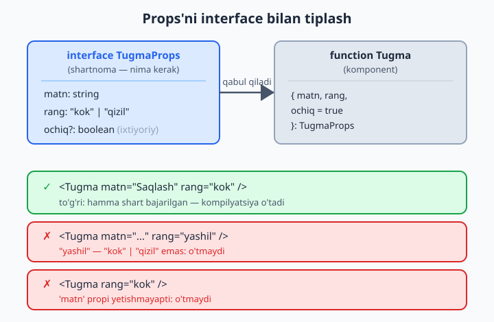
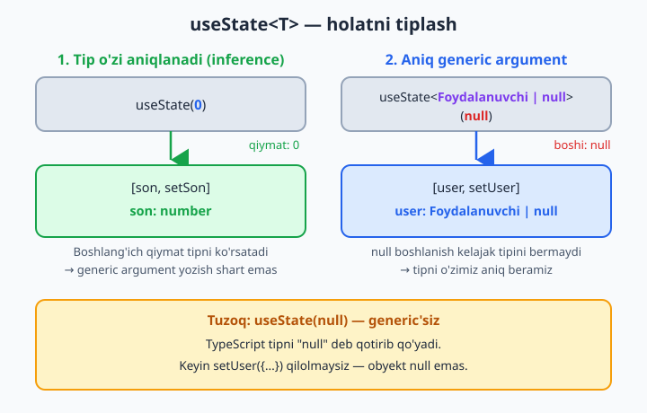
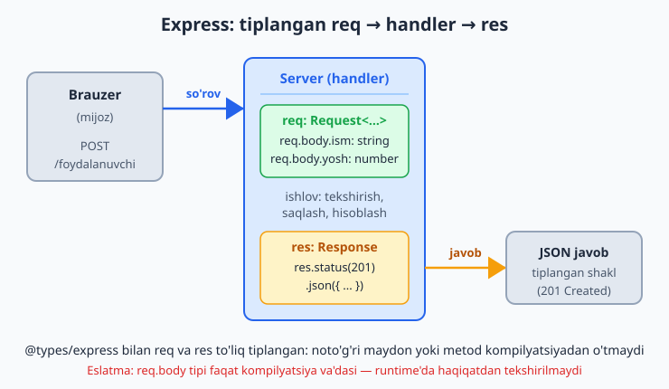

# 22 — React va Node bilan TypeScript

[⬅️ Oldingi: 21 — Tashqi kutubxonalar va @types](./21-types-kutubxonalar.md) · [🏠 README](./README.md) · [Keyingi: 23 — Migratsiya: JS'dan TypeScript'ga ➡️](./23-migratsiya-js-ts.md)

> **Bu bobda:** shu paytgacha o'rgangan tiplarni real freymvorklarda qo'llaymiz. Frontend tomonda React komponentlarining `props`'ini `interface` bilan tiplash, `useState<T>`, event handler tiplari (`onChange`, `onClick`), `children` tipi va `React.FC` munozarasini ko'ramiz. Backend tomonda Node + Express'ni `@types/node` va `@types/express` bilan tiplab, `req`/`res`'ni xavfsiz qilamiz, environment (`process.env`)'ni tiplaymiz va `tsx` bilan ishga tushiramiz. Bu bob — ikkala ekotizimga **amaliy ko'prik**: chuqur React yoki Node darsligi emas, balki "o'rgangan tiplarimni qayerda ishlataman?" degan savolga javob.

---

## Muammo

Siz 21 bob davomida tiplarni o'rgandingiz: `interface`, union, generic, narrowing. Lekin hozircha hammasi "yakka" misollarda edi. Real ish esa freymvorkda: brauzerda React, serverda Node. Va aynan shu yerda tiplangan kod eng ko'p foyda keltiradi, chunki freymvorkda **xatolik narxi yuqori** — props noto'g'ri uzatilsa butun komponent ishlamaydi, API javobi noto'g'ri o'qilsa server qulaydi.

JavaScript'da React komponenti shunday yoziladi va hech kim sizni ogohlantirmaydi:

```jsx
function Salom(props) {
  return <h1>Salom, {props.ism}!</h1>;
}

// Boshqa joyda — xato, lekin JS indamaydi:
<Salom name="Aziz" />     // "ism" emas, "name" yozdik — undefined chiqadi
<Salom />                  // ism umuman berilmadi
```

Natija ekranda `Salom, undefined!` — dastur ishlaydi-yu, buzuq. Bu xato **runtime'da**, foydalanuvchi qo'lida chiqadi. Backend tomonda ham xuddi shunday: `req.body.summa` deb yozasiz, lekin u `string`mi, `number`mi — bilmaysiz, va `summa * 2` kutilmagan natija beradi.

TypeScript bu ikkala muammoni ham yopadi. Komponent qaysi `props`'ni kutishini **shartnoma** (`interface`) bilan e'lon qilasiz, va noto'g'ri ishlatilsa kod **kompilyatsiya'dan o'tmaydi** — xato siz uni yozayotgan paytda, muharrirda chiqadi:

```tsx
interface SalomProps {
  ism: string;
}

function Salom(props: SalomProps) {
  return <h1>Salom, {props.ism}!</h1>;
}

// Endi:
<Salom ism="Aziz" />;      // ✅ to'g'ri
<Salom name="Aziz" />;     // ❌ Xato: 'name' SalomProps'da yo'q, 'ism' kerak
<Salom />;                  // ❌ Xato: 'ism' propi yetishmayapti
```

Keling, avval frontend (React), keyin backend (Node/Express) tomonni qadama-qadam ochamiz.

> Bu bob React va Node'ni noldan o'rgatmaydi — komponent, JSX, server, route nima ekanini bilasiz deb hisoblaydi. Bu yerda diqqat **tiplashda**. Chuqurroq freymvork bilimi uchun alohida darsliklar bor.

---

## A qism — React + TypeScript

### `.tsx` fayl va sozlash

React komponentlari JSX yozadi (`<div>...</div>` HTML'ga o'xshash sintaksis JavaScript ichida). TypeScript JSX'ni faqat **`.tsx`** kengaytmali faylda tushunadi (oddiy `.ts`'da emas). `tsconfig.json`'da `jsx` opsiyasi yoqilgan bo'lishi kerak:

```json
{
  "compilerOptions": {
    "target": "es2020",
    "jsx": "react-jsx",
    "strict": true,
    "moduleResolution": "bundler"
  }
}
```

📌 `"jsx": "react-jsx"` — zamonaviy variant (React 17+). Bunda har faylda `import React from "react"` yozish shart emas; TypeScript JSX'ni avtomatik to'g'ri o'giradi. Eski loyihalarda `"jsx": "react"` uchraydi — u har faylda React'ni import qilishni talab qiladi.

💡 Amalda React loyihasini noldan o'zingiz sozlamaysiz: Vite (`npm create vite@latest -- --template react-ts`) yoki shunga o'xshash vosita `tsconfig.json` va `@types/react`'ni siz uchun tayyorlaydi. Sizning vazifangiz — komponentlarni to'g'ri tiplash.

### Props'ni `interface` bilan tiplash

Komponent `props`'i — oddiy obyekt. Demak uni biz 05-bobda o'rgangan `interface` bilan tasvirlaymiz. Bu React + TS'ning eng ko'p ishlatiladigan qolipi:

```tsx
interface TugmaProps {
  matn: string;
  rang: "kok" | "qizil";   // union literal — faqat shu ikki qiymat
  ochiq?: boolean;         // optional — berilmasa bo'ladi
}

function Tugma({ matn, rang, ochiq = true }: TugmaProps) {
  return (
    <button disabled={!ochiq} className={rang}>
      {matn}
    </button>
  );
}
```

E'tibor bering: `props`'ni to'g'ridan-to'g'ri **destructuring** (`{ matn, rang }`) bilan oldik va tipni shu joyda berdik. `rang` uchun union literal ishlatdik — endi `rang="yashil"` yozsangiz kod o'tmaydi, faqat `"kok"` yoki `"qizil"`.



Endi komponentni ishlatganda TypeScript hammasini tekshiradi:

```tsx
<Tugma matn="Saqlash" rang="kok" />;          // ✅
<Tugma matn="O'chirish" rang="qizil" ochiq={false} />; // ✅

<Tugma matn="Yuborish" rang="yashil" />;      // ❌ Xato: "yashil" — "kok" | "qizil" emas
<Tugma rang="kok" />;                          // ❌ Xato: 'matn' propi yetishmayapti
<Tugma matn={42} rang="kok" />;               // ❌ Xato: number — string'ga mos kelmaydi
```

📌 `?` bilan belgilangan `ochiq` — optional. Uni bermasangiz `default` qiymati (`= true`) ishlaydi. Optional bo'lmagan `matn` va `rang`'ni esa berish **shart**.

### `useState<T>` — tiplangan holat

`useState` — generic funksiya (11-bob). U sizga `[qiymat, o'zgartiruvchi]` juftligini qaytaradi, va qiymat tipi muhim. Ko'p hollarda TypeScript tipni **o'zi aniqlaydi** (inference, 03-bob):

```tsx
import { useState } from "react";

function Hisoblagich() {
  const [son, setSon] = useState(0);     // TS biladi: son — number
  // son.toUpperCase();  // ❌ bo'lardi — number'da bunday metod yo'q

  return (
    <button onClick={() => setSon(son + 1)}>
      Bosildi: {son}
    </button>
  );
}
```

Bu yerda `useState(0)` boshlang'ich qiymati `0` bo'lgani uchun TypeScript `son`'ni `number` deb biladi — generic argument yozishimiz shart emas.

Ammo ba'zan boshlang'ich qiymat **kelajakdagi** tipni ko'rsatmaydi. Klassik holat — boshida `null`, keyin obyekt keladi. Bunda generic argumentni **aniq** yozish kerak:

```tsx
import { useState } from "react";

interface Foydalanuvchi {
  id: number;
  ism: string;
}

function Profil() {
  // Boshida foydalanuvchi yo'q (null), keyin yuklanadi:
  const [user, setUser] = useState<Foydalanuvchi | null>(null);

  function yukla() {
    setUser({ id: 1, ism: "Aziz" });  // ✅ Foydalanuvchi'ga mos
  }

  // user null bo'lishi mumkin — TS narrowing'ni talab qiladi (08-bob):
  return <p>{user ? user.ism : "Yuklanmoqda..."}</p>;
}
```

📌 Agar `useState(null)` deb yozsangiz (generic'siz), TypeScript tipni `null` deb qotirib qo'yadi — keyin `setUser({...})` qilolmaysiz, chunki obyekt `null` emas. Shuning uchun "hozir null, keyin boshqa narsa" holatida `useState<T | null>(null)` qolipi ishlatiladi.



💡 `setUser` ham tiplangan: faqat `Foydalanuvchi | null` qabul qiladi. `setUser("matn")` yozsangiz — kompilyatsiya xatosi. Demak holatni "buzuq qiymat" bilan to'ldirib qo'yib bo'lmaydi.

### Event tiplari — `onChange`, `onClick`

JavaScript'da `event` — qora quti: nima borligini bilmaysiz. TypeScript'da React har event uchun aniq tip beradi. Eng ko'p uchraydigani — input o'zgarishi:

```tsx
import { useState } from "react";

function Forma() {
  const [matn, setMatn] = useState("");

  function ozgardi(e: React.ChangeEvent<HTMLInputElement>) {
    setMatn(e.target.value);   // e.target — HTMLInputElement, .value bor
  }

  return <input value={matn} onChange={ozgardi} />;
}
```

`React.ChangeEvent<HTMLInputElement>` — generic event tipi: "input elementidagi o'zgarish hodisasi". Endi `e.target.value` (string)'ni xavfsiz o'qiysiz; xato maydon nomi yozsangiz darrov bilinadi.

📌 Eng ko'p ishlatiladigan event tiplari:

| Hodisa | Tip |
|---|---|
| Input/textarea o'zgarishi | `React.ChangeEvent<HTMLInputElement>` |
| Tugma bosilishi | `React.MouseEvent<HTMLButtonElement>` |
| Forma yuborilishi | `React.FormEvent<HTMLFormElement>` |
| Klaviatura | `React.KeyboardEvent<HTMLInputElement>` |

💡 **Eng oson yo'l** — handler'ni to'g'ridan-to'g'ri JSX ichida yozish. Unda TypeScript event tipini **o'zi aniqlaydi** (inference), siz yozishingiz shart emas:

```tsx
<input onChange={(e) => setMatn(e.target.value)} />
// e — React.ChangeEvent<HTMLInputElement> deb avtomatik aniqlandi
```

Tipni faqat handler'ni **alohida funksiya** sifatida ajratganingizda qo'lda yozasiz — chunki u JSX kontekstidan tashqarida, TS unga "qaysi event?" degan savolga javob topa olmaydi.

### `children` tipi

Ko'p komponentlar ichiga boshqa elementlarni "o'rab oladi" — masalan karta, modal, layout. Ichkaridagi narsa `children` propi orqali keladi va uning tipi — `React.ReactNode`:

```tsx
import { ReactNode } from "react";

interface KartaProps {
  sarlavha: string;
  children: ReactNode;   // ichiga istalgan React mazmuni
}

function Karta({ sarlavha, children }: KartaProps) {
  return (
    <div className="karta">
      <h2>{sarlavha}</h2>
      <div>{children}</div>
    </div>
  );
}
```

`React.ReactNode` — eng keng tip: matn, son, JSX element, ularning massivi, `null` — hammasi mos. Komponentni ichiga mazmun solib ishlatasiz:

```tsx
<Karta sarlavha="Yangiliklar">
  <p>Bugun ob-havo ochiq.</p>
  <button>Batafsil</button>
</Karta>;
```

📌 `<Karta>...</Karta>` ichidagi hamma narsa avtomatik `children` propiga tushadi. Siz uni qo'lda `children=...` deb yozmaysiz.

💡 Faqat matnli `children` kutsangiz `children: string` ham yozish mumkin — unda komponent ichiga JSX qo'ysangiz xato chiqadi. Lekin amalda `ReactNode` ancha moslashuvchan va shuning uchun standart tanlov.

### `React.FC` — kerakmi?

Ko'p eski misollarda komponentni shunday tiplaydi:

```tsx
import { FC } from "react";

interface SalomProps {
  ism: string;
}

const Salom: FC<SalomProps> = ({ ism }) => {
  return <h1>Salom, {ism}!</h1>;
};
```

`FC` (FunctionComponent) — komponent tipi; `children`'ni o'zi qo'shgani uchun bir paytlar qulay edi. Ammo **bugungi tavsiya** — `FC`'siz, props'ni to'g'ridan-to'g'ri tiplash:

```tsx
interface SalomProps {
  ism: string;
}

// ✅ Tavsiya etilgan zamonaviy uslub:
function Salom({ ism }: SalomProps) {
  return <h1>Salom, {ism}!</h1>;
}
```

📌 Nega `FC`'dan voz kechilyapti? Eski `FC` `children`'ni avtomatik (va majburiy bo'lmagan holda) qo'shar edi — bu noaniqlik tug'dirardi: komponent `children` kutmasa ham, uni berish mumkin ko'rinardi. To'g'ridan-to'g'ri tiplashda `children`'ni faqat kerak bo'lsa o'zingiz `interface`'ga qo'shasiz — aniq va ochiq. Ikkala uslub ham ishlaydi, lekin yangi kodda `function` + props interface afzal.

💡 Generic komponent (masalan, har xil tipdagi ro'yxatni ko'rsatadigan `List<T>`) yozmoqchi bo'lsangiz — `FC` bilan generic noqulay. To'g'ridan-to'g'ri funksiya esa generic'ni tabiiy qabul qiladi: `function List<T>(props: ListProps<T>) {...}`.

---

## B qism — Node + Express + TypeScript

Endi serverga o'tamiz. Backend'da TypeScript foydasi boshqacha, lekin teng darajada muhim: kelayotgan so'rov (`req`) va ketayotgan javob (`res`) tiplangan bo'ladi, environment o'zgaruvchilari tekshiriladi, va API javobining shakli (`interface`) kod bo'ylab bir xil saqlanadi.

### Node tiplari: `@types/node`

Node'ning o'zi (`process`, `fs`, `path`, `Buffer`) JavaScript'da yozilgan — tip ma'lumoti yo'q. Shuning uchun **`@types/node`** paketini o'rnatish kerak (21-bobda ko'rgan `@types/...` qolipi):

```bash
npm install --save-dev typescript @types/node tsx
```

Bundan keyin `process.env`, `process.argv`, `__dirname` kabilar tiplangan bo'ladi. `tsconfig.json`'da Node uchun odatda:

```json
{
  "compilerOptions": {
    "target": "es2022",
    "module": "nodenext",
    "moduleResolution": "nodenext",
    "strict": true,
    "esModuleInterop": true
  }
}
```

📌 `tsx` — TypeScript faylni **kompilyatsiyasiz to'g'ridan-to'g'ri** ishga tushiradigan vosita (ichida tez kompilyator bor). Ishga tushirish: `npx tsx server.ts`. Bu eski `ts-node`'ga zamonaviy almashtiruv — sozlash osonroq va tezroq. Ishlab chiqarish (production) uchun esa odatda avval `tsc` bilan `.js`'ga kompilyatsiya qilib, keyin `node`'da ishlatasiz.

### Express'ni tiplash: `@types/express`

Express'ning o'zi ham JS'da. Tiplar uchun:

```bash
npm install express
npm install --save-dev @types/express
```

Endi `req`/`res` tiplangan. Eng oddiy tiplangan server:

```ts
import express, { Request, Response } from "express";

const app = express();
app.use(express.json());   // JSON body'ni o'qish uchun

app.get("/salom", (req: Request, res: Response) => {
  res.json({ xabar: "Salom, dunyo!" });
});

app.listen(3000, () => {
  console.log("Server 3000-portda ishlamoqda");
});
```

`req: Request`, `res: Response` — `@types/express`'dan keladigan tiplar. `res.json(...)`, `res.status(...)`, `req.body` — hammasi tiplangan. Noto'g'ri metod nomi (`res.jsno(...)`) yozsangiz darrov xato chiqadi.



### `req` ichini tiplash: generic'lar

`Request`'ning kuchli tomoni — u **generic**. Marshrut parametrlari (`/user/:id`'dagi `id`), so'rov tanasi (`req.body`) va query (`?sahifa=2`) tiplarini berishingiz mumkin. Bu Express'ning eng foydali, lekin ko'pchilik bilmaydigan imkoniyati:

```ts
import express, { Request, Response } from "express";

const app = express();
app.use(express.json());

// Kelayotgan body shakli — bizning shartnomamiz:
interface YangiFoydalanuvchi {
  ism: string;
  yosh: number;
}

// Request<Params, ResBody, ReqBody> — uchinchi generic body tipi:
app.post(
  "/foydalanuvchi",
  (req: Request<{}, {}, YangiFoydalanuvchi>, res: Response) => {
    const { ism, yosh } = req.body;   // ism: string, yosh: number — tiplangan!
    res.status(201).json({ yaratildi: ism, yosh });
  }
);

app.listen(3000);
```

Endi `req.body.ism` — `string`, `req.body.yosh` — `number`. `req.body.familiya` deb yozsangiz xato chiqadi, chunki `YangiFoydalanuvchi`'da bunday maydon yo'q.

📌 **Muhim ogohlantirish**: bu tip — faqat **kompilyatsiya** vaqtidagi va'da. Haqiqiy so'rov istalgan JSON yuborishi mumkin (yomon niyatli foydalanuvchi `yosh: "yuz"` jo'natishi mumkin). Tip "men shunday kutaman" deydi, lekin **runtime'da haqiqatdan tekshirmaydi**. Shuning uchun real loyihada body'ni `zod` kabi kutubxona bilan tekshirish kerak — bu haqda 21-bobda gaplashgandik. Tip — yordamchi, runtime tekshiruvning o'rnini bosmaydi.

💡 Birinchi ikki generic (`{}`, `{}`) — Params va ResBody uchun. Bizga faqat body kerak bo'lgani uchun ularni bo'sh qoldirdik. Marshrut parametrini ham tiplash mumkin: `Request<{ id: string }>` — unda `req.params.id` tiplangan bo'ladi (URL parametrlari doim `string` bo'lishini eslang).

### Environment'ni tiplash

`process.env` — environment o'zgaruvchilari (port, ma'lumotlar bazasi paroli, kalitlar). `@types/node` uni shunday tiplaydi: har bir qiymat **`string | undefined`**. Bu ataylab shunday — chunki o'zgaruvchi umuman o'rnatilmagan bo'lishi mumkin:

```ts
const port = process.env.PORT;
// port: string | undefined

// ❌ Xato: 'string | undefined' — 'number'ni kutadigan joyga to'g'ridan-to'g'ri bermaysiz,
//         va undefined bo'lishi mumkin
const n: number = port;
```

To'g'ri yondashuv — o'qing, mavjudligini **tekshiring**, kerak bo'lsa o'giring:

```ts
const portMatn = process.env.PORT ?? "3000";   // bo'lmasa default
const port = Number(portMatn);                  // string -> number

if (Number.isNaN(port)) {
  throw new Error("PORT noto'g'ri qiymat");
}
```

📌 `?? "3000"` (nullish coalescing) — `process.env.PORT` `undefined` bo'lsa, `"3000"`ni ishlatadi. Bu `process.env`'ni xavfsiz o'qishning standart qolipi: avval default ber, keyin kerakli tipga o'gir, keyin tekshir.

💡 Real loyihada hamma environment o'qishni bitta `config.ts` fayliga yig'ish va u yerda bir marta tekshirish odat tusiga kiradi. Shunda qolgan kod tip-xavfsiz, tekshirilgan `config.port` (number) bilan ishlaydi — `process.env`'ni har joyda qaytadan tekshirish shart bo'lmaydi.

### Yig'ib: kichik tiplangan API

Endi o'rgangan hamma narsani bitta kichik, tiplangan endpoint'da birlashtiramiz — javob shaklini ham `interface` bilan tasvirlaymiz:

```ts
import express, { Request, Response } from "express";

const app = express();
app.use(express.json());

// Javob shakli — shartnoma:
interface KitobJavobi {
  id: number;
  nom: string;
  narx: number;
}

// "ma'lumotlar bazasi" o'rnida oddiy massiv:
const kitoblar: KitobJavobi[] = [
  { id: 1, nom: "O'tkan kunlar", narx: 50000 },
  { id: 2, nom: "Sariq devni minib", narx: 35000 },
];

// GET /kitoblar/:id  — bitta kitobni qaytaradi
app.get("/kitoblar/:id", (req: Request<{ id: string }>, res: Response) => {
  const id = Number(req.params.id);
  const kitob = kitoblar.find((k) => k.id === id);

  if (!kitob) {
    res.status(404).json({ xato: "Topilmadi" });
    return;
  }

  res.json(kitob);   // KitobJavobi shaklida — tiplangan
});

app.listen(3000, () => console.log("Tayyor"));
```

Bu yerda hamma narsa tiplangan: `req.params.id` — `string` (shuning uchun `Number(...)` qilamiz), `kitob` — `KitobJavobi | undefined` (shuning uchun `if (!kitob)` narrowing kerak), va `res.json(kitob)` faqat `KitobJavobi` shaklini chiqaradi. Bitta zanjirning hamma bo'g'ini tip himoyasi ostida.

📌 `tsx server.ts` bilan ishga tushirganda bu kod kompilyatsiyasiz darrov ishlaydi. Production uchun: `tsc` → `node dist/server.js`.

💡 Bu bob ataylab **chuqur emas** — React'ning o'zi (hooks, kontekst, ref) va Express'ning o'zi (middleware, router, error handling) alohida katta mavzular. Bu yerda asosiy g'oya: o'rgangan tiplaringiz — `interface`, union, generic, narrowing — real freymvorkda aynan shunday qo'llaniladi. Tip tushunchasi bir xil; faqat uni `props`, `req`, `res` kabi yangi joylarda ishlatasiz.

---

## Xulosa

| Joy | Tiplash usuli |
|---|---|
| React props | `interface Props { ... }` + `function K({ ... }: Props)` |
| Holat | `useState(0)` (inference) yoki `useState<T \| null>(null)` |
| Event | inline'da avtomatik; alohida funksiyada `React.ChangeEvent<...>` |
| children | `children: ReactNode` |
| Komponent | `function` + props interface (`React.FC` shart emas) |
| Node API | `@types/node` o'rnating |
| Express req/res | `@types/express`, `Request`/`Response`, generic body |
| Environment | `process.env.X` — `string \| undefined`, default + tekshiruv |
| Ishga tushirish | dev: `tsx`, prod: `tsc` keyin `node` |

Asosiy xulosa: TypeScript freymvorkka qarshi emas — uning ichida ishlaydi va aynan o'sha yerda eng ko'p foyda beradi. Siz hech qanday "yangi til" o'rganmadingiz; faqat tanish tiplarni yangi joylarga qo'ydingiz.

## 22-bob mashqlari

> Quyidagi mashqlar uchun React tomoni `.tsx` fayl va `@types/react`, Node tomoni esa `@types/node` (va kerakli joyda `@types/express`) o'rnatilgan bo'lishi kerak. Yechimlarni o'zingiz yozing.

1. `interface SalomProps { ism: string }` tuzing va `<h1>Salom, {ism}!</h1>` qaytaradigan `Salom` komponentini shu props bilan tiplang.
2. `Salom`'ni `<Salom ism="Aziz" />` deb to'g'ri, keyin `<Salom name="Aziz" />` deb noto'g'ri ishlatib ko'ring — qaysi biri kompilyatsiyadan o'tmasligini tushuntiring.
3. `MahsulotKartasi` komponentini yarating: props'da `nom: string`, `narx: number` va optional `chegirma?: number`. Chegirma berilmasa 0 deb hisoblang.
4. `Tugma` komponentini yozing: `rang` propi faqat `"kok" | "qizil" | "yashil"` union literal qiymatlarini qabul qilsin. Boshqa rang berilsa xato chiqishini tekshiring.
5. `useState` bilan `number` turidagi hisoblagich yarating va TypeScript tipni o'zi (annotation'siz) aniqlaganini ko'rsating.
6. `useState<string>("")` bilan boshqariladigan (controlled) input maydon yozing.
7. `interface Foydalanuvchi { id: number; ism: string }` tuzing va `useState<Foydalanuvchi | null>(null)` holatini yarating; render'da `null` holatini narrowing bilan to'g'ri ko'rsating.
8. 7-mashqdagi holatni `null` qilmasdan, faqat `useState(null)` deb yozib ko'ring va keyin obyekt o'rnatmoqchi bo'lganda nima uchun xato chiqishini izohlang.
9. `onChange` handler'ini **alohida funksiya** sifatida yozing va parametrini `React.ChangeEvent<HTMLInputElement>` bilan tiplang.
10. Xuddi shu handler'ni JSX ichida **inline** yozing va event tipini TypeScript o'zi aniqlaganini ko'rsating (qo'lda yozmasdan).
11. Tugma uchun `onClick` handler'ini `React.MouseEvent<HTMLButtonElement>` bilan tiplang va bosilganda konsolga yozsin.
12. `interface KartaProps { sarlavha: string; children: React.ReactNode }` tuzing va `Karta` komponentini yarating; uni ichiga `<p>` va `<button>` solib ishlating.
13. 12-mashqdagi `children` tipini `string`'ga o'zgartiring va ichiga JSX qo'yganda nega xato chiqishini tushuntiring.
14. Bitta komponentni avval `React.FC<Props>` bilan, keyin `function` + props interface bilan yozing; ikki uslubni solishtiring va qaysi biri tavsiya etilishini ayting.
15. `@types/node` o'rnatilgan loyihada `process.env.PORT`'ni o'qing; uning tipi `string | undefined` ekanini ko'rsating va `?? "3000"` bilan default bering.
16. 15-mashqdagi `PORT`'ni `Number(...)` bilan `number`'ga o'giring va `Number.isNaN` bilan noto'g'ri qiymatni tekshiring.
17. Express'da `GET /salom` marshrutini `req: Request`, `res: Response` bilan tiplang; u `res.json({ xabar: "Salom" })` qaytarsin.
18. `POST /foydalanuvchi` marshrutini yarating: `req`'ni `Request<{}, {}, { ism: string; yosh: number }>` bilan tiplang va `req.body`'dan `ism`, `yosh`'ni xavfsiz oling.
19. `GET /kitoblar/:id` marshrutini yozing: `Request<{ id: string }>` bilan params'ni tiplang, `id`'ni songa o'giring va massivdan toping; topilmasa `404` qaytaring.
20. Bitta mini loyiha tuzing: javob shaklini `interface KitobJavobi` bilan tasvirlang, `GET /kitoblar` (hammasi) va `GET /kitoblar/:id` (bittasi) endpoint'larini yozing, hammasini `tsx` bilan ishga tushiring.
