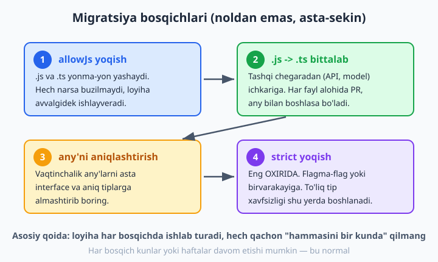
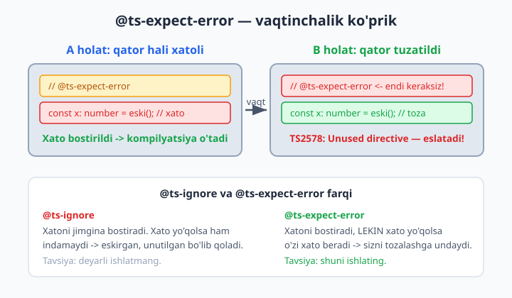
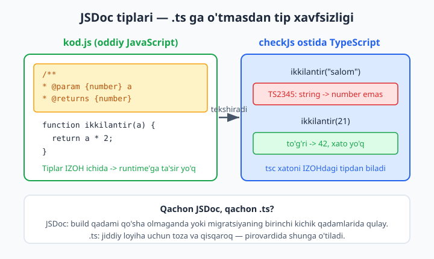

# 23 — Migratsiya: JS'dan TypeScript'ga

[⬅️ Oldingi: 22 — React va Node bilan TypeScript](./22-react-node.md) · [🏠 README](./README.md) · [Keyingi: 24 — Yakuniy loyiha, best practices va shpargalka ➡️](./24-yakuniy-loyiha.md)

> **Bu bobda:** mavjud, ishlab turgan katta JavaScript loyihasini noldan yozmasdan, asta-sekin TypeScript'ga ko'chirishni o'rganamiz: `allowJs` va `checkJs` bilan `.js` va `.ts`ni yonma-yon yashatish, fayllarni bittalab `.ts`ga o'tkazish, `any` bilan tez boshlab keyin aniqlashtirish, `@ts-expect-error` (vaqtinchalik xato bostiruvchi ko'prik) va `@ts-ignore` farqi, `.ts`ga umuman o'tmasdan JSDoc izohlari bilan tip berish, tip yo'q tashqi kutubxonalarni shim qilish, `strict`ni nega eng OXIRIDA yoqish kerakligi va butun migratsiya rejasini bosqichma-bosqich tuzib chiqishni ko'rib chiqamiz.

---

## Muammo

Tasavvur qiling: kompaniyangizda 3 yildan beri yozilib kelayotgan katta JavaScript loyihasi bor — 400 ta `.js` fayl, har kuni ishlatiladi, mijozlar pul to'laydi. Jamoa "TypeScript'ga o'tamiz" deb qaror qildi. Lekin qanday?

Eng yomon yo'l — "dam olish kunlari hamma faylni `.ts`ga aylantirib chiqaman" deyish. Dushanba kuni 8000 ta tip xatosi, ishlamaydigan loyiha va orqaga qaytib bo'lmaydigan ulkan pull request bilan uyg'onasiz. Hech kim uni ko'rib chiqolmaydi, hech narsa ishlamaydi, hamma TypeScript'dan nafratlanadi.

Yaxshi xabar: TypeScript aynan shu vaziyat uchun yaratilgan. Uni **bir kunda emas, bir fayl-bir fayldan** kiritish mumkin. Loyiha har bosqichda ishlab turadi. Bugun 5 ta fayl `.ts`, ertaga 10 ta, qolgan 390 tasi hali `.js` — va hammasi birga ishlab ketaveradi. Bu bobda aynan shu yo'lni o'rganamiz.

> Eslatma: bu bob siz `tsconfig.json`ni ([18-bob](./18-tsconfig.md)), `any`/`unknown`ni ([9-bob](./09-any-unknown-never.md)) va `strict` oilasini bilasiz deb hisoblaydi. Agar JavaScript modullari (`import`/`export`) yodingizdan ko'tarilgan bo'lsa, [JavaScript kitobi](../js/README.md)ga qarang. Bu yerda biz **ko'chirish jarayoniga** e'tibor beramiz.



## Oltin qoida: hech qachon hammasini birdan qilmang

Butun migratsiyaning asosida bitta tamoyil yotadi: **har qadamda loyiha ishlab turishi kerak.** TypeScript buni mumkin qiladi, chunki u JavaScript'ning ustki qatlami (superset) — har qanday to'g'ri `.js` kodi, aslida, to'g'ri TypeScript kodi hamdir. Demak fayllarni bittalab ko'chirsangiz, sinmaydi.

Strategiya to'rt bosqichdan iborat, har biri keyingisiga zamin tayyorlaydi:

1. **`allowJs` yoqish** — `.js` va `.ts` bitta loyihada yonma-yon yashasin.
2. **`.js` -> `.ts` bittalab** — tashqi chegaradan ichkariga qarab, har biri alohida kichik o'zgarish.
3. **`any`'ni aniqlashtirish** — vaqtinchalik `any`'larni real tiplarga almashtirish.
4. **`strict` yoqish** — eng OXIRIDA, to'liq tip xavfsizligi uchun.

Keling, har birini batafsil ko'rib chiqamiz.

## 1-bosqich: `allowJs` bilan aralash loyiha

TypeScript kompilyatori standart holda faqat `.ts` fayllarini ko'radi. Migratsiya boshlanishida bizga aksini xohlaymiz: u `.js` fayllarni ham "ko'rsin" va loyiha qurilsin. Buning kaliti — `tsconfig.json`'dagi `allowJs`:

```json
{
  "compilerOptions": {
    "target": "es2020",
    "module": "esnext",
    "moduleResolution": "bundler",
    "outDir": "dist",
    "allowJs": true,
    "strict": false
  },
  "include": ["src"]
}
```

📌 E'tibor bering: `strict` hozircha `false`. Bu ataylab. Migratsiyaning birinchi kunida `strict`ni yoqish — o'zingizni minglab xato bilan ko'mish demak. `strict`ni eng oxirida yoqamiz (4-bosqich). Hozir maqsad — quvurni ishga tushirish, qattiqqo'llik emas.

`allowJs: true` bilan `tsc` endi `src` ichidagi `.js` fayllarni ham oladi, ularni TypeScript orqali kompilyatsiya qiladi va `dist`ga chiqaradi. Loyihangiz xuddi avvalgidek ishlaydi — faqat endi build quvuringizda TypeScript turibdi.

💡 `tsc`ni `--noEmit` bilan ishga tushirsangiz, u hech narsa chiqarmaydi — faqat tekshiradi. Bu CI (continuous integration — avtomatik tekshiruv konveyeri) uchun ideal: build vositangiz (Vite, esbuild, webpack) kodni o'zi quradi, `tsc --noEmit` esa faqat tip qo'riqchisi rolini o'ynaydi.

### `checkJs` — `.js`ni ham tekshirishni so'rash

`allowJs` faqat `.js`ni **kiritadi**, lekin uni tekshirmaydi. Agar TypeScript `.js` fayllaringizdagi xatolarni ham aytib bersin desangiz, `checkJs`ni yoqasiz:

```json
{
  "compilerOptions": {
    "allowJs": true,
    "checkJs": true,
    "strict": false
  }
}
```

⚠️ Ammo ehtiyot bo'ling: butun loyihaga `checkJs: true` qo'yish — 400 ta tekshirilmagan `.js` faylda birdaniga yuzlab xato chiqarishi mumkin. Migratsiya boshida ko'pincha bu **juda erta**. Yaxshiroq yo'l — `checkJs`ni o'chiq qoldirib, faqat siz tayyor bo'lgan alohida fayllarga ularning birinchi qatoriga `// @ts-check` izohini qo'yish:

```js
// @ts-check
/** @param {number} n */
function ikkilantir(n) {
  return n * 2;
}

ikkilantir(10);
```

Bu faqat shu bitta `.js` faylni tekshiradi — qolganlariga tegmaydi. Teskari amal ham bor: `checkJs: true` umumiy yoqilgan bo'lsa, biror faylni vaqtincha tekshiruvdan chiqarish uchun uning boshiga `// @ts-nocheck` yozasiz.

## 2-bosqich: fayllarni bittalab `.ts`ga ko'chirish

Quvur ishlagach, asosiy ish boshlanadi: `.js`ni `.ts`ga aylantirish. Lekin tartibi muhim. **Tashqi chegaradan ichkariga** qarab harakatlaning:

- Avval **"barg" modullar** — hech narsaga bog'liq bo'lmagan, sof yordamchi funksiyalar (`utils`, `formatlash`, `validatsiya`). Ularni tiplash oson va xatosi kam.
- Keyin **ma'lumot modellari va API qatlamlari** — tashqi dunyo bilan chegara. Bu yerdagi tiplar eng ko'p foyda keltiradi.
- Eng oxirida **chuqur ichki, hammaga bog'liq** modullar.

Sababi sodda: agar barg modulni tiplab qo'ysangiz, undan foydalanadigan hamma fayl avtomatik foyda oladi. Aksincha, hammaga bog'liq markaziy faylni birinchi tiplasangiz, uning tiplari hali tiplanmagan modullarga tayanib turadi va `any`ga to'lib ketadi.

Bitta faylni ko'chirish — bu shunchaki:

1. `salom.js`ni `salom.ts` deb qayta nomlash.
2. `tsc --noEmit` ishga tushirib, chiqqan xatolarni o'qish.
3. Xatolarni tuzatish (yoki vaqtincha `any` bilan yopish — keyingi bo'limga qarang).
4. Kichik pull request — bitta fayl, ko'rib chiqish oson.

📌 Bir nechta `.js` modullar bir-biriga halqa shaklida bog'langan (sirkulyar bog'liqlik) bo'lsa, ularni bitta PRda birga ko'chirish kerak bo'lishi mumkin. Lekin bunday holatlar kam — ko'pchilik fayllar mustaqil ko'chiriladi.

## 3-bosqich: `any` bilan boshlab, keyin aniqlashtirish

Faylni `.ts` qilganingizda TypeScript darrov shikoyat qiladi: parametrlarning tipi yo'q, obyektlar tanish emas va hokazo. Mana eng ko'p uchraydigan xato — `noImplicitAny` (`strict` ichida bor, lekin alohida ham yoqiladi):

```ts
// .js dan .ts ga endi ko'chirdik:
function salom(ism) {
  //          ^^^^
  // ❌ Xato: Parameter 'ism' implicitly has an 'any' type. (TS7006)
  return "Salom, " + ism;
}
```

TypeScript "bu parametr tipini bilmayman" deyapti. Bu yerda ikki tanlovingiz bor.

**To'g'ri yo'l (mumkin bo'lsa):** tipni darrov aniq yozish.

```ts
function salom(ism: string): string {
  return "Salom, " + ism;
}

console.log(salom("Ali")); // ✅ toza o'tadi
```

**Tezkor yo'l (vaqt yo'q bo'lsa):** `any` bilan vaqtincha yopish, keyin qaytib aniqlashtirish.

```ts
// 1-bosqich: tezda any (migratsiya tezligi uchun)
function foydalanuvchiniOl(id: any): any {
  return { id, ism: "?" };
}

const u = foydalanuvchiniOl(5);
console.log(u.istalganNarsa); // any -> hamma narsaga ruxsat, tekshiruv yo'q
```

Bu kod **toza o'tadi**, chunki `any` hamma narsani qabul qiladi. Maqsad — faylni ishchi holatda `.ts`ga ko'chirib qo'yish. Keyin, vaqt topganda, qaytib `any`'ni real tipga almashtirasiz:

```ts
// 2-bosqich: aniqlashtirilgan
interface Foydalanuvchi {
  id: number;
  ism: string;
}

function foydalanuvchiniOl(id: number): Foydalanuvchi {
  return { id, ism: "?" };
}

const u = foydalanuvchiniOl(5);
console.log(u.ism.toUpperCase()); // ✅ endi ism aniq string
```

💡 `any`'larni keyin oson topish uchun ularga belgi qo'ying: `// TODO: any -> aniq tip`. Ko'p jamoalar `tsc`ga maxsus reja sifatida "loyihada nechta `any` qoldi" deb hisoblab boradi — son qancha kam bo'lsa, migratsiya shuncha chuqur.

📌 `any` "yuqumli": `any` qiymat tekkan har bir ifoda ham `any`ga aylanib, tip xavfsizligini jimgina o'chiradi (buni [9-bobda](./09-any-unknown-never.md) ko'rgandik). Shuning uchun `any` — vaqtinchalik plomba, doimiy yechim emas. Tashqi, ishonchsiz ma'lumot uchun `any` o'rniga ko'pincha `unknown` xavfsizroq: u sizni ishlatishdan oldin tekshirishga majbur qiladi.

## `@ts-expect-error` — vaqtinchalik xato ko'prigi

Ba'zan bitta qatorda xato bor, lekin uni hozir tuzatishga vaqtingiz yo'q (masalan, u boshqa hali ko'chirilmagan modulga tayanadi). Shu bitta qatorni vaqtincha "kechirtirib" turishingiz mumkin:

```ts
function eskiHisobla(): string {
  return "100";
}

// @ts-expect-error TODO: eskiHisobla() string qaytaradi, keyin to'g'rilaymiz
const summa: number = eskiHisobla();

console.log(summa);
```

Bu **toza o'tadi**, garchi `string`ni `number`ga berish odatda xato bo'lsa-da. `@ts-expect-error` keyingi qatordagi xatoni bostiradi.

Ammo `@ts-expect-error`ning sehri shunda: u **xato bo'lishini KUTADI**. Agar siz `eskiHisobla`ni keyin `number` qaytaradigan qilib tuzatsangiz, keyingi qatorda endi xato bo'lmaydi — va `@ts-expect-error` o'zi xato beradi:

```text
error TS2578: Unused '@ts-expect-error' directive.
```

Bu — sovg'a. TypeScript sizga "bu vaqtinchalik plomba endi keraksiz, uni olib tashla" deb eslatadi. Shu tarzda eski, unutilgan bostiruvchilar kodda chirib qolmaydi.



❌ Aksincha, eski `@ts-ignore` jimgina bostiradi va xato yo'qolsa ham indamaydi:

```ts
function eskiHisobla(): number {
  return 100;
}

// @ts-ignore   <- xato allaqachon yo'q, lekin @ts-ignore baribir jim turadi
const summa: number = eskiHisobla();
console.log(summa);
```

Bu kod ham o'tadi, lekin `@ts-ignore` endi keraksiz — va hech kim buni aytmaydi. Yillar o'tib bu izohlar kodda to'planib, "nega bu yerda?" degan jumboqqa aylanadi.

💡 Qoida: migratsiyada **doim `@ts-expect-error`ni** afzal ko'ring, `@ts-ignore`ni emas. Va har biriga sabab yozing: `// @ts-expect-error <sabab + TODO>`. Sababsiz bostiruvchi — kelajakdagi muammo.

## JSDoc bilan tip berish — `.ts`ga o'tmasdan

Ba'zan faylni `.ts`ga aylantirib bo'lmaydi: ehtimol build quvuringiz hali TypeScriptni qura olmaydi, yoki shu faylni darrov o'zgartirishga ruxsat yo'q. Bunday holatda ham TypeScriptning tekshiruvidan foydalanish mumkin — kodni `.js` holida qoldirib, **tiplarni izoh (JSDoc) sifatida** yozasiz.

`checkJs` (yoki fayl boshida `// @ts-check`) yoqilgan bo'lsa, TypeScript bu izohlardagi tiplarni o'qiydi va tekshiradi:

```js
/**
 * @param {number} a
 * @param {number} b
 * @returns {number}
 */
function qoshish(a, b) {
  return a + b;
}

/** @type {string} */
let ism = "Oqil";

qoshish(2, 3); // ✅ to'g'ri
ism = "Ali";   // ✅ string
```

Bu **oddiy JavaScript** — brauzer yoki Node uni hech qanday qadamsiz ishlatadi, chunki tiplar shunchaki izoh. Ammo `checkJs` ostida TypeScript ularni jiddiy qabul qiladi va xatoni ushlaydi:

```js
/**
 * @param {number} a
 * @param {number} b
 * @returns {number}
 */
function qoshish(a, b) {
  return a + b;
}

qoshish("ikki", 3);
//       ^^^^^^
// ❌ Xato: Argument of type 'string' is not assignable
//          to parameter of type 'number'. (TS2345)
```



Obyekt shakllarini ham JSDoc bilan e'lon qilish mumkin — `@typedef` orqali, xuddi `interface` kabi:

```js
/**
 * @typedef {Object} Kitob
 * @property {string} nomi
 * @property {number} yil
 */

/** @type {Kitob} */
const k = { nomi: "O'tkan kunlar", yil: 1925 };

/**
 * @param {Kitob} kitob
 * @returns {string}
 */
function tavsif(kitob) {
  return kitob.nomi + " (" + kitob.yil + ")";
}

console.log(tavsif(k)); // ✅ toza o'tadi
```

Agar `yil`ga noto'g'ri tip bersangiz, TypeScript ushlaydi:

```js
/** @type {Kitob} */
const k = { nomi: "O'tkan kunlar", yil: "1925" };
//                                      ^^^^^^
// ❌ Xato: Type 'string' is not assignable to type 'number'. (TS2322)
```

💡 JSDoc — migratsiyaning eng yumshoq qadami: hech bir faylni qayta nomlamasdan, build quvurini o'zgartirmasdan tip xavfsizligini sinab ko'rasiz. Lekin u so'zamol (verbose) — har tip uchun ko'p qator izoh kerak. Shuning uchun jiddiy loyihada pirovardida `.ts`ga o'tiladi; JSDoc esa o'tish davrida yoki `.ts`ga umuman o'ta olmaydigan fayllar uchun qoladi.

## Tashqi kutubxonalarda tip yo'q bo'lsa

Migratsiyaning eng tez-tez uchraydigan to'sig'i — `import qildim, lekin tip topilmadi` xatosi. Ko'p paket o'z tiplarini olib keladi, ba'zilarida tip `@types/...` paketida bo'ladi ([21-bob](./21-types-kutubxonalar.md)), lekin eski yoki kichik paketlarda umuman tip bo'lmasligi mumkin:

```text
error TS7016: Could not find a declaration file for module 'eski-paket'.
```

Bu yerda bir necha yo'l bor. Eng tezi — paket uchun mini deklaratsiya fayli yozish. Loyihada `types/eski-paket.d.ts` yarating va faqat o'zingizga kerak qismini e'lon qiling:

```ts
// types/eski-paket.d.ts
declare module "eski-paket" {
  export function pul(summa: number): string;
}
```

Endi `import { pul } from "eski-paket"` ishlaydi va `pul` aniq tipga ega bo'ladi. Butun paketni tiplash shart emas — faqat ishlatadigan funksiyangizni.

📌 Eng dangasa, eng xavfli yo'l — butun modulni `any` deb e'lon qilish:

```ts
// types/eski-paket.d.ts
declare module "eski-paket"; // hammasi any
```

Bu xatoni o'chiradi, lekin paketdan kelgan hamma narsa `any` bo'ladi — tip xavfsizligi yo'q. Vaqtinchalik plomba sifatida o'tadi, lekin imkon topib yuqoridagidek aniq imzo yozgan ma'qul.

💡 `tsconfig.json`'da `"skipLibCheck": true` ham foydali: u tashqi `.d.ts` fayllarning ichini tekshirmaydi, faqat sizning kodingizni tekshiradi. Migratsiyada bu ko'p begona xatoni kamaytiradi va build'ni tezlatadi.

## 4-bosqich: `strict`ni eng OXIRIDA yoqish

Hamma fayl `.ts` bo'lgach, `any`'lar kamaygach, oxirgi qadam — `strict`ni yoqish. Nega oxirida? Chunki `strict` bitta katta tugma emas — u bir nechta qattiqqo'l tekshiruvni yoqadi (`strictNullChecks`, `noImplicitAny`, `strictFunctionTypes` va boshqalar — [18-bobda](./18-tsconfig.md) ko'rgandik). Loyiha boshida buni yoqsangiz, hamma flag birdan minglab xato beradi.

Eng ko'p og'riq keltiradigani — `strictNullChecks`. U yoqilmaganda `null` jim turadi; yoqilgach esa har bir potensial `null`ni ushlashga majbur bo'lasiz:

```ts
function topUzunlik(matn: string | null): number {
  return matn.length;
  //     ^^^^
  // ❌ Xato: 'matn' is possibly 'null'. (TS18047)
}
```

Tuzatish — `null`ni ushlash:

```ts
function topUzunlik(matn: string | null): number {
  if (matn === null) return 0; // null'ni ushlab oldik
  return matn.length;          // ✅ endi matn aniq string
}

console.log(topUzunlik("salom")); // 5
console.log(topUzunlik(null));    // 0
```

Bunday joylar minglab bo'lsa, hammasini birdan tuzatib bo'lmaydi. Shuning uchun **flagma-flag** yondashuv afzal: `strict: true` deb birvarakayiga yoqish o'rniga, qattiqqo'l flaglarni bittalab yoqasiz va har birini alohida tuzatib chiqasiz:

```json
{
  "compilerOptions": {
    "noImplicitAny": true,
    "strictNullChecks": false,
    "strictFunctionTypes": false
  }
}
```

Avval `noImplicitAny`ni yoqib, hamma implicit `any`'ni tozalaysiz. Keyin alohida PRda `strictNullChecks: true`ga o'tasiz. Oxirida hammasini birga `"strict": true` bilan almashtirasiz — bu nuqtada loyiha allaqachon hamma tekshiruvdan o'tib bo'lgan bo'ladi.

💡 Har flagni yoqqaningizda `tsc --noEmit` xatolar sonini ko'rsatadi. Bu — yaxshi progress o'lchovi: xato 0 ga yetganda, flag tugadi, keyingisiga o'tasiz.

## Hamma narsani birga: migratsiya rejasi

Endi yuqoridagilarni bitta amaliy rejaga yig'amiz. Real loyihada migratsiya taxminan shunday kechadi:

```text
0. TAYYORGARLIK
   - tsconfig.json yaratish: allowJs: true, strict: false, noEmit: true
   - CI'ga `tsc --noEmit` qadamini qo'shish (build'ni buzmasdan, faqat ogohlantirish)

1. CHEGARANI TIPLASH
   - API javoblari, ma'lumot modellari uchun interface'lar yozish
   - Eng ko'p ishlatiladigan barg modullarni .ts ga ko'chirish
   - Tip yo'q paketlarga types/*.d.ts shim yozish

2. ICHKARIGA HARAKAT
   - Modullarni bittalab .ts ga ko'chirish (har biri alohida PR)
   - Qiyin joylarni vaqtincha any yoki @ts-expect-error bilan yopish
   - Har any/expect-error ga TODO va sabab yozish

3. ANY'NI KAMAYTIRISH
   - "loyihada nechta any qoldi" ni hisoblab borish
   - TODO'larni bittalab yopib, any -> aniq tip

4. STRICT'GA O'TISH
   - noImplicitAny yoqish, tozalash
   - strictNullChecks yoqish, tozalash
   - qolgan strict flaglar
   - oxirida "strict": true

5. CI'NI MAJBURIY QILISH
   - `tsc --noEmit` xatosi build'ni TO'XTATADIGAN qilish
   - shundan keyin yangi xato kira olmaydi
```

📌 5-qadam — eng muhimi. `tsc --noEmit` CI'da faqat **ogohlantirish** bo'lib turguncha, jamoa uni e'tiborsiz qoldiradi va yangi `any`'lar oqib kiraveradi. Migratsiya yetarlicha ilgarilagach, `tsc`ni **majburiy** qiling: tip xatosi bo'lsa, PR merge bo'lmasin. Shundagina TypeScript haqiqiy qo'riqchiga aylanadi.

💡 Migratsiya bir vaqtning o'zida **to'liq tugashi shart emas**. Ko'p muvaffaqiyatli loyihalar yillar davomida "90% TypeScript, 10% qolgan `.js`" holatida bemalol yashaydi. Muhimi — yangi kod doim `.ts`da yozilsin va `tsc` CI'da majburiy bo'lsin. Qolgani — vaqt masalasi.

---

Endi sizda mavjud JavaScript loyihasini sindirmasdan TypeScript'ga ko'chirishning to'liq xaritasi bor: `allowJs` bilan boshlash, fayllarni chegaradan ichkariga bittalab `.ts`ga ko'chirish, `any` va `@ts-expect-error` bilan vaqtincha yopib keyin aniqlashtirish, `.ts`ga o'ta olmaganda JSDoc'dan foydalanish, tip yo'q paketlarni shim qilish va `strict`ni eng oxirida, flagma-flag yoqish. Asosiy tamoyilni unutmang: **har qadamda loyiha ishlab tursin, hech qachon hammasini birdan qilmang.** Keyingi — yakuniy bobda hamma o'rganganlarimizni bitta to'liq loyihada birlashtirib, best practices va shpargalka bilan kitobni yakunlaymiz.

## 23-bob mashqlari

Quyidagi mashqlarni o'zingiz bajaring. Har birini `tsc` bilan tekshiring — toza misollar xatosiz o'tsin, ataylab xatolilar TypeScript ogohlantirishi bilan chiqsin. Mashqlar uchun ataylab tiplanmagan kichik `.js` loyihasi tuzib oling (2-3 fayl yetarli). (Yechimlar berilmagan — maqsad o'zingiz yozib o'rganish.)

1. Yangi papkada `tsconfig.json` yarating: `allowJs: true`, `strict: false`, `noEmit: true`. Ichiga bitta `salom.js` qo'yib, `tsc --noEmit` ishlaganini tekshiring (xato bo'lmasligi kerak).

2. `checkJs`ni umumiy yoqmasdan, faqat `salom.js`ning birinchi qatoriga `// @ts-check` qo'shing. Funksiya parametriga noto'g'ri tipdagi qiymat bering va `tsc` xato berishini ko'ring.

3. `salom.js`ni `salom.ts` deb qayta nomlang. `tsc --noEmit` ishga tushiring va chiqqan `implicitly has an 'any' type` (TS7006) xatosini o'qing.

4. Shu 3-mashqdagi parametrga aniq tip (`string`) yozib, xatoni yo'qoting va misol toza o'tishiga erishing.

5. Bitta funksiya yozing: parametri va qaytish tipi `any` bo'lsin. Uning ichida `param.istalganNarsa` ni chaqiring — `any` bo'lgani uchun xato bo'lmasligini ko'ring.

6. 5-mashqdagi `any`'ni aniq `interface`ga almashtiring. Endi `param.istalganNarsa` ga murojaat qilsangiz xato chiqishini ko'ring va to'g'ri xossaga o'ting.

7. `string` qaytaradigan funksiya yozing, natijasini `number` tipidagi o'zgaruvchiga bering. Chiqqan xatoni `@ts-expect-error` bilan bostiring va misol toza o'tishiga erishing.

8. 7-mashqdagi funksiyani `number` qaytaradigan qilib tuzating. Endi `@ts-expect-error` "Unused directive" (TS2578) xatosi berishini ko'ring va izohni olib tashlang.

9. Bir xil xatoli qatorni bir marta `@ts-ignore`, bir marta `@ts-expect-error` bilan yoping. Keyin xatoni tuzatib, ikkalasi qanday farqli javob berishini taqqoslang.

10. `.js` faylda JSDoc bilan tiplangan funksiya yozing: `@param {number}` va `@returns {number}`. `// @ts-check` bilan tekshiring — noto'g'ri argument bersangiz xato chiqishini ko'ring.

11. JSDoc `@typedef` bilan obyekt tipini (`{ nomi: string, yil: number }`) e'lon qiling va undan `@type` orqali foydalaning. `yil`ga string bersangiz xato chiqishini ko'ring.

12. JSDoc bilan tiplangan `.js` faylni `tsc`'siz oddiy Node yoki brauzerda ishga tushiring — tiplar izoh bo'lgani uchun kod o'zgarishsiz ishlashiga ishonch hosil qiling.

13. Tip yo'q soxta paket uchun `types/mojiza.d.ts` yarating: `declare module "mojiza"` ichida bitta funksiya imzosini e'lon qiling. Uni import qilib ishlatib ko'ring.

14. 13-mashqdagi shimga noto'g'ri argument bersangiz, deklaratsiyadagi tip uni ushlashini tekshiring.

15. Butun modulni `declare module "mojiza";` deb (imzosiz) e'lon qiling. Endi undan kelgan hamma narsa `any` bo'lishini va tekshiruv yo'qolishini kuzating — nega bu xavfli ekanini bir jumlada yozing.

16. `tsconfig.json`'da faqat `noImplicitAny: true` yoqing (qolgan strict flaglar `false`). Tiplanmagan parametrli funksiya yozib, faqat shu flag xato berishini ko'ring.

17. Endi `strictNullChecks: true` ham yoqing. `string | null` parametrli funksiyada `.length` chaqiring va `possibly 'null'` (TS18047) xatosini ko'ring, so'ng `if` bilan tuzating.

18. `strict: true` ga o'ting. Avvalgi misollaringiz hammasi toza o'tishini tekshiring — agar yangi xato chiqsa, qaysi flag sababini aniqlang.

19. Kichik (5-6 fayllik) soxta `.js` loyiha tasavvur qiling. Qaysi fayldan ko'chirishni boshlashingizni va tartibini (barg -> model -> markaziy) yozma rejaga tushiring. Har fayl uchun "any bilanmi yoki darrov aniq tip" qarorini belgilang.

20. O'z loyihangiz (yoki tasavvuriy loyiha) uchun to'liq migratsiya rejasini yozing: 0-5 bosqichlar, har bosqichda nima qilinishi, `tsc --noEmit` CI'da qachon ogohlantirishdan majburiyga o'tishi. Rejani `MIGRATION.md` shaklida hujjatlashtiring.
