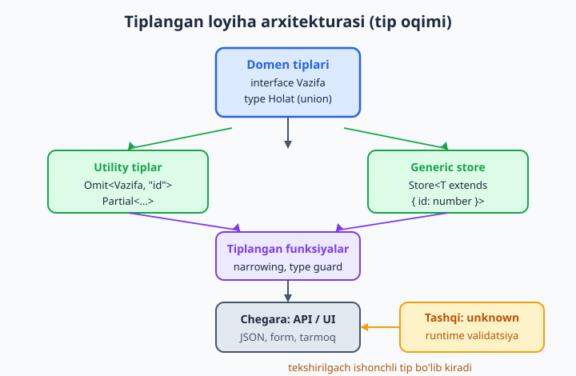
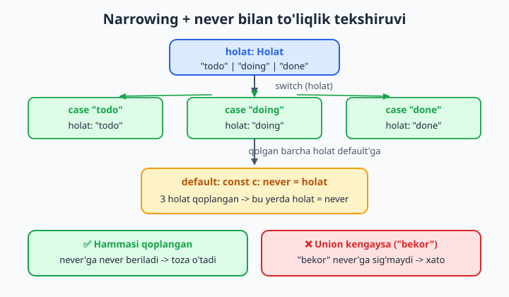
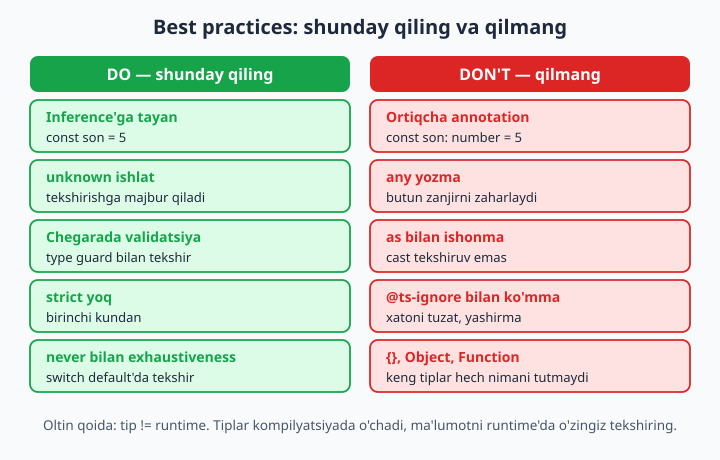
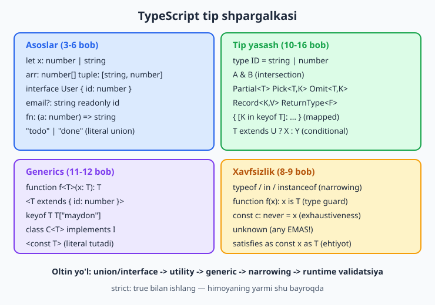

# 24 — Yakuniy loyiha, best practices va shpargalka

[⬅️ Oldingi: 23 — Migratsiya: JS'dan TypeScript'ga](./23-migratsiya-js-ts.md) · [🏠 README](./README.md)

> **Bu bobda:** kitob davomida o'rgangan hamma narsani bitta joyga yig'amiz. Noldan **to'liq tiplangan mini-loyiha** (vazifa-menejeri) quramiz: domen tiplari (interface/union) -> tiplangan funksiyalar -> generics -> utility types -> narrowing -> runtime validatsiya -> strict tsconfig. So'ng professional **best practices** (do/don't) — `any`'dan qochish, inference'ga tayanish, strict yoqish, tip != runtime. Oxirida keng **shpargalka** jadval va keyingi yo'l: type-level dasturlash, freymvork tiplari, Zod/tRPC.

---

## Muammo

Yigirma uch bob davomida har bir tushunchani alohida o'rgandik: tiplar, interface, union, narrowing, generics, utility types... Lekin haqiqiy loyihada ular **birga** ishlaydi. Yangi dasturchi ko'pincha shu yerda qiynaladi: "Bu yerda interface ishlataymi yoki type? Generic kerakmi? `any` yozsam bo'lmaydimi? API'dan kelgan ma'lumotni qanday tekshiraman?".

Bu bobda biz bitta **mukammal kichik loyiha** quramiz va shu savollarning hammasiga amalda javob beramiz. Loyihamiz — **vazifa-menejeri** (task manager): vazifa qo'shadi, yangilaydi, holat bo'yicha filtrlaydi va tashqaridan (API/JSON) kelgan ma'lumotni xavfsiz qabul qiladi. Har bir qadamda qaysi TS imkoniyatini va **nega** ishlatayotganimizni aytamiz.



Diagrammadagi oqim oddiy: **domen tiplari** (markaziy haqiqat) -> **tiplangan funksiyalar va store** -> **chegara** (API/UI), bu yerda tashqi `unknown` ma'lumot runtime validatsiyadan o'tib, ichkariga ishonchli tip bo'lib kiradi. Endi shu oqimni qadam-qadam quramiz.

## 1-qadam: Domen tiplari (interface va union)

Har qanday tiplangan loyiha **domen** (sohaning asosiy tushunchalari) tiplaridan boshlanadi. Avval "bizning dunyomizda nima bor?" degan savolga javob beramiz. Vazifa-menejerda asosiy tushuncha — **vazifa**.

Bir nechta qiymatdan birini oladigan maydonlar uchun **union literal** ishlatamiz (7-bob), butun obyekt shakli uchun **interface** (5-bob):

```ts
// Cheklangan tanlovlar -> union literal (enum'dan ko'ra yengilroq)
type Holat = "todo" | "doing" | "done";
type Muhimlik = "past" | "ortacha" | "yuqori";

// Obyekt shakli -> interface
interface Vazifa {
  id: number;
  matn: string;
  holat: Holat;
  muhimlik: Muhimlik;
  yaratilgan: Date;
}
```

📌 **Nega `Holat` uchun union, `Vazifa` uchun interface?** Qoida sodda: cheklangan **qiymatlar to'plami** uchun union literal (`"todo" | "doing" | "done"`), **obyekt strukturasi** uchun interface. Union literal `enum`'dan afzal — qo'shimcha runtime kod chiqarmaydi va oddiy string bo'lib qoladi (4- va 7-boblarni eslang).

💡 `id` va `yaratilgan` — bularni foydalanuvchi emas, **tizim** beradi. Buni tipda ifodalashni 2-qadamda utility types bilan hal qilamiz.

## 2-qadam: Hosila tiplar (utility types)

Endi bizga `Vazifa`ning bir nechta "varianti" kerak. Yangi vazifa qo'shilganda `id` (tizim beradi) va `yaratilgan` (sana) hali yo'q. Yangilashda esa faqat **ba'zi** maydonlar keladi. Bularni qo'lda qayta yozmaymiz — 14-bobdagi utility types aynan shu uchun:

```ts
interface Vazifa {
  id: number;
  matn: string;
  holat: Holat;
  muhimlik: Muhimlik;
  yaratilgan: Date;
}

// Yangi vazifa kirituvchisi: id va sana'siz
type YangiVazifa = Omit<Vazifa, "id" | "yaratilgan">;

// Yangilash: yuqoridagilarning istalgan qismi
type VazifaYangilash = Partial<Omit<Vazifa, "id" | "yaratilgan">>;
```

✅ Bu — **bitta manba** (single source of truth) qoidasi. `Vazifa`ga yangi maydon qo'shsangiz (masalan `muddat: Date`), `YangiVazifa` va `VazifaYangilash` **avtomatik** yangilanadi. Hech qaerni qo'lda tuzatish shart emas — tiplar bir-biriga doim mos turadi.

📌 `Omit` va `Partial`ni **birga ulash** mumkin: `Partial<Omit<Vazifa, ...>>`. Utility type'lar — oddiy funksiya kabi: birining natijasini ikkinchisiga uzatasiz.

## 3-qadam: Generic store (generics + utility birga)

Endi ma'lumotni saqlaydigan joy kerak. Buni **generic** qilamiz (11-bob) — chunki ertaga vazifadan tashqari boshqa narsalarni ham (loyiha, foydalanuvchi) shu store bilan saqlashimiz mumkin. Yagona talab: saqlanadigan narsada `id` bo'lsin. Buni `extends` bilan **cheklaymiz** (generic constraint):

```ts
class Store<T extends { id: number }> {
  private elementlar: T[] = [];
  private keyingiId = 1;

  // id'siz qabul qilamiz, id'ni o'zimiz beramiz
  qoshish(yangi: Omit<T, "id">): T {
    const element = { ...yangi, id: this.keyingiId++ } as T;
    this.elementlar.push(element);
    return element;
  }

  hammasi(): readonly T[] {
    return this.elementlar;
  }

  topish(id: number): T | undefined {
    return this.elementlar.find((e) => e.id === id);
  }

  yangilash(id: number, ozgarish: Partial<Omit<T, "id">>): T | undefined {
    const element = this.topish(id);
    if (element === undefined) return undefined;
    Object.assign(element, ozgarish);
    return element;
  }

  ochirish(id: number): boolean {
    const oldin = this.elementlar.length;
    this.elementlar = this.elementlar.filter((e) => e.id !== id);
    return this.elementlar.length < oldin;
  }
}
```

E'tibor bering, qancha imkoniyat birga ishlayapti:

- **Generic** `T` — store har qanday `{ id: number }` bilan ishlaydi.
- **Constraint** `T extends { id: number }` — `topish`/`ochirish` ichida `e.id`ga murojaat qila olamiz, chunki TS T'da `id` borligini biladi.
- **Utility** `Omit<T, "id">` va `Partial<...>` — kirim tiplarini avtomatik hosila qiladi.
- **`readonly T[]`** — `hammasi()` qaytargan massivni tashqaridan o'zgartirib bo'lmaydi (himoyalangan).
- **`T | undefined`** — topilmaslik holatini tipga **majburan** kiritamiz, narrowing'ga majbur qiladi.

💡 `topish` `T | undefined` qaytaradi — bu bejiz emas. Chaqiruvchi `if (element === undefined)` bilan **tekshirishga majbur**. Strict rejimda bu xavfsizlikning asosi (8- va 9-boblar).

## 4-qadam: Maxsuslashtirilgan store (inheritance + domen mantiq)

`Store<T>` umumiy. Endi unga vazifaga xos qulayliklar qo'shamiz — `extends` bilan (13-bob):

```ts
class VazifaStore extends Store<Vazifa> {
  vazifaQoshish(kirim: YangiVazifa): Vazifa {
    return this.qoshish({ ...kirim, yaratilgan: new Date() });
  }

  holatBoyicha(holat: Holat): readonly Vazifa[] {
    return this.hammasi().filter((v) => v.holat === holat);
  }
}
```

`vazifaQoshish` — `YangiVazifa` (id va sana'siz) qabul qiladi, `yaratilgan`ni o'zi to'ldiradi va `Store`'ning `qoshish`iga uzatadi. `holatBoyicha` esa domenga xos filtr. Endi `VazifaStore` **to'liq tiplangan** — har bir metod kirimi va chiqimi aniq.

## 5-qadam: Narrowing va exhaustiveness (xavfsiz mantiq)

Holatni odam o'qiydigan matnga aylantiramiz. Bu yerda 8-bobdagi **narrowing** va `never` bilan **exhaustiveness** (to'liqlikni tekshirish) hiylasini qo'llaymiz:

```ts
function holatMatni(holat: Holat): string {
  switch (holat) {
    case "todo":
      return "Bajarilmagan";
    case "doing":
      return "Jarayonda";
    case "done":
      return "Tugallangan";
    default:
      // Bu yerga yetib kelinmasligi KERAK. holat = never bo'lishi shart.
      const tekshir: never = holat;
      return tekshir;
  }
}
```

Bu `default` shoxi — **xavfsizlik tarmog'i**. Ertaga `Holat`ga `"bekor"` qo'shsangiz, bu funksiyani tuzatishni unutsangiz, TypeScript darrov ogohlantiradi:

```text
// ❌ Xato (agar Holat'ga "bekor" qo'shilsa, holatMatni'ni esa yangilamasangiz):
Type '"bekor"' is not assignable to type 'never'.
```

✅ Mana shu — **compile-time himoya**: union kengaytirilsa, uni ishlatadigan **har bir** joy "to'liq qoplaganmi?" deb tekshiriladi. Bu generic, union va narrowing birgalikda beradigan eng kuchli kafolatlardan biri.



## 6-qadam: Chegara — runtime validatsiya (tip != runtime)

Eng muhim qadam. Loyihaning ichi to'liq tiplangan, lekin **tashqi dunyo** (API, JSON, foydalanuvchi kiritmasi) tipni bilmaydi. JSON'dan kelgan ma'lumot — bu `unknown`, sizning `Vazifa` tipingiz emas.

📌 **Eng muhim qoida butun kitobdan:** TypeScript tiplari **kompilyatsiyada o'chib ketadi** (1-bob). Runtime'da hech qanday tekshiruv qolmaydi. Demak tashqaridan kelgan ma'lumotni **o'zingiz** tekshirishingiz shart. `as` (cast) — bu tekshiruv emas, shunchaki "menga ishon" deyish:

```ts
interface Foydalanuvchi {
  id: number;
  ism: string;
}

const javob: unknown = JSON.parse('{"id":"emas-raqam"}');

// ❌ Yomon: cast hech narsani tekshirmaydi
const yomon = javob as Foydalanuvchi;
// yomon.id aslida "emas-raqam" (string), lekin TS uni number deb biladi -> yashirin bug
```

Bu kod **kompilyatsiyadan o'tadi**, lekin `yomon.id` aslida string. Bug runtime'gacha yashiringan qoladi. To'g'ri yo'l — **type guard** (9-bob) bilan haqiqatan tekshirish:

```ts
function foydalanuvchimi(x: unknown): x is Foydalanuvchi {
  return (
    typeof x === "object" &&
    x !== null &&
    typeof (x as Record<string, unknown>).id === "number" &&
    typeof (x as Record<string, unknown>).ism === "string"
  );
}

if (foydalanuvchimi(javob)) {
  console.log(javob.ism); // bu yerda javob HAQIQATAN Foydalanuvchi
} else {
  console.log("Yaroqsiz javob");
}
```

Loyihamizga ham shu qoidani qo'llaymiz — tashqi JSON'ni qabul qilishdan oldin tekshiramiz:

```ts
function holatmi(x: unknown): x is Holat {
  return x === "todo" || x === "doing" || x === "done";
}

function vazifaUchunValid(x: unknown): x is YangiVazifa {
  if (typeof x !== "object" || x === null) return false;
  const obj = x as Record<string, unknown>;
  return (
    typeof obj.matn === "string" &&
    holatmi(obj.holat) &&
    (obj.muhimlik === "past" ||
      obj.muhimlik === "ortacha" ||
      obj.muhimlik === "yuqori")
  );
}
```

💡 Bunday qo'lda yozilgan validatorlar kichik loyiha uchun yetarli. Katta loyihada esa **Zod** kabi kutubxona ishlatiladi — u tipni ham, runtime tekshiruvni ham **bitta** ta'rifdan beradi. Bu haqda bob oxirida.

## 7-qadam: Hammasini birga ishlatish

Endi to'liq oqim — vazifa qo'shamiz, yangilaymiz, filtrlaymiz va tashqi ma'lumotni xavfsiz qabul qilamiz:

```ts
const store = new VazifaStore();

const v1 = store.vazifaQoshish({
  matn: "TypeScript kitobini tugatish",
  holat: "doing",
  muhimlik: "yuqori",
});

store.yangilash(v1.id, { holat: "done" }); // VazifaYangilash: faqat holat
console.log(holatMatni(v1.holat));          // narrowing
console.log(store.holatBoyicha("done").length);

// Tashqaridan (API/JSON) kelgan ma'lumot:
const tashqi: unknown = JSON.parse(
  '{"matn":"API dan keldi","holat":"todo","muhimlik":"past"}'
);

if (vazifaUchunValid(tashqi)) {
  store.vazifaQoshish(tashqi); // xavfsiz: tip ham, runtime ham tekshirildi
} else {
  console.log("Yaroqsiz ma'lumot");
}
```

Bu kichik dastur ichida butun kitob bor: **union** (`Holat`), **interface** (`Vazifa`), **utility** (`Omit`, `Partial`), **generics** (`Store<T>`), **constraint** (`extends { id: number }`), **inheritance**, **narrowing**, **`never` exhaustiveness**, **`unknown` + type guard**. Va eng muhimi — hammasi **bitta domen tipidan** o'sib chiqdi.

## 8-qadam: strict tsconfig

Bularning hammasi faqat **strict** rejimda to'liq himoya beradi (18-bob). Loyihaning `tsconfig.json`'i shunday bo'lishi kerak:

```json
{
  "compilerOptions": {
    "target": "es2020",
    "module": "nodenext",
    "strict": true,
    "noUncheckedIndexedAccess": true,
    "noImplicitOverride": true,
    "noUnusedLocals": true,
    "noFallthroughCasesInSwitch": true,
    "outDir": "dist"
  },
  "include": ["src"]
}
```

📌 `strict: true` — bu bitta bayroq emas, balki bir nechtasining to'plami: `noImplicitAny`, `strictNullChecks`, `strictFunctionTypes` va boshqalar (18-bob). Yangi loyihada uni **birinchi kundan** yoqing — keyin yoqish ancha og'riqli.

💡 `noUncheckedIndexedAccess` — strict ichida emas, lekin juda foydali: `massiv[i]` natijasini `T | undefined` qiladi, ya'ni indeks bo'yicha o'qishni ham tekshirishga majbur qiladi. Jiddiy loyihalarda yoqib qo'ying.

## Best practices — do va don't

Endi loyiha tayyor. Professional TypeScript yozishning oltin qoidalari — ko'pini yuqorida amalda ko'rdik:



**✅ DO — shunday qiling:**

- **Inference'ga tayaning.** O'zgaruvchi va qaytuvchi qiymatlarga ortiqcha annotation yozmang — TS o'zi aniqlaydi (3-bob). `const son = 5` yetarli, `const son: number = 5` shovqin.
- **Parametrlarga annotation yozing.** Funksiya **parametrlari** uchun inference yo'q — ularni doim aniq tiplang.
- **`unknown` ishlating, `any` emas.** Noma'lum ma'lumot uchun `unknown` — u sizni tekshirishga majbur qiladi (9-bob).
- **Obyekt shakli uchun interface, qiymatlar to'plami uchun union.** Bu kitob bo'yi ishlatgan qoida.
- **Chegarada validatsiya qiling.** Tashqi ma'lumot (API/JSON/form) `unknown` bo'lib kiradi, type guard bilan tekshiriladi.
- **strict yoqing.** Birinchi kundan.
- **`never` bilan exhaustiveness.** Union'ni ishlatadigan `switch`larda `default: never` qo'ying.

**❌ DON'T — shunday qilmang:**

- **`any` yozmang.** `any` — tip tizimini o'chirish tugmasi; bitta `any` butun zanjirni "zaharlaydi" (9-bob).
- **`as` bilan haqiqatni yashirmang.** Cast tekshiruv emas; `as`ni faqat siz TS'dan ko'proq bilganingizda (masalan DOM elementi turi) ishlating, ma'lumotga ishonish uchun emas.
- **Ortiqcha annotation yozmang.** Inference yetganda annotation — keraksiz ish va xato manbai (manba va annotation farq qilib qolishi mumkin).
- **`Function`, `Object`, `{}` kabi keng tiplardan qoching.** Ular deyarli hech narsani tekshirmaydi.
- **`@ts-ignore` bilan xatoni ko'mmang.** Xato bor degani — kodda muammo bor degani. `@ts-expect-error` (sababi bilan) afzal, lekin eng yaxshisi — tuzatish.
- **Tip != runtime ekanini unutmang.** Tip o'chadi; ma'lumotni runtime'da o'zingiz tekshiring.

## TypeScript tip shpargalkasi

Kitobdagi hamma sintaksisni bitta jadvalga jamladik — kundalik ish uchun "qo'l ostida" tutiladigan ma'lumotnoma:



| Maqsad | Sintaksis | Bob |
|---|---|---|
| Asosiy tip | `let x: number`, `string`, `boolean` | 3 |
| Massiv | `number[]` yoki `Array<number>` | 4 |
| Tuple | `[string, number]` | 4 |
| Obyekt shakli | `interface User { id: number }` | 5 |
| Ixtiyoriy maydon | `email?: string` | 5 |
| Faqat o'qish maydon | `readonly id: number` | 5 |
| Funksiya tipi | `(a: number) => string` | 6 |
| Union | `string \| number` | 7 |
| Literal | `"todo" \| "done"` | 7 |
| Narrowing | `typeof x === "string"`, `in`, `instanceof` | 8 |
| Type guard | `function f(x): x is T` | 8 |
| Exhaustiveness | `const c: never = x` | 8 |
| Noma'lum | `unknown` (`any` emas!) | 9 |
| Type alias | `type ID = string \| number` | 10 |
| Intersection | `A & B` | 10 |
| Generic funksiya | `function f<T>(x: T): T` | 11 |
| Constraint | `<T extends { id: number }>` | 11 |
| `keyof` | `type K = keyof T` | 12 |
| Indexed access | `T["maydon"]` | 12 |
| Klass | `class C implements I {}` | 13 |
| Hammasini ixtiyoriy | `Partial<T>` | 14 |
| Maydon tanlash | `Pick<T, "a">`, `Omit<T, "b">` | 14 |
| Lug'at | `Record<K, V>` | 14 |
| Funksiya natijasi | `ReturnType<F>`, `Awaited<T>` | 14 |
| Mapped | `{ [K in keyof T]: ... }` | 15 |
| Conditional | `T extends U ? X : Y` | 15 |
| Template literal | `` `id_${number}` `` | 16 |
| Modul | `export` / `import` | 17 |
| Deklaratsiya | `declare`, `.d.ts` | 17 |
| Aniq tip + tekshir | `satisfies` | 24 |
| Literal tutish | `as const`, `<const T>` | 24 |
| Cast (ehtiyot!) | `x as T` | 24 |

📌 `satisfies` (zamonaviy TS) — qiymatni tipga **mosligini tekshiradi**, lekin uning **aniq (literal)** tipini saqlaydi:

```ts
type Rang = "qizil" | "yashil" | "kok";

const palitra = {
  xato: "qizil",
  muvaffaqiyat: "yashil",
} satisfies Record<string, Rang>;

const r: "qizil" = palitra.xato; // ✅ literal saqlangan, oddiy string emas
```

Agar `: Record<string, Rang>` deb yozsangiz, `palitra.xato` turi shunchaki `Rang` bo'lib, aniqligini yo'qotardi. `satisfies` — "tekshir, lekin aniqligini bermay qo'yma" degani.

## Keyingi yo'l — bu yer oxiri emas

Kitobni tugatdingiz, lekin TypeScript bundan ham chuqurroq. Mana keyingi bosqichlar:

- **Type-level dasturlash.** 15-bobdagi mapped va conditional type'lar bilan tip darajasida "hisoblash" mumkin (`infer`, rekursiv tiplar). Bu — TS'ning eng kuchli va eng murakkab qismi.
- **Zod va runtime validatsiya.** Yuqorida qo'lda yozgan type guard'lar o'rniga **Zod** ishlatiladi: bitta schema'dan ham tip, ham runtime tekshiruv hosil bo'ladi (`z.infer<typeof schema>`). Bu — "tip != runtime" muammosining sanoat darajasidagi yechimi.
- **tRPC.** Frontend va backend o'rtasida tiplarni **avtomatik** ulashtiradi — API'ga so'rov yozganda, javob tipi o'z-o'zidan to'g'ri keladi. Tiplangan to'liq-stack ishning cho'qqisi.
- **Freymvork tiplari.** React (22-bob), Next.js, Express/Fastify, Prisma (tiplangan ORM) — har biri TypeScript bilan eng yaxshi ishlaydi. Endi ularning tiplangan API'larini tushuna olasiz.
- **TypeScript manbalarini o'qish.** `lib.es*.d.ts` va mashhur kutubxonalarning `.d.ts` fayllarini o'qish — eng yaxshi o'qituvchi. Endi ularni o'qishga tayyorsiz.

💡 Eng muhimi: TypeScript'ni **kamroq, lekin to'g'ri** ishlatishni o'rganing. Maqsad — tiplar bilan kodni murakkablashtirish emas, balki xatolarni runtime'gacha **ushlab qolish** va kelajakdagi o'zingizga (va jamoaga) kodni hujjatlashtirib berish. Yaxshi tip — yaxshi izoh.

Tabriklaymiz — endi siz JavaScript'ni ham, TypeScript'ni ham biladigan dasturchisiz. Quyidagi mashqlar bilan bilimni mustahkamlang.

## 24-bob mashqlari

Quyidagi mashqlarni bajarib, butun kitob bo'yi o'rganganlaringizni amalda mustahkamlang. Yechim berilmagan — har birini o'zingiz tiplang va `tsc --strict` bilan tekshiring.

1. Yuqoridagi vazifa-menejerni noldan, yangi faylda o'zingiz qayta yozing: avval `Holat` va `Muhimlik` union'larini, so'ng `Vazifa` interface'ini ta'riflang.

2. `Vazifa`dan `Omit` bilan `YangiVazifa` va `Partial<Omit<...>>` bilan `VazifaYangilash` hosila tiplarini yarating. `Vazifa`ga `muddat: Date` maydoni qo'shing va ikkala hosila tip avtomatik yangilanganini kuzating.

3. `Store<T extends { id: number }>` generic klassini yozing: `qoshish`, `hammasi`, `topish`, `yangilash`, `ochirish` metodlari bilan. `topish` `T | undefined` qaytarsin.

4. `Store<Vazifa>`'dan `extends` qilib `VazifaStore` yarating va unga `holatBoyicha(holat: Holat)` metodini qo'shing.

5. `holatMatni(holat: Holat): string` funksiyasini `switch` bilan yozing va `default` shoxida `const tekshir: never = holat` qo'ying.

6. `Holat`ga `"bekor"` qiymatini qo'shing, lekin `holatMatni`ni **yangilamang**. Chiqqan `never` xatosini o'qing va izohlang. So'ng `holatMatni`ni tuzatib, xato yo'qolganini ko'ring.

7. `holatmi(x: unknown): x is Holat` type guard'ini yozing. Uni `if` ichida ishlatib, `unknown`'dan `Holat`'ga toraytirib ko'ring.

8. `vazifaUchunValid(x: unknown): x is YangiVazifa` validatorini yozing: barcha maydonlarni `typeof` bilan tekshiring va `holatmi`'dan foydalaning.

9. `JSON.parse('{"matn":"...","holat":"todo","muhimlik":"past"}')` natijasini `unknown`'ga oling va `vazifaUchunValid` orqali tekshirib, store'ga xavfsiz qo'shing.

10. Loyihangiz uchun strict `tsconfig.json` yozing: `strict: true`, `noUncheckedIndexedAccess`, `noFallthroughCasesInSwitch` bilan. Loyihani shu config bilan `tsc` qilib, toza o'tishiga erishing.

11. Eski JS uslubidagi `function ishla(data: any) { return data.id }` funksiyasini oling. `any`'ni `unknown`'ga almashtiring va chiqqan xatoni type guard bilan tuzating.

12. Bir obyektni `as Foydalanuvchi` bilan cast qiling, so'ng uning `id` maydoni aslida noto'g'ri turdaligini ko'rsating. Keyin type guard bilan to'g'ri yo'lni yozib, ikkalasini taqqoslang.

13. `Store<T>` ichida yangi `birinchisi(): T | undefined` metodini qo'shing. `noUncheckedIndexedAccess` yoqilganda `elementlar[0]` turi nima bo'lishini tekshiring.

14. `palitra` obyektini `satisfies Record<string, "qizil" | "yashil" | "kok">` bilan ta'riflang. So'ng uni `: Record<...>` annotation bilan yozib, maydon turlari qanday farq qilishini solishtiring.

15. `const` type parametrli generic `birinchi<const T extends readonly unknown[]>(t: T)` funksiyasini yozing. `birinchi(["a","b"])` natijasi turi `"a"` ekanini tekshiring.

16. `ReturnType` va `Awaited` ni birga ishlatib, `async function foydalanuvchiOl()` ning **qaytargan obyekti** tipini ajratib oling (`Awaited<ReturnType<typeof foydalanuvchiOl>>`).

17. `VazifaStore`'ga `statistika(): Record<Holat, number>` metodini qo'shing — har holatda nechta vazifa borligini hisoblasin. `Record` va union kalitlardan foydalaning.

18. Loyihangizda biron joyda `any` qoldirgan bo'lsangiz — uni `unknown` yoki aniq tipga almashtiring. `grep`/qidiruv bilan barcha `any`larni topib, har birini tuzating.

19. `keyof` va indexed access (12-bob) bilan `vazifaMaydoni<K extends keyof Vazifa>(v: Vazifa, k: K): Vazifa[K]` funksiyasini yozing — har qanday maydonni **to'g'ri tip** bilan qaytarsin.

20. Keyingi yo'lni rejalashtiring: Zod, tRPC, type-level dasturlash va o'zingiz tanlagan freymvork (React/Next/Node) tiplaridan qaysi birini birinchi o'rganishni xohlaysiz — sabab bilan bir abzas yozing. So'ng kichik bir mashq tanlang (masalan, shu vazifa-menejerni Zod bilan qayta yozish) va uni amalga oshiring.
