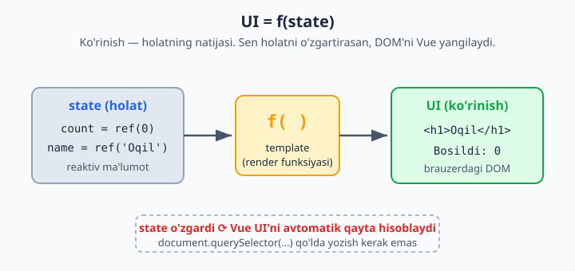
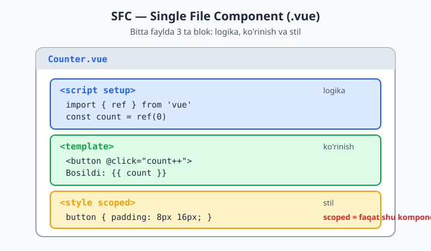
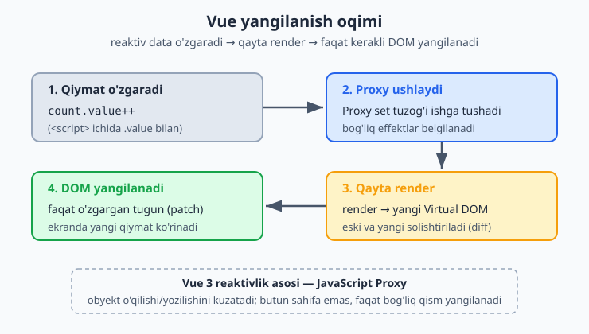

# 01 — Vue asoslari va Template Syntax

[🏠 README / Mundarija](./README.md) · [Keyingi: 02 — Reactivity ➡️](./02-reactivity.md)

---

## Vue nima va nega kerak?

Klassik yondashuvda (jQuery/vanilla JS) sen DOM'ni **qo'lda** o'zgartirasan: `document.querySelector(...).textContent = ...`. Ma'lumot ko'payganda bu kod chalkashadi, bug ko'payadi.

Vue **deklarativ**: sen "natija qanday ko'rinishi kerak"ligini aytasan, DOM'ni yangilashni Vue o'zi qiladi.

```
UI = f(state)
```

State (ma'lumot) o'zgardi → Vue kerakli DOM qismini avtomatik yangilaydi. Sen DOM'ga tegmaysan.

Quyidagi diagramma bu g'oyani ko'rsatadi: ko'rinish — holatning natijasi.



**Laravel analogiyasi:** Blade'da `{{ $user->name }}` yozasan, controller'dan kelgan data render bo'ladi — lekin Blade *bir marta* server'da render bo'lib tugaydi. Vue esa brauzerda *uzluksiz* ishlaydi: `name` o'zgarsa, sahifa qayta yuklanmasdan ekrandagi qiymat yangilanadi. Bu — reaktivlik.

---

## 1.1 Birinchi Vue ilovasi (CDN — tushunish uchun)

Build tool'siz, faqat tushunish uchun:

```html
<!DOCTYPE html>
<html>
<head>
  <script src="https://unpkg.com/vue@3/dist/vue.global.js"></script>
</head>
<body>
  <div id="app">
    <h1>{{ message }}</h1>
    <button @click="count++">Bosildi: {{ count }}</button>
  </div>

  <script>
    const { createApp, ref } = Vue

    createApp({
      setup() {
        const message = ref('Salom Vue!')
        const count = ref(0)
        return { message, count }   // template'ga ochiladi
      }
    }).mount('#app')
  </script>
</body>
</html>
```

Tushunchalar:
- `createApp(...)` — ilova instansiyasi (Laravel'da `$app` kabi root).
- `.mount('#app')` — ilovani DOM'dagi `#app` elementiga "ulaydi".
- `ref(0)` — **reaktiv** qiymat. `count.value` o'zgarsa, template yangilanadi.
- `{{ }}` — interpolation (Blade'dagi `{{ }}` bilan deyarli bir xil ko'rinish).
- `@click` — event listener (pastda batafsil).

> CDN faqat o'rganish uchun. **Real loyihada** Vite + SFC ishlatamiz.

---

## 1.2 Real setup: Vite + SFC

```bash
npm create vue@latest
# Project name: my-app
# TypeScript? — Yes (tavsiya, lekin xohlasang No)
# Router/Pinia/Vitest — keyin qo'shamiz, hozir No
cd my-app
npm install
npm run dev
```

### SFC (Single File Component) — `.vue` fayl

Bitta faylda 3 ta blok: **template**, **logika**, **stil**:

```vue
<script setup>
import { ref } from 'vue'

const message = ref('Salom Vue!')
const count = ref(0)
</script>

<template>
  <h1>{{ message }}</h1>
  <button @click="count++">Bosildi: {{ count }}</button>
</template>

<style scoped>
button { padding: 8px 16px; }
</style>
```

`<script setup>` — Composition API'ning eng qisqa ko'rinishi. `setup()` funksiya yozish, `return` qilish shart emas — top-level e'lon qilingan hamma narsa avtomatik template'ga ochiladi.

Bitta `.vue` faylda uchala blok qanday joylashishini quyida ko'rishingiz mumkin.



**`scoped`** — stil faqat shu komponentga ta'sir qiladi (CSS leak bo'lmaydi). Laravel'da component-level encapsulation kabi.

> Bundan keyin hamma misol **`<script setup>`** uslubida bo'ladi — bu zamonaviy standart.

---

## 1.3 Template syntax — Interpolation

```vue
<script setup>
import { ref } from 'vue'
const name = ref('Oqil')
const rawHtml = ref('<b>qalin</b>')
</script>

<template>
  <!-- Text -->
  <p>Ism: {{ name }}</p>

  <!-- JS ifoda ishlaydi (statement EMAS) -->
  <p>{{ name.toUpperCase() }}</p>
  <p>{{ name.length > 3 ? 'uzun' : 'qisqa' }}</p>

  <!-- Raw HTML — XSS xavfi! Faqat ishonchli data uchun -->
  <p v-html="rawHtml"></p>
</template>
```

Qoidalar:
- `{{ }}` ichida **ifoda (expression)** bo'ladi, **statement** emas. `{{ if (x) {...} }}` — XATO. `{{ x ? a : b }}` — to'g'ri.
- `v-html` — HTML'ni render qiladi, lekin **XSS xavfli**. Foydalanuvchi kiritgan datada hech qachon ishlatma.

---

## 1.4 Direktivalar (Directives)

Direktiva — `v-` bilan boshlanadigan maxsus atribut. DOM'ga reaktiv xulq beradi.

### `v-bind` — atributni bog'lash

```vue
<script setup>
import { ref } from 'vue'
const url = ref('https://ioqil.uz')
const isDisabled = ref(true)
const imgSrc = ref('/logo.png')
</script>

<template>
  <a v-bind:href="url">Link</a>

  <!-- Qisqartma: : -->
  <a :href="url">Link</a>
  
  <button :disabled="isDisabled">Tugma</button>

  <!-- Bir nechta atributni obyekt bilan -->
  <div v-bind="{ id: 'box', class: 'card' }"></div>
</template>
```

> `:href` — bu `v-bind:href` ning qisqartmasi. Real kodda doim qisqartma ishlatiladi.

### `v-if` / `v-else-if` / `v-else` — shartli render

```vue
<script setup>
import { ref } from 'vue'
const role = ref('admin')
</script>

<template>
  <div v-if="role === 'admin'">Admin panel</div>
  <div v-else-if="role === 'editor'">Editor panel</div>
  <div v-else>Mehmon</div>

  <!-- <template> — ko'rinmas o'rovchi (DOM'da ortiqcha element qoldirmaydi) -->
  <template v-if="role === 'admin'">
    <h2>Sarlavha</h2>
    <p>Bir nechta element, ortiqcha div'siz</p>
  </template>
</template>
```

### `v-show` — ko'rsatish/yashirish

```vue
<p v-show="isVisible">CSS display bilan yashiriladi</p>
```

**`v-if` vs `v-show` — muhim farq:**

| | `v-if` | `v-show` |
|---|---|---|
| Mexanizm | Elementni DOM'dan **o'chiradi/qo'shadi** | `display: none` qiladi (DOM'da qoladi) |
| Boshlang'ich xarajat | Past (false bo'lsa render qilinmaydi) | Yuqori (har doim render bo'ladi) |
| Toggle xarajati | Yuqori | Past |
| Qachon | Kamdan-kam o'zgaradigan shart | Tez-tez toggle bo'ladigan (masalan, dropdown) |

### `v-for` — ro'yxat render qilish

```vue
<script setup>
import { ref } from 'vue'
const users = ref([
  { id: 1, name: 'Ali' },
  { id: 2, name: 'Vali' },
])
const obj = ref({ a: 1, b: 2 })
</script>

<template>
  <!-- key DOIM kerak (unique, barqaror) -->
  <ul>
    <li v-for="user in users" :key="user.id">
      {{ user.name }}
    </li>
  </ul>

  <!-- index bilan -->
  <li v-for="(user, index) in users" :key="user.id">
    {{ index + 1 }}. {{ user.name }}
  </li>

  <!-- obyekt bo'yicha -->
  <li v-for="(value, key) in obj" :key="key">
    {{ key }}: {{ value }}
  </li>

  <!-- range -->
  <span v-for="n in 5" :key="n">{{ n }} </span>
</template>
```

**`:key` nega shart?** Vue ro'yxat o'zgarganda elementlarni qayta tartiblamasdan, faqat o'zgarganini yangilash uchun `key` orqali har bir elementni "taniydi". `key`siz yoki `key="index"` bilan — input fokus yo'qolishi, animatsiya xatosi kabi buglar chiqadi. **Doim barqaror, unique `key`** (odatda DB `id`) ber.

**Eslatma:** `v-if` va `v-for` ni **bir elementda** ishlatma — bu anti-pattern (priority chalkashadi). Buning o'rniga:

```vue
<!-- YOMON -->
<li v-for="u in users" v-if="u.active" :key="u.id">...</li>

<!-- YAXSHI: computed bilan filtrlash (02-modulda) -->
<li v-for="u in activeUsers" :key="u.id">...</li>
```

### `v-on` — event tinglash

```vue
<script setup>
import { ref } from 'vue'
const count = ref(0)

function handleClick(event) {
  console.log(event.target)
  count.value++
}
</script>

<template>
  <!-- To'liq shakl -->
  <button v-on:click="count++">+</button>

  <!-- Qisqartma: @ -->
  <button @click="count++">+</button>
  <button @click="handleClick">Method bilan</button>
  <button @click="handleClick($event)">Argument + event</button>

  <!-- Event modifiers -->
  <form @submit.prevent="onSubmit">...</form>      <!-- preventDefault() -->
  <div @click.stop="...">...</div>                  <!-- stopPropagation() -->
  <input @keyup.enter="onEnter">                    <!-- faqat Enter -->
  <div @click.self="...">...</div>                  <!-- faqat shu element -->
  <button @click.once="...">Bir marta</button>
</template>
```

Modifierlar — Vue'ning kuchli tomoni. `@submit.prevent` yozasan, `event.preventDefault()` ni qo'lda chaqirish shart emas.

---

## 1.5 Class va Style bog'lash

### Class

```vue
<script setup>
import { ref } from 'vue'
const isActive = ref(true)
const hasError = ref(false)
const activeClass = ref('text-green')
</script>

<template>
  <!-- Obyekt: kalit = class, qiymat = bool -->
  <div :class="{ active: isActive, 'text-red': hasError }"></div>

  <!-- Massiv -->
  <div :class="[activeClass, hasError ? 'border-red' : '']"></div>

  <!-- Obyekt + massiv aralash -->
  <div :class="[{ active: isActive }, 'always-here']"></div>

  <!-- Statik + dinamik birga (Vue ikkisini birlashtiradi) -->
  <div class="card" :class="{ active: isActive }"></div>
</template>
```

### Style

```vue
<template>
  <!-- camelCase yoki 'kebab-case' -->
  <div :style="{ color: 'red', fontSize: '16px' }"></div>
  <div :style="{ 'font-size': size + 'px' }"></div>

  <!-- Obyektlar massivi -->
  <div :style="[baseStyles, overrideStyles]"></div>
</template>
```

> Amalda TailwindCSS bilan ko'pincha `:class` ga shartli klass berasan: `:class="active ? 'bg-blue-500' : 'bg-gray-200'"`.

---

## 1.6 Reactivity'ga kichik kirish (to'lig'i — 02-modulda)

Template'da ishlash uchun shu yetarli:

```vue
<script setup>
import { ref } from 'vue'

const count = ref(0)   // <script>'da .value bilan ishlaysan

function increment() {
  count.value++        // MAJBURIY: .value
}
</script>

<template>
  {{ count }}          <!-- template'da .value KERAK EMAS, Vue ochadi -->
  <button @click="increment">+</button>
</template>
```

**Eng ko'p qilinadigan xato:** `<script>` ichida `.value` ni unutish.
```js
count++           // ❌ ishlamaydi (count — obyekt, son emas)
count.value++     // ✅
```

`count.value` o'zgargandan keyin nima sodir bo'lishini quyidagi oqim ko'rsatadi: Proxy o'zgarishni ushlaydi, komponent qayta render bo'ladi va faqat o'zgargan DOM qismi yangilanadi.



---

## Xulosa (tez takrorlash)

- `{{ }}` — interpolation (ifoda, statement emas)
- `v-bind` (`:`) — atribut bog'lash
- `v-if`/`v-show` — shartli ko'rinish (farqini bil)
- `v-for` — ro'yxat (`:key` doim shart)
- `v-on` (`@`) — event + modifierlar
- `:class`/`:style` — dinamik stil
- `ref()` — reaktiv qiymat, `<script>`'da `.value`

---

## 🎯 Masalalar (kamida 20 ta)

> Har birini **alohida komponent** sifatida yoz. Yulduzcha (★) — qiyinroq.

### Asosiy (1–10)

1. **Salom dunyo:** `name` ref'i bo'lsin, `<input>` ga yozilgan ismni `<h1>Salom, {{ name }}!</h1>` da ko'rsat. (Maslahat: keyingi modulda `v-model`, hozir `:value` + `@input` bilan qil.)

2. **Counter:** `+`, `-`, `Reset` tugmalari. Son manfiy bo'lib ketmasin (min 0).

3. **Toggle:** Bitta tugma matnni `Yoqilgan`/`O'chirilgan` ga almashtirsin va `:class` bilan rangi o'zgarsin.

4. **Light/Dark:** Tugma bosilganda `<div>` foni qora/oq bo'lsin (`:style` yoki `:class`).

5. **Ro'yxat render:** `['Olma','Anor','Uzum']` massivini `<ul>` da chiqar, har biriga tartib raqami qo'shib (`1. Olma`).

6. **Obyektlar ro'yxati:** `[{id,name,price}]` mahsulotlarni jadval (`<table>`) qilib chiqar.

7. **v-if mashqi:** `age` ref'i bo'lsin; `<18` → "Voyaga yetmagan", `18–60` → "Kattalar", `>60` → "Keksa".

8. **v-show vs v-if:** Bir xil kontentni ikkalasi bilan ko'rsat, DevTools Elements'da farqni kuzat va kodga izoh yoz: qaysi biri DOM'dan o'chadi.

9. **Conditional class:** Inputga matn yoz; uzunligi 8 dan kam bo'lsa border qizil, aks holda yashil.

10. **Event modifier:** Formada `@submit.prevent` ishlat; submit'da inputdagi matnni `console.log` qil va sahifa **qayta yuklanmasin**.

### O'rta (11–18)

11. **Filtrlanadigan ro'yxat (★):** Mahsulotlardan faqat `price > 100` bo'lganini ko'rsat. (`v-for` + `v-if` ni bir elementda EMAS — vaqtincha massivni `.filter()` bilan template'da yoki alohida o'zgaruvchida.)

12. **Tab tizimi:** 3 ta tab tugmasi. Tanlangan tabga `active` klass berilsin, pastida mos kontent (`v-if`/`v-show`) ko'rinsin.

13. **Accordion (★):** Bir nechta savol-javob. Bosilganda javob ochilsin/yopilsin. Bir vaqtda faqat bittasi ochiq bo'lsin.

14. **Rangli ro'yxat:** `v-for` da juft indeksli qatorlar kulrang, toq indekslilar oq bo'lsin (`:class` + `index % 2`).

15. **Keyboard:** Inputda `@keyup.enter` bo'lsa matnni ro'yxatga qo'shsin (to-do boshlanishi).

16. **Disabled tugma:** Input bo'sh bo'lsa "Qo'shish" tugmasi `:disabled` bo'lsin.

17. **Inline style slider:** Input range (0–100) qiymatiga qarab `<div>` kengligi `%` da o'zgarsin (progress bar).

18. **Dynamic attribute (★):** `:[attrName]="value"` (dynamic argument) ishlatib, tugma orqali `id` yoki `title` atributini almashtir.

### Loyiha darajasi (19–24)

19. **To-Do v0 (★):** Vazifa qo'shish, ro'yxatda ko'rsatish, har birini "bajarildi" (line-through klass) qilish, o'chirish. (`computed`/`v-model` siz, faqat shu modul vositalari bilan — keyin yaxshilaysan.)

20. **Mahsulot kartochkalari (★):** Mahsulotlar massivini grid kartochka qilib chiqar. Har kartochkada nom, narx, "Sotuvda yo'q" badge (agar `stock === 0`).

21. **Soddagina kalkulyator (★★):** Ikki input + amal tugmalari (+ − × ÷). Natijani ko'rsat. Nolga bo'lishni ushlab qol.

22. **FAQ qidiruv (★★):** FAQ ro'yxati + qidiruv input. Faqat matni qidiruvga mos keladiganlari ko'rinsin.

23. **Yulduzli reyting (★★):** 5 ta yulduz. Hover/click bilan reyting tanlash, tanlangani to'ldirilgan ko'rinsin.

24. **Mini galereya (★★):** Rasmlar massivi; biriga bossang katta ko'rinishda (preview) chiqsin, `active` rasm chegarasi ajralib tursin.

---

### ✅ Ba'zi yechimlar (o'zing urinib ko'rgach qara!)

<details markdown="1">
<summary>2-masala — Counter</summary>

```vue
<script setup>
import { ref } from 'vue'
const count = ref(0)
const inc = () => count.value++
const dec = () => { if (count.value > 0) count.value-- }
const reset = () => count.value = 0
</script>

<template>
  <p>Hisob: {{ count }}</p>
  <button @click="dec">-</button>
  <button @click="reset">Reset</button>
  <button @click="inc">+</button>
</template>
```
</details>

<details markdown="1">
<summary>13-masala — Accordion (bir vaqtda bitta ochiq)</summary>

```vue
<script setup>
import { ref } from 'vue'
const faqs = ref([
  { id: 1, q: 'Vue nima?', a: 'Progressive JS framework.' },
  { id: 2, q: 'Nuxt nima?', a: 'Vue uchun meta-framework.' },
])
const openId = ref(null)
function toggle(id) {
  openId.value = openId.value === id ? null : id
}
</script>

<template>
  <div v-for="f in faqs" :key="f.id">
    <button @click="toggle(f.id)">{{ f.q }}</button>
    <p v-show="openId === f.id">{{ f.a }}</p>
  </div>
</template>
```
</details>

<details markdown="1">
<summary>19-masala — To-Do v0</summary>

```vue
<script setup>
import { ref } from 'vue'
const text = ref('')
const todos = ref([])
let nextId = 1

function add() {
  const t = text.value.trim()
  if (!t) return
  todos.value.push({ id: nextId++, title: t, done: false })
  text.value = ''
}
function toggle(todo) { todo.done = !todo.done }
function remove(id) {
  todos.value = todos.value.filter(t => t.id !== id)
}
</script>

<template>
  <input :value="text" @input="text = $event.target.value" @keyup.enter="add" placeholder="Vazifa...">
  <button @click="add" :disabled="!text.trim()">Qo'shish</button>

  <ul>
    <li v-for="todo in todos" :key="todo.id">
      <span :class="{ done: todo.done }" @click="toggle(todo)">{{ todo.title }}</span>
      <button @click="remove(todo.id)">×</button>
    </li>
  </ul>
</template>

<style scoped>
.done { text-decoration: line-through; opacity: 0.5; cursor: pointer; }
</style>
```
</details>

➡️ Keyingi: [02 — Reactivity](./02-reactivity.md)
