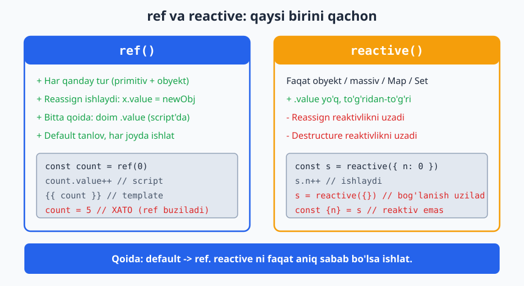
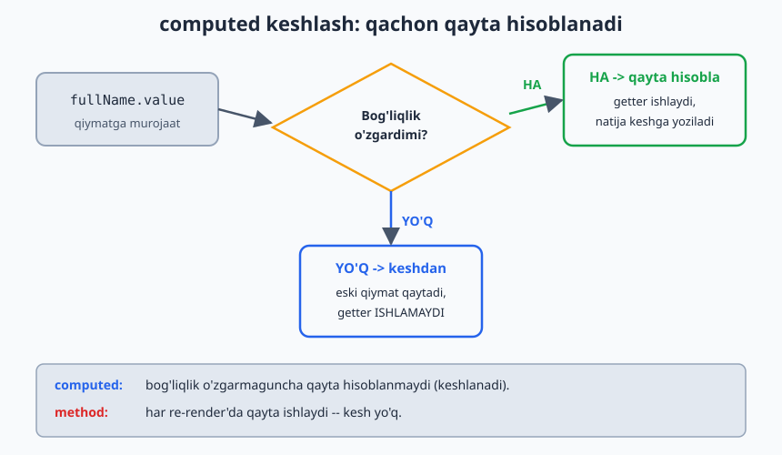
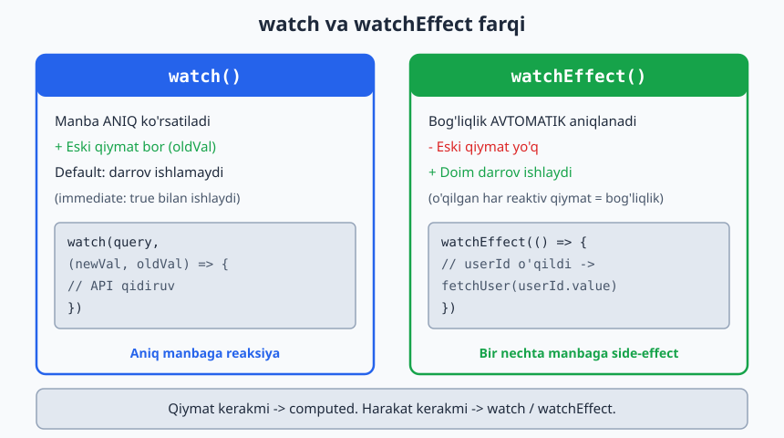
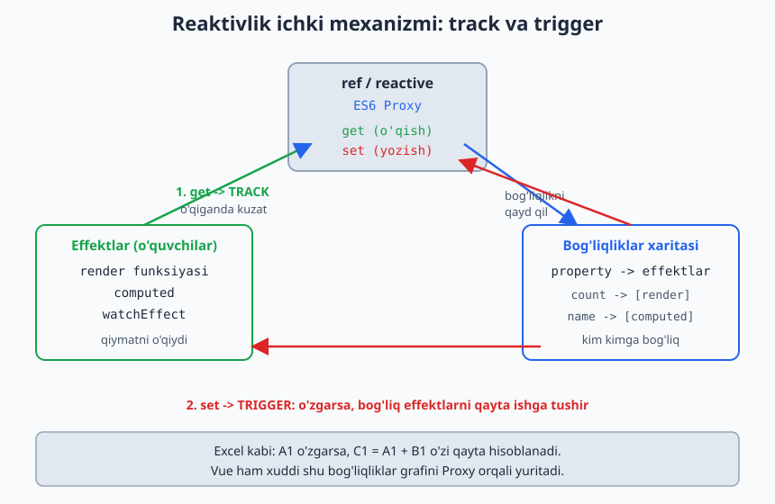

# 02 — Reactivity (Reaktivlik)

[⬅️ Oldingi: 01 — Vue asoslari](./01-vue-asoslari.md) · [🏠 README](./README.md) · [Keyingi: 03 — Komponentlar ➡️](./03-komponentlar.md)

---

Bu Vue'ning **yuragi**. Buni chuqur tushunsang, qolgan hammasi oson. Yuzaki tushunsang — "nega yangilanmayapti?" degan buglar bilan kurashasan.

## Reaktivlik nima?

> State o'zgarsa, unga **bog'liq** hamma narsa (UI, computed, watcher) avtomatik yangilanadi.

Excel analogiyasi: `C1 = A1 + B1`. `A1` ni o'zgartirsang, `C1` o'zi qayta hisoblanadi. Vue ham shunday "bog'liqliklar grafini" (dependency graph) yuritadi.

**Laravel analogiyasi:** Eloquent'da `$user->name` — oddiy property. O'zgartirsang hech narsa bo'lmaydi. Vue'da reaktiv qiymat — model observer'iga o'xshaydi: o'zgarish "kuzatiladi" va kerakli reaksiya (re-render) ishga tushadi.

---

## 2.1 `ref()` — birlamchi (primitiv) qiymatlar uchun

```js
import { ref } from 'vue'

const count = ref(0)
const name = ref('Oqil')
const user = ref({ id: 1, name: 'Ali' })   // obyekt ham bo'ladi

console.log(count.value)   // 0  — .value ORQALI o'qiladi
count.value++              // o'zgartirish ham .value bilan
count.value = 10
```

**Nega `.value`?** JavaScript'da primitivlar (`number`, `string`, `boolean`) **qiymat bo'yicha** uzatiladi — ularni "kuzatib" bo'lmaydi. Shu sabab Vue ularni `{ value: ... }` obyektga o'raydi. Obyektni esa Proxy bilan kuzatish mumkin.

- **Template'da** `.value` shart emas (Vue avtomatik ochadi/"unwrap" qiladi):
  ```vue
  <template>{{ count }}</template>  <!-- count.value emas -->
  ```
- **`<script>` ichida** `.value` doim kerak.

```js
// ❌ Eng ko'p uchraydigan xato
const total = ref(0)
total = total + 5          // ref obyektni son bilan almashtiryapsan — buziladi

// ✅
total.value = total.value + 5
```

---

## 2.2 `reactive()` — faqat obyekt/massiv uchun

```js
import { reactive } from 'vue'

const state = reactive({
  count: 0,
  user: { name: 'Ali' },
  todos: [],
})

state.count++              // .value YO'Q — to'g'ridan-to'g'ri
state.user.name = 'Vali'   // chuqur (deep) reaktiv
state.todos.push('x')
```

`reactive` — obyektni ES6 **Proxy** ga o'raydi. Property o'qilishi/yozilishi "tutib olinadi" (intercept) va kuzatiladi.

### `ref` vs `reactive` — qaysi birini ishlatish?

| | `ref` | `reactive` |
|---|---|---|
| Tur | Har qanday (primitiv ham, obyekt ham) | **Faqat** obyekt/massiv/Map/Set |
| Kirish | `.value` | To'g'ridan-to'g'ri |
| Almashtirish (reassign) | `x.value = newObj` ✅ | `state = newObj` ❌ reaktivlik yo'qoladi |
| Destructure | Reaktivlik yo'qoladi (`toRefs` kerak) | Reaktivlik yo'qoladi |

**Amaliy tavsiya:** **Hamma joyda `ref` ishlat.** Bitta qoidani (`.value`) yodda tutish, ikkita modelni aralashtirishdan oson. `reactive` ning cheklovlari ko'p:

```js
// reactive muammosi 1: reassign buziladi
let state = reactive({ count: 0 })
state = reactive({ count: 5 })   // eski kuzatuvchilar ulanib qoladi — bug

// reactive muammosi 2: destructure reaktivlikni uzadi
const { count } = reactive({ count: 0 })  // count endi oddiy son, reaktiv emas

// ref bilan bunday muammo yo'q:
const count = ref(0)
count.value = 5   // har doim ishlaydi
```

> Vue jamoasining ko'p a'zolari ham "default — `ref`" deydi. `reactive` ni faqat aniq sabab bo'lsa ishlat.

Quyidagi diagramma ikkalasini va qaysi birini qachon ishlatishni solishtiradi:



---

## 2.3 `computed()` — hosilaviy (derived) qiymat

State'dan **kelib chiqadigan** qiymatni hisoblaydi va **keshlaydi**.

```js
import { ref, computed } from 'vue'

const firstName = ref('Oqil')
const lastName = ref('Dev')

const fullName = computed(() => `${firstName.value} ${lastName.value}`)

console.log(fullName.value)   // "Oqil Dev"
firstName.value = 'Ali'
console.log(fullName.value)   // "Ali Dev" — avtomatik yangilandi
```

**Laravel analogiyasi:** `computed` = Eloquent **accessor** (`getFullNameAttribute`). Bog'liq atributlardan hosilaviy qiymat. Farqi — Vue'da u **keshlanadi**.

### Computed vs Method — MUHIM

```vue
<script setup>
import { ref, computed } from 'vue'
const list = ref([1, 2, 3, 4, 5])

// computed — keshlanadi
const evenComputed = computed(() => list.value.filter(n => n % 2 === 0))

// method — har render'da QAYTA ishlaydi
function evenMethod() { return list.value.filter(n => n % 2 === 0) }
</script>

<template>
  {{ evenComputed }}   <!-- bog'liqlik (list) o'zgarmaguncha qayta hisoblanMAYDI -->
  {{ evenMethod() }}   <!-- har re-render'da qayta ishlaydi -->
</template>
```

`computed` **bog'liqliklarini** (`list`) kuzatadi. Ular o'zgarmasa — keshdagi qiymatni qaytaradi, qayta hisoblamaydi. Og'ir hisob-kitoblar uchun bu katta tejamkorlik.

Quyidagi diagramma keshlash mantig'ini ko'rsatadi — qachon qayta hisoblanadi, qachon keshdan oladi:



### Writable computed (get/set)

```js
const fullName = computed({
  get: () => `${firstName.value} ${lastName.value}`,
  set: (val) => {
    [firstName.value, lastName.value] = val.split(' ')
  }
})
fullName.value = 'Yangi Ism'   // set ishga tushadi
```

### Computed qoidalari
- **Sof (pure) bo'lsin:** faqat hisoblab qaytarsin, side-effect (API chaqirish, state o'zgartirish) qilmasin.
- Argument qabul qilmaydi. Parametr kerak bo'lsa — `computed` funksiya qaytarsin yoki method ishlat.

---

## 2.4 `watch()` — o'zgarishga reaksiya (side-effect)

`computed` qiymat **qaytaradi**. `watch` esa o'zgarishga **harakat** qiladi (API, localStorage, log...).

```js
import { ref, watch } from 'vue'

const query = ref('')

watch(query, (newVal, oldVal) => {
  console.log(`${oldVal} → ${newVal}`)
  // masalan: API qidiruv
})

// Bir nechta manbani kuzatish
watch([firstName, lastName], ([newF, newL], [oldF, oldL]) => { ... })

// reactive obyekt property'sini kuzatish — getter funksiya bilan
watch(() => state.count, (newCount) => { ... })
```

### `watch` opsiyalari

```js
watch(source, callback, {
  immediate: true,   // komponent yuklanganda darrov bir marta ishga tushsin
  deep: true,        // obyekt ichidagi har qanday o'zgarishni kuzat (chuqur)
  once: true,        // faqat bir marta (Vue 3.4+)
})
```

**`deep` haqida:** `ref` ichidagi obyektning *ichki* property'si o'zgarsa, oddiy `watch` ko'rmasligi mumkin. Chuqur kuzatish kerak bo'lsa `deep: true`. Lekin u qimmat — katta obyektlarda ehtiyot bo'l. Ko'pincha aniq property'ni getter bilan kuzatish (`() => state.user.name`) yaxshiroq.

---

## 2.5 `watchEffect()` — bog'liqliklarni avtomatik aniqlaydi

`watch` da manbani aniq ko'rsatasan. `watchEffect` da esa — funksiya ichida ishlatilgan **hamma reaktiv qiymat** avtomatik bog'liqlikka aylanadi.

```js
import { ref, watchEffect } from 'vue'

const userId = ref(1)

watchEffect(() => {
  // userId ishlatilgani uchun u avtomatik kuzatiladi
  console.log(`User ${userId.value} ni yuklash...`)
  fetchUser(userId.value)
})
// Darrov bir marta ishlaydi (immediate kabi), keyin userId har o'zgarganda qayta
```

### `watch` vs `watchEffect`

| | `watch` | `watchEffect` |
|---|---|---|
| Bog'liqlik | Aniq ko'rsatiladi | Avtomatik aniqlanadi |
| Eski qiymat | Bor (`oldVal`) | Yo'q |
| Boshlang'ich ishga tushish | Default yo'q (`immediate` bilan) | Doim darrov ishlaydi |
| Qachon | Aniq manbaga reaksiya, eski qiymat kerak | Bir nechta manbaga bog'liq side-effect |

Quyidagi diagramma ikkalasining farqini yonma-yon ko'rsatadi:



### Cleanup (tozalash)

```js
watch(id, async (newId, oldId, onCleanup) => {
  const controller = new AbortController()
  onCleanup(() => controller.abort())   // oldingi so'rovni bekor qil (race condition)
  await fetch(`/api/x/${newId}`, { signal: controller.signal })
})
```

---

## 2.6 Reaktivlik ICHKI mexanizmi (nega ishlaydi)

Buni bilish — debugging'ni osonlashtiradi:

1. **Track (kuzatish):** Komponent render bo'lganda yoki `computed`/`watchEffect` ishlaganda, ular o'qigan har bir reaktiv property "bu effekt menga bog'liq" deb belgilanadi (Proxy `get` trap orqali).
2. **Trigger (qo'zg'atish):** Property o'zgarganda (Proxy `set` trap), Vue o'sha propertyga bog'liq hamma effektni qayta ishga tushiradi.

```
[reactive obyekt] --get--> kim o'qiyapti? --> bog'liqlikni qayd qil
                  --set--> o'zgardi! --> bog'liq effektlarni qayta ishga tushir
```

Quyidagi diagramma bu ichki mexanizmni (track va trigger) ko'rsatadi:



Bundan kelib chiqadigan **muhim cheklovlar**:

```js
// ❌ Yangi property qo'shish (reactive obyektda eski Vue'larda muammo edi, Vue 3 Proxy bunda yaxshi, lekin ref afzal)
// ❌ Destructure reaktivlikni uzadi:
const { count } = reactive({ count: 0 })   // count — oddiy son
// ✅ toRefs bilan saqlash:
import { toRefs } from 'vue'
const state = reactive({ count: 0, name: 'x' })
const { count, name } = toRefs(state)   // count.value, name.value — reaktiv qoladi
```

---

## 2.7 Foydali reactivity yordamchilari

```js
import { toRef, toRefs, unref, isRef, toRaw } from 'vue'

isRef(x)        // x ref'mi?
unref(x)        // ref bo'lsa .value, bo'lmasa o'zini qaytaradi (x?.value ?? x)
toRaw(proxy)    // Proxy'dan asl obyektni oladi (kuzatuvsiz)
toRef(obj,'k')  // obyekt property'sidan ref yasaydi (bog'lanish saqlanadi)
toRefs(obj)     // butun obyektni ref'lar obyektiga aylantiradi
```

Advanced (kerak bo'lganda):
- `shallowRef` — faqat `.value` almashishini kuzatadi, ichini emas (katta obyektlar uchun performance).
- `readonly` — o'zgartirib bo'lmaydigan reaktiv nusxa.
- `markRaw` — obyektni reaktiv qilmaslikni belgilaydi (masalan, 3rd-party class instansiyasi).

---

## Xulosa

- **`ref`** — default tanlov, hammasi uchun, `.value` (script'da)
- **`reactive`** — faqat obyekt, cheklovlari ko'p, ehtiyotkorlik bilan
- **`computed`** — hosilaviy + keshlangan qiymat (Eloquent accessor kabi)
- **`watch`** — aniq manbaga reaksiya, eski qiymat bor
- **`watchEffect`** — avtomatik bog'liqlik, doim darrov
- Reaktivlik = Proxy `get` (track) + `set` (trigger)
- Destructure reaktivlikni **uzadi** → `toRefs`

**Oltin qoida:** _Qiymat kerakmi → `computed`. Harakat kerakmi → `watch`._

---

## 🎯 Masalalar (kamida 22 ta)

### ref / reactive (1–6)

1. `price` (ref) va `qty` (ref) bo'lsin. `total` ni **computed** qilib chiqar (`price*qty`).
2. `reactive({ x:0, y:0 })` ob'yektini yarat, ikki tugma `x` va `y` ni oshirsin, ekranda ko'rsat.
3. Yuqoridagi reactive obyektni `const { x } = state` qilib destructure qil — nega yangilanmayapti? Tushuntir va `toRefs` bilan tuzat.
4. `ref` ichida obyekt: `const user = ref({ name:'', age:0 })`. Inputlardan name/age yangilansin (`.value.name`).
5. ❓ `count = ref(0); count = count + 1` nega xato? Kodga izoh yozib to'g'rila.
6. `reactive` massiv: `state.items` ga element qo'shish/o'chirish tugmalari (`push`, `filter`).

### computed (7–13)

7. **Full name:** `firstName`, `lastName` → `fullName` computed.
8. **Writable computed (★):** `fullName` get/set bilan; bitta inputga to'liq ism yozilsa, `firstName`/`lastName` ajralib saqlansin.
9. **Filtr:** Mahsulotlar massivi + `minPrice` (ref). `filtered` computed faqat `price >= minPrice` larni qaytarsin.
10. **Saralash (★):** Massivni `asc`/`desc` toggle qiluvchi tugma; `sorted` computed mos saralasin (asl massivni **mutatsiya qilmasdan** — `[...arr].sort()`).
11. **Statistika:** Sonlar massividan `sum`, `avg`, `max`, `min` ni 4 ta computed qilib chiqar.
12. **Computed vs method (★):** Bir xil og'ir hisob-kitobni computed va method qilib yoz, `console.log` qo'yib, qaysi biri kamroq chaqirilishini kuzat. Xulosani yoz.
13. **Savat (★):** `[{name,price,qty}]` savat. `subtotal` (har element), `grandTotal`, `itemCount` computed bo'lsin.

### watch / watchEffect (14–20)

14. **Logger:** `name` (ref) o'zgarsa, eski→yangi qiymatni `console.log` qil.
15. **localStorage sync (★):** `theme` ref'ini `watch` qilib `localStorage` ga saqla; sahifa ochilganda undan o'qib boshlang'ich qiymat qil.
16. **immediate:** `watch` ga `immediate:true` ber, komponent yuklanganda darrov ishlashini ko'rsat.
17. **deep (★):** `ref({user:{name}})`. Oddiy `watch` ichki o'zgarishni ko'rmasligini, `deep:true` ko'rishini namoyish qil.
18. **watchEffect:** `a`, `b` ref'lariga bog'liq `watchEffect`; ikkalasidan biri o'zgarsa qayta ishlasin. Keyin shuni `watch([a,b])` ga aylantir — farqni yoz.
19. **Debounced search (★★):** Qidiruv inputi. `watch` ichida `setTimeout` + `onCleanup` bilan oldingi timer'ni tozalab, 400ms kechikish bilan "qidiruv yuborildi" deb log qil.
20. **Race condition (★★):** `userId` (ref) o'zgarsa "API" (setTimeout bilan soxta) chaqir; `onCleanup` orqali eski so'rovni bekor qilib, faqat oxirgisi natija berishini ta'minla.

### Aralash loyiha (21–25)

21. **Konvertor (★):** Som ↔ Dollar. Bir inputga som yozsang dollar chiqsin va aksincha (2 ta writable computed yoki watch).
22. **Parol kuchi (★):** Parol inputi. `computed` bilan kuch darajasini hisobla (uzunlik, raqam, katta harf, belgi) va rangli indikator ko'rsat.
23. **To-Do v1 (★★):** 01-moduldagi To-Do'ni yaxshila: `activeCount`/`completedCount` computed, `filter` (all/active/done) computed, ro'yxatni `localStorage` ga `watch(deep)` bilan saqla.
24. **Forma validatsiya (★★):** Email + parol. Har biri uchun computed xato xabari (`isEmailValid`, `isPasswordValid`); `canSubmit` computed ikkalasi to'g'ri bo'lsagina `true`.
25. **Real-time filter+sort+search (★★★):** Mahsulotlar jadvali: qidiruv (matn), kategoriya filtri, narx bo'yicha saralash — uchalasi **bitta** `displayProducts` computed orqali zanjir bilan birlashsin.

---

### ✅ Tanlangan yechimlar

<details markdown="1">
<summary>8 — Writable computed</summary>

```vue
<script setup>
import { ref, computed } from 'vue'
const firstName = ref('Oqil')
const lastName = ref('Dev')

const fullName = computed({
  get: () => `${firstName.value} ${lastName.value}`,
  set: (val) => {
    const parts = val.trim().split(/\s+/)
    firstName.value = parts[0] ?? ''
    lastName.value = parts.slice(1).join(' ')
  },
})
</script>

<template>
  <input :value="fullName" @input="fullName = $event.target.value">
  <p>Ism: {{ firstName }} | Familiya: {{ lastName }}</p>
</template>
```
</details>

<details markdown="1">
<summary>19 — Debounced search</summary>

```vue
<script setup>
import { ref, watch } from 'vue'
const query = ref('')

watch(query, (val, _old, onCleanup) => {
  const timer = setTimeout(() => {
    console.log('Qidiruv yuborildi:', val)   // bu yerda API
  }, 400)
  onCleanup(() => clearTimeout(timer))        // tez yozilsa oldingisini bekor qil
})
</script>

<template>
  <input :value="query" @input="query = $event.target.value" placeholder="Qidiruv...">
</template>
```
</details>

<details markdown="1">
<summary>25 — Filter + sort + search zanjiri</summary>

```vue
<script setup>
import { ref, computed } from 'vue'
const products = ref([
  { id:1, name:'Laptop', cat:'tech', price:1200 },
  { id:2, name:'Olma', cat:'food', price:5 },
  { id:3, name:'Telefon', cat:'tech', price:800 },
])
const search = ref('')
const category = ref('all')
const sortDir = ref('asc')

const displayProducts = computed(() => {
  let list = products.value
  // 1) search
  if (search.value) {
    const q = search.value.toLowerCase()
    list = list.filter(p => p.name.toLowerCase().includes(q))
  }
  // 2) category
  if (category.value !== 'all') {
    list = list.filter(p => p.cat === category.value)
  }
  // 3) sort (nusxa olib — asl massivni buzmaymiz)
  return [...list].sort((a, b) =>
    sortDir.value === 'asc' ? a.price - b.price : b.price - a.price
  )
})
</script>

<template>
  <input :value="search" @input="search = $event.target.value" placeholder="Qidiruv...">
  <button @click="sortDir = sortDir === 'asc' ? 'desc' : 'asc'">
    Narx: {{ sortDir }}
  </button>
  <ul>
    <li v-for="p in displayProducts" :key="p.id">{{ p.name }} — ${{ p.price }}</li>
  </ul>
</template>
```
</details>

➡️ Keyingi: [03 — Komponentlar](./03-komponentlar.md)
