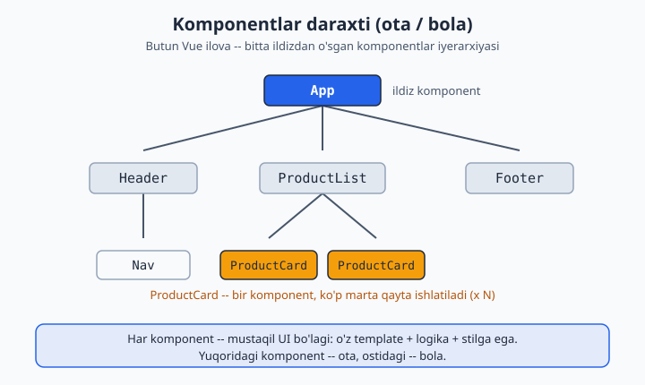
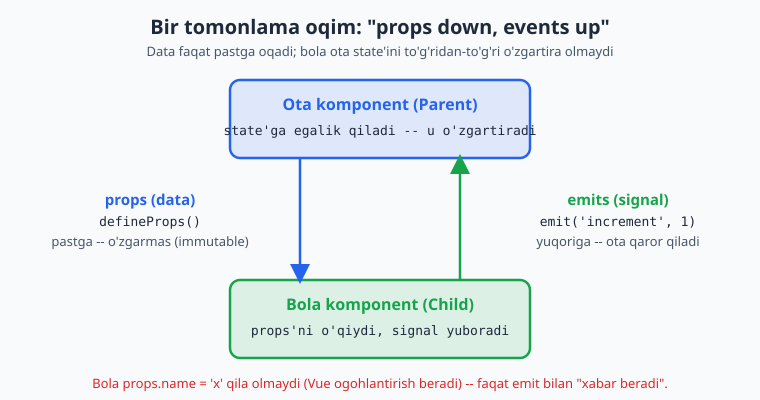
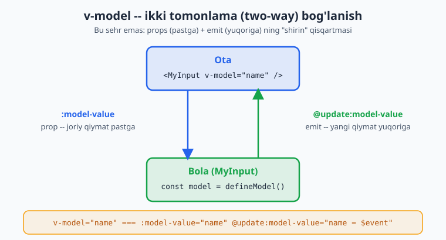
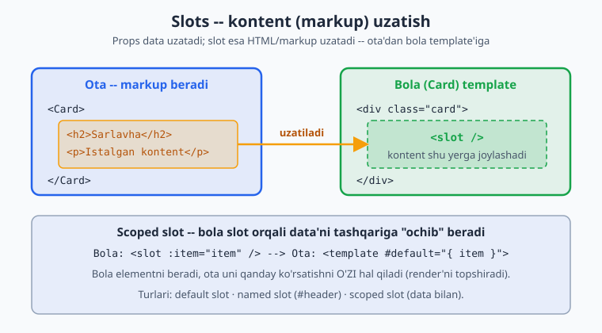

# 03 — Komponentlar

[⬅️ Oldingi: 02 — Reactivity](./02-reactivity.md) · [🏠 README](./README.md) · [Keyingi: 04 — Composition API ➡️](./04-composition-api.md)

---

Komponent — qayta ishlatiladigan, mustaqil UI bo'lagi (o'z template + logika + stilga ega). Butun Vue ilova — komponentlar **daraxti**.

**Laravel analogiyasi:** Blade component (`<x-card>`) yoki Livewire component. Lekin Vue komponenti brauzerda interaktiv yashaydi va o'z holatini (state) saqlaydi.

```
App
├── Header
│   └── Nav
├── ProductList
│   └── ProductCard (× N)
└── Footer
```

Quyidagi diagramma shu daraxtni vizual ko'rsatadi (ota yuqorida, bola ostida):



**Ma'lumot oqimi (data flow):** Vue'da **bir tomonlama** (one-way) — yuqoridan pastga:
- **Pastga:** ota → bola, **props** orqali.
- **Tepaga:** bola → ota, **events (emit)** orqali.

Bu "props down, events up" qoidasi. Bola props'ni **o'zgartira olmaydi** (faqat ota o'zgartiradi). Bu — taxmin qilinadigan (predictable) data flow uchun.

Quyidagi diagramma bu bir tomonlama oqimni ko'rsatadi: props pastga (data), emit yuqoriga (signal):



---

## 3.1 Komponentni ro'yxatdan o'tkazish va ishlatish

```vue
<!-- ChildCard.vue -->
<script setup>
</script>
<template>
  <div class="card">Men bolaman</div>
</template>
```

```vue
<!-- Parent.vue -->
<script setup>
import ChildCard from './ChildCard.vue'   // import — bas, registratsiya avtomatik
</script>

<template>
  <ChildCard />
  <ChildCard />   <!-- qayta ishlatish -->
</template>
```

> `<script setup>` da import qilingan komponent darrov template'da ishlatishga tayyor. Alohida `components: {}` e'lon qilish shart emas.

---

## 3.2 Props — ota'dan bola'ga data

```vue
<!-- UserCard.vue -->
<script setup>
// defineProps — kompilyator makrosi (import qilish shart emas)
const props = defineProps({
  name: { type: String, required: true },
  age: { type: Number, default: 0 },
  isActive: { type: Boolean, default: false },
  roles: { type: Array, default: () => [] },     // obyekt/massiv default — funksiya orqali!
  user: { type: Object, default: () => ({}) },
})

// props.name, props.age — script'da shunday ishlatasan
console.log(props.name)
</script>

<template>
  <div :class="{ active: isActive }">
    {{ name }}, {{ age }} yosh
  </div>
</template>
```

```vue
<!-- Parent -->
<UserCard name="Oqil" :age="25" :is-active="true" :roles="['admin']" />
```

**Diqqat:**
- Statik string: `name="Oqil"` (tirnoqsiz `v-bind`).
- Son/bool/massiv/obyekt: **`:` (v-bind) shart** — `:age="25"`, aks holda `"25"` string bo'lib ketadi.
- Template'da `camelCase` prop → HTML'da `kebab-case`: `isActive` → `:is-active`.
- **Obyekt/massiv default qiymati funksiya orqali** beriladi (`default: () => []`), aks holda barcha instansiyalar bitta obyektni baham ko'radi.

### TypeScript bilan props (zamonaviy, tavsiya)

```vue
<script setup lang="ts">
interface Props {
  name: string
  age?: number
  roles?: string[]
}
const props = withDefaults(defineProps<Props>(), {
  age: 0,
  roles: () => [],
})
</script>
```

### Props o'zgarmas (immutable)!

```js
// ❌ props'ni mutatsiya qilish — Vue ogohlantirish beradi
props.name = 'Boshqa'

// ✅ Agar lokal o'zgartirish kerak bo'lsa — computed yoki lokal ref
const localName = ref(props.name)
const upper = computed(() => props.name.toUpperCase())
```

---

## 3.3 Emits — bola'dan ota'ga signal

```vue
<!-- Counter.vue -->
<script setup>
const props = defineProps({ modelValue: Number })
const emit = defineEmits(['increment', 'reset'])   // qaysi eventlarni chiqarishini e'lon qil

function add() {
  emit('increment', 1)        // event nomi + payload
}
</script>

<template>
  <button @click="add">+</button>
  <button @click="emit('reset')">Reset</button>
</template>
```

```vue
<!-- Parent -->
<script setup>
import { ref } from 'vue'
import Counter from './Counter.vue'
const total = ref(0)
</script>

<template>
  <Counter @increment="total += $event" @reset="total = 0" />
  <p>{{ total }}</p>
</template>
```

### TS bilan emits (type-safe)

```ts
const emit = defineEmits<{
  increment: [amount: number]
  reset: []
}>()
```

**Nega emit?** Bola ota'ning state'ini to'g'ridan-to'g'ri o'zgartira olmaydi. U faqat "menda biror narsa bo'ldi" deb **xabar beradi**, ota qaror qabul qiladi. Bu — DDD'dagi domain event'ga o'xshaydi: agregat o'zgarishni e'lon qiladi, listener reaksiya qiladi.

---

## 3.4 `v-model` komponentlarda (two-way binding)

`v-model` — props + emit ning "shirin" qisqartmasi. Form komponentlari uchun ideal.

### Vue 3.4+ (`defineModel` — zamonaviy, eng oson)

```vue
<!-- MyInput.vue -->
<script setup>
const model = defineModel()   // ref kabi ishlaydi, o'qish/yozish two-way
</script>

<template>
  <input :value="model" @input="model = $event.target.value">
</template>
```

```vue
<!-- Parent -->
<script setup>
import { ref } from 'vue'
import MyInput from './MyInput.vue'
const name = ref('')
</script>

<template>
  <MyInput v-model="name" />
  <p>{{ name }}</p>
</template>
```

`v-model="name"` ichki tomondan `:model-value="name" @update:model-value="name = $event"` ga teng. `defineModel()` shu mexanizmni avtomatik o'raydi.

Quyidagi diagramma `v-model` ning ikki tomonlama mexanizmini (prop pastga + emit yuqoriga) ochib beradi:



### Bir nechta v-model (named)

```vue
<!-- Parent -->
<UserForm v-model:first-name="first" v-model:last-name="last" />
```
```vue
<!-- UserForm.vue -->
<script setup>
const firstName = defineModel('firstName')
const lastName = defineModel('lastName')
</script>
```

### Native input'da v-model (asoslar)

```vue
<input v-model="text">                  <!-- text input -->
<input type="checkbox" v-model="agree">  <!-- boolean -->
<input type="checkbox" v-model="picks" value="a">  <!-- massivga to'planadi -->
<select v-model="country">...</select>
<textarea v-model="bio"></textarea>

<!-- modifierlar -->
<input v-model.trim="name">       <!-- bo'shliqni kesadi -->
<input v-model.number="age">      <!-- songa aylantiradi -->
<input v-model.lazy="x">          <!-- change'da (input emas) yangilanadi -->
```

---

## 3.5 Slots — kontent uzatish

Props — *data* uzatadi. Slot — *markup/HTML* uzatadi. Komponentni "o'rovchi" (wrapper) qilib moslashuvchan qiladi.

Quyidagi diagramma ota bergan markup bola template'idagi `<slot>` teshigiga qanday joylashishini ko'rsatadi:



### Default slot

```vue
<!-- Card.vue -->
<template>
  <div class="card">
    <slot>Default kontent (hech narsa berilmasa)</slot>
  </div>
</template>
```
```vue
<!-- Parent -->
<Card>
  <h2>Sarlavha</h2>
  <p>Ichidagi istalgan markup</p>
</Card>
```

### Named slots (nomli)

```vue
<!-- Layout.vue -->
<template>
  <header><slot name="header" /></header>
  <main><slot /></main>            <!-- default -->
  <footer><slot name="footer" /></footer>
</template>
```
```vue
<!-- Parent -->
<Layout>
  <template #header><h1>Logo</h1></template>
  <p>Asosiy kontent (default slot)</p>
  <template #footer>© 2026</template>
</Layout>
```

`#header` — `v-slot:header` ning qisqartmasi.

### Scoped slots (bola → ota slot'ga data uzatadi)

Eng kuchli pattern. Ro'yxat/jadval kabi qayta ishlatiladigan komponentlarda render'ni iste'molchiga topshirish uchun:

```vue
<!-- List.vue -->
<script setup>
defineProps({ items: Array })
</script>
<template>
  <ul>
    <li v-for="item in items" :key="item.id">
      <slot :item="item" :index="item.id">{{ item.name }}</slot>
    </li>
  </ul>
</template>
```
```vue
<!-- Parent — render qanday bo'lishini O'ZI hal qiladi -->
<List :items="users">
  <template #default="{ item }">
    <strong>{{ item.name }}</strong> — {{ item.email }}
  </template>
</List>
```

**Laravel analogiyasi:** Blade slot (`{{ $slot }}`, `{{ $header }}`) bilan deyarli bir xil g'oya. Scoped slot esa — bola ichki ma'lumotni tashqariga "ochib" beradi, bu Blade'da yo'q kuchli imkoniyat.

---

## 3.6 `provide` / `inject` — chuqur uzatish (prop drilling'siz)

Ota → uzoq nabira'gacha props'ni har bosqichda uzatish charchatadi (**prop drilling**). `provide/inject` — daraxtning istalgan chuqurligiga to'g'ridan-to'g'ri yetkazadi.

```vue
<!-- Ota (yuqorida) -->
<script setup>
import { provide, ref } from 'vue'
const theme = ref('dark')
provide('theme', theme)              // kalit + qiymat (reaktiv ham bo'ladi)
provide('toggleTheme', () => {
  theme.value = theme.value === 'dark' ? 'light' : 'dark'
})
</script>
```
```vue
<!-- Uzoq nabira -->
<script setup>
import { inject } from 'vue'
const theme = inject('theme')                  // reaktiv qoladi
const toggle = inject('toggleTheme')
const x = inject('maybe', 'default-qiymat')     // bo'lmasa default
</script>
```

> `provide/inject` ni **lokal/feature-darajadagi** umumiy holat uchun ishlat (masalan, theme, form konteksti). **Global ilova holati** uchun esa **Pinia** (06-modul) yaxshiroq — u DevTools, type-safety, struktura beradi.

**Type-safe provide/inject (TS):**
```ts
import { InjectionKey } from 'vue'
const ThemeKey: InjectionKey<Ref<string>> = Symbol('theme')
provide(ThemeKey, theme)
const t = inject(ThemeKey)   // tipi to'g'ri aniqlanadi
```

---

## 3.7 Boshqa muhim narsalar (qisqacha)

```vue
<!-- Dynamic component -->
<component :is="currentTab" />        <!-- currentTab — komponent yoki nomi -->

<!-- KeepAlive — komponent holatini eslab qoladi (qayta yaratmaydi) -->
<KeepAlive><component :is="currentTab" /></KeepAlive>

<!-- Async component (lazy loading) -->
<script setup>
import { defineAsyncComponent } from 'vue'
const Heavy = defineAsyncComponent(() => import('./Heavy.vue'))
</script>

<!-- Fallthrough attributes -->
<!-- Ota <MyBtn class="x" @click="..."> bersa, MyBtn ichidagi root elementga avtomatik o'tadi -->
```

**Component naming:** Fayl/komponent nomi — `PascalCase` (`UserCard.vue`). Template'da ham `<UserCard>`. Bu native HTML teglardan ajratib turadi.

---

## Xulosa

- **Props** — ota→bola data (immutable, bola o'zgartirmaydi)
- **Emits** — bola→ota signal (`defineEmits`, payload bilan)
- **v-model** — props+emit qisqartmasi (`defineModel()`, 3.4+)
- **Slots** — markup uzatish (default / named / scoped)
- **provide/inject** — chuqur uzatish, prop drilling'siz (lokal scope uchun)
- Data flow: **props down, events up**

---

## 🎯 Masalalar (kamida 22 ta)

### Props (1–6)

1. `BaseButton` komponenti: `label` (string), `variant` ('primary'/'danger') props. `variant`ga qarab `:class` bilan rang berilsin.
2. `Avatar`: `src`, `alt`, `size` (number) props. `size` ga qarab inline `width/height`.
3. `Badge`: `count` (number) prop. `count > 99` bo'lsa `99+` ko'rsat.
4. `ProductCard` (★): `product` (obyekt) props — nom, narx, rasm. `defineProps` da obyekt default'ini to'g'ri ber (`() => ({})`).
5. ❓ Bolada `props.title = 'x'` qilsang nima bo'ladi? Sinab ko'r, console'dagi warning'ni o'qib, to'g'ri yondashuvni yoz.
6. TS bilan: `interface Props` orqali `UserCard` props'ini type qil, `withDefaults` ishlat.

### Emits (7–11)

7. `Counter` komponenti `@change` event chiqarsin (yangi qiymat bilan); ota qabul qilib ko'rsatsin.
8. `DeleteButton` (★): bosilganda `@confirm-delete` event'ini `id` bilan chiqarsin; ota ro'yxatdan o'chirsin.
9. `SearchBox`: input o'zgarganda `@search` event'ini matn bilan chiqarsin (debounce bo'lsa ★★).
10. `Rating` (★): yulduz bosilsa `@rate` event'ini `1..5` bilan chiqarsin.
11. TS bilan: yuqoridagi `Rating` emits'ini `defineEmits<{...}>()` orqali type-safe qil.

### v-model (12–16)

12. `TextField` (★): `defineModel()` bilan reusable input yarat; otada `v-model` bilan ulang.
13. `Toggle` (★): switch ko'rinishidagi boolean `v-model` komponenti (`defineModel()`).
14. `QuantityInput` (★): `−`/`+` tugmali son inputi; `v-model` bilan, min/max props bilan chegaralangan.
15. **Bir nechta v-model (★★):** `NameForm` komponenti `v-model:first` va `v-model:last` qabul qilsin.
16. `StarRating` ni `v-model` ga aylantir (12-emit o'rniga two-way).

### Slots (17–21)

17. `Card` (★): default slot + `#header`/`#footer` named slotlar bilan.
18. `Modal` (★★): `#title`, default (body), `#actions` slotlari; `isOpen` prop + `@close` emit bilan.
19. `Alert`: `type` prop (success/error/warning) + default slot (xabar matni).
20. **Scoped slot (★★):** `DataList` komponenti `items` props oladi, har element renderini scoped slot orqali otaga topshiradi.
21. **Scoped slot jadval (★★):** `DataTable` — `columns` va `rows` props; har katak renderini `#cell="{ row, column }"` scoped slot bilan moslashtir.

### provide/inject va kompozitsiya (22–26)

22. `provide/inject` (★): Ota `theme` (ref) bersin, uzoqdagi `ThemedButton` `inject` qilib rangini moslashtirsin; ota'dagi tugma theme'ni toggle qilsin.
23. **Prop drilling vs inject (★★):** Bir xil datani 3 qavat props bilan, keyin `provide/inject` bilan uzat — kod farqini taqqosla, izoh yoz.
24. **Dynamic component (★★):** 3 ta tab komponenti; `<component :is>` bilan almashtir; `<KeepAlive>` qo'shib, tab almashganda input qiymati saqlanishini ko'rsat.
25. **Composable + komponent (★★★):** `useToggle()` composable yoz (04-modul oldindan), `Modal` da ishlatib `isOpen` ni boshqar.
26. **Mini dizayn tizimi (★★★):** `BaseButton`, `BaseInput`, `BaseCard`, `BaseModal` — barchasi props/emits/slots bilan izchil API'ga ega bo'lsin. Bittagina demo sahifada hammasidan foydalan (EduCore UI kit boshlanishi 😉).

---

### ✅ Tanlangan yechimlar

<details markdown="1">
<summary>12 — TextField (defineModel)</summary>

```vue
<!-- TextField.vue -->
<script setup>
defineProps({ label: String, placeholder: String })
const model = defineModel()
</script>

<template>
  <label>
    {{ label }}
    <input :value="model" :placeholder="placeholder"
           @input="model = $event.target.value">
  </label>
</template>
```
```vue
<!-- Parent -->
<script setup>
import { ref } from 'vue'
import TextField from './TextField.vue'
const email = ref('')
</script>
<template>
  <TextField v-model="email" label="Email" placeholder="you@mail.uz" />
  <p>{{ email }}</p>
</template>
```
</details>

<details markdown="1">
<summary>20 — Scoped slot (DataList)</summary>

```vue
<!-- DataList.vue -->
<script setup>
defineProps({ items: { type: Array, default: () => [] } })
</script>
<template>
  <ul>
    <li v-for="(item, i) in items" :key="item.id ?? i">
      <slot :item="item" :index="i">{{ item }}</slot>
    </li>
  </ul>
</template>
```
```vue
<!-- Parent — render formatini O'ZI belgilaydi -->
<DataList :items="users">
  <template #default="{ item, index }">
    {{ index + 1 }}. <b>{{ item.name }}</b> ({{ item.email }})
  </template>
</DataList>
```
</details>

<details markdown="1">
<summary>22 — provide/inject theme</summary>

```vue
<!-- App.vue (ota) -->
<script setup>
import { provide, ref } from 'vue'
import ThemedButton from './ThemedButton.vue'
const theme = ref('dark')
provide('theme', theme)
</script>
<template>
  <button @click="theme = theme === 'dark' ? 'light' : 'dark'">Theme: {{ theme }}</button>
  <ThemedButton />   <!-- istalgancha chuqur bo'lsa ham ishlaydi -->
</template>
```
```vue
<!-- ThemedButton.vue (nabira) -->
<script setup>
import { inject, computed } from 'vue'
const theme = inject('theme', ref('light'))
const cls = computed(() => theme.value === 'dark' ? 'bg-black text-white' : 'bg-white text-black')
</script>
<template>
  <button :class="cls">Men theme'ga moslashaman</button>
</template>
```
</details>

➡️ Keyingi: [04 — Composition API & Composables](./04-composition-api.md)
