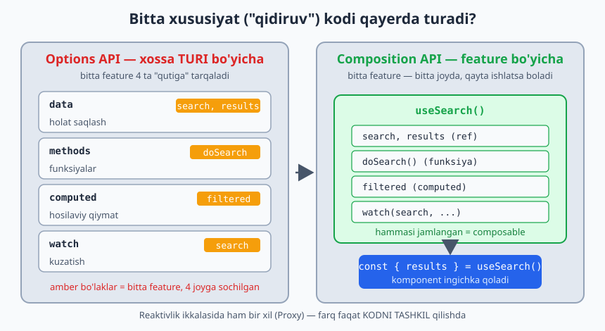
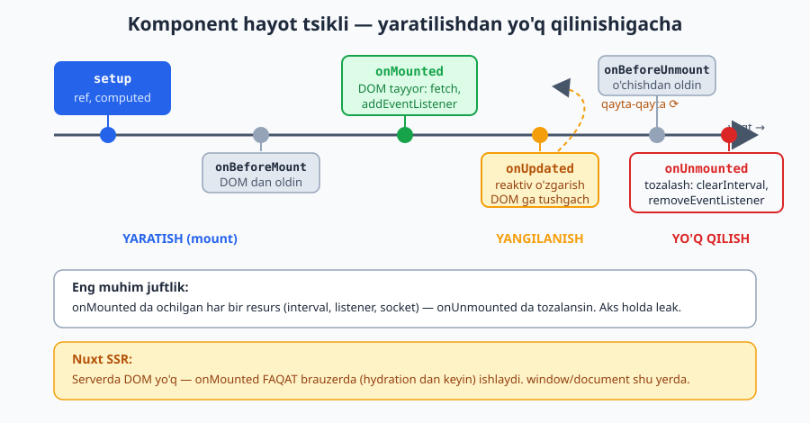
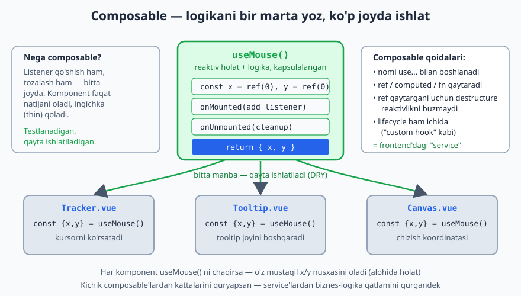

# 04 — Composition API & Composables

[⬅️ Oldingi: 03 — Komponentlar](./03-komponentlar.md) · [🏠 README](./README.md) · [Keyingi: 05 — Vue Router ➡️](./05-vue-router.md)

---

Bu modul Vue'ni **toza arxitektura** bilan yozishning kalitidir. Backend tajribang shu yerda juda asqotadi: composable — bu **frontend'dagi "service"**, logikani UI'dan ajratib, qayta ishlatiladigan qilib o'raydigan birlik.

## Options API vs Composition API

Eski Vue (2) — **Options API**: logika `data`, `methods`, `computed`, `watch` "qutilariga" bo'linadi. Bitta feature (masalan, "qidiruv") kodi 4 ta joyga tarqaladi.

Yangi — **Composition API** (`<script setup>`): logikani **feature bo'yicha** birga ushlaysan va composable'larga ajratasan.

```
Options API (feature tarqalgan):       Composition API (feature jamlangan):
data:    { search, results }            ── useSearch() ──┐
methods: { doSearch }                    search, results │ hammasi
computed:{ filtered }                    doSearch         │ bir joyda,
watch:   { search }                      filtered         │ qayta ishlatsa bo'ladi
                                                          ┘
```

**Laravel analogiyasi:** Options API — "fat controller" (hamma narsa bitta klassda, metodlarga bo'lingan). Composition API — logikani **service** va **action** klasslariga ajratish (DDD'dagi kabi). Composable = injektsiya qilinadigan reusable xizmat.

Quyidagi diagramma bitta "qidiruv" feature'i ikki uslubda qanday joylashishini taqqoslaydi (reaktivlik ikkalasida ham bir xil Proxy mexanizmida — farq faqat kodni tashkil qilishda):



---

## 4.1 `<script setup>` — chuqurroq

`<script setup>` ichida:
- Top-level e'lon qilingan har narsa avtomatik template'ga ochiladi.
- `defineProps`, `defineEmits`, `defineModel`, `defineExpose` — kompilyator makrolari (import shart emas).
- Kod komponent yaratilganda bir marta ishlaydi (`setup()` tanasi kabi).

```vue
<script setup>
import { ref, computed, onMounted } from 'vue'

const count = ref(0)
const double = computed(() => count.value * 2)

onMounted(() => console.log('DOM tayyor'))

// hammasi avtomatik template uchun ochiq
</script>
```

### `defineExpose` — komponent ichidan tashqariga metod ochish

`<script setup>` default'da hamma narsani **yopiq** qiladi (ota template ref orqali bola ichiga kira olmaydi). Ataylab ochish kerak bo'lsa:

```vue
<!-- Child.vue -->
<script setup>
import { ref } from 'vue'
const isOpen = ref(false)
function open() { isOpen.value = true }
defineExpose({ open })   // ota faqat shularni ko'radi
</script>
```
```vue
<!-- Parent -->
<script setup>
import { ref } from 'vue'
const childRef = ref(null)
</script>
<template>
  <Child ref="childRef" />
  <button @click="childRef.open()">Bolani och</button>
</template>
```

---

## 4.2 Lifecycle hooks (hayot tsikli)

Komponent yaratilishidan yo'q qilinishigacha bo'lgan bosqichlarga "ulanish":

```vue
<script setup>
import { onMounted, onUpdated, onUnmounted, onBeforeMount,
         onBeforeUnmount, onErrorCaptured } from 'vue'

onBeforeMount(() => {})   // DOM'ga joylashdan oldin
onMounted(() => {
  // DOM tayyor — DOM o'lchash, 3rd-party kutubxona init, fetch, addEventListener
})
onUpdated(() => {})       // reaktiv o'zgarish DOM'ga tushgach
onBeforeUnmount(() => {}) // o'chishdan oldin — tozalashga eng yaxshi joy
onUnmounted(() => {
  // listener'larni olib tashlash, interval clear, socket yopish
})
onErrorCaptured((err) => {/* bola xatosini tutib olish */ return false })
</script>
```

Eng ko'p ishlatiladigani — **`onMounted`** (DOM/fetch boshlash) va **`onUnmounted`** (tozalash).

**MUHIM — leak'dan saqlanish:**
```js
onMounted(() => {
  const id = setInterval(tick, 1000)
  window.addEventListener('resize', onResize)

  onUnmounted(() => {              // har doim juftini tozala
    clearInterval(id)
    window.removeEventListener('resize', onResize)
  })
})
```

> Nuxt SSR'da `onMounted` faqat **brauzerda** ishlaydi (server'da DOM yo'q). Bu — `window`/`document` ga murojaatni `onMounted` ichida qilish kerakligining sababi.

Quyidagi vaqt o'qi hooklarning chaqirilish tartibini ko'rsatadi (`setup` → `onMounted` → `onUpdated` → `onUnmounted`), jumladan SSR/hydration'dagi xulq:



---

## 4.3 Composable — qayta ishlatiladigan logika (ENG MUHIM)

**Composable** = reaktiv holat + logikani o'rab, qayta ishlatish uchun `use...()` funksiyasi. Vue'ning "custom hook"i.

### Qoidalar
1. Nomi `use` bilan boshlanadi: `useCounter`, `useFetch`, `useAuth`.
2. Reaktiv qiymatlar (`ref`, `computed`) va funksiyalarni **qaytaradi**.
3. Odatda `composables/` papkada (Nuxt'da bu papka auto-import qilinadi).

### Eng oddiy misol

```js
// composables/useCounter.js
import { ref, computed } from 'vue'

export function useCounter(initial = 0, step = 1) {
  const count = ref(initial)
  const double = computed(() => count.value * 2)

  const inc = () => count.value += step
  const dec = () => count.value -= step
  const reset = () => count.value = initial

  return { count, double, inc, dec, reset }   // ref'larni qaytaramiz
}
```

```vue
<script setup>
import { useCounter } from '@/composables/useCounter'

const { count, double, inc, dec, reset } = useCounter(10, 2)
// destructure qilsa ham reaktivlik saqlanadi — chunki ular ref!
</script>

<template>
  <p>{{ count }} (x2 = {{ double }})</p>
  <button @click="inc">+</button>
  <button @click="dec">-</button>
  <button @click="reset">Reset</button>
</template>
```

> Eslatma: composable'dan **ref qaytarganing uchun** destructure reaktivlikni buzmaydi (02-modulda `reactive` destructure muammosini ko'rgansan). Shuning uchun composable'lar odatda ref qaytaradi.

### Real composable — `useFetch` (soddalashtirilgan)

```js
// composables/useFetch.js
import { ref } from 'vue'

export function useFetch(url) {
  const data = ref(null)
  const error = ref(null)
  const loading = ref(false)

  async function execute() {
    loading.value = true
    error.value = null
    try {
      const res = await fetch(url)
      if (!res.ok) throw new Error(`HTTP ${res.status}`)
      data.value = await res.json()
    } catch (e) {
      error.value = e
    } finally {
      loading.value = false
    }
  }

  execute()
  return { data, error, loading, refetch: execute }
}
```

```vue
<script setup>
import { useFetch } from '@/composables/useFetch'
const { data, loading, error, refetch } = useFetch('https://api.example.com/users')
</script>

<template>
  <p v-if="loading">Yuklanmoqda...</p>
  <p v-else-if="error">Xato: {{ error.message }}</p>
  <ul v-else>
    <li v-for="u in data" :key="u.id">{{ u.name }}</li>
  </ul>
  <button @click="refetch">Qayta</button>
</template>
```

Bu **bitta** composable'ni 100 ta komponentda ishlatasan. DRY, testlanadigan, toza. (Nuxt'da `useFetch` allaqachon mavjud — 08-modul.)

### Composable ichida lifecycle va cleanup

```js
// composables/useMouse.js
import { ref, onMounted, onUnmounted } from 'vue'

export function useMouse() {
  const x = ref(0)
  const y = ref(0)

  function update(e) { x.value = e.clientX; y.value = e.clientY }

  onMounted(() => window.addEventListener('mousemove', update))
  onUnmounted(() => window.removeEventListener('mousemove', update))

  return { x, y }
}
```

Composable ichida `onMounted`/`onUnmounted` ishlatish mumkin — ular composable'ni chaqirgan komponentga "ulanadi". Bu — logikani **to'liq** kapsulalash: listener qo'shish ham, tozalash ham composable ichida. Komponent faqat `const { x, y } = useMouse()` deydi.

Quyidagi diagramma bitta composable bir nechta komponentda qanday qayta ishlatilishini ko'rsatadi (har komponent o'z mustaqil reaktiv nusxasini oladi):



### Composable'larni birga ishlatish (compose qilish)

```js
export function useUserProfile(userId) {
  const { data: user, loading } = useFetch(`/api/users/${userId}`)
  const { data: posts } = useFetch(`/api/users/${userId}/posts`)
  const isLoaded = computed(() => !!user.value && !!posts.value)
  return { user, posts, loading, isLoaded }
}
```

Kichik composable'lardan kattalarini quryapsan — xuddi service'lardan biznes-logika qatlamini qurgandek.

---

## 4.4 Composable vs boshqa yondashuvlar

| Vosita | Qachon |
|---|---|
| **Composable** | Reaktiv holat + logika (stateful). State'ni baham ko'rish/qayta ishlatish |
| **Util funksiya** | Sof, holati yo'q yordamchi (`formatDate`, `slugify`) — `utils/` |
| **Komponent** | Vizual UI bo'lagi |
| **Pinia store** | Butun ilova bo'ylab **bitta** global holat (auth, cart) |
| **provide/inject** | Daraxtning ma'lum shoxi uchun lokal kontekst |

> Sezgi: Logika **UI markup'siz** va **qayta ishlatilsa** → composable. Faqat bitta komponentda ishlatilsa va kichik bo'lsa → komponent ichida qoldir.

---

## 4.5 Advanced reactivity (composable yozayotganda kerak bo'ladi)

```js
import { shallowRef, triggerRef, customRef, toValue, readonly } from 'vue'

// shallowRef — faqat .value almashishini kuzatadi (ichini emas). Katta obyektlar uchun.
const big = shallowRef({ huge: 'data' })
big.value = { huge: 'new' }   // kuzatiladi
big.value.huge = 'x'          // kuzatilMAYDI (ichki) — triggerRef(big) kerak

// toValue — ref/getter/oddiy qiymatni "yechadi" (composable arg moslashuvchanligi uchun)
function useX(source) {       // source: ref | getter | qiymat — barchasini qabul qiladi
  const val = toValue(source)
}

// readonly — o'zgartirib bo'lmaydigan nusxa (store'dan tashqariga immutable berish)
const state = reactive({ count: 0 })
const ro = readonly(state)    // ro.count = 1 → warning
```

`toValue` — kuchli composable yozishda muhim: foydalanuvchi `useX(myRef)`, `useX(() => x)` yoki `useX(5)` bersa ham ishlaydi.

---

## 4.6 Composable papka strukturasi (EduCore uchun namuna)

```
composables/
├── useAuth.ts          # login, logout, current user
├── useApi.ts           # asosiy fetch wrapper (token, baseURL)
├── usePagination.ts    # sahifalash logikasi
├── useDebounce.ts      # debounce util-composable
├── useToggle.ts        # boolean toggle
├── useTenant.ts        # multi-tenant: joriy tenant konteksti
└── useTable.ts         # qidiruv+filter+sort birlashgan jadval logikasi
```

Bu — frontend'dagi "application layer". Komponentlar ingichka (thin) qoladi, logika composable'larda — xuddi controller'lar ingichka, logika service/action'larda bo'lgani kabi.

---

## Xulosa

- **Composition API** logikani feature bo'yicha jamlaydi (Options API tarqatadi)
- **`<script setup>`** — eng qisqa, zamonaviy uslub; `defineExpose` bilan tanlab ochish
- **Lifecycle:** `onMounted` (boshlash), `onUnmounted` (tozalash) — leak'dan saqlan
- **Composable** = `use...()`, ref/computed/fn qaytaradi, qayta ishlatiladigan reaktiv logika (frontend "service")
- Composable ichida lifecycle + cleanup → to'liq kapsulalash
- `toValue`, `shallowRef`, `readonly` — kuchli composable vositalari
- Toza arxitektura: **ingichka komponent + boy composable**

---

## 🎯 Masalalar (kamida 22 ta)

### Lifecycle (1–5)

1. `onMounted` da `console.log` qil, `onUnmounted` da yana — `v-if` bilan komponentni o'chirib/yoqib ketma-ketlikni kuzat.
2. **Soat (★):** `onMounted` da `setInterval` bilan har soniya vaqtni yangila; `onUnmounted` da `clearInterval`. Tozalashni unutsang nima bo'lishini izohla.
3. **Window resize (★):** Oyna kengligini ekranda ko'rsat (`resize` listener + cleanup).
4. **Scroll position (★):** Sahifa scroll qiymatini kuzatib ko'rsat; tozala.
5. `onErrorCaptured` (★★): Ataylab xato tashlaydigan bola yarat, ota uni tutib "Xatolik yuz berdi" ko'rsatsin.

### Asosiy composable'lar (6–13)

6. `useToggle(initial=false)` → `{ value, toggle, setTrue, setFalse }`. Modal/sidebar'da ishlat.
7. `useCounter(initial, step)` → `{ count, inc, dec, reset, double }` (yuqoridagini o'zing qayta yoz).
8. `useLocalStorage(key, default)` (★): `localStorage` bilan sinxron reaktiv ref (`watch` ichida saqla, init'da o'qi).
9. `useDebounce(value, delay)` (★): ref'ni debounce qilingan reaktiv qiymatga aylantir.
10. `useMouse()` → `{ x, y }` (listener + cleanup composable ichida).
11. `useWindowSize()` (★) → `{ width, height }`, reaktiv.
12. `useClipboard()` (★): `{ copy, copied }` — matn nusxalash, 2s "copied" holati.
13. `useInterval(callback, ms)` (★): start/stop boshqaruvi bilan.

### Data composable'lari (14–18)

14. `useFetch(url)` (★): yuqoridagini qayta yoz; `loading/error/data/refetch` bilan.
15. `usePagination(items, perPage)` (★★): `currentPage`, `totalPages`, `paginatedItems`, `next/prev/goTo`.
16. `useSearch(items, keys)` (★★): qidiruv matni bo'yicha `keys` lar ichidan filtrlangan ro'yxat qaytarsin.
17. `useSort(items)` (★★): ustun bo'yicha `asc/desc` saralash, holat boshqaruvi bilan.
18. **`useTable` (★★★):** 15+16+17 ni birlashtir — bitta composable qidiruv+filter+sort+pagination beradigan. EduCore jadvallari uchun asos.

### Arxitektura va kompozitsiya (19–24)

19. **Compose qilish (★★):** `useUserProfile(id)` ni `useFetch` ustiga qur (user + posts birga).
20. **toValue (★★):** `useDoubled(source)` yoz — `source` ref, getter yoki oddiy son bo'lsa ham ishlasin (`toValue`).
21. **defineExpose (★★):** `VideoPlayer` komponenti `play()`/`pause()` metodlarini `defineExpose` qilsin; ota tugma orqali boshqarsin.
22. **Composable + komponent (★★):** `useFetch` + `DataList` (03-modul scoped slot) ni birlashtirib, har qanday API ro'yxatini ko'rsatadigan reusable blok yarat.
23. **Refactor (★★★):** Quyidagi "fat" komponentni composable(lar)ga ajrat:
    > Bitta komponentda: qidiruv inputi + API'dan ro'yxat olish + filterlash + pagination + localStorage'ga oxirgi qidiruvni saqlash — hammasi aralashgan. Buni `useSearch`, `useFetch`, `usePagination`, `useLocalStorage` ga bo'lib, komponentni ingichka qil.
24. **EduCore `useAuth` skeleti (★★★):** `user` (ref), `isAuthenticated` (computed), `login(creds)`, `logout()`, `fetchUser()` — token'ni `useLocalStorage` bilan sinxronla (hozircha API'ni soxta qil).

---

### ✅ Tanlangan yechimlar

<details markdown="1">
<summary>6 — useToggle</summary>

```js
// composables/useToggle.js
import { ref } from 'vue'
export function useToggle(initial = false) {
  const value = ref(initial)
  const toggle = () => value.value = !value.value
  const setTrue = () => value.value = true
  const setFalse = () => value.value = false
  return { value, toggle, setTrue, setFalse }
}
```
</details>

<details markdown="1">
<summary>8 — useLocalStorage</summary>

```js
// composables/useLocalStorage.js
import { ref, watch } from 'vue'
export function useLocalStorage(key, defaultValue) {
  const stored = localStorage.getItem(key)
  const data = ref(stored ? JSON.parse(stored) : defaultValue)

  watch(data, (val) => {
    localStorage.setItem(key, JSON.stringify(val))
  }, { deep: true })

  return data
}
// Ishlatish: const theme = useLocalStorage('theme', 'dark')
```
</details>

<details markdown="1">
<summary>15 — usePagination</summary>

```js
// composables/usePagination.js
import { ref, computed, toValue } from 'vue'
export function usePagination(items, perPage = 10) {
  const currentPage = ref(1)
  const list = computed(() => toValue(items))   // ref yoki oddiy massiv bo'lsa ham

  const totalPages = computed(() =>
    Math.max(1, Math.ceil(list.value.length / perPage))
  )
  const paginatedItems = computed(() => {
    const start = (currentPage.value - 1) * perPage
    return list.value.slice(start, start + perPage)
  })

  const next = () => { if (currentPage.value < totalPages.value) currentPage.value++ }
  const prev = () => { if (currentPage.value > 1) currentPage.value-- }
  const goTo = (p) => { currentPage.value = Math.min(Math.max(1, p), totalPages.value) }

  return { currentPage, totalPages, paginatedItems, next, prev, goTo }
}
```
</details>

<details markdown="1">
<summary>18 — useTable (qisqartirilgan tuzilma)</summary>

```js
// composables/useTable.js
import { ref, computed } from 'vue'
export function useTable(source, { searchKeys = [], perPage = 10 } = {}) {
  const search = ref('')
  const sortKey = ref(null)
  const sortDir = ref('asc')
  const page = ref(1)

  const searched = computed(() => {
    if (!search.value) return source.value
    const q = search.value.toLowerCase()
    return source.value.filter(row =>
      searchKeys.some(k => String(row[k]).toLowerCase().includes(q))
    )
  })
  const sorted = computed(() => {
    if (!sortKey.value) return searched.value
    return [...searched.value].sort((a, b) => {
      const r = a[sortKey.value] > b[sortKey.value] ? 1 : -1
      return sortDir.value === 'asc' ? r : -r
    })
  })
  const totalPages = computed(() => Math.max(1, Math.ceil(sorted.value.length / perPage)))
  const rows = computed(() => {
    const start = (page.value - 1) * perPage
    return sorted.value.slice(start, start + perPage)
  })
  function setSort(key) {
    if (sortKey.value === key) sortDir.value = sortDir.value === 'asc' ? 'desc' : 'asc'
    else { sortKey.value = key; sortDir.value = 'asc' }
    page.value = 1
  }
  return { search, sortKey, sortDir, page, rows, totalPages, setSort }
}
```
</details>

➡️ Keyingi: [05 — Vue Router](./05-vue-router.md)
