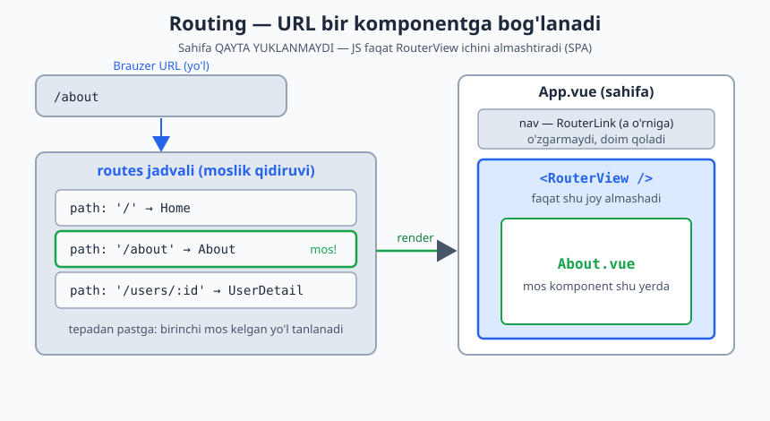
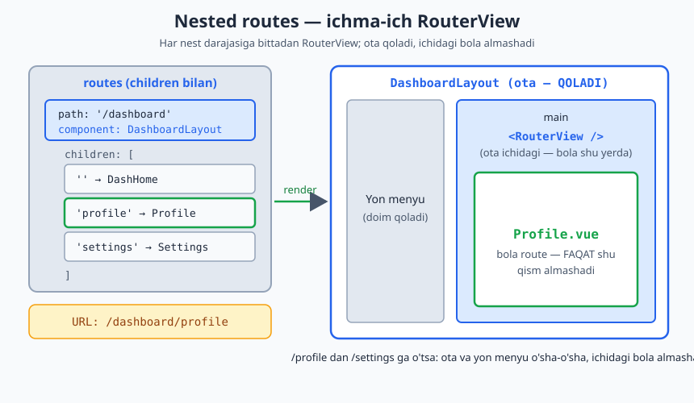
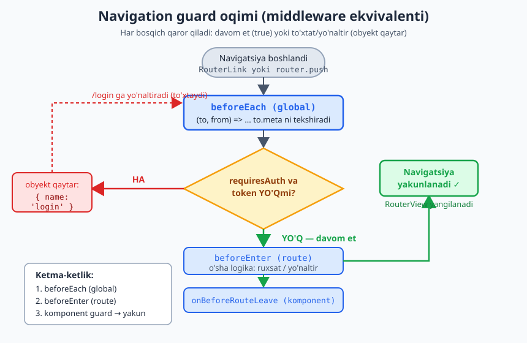

# 05 — Vue Router

[⬅️ Oldingi: 04 — Composition API](./04-composition-api.md) · [🏠 README](./README.md) · [Keyingi: 06 — Pinia ➡️](./06-pinia.md)

---

SPA (Single Page Application)'da sahifa **qayta yuklanmaydi** — URL o'zgaradi, JS kerakli komponentni almashtiradi. Vue Router shuni boshqaradi.

**Laravel analogiyasi:** `routes/web.php` — URL'ni controller'ga bog'laysan. Vue Router — URL'ni **komponentga** bog'laydi. Route guard'lar — Laravel **middleware** (`auth`, `can`) ning frontend ekvivalenti.

> Eslatma: **Nuxt'da Vue Router'ni qo'lda sozlamaysan** — fayl tuzilishi avtomatik route yasaydi (07-modul). Lekin ostidagi mexanizm shu Vue Router. Buni bilish — Nuxt'ni tushunish uchun shart.

---

## 5.1 O'rnatish va asosiy setup

```bash
npm install vue-router@4
```

```js
// router/index.js
import { createRouter, createWebHistory } from 'vue-router'
import Home from '@/views/Home.vue'
import About from '@/views/About.vue'

const routes = [
  { path: '/', name: 'home', component: Home },
  { path: '/about', name: 'about', component: About },
]

export const router = createRouter({
  history: createWebHistory(),   // toza URL (/about). createWebHashHistory() — /#/about
  routes,
})
```

```js
// main.js
import { createApp } from 'vue'
import App from './App.vue'
import { router } from './router'

createApp(App).use(router).mount('#app')
```

```vue
<!-- App.vue -->
<template>
  <nav>
    <RouterLink to="/">Bosh sahifa</RouterLink>
    <RouterLink :to="{ name: 'about' }">Biz haqimizda</RouterLink>
  </nav>

  <RouterView />   <!-- bu yerda joriy route komponenti render bo'ladi -->
</template>
```

- **`<RouterLink>`** — `<a>` o'rniga (sahifa qayta yuklanmaydi). Faol linkga avtomatik `.router-link-active` klassi qo'shiladi.
- **`<RouterView>`** — joriy route'ga mos komponent shu yerda chiqadi (Laravel `@yield('content')` kabi).
- `to` — string (`/about`) yoki obyekt (`{ name: 'about' }`). **Nomli route afzal** — URL o'zgarsa, link buzilmaydi.

Umumiy mexanizm quyidagicha: URL `routes` jadvaliga solishtiriladi, mos komponent `<RouterView>` ichida render bo'ladi, sahifaning qolgan qismi o'zgarmaydi:



---

## 5.2 Dynamic routes (parametrlar)

```js
const routes = [
  { path: '/users/:id', name: 'user', component: UserDetail },
  { path: '/posts/:category/:slug', component: Post },
  { path: '/files/:path(.*)', component: File },   // wildcard (qolgan hammasi)
]
```

```vue
<!-- UserDetail.vue -->
<script setup>
import { useRoute } from 'vue-router'
const route = useRoute()

console.log(route.params.id)      // URL'dagi :id
console.log(route.query.tab)      // ?tab=info
console.log(route.path)           // /users/5
</script>

<template>
  <h1>User #{{ route.params.id }}</h1>
</template>
```

**MUHIM — param o'zgarganda komponent qayta yaratilmaydi:**
`/users/1` → `/users/2` ga o'tilganda Vue komponentni **qayta ishlatadi** (qayta create qilmaydi), shuning uchun `onMounted` qaytadan ishlamaydi. Param o'zgarishini **kuzatish** kerak:

```js
import { watch } from 'vue'
import { useRoute } from 'vue-router'
const route = useRoute()

watch(() => route.params.id, (newId) => {
  fetchUser(newId)   // har param o'zgarganda qayta yukla
}, { immediate: true })
```

Bu — eng ko'p uchraydigan router bug'i. Yodda tut.

---

## 5.3 Dasturiy navigatsiya (programmatic)

```vue
<script setup>
import { useRouter } from 'vue-router'
const router = useRouter()

function goToProfile(id) {
  router.push({ name: 'user', params: { id } })
}
router.push('/about')                       // string
router.push({ path: '/users/5', query: { tab: 'posts' } })
router.replace('/login')                    // tarixga qo'shmaydi (back ishlamaydi)
router.back()                               // brauzer "orqaga"
router.go(-2)
</script>
```

> `useRoute()` (joriy route ma'lumoti, **o'qish**) va `useRouter()` (navigatsiya, **harakat**) — ikkisini chalkashtirma. Route = ma'lumot, Router = boshqaruv.

---

## 5.4 Nested routes (ichma-ich)

Layout ichida o'zgaruvchi qism (masalan, dashboard'da yon menyu doim qoladi, o'ng tomon o'zgaradi):

```js
const routes = [
  {
    path: '/dashboard',
    component: DashboardLayout,
    children: [
      { path: '', name: 'dash-home', component: DashHome },        // /dashboard
      { path: 'profile', component: Profile },                     // /dashboard/profile
      { path: 'settings', component: Settings },                   // /dashboard/settings
    ],
  },
]
```

```vue
<!-- DashboardLayout.vue -->
<template>
  <aside>Yon menyu (doim qoladi)</aside>
  <main>
    <RouterView />   <!-- bola route shu yerda -->
  </main>
</template>
```

Har nest darajasiga bittadan `<RouterView>`. Ota komponent qoladi, ichidagi `<RouterView>` bola route bilan almashadi.

Buni vizual ko'rinishda quyidagicha tasavvur qil:



---

## 5.5 Lazy loading (route-level code splitting)

Har komponentni boshidan yuklash o'rniga — kerak bo'lganda yuklash. Bundle hajmi kichrayadi, ilk yuklanish tezlashadi:

```js
const routes = [
  { path: '/', component: Home },   // bu darrov kerak — eager
  {
    path: '/admin',
    component: () => import('@/views/Admin.vue'),   // lazy — alohida chunk
  },
]
```

`() => import(...)` — Vite alohida `.js` chunk yasaydi, faqat `/admin` ga kirilganda yuklanadi. Katta ilovalarda **doim** og'ir/kam ishlatiladigan sahifalarni lazy qil.

---

## 5.6 Navigation guards — middleware ekvivalenti

Navigatsiyani to'xtatish/yo'naltirish (auth tekshirish, ruxsat, "saqlanmagan o'zgarishlar" ogohlantirishi):

### Global guard (`beforeEach`)

```js
// router/index.js
router.beforeEach((to, from) => {
  const isAuth = !!localStorage.getItem('token')

  if (to.meta.requiresAuth && !isAuth) {
    return { name: 'login', query: { redirect: to.fullPath } }   // yo'naltir
  }
  // return true yoki hech narsa — davom et
})
```

Route'ga `meta` qo'shasan:
```js
{ path: '/admin', component: Admin, meta: { requiresAuth: true, role: 'admin' } }
```

### Per-route guard (`beforeEnter`)

```js
{
  path: '/admin',
  component: Admin,
  beforeEnter: (to, from) => {
    if (!isAdmin()) return { name: 'home' }
  },
}
```

### In-component guard (`onBeforeRouteLeave`)

```js
import { onBeforeRouteLeave } from 'vue-router'

onBeforeRouteLeave((to, from) => {
  if (hasUnsavedChanges.value) {
    return window.confirm('Saqlanmagan o\'zgarishlar bor. Chiqasizmi?')
  }
})
```

**Guard'lar ketma-ketligi (soddalashtirilgan):** `beforeEach` (global) → `beforeEnter` (route) → komponent ichidagi guard'lar → navigatsiya yakunlanadi.

Quyidagi diagramma bu oqimni ko'rsatadi — har bosqich "davom et yoki to'xtat/yo'naltir" deb qaror qiladi:



> Bu Laravel middleware pipeline'iga juda o'xshaydi: har bosqich "davom et yoki to'xtat/yo'naltir" deb qaror qiladi.

---

## 5.7 Foydali narsalar

```js
// Scroll xulqi (yangi sahifada tepaga)
const router = createRouter({
  history: createWebHistory(),
  routes,
  scrollBehavior(to, from, savedPosition) {
    if (savedPosition) return savedPosition   // back/forward'da eski joyga
    if (to.hash) return { el: to.hash }        // #section ga
    return { top: 0 }
  },
})

// 404
{ path: '/:pathMatch(.*)*', name: 'not-found', component: NotFound }

// Redirect & alias
{ path: '/home', redirect: '/' }
{ path: '/', component: Home, alias: '/bosh' }

// Props orqali param uzatish (route'ga bog'liqlikni kamaytiradi)
{ path: '/users/:id', component: UserDetail, props: true }
// UserDetail endi route'ni emas, oddiy `id` prop'ini qabul qiladi
```

`<RouterView>` da transition + KeepAlive:
```vue
<RouterView v-slot="{ Component }">
  <Transition name="fade" mode="out-in">
    <KeepAlive>
      <component :is="Component" />
    </KeepAlive>
  </Transition>
</RouterView>
```

---

## Xulosa

- `createRouter` + `createWebHistory`, `<RouterLink>` + `<RouterView>`
- **Dynamic param:** `:id` → `route.params.id`; param o'zgarsa **watch qil** (komponent qayta yaratilmaydi)
- `useRoute()` = o'qish, `useRouter()` = harakat (`push/replace/back`)
- **Nested routes** — layout + bola `<RouterView>`
- **Lazy loading** — `() => import(...)`, bundle splitting
- **Guards** = middleware: global `beforeEach`, route `beforeEnter`, komponent `onBeforeRouteLeave`; `meta` bilan auth/role
- Nomli route + `props: true` — toza, barqaror

---

## 🎯 Masalalar (kamida 20 ta)

### Asosiy (1–7)

1. 3 sahifali sayt: Home, About, Contact. Nav + `<RouterView>`. `<RouterLink>` bilan o'tib ko'r, sahifa qayta yuklanmasligini tasdiqla.
2. Faol linkni `.router-link-active` orqali boshqacha rangga bo'ya.
3. Nomli route'lar (`name`) qo'shib, `:to="{ name: '...' }"` bilan navigatsiya qil.
4. `router.push` bilan dasturiy o'tish: tugma bosilganda `/about` ga o't.
5. 404 sahifa qo'sh (`/:pathMatch(.*)*`); mavjud bo'lmagan URL'ga kirib sina.
6. `/home` → `/` redirect qo'sh.
7. `scrollBehavior` bilan har yangi sahifada tepaga scroll qil.

### Dynamic & data (8–13)

8. `/users/:id` route; sahifada `route.params.id` ni ko'rsat.
9. **Param watch (★):** Foydalanuvchilar ro'yxatidan `/users/1`, `/users/2` ga o'tganda sahifa ma'lumoti yangilansin (`watch(() => route.params.id, ..., {immediate:true})`).
10. Query string (★): `/search?q=vue` — `route.query.q` ni ko'rsat; inputga yozsang URL query'ni `router.push` bilan yangila.
11. `props: true` (★): `UserDetail` ni route'ga bog'lamasdan, `id` ni prop sifatida qabul qildir.
12. **Master-detail (★★):** `/products` ro'yxat → element bosilsa `/products/:id` detail sahifa; "Orqaga" tugmasi `router.back()`.
13. **Pagination URL'da (★★):** `/posts?page=2` — sahifa raqami query'da saqlansin, refresh'da ham qolsin.

### Nested & lazy (14–17)

14. **Dashboard layout (★★):** `/dashboard` layout + `children`: `''`(home), `profile`, `settings`. Yon menyu doim qolsin, o'ng tomon almashsin.
15. Ikki darajali nested (★★): `/dashboard/users` ichida yana `/dashboard/users/:id` nest qil.
16. Lazy loading (★): `Admin` sahifasini `() => import()` bilan yukla; Network tab'da alohida chunk yuklanishini ko'rsat.
17. Transition (★★): `<RouterView v-slot>` bilan sahifalar orasiga fade animatsiya qo'sh.

### Guards (18–23)

18. **Auth guard (★★):** `meta.requiresAuth` bo'lgan `/dashboard` ni himoyala; token yo'q bo'lsa `/login` ga yo'naltir (`beforeEach`).
19. **Redirect after login (★★):** Login'da `query.redirect` ni ishlatib, foydalanuvchini kelgan sahifasiga qaytar.
20. **Role guard (★★):** `meta.role: 'admin'` — admin bo'lmasa `/403` ga.
21. **Leave guard (★★):** Forma sahifasida o'zgarish bo'lsa, `onBeforeRouteLeave` bilan "Saqlanmagan o'zgarishlar bor" deb ogohlantir.
22. **Title (★):** `beforeEach` da `to.meta.title` ni `document.title` ga yoz.
23. **EduCore router skeleti (★★★):** `/login` (public), `/app` (auth layout + children: dashboard, students, payments), `/admin` (role: admin). Guard'larni `meta` + `beforeEach` bilan to'liq qur. (Bu Nuxt'da fayl-tuzilish bilan ko'rinishini 07-modulda solishtirasan.)

---

### ✅ Tanlangan yechimlar

<details markdown="1">
<summary>9 — Param watch bilan data yangilash</summary>

```vue
<!-- UserDetail.vue -->
<script setup>
import { ref, watch } from 'vue'
import { useRoute } from 'vue-router'
const route = useRoute()
const user = ref(null)

async function load(id) {
  // soxta "API"
  user.value = { id, name: `User ${id}` }
}

watch(() => route.params.id, (id) => load(id), { immediate: true })
</script>

<template>
  <h1 v-if="user">{{ user.name }} (#{{ user.id }})</h1>
</template>
```
</details>

<details markdown="1">
<summary>18 — Auth guard + redirect</summary>

```js
// router/index.js
router.beforeEach((to) => {
  const isAuth = !!localStorage.getItem('token')
  if (to.meta.requiresAuth && !isAuth) {
    return { name: 'login', query: { redirect: to.fullPath } }
  }
})
```
```js
// routes
{ path: '/login', name: 'login', component: Login },
{ path: '/dashboard', component: Dashboard, meta: { requiresAuth: true } },
```
```vue
<!-- Login.vue: muvaffaqiyatdan keyin -->
<script setup>
import { useRoute, useRouter } from 'vue-router'
const route = useRoute()
const router = useRouter()

function onLoginSuccess() {
  localStorage.setItem('token', 'xxx')
  router.push(route.query.redirect || '/dashboard')
}
</script>
```
</details>

➡️ Keyingi: [06 — Pinia](./06-pinia.md)
