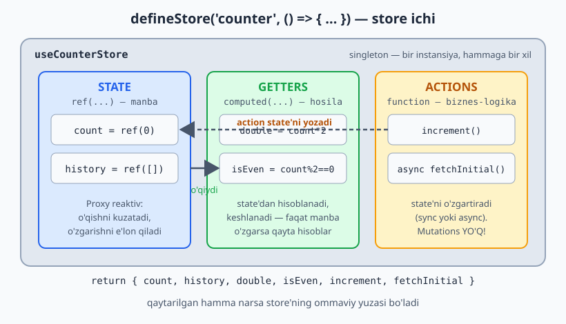
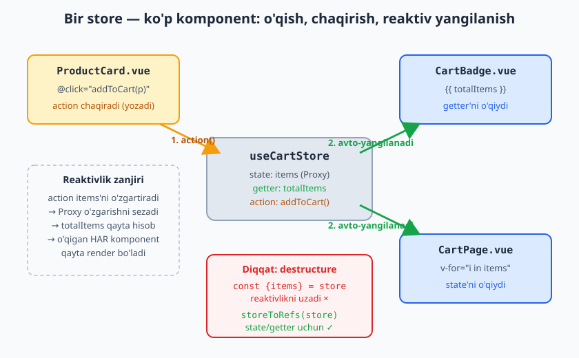

# 06 — Pinia (State Management)

[⬅️ Oldingi: 05 — Vue Router](./05-vue-router.md) · [🏠 README](./README.md) · [Keyingi: 07 — Nuxt asoslari ➡️](./07-nuxt-asoslari.md)

---

`ref`/composable lokal holat uchun yetadi. Lekin **butun ilova bo'ylab** baham ko'riladigan holat (joriy foydalanuvchi, savat, til, EduCore'da joriy tenant) kerak bo'lsa — **Pinia**.

Pinia — Vue'ning rasmiy state-management kutubxonasi (Vuex'ning vorisi). Soddaroq, TypeScript-do'st, DevTools bilan zo'r.

**Laravel analogiyasi:** Pinia store — **singleton service**. Bir marta yaratiladi, butun ilova bir xil instansiyani ishlatadi. State — service property'lari, getters — accessor'lar, actions — service metodlari (biznes-logika shu yerda).

### Qachon Pinia, qachon yo'q?

| Holat | Yechim |
|---|---|
| Bitta komponentga tegishli | lokal `ref` |
| Bir necha qo'shni komponent | props/emit yoki composable |
| Daraxtning ma'lum shoxi | `provide/inject` |
| **Butun ilova**, ko'p joydan o'qiladi/yoziladi | **Pinia** |

> Hamma narsani store'ga tiqishtirma. Pinia — *global* holat uchun. Lokal narsa lokal qolsin.

---

## 6.1 O'rnatish

```bash
npm install pinia
```

```js
// main.js
import { createApp } from 'vue'
import { createPinia } from 'pinia'
import App from './App.vue'

createApp(App).use(createPinia()).mount('#app')
```

> Nuxt'da: `npm i @pinia/nuxt`, keyin `nuxt.config` modules'ga qo'shasan — `createPinia` qo'lda kerak emas (07-modul).

---

## 6.2 Store yaratish — Setup syntax (tavsiya)

Composition API uslubi — eng moslashuvchan, `<script setup>` ga o'xshaydi:

```js
// stores/counter.js
import { defineStore } from 'pinia'
import { ref, computed } from 'vue'

export const useCounterStore = defineStore('counter', () => {
  // STATE → ref
  const count = ref(0)
  const history = ref([])

  // GETTERS → computed
  const double = computed(() => count.value * 2)
  const isEven = computed(() => count.value % 2 === 0)

  // ACTIONS → funksiyalar (sync yoki async)
  function increment() {
    count.value++
    history.value.push(count.value)
  }
  async function fetchInitial() {
    const res = await fetch('/api/counter')
    count.value = (await res.json()).value
  }

  return { count, history, double, isEven, increment, fetchInitial }
})
```

Moslik:
- `ref` = state
- `computed` = getter
- `function` = action

Quyidagi diagramma store'ning uch qismi (state / getters / actions) o'zaro qanday bog'lanishini ko'rsatadi:



```vue
<script setup>
import { useCounterStore } from '@/stores/counter'
const counter = useCounterStore()
</script>

<template>
  <p>{{ counter.count }} (x2 = {{ counter.double }})</p>
  <button @click="counter.increment()">+</button>
</template>
```

### Option syntax (Vuex'ga o'xshash, alternativa)

```js
export const useCounterStore = defineStore('counter', {
  state: () => ({ count: 0 }),
  getters: {
    double: (state) => state.count * 2,
  },
  actions: {
    increment() { this.count++ },          // this — store
    async fetchInitial() { /* await ... */ },
  },
})
```

Ikkalasi ham ishlaydi. **Setup syntax** zamonaviyroq va composable'lar bilan yaxshiroq birikadi. Bu qo'llanmada uni ishlatamiz.

---

## 6.3 Store'dan foydalanish — destructure tuzog'i

```vue
<script setup>
import { storeToRefs } from 'pinia'
import { useCounterStore } from '@/stores/counter'

const counter = useCounterStore()

// ❌ XATO — reaktivlikni uzadi
const { count, double } = counter

// ✅ State/getters uchun storeToRefs
const { count, double } = storeToRefs(counter)

// ✅ Actions'ni to'g'ridan-to'g'ri destructure qilsa bo'ladi (ular funksiya, reaktiv emas)
const { increment } = counter
</script>
```

**Nega?** Store — `reactive` obyekt (02-modul!). Uni to'g'ridan-to'g'ri destructure qilsang, reaktivlik uziladi. `storeToRefs` state va getter'larni reaktiv ref'larga o'raydi. **Actions** esa shunchaki funksiya — to'g'ridan-to'g'ri olsa bo'ladi.

Quyidagi diagramma bitta store'ni ko'p komponent qanday baham ko'rishini ko'rsatadi: biri action chaqirib state'ni o'zgartiradi, qolganlari esa Proxy reaktivligi tufayli avtomatik yangilanadi:



---

## 6.4 State'ni o'zgartirish usullari

```js
const store = useCounterStore()

// 1) action orqali (TAVSIYA — logika bir joyda, DevTools'da kuzatiladi)
store.increment()

// 2) to'g'ridan-to'g'ri (mumkin, lekin oddiy holatlar uchun)
store.count++

// 3) $patch — bir nechta o'zgarishni birga (bitta yangilanish)
store.$patch({ count: 10, name: 'x' })
store.$patch((state) => {              // murakkab (massivga push va h.k.)
  state.items.push(newItem)
  state.count++
})

// 4) $reset — boshlang'ich holatga (faqat Option syntax'da avtomatik;
//    Setup syntax'da o'zing reset action yozasan)
```

> Vuex'dan farqli: Pinia'da **mutations yo'q**. To'g'ridan-to'g'ri o'zgartirish yoki action. Bu — kamroq boilerplate.

---

## 6.5 Store'lar bir-birini ishlatishi

```js
// stores/cart.js
import { defineStore } from 'pinia'
import { ref, computed } from 'vue'
import { useAuthStore } from './auth'

export const useCartStore = defineStore('cart', () => {
  const auth = useAuthStore()          // boshqa store'ni chaqir
  const items = ref([])

  const canCheckout = computed(() =>
    auth.isAuthenticated && items.value.length > 0
  )
  return { items, canCheckout }
})
```

Store'lar bir-birini bemalol ishlatadi — service'lar bir-birini DI orqali chaqirgani kabi. Faqat **aylanma bog'liqlik** (A→B→A)dan ehtiyot bo'l.

---

## 6.6 Real store — `useAuthStore` (EduCore namuna)

```js
// stores/auth.js
import { defineStore } from 'pinia'
import { ref, computed } from 'vue'

export const useAuthStore = defineStore('auth', () => {
  const user = ref(null)
  const token = ref(localStorage.getItem('token') || null)

  const isAuthenticated = computed(() => !!token.value)
  const isAdmin = computed(() => user.value?.role === 'admin')

  async function login(credentials) {
    const res = await fetch('/api/login', {
      method: 'POST',
      headers: { 'Content-Type': 'application/json' },
      body: JSON.stringify(credentials),
    })
    if (!res.ok) throw new Error('Login xato')
    const data = await res.json()
    token.value = data.token
    user.value = data.user
    localStorage.setItem('token', data.token)
  }

  async function fetchUser() {
    if (!token.value) return
    const res = await fetch('/api/me', {
      headers: { Authorization: `Bearer ${token.value}` },
    })
    user.value = await res.json()
  }

  function logout() {
    token.value = null
    user.value = null
    localStorage.removeItem('token')
  }

  return { user, token, isAuthenticated, isAdmin, login, fetchUser, logout }
})
```

Router guard bilan birlashtirish (05-modul):
```js
router.beforeEach((to) => {
  const auth = useAuthStore()
  if (to.meta.requiresAuth && !auth.isAuthenticated) {
    return { name: 'login' }
  }
})
```

---

## 6.7 Persist (saqlash) va pluginlar

State'ni refresh'da yo'qotmaslik uchun `localStorage` ga saqlash:

**Qo'lda (oddiy):**
```js
import { watch } from 'vue'
// store ichida:
watch(token, (val) => {
  val ? localStorage.setItem('token', val) : localStorage.removeItem('token')
})
```

**Plugin bilan (avtomatik, ko'p store uchun):**
```bash
npm install pinia-plugin-persistedstate
```
```js
// main.js
import piniaPersist from 'pinia-plugin-persistedstate'
const pinia = createPinia()
pinia.use(piniaPersist)
```
```js
// store (Option syntax'da):
export const useAuthStore = defineStore('auth', {
  state: () => ({ token: null }),
  persist: true,   // butun store localStorage'ga
})
```

### O'z plugining (DI/logging uchun)

```js
pinia.use(({ store }) => {
  // har store yaratilganda ishlaydi
  store.$subscribe((mutation, state) => {
    console.log(`[${store.$id}] o'zgardi`, state)   // global logging
  })
})
```

`$subscribe` — store o'zgarishini global tinglash. Logging, analytics, sync uchun qulay.

---

## 6.8 Arxitektura: store nima qiladi, nima qilmaydi

**Store ichiga:**
- Global state (auth, ui sozlamalari, savat, tenant)
- O'sha state'ni o'zgartiruvchi biznes-logika (action)
- Hosilaviy qiymatlar (getter)

**Store ichiga EMAS:**
- Vizual/UI logika (komponentda qolsin)
- Faqat bitta komponentga kerakli vaqtinchalik holat (lokal `ref`)
- Og'ir API qatlami — uni alohida `services/api.js` ga ajratib, store action'i undan foydalansin (DDD'dagi repository/service ajratimiga o'xshash)

```
Komponent  →  Store (action)  →  API service  →  Backend
   (UI)        (state+biznes)      (HTTP)
```

Bu qatlamlash — backend'dagi controller → service → repository ga to'g'ridan-to'g'ri mos keladi. Sen buni allaqachon bilasan.

---

## Xulosa

- **Pinia** — global holat (singleton service kabi); lokal narsani store'ga tiqma
- **Setup syntax:** `ref`=state, `computed`=getter, `function`=action
- **`storeToRefs`** — state/getter destructure uchun (actions'ni to'g'ridan-to'g'ri ol)
- O'zgartirish: action (afzal), to'g'ridan-to'g'ri, `$patch`. **Mutations yo'q**
- Store'lar bir-birini ishlatadi (DI kabi)
- **Persist** — qo'lda `watch` yoki plugin
- Qatlam: Komponent → Store → API service → Backend

---

## 🎯 Masalalar (kamida 20 ta)

### Asosiy (1–7)

1. `useCounterStore` yarat (`count`, `double`, `increment`, `decrement`, `reset`). Ikki alohida komponentda ishlatib, **bir xil** state ko'rsatishini tasdiqla.
2. `storeToRefs` (★): yuqoridagi store'dan `count`, `double` ni destructure qil; to'g'ridan-to'g'ri destructure bilan farqini (reaktivlik yo'qolishini) ko'rsat.
3. `useThemeStore` (★): `theme` state + `toggle` action; har joyda joriy theme'dan foydalan.
4. `useUiStore`: `sidebarOpen`, `toggleSidebar` — header'dagi tugma va sidebar komponenti bir holatni baham ko'rsin.
5. `$patch` (★): bir nechta state'ni bitta `$patch` bilan yangila.
6. Getter parametrli (★): `getById` getter — `(id) => items.find(...)`. (Eslatma: getter funksiya qaytaradi.)
7. Store'lar bog'liqligi (★): `useCartStore` `useAuthStore` ni ishlatib, `canCheckout` (computed) ni hisoblasin.

### Savat (cart) — to'liq misol (8–12)

8. **Cart store (★★):** `items` (`[{id,name,price,qty}]`), getter'lar: `totalItems`, `totalPrice`, `isEmpty`.
9. `addToCart(product)` (★): mahsulot bor bo'lsa `qty++`, yo'q bo'lsa qo'sh.
10. `removeFromCart(id)`, `updateQty(id, qty)` (qty 0 bo'lsa o'chir), `clear()`.
11. UI'ga ulang (★★): mahsulot ro'yxati + "Savatga" tugmasi + savat badge (`totalItems`) + savat sahifasi.
12. **Persist (★★):** savatni `localStorage` ga saqla (qo'lda `watch` yoki plugin); refresh'da qolsin.

### Auth — to'liq (13–17)

13. **Auth store (★★):** `user`, `token`, `isAuthenticated`, `login(creds)`, `logout()` (API'ni soxta qil).
14. Router guard (★★): `isAuthenticated` ga qarab `/dashboard` ni himoyala (05-modul bilan birlashtir).
15. `isAdmin` getter (★) + admin-only tugma faqat adminga ko'rinsin.
16. Token persist (★★): refresh'da login holati saqlansin; ilova ochilganda `fetchUser` chaqirilsin.
17. `logout` (★): chiqishda state tozalansin va `/login` ga yo'naltirilsin.

### Async & arxitektura (18–24)

18. **Async action (★★):** `useProductsStore` — `fetchProducts()` (loading/error/data state bilan); komponent loading/error/ro'yxat holatlarini ko'rsatsin.
19. **API qatlamini ajratish (★★★):** 18-da fetch'ni to'g'ridan-to'g'ri store'da yozmasdan, `services/api.js` (yoki composable `useApi`) ga ajrat; store o'shani chaqirsin.
20. **`$subscribe` plugin (★★):** Har store o'zgarishini console'ga loglaydigan global plugin yoz.
21. **Optimistic update (★★★):** "Like" tugmasi — darrov UI'da `liked` qil, keyin "API" xato bersa orqaga qaytar (rollback).
22. **`useTenantStore` (EduCore) (★★★):** Joriy tenant (`currentTenant`, `setTenant`, `tenantId` getter); barcha API so'rovlarga tenant kontekstini qo'shadigan tuzilma o'ylab top (multi-tenant frontend asosi).
23. **Notifications store (★★):** `notifications` massivi, `notify(msg, type)` (auto-dismiss 3s), `dismiss(id)`; global toast komponenti store'ni o'qisin.
24. **To-Do'ni store'ga ko'chir (★★):** Oldingi modullardagi To-Do'ni Pinia store'ga ko'chir (`todos`, `add/toggle/remove`, `activeCount`/`completedCount` getter, persist). Komponent endi ingichka bo'lsin.

---

### ✅ Tanlangan yechimlar

<details markdown="1">
<summary>8–10 — Cart store</summary>

```js
// stores/cart.js
import { defineStore } from 'pinia'
import { ref, computed } from 'vue'

export const useCartStore = defineStore('cart', () => {
  const items = ref([])

  const totalItems = computed(() =>
    items.value.reduce((s, i) => s + i.qty, 0)
  )
  const totalPrice = computed(() =>
    items.value.reduce((s, i) => s + i.price * i.qty, 0)
  )
  const isEmpty = computed(() => items.value.length === 0)

  function addToCart(product) {
    const existing = items.value.find(i => i.id === product.id)
    if (existing) existing.qty++
    else items.value.push({ ...product, qty: 1 })
  }
  function updateQty(id, qty) {
    const item = items.value.find(i => i.id === id)
    if (!item) return
    if (qty <= 0) removeFromCart(id)
    else item.qty = qty
  }
  function removeFromCart(id) {
    items.value = items.value.filter(i => i.id !== id)
  }
  function clear() { items.value = [] }

  return { items, totalItems, totalPrice, isEmpty,
           addToCart, updateQty, removeFromCart, clear }
})
```
</details>

<details markdown="1">
<summary>21 — Optimistic update (rollback)</summary>

```js
// stores/posts.js (action ichida)
async function toggleLike(post) {
  const prev = post.liked
  post.liked = !post.liked          // 1) darrov UI yangilanadi
  post.likes += post.liked ? 1 : -1
  try {
    await fakeApiToggleLike(post.id) // 2) serverga
  } catch (e) {
    post.liked = prev                // 3) xato bo'lsa orqaga
    post.likes += post.liked ? 1 : -1
    throw e
  }
}
```
</details>

<details markdown="1">
<summary>20 — Global logging plugin</summary>

```js
// main.js
const pinia = createPinia()
pinia.use(({ store }) => {
  store.$subscribe((mutation, state) => {
    console.log(`[${store.$id}]`, mutation.type, state)
  })
})
```
</details>

➡️ Keyingi: [07 — Nuxt asoslari](./07-nuxt-asoslari.md) — endi Vue ustiga "Laravel"ni qo'yamiz.
