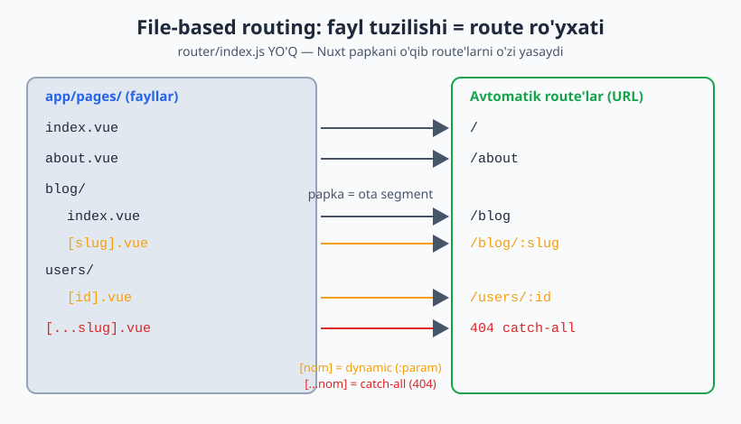
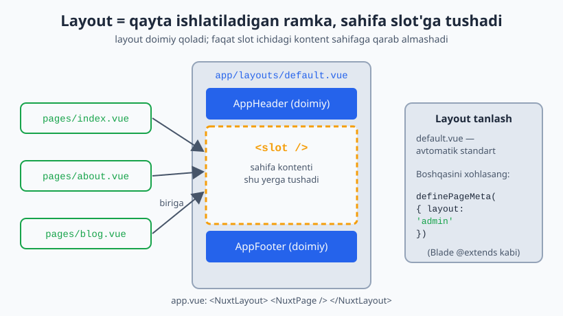
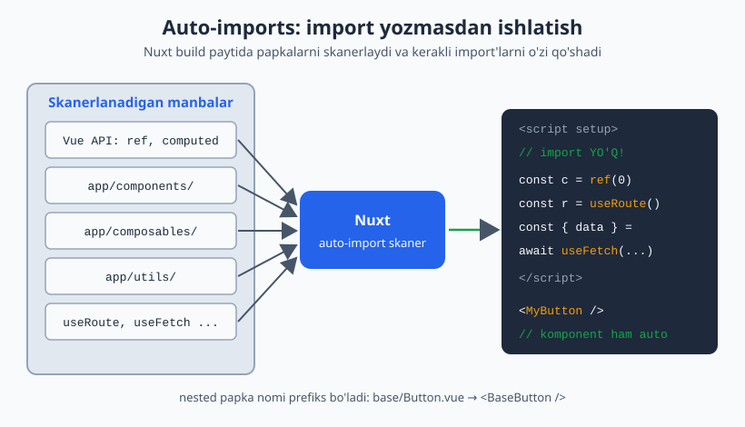

# 07 — Nuxt asoslari

[⬅️ Oldingi: 06 — Pinia](./06-pinia.md) · [🏠 README](./README.md) · [Keyingi: 08 — Data & Server ➡️](./08-nuxt-data-server.md)

---

Vue — kutubxona/freymvork. **Nuxt** — Vue ustiga qurilgan **meta-framework**: routing, SSR, server API, auto-import, SEO — hammasini "convention" bilan tayyor beradi.

**Eng aniq analogiya:** Vue → React kabi, Nuxt → **Laravel** kabi. Sen Laravel'da har safar router, ORM, middleware'ni noldan yozmaysan — convention bor. Nuxt ham xuddi shunday: papkaga fayl tashlaysan, route o'zi paydo bo'ladi.

### Nuxt nima beradi (Vue'da o'zing qilishing kerak bo'lganini)
- **File-based routing** — `router/index.js` yozmaysan (05-modulni eslagin — endi avtomatik)
- **SSR/SSG** — server'da render (SEO, tezlik)
- **Auto-imports** — `import { ref }` yozmaysan; composable/komponentlar avtomatik
- **Server engine (Nitro)** — `/api/...` backend endpointlar shu loyihaning ichida
- **Layouts, middleware, plugins** — Laravel'dagidek tuzilma

> Bu modul **Nuxt 4** strukturasiga asoslangan. Nuxt 3 farqlari belgilab ketiladi.

---

## 7.1 O'rnatish

```bash
npx nuxi@latest init my-nuxt-app
cd my-nuxt-app
npm install
npm run dev      # http://localhost:3000
```

### Nuxt 4 papka strukturasi

```
my-nuxt-app/
├── app/                  # ← brauzerga ketadigan HAMMA narsa shu yerda (Nuxt 4)
│   ├── app.vue           # ildiz komponent (Laravel layouts/app.blade.php kabi)
│   ├── pages/            # routing — har fayl = route
│   ├── components/       # auto-import komponentlar
│   ├── composables/      # auto-import composable'lar
│   ├── layouts/          # qayta ishlatiladigan sahifa qoliplari
│   ├── middleware/       # route middleware (auth va h.k.)
│   ├── plugins/          # ilova boot'ida ishlaydigan kod
│   ├── assets/           # build qilinadigan CSS/rasm
│   └── utils/            # auto-import sof funksiyalar
├── server/               # ← Nitro backend (root'da qoladi)
│   ├── api/              # /api/... endpointlar
│   └── ...
├── shared/               # app + server BIRGA ishlatadigan kod (types, utils)
├── public/               # to'g'ridan-to'g'ri xizmat (favicon, robots.txt)
├── nuxt.config.ts        # asosiy konfiguratsiya
└── package.json
```

> **Nuxt 3 da farq:** `app/` papkasi yo'q edi — `pages/`, `components/`, `composables/`, `app.vue` to'g'ridan-to'g'ri **ildizda** turardi. Nuxt 4 ularni `app/` ichiga ko'chirdi (toza ajratish + tezroq startup). Eski tuzilma hali ishlaydi (backward compat), lekin yangi loyihada `app/` ishlat.

**Nega `app/` va `server/` ajratilgan?** `app/` — brauzer konteksti, `server/` — Node/Nitro konteksti. Ikkisida turli global'lar, turli import'lar bor. Ajratish IDE type-safety va xatolarning oldini oladi. Backend dasturchi sifatida bu mantiq senga tushunarli — frontend va backend kodi aralashmasligi kerak.

---

## 7.2 `app.vue` — ildiz komponent

Eng minimal Nuxt ilovasi — faqat `app/app.vue`:

```vue
<!-- app/app.vue -->
<template>
  <div>
    <h1>Salom Nuxt!</h1>
  </div>
</template>
```

Routing kerak bo'lsa — `<NuxtPage />` qo'shasan (bu Vue Router'dagi `<RouterView>` ning Nuxt versiyasi):

```vue
<!-- app/app.vue -->
<template>
  <div>
    <AppHeader />          <!-- auto-import! import yozish shart emas -->
    <NuxtPage />           <!-- joriy sahifa shu yerda render bo'ladi -->
    <AppFooter />
  </div>
</template>
```

> `app/pages/` papkasi bo'lmasa, Nuxt `vue-router` ni umuman qo'shmaydi (faqat bitta `app.vue` — landing page uchun). Routing kerak bo'lganda `pages/` ochasan.

---

## 7.3 File-based routing — eng katta "wow"

`app/pages/` ichidagi har fayl avtomatik route bo'ladi. **`router/index.js` YO'Q.**

```
app/pages/
├── index.vue            →  /
├── about.vue            →  /about
├── contact.vue          →  /contact
├── blog/
│   ├── index.vue        →  /blog
│   └── [slug].vue       →  /blog/:slug      (dynamic)
├── users/
│   └── [id].vue         →  /users/:id
└── [...slug].vue        →  404 catch-all
```

**05-modul bilan solishtir:** o'sha yerda `routes` massivini qo'lda yozgansan. Nuxt'da — papka tuzilishi = route. Bu Laravel'ning `php artisan route:list` mantiqiga o'xshaydi: convention bor, qo'lda ro'yxat yo'q.

Quyidagi diagramma `app/pages/` papkasidagi har bir fayl qanday qilib avtomatik URL route'iga aylanishini ko'rsatadi:



### Dynamic route va parametr

```vue
<!-- app/pages/users/[id].vue  →  /users/123 -->
<script setup>
const route = useRoute()          // auto-import — vue-router'dan import yo'q
const id = route.params.id
</script>

<template>
  <h1>User #{{ id }}</h1>
</template>
```

### Navigatsiya — `<NuxtLink>`

```vue
<template>
  <nav>
    <NuxtLink to="/">Bosh</NuxtLink>
    <NuxtLink to="/about">Haqida</NuxtLink>
    <NuxtLink :to="`/users/${user.id}`">{{ user.name }}</NuxtLink>
  </nav>
</template>
```

`<NuxtLink>` — `<RouterLink>` ning aqlli versiyasi: prefetch (ko'rinishga kirganda sahifani oldindan yuklaydi), tashqi linklarni avtomatik aniqlaydi. Dasturiy navigatsiya: `navigateTo('/about')` (auto-import).

### Nested routes

`app/pages/dashboard.vue` + `app/pages/dashboard/` papka:

```
app/pages/
├── dashboard.vue        ← ota (ichida <NuxtPage/> bo'lishi kerak)
└── dashboard/
    ├── index.vue        →  /dashboard
    ├── profile.vue      →  /dashboard/profile
    └── settings.vue     →  /dashboard/settings
```

```vue
<!-- app/pages/dashboard.vue -->
<template>
  <div>
    <aside>Yon menyu (doim qoladi)</aside>
    <NuxtPage />          <!-- bola sahifa shu yerda -->
  </div>
</template>
```

---

## 7.4 Layouts — qayta ishlatiladigan qoliplar

Bir nechta sahifa bir xil ramkani (header/footer/sidebar) baham ko'rsa — layout. Laravel `@extends('layouts.app')` ning aynan o'zi.

```vue
<!-- app/layouts/default.vue -->
<template>
  <div>
    <AppHeader />
    <main>
      <slot />            <!-- sahifa kontenti shu yerga tushadi -->
    </main>
    <AppFooter />
  </div>
</template>
```

```vue
<!-- app/layouts/admin.vue -->
<template>
  <div class="admin">
    <AdminSidebar />
    <slot />
  </div>
</template>
```

Sahifada layout tanlash:
```vue
<!-- app/pages/admin/index.vue -->
<script setup>
definePageMeta({ layout: 'admin' })   // default'dan boshqa
</script>
```

`app/app.vue` da `<NuxtLayout>` bo'lishi kerak (yoki Nuxt avtomatik o'raydi):
```vue
<!-- app/app.vue -->
<template>
  <NuxtLayout>
    <NuxtPage />
  </NuxtLayout>
</template>
```

`default.vue` nomli layout — avtomatik standart. Boshqasini xohlasang `definePageMeta({ layout: 'admin' })`.

Diagrammada layout doimiy ramka bo'lib qolishi va `<slot />` ichiga har bir sahifa kontenti tushishi tasvirlangan:



---

## 7.5 Auto-imports — "import yo'q" sehri

Nuxt avtomatik import qiladi:
- **Vue API:** `ref`, `computed`, `watch`, `onMounted` — import yozma
- **`app/components/`** — har komponent global ishlatishga tayyor
- **`app/composables/`** — `useX()` avtomatik
- **`app/utils/`** — sof funksiyalar avtomatik
- **Nuxt composable'lari:** `useRoute`, `useRouter`, `useFetch`, `useState`, `navigateTo`, ...

```vue
<script setup>
// HECH QANDAY import yo'q — hammasi avtomatik
const count = ref(0)
const route = useRoute()
const { data } = await useFetch('/api/users')
</script>

<template>
  <MyButton @click="count++">Bosildi: {{ count }}</MyButton>
  <!-- MyButton = app/components/MyButton.vue, import qilinmagan! -->
</template>
```

### Komponent nomlash (nested)

```
app/components/
├── AppHeader.vue              →  <AppHeader />
├── base/
│   └── Button.vue             →  <BaseButton />     (papka + fayl nomi)
└── user/
    └── Card.vue               →  <UserCard />
```

Nuxt papka nomini prefiks qiladi: `base/Button.vue` → `<BaseButton>`. Bu — komponentlarni guruhlash + nom to'qnashuvini oldini oladi.

Quyidagi diagramma Nuxt build paytida belgilangan papkalarni skanerlab, kerakli import'larni o'zi qanday qo'shishini ko'rsatadi:



> **Auto-import yoqdimi-yo'qmi?** Ko'pchilik yoqtiradi (kam boilerplate). Aniq import xohlasang `nuxt.config` da o'chirsa bo'ladi, lekin tavsiya — convention'ga ergash.

---

## 7.6 `definePageMeta` va `useHead` (SEO)

```vue
<script setup>
definePageMeta({
  layout: 'admin',
  middleware: 'auth',          // app/middleware/auth.ts
  title: 'Boshqaruv paneli',
})

// SEO/meta teglar
useHead({
  title: 'EduCore — Boshqaruv',
  meta: [
    { name: 'description', content: 'O\'quv markazi boshqaruv tizimi' },
  ],
})

// Yoki qulayroq:
useSeoMeta({
  title: 'EduCore',
  description: 'O\'quv markazlari uchun SaaS',
  ogImage: '/og.png',
})
</script>
```

`useSeoMeta`/`useHead` — har sahifaga unikal SEO. **SSR** tufayli bu meta teglar server HTML'ida bo'ladi → Google/ijtimoiy tarmoq to'g'ri o'qiydi. (Oddiy Vue SPA'da bu muammo, Nuxt hal qiladi.)

---

## 7.7 `nuxt.config.ts` — markaziy konfiguratsiya

```ts
// nuxt.config.ts
export default defineNuxtConfig({
  devtools: { enabled: true },

  modules: [
    '@pinia/nuxt',
    '@nuxtjs/tailwindcss',
    '@nuxt/image',
  ],

  css: ['~/assets/css/main.css'],

  runtimeConfig: {
    apiSecret: '',                          // faqat server (maxfiy)
    public: {
      apiBase: 'https://api.educore.uz',    // brauzerga ham ochiq
    },
  },

  app: {
    head: {
      title: 'EduCore',
      htmlAttrs: { lang: 'uz' },
    },
  },
})
```

> `~/` yoki `@/` — `app/` papkani bildiradi (Nuxt 4). `runtimeConfig` — `.env` qiymatlarni xavfsiz boshqarish (`apiSecret` brauzerga chiqmaydi, `public` chiqadi). Laravel'dagi `config()` + `.env` ajratimiga o'xshaydi.

---

## 7.8 Pinia'ni Nuxt'ga ulash

```bash
npm install pinia @pinia/nuxt
```
```ts
// nuxt.config.ts
export default defineNuxtConfig({
  modules: ['@pinia/nuxt'],
})
```

Endi `app/stores/` dagi store'lar auto-import bo'ladi — `createPinia()` qo'lda kerak emas (06-moduldagi setup Nuxt qiladi). Store'larni xuddi 06-moduldagidek yozasan.

---

## Xulosa

- Nuxt = "Vue uchun Laravel" — convention over configuration
- **Nuxt 4:** ilova kodi `app/` da, backend `server/` da, umumiy kod `shared/` da
- **`app/pages/`** = file-based routing (`[id].vue` = dynamic, `[...slug].vue` = catch-all) — qo'lda router yo'q
- `<NuxtPage>` (= RouterView), `<NuxtLink>` (= aqlli RouterLink, prefetch), `navigateTo()`
- **Layouts** (`app/layouts/`) = Blade `@extends`; `<slot/>` ga sahifa tushadi
- **Auto-imports:** Vue API, komponent, composable, util — import yozmaysan
- `definePageMeta` (layout/middleware), `useSeoMeta`/`useHead` (SSR SEO)
- `nuxt.config.ts` + `runtimeConfig` (maxfiy/public ajratish)

---

## 🎯 Masalalar (kamida 20 ta)

### Setup & routing (1–8)

1. `nuxi init` bilan loyiha yarat, ishga tushir, `app/app.vue` ni o'zgartirib brauzerda ko'r.
2. `app/pages/index.vue`, `about.vue`, `contact.vue` yarat; `<NuxtLink>` bilan nav qil. **`router/index.js` yo'qligiga** e'tibor ber.
3. Dynamic route (★): `app/pages/users/[id].vue`; `/users/5`, `/users/42` ga kirib `route.params.id` ni ko'rsat.
4. Catch-all (★): `app/pages/[...slug].vue` 404 sahifa yasa; mavjud bo'lmagan URL'ni ushla.
5. `<NuxtLink>` prefetch (★): Network tab'da, linkga hover qilganda sahifa oldindan yuklanishini kuzat.
6. `navigateTo` (★): tugma bosilganda dasturiy ravishda `/about` ga o't.
7. Nested route (★★): `app/pages/dashboard.vue` + `dashboard/profile.vue`, `dashboard/settings.vue`; yon menyu doim qolsin.
8. Blog (★★): `app/pages/blog/index.vue` (ro'yxat) + `blog/[slug].vue` (post); ro'yxatdan postga `<NuxtLink>` bilan o't.

### Layouts (9–12)

9. `app/layouts/default.vue` (header+footer+slot) yarat; barcha sahifalar undan foydalansin.
10. `app/layouts/admin.vue` (★) yarat; `definePageMeta({ layout: 'admin' })` bilan faqat admin sahifalarga qo'lla.
11. **Layout'siz sahifa (★):** Login sahifasiga `layout: false` yoki bo'sh layout ber.
12. Dinamik layout (★★): foydalanuvchi rolega qarab layout almashtirish (`definePageMeta` + computed/middleware).

### Auto-import & komponentlar (13–17)

13. `app/components/AppHeader.vue` yarat; **import qilmasdan** `app.vue` da ishlat.
14. Nested komponent (★): `app/components/base/Button.vue` → `<BaseButton>` sifatida ishlat.
15. Composable auto-import (★): `app/composables/useCounter.ts` yarat (04-moduldan); import yozmasdan sahifada ishlat.
16. Util auto-import (★): `app/utils/formatDate.ts` yarat; sahifada to'g'ridan-to'g'ri chaqir.
17. 04-moduldagi `useToggle` ni `app/composables/` ga ko'chir va modal komponentida ishlat.

### Meta, config, integratsiya (18–24)

18. SEO (★): har sahifaga `useSeoMeta` bilan unikal title/description ber; View Source'da meta'lar **HTML'da** ekanini tasdiqla (SSR isboti).
19. `definePageMeta({ title })` (★): `app/layouts` yoki plugin orqali sahifa title'ini boshqar.
20. TailwindCSS (★): `@nuxtjs/tailwindcss` modulini ulab, sahifani Tailwind bilan stilla.
21. Pinia (★★): `@pinia/nuxt` ni ulab, 06-moduldagi `useCartStore` ni Nuxt'da ishlat (auto-import store).
22. `runtimeConfig` (★★): `public.apiBase` qo'sh; sahifada `useRuntimeConfig().public.apiBase` ni o'qib ko'rsat.
23. **05↔07 solishtiruv (★★):** 05-moduldagi qo'lda Vue Router setup'ini Nuxt file-based routing bilan taqqosla; xulosani izoh sifatida yoz (qaysi convention nimani avtomatlashtirdi).
24. **EduCore skeleti (★★★):** `app/pages/` da `index`, `login`, `app/` (dashboard, students, payments — nested), `admin/`; `default` + `admin` + `auth` layout'lar; auto-import header/sidebar komponentlari. (Middleware/auth — keyingi modulda to'liq.)

---

### ✅ Tanlangan yechimlar

<details markdown="1">
<summary>7 — Nested dashboard</summary>

```vue
<!-- app/pages/dashboard.vue (ota) -->
<template>
  <div style="display:flex; gap:1rem">
    <aside>
      <NuxtLink to="/dashboard/profile">Profil</NuxtLink>
      <NuxtLink to="/dashboard/settings">Sozlamalar</NuxtLink>
    </aside>
    <main>
      <NuxtPage />   <!-- bola sahifalar shu yerda -->
    </main>
  </div>
</template>
```
```vue
<!-- app/pages/dashboard/profile.vue -->
<template><h2>Profil sahifasi</h2></template>
```
</details>

<details markdown="1">
<summary>10 — Admin layout</summary>

```vue
<!-- app/layouts/admin.vue -->
<template>
  <div class="admin-wrap">
    <AdminSidebar />
    <section class="content"><slot /></section>
  </div>
</template>
```
```vue
<!-- app/pages/admin/index.vue -->
<script setup>
definePageMeta({ layout: 'admin' })
</script>
<template><h1>Admin Dashboard</h1></template>
```
</details>

➡️ Keyingi: [08 — Data Fetching & Server (Nitro)](./08-nuxt-data-server.md)
