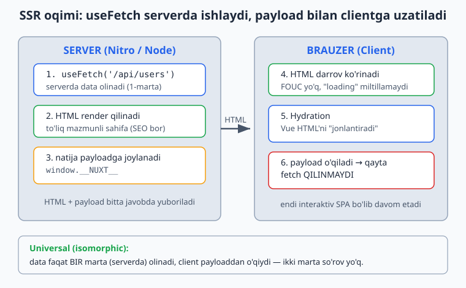
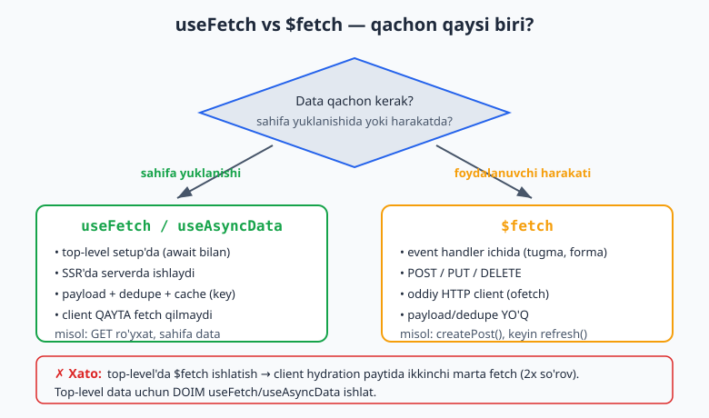
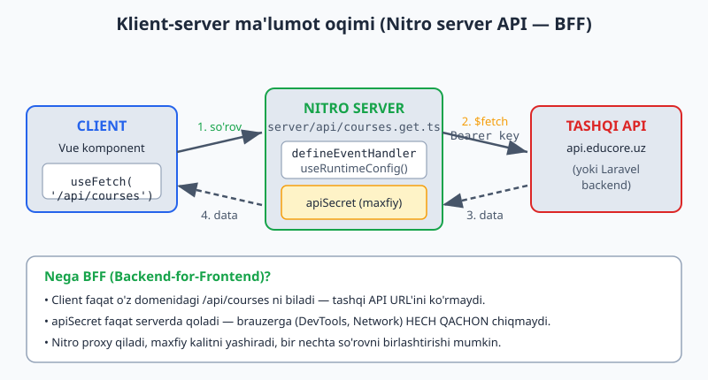

# 08 — Data Fetching & Server (Nitro)

[⬅️ Oldingi: 07 — Nuxt asoslari](./07-nuxt-asoslari.md) · [🏠 README](./README.md) · [Keyingi: 09 — Nuxt UI ➡️](./09-nuxt-ui-asoslar.md)

---

Bu modul Nuxt'ning eng kuchli va eng "fullstack" qismi. Backend odam uchun aynan shu yer qiziq: Nuxt faqat frontend emas — uning ichida **Nitro** degan to'liq server engine bor. Ya'ni bitta loyihada ham Vue app, ham API yozasan. Laravel termini bilan: bu deyarli **mini-Laravel frontend bilan birga keladi**.

Modul 2 qismdan iborat:
1. **Client/Universal data fetching** — `useFetch`, `useAsyncData`, `$fetch`
2. **Server qismi (Nitro)** — `server/api/`, middleware, `useState`

---

## 1. Muammo: nega oddiy `fetch` yetarli emas?

SSR'da kod **ikki marta** ishlaydi: bir marta serverda (birinchi HTML render), bir marta clientda (hydration va keyingi navigatsiya). Endi savol: ma'lumotni qayerda olamiz?

Agar React'dagidek `onMounted` ichida `fetch` qilsang:

```vue
<script setup>
const users = ref([])
onMounted(async () => {
  users.value = await fetch('/api/users').then(r => r.json())
})
</script>
```

Muammolar:
- `onMounted` **faqat clientda** ishlaydi → serverda HTML bo'sh keladi → SEO yo'q, "loading..." miltillaydi (FOUC).
- Bot/Google sahifani ko'rganda ma'lumot yo'q.
- Server qilgan ishni client yana takrorlaydi.

Nuxt buni `useFetch` / `useAsyncData` bilan hal qiladi: **kod serverda ishlaydi, natija HTML bilan birga clientga "payload" sifatida uzatiladi, client uni qayta yuklamaydi.** Bu — universal (isomorphic) data fetching.

Quyidagi diagramma bu oqimni bosqichma-bosqich ko'rsatadi: server data oladi va HTML render qiladi, brauzer uni darrov ko'rsatadi, keyin hydration paytida payloaddan o'qib qayta fetch qilmaydi.



> **Laravel analogiyasi.** Controller `User::all()` ni olib, `view()` ga uzatadi — server ma'lumot bilan tayyor HTML yuboradi. `useFetch` ham xuddi shu, lekin keyin SPA sifatida client-side davom etadi. Ikki dunyoning yaxshisi.

---

## 2. `useFetch` — asosiy ish quroli

Eng ko'p ishlatadigan composable. Setup'ning yuqori qismida (top-level) chaqiriladi.

```vue
<script setup>
const { data, pending, error, refresh } = await useFetch('/api/users')
</script>

<template>
  <p v-if="pending">Yuklanmoqda...</p>
  <p v-else-if="error">Xato: {{ error.message }}</p>
  <ul v-else>
    <li v-for="u in data" :key="u.id">{{ u.name }}</li>
  </ul>
</template>
```

Qaytaradi:

| Maydon | Nima |
|---|---|
| `data` | natija (Ref) |
| `pending` | `true` — yuklanmoqda (boolean Ref) |
| `error` | xato bo'lsa error obyekti, aks holda `null` |
| `refresh()` | qayta yuklash funksiyasi |
| `status` | `'idle' \| 'pending' \| 'success' \| 'error'` |
| `execute()` | `lazy`/`immediate:false` bo'lganda qo'lda ishga tushirish |
| `clear()` | data'ni tozalash |

### Muhim opsiyalar

```js
const { data } = await useFetch('/api/products', {
  query: { page: 1, limit: 20 },   // ?page=1&limit=20
  method: 'GET',
  headers: { 'X-Custom': 'value' },
  lazy: false,        // false = navigatsiyani bloklab kutadi; true = bloklamaydi
  server: true,       // false = faqat clientda fetch qil (SSR'da o'tkazib yubor)
  immediate: true,    // false = avtomatik chaqirmaydi, execute() kutadi
  default: () => [],  // data hali yo'q paytda boshlang'ich qiymat
  watch: [page],      // shu ref o'zgarsa avtomatik refetch
  key: 'products',    // dedupe / cache kaliti
})
```

### `transform` va `pick` — payload'ni kichraytirish

`useFetch` natijasi **HTML bilan clientga uzatiladi** (payload). Agar API katta obyekt qaytarsa, hammasi client'ga ketadi — sahifa og'irlashadi. Faqat kerakligini olib qol:

```js
// pick — faqat shu maydonlar payloadga tushadi
const { data } = await useFetch('/api/user', {
  pick: ['id', 'name', 'avatar'],
})

// transform — server javobini o'zgartirib, kichraytirib saqlash
const { data } = await useFetch('/api/products', {
  transform: (res) => res.items.map(p => ({ id: p.id, title: p.title })),
})
```

> **Why.** Bu performance uchun muhim: API'da 50 ta ustun bo'lsa-yu, sahifada 3 tasi kerak bo'lsa — qolgan 47 tasini client'ga uzatish behuda trafik. `pick`/`transform` payloadni qisqartiradi.

---

## 3. `useAsyncData` — nazorat kerak bo'lganda

`useFetch` aslida `useAsyncData` ustiga sugar:

```js
// Bu ikkalasi deyarli bir xil
useFetch('/api/users')
useAsyncData('users', () => $fetch('/api/users'))
```

`useAsyncData(key, handler)` ni qachon ishlatasan:
- Handler ichida **bir nechta** so'rov birlashtirish kerak bo'lsa.
- HTTP bo'lmagan async logika (masalan, local DB, SDK chaqiruvi).
- O'zing `$fetch` chaqiruvini to'liq nazorat qilmoqchi bo'lsang.

```js
const { data } = await useAsyncData('dashboard', async () => {
  const [stats, recent] = await Promise.all([
    $fetch('/api/stats'),
    $fetch('/api/recent'),
  ])
  return { stats, recent }
})
```

> **Mental model.** `useFetch` = "shu URL'ni ur". `useAsyncData` = "men o'zim yozaman, sen faqat SSR/cache/dedupe'ni boshqar". Birinchi argument **key** — u bo'yicha dedupe va cache ishlaydi.

---

## 4. `$fetch` — action'lar uchun

`$fetch` — haqiqiy HTTP client (`ofetch` kutubxonasi). JSON'ni avtomatik parse qiladi, base URL biladi.

**Qoida (juda muhim):**

| Holat | Nima ishlatasan |
|---|---|
| Sahifa yuklanganda data olish (top-level) | `useFetch` / `useAsyncData` |
| Foydalanuvchi harakati: tugma bosish, forma yuborish (POST/PUT/DELETE) | `$fetch` |

```vue
<script setup>
async function createPost() {
  const post = await $fetch('/api/posts', {
    method: 'POST',
    body: { title: title.value, content: content.value },
  })
  // ro'yxatni yangilash
  await refresh()
}
</script>
```

> **❌ Xato:** setup'ning yuqorisida `const data = await $fetch('/api/users')` yozish. Bu SSR'da ishlaydi-yu, lekin **dedupe/payload** bo'lmaydi → client hydration paytida **yana** fetch qiladi (ikki marta!). Top-level data uchun **doim** `useFetch`/`useAsyncData`. `$fetch` — faqat event handler ichida.

Bu qarorni quyidagi diagramma bilan mustahkamlab oling — qaysi vaziyatda qaysi quroldan foydalanish kerakligini ko'rsatadi.



---

## 5. ⚠️ Nuxt 4 gotcha: `data` endi `shallowRef`

Nuxt 4'da `useFetch`/`useAsyncData` qaytaradigan `data` — **`shallowRef`** (ilgari oddiy `ref` edi). Ya'ni faqat `.value` ni **qayta tayinlash** reaktivlikni ishga soladi; ichidagi nested propertyni o'zgartirish **ishlamaydi**:

```js
const { data } = await useFetch('/api/todos')

// ❌ Ishlamaydi (shallowRef nested o'zgarishni kuzatmaydi)
data.value.push(newTodo)

// ✅ To'g'ri — qayta tayinla
data.value = [...data.value, newTodo]
```

> **Why.** Bu ataylab qilingan performance optimizatsiyasi — katta data obyektini deep-reactive qilish qimmat. Agar deep reaktivlik kerak bo'lsa: `useFetch(url, { deep: true })`.

---

## 6. Xatolarni boshqarish

```vue
<script setup>
const { data, error } = await useFetch('/api/user/123')

// Agar 404 kerak bo'lsa — error.vue sahifasiga o'tkazish
if (error.value) {
  throw createError({
    statusCode: 404,
    statusMessage: 'Foydalanuvchi topilmadi',
    fatal: true,   // fatal:true → error.vue ko'rsatiladi
  })
}
</script>
```

`app/error.vue` — global xato sahifasi (Laravel'dagi `resources/views/errors/404.blade.php` analogi):

```vue
<!-- app/error.vue -->
<script setup>
defineProps({ error: Object })
const handleError = () => clearError({ redirect: '/' })
</script>
<template>
  <div>
    <h1>{{ error.statusCode }}</h1>
    <p>{{ error.statusMessage }}</p>
    <button @click="handleError">Bosh sahifaga</button>
  </div>
</template>
```

---

## 7. Cookie va SSR autentifikatsiya

SSR'da bitta nozik masala bor: server `useFetch` qilganda **brauzer cookie'larini avtomatik uzatmaydi**. Ya'ni login bo'lgan userning tokeni serverdagi so'rovga ilashmaydi. Qo'lda uzatish kerak:

```vue
<script setup>
// SSR paytida kelgan cookie'ni keyingi API so'roviga uzatamiz
const headers = useRequestHeaders(['cookie'])
const { data } = await useFetch('/api/me', { headers })
</script>
```

`useCookie` — SSR-safe reaktiv cookie (ham serverda, ham clientda ishlaydi):

```js
const token = useCookie('auth_token', {
  maxAge: 60 * 60 * 24 * 7,  // 7 kun
  httpOnly: false,            // JS o'qishi kerak bo'lsa
  sameSite: 'lax',
})
token.value = 'eyJ...'  // o'rnatish
```

> **Laravel analogiyasi.** `useCookie` ≈ `cookie()` helper + reaktiv. `useRequestHeaders(['cookie'])` ≈ kiruvchi `Request` headerlarini keyingi internal so'rovga forward qilish (gateway/proxy pattern).

---

# ⚡ 2-QISM: Server (Nitro)

Mana eng qiziq joy. `server/` papkasi — bu **Nitro** engine ostida ishlaydigan to'liq backend. Bu yerda API endpoint, middleware, hatto WebSocket yozasan. Nitro standalone deploy bo'ladi: Node, serverless, edge (Cloudflare Workers, Vercel Edge) — hamma joyda.

```
server/
├── api/            → /api/* endpointlar
├── routes/         → /* (api prefiksisiz route'lar, masalan /sitemap.xml)
├── middleware/     → har bir so'rovda ishlaydigan server middleware
├── plugins/        → Nitro plugin (startup hooks)
└── utils/          → auto-import bo'ladigan server helperlar
```

> **Why bu backend odamga muhim.** EduCore'da haqiqiy backend Laravel'da bo'lishi mumkin. Lekin Nuxt server qismi **BFF (Backend-for-Frontend)** sifatida ishlaydi: Laravel API'ni proxy qiladi, maxfiy kalitlarni yashiradi, auth cookie'larini boshqaradi, bir nechta so'rovni birlashtiradi. Frontend hech qachon to'g'ridan-to'g'ri tashqi API kalitini ko'rmaydi.

---

## 8. Server API routes — `server/api/`

File-based, xuddi sahifalar kabi:

```ts
// server/api/hello.ts  →  GET /api/hello
export default defineEventHandler((event) => {
  return { message: 'Salom EduCore' }   // avtomatik JSON bo'ladi
})
```

`defineEventHandler` = controller method. `event` = `Request`/`Response` o'rami.

### Event utility'lari (eng kerakli)

```ts
export default defineEventHandler(async (event) => {
  const query = getQuery(event)              // ?page=1 → { page: '1' }
  const id = getRouterParam(event, 'id')     // /api/users/5 → '5'
  const body = await readBody(event)         // POST body (JSON)
  const auth = getHeader(event, 'authorization')
  const token = getCookie(event, 'auth_token')

  setResponseStatus(event, 201)
  setCookie(event, 'session', 'abc', { httpOnly: true })

  return { ok: true }
})
```

### Laravel ↔ Nitro lug'ati

| Nitro | Laravel ekvivalenti |
|---|---|
| `server/api/users.ts` | `routes/api.php` + Controller (bitta faylda) |
| `defineEventHandler(fn)` | Controller `__invoke()` |
| `getQuery(event)` | `$request->query()` |
| `readBody(event)` | `$request->all()` / `$request->json()` |
| `getRouterParam(event, 'id')` | route `{id}` parametri |
| `getHeader(event, 'x')` | `$request->header('x')` |
| `setResponseStatus(event, 201)` | `response()->json($d, 201)` |
| `createError({ statusCode })` | `abort(404)` |

### Dynamic va method-based routing

```ts
// server/api/users/[id].ts  →  GET /api/users/:id
export default defineEventHandler((event) => {
  const id = getRouterParam(event, 'id')
  return { id }
})
```

Fayl nomiga method qo'shib, REST resource yasaysan:

```
server/api/posts/
├── index.get.ts      → GET    /api/posts        (ro'yxat)
├── index.post.ts     → POST   /api/posts        (yaratish)
├── [id].get.ts       → GET    /api/posts/:id     (bitta)
├── [id].put.ts       → PUT    /api/posts/:id     (yangilash)
└── [id].delete.ts    → DELETE /api/posts/:id     (o'chirish)
```

> Bu Laravel'ning `Route::apiResource('posts', ...)` ning fayl-tizimdagi ko'rinishi. Har bir verb — alohida fayl, alohida handler.

### BFF misoli — maxfiy kalit bilan tashqi API'ni proxy qilish

```ts
// server/api/courses.get.ts
export default defineEventHandler(async (event) => {
  const config = useRuntimeConfig()   // serverda private kalitlar mavjud
  const data = await $fetch('https://api.educore.uz/courses', {
    headers: { Authorization: `Bearer ${config.apiSecret}` },
  })
  return data
})
```

Endi clientdagi `useFetch('/api/courses')` shu Nitro endpointga uradi, `apiSecret` esa **hech qachon brauzerga chiqmaydi**. Bu — to'g'ri arxitektura.

Quyidagi diagramma klient-server ma'lumot oqimini ko'rsatadi: client faqat o'z `/api/courses` endpointini biladi, Nitro esa maxfiy kalit bilan tashqi API'ni proxy qiladi.



---

## 9. Server middleware — `server/middleware/`

Har bir server so'rovida, route handlerdan **oldin** ishlaydi. Hech narsa `return` qilmaydi — faqat `event.context` ga ma'lumot biriktiradi yoki xato tashlaydi.

```ts
// server/middleware/auth.ts
export default defineEventHandler((event) => {
  const token = getCookie(event, 'auth_token')
  if (token) {
    event.context.user = verifyToken(token)  // keyingi handlerlar o'qiy oladi
  }
})
```

Keyin istalgan API handlerda:

```ts
// server/api/me.get.ts
export default defineEventHandler((event) => {
  if (!event.context.user) {
    throw createError({ statusCode: 401, statusMessage: 'Avtorizatsiya yo\'q' })
  }
  return event.context.user
})
```

> **Laravel analogiyasi.** Server middleware ≈ global middleware (`app/Http/Kernel.php` da ro'yxatdan o'tgan). `event.context` ≈ request'ga bog'langan ma'lumot (`$request->user()` ni middleware o'rnatgani kabi). Har bir so'rovda ishlaydi.

---

## 10. Route middleware — `app/middleware/` (server middleware EMAS!)

Diqqat: bu **boshqa narsa**. Route middleware — navigatsiya guard'i (05-moduldagi Vue Router guard'ining Nuxt versiyasi). Ham serverda, ham clientda, sahifaga **kirishdan oldin** ishlaydi.

```ts
// app/middleware/auth.ts
export default defineNuxtRouteMiddleware((to, from) => {
  const user = useAuthStore()    // yoki useCookie/useState
  if (!user.isLoggedIn) {
    return navigateTo('/login')
  }
})
```

Sahifada ulash:

```vue
<script setup>
definePageMeta({ middleware: 'auth' })
</script>
```

Turlari:
- **Named** — `app/middleware/auth.ts`, `definePageMeta` orqali ulanadi.
- **Global** — `app/middleware/analytics.global.ts`, har bir navigatsiyada avtomatik.
- **Inline** — `definePageMeta({ middleware: [(to) => {...}] })`.

### Ikkalasini ADASHTIRMA — eng muhim jadval

| | Route middleware (`app/middleware/`) | Server middleware (`server/middleware/`) |
|---|---|---|
| Qachon | Sahifaga **navigatsiya**dan oldin | Har bir **HTTP so'rov**da |
| Qayerda | Client + server (navigatsiya) | Faqat server |
| Funksiya | `defineNuxtRouteMiddleware` | `defineEventHandler` |
| Vazifa | Redirect, access control (UI) | Auth context, logging, CORS, headers |
| Laravel analogi | route'ga ulangan middleware (`->middleware('auth')`) | global HTTP middleware (Kernel) |

> **Why ikkitaligi.** Sahifa access controli (login bo'lmasa `/login` ga ot) — bu navigatsiya darajasi → route middleware. API so'rovni himoyalash, har request'da token tekshirish — bu server darajasi → server middleware. Ko'pincha ikkalasi birga kerak.

---

## 11. `useState` — SSR-safe shared state

Bu yer backend odam uchun **xavfsizlik** nuqtai nazaridan juda muhim.

**❌ Hech qachon shunday qilma:**

```js
// composables/counter.js — XATARLI
const count = ref(0)   // module-scope ref
export const useCounter = () => count
```

Nega xatarli? Serverda **bitta process** minglab foydalanuvchiga xizmat qiladi. Module-scope `ref` esa **hamma so'rovlar uchun bitta** — ya'ni A foydalanuvchining ma'lumoti B foydalanuvchiga **leak** bo'ladi. Bu jiddiy xavfsizlik bug'i (cross-request state pollution).

**✅ To'g'ri yo'l — `useState`:**

```js
// SSR-safe, har bir so'rov uchun alohida, clientga serialize bo'ladi
const counter = useState('counter', () => 0)
const user = useState('user', () => null)
```

```vue
<script setup>
const count = useState('count', () => 0)
</script>
<template>
  <button @click="count++">{{ count }}</button>
</template>
```

> **Laravel analogiyasi.** Module-scope `ref` = `static` propertyda request ma'lumotini saqlash (har request'da bir xil obyekt → leak). `useState` = request lifecycle'ga bog'langan, har so'rovda yangi (Laravel'da har request yangi container/instance bo'lgani kabi). Singleton vs request-scoped farqi.

### `useState` vs Pinia

| `useState` | Pinia (06-modul) |
|---|---|
| Oddiy shared SSR state | Murakkab app state |
| Faqat qiymat | State + getters + actions + plugins |
| Tezkor, kichik holatlar | Auth, cart, tenant kabi to'liq domenlar |

Kichik narsaga `useState`, katta domenga Pinia. EduCore'da: theme toggle → `useState`; auth/tenant/cart → Pinia store.

---

## 12. Nitro qo'shimchalari (qisqacha, hero darajasi uchun)

**`routeRules`** — `nuxt.config.ts` da deklarativ rendering/cache/proxy qoidalari:

```ts
export default defineNuxtConfig({
  routeRules: {
    '/':            { prerender: true },          // build'da static
    '/admin/**':    { ssr: false },               // SPA (faqat client)
    '/blog/**':     { isr: 3600 },                // ISR — har soatda regenerate
    '/api/legacy/**': { proxy: 'https://old.educore.uz/**' },  // proxy
  },
})
```

**Cached event handler** — server javobini keshlash:

```ts
// server/api/stats.get.ts
export default defineCachedEventHandler(async () => {
  return await computeHeavyStats()
}, { maxAge: 60 })   // 60 soniya kesh
```

**`useStorage`** — Nitro'ning built-in KV/storage qatlami (Redis, FS, memory):

```ts
const storage = useStorage('redis')
await storage.setItem('key', value)
const v = await storage.getItem('key')
```

> Bularning hammasi alohida chuqur mavzu (rendering modes, Nitro deep) — keyingi to'plamda. Hozircha mavjudligini bil.

---

## 13. EduCore arxitekturasi — hammasi birga

Multi-tenant SaaS uchun tipik Nuxt server oqimi:

```ts
// server/middleware/tenant.ts — subdomain'dan tenant aniqlash
export default defineEventHandler((event) => {
  const host = getHeader(event, 'host') || ''
  const subdomain = host.split('.')[0]        // markaz.educore.uz → "markaz"
  event.context.tenant = subdomain
})
```

```ts
// server/api/students.get.ts — tenant bo'yicha scoping
export default defineEventHandler(async (event) => {
  const tenant = event.context.tenant
  const config = useRuntimeConfig()
  return await $fetch(`${config.apiBase}/students`, {
    headers: {
      'X-Tenant': tenant,
      Authorization: `Bearer ${config.apiSecret}`,
    },
  })
})
```

```ts
// app/middleware/auth.global.ts — UI darajasida himoya
export default defineNuxtRouteMiddleware((to) => {
  const auth = useAuthStore()
  const publicPages = ['/login', '/register']
  if (!auth.isLoggedIn && !publicPages.includes(to.path)) {
    return navigateTo('/login')
  }
})
```

To'liq oqim:
```
Brauzer → markaz.educore.uz
   ↓
server/middleware/tenant.ts  (tenant'ni context'ga qo'yadi)
   ↓
server/middleware/auth.ts    (token tekshiradi)
   ↓
useFetch('/api/students')
   ↓
server/api/students.get.ts   (Laravel API'ni tenant header bilan proxy)
   ↓
Laravel backend (tenant_id scoping, DDD)
```

Frontend hech qachon `apiSecret`'ni ko'rmaydi, tenant aniqlash serverda — bu xavfsiz va to'g'ri arxitektura.

---

## Xulosa — mental model

```
DATA OLISH:
  Sahifa yuklanishi (top-level)  → useFetch / useAsyncData
  Foydalanuvchi harakati (POST)  → $fetch

SERVER:
  server/api/         → endpointlar (defineEventHandler)
  server/middleware/  → har so'rovda (auth context, logging)
  app/middleware/     → navigatsiya guard (defineNuxtRouteMiddleware)

STATE:
  Oddiy SSR state  → useState   (module-scope ref ASLO!)
  Murakkab domen   → Pinia
```

Eng ko'p qilinadigan 3 xato:
1. Top-level'da `$fetch` ishlatib, ikki marta fetch qilish (`useFetch` kerak).
2. Server'da module-scope `ref` — cross-request leak (`useState` kerak).
3. Route middleware bilan server middleware'ni adashtirish.

---

## 🎯 Masalalar (24 ta)

> `npx nuxi init data-lab` bilan loyiha och. Server qismi uchun `server/api/` ichida soxta (mock) data qaytaruvchi endpointlar yozib, frontend bilan ulab mashq qil.

### A daraja — data fetching

1. ★ `/users` sahifa yarat, `useFetch('https://jsonplaceholder.typicode.com/users')` bilan ro'yxat chiqar. `pending` va `error` holatlarini ham ko'rsat.
2. ★ Yuqoridagi so'rovga `pick: ['id', 'name', 'email']` qo'sh. DevTools → payload hajmi qanday o'zgardi, kuzat.
3. ★ `transform` bilan javobni faqat `{ id, name }` massiviga aylantir.
4. ★★ `/posts` sahifa: `?page` query bilan paginatsiya. `page` ref'ini `watch` opsiyasiga ber — sahifa o'zgarsa avtomatik refetch bo'lsin.
5. ★★ "Yangilash" tugmasi qo'y, `refresh()` ni chaqir. Tugma bosilganda `pending` ko'rsatilsinmi? Tekshir.
6. ★★ `lazy: true` va `lazy: false` farqini his qil: ikki sahifa yasab, navigatsiyada qaysi biri "kutadi", qaysi biri darrov ochiladi — kuzat.
7. ❓ Nima uchun setup top-level'da `const d = await $fetch('/api/x')` yomon? O'z so'zing bilan yoz. ✅
8. ★★ `useAsyncData('dash', ...)` bilan ikki endpointni `Promise.all` orqali bitta composable'da birlashtir.

### B daraja — actions va xatolar

9. ★★ Forma yarat (title, body), "Saqlash" tugmasi `$fetch('/api/posts', { method:'POST', body })` qilsin. Javobni konsolga chiqar. ✅
10. ★★ POST muvaffaqiyatli bo'lgach, ro'yxatni `refresh()` bilan yangila.
11. ★★ `[id].vue` sahifada `useFetch('/api/posts/' + id)`. ID mavjud bo'lmasa `createError({ statusCode: 404 })` tashla.
12. ★★ `app/error.vue` yarat, 404 va 500 ni chiroyli ko'rsat, "Bosh sahifaga" tugmasi `clearError` chaqirsin.
13. ❓ Nuxt 4'da `data.value.push(x)` nega UI'ni yangilamaydi? Qanday to'g'rilaysan? ✅
14. ★★★ Optimistic update: tugma bosilganda avval UI'ni yangila (`data.value = [...]`), keyin `$fetch` POST qil. Xato bo'lsa orqaga qaytar (rollback). (06-moduldagi Pinia versiyasi bilan solishtir.)

### C daraja — server (Nitro)

15. ★ `server/api/ping.ts` yarat, `{ pong: true, time: Date.now() }` qaytarsin. Brauzerda `/api/ping` ni och. ✅
16. ★★ `server/api/users/[id].get.ts` — `getRouterParam` bilan ID'ni olib `{ id, name: 'User ' + id }` qaytar.
17. ★★ `server/api/echo.post.ts` — `readBody` bilan kelgan JSON'ni o'qib, qaytarib yubor (echo). `$fetch` bilan POST qilib sina.
18. ★★ Method-based resource: `server/api/todos/` ichida `index.get.ts`, `index.post.ts`, `[id].delete.ts` yoz. In-memory massivda saqla (server qayta ishga tushguncha yashaydi).
19. ★★★ BFF: `server/api/weather.get.ts` — `useRuntimeConfig` dan API kalit olib, tashqi ob-havo API'sini proxy qil. Kalit clientga chiqmasligiga ishonch hosil qil (DevTools → Network).

### D daraja — middleware va state

20. ★★ `server/middleware/logger.ts` — har so'rovda `console.log(event.method, event.path)` chiqarsin. Bir nechta sahifa ochib, terminalda log'ni kuzat. ✅
21. ★★ `server/middleware/auth.ts` — cookie'dan token o'qib `event.context.user` ga qo'ysin. `server/api/me.get.ts` da contextdan o'qib qaytar, yo'q bo'lsa 401.
22. ★★ `app/middleware/guest.ts` — agar `useAuthStore().isLoggedIn` bo'lsa `/dashboard` ga yo'naltir (login sahifasiga ulang).
23. ❓ `useState('x', () => 0)` va `app/middleware/` dagi route middleware — bittasi qaysi muammoni hal qiladi, ikkinchisi qaysisini? Farqini yoz.
24. ★★★ **EduCore mini-BFF.** `server/middleware/tenant.ts` (host'dan subdomain → `event.context.tenant`) + `server/api/students.get.ts` (tenant'ni header qilib mock API qaytaradi) + `app/middleware/auth.global.ts` (login bo'lmasa `/login`). Uchalasini ulab, oqimni ishlatib ko'r. ✅

---

## ✅ Tanlangan yechimlar

<details markdown="1">
<summary>7 — Nega top-level <code>$fetch</code> yomon</summary>

Top-level `$fetch` SSR'da bir marta serverda ishlaydi va HTML hosil qiladi. Lekin uning natijasi **payload sifatida saqlanmaydi** va **key bilan dedupe qilinmaydi**. Shu sababli client hydration paytida Vue yana o'sha kodni ishga tushiradi → **ikkinchi marta** fetch bo'ladi. Natija: ikki barobar so'rov, ortiqcha yuk, ba'zan hydration mismatch.

`useFetch`/`useAsyncData` esa serverdagi natijani `__NUXT__` payloadga joylaydi; client uni o'qiydi, qayta fetch qilmaydi. Shuning uchun: **top-level data → har doim `useFetch`/`useAsyncData`; `$fetch` → faqat event handler (action) ichida.**
</details>

<details markdown="1">
<summary>9 — POST forma</summary>

```vue
<script setup>
const title = ref('')
const body = ref('')
const result = ref(null)
const saving = ref(false)

async function save() {
  saving.value = true
  try {
    result.value = await $fetch('https://jsonplaceholder.typicode.com/posts', {
      method: 'POST',
      body: { title: title.value, body: body.value, userId: 1 },
    })
  } catch (e) {
    console.error('Xato:', e)
  } finally {
    saving.value = false
  }
}
</script>

<template>
  <input v-model="title" placeholder="Sarlavha" />
  <textarea v-model="body" placeholder="Matn" />
  <button :disabled="saving" @click="save">
    {{ saving ? 'Saqlanmoqda...' : 'Saqlash' }}
  </button>
  <pre v-if="result">{{ result }}</pre>
</template>
```
Diqqat: `$fetch` event handler (`save`) ichida — to'g'ri joy. `body` to'g'ridan-to'g'ri obyekt (`ofetch` o'zi JSON qiladi).
</details>

<details markdown="1">
<summary>13 — shallowRef gotcha</summary>

Nuxt 4'da `data` — `shallowRef`. `shallowRef` faqat `.value` butunlay almashtirilsa reaktivlikni ishga soladi; ichidagi massiv/obyektni mutate qilish (`push`, nested o'zgartirish) kuzatilmaydi.

```js
const { data } = await useFetch('/api/todos')

// ❌ UI yangilanmaydi
data.value.push(newTodo)

// ✅ Yangi reference ber
data.value = [...data.value, newTodo]
```
Yoki deep reaktivlik kerak bo'lsa: `useFetch('/api/todos', { deep: true })`. Lekin katta data'da `deep` qimmat — odatda reassign yondashuvi yaxshiroq.
</details>

<details markdown="1">
<summary>15 — birinchi server endpoint</summary>

```ts
// server/api/ping.ts
export default defineEventHandler(() => {
  return { pong: true, time: Date.now() }
})
```
`/api/ping` ga kirsang JSON ko'rasan. `return` qilingan obyekt avtomatik `Content-Type: application/json` bilan beriladi — qo'lda `JSON.stringify` shart emas. Bu Laravel'da controller'dan array qaytarsang avtomatik JSON bo'lganiga o'xshaydi.
</details>

<details markdown="1">
<summary>20 — server logger middleware</summary>

```ts
// server/middleware/logger.ts
export default defineEventHandler((event) => {
  console.log(`[${new Date().toISOString()}] ${event.method} ${event.path}`)
  // hech narsa return qilinmaydi — middleware faqat "o'tib ketadi"
})
```
Muhim: server middleware **hech narsa qaytarmaydi** (qaytarsa, so'rovni shu yerda tugatib qo'yasan). Faqat yon ta'sir (log) yoki `event.context` ga yozish uchun. Har bir so'rovda — shu jumladan `/api/*` va sahifalar uchun ham — ishlaydi. Bu Laravel global middleware'ning aynan o'zi.
</details>

<details markdown="1">
<summary>24 — EduCore mini-BFF</summary>

```ts
// server/middleware/tenant.ts
export default defineEventHandler((event) => {
  const host = getHeader(event, 'host') || 'demo.localhost'
  event.context.tenant = host.split('.')[0]   // markaz.educore.uz → "markaz"
})
```

```ts
// server/api/students.get.ts
export default defineEventHandler((event) => {
  const tenant = event.context.tenant
  // haqiqiy loyihada bu yerda Laravel API'ga $fetch qilinadi (tenant header bilan)
  return {
    tenant,
    students: [
      { id: 1, name: 'Ali', tenant },
      { id: 2, name: 'Vali', tenant },
    ],
  }
})
```

```ts
// app/middleware/auth.global.ts
export default defineNuxtRouteMiddleware((to) => {
  const isLoggedIn = useCookie('auth_token').value
  const publicPages = ['/login', '/register']
  if (!isLoggedIn && !publicPages.includes(to.path)) {
    return navigateTo('/login')
  }
})
```

```vue
<!-- app/pages/students.vue -->
<script setup>
const { data } = await useFetch('/api/students')
</script>
<template>
  <h1>{{ data.tenant }} markazi o'quvchilari</h1>
  <ul><li v-for="s in data.students" :key="s.id">{{ s.name }}</li></ul>
</template>
```

Oqim: navigatsiya → `auth.global.ts` (login tekshiradi) → sahifa `useFetch('/api/students')` → server'da `tenant.ts` middleware tenant'ni aniqlaydi → `students.get.ts` tenant bo'yicha data qaytaradi. Bu real multi-tenant BFF'ning soddalashtirilgan skeletini ko'rsatadi: **tenant aniqlash va maxfiy kalitlar serverda, frontend toza qoladi.**
</details>

---

## 🎓 Birinchi to'plam yakuni

Tabriklayman — Vue 3 yadrosini (01–06) va Nuxt'ning eng muhim qismini (07–08) tugatding. Endi sen:
- Vue'da reaktiv, komponentli, router'li, state-managed SPA yoza olasan.
- Nuxt'da SSR sahifalar, server API, middleware va to'g'ri data fetching arxitekturasini qura olasan.
- EduCore kabi multi-tenant SaaS'ning frontend + BFF skeletini tushunasan.

**Keyingi to'plam** (so'rasang yozaman, shu uslubda):
rendering modes (SSR/SSG/ISR/hybrid chuqur) · SEO/meta to'liq · Nitro deep (storage, caching, tasks) · modules ecosystem · **testing** (Vitest + Vue Test Utils) · **deployment** (VPS/Nginx, Docker, edge) · TypeScript chuqur · performance optimizatsiya.

---

[🏠 README](./README.md) · [⬅️ Oldingi: 07 — Nuxt asoslari](./07-nuxt-asoslari.md) · [Keyingi: 09 — Nuxt UI ➡️](./09-nuxt-ui-asoslar.md)
