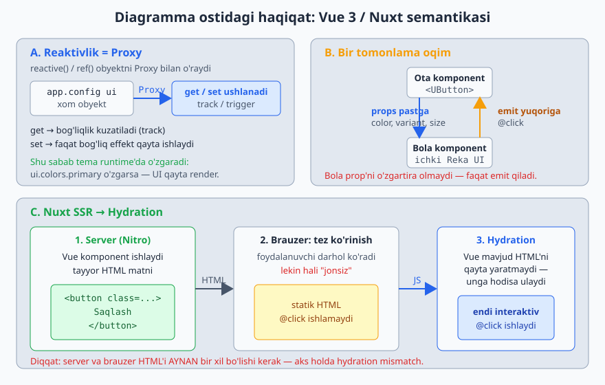
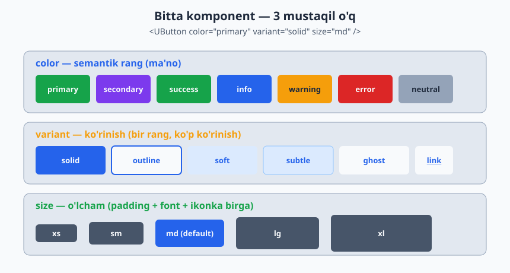
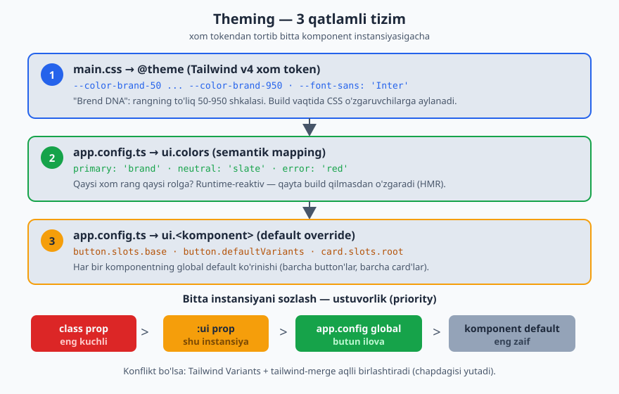

# 09 — Nuxt UI: asoslar, o'rnatish va theming

[⬅️ Oldingi: 08 — Data & Server](./08-nuxt-data-server.md) · [🏠 README](./README.md)

---

Bu va keyingi (10-) modul **Nuxt UI** ga bag'ishlangan — Nuxt jamoasining rasmiy komponentlar kutubxonasi. Ikki qismga bo'ldim:
- **09 (shu modul)** — Nuxt UI nima, o'rnatish, `UApp`, **design system** (rang/variant/size), **theming** (3 qatlamli tizim), `:ui` prop. Ya'ni "tizimni tushunish".
- **10** — har bir komponentni kategoriya bo'yicha batafsil ko'rib chiqamiz (props, slot, misol).

Avval tizimni tushun, keyin komponentlarga o't. Aks holda har bir komponentda bir xil rang/variant tushunchalarini qayta-qayta o'qiysan.

---

## 1. Nuxt UI nima va nega v4 muhim

Nuxt UI — Vue/Nuxt uchun **tayyor, accessible, Tailwind asosidagi** komponentlar kutubxonasi. Button, Input, Modal, Table, butun Dashboard sidebar — hammasi tayyor.

> **Laravel analogiyasi.** Nuxt UI ≈ **Filament**ning UI qatlami, lekin Vue/Nuxt uchun. Filament Laravel'da admin panel komponentlarini tayyor beradi; Nuxt UI ham xuddi shunday tayyor komponentlar beradi — lekin headless va to'liq sozlanuvchi. EduCore admin panelini noldan div/css yozmasdan yig'ish uchun aynan shu kerak.

**v4 nima o'zgartirdi (2025 sentyabr):**
- **Nuxt UI va Nuxt UI Pro birlashdi** — endi hammasi bitta **bepul, MIT** `@nuxt/ui` paketda. Ilgari pullik bo'lgan Dashboard, Page, Auth, Pricing komponentlari endi bepul. (NuxtLabs Vercel'ga qo'shilgani sabab.)
- **125+ komponent**, 12 ta bepul template, Figma kit.
- Asosi: **Reka UI** (accessibility/primitivlar) + **Tailwind CSS v4** + **Tailwind Variants** (class tizimi).
- Faqat Nuxt emas — **toza Vue** (Vite) loyihalarda ham ishlaydi.

Hozirgi versiya: **v4.8+** (tez yangilanadi).

---

## 2. O'rnatish (Nuxt)

```bash
pnpm add @nuxt/ui tailwindcss
```

```ts
// nuxt.config.ts
export default defineNuxtConfig({
  modules: ['@nuxt/ui'],
  css: ['~/assets/css/main.css'],
})
```

```css
/* app/assets/css/main.css */
@import "tailwindcss";
@import "@nuxt/ui";
```

Tamom. Nuxt UI o'zi avtomatik o'rnatadi: `@nuxt/icon` (ikonkalar), `@nuxt/fonts` (shriftlar), `@nuxtjs/color-mode` (dark mode). Ularni alohida `modules` ga qo'shma — konflikt bo'ladi.

### Toza Vue (Nuxt'siz)

```ts
// vite.config.ts
import vue from '@vitejs/plugin-vue'
import ui from '@nuxt/ui/vite'

export default defineConfig({
  plugins: [vue(), ui()],
})
```

---

## 3. ⚠️ `UApp` — eng muhim wrapper (buni unutsang, yarmi ishlamaydi)

Butun ilovani **`<UApp>`** ichiga o'rab qo'yish **shart**. U global provayderlarni o'rnatadi: Toast (`useToast`), Overlay (`useOverlay`), Tooltip, dark mode konteksti.

```vue
<!-- app/app.vue -->
<template>
  <UApp>
    <NuxtLayout>
      <NuxtPage />
    </NuxtLayout>
  </UApp>
</template>
```

> **Why.** `useToast()` yoki `useOverlay()` ishlamasa — 90% holatda sabab shu: `UApp` yo'q. U Toaster va OverlayProvider'ni daraxtning tepasiga joylaydi (Vue'ning `provide/inject` mexanizmi — 03-modul). Laravel analogiyasi: bu app-level "service provider"ni `register` qilishga o'xshaydi — global servislar shu yerda ulanadi.

`UApp` qabul qiladigan foydali proplar: `:toaster` (toast joylashuvi), `:tooltip` (global tooltip sozlamalari), `locale` (i18n).

Bu `provide/inject`, reaktivlik va SSR Nuxt ostida aniq qanday ishlashini bir rasmda jamlab ko'rsataman — keyingi bo'limlardagi "runtime-reaktiv tema" va `@click` xulqi shu mexanizmlardan kelib chiqadi.



---

## 4. Design System — rang, variant, size

Bu — Nuxt UI'ning yuragi. Deyarli **har bir komponent** bir xil 3 ta propni qabul qiladi: `color`, `variant`, `size`. Buni bir marta tushunsang — 125 ta komponentni bilasan.

### 4.1. Semantik ranglar (`color`)

Nuxt UI to'g'ridan-to'g'ri `red`/`blue` ishlatmaydi. U **semantik** (ma'noga bog'langan) ranglarni ishlatadi:

| Semantik rang | Vazifasi |
|---|---|
| `primary` | asosiy brend rangi (default: green) |
| `secondary` | ikkilamchi aksent |
| `success` | muvaffaqiyat (yashil) |
| `info` | ma'lumot (ko'k) |
| `warning` | ogohlantirish (sariq) |
| `error` | xato (qizil) |
| `neutral` | kulrang — fon, chegara, matn |

```vue
<UButton color="primary">Saqlash</UButton>
<UButton color="error" variant="soft">O'chirish</UButton>
<UAlert color="warning" title="Diqqat" />
```

Class sifatida ham ishlatasan: `bg-primary`, `text-primary`, `text-primary-500`, `ring-primary`. `primary` ning DEFAULT soyasi temaga moslashadi — light'da 500, dark'da 400.

> **Why semantik.** `color="error"` yozsang, keyin brendni o'zgartirsang (qizil → to'q sariq) — faqat bitta config qatorini o'zgartirasan, butun ilova moslashadi. `bg-red-500` yozsang — har joyda qo'lda almashtirasan. Bu **design token** falsafasi.

### 4.2. Variant (`variant`)

Bir rang — bir necha ko'rinish. Button uchun:

| Variant | Ko'rinish |
|---|---|
| `solid` | to'liq to'ldirilgan (default) |
| `outline` | faqat chegara |
| `soft` | yengil fon (rangning och varianti) |
| `subtle` | soft + nozik chegara |
| `ghost` | fonsiz, hover'da paydo bo'ladi |
| `link` | havola ko'rinishi |

```vue
<UButton color="primary" variant="solid">Asosiy</UButton>
<UButton color="primary" variant="outline">Ikkilamchi</UButton>
<UButton color="neutral" variant="ghost">Bekor qilish</UButton>
```

> Form-input komponentlarida variant boshqacha bo'ladi (`outline`, `soft`, `subtle`, `ghost`, `none`) — lekin g'oya bir xil.

### 4.3. Size (`size`)

`xs` · `sm` · `md` (default) · `lg` · `xl` — barcha komponentlarda bir xil shkala. Bitta `size` butun komponentning padding, font, ikonka o'lchamini muvofiq o'zgartiradi.

```vue
<UButton size="xs">Kichik</UButton>
<UInput size="lg" placeholder="Katta input" />
```

Quyidagi rasm uchala propni bitta o'qda jamlaydi — bu uch o'q mustaqil, ularni xohlagancha kombinatsiya qilasan.



---

## 5. Theming — 3 qatlamli tizim

Nuxt UI theming aynan 3 qatlamdan iborat. Har birining aniq vazifasi bor — adashtirma.

```
Qatlam 1: main.css        → xom dizayn tokenlar (@theme) — "brend DNA"
Qatlam 2: app.config.ts   → semantik mapping (qaysi rang primary)
Qatlam 3: app.config.ts   → komponent override (default stillarni o'zgartirish)
```

### Qatlam 1 — `@theme` (Tailwind v4 dizayn tokenlari)

Tailwind v4 "CSS-first" — sozlash JS config'da emas, CSS'da `@theme` ichida:

```css
/* app/assets/css/main.css */
@import "tailwindcss";
@import "@nuxt/ui";

@theme {
  /* O'z brend rangingni 50–950 to'liq shkala bilan ber */
  --color-brand-50:  #eff6ff;
  --color-brand-500: #2563eb;
  --color-brand-950: #172554;

  /* Shrift */
  --font-sans: 'Inter', sans-serif;
}
```

> **Muhim:** custom rang qo'shsang, **50 dan 950 gacha** barcha soyalarni berishing kerak — komponentlar ularning hammasini ishlatadi. Hex'dan to'liq shkala uchun `uicolors.app` yoki Tailwind palitrasidan foydalan.

### Qatlam 2 — semantik mapping (`app.config.ts`)

Xom tokenlarni semantik rolga ulaysan. Bu **runtime-reaktiv** — qayta build qilmasdan, hatto ish vaqtida temani almashtirib bo'ladi (HMR bilan):

```ts
// app/app.config.ts
export default defineAppConfig({
  ui: {
    colors: {
      primary: 'brand',    // 1-qatlamdagi custom rang
      secondary: 'purple',
      success: 'green',
      info: 'blue',
      warning: 'amber',
      error: 'red',
      neutral: 'zinc',     // kulranglar
    },
  },
})
```

> **Laravel analogiyasi.** `app.config.ts` ≈ `config/` papkasidagi config fayllar — markazlashgan sozlamalar. Farqi: bu runtime'da reaktiv (Laravel config build/cache'lanadi).

### Qatlam 3 — komponent override (`app.config.ts`)

Har bir komponentning **default** ko'rinishini global o'zgartirish. Masalan, "barcha button'lar default `neutral` + `subtle` bo'lsin":

```ts
// app/app.config.ts
export default defineAppConfig({
  ui: {
    button: {
      slots: {
        base: 'font-bold rounded-lg',   // har bir button'ga
      },
      defaultVariants: {
        color: 'neutral',
        variant: 'subtle',
        size: 'lg',
      },
    },
    card: {
      slots: {
        root: 'rounded-xl',
        body: 'p-6',
      },
    },
  },
})
```

**Compound variants** — ma'lum rang+size kombinatsiyasiga maxsus stil:

```ts
button: {
  compoundVariants: [
    { color: 'primary', size: 'sm', class: 'ring-2 ring-primary/60' },
  ],
}
```

---

## 6. `:ui` prop va `class` — bitta instansiyani sozlash

Global config butun ilovaga ta'sir qiladi. Bitta joyda o'zgartirish kerak bo'lsa — `:ui` prop (slot'larni nishonga oladi) yoki `class` (root slot):

```vue
<UCard :ui="{ header: 'p-8 text-xl', body: 'p-8 space-y-4', footer: 'border-t' }">
  <template #header>Sarlavha</template>
  Asosiy kontent
  <template #footer>Pastki qism</template>
</UCard>

<!-- class — root/base slot uchun -->
<UButton class="w-full" trailing-icon="i-lucide-arrow-right">Davom etish</UButton>
```

**Ustuvorlik (priority):**
```
class prop  >  :ui prop  >  app.config.ts global  >  komponent default
```

> **Why bu ishlaydi.** Nuxt UI ostida **Tailwind Variants** + `tailwind-merge` bor. Ya'ni sening class'ing core class bilan **aqlli birlashadi** (konflikt bo'lsa seniki yutadi), CSS cascade bilan urishmaysan. `p-8` bersang — komponentning `p-4` i o'rniga qo'yiladi, ikkalasi qo'shilib ketmaydi.

Quyidagi rasm uchala theming qatlamini va bitta instansiyaga tushadigan to'liq ustuvorlik zanjirini bir joyda ko'rsatadi.



> **Laravel analogiyasi.** `:ui` bilan slot override ≈ `vendor:publish` qilingan paket view'ini o'zgartirish — asl paketni buzmasdan ustiga o'z stilingni qo'yasan.

### Komponentni qayerdan o'rganish: slot'larni bilish

Har bir komponentning qanday slot'lari (`base`, `header`, `body`, `trailingIcon`...) borligini hujjatdagi **Theme** bo'limidan ko'rasan — `:ui` da aynan o'sha kalitlarni ishlatasan. 10-modulda muhim komponentlarning asosiy slot'larini ko'rsataman.

---

## 7. Dark mode

`@nuxtjs/color-mode` avtomatik ulangan. Class-strategiya (`dark:` Tailwind). Komponentlar o'zi moslashadi. Tugma:

```vue
<UColorModeButton />   <!-- tayyor light/dark toggle -->
```

Yoki qo'lda:

```vue
<script setup>
const colorMode = useColorMode()
// colorMode.preference = 'dark' | 'light' | 'system'
</script>
```

`bg-default`, `text-default`, `text-muted`, `border-default` kabi semantik klasslar ham bor — ular light/dark'da o'zi to'g'ri rangga o'tadi (qo'lda `dark:bg-...` yozish shart emas).

---

## 8. Ikonkalar (Icon)

`@nuxt/icon` + Iconify — 200,000+ ikonka. Format: `i-{collection}-{name}`.

```vue
<UIcon name="i-lucide-rocket" class="size-5 text-primary" />
<UButton icon="i-lucide-plus">Qo'shish</UButton>
<UButton leading-icon="i-lucide-arrow-left" trailing-icon="i-lucide-arrow-right" />
```

Mashhur to'plamlar: `i-lucide-*` (Lucide — toza, tavsiya), `i-heroicons-*`, `i-simple-icons-*` (brendlar: github, google). Loading ikonkasini globalda o'zgartirish: `app.config.ts` → `ui.icons.loading`.

---

## Xulosa — mental model

```
@nuxt/ui o'rnatish:
  1. modules: ['@nuxt/ui'] + css faylga @import
  2. app.vue ni <UApp> ga o'ra (Toast/Overlay uchun SHART)

Har komponent: color + variant + size
  color   → semantik (primary/success/error/neutral...)
  variant → solid/outline/soft/subtle/ghost/link
  size    → xs/sm/md/lg/xl

Theming (3 qatlam):
  @theme (main.css)         → xom token (rang 50–950, shrift)
  ui.colors (app.config)    → semantik mapping (runtime-reaktiv)
  ui.<component> (app.config) → default override

Bitta instansiya:
  :ui prop (slotlar) yoki class (root) — Tailwind Variants aqlli merge qiladi
```

---

## 🎯 Masalalar (20 ta)

> `npx nuxi init ui-lab` → Nuxt UI o'rnat → `app.vue` ni `<UApp>` ga o'ra. Hamma masalani shu loyihada bajar.

### A — setup va asoslar

1. ★ Yangi Nuxt loyiha och, `@nuxt/ui` o'rnat, `main.css` ni to'g'ri sozla. `<UButton>Salom</UButton>` ekranga chiqsin. ✅
2. ★ `app.vue` ni `<UApp>` ga o'ra. Keyin `useToast().add({ title: 'Test' })` ni tugmaga ulab, toast chiqishini tekshir. (Avval `UApp`siz sinab ko'r — nima bo'ladi?) ✅
3. ★ Bitta qatorda 7 ta button yarat, har birida boshqa `color` (primary→neutral). Vizual farqni ko'r.
4. ★ Bitta `color="primary"` button'ning 6 ta variantini (`solid`→`link`) yonma-yon chiqar.
5. ★ `size` ni `xs` dan `xl` gacha o'zgartirib, button va input qanday kattalashishini kuzat.

### B — theming

6. ★★ `@theme` ichida o'z `brand` rangingni (50–950) e'lon qil, `app.config.ts` da `primary: 'brand'` qil. Button rangi o'zgardimi? ✅
7. ★★ `app.config.ts` orqali **barcha** button'larni default `variant: 'soft'`, `size: 'lg'` qil. Endi `<UButton>` (propsiz) qanday ko'rinadi?
8. ★★ `app.config.ts` da `card.slots.root` ga `rounded-2xl` ber. Barcha kartalar o'zgardimi?
9. ★★ Bitta `UCard` ga `:ui="{ body: 'p-10' }"` ber. Global config'ni emas, faqat shu kartani o'zgartirdimi? Ustuvorlikni tushuntir. ✅
10. ❓ `class="p-8"` bilan `:ui="{ base: 'p-2' }"` urishsa, qaysi biri yutadi va nega? `tailwind-merge` roli nima?
11. ★★ `secondary` va `success` ranglarini boshqacha Tailwind ranglarga map qil (`app.config.ts`). Alert'larda sina.

### C — dark mode va ikonka

12. ★ `<UColorModeButton />` qo'shib, light/dark almashtir. Komponentlar o'zi moslashdimi?
13. ★★ `bg-default`, `text-muted`, `border-default` klasslari bilan oddiy div yasab, dark mode'da rangi o'zgarishini kuzat (`dark:` yozmasdan).
14. ★★ `useColorMode()` bilan o'z toggle tugmangni yoz (`colorMode.preference` ni almashtir).
15. ★ 5 xil ikonka chiqar: `i-lucide-*` to'plamidan 3 ta, `i-simple-icons-github`, `i-heroicons-bell`. `class` bilan rang/o'lcham ber.
16. ★★ Button'ga `loading` prop ber — loading ikonkasi paydo bo'ladimi? Keyin `loading-auto` bilan form submit'da avtomatik loading'ni sina (08/Form bilan bog'la).

### D — EduCore tematik

17. ★★ EduCore brendini o'rnat: `primary` = o'z rangin, `neutral` = `slate`, shrift = `Inter`. Bosh sahifada brendlangan button + card ko'rsat. ✅
18. ★★ "O'quvchi qo'shish" (primary, solid), "Tahrirlash" (neutral, outline), "O'chirish" (error, soft) — 3 ta amaliy button'ni to'g'ri rang/variant bilan yasab, ButtonGroup'ga joyla. (ButtonGroup — 10-modulda.)
19. ❓ Nega EduCore'da `bg-red-500` o'rniga `color="error"` ishlatish strategik jihatdan to'g'ri? Kelajakda brend o'zgarsa nima yutasan?
20. ★★★ `app.config.ts` da to'liq EduCore "design preset" yoz: ranglar + button default'lari + card default'lari + input default `size`. Buni bitta faylda jamlab, "tema" sifatida hujjatlashtir. ✅

---

## ✅ Tanlangan yechimlar

<details markdown="1">
<summary>1 — o'rnatish</summary>

```bash
pnpm dlx nuxi@latest init ui-lab
cd ui-lab
pnpm add @nuxt/ui tailwindcss
```
```ts
// nuxt.config.ts
export default defineNuxtConfig({
  modules: ['@nuxt/ui'],
  css: ['~/assets/css/main.css'],
})
```
```css
/* app/assets/css/main.css */
@import "tailwindcss";
@import "@nuxt/ui";
```
```vue
<!-- app/app.vue -->
<template>
  <UApp>
    <div class="p-8">
      <UButton>Salom</UButton>
    </div>
  </UApp>
</template>
```
`pnpm dev` → button chiroyli ko'rinadi. Agar style yo'q bo'lsa — `main.css` ni `css: [...]` ga qo'shishni unutgansan.
</details>

<details markdown="1">
<summary>2 — UApp va toast</summary>

```vue
<script setup>
const toast = useToast()
function notify() {
  toast.add({ title: 'Test', description: 'Toast ishladi!', color: 'success' })
}
</script>
<template>
  <UApp>
    <UButton @click="notify">Toast chiqar</UButton>
  </UApp>
</template>
```
`UApp`siz: `useToast()` ishlaydi, lekin toast **ekranda ko'rinmaydi** (Toaster provayderi yo'q) — yoki konsolda inject ogohlantirishi chiqadi. `UApp` Toaster'ni daraxtga qo'shadi (provide/inject, 03-modul). Shuning uchun u **shart**.
</details>

<details markdown="1">
<summary>6 — custom brand rang</summary>

```css
/* main.css */
@import "tailwindcss";
@import "@nuxt/ui";

@theme {
  --color-brand-50:  #eef2ff;
  --color-brand-100: #e0e7ff;
  --color-brand-200: #c7d2fe;
  --color-brand-300: #a5b4fc;
  --color-brand-400: #818cf8;
  --color-brand-500: #6366f1;
  --color-brand-600: #4f46e5;
  --color-brand-700: #4338ca;
  --color-brand-800: #3730a3;
  --color-brand-900: #312e81;
  --color-brand-950: #1e1b4b;
}
```
```ts
// app.config.ts
export default defineAppConfig({
  ui: { colors: { primary: 'brand' } },
})
```
Endi `<UButton>` indigo-brend rangida. Soyalardan birortasini qoldirib ketsang (masalan 300) — o'sha soyani ishlatadigan komponent buziladi. Shuning uchun **to'liq 50–950**.
</details>

<details markdown="1">
<summary>9 — :ui prop ustuvorligi</summary>

```vue
<UCard :ui="{ body: 'p-10' }">Faqat shu karta p-10</UCard>
<UCard>Bu karta default padding'da</UCard>
```
`:ui` faqat **shu instansiya**ga ta'sir qiladi — global config'ni o'zgartirmaydi. Ustuvorlik: `class` > `:ui` > `app.config.ts` global > komponent default. Ya'ni: umumiy qoidani `app.config.ts` da, istisnoni `:ui`/`class` da. Bu Laravel'da global config vs runtime override'ga o'xshaydi.
</details>

<details markdown="1">
<summary>17 — EduCore brend</summary>

```css
/* main.css */
@import "tailwindcss";
@import "@nuxt/ui";
@theme {
  --font-sans: 'Inter', sans-serif;
  --color-edu-50: #ecfeff;  --color-edu-500: #0891b2;  --color-edu-950: #083344;
  /* ... to'liq shkala ... */
}
```
```ts
// app.config.ts
export default defineAppConfig({
  ui: {
    colors: { primary: 'edu', neutral: 'slate' },
  },
})
```
```vue
<template>
  <div class="p-8 space-y-4">
    <UCard>
      <template #header><h2 class="font-bold">EduCore</h2></template>
      <p class="text-muted">Multi-tenant ta'lim platformasi</p>
      <template #footer>
        <UButton color="primary">Boshlash</UButton>
      </template>
    </UCard>
  </div>
</template>
```
Brend bir joyda (`app.config.ts` + `@theme`) — butun ilova avtomatik moslashadi.
</details>

<details markdown="1">
<summary>20 — EduCore design preset</summary>

```ts
// app/app.config.ts — EduCore "tema"
export default defineAppConfig({
  ui: {
    colors: {
      primary: 'edu',
      secondary: 'indigo',
      neutral: 'slate',
      error: 'red',
      success: 'emerald',
      warning: 'amber',
    },
    button: {
      slots: { base: 'font-medium rounded-lg' },
      defaultVariants: { size: 'md' },
    },
    card: {
      slots: { root: 'rounded-xl ring-default', body: 'p-6' },
    },
    input: {
      defaultVariants: { size: 'md' },
    },
    formField: {
      slots: { label: 'font-medium text-default' },
    },
  },
})
```
Bu — EduCore'ning yagona "manba" temasi. Yangi sahifa yozganda hech narsa sozlashing shart emas — barcha komponentlar shu presetdan keladi. Laravel'da `config/educore.php` ga o'xshaydi, lekin runtime-reaktiv.
</details>

---

➡️ Keyingi: [10 — Nuxt UI komponentlari (to'liq ma'lumotnoma)](./10-nuxt-ui-komponentlar.md)
