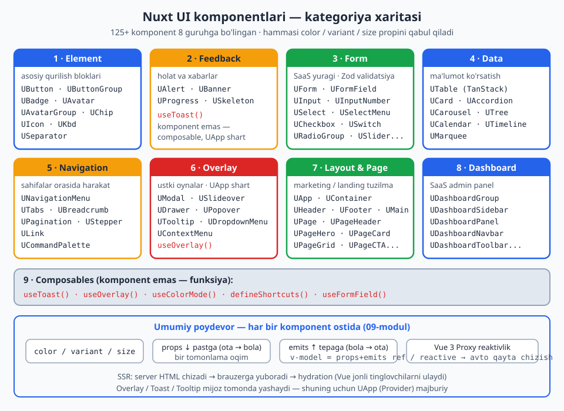
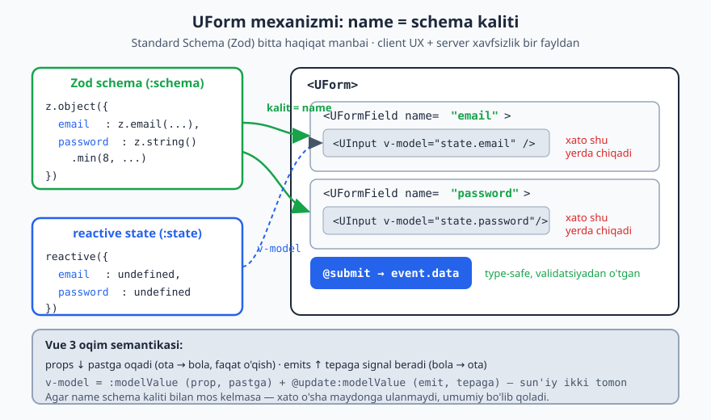
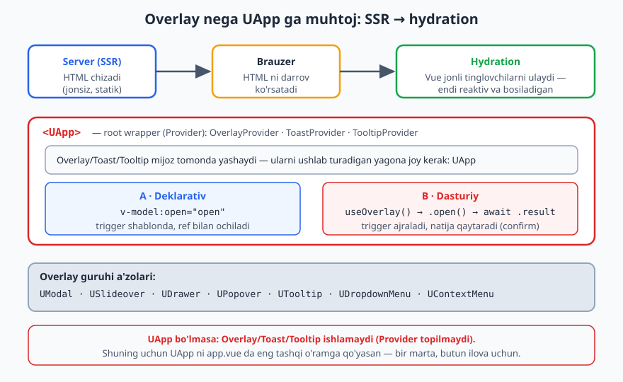

# 10 — Nuxt UI komponentlari (to'liq ma'lumotnoma)

[⬅️ Oldingi: 09 — Nuxt UI asoslar](./09-nuxt-ui-asoslar.md) · [🏠 README](./README.md)

---

Bu — Nuxt UI'ning 125+ komponentini **kategoriya bo'yicha** ko'rib chiqadigan ma'lumotnoma. Eng ko'p ishlatadigan komponentlarni **chuqur** (props + slot + misol), nisbatan kam ishlatiladiganlarni **qisqa** (nima qiladi + asosiy props + mini-misol) ko'rsataman.

**Buni o'qishdan oldin 09-modulni o'qigan bo'l.** U yerda `color`, `variant`, `size`, `:ui`, slot tushunchalari bor — bu yerda ularni qayta tushuntirmayman. Deyarli har bir komponent o'sha 3 propni qabul qiladi.

> 💡 Har bir komponentning to'liq prop/slot ro'yxati `ui.nuxt.com/docs/components/<nom>` da. Bu yerda **amaliy yadro**ni beraman — kunlik ishda 90% shu kerak bo'ladi.

**Kategoriyalar:**
1. Element (Button, Badge, Avatar...) · 2. Feedback (Alert, Toast, Progress...) · 3. Form (Form + barcha inputlar) · 4. Data (Table, Card, Accordion...) · 5. Navigation (Menu, Tabs, Pagination...) · 6. Overlay (Modal, Slideover, Dropdown...) · 7. Layout & Page · 8. Dashboard · 9. Composables

Quyidagi xarita 8 kategoriyaning har birida nima borligini va hammasining tagidagi umumiy poydevorni (color/variant/size, props ↓ / emits ↑, Proxy reaktivlik, SSR/hydration) bir ko'rinishda jamlaydi:



---

## 1. Element — asosiy qurilish bloklari

### Button — `UButton`
Eng ko'p ishlatiladigan. Tugma yoki havola (`to` bersang `<NuxtLink>` bo'ladi).

| Prop | Vazifa |
|---|---|
| `label` / default slot | matn |
| `color`, `variant`, `size` | 09-modul |
| `icon` | faqat ikonka (label'siz → icon-only) |
| `leading-icon` / `trailing-icon` | chap/o'ng ikonka |
| `avatar` | ichida avatar (`{ src }`) |
| `loading` | spinner ko'rsatadi |
| `loading-auto` | `type="submit"` da form yuborilayotganda avtomatik loading |
| `block` | to'liq kenglik (`w-full`) |
| `square` | kvadrat (icon-only uchun) |
| `disabled`, `to`, `type` | — |

```vue
<UButton color="primary" icon="i-lucide-save" loading-auto type="submit">Saqlash</UButton>
<UButton color="neutral" variant="ghost" square icon="i-lucide-x" />
<UButton to="/dashboard" trailing-icon="i-lucide-arrow-right">Panelga</UButton>
```
Slot'lar (`:ui` uchun): `base`, `label`, `leadingIcon`, `trailingIcon`.

### ButtonGroup — `UButtonGroup`
Bir nechta button/inputni yopishtirib qo'yadi (segment).
```vue
<UButtonGroup size="md">
  <UButton color="neutral" variant="outline" label="Kun" />
  <UButton color="neutral" variant="outline" label="Hafta" />
  <UButton color="neutral" variant="outline" label="Oy" />
</UButtonGroup>
```

### Badge — `UBadge`
Status/yorliq. `color`, `variant`, `size`, `label`, `icon`.
```vue
<UBadge color="success" variant="subtle">Faol</UBadge>
<UBadge color="error" variant="soft">To'lanmagan</UBadge>
```

### Avatar / AvatarGroup — `UAvatar`, `UAvatarGroup`
```vue
<UAvatar src="https://github.com/nuxt.png" alt="Nuxt" size="lg" />
<UAvatar text="OQ" />                          <!-- rasmsiz: initsiallar -->
<UAvatar icon="i-lucide-user" />               <!-- ikonka -->

<UAvatarGroup :max="3" size="md">
  <UAvatar src="..." /><UAvatar src="..." /><UAvatar text="AB" /><UAvatar text="CD" />
</UAvatarGroup>                                 <!-- ortig'i "+N" bo'ladi -->
```

### Chip — `UChip`
Boshqa elementga **nuqta/indikator** biriktiradi (masalan, avatarga "online" nuqtasi yoki xabar soni).
```vue
<UChip color="success" inset>
  <UAvatar src="..." />
</UChip>
<UChip :text="5" size="2xl" color="error">
  <UButton icon="i-lucide-bell" color="neutral" variant="ghost" />
</UChip>
```

### Icon, Kbd, Separator
```vue
<UIcon name="i-lucide-rocket" class="size-5 text-primary" />
<UKbd value="meta" /> <UKbd value="K" />          <!-- klaviatura tugmasi -->
<USeparator label="yoki" />                        <!-- ajratuvchi chiziq -->
```

---

## 2. Feedback — holat va xabarlar

### Alert — `UAlert`
Diqqat tortuvchi xabar (sahifa ichida turadi).
```vue
<UAlert
  color="warning" variant="subtle"
  icon="i-lucide-triangle-alert"
  title="Diqqat"
  description="To'lov muddati tugayapti."
  :actions="[{ label: 'To\'lash', color: 'warning' }]"
  :close="true"
/>
```
Props: `title`, `description`, `icon`, `color`, `variant`, `:actions` (button massivi), `:close`, `orientation`.

### Toast — `useToast` (komponent emas, composable)
Vaqtinchalik bildirishnoma (o'ng pastda paydo bo'lib yo'qoladi). **`<UApp>` shart** (09-modul).
```vue
<script setup>
const toast = useToast()
toast.add({
  title: 'Saqlandi',
  description: 'O\'quvchi ma\'lumoti yangilandi.',
  color: 'success',
  icon: 'i-lucide-check',
  duration: 4000,
  actions: [{ label: 'Bekor qilish', onClick: () => {} }],
})
// toast.remove(id) · toast.update(id, {...}) · toast.clear()
</script>
```
> **Laravel analogiyasi.** `useToast` ≈ session flash message (`->with('success', '...')`) — lekin client-side, dinamik va action'lar bilan.

### Progress, Skeleton, Banner
```vue
<UProgress v-model="percent" :max="100" />        <!-- yoki animatsion (indeterminate) -->
<USkeleton class="h-12 w-full" />                  <!-- yuklanish placeholder -->
```
`UBanner` — sahifa tepasidagi global e'lon chizig'i (`app.vue` da, `<UApp>` ichida):
```vue
<UBanner icon="i-lucide-megaphone" title="EduCore v2 chiqdi!" to="/whats-new" />
```

---

## 3. Form — eng muhim qism (SaaS yuragi)

### Umumiy arxitektura
Nuxt UI form tizimi 2 komponentdan iborat:
- **`UForm`** — validatsiya + submit'ni boshqaradi.
- **`UFormField`** — bitta maydon (label + xato xabari) o'rami.

Validatsiya **Standard Schema** kutubxonalari bilan: **Zod**, Valibot, Yup, Joi, Superstruct yoki o'z funksiyang. Hech qaysi biri ichida kelmaydi — kerakligini o'rnatasan (`pnpm add zod`).

```vue
<script setup lang="ts">
import * as z from 'zod'
import type { FormSubmitEvent } from '@nuxt/ui'

const schema = z.object({
  email: z.email('Email noto\'g\'ri'),
  password: z.string().min(8, 'Kamida 8 belgi'),
})
type Schema = z.output<typeof schema>

const state = reactive<Partial<Schema>>({ email: undefined, password: undefined })
const toast = useToast()

async function onSubmit(event: FormSubmitEvent<Schema>) {
  // event.data — validatsiyadan o'tgan, type-safe data
  await $fetch('/api/login', { method: 'POST', body: event.data })
  toast.add({ title: 'Kirildi', color: 'success' })
}
</script>

<template>
  <UForm :schema="schema" :state="state" class="space-y-4" @submit="onSubmit">
    <UFormField label="Email" name="email" required>
      <UInput v-model="state.email" type="email" class="w-full" />
    </UFormField>

    <UFormField label="Parol" name="password" required>
      <UInput v-model="state.password" type="password" class="w-full" />
    </UFormField>

    <UButton type="submit" loading-auto>Kirish</UButton>
  </UForm>
</template>
```

**Eng muhim mexanizm:** `UFormField`ning `name` proli `schema`dagi maydon nomi bilan **bir xil** bo'lishi kerak — shunda xato xabari avtomatik o'sha maydon tagida chiqadi. Qo'lda hech narsa ulamaysan.

Quyidagi diagramma bu bog'lanishni va Vue 3 oqim semantikasini (props ↓ pastga, emits ↑ tepaga, `v-model` = ikkalasi) ko'rsatadi:



> **Laravel analogiyasi.** Bu `FormRequest` validatsiyasiga juda o'xshaydi: `rules()` = Zod schema, validation messages avtomatik maydonlarga biriktiriladi. **Bonus:** Zod schema'ni `server/api/` da **qayta ishlatish** mumkin — bitta schema ham clientda, ham serverda validatsiya qiladi (DRY). Laravel'da rule'lar faqat serverda; bu yerda ikkalasi.

**`UForm` props/xususiyatlari:**
- `:schema`, `:state`, `@submit`, `@error`
- `validate-on` — qachon tekshirish: `['blur', 'input', 'change', 'submit']`
- `:transform` — submit'da Zod `.transform()` natijasini qaytarish (default true)
- `nested` — ichki (child) form
- Default slot `{ errors, loading }` ni beradi.
- **Template ref** orqali metodlar: `formRef.value.validate()`, `.clear()`, `.submit()`, `.setErrors([...])`, `.getErrors()`.

**`UFormField` props:** `label`, `name`, `description`, `help`, `hint`, `error` (qo'lda xato), `required`, `size`, `eager-validation`.

### Input komponentlari

Hammasi `v-model`, `color` (focus ring), `variant`, `size`, `icon`, `disabled` ni qabul qiladi.

**`UInput`** — matn/email/parol/raqam:
```vue
<UInput v-model="q" icon="i-lucide-search" placeholder="Qidirish..." />
<UInput v-model="pwd" type="password" :ui="{ trailing: 'pe-1' }">
  <template #trailing>
    <UButton color="neutral" variant="link" icon="i-lucide-eye" @click="toggle" />
  </template>
</UInput>
```

**`UInputNumber`** — raqam (stepper bilan): `v-model`, `:min`, `:max`, `:step`, `:format-options`.

**`UTextarea`** — ko'p qatorli: `:rows`, `autoresize`, `:maxrows`.

**`USelect`** — oddiy dropdown (native-ga yaqin):
```vue
<USelect v-model="role" :items="['admin', 'teacher', 'student']" placeholder="Rol" />
<!-- obyekt items: -->
<USelect v-model="val" :items="[{ label: 'Admin', value: 'a' }]" />
```

**`USelectMenu`** — kuchaytirilgan select: **qidiruv**, multiple, custom item rendering, "yangi yaratish":
```vue
<USelectMenu v-model="selected" :items="users" label-key="name" searchable multiple />
```

**`UInputMenu`** — combobox (autocomplete + erkin matn / teglar kiritish).

**`UCheckbox` / `UCheckboxGroup`**, **`URadioGroup`**, **`USwitch`**:
```vue
<UCheckbox v-model="agree" label="Shartlarga roziman" />
<USwitch v-model="active" label="Faol" />
<URadioGroup v-model="plan" :items="[{label:'Free',value:'free'},{label:'Pro',value:'pro'}]" />
```

**`USlider`** — diapazon: `v-model`, `:min`, `:max`, `:step`.

**`UPinInput`** — OTP/PIN kiritish: `:length`, `type`, `otp`.

**`UFileUpload`** — fayl yuklash (drag-drop): `v-model`, `accept`, `multiple`.

**`UColorPicker`** — rang tanlash.

> Barchasi `UFormField` ichida ishlaydi va `name` orqali avtomatik xato ko'rsatadi.

---

## 4. Data — ma'lumot ko'rsatish

### Table — `UTable` (eng kuchli data komponenti)
**TanStack Table** (`useVueTable`) + **TanStack Virtual** ustiga qurilgan. To'liq type-safe: sort, filter, paginatsiya, qator tanlash, kengaytirish, virtualizatsiya.

```vue
<script setup lang="ts">
import { h, resolveComponent } from 'vue'
import type { TableColumn } from '@nuxt/ui'

const UBadge = resolveComponent('UBadge')

type Student = { id: number; name: string; status: 'active' | 'inactive'; balance: number }

const data = ref<Student[]>([
  { id: 1, name: 'Ali Valiyev', status: 'active', balance: 250000 },
  { id: 2, name: 'Lola Karimova', status: 'inactive', balance: 0 },
])

const columns: TableColumn<Student>[] = [
  { accessorKey: 'id', header: 'ID' },
  { accessorKey: 'name', header: 'F.I.O' },
  {
    accessorKey: 'status',
    header: 'Holat',
    // cell — render funksiya (h yoki resolveComponent bilan)
    cell: ({ row }) => h(UBadge, {
      color: row.original.status === 'active' ? 'success' : 'neutral',
      variant: 'subtle',
    }, () => row.original.status),
  },
  {
    accessorKey: 'balance',
    header: () => h('div', { class: 'text-right' }, 'Balans'),
    cell: ({ row }) => h('div', { class: 'text-right' },
      new Intl.NumberFormat('uz').format(row.original.balance) + " so'm"),
  },
]
</script>

<template>
  <UTable :data="data" :columns="columns" :loading="pending" sticky />
</template>
```

Asosiy nuqtalar:
- `:data` — obyektlar massivi. `:columns` bermasang — kalitlardan avtomatik yasaladi.
- `column.cell: ({ row }) => ...` — `row.original` orqali qator datasiga kirasan; `h()` bilan istalgan komponent render qilasan (Badge, Button...).
- `column.meta.class.{ th, td }` — ustun stilini berish.
- **Reaktiv holatlar:** `v-model:row-selection`, `v-model:sorting`, `v-model:column-filters`, `v-model:expanded`, `v-model:pagination`.
- **Slot'lar:** `#<column>-cell`, `#<column>-header`, `#expanded`, `#empty`, `#loading`.
- Template ref → `tableApi` (TanStack instansiyasi — full nazorat).

> **Laravel analogiyasi.** `UTable` + TanStack ≈ Laravel'dagi data-table paketlari (yoki Filament Table) — lekin frontend-side. Server-side paginatsiya/sort kerak bo'lsa: holatlarni (`sorting`, `pagination`) `watch` qilib, `useFetch` query'siga uzatasan (08-modul bilan birlashtir).

### Card — `UCard`
```vue
<UCard>
  <template #header><h3 class="font-semibold">Statistika</h3></template>
  <p>Asosiy kontent shu yerda.</p>
  <template #footer>
    <UButton color="primary">Batafsil</UButton>
  </template>
</UCard>
```
Slot/`:ui` kalitlari: `root`, `header`, `body`, `footer`.

### Accordion — `UAccordion`
```vue
<UAccordion :items="[
  { label: 'Savol 1', icon: 'i-lucide-help-circle', content: 'Javob 1' },
  { label: 'Savol 2', content: 'Javob 2' },
]" type="single" collapsible />
```
`type`: `single` | `multiple`. Murakkab kontent uchun `#content` slot.

### Boshqalar (qisqa)
- **`UCarousel`** — slayder (Embla asosida): `:items` + `#default="{ item }"`. `loop`, `:autoplay`, `arrows`, `dots`.
- **`UMarquee`** — uzluksiz aylanuvchi lenta (logotiplar uchun).
- **`UTree`** — daraxt tuzilma: `:items` (nested), `v-model`.
- **`UCalendar`** — sana tanlash kalendar (range, multiple).
- **`UTimeline`** — vaqt chizig'i (qadamlar tarixi).

---

## 5. Navigation — navigatsiya

### NavigationMenu — `UNavigationMenu`
Asosiy menyu (gorizontal yoki vertikal — sidebar uchun ideal).
```vue
<script setup lang="ts">
import type { NavigationMenuItem } from '@nuxt/ui'
const items: NavigationMenuItem[] = [
  { label: 'Bosh sahifa', icon: 'i-lucide-house', to: '/' },
  { label: 'O\'quvchilar', icon: 'i-lucide-users', to: '/students', badge: '24' },
  {
    label: 'Sozlamalar', icon: 'i-lucide-settings',
    children: [
      { label: 'Profil', to: '/settings/profile' },
      { label: 'Billing', to: '/settings/billing' },
    ],
  },
]
</script>
<template>
  <UNavigationMenu :items="items" orientation="vertical" />
</template>
```
Item maydonlari: `label`, `icon`, `to`, `active`, `badge`, `children`, `disabled`, `onSelect`.

### Tabs — `UTabs`
```vue
<UTabs :items="[
  { label: 'Umumiy', icon: 'i-lucide-info', slot: 'general' },
  { label: 'Xavfsizlik', slot: 'security' },
]" variant="link">
  <template #general>Umumiy kontent</template>
  <template #security>Xavfsizlik kontenti</template>
</UTabs>
```
`variant`: `pill` | `link`. `orientation`. `:content="false"` (faqat tab tugmalari).

### Breadcrumb, Pagination, Stepper, Link
```vue
<UBreadcrumb :items="[{label:'Bosh',to:'/'},{label:'O\'quvchilar',to:'/students'},{label:'Ali'}]" />

<UPagination v-model:page="page" :total="240" :items-per-page="20" show-edges />

<UStepper v-model="step" :items="[
  { title: 'Ma\'lumot', icon: 'i-lucide-user' },
  { title: 'To\'lov', icon: 'i-lucide-credit-card' },
  { title: 'Tasdiq', icon: 'i-lucide-check' },
]" />

<ULink to="/about" active-class="text-primary">Biz haqimizda</ULink>
```

### CommandPalette — `UCommandPalette`
Cmd+K qidiruv oynasi (Fuse.js fuzzy qidiruv). Odatda Modal ichida:
```vue
<UCommandPalette :groups="[
  { id: 'pages', label: 'Sahifalar', items: [
    { label: 'O\'quvchilar', icon: 'i-lucide-users', to: '/students' },
  ]},
]" placeholder="Buyruq yoki sahifa qidirish..." />
```

---

## 6. Overlay — ustki oynalar

Bu guruh **`<UApp>`** ga muhtoj (OverlayProvider). Ikki ishlatish usuli bor: **deklarativ** (`v-model:open`) va **dasturiy** (`useOverlay`).

Quyidagi diagramma SSR → hydration oqimini va nega Overlay/Toast/Tooltip uchun `UApp` Provider majburiy ekanini, hamda ikki ochish usulini ko'rsatadi:



### Modal — `UModal`
**Deklarativ:**
```vue
<script setup>
const open = ref(false)
</script>
<template>
  <UModal v-model:open="open" title="O'quvchini o'chirish"
          description="Bu amalni qaytarib bo'lmaydi.">
    <UButton color="error" label="O'chirish" />   <!-- trigger (default slot) -->

    <template #body>
      <p>Haqiqatan ham o'chirmoqchimisiz?</p>
    </template>
    <template #footer="{ close }">
      <UButton color="neutral" variant="outline" label="Bekor" @click="close" />
      <UButton color="error" label="O'chirish" @click="remove" />
    </template>
  </UModal>
</template>
```
Slot'lar: default (trigger), `#content` (butun ichki), yoki `#header`/`#body`/`#footer` alohida. Props: `title`, `description`, `dismissible` (tashqariga bosib yopish), `:overlay`, `:transition`, `fullscreen`, `:close`.

### Slideover — `USlideover`
Ekran chetidan suriladi (filtrlar, detallar paneli uchun). `side`: `right` (default) | `left` | `top` | `bottom`. Slot/proplar Modal'ga o'xshash.
```vue
<USlideover v-model:open="open" title="Filtrlar" side="right">
  <UButton label="Filtr" icon="i-lucide-filter" />
  <template #body><!-- filtr formasi --></template>
</USlideover>
```

### Drawer — `UDrawer`
Pastdan chiqadigan "bottom sheet" (mobil-uslub). `modal`, `dismissible`, `#content`.

### useOverlay — dasturiy ochish (kuchli pattern)
Trigger'ni komponentdan ajratish va **natija qaytarish** uchun. Confirm dialog'lar uchun ideal.

```vue
<!-- 1. Alohida modal komponent — close event chiqaradi -->
<!-- components/ConfirmModal.vue -->
<script setup lang="ts">
defineProps<{ title: string }>()
const emit = defineEmits<{ close: [boolean] }>()
</script>
<template>
  <UModal :title="title">
    <template #footer>
      <UButton variant="outline" label="Yo'q" @click="emit('close', false)" />
      <UButton color="error" label="Ha" @click="emit('close', true)" />
    </template>
  </UModal>
</template>
```
```vue
<!-- 2. Istalgan joyda dasturiy chaqirish -->
<script setup lang="ts">
import { LazyConfirmModal } from '#components'
const overlay = useOverlay()
const confirmModal = overlay.create(LazyConfirmModal)

async function deleteStudent(id: number) {
  const instance = confirmModal.open({ title: 'O\'chirishni tasdiqlang' })
  const confirmed = await instance.result    // close event qiymatini kutadi
  if (confirmed) {
    await $fetch(`/api/students/${id}`, { method: 'DELETE' })
  }
}
</script>
```
> **Why bu zo'r.** Trigger button modal'dan ajraladi — bitta `ConfirmModal`ni butun ilovada qayta ishlatasan, `await` bilan "ha/yo'q" natijani olasan. `useOverlay` `createSharedComposable` asosida — holat butun ilovada bitta.

### DropdownMenu, ContextMenu — `UDropdownMenu`, `UContextMenu`
```vue
<UDropdownMenu :items="[
  [{ label: 'Profil', icon: 'i-lucide-user' }, { label: 'Sozlama', icon: 'i-lucide-settings' }],
  [{ label: 'Chiqish', icon: 'i-lucide-log-out', color: 'error', onSelect: logout }],
]">
  <UButton icon="i-lucide-ellipsis-vertical" color="neutral" variant="ghost" />
</UDropdownMenu>
```
Ichki massivlar — guruhlar (orasiga ajratuvchi qo'yadi). `UContextMenu` — o'ng-klik menyusi (xuddi shu items).

### Popover, Tooltip — `UPopover`, `UTooltip`
```vue
<UPopover mode="click">
  <UButton label="Ko'proq" />
  <template #content><div class="p-4">Erkin kontent</div></template>
</UPopover>

<UTooltip text="O'chirish" :kbds="['meta', 'D']">
  <UButton icon="i-lucide-trash" color="error" variant="ghost" />
</UTooltip>
```
`UTooltip` ham `<UApp>` (TooltipProvider) ga muhtoj.

---

## 7. Layout & Page (ilgari Pro — endi bepul)

Marketing/landing va hujjat sahifalari uchun tayyor tuzilmalar.

- **`UApp`** — root wrapper (majburiy, 09-modul).
- **`UContainer`** — markazlashgan, max-width konteyner.
- **`UHeader`** / **`UFooter`** — sayt header/footer (slot'lar: `#left`, `#right`, `#center`).
- **`UMain`** — asosiy kontent zonasi (header balandligini hisobga oladi).
- **`UPage`** — `#left` (sidebar) + default + `#right` (TOC) ustunli layout.
- **`UPageHeader`** — `title`, `description`, `:links`, `headline`.
- **`UPageBody`**, **`UPageGrid`**, **`UPageColumns`** — kontent tartibi.
- **`UPageCard`**, **`UPageFeature`**, **`UPageSection`**, **`UPageHero`**, **`UPageCTA`** — landing bloklari.
- **`UPageList`**, **`UPageLinks`**, **`UPageLogos`**, **`UPageMarquee`**, **`UPageAccordion`** — yordamchi bloklar.

```vue
<template>
  <UContainer>
    <UPageHero
      title="EduCore"
      description="O'quv markazlar uchun zamonaviy boshqaruv tizimi"
      :links="[{ label: 'Boshlash', to: '/register', color: 'primary' }]"
    />
    <UPageGrid>
      <UPageCard title="Multi-tenant" description="Har markaz alohida" icon="i-lucide-building" />
      <UPageCard title="To'lovlar" description="Avtomatik hisob-kitob" icon="i-lucide-wallet" />
    </UPageGrid>
  </UContainer>
</template>
```

---

## 8. Dashboard (ilgari Pro — endi bepul) — SaaS admin uchun

EduCore admin paneli aynan shu komponentlar bilan tez yig'iladi. Bular birga ishlaydi.

- **`UDashboardGroup`** — butun panel wrapper (sidebar holatini, kenglikni boshqaradi, localStorage'da saqlaydi).
- **`UDashboardSidebar`** — yon panel: `collapsible`, `resizable`, `mode` (mobil: `drawer`/`slideover`/`modal`). Slot'lar: `#header`, default, `#footer`. `{ collapsed }` slot prop.
- **`UDashboardPanel`** — kontent paneli (`id`, `resizable`). Slot'lar: `#header`, `#body`, `#footer`.
- **`UDashboardNavbar`** — panel ustki paneli: `title`, `icon`, `:toggle`. Slot'lar: `#leading`, `#trailing`, `#right`.
- **`UDashboardToolbar`** — navbar ostidagi qo'shimcha panel (filtrlar, tablar).
- **`UDashboardSearch`** / **`UDashboardSearchButton`** — Cmd+K qidiruv.
- **`UDashboardResizeHandle`** — o'lcham o'zgartirish dastagi.

```vue
<!-- app/layouts/dashboard.vue -->
<script setup lang="ts">
import type { NavigationMenuItem } from '@nuxt/ui'
const items: NavigationMenuItem[] = [
  { label: 'Bosh', icon: 'i-lucide-house', to: '/' },
  { label: 'O\'quvchilar', icon: 'i-lucide-users', to: '/students' },
  { label: 'To\'lovlar', icon: 'i-lucide-wallet', to: '/payments' },
]
</script>
<template>
  <UDashboardGroup>
    <UDashboardSidebar collapsible resizable>
      <template #header="{ collapsed }">
        <span v-if="!collapsed" class="font-bold text-lg">EduCore</span>
        <UIcon v-else name="i-lucide-graduation-cap" class="size-6 text-primary" />
      </template>

      <UNavigationMenu :items="items" orientation="vertical" />

      <template #footer>
        <UDropdownMenu :items="[[{ label: 'Chiqish', icon: 'i-lucide-log-out' }]]">
          <UButton block color="neutral" variant="ghost" :avatar="{ src: '/me.png' }" label="Profil" />
        </UDropdownMenu>
      </template>
    </UDashboardSidebar>

    <UDashboardPanel>
      <template #header>
        <UDashboardNavbar title="Boshqaruv paneli">
          <template #trailing><UBadge color="primary" variant="subtle">Demo</UBadge></template>
          <template #right>
            <UColorModeButton />
            <UButton icon="i-lucide-bell" color="neutral" variant="ghost" />
          </template>
        </UDashboardNavbar>
      </template>

      <template #body>
        <slot />   <!-- sahifa kontenti -->
      </template>
    </UDashboardPanel>
  </UDashboardGroup>
</template>
```
> **Laravel analogiyasi.** Bu komponentlar to'plami ≈ **Filament panel** — sidebar, navbar, panel hammasi tayyor, faqat `items` va kontent berasan. Lekin bu yerda to'liq Vue, to'liq sozlanuvchi. EduCore admin'i uchun haftalarcha vaqtni tejaydi.

---

## 9. Composables — xulosa

| Composable | Vazifa |
|---|---|
| `useToast()` | toast qo'shish/o'chirish (`.add`, `.remove`, `.update`, `.clear`) |
| `useOverlay()` | Modal/Slideover'ni dasturiy ochish (`.create`, `.open`, awaitable) |
| `useColorMode()` | dark/light boshqarish (`.preference`, `.value`) |
| `defineShortcuts({ ... })` | klaviatura yorliqlari (`meta_k: () => ...`) |
| `useFormField()` | maxsus input yozganda Form bilan ulanish (advanced) |

```vue
<script setup>
defineShortcuts({
  'meta_k': () => { searchOpen.value = true },   // Cmd/Ctrl + K
  'g-d': () => navigateTo('/dashboard'),          // ketma-ket: g, keyin d
})
</script>
```

---

## 🧩 EduCore capstone — to'liq sahifa

Yuqoridagi `dashboard` layout + bu sahifa = ishlaydigan admin ekrani:

```vue
<!-- app/pages/students/index.vue -->
<script setup lang="ts">
import { h, resolveComponent } from 'vue'
import type { TableColumn } from '@nuxt/ui'
definePageMeta({ layout: 'dashboard' })

const UBadge = resolveComponent('UBadge')
const slideoverOpen = ref(false)

const { data, pending, refresh } = await useFetch('/api/students')

type Student = { id: number; name: string; status: string }
const columns: TableColumn<Student>[] = [
  { accessorKey: 'name', header: 'F.I.O' },
  { accessorKey: 'status', header: 'Holat',
    cell: ({ row }) => h(UBadge, { color: row.original.status === 'active' ? 'success' : 'neutral', variant: 'subtle' }, () => row.original.status) },
]
</script>

<template>
  <UDashboardToolbar>
    <UInput icon="i-lucide-search" placeholder="Qidirish..." />
    <UButton icon="i-lucide-plus" label="O'quvchi qo'shish" @click="slideoverOpen = true" class="ms-auto" />
  </UDashboardToolbar>

  <div class="p-4">
    <UTable :data="data ?? []" :columns="columns" :loading="pending" />
  </div>

  <USlideover v-model:open="slideoverOpen" title="Yangi o'quvchi" side="right">
    <template #body>
      <!-- 3-bo'limdagi UForm shu yerga -->
    </template>
  </USlideover>
</template>
```
Bu — 07/08-moduldagi Nuxt asoslari + 09-modul theming + shu modul komponentlari birga. Mana shunday EduCore admin'i yig'iladi.

---

## 🎯 Masalalar (22 ta)

> 09-moduldagi `ui-lab` loyihasida davom et. Mock data uchun `server/api/` (08-modul) ishlat.

### A — element va feedback
1. ★ `UButton`ning barcha variant + 3 ta rangini jadval ko'rinishida chiqar (matritsa).
2. ★ `UAvatarGroup` (`:max="3"`) bilan 6 ta avatar — ortig'i "+3" bo'lsin.
3. ★ Bell ikonkali button'ga `UChip` bilan o'qilmagan xabar soni (5) qo'sh.
4. ★★ `UAlert` ning 4 holatini (success/info/warning/error) `:actions` va `:close` bilan yasab chiqar. ✅
5. ★★ `useToast` bilan 4 xil rangdagi toast chiqaruvchi 4 tugma. Bittasiga `actions` ("Bekor qilish") qo'sh. Avval `UApp` borligini tekshir. ✅

### B — form (eng muhim)
6. ★★ Login formasi: Zod schema (email + parol min 8). `UForm` + 2 ta `UFormField` + submit. Xato xabarlari to'g'ri maydonda chiqsinmi? ✅
7. ★★ Ro'yxatdan o'tish formasi: ism, email, parol, parolni takrorlash (`.refine` bilan moslik tekshir), shartlarga rozilik (`UCheckbox`). ✅
8. ★★ `USelectMenu` (searchable) bilan "o'qituvchi tanlash" maydoni qo'sh (mock ro'yxatdan). `UFormField` ichida.
9. ★★ `UInputNumber` bilan "narx" maydoni (`:min="0"`, `format-options` so'm uchun).
10. ❓ Nima uchun `UFormField`ning `name` proli schema kaliti bilan bir xil bo'lishi shart? Bir xil bo'lmasa nima bo'ladi?
11. ★★★ Bitta Zod schema'ni ham `UForm`da (client), ham `server/api/students.post.ts` da (server) ishlat. DRY validatsiya. (08-modul bilan birlashtir.) ✅

### C — data
12. ★★ `UTable` yasab, mock o'quvchilar ro'yxatini ko'rsat. `status` ustunini `UBadge` bilan render qil (`cell` + `h`). ✅
13. ★★ `UTable`ga `v-model:row-selection` qo'shib, tanlangan qatorlar sonini tepada ko'rsat.
14. ★★ `UTable` + `UPagination`: `page` ni `useFetch` query'siga uzatib, server-side paginatsiya qil.
15. ★★ `UAccordion` bilan FAQ bo'limi (5 savol) yasab, `#content` slot bilan boyit.
16. ★ `UCard` bilan 3 ta "statistika kartasi" (o'quvchilar soni, daromad, faol guruhlar) — header/body/footer bilan.

### D — navigation va overlay
17. ★★ `UNavigationMenu` (vertical) bilan EduCore sidebar menyusi — `children` (ichki menyu) va `badge` bilan. ✅
18. ★★ `UTabs` bilan profil sahifasi: "Umumiy", "Xavfsizlik", "Biljing" tablari.
19. ★★ `UModal` (deklarativ) bilan "o'chirishni tasdiqlash" dialogi — footer'da Bekor/O'chirish.
20. ★★★ `useOverlay` bilan **qayta ishlatiluvchi** `ConfirmModal` yoz (close event qaytaradi). `await` bilan "ha/yo'q" olib, jadvaldan qator o'chir. ✅
21. ★★ `UDropdownMenu` bilan jadval qatoridagi "..." amallar menyusi (Tahrirlash / O'chirish, guruhlangan).

### E — to'liq yig'ish
22. ★★★ **EduCore admin ekrani.** `dashboard` layout (`UDashboardGroup` + `Sidebar` + `Navbar`) + o'quvchilar sahifasi (`UTable` + `UDashboardToolbar` + qo'shish uchun `USlideover` ichida `UForm`). Capstone misolini asos qilib, ishlaydigan holatga keltir. ✅

---

## ✅ Tanlangan yechimlar

<details markdown="1">
<summary>4 — Alert 4 holati</summary>

```vue
<template>
  <div class="space-y-3">
    <UAlert v-for="a in alerts" :key="a.color"
      :color="a.color" :icon="a.icon" :title="a.title"
      variant="subtle" :close="true"
      :actions="[{ label: 'Ko\'rish', color: a.color, variant: 'outline' }]" />
  </div>
</template>
<script setup>
const alerts = [
  { color: 'success', icon: 'i-lucide-check-circle', title: 'Muvaffaqiyat' },
  { color: 'info', icon: 'i-lucide-info', title: 'Ma\'lumot' },
  { color: 'warning', icon: 'i-lucide-alert-triangle', title: 'Ogohlantirish' },
  { color: 'error', icon: 'i-lucide-x-circle', title: 'Xato' },
]
</script>
```
</details>

<details markdown="1">
<summary>6 — Login formasi</summary>

```vue
<script setup lang="ts">
import * as z from 'zod'
import type { FormSubmitEvent } from '@nuxt/ui'

const schema = z.object({
  email: z.email('Email noto\'g\'ri'),
  password: z.string().min(8, 'Kamida 8 belgi'),
})
type Schema = z.output<typeof schema>
const state = reactive<Partial<Schema>>({ email: undefined, password: undefined })
const toast = useToast()

async function onSubmit(e: FormSubmitEvent<Schema>) {
  toast.add({ title: 'Kirildi', description: e.data.email, color: 'success' })
}
</script>
<template>
  <UForm :schema="schema" :state="state" class="space-y-4 max-w-sm" @submit="onSubmit">
    <UFormField label="Email" name="email" required>
      <UInput v-model="state.email" type="email" class="w-full" icon="i-lucide-mail" />
    </UFormField>
    <UFormField label="Parol" name="password" required>
      <UInput v-model="state.password" type="password" class="w-full" />
    </UFormField>
    <UButton type="submit" block loading-auto>Kirish</UButton>
  </UForm>
</template>
```
`name="email"` schema kaliti bilan bir xil — shuning uchun "Email noto'g'ri" aynan email maydoni tagida chiqadi.
</details>

<details markdown="1">
<summary>7 — Parol moslik tekshiruvi (.refine)</summary>

```ts
const schema = z.object({
  name: z.string().min(2, 'Ism kamida 2 belgi'),
  email: z.email(),
  password: z.string().min(8),
  confirm: z.string(),
  agree: z.boolean().refine(v => v === true, 'Shartlarni qabul qiling'),
}).refine(data => data.password === data.confirm, {
  message: 'Parollar mos kelmadi',
  path: ['confirm'],   // xato 'confirm' maydoniga biriktiriladi
})
```
`path: ['confirm']` — bu cross-field xatoni qaysi maydon tagida ko'rsatishni aytadi. Aks holda xato umumiy bo'lib qoladi.
</details>

<details markdown="1">
<summary>11 — bitta schema, ikki tomon (DRY)</summary>

```ts
// shared/schemas/student.ts  (Nuxt 4 shared/ — client+server)
import * as z from 'zod'
export const studentSchema = z.object({
  name: z.string().min(2),
  email: z.email(),
})
export type StudentInput = z.output<typeof studentSchema>
```
```ts
// server/api/students.post.ts
import { studentSchema } from '~~/shared/schemas/student'
export default defineEventHandler(async (event) => {
  const body = await readBody(event)
  const result = studentSchema.safeParse(body)   // serverda QAYTA validatsiya
  if (!result.success) {
    throw createError({ statusCode: 422, data: result.error.flatten() })
  }
  // result.data — ishonchli
  return { ok: true, student: result.data }
})
```
```vue
<!-- formada -->
<script setup>
import { studentSchema } from '~~/shared/schemas/student'
const state = reactive({})
</script>
<template>
  <UForm :schema="studentSchema" :state="state" @submit="onSubmit">...</UForm>
</template>
```
Bitta haqiqat manbai. Client UX uchun tez tekshiradi, server xavfsizlik uchun qayta tekshiradi (clientga ishonib bo'lmaydi). Laravel'da rule'lar faqat serverda edi — bu yerda ikkalasi bitta fayldan.
</details>

<details markdown="1">
<summary>12 — UTable + Badge</summary>

```vue
<script setup lang="ts">
import { h, resolveComponent } from 'vue'
import type { TableColumn } from '@nuxt/ui'
const UBadge = resolveComponent('UBadge')

type Student = { id: number; name: string; group: string; status: 'active' | 'inactive' }
const data = ref<Student[]>([
  { id: 1, name: 'Ali Valiyev', group: 'Frontend-1', status: 'active' },
  { id: 2, name: 'Lola Karimova', group: 'Backend-2', status: 'inactive' },
])
const columns: TableColumn<Student>[] = [
  { accessorKey: 'id', header: 'ID' },
  { accessorKey: 'name', header: 'F.I.O' },
  { accessorKey: 'group', header: 'Guruh' },
  { accessorKey: 'status', header: 'Holat',
    cell: ({ row }) => h(UBadge,
      { color: row.original.status === 'active' ? 'success' : 'neutral', variant: 'subtle' },
      () => row.original.status === 'active' ? 'Faol' : 'Nofaol') },
]
</script>
<template>
  <UTable :data="data" :columns="columns" />
</template>
```
`cell` ichida `h(Component, props, slotFn)` — Vue render funksiyasi. `row.original` — shu qatorning xom obyekti.
</details>

<details markdown="1">
<summary>17 — sidebar menyu</summary>

```vue
<script setup lang="ts">
import type { NavigationMenuItem } from '@nuxt/ui'
const items: NavigationMenuItem[] = [
  { label: 'Bosh sahifa', icon: 'i-lucide-house', to: '/' },
  { label: 'O\'quvchilar', icon: 'i-lucide-users', to: '/students', badge: '24' },
  { label: 'To\'lovlar', icon: 'i-lucide-wallet', to: '/payments' },
  { label: 'Sozlamalar', icon: 'i-lucide-settings', children: [
    { label: 'Profil', to: '/settings/profile' },
    { label: 'Markaz', to: '/settings/center' },
    { label: 'Biljing', to: '/settings/billing' },
  ]},
]
</script>
<template>
  <UNavigationMenu :items="items" orientation="vertical" class="w-64" />
</template>
```
`badge` — yorliq (o'qilmagan/son), `children` — ochiluvchi ichki menyu. `to` bo'lgani uchun active holat avtomatik (Nuxt routing).
</details>

<details markdown="1">
<summary>20 — useOverlay confirm pattern</summary>

```vue
<!-- components/ConfirmModal.vue -->
<script setup lang="ts">
defineProps<{ title: string; description?: string }>()
const emit = defineEmits<{ close: [boolean] }>()
</script>
<template>
  <UModal :title="title" :description="description">
    <template #footer>
      <UButton color="neutral" variant="outline" label="Yo'q" @click="emit('close', false)" />
      <UButton color="error" label="Ha, o'chirish" @click="emit('close', true)" />
    </template>
  </UModal>
</template>
```
```vue
<script setup lang="ts">
import { LazyConfirmModal } from '#components'
const overlay = useOverlay()
const confirm = overlay.create(LazyConfirmModal)
const toast = useToast()

async function onDelete(student: { id: number; name: string }) {
  const instance = confirm.open({
    title: 'O\'chirishni tasdiqlang',
    description: `${student.name} o'chiriladi. Qaytarib bo'lmaydi.`,
  })
  const ok = await instance.result
  if (ok) {
    await $fetch(`/api/students/${student.id}`, { method: 'DELETE' })
    toast.add({ title: 'O\'chirildi', color: 'success' })
  }
}
</script>
```
`ConfirmModal` butun ilovada bitta — har joyda `await` bilan ishlatasan. Trigger button modal ichida emas — bu moslashuvchanlik beradi.
</details>

<details markdown="1">
<summary>22 — EduCore admin (yo'nalish)</summary>

`app/layouts/dashboard.vue` — yuqoridagi "Dashboard capstone" layout'ini ishlat (UDashboardGroup + Sidebar + Panel + Navbar).

`app/pages/students/index.vue` — "EduCore capstone" sahifasini ishlat: `definePageMeta({ layout: 'dashboard' })` + `UDashboardToolbar` (qidiruv + "Qo'shish") + `UTable` (mock `/api/students`) + `USlideover` ichida `UForm` (6/7-masaladagi forma).

Bog'lanish:
- `server/api/students.get.ts` mock ro'yxat qaytaradi (08-modul).
- Qo'shish: forma submit → `$fetch('/api/students', { method: 'POST', body })` → `refresh()`.
- O'chirish: 20-masaladagi `useOverlay` confirm pattern.

Natija: to'liq ishlaydigan, brendlangan (09-modul), CRUD admin ekrani — Vue + Nuxt + Nuxt UI birga.
</details>

---

## 🎓 Yakun

Endi sen Nuxt UI bilan:
- Tizimni tushunasan: `color`/`variant`/`size` + 3 qatlamli theming + `:ui` override (09).
- 8 kategoriyadagi komponentlarni ishlata olasan: element, feedback, **form (Zod bilan)**, **table (TanStack)**, navigation, **overlay (useOverlay)**, layout/page, **dashboard**.
- EduCore kabi SaaS admin panelini noldan emas, tayyor bloklardan yig'asan.

Komponentlarning **to'liq** prop/slot ro'yxati kerak bo'lganda — `ui.nuxt.com/docs/components` doim ochiq tursin. Bu modul senga "nima borligini va qachon ishlatishni" berdi; hujjat esa "har bir mayda propni" beradi.

[🏠 README ga qaytish](./README.md)
