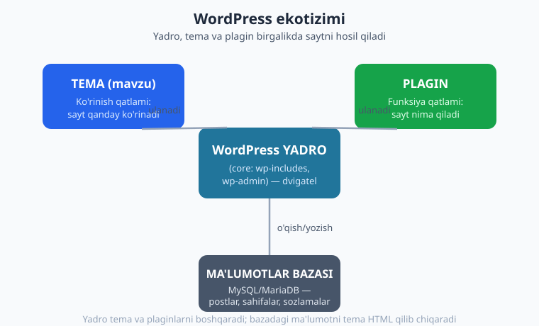
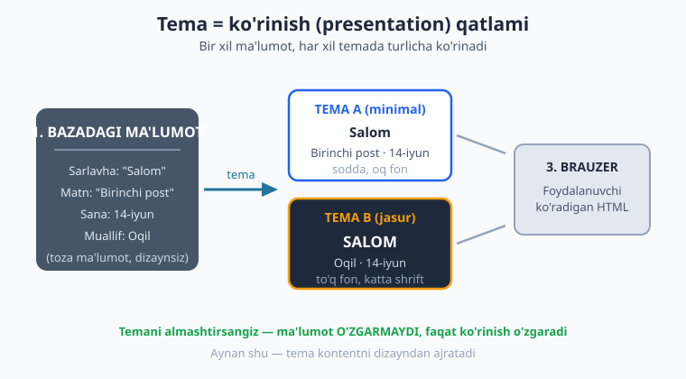
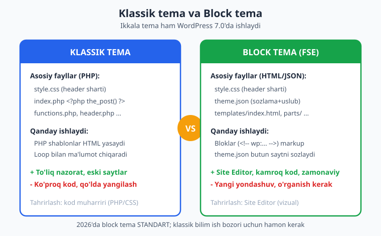

# 01 — WordPress va tema nima

[🏠 Kitob boshi](./README.md) · [Keyingi: 02 — Lokal muhit va birinchi minimal tema ➡️](./02-lokal-muhit-birinchi-tema.md)

> **Bu bobda:** WordPress nima va nega dunyodagi eng mashhur CMS ekanini ko'ramiz. Yadro, tema va plagin orasidagi farqni aniq ajratamiz. Temaning asosiy vazifasini — saytning "ko'rinish qatlami" ekanini — tushunamiz va klassik hamda block temalar bilan birinchi tanishuvni o'tkazamiz. Oxirida butun kitobning yo'l xaritasini chizamiz.

---

## WordPress nima?

Tasavvur qiling: siz restoran ochmoqchisiz. Ikki yo'l bor. Birinchisi — binoni g'ishtdan boshlab o'zingiz qurish: poydevor, devor, elektr, suv, oshxona uskunalari — hammasini noldan. Ikkinchisi — tayyor, jihozlangan binoni ijaraga olish va faqat o'z taomlaringiz hamda dizayningizni qo'shish. Veb-saytda ham xuddi shunday: birinchi yo'l — har bir sahifani qo'lda kod yozib qurish; ikkinchi yo'l — **WordPress** kabi tayyor tizimdan foydalanish.

WordPress — bu **CMS** (Content Management System — kontentni boshqarish tizimi). U sizga kod yozmasdan turib post yozish, sahifa qo'shish, rasm yuklash, menyu tuzish va saytni boshqarish imkonini beradi. Ostida esa PHP tilida yozilgan kuchli dvigatel ishlaydi: u so'rovlarni qabul qiladi, ma'lumotlar bazasidan kontentni oladi va sahifani yig'ib brauzerga jo'natadi.

> **PHP bilimi kerakmi?** Ha. Bu kitob siz PHP asoslarini (o'zgaruvchi, funksiya, massiv, OOP) bilasiz deb hisoblaydi. Agar bu sohada o'zingizni ishonchsiz his qilsangiz, avval [PHP kitobini](../php/README.md) ko'rib chiqing. Biz bu yerda PHP sintaksisini qayta o'rgatmaymiz — WordPress'ga xos narsalarga e'tibor qaratamiz.

### Nega aynan WordPress?

WordPress ochiq kodli (open source) va bepul. 2003-yilda blog platformasi sifatida boshlanib, bugun **internetdagi barcha saytlarning taxminan 40 foizidan ko'prog'i** uni ishlatadi — kichik shaxsiy bloglardan tortib yirik yangiliklar nashrlari, internet-do'konlar va korporativ saytlargacha. CMS bozorida esa uning ulushi 60 foizdan oshadi.

Bu raqamlar siz uchun nimani anglatadi? Oddiy: **WordPress tema yarata olish — bozorda real talab qilinadigan ko'nikma.** Millionlab sayt egasi o'z saytiga mos, tez va xavfsiz tema izlaydi. Siz mana shu temalarni yaratishni o'rganasiz.

> **Eslatma — WordPress.org va WordPress.com farqi.** Bu kitob **WordPress.org** — o'zingiz hostingingizga o'rnatadigan, to'liq nazoratdagi, bepul dasturiy ta'minot haqida. WordPress.com esa shu dasturni xizmat sifatida sotadigan tijoriy platforma. Biz tema yaratamiz, shuning uchun bizga to'liq erkinlik beradigan WordPress.org kerak.

Bu kitobda biz **WordPress 7.0** (2026-yilning eng so'nggi versiyasi) va **PHP 8.4** bilan ishlaymiz. Quyidagi versiyalar jonli, ishlab turgan sayt orqali tasdiqlangan:

```text
$ wp core version
7.0

$ php -v
PHP 8.4.0
```

## Yadro, tema va plagin: uchta qatlam

WordPress sayti uchta asosiy bo'lakdan tashkil topadi. Ularni adashtirmaslik — birinchi va eng muhim tushuncha. Keling, har birini ajratamiz.



**1. Yadro (core).** Bu WordPress'ning o'zi — siz yuklab oladigan asosiy dastur. Ichida `wp-includes` (funksiyalar, klasslar), `wp-admin` (boshqaruv paneli) va so'rovlarni qayta ishlovchi mantiq bor. Yadro — bu **dvigatel**. Uni hech qachon to'g'ridan-to'g'ri o'zgartirmaysiz: yangilanish kelganda barcha o'zgarishlaringiz yo'qoladi. Restoran o'xshatishida — bu binoning poydevori va konstruksiyasi.

**2. Tema (mavzu).** Bu saytning **ko'rinishi** — ranglar, shriftlar, sahifa tuzilishi, post qanday joylashishi. Tema savolga javob beradi: *"Sayt qanday KO'RINADI?"* Restoranda bu — interyer, mebel, menyu dizayni, ofitsiantlar formasi. Bir restoranni qayta jihozlash mumkin (tema almashtirish), lekin oshxona va taomlar o'zgarmaydi.

**3. Plagin.** Bu saytning **funksiyasi** — qo'shimcha imkoniyatlar. Plagin savolga javob beradi: *"Sayt nima QILADI?"* Aloqa formasi, SEO vositalari, internet-do'kon (masalan WooCommerce), zaxira nusxa olish — bularning hammasi plaginlar. Restoranda bu — yetkazib berish xizmati, onlayn buyurtma tizimi, sodiqlik kartalari.

Va bularning ostida — **ma'lumotlar bazasi** (odatda MySQL yoki MariaDB). Barcha postlaringiz, sahifalaringiz, izohlaringiz va sozlamalaringiz shu yerda saqlanadi. Yodda tuting: **kontent bazada, dizayn esa temada.** Bu ajralish — keyingi bo'limning yuragi.

> **Asosiy qoida.** Tema = ko'rinish. Plagin = funksiya. Bu chegarani buzmaslik — professional tema yaratuvchining belgisi. Masalan, "oxirgi postlarni ko'rsatish" — bu tema vazifasi (ko'rinish). Lekin "har post uchun maxsus ma'lumot turini yaratish" (Custom Post Type) — odatda plagin vazifasi, chunki u temadan mustaqil yashashi kerak: temani almashtirsangiz ham, ma'lumot tuzilishi qolishi lozim (bu haqda 13-bobda batafsil).

### Tema va plaginni qanday ajratish kerak?

Amaliy savol: yangi imkoniyat qo'shmoqchisiz — uni temaga yozaymi yoki plaginga? Oddiy sinov: **"Agar foydalanuvchi temani almashtirsa, bu narsa yo'qolib ketsa muammomi?"**

- Yo'qolsa muammo bo'lsa (masalan, mahsulot ma'lumotlari, maxsus maydonlar) → **plagin**.
- Yo'qolsa tabiiy bo'lsa (masalan, sahifa dizayni, rang sxemasi) → **tema**.

Bu mantiqqa amal qilsangiz, saytingiz moslashuvchan va ko'chiriladigan bo'ladi.

## Tema aslida nima ish qiladi?

Endi eng muhim tushunchaga keldik. Tema — bu **ko'rinish qatlami** (presentation layer). Uning vazifasi: bazadagi xom ma'lumotni olib, foydalanuvchi ko'radigan chiroyli HTML sahifaga aylantirish.



Tasavvur qiling, bazada bitta post bor: sarlavhasi "Salom", matni "Birinchi post", muallifi "Oqil", sanasi "14-iyun". Bu — **toza ma'lumot, dizaynsiz.** Bir xil postni:

- **A temasi** sodda oq fonda, kichik shriftda ko'rsatishi mumkin;
- **B temasi** to'q fonda, katta jasur sarlavha bilan ko'rsatishi mumkin.

Ma'lumot bir xil — faqat **ko'rinish** har xil. Temani almashtirganingizda postlaringiz yo'qolmaydi, ular shunchaki boshqacha ko'rinadi. Mana shu — temaning butun mohiyati: **kontentni dizayndan ajratish.**

Texnik tilda aytganda, tema quyidagilarni belgilaydi:

- Sahifa **tuzilishi**: sarlavha (header) qayerda, asosiy kontent qayerda, yon panel (sidebar) bormi, pastki qism (footer) qanday.
- **Dizayn**: ranglar, shriftlar, oraliqlar, tugma uslublari.
- Har xil sahifa turlari **qanday ko'rinishi**: bosh sahifa, alohida post, arxiv, qidiruv natijalari, 404 xatosi.
- Bazadagi ma'lumotni **qanday tartibda chiqarish**: masalan, postlar ro'yxatini ko'rsatishda nima — sarlavha, qisqacha matn, sana, rasm.

> **Hayotiy o'xshatish.** Tema — bu kiyim. Inson (ma'lumot) bir xil, lekin kiyim (tema) uni butunlay boshqacha ko'rsatadi: rasmiy kostyum yoki sport kiyimida. Kiyimni almashtirsangiz, inson o'zgarmaydi — faqat tashqi ko'rinishi o'zgaradi.

## Klassik tema va Block tema: ikki yondashuv

WordPress'da temalar ikki turga bo'linadi. Bu — kitobning markaziy ajrimlaridan biri, shuning uchun hozir umumiy tasavvur olamiz; har birini keyingi qismlarda chuqur o'rganamiz.



### Klassik tema (PHP shablon)

Bu — an'anaviy, eski yondashuv. Tema **PHP shablon fayllaridan** iborat: `index.php`, `single.php`, `header.php`, `functions.php` va boshqalar. Har bir fayl PHP kodi yordamida HTML yasaydi. Masalan, postni chiqaradigan kichik bo'lak shunday ko'rinadi:

```php
<?php
// Klassik tema: postni PHP "Loop" bilan chiqarish
if ( have_posts() ) {
    while ( have_posts() ) {
        the_post();
        the_title( '<h2>', '</h2>' );
        the_content();
    }
}
```

Bu yerda `have_posts()`, `the_post()`, `the_title()` — WordPress yadrosi beradigan funksiyalar. Ular bazadan postni oladi va HTML qilib chiqaradi (bu mexanizm — "The Loop" — 05-bobning mavzusi). Klassik temada **siz HTMLning har bir piksilini PHP bilan nazorat qilasiz.** Bu kuch beradi, lekin ko'p kod talab qiladi.

Eng kichik klassik tema atigi ikki fayldan iborat: `style.css` (maxsus sarlavha izohi bilan) va `index.php`. Jonli saytimizda mana shunday minimal klassik tema bor — buni keyingi bobda o'z qo'lingiz bilan quramiz.

### Block tema (theme.json va HTML)

Bu — zamonaviy yondashuv, **Full Site Editing (FSE)** deb ham ataladi. Bu yerda PHP shablonlar deyarli yo'q. Uning o'rniga:

- **`theme.json`** — bitta JSON fayl butun saytning ranglarini, shriftlarini, oraliqlarini va sozlamalarini belgilaydi.
- **`templates/`** papkasidagi `.html` fayllar — lekin oddiy HTML emas, balki **block markup** (bloklar tili):

```html
<!-- wp:group {"tagName":"main"} -->
<main class="wp-block-group">
  <!-- wp:post-title /-->
  <!-- wp:post-content /-->
</main>
<!-- wp:group -->
```

Bu `<!-- wp:... -->` izohlari oddiy HTML kommentariyasi emas — bu WordPress tushunadigan **bloklar tili**. Har bir blok (post-title, post-content, group) sahifaning bir bo'lagini ifodalaydi. Foydalanuvchi esa bularning hammasini brauzerdagi vizual **Site Editor**'da — kod yozmasdan — tahrirlay oladi.

Jonli WordPress 7.0 saytimizda block tema namunasi sifatida **Twenty Twenty-Five** o'rnatilgan. Uning tuzilishi aynan shunday: `theme.json`, `templates/` papkasida `index.html`, `single.html`, `page.html`, `404.html` kabi HTML shablonlar, `parts/` papkasida header va footer bo'laklari, `patterns/` papkasida tayyor block to'plamlari.

### Qaysi birini o'rganish kerak?

Ikkalasini ham. 2026-yilda **block tema — standart yondashuv**: WordPress yangi saytlar uchun aynan shuni tavsiya qiladi, va u kelajak. Shuning uchun bu kitobda block tema asosiy o'rinda turadi (IV–V qismlar).

Ammo **klassik tema bilimi hamon zarur:** internetda millionlab sayt klassik temalarda ishlaydi, ularni qo'llab-quvvatlash va yangilash kerak. Ish bozorida ko'p loyiha klassik temalar bilan bog'liq. Bundan tashqari, klassik tema sizga WordPress qanday ishlashini — The Loop, template hierarchy, hook tizimini — chuqurroq tushuntiradi. Shu sababli biz **klassik temadan boshlaymiz** (II–III qismlar), keyin block temaga o'tamiz. Bu poydevor sizni kuchli dasturchi qiladi.

> **❌ Eski API haqida ogohlantirish.** Eski qo'llanmalarda Customizer (`customize_register`), klassik widget'lar yoki PHP'da to'g'ridan-to'g'ri `<link>`/`<script>` teglarini yozish kabi usullarni ko'rishingiz mumkin. Ularning ba'zilari hali ishlaydi, lekin block dunyosida eskirgan. Biz har gal zamonaviy, to'g'ri usulni o'rgatamiz va eski usulni faqat "shunday qilmang" anti-misoli sifatida ko'rsatamiz.

## Tema ekotizimi

Tema yolg'iz yashamaydi — u butun bir ekotizimning qismi. Buni bilish sizga kontekst beradi:

- **Bepul temalar — WordPress.org katalogi.** Minglab tekshirilgan bepul tema. O'z temangizni shu yerga joylash uchun u qat'iy talablarga (Theme Check) javob berishi va GPL litsenziyasida bo'lishi shart (29-bobda ko'ramiz).
- **Pullik (premium) temalar.** ThemeForest kabi bozorlarda yoki o'z saytingizda sotiladigan professional temalar — biznes imkoniyati.
- **Maxsus (custom) temalar.** Aniq bir mijoz yoki loyiha uchun noldan yoziladigan tema. Eng yuqori daromad shu yerda.
- **Standart (default) temalar.** WordPress har yili yangi standart tema chiqaradi: Twenty Twenty-Four, Twenty Twenty-Five. Ular eng yangi imkoniyatlarni namoyish qiladi va o'rganish uchun ajoyib namuna. Biz Twenty Twenty-Five'ga ko'p murojaat qilamiz.
- **Child (bola) temalar.** Mavjud temani buzmasdan o'zgartirish usuli: ota-temaga "ulanib", faqat kerakli qismlarni qayta yozasiz (29-bobda batafsil).

Bu ekotizimda o'z o'rningizni topish — bu kitobning amaliy maqsadi. Oxirida siz nafaqat tema yarata olasiz, balki uni katalogga joylash yoki sotish yo'lini ham bilasiz.

## Kitobning yo'l xaritasi

Bu kitob **30 bobdan** iborat bo'lib, **7 qismga** bo'lingan. Yo'l 0 dan boshlanadi va ekspert darajasida — to'liq professional tema bilan — tugaydi.

- **I qism — Asoslar va WordPress arxitekturasi (01–04).** WordPress nima, lokal muhit va birinchi minimal tema, so'rov hayoti va template hierarchy, tema anatomiyasi hamda standartlar.
- **II qism — Klassik tema: Loop va shablonlar (05–09).** The Loop va `WP_Query`, template hamda shartli teglar, shablon iyerarxiyasi amalda, `header`/`footer`/`sidebar` bo'laklari, `functions.php` va hook tizimi.
- **III qism — Klassik tema: dinamik imkoniyatlar (10–14).** Asset enqueue, navigatsiya menyulari, widget'lar va sidebar, Custom Post Type hamda Taxonomy, custom fields va Customizer.
- **IV qism — Zamonaviy Block tema / FSE (15–21).** Block temaga kirish, `theme.json` (settings va styles), block templates va parts, global styles hamda variations, block patterns, Site Editor va hybrid temalar.
- **V qism — Custom bloklar / React-JSX (22–25).** Custom blok yaratish asoslari, edit/save va attributes, dinamik bloklar (`render_callback`), InnerBlocks hamda Interactivity API.
- **VI qism — Professional (26–29).** WooCommerce integratsiyasi, xavfsizlik (escaping, sanitization, nonce), i18n/l10n va accessibility, performans hamda tarqatish.
- **VII qism — Kapston (30).** Noldan to'liq professional tema: hybrid block tema, custom blok, `theme.json`, patterns, i18n va xavfsizlik — barchasini birlashtirgan yakuniy loyiha.

Yo'l davomida biz bitta umumiy g'oyaga — oddiy blog/portfolio temasiga — qayta-qayta qaytamiz, har bobda unga yangi qatlam qo'shamiz. Kapstonda esa to'liq, ishga tayyor tema quramiz.

> **Maslahat.** Faqat o'qib qo'yish yetarli emas. Har bir misolni o'z kompyuteringizda yozib, ishga tushirib ko'ring. Keyingi bobda lokal muhit o'rnatamiz va birinchi haqiqiy temangizni — atigi ikki fayldan iborat bo'lsa-da, **ishlaydigan** temani — yaratamiz. Aynan o'sha lahzada "WordPress tema yaratuvchisi" bo'lasiz.

## Xulosa

- **WordPress** — internetdagi saytlarning 40 foizidan ko'prog'i ishlatadigan, eng mashhur CMS. Tema yaratish — real talab qilinadigan ko'nikma.
- Sayt uch qatlamdan iborat: **yadro** (dvigatel), **tema** (ko'rinish), **plagin** (funksiya). Kontent esa **ma'lumotlar bazasida** saqlanadi.
- **Tema = ko'rinish qatlami.** U bazadagi xom ma'lumotni foydalanuvchi ko'radigan HTMLga aylantiradi. Temani almashtirsangiz, kontent o'zgarmaydi — faqat ko'rinish o'zgaradi.
- Ikki tur tema bor: **klassik** (PHP shablon) va **block** (theme.json va HTML). 2026'da block standart, lekin klassik bilim ham zarur. Biz klassikdan boshlab block'ga o'tamiz.
- Oldinda **30 bob, 7 qism** — 0 dan to'liq professional temagacha.

---

## Mashqlar

> Bu kontseptual bob bo'lgani uchun mashqlar fikrlash va tushunishga qaratilgan. Kod keyingi boblarda boshlanadi. Avval o'zingiz javob bering, keyin yechimga qarang.

### Oson

1. O'z so'zlaringiz bilan tushuntiring: WordPress yadrosi (core), tema va plagin — har biri nimaga javobgar? Bittadan jumla bilan ayting.
2. Quyidagilarni "tema vazifasi" yoki "plagin vazifasi" deb ajrating: (a) saytning rang sxemasi, (b) aloqa formasi, (c) bosh sahifa tuzilishi, (d) SEO sozlamalari.
3. "Kontent bazada, dizayn temada" iborasini misol bilan tushuntiring. Temani almashtirsangiz postlaringizga nima bo'ladi?
4. WordPress.org va WordPress.com orasidagi farq nima? Tema yaratish uchun qaysi biri kerak va nega?

### O'rta

5. Do'stingiz "tema saytning postlarini saqlaydi" deb o'ylaydi. U qayerda adashyapti? To'g'ri tushuntirishni yozing.
6. Klassik tema va block tema orasidagi uchta asosiy farqni ayting (fayllar, ishlash usuli, tahrirlash). Jadval ko'rinishida yozsangiz ham bo'ladi.
7. Bir mijoz: "Saytimga internet-do'kon va yangi rang dizayni kerak" deydi. Qaysi qismi tema, qaysi qismi plagin bilan hal qilinadi?
8. Restoran o'xshatishini davom ettiring: yadro, tema, plagin va ma'lumotlar bazasini restoranning qaysi qismlariga qiyoslaysiz? O'zingizning o'xshatishingizni yozing.

### Qiyin

9. "Oxirgi 5 ta postni ko'rsatuvchi bo'lak" — bu tema vazifasimi yoki plaginmi? Javobingizni "temani almashtirsa nima bo'ladi?" sinovi bilan asoslang. Chegara holatni muhokama qiling.
10. Nega WordPress yadrosini hech qachon to'g'ridan-to'g'ri tahrirlamaslik kerak? Agar tahrirlasangiz, qanday muammo kelib chiqadi? Bu qoida tema va plaginlarga qanday aloqador?
11. 2026'da block tema standart bo'lsa-da, bu kitob nega klassik temadan boshlaydi? Kamida ikkita sabab keltiring (texnik va amaliy/bozor jihatidan).
12. Siz yangi loyiha boshlayapsiz. Mijozning bloggi bor, lekin u tez-tez dizaynni o'zgartirib turishni xohlaydi va kod bilmaydi. Klassik temami yoki block temami tavsiya qilasiz? Tanlovingizni asoslang.
13. Tema ekotizimida (bepul katalog, premium, custom, child tema) o'zingizni qayerda ko'rasiz va nega? Har bir variantning kuchli va zaif tomonini bittadan ayting.

## Yechimlar

<details markdown="1">
<summary>Yechim — 1</summary>

- **Yadro (core):** WordPress'ning asosiy dvigateli. So'rovlarni qabul qiladi, bazadan ma'lumot oladi, tema va plaginlarni boshqaradi va sahifani yig'adi.
- **Tema:** saytning ko'rinishiga javobgar — "sayt qanday KO'RINADI" (ranglar, tuzilish, dizayn).
- **Plagin:** saytning funksiyasiga javobgar — "sayt nima QILADI" (qo'shimcha imkoniyatlar: forma, do'kon, SEO).

</details>

<details markdown="1">
<summary>Yechim — 2</summary>

- (a) rang sxemasi → **tema** (ko'rinish).
- (b) aloqa formasi → **plagin** (funksiya; temadan mustaqil bo'lishi kerak).
- (c) bosh sahifa tuzilishi → **tema** (ko'rinish/joylashuv).
- (d) SEO sozlamalari → **plagin** (funksiya; temani almashtirsangiz ham qolishi lozim).

</details>

<details markdown="1">
<summary>Yechim — 3</summary>

Bu ibora kontent (ma'lumot) va dizayn (ko'rinish) bir-biridan ajratilganini bildiradi. Postlaringizning sarlavhasi, matni, sanasi, muallifi — hammasi **ma'lumotlar bazasida** saqlanadi. Tema esa shu ma'lumotni faqat **chiqarib ko'rsatadi**, lekin saqlamaydi.

Misol: bazada "Salom" sarlavhali post bor. A temasi uni kichik shriftda, B temasi katta jasur shriftda ko'rsatadi — lekin post o'zi o'zgarmaydi. Shuning uchun **temani almashtirsangiz, barcha postlaringiz joyida qoladi**, faqat ular boshqacha ko'rinadi.

</details>

<details markdown="1">
<summary>Yechim — 4</summary>

- **WordPress.org** — o'zingiz hostingingizga o'rnatadigan, bepul va ochiq kodli dasturiy ta'minot. Sizga to'liq nazorat beradi: istalgan tema/plaginni o'rnatasiz, kodga to'liq kirasiz.
- **WordPress.com** — shu dasturni xizmat sifatida taqdim etadigan tijoriy platforma (hosting + obuna). Erkinlik cheklangan (ayniqsa arzon tariflarda).

**Tema yaratish uchun WordPress.org kerak**, chunki tema fayllariga to'liq kirish, ularni o'rnatish va sinash imkoni faqat shu yerda bor.

</details>

<details markdown="1">
<summary>Yechim — 5</summary>

Do'stim adashyapti, chunki **tema postlarni saqlamaydi — postlar ma'lumotlar bazasida saqlanadi** (MySQL/MariaDB). Tema faqat **ko'rinish qatlami**: u bazadagi ma'lumotni olib, foydalanuvchi ko'radigan HTML sahifaga aylantiradi.

Buni isbotlash oson: agar temani o'chirib boshqasini yoqsangiz, hamma postlaringiz o'rnida qoladi (faqat boshqacha ko'rinadi). Agar tema postlarni saqlaganida, temani o'chirganda postlar ham yo'qolardi — lekin bunday bo'lmaydi.

</details>

<details markdown="1">
<summary>Yechim — 6</summary>

| Jihat | Klassik tema | Block tema (FSE) |
|---|---|---|
| Asosiy fayllar | PHP shablonlar (`index.php`, `single.php`, `functions.php`) | `theme.json` + `templates/*.html` (block markup) |
| Ishlash usuli | PHP kod The Loop bilan HTML yasaydi | Bloklar (`<!-- wp:... -->`) markup, `theme.json` sozlaydi |
| Tahrirlash | Kod muharririda (PHP/CSS) | Brauzerdagi vizual Site Editor'da |

Qo'shimcha: klassik to'liq kod nazorati beradi (lekin ko'p kod); block kamroq kod va foydalanuvchiga vizual tahrirlash imkonini beradi.

</details>

<details markdown="1">
<summary>Yechim — 7</summary>

- **Internet-do'kon** → **plagin** vazifasi (masalan WooCommerce). Bu funksiya: mahsulot, savat, to'lov. U temadan mustaqil bo'lishi kerak — temani almashtirsangiz ham do'kon ishlashda davom etishi lozim.
- **Yangi rang dizayni** → **tema** vazifasi. Bu ko'rinish: ranglar, shriftlar, tuzilish.

Amalda: do'kon uchun plagin o'rnatiladi, temani esa o'sha plagin bilan moslashtiramiz (26-bob — WooCommerce tema integratsiyasi).

</details>

<details markdown="1">
<summary>Yechim — 8</summary>

Bu ochiq mashq — to'g'ri javoblar har xil bo'lishi mumkin. Bir variant:

- **Yadro** → binoning poydevori va konstruksiyasi (poydevor, devor, elektr tarmog'i). Uni o'zgartirmaysiz.
- **Tema** → interyer va atmosfera: mebel, devor rangi, yorug'lik, menyu dizayni, ofitsiantlar formasi. Almashtirsa bo'ladi.
- **Plagin** → qo'shimcha xizmatlar: onlayn buyurtma, yetkazib berish, sodiqlik kartasi.
- **Ma'lumotlar bazasi** → omborxona/oshxona zaxirasi: barcha mahsulotlar va retseptlar shu yerda saqlanadi.

Asosiysi: konstruksiya (yadro) o'zgarmaydi, interyer (tema) almashtiriladi, xizmatlar (plagin) qo'shiladi, zaxira (baza) saqlanadi.

</details>

<details markdown="1">
<summary>Yechim — 9</summary>

Bu **chegara holat** — javob nima uchun kerakligiga bog'liq.

"Temani almashtirsa nima bo'ladi?" sinovini qo'llaymiz:

- Agar "oxirgi 5 ta postni ko'rsatish" shunchaki **ko'rinish** masalasi bo'lsa (blog sahifasida postlar ro'yxati), bu **tema** vazifasi. Yangi temaga o'tganda yangi tema o'z usulida postlar ro'yxatini ko'rsatadi — bu tabiiy.
- Lekin agar bu **maxsus, takrorlanuvchi funksiya** bo'lib, barcha temalarda bir xil ishlashi zarur bo'lsa (masalan, maxsus filtrlash mantig'i bilan murakkab "tavsiya etilgan postlar" bloki), uni **plaginga** chiqarish to'g'riroq — shunda temani almashtirsangiz ham funksiya yo'qolmaydi.

Xulosa: oddiy ro'yxat — tema; murakkab, temadan mustaqil bo'lishi shart funksiya — plagin. Professional yondashuv: ko'rinishni temada, qayta ishlatiladigan mantiqni plaginda saqlash.

</details>

<details markdown="1">
<summary>Yechim — 10</summary>

Yadroni tahrirlamaslik kerak, chunki **yangilanish kelganda yadro fayllari to'liq qayta yoziladi** — sizning barcha o'zgarishlaringiz yo'qoladi. Bundan tashqari, yadroni o'zgartirish saytni beqaror va xavfli qiladi (xavfsizlik teshigi, kutilmagan xatolar).

Aynan shu sabab uchun WordPress tema va plagin tizimini yaratgan: yadroga **tegmasdan** saytni o'zgartirishning to'g'ri yo'li — tema (ko'rinish uchun) va plagin (funksiya uchun) yozish. Ular yadrodan ajratilgan, shuning uchun yadro yangilanganda ham saqlanib qoladi. Xuddi shu mantiq bilan, **otatemani ham to'g'ridan-to'g'ri tahrirlamasdan, child tema** ishlatiladi (29-bob).

</details>

<details markdown="1">
<summary>Yechim — 11</summary>

Kamida ikki sabab:

1. **Texnik (poydevor).** Klassik tema WordPress'ning ichki mexanizmlarini — The Loop, template hierarchy, hook tizimini — ochiq ko'rsatadi. Bularni tushunmasdan block temani ham chuqur o'zlashtirib bo'lmaydi. Klassik avval o'rganilsa, block tema mantig'i ravshanroq bo'ladi.

2. **Amaliy/bozor.** Internetda millionlab sayt hali klassik temalarda ishlaydi. Ularni qo'llab-quvvatlash, yangilash va tuzatish — real ish. Ish bozorida bu bilim hamon talab qilinadi.

Qo'shimcha sabab: ba'zi murakkab loyihalar hali ham klassik yoki hybrid yondashuvni talab qiladi.

</details>

<details markdown="1">
<summary>Yechim — 12</summary>

**Block tema** tavsiya qilaman.

Sabablar:

- Mijoz **kod bilmaydi**, lekin dizaynni tez-tez o'zgartirishni xohlaydi. Block tema brauzerdagi vizual **Site Editor** orqali kodsiz tahrirlash imkonini beradi — mijoz mustaqil ishlay oladi.
- `theme.json` orqali ranglar, shriftlar, oraliqlar markazlashgan holda sozlanadi — global o'zgarishlar oson.
- 2026'da block — standart va kelajak; yangi blog uchun mantiqiy tanlov.

Agar klassik tema bersangiz, har dizayn o'zgarishi uchun mijoz sizga (yoki dasturchiga) murojaat qilishi kerak bo'lardi — bu uning maqsadiga zid.

</details>

<details markdown="1">
<summary>Yechim — 13</summary>

Bu ochiq, shaxsiy mashq — to'g'ri javob yo'q. Har variantning kuchli/zaif tomoni:

- **Bepul katalog (WordPress.org):** kuchli — katta auditoriya, obro' va portfel; zaif — daromad to'g'ridan-to'g'ri yo'q, qat'iy talablar (Theme Check, GPL).
- **Premium (ThemeForest va h.k.):** kuchli — passiv daromad, ko'p mijoz; zaif — raqobat yuqori, qo'llab-quvvatlash yuki.
- **Custom (maxsus loyiha):** kuchli — eng yuqori daromad, aniq talab; zaif — har loyiha vaqt talab qiladi, masshtablash qiyin.
- **Child tema:** kuchli — tez va xavfsiz moslashtirish; zaif — to'liq mustaqil mahsulot emas, ota-temaga bog'liq.

Boshlovchiga ko'pincha custom/child loyihalardan boshlab, keyin premium yoki katalogga o'tish maslahat beriladi.

</details>

---

[🏠 Kitob boshi](./README.md) · [Keyingi: 02 — Lokal muhit va birinchi minimal tema ➡️](./02-lokal-muhit-birinchi-tema.md)
