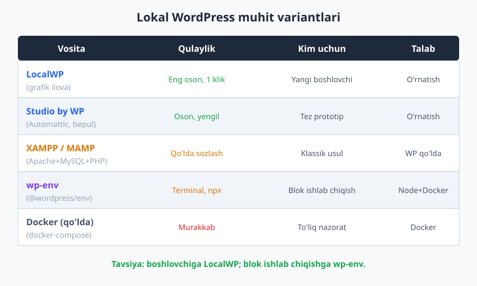
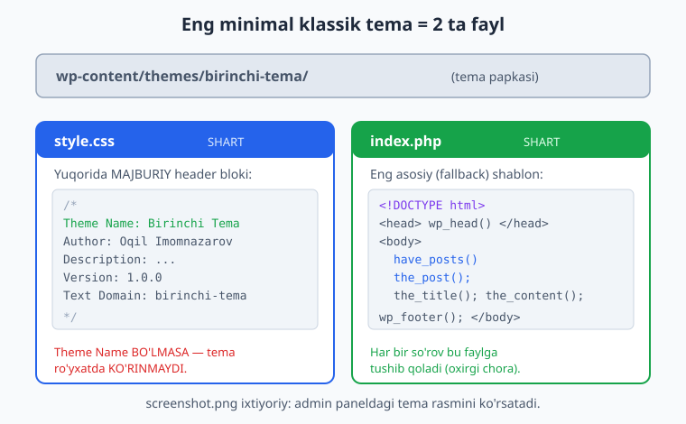
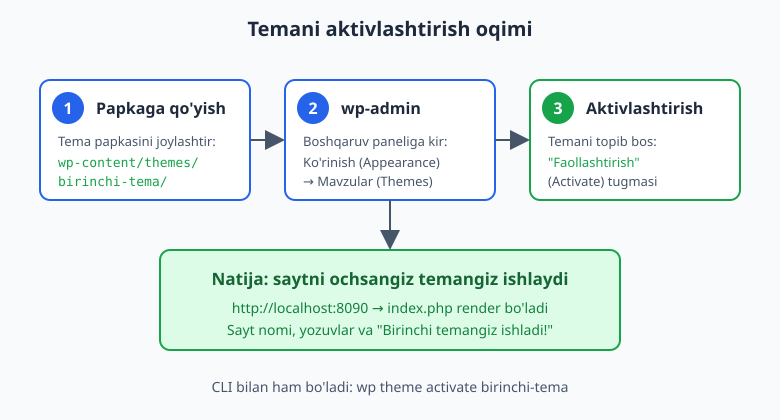

# 02 — Lokal muhit va birinchi minimal tema

[⬅️ Oldingi: 01 — WordPress va tema nima](./01-wordpress-tema-nima.md) · [🏠 README](./README.md) · [Keyingi: 03 — So'rov hayoti va template hierarchy ➡️](./03-sorov-hayoti-template-hierarchy.md)

> **Bu bobda:** Kompyuteringizda lokal WordPress muhitini o'rnatamiz (variantlarni solishtirib, eng qulayini tanlaymiz). So'ng faqat ikkita fayldan iborat — `style.css` va `index.php` — eng minimal klassik temani 0 dan yaratamiz, uni aktivlashtiramiz va brauzerda ishlaganini ko'ramiz. Oxirida block (FSE) temaning ham eng kichik variantini ko'rsatamiz, shunda ikki yo'lning farqini his qilasiz.

---

## Nega lokal muhit kerak

Temani to'g'ridan-to'g'ri jonli (production) saytda yozish — bu o'q-yoy bilan o'zingni nishonga olishdek. Bitta xato butun saytni "oq ekran"ga aylantiradi va tashrifchilaringiz buni ko'radi.

**Lokal muhit** — bu kompyuteringizning ichida ishlaydigan to'liq WordPress sayti. U faqat sizga ko'rinadi (odatda `http://localhost` manzilida), internet shart emas, xohlagancha sindirib-tuzatishingiz mumkin. Bu — mashinani haydashni o'rganish uchun maxsus poligon: ko'chaga chiqmasdan, hech kimga zarar yetkazmasdan mashq qilasiz.

WordPress ishlashi uchun uchta narsa kerak:

- **PHP** — WordPress shu tilda yozilgan (bu kitobda PHP 8.4). PHP asoslarini bilasiz deb hisoblaymiz — agar takrorlash kerak bo'lsa, [PHP kitobiga](../php/README.md) qarang.
- **Veb-server** — Apache yoki Nginx (so'rovlarni qabul qiladi).
- **Ma'lumotlar bazasi** — MySQL yoki MariaDB (yozuvlar, sozlamalar shu yerda saqlanadi).

Yaxshi xabar: pastdagi vositalar bu uchchalasini siz uchun avtomatik o'rnatadi. Bittasini tanlaysiz — qolganini u qiladi.

## Lokal muhit variantlari

WordPress'ni lokal o'rnatishning bir nechta yo'li bor. Hammasini o'rnatish shart emas — bittasini tanlang. Quyida qisqa solishtirish:



| Vosita | Qanday ishlaydi | Afzalligi | Kimga mos |
|---|---|---|---|
| **LocalWP** | Grafik ilova, "Create site" tugmasi | Eng oson, bir necha klik, SSL/email/PHP versiya tanlash | Yangi boshlovchi (TAVSIYA) |
| **Studio by WP** | Automattic'ning bepul yengil ilovasi | Tez prototip, juda yengil | Tez sinab ko'rish |
| **XAMPP / MAMP** | Apache+MySQL+PHP to'plamini o'rnatadi | Klassik, ko'p qo'llanmalar shu asosida | WP'ni qo'lda o'rnatishni o'rganmoqchilar |
| **wp-env** | `npx @wordpress/env start` (Docker ustida) | Loyiha uchun bir buyruq, blok ishlab chiqishga ideal | Custom blok ishlab chiquvchilar |
| **Docker (qo'lda)** | O'zingiz `docker-compose.yml` yozasiz | To'liq nazorat | Ilg'or, DevOps fonida |

Qisqacha tavsiya:

- **Endigina boshlayotgan bo'lsangiz** — **LocalWP** o'rnating. Yuklab oling, ishga tushiring, "Create a new site" bosing, nom bering — bir necha daqiqada to'liq WordPress sayti tayyor. PHP versiyasini ham menyudan tanlaysiz (8.4 ni tanlang).
- **Custom bloklar (22–25-boblar) ishlab chiqmoqchi bo'lsangiz** — keyinroq **wp-env** ham foydali bo'ladi, chunki u loyiha bilan birga `.wp-env.json` faylda saqlanadi va jamoa bilan bir xil muhitni ulashish oson.

> **Eslatma:** Qaysi vositani tanlasangiz ham, tema yaratish jarayoni **bir xil**. Faqat WordPress qayerda turishi farq qiladi. Shuning uchun bu bobning qolgan qismi har qanday muhitda ishlaydi.

XAMPP bilan qo'lda o'rnatish bosqichlari (qisqacha, agar shu yo'lni tanlasangiz):

1. XAMPP'ni o'rnatib, Apache va MySQL'ni ishga tushiring.
2. [wordpress.org](https://wordpress.org/download/) dan WordPress'ni yuklab, `htdocs/saytim/` papkasiga chiqaring.
3. phpMyAdmin'da bo'sh baza yarating (masalan `wp_local`).
4. Brauzerda `http://localhost/saytim` ga kirib, o'rnatish sehrgariga (baza nomi, foydalanuvchi `root`, parol bo'sh) javob bering.

LocalWP esa bularning hammasini avtomatik bajaradi — shuning uchun boshlovchiga uni tavsiya qilamiz.

## wp-admin va tema joyi

WordPress ikki qismdan iborat:

- **Old qism (frontend)** — tashrifchilar ko'radigan sayt: `http://localhost:8090`.
- **Boshqaruv paneli (wp-admin)** — siz boshqaradigan panel: `http://localhost:8090/wp-admin`. Bu yerda yozuv yozasiz, sozlamalarni o'zgartirasiz va **temalarni aktivlashtirasiz**.

WordPress'da temalar **fayl tizimida** aniq bir joyda yashaydi:

```
wordpress/
└── wp-content/
    ├── plugins/        ← plaginlar shu yerda
    ├── uploads/        ← yuklangan rasm/fayllar
    └── themes/         ← TEMALAR shu yerda
        ├── twentytwentyfive/   ← rasmiy block tema
        └── birinchi-tema/      ← BIZNING temamiz shu yerga keladi
```

Asosiy qoida sodda: **`wp-content/themes/` ichidagi har bir papka — bitta tema.** Papka nomi temaning "slug"i bo'ladi (lotin harflari, kichik, chiziqcha bilan: `birinchi-tema`). WordPress shu papkani topib, ichidagi `style.css` faylining yuqorisidan tema ma'lumotlarini o'qiydi.

## Eng minimal klassik tema: faqat 2 ta fayl

Ko'p odam temani minglab satr kod deb o'ylaydi. Aslida ishlaydigan eng kichik klassik tema **atigi ikki fayldan** iborat:

1. **`style.css`** — yuqorisida maxsus **header bloki** bilan (bu MAJBURIY).
2. **`index.php`** — sahifani chizadigan asosiy shablon (oxirgi chora shabloni).



Boshqa hech narsa shart emas. `functions.php` ham, `header.php` ham hozircha kerak emas. Keling, ikkalasini ham yozamiz.

### 1-qadam: tema papkasini yaratish

`wp-content/themes/` ichida yangi papka oching va nomini `birinchi-tema` qo'ying. Endi shu papka ichida ikki fayl yaratamiz.

### 2-qadam: `style.css` va uning header bloki

`style.css` faylining boshidagi izoh (`/* ... */`) — oddiy izoh emas. WordPress uni **o'qib**, tema haqidagi ma'lumotni shu yerdan oladi: nomi, muallifi, versiyasi. Bu izoh **"tema header bloki"** deb ataladi.

```css
/*
Theme Name: Birinchi Tema
Theme URI: https://ioqil.uz/birinchi-tema
Author: Oqil Imomnazarov
Author URI: https://ioqil.uz
Description: 0 dan yaratilgan eng minimal klassik WordPress tema.
Version: 1.0.0
Requires at least: 6.7
Tested up to: 7.0
Requires PHP: 8.0
License: GNU General Public License v2 or later
License URI: http://www.gnu.org/licenses/gpl-2.0.html
Text Domain: birinchi-tema
Tags: blog, one-column, custom-menu
*/

body {
	font-family: system-ui, "Segoe UI", sans-serif;
	max-width: 720px;
	margin: 0 auto;
	padding: 24px;
	line-height: 1.6;
	color: #1e293b;
}
```

Header maydonlari nimani anglatadi:

| Maydon | Vazifasi | Majburiymi? |
|---|---|---|
| **`Theme Name`** | Tema nomi (admin panelda shu ko'rinadi) | **HA — bu bo'lmasa tema umuman ro'yxatda chiqmaydi** |
| `Description` | Qisqa tavsif | Yo'q (lekin tavsiya) |
| `Author` | Muallif ismi | Yo'q |
| `Version` | Tema versiyasi (`1.0.0`) | Yo'q (lekin tavsiya) |
| `Text Domain` | Tarjima domeni (28-bobda) — odatda slug bilan bir xil | Yo'q (lekin tavsiya) |
| `Requires PHP` / `Requires at least` | Minimal PHP / WP versiyasi | Yo'q |
| `License` / `License URI` | Litsenziya (WordPress.org uchun GPL talab) | Tarqatish uchun zarur |

Eng muhim qoidani yodda tuting: **`Theme Name` bo'lmasa, WordPress papkani tema deb tanimaydi** va u admin paneldagi temalar ro'yxatida ko'rinmaydi. Boshqa hamma maydon ixtiyoriy, ammo professional tema uchun ularni to'ldirish yaxshi odat.

Header ostidagi CSS (bizning misolda `body { ... }`) — bu temaning oddiy uslublari. Hozircha sahifani markazga olib, o'qishga qulay qildik xolos.

### 3-qadam: `index.php`

`index.php` — klassik temaning eng asosiy shabloni. 03-bobda ko'rasizki, WordPress so'rov uchun mos shablonni izlaydi; mos keladigani topilmasa, **oxirgi chora** sifatida har doim `index.php` ga tushadi. Shuning uchun minimal temada faqat shu bitta fayl ham yetarli.

```php
<?php
/**
 * Eng minimal klassik tema uchun yagona shablon: index.php
 *
 * @package Birinchi_Tema
 */
?>
<!DOCTYPE html>
<html <?php language_attributes(); ?>>
<head>
	<meta charset="<?php bloginfo( 'charset' ); ?>">
	<meta name="viewport" content="width=device-width, initial-scale=1">
	<?php wp_head(); ?>
</head>
<body <?php body_class(); ?>>

	<header>
		<h1><a href="<?php echo esc_url( home_url( '/' ) ); ?>"><?php bloginfo( 'name' ); ?></a></h1>
		<p><?php bloginfo( 'description' ); ?></p>
	</header>

	<main>
		<?php if ( have_posts() ) : ?>
			<?php while ( have_posts() ) : the_post(); ?>
				<article <?php post_class(); ?>>
					<h2>
						<a href="<?php the_permalink(); ?>"><?php the_title(); ?></a>
					</h2>
					<div><?php the_content(); ?></div>
				</article>
			<?php endwhile; ?>
		<?php else : ?>
			<p>Hali hech qanday yozuv yo'q. Birinchi temangiz ishladi!</p>
		<?php endif; ?>
	</main>

	<footer>
		<p>&copy; <?php echo esc_html( date( 'Y' ) ); ?> <?php bloginfo( 'name' ); ?></p>
	</footer>

	<?php wp_footer(); ?>
</body>
</html>
```

Bu yerda yangi WordPress funksiyalari ishtirok etyapti. Hozircha chuqur tushunish shart emas — keyingi boblarda har birini batafsil ko'ramiz — lekin qisqacha:

- **`language_attributes()`** — `<html>` tegiga til atributlarini qo'shadi (masalan `lang="uz"`).
- **`bloginfo('name')` / `bloginfo('description')`** — sayt nomi va shiorini chiqaradi (Sozlamalar > Umumiy'dan).
- **`wp_head()`** — `</head>` dan oldin **MAJBURIY**. WordPress va plaginlar shu yerga o'z uslub/skriptlarini qo'shadi. Bo'lmasa ko'p narsa ishlamaydi.
- **`wp_footer()`** — `</body>` dan oldin **MAJBURIY**. Admin paneli (tahrirlash paneli) va skriptlar shu yerga ulanadi.
- **`body_class()` / `post_class()`** — `<body>` va maqolaga foydali CSS klasslarini qo'shadi (masalan `home`, `single`).
- **`have_posts()` / `the_post()`** — bu **The Loop** (05-bobning yuragi). WordPress topgan yozuvlarni birma-bir aylanib chiqadi.
- **`the_title()` / `the_content()` / `the_permalink()`** — joriy yozuvning sarlavhasi, matni va havolasini chiqaradi.

> **Diqqat — `wp_head()` va `wp_footer()` ni HECH QACHON tushirib qoldirmang.** Ular bo'lmasa Site Editor paneli, plaginlar va hatto blok uslublari ishlamaydi. Bu — yangi boshlovchining eng tez-tez qiladigan xatosi.

`<?php the_permalink(); ?>` kabi teglar `echo` qilingan (o'zi chop etadi), `home_url()` esa qiymat **qaytaradi**, shuning uchun uni `echo esc_url( ... )` bilan o'rab xavfsiz chiqaramiz. Bu farqni 06- va 27-boblarda batafsil ko'rasiz.

## Temani aktivlashtirish

Ikki fayl tayyor. Endi temani ishga solamiz.



Uch qadam:

1. **Papkaga qo'yish.** `birinchi-tema/` papkasini `wp-content/themes/` ichiga joylashtiring (LocalWP'da "Go to site folder" tugmasi orqali papkani ochasiz). Ichida `style.css` va `index.php` borligiga ishonch hosil qiling.
2. **wp-admin'ga kirish.** Brauzerda `http://localhost:8090/wp-admin` ga kiring, so'ng chap menyudan **Ko'rinish (Appearance) > Mavzular (Themes)** bo'limini oching. "Birinchi Tema" kartochkasini ko'rasiz.
3. **Aktivlashtirish.** Kartochka ustiga sichqonchani olib boring va **"Faollashtirish" (Activate)** tugmasini bosing.

Endi `http://localhost:8090` ni oching — temangiz ishlayapti! Agar hali yozuv yozmagan bo'lsangiz, "Hali hech qanday yozuv yo'q. Birinchi temangiz ishladi!" matnini ko'rasiz. Bu — sizning birinchi WordPress temangiz.

Buyruq qatorini afzal ko'rsangiz, WP-CLI bilan ham bo'ladi:

```bash
# Mavjud temalarni ro'yxatlash
wp theme list

# Temani aktivlashtirish
wp theme activate birinchi-tema
```

> **Maslahat:** Admin paneldagi tema kartochkasida chiroyli oldindan ko'rinish chiqishi uchun papkaga `screenshot.png` (tavsiya etilgan o'lcham 1200x900) qo'shing. Bu ixtiyoriy, lekin temangizni professional ko'rsatadi.

### Tema ko'rinmasa — tez-tez uchraydigan xatolar

- **Tema ro'yxatda yo'q** — odatda `style.css` da `Theme Name:` qatori yo'q yoki noto'g'ri yozilgan. Faylning eng boshida, izoh ichida turishi shart.
- **"The package could not be installed. The theme is missing the style.css stylesheet."** — papka nomi yoki `style.css` joylashuvi xato; `style.css` to'g'ridan-to'g'ri tema papkasining ichida bo'lsin (qo'shimcha ichki papkada emas).
- **Oq ekran (white screen)** — `index.php` da PHP xatosi. `php -l index.php` bilan sintaksisni tekshiring (quyida ko'rsatamiz).

## Minimal block (FSE) tema varianti

WordPress 7.0'da **block temalar** (Full Site Editing) standart hisoblanadi. Ularni batafsil 15-bobdan boshlab o'rganamiz, lekin farqni hoziroq his qilishingiz uchun eng kichik block temani ko'rsatamiz.

Klassik temadan asosiy farqi: **PHP shablon yo'q.** `index.php` o'rniga `templates/index.html` faylida **block markup** (HTML izohlari ko'rinishidagi bloklar) bo'ladi. Eng minimal block tema ham ikki "narsadan" iborat:

1. **`style.css`** — yana o'sha header bloki bilan (`Theme Name` SHART).
2. **`templates/index.html`** — `index.php` o'rniga.

`style.css` (faqat header, CSS shart emas):

```css
/*
Theme Name: Birinchi Block Tema
Author: Oqil Imomnazarov
Description: Eng minimal block (FSE) tema: style.css + templates/index.html.
Version: 1.0.0
Requires at least: 6.7
Tested up to: 7.0
Requires PHP: 8.0
License: GNU General Public License v2 or later
License URI: http://www.gnu.org/licenses/gpl-2.0.html
Text Domain: birinchi-block-tema
*/
```

`templates/index.html`:

```html
<!-- wp:group {"tagName":"main","layout":{"type":"constrained"}} -->
<main class="wp-block-group">
	<!-- wp:heading {"level":1} -->
	<h1 class="wp-block-heading">Birinchi block tema</h1>
	<!-- /wp:heading -->

	<!-- wp:paragraph -->
	<p>Bu eng minimal block (FSE) tema. PHP shablon yo'q, faqat block markup.</p>
	<!-- /wp:paragraph -->

	<!-- wp:query {"query":{"perPage":10,"postType":"post"}} -->
	<div class="wp-block-query">
		<!-- wp:post-template -->
			<!-- wp:post-title {"isLink":true,"level":2} /-->
			<!-- wp:post-excerpt /-->
		<!-- /wp:post-template -->
	</div>
	<!-- /wp:query -->
</main>
<!-- /wp:group -->
```

E'tibor bering: `<!-- wp:paragraph -->` kabi izohlar oddiy HTML izohi emas — bular WordPress **block markup**i. Har bir blok `<!-- wp:nom -->` bilan boshlanib `<!-- /wp:nom -->` bilan tugaydi (o'z-o'zini yopuvchilari `/-->` bilan). The Loop (`have_posts`) o'rnida bu yerda `core/query` va `core/post-template` bloklari ishlaydi. Bularning hammasini Site Editor (Ko'rinish > Tahrirlovchi) orqali sichqoncha bilan ham tahrirlash mumkin.

Bu temani ham xuddi shunday aktivlashtiriladi: papkaga qo'yib, **Ko'rinish > Mavzular** dan faollashtirasiz. Aktivlashgach, admin panelda alohida **"Tahrirlovchi" (Site Editor)** menyusi paydo bo'ladi — bu block temaning belgisi.

> **Qaysi birini tanlash kerak?** Yangi loyihalar uchun WordPress'ning o'zi block temani tavsiya qiladi. Lekin ish bozorida hali ko'p klassik tema bor, shuning uchun bu kitobda **avval klassik** (05–14-boblar), keyin **block** (15–21-boblar) ni o'rganamiz. Ikkalasini bilsangiz — to'liq mutaxassis bo'lasiz.

## Xulosa

- Lokal muhit — temani xavfsiz yozish va sinash uchun shart. Boshlovchiga **LocalWP** eng oson; blok ishlab chiqishga **wp-env** qulay.
- Temalar `wp-content/themes/` ichida yashaydi; har bir papka — bitta tema, papka nomi — slug.
- **Eng minimal klassik tema = `style.css` (`Theme Name` header bilan) + `index.php`.** `Theme Name` bo'lmasa, tema umuman ko'rinmaydi.
- `index.php` da `wp_head()` va `wp_footer()` MAJBURIY.
- Aktivlashtirish: papkaga qo'y → **Ko'rinish > Mavzular** → **Faollashtirish** (yoki `wp theme activate`).
- Block tema varianti: `style.css` + `templates/index.html` (PHP o'rniga block markup).

Keyingi bobda WordPress so'rovni qanday qabul qilishini va qaysi shablonni qachon tanlashini — **template hierarchy** ni — chuqur o'rganamiz. Aynan shu narsa minimal `index.php` dan to'liq professional klassik temaga o'tishning kalitidir.

---

## Mashqlar

### Oson

1. **Tema papkasi.** `wp-content/themes/` ichida `mening-temam` nomli papka yarating. Ushbu papka nomi WordPress uchun nima vazifa bajaradi (tema "slug"i nima uchun kerak) — bir jumlada yozing.
2. **Header bloki.** `mening-temam/style.css` faylini yarating va unga `Theme Name`, `Author`, `Description`, `Version`, `Text Domain` maydonlari bo'lgan header blokini yozing. `Theme Name` qiymati "Mening Temam" bo'lsin.
3. **Eng kichik index.** Shu temaga eng minimal `index.php` qo'shing: `<!DOCTYPE html>`, `<head>` ichida `wp_head()`, `<body>` ichida `wp_footer()`. Boshqa hech narsa.
4. **Majburiy teglar.** `index.php` da `wp_head()` va `wp_footer()` ni atayin o'chirib, keyin qaytadan qo'shing. Ularning vazifasini o'z so'zlaringiz bilan ikki jumlada tushuntiring.

### O'rta

5. **To'liq minimal tema.** 1–3-mashqlarni birlashtirib, ishlaydigan to'liq minimal klassik tema yozing: `style.css` (header bilan) + `index.php` (DOCTYPE, `wp_head`, The Loop, `wp_footer`). The Loop bo'sh bo'lsa "Yozuv yo'q" matnini ko'rsatsin.
6. **Aktivlashtirish qadamlari.** Temani aktivlashtirishning to'liq qadamlarini (papkaga qo'yishdan boshlab) ketma-ket yozing — ham wp-admin orqali, ham WP-CLI buyrug'i bilan.
7. **Sayt nomi.** `index.php` da sayt nomini va shiorini chiqaring (`bloginfo('name')` va `bloginfo('description')`), nomni esa bosh sahifaga havola (`home_url('/')`) qiling. URL'ni `esc_url()` bilan xavfsiz chiqaring.
8. **Block tema varianti.** Eng minimal block temani yarating: `style.css` (header bilan) + `templates/index.html`. `index.html` ichida bitta `core/heading` va bitta `core/paragraph` bloki bo'lsin. Block markup sintaksisiga (`<!-- wp:... -->`) rioya qiling.

### Qiyin

9. **`functions.php` bilan enqueue.** Temaga `functions.php` qo'shing va `wp_enqueue_scripts` hookida `style.css` ni to'g'ri yo'l bilan (`get_stylesheet_uri()`) ulang. Versiya sifatida temaning haqiqiy versiyasini (`wp_get_theme()->get('Version')`) bering.
10. **404 shabloni.** Temaga `404.php` shabloni qo'shing: `get_header()` / `get_footer()` chaqirsin, "Sahifa topilmadi" xabari va bosh sahifaga havola, hamda `get_search_form()` bilan qidiruv shaklini ko'rsatsin. (Eslatma: `get_header()` ishlashi uchun temada `header.php` ham bo'lishi yoki bu fragment deb belgilanishi kerak.)
11. **Diagnostika.** Sizga "tema temalar ro'yxatida ko'rinmayapti" deyishdi. Sababini topish bo'yicha bosqichma-bosqich tekshirish ro'yxatini yozing (kamida 4 ta tekshiruv).
12. **`theme list` solishtirish.** WP-CLI `wp theme list` chiqishidagi `status` ustuni nimani anglatadi? `active` va `inactive` farqini va nima uchun parallel ishlaganda temani aktivlashtirmaslik mumkinligini tushuntiring.
13. **Minimal vs to'liq.** Minimal tema (2 fayl) ishlaydi, lekin nima yetishmaydi? Real saytda zarur bo'ladigan kamida 4 ta qo'shimcha fayl/imkoniyatni (masalan `header.php`, `single.php`, menyu, `screenshot.png`) sanab, har birining vazifasini bir jumlada yozing.

---

## Yechimlar

<details markdown="1">
<summary>Yechim — 1</summary>

`wp-content/themes/mening-temam/` papkasini yarating.

WordPress `wp-content/themes/` ichidagi har bir papkani alohida tema deb biladi. Papka nomi — temaning **slug**i: u ichki identifikator bo'lib, URL'larda, `wp theme activate mening-temam` buyrug'ida va `get_template_directory()` kabi funksiyalarda ishlatiladi. Shuning uchun nom lotin harflari, kichik va chiziqcha bilan (`mening-temam`) bo'lishi kerak — bo'shliq yoki kirill ishlatilmaydi.

</details>

<details markdown="1">
<summary>Yechim — 2</summary>

`mening-temam/style.css`:

```css
/*
Theme Name: Mening Temam
Author: Oqil Imomnazarov
Description: O'quv maqsadidagi minimal klassik tema.
Version: 1.0.0
Text Domain: mening-temam
*/
```

`Theme Name` — yagona majburiy maydon; usiz WordPress papkani tema deb tanimaydi. Header faylning eng boshida, `/* ... */` izoh ichida turishi shart.

</details>

<details markdown="1">
<summary>Yechim — 3</summary>

`mening-temam/index.php`:

```php
<?php
/**
 * @package Mening_Temam
 */
?>
<!DOCTYPE html>
<html <?php language_attributes(); ?>>
<head>
	<meta charset="<?php bloginfo( 'charset' ); ?>">
	<?php wp_head(); ?>
</head>
<body <?php body_class(); ?>>
	<p>Salom, dunyo!</p>
	<?php wp_footer(); ?>
</body>
</html>
```

Bu eng kichik ishlaydigan `index.php`. `wp_head()` va `wp_footer()` shart, qolgan teglar (`language_attributes`, `body_class`) tavsiya etiladi.

</details>

<details markdown="1">
<summary>Yechim — 4</summary>

- **`wp_head()`** — `</head>` dan oldin chaqiriladi. WordPress yadrosi va plaginlar shu nuqtaga o'z CSS/JS fayllari, meta teglar va boshqa `<head>` mazmunini qo'shadi. Bo'lmasa: enqueue qilingan uslublar ulanmaydi, ko'p plagin va hatto blok stillar ishlamaydi.
- **`wp_footer()`** — `</body>` dan oldin chaqiriladi. Footerga yuklanadigan skriptlar va admin paneli (login bo'lganda yuqoridagi tahrirlash paneli) shu yerga ulanadi. Bo'lmasa: ko'p JavaScript va admin paneli ishlamaydi.

Qisqasi: bu ikki teg WordPress'ning temaga "ulanish nuqtalari"dir — ularsiz tema yakkalanib qoladi.

</details>

<details markdown="1">
<summary>Yechim — 5</summary>

`style.css`:

```css
/*
Theme Name: Mening Temam
Author: Oqil Imomnazarov
Description: To'liq minimal klassik tema.
Version: 1.0.0
Text Domain: mening-temam
*/

body { font-family: system-ui, sans-serif; max-width: 720px; margin: 0 auto; padding: 24px; }
```

`index.php`:

```php
<?php
/**
 * @package Mening_Temam
 */
?>
<!DOCTYPE html>
<html <?php language_attributes(); ?>>
<head>
	<meta charset="<?php bloginfo( 'charset' ); ?>">
	<meta name="viewport" content="width=device-width, initial-scale=1">
	<?php wp_head(); ?>
</head>
<body <?php body_class(); ?>>
	<header>
		<h1><?php bloginfo( 'name' ); ?></h1>
	</header>
	<main>
		<?php if ( have_posts() ) : ?>
			<?php while ( have_posts() ) : the_post(); ?>
				<article <?php post_class(); ?>>
					<h2><?php the_title(); ?></h2>
					<div><?php the_content(); ?></div>
				</article>
			<?php endwhile; ?>
		<?php else : ?>
			<p>Yozuv yo'q.</p>
		<?php endif; ?>
	</main>
	<?php wp_footer(); ?>
</body>
</html>
```

Bu `php -l` dan o'tadigan, aktivlashtirilsa darhol ishlaydigan to'liq minimal tema.

</details>

<details markdown="1">
<summary>Yechim — 6</summary>

**wp-admin orqali:**

1. Tema papkasini (`style.css` va `index.php` bilan) `wp-content/themes/mening-temam/` ga joylashtiring.
2. `http://localhost:8090/wp-admin` ga kiring.
3. **Ko'rinish (Appearance) > Mavzular (Themes)** ni oching.
4. "Mening Temam" kartochkasini toping, ustiga olib boring va **"Faollashtirish" (Activate)** ni bosing.
5. Saytni (`http://localhost:8090`) ochib, natijani ko'ring.

**WP-CLI orqali:**

```bash
wp theme list                 # temalar ro'yxati va statusi
wp theme activate mening-temam   # aktivlashtirish
```

</details>

<details markdown="1">
<summary>Yechim — 7</summary>

`index.php` ning `<header>` qismi:

```php
<header>
	<h1>
		<a href="<?php echo esc_url( home_url( '/' ) ); ?>">
			<?php bloginfo( 'name' ); ?>
		</a>
	</h1>
	<p class="site-description"><?php bloginfo( 'description' ); ?></p>
</header>
```

- `bloginfo('name')` va `bloginfo('description')` — sayt nomi va shiorini (Sozlamalar > Umumiy'da belgilanadi) chop etadi.
- `home_url('/')` — bosh sahifa URL'ini **qaytaradi** (chop etmaydi), shuning uchun `echo` kerak.
- `esc_url()` — URL'ni xavfsiz holatga keltiradi (zararli belgilarni tozalaydi). Chiqishni doim escape qilish — WordPress'ning oltin qoidasi (27-bob).

</details>

<details markdown="1">
<summary>Yechim — 8</summary>

`birinchi-block-tema/style.css`:

```css
/*
Theme Name: Birinchi Block Tema
Author: Oqil Imomnazarov
Description: Minimal block tema.
Version: 1.0.0
Text Domain: birinchi-block-tema
*/
```

`birinchi-block-tema/templates/index.html`:

```html
<!-- wp:heading {"level":1} -->
<h1 class="wp-block-heading">Salom, block tema!</h1>
<!-- /wp:heading -->

<!-- wp:paragraph -->
<p>Bu eng kichik block tema. PHP shablon yo'q.</p>
<!-- /wp:paragraph -->
```

Asosiy farq: shablon `templates/` papkasida `.html` fayl bo'ladi va ichida block markup (`<!-- wp:... -->`) turadi. Aktivlashgach, admin panelda **"Tahrirlovchi" (Site Editor)** menyusi paydo bo'ladi.

</details>

<details markdown="1">
<summary>Yechim — 9</summary>

`functions.php`:

```php
<?php
/**
 * @package Mening_Temam
 */

add_action( 'wp_enqueue_scripts', 'mening_temam_assets' );
function mening_temam_assets() {
	wp_enqueue_style(
		'mening-temam-style',
		get_stylesheet_uri(),                  // style.css ga to'g'ri yo'l
		array(),                               // bog'liqliklar yo'q
		wp_get_theme()->get( 'Version' )       // kesh-buzish uchun versiya
	);
}
```

- `get_stylesheet_uri()` — joriy temaning `style.css` fayliga to'liq URL qaytaradi (yo'lni qo'lda yozishdan ko'ra ishonchli).
- `wp_get_theme()->get('Version')` — `style.css` header'idagi `Version` qiymatini oladi; versiyani yangilasangiz, brauzer eski CSS'ni keshdan emas, yangisidan oladi.
- Bu — uslublarni ulashning to'g'ri yo'li. `index.php` ga qo'lda `<link rel="stylesheet">` yozish **noto'g'ri** (10-bobda batafsil).

</details>

<details markdown="1">
<summary>Yechim — 10</summary>

`404.php`:

```php
<?php
/**
 * @package Mening_Temam
 */
get_header();
?>
<main>
	<h1>Sahifa topilmadi (404)</h1>
	<p>Kechirasiz, siz qidirgan sahifa mavjud emas.</p>
	<p><a href="<?php echo esc_url( home_url( '/' ) ); ?>">Bosh sahifaga qaytish</a></p>
	<?php get_search_form(); ?>
</main>
<?php
get_footer();
```

- `get_header()` / `get_footer()` — `header.php` va `footer.php` ni chaqiradi (08-bob). Bu fragment to'liq tema kontekstida ishlaydi; alohida `php -l` uchun u to'liq fayl sifatida tekshiriladi.
- `get_search_form()` — WordPress'ning standart qidiruv shaklini chiqaradi.
- WordPress mavjud bo'lmagan URL'larni avtomatik `404.php` ga yo'naltiradi (template hierarchy, 03-bob).

</details>

<details markdown="1">
<summary>Yechim — 11</summary>

Tema ko'rinmasa, shu tartibda tekshiring:

1. **`style.css` mavjudmi va to'g'ri joydami?** U to'g'ridan-to'g'ri tema papkasining ichida (`themes/mening-temam/style.css`) bo'lsin, ichki qo'shimcha papkada emas.
2. **`Theme Name` qatori bormi?** `style.css` ning eng boshida, `/* ... */` izoh ichida `Theme Name: ...` turishi shart. Bu yagona majburiy maydon.
3. **Header sintaksisi to'g'rimi?** Izoh `/*` bilan ochilib `*/` bilan yopilgan bo'lsin; maydon nomidan keyin ikki nuqta (`:`) bo'lsin.
4. **Papka nomi va kodlash.** Papka nomida bo'shliq/kirill bo'lmasin; fayl UTF-8 da saqlangan bo'lsin.
5. **`wp theme list` bilan tekshiring** — tema umuman aniqlanmasa, u ro'yxatda chiqmaydi; chiqsa-yu, faollashmasa — boshqa muammo (masalan `index.php` da PHP xato).

</details>

<details markdown="1">
<summary>Yechim — 12</summary>

`wp theme list` chiqishida `status` ustuni temaning holatini ko'rsatadi:

- **`active`** — hozir saytda ishlatilayotgan yagona tema. Bir vaqtda faqat bitta tema `active` bo'ladi (child tema bundan mustasno emas; u bilan parent juftligi haqida 29-bob).
- **`inactive`** — o'rnatilgan, lekin ishlatilmayotgan tema. U fayl tizimida bor, istalgan paytda faollashtirish mumkin.

Parallel ishlaganda (bir nechta tema sinab ko'rilayotganda bir sayt ustida) temani **aktivlashtirmaslik** ma'qul, chunki aktiv tema bitta — agar bir necha jarayon navbatma-navbat boshqa-boshqa temani faollashtirsa, "poyga" (race) yuzaga keladi va kim oxirgi aktivlashtirsa, o'sha qoladi. Shuning uchun sinov temalarini `inactive` qoldirib, `style.css`/`index.php` ni `php -l` va `wp theme list` (read-only) bilan tekshirish xavfsizroq.

</details>

<details markdown="1">
<summary>Yechim — 13</summary>

Minimal tema ishlaydi, lekin real saytda quyidagilar yetishmaydi:

1. **`header.php` / `footer.php`** — sahifa boshi/oxirini har shablonda takrorlamaslik uchun. `get_header()`/`get_footer()` bilan modulli bo'ladi (08-bob).
2. **`functions.php`** — uslub/skriptlarni `wp_enqueue_*` bilan ulash, menyu va tema imkoniyatlarini (`add_theme_support`) yoqish (09–10-bob).
3. **Maxsus shablonlar** (`single.php`, `page.php`, `archive.php`, `404.php`) — yozuv, sahifa, arxiv va xato sahifalarini alohida ko'rinishda chiqarish (07-bob). Faqat `index.php` bilan hamma narsa bir xil ko'rinadi.
4. **Navigatsiya menyusi** — `register_nav_menus` + `wp_nav_menu` bilan boshqariladigan menyu (11-bob).
5. **`screenshot.png`** — admin paneldagi tema kartochkasida ko'rinadigan oldindan ko'rinish rasmi (majburiy emas, lekin professional).

Qisqasi: minimal tema "ishlash" uchun yetarli, lekin **boshqariladigan, modulli va professional** sayt uchun yuqoridagilar zarur. Kitobning qolgan boblari aynan shularni qo'shadi.

</details>

---

[⬅️ Oldingi: 01 — WordPress va tema nima](./01-wordpress-tema-nima.md) · [🏠 README](./README.md) · [Keyingi: 03 — So'rov hayoti va template hierarchy ➡️](./03-sorov-hayoti-template-hierarchy.md)
