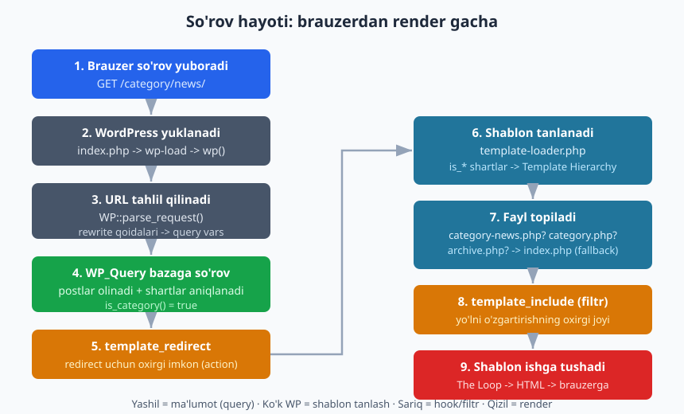
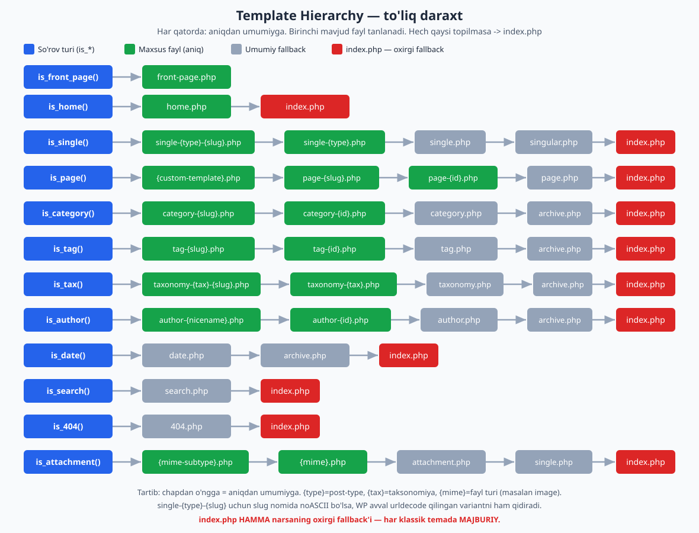
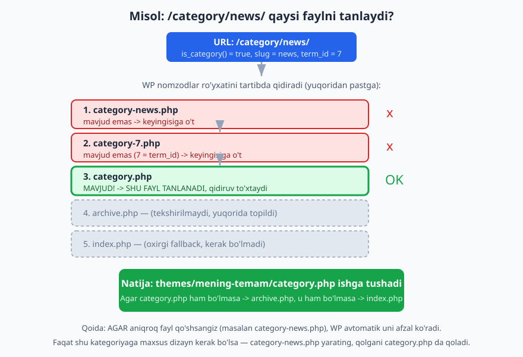

# 03 — So'rov hayoti va template hierarchy

[⬅️ Oldingi: 02 — Lokal muhit va birinchi minimal tema](./02-lokal-muhit-birinchi-tema.md) · [🏠 README](./README.md) · [Keyingi: 04 — Tema anatomiyasi va standartlar ➡️](./04-tema-anatomiyasi-standartlar.md)

> **Bu bobda:** WordPress brauzerdan kelgan URL'ni qanday qabul qilishini va qaysi shablon faylini ishga tushirishini boshdan oxir o'rganamiz. Template hierarchy — klassik temaning eng muhim tushunchasi: WP "qaysi faylni ko'rsatay?" degan savolga avtomatik javob beradi. Bu bobni tushunsangiz, qolgan barcha klassik tema boblari oson ketadi.

---

## Nega bu bob eng muhim

02-bobda biz `index.php` va `style.css` dan iborat eng kichik temani yaratdik. U ishladi, lekin BARCHA sahifalar bir xil ko'rinardi — bosh sahifa ham, alohida post ham, 404 ham. Sababi oddiy: bizda faqat bitta shablon (`index.php`) bor edi.

Real temada bizga har xil sahifa uchun har xil ko'rinish kerak:

- alohida post — kontent, muallif, sana, izohlar bilan;
- kategoriya arxivi — postlar ro'yxati bilan;
- 404 sahifa — "topilmadi" xabari va qidiruv bilan;
- statik "Aloqa" sahifasi — forma bilan.

WordPress bu ishni **template hierarchy** (shablon iyerarxiyasi) orqali hal qiladi. Siz to'g'ri nomdagi faylni yaratasiz — WordPress uni avtomatik tanlaydi. Hech qanday `if/else` yozmaysiz, hech qaysi faylni ro'yxatga olmaysiz. Faqat **fayl nomini to'g'ri qo'ying** — qolganini WordPress qiladi.

Bu butun klassik tema dvigatelining yuragi. Keling, avval WordPress so'rovni qanday qabul qilishini ko'ramiz.

## So'rov hayoti: URL dan render gacha

Foydalanuvchi `https://saytim.uz/category/news/` ga kirganda, WordPress quyidagi bosqichlardan o'tadi:



1. **Brauzer so'rov yuboradi.** `GET /category/news/` so'rovi serverga keladi.
2. **WordPress yuklanadi.** Server `index.php` ni ishga tushiradi (tema `index.php` emas — WordPress yadrosining ildizidagi `index.php`). U `wp-load.php` ni, so'ng `wp()` funksiyasini chaqiradi.
3. **URL tahlil qilinadi.** `WP::parse_request()` rewrite qoidalari yordamida URL'ni **query vars** ga aylantiradi. `/category/news/` -> `category_name=news` degan ma'noni anglatadi.
4. **WP_Query bazaga so'rov yuboradi.** WordPress bu query vars asosida MySQL'ga so'rov tuzadi, postlarni oladi va **so'rov turini** aniqlaydi. Bu yerda `is_category()` `true` bo'ladi.
5. **`template_redirect` action ishlaydi.** Bu — shablon tanlashdan OLDINGI oxirgi nuqta. Bu yerda kerak bo'lsa boshqa sahifaga yo'naltirish (redirect) mumkin.
6. **Shablon tanlanadi.** `template-loader.php` `is_*` shartlarni tekshirib, template hierarchy bo'yicha mos faylni qidiradi.
7. **Fayl topiladi.** WordPress nomzodlar ro'yxatini tartibda tekshiradi: `category-news.php` bormi? `category.php` bormi? `archive.php`? Oxirida `index.php`.
8. **`template_include` filtri ishlaydi.** Tanlangan fayl yo'lini o'zgartirishning oxirgi imkoni.
9. **Shablon ishga tushadi.** Tanlangan PHP fayl `include` qilinadi. Uning ichidagi The Loop postlarni HTML'ga aylantiradi va brauzerga jo'natadi.

> **Asosiy g'oya:** WordPress sahifani ko'rsatishdan OLDIN ikkita savolga javob beradi — "qanday ma'lumot kerak?" (4-bosqich, WP_Query) va "qaysi shablon bilan ko'rsatay?" (6-7-bosqich, template hierarchy). Tema muallifi sifatida siz asosan ikkinchi qismni boshqarasiz.

### `wp_using_themes()` va aslida nima `include` qilinadi

Bu butun mexanizm `wp-includes/template-loader.php` faylida. Uning soddalashtirilgan mantig'i:

```php
// wp-includes/template-loader.php (soddalashtirilgan)
$template = false;

foreach ( $tag_templates as $tag => $template_getter ) {
	if ( call_user_func( $tag ) ) {           // masalan is_category() ?
		$template = call_user_func( $template_getter ); // get_category_template()
	}
	if ( $template ) {
		break; // birinchi mos kelgan turda to'xtaydi
	}
}

if ( ! $template ) {
	$template = get_index_template(); // hech narsa mos kelmasa
}

$template = apply_filters( 'template_include', $template ); // sizning oxirgi imkoningiz

include $template; // shablon ishga tushadi
```

E'tibor bering: oxirida shunchaki `include $template` — ya'ni tanlangan fayl oddiy PHP fayli sifatida ishga tushiriladi. Sizning temangizdagi `category.php` shu yerda chaqiriladi.

> **WordPress 7.0 yangiligi:** `include` qilishdan oldin yadro `wp_before_include_template` action'ini ishga tushiradi (6.9.0 dan). Shuningdek, endi `.php` bilan birga `.html` fayllar ham qabul qilinadi — bu block temalar uchun (15-bobda batafsil). Klassik temada bizni `.php` qiziqtiradi.

## `is_*` shartlar — so'rovning "shaxsi"

4-bosqichda WP_Query so'rov turini aniqlagandan keyin, **shartli teglar** (conditional tags) javob beradi. Bular oddiy `true`/`false` qaytaruvchi funksiyalar:

| Funksiya | `true` bo'ladi qachon |
|---|---|
| `is_front_page()` | bosh sahifa (sayt kirish nuqtasi) |
| `is_home()` | postlar blog ro'yxati sahifasi |
| `is_single()` | alohida post (yoki CPT yozuvi) |
| `is_page()` | statik sahifa (Page) |
| `is_category()` | kategoriya arxivi |
| `is_tag()` | teg arxivi |
| `is_tax()` | custom taxonomy arxivi |
| `is_author()` | muallif arxivi |
| `is_date()` | sana arxivi (yil/oy/kun) |
| `is_search()` | qidiruv natijalari |
| `is_404()` | topilmagan sahifa |
| `is_archive()` | har qanday arxiv (umumiy) |

WordPress shablon tanlashda bu funksiyalarni **aniq ketma-ketlikda** tekshiradi. Tartib muhim — masalan `is_attachment()` `is_single()` dan oldin tekshiriladi, chunki ilova (attachment) ham texnik jihatdan "single" hisoblanadi, lekin uning o'z shabloni bor.

Yadrodagi haqiqiy tekshirish tartibi (WordPress 7.0 `template-loader.php` dan):

```
is_embed -> is_404 -> is_search -> is_front_page -> is_home
-> is_privacy_policy -> is_post_type_archive -> is_tax
-> is_attachment -> is_single -> is_page -> is_singular
-> is_category -> is_tag -> is_author -> is_date -> is_archive
```

Birinchi `true` qaytargan tur g'olib bo'ladi va o'sha turning shablon-tanlash funksiyasi (`get_*_template`) chaqiriladi.

> **Hayotiy o'xshatish:** WordPress'ni pochta bo'limi deb tasavvur qiling. Xat (so'rov) keladi, xodim uni navbatma-navbat tekshiradi: "Bu shoshilinchmi? Yo'q. Buyurtmami? Yo'q. Oddiy xatmi? Ha!" — va birinchi mos kategoriyaga qarab xatni to'g'ri qutiga (shablonga) soladi. `is_*` funksiyalari — shu "ha/yo'q" savollari.

## Template hierarchy — to'liq daraxt

Mana bobning yuragi. Har bir so'rov turi uchun WordPress bitta fayl emas, balki **nomzodlar ro'yxati** tuzadi — eng aniqdan eng umumiygacha. Birinchi MAVJUD faylni topadi va ishlatadi. Hech qaysi topilmasa, hammasi `index.php` ga tushadi.



Daraxtni qatorma-qator o'qiymiz (`{type}` = post-type slug, `{slug}`/`{id}` = obyekt slug yoki ID, `{tax}` = taxonomy nomi):

**Bosh sahifa:**
- `is_front_page()` -> `front-page.php` -> `index.php`
- `is_home()` (blog postlari) -> `home.php` -> `index.php`

**Alohida post:**
- `is_single()` -> `single-{type}-{slug}.php` -> `single-{type}.php` -> `single.php` -> `singular.php` -> `index.php`

**Statik sahifa:**
- `is_page()` -> `{custom-template}.php` -> `page-{slug}.php` -> `page-{id}.php` -> `page.php` -> `singular.php` -> `index.php`

**Kategoriya:**
- `is_category()` -> `category-{slug}.php` -> `category-{id}.php` -> `category.php` -> `archive.php` -> `index.php`

**Teg:**
- `is_tag()` -> `tag-{slug}.php` -> `tag-{id}.php` -> `tag.php` -> `archive.php` -> `index.php`

**Custom taxonomy:**
- `is_tax()` -> `taxonomy-{tax}-{slug}.php` -> `taxonomy-{tax}.php` -> `taxonomy.php` -> `archive.php` -> `index.php`

**Muallif:**
- `is_author()` -> `author-{nicename}.php` -> `author-{id}.php` -> `author.php` -> `archive.php` -> `index.php`

**Sana:**
- `is_date()` -> `date.php` -> `archive.php` -> `index.php`

**Qidiruv:**
- `is_search()` -> `search.php` -> `index.php`

**404:**
- `is_404()` -> `404.php` -> `index.php`

**Ilova (attachment):**
- `is_attachment()` -> `{mime-subtype}.php` -> `{mime}.php` -> `attachment.php` -> `single.php` -> `index.php`

> **Eng muhim qoida:** `index.php` — har qanday so'rov uchun OXIRGI fallback. Shu sababli klassik temada `index.php` MAJBURIY: agar boshqa hech qaysi mos fayl bo'lmasa, WordPress shuni ishlatadi. (Aynan shuning uchun 02-bobdagi minimal temamiz faqat `index.php` bilan ham har sahifani ko'rsata oldi.)

### Bu sonlar va nomlar qayerdan? Yadrodan tasdiqlangan

Yuqoridagi ketma-ketliklar taxmin emas — ular WordPress 7.0 yadrosining `wp-includes/template.php` faylidan olingan. Masalan, `get_single_template()` funksiyasi nomzodlarni aynan shunday tuzadi:

```php
// wp-includes/template.php — get_single_template() (yadro kodi, qisqartirilgan)
$templates = array();

if ( ! empty( $object->post_type ) ) {
	$template = get_page_template_slug( $object ); // custom template tayinlangan bo'lsa
	if ( $template && 0 === validate_file( $template ) ) {
		$templates[] = $template;
	}
	$templates[] = "single-{$object->post_type}-{$object->post_name}.php";
	$templates[] = "single-{$object->post_type}.php";
}
$templates[] = 'single.php';

return get_query_template( 'single', $templates );
```

Ko'rib turibsiz: birinchi `single-{type}-{slug}.php`, keyin `single-{type}.php`, oxirida `single.php`. Aynan diagrammadagidek. (Yadro slug nomida noASCII belgilar bo'lsa, avval `urldecode` qilingan variantni ham qo'shadi — lekin oddiy lotin slug'larda bu farq qilmaydi.)

## `get_query_template()` va `locate_template()` — mexanizm ichi

Har bir `get_*_template()` funksiya oxirida `get_query_template()` ni chaqiradi. Bu funksiya ikkita muhim ish qiladi:

```php
// wp-includes/template.php — get_query_template() (qisqartirilgan)
function get_query_template( $type, $templates = array() ) {
	if ( empty( $templates ) ) {
		$templates = array( "{$type}.php" );
	}

	// 1) Nomzodlar ro'yxatini o'zgartirish imkoni (filtr).
	$templates = apply_filters( "{$type}_template_hierarchy", $templates );

	// 2) Ro'yxatdagi birinchi MAVJUD faylni topish.
	$template = locate_template( $templates );

	// 3) Yakuniy yo'lni o'zgartirish imkoni (filtr).
	return apply_filters( "{$type}_template", $template, $type, $templates );
}
```

Demak har so'rov turi uchun ikkita foydali filtr bor:

- **`{$type}_template_hierarchy`** — nomzodlar ro'yxatiga aralashish (masalan `category_template_hierarchy`, `single_template_hierarchy`).
- **`{$type}_template`** — yakuniy tanlangan yo'lni o'zgartirish (masalan `category_template`).

Faylni HAQIQATDA qidirish ishini `locate_template()` qiladi:

```php
// wp-includes/template.php — locate_template() (qisqartirilgan)
foreach ( (array) $template_names as $template_name ) {
	if ( file_exists( $wp_stylesheet_path . '/' . $template_name ) ) {
		$located = $wp_stylesheet_path . '/' . $template_name; // aktiv temada bormi?
		break;
	} elseif ( $is_child_theme && file_exists( $wp_template_path . '/' . $template_name ) ) {
		$located = $wp_template_path . '/' . $template_name;   // ota-temada bormi?
		break;
	}
}
```

Ya'ni `locate_template()` avval **aktiv tema** (`$wp_stylesheet_path`) ichida qaraydi, topmasa **ota-tema** (child tema bo'lsa) ichida qaraydi. Bu — child tema temani qanday "ustidan yozishi"ning sababi (29-bobda batafsil). `file_exists` topgan birinchi faylda darhol to'xtaydi.

> **Eslab qoling:** "birinchi mavjud fayl g'olib" — bu butun hierarchy'ning bitta jumlalik mohiyati.

## `template_include` filtri — eng kuchli ilgak

Yuqorida ko'rdik: `template-loader.php` faylni `include` qilishdan oldin `template_include` filtrini ishga tushiradi. Bu — har qanday so'rov uchun, har qanday shablon yo'lini almashtirishning umumiy nuqtasi:

```php
// functions.php — VIP foydalanuvchilar uchun maxsus kategoriya shabloni
add_filter( 'template_include', function ( $template ) {
	if ( is_category( 'news' ) && is_user_logged_in() ) {
		$custom = locate_template( 'category-news-vip.php' );
		if ( $custom ) {
			return $custom; // oddiy hierarchy o'rniga shu fayl ishlaydi
		}
	}
	return $template; // qolgan hamma holatda hech narsani o'zgartirmaymiz
} );
```

> **DIQQAT — keng tarqalgan xato:** Shablon almashtirish uchun `template_redirect` ichida `include` + `exit` ISHLATMANG. Bu keyingi hooklarni buzadi va sahifani "yarim" qoldiradi. Shablonni almashtirish kerak bo'lsa — DOIM `template_include` filtridan foydalaning. `template_redirect` esa faqat HAQIQIY redirect (boshqa URL'ga yo'naltirish) uchun:

```php
// To'g'ri: template_redirect FAQAT redirect uchun
add_action( 'template_redirect', function () {
	if ( is_page( 'eskirgan' ) ) {
		wp_safe_redirect( home_url( '/yangi/' ), 301 );
		exit; // redirect'dan keyin exit O'RINLI
	}
} );
```

## Aniq misol: `/category/news` qaysi faylni tanlaydi?

Nazariyani amalda ko'ramiz. Faraz qilaylik foydalanuvchi `/category/news/` ga kirdi. "news" — slug, uning `term_id` = 7.



WordPress nomzodlar ro'yxatini tartibda tekshiradi:

1. `category-news.php` bormi? — **yo'q** -> keyingisi.
2. `category-7.php` bormi? — **yo'q** (7 = term_id) -> keyingisi.
3. `category.php` bormi? — **HA!** -> shu fayl tanlanadi, qidiruv to'xtaydi.
4. `archive.php` — tekshirilmaydi (yuqorida topildi).
5. `index.php` — kerak bo'lmadi.

Natijada `themes/mening-temam/category.php` ishga tushadi. Agar `category.php` ham bo'lmaganda, `archive.php` ga, u ham bo'lmaganda `index.php` ga tushardi.

**Amaliy xulosa:** agar siz FAQAT "news" kategoriyasiga maxsus dizayn xohlasangiz — `category-news.php` yarating. Qolgan barcha kategoriyalar `category.php` da qoladi. Hech qanday `if` shart yozish shart emas — fayl nomining o'zi yetarli. Mana template hierarchy'ning kuchi shunda.

Mana `category.php` ning to'liq, ishlaydigan namunasi (PHP sintaksisi `php -l` bilan tekshirilgan):

```php
<?php
/**
 * category.php — barcha kategoriya arxivi shabloni.
 */
get_header();

if ( have_posts() ) :
	echo '<h1 class="archive-title">';
	single_cat_title( esc_html__( 'Kategoriya: ', 'mening-temam' ) );
	echo '</h1>';

	while ( have_posts() ) :
		the_post();
		?>
		<article <?php post_class(); ?>>
			<h2><a href="<?php the_permalink(); ?>"><?php the_title(); ?></a></h2>
			<div class="excerpt"><?php the_excerpt(); ?></div>
		</article>
		<?php
	endwhile;

	the_posts_pagination();
else :
	echo '<p>' . esc_html__( 'Bu kategoriyada hali post yo\'q.', 'mening-temam' ) . '</p>';
endif;

get_footer();
```

(The Loop — `have_posts()`/`the_post()` — keyingi 05-bobda chuqur o'rganiladi. Hozircha shablonning umumiy shaklini tushunish kifoya.)

## Maxsus shablonlar: slug, ID va custom template

Hierarchy faqat umumiy fayllar haqida emas — u sizga juda aniq nishonga olish imkonini beradi:

- **Slug bo'yicha:** `page-aloqa.php` — faqat slug'i "aloqa" bo'lgan sahifa uchun. `category-news.php` — faqat "news" kategoriyasi uchun.
- **ID bo'yicha:** `page-42.php` — faqat ID = 42 bo'lgan sahifa uchun. (Slug o'zgarishi mumkin, ID — yo'q; lekin ID kodni o'qishni qiyinlashtiradi, shuning uchun slug afzal.)
- **Post type bo'yicha:** `single-kitob.php` — "kitob" custom post type yozuvlari uchun. `archive-kitob.php` — uning arxivi uchun.
- **Custom Template (Template Name):** sahifa shabloni fayliga maxsus izoh qo'yib, admin panelda tanlanadigan shablon yaratish mumkin:

```php
<?php
/*
 * Template Name: To'liq kenglik
 * Template Post Type: page
 */
get_header();
while ( have_posts() ) :
	the_post();
	echo '<div class="fullwidth">';
	the_content();
	echo '</div>';
endwhile;
get_footer();
```

Bu fayl (masalan `page-fullwidth.php`) admin panelidagi "Page Attributes > Template" ro'yxatida "To'liq kenglik" deb ko'rinadi. Muharrir uni qo'lda tanlasa, hierarchy'da bu eng yuqori ustuvorlikka ega bo'ladi. (Bu — 07-bobda amalda ishlatadigan texnikamiz.)

> **Tartibni esda tuting:** Custom template (qo'lda tanlangan) > `page-{slug}.php` > `page-{id}.php` > `page.php`. Eng aniq variant doim g'olib.

## Qaysi shablon tanlanganini qanday bilish mumkin

Tema yozayotganda "WordPress qaysi faylni ishlatyapti?" degan savol tez-tez chiqadi. Ikki yo'l bor:

**1) Query Monitor plagini** (tavsiya etiladi) — admin panelda joriy so'rov turini, tanlangan shablonni va barcha nomzodlar ro'yxatini ko'rsatadi. Ishlab chiqishda eng qulay vosita.

**2) Qo'lda, `template_include` orqali** — vaqtincha `functions.php` ga qo'shing:

```php
// Tanlangan shablonni log'ga yozadi (faqat ishlab chiqishda).
add_filter( 'template_include', function ( $template ) {
	if ( current_user_can( 'manage_options' ) ) {
		$rel = str_replace( get_stylesheet_directory(), '', $template );
		error_log( 'WPT: tanlangan shablon = ' . $rel );
	}
	return $template;
}, 9999 );
```

Bu kod `wp-content/debug.log` ga (agar `WP_DEBUG_LOG` yoqilgan bo'lsa) qaysi fayl tanlanganini yozadi. `9999` prioritet — boshqa filtrlar ishlagandan keyin, eng oxirgi qiymatni ko'rish uchun.

> **Eslatma:** Bu kod ishlab chiqish uchun. Tayyor (production) saytda log yozishni o'chiring yoki Query Monitor'dan foydalaning.

## Klassik va block tema: hierarchy farqi

2026-yilda block (FSE) temalar standart, lekin template hierarchy mantig'i ikkalasida ham YASHAYDI — faqat fayl turi farq qiladi:

| | Klassik tema | Block tema |
|---|---|---|
| Shablon fayli | `category.php` (PHP) | `category.html` (block markup) |
| Joylashuvi | tema ildizida | `templates/` papkasida |
| Tanlash mantig'i | template hierarchy | **aynan o'sha** template hierarchy |
| The Loop | qo'lda PHP'da | Query Loop bloki |

Ya'ni `single-{type}.php` -> `single-{type}.html` ga aylanadi, lekin "aniqdan umumiygacha, birinchi mavjud g'olib" qoidasi o'zgarmaydi. Shu sababli bu bob butun kitob davomida foydali — block temalarni (15-21-boblar) o'rganganda ham shu mantiq ishlaydi. Yadroda buni `locate_block_template()` funksiyasi boshqaradi (WordPress 7.0 da mavjud, jonli tasdiqlandi).

> **Xulosa:** Template hierarchy — WordPress'ning "qaysi faylni ko'rsatay?" degan savolga avtomatik javobi. Siz to'g'ri nomli faylni yaratasiz — WordPress uni topadi. Bu klassik va block temalar uchun bir xil ishlaydi va butun tema yaratishning poydevoridir. Keyingi bobda tema fayllari va standartlarini, so'ngra 05-07-boblarda The Loop va shablonlarni amalda yozamiz.

## Mashqlar

> Quyidagi mashqlarda "qaysi shablon tanlanadi?" deganda — temada FAQAT umumiy fayllar (`index.php`, `single.php`, `page.php`, `archive.php`, `category.php`, `404.php`, `search.php`) borligini faraz qiling, agar mashq boshqa narsa aytmasa.

### Oson

1. Foydalanuvchi `/category/sport/` ga kirdi. Temada `category.php` bor. Qaysi fayl tanlanadi?
2. `is_*` shartlardan qaysi biri 404 sahifada `true` bo'ladi va u qaysi faylni qidiradi (404.php bo'lmasa keyingisi nima)?
3. Template hierarchy'da BARCHA so'rov turlari uchun eng oxirgi fallback fayl qaysi? Nega u har temada majburiy?
4. `single.php` va `page.php` o'rtasidagi farqni bir jumlada ayting: qaysi biri qachon ishlaydi?

### O'rta

5. Bitta `single-kitob.php` faylini yozing: "kitob" custom post type yozuvi uchun, sarlavha, muqova rasmi (agar bo'lsa) va kontentni ko'rsatsin. `get_header()`/`get_footer()` ishlatsin.
6. Quyidagi nomzodlar ro'yxatini "news" kategoriyasi (term_id=7) uchun TO'G'RI tartibda yozing (aniqdan umumiygacha): `category.php`, `archive.php`, `category-7.php`, `index.php`, `category-news.php`.
7. Faqat "Aloqa" sahifasiga (slug = "aloqa") maxsus shablon kerak: forma bilan. Qaysi nomdagi fayl yaratasiz va nega bu `page.php` dan ustun turadi?
8. `template_include` filtri yordamida: agar foydalanuvchi qidiruv natijalari sahifasida bo'lsa VA hech narsa topilmagan bo'lsa, oddiy `search.php` o'rniga `search-empty.php` ni ishlatadigan kod yozing (fayl mavjud bo'lsa).

### Qiyin

9. `/janr/fantastika/` URL'i "janr" custom taxonomy uchun. Temada faqat `archive.php` va `index.php` bor. WordPress qaysi nomzodlarni qaysi tartibda qidiradi va oxir-oqibat qaysi fayl ishlaydi?
10. "VIP" (tizimga kirgan) foydalanuvchilar uchun "news" kategoriyasida `category-news-vip.php` ni ko'rsatadigan, qolganlarga oddiy hierarchy ishlaydigan to'liq `template_include` kodini yozing.
11. Hamkasbingiz shablonni almashtirish uchun `template_redirect` action ichida `include 'maxsus.php'; exit;` yozgan. Bu nega xato va to'g'ri yechim qanday? Tushuntiring va to'g'ri kodni ko'rsating.
12. `front-page.php`, `home.php` va `index.php` — uchalasi ham bosh sahifaga aloqador. Sayt sozlamasida "bosh sahifa = oxirgi postlar" bo'lsa, qaysi tartibda qaysi fayl tanlanadi? Agar "bosh sahifa = statik sahifa" bo'lsa-chi? Farqni tushuntiring.
13. Joriy so'rovda qaysi `is_*` shartlar `true` ekanini va tanlangan shablon yo'lini `debug.log` ga yozadigan diagnostika kodini yozing (faqat administrator uchun).

## Yechimlar

<details markdown="1">
<summary>Yechim — 1</summary>

`category.php` tanlanadi. WordPress avval `category-sport.php` ni, so'ng `category-{id}.php` ni qidiradi — ikkalasi ham yo'q. Keyin `category.php` ni topadi va shu yerda to'xtaydi (`archive.php` va `index.php` gacha bormaydi).

</details>

<details markdown="1">
<summary>Yechim — 2</summary>

404 sahifada `is_404()` `true` bo'ladi. U avval `404.php` ni qidiradi. Agar `404.php` bo'lmasa, hierarchy darhol `index.php` ga tushadi (404 uchun oraliq fayllar yo'q — faqat `404.php` -> `index.php`).

</details>

<details markdown="1">
<summary>Yechim — 3</summary>

Eng oxirgi fallback — `index.php`. U majburiy, chunki agar boshqa hech qanday mos fayl topilmasa (yangi temada ko'pincha shunday), WordPress `index.php` ni ishlatadi. Usiz tema "yaroqsiz" hisoblanadi va aktivlashtirib bo'lmaydi — `index.php` butun hierarchy'ning kafolatlangan yakuniy nuqtasi.

</details>

<details markdown="1">
<summary>Yechim — 4</summary>

`single.php` — alohida **post** (yoki CPT yozuvi) ochilganda ishlaydi (`is_single()`). `page.php` — statik **sahifa** (Page) ochilganda ishlaydi (`is_page()`). Qisqasi: blog yozuvi -> `single.php`, "Aloqa"/"Biz haqimizda" kabi sahifa -> `page.php`.

</details>

<details markdown="1">
<summary>Yechim — 5</summary>

`single-kitob.php` (PHP sintaksisi `php -l` bilan tekshirilgan):

```php
<?php
/**
 * single-kitob.php — "kitob" CPT yozuvi shabloni.
 */
get_header();
while ( have_posts() ) :
	the_post();
	?>
	<article <?php post_class( 'book' ); ?>>
		<h1><?php the_title(); ?></h1>
		<?php if ( has_post_thumbnail() ) : ?>
			<div class="cover"><?php the_post_thumbnail( 'medium' ); ?></div>
		<?php endif; ?>
		<div class="book-content"><?php the_content(); ?></div>
	</article>
	<?php
endwhile;
get_footer();
```

Bu fayl tema ildizida bo'lsa, "kitob" CPT yozuvi ochilganda `single.php` dan ustun turadi (`single-kitob.php` aniqroq).

</details>

<details markdown="1">
<summary>Yechim — 6</summary>

To'g'ri tartib (aniqdan umumiygacha):

1. `category-news.php` (slug bo'yicha — eng aniq)
2. `category-7.php` (term_id bo'yicha)
3. `category.php` (umumiy kategoriya)
4. `archive.php` (umumiy arxiv)
5. `index.php` (oxirgi fallback)

</details>

<details markdown="1">
<summary>Yechim — 7</summary>

`page-aloqa.php` faylini yaratasiz. U `page.php` dan ustun turadi, chunki template hierarchy'da slug bo'yicha aniq fayl (`page-{slug}.php`) umumiy `page.php` dan oldin tekshiriladi. WordPress avval `page-aloqa.php` ni topadi va boshqa nomzodlarga o'tmaydi — natijada faqat "aloqa" sahifasi maxsus ko'rinishga ega bo'ladi, qolgan barcha sahifalar `page.php` da qoladi.

</details>

<details markdown="1">
<summary>Yechim — 8</summary>

```php
// functions.php
add_filter( 'template_include', function ( $template ) {
	if ( is_search() && ! have_posts() ) {
		$empty = locate_template( 'search-empty.php' );
		if ( $empty ) {
			return $empty;
		}
	}
	return $template;
} );
```

`locate_template()` faylni temada (va child tema bo'lsa ota-temada) qidiradi; topilsa o'sha yo'lni qaytaramiz, aks holda hech narsani o'zgartirmaymiz.

</details>

<details markdown="1">
<summary>Yechim — 9</summary>

`/janr/fantastika/` "janr" custom taxonomy uchun `is_tax()` `true` qiladi. WordPress quyidagi nomzodlarni shu tartibda qidiradi:

1. `taxonomy-janr-fantastika.php` — yo'q
2. `taxonomy-janr-{id}.php` — yo'q
3. `taxonomy-janr.php` — yo'q
4. `taxonomy.php` — yo'q
5. `archive.php` — **MAVJUD!** -> shu fayl ishlaydi

Demak `archive.php` tanlanadi. (Agar u ham bo'lmaganda — `index.php` ga tushardi.)

</details>

<details markdown="1">
<summary>Yechim — 10</summary>

```php
// functions.php
add_filter( 'template_include', function ( $template ) {
	if ( is_category( 'news' ) && is_user_logged_in() ) {
		$custom = locate_template( 'category-news-vip.php' );
		if ( $custom ) {
			return $custom;
		}
	}
	return $template;
} );
```

`is_category( 'news' )` — faqat "news" kategoriyasida; `is_user_logged_in()` — faqat tizimga kirgan foydalanuvchi uchun. Ikkala shart bajarilsa va `category-news-vip.php` mavjud bo'lsa, o'sha fayl ishlaydi. Boshqa barcha holatda `$template` (oddiy hierarchy natijasi) o'zgarmaydi.

</details>

<details markdown="1">
<summary>Yechim — 11</summary>

**Nega xato:** `template_redirect` ichida `include ... ; exit;` qilsangiz, WordPress'ning normal shablon yuklash jarayoni buziladi — `template_include` filtri va `wp_before_include_template` action umuman ishlamaydi, boshqa plaginlar/temalar shablonni o'zgartira olmaydi, sahifa "yarim" holatda qoladi. `exit` butun keyingi oqimni to'xtatadi.

**To'g'ri yechim:** shablon almashtirish uchun DOIM `template_include` filtridan foydalaning (u aynan shu maqsad uchun yaratilgan):

```php
add_filter( 'template_include', function ( $template ) {
	if ( /* sizning shartingiz */ true ) {
		$custom = locate_template( 'maxsus.php' );
		if ( $custom ) {
			return $custom;
		}
	}
	return $template;
} );
```

`template_redirect` esa faqat haqiqiy redirect uchun (`wp_safe_redirect()` + `exit`), shablon almashtirish uchun emas.

</details>

<details markdown="1">
<summary>Yechim — 12</summary>

**Holat A — "bosh sahifa = oxirgi postlar"** (Sozlamalar > O'qish): bosh sahifa ham `is_front_page()`, ham `is_home()` ni `true` qiladi. Yadro tartibida `is_front_page` oldin tekshiriladi, shuning uchun:

`front-page.php` -> (bo'lmasa) `home.php` -> (bo'lmasa) `index.php`

**Holat B — "bosh sahifa = statik sahifa"**: bosh sahifada `is_front_page()` `true`, lekin `is_home()` `false` (blog endi boshqa sahifada). Bosh sahifa uchun:

`front-page.php` -> (bo'lmasa) `page-{slug}.php`/`page-{id}.php` -> `page.php` -> `index.php`

Bunda alohida tayinlangan "Posts page" (blog) sahifasi `is_home()` ni `true` qiladi va `home.php` -> `index.php` ishlatadi.

**Farq:** `front-page.php` har ikki holatda ham eng yuqori ustuvorlik. `home.php` esa MA'NO jihatdan doim "blog postlari ro'yxati" sahifasi uchun — u statik bosh sahifada emas, balki postlar sahifasida ishlaydi.

</details>

<details markdown="1">
<summary>Yechim — 13</summary>

```php
// functions.php — diagnostika (faqat ishlab chiqishda)
add_filter( 'template_include', function ( $template ) {
	if ( current_user_can( 'manage_options' ) ) {
		$checks = array(
			'is_front_page', 'is_home', 'is_single', 'is_page',
			'is_category', 'is_tag', 'is_tax', 'is_author',
			'is_date', 'is_search', 'is_404', 'is_archive',
		);
		$active = array();
		foreach ( $checks as $fn ) {
			if ( call_user_func( $fn ) ) {
				$active[] = $fn;
			}
		}
		$rel = str_replace( get_stylesheet_directory(), '', $template );
		error_log( 'WPT shartlar: ' . implode( ', ', $active ) );
		error_log( 'WPT shablon: ' . $rel );
	}
	return $template;
}, 9999 );
```

Bu kod har sahifa uchun qaysi `is_*` shartlar `true` ekanini va tanlangan shablon yo'lini `wp-content/debug.log` ga yozadi (`WP_DEBUG_LOG` yoqilgan bo'lsa). `9999` prioritet — barcha boshqa o'zgartirishlardan keyingi yakuniy qiymatni ko'rsatadi. Production'da olib tashlang.

</details>

---

[⬅️ Oldingi: 02 — Lokal muhit va birinchi minimal tema](./02-lokal-muhit-birinchi-tema.md) · [🏠 README](./README.md) · [Keyingi: 04 — Tema anatomiyasi va standartlar ➡️](./04-tema-anatomiyasi-standartlar.md)
