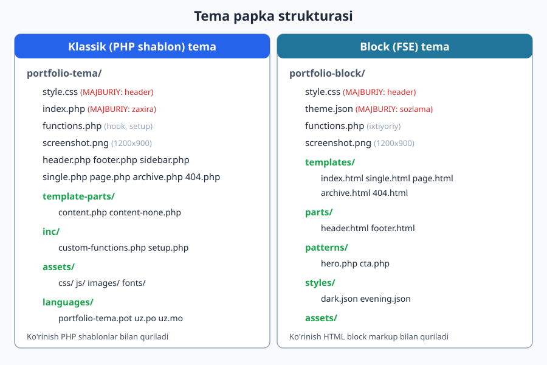
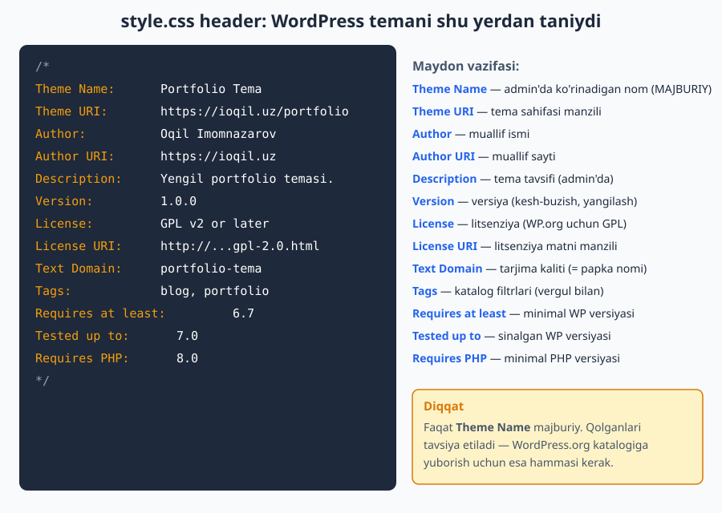
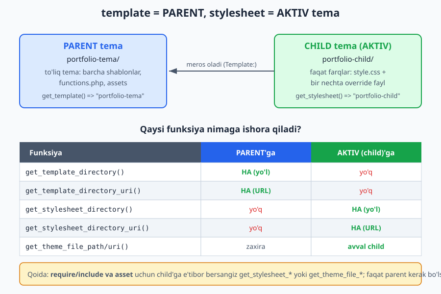

# 04 — Tema anatomiyasi va standartlar

[⬅️ Oldingi: 03 — So'rov hayoti va template hierarchy](./03-sorov-hayoti-template-hierarchy.md) · [🏠 README](./README.md) · [Keyingi: 05 — The Loop va WP_Query ➡️](./05-the-loop-wp-query.md)

> **Bu bobda:** Temani tashkil qiluvchi fayllarni birma-bir ko'rib chiqamiz: `style.css` header maydonlaridan tortib `functions.php`, `screenshot.png`, `template-parts/`, `inc/`, `assets/` va `languages/` papkalarigacha. Klassik va block temaning papka strukturasini solishtiramiz, WordPress Coding Standards (kod yozish qoidalari) bilan tanishamiz va eng ko'p chalkashtiriladigan funksiyalar — `get_template_directory()` bilan `get_stylesheet_directory()` — orasidagi farqni amalda o'rganamiz.

---

## Tema — bu shunchaki papka

Oldingi bobda WordPress so'rovni qanday qabul qilib, qaysi shablon faylni tanlashini ko'rdik. Endi savol: o'sha fayllar qayerda yashaydi va qanday tartibga solinadi?

Javob sodda: **tema — bu `wp-content/themes/` ichidagi bitta papka.** WordPress shu papkaga qarab "Bu tema-ku" deb tushunadi. Lekin papka shunchaki bo'sh bo'lib qolmaydi — uning ichida WordPress kutadigan ma'lum fayllar bor. Bu fayllarni hayotiy o'xshatish bilan tasavvur qiling:

- **`style.css`** — temaning **pasporti**. Ismi, muallifi, versiyasi shu yerda. WordPress aynan shu faylni qidiradi va topmasa, papkani tema deb hisoblamaydi.
- **`index.php`** (klassik) yoki **`templates/index.html`** (block) — temaning **zaxira shabloni**. Boshqa hech narsa topilmasa, shu ishlaydi (03-bobdagi hierarchy daraxtining eng pastki bargi).
- **`functions.php`** — temaning **moslama paneli**. Hook'lar, imkoniyatlar, enqueue — hammasi shu yerdan boshqariladi.
- **`screenshot.png`** — admin panelida ko'rinadigan **muqova rasmi**.

Qolgan fayllar va papkalar tartibni saqlash uchun: shablonlar, qayta ishlatiladigan bo'laklar, CSS/JS/rasm fayllari, tarjimalar. Keling, har birini batafsil ko'rib chiqamiz.



---

## `style.css` — temaning pasporti

`style.css` aslida ikki vazifani bajaradi:

1. Faylning **boshidagi izoh bloki** (header) — WordPress shu yerdan tema haqidagi ma'lumotni o'qiydi.
2. Qolgan qismi — odatdagi **CSS uslublari** (klassik temada).

WordPress faqat birinchisini majburiy qiladi. Header bloki `/* ... */` izoh ichida, `Maydon nomi: qiymat` ko'rinishida yoziladi:

```css
/*
Theme Name: Portfolio Tema
Theme URI: https://ioqil.uz/portfolio
Author: Oqil Imomnazarov
Author URI: https://ioqil.uz
Description: Yengil va tez portfolio temasi. Block tahrirlash imkoniyatlari bilan.
Version: 1.0.0
License: GNU General Public License v2 or later
License URI: http://www.gnu.org/licenses/gpl-2.0.html
Text Domain: portfolio-tema
Tags: blog, portfolio, custom-colors, custom-menu, featured-images, translation-ready
Requires at least: 6.7
Tested up to: 7.0
Requires PHP: 8.0
*/

/* Bu yerdan keyin odatdagi CSS boshlanadi */
body {
	font-family: system-ui, sans-serif;
}
```



### Har bir maydon nimani anglatadi

| Maydon | Vazifasi | Majburiymi? |
|---|---|---|
| **Theme Name** | Admin panelida ko'rinadigan nom | **Ha** — yagona majburiy maydon |
| **Theme URI** | Tema sahifasi/demo manzili | Yo'q (tavsiya) |
| **Author** | Muallif ismi | Yo'q (tavsiya) |
| **Author URI** | Muallif sayti | Yo'q (tavsiya) |
| **Description** | Tema haqida qisqa tavsif | Yo'q (tavsiya) |
| **Version** | Tema versiyasi (masalan `1.0.0`) | Yo'q, lekin juda muhim |
| **License** | Litsenziya nomi (WP.org uchun GPL talab) | Katalog uchun ha |
| **License URI** | Litsenziya matni manzili | Katalog uchun ha |
| **Text Domain** | Tarjima kaliti (odatda papka nomi) | i18n uchun ha |
| **Tags** | Katalogda filtrlash uchun teglar (vergul bilan) | Yo'q (tavsiya) |
| **Requires at least** | Minimal WordPress versiyasi | Yo'q (tavsiya) |
| **Tested up to** | Tema sinab ko'rilgan eng yangi WP versiyasi | Yo'q (tavsiya) |
| **Requires PHP** | Minimal PHP versiyasi | Yo'q (tavsiya) |

> **Eslab qoling:** Texnik jihatdan faqat `Theme Name` majburiy. Lekin tema haqiqiy bo'lishi (admin'da to'g'ri ko'rinishi, yangilanishi, WordPress.org katalogiga yuborilishi) uchun yuqoridagi hamma maydonni to'ldirish kerak. `Version` ayniqsa muhim — keyin ko'ramizki, u CSS/JS keshini buzish (`cache busting`) uchun ham ishlatiladi.

### Jonli WordPress'da tekshirib ko'rdik

Bu header chindan ishlashini tekshirish uchun jonli WordPress 7.0 saytida `Ch04 Test` nomli tema yaratdik (`...\themes\ch04-test\`) va wp-cli bilan o'qib ko'rdik (temani **aktivlashtirmasdan**, faqat ro'yxatdan ko'rish):

```text
$ wp theme get ch04-test
Field           Value
name            Ch04 Test
version         1.0.0
status          inactive
template        ch04-test
stylesheet      ch04-test
author          <a href="https://ioqil.uz">Oqil Imomnazarov</a>
tags            ["blog","portfolio","custom-colors"]
```

Ko'rinib turibdiki, WordPress `style.css` ning faqat header qismini o'qib, `name`, `version`, `author` (URI bilan birga HTML havolaga aylantirib), `tags` (massivga ajratib) maydonlarini to'g'ri tanidi. Demak, header sintaksisi to'g'ri.

> Diqqat: tema **`inactive`** (faol emas) — biz uni faqat ro'yxatga qo'shdik, aktivlashtirmadik. Bu muhim qoida: bitta sayt bilan ishlaganda noto'g'ri temani aktivlashtirib qo'ymaslik kerak.

---

## `index.php` — eng oxirgi zaxira

03-bobdan eslang: template hierarchy daraxti pastga tushib boradi va eng pastida har doim `index.php` (klassik) yoki `templates/index.html` (block) turadi. Bu **"hech narsa topilmasa, mana shu"** fayli.

Shuning uchun klassik temada `index.php` — `style.css` dan keyingi ikkinchi majburiy fayl. Eng minimal `index.php` shunday bo'lishi mumkin:

```php
<?php
/**
 * Asosiy (zaxira) shablon.
 *
 * @package Portfolio_Tema
 */
get_header();
?>
<main class="site-main">
	<?php
	if ( have_posts() ) :
		while ( have_posts() ) :
			the_post();
			the_title( '<h2>', '</h2>' );
			the_excerpt();
		endwhile;
	else :
		echo '<p>Hech narsa topilmadi.</p>';
	endif;
	?>
</main>
<?php
get_footer();
```

`have_posts()` / `the_post()` / `the_title()` — bu The Loop, uni keyingi 05-bobda chuqur o'rganamiz. Hozir muhimi: `index.php` har qanday so'rovga javob bera oladigan universal shablon bo'lishi kerak.

---

## `functions.php` — temaning miyasi

`functions.php` — temaning eng "aqlli" fayli. U sahifa chizmaydi (shablon emas), balki WordPress ishga tushganda **avtomatik yuklanadi** va tema imkoniyatlarini sozlaydi: hook'larga ulanadi, qo'shimcha imkoniyatlarni yoqadi, CSS/JS fayllarni ulaydi.

Bu faylni keyingi boblarda (ayniqsa 09-bobda) chuqur o'rganamiz. Hozircha tipik strukturasini ko'ring:

```php
<?php
/**
 * Portfolio temasining functions.php fayli (qisqartirilgan).
 *
 * @package Portfolio_Tema
 */

// To'g'ridan-to'g'ri kirishni taqiqlash (xavfsizlik).
if ( ! defined( 'ABSPATH' ) ) {
	exit;
}

/**
 * Tema sozlamalari: WordPress imkoniyatlarini yoqish.
 */
function portfolio_tema_setup() {
	// Brauzer sarlavhasini WP boshqaradi.
	add_theme_support( 'title-tag' );
	// Featured image (post miniatyurasi).
	add_theme_support( 'post-thumbnails' );
	// HTML5 markup.
	add_theme_support(
		'html5',
		array( 'search-form', 'comment-form', 'comment-list', 'gallery', 'caption', 'style', 'script' )
	);
	// Tarjima fayllarini yuklash. Text domain = tema papka nomi.
	load_theme_textdomain( 'portfolio-tema', get_template_directory() . '/languages' );
}
add_action( 'after_setup_theme', 'portfolio_tema_setup' );

/**
 * Uslub va skriptlarni ulash (enqueue).
 */
function portfolio_tema_assets() {
	// Asosiy style.css. Versiya = kesh-buzish uchun.
	wp_enqueue_style(
		'portfolio-tema-style',
		get_stylesheet_uri(),
		array(),
		wp_get_theme()->get( 'Version' )
	);

	// Tema ichidagi qo'shimcha skript (footer'da).
	wp_enqueue_script(
		'portfolio-tema-main',
		get_theme_file_uri( 'assets/js/main.js' ),
		array(),
		wp_get_theme()->get( 'Version' ),
		true
	);
}
add_action( 'wp_enqueue_scripts', 'portfolio_tema_assets' );
```

Bu yerda ikkita muhim narsa:

1. `if ( ! defined( 'ABSPATH' ) ) { exit; }` — fayl WordPress orqali emas, to'g'ridan-to'g'ri brauzerdan ochilsa ishni to'xtatadi. Bu xavfsizlik odati (27-bobda batafsil).
2. Funksiya nomlari **`portfolio_tema_`** prefiksi bilan boshlanadi — boshqa tema yoki plagin bilan to'qnashmaslik uchun. Bu Coding Standards qoidasi, pastda ko'ramiz.

> **Yodda tuting:** `functions.php` shablon emas — u HTML chiqarmaydi. Agar siz unda `echo "<div>...</div>"` qilib yuborsangiz, u sahifaning eng boshida, `<!DOCTYPE>` dan oldin chiqib, sahifani buzadi. Ko'rinishni shablon fayllar (`index.php`, `header.php`...) chizadi; `functions.php` esa "sahna ortida" ishlaydi.

---

## `screenshot.png` — tema muqovasi

Admin panelida **Tashqi ko'rinish → Temalar** bo'limida har bir tema ostida rasm ko'rinadi — bu `screenshot.png`. WordPress uni temaning ildiz papkasidan qidiradi.

Talablar:

- Nomi aynan **`screenshot.png`** (yoki `.jpg`/`.gif`/`.webp`, lekin `.png` standart).
- Tavsiya etilgan o'lcham: **1200 × 900 px** (4:3 nisbat). WordPress uni 600×450 qilib ko'rsatadi, lekin yuqori DPI ekranlar uchun ikki barobar kattaroq fayl yaxshiroq.
- Rasm temaning haqiqiy ko'rinishini aks ettirsin (chiroyli skrinshot).

> Reference uchun: jonli saytdagi Twenty Twenty-Five temasining `screenshot.png` fayli aynan **1200×900** o'lchamda — biz buni tekshirib ko'rdik. Demak, o'z temangiz uchun ham shu o'lchamni tanlang.

`screenshot.png` bo'lmasa tema baribir ishlaydi, lekin admin'da bo'sh kulrang quti ko'rinadi — professional emas.

---

## Papkalar: tartibni saqlash

Kichik temada hamma fayl ildizda yotishi mumkin. Lekin tema o'sgan sari fayllarni mantiqiy papkalarga ajratish kerak. WordPress quyidagi konvensiyalarni kutadi (ba'zilari majburiy, ba'zilari kelishuv):

### `template-parts/` — qayta ishlatiladigan bo'laklar

Bir necha shablonda takrorlanadigan kichik HTML bo'laklarini shu yerga ajratamiz: post karta ko'rinishi, "hech narsa topilmadi" xabari va h.k. Ularni `get_template_part()` bilan chaqiramiz (08-bobda batafsil):

```php
// single.php yoki index.php ichida:
get_template_part( 'template-parts/content', 'card' );
// Bu 'template-parts/content-card.php' faylini yuklaydi.
```

Bu "bir marta yoz, hamma joyda ishlat" (DRY) tamoyili. Sarlavha o'zgarsa, bitta faylni tahrirlaysiz.

### `inc/` (yoki `includes/`) — PHP yordamchi kodlar

`functions.php` juda uzayib ketmasligi uchun mantiqni alohida fayllarga bo'lib, shu papkaga joylaymiz: masalan `inc/setup.php`, `inc/custom-functions.php`, `inc/customizer.php`. Keyin `functions.php` da ularni ulaymiz:

```php
require_once get_template_directory() . '/inc/setup.php';
require_once get_template_directory() . '/inc/custom-functions.php';
```

Bu yerda **`get_template_directory()`** ishlatilganiga e'tibor bering — `require` faylning **disk yo'lini** kutadi, URL emas. Bu farqni pastda batafsil ko'ramiz.

### `assets/` — CSS, JS, rasm, font

Statik resurslar bir joyda turishi qulay. Odatdagi tuzilma:

```text
assets/
├── css/      (qo'shimcha uslublar)
├── js/       (skriptlar)
├── images/   (logo, ikonkalar, fon rasmlari)
└── fonts/    (mahalliy shriftlar)
```

Bu fayllarni brauzerga ulash uchun ularning **URL** manzili kerak — `get_theme_file_uri( 'assets/js/main.js' )` kabi.

### `languages/` — tarjimalar

Tema matnlari tarjima qilinishi uchun `.pot` (shablon), `.po` (tarjima) va `.mo` (kompilyatsiya) fayllari shu papkaga joylanadi. Bu i18n mavzusi, 28-bobda chuqur o'rganamiz. `Text Domain` (style.css'dagi) shu fayllarni topish kaliti.

---

## Block temaning strukturasi (qisqacha)

Yuqorida ko'pincha **klassik** (PHP shablon) tema haqida gapirdik. Block temada falsafa boshqacha: PHP shablonlar o'rniga **HTML block markup** ishlatiladi va sozlamalar `theme.json` faylida markazlashtiriladi.

Block temaning minimal va to'liq strukturasi:

```text
portfolio-block/
├── style.css            (faqat header — majburiy)
├── theme.json           (sozlama va uslublar — block temada majburiy)
├── functions.php        (ixtiyoriy: hook, enqueue)
├── screenshot.png
├── templates/           (index.html, single.html, page.html, 404.html ...)
├── parts/               (header.html, footer.html)
├── patterns/            (qayta ishlatiladigan block to'plamlar: hero.php ...)
├── styles/              (style variations: dark.json ...)
└── assets/
```

Asosiy farqlar:

- Klassik `index.php` o'rniga — `templates/index.html` (block markup bilan).
- `header.php`/`footer.php` o'rniga — `parts/header.html`/`parts/footer.html`.
- Yangi `theme.json` fayli ranglar, shriftlar, masofalarni boshqaradi (klassik temada bu CSS'da edi).

> Block temani 15-bobdan boshlab to'liq o'rganamiz. Hozir faqat **strukturadagi farqni** ko'rib qo'ying. E'tibor bering: ikkala turda ham `style.css` (header bilan) va `screenshot.png` bir xil ishlaydi — demak, bu bobdagi bilim har ikkala temaga tegishli.

Jonli saytdagi Twenty Twenty-Five (block tema namunasi) aynan shu strukturaga ega: `templates/`, `parts/`, `patterns/`, `styles/`, `assets/`, `theme.json`, `functions.php`, `style.css` — biz buni tekshirib ko'rdik.

---

## WordPress Coding Standards (kod yozish qoidalari)

PHP'ni siz allaqachon bilasiz (`../php/` kitobi). Lekin WordPress jamoasi **WordPress Coding Standards (WPCS)** degan o'z uslubiga ega — boshqa odamning temasini o'qish va WordPress.org katalogiga yuborish uchun shu uslubga rioya qilish kerak. Eng muhim qoidalar:

### Nomlash (eng muhimi — prefiks!)

| Element | Uslub | Misol |
|---|---|---|
| Funksiya nomi | kichik harf, `pastki_chiziq`, **tema prefiksi** | `portfolio_tema_setup()` |
| O'zgaruvchi | kichik harf, `pastki_chiziq` | `$post_count` |
| Konstanta | KATTA HARF | `PORTFOLIO_TEMA_VERSION` |
| Sinf nomi | `Bosh_Harflar_Pastki_Chiziq` | `Portfolio_Tema_Walker` |
| Hook tutqichlari | kichik, prefiksli | `portfolio_tema_after_header` |

**Nega prefiks?** PHP'da bir nomli ikkita funksiya bo'lsa, "fatal error" chiqadi. Sizning temangiz va boshqa plagin ikkalasi ham `setup()` deb nomlasa, sayt ishlamay qoladi. Shuning uchun **har bir funksiyani temangizga xos prefiks bilan boshlang** (`portfolio_tema_...`). Bu WordPress dunyosida eng muhim qoida.

### CSS va JS nomlash

- CSS klasslari: kichik harf, `tire-bilan` (`.site-header`, `.post-card`).
- JS: `camelCase` (`postCount`, `toggleMenu`) — JS dunyosining standarti.
- Tema CSS klasslarini ham odatda prefikslash yaxshi (`.portfolio-hero`), boshqa plagin uslublari bilan to'qnashmaslik uchun.

### Joylashtirish va sintaksis

- WordPress **tab** bilan chekinish ishlatadi (probel emas).
- Funksiya chaqirig'i qavslarida bo'shliq: `the_title( '<h2>', '</h2>' );` (WordPress uslubi).
- Massivlarda `array( ... )` yoki qisqa `[ ... ]` — yangi loyihalarda ikkalasi ham qabul qilinadi, lekin loyiha bo'yicha izchil bo'ling.
- Har bir funksiya/fayl tepasiga **PHPDoc** izoh (`/** ... */`).

> **Maslahat:** Bu qoidalarni qo'lda eslab yurish shart emas. `PHP_CodeSniffer` + `WordPress-Coding-Standards` (`phpcs`) vositasi kodingizni avtomatik tekshiradi. Professional tema yaratuvchilar uni `composer` orqali o'rnatib, har commit'dan oldin ishga tushiradi. Buni 29-bobda (tarqatish) ko'ramiz.

---

## `get_template_directory()` vs `get_stylesheet_directory()`

Bu — yangi boshlovchilar eng ko'p adashadigan joy. Ikkala funksiya ham tema papkasining yo'lini qaytaradi. Farq **child tema** ishlatilganda chiqadi.

Avval ikki tushunchani ajratamiz:

- **Yo'l (path)** — server diskidagi absolyut manzil, masalan `C:/.../themes/portfolio-tema`. Buni PHP'ning `require`/`include`/`file_exists` ishlatadi.
- **URL** — brauzer uchun internet manzili, masalan `http://sayt.uz/wp-content/themes/portfolio-tema`. Buni ``, `<link>`, `enqueue` ishlatadi.

Har bir funksiyaning ham yo'l, ham URL varianti bor:

| Funksiya | Nimani qaytaradi | Qaysi temaga |
|---|---|---|
| `get_template_directory()` | **Yo'l** | Doim **PARENT** tema |
| `get_template_directory_uri()` | **URL** | Doim **PARENT** tema |
| `get_stylesheet_directory()` | **Yo'l** | **AKTIV** tema (child bo'lsa — child) |
| `get_stylesheet_directory_uri()` | **URL** | **AKTIV** tema (child bo'lsa — child) |

So'zlarning kelib chiqishi yodlashni osonlashtiradi:

- **template** = WordPress ichida "parent tema" degani (`get_template()` parent slug'ini qaytaradi).
- **stylesheet** = WordPress ichida "aktiv tema" degani (`get_stylesheet()` aktiv slug'ini qaytaradi).



### Child tema nima va nega farq muhim

**Child tema** — bu boshqa temaga (parent'ga) "asoslangan" tema. U faqat farqlarni saqlaydi (o'zgartirilgan style.css va bir nechta fayl), qolgan hammasini parent'dan **meros** oladi. Child tema'ning katta foydasi: parent yangilanganda sizning o'zgartirishlaringiz yo'qolmaydi (29-bobda to'liq o'rganamiz).

Endi farq nega muhimligi ko'rinadi. Tasavvur qiling, parent `portfolio-tema` ichidagi `inc/setup.php` faylni yuklamoqchisiz:

```php
// ❌ XATO: child aktiv bo'lsa, bu fayl child'da yo'q -> topilmaydi!
require_once get_stylesheet_directory() . '/inc/setup.php';

// ✅ TO'G'RI: setup.php parent'da, demak doim parent'ga ishora qil.
require_once get_template_directory() . '/inc/setup.php';
```

Aksincha, aktiv (child) temaning `style.css` URL'ini olmoqchi bo'lsangiz — child'niki kerak:

```php
// ✅ Aktiv tema style.css URL'i (child bo'lsa child'niki).
wp_enqueue_style( 'asosiy', get_stylesheet_uri(), array(), '1.0.0' );
```

`get_stylesheet_uri()` — bu aslida `get_stylesheet_directory_uri() . '/style.css'` ning qisqartmasi.

### To'liq namuna (php -l bilan tekshirilgan)

Quyidagi fayl barcha variantlarni bir joyda ko'rsatadi. Biz uni jonli muhitda `php -l` bilan tekshirdik — sintaksis xatosi yo'q:

```php
<?php
// 1) FAYL YO'LI (disk) - PHP require/include uchun. Doim PARENT.
$inc_path = get_template_directory() . '/inc/custom-functions.php';
if ( file_exists( $inc_path ) ) {
	require_once $inc_path;
}

// 2) URL (brauzer) - enqueue, , <link> uchun. Doim PARENT.
$logo_url = get_template_directory_uri() . '/assets/images/logo.svg';

// 3) AKTIV temaga (child bo'lsa child) e'tibor beradigan variantlar.
$child_style   = get_stylesheet_directory() . '/style.css';      // yo'l
$child_css_url = get_stylesheet_directory_uri() . '/css/extra.css'; // URL

// 4) Zamonaviy yordamchilar: avval CHILD, topilmasa PARENT (eng moslashuvchan).
$tpl  = get_theme_file_path( 'template-parts/card.php' ); // yo'l
$icon = get_theme_file_uri( 'assets/icons/star.svg' );    // URL

// 5) Faqat PARENT fayliga ishonch bilan murojaat (child tema yozayotganda).
$parent_helper = get_parent_theme_file_path( 'inc/helpers.php' );
$parent_font   = get_parent_theme_file_uri( 'assets/fonts/inter.woff2' );
```

> **Zamonaviy maslahat:** Agar fayl child'da ham, parent'da ham bo'lishi mumkin bo'lsa (override imkoniyati uchun), `get_theme_file_path()` / `get_theme_file_uri()` ishlatish eng to'g'risi. Ular avval aktiv (child) temada qaraydi, topmasa parent'ga tushadi — Twenty Twenty-Five ham aynan shularni ishlatadi.

### Jonli WordPress'da tasdiqladik

Bu funksiyalar haqiqiy ekanini jonli WordPress 7.0 saytida `wp eval` bilan ishlatib ko'rdik (hozir saytda child tema yo'q, shuning uchun ikkalasi bir xil natija beradi — bu kutilgan holat):

```text
$ wp eval "echo get_template_directory(); ... "
template_dir    = .../wp-content/themes/smoke-block
stylesheet_dir  = .../wp-content/themes/smoke-block
template_uri    = http://localhost:8090/wp-content/themes/smoke-block
get_stylesheet()= smoke-block   (aktiv tema)
get_template()  = smoke-block   (parent tema)
```

Child tema aktiv bo'lganda `stylesheet_dir` child'ga, `template_dir` esa parent'ga ishora qilardi — bu farqni yuqoridagi diagramma ko'rsatadi.

---

## Hammasini birlashtiramiz

Endi siz temaga qaraganda har bir fayl/papkaning vazifasini bilasiz:

- **`style.css`** — pasport (header WordPress uchun, qolgani CSS).
- **`index.php`** — universal zaxira shablon.
- **`functions.php`** — sahna ortidagi sozlamalar (hook, enqueue, support).
- **`screenshot.png`** — 1200×900 muqova.
- **`template-parts/`** — qayta ishlatiladigan HTML bo'laklar.
- **`inc/`** — PHP mantiq fayllari (`require` bilan `get_template_directory()` orqali).
- **`assets/`** — CSS/JS/rasm/font (`get_theme_file_uri()` orqali URL).
- **`languages/`** — tarjima fayllari (`Text Domain` kaliti bilan).

Va eng muhim qoidalar: funksiyalarni **prefikslang**, `require` uchun **yo'l** (`get_template_directory()`), brauzer resurslari uchun **URL** (`get_theme_file_uri()`) ishlating, child'ga e'tibor kerak bo'lsa `get_stylesheet_*` yoki `get_theme_file_*` ni tanlang.

Keyingi bobda nihoyat temaning yuragi — **The Loop** va `WP_Query** bilan ishlaymiz: postlarni qanday chaqirib, ekranga chiqarishni o'rganamiz.

---

## Mashqlar

Quyidagi mashqlar amaliy: haqiqiy fayl yozasiz, strukturani rejalashtirasiz va funksiyalarni qo'llaysiz. Yechimlardan oldin o'zingiz urinib ko'ring.

### Oson

1. **style.css header yozing.** `Sayohat Blog` nomli klassik tema uchun to'liq `style.css` header blokini yozing: `Theme Name`, `Author` (o'z ismingiz), `Description`, `Version` `1.0.0`, `License` GPL, `Text Domain` `sayohat-blog`, `Requires at least` `6.7`, `Tested up to` `7.0`, `Requires PHP` `8.0`, hech bo'lmaganda 3 ta `Tags`.

2. **Majburiy fayllarni ayting.** Klassik tema WordPress tomonidan tema deb tan olinishi uchun kamida qaysi ikki fayl kerak? Block tema uchun-chi (majburiy uchlik)?

3. **screenshot.png o'lchami.** Tavsiya etilgan `screenshot.png` o'lchamini va admin'da qanday ko'rsatilishini ayting. Nima uchun katta (1200×900) fayl tavsiya etiladi?

4. **Papka vazifalari.** Quyidagi papkalarning har biri nima uchun: `template-parts/`, `inc/`, `assets/`, `languages/`. Har biriga bittadan misol fayl nomi yozing.

### O'rta

5. **Tema strukturasini rejalashtiring.** Kichik biznes sayti uchun **klassik** tema papka strukturasini (daraxt ko'rinishida) rejalashtiring: bosh sahifa, alohida sahifa, blog arxivi va 404 kerak. Qaysi shablon fayllar, qaysi `template-parts/`, qaysi `inc/` fayllar bo'lishini ko'rsating.

6. **Klassik vs block strukturasi.** Bir xil "Portfolio" g'oyasi uchun klassik va block temaning fayl daraxtini yonma-yon yozing. Qaysi fayllar bir xil qoladi, qaysilari farq qiladi?

7. **functions.php skeleti.** `sayohat_blog_` prefiksi bilan `functions.php` yozing: to'g'ridan-to'g'ri kirishni taqiqlang, `after_setup_theme` hook'ida `title-tag` va `post-thumbnails` ni yoqing, `wp_enqueue_scripts` hook'ida `style.css` ni `Version` bilan ulang.

8. **Yo'l yoki URL?** Quyidagi 4 holatning har biri uchun to'g'ri funksiyani tanlang (`get_template_directory`, `get_template_directory_uri`, `get_stylesheet_directory`, `get_theme_file_uri`):
   (a) `inc/setup.php` ni `require` qilish;
   (b) `assets/js/main.js` ni `enqueue` qilish;
   (c) aktiv (ehtimol child) temaning logotip rasmini `` ga qo'yish;
   (d) parent'dagi `assets/fonts/inter.woff2` shriftini ulash.

### Qiyin

9. **`inc/` ni ulang.** `functions.php` da `inc/setup.php`, `inc/enqueue.php`, `inc/customizer.php` fayllarini to'g'ri funksiya bilan `require_once` qiling. Nima uchun bu yerda `get_stylesheet_directory()` emas, `get_template_directory()` ishlatish kerak (child tema nuqtai nazaridan tushuntiring)?

10. **Child tema funksiyasi.** `Portfolio Child` nomli child tema uchun: (a) `style.css` header'iga qaysi **maxsus maydon** child temani parent bilan bog'lashini ayting; (b) `functions.php` yozing — parent style.css'ni va keyin child style.css'ni to'g'ri tartibda enqueue qiling (child parent'ga bog'liq bo'lsin).

11. **Override'ga chidamli yordamchi.** Tema ichida `template-parts/card.php` faylini yuklovchi yordamchi funksiya yozing. U shunday bo'lsinki, child tema o'sha faylni override qila olsa — child'dagisi, yo'q bo'lsa parent'dagisi yuklansin. Qaysi funksiyani tanlaysiz va nega?

12. **Coding Standards auditi.** Quyidagi kodda 4 ta WPCS muammosini toping va tuzating:
    ```php
    function setup(){
    add_theme_support('title-tag');
    $MyVar = get_template_directory_uri();
    }
    add_action('after_setup_theme','setup');
    ```

13. **Prefiks to'qnashuvi.** Ikkita plagin ham `init_widgets()` nomli funksiya e'lon qilsa nima bo'ladi? Temangizda buni qanday oldini olasiz? Bitta misol bilan ko'rsating.

---

## Yechimlar

<details markdown="1">
<summary>Yechim — 1</summary>

```css
/*
Theme Name: Sayohat Blog
Author: Oqil Imomnazarov
Description: Sayohat hikoyalari uchun yengil blog temasi.
Version: 1.0.0
License: GNU General Public License v2 or later
License URI: http://www.gnu.org/licenses/gpl-2.0.html
Text Domain: sayohat-blog
Tags: blog, travel, custom-colors
Requires at least: 6.7
Tested up to: 7.0
Requires PHP: 8.0
*/
```

`Theme Name` majburiy; qolganlari professional tema uchun tavsiya etiladi. `Text Domain` papka nomiga teng bo'lishi kerak (`sayohat-blog`).

</details>

<details markdown="1">
<summary>Yechim — 2</summary>

- **Klassik tema:** `style.css` (to'g'ri header bilan) **va** `index.php`. `style.css` bo'lmasa WordPress papkani umuman tema deb ko'rmaydi; `index.php` esa eng oxirgi zaxira shablon (03-bob hierarchy daraxtining ildizi).
- **Block tema:** `style.css` (header), `theme.json` **va** `templates/index.html`. Block temada PHP shablon o'rniga HTML block markup ishlatiladi, sozlamalar esa `theme.json` da.

</details>

<details markdown="1">
<summary>Yechim — 3</summary>

Tavsiya etilgan o'lcham: **1200 × 900 px** (4:3 nisbat). Fayl nomi aynan `screenshot.png` bo'lishi va temaning ildiz papkasida turishi kerak.

Admin'da WordPress uni taxminan **600 × 450** qilib ko'rsatadi. Katta (1200×900) fayl tavsiya etiladi, chunki yuqori piksel zichligidagi (Retina/HiDPI) ekranlarda kichik rasm xira ko'rinardi — ikki barobar katta manba tiniq chiqadi. (Tekshirdik: Twenty Twenty-Five ham aynan 1200×900 ishlatadi.)

</details>

<details markdown="1">
<summary>Yechim — 4</summary>

| Papka | Vazifasi | Misol fayl |
|---|---|---|
| `template-parts/` | Bir necha shablonda takrorlanadigan HTML bo'laklar (`get_template_part()` bilan) | `content-card.php` |
| `inc/` | `functions.php` ni yengil qilish uchun ajratilgan PHP mantiq | `setup.php` |
| `assets/` | Statik resurslar: CSS, JS, rasm, font | `js/main.js` |
| `languages/` | Tarjima fayllari (i18n) | `sayohat-blog.pot` |

</details>

<details markdown="1">
<summary>Yechim — 5</summary>

```text
biznes-tema/
├── style.css                 (header + asosiy CSS)
├── index.php                 (universal zaxira)
├── front-page.php            (bosh sahifa)
├── page.php                  (alohida sahifa)
├── archive.php               (blog arxivi)
├── 404.php                   (topilmadi)
├── header.php
├── footer.php
├── functions.php
├── screenshot.png
├── template-parts/
│   ├── content.php           (post karta)
│   └── content-none.php      ("hech narsa topilmadi")
├── inc/
│   ├── setup.php             (add_theme_support'lar)
│   └── enqueue.php           (CSS/JS ulash)
└── assets/
    ├── css/
    ├── js/
    └── images/
```

`front-page.php` bosh sahifani, `archive.php` blog ro'yxatini, `page.php` alohida sahifalarni, `404.php` xato sahifasini boshqaradi (03-bobdagi hierarchy). Takrorlanuvchi post ko'rinishi `template-parts/content.php` ga ajratilgan.

</details>

<details markdown="1">
<summary>Yechim — 6</summary>

```text
KLASSIK                          BLOCK (FSE)
portfolio-tema/                  portfolio-block/
├── style.css        <-- bir xil ─┤ style.css
├── screenshot.png   <-- bir xil ─┤ screenshot.png
├── functions.php    <-- bor      │ functions.php  (ixtiyoriy)
├── index.php          FARQ ----> │ theme.json     (block'da majburiy)
├── header.php         FARQ ----> │ templates/
├── footer.php                    │   ├── index.html
├── single.php                    │   ├── single.html
├── page.php                      │   └── page.html
├── archive.php                   │ parts/
├── 404.php                       │   ├── header.html
├── template-parts/               │   └── footer.html
└── assets/                       │ patterns/
                                  │ styles/
                                  └── assets/
```

**Bir xil qoladi:** `style.css` (header bilan), `screenshot.png`, `assets/`. `functions.php` ikkalasida ham bo'lishi mumkin (block'da ixtiyoriy).

**Farq qiladi:** Klassik PHP shablonlar (`index.php`, `header.php`, `single.php`...) o'rniga block'da `templates/*.html` va `parts/*.html` keladi; block'da yangi `theme.json`, `patterns/`, `styles/` qo'shiladi.

</details>

<details markdown="1">
<summary>Yechim — 7</summary>

```php
<?php
/**
 * Sayohat Blog functions.php.
 *
 * @package Sayohat_Blog
 */

if ( ! defined( 'ABSPATH' ) ) {
	exit;
}

function sayohat_blog_setup() {
	add_theme_support( 'title-tag' );
	add_theme_support( 'post-thumbnails' );
}
add_action( 'after_setup_theme', 'sayohat_blog_setup' );

function sayohat_blog_assets() {
	wp_enqueue_style(
		'sayohat-blog-style',
		get_stylesheet_uri(),
		array(),
		wp_get_theme()->get( 'Version' )
	);
}
add_action( 'wp_enqueue_scripts', 'sayohat_blog_assets' );
```

E'tibor bering: barcha funksiyalar `sayohat_blog_` prefiksi bilan; versiya `wp_get_theme()->get( 'Version' )` orqali style.css'dan o'qiladi (kesh-buzish).

</details>

<details markdown="1">
<summary>Yechim — 8</summary>

| Holat | To'g'ri funksiya | Nega |
|---|---|---|
| (a) `inc/setup.php` ni `require` | `get_template_directory()` | `require` disk **yo'lini** kutadi; `inc/` parent'da, demak template_* |
| (b) `assets/js/main.js` ni `enqueue` | `get_theme_file_uri('assets/js/main.js')` | Enqueue **URL** kutadi; `get_theme_file_uri` child override'ni ham qo'llab-quvvatlaydi |
| (c) aktiv tema logotipi `` | `get_stylesheet_directory_uri()` (yoki `get_theme_file_uri`) | Aktiv (child bo'lsa child) tema **URL**'i kerak |
| (d) parent shrifti | `get_parent_theme_file_uri('assets/fonts/inter.woff2')` | Aniq **parent**'dagi fayl **URL**'i kerak |

Asosiy mantiq: `require`/`include` -> **yo'l**; brauzer resursi -> **URL**. Faqat parent kerak bo'lsa `template_*`/`parent_theme_*`, aktiv (child) kerak bo'lsa `stylesheet_*`, ikkalasiga moslashuvchi bo'lsa `get_theme_file_*`.

</details>

<details markdown="1">
<summary>Yechim — 9</summary>

```php
require_once get_template_directory() . '/inc/setup.php';
require_once get_template_directory() . '/inc/enqueue.php';
require_once get_template_directory() . '/inc/customizer.php';
```

**Nega `get_template_directory()`?** Bu fayllar **parent** temada joylashgan. Agar child tema aktiv bo'lsa va biz `get_stylesheet_directory()` ishlatsak, WordPress fayllarni **child** papkada qidiradi — lekin ular u yerda yo'q, natijada "fatal error: failed to open stream" chiqadi. `get_template_directory()` doim parent'ga ishora qilgani uchun fayllar har doim topiladi. Qoida: parent'dagi `inc/` fayllariga doim `get_template_directory()` bilan murojaat qil.

</details>

<details markdown="1">
<summary>Yechim — 10</summary>

(a) Child temani parent bilan bog'lovchi maxsus maydon — `style.css` header'idagi **`Template:`**. Uning qiymati parent temaning **papka nomi** (slug) bo'lishi shart, masalan `Template: portfolio-tema`.

(b) `functions.php` (php -l bilan tekshirilgan):

```php
<?php
/**
 * Portfolio Child functions.php.
 *
 * @package Portfolio_Child
 */

if ( ! defined( 'ABSPATH' ) ) {
	exit;
}

function portfolio_child_assets() {
	// Parent style.css.
	wp_enqueue_style(
		'portfolio-parent-style',
		get_parent_theme_file_uri( 'style.css' ),
		array(),
		wp_get_theme( get_template() )->get( 'Version' )
	);

	// Child style.css — parent'ga BOG'LIQ, shuning uchun KEYIN yuklanadi.
	wp_enqueue_style(
		'portfolio-child-style',
		get_stylesheet_uri(),
		array( 'portfolio-parent-style' ),
		wp_get_theme()->get( 'Version' )
	);
}
add_action( 'wp_enqueue_scripts', 'portfolio_child_assets' );
```

Child uslubi `array( 'portfolio-parent-style' )` orqali parent'ga bog'liqligini bildiradi — shuning uchun WordPress uni parent'dan keyin yuklaydi va child CSS parent'ni qoplay oladi (override). `get_parent_theme_file_uri()` aniq parent style.css'ni, `get_stylesheet_uri()` aktiv (child) style.css'ni beradi.

</details>

<details markdown="1">
<summary>Yechim — 11</summary>

```php
$tpl = get_theme_file_path( 'template-parts/card.php' );
if ( file_exists( $tpl ) ) {
	require $tpl;
}
// yoki to'g'ridan-to'g'ri:
// get_template_part( 'template-parts/card' );
```

**Tanlov:** `get_theme_file_path()` (yoki `get_template_part()`). Sababi: bu funksiyalar faylni **avval aktiv (child) temada**, topilmasa **parent'da** qidiradi. Demak child tema `template-parts/card.php` ni o'z papkasiga qo'yib, parent versiyasini override qila oladi — boshqa hech narsa o'zgartirmasdan. `get_template_directory()` ishlatilsa, faqat parent'dagi qaralib, override imkoniyati yo'qolardi. (`get_template_part()` aslida ichki tomondan xuddi shu child->parent mantiqini qo'llaydi va shu sabab eng tavsiya etilgan yo'l.)

</details>

<details markdown="1">
<summary>Yechim — 12</summary>

To'rt muammo: (1) funksiyada **prefiks yo'q** (`setup` umumiy nom — to'qnashuv xavfi); (2) **chekinish (tab) yo'q**; (3) o'zgaruvchi **`$MyVar` noto'g'ri** (WPCS kichik harf + pastki chiziq talab qiladi); (4) funksiya chaqirig'i qavslarida **bo'shliq yo'q** (WP uslubi).

Tuzatilgan (php -l bilan tekshirilgan):

```php
function portfolio_tema_setup() {
	add_theme_support( 'title-tag' );
	$theme_uri = get_template_directory_uri();
}
add_action( 'after_setup_theme', 'portfolio_tema_setup' );
```

</details>

<details markdown="1">
<summary>Yechim — 13</summary>

Agar ikkita plagin (yoki tema + plagin) bir xil nomdagi `init_widgets()` funksiyasini e'lon qilsa, PHP **"Fatal error: Cannot redeclare init_widgets()"** beradi va butun sayt ishlamay qoladi (oq ekran).

**Oldini olish — prefiks.** Har bir funksiyani temangizga xos nom bilan boshlang:

```php
// ❌ Xavfli — umumiy nom.
function init_widgets() { /* ... */ }

// ✅ Xavfsiz — tema prefiksli nom.
function portfolio_tema_init_widgets() { /* ... */ }
add_action( 'widgets_init', 'portfolio_tema_init_widgets' );
```

Qo'shimcha himoya sifatida ba'zan `if ( ! function_exists( 'portfolio_tema_init_widgets' ) ) { ... }` bilan o'rab qo'yiladi — bu child tema funksiyani qayta aniqlab override qila olishi uchun ishlatiladi (Twenty Twenty-* temalari ham shu uslubni qo'llaydi).

</details>

---

[⬅️ Oldingi: 03 — So'rov hayoti va template hierarchy](./03-sorov-hayoti-template-hierarchy.md) · [🏠 README](./README.md) · [Keyingi: 05 — The Loop va WP_Query ➡️](./05-the-loop-wp-query.md)
