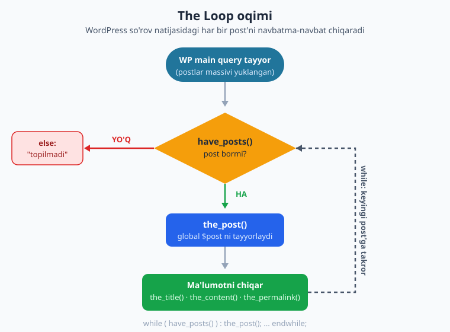
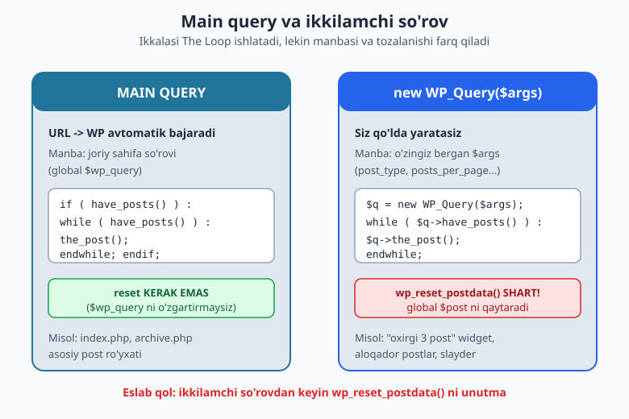
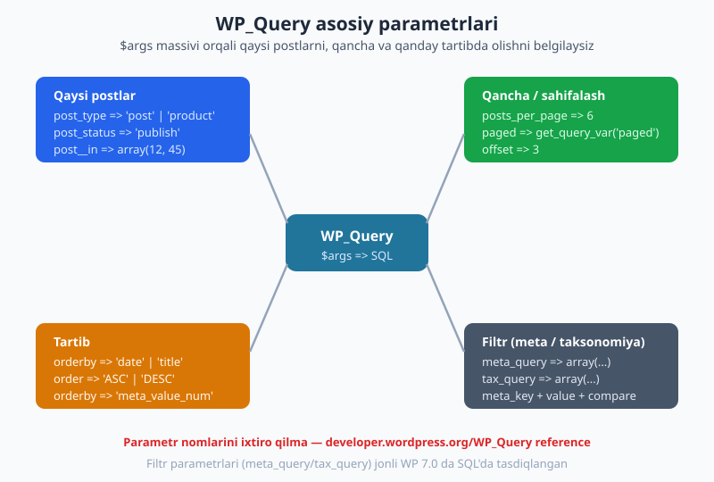

# 05 — The Loop va WP_Query

[⬅️ Oldingi: 04 — Tema anatomiyasi va standartlar](./04-tema-anatomiyasi-standartlar.md) · [🏠 README](./README.md) · [Keyingi: 06 — Template teglar va shartli teglar ➡️](./06-template-shartli-teglar.md)

> **Bu bobda:** WordPress sahifaga kirilganda postlarni qanday topib chiqarishini o'rganamiz. "The Loop" — klassik temaning yuragi: `have_posts()` va `the_post()` bilan har bir postni navbatma-navbat chiqaramiz. Keyin `new WP_Query()` orqali o'z so'rovlarimizni yasaymiz (oxirgi postlar, aloqador postlar) va `wp_reset_postdata()` bilan nega tozalash shartligini ko'ramiz. Oxirida `pre_get_posts` bilan asosiy so'rovni ham o'zgartiramiz.

---

## Asosiy so'rov (main query): WordPress siz so'ramasdan ish qiladi

03-bobda ko'rgan edik: foydalanuvchi `https://saytim.uz/blog/` ga kirsa, WordPress URL'ni o'qiydi, ma'lumotlar bazasiga so'rov yuboradi va mos postlarni topadi. Bu **asosiy so'rov** (main query) deyiladi — uni siz yozmaysiz, WordPress avtomatik bajaradi.

Hayotiy o'xshatish: restoranga kirasiz, ofitsiant siz so'ramasdan menyu va suv keltiradi. "Menyu" — bu asosiy so'rov natijasi. Siz faqat menyuni qanday *ko'rsatishni* hal qilasiz (chiroyli stolga qo'yasizmi yoki devorga osasizmi). Tema aynan shu — natijani **ko'rsatish** bilan shug'ullanadi, topish bilan emas.

Natija temaga `global $wp_query` obyektida yetib keladi. Lekin biz unga to'g'ridan-to'g'ri tegmaymiz — o'rniga qulay funksiyalardan foydalanamiz: `have_posts()` va `the_post()`.

> **Tushuncha:** "so'rov" (query) — bu bazadan ma'lumot olish buyrug'i. WordPress uni SQL'ga aylantiradi. Biz SQL yozmaymiz, faqat *qanday* postlar kerakligini aytamiz.

## The Loop anatomiyasi

"The Loop" (Sikl) — postlarni birma-bir chiqaradigan standart PHP konstruksiyasi. Eng sodda ko'rinishi:

```php
if ( have_posts() ) :
    while ( have_posts() ) :
        the_post();
        the_title( '<h2>', '</h2>' );
        the_content();
    endwhile;
else :
    echo '<p>Hech narsa topilmadi.</p>';
endif;
```

Bu yerda uchta kalit funksiya bor:

| Funksiya | Vazifasi |
|---|---|
| `have_posts()` | Ko'rsatiladigan post qolganmi? `true`/`false` qaytaradi. |
| `the_post()` | Keyingi postga o'tadi va uni "joriy post" qilib tayyorlaydi (`global $post` ni sozlaydi). |
| `the_title()`, `the_content()` ... | Joriy postning ma'lumotlarini chiqaradi. |

Ishlash mantig'i:

1. `if ( have_posts() )` — umuman post bormi? Bo'lmasa `else` ishlaydi.
2. `while ( have_posts() )` — har takrorda yana post bor-yo'qligini tekshiradi.
3. `the_post()` — ichki "kursor"ni keyingi postga suradi. Endi `the_title()` aynan shu postni biladi.
4. Oxirgi postdan keyin `have_posts()` `false` qaytaradi va `while` to'xtaydi.

> **Diqqat:** `the_post()` ni `while` ichida CHAQIRISH SHART. Usiz `the_title()` doim bitta postni ko'rsatadi va `while` cheksiz aylanadi.



### `endwhile` / `endif` sintaksisi nega?

Temalarda HTML bilan PHP aralashganda `{ }` o'rniga `:` va `endwhile;`/`endif;` ishlatish odat. Sababi — o'qish oson: HTML ichida qaysi blok qayerda tugayotgani aniq ko'rinadi. Ikkalasi ham bir xil ishlaydi, lekin tema fayllarida `:` uslubi standart.

## Loop ichidagi ma'lumot: template teglar

Loop ichida joriy postning turli qismlarini chiqaradigan funksiyalar bor. Ularning ko'pchiligi ikki shaklda keladi:

- `the_*` — ekranga **chiqaradi** (echo qiladi).
- `get_the_*` — qiymatni **qaytaradi** (o'zgaruvchiga olish yoki escape qilish uchun).

Eng ko'p ishlatiladiganlari:

| Funksiya | Nima chiqaradi |
|---|---|
| `the_title()` | Post sarlavhasi |
| `the_content()` | To'liq post matni (HTML bilan) |
| `the_excerpt()` | Qisqacha (anons) |
| `the_permalink()` | Post URL'i (havola uchun) |
| `the_post_thumbnail()` | Asosiy rasm (featured image) |
| `the_author()` | Muallif ismi |
| `the_date()` | Nashr sanasi |
| `the_ID()` | Post ID raqami |

> **Muhim qoida (27-bobda chuqur):** sana, muallif kabi ma'lumotlarni o'zgaruvchidan chiqarganda escape qiling — masalan `echo esc_html( get_the_date() )`. `the_content()` esa allaqachon WordPress tomonidan tozalanadi.

### To'liq blog loop

Mana real `index.php` da ishlatiladigan to'liq blog sikli:

```php
if ( have_posts() ) :
    while ( have_posts() ) :
        the_post();
        ?>
        <article id="post-<?php the_ID(); ?>" <?php post_class(); ?>>
            <header class="entry-header">
                <h2 class="entry-title">
                    <a href="<?php the_permalink(); ?>"><?php the_title(); ?></a>
                </h2>
                <p class="entry-meta">
                    <?php the_author(); ?> &middot; <?php echo esc_html( get_the_date() ); ?>
                </p>
            </header>

            <?php if ( has_post_thumbnail() ) : ?>
                <div class="entry-thumb">
                    <a href="<?php the_permalink(); ?>">
                        <?php the_post_thumbnail( 'medium' ); ?>
                    </a>
                </div>
            <?php endif; ?>

            <div class="entry-summary">
                <?php the_excerpt(); ?>
            </div>
        </article>
        <?php
    endwhile;

    the_posts_pagination();
else :
    ?>
    <p>Hozircha post yo'q.</p>
    <?php
endif;
```

E'tibor bering:

- `post_class()` — postga foydali CSS klasslar qo'shadi (`post`, `category-...`, `sticky` va h.k.). 06-bobda batafsil.
- `has_post_thumbnail()` — rasm bormi tekshiradi, bo'lmasa bo'sh `<div>` chiqmaydi.
- `the_posts_pagination()` — sahifalash havolalarini chiqaradi (1, 2, 3...). Bu **main query** uchun avtomatik ishlaydi.

> **Jonli tekshiruv:** bu loop mantig'i WP 7.0 da haqiqatan ishlaydi. Pastda `WP_Query` bo'limida xuddi shu sikl orqali olingan haqiqiy natijani ko'rasiz.

## Ikkilamchi so'rov: `new WP_Query($args)`

Asosiy so'rov joriy sahifaga *mos* postlarni beradi. Lekin ko'pincha bizga **boshqa** postlar ham kerak bo'ladi: yon panelga "oxirgi 3 post", maqola tagiga "aloqador postlar", bosh sahifaga "tanlangan mahsulotlar".

Buning uchun **ikkilamchi so'rov** yasaymiz — `WP_Query` klassidan o'z obyektimizni yaratamiz va unga nima kerakligini `$args` massivida aytamiz:

```php
$args = array(
    'post_type'      => 'post',
    'posts_per_page' => 3,
    'orderby'        => 'date',
    'order'          => 'DESC',
);
$ikkilamchi = new WP_Query( $args );

if ( $ikkilamchi->have_posts() ) :
    while ( $ikkilamchi->have_posts() ) :
        $ikkilamchi->the_post();
        the_title( '<h3>', '</h3>' );
    endwhile;
    wp_reset_postdata(); // SHART!
endif;
```

Farqni sezdingizmi? Asosiy so'rovda `have_posts()` ni to'g'ridan-to'g'ri chaqirardik. Ikkilamchi so'rovda esa **obyekt orqali**: `$ikkilamchi->have_posts()`, `$ikkilamchi->the_post()`. Sababi — bu boshqa, alohida so'rov natijasi.



### Asosiy `WP_Query` parametrlari

`$args` massivida o'nlab parametr bor. Eng muhimlari:

| Parametr | Misol | Vazifasi |
|---|---|---|
| `post_type` | `'post'`, `'product'`, `'page'` | Qaysi turdagi yozuvlar |
| `posts_per_page` | `6`, `-1` (hammasi) | Nechta post olish |
| `orderby` | `'date'`, `'title'`, `'rand'`, `'meta_value_num'` | Qaysi maydon bo'yicha tartib |
| `order` | `'ASC'`, `'DESC'` | O'sish yoki kamayish |
| `post__in` | `array(12, 45, 7)` | Faqat shu ID'lardagi postlar |
| `category_name` | `'yangiliklar'` | Kategoriya slug'i bo'yicha |
| `meta_query` | massiv | Custom field (meta) bo'yicha filtr |
| `tax_query` | massiv | Taksonomiya (kategoriya/teg) bo'yicha filtr |



### `meta_query` bilan filtr

Custom field (post meta — 14-bobda chuqur) bo'yicha filtrlash. Masalan, "tavsiya etiladi" belgisi qo'yilgan mahsulotlar:

```php
$tavsiya = new WP_Query( array(
    'post_type'      => 'product',
    'posts_per_page' => 6,
    'meta_query'     => array(
        array(
            'key'     => 'tavsiya_etiladi',
            'value'   => '1',
            'compare' => '=',
        ),
    ),
) );
wp_reset_postdata();
```

`meta_query` — bu *massivlar massivi*. Har bir ichki massiv bitta shartni bildiradi: `key` (maydon nomi), `value` (qiymat), `compare` (`=`, `!=`, `>`, `LIKE`, `IN` ...).

### `tax_query` bilan filtr

Kategoriya, teg yoki custom taksonomiya bo'yicha. Masalan, ikki kategoriyadagi postlar:

```php
$texnologiya = new WP_Query( array(
    'post_type' => 'post',
    'tax_query' => array(
        array(
            'taxonomy' => 'category',
            'field'    => 'slug',
            'terms'    => array( 'texnologiya', 'dasturlash' ),
        ),
    ),
) );
wp_reset_postdata();
```

> **Jonli tekshiruv:** `meta_query` va `tax_query` haqiqiy `WP_Query` argumentlari. WP 7.0 da bu so'rovlarni ishga tushirib, hosil qilingan SQL ichida `tavsiya_etiladi` meta-ulanishini va `term_taxonomy` JOIN'ini ko'rdik — demak parametrlar ixtiro qilinmagan, WordPress ularni haqiqatan tushunadi.

## `wp_reset_postdata()` — nega SHART?

Bu eng ko'p uchraydigan xato. `the_post()` (yoki `$obyekt->the_post()`) global `$post` o'zgaruvchisini joriy postga o'rnatadi. Ikkilamchi loop tugagach, `$post` **oxirgi ikkilamchi postda** qolib ketadi. Endi sahifaning qolgan qismida `the_title()` chaqirsangiz — u asosiy postni emas, ikkilamchi so'rovning oxirgi postini ko'rsatadi. Natija — chalkash, "g'alati" temalar.

`wp_reset_postdata()` global `$post` ni **asosiy so'rovning joriy postiga qaytaradi**. Qoida sodda:

> Har bir `new WP_Query` + loop tugagach, `wp_reset_postdata()` chaqir. Istisno yo'q.

Anti-misol — buni unutsangiz:

```php
$q = new WP_Query( array( 'posts_per_page' => 3 ) );
while ( $q->have_posts() ) : $q->the_post();
    the_title();
endwhile;
// wp_reset_postdata() YO'Q -> xato boshlanadi
the_title(); // bu endi asosiy postni EMAS, ikkilamchi so'rovning oxirgi postini beradi
```

> **Eslatma:** `query_posts()` degan eski funksiya ham bor — u asosiy so'rovni qayta yuradi va pagination'ni buzadi. Hech qachon ishlatmang. Ikkilamchi so'rov uchun `new WP_Query`, asosiy so'rovni o'zgartirish uchun `pre_get_posts` (pastda).

## `pre_get_posts` — asosiy so'rovni o'zgartirish

Ba'zan ikkilamchi so'rov emas, balki **asosiy** so'rovning o'zini o'zgartirmoqchimiz. Masalan: "bosh sahifada 6 ta emas, 10 ta post chiqsin" yoki "qidiruv faqat postlar ichidan qidirsin".

Ikkilamchi `WP_Query` bu yerda noto'g'ri yo'l — chunki asosiy ro'yxat pagination, SEO va shartli teglar bilan bog'liq. To'g'ri yo'l — `pre_get_posts` hooki. U asosiy so'rov SQL'ga aylanmasdan **oldin** ishlaydi va so'rov parametrlarini o'zgartirishga imkon beradi:

```php
function blog_main_query( $query ) {
    // admin panelga va ikkilamchi so'rovlarga tegmaymiz!
    if ( is_admin() || ! $query->is_main_query() ) {
        return;
    }
    if ( $query->is_home() ) {
        $query->set( 'posts_per_page', 6 );
    }
}
add_action( 'pre_get_posts', 'blog_main_query' );
```

Bu yerdagi ikki tekshiruv KRITIK:

- `is_admin()` — admin paneldagi so'rovlarni o'zgartirmaslik uchun (aks holda boshqaruv buziladi).
- `$query->is_main_query()` — `pre_get_posts` HAR bir so'rovda (shu jumladan sizning `WP_Query`laringizda) ishlaydi. Bu tekshiruvsiz barcha so'rovni buzib qo'yasiz.

`$query->set( 'kalit', qiymat )` — so'rov parametrini o'rnatadi. `pre_get_posts` ichida `the_post()` yoki HTML chiqarmang — bu faqat so'rovni *sozlaydi*, chiqarish loop'da bo'ladi.

> **Jonli tekshiruv:** WP 7.0 da `pre_get_posts` haqiqiy action ekanini tasdiqladik — unga callback ulagach `has_action('pre_get_posts')` `true` qaytardi.

## `get_posts()` — qisqa yo'l

Faqat postlar massivi kerak bo'lsa (HTML chiqarish kerak bo'lmasa, masalan ID'lar ro'yxati), `get_posts()` qulayroq. U `WP_Query` ustiga sodda o'ram:

```php
$oxirgi = get_posts( array(
    'numberposts' => 3,   // diqqat: posts_per_page emas, numberposts
    'post_status' => 'publish',
    'orderby'     => 'date',
    'order'       => 'DESC',
) );

foreach ( $oxirgi as $post ) {
    setup_postdata( $post );
    echo esc_html( get_the_title() );
}
wp_reset_postdata();
```

Farqlar:

- `get_posts()` massiv qaytaradi — `have_posts()` loop'i shart emas, oddiy `foreach`.
- Parametr nomi `numberposts` (`posts_per_page` ham ishlaydi, lekin standart `numberposts`).
- `the_*` template teglarini ishlatmoqchi bo'lsangiz `foreach` ichida `setup_postdata( $post )` chaqirib, oxirida baribir `wp_reset_postdata()` qiling.

> **Qachon nima:** murakkab loop (HTML, pagination) kerak bo'lsa — `WP_Query`. Faqat oddiy ro'yxat (sarlavhalar, ID'lar) kerak bo'lsa — `get_posts()`.

## Amaliy: "oxirgi 3 post" widget bo'lagi

Endi haqiqiy, ishlatsa bo'ladigan bo'lak yasaymiz. Buni `sidebar.php` ga yoki `get_template_part()` orqali alohida faylga joylaysiz (08-bobda):

```php
<?php
$oxirgi_postlar = new WP_Query( array(
    'post_type'           => 'post',
    'posts_per_page'      => 3,
    'orderby'             => 'date',
    'order'               => 'DESC',
    'ignore_sticky_posts' => true,
    'no_found_rows'       => true, // pagination kerak emas -> tezroq
) );

if ( $oxirgi_postlar->have_posts() ) : ?>
    <aside class="widget widget-oxirgi-postlar">
        <h3 class="widget-title">Oxirgi yangiliklar</h3>
        <ul>
            <?php while ( $oxirgi_postlar->have_posts() ) : $oxirgi_postlar->the_post(); ?>
                <li>
                    <a href="<?php the_permalink(); ?>"><?php the_title(); ?></a>
                    <time datetime="<?php echo esc_attr( get_the_date( 'c' ) ); ?>">
                        <?php echo esc_html( get_the_date() ); ?>
                    </time>
                </li>
            <?php endwhile; ?>
        </ul>
    </aside>
    <?php
    wp_reset_postdata(); // global $post ni asosiy so'rovga qaytar
endif;
```

Performans uchun ikki foydali parametr:

- `ignore_sticky_posts => true` — yopishtirilgan (sticky) postlarni majburlamaydi, faqat sof oxirgi 3 ta.
- `no_found_rows => true` — pagination uchun umumiy sonni hisoblamaydi (bizga kerak emas), so'rov tezroq.

> **Jonli WP 7.0 natijasi (READ-ONLY):** jonli saytda 3 ta namuna post yaratib (`wp post generate --count=3`), aynan shu `WP_Query` mantig'ini (`post_type=post, posts_per_page=3, orderby=date, order=DESC`) `wp eval-file` orqali ishga tushirdik. Haqiqiy chiqindi:
>
> ```text
> - Post 3 | 2026-06-14
> - Post 2 | 2026-06-14
> - Post 1 | 2026-06-14
> found_posts=4
> ```
>
> So'rov eng yangi 3 postni to'g'ri tartibda qaytardi, `wp_reset_postdata()` keyin xatosiz ishladi. Aktiv tema o'zgartirilmadi — bu faqat o'qish/tekshirish edi.

## Xulosa

- WordPress asosiy so'rovni (main query) avtomatik bajaradi; tema natijani **chiqaradi**.
- The Loop: `if ( have_posts() ) : while ( have_posts() ) : the_post(); ... endwhile; endif;`.
- Loop ichida `the_title`, `the_content`, `the_excerpt`, `the_permalink`, `the_post_thumbnail`, `the_author`, `the_date` bilan ma'lumot chiqariladi.
- O'z so'rovingiz uchun `new WP_Query($args)`; tugagach **`wp_reset_postdata()` SHART**.
- Asosiy so'rovni o'zgartirish uchun `pre_get_posts` (admin va main-query tekshiruvi bilan).
- Oddiy ro'yxat uchun `get_posts()`.

Keyingi bobda template teglar va shartli teglar (`is_single`, `is_home`...) bilan kontekstga qarab turli HTML chiqarishni o'rganamiz.

## Mashqlar

### Oson

1. **Eng sodda loop.** Asosiy so'rov uchun The Loop yozing: har bir postning sarlavhasini `<h2>` ichida chiqaring, post bo'lmasa "Post topilmadi" deb yozing.
2. **Havolali ro'yxat.** The Loop bilan postlar sarlavhalarini `<ul><li>` ro'yxat qilib chiqaring, har sarlavha o'z postiga havola (`the_permalink`) bo'lsin.
3. **Meta ma'lumot.** Loop ichida har postning muallifi va sanasini bitta `<p class="meta">` qatorida chiqaring (sanani escape qiling).
4. **Rasm shart bilan.** Loop ichida faqat asosiy rasmi bor postlar uchun `the_post_thumbnail('medium')` chiqaring; rasmsiz postlarda hech narsa chiqmasin.

### O'rta

5. **Oxirgi 5 post (ikkilamchi).** `new WP_Query` bilan eng yangi 5 ta postni oling va sarlavhalarini ro'yxat qiling. `wp_reset_postdata()` ni unutmang.
6. **Eng ko'p izohli postlar.** `WP_Query` bilan izohlar soni bo'yicha kamayuvchi tartibda 5 ta postni chiqaring (`orderby => 'comment_count'`).
7. **Muallif bo'yicha.** `WP_Query` bilan ma'lum bir muallifning (`author_name => 'oqil'`) so'nggi 4 postini chiqaring.
8. **get_posts.** Xuddi 5-mashqni `WP_Query` o'rniga `get_posts()` + `foreach` + `setup_postdata()` bilan qayta yozing.

### Qiyin

9. **pre_get_posts: bosh sahifa.** `pre_get_posts` bilan bosh sahifada (`is_home`) faqat `yangiliklar` kategoriyasidan 8 ta post chiqadigan qiling. `is_admin()` va `is_main_query()` tekshiruvlarini qo'shing.
10. **pre_get_posts: qidiruv.** `pre_get_posts` bilan qidiruv natijalarini faqat `post` turiga cheklang (CPT'lar qidiruvga tushmasin).
11. **XATO toping va tuzating.** Quyidagi kodda nima xato? Toping va tuzating: `$q = new WP_Query(array('posts_per_page'=>3)); while($q->have_posts()): $q->the_post(); the_title(); endwhile; the_title();`
12. **Narx bo'yicha tartib.** `product` turidagi postlarni `narx` custom field'i bo'yicha o'suvchi tartibda (`meta_key` + `orderby => 'meta_value_num'`) 10 ta chiqaring.
13. **Filtrlarni birlashtirish.** `WP_Query` bilan: `noutbuk` taksonomiya termasidagi (`tax_query`) VA omborda mavjud (`omborda = 1`) VA narxi 5 000 000 dan kam (`narx <= 5000000`, NUMERIC) mahsulotlarni oling. `meta_query` da `relation => 'AND'` ishlating.

## Yechimlar

<details markdown="1">
<summary>Yechim — 1</summary>

```php
if ( have_posts() ) :
    while ( have_posts() ) : the_post();
        the_title( '<h2>', '</h2>' );
    endwhile;
else :
    echo '<p>Post topilmadi.</p>';
endif;
```

`the_title( '<h2>', '</h2>' )` — birinchi argument oldidagi, ikkinchisi keyingi HTML. Bu `<h2><?php the_title(); ?></h2>` ning qisqa shakli.

</details>

<details markdown="1">
<summary>Yechim — 2</summary>

```php
if ( have_posts() ) : ?>
    <ul>
    <?php while ( have_posts() ) : the_post(); ?>
        <li><a href="<?php the_permalink(); ?>"><?php the_title(); ?></a></li>
    <?php endwhile; ?>
    </ul>
<?php endif;
```

`<ul>` ni loop'dan TASHQARIDA bir marta ochamiz, `<li>` ni loop ICHIDA takrorlaymiz.

</details>

<details markdown="1">
<summary>Yechim — 3</summary>

```php
while ( have_posts() ) : the_post(); ?>
    <p class="meta">
        <?php the_author(); ?> &middot; <?php echo esc_html( get_the_date() ); ?>
    </p>
<?php endwhile;
```

Sanani `get_the_date()` orqali olib `esc_html()` bilan escape qildik (xavfsizlik odati — 27-bob). `the_author()` allaqachon to'g'ri chiqaradi.

</details>

<details markdown="1">
<summary>Yechim — 4</summary>

```php
while ( have_posts() ) : the_post();
    if ( has_post_thumbnail() ) {
        the_post_thumbnail( 'medium' );
    }
endwhile;
```

`has_post_thumbnail()` rasm borligini tekshiradi — shu tufayli rasmsiz postlarda hech narsa chiqmaydi.

</details>

<details markdown="1">
<summary>Yechim — 5</summary>

```php
$oxirgi = new WP_Query( array(
    'post_type'      => 'post',
    'posts_per_page' => 5,
    'orderby'        => 'date',
    'order'          => 'DESC',
) );

if ( $oxirgi->have_posts() ) : ?>
    <ul>
    <?php while ( $oxirgi->have_posts() ) : $oxirgi->the_post(); ?>
        <li><a href="<?php the_permalink(); ?>"><?php the_title(); ?></a></li>
    <?php endwhile; ?>
    </ul>
    <?php wp_reset_postdata();
endif;
```

Ikkilamchi so'rovda `have_posts()` va `the_post()` ni OBYEKT orqali (`$oxirgi->`) chaqiramiz. Oxirida `wp_reset_postdata()`.

</details>

<details markdown="1">
<summary>Yechim — 6</summary>

```php
$mashhur = new WP_Query( array(
    'post_type'      => 'post',
    'posts_per_page' => 5,
    'orderby'        => 'comment_count',
    'order'          => 'DESC',
) );
while ( $mashhur->have_posts() ) : $mashhur->the_post();
    the_title( '<li>', '</li>' );
endwhile;
wp_reset_postdata();
```

`orderby => 'comment_count'` — izohlar soni bo'yicha. `order => 'DESC'` — eng ko'pdan eng ozga.

</details>

<details markdown="1">
<summary>Yechim — 7</summary>

```php
$muallif_postlari = new WP_Query( array(
    'author_name'    => 'oqil', // foydalanuvchi login slug'i
    'posts_per_page' => 4,
) );
while ( $muallif_postlari->have_posts() ) : $muallif_postlari->the_post();
    the_title( '<h3>', '</h3>' );
endwhile;
wp_reset_postdata();
```

`author_name` — foydalanuvchining `user_nicename` (login slug). ID bilan kerak bo'lsa `author => 5` ishlatiladi.

</details>

<details markdown="1">
<summary>Yechim — 8</summary>

```php
$oxirgi = get_posts( array(
    'numberposts' => 5,
    'orderby'     => 'date',
    'order'       => 'DESC',
) );

echo '<ul>';
foreach ( $oxirgi as $post ) {
    setup_postdata( $post );
    printf(
        '<li><a href="%s">%s</a></li>',
        esc_url( get_permalink() ),
        esc_html( get_the_title() )
    );
}
echo '</ul>';
wp_reset_postdata();
```

`get_posts()` massiv beradi. `the_*` teglarini ishlatish uchun `foreach` ichida `setup_postdata($post)`, oxirida `wp_reset_postdata()`. Bu yerda URL va sarlavhani escape qildik.

</details>

<details markdown="1">
<summary>Yechim — 9</summary>

`functions.php` ga:

```php
function bosh_kategoriya( $query ) {
    if ( ! is_admin() && $query->is_main_query() && $query->is_home() ) {
        $query->set( 'category_name', 'yangiliklar' );
        $query->set( 'posts_per_page', 8 );
    }
}
add_action( 'pre_get_posts', 'bosh_kategoriya' );
```

Uchta shart birga: admin EMAS, asosiy so'rov, VA bosh sahifa. Shundan keyingina parametrlarni o'zgartiramiz.

</details>

<details markdown="1">
<summary>Yechim — 10</summary>

```php
function faqat_post_qidiruv( $query ) {
    if ( ! is_admin() && $query->is_main_query() && $query->is_search() ) {
        $query->set( 'post_type', 'post' );
    }
}
add_action( 'pre_get_posts', 'faqat_post_qidiruv' );
```

`$query->is_search()` — qidiruv sahifasini aniqlaydi. `post_type` ni `'post'` ga o'rnatib, CPT'larni natijadan chiqaramiz.

</details>

<details markdown="1">
<summary>Yechim — 11</summary>

**Xato:** ikkilamchi loop tugagach `wp_reset_postdata()` chaqirilmagan. Shu sababli oxirgi `the_title()` asosiy postni emas, `$q` ning oxirgi postini ko'rsatadi.

**Tuzatilgan:**

```php
$q = new WP_Query( array( 'posts_per_page' => 3 ) );
while ( $q->have_posts() ) : $q->the_post();
    the_title();
endwhile;
wp_reset_postdata(); // <-- yetishmayotgan qator
the_title(); // endi to'g'ri: asosiy so'rovning joriy posti
```

Qoida: har `new WP_Query` + loop'dan keyin `wp_reset_postdata()`.

</details>

<details markdown="1">
<summary>Yechim — 12</summary>

```php
$arzon = new WP_Query( array(
    'post_type'      => 'product',
    'posts_per_page' => 10,
    'meta_key'       => 'narx',
    'orderby'        => 'meta_value_num',
    'order'          => 'ASC',
) );
while ( $arzon->have_posts() ) : $arzon->the_post();
    the_title( '<li>', '</li>' );
endwhile;
wp_reset_postdata();
```

Son bo'yicha tartiblashda `meta_value` EMAS, `meta_value_num` ishlatiladi (aks holda matn sifatida tartiblanadi: "10" < "9"). `meta_key` ni ham berish SHART.

</details>

<details markdown="1">
<summary>Yechim — 13</summary>

```php
$saralangan = new WP_Query( array(
    'post_type'      => 'product',
    'posts_per_page' => 12,
    'tax_query'      => array(
        array(
            'taxonomy' => 'product_cat',
            'field'    => 'slug',
            'terms'    => 'noutbuk',
        ),
    ),
    'meta_query'     => array(
        'relation' => 'AND',
        array(
            'key'     => 'omborda',
            'value'   => '1',
            'compare' => '=',
        ),
        array(
            'key'     => 'narx',
            'value'   => 5000000,
            'type'    => 'NUMERIC',
            'compare' => '<=',
        ),
    ),
) );
while ( $saralangan->have_posts() ) : $saralangan->the_post();
    the_title( '<h3>', '</h3>' );
endwhile;
wp_reset_postdata();
```

`tax_query` va `meta_query` bir so'rovda birga ishlaydi (orasida AND). `meta_query` ichidagi `relation => 'AND'` ikki meta shartni birlashtiradi. Raqamli taqqoslashda `type => 'NUMERIC'` SHART, aks holda `<=` matn sifatida ishlaydi.

</details>

---

[⬅️ Oldingi: 04 — Tema anatomiyasi va standartlar](./04-tema-anatomiyasi-standartlar.md) · [🏠 README](./README.md) · [Keyingi: 06 — Template teglar va shartli teglar ➡️](./06-template-shartli-teglar.md)
