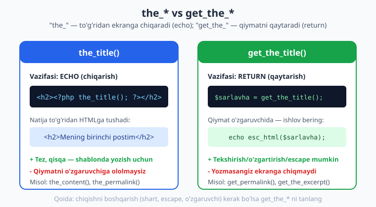
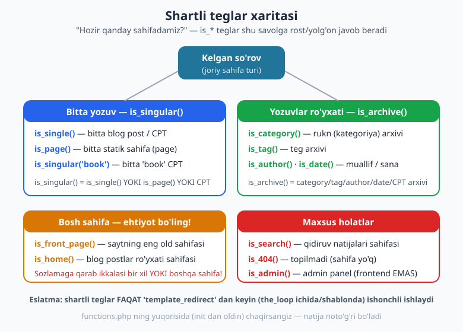
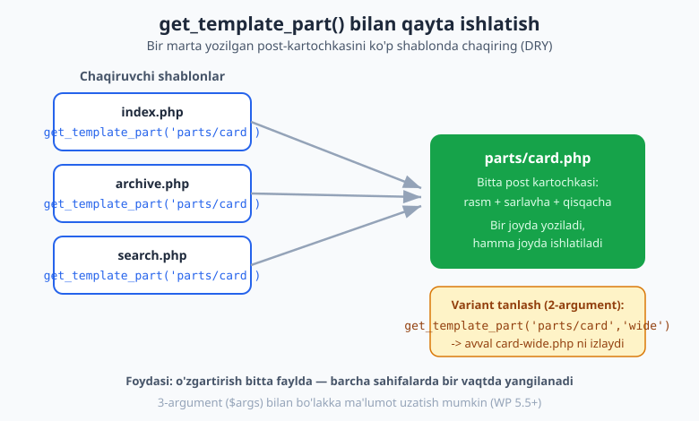

# 06 — Template teglar va shartli teglar

[⬅️ Oldingi: 05 — The Loop va WP_Query](./05-the-loop-wp-query.md) · [🏠 README](./README.md) · [Keyingi: 07 — Shablon iyerarxiyasi amalda ➡️](./07-shablon-iyerarxiyasi.md)

> **Bu bobda:** WordPress tema yozishning kundalik "asboblar to'plami" — template teglar (post ma'lumotini chiqaruvchi funksiyalar) va shartli teglar (joriy sahifa turini aniqlovchi `is_*` funksiyalar) bilan tanishamiz. `the_*` va `get_the_*` o'rtasidagi muhim farqni, `get_template_part()` yordamida bo'laklarni qayta ishlatishni va har chiqishni `esc_*` bilan xavfsiz qilishni o'rganamiz. Bu bob 05-bobdagi Loop bilimini amaliy temaga aylantiradi.

---

## Template teg nima?

05-bobda biz **The Loop** ni o'rgandik — postlar ustidan aylanuvchi `while (have_posts())` halqasi. Loop ichida har bir post uchun uning sarlavhasi, matni, sanasi kabi ma'lumotlarni chiqarishimiz kerak. Aynan shu ishni **template teglar** bajaradi.

**Template teg** — bu post yoki sayt haqidagi ma'lumotni chiqaradigan (yoki qaytaradigan) tayyor WordPress funksiyasi. Ular oddiy PHP funksiyalardir, faqat WordPress ularni siz uchun yozib qo'ygan.

> **Hayotiy o'xshatish:** Tasavvur qiling, restoranda ofitsiantsiz. Mijoz "menyudagi 3-taomni keltir" deydi. Siz oshxonaga borib taomni olib kelasiz — qanday tayyorlanganini bilishingiz shart emas. Template teg ham xuddi shunday: `the_title()` deysiz, WordPress bazadan joriy post sarlavhasini topib, ekranga chiqaradi. Ichki mexanizmni bilishingiz shart emas.

Eng ko'p ishlatiladigan template teglar (05-bobdan tanish):

```php
<?php
the_title();        // post sarlavhasi
the_content();      // post to'liq matni
the_excerpt();      // qisqacha (excerpt)
the_permalink();    // post URL manzili
the_post_thumbnail(); // muqova rasmi (featured image)
?>
```

PHP sintaksisini (funksiya chaqirish, argument) bu kitobda qayta o'rganmaymiz — agar `<?php ... ?>`, funksiya yoki massiv yodingizdan ko'tarilgan bo'lsa, [PHP kitobi](../php/README.md) ga qayting. Biz bu yerda **WordPress-spetsifik** teglarga e'tibor beramiz.

---

## Eng muhim farq: `the_*` vs `get_the_*`

Bu bobdagi (va, ehtimol, butun klassik tema yozishdagi) eng muhim tushuncha. WordPress'da ko'pchilik template teglarning **ikkita ko'rinishi** bor:

- **`the_` bilan boshlanadigan** versiya — qiymatni **to'g'ridan-to'g'ri ekranga chiqaradi** (PHP'dagi `echo` kabi).
- **`get_the_` bilan boshlanadigan** versiya — qiymatni **qaytaradi** (`return`), lekin ekranga chiqarmaydi.



Misol bilan ko'raylik:

```php
<?php
// 1-usul: the_title() — o'zi chiqaradi (echo)
the_title('<h2>', '</h2>');

// 2-usul: get_the_title() — qiymatni qaytaradi, biz o'zimiz chiqaramiz
$sarlavha = get_the_title();
echo '<h2>' . esc_html($sarlavha) . '</h2>';
?>
```

Ikkala usul ham bir xil natija beradi. Unda **qaysi birini tanlash kerak?**

| Holat | Tanlov | Sabab |
|---|---|---|
| Shunchaki ekranga chiqarmoqchisiz | `the_title()` | Qisqa va tez |
| Qiymatni tekshirmoqchisiz (shart) | `get_the_title()` | `if` ichida ishlatish uchun |
| Qiymatni o'zgaruvchiga olmoqchisiz | `get_the_title()` | Keyin ishlov berish uchun |
| Qiymatni escape qilmoqchisiz | `get_the_title()` | `esc_html()` ga uzatish uchun |

> **Diqqat — `the_title()` ning yashirin xususiyati:** `the_title()` funksiyasining uchinchi argumenti `$display = true`. Agar `the_title('', '', false)` deb chaqirsangiz, u **chiqarmaydi**, balki qaytaradi — ya'ni `get_the_title()` kabi ishlaydi. Lekin chalkashmaslik uchun: chiqarish kerak bo'lsa `the_title()`, qiymat kerak bo'lsa `get_the_title()` ishlating.

Bu naqsh deyarli barcha teglarda takrorlanadi:

| Chiqaradi (echo) | Qaytaradi (return) |
|---|---|
| `the_title()` | `get_the_title()` |
| `the_permalink()` | `get_permalink()` (e'tibor bering: `get_the_` emas!) |
| `the_excerpt()` | `get_the_excerpt()` |
| `the_ID()` | `get_the_ID()` |
| `the_date()` | `get_the_date()` |
| `the_category(', ')` | `get_the_category_list(', ')` |
| `the_tags()` | `get_the_tag_list()` |

> **Tuzoq:** Permalink (URL) uchun qaytaruvchi funksiya `get_the_permalink()` emas, balki **`get_permalink()`** dir (ikkalasi ham mavjud, lekin `get_permalink()` asosiy nom). URLlar bilan ishlaganda buni eslab qoling.

---

## Sayt haqidagi ma'lumot: `bloginfo()` va `get_bloginfo()`

Yuqoridagi teglar **post** haqida edi. Sayt nomi, tavsifi, tili kabi **umumiy** ma'lumot uchun `bloginfo()` (echo) va `get_bloginfo()` (return) ishlatiladi:

```php
<?php
// echo qiluvchi versiya — header.php da ko'p uchraydi
bloginfo('name');          // sayt nomi
bloginfo('description');   // sayt shiori (tagline)

// qaytaruvchi versiya — escape qilish va ishlov berish uchun
$nom = get_bloginfo('name');
echo esc_html($nom);

// URL kerak bo'lsa esc_url() ishlating
$bosh = get_bloginfo('url'); // saytning bosh URL
echo '<a href="' . esc_url($bosh) . '">Bosh sahifa</a>';
?>
```

Tez-tez kerak bo'ladigan `$show` parametrlari: `name`, `description`, `url`, `wpurl`, `charset`, `language`, `version`.

> **Maslahat:** Bosh sahifa havolasi uchun `bloginfo('url')` o'rniga ko'pincha `home_url()` afzal — u sozlamalarga aniqroq mos keladi. URL chiqarayotganda **doim** `esc_url()` bilan o'rang.

---

## Muqova rasmi: `the_post_thumbnail()` va `has_post_thumbnail()`

Muqova rasmi (ingliz tilida *featured image*) — postga biriktirilgan asosiy rasm. Uni chiqarish uchun `the_post_thumbnail()` ishlatiladi. Lekin har postda rasm bo'lavermaydi — shuning uchun avval `has_post_thumbnail()` bilan **borligini tekshirish** kerak:

```php
<?php if (has_post_thumbnail()) : ?>
    <div class="post-rasm">
        <?php the_post_thumbnail('medium'); ?>
    </div>
<?php endif; ?>
```

`the_post_thumbnail()` ning birinchi argumenti — rasm **o'lchami** (`$size`). Standart qiymati `'post-thumbnail'`. Boshqa keng tarqalgan o'lchamlar: `'thumbnail'`, `'medium'`, `'large'`, `'full'`. Maxsus o'lcham `add_image_size()` bilan ro'yxatdan o'tkaziladi (09-bobda batafsil).

> **Eslatma:** Muqova rasmi ishlashi uchun tema `add_theme_support('post-thumbnails')` ni e'lon qilgan bo'lishi kerak. Buni 09-bobda `after_setup_theme` hookida sozlaymiz. Hozir asosiysi — `has_post_thumbnail()` bilan tekshirib, keyin `the_post_thumbnail()` bilan chiqarish naqshini eslab qolish.

Qaytaruvchi versiya ham bor — `get_the_post_thumbnail()` — agar rasm HTMLini o'zgaruvchiga olib, ishlov bermoqchi bo'lsangiz.

---

## `body_class()` va `post_class()` — avtomatik CSS klasslar

Bu ikki teg HTMLga **foydali CSS klasslar** qo'shadi — keyin CSS yoki JS'da shu klasslarga tayanib uslub berasiz.

`body_class()` — `<body>` tegiga joriy sahifa haqida klasslar qo'shadi:

```php
<body <?php body_class(); ?>>
```

Natijada (masalan, bitta postda) shunday HTML hosil bo'ladi:

```html
<body class="single single-post postid-42 logged-in">
```

Endi CSS'da, masalan, faqat bitta post sahifasiga boshqacha fon berishingiz mumkin: `.single-post { background: #fff; }`.

`post_class()` — Loop ichida har bir post o'ramiga klasslar qo'shadi:

```php
<article id="post-<?php the_ID(); ?>" <?php post_class(); ?>>
    <h2><?php the_title(); ?></h2>
</article>
```

Natija:

```html
<article id="post-42" class="post-42 post type-post status-publish has-post-thumbnail category-yangiliklar">
```

E'tibor bering: WordPress avtomatik ravishda post rukni (`category-yangiliklar`), muqova rasmi bor-yo'qligi (`has-post-thumbnail`) va boshqa holatlarni klass sifatida qo'shadi. Bu juda kuchli — siz hech narsa hisoblamaysiz, faqat CSS yozasiz.

> **Maslahat:** Ikkala tegga ham qo'shimcha klass uzatish mumkin: `post_class('mening-kartam')` yoki `body_class('tor-layout')`. Bu o'z klasslaringizni WordPress'nikiga qo'shadi.

---

## Ruknlar, teglar va sana

Post qaysi ruknlarda (kategoriya) va qanday teglar bilan belgilangan — bularni ko'rsatish uchun maxsus teglar bor:

```php
<?php
// Ruknlar ro'yxati (havolalar bilan), vergul orqali ajratilgan
the_category(', ');

// Teglar ro'yxati: oldidan "Teglar: ", har biri vergul bilan
the_tags('<span class="teglar">Teglar: ', ', ', '</span>');

// Sana va muallif
echo 'Sana: ' . esc_html(get_the_date());
echo ' · Muallif: ' . esc_html(get_the_author());
?>
```

Qaytaruvchi versiyalar (`get_the_category_list()`, `get_the_tag_list()`) tayyor HTML havolalarni qaytaradi — ular ichida WordPress allaqachon escape qilgan bo'ladi, shuning uchun ularni qayta `esc_html()` qilmang (aks holda havolalar buziladi). Lekin `get_the_date()` va `get_the_author()` kabi **oddiy matn** qaytaruvchilarni chiqarayotganda `esc_html()` bilan o'rang.

---

## Sahifalash (pagination): `the_posts_pagination()`

Blogda postlar ko'p bo'lsa, ularni bir nechta sahifaga bo'lish kerak — "1 2 3 ... Keyingi" tugmalari. Buning eng oson yo'li — `the_posts_pagination()`. U Loop **tashqarisida**, lekin asosiy so'rovga tayanib ishlaydi:

```php
<?php
if (have_posts()) :
    while (have_posts()) : the_post();
        // ... post kartochkasi ...
    endwhile;

    // Loop tugagach — sahifalash tugmalari
    the_posts_pagination(array(
        'prev_text' => 'Oldingi',
        'next_text' => 'Keyingi',
    ));
endif;
?>
```

Agar to'liq nazorat kerak bo'lsa, quyi darajadagi `paginate_links()` funksiyasidan foydalaniladi — u havolalar massivini yoki HTMLni qaytaradi va ko'pincha `WP_Query` (ikkilamchi so'rov) bilan ishlaganda kerak bo'ladi:

```php
<?php
echo paginate_links(array(
    'total'   => $sorov->max_num_pages, // WP_Query obyektidan
    'current' => max(1, get_query_var('paged')),
));
?>
```

> **Qoidasi:** Asosiy so'rov (main query) uchun `the_posts_pagination()` — tez va chiroyli. Maxsus `WP_Query` yoki o'ziga xos dizayn kerak bo'lsa — `paginate_links()`.

---

## Shartli teglar: "Hozir qaysi sahifadamiz?"

Endi tasavvur qiling: bitta `header.php` faylingiz bor, lekin bosh sahifada katta banner, ichki sahifalarda esa kichik sarlavha ko'rsatmoqchisiz. WordPress qaysi sahifada ekanini qanday bilasiz?

Aynan shu yerda **shartli teglar** (conditional tags) ish beradi. Ular har doim **`is_`** bilan boshlanadi va `true` yoki `false` qaytaradi.



```php
<?php if (is_front_page()) : ?>
    <div class="katta-banner">Xush kelibsiz!</div>
<?php else : ?>
    <h1><?php the_title(); ?></h1>
<?php endif; ?>
```

Shartli teglar `if` shartlari ichida ishlatiladi va temani **bitta fayl bilan ko'p sahifaga** moslashtirish imkonini beradi.

### Bir yozuv sahifalari: `is_single`, `is_page`, `is_singular`

| Teg | Qachon `true` |
|---|---|
| `is_single()` | Bitta blog post (yoki CPT yozuvi) ochilganda |
| `is_page()` | Bitta statik **sahifa** (page) ochilganda |
| `is_singular()` | Yuqoridagilarning **har qaysisi** (single YOKI page YOKI CPT) |
| `is_single('salom')` | Aynan `salom` slug'li post |
| `is_page(array(2, 7))` | ID'si 2 yoki 7 bo'lgan sahifa |

> **Farqi muhim:** `is_single()` — blog **posti** uchun; `is_page()` — statik **sahifa** (masalan "Biz haqimizda") uchun. WordPress'da "post" va "page" ikki xil narsa! `is_singular()` esa ikkalasini ham qamrab oladi — agar "har qanday bitta yozuv sahifasida" degan shartni yozmoqchi bo'lsangiz, `is_singular()` ishlating.

### Ro'yxat (arxiv) sahifalari: `is_archive` va oilasi

| Teg | Qachon `true` |
|---|---|
| `is_archive()` | Har qanday arxiv (yozuvlar ro'yxati) sahifasi |
| `is_category()` | Rukn (kategoriya) arxivi |
| `is_tag()` | Teg arxivi |
| `is_author()` | Muallif arxivi |
| `is_date()` | Sana arxivi (yil/oy/kun) |

`is_archive()` — bu "ota" teg: agar `is_category()`, `is_tag()`, `is_author()` yoki `is_date()` dan birortasi `true` bo'lsa, `is_archive()` ham `true` bo'ladi.

### Bosh sahifa — eng ko'p chalkashtiriladigan joy: `is_home` vs `is_front_page`

Bu juda muhim va ko'plab yangi tema yozuvchilarni adashtiradi:

- **`is_front_page()`** — saytning eng oldingi (asosiy) sahifasi. Bu foydalanuvchi `sayt.uz` ga kirganda ko'radigan sahifa.
- **`is_home()`** — blog postlari ro'yxati ko'rsatiladigan sahifa.

Bularning farqi **Sozlamalar > O'qish** dagi tanlovga bog'liq:

| Sozlama | `is_front_page()` | `is_home()` |
|---|---|---|
| "Bosh sahifa: oxirgi postlar" | bosh sahifada `true` | bosh sahifada `true` (ikkalasi BIR xil sahifa) |
| "Bosh sahifa: statik sahifa X" | X sahifasida `true` | postlar sahifasida `true` (BOSHQA sahifalar) |

> **Oddiy qoida:** Saytning **eng birinchi** sahifasini nazarda tutsangiz — `is_front_page()`. **Blog postlar ro'yxati** sahifasini nazarda tutsangiz — `is_home()`. Statik bosh sahifali saytlarda bu ikkisi har xil sahifa bo'ladi, shuning uchun to'g'ri tanlash juda muhim.

### Maxsus holatlar: `is_search`, `is_404`, `is_admin`

| Teg | Qachon `true` |
|---|---|
| `is_search()` | Qidiruv natijalari sahifasi |
| `is_404()` | So'ralgan sahifa topilmaganda (xato sahifa) |
| `is_admin()` | Admin panel (`wp-admin`) — **frontend EMAS** |

> **Diqqat — `is_admin()` tuzog'i:** `is_admin()` "foydalanuvchi administratormi?" degani EMAS! U "hozirgi so'rov admin paneldami?" degan savolga javob beradi. Foydalanuvchi huquqini tekshirish uchun `current_user_can()` ishlatiladi (xavfsizlik — 27-bob). Bu nomdagi chalkashlik klassik xatolardan biri.

> **Yana bir muhim qoida:** Shartli teglar faqat WordPress so'rovni to'liq qayta ishlagandan keyin (taxminan `template_redirect` hookidan boshlab — ya'ni shablon fayllar ichida) ishonchli ishlaydi. Ularni `functions.php` ning yuqorisida (so'rov tayyor bo'lishidan oldin) chaqirsangiz — natija noto'g'ri bo'ladi. Diagrammada ham shuni ko'rsatdik.

---

## `get_template_part()` — bo'laklarni qayta ishlatish

Tasavvur qiling, post kartochkasi (rasm + sarlavha + qisqacha matn) kodini `index.php`, `archive.php` va `search.php` da bir xil yozdingiz. Endi dizaynni o'zgartirmoqchisiz — uch joyda ham qo'lda o'zgartirish kerakmi? Yo'q. Buni **`get_template_part()`** hal qiladi.

`get_template_part()` boshqa shablon faylini joriy joyga **kiritadi** (PHP'ning `include` siga o'xshash, lekin WordPress qoidalari bilan). Shu tariqa bitta bo'lakni bir marta yozib, ko'p joyda chaqirasiz.



Avval qayta ishlatiladigan bo'lakni alohida faylga ajratamiz — masalan `template-parts/content-card.php`:

```php
<?php
// template-parts/content-card.php — bitta post kartochkasi
?>
<article <?php post_class('post-karta'); ?>>
    <?php if (has_post_thumbnail()) : ?>
        <a href="<?php the_permalink(); ?>"><?php the_post_thumbnail('medium'); ?></a>
    <?php endif; ?>
    <h2><a href="<?php the_permalink(); ?>"><?php the_title(); ?></a></h2>
    <div class="qisqacha"><?php the_excerpt(); ?></div>
</article>
```

Endi har qanday shablonda Loop ichida shu bo'lakni chaqiramiz:

```php
<?php
while (have_posts()) : the_post();
    get_template_part('template-parts/content', 'card');
endwhile;
?>
```

E'tibor bering: `get_template_part('template-parts/content', 'card')` ikkita argument oladi:

1. **`$slug`** (`'template-parts/content'`) — fayl yo'lining asosiy qismi.
2. **`$name`** (`'card'`) — variant nomi.

WordPress avval `template-parts/content-card.php` ni izlaydi; topmasa `template-parts/content.php` ga tushadi. Bu sizga moslashuvchanlik beradi: masalan `get_template_part('template-parts/content', get_post_type())` desangiz, har post turi uchun mos bo'lakni avtomatik tanlaydi.

> **Yangi imkoniyat (WP 5.5+):** Uchinchi argument `$args` (massiv) bilan bo'lakka ma'lumot uzatish mumkin. Bo'lak faylida u `$args` o'zgaruvchisida bo'ladi:
> ```php
> get_template_part('template-parts/content', 'card', array('katta' => true));
> // content-card.php ichida: if (!empty($args['katta'])) { ... }
> ```

Bu naqsh — **DRY** (Don't Repeat Yourself, "takrorlama") tamoyilining temadagi amaliyoti. 08-bobda `get_header()`, `get_footer()`, `get_sidebar()` — bo'laklarni qayta ishlatishning maxsus turlarini ko'ramiz.

---

## Har chiqishni escape qiling: `esc_html`, `esc_url`, `esc_attr`

Yuqorida bir necha bor `esc_html()` va `esc_url()` ni uchratdik. Endi nega ular kerakligini qisqacha tushuntiramiz.

**Escaping** — ma'lumotni HTMLga chiqarishdan oldin **xavfsiz holatga keltirish**. Agar post sarlavhasi yoki foydalanuvchi kiritgan matn ichida `<script>` kabi zararli kod bo'lsa, uni escape qilmasdan chiqarsangiz — bu kod brauzerda ishga tushadi (XSS hujumi).

> **Hayotiy o'xshatish:** Escaping — bu chegaradagi bojxona nazorati. Hech kimga ishonmaysiz: har bir "yo'lovchi" (qiymat) chiqishdan oldin tekshiruvdan o'tadi. Ishonchli ko'ringani ham — chunki bazaga zarar allaqachon kirib qolgan bo'lishi mumkin.

Asosiy qoida: **kontekstga mos escape funksiyasini tanlang.**

| Funksiya | Qayerda ishlatiladi | Misol |
|---|---|---|
| `esc_html()` | Oddiy matn (HTML ichida ko'rinadigan) | `echo esc_html($sarlavha);` |
| `esc_attr()` | HTML atribut qiymati ichida | `<input value="<?php echo esc_attr($q); ?>">` |
| `esc_url()` | URL (href, src) | `<a href="<?php echo esc_url($link); ?>">` |
| `wp_kses_post()` | Ba'zi HTMLga ruxsat berib (post matni kabi) | `echo wp_kses_post($html);` |

Misol:

```php
<?php
$qidiruv = get_search_query();
$link    = get_permalink();
?>
<a href="<?php echo esc_url($link); ?>" title="<?php echo esc_attr($qidiruv); ?>">
    <?php echo esc_html(get_the_title()); ?>
</a>
```

> **Eslatma — qachon escape SHART emas:** `the_title()`, `the_permalink()` kabi `the_*` teglar **o'zi ichida** ko'pchilik holatlarda escape qiladi, shuning uchun ularni qo'shimcha o'rash shart emas. Lekin `get_the_title()`, `get_the_date()` kabi **oddiy matn qaytaruvchilar** va, ayniqsa, foydalanuvchi kiritgan har qanday ma'lumot (`$_GET`, `$_POST`, meta) chiqishda **albatta** escape qilinishi kerak.

Bu mavzu shu darajada muhimki, unga butun **27-bob** bag'ishlangan (escaping, sanitization, nonce). Hozircha shu qoidani yodda saqlang: **"Har bir chiqishni (output) escape qil."** Buni odat qilsangiz, temangiz boshidanoq xavfsiz bo'ladi.

---

## Xulosa

Bu bobda klassik tema yozishning kundalik asboblarini o'rgandik:

- **Template teglar** post va sayt ma'lumotini chiqaradi. `the_*` — echo qiladi, `get_the_*` — qaytaradi.
- Qiymatni tekshirish, o'zgaruvchiga olish yoki escape qilish kerak bo'lsa — `get_the_*` ni tanlang.
- `has_post_thumbnail()` bilan tekshirib, `the_post_thumbnail()` bilan rasm chiqaring.
- `body_class()` va `post_class()` avtomatik foydali CSS klasslar beradi.
- **Shartli teglar** (`is_*`) joriy sahifa turini aniqlaydi. `is_home`/`is_front_page` va `is_single`/`is_page`/`is_singular` farqlarini puxta biling.
- `get_template_part()` bilan bo'laklarni qayta ishlatib, kodni DRY qiling.
- **Har chiqishni** `esc_html`/`esc_url`/`esc_attr` bilan escape qiling (27-bob — chuqurroq).

Keyingi bobda bu teglarni amalda qo'llab, to'liq shablon iyerarxiyasini — `index.php`, `single.php`, `page.php`, `archive.php`, `404.php` va boshqalarni — yozamiz.

---

## Mashqlar

### Oson

1. **To'g'ri teg tanlang (chiqarish).** Loop ichida joriy post sarlavhasini `<h2>` ichida ekranga chiqaring. Eng qisqa usulni ishlating.

2. **Sayt nomini ko'rsating.** `header.php` faylida saytning nomini va shiorini (tagline) chiqaring. Sayt nomi `<h1>` ichida, shior `<p>` ichida bo'lsin.

3. **Muqova rasmini xavfsiz chiqarish.** Postda muqova rasmi bo'lsagina uni `medium` o'lchamda chiqaradigan kod yozing. Rasm yo'q bo'lsa hech narsa chiqmasin.

4. **`body_class` ni qo'shing.** `<body>` tegiga WordPress avtomatik klasslarini va o'zingizning `mening-temam` klassingizni qo'shing.

### O'rta

5. **`the_*` ni `get_the_*` ga aylantiring.** Quyidagi kod sarlavhani ikki marta kerak qiladi (havola matnida va `title` atributida). Uni `get_the_title()` bilan qayta yozing, atributni `esc_attr()` bilan escape qiling:
   ```php
   <a href="<?php the_permalink(); ?>" title="???"><?php the_title(); ?></a>
   ```

6. **Bosh sahifani ajrating.** Faqat saytning eng oldingi (asosiy) sahifasida "Xush kelibsiz" bannerini, boshqa hamma joyda esa sahifa sarlavhasini ko'rsatadigan shartni yozing. To'g'ri `is_*` tegini tanlang.

7. **Sahifalashni qo'shing.** Blog Loop'idan keyin "Oldingi" / "Keyingi" matnli sahifalash tugmalarini chiqaring. Asosiy so'rov uchun mos tegni ishlating.

8. **Bo'lakka ajrating.** 5-mashqdagi havola kodini o'z ichiga olgan post kartochkasini `template-parts/content-card.php` ga ko'chiring va uni Loop ichida `get_template_part()` bilan chaqiring.

### Qiyin

9. **Universal bo'lak chaqiruvi.** `get_template_part()` ni shunday yozingki, u har post **turiga** mos bo'lak faylini (masalan `content-post.php`, `content-page.php`) avtomatik tanlasin. Topilmasa `content.php` ga tushsin.

10. **Xatoni tuzating — `is_admin` tuzog'i.** Quyidagi kod "faqat administratorga ko'rsatish" maqsadida yozilgan, lekin noto'g'ri. Xatoni toping va to'g'ri funksiya bilan tuzating:
    ```php
    <?php if (is_admin()) : ?>
        <a href="...">Postni tahrirlash</a>
    <?php endif; ?>
    ```

11. **Xatoni tuzating — escape buzilgan.** Quyidagi kod ruknlar ro'yxatini ikki marta escape qilib, havolalarni buzmoqda. Xatoni toping va tuzating:
    ```php
    <?php echo esc_html(get_the_category_list(', ')); ?>
    ```

12. **Shartli bo'lak.** `is_singular()` rost bo'lsa to'liq post matnini (`the_content()`), arxiv sahifalarida esa faqat qisqacha (`the_excerpt()`) chiqaradigan bitta universal bo'lak yozing.

13. **Sahifa turiga qarab sarlavha.** Arxiv sahifalarida (`is_archive()`) dinamik sarlavha chiqaring: rukn arxivida rukn nomini, teg arxivida teg nomini, muallif arxivida muallif nomini ko'rsating. Mos `is_*` teglardan foydalaning.

14. **Xatoni tuzating — sahifalash ishlamayapti.** Quyidagi `WP_Query` ikkilamchi so'rovida sahifalash tugmalari har doim 1-sahifani ko'rsatmoqda. `paginate_links()` ga to'g'ri `total` va `current` qiymatlarini bering:
    ```php
    $q = new WP_Query(array('post_type' => 'post', 'posts_per_page' => 5));
    // ... loop ...
    echo paginate_links();
    ```

---

## Yechimlar

<details markdown="1">
<summary>Yechim — 1</summary>

```php
<h2><?php the_title(); ?></h2>
```

`the_title()` o'zi `echo` qiladi, shuning uchun bu eng qisqa usul. Sarlavhani `<h2>` va `</h2>` bilan o'rashning yana bir usuli — argumentlardan foydalanish: `the_title('<h2>', '</h2>');` — bu ham bir xil natija beradi.

</details>

<details markdown="1">
<summary>Yechim — 2</summary>

```php
<h1><?php bloginfo('name'); ?></h1>
<p><?php bloginfo('description'); ?></p>
```

`bloginfo()` echo qiluvchi versiya. Agar qiymatni o'zgaruvchiga olib, escape qilmoqchi bo'lsangiz: `echo esc_html(get_bloginfo('name'));`.

</details>

<details markdown="1">
<summary>Yechim — 3</summary>

```php
<?php if (has_post_thumbnail()) : ?>
    <?php the_post_thumbnail('medium'); ?>
<?php endif; ?>
```

`has_post_thumbnail()` bilan avval tekshirish muhim — aks holda rasm yo'q postlarda bo'sh yoki noto'g'ri HTML chiqishi mumkin.

</details>

<details markdown="1">
<summary>Yechim — 4</summary>

```php
<body <?php body_class('mening-temam'); ?>>
```

`body_class()` ga uzatilgan satr (yoki massiv) WordPress avtomatik klasslariga **qo'shiladi**, ularning o'rnini bosmaydi.

</details>

<details markdown="1">
<summary>Yechim — 5</summary>

```php
<?php $sarlavha = get_the_title(); ?>
<a href="<?php the_permalink(); ?>" title="<?php echo esc_attr($sarlavha); ?>">
    <?php echo esc_html($sarlavha); ?>
</a>
```

Sarlavhani bir marta `get_the_title()` bilan o'zgaruvchiga olamiz, keyin uni ikki joyda ishlatamiz: `title` atributida `esc_attr()` bilan, ko'rinadigan matnda `esc_html()` bilan. URL uchun `the_permalink()` o'zi xavfsiz chiqaradi.

</details>

<details markdown="1">
<summary>Yechim — 6</summary>

```php
<?php if (is_front_page()) : ?>
    <div class="katta-banner">Xush kelibsiz!</div>
<?php else : ?>
    <h1><?php the_title(); ?></h1>
<?php endif; ?>
```

Bu yerda `is_front_page()` to'g'ri tanlov, chunki saytning **eng oldingi** sahifasini nazarda tutyapmiz. Agar `is_home()` ishlatsak, statik bosh sahifali saytlarda banner noto'g'ri (blog postlar sahifasida) ko'rinadi.

</details>

<details markdown="1">
<summary>Yechim — 7</summary>

```php
<?php
the_posts_pagination(array(
    'prev_text' => 'Oldingi',
    'next_text' => 'Keyingi',
));
?>
```

`the_posts_pagination()` asosiy so'rovga (main query) tayanadi, shuning uchun blog ro'yxati uchun ideal. U Loop **tashqarisida**, lekin `if (have_posts())` bloki ichida chaqiriladi.

</details>

<details markdown="1">
<summary>Yechim — 8</summary>

`template-parts/content-card.php`:

```php
<?php $sarlavha = get_the_title(); ?>
<article <?php post_class('post-karta'); ?>>
    <a href="<?php the_permalink(); ?>" title="<?php echo esc_attr($sarlavha); ?>">
        <?php echo esc_html($sarlavha); ?>
    </a>
</article>
```

Asosiy shablon (Loop ichida):

```php
<?php
while (have_posts()) : the_post();
    get_template_part('template-parts/content', 'card');
endwhile;
?>
```

</details>

<details markdown="1">
<summary>Yechim — 9</summary>

```php
<?php
while (have_posts()) : the_post();
    get_template_part('template-parts/content', get_post_type());
endwhile;
?>
```

`get_post_type()` joriy post turini (`post`, `page`, yoki CPT nomi) qaytaradi. WordPress avval `content-{tur}.php` ni izlaydi (masalan `content-post.php`); topmasa `content.php` ga avtomatik tushadi. Shuning uchun zaxira sifatida `template-parts/content.php` faylini ham yaratib qo'ying.

</details>

<details markdown="1">
<summary>Yechim — 10</summary>

Xato: `is_admin()` "foydalanuvchi administratormi?" degani EMAS — u "so'rov admin paneldami?" degani. Frontendda u har doim `false`, shuning uchun havola hech qachon ko'rinmaydi. Foydalanuvchi huquqini tekshirish uchun `current_user_can()` ishlatiladi:

```php
<?php if (current_user_can('edit_posts')) : ?>
    <a href="<?php echo esc_url(get_edit_post_link()); ?>">Postni tahrirlash</a>
<?php endif; ?>
```

`get_edit_post_link()` joriy postning tahrirlash havolasini avtomatik beradi. Bu xavfsizlik mavzusi — 27-bobda batafsil.

</details>

<details markdown="1">
<summary>Yechim — 11</summary>

Xato: `get_the_category_list()` allaqachon **tayyor HTML havolalarni** qaytaradi (ichida `<a>` teglar bor). Uni `esc_html()` ga uzatsangiz, `<a>` teglari `&lt;a&gt;` ga aylanib, havolalar matn bo'lib qoladi va buziladi. To'g'ri yechim — HTML qaytaruvchi tegni **escape qilmaslik**:

```php
<?php echo get_the_category_list(', '); ?>
```

WordPress bu HTMLni o'zi xavfsiz hosil qiladi. Faqat **oddiy matn** qaytaruvchilar (`get_the_title()`, `get_the_date()`) `esc_html()` ga muhtoj.

</details>

<details markdown="1">
<summary>Yechim — 12</summary>

`template-parts/content.php`:

```php
<article <?php post_class(); ?>>
    <h2><a href="<?php the_permalink(); ?>"><?php the_title(); ?></a></h2>
    <?php if (is_singular()) : ?>
        <div class="matn"><?php the_content(); ?></div>
    <?php else : ?>
        <div class="qisqacha"><?php the_excerpt(); ?></div>
    <?php endif; ?>
</article>
```

`is_singular()` bitta post YOKI sahifa YOKI CPT yozuvi ochilganini bildiradi — bunday holatda to'liq matn mantiqan to'g'ri. Arxiv/ro'yxat sahifalarida esa qisqacha yetarli. Shu bir bo'lakni `single.php`, `archive.php`, `index.php` da bemalol ishlatish mumkin.

</details>

<details markdown="1">
<summary>Yechim — 13</summary>

```php
<?php if (is_archive()) : ?>
    <h1>
    <?php
    if (is_category()) {
        echo 'Rukn: ' . esc_html(single_cat_title('', false));
    } elseif (is_tag()) {
        echo 'Teg: ' . esc_html(single_tag_title('', false));
    } elseif (is_author()) {
        echo 'Muallif: ' . esc_html(get_the_author());
    } else {
        echo esc_html(get_the_archive_title());
    }
    ?>
    </h1>
<?php endif; ?>
```

`single_cat_title('', false)` va `single_tag_title('', false)` ikkinchi argument `false` bilan qiymatni **qaytaradi** (echo qilmaydi), shuning uchun ularni `esc_html()` ga uzatib chiqaramiz. Eng oddiy universal yechim esa — barchasini bitta `get_the_archive_title()` bilan chiqarish; yuqoridagi misol har tur uchun maxsus matn ("Rukn:", "Teg:") qo'shish kerak bo'lganda foydali.

</details>

<details markdown="1">
<summary>Yechim — 14</summary>

```php
<?php
$paged = max(1, get_query_var('paged'));
$q = new WP_Query(array(
    'post_type'      => 'post',
    'posts_per_page' => 5,
    'paged'          => $paged,
));

// ... if ($q->have_posts()) { while ($q->have_posts()) { $q->the_post(); ... } } ...
wp_reset_postdata();

echo paginate_links(array(
    'total'   => $q->max_num_pages,
    'current' => $paged,
));
?>
```

Ikki xato bor edi: (1) `WP_Query` ga `paged` parametri berilmagan, shuning uchun har doim 1-sahifa yuklanardi; (2) `paginate_links()` ga `total` va `current` berilmagan, shuning uchun u asosiy so'rovga tayanib noto'g'ri natija berardi. Ikkilamchi so'rov sahifalashida `$paged` ni `get_query_var('paged')` dan olib, ham `WP_Query` ga, ham `paginate_links()` ga uzatish kerak. Loop'dan keyin `wp_reset_postdata()` ni unutmang (05-bobdan).

</details>

---

[⬅️ Oldingi: 05 — The Loop va WP_Query](./05-the-loop-wp-query.md) · [🏠 README](./README.md) · [Keyingi: 07 — Shablon iyerarxiyasi amalda ➡️](./07-shablon-iyerarxiyasi.md)
