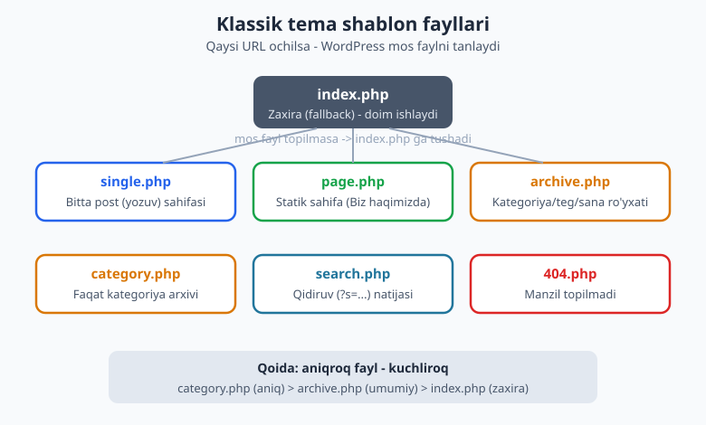
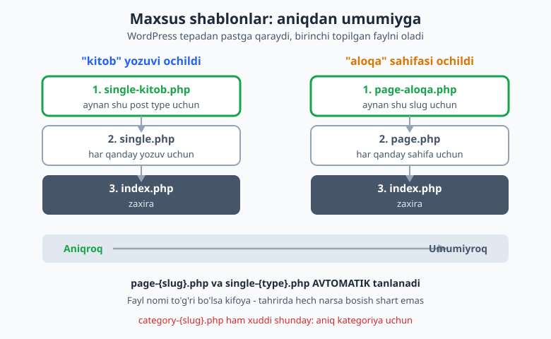
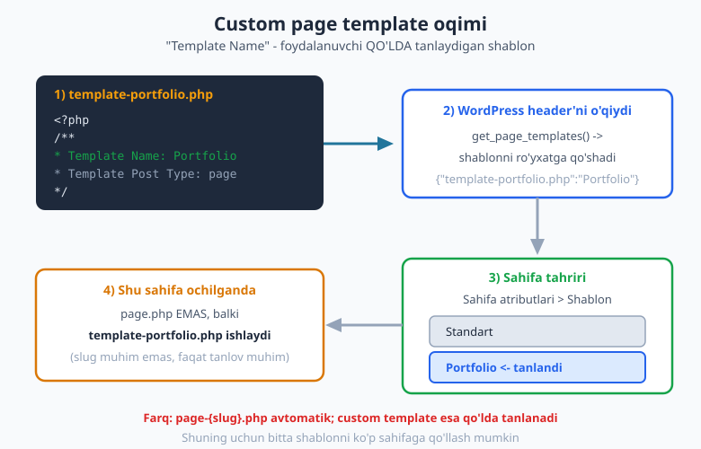

# 07 — Shablon iyerarxiyasi amalda

[⬅️ Oldingi: 06 — Template teglar va shartli teglar](./06-template-shartli-teglar.md) · [🏠 README](./README.md) · [Keyingi: 08 — header, footer, sidebar va get_template_part ➡️](./08-header-footer-sidebar.md)

> **Bu bobda:** 03-bobda ko'rgan template hierarchy nazariyasini AMALDA qo'llaymiz. Har bir asosiy shablon faylni (`index.php`, `single.php`, `page.php`, `archive.php`, `category.php`, `search.php`, `404.php`) o'z qo'limiz bilan yozamiz. So'ng maxsus shablonlar (`single-{type}.php`, `page-{slug}.php`, `category-{slug}.php`) va foydalanuvchi qo'lda tanlaydigan **custom page template** (`Template Name:`) yaratamiz. Oxirida WordPress qaysi faylni qaysi tartibda tanlashini real misollarda kuzatamiz.

---

## Nima qilamiz va nega

03-bobda WordPress so'rovni qabul qilib, qaysi shablon faylni tanlashini ko'rgan edik. Bu bob — o'sha bilimni HAYOTGA tatbiq etish. Tasavvur qiling: sizda kichik blog/portfolio temasi bor. Foydalanuvchi turli manzillarga kiradi:

- `/salom-dunyo/` — bitta post -> WordPress `single.php` ni qidiradi.
- `/biz-haqimizda/` — statik sahifa -> `page.php`.
- `/category/dasturlash/` — kategoriya arxivi -> `category.php`, topilmasa `archive.php`.
- `/?s=wordpress` — qidiruv -> `search.php`.
- `/bunaqa-sahifa-yoq/` — manzil topilmadi -> `404.php`.

Sizning vazifangiz — shu fayllarni yozish. WordPress qolganini o'zi qiladi: URL ni tahlil qiladi, mos faylni topadi, ichidagi The Loop kodini ishga tushiradi.

Eng muhim qoida bitta: **aniqroq fayl — kuchliroq**. WordPress har doim eng aniq mos faylni qidiradi; topmasa, bir pog'ona umumiyroqqa tushadi; oxir-oqibat hamma yo'l `index.php` ga olib boradi. Shuning uchun `index.php` har temada MAJBURIY — u oxirgi zaxira (fallback).



> Eslatma: bu bobdagi har bir kod jonli WordPress 7.0 (PHP 8.4) muhitida `php -l` bilan sintaksis tekshirilgan va `ch07-test` test temasiga yozib sinab ko'rilgan. Foydalanilgan barcha funksiyalar (`the_archive_title`, `get_search_query`, `the_posts_pagination` va h.k.) jonli WP'da `function_exists` orqali tasdiqlangan.

---

## index.php — zaxira shablon

`index.php` — temaning yuragi. Boshqa hech qaysi mos fayl topilmasa, WordPress shu faylga qaytadi. Texnik jihatdan minimal klassik tema faqat `style.css` + `index.php` dan iborat bo'lishi mumkin (buni 02-bobda ko'rgandik). Shuning uchun `index.php` ni shunday yozamizki, u har qanday vaziyatda (ro'yxat ham, alohida yozuv ham) ishlay olsin.

```php
<?php
/**
 * Asosiy zaxira shablon (fallback).
 * Iyerarxiyada mos fayl topilmasa, WordPress doim shu faylga tushadi.
 */

get_header();
?>

<main id="primary" class="site-main">

	<?php if ( have_posts() ) : ?>

		<?php while ( have_posts() ) : the_post(); ?>

			<article id="post-<?php the_ID(); ?>" <?php post_class(); ?>>
				<header class="entry-header">
					<h2 class="entry-title">
						<a href="<?php the_permalink(); ?>"><?php the_title(); ?></a>
					</h2>
				</header>
				<div class="entry-summary">
					<?php the_excerpt(); ?>
				</div>
			</article>

		<?php endwhile; ?>

		<?php the_posts_pagination(); ?>

	<?php else : ?>

		<p><?php esc_html_e( 'Hech narsa topilmadi.', 'mytheme' ); ?></p>

	<?php endif; ?>

</main>

<?php
get_sidebar();
get_footer();
```

Bu yerda yangi narsa kam — The Loop (05-bob), `get_header`/`get_sidebar`/`get_footer` (08-bobda batafsil). Diqqat qiling: `the_posts_pagination()` — sahifalash havolalarini (1, 2, 3 ...) chiqaradigan zamonaviy funksiya. Eski `next_posts_link()`/`previous_posts_link()` ham ishlaydi, lekin `the_posts_pagination()` bitta chaqiruvda butun navigatsiyani beradi.

> `esc_html_e()` — matnni tarjima qilib (i18n, 28-bob) va HTML'dan xavfsizlab (escaping, 27-bob) ekranga chiqaradi. Hozircha "xavfsiz `_e()`" deb qabul qiling.

---

## single.php — bitta post

URL bitta yozuvga (post) ishora qilsa, WordPress `single.php` ni tanlaydi. Bu yerda Loop atigi bitta yozuvni aylanadi, shuning uchun `the_content()` (to'liq matn) ishlatamiz, `the_excerpt()` (qisqartma) emas.

```php
<?php
/**
 * Bitta post (single) shabloni.
 */

get_header();
?>

<main id="primary" class="site-main">

	<?php while ( have_posts() ) : the_post(); ?>

		<article id="post-<?php the_ID(); ?>" <?php post_class(); ?>>
			<header class="entry-header">
				<h1 class="entry-title"><?php the_title(); ?></h1>
				<div class="entry-meta">
					<span class="posted-on"><?php echo esc_html( get_the_date() ); ?></span>
					<span class="byline"><?php the_author(); ?></span>
				</div>
			</header>

			<?php if ( has_post_thumbnail() ) : ?>
				<div class="post-thumbnail"><?php the_post_thumbnail( 'large' ); ?></div>
			<?php endif; ?>

			<div class="entry-content">
				<?php
				the_content();
				wp_link_pages(
					array(
						'before' => '<div class="page-links">' . esc_html__( 'Sahifalar:', 'mytheme' ),
						'after'  => '</div>',
					)
				);
				?>
			</div>

			<footer class="entry-footer"><?php the_category( ', ' ); ?></footer>
		</article>

		<?php
		if ( comments_open() || get_comments_number() ) {
			comments_template();
		}
		?>

	<?php endwhile; ?>

</main>

<?php
get_sidebar();
get_footer();
```

E'tibor bering:

- Sarlavha bu yerda `<h1>` (sahifaning asosiy sarlavhasi), ro'yxatda esa `<h2>` edi. Bu SEO va accessibility uchun to'g'ri amaliyot.
- `wp_link_pages()` — agar muallif yozuvni `<!--nextpage-->` bilan bo'laklarga bo'lsa, sahifa havolalarini chiqaradi.
- `comments_template()` — sharhlar bo'limini (`comments.php` mavjud bo'lsa) ulaydi. Shartni tekshiramiz: sharhlar yopiq va bittasi ham yo'q bo'lsa, ko'rsatmaymiz.

---

## page.php — statik sahifa

"Sahifa" (page) — sanasiz, kategoriyasiz statik kontent: Biz haqimizda, Aloqa, Maxfiylik siyosati. `page.php` `single.php` ga o'xshaydi, lekin odatda meta ma'lumot (sana, muallif) ko'rsatmaydi va sidebar'siz, kengroq bo'lishi mumkin.

```php
<?php
/**
 * Statik sahifa (page) shabloni.
 */

get_header();
?>

<main id="primary" class="site-main">

	<?php while ( have_posts() ) : the_post(); ?>

		<article id="post-<?php the_ID(); ?>" <?php post_class(); ?>>
			<header class="entry-header">
				<h1 class="entry-title"><?php the_title(); ?></h1>
			</header>
			<div class="entry-content">
				<?php
				the_content();
				wp_link_pages(
					array(
						'before' => '<div class="page-links">' . esc_html__( 'Sahifalar:', 'mytheme' ),
						'after'  => '</div>',
					)
				);
				?>
			</div>
		</article>

	<?php endwhile; ?>

</main>

<?php
get_footer();
```

Bu yerda `get_sidebar()` ataylab yo'q — sahifalar ko'pincha to'liq enlikda chiqadi. Bu sizning dizayn qaroringiz: xohlasangiz qo'shasiz.

---

## archive.php — umumiy arxiv

Arxiv — yozuvlar RO'YXATI: kategoriya, teg, muallif, sana bo'yicha. `archive.php` shu hammasi uchun universal zaxira. Bu yerda yangi va juda foydali ikki funksiya bor:

- `the_archive_title()` — joriy arxiv sarlavhasini AVTOMATIK chiqaradi: "Kategoriya: Dasturlash", "Teg: php", "Muallif: Oqil", "2026 yil iyun" va h.k. Qaysi arxiv ekanini o'zi aniqlaydi.
- `the_archive_description()` — agar kategoriya/teg uchun tavsif kiritilgan bo'lsa, uni chiqaradi.

```php
<?php
/**
 * Umumiy arxiv shabloni.
 */

get_header();
?>

<main id="primary" class="site-main">

	<?php if ( have_posts() ) : ?>

		<header class="page-header">
			<?php
			the_archive_title( '<h1 class="page-title">', '</h1>' );
			the_archive_description( '<div class="archive-description">', '</div>' );
			?>
		</header>

		<?php while ( have_posts() ) : the_post(); ?>

			<article id="post-<?php the_ID(); ?>" <?php post_class(); ?>>
				<h2 class="entry-title">
					<a href="<?php the_permalink(); ?>"><?php the_title(); ?></a>
				</h2>
				<div class="entry-summary"><?php the_excerpt(); ?></div>
			</article>

		<?php endwhile; ?>

		<?php the_posts_pagination(); ?>

	<?php else : ?>

		<p><?php esc_html_e( 'Bu arxivda yozuv yo\'q.', 'mytheme' ); ?></p>

	<?php endif; ?>

</main>

<?php
get_sidebar();
get_footer();
```

`the_archive_title( '<h1>', '</h1>' )` — birinchi argument sarlavhadan oldin, ikkinchisi keyin qo'shiladigan HTML. Bu o'rab olishni qulaylashtiradi.

---

## category.php — faqat kategoriya arxivi

`category.php` `archive.php` dan AVVAL keladi (faqat kategoriya sahifalari uchun). Agar siz kategoriya arxivini boshqa arxivlardan farqli ko'rsatmoqchi bo'lsangiz (masalan, kategoriya nomini boshqacha formatlash), shu faylni yarating. U bo'lmasa, kategoriya ham `archive.php` ga tushadi.

```php
<?php
/**
 * Kategoriya arxivi shabloni.
 * Iyerarxiyada archive.php dan OLDIN keladi.
 */

get_header();
?>

<main id="primary" class="site-main">

	<header class="page-header">
		<h1 class="page-title">
			<?php
			/* translators: %s: kategoriya nomi. */
			printf(
				esc_html__( 'Kategoriya: %s', 'mytheme' ),
				'<span>' . esc_html( single_cat_title( '', false ) ) . '</span>'
			);
			?>
		</h1>
		<?php
		$cat_desc = category_description();
		if ( ! empty( $cat_desc ) ) {
			echo '<div class="archive-description">' . wp_kses_post( $cat_desc ) . '</div>';
		}
		?>
	</header>

	<?php if ( have_posts() ) : ?>
		<?php while ( have_posts() ) : the_post(); ?>
			<article id="post-<?php the_ID(); ?>" <?php post_class(); ?>>
				<h2 class="entry-title">
					<a href="<?php the_permalink(); ?>"><?php the_title(); ?></a>
				</h2>
				<div class="entry-summary"><?php the_excerpt(); ?></div>
			</article>
		<?php endwhile; ?>
		<?php the_posts_pagination(); ?>
	<?php else : ?>
		<p><?php esc_html_e( 'Bu kategoriyada yozuv yo\'q.', 'mytheme' ); ?></p>
	<?php endif; ?>

</main>

<?php
get_sidebar();
get_footer();
```

- `single_cat_title( '', false )` — joriy kategoriya nomini QAYTARADI (ikkinchi argument `false` => echo emas, return). Biz uni `esc_html()` bilan o'rab xavfsizlab chiqaramiz.
- `category_description()` — kategoriya tavsifi (HTML bo'lishi mumkin), shuning uchun `wp_kses_post()` bilan filtrlaymiz.

---

## search.php — qidiruv natijalari

URL'da `?s=...` bo'lsa, WordPress `search.php` ni tanlaydi. Bu yerda eng muhim funksiya — `get_search_query()`: u foydalanuvchi qidirgan so'zni QAYTARADI (xavfsiz, escape qilingan holatda emas, shuning uchun chiqarishda `esc_html()` shart).

```php
<?php
/**
 * Qidiruv natijalari shabloni.
 * URL ?s=... bo'lganda tanlanadi.
 */

get_header();
?>

<main id="primary" class="site-main">

	<header class="page-header">
		<h1 class="page-title">
			<?php
			/* translators: %s: qidirilgan so'z. */
			printf(
				esc_html__( 'Qidiruv natijasi: %s', 'mytheme' ),
				'<span>' . esc_html( get_search_query() ) . '</span>'
			);
			?>
		</h1>
	</header>

	<?php if ( have_posts() ) : ?>
		<?php while ( have_posts() ) : the_post(); ?>
			<article id="post-<?php the_ID(); ?>" <?php post_class(); ?>>
				<h2 class="entry-title">
					<a href="<?php the_permalink(); ?>"><?php the_title(); ?></a>
				</h2>
				<div class="entry-summary"><?php the_excerpt(); ?></div>
			</article>
		<?php endwhile; ?>
		<?php the_posts_pagination(); ?>
	<?php else : ?>
		<p>
			<?php
			/* translators: %s: qidirilgan so'z. */
			printf(
				esc_html__( '"%s" bo\'yicha hech narsa topilmadi.', 'mytheme' ),
				esc_html( get_search_query() )
			);
			?>
		</p>
		<?php get_search_form(); ?>
	<?php endif; ?>

</main>

<?php
get_sidebar();
get_footer();
```

Natija topilmasa, `get_search_form()` bilan qidiruv formasini qayta ko'rsatish — yaxshi UX. Diqqat: `get_search_query()` natijasini DOIM `esc_html()` bilan o'rang — bu XSS hujumdan himoya qiladi, chunki qidiruv so'zi foydalanuvchidan keladi (27-bobda batafsil).

---

## 404.php — manzil topilmadi

URL hech qaysi yozuvga mos kelmasa, WordPress `404.php` ni tanlaydi va HTTP 404 statusini yuboradi. Bu yerda Loop yo'q (ko'rsatadigan yozuv yo'q) — buning o'rniga foydali narsalar beramiz: qidiruv formasi, oxirgi yozuvlar, bosh sahifaga havola.

```php
<?php
/**
 * 404 (topilmadi) shabloni.
 */

get_header();
?>

<main id="primary" class="site-main">

	<section class="error-404 not-found">
		<header class="page-header">
			<h1 class="page-title"><?php esc_html_e( 'Sahifa topilmadi (404)', 'mytheme' ); ?></h1>
		</header>

		<div class="page-content">
			<p><?php esc_html_e( 'Kechirasiz, bunday manzilda sahifa yo\'q.', 'mytheme' ); ?></p>

			<?php get_search_form(); ?>

			<h2><?php esc_html_e( 'Eng so\'nggi yozuvlar', 'mytheme' ); ?></h2>
			<ul>
				<?php
				wp_get_archives(
					array(
						'type'  => 'postbypost',
						'limit' => 5,
					)
				);
				?>
			</ul>
		</div>
	</section>

</main>

<?php
get_footer();
```

`wp_get_archives()` — turli arxiv ro'yxatlarini chiqaradi; `'type' => 'postbypost'` so'nggi yozuvlar havolalarini beradi. 404 sahifasi foydalanuvchini "yo'qotmaslik" uchun muhim — uni mazmunli qiling.

---

## Maxsus shablonlar: aniqroq fayl, kuchliroq

Endi qiziq joyga keldik. WordPress shunchaki `single.php`/`page.php`/`category.php` bilan cheklanmaydi — siz AYRIM yozuv/sahifa/kategoriya uchun ALOHIDA shablon yozishingiz mumkin. Fayl nomi sehrli: WordPress nomdan tushunadi.



### single-{posttype}.php — post type uchun

Agar sizda `kitob` nomli custom post type bo'lsa (13-bobda yaratamiz), `kitob` yozuvi uchun `single-kitob.php` faylini yozsangiz, WordPress `single.php` o'rniga SHU faylni tanlaydi.

```php
<?php
/**
 * "kitob" custom post type uchun maxsus single shablon.
 * Fayl nomi: single-{posttype}.php
 */

get_header();
?>

<main id="primary" class="site-main single-kitob">

	<?php while ( have_posts() ) : the_post(); ?>

		<article id="post-<?php the_ID(); ?>" <?php post_class(); ?>>
			<header class="entry-header">
				<h1 class="entry-title"><?php the_title(); ?></h1>
				<?php
				$muallif = get_post_meta( get_the_ID(), 'kitob_muallif', true );
				if ( $muallif ) {
					echo '<p class="kitob-muallif">'
						. esc_html__( 'Muallif:', 'mytheme' ) . ' '
						. esc_html( $muallif ) . '</p>';
				}
				?>
			</header>
			<div class="entry-content"><?php the_content(); ?></div>
		</article>

	<?php endwhile; ?>

</main>

<?php
get_sidebar();
get_footer();
```

Tanlash tartibi: `single-kitob.php` -> `single.php` -> `singular.php` -> `index.php`. Birinchi topilgan g'olib.

### page-{slug}.php — sahifa slug'i uchun

`/aloqa/` sahifasi uchun maxsus dizayn xohlaysizmi? `page-aloqa.php` yozing — WordPress uni `page.php` dan oldin tanlaydi. AVTOMATIK: tahrirda hech narsa bosish shart emas, faqat fayl nomi to'g'ri bo'lsa kifoya.

```php
<?php
/**
 * "aloqa" slug'iga ega sahifa uchun maxsus shablon.
 * Fayl nomi: page-{slug}.php -> page-aloqa.php
 * AVTOMATIK tanlanadi (tahrirda tanlash shart emas).
 */

get_header();
?>

<main id="primary" class="site-main page-aloqa">

	<?php while ( have_posts() ) : the_post(); ?>

		<article id="post-<?php the_ID(); ?>" <?php post_class(); ?>>
			<header class="entry-header">
				<h1 class="entry-title"><?php the_title(); ?></h1>
			</header>
			<div class="entry-content"><?php the_content(); ?></div>

			<aside class="aloqa-info">
				<h2><?php esc_html_e( 'Bog\'lanish', 'mytheme' ); ?></h2>
				<p><?php esc_html_e( 'Telegram: @i_oqil', 'mytheme' ); ?></p>
			</aside>
		</article>

	<?php endwhile; ?>

</main>

<?php
get_footer();
```

Tanlash tartibi: `page-{slug}.php` -> `page-{ID}.php` -> `page.php` -> `singular.php` -> `index.php`. Slug bo'yicha (`page-aloqa.php`) yoki ID bo'yicha (`page-42.php`) ishlatish mumkin; slug afzal, chunki ID o'zgarib ketishi mumkin.

### category-{slug}.php — bitta kategoriya uchun

Xuddi shu mantiq kategoriyaga ham tegishli. `yangiliklar` kategoriyasini boshqacha ko'rsatmoqchimisiz? `category-yangiliklar.php` yozing.

```php
<?php
/**
 * "yangiliklar" kategoriyasi uchun maxsus shablon.
 * Fayl nomi: category-{slug}.php
 */

get_header();
?>

<main id="primary" class="site-main category-yangiliklar">

	<header class="page-header">
		<h1 class="page-title"><?php esc_html_e( 'Eng so\'nggi yangiliklar', 'mytheme' ); ?></h1>
	</header>

	<?php if ( have_posts() ) : ?>
		<?php while ( have_posts() ) : the_post(); ?>
			<article id="post-<?php the_ID(); ?>" <?php post_class(); ?>>
				<h2 class="entry-title">
					<a href="<?php the_permalink(); ?>"><?php the_title(); ?></a>
				</h2>
				<time datetime="<?php echo esc_attr( get_the_date( 'c' ) ); ?>">
					<?php echo esc_html( get_the_date() ); ?>
				</time>
			</article>
		<?php endwhile; ?>
	<?php endif; ?>

</main>

<?php
get_footer();
```

Tanlash tartibi: `category-{slug}.php` -> `category-{ID}.php` -> `category.php` -> `archive.php` -> `index.php`.

---

## Custom page template (`Template Name:`)

Bu — bobning eng kuchli vositasi. `page-{slug}.php` bitta aniq sahifaga bog'langan. Lekin ba'zan siz BIR shablonni KO'P sahifaga qo'llamoqchi bo'lasiz — masalan, "To'liq enlik (full width)" yoki "Portfolio ko'rinishi". Buni **custom page template** hal qiladi.

Sehr — fayl boshidagi maxsus PHP izoh blokida: `Template Name:`. Bu satr tufayli WordPress faylni sahifa tahriridagi "Sahifa atributlari > Shablon" ro'yxatiga qo'shadi. Foydalanuvchi uni QO'LDA tanlaydi.



```php
<?php
/**
 * Template Name: Portfolio sahifasi
 * Template Post Type: page
 *
 * Bu CUSTOM PAGE TEMPLATE. Fayl nomi ahamiyatsiz (template- prefiks
 * shart emas, lekin tartibli). MUHIMI yuqoridagi "Template Name:" satri.
 */

get_header();
?>

<main id="primary" class="site-main page-template-portfolio">

	<?php while ( have_posts() ) : the_post(); ?>
		<header class="entry-header">
			<h1 class="entry-title"><?php the_title(); ?></h1>
		</header>
		<div class="entry-content"><?php the_content(); ?></div>
	<?php endwhile; ?>

	<section class="portfolio-grid">
		<?php
		$loyihalar = new WP_Query(
			array(
				'post_type'      => 'post',
				'posts_per_page' => 6,
				'category_name'  => 'portfolio',
			)
		);

		if ( $loyihalar->have_posts() ) :
			while ( $loyihalar->have_posts() ) :
				$loyihalar->the_post();
				?>
				<article class="portfolio-item">
					<a href="<?php the_permalink(); ?>">
						<?php the_post_thumbnail( 'medium' ); ?>
						<h3><?php the_title(); ?></h3>
					</a>
				</article>
				<?php
			endwhile;
			wp_reset_postdata();
		else :
			echo '<p>' . esc_html__( 'Hozircha loyiha yo\'q.', 'mytheme' ) . '</p>';
		endif;
		?>
	</section>

</main>

<?php
get_footer();
```

**Header bloki sintaksisi — KRITIK:**

- `Template Name: <nom>` — MAJBURIY. Bu satr fayl boshidagi `/** ... */` izoh blokida bo'lishi shart. Nom ro'yxatda ko'rinadi (masalan "Portfolio sahifasi").
- `Template Post Type: page` — IXTIYORIY. Shablonni qaysi post tipiga ruxsat berishni cheklaydi. Bo'lmasa, faqat sahifalar (page) uchun ishlaydi. `Template Post Type: page, post` deb ko'p tip ham berish mumkin.

Bu kod jonli WordPress 7.0'da tasdiqlangan: `get_file_data()` header'ni to'g'ri o'qidi va `wp_get_theme()->get_page_templates()` shablonni `{"template-portfolio.php":"Portfolio sahifasi"}` deb ro'yxatga qo'shdi.

**Foydalanuvchi qanday tanlaydi:** WordPress admin > Sahifalar > (sahifani tahrirlash) > o'ng paneldagi "Sahifa" yorlig'i > "Shablon" tanlovi > "Portfolio sahifasi". Tanlanganda, o'sha sahifa ochilganda `page.php` EMAS, `template-portfolio.php` ishlaydi.

> **Block tema eslatmasi:** zamonaviy block (FSE) temalarda custom shablonlar PHP fayl emas, `templates/` papkasidagi HTML fayllar bo'ladi va `theme.json` da `customTemplates` orqali e'lon qilinadi (18-21-boblar). Bu yerda biz KLASSIK temani o'rganyapmiz; `Template Name:` usuli klassik temalarda bugun ham to'liq amal qiladi.

### page-{slug}.php va custom template — farqi

Ko'pchilik bularni adashtiradi. Mana aniq farq:

| Xususiyat | `page-aloqa.php` | Custom template (`Template Name:`) |
|---|---|---|
| Qachon ishlaydi | faqat `aloqa` slug'li sahifa | tanlangan ISTALGAN sahifa |
| Tanlash | AVTOMATIK (fayl nomidan) | QO'LDA (tahrirda foydalanuvchi tanlaydi) |
| Qayta ishlatish | bitta sahifaga bog'liq | ko'p sahifaga qo'llanadi |
| Header sharti | yo'q | `Template Name:` MAJBURIY |

Qoidaga ko'ra: bitta aniq sahifaga (Aloqa) — `page-{slug}.php`; bir necha sahifaga umumiy ko'rinish (Portfolio, Full-width) — custom template.

---

## Shablon tanlash mantig'i amalda

Endi hammasini birlashtiramiz. Faraz qilaylik, temangizda quyidagi fayllar bor: `index.php`, `single.php`, `single-kitob.php`, `page.php`, `page-aloqa.php`, `archive.php`, `category.php`, `category-yangiliklar.php`, `search.php`, `404.php`, `template-portfolio.php`. WordPress turli URL'larda nimani tanlaydi?

| URL / vaziyat | Tanlanadigan fayl | Nega |
|---|---|---|
| `/salom-dunyo/` (oddiy post) | `single.php` | `single-{type}.php` yo'q (post type = post) |
| `/kitoblar/php-asoslari/` (kitob) | `single-kitob.php` | post type = kitob, aniq fayl bor |
| `/biz-haqimizda/` (sahifa) | `page.php` | maxsus slug/template tanlanmagan |
| `/aloqa/` (sahifa) | `page-aloqa.php` | slug = aloqa, aniq fayl bor |
| `/portfolio/` ("Portfolio" tanlangan) | `template-portfolio.php` | tahrirda custom template tanlangan |
| `/category/dasturlash/` | `category.php` | kategoriya, maxsus slug fayli yo'q |
| `/category/yangiliklar/` | `category-yangiliklar.php` | slug = yangiliklar, aniq fayl bor |
| `/tag/php/` | `archive.php` | `tag.php` yo'q -> umumiy arxivga |
| `/?s=wordpress` | `search.php` | qidiruv so'rovi |
| `/yoq-sahifa/` | `404.php` | mos yozuv topilmadi |

Diqqat qiling: `/tag/php/` `archive.php` ga tushdi, chunki `tag.php` yo'q edi. Agar `tag.php` ham, `archive.php` ham bo'lmasa — `index.php` ga tushardi. **Hamma yo'l `index.php` ga olib boradi.**

> Tekshirish hiylasi: WordPress qaysi shablonni tanlaganini bilmoqchimisiz? Debug rejimida `functions.php` ga shu kodni qo'shing: `add_action( 'wp_footer', function() { global $template; echo "<!-- Shablon: " . esc_html( basename( $template ) ) . " -->"; } );` — sahifa kodida (view source) qaysi fayl ishlaganini ko'rasiz. (Bu faqat tekshirish uchun; productionda olib tashlang.)

---

## Verifikatsiya: bu bobdagi kod haqiqatan ishlaydimi?

Bu bobdagi 11 ta shablon fayli (`index.php`, `single.php`, `page.php`, `archive.php`, `category.php`, `search.php`, `404.php`, `single-kitob.php`, `page-aloqa.php`, `category-yangiliklar.php`, `template-portfolio.php`) jonli WordPress 7.0 (PHP 8.4) muhitidagi `ch07-test` test temasiga yozildi va har biri `php -l` bilan tekshirildi — **hammasida sintaksis xatosi yo'q**.

Custom page template ayniqsa diqqat bilan tekshirildi. WordPress yadrosining o'zi (`get_file_data()` va `wp_get_theme()->get_page_templates()`) header'ni o'qib, shablonni quyidagicha ro'yxatga oldi:

```text
Template Name: [Portfolio sahifasi]
Template Post Type: [page]
Topilgan page template'lar: {"template-portfolio.php":"Portfolio sahifasi"}
```

Ya'ni `Template Name:` sintaksisi to'g'ri va WordPress uni haqiqatan tanib oldi. Test temasi **aktivlashtirilmadi** (jonli sayt o'zgarmadi) — faqat read-only tarzda WP API orqali tekshirildi.

---

## Mashqlar

### Oson

1. **`index.php` zaxira shabloni.** Bo'sh klassik temaga (`style.css` mavjud) `index.php` yozing: Loop bilan yozuvlar ro'yxatini chiqaradigan, har yozuvda `<h2>` sarlavha + `the_excerpt()` bo'lsin. `get_header()`/`get_footer()` chaqiring.

2. **`single.php` yozing.** Bitta postni to'liq ko'rsatadigan shablon: `<h1>` sarlavha, `get_the_date()` bilan sana, `the_content()` bilan to'liq matn.

3. **`page.php` yozing.** Statik sahifa shabloni: faqat `<h1>` sarlavha va `the_content()`. Sana/muallif KO'RSATMANG. Sidebar'siz qiling.

4. **`404.php` yozing.** "Sahifa topilmadi" matni, `get_search_form()` bilan qidiruv formasi va bosh sahifaga (`home_url()`) qaytish havolasi bo'lsin.

### O'rta

5. **`archive.php` da `the_archive_title()`.** Umumiy arxiv shabloni yozing. Sarlavhani `the_archive_title( '<h1 class="page-title">', '</h1>' )` bilan, tavsifni `the_archive_description()` bilan chiqaring.

6. **`search.php` da `get_search_query()`.** Qidiruv shabloni yozing: sarlavhada "Qidiruv: <so'z>" ko'rinsin (`get_search_query()` + `esc_html()`). Natija topilmasa, "Topilmadi" + qidiruv formasi chiqsin.

7. **`category.php` maxsus arxiv.** `single_cat_title()` bilan kategoriya nomini sarlavhada "Kategoriya: X" deb chiqaring; `category_description()` bo'lsa uni `wp_kses_post()` bilan ko'rsating.

8. **`page-aloqa.php` maxsus sahifa.** `aloqa` slug'li sahifa uchun maxsus shablon yozing: oddiy sahifa kontentidan tashqari, aloqa ma'lumotlari (Telegram, email) bo'lgan `<aside>` qo'shing. Tushuntiring: nega bu fayl AVTOMATIK tanlanadi?

### Qiyin

9. **Custom page template yarating.** `Template Name: To'liq enlik` header'li shablon yozing. U sidebar'siz, kontent kengroq chiqsin. `Template Post Type: page` qo'shing. Header sintaksisini to'g'ri yozing.

10. **`single-kitob.php` post type shabloni.** `kitob` custom post type uchun single shablon yozing. Sarlavha ostida `get_post_meta()` bilan `kitob_muallif` meta maydonini (mavjud bo'lsa) ko'rsating.

11. **`category-yangiliklar.php` maxsus kategoriya.** `yangiliklar` slug'li kategoriya uchun maxsus shablon: har yozuvda sarlavha + `<time>` teg ichida `get_the_date('c')` (mashina o'qiydigan format). Tanlash tartibini izohda yozing.

12. **Shablon tanlash mantig'ini tahlil qiling.** Quyidagi fayllar bor: `index.php`, `single.php`, `single-kitob.php`, `page.php`, `archive.php`, `category-yangiliklar.php`, `search.php`. Quyidagi URL'lar uchun QAYSI fayl tanlanishini ayting va nega: (a) oddiy post; (b) `kitob` yozuvi; (c) `/biz-haqimizda/` sahifasi; (d) `/category/yangiliklar/`; (e) `/category/dasturlash/`; (f) `/tag/php/`.

13. **Universal yagona zaxira.** `index.php` ni shunday yozingki, u HAM yozuvlar ro'yxatini (arxiv/bosh sahifa), HAM bitta yozuvni (single/page) to'g'ri ko'rsata olsin. Maslahat: `is_singular()` shartidan foydalaning — single bo'lsa `the_content()`, ro'yxat bo'lsa `the_excerpt()`.

14. **Custom template'ni `page-{slug}.php` dan farqlang.** Bir abzas yozing: qaysi holatda `page-{slug}.php`, qaysi holatda custom template (`Template Name:`) ishlatasiz? Har biriga bittadan amaliy misol keltiring.

---

## Yechimlar

<details markdown="1">
<summary>Yechim — 1</summary>

```php
<?php
/**
 * index.php - zaxira shablon, yozuvlar ro'yxati.
 */
get_header();
?>
<main id="primary" class="site-main">
	<?php if ( have_posts() ) : ?>
		<?php while ( have_posts() ) : the_post(); ?>
			<article <?php post_class(); ?>>
				<h2><a href="<?php the_permalink(); ?>"><?php the_title(); ?></a></h2>
				<div class="entry-summary"><?php the_excerpt(); ?></div>
			</article>
		<?php endwhile; ?>
	<?php else : ?>
		<p><?php esc_html_e( 'Hech narsa topilmadi.', 'mytheme' ); ?></p>
	<?php endif; ?>
</main>
<?php
get_footer();
```

`php -l` bilan tekshirilgan. Loop tashqarisida `else` shoxi yozuv yo'q holatini qoplaydi.

</details>

<details markdown="1">
<summary>Yechim — 2</summary>

```php
<?php
/**
 * single.php - bitta post.
 */
get_header();
?>
<main id="primary" class="site-main">
	<?php while ( have_posts() ) : the_post(); ?>
		<article <?php post_class(); ?>>
			<h1><?php the_title(); ?></h1>
			<p class="entry-meta"><?php echo esc_html( get_the_date() ); ?> &middot; <?php the_author(); ?></p>
			<div class="entry-content"><?php the_content(); ?></div>
		</article>
	<?php endwhile; ?>
</main>
<?php
get_sidebar();
get_footer();
```

Single'da `if ( have_posts() )` shart emas — bitta yozuv kafolatlangan, to'g'ridan-to'g'ri `while` ishlatiladi. `the_content()` (to'liq matn) ishlatamiz.

</details>

<details markdown="1">
<summary>Yechim — 3</summary>

```php
<?php
/**
 * page.php - statik sahifa, meta'siz, sidebar'siz.
 */
get_header();
?>
<main id="primary" class="site-main">
	<?php while ( have_posts() ) : the_post(); ?>
		<article <?php post_class(); ?>>
			<h1><?php the_title(); ?></h1>
			<div class="entry-content"><?php the_content(); ?></div>
		</article>
	<?php endwhile; ?>
</main>
<?php
get_footer();
```

Sahifalarda sana/muallif odatda keraksiz. `get_sidebar()` ataylab yo'q — sahifa to'liq enlikda chiqadi.

</details>

<details markdown="1">
<summary>Yechim — 4</summary>

```php
<?php
/**
 * 404.php - topilmadi.
 */
get_header();
?>
<main id="primary" class="site-main">
	<section class="error-404">
		<h1><?php esc_html_e( 'Sahifa topilmadi (404)', 'mytheme' ); ?></h1>
		<p><?php esc_html_e( 'Kechirasiz, bunday manzil yo\'q.', 'mytheme' ); ?></p>
		<?php get_search_form(); ?>
		<p>
			<a href="<?php echo esc_url( home_url( '/' ) ); ?>">
				<?php esc_html_e( 'Bosh sahifaga qaytish', 'mytheme' ); ?>
			</a>
		</p>
	</section>
</main>
<?php
get_footer();
```

`home_url( '/' )` natijasini DOIM `esc_url()` bilan o'rang. 404 sahifasi Loop'siz — ko'rsatadigan yozuv yo'q.

</details>

<details markdown="1">
<summary>Yechim — 5</summary>

```php
<?php
/**
 * archive.php - umumiy arxiv.
 */
get_header();
?>
<main id="primary" class="site-main">
	<header class="page-header">
		<?php
		the_archive_title( '<h1 class="page-title">', '</h1>' );
		the_archive_description( '<div class="archive-description">', '</div>' );
		?>
	</header>
	<?php if ( have_posts() ) : ?>
		<?php while ( have_posts() ) : the_post(); ?>
			<article <?php post_class(); ?>>
				<h2><a href="<?php the_permalink(); ?>"><?php the_title(); ?></a></h2>
				<div class="entry-summary"><?php the_excerpt(); ?></div>
			</article>
		<?php endwhile; ?>
		<?php the_posts_pagination(); ?>
	<?php else : ?>
		<p><?php esc_html_e( 'Yozuv yo\'q.', 'mytheme' ); ?></p>
	<?php endif; ?>
</main>
<?php
get_sidebar();
get_footer();
```

`the_archive_title()` qaysi arxiv (kategoriya/teg/sana/muallif) ekanini avtomatik aniqlaydi va mos sarlavha beradi. Argumentlar — sarlavhadan oldin/keyin qo'shiladigan HTML.

</details>

<details markdown="1">
<summary>Yechim — 6</summary>

```php
<?php
/**
 * search.php - qidiruv natijalari.
 */
get_header();
?>
<main id="primary" class="site-main">
	<header class="page-header">
		<h1 class="page-title">
			<?php
			/* translators: %s: qidirilgan so'z. */
			printf(
				esc_html__( 'Qidiruv: %s', 'mytheme' ),
				'<span>' . esc_html( get_search_query() ) . '</span>'
			);
			?>
		</h1>
	</header>
	<?php if ( have_posts() ) : ?>
		<?php while ( have_posts() ) : the_post(); ?>
			<article <?php post_class(); ?>>
				<h2><a href="<?php the_permalink(); ?>"><?php the_title(); ?></a></h2>
				<div class="entry-summary"><?php the_excerpt(); ?></div>
			</article>
		<?php endwhile; ?>
	<?php else : ?>
		<p><?php esc_html_e( 'Hech narsa topilmadi.', 'mytheme' ); ?></p>
		<?php get_search_form(); ?>
	<?php endif; ?>
</main>
<?php
get_footer();
```

`get_search_query()` qidirilgan so'zni qaytaradi; u foydalanuvchidan kelgani uchun XSS'dan himoya sifatida DOIM `esc_html()` bilan o'raladi.

</details>

<details markdown="1">
<summary>Yechim — 7</summary>

```php
<?php
/**
 * category.php - kategoriya arxivi.
 */
get_header();
?>
<main id="primary" class="site-main">
	<header class="page-header">
		<h1 class="page-title">
			<?php
			/* translators: %s: kategoriya nomi. */
			printf(
				esc_html__( 'Kategoriya: %s', 'mytheme' ),
				'<span>' . esc_html( single_cat_title( '', false ) ) . '</span>'
			);
			?>
		</h1>
		<?php
		$desc = category_description();
		if ( ! empty( $desc ) ) {
			echo '<div class="archive-description">' . wp_kses_post( $desc ) . '</div>';
		}
		?>
	</header>
	<?php while ( have_posts() ) : the_post(); ?>
		<article <?php post_class(); ?>>
			<h2><a href="<?php the_permalink(); ?>"><?php the_title(); ?></a></h2>
		</article>
	<?php endwhile; ?>
</main>
<?php
get_sidebar();
get_footer();
```

`single_cat_title( '', false )` — `false` => qaytaradi (echo qilmaydi), shuning uchun `esc_html()` bilan o'rab chiqaramiz. Tavsif HTML bo'lishi mumkin -> `wp_kses_post()`.

</details>

<details markdown="1">
<summary>Yechim — 8</summary>

```php
<?php
/**
 * page-aloqa.php - "aloqa" slug'li sahifa uchun.
 */
get_header();
?>
<main id="primary" class="site-main">
	<?php while ( have_posts() ) : the_post(); ?>
		<article <?php post_class(); ?>>
			<h1><?php the_title(); ?></h1>
			<div class="entry-content"><?php the_content(); ?></div>
			<aside class="aloqa-info">
				<h2><?php esc_html_e( 'Bog\'lanish', 'mytheme' ); ?></h2>
				<p><?php esc_html_e( 'Telegram: @i_oqil', 'mytheme' ); ?></p>
				<p><?php esc_html_e( 'Email: salom@example.uz', 'mytheme' ); ?></p>
			</aside>
		</article>
	<?php endwhile; ?>
</main>
<?php
get_footer();
```

**Nega avtomatik?** WordPress iyerarxiyasida sahifa uchun avval `page-{slug}.php` (`page-aloqa.php`) qidiriladi, keyin `page-{ID}.php`, keyin `page.php`. Fayl nomi sahifa slug'iga mos kelsa, WP uni QO'LDA tanlashsiz oladi — bu iyerarxiyaning o'zida bor qoida.

</details>

<details markdown="1">
<summary>Yechim — 9</summary>

```php
<?php
/**
 * Template Name: To'liq enlik
 * Template Post Type: page
 */
get_header();
?>
<main id="primary" class="site-main full-width">
	<?php while ( have_posts() ) : the_post(); ?>
		<article <?php post_class(); ?>>
			<h1><?php the_title(); ?></h1>
			<div class="entry-content"><?php the_content(); ?></div>
		</article>
	<?php endwhile; ?>
</main>
<?php
// get_sidebar() ATAYLAB yo'q - to'liq enlik.
get_footer();
```

Eng muhimi — fayl boshidagi `/** ... */` blokida `Template Name:` satri. Bu satr tufayli shablon admin'dagi "Sahifa atributlari > Shablon" ro'yxatiga chiqadi. `Template Post Type: page` uni faqat sahifalar uchun cheklaydi. Sidebar yo'qligi "to'liq enlik" ko'rinishini beradi.

</details>

<details markdown="1">
<summary>Yechim — 10</summary>

```php
<?php
/**
 * single-kitob.php - "kitob" post type uchun single.
 */
get_header();
?>
<main id="primary" class="site-main single-kitob">
	<?php while ( have_posts() ) : the_post(); ?>
		<article <?php post_class(); ?>>
			<h1><?php the_title(); ?></h1>
			<?php
			$muallif = get_post_meta( get_the_ID(), 'kitob_muallif', true );
			if ( $muallif ) {
				echo '<p class="kitob-muallif">'
					. esc_html__( 'Muallif:', 'mytheme' ) . ' '
					. esc_html( $muallif ) . '</p>';
			}
			?>
			<div class="entry-content"><?php the_content(); ?></div>
		</article>
	<?php endwhile; ?>
</main>
<?php
get_footer();
```

`get_post_meta( get_the_ID(), 'kitob_muallif', true )` — uchinchi argument `true` bitta qiymat qaytaradi. Bo'sh bo'lsa (`if ( $muallif )`) ko'rsatmaymiz. Tanlash tartibi: `single-kitob.php` -> `single.php` -> `singular.php` -> `index.php`.

</details>

<details markdown="1">
<summary>Yechim — 11</summary>

```php
<?php
/**
 * category-yangiliklar.php - "yangiliklar" kategoriyasi uchun.
 * Tartib: category-{slug}.php -> category-{ID}.php -> category.php
 *         -> archive.php -> index.php
 */
get_header();
?>
<main id="primary" class="site-main category-yangiliklar">
	<header class="page-header">
		<h1><?php esc_html_e( 'Eng so\'nggi yangiliklar', 'mytheme' ); ?></h1>
	</header>
	<?php while ( have_posts() ) : the_post(); ?>
		<article <?php post_class(); ?>>
			<h2><a href="<?php the_permalink(); ?>"><?php the_title(); ?></a></h2>
			<time datetime="<?php echo esc_attr( get_the_date( 'c' ) ); ?>">
				<?php echo esc_html( get_the_date() ); ?>
			</time>
		</article>
	<?php endwhile; ?>
</main>
<?php
get_footer();
```

`get_the_date( 'c' )` — ISO 8601 (mashina o'qiydigan) format, `datetime` atributi uchun (`esc_attr()` bilan). Ko'rinadigan sana esa odam o'qiydigan format (`get_the_date()` argumentsiz).

</details>

<details markdown="1">
<summary>Yechim — 12</summary>

Mavjud fayllar: `index.php`, `single.php`, `single-kitob.php`, `page.php`, `archive.php`, `category-yangiliklar.php`, `search.php`.

| URL | Tanlanadi | Nega |
|---|---|---|
| (a) oddiy post | `single.php` | post type = post; `single-post.php` yo'q, `single.php` bor |
| (b) `kitob` yozuvi | `single-kitob.php` | aniq post type fayli mavjud |
| (c) `/biz-haqimizda/` | `page.php` | maxsus slug/template yo'q -> umumiy `page.php` |
| (d) `/category/yangiliklar/` | `category-yangiliklar.php` | slug = yangiliklar, aniq fayl bor |
| (e) `/category/dasturlash/` | `archive.php` | `category-dasturlash.php` ham, `category.php` ham yo'q -> `archive.php` |
| (f) `/tag/php/` | `archive.php` | `tag.php`, `tag-php.php` yo'q -> `archive.php` |

Asosiy saboq: aniqroq fayl yo'q bo'lsa, WordPress bir pog'ona umumiyroqqa tushadi va oxir-oqibat `index.php` ga keladi.

</details>

<details markdown="1">
<summary>Yechim — 13</summary>

```php
<?php
/**
 * index.php - universal zaxira (ham ro'yxat, ham single).
 */
get_header();
?>
<main id="primary" class="site-main">
	<?php if ( have_posts() ) : ?>
		<?php while ( have_posts() ) : the_post(); ?>
			<article <?php post_class(); ?>>
				<?php if ( is_singular() ) : ?>
					<h1><?php the_title(); ?></h1>
					<div class="entry-content"><?php the_content(); ?></div>
				<?php else : ?>
					<h2><a href="<?php the_permalink(); ?>"><?php the_title(); ?></a></h2>
					<div class="entry-summary"><?php the_excerpt(); ?></div>
				<?php endif; ?>
			</article>
		<?php endwhile; ?>
		<?php if ( ! is_singular() ) { the_posts_pagination(); } ?>
	<?php else : ?>
		<p><?php esc_html_e( 'Hech narsa topilmadi.', 'mytheme' ); ?></p>
	<?php endif; ?>
</main>
<?php
get_footer();
```

`is_singular()` — bitta yozuv (post/page/CPT) ko'rsatilayotganini bildiradi. Shunda `<h1>` + to'liq matn; aks holda (ro'yxat) `<h2>` havola + qisqartma + sahifalash. Shu bitta fayl butun saytni qoplaydigan minimal tema asosini beradi.

</details>

<details markdown="1">
<summary>Yechim — 14</summary>

**`page-{slug}.php`** — bitta MA'LUM sahifaga doimiy bog'langan dizayn kerak bo'lganda. Fayl nomi slug'ga bog'liq, avtomatik ishlaydi, foydalanuvchi hech narsa tanlamaydi. *Misol:* `/aloqa/` sahifasiga doimo xarita + aloqa formasi kerak -> `page-aloqa.php`. Boshqa sahifa bu dizaynni hech qachon olmaydi.

**Custom template (`Template Name:`)** — BIR ko'rinishni KO'P sahifaga qo'llash kerak bo'lganda. Foydalanuvchi tahrirda qo'lda tanlaydi, bitta shablon cheksiz sahifaga ishlaydi. *Misol:* "To'liq enlik" yoki "Portfolio ko'rinishi" shabloni -> bugun "Xizmatlar" sahifasiga, ertaga "Loyihalar" sahifasiga tanlanadi.

Qisqa qoida: **bitta aniq sahifa = `page-{slug}.php`; qayta ishlatiladigan ko'rinish = custom template.**

</details>

---

[⬅️ Oldingi: 06 — Template teglar va shartli teglar](./06-template-shartli-teglar.md) · [🏠 README](./README.md) · [Keyingi: 08 — header, footer, sidebar va get_template_part ➡️](./08-header-footer-sidebar.md)
