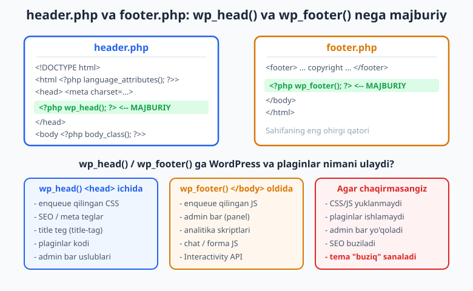
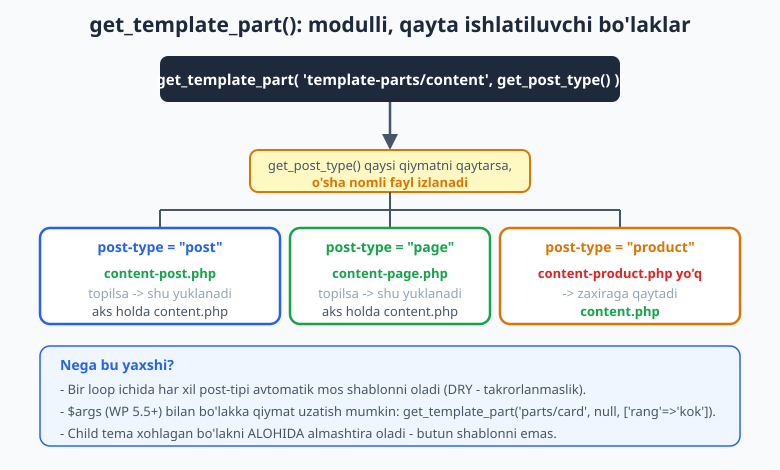
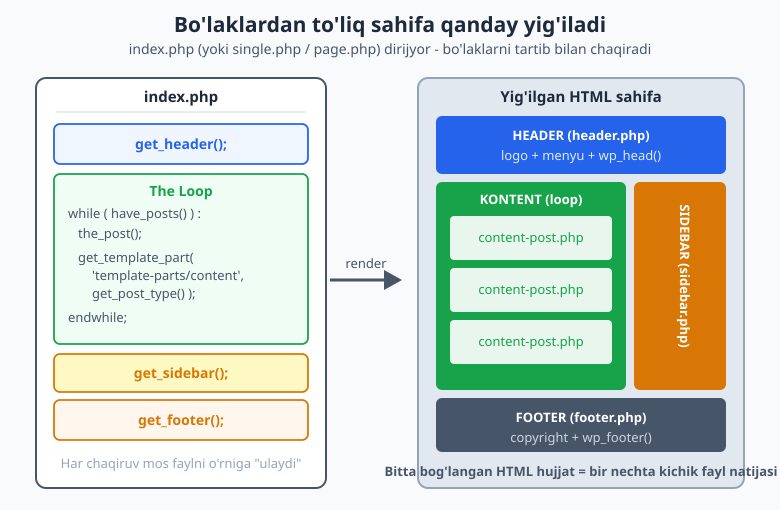

# 08 — header, footer, sidebar va get_template_part

[⬅️ Oldingi: 07 — Shablon iyerarxiyasi amalda](./07-shablon-iyerarxiyasi.md) · [🏠 README](./README.md) · [Keyingi: 09 — functions.php, hooks va theme setup ➡️](./09-functions-php-hooks.md)

> **Bu bobda:** Har bir shablon faylda `<html>`, `<head>`, menyu va footer'ni qayta-qayta yozmaslik uchun WordPress ularni alohida bo'laklarga ajratadi. Biz `get_header()`, `get_footer()`, `get_sidebar()` va eng kuchli `get_template_part()` bilan temani modulli qilamiz. Eng muhimi: `wp_head()` va `wp_footer()` nima uchun har bir temada MAJBURIY ekanini, ularsiz tema nega buzilishini tushunamiz.

---

## Nega bo'laklarga ajratamiz?

07-bobda biz `index.php`, `single.php`, `page.php`, `archive.php` kabi shablonlarni yozdik. Har birida bir xil narsa takrorlanardi: `<!DOCTYPE html>`, `<head>` ichidagi meta teglar, yuqoridagi logo va menyu, eng pastdagi footer. Agar logoni o'zgartirsangiz, beshta faylni qo'lda tahrirlashga to'g'ri kelardi. Bu — xato manbai va vaqt isrofi.

Yechim oddiy: takrorlanadigan qismlarni **alohida fayllarga** chiqaramiz va har bir shablondan ularni **chaqiramiz**. Bu dasturlashning DRY (Don't Repeat Yourself — o'zingni takrorlama) tamoyili. WordPress buning uchun maxsus funksiyalar beradi.

Hayotiy o'xshatish: kitobning har bobi alohida varaqda, lekin **muqova** (header) va **orqa muqova** (footer) hamma bob uchun bitta. Siz har varaqqa muqovani qaytadan chizmaysiz — tayyorini ulaysiz.

WordPress temasida uchta asosiy bo'lak bor:

| Bo'lak | Fayl | Chaqiruvchi funksiya | Vazifasi |
|--------|------|----------------------|----------|
| Header | `header.php` | `get_header()` | `<html>`, `<head>`, sayt yuqorisi (logo, menyu) |
| Footer | `footer.php` | `get_footer()` | Sayt pasti, copyright, `</body></html>` |
| Sidebar | `sidebar.php` | `get_sidebar()` | Yon panel (widget'lar, qidiruv) |

Bularning ustiga eng moslashuvchan vosita — `get_template_part()` — bilan ixtiyoriy bo'lakni (masalan, bitta post kartochkasini) modul qilib chiqaramiz.

> PHP'ning `include`/`require` sintaksisini bu yerda qayta o'rgatmaymiz — agar `include` nima ekanini eslatish kerak bo'lsa, [PHP kitobiga](../php/README.md) qarang. WordPress funksiyalari aslida shu `include` ustiga qurilgan, lekin ular **tema papkasini avtomatik topadi** va **child tema'ni hisobga oladi** — shuning uchun to'g'ridan-to'g'ri `include` ishlatmaymiz.

---

## `get_header()`, `get_footer()`, `get_sidebar()`

Bu uchta funksiya bir xil mantiq bilan ishlaydi: nomiga mos `.php` faylni topib, joriy joyga **qo'shadi** (include qiladi). Ulardan foydalanish juda sodda:

```php
<?php get_header(); ?>

<!-- shu yerda asosiy kontent / The Loop -->

<?php get_sidebar(); ?>
<?php get_footer(); ?>
```

- `get_header()` — tema papkasidagi `header.php` faylni yuklaydi.
- `get_footer()` — `footer.php` faylni yuklaydi.
- `get_sidebar()` — `sidebar.php` faylni yuklaydi.

Diqqat: siz `.php` kengaytmasini yozmaysiz — faqat `get_header()` deysiz, WordPress o'zi `header.php` ni topadi.

### Nega oddiy `include` emas?

Mantiqiy savol: nega `include 'header.php';` yozmaymiz? Uch sabab:

1. **Yo'lni o'zi topadi.** `get_header()` joriy temaning papkasini biladi. `include` esa qaysi papkadan ekanini bilmaydi (ishlayotgan skriptga nisbatan izlaydi) — bu xatoga olib keladi.
2. **Child tema'ni qo'llaydi.** Agar child tema'da `header.php` bo'lsa, `get_header()` parent'nikini emas, **child'nikini** yuklaydi. Bu tema'larni kengaytirishning asosi (29-bobda batafsil).
3. **Hook'lar ishga tushadi.** `get_header()` chaqirilganda `get_header` action hook ham ishga tushadi — plaginlar shunga ulanib qo'shimcha kod kirita oladi.

### Nomli variantlar: `get_header('shop')`

Ba'zan turli sahifalar uchun turli header kerak bo'ladi. Masalan, do'kon sahifalarida boshqacha yuqori panel. Buning uchun funksiyaga **nom** beriladi:

```php
<?php get_header( 'shop' ); ?>
```

Bu chaqiruv avval `header-shop.php` faylni izlaydi. **Agar topmasa**, oddiy `header.php` ga qaytadi (fallback). Xuddi shu qoida boshqalariga ham tegishli:

| Chaqiruv | Avval izlaydi | Topmasa |
|----------|---------------|---------|
| `get_header('shop')` | `header-shop.php` | `header.php` |
| `get_footer('minimal')` | `footer-minimal.php` | `footer.php` |
| `get_sidebar('blog')` | `sidebar-blog.php` | `sidebar.php` |

Bu xuddi 03-bobdagi template hierarchy mantig'i — aniqdan umumiyga qarab izlash.

> **WP 5.5+ qo'shimcha:** bu funksiyalarning ikkinchi argumenti `$args` massivi bo'lib, bo'lakka qiymat uzatish mumkin: `get_header( null, array( 'rang' => 'kok' ) )`. Bo'lak ichida bu qiymatlar `$args['rang']` orqali olinadi. Bu, ayniqsa, `get_template_part()` da foydali (quyida ko'ramiz).

---

## `header.php` — eng muhim fayl

`header.php` HTML hujjatning boshini chiqaradi: doctype, `<html>`, `<head>` va ochiluvchi `<body>`. Mana to'liq, ishlaydigan namuna (`php -l` bilan tekshirilgan):

```php
<?php
/**
 * Tema header bo'lagi.
 *
 * @package Ch08_Test
 */
?><!DOCTYPE html>
<html <?php language_attributes(); ?>>
<head>
	<meta charset="<?php bloginfo( 'charset' ); ?>">
	<meta name="viewport" content="width=device-width, initial-scale=1">
	<?php wp_head(); ?>
</head>

<body <?php body_class(); ?>>
<?php wp_body_open(); ?>

<header class="sayt-header">
	<p class="sayt-nomi">
		<a href="<?php echo esc_url( home_url( '/' ) ); ?>">
			<?php bloginfo( 'name' ); ?>
		</a>
	</p>

	<nav class="asosiy-navigatsiya" aria-label="Asosiy menyu">
		<?php
		wp_nav_menu(
			array(
				'theme_location' => 'primary',
				'fallback_cb'    => false,
			)
		);
		?>
	</nav>
</header>

<main id="kontent" class="sayt-kontent">
```

Diqqat: fayl `<main>` ochilib **yopilmasdan** tugaydi. Uni `footer.php` yopadi. Shu sabab header va footer doim juftlikda ishlaydi.

Endi har bir muhim qatorni ko'rib chiqamiz.

### `?><!DOCTYPE html>` — bo'sh joy muammosi

E'tibor bering: `?>` darrov `<!DOCTYPE` ga yopishgan, yangi qatorsiz. Sababi: PHP yopuvchi `?>` dan keyingi har qanday bo'sh joy yoki yangi qator brauzerga **chiqib ketadi**. Bu doctype'dan oldin bo'sh qator hosil qiladi va ba'zan `header()` xatolariga olib keladi. Shuning uchun fayl boshidagi PHP blokni doctype'ga yopishtiramiz.

### `<html <?php language_attributes(); ?>>`

`language_attributes()` saytning tilini va matn yo'nalishini chiqaradi, masalan `lang="uz" dir="ltr"`. Bu qidiruv tizimlari va ekran o'qigichlar (accessibility) uchun zarur. Biz tilni qo'lda yozmaymiz — WordPress sozlamalaridan oladi.

### `<meta charset="<?php bloginfo( 'charset' ); ?>">`

`bloginfo('charset')` odatda `UTF-8` qaytaradi. Kodlashni qo'lda `UTF-8` deb yozsa ham bo'ladi, lekin `bloginfo()` saytning haqiqiy sozlamasini hurmat qiladi.

### `<?php wp_head(); ?>` — MAJBURIY

Bu — temaning eng muhim qatori. **`wp_head()` `</head>` dan oldin albatta bo'lishi shart.** U `wp_head` action hook'ini ishga tushiradi, va shu hook'ga WordPress yadrosi hamda barcha plaginlar quyidagilarni ulaydi:

- Enqueue qilingan barcha CSS fayllar (10-bobda enqueue'ni o'rganamiz).
- `<title>` teg (`add_theme_support('title-tag')` orqali — 09-bobda).
- SEO meta teglar, Open Graph teglari (plaginlardan).
- Admin bar (tepa qora panel) uchun uslublar.
- Plaginlar qo'shadigan har qanday `<head>` kodi.

Agar `wp_head()` ni unutsangiz, **temangiz uslubsiz, plaginlarsiz va admin bar'siz** chiqadi. Bu eng ko'p uchraydigan yangi boshlovchi xatosi.

### `<body <?php body_class(); ?>>`

`body_class()` `<body>` tegiga foydali CSS klasslar qo'shadi: joriy sahifa turi (`home`, `single`, `page`, `archive`), post ID, shablon nomi va boshqalar. Bu klasslar yordamida CSS'da har sahifani alohida uslublash mumkin. Masalan: `.single-post .sayt-header { ... }`.

### `<?php wp_body_open(); ?>` — `<body>` darrov ortidan

WP 5.2'dan beri `<body>` ochilgandan **darrov keyin** `wp_body_open()` chaqiriladi. Bu yangi admin bar joylashuvi, Google Tag Manager va boshqa plaginlar uchun standart joy. Eski temalarda bu yo'q edi — yangi temada bo'lishi best-practice.



---

## `footer.php` — `wp_footer()` MAJBURIY

`footer.php` hujjatni yopadi: header'da ochilgan `<main>` ni yopadi, footer kontentini chiqaradi va eng muhimi — `wp_footer()` ni chaqiradi. Mana ishlaydigan namuna (`php -l` bilan tekshirilgan):

```php
<?php
/**
 * Tema footer bo'lagi.
 *
 * @package Ch08_Test
 */
?>
</main><!-- #kontent -->

<footer class="sayt-footer">
	<div class="footer-ichki">
		<p class="mualliflik-huquqi">
			&copy; <?php echo esc_html( date_i18n( 'Y' ) ); ?>
			<?php bloginfo( 'name' ); ?>.
			Barcha huquqlar himoyalangan.
		</p>
	</div>
</footer>

<?php wp_footer(); ?>
</body>
</html>
```

### `<?php wp_footer(); ?>` — nega majburiy?

`wp_head()` qanchalik muhim bo'lsa, `wp_footer()` ham shunchalik. U `</body>` dan **oldin albatta** chaqirilishi kerak va `wp_footer` hook'ini ishga tushiradi. Shu hook'ga ulanadigan narsalar:

- Enqueue qilingan JavaScript fayllar (zamonaviy best-practice: JS'ni footer'da yuklash — sahifa tezroq ko'rinadi).
- **Admin bar'ning o'zi** (tepa panel HTML'i shu yerda chiqadi).
- Analitika kodlari (Google Analytics va h.k.).
- Plaginlar JS'i: chat oynalari, formalar, popup'lar.
- Block tema'larning Interactivity API skriptlari.

Agar `wp_footer()` ni unutsangiz: **JavaScript ishlamaydi, admin bar yo'qoladi, ko'p plaginlar buziladi.** Sayt "tinch" ko'rinishi mumkin, lekin aslida buzuq.

### `date_i18n('Y')` — joriy yil

Copyright yilini qo'lda yozmaymiz (har yili o'zgartirib o'tirmaslik uchun). `date_i18n('Y')` joriy yilni saytning vaqt mintaqasi va tiliga mos chiqaradi. PHP'ning oddiy `date()` o'rniga `date_i18n()` ishlatamiz, chunki u WordPress sozlamalarini hurmat qiladi.

> **Eslatma — escaping:** `echo esc_html( ... )` ni e'tiborga oling. Har qanday dinamik qiymatni chiqarishdan oldin escape qilamiz. Bu xavfsizlik qoidasi 27-bobda chuqur ko'riladi, lekin odatni hoziroq shakllantiramiz: **"har chiqishni escape qil"**.

---

## `sidebar.php` — yon panel

`sidebar.php` yon panelni chiqaradi. "Sidebar" nomi tarixiy — aslida bu **widget hududi**, sahifaning xohlagan joyida bo'lishi mumkin (footer ham widget hududi bo'la oladi). Widget'larni 12-bobda batafsil o'rganamiz; bu yerda faqat bo'lak strukturasini ko'ramiz:

```php
<?php
/**
 * Tema sidebar bo'lagi.
 *
 * @package Ch08_Test
 */

if ( ! is_active_sidebar( 'sidebar-1' ) ) {
	return;
}
?>
<aside id="ikkilamchi" class="sidebar" aria-label="Yon panel">
	<?php dynamic_sidebar( 'sidebar-1' ); ?>
</aside>
```

- `is_active_sidebar( 'sidebar-1' )` — bu widget hududida hech bo'lmasa bitta widget bormi, tekshiradi. Agar bo'sh bo'lsa, `return` bilan chiqamiz — bo'sh `<aside>` chizmaymiz.
- `dynamic_sidebar( 'sidebar-1' )` — foydalanuvchi admin panelda shu hududga joylashtirgan widget'larni chiqaradi.

`'sidebar-1'` — bu widget hududining ID'si. U `functions.php` da `register_sidebar()` bilan ro'yxatdan o'tkaziladi (12-bob). Hozircha buni "kelajakda to'ldiriladigan joy" deb tushuning.

Sidebar'ni har bir shablonda chaqirish ixtiyoriy. Masalan, `page.php` (statik sahifa) sidebar'siz, `index.php` (blog) sidebar bilan bo'lishi mumkin.

---

## `get_template_part()` — modullashtirishning kaliti

`get_header`/`get_footer`/`get_sidebar` aniq, oldindan belgilangan bo'laklar uchun. Lekin sizga ko'pincha **o'zingiz nomlagan** bo'laklar kerak bo'ladi: bitta post kartochkasi, mahsulot bloki, "natija topilmadi" xabari. Mana shu yerda `get_template_part()` keladi — bu temadagi eng ko'p ishlatiladigan modullashtirish vositasi.

Sintaksis:

```php
get_template_part( $slug, $name, $args );
```

- `$slug` — bo'lak fayl yo'li (kengaytmasiz). Masalan `'template-parts/content'`.
- `$name` — ixtiyoriy variant nomi. `content-{name}.php` faylni izlaydi.
- `$args` — ixtiyoriy massiv (WP 5.5+), bo'lakka qiymat uzatish uchun.

### Eng kuchli idioma: `content-{post-type}`

The Loop ichida har bir post turini avtomatik mos shablon bilan chiqarish:

```php
get_template_part( 'template-parts/content', get_post_type() );
```

`get_post_type()` joriy postning turini qaytaradi (`post`, `page`, `product`...). Shunga qarab WordPress izlaydi:

- post bo'lsa: `template-parts/content-post.php`, topmasa `template-parts/content.php`
- page bo'lsa: `template-parts/content-page.php`, topmasa `template-parts/content.php`
- product bo'lsa: `template-parts/content-product.php`, topmasa `template-parts/content.php`

Demak `content.php` — **zaxira (fallback)** variant. Maxsus fayl yaratsangiz — u ishlaydi; yaratmasangiz — umumiy fayl ishlaydi. Bu xuddi template hierarchy'ning kichik nusxasi.



Misol uchun, umumiy `template-parts/content.php`:

```php
<?php
/**
 * Umumiy post bo'lagi (zaxira variant).
 *
 * @package Ch08_Test
 */
?>
<article id="post-<?php the_ID(); ?>" <?php post_class(); ?>>
	<header class="post-header">
		<?php the_title( '<h2 class="post-sarlavha">', '</h2>' ); ?>
	</header>

	<div class="post-mazmun">
		<?php the_excerpt(); ?>
	</div>
</article>
```

Va sahifa (page) uchun alohida `template-parts/content-page.php` (sarlavha `<h1>`, qisqacha emas to'liq kontent):

```php
<?php
/**
 * Sahifa (page) uchun bo'lak.
 *
 * @package Ch08_Test
 */
?>
<article id="post-<?php the_ID(); ?>" <?php post_class(); ?>>
	<?php the_title( '<h1 class="sahifa-sarlavha">', '</h1>' ); ?>

	<div class="sahifa-mazmun">
		<?php the_content(); ?>
	</div>
</article>
```

Endi `index.php` ham, `page.php` ham, `single.php` ham bir xil chaqiruvni ishlatadi — har biri o'z turiga mos bo'lakni avtomatik oladi. Kod takrorlanmaydi.

### `$args` bilan qiymat uzatish (WP 5.5+)

Ba'zan bo'lakka qo'shimcha ma'lumot kerak. Masalan, kartochka rangini tashqaridan belgilash:

```php
get_template_part(
	'template-parts/card',
	null,
	array(
		'rang'      => 'kok',
		'sarlavha'  => 'Tavsiya etiladi',
	)
);
```

Bo'lak ichida bu qiymatlar `$args` massivida bo'ladi:

```php
<?php
$rang     = $args['rang'] ?? 'oq';
$sarlavha = $args['sarlavha'] ?? '';
?>
<div class="card card--<?php echo esc_attr( $rang ); ?>">
	<h3><?php echo esc_html( $sarlavha ); ?></h3>
</div>
```

Bu bitta bo'lakni har xil kontekstda qayta ishlatish imkonini beradi — DRY'ning eng yaxshi ko'rinishi.

### `get_template_part` vs `get_header` — qaysi biri?

| Holat | Funksiya |
|-------|----------|
| Sahifa boshi (html/head) | `get_header()` |
| Sahifa oxiri (footer/body yopish) | `get_footer()` |
| Yon panel | `get_sidebar()` |
| Boshqa har qanday qayta ishlatiluvchi bo'lak | `get_template_part()` |

Aslida `get_header()` — bu `get_template_part()` ning maxsus, qulay versiyasi. Ikkalasi ham `include` ustiga qurilgan.

---

## `get_search_form()` — qidiruv formasi

Saytda qidiruv maydoni chiqarish uchun:

```php
<?php get_search_form(); ?>
```

Bu funksiya quyidagi tartibda ishlaydi:

1. Temada `searchform.php` fayli bormi — bo'lsa, o'shani ishlatadi.
2. Yo'q bo'lsa — WordPress'ning standart, accessibility'ga mos qidiruv formasini chiqaradi.

Ko'p hollarda standart forma yetarli, shuning uchun `searchform.php` yozish shart emas. Qaytarish kerak bo'lsa (echo qilmasdan):

```php
$forma = get_search_form( array( 'echo' => false ) );
```

> **WP 5.2+:** ilgari `get_search_form( false )` deb yozilardi (boolean), endi `array( 'echo' => false )` afzal. Eski boolean usul hali ishlaydi, lekin yangi kodda massiv ishlating.

`get_search_form()` ni odatda `sidebar.php`, `404.php` yoki "natija topilmadi" bo'lagida chaqiramiz.

---

## Hammasini birlashtirish: `index.php`

Endi bo'laklar birga qanday ishlashini ko'ramiz. Mana to'liq `index.php` (`php -l` dan o'tgan):

```php
<?php
/**
 * Asosiy shablon - hamma narsani birlashtiradi.
 *
 * @package Ch08_Test
 */

get_header(); ?>

<?php
if ( have_posts() ) :
	while ( have_posts() ) :
		the_post();
		// Post tipiga qarab mos bo'lakni yuklaymiz.
		get_template_part( 'template-parts/content', get_post_type() );
	endwhile;

	the_posts_pagination();
else :
	get_template_part( 'template-parts/content', 'none' );
endif;
?>

<?php get_sidebar(); ?>
<?php get_footer(); ?>
```

Oqim quyidagicha:

1. `get_header()` — `<html>`, `<head>` (`wp_head()` bilan), logo, menyu va ochiluvchi `<main>` chiqadi.
2. The Loop — har bir post `get_template_part()` orqali mos bo'lakda chiqadi.
3. Postlar bo'lmasa — `content-none.php` ("topilmadi" xabari + qidiruv formasi).
4. `get_sidebar()` — yon panel.
5. `get_footer()` — `<main>` yopiladi, footer va `wp_footer()` chiqadi, `</body></html>`.

Natijada bir nechta kichik fayldan **bitta to'liq, bog'langan HTML hujjat** yig'iladi.



Bu modulli yondashuvning kuchi: logoni o'zgartirish kerakmi? Faqat `header.php`. Footer'ga havola qo'shasizmi? Faqat `footer.php`. Post kartochkasini qayta dizayn qilasizmi? Faqat `content.php`. Har bir o'zgarish bitta joyda.

---

## Tez-tez uchraydigan xatolar

1. **`wp_head()` yoki `wp_footer()` ni unutish.** Eng ko'p uchraydigan xato. Tema "ishlaydigandek" ko'rinadi, lekin CSS/JS yuklanmaydi, plaginlar va admin bar buziladi. Theme Check plagin (29-bob) bu xatoni topadi.
2. **`?>` dan keyin bo'sh joy.** `header.php` boshida `?>` va `<!DOCTYPE` orasida yangi qator qoldirsangiz, brauzerga ortiqcha bo'sh joy chiqadi va "headers already sent" xatosi chiqishi mumkin.
3. **`include 'header.php'` ishlatish.** Child tema'ni va hook'larni buzadi. Doim `get_header()` ishlating.
4. **`<main>` ni header'da ochib, footer'da yopishni unutish.** Teglar muvozanati buziladi, HTML noto'g'ri bo'ladi.
5. **`get_template_part()` ga `.php` yozish.** `get_template_part('content.php')` xato — `.php` siz yozing: `get_template_part('content')`.
6. **Bo'lak fayl yo'lini noto'g'ri yozish.** `get_template_part('template-parts/content', ...)` da papka nomi aniq bo'lishi kerak.

---

## Mashqlar

### Oson

1. **Minimal `header.php` yozing.** Doctype, `<html>` (`language_attributes()` bilan), `<head>` (charset + viewport + `wp_head()`), `<body>` (`body_class()` + `wp_body_open()`) va ochiluvchi `<main>` bo'lsin. `php -l` dan o'tsin.
2. **Minimal `footer.php` yozing.** `<main>` ni yoping, copyright qatori (`date_i18n('Y')` bilan) chiqaring va `wp_footer()` ni `</body>` dan oldin qo'ying.
3. **`index.php` da uchta chaqiruvni to'g'ri tartibda joylang:** `get_header()`, keyin kontent, keyin `get_footer()`. Sidebar'ni footer'dan oldin qo'shing.
4. **`get_search_form()` ni chaqiring.** `sidebar.php` ichiga qidiruv formasini qo'shing.

### O'rta

5. **`wp_head()` yo'q header'ni tuzating.** Quyidagi `header.php` da bir xato bor — toping va tuzating:
   ```php
   <!DOCTYPE html>
   <html <?php language_attributes(); ?>>
   <head>
       <meta charset="<?php bloginfo('charset'); ?>">
       <title><?php bloginfo('name'); ?></title>
   </head>
   <body <?php body_class(); ?>>
   ```
6. **Nomli header qo'shing.** `get_header('shop')` chaqiruvi uchun `header-shop.php` yarating va u topilmasa qaysi fayl ishlashini izohda yozing.
7. **`content-page.php` modul yarating.** `the_title()` `<h1>` da, `the_content()` to'liq chiqsin. `index.php` da `get_template_part('template-parts/content', get_post_type())` bu faylni page uchun avtomatik tanlasin.
8. **Bo'sh sidebar'ni yashiring.** `sidebar.php` da `is_active_sidebar()` bilan tekshiring: widget bo'lmasa, `<aside>` umuman chizilmasin.

### Qiyin

9. **`$args` bilan qayta ishlatiluvchi kartochka yarating.** `template-parts/card.php` bo'lagi `$args['rang']` va `$args['sarlavha']` ni qabul qilsin (default qiymatlar bilan). Uni ikki marta turli ranglar bilan chaqiring. Barcha chiqishlar escape qilingan bo'lsin.
10. **Modulli loop yozing.** `index.php` da The Loop ichida `get_template_part('template-parts/content', get_post_type())`, postlar bo'lmasa `content-none.php` chaqiriladigan to'liq strukturani yozing. `content-none.php` ichida `get_search_form()` bo'lsin.
11. **`wp_head`/`wp_footer` izohini yozing.** Bir abzasda tushuntiring: agar tema'da `wp_head()` va `wp_footer()` bo'lmasa, aniq qaysi 4 narsa ishlamay qoladi va nega.
12. **To'liq bo'laklar to'plamini yig'ing.** `header.php`, `footer.php`, `sidebar.php`, `index.php`, `template-parts/content.php`, `template-parts/content-page.php`, `template-parts/content-none.php` — hammasini yozing, har birini `php -l` bilan tekshiring. `index.php` ularning hammasini to'g'ri tartibda chaqirsin.

---

## Yechimlar

<details markdown="1">
<summary>Yechim — 1</summary>

```php
<?php
/**
 * Minimal header.php
 */
?><!DOCTYPE html>
<html <?php language_attributes(); ?>>
<head>
	<meta charset="<?php bloginfo( 'charset' ); ?>">
	<meta name="viewport" content="width=device-width, initial-scale=1">
	<?php wp_head(); ?>
</head>

<body <?php body_class(); ?>>
<?php wp_body_open(); ?>
<main id="kontent">
```

Diqqat: `?>` darrov `<!DOCTYPE` ga yopishgan (bo'sh joy muammosining oldini olish uchun). `wp_head()` `</head>` dan oldin, `wp_body_open()` `<body>` dan darrov keyin. `<main>` ochilgan — uni `footer.php` yopadi.

</details>

<details markdown="1">
<summary>Yechim — 2</summary>

```php
<?php
/**
 * Minimal footer.php
 */
?>
</main><!-- #kontent -->

<footer class="sayt-footer">
	<p>&copy; <?php echo esc_html( date_i18n( 'Y' ) ); ?> <?php bloginfo( 'name' ); ?>.</p>
</footer>

<?php wp_footer(); ?>
</body>
</html>
```

`wp_footer()` `</body>` dan oldin — bu majburiy. `date_i18n('Y')` joriy yilni avtomatik beradi, qo'lda yozish shart emas.

</details>

<details markdown="1">
<summary>Yechim — 3</summary>

```php
<?php get_header(); ?>

	<!-- The Loop shu yerda -->

<?php get_sidebar(); ?>
<?php get_footer(); ?>
```

To'g'ri tartib: avval `get_header()`, oxirida `get_footer()`. Sidebar footer'dan oldin keladi, chunki footer `</body></html>` ni yopadi — undan keyin hech narsa bo'lmasligi kerak.

</details>

<details markdown="1">
<summary>Yechim — 4</summary>

```php
<?php
if ( ! is_active_sidebar( 'sidebar-1' ) ) {
	return;
}
?>
<aside id="ikkilamchi" class="sidebar">
	<?php get_search_form(); ?>
	<?php dynamic_sidebar( 'sidebar-1' ); ?>
</aside>
```

`get_search_form()` standart, accessibility'ga mos formani chiqaradi. `searchform.php` yozish shart emas, agar maxsus dizayn kerak bo'lmasa.

</details>

<details markdown="1">
<summary>Yechim — 5</summary>

**Xato:** `wp_head()` chaqiruvi yo'q. `</head>` dan oldin u albatta bo'lishi kerak. Tuzatilgan:

```php
<!DOCTYPE html>
<html <?php language_attributes(); ?>>
<head>
	<meta charset="<?php bloginfo( 'charset' ); ?>">
	<?php wp_head(); ?>
</head>
<body <?php body_class(); ?>>
<?php wp_body_open(); ?>
```

Qo'shimcha: `<title>` ni qo'lda yozmadik — `add_theme_support('title-tag')` (09-bob) bilan WordPress uni `wp_head()` orqali o'zi chiqaradi. Va `wp_body_open()` ni `<body>` dan keyin qo'shdik (best-practice).

</details>

<details markdown="1">
<summary>Yechim — 6</summary>

`header-shop.php`:

```php
<?php
/**
 * Do'kon header - get_header('shop') bilan yuklanadi.
 */
?><!DOCTYPE html>
<html <?php language_attributes(); ?>>
<head>
	<meta charset="<?php bloginfo( 'charset' ); ?>">
	<?php wp_head(); ?>
</head>
<body <?php body_class( 'shop-rejim' ); ?>>
<?php wp_body_open(); ?>
<header class="sayt-header--shop">
	<a href="<?php echo esc_url( home_url( '/' ) ); ?>"><?php bloginfo( 'name' ); ?></a>
	<div class="savatcha-belgi">Savatcha</div>
</header>
<main id="kontent">
```

**Izoh:** `get_header('shop')` avval `header-shop.php` ni izlaydi. Agar bu fayl bo'lmasa, WordPress avtomatik `header.php` ga qaytadi (fallback). Shu sabab nomli variant — "bo'lsa ishlat, bo'lmasa odatdagini ishlat" mantig'i.

</details>

<details markdown="1">
<summary>Yechim — 7</summary>

`template-parts/content-page.php`:

```php
<?php
/**
 * Sahifa (page) bo'lagi.
 */
?>
<article id="post-<?php the_ID(); ?>" <?php post_class(); ?>>
	<?php the_title( '<h1 class="sahifa-sarlavha">', '</h1>' ); ?>
	<div class="sahifa-mazmun">
		<?php the_content(); ?>
	</div>
</article>
```

`index.php` (yoki `page.php`) ichida:

```php
get_template_part( 'template-parts/content', get_post_type() );
```

Sahifada `get_post_type()` `"page"` qaytaradi, shuning uchun WordPress `content-page.php` ni topadi va ishlatadi. Agar bu fayl bo'lmasa, `content.php` ga qaytardi.

</details>

<details markdown="1">
<summary>Yechim — 8</summary>

```php
<?php
/**
 * sidebar.php - bo'sh bo'lsa chizilmaydi.
 */

if ( ! is_active_sidebar( 'sidebar-1' ) ) {
	return; // Widget yo'q - hech narsa chiqarmaymiz.
}
?>
<aside id="ikkilamchi" class="sidebar" aria-label="Yon panel">
	<?php dynamic_sidebar( 'sidebar-1' ); ?>
</aside>
```

`is_active_sidebar()` `false` qaytarsa, fayl darrov `return` qiladi va `<aside>` HTML'i umuman chiqmaydi. Bu bo'sh, keraksiz konteynerlardan qutqaradi.

</details>

<details markdown="1">
<summary>Yechim — 9</summary>

`template-parts/card.php`:

```php
<?php
/**
 * Qayta ishlatiluvchi kartochka. $args orqali sozlanadi.
 */
$rang     = $args['rang'] ?? 'oq';
$sarlavha = $args['sarlavha'] ?? 'Sarlavhasiz';
?>
<div class="card card--<?php echo esc_attr( $rang ); ?>">
	<h3 class="card-sarlavha"><?php echo esc_html( $sarlavha ); ?></h3>
</div>
```

Chaqirilishi:

```php
<?php
get_template_part( 'template-parts/card', null, array(
	'rang'     => 'kok',
	'sarlavha' => 'Birinchi kartochka',
) );

get_template_part( 'template-parts/card', null, array(
	'rang'     => 'yashil',
	'sarlavha' => 'Ikkinchi kartochka',
) );
?>
```

`?? 'default'` (null coalescing) operatori `$args` da qiymat bo'lmasa, zaxira qiymat beradi. `esc_attr()` atribut ichidagi, `esc_html()` matn ichidagi qiymatni xavfsiz qiladi. Bitta fayl, ikki xil natija — DRY.

</details>

<details markdown="1">
<summary>Yechim — 10</summary>

```php
<?php get_header(); ?>

<?php
if ( have_posts() ) :
	while ( have_posts() ) :
		the_post();
		get_template_part( 'template-parts/content', get_post_type() );
	endwhile;

	the_posts_pagination();
else :
	get_template_part( 'template-parts/content', 'none' );
endif;
?>

<?php get_sidebar(); ?>
<?php get_footer(); ?>
```

`template-parts/content-none.php`:

```php
<?php
/**
 * Hech narsa topilmadi bo'lagi.
 */
?>
<section class="topilmadi">
	<h2>Hech narsa topilmadi</h2>
	<p>Boshqa so'z bilan qidirib ko'ring:</p>
	<?php get_search_form(); ?>
</section>
```

`else` shoxida `get_template_part('template-parts/content', 'none')` `content-none.php` ni yuklaydi. Ichida qidiruv formasi — foydalanuvchiga yo'l ko'rsatadi.

</details>

<details markdown="1">
<summary>Yechim — 11</summary>

Agar tema'da `wp_head()` va `wp_footer()` bo'lmasa:

1. **CSS yuklanmaydi.** `wp_enqueue_style()` bilan ulangan barcha uslublar `wp_head()` orqali `<head>` ga chiqadi. U bo'lmasa, sayt uslubsiz, "yalang'och" HTML bo'lib qoladi.
2. **JavaScript ishlamaydi.** `wp_enqueue_script()` bilan footer'ga ulangan skriptlar `wp_footer()` orqali chiqadi. U bo'lmasa, hech qanday JS yuklanmaydi.
3. **Admin bar yo'qoladi.** Tepa qora panelning uslublari `wp_head()` da, HTML'i `wp_footer()` da chiqadi. Ikkalasi ham bo'lmasa, kirgan foydalanuvchi admin bar'ni ko'rmaydi.
4. **Plaginlar buziladi.** SEO, analitika, cache, xavfsizlik plaginlari aynan shu ikki hook'ga ulanadi. Hook bo'lmasa, plaginlar saytga hech narsa qo'sha olmaydi.

Shu sabab `wp_head()` va `wp_footer()` — temaning ixtiyoriy bezagi emas, balki **majburiy infratuzilmasi**. Theme Check plagin ham bularsiz temani rad etadi.

</details>

<details markdown="1">
<summary>Yechim — 12</summary>

To'liq bo'laklar to'plami (har biri `php -l` dan o'tadi):

**header.php** — Yechim 1 dagi kabi (doctype, `wp_head()`, `body_class()`, `wp_body_open()`, ochiq `<main>`).

**footer.php** — Yechim 2 dagi kabi (yopiq `</main>`, footer, `wp_footer()`, `</body></html>`).

**sidebar.php** — Yechim 8 dagi kabi (`is_active_sidebar()` tekshiruvi bilan).

**index.php**:

```php
<?php get_header(); ?>
<?php
if ( have_posts() ) :
	while ( have_posts() ) :
		the_post();
		get_template_part( 'template-parts/content', get_post_type() );
	endwhile;
else :
	get_template_part( 'template-parts/content', 'none' );
endif;
?>
<?php get_sidebar(); ?>
<?php get_footer(); ?>
```

**template-parts/content.php**:

```php
<article id="post-<?php the_ID(); ?>" <?php post_class(); ?>>
	<?php the_title( '<h2>', '</h2>' ); ?>
	<div><?php the_excerpt(); ?></div>
</article>
```

**template-parts/content-page.php** — Yechim 7 dagi kabi.

**template-parts/content-none.php** — Yechim 10 dagi kabi.

Tekshirish (har bir fayl uchun):

```
php -l header.php
php -l footer.php
php -l sidebar.php
php -l index.php
php -l template-parts/content.php
php -l template-parts/content-page.php
php -l template-parts/content-none.php
```

Hammasi "No syntax errors detected" bersa, struktura tayyor. `index.php` `get_header` -> loop (`get_template_part`) -> `get_sidebar` -> `get_footer` tartibida hammasini birlashtiradi.

</details>

---

[⬅️ Oldingi: 07 — Shablon iyerarxiyasi amalda](./07-shablon-iyerarxiyasi.md) · [🏠 README](./README.md) · [Keyingi: 09 — functions.php, hooks va theme setup ➡️](./09-functions-php-hooks.md)
