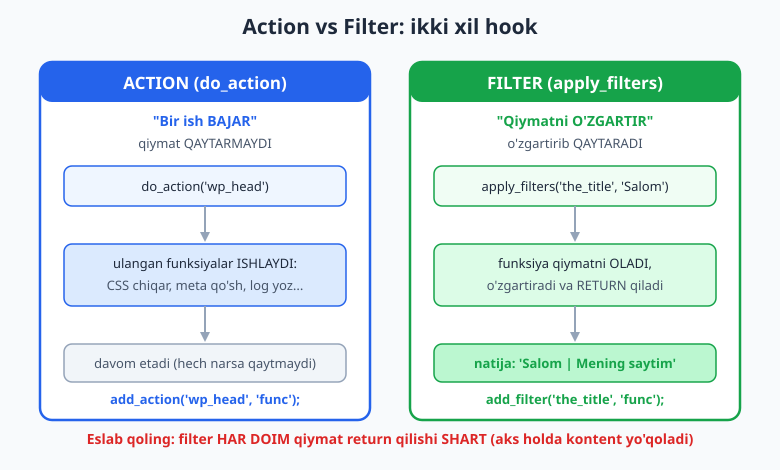
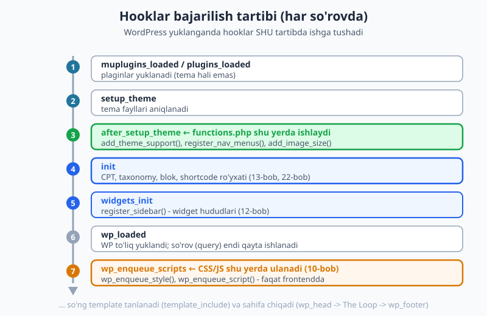
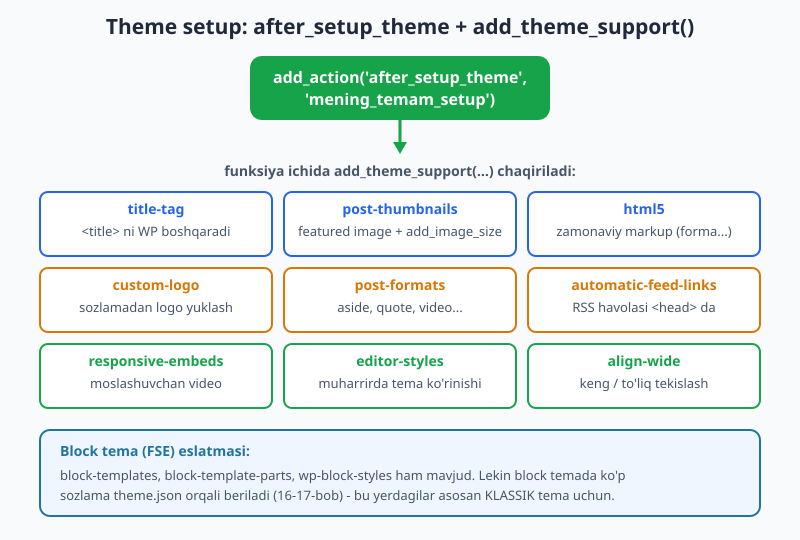

# 09 — functions.php, hooks va theme setup

[⬅️ Oldingi: 08 — header, footer, sidebar va get_template_part](./08-header-footer-sidebar.md) · [🏠 README](./README.md) · [Keyingi: 10 — Skript va uslublarni ulash (enqueue) ➡️](./10-asset-enqueue.md)

> **Bu bobda:** `functions.php` — temaning "miyasi". Bu bobda uning rolini, WordPress'ning eng kuchli mexanizmi — **hook tizimini** (action va filter farqi bilan) va `after_setup_theme` hookida `add_theme_support()` orqali tema imkoniyatlarini yoqishni o'rganamiz. Endi tema faqat HTML chiqarib qolmaydi, balki WordPress yadrosi bilan to'g'ridan-to'g'ri "gaplasha" boshlaydi.

---

## `functions.php` nima va nega kerak?

08-bobgacha biz faqat **ko'rinish** fayllarini yozdik: `index.php`, `header.php`, `single.php`. Ular HTML chiqaradi. Lekin temaning HTML'dan boshqa vazifalari ham bor: menyu joylarini ro'yxatdan o'tkazish, post rasmlarini yoqish, CSS/JS ulash, sayt xulqini sozlash. Bularning hammasi bitta faylda jam bo'ladi — `functions.php`.

`functions.php` — temaning **mantiq (logic)** qatlami. Agar `index.php` "nima ko'rinadi" bo'lsa, `functions.php` "nima ish bo'ladi".

Uning ikkita muhim xususiyati bor:

1. **Har bir so'rovda avtomatik yuklanadi.** Siz uni hech qayerdan `include` qilmaysiz — WordPress temani faollashtirgan har bir sahifa yuklanishida `functions.php` ni o'zi o'qiydi. Admin panel bo'lsin, frontend bo'lsin — har doim.
2. **Plagin'ga o'xshaydi, lekin temaga bog'langan.** `functions.php` dagi kod xuddi kichik plagin kabi ishlaydi. Farqi: tema o'zgarsa, bu kod ham yo'qoladi (plagin esa qoladi). Shuning uchun **sayt funksionalligi** (CPT, shortcode) odatda plaginga, **ko'rinishga oid sozlamalar** (theme support, menyu) `functions.php` ga yoziladi.

Hayotiy o'xshatish: `index.php` — uyning **ko'rinishi** (devor rangi, oyna). `functions.php` — uyning **elektr va suv tizimi**: ko'rinmaydi, lekin hammasini ishlatib turadi.

> PHP funksiya, massiv, anonim funksiya (closure) sintaksisini bu yerda qayta o'rgatmaymiz — kerak bo'lsa [PHP kitobiga](../php/README.md) qarang. Bu bob WordPress'ning **hook** mexanizmiga bag'ishlangan.

### Bo'sh joy va xavfsizlik qoidasi

`functions.php` — sof PHP fayl. U HTML chiqarmaydi, shuning uchun fayl **`<?php` bilan boshlanib, yopuvchi `?>` siz tugaydi** (08-bobdagi "bo'sh joy muammosi" — bu yerda ham amal qiladi: ortiqcha bo'sh joy "headers already sent" xatosini keltirib chiqaradi).

Ko'p professional temalar fayl boshida to'g'ridan-to'g'ri kirishni taqiqlaydi:

```php
<?php
if ( ! defined( 'ABSPATH' ) ) {
	exit; // Faylga to'g'ridan-to'g'ri (WordPress'siz) kirishni taqiqlaymiz.
}
```

`ABSPATH` — WordPress yuklanganda aniqlanadigan konstanta. Agar kimdir `functions.php` ni brauzerda to'g'ridan ochmoqchi bo'lsa, `ABSPATH` bo'lmaydi va skript darrov to'xtaydi. Bu — oddiy, ammo muhim xavfsizlik odati.

---

## Hook tizimi — WordPress'ning yuragi

Endi eng muhim tushunchaga keldik. **Hook** (ilgak) — bu WordPress'da kodingizni yadroga "ulash" usuli. WordPress yadrosini o'zgartirmasdan, uning ish jarayoniga aralashasiz.

Tasavvur qiling: WordPress sahifani yuklayotganda yo'l-yo'lakay yuzlab marta "to'xtab", atrofga qaraydi: "Kimdir shu nuqtaga bir narsa qo'shmoqchimi?". Mana shu "to'xtash nuqtalari" — hooklar. Siz o'z funksiyangizni shu nuqtaga **ulaysiz**, va WordPress o'sha nuqtaga yetganda sizning funksiyangizni chaqiradi.

Bu juda kuchli, chunki:

- Yadro kodini **hech qachon tahrirlamaysiz** (yangilanishda yo'qolmaydi).
- Plaginlar va temalar **bir-biriga xalaqit bermay** ishlaydi.
- Bir hookga **bir nechta funksiya** ulanishi mumkin.

WordPress'da hook **ikki xil** bo'ladi, va ularning farqini tushunish — bu bobning eng muhim sabog'i.

### Action va Filter — tub farq

| | **Action** | **Filter** |
|---|---|---|
| Vazifasi | Bir **ish bajar** | Bir **qiymatni o'zgartir** |
| Qiymat qaytaradimi? | **Yo'q** | **Ha — `return` SHART** |
| Ulash | `add_action()` | `add_filter()` |
| Chaqirish | `do_action()` | `apply_filters()` |
| Misol | "Sahifa boshiga reklama qo'sh" | "Sarlavhaga qo'shimcha so'z qo'sh" |

Eng oddiy tushuntirish:

- **Action** = "Buyruq beraman, sen biror ish qil. Natija menga kerak emas." Masalan: `wp_head` nuqtasida CSS chiqar, log yoz, email yubor.
- **Filter** = "Mana senga bir qiymat. Uni o'zgartir va menga **qaytar**." Masalan: post sarlavhasini ol, oxiriga so'z qo'sh, qaytar.

Eng ko'p uchraydigan boshlovchi xatosi: filter funksiyasida `return` ni unutish. Agar filter qiymat qaytarmasa, kontent **yo'qoladi** (`null` qaytadi). Action'da esa `return` umuman shart emas.



### Action misoli — `add_action`

```php
<?php
// Action: ish bajar (qiymat qaytarmaydi).
function mening_kodim() {
	echo '<p>Sayt boshi</p>';
}
add_action( 'wp_body_open', 'mening_kodim' );
```

Bu kod `<body>` ochilganda (`wp_body_open` hookida) `<p>Sayt boshi</p>` ni chiqaradi. Funksiya hech narsa qaytarmaydi — faqat **ish bajaradi** (`echo`).

`add_action( $hook_nomi, $funksiya )` — "shu hook ishga tushganda shu funksiyani chaqir" degani.

### Filter misoli — `add_filter`

```php
<?php
// Filter: qiymatni ol, o'zgartir, QAYTAR.
function sarlavhani_ozgartir( $title ) {
	return $title . ' | Mening saytim';
}
add_filter( 'the_title', 'sarlavhani_ozgartir' );
```

Bu kod har bir post sarlavhasiga ` | Mening saytim` qo'shadi. Funksiya:

1. Qiymatni **qabul qiladi** (`$title` — joriy sarlavha).
2. Uni **o'zgartiradi** (` | Mening saytim` qo'shadi).
3. Natijani **qaytaradi** (`return`).

Agar `return` ni unutsangiz, barcha sarlavhalar bo'sh chiqadi. Bu — filter'da eng muhim qoida.

### `do_action` va `apply_filters` — hookni o'zi yaratish

`add_action`/`add_filter` — mavjud hookga **ulanish**. `do_action`/`apply_filters` — hookni **yaratish** (uni "ishga tushirish"). WordPress yadrosi yuzlab `do_action`/`apply_filters` chaqiradi (`wp_head`, `the_title`...), siz esa ularga ulanasiz. Lekin temangizda **o'z hookingizni** ham yaratishingiz mumkin (bu bo'limning oxirida ko'ramiz).

Qisqacha: 

- `do_action('nom')` — "shu nomli action'ga ulangan hamma funksiyani hozir ishga tushir".
- `apply_filters('nom', $qiymat)` — "shu qiymatni hamma ulangan filterdan o'tkaz va natijani qaytar".

---

## Prioritet va argumentlar soni

`add_action` va `add_filter` ning to'liq imzosi:

```php
add_action( $hook, $funksiya, $priority, $accepted_args );
add_filter( $hook, $funksiya, $priority, $accepted_args );
```

Uchinchi va to'rtinchi argumentlar ixtiyoriy, lekin muhim.

### `$priority` — tartib (default 10)

Bir hookga bir nechta funksiya ulangan bo'lsa, ular **qaysi tartibda** ishlaydi? Buni **prioritet** belgilaydi:

- Prioritet — butun son. **Default qiymat: 10.**
- **Kichik raqam OLDIN** ishlaydi. `5` `10` dan oldin, `10` `20` dan oldin.
- Bir xil prioritetli funksiyalar ulanish tartibida ishlaydi.

```php
<?php
add_action( 'init', 'birinchi_ishla', 5 );   // 5 < 10 -> oldin
add_action( 'init', 'keyin_ishla' );          // default 10 -> keyin
```

Buni jonli WordPress 7.0'da tasdiqladik. Bitta hookga uchta funksiyani turli prioritet bilan ulab, `do_action` chaqirganimizda natija aniq shu tartibda bo'ldi:

```
1. priority-5
2. priority-10 (default)
3. priority-20
```

Demak kichik raqam — yuqori ustuvorlik (oldin). Buni eslab qolish oson: "1-o'rin — eng oldin".

> **Amaliy maslahat:** boshqa narsadan keyin ishlashga majbur bo'lsangiz (masalan, parent tema'ning kodidan keyin), prioritetni kattaroq (`20`, `99`) qiling. Hammasidan oldin kerak bo'lsa — kichikroq (`1`, `5`).

### `$accepted_args` — funksiyaga nechta argument

Default holda WordPress hook funksiyasiga **bitta** argument uzatadi (filter uchun — o'zgartiriladigan qiymat). Lekin ba'zi hooklar bir nechta argument beradi. Ularni olish uchun `$accepted_args` ni oshiramiz:

```php
<?php
function mazmunni_ozgartir( $content, $post_id ) {
	if ( get_post_type( $post_id ) === 'post' ) {
		$content .= '<p>Rahmat, o\'qiganingiz uchun!</p>';
	}
	return $content;
}
// 4-argument = accepted_args = 2 (content + post_id).
add_filter( 'the_content', 'mazmunni_ozgartir', 10, 2 );
```

Bu yerda `the_content` filter funksiyaga ikki qiymat beradi: kontent va post ID. Biz `accepted_args = 2` deb aytmasak, funksiya faqat `$content` ni oladi, `$post_id` esa `null` bo'ladi. Shuning uchun: **bir nechta argument kerak bo'lsa, `accepted_args` ni mos sonda bering.**

> Diqqat: `accepted_args` ni bersangiz, `priority` ni ham yozish shart (uchinchi argument). Shuning uchun `add_filter('the_content', 'fn', 10, 2)` — `10` ni o'tkazib yuborolmaysiz.

---

## Hookni olib tashlash — `remove_action` / `remove_filter`

Ba'zan yadro yoki parent tema qo'shgan narsani **o'chirmoqchi** bo'lasiz. Buning uchun:

```php
<?php
remove_action( 'wp_head', 'wp_generator' );   // WordPress versiyasini <head> dan yashir
remove_filter( 'the_content', 'wpautop' );     // avtomatik <p> qo'shishni o'chir
```

Eng muhim qoida: **`remove_*` da prioritet `add_*` dagiga MOS bo'lishi shart.** Agar narsa `add_action('wp_footer', 'fn', 20)` bilan qo'shilgan bo'lsa, uni o'chirish uchun ham `20` ni berishingiz kerak:

```php
<?php
// add'da prioritet 20 ishlatilgan bo'lsa:
remove_action( 'wp_footer', 'fn', 20 );   // TO'G'RI
// remove_action( 'wp_footer', 'fn' );    // XATO: default 10 -> topa olmaydi
```

Bu — juda ko'p uchraydigan "nega o'chmayapti?" muammosining sababi. Prioritet mos kelmasa, `remove_*` indamay ishlamaydi (xato ham bermaydi).

---

## Hooklar qaysi tartibda ishga tushadi?

`functions.php` shunchaki "yuqoridan pastga" ishlamaydi. U faqat **hooklarni ro'yxatdan o'tkazadi** (`add_action`/`add_filter`). Funksiyalarning o'zi keyinroq — WordPress mos hookga yetganda — ishga tushadi. Shuning uchun **qaysi hook qachon ishlashini** bilish zarur.

Mana har bir so'rovda ishga tushadigan asosiy hooklar tartibi (jonli WP 7.0'da `did_action()` bilan tekshirilgan):



Eng muhim uchtasi:

| Hook | Qachon | Nima qilamiz |
|------|--------|--------------|
| `after_setup_theme` | Tema yuklangach, eng erta | **theme support, menyu, image size** (quyida) |
| `init` | WP yadrosi tayyor bo'lganda | CPT, taxonomy, shortcode, blok (13, 22-bob) |
| `widgets_init` | Widget tizimi tayyor bo'lganda | `register_sidebar()` — widget hududlari (12-bob) |
| `wp_enqueue_scripts` | Frontend chizilayotganda | `wp_enqueue_style/script` — CSS/JS (10-bob) |

**Nega tartib muhim?** Masalan, `add_theme_support('title-tag')` ni `after_setup_theme` da chaqirish kerak. Agar kechroq (masalan `wp_loaded` dan keyin) chaqirsangiz, WordPress `_doing_it_wrong()` ogohlantirishini beradi — chunki `<title>` allaqachon hisoblanib bo'lgan. Buni biz jonli WP 7.0'da tasdiqladik: yadro fayli `wp-includes/theme.php` da to'g'ridan-to'g'ri yozilgan — *"`title-tag` ni `functions.php` da chaqirsa bo'ladi, ammo `wp_loaded` hookidan oldin"*.

Shuning uchun tema sozlamalarini doim to'g'ri hookga joylaymiz, "shunchaki `functions.php` ga" emas.

---

## `after_setup_theme` da `add_theme_support()`

Endi eng amaliy qismga keldik. Tema "men shu imkoniyatlarni qo'llab-quvvatlayman" deb WordPress'ga aytishi kerak. Buni `add_theme_support()` bilan, `after_setup_theme` hookida qilamiz.



Mana to'liq, ishlaydigan setup funksiyasi. Quyidagi kodning hammasini `php -l` bilan tekshirdik, va har bir `add_theme_support()` xususiyat nomini jonli WP 7.0'da `current_theme_supports()` bilan tasdiqladik (Twenty Twenty-Five va yadro `register_theme_feature` ro'yxatiga mos):

```php
<?php
function mening_temam_setup() {
	// 1. <title> tegini WordPress o'zi boshqarsin (header.php da <title> yozmaymiz).
	add_theme_support( 'title-tag' );

	// 2. Post rasmlari (featured image) + maxsus o'lchamlar.
	add_theme_support( 'post-thumbnails' );
	add_image_size( 'blog-katta', 1200, 600, true );  // true = qirqib moslash (crop)
	add_image_size( 'blog-kichik', 400, 300, true );

	// 3. Zamonaviy HTML5 markup (eski XHTML o'rniga).
	add_theme_support(
		'html5',
		array( 'search-form', 'comment-form', 'comment-list', 'gallery', 'caption', 'style', 'script' )
	);

	// 4. Maxsus logo (Sozlamalar > Customizer dan yuklanadi).
	add_theme_support(
		'custom-logo',
		array(
			'height'      => 100,
			'width'       => 400,
			'flex-height' => true,
			'flex-width'  => true,
		)
	);

	// 5. Post formatlari (aside, quote, video...).
	add_theme_support(
		'post-formats',
		array( 'aside', 'gallery', 'link', 'image', 'quote', 'video' )
	);

	// 6. RSS lentalariga avtomatik <head> havolasi.
	add_theme_support( 'automatic-feed-links' );

	// 7. Moslashuvchan (responsive) video/embed.
	add_theme_support( 'responsive-embeds' );

	// 8. Blok muharririda tema uslublari ko'rinsin.
	add_theme_support( 'editor-styles' );

	// 9. Keng (wide) va to'liq (full) tekislashga ruxsat.
	add_theme_support( 'align-wide' );

	// 10. Navigatsiya menyu joylari (11-bob).
	register_nav_menus(
		array(
			'primary' => __( 'Asosiy menyu', 'mening-temam' ),
			'footer'  => __( 'Footer menyu', 'mening-temam' ),
		)
	);
}
add_action( 'after_setup_theme', 'mening_temam_setup' );
```

Har bir muhim qatorni ko'rib chiqamiz.

### `add_theme_support('title-tag')`

Bu — 08-bobda va'da qilingan qator. Uni yozsangiz, WordPress `<title>` tegini `wp_head()` orqali **o'zi chiqaradi** (sayt nomi, sahifa nomi, sahifalash bilan to'g'ri formatda). Shuning uchun `header.php` da `<title>...</title>` ni **qo'lda yozmaysiz** — bu eskirgan usul. Buni `after_setup_theme` da yozish majburiy (yuqorida tushuntirilgan timing sababi).

### `add_theme_support('post-thumbnails')` + `add_image_size()`

`post-thumbnails` — postga "featured image" (asosiy rasm) qo'yish imkoniyatini yoqadi. Bu yoqilgach, post tahrirlash sahifasida "Featured image" paneli paydo bo'ladi, va shablonda `the_post_thumbnail()` ishlaydi (06-bobdan).

`add_image_size( $nom, $kenglik, $balandlik, $crop )` — temaga maxsus rasm o'lchami qo'shadi. WordPress rasm yuklanganda avtomatik shu o'lchamda nusxa yaratadi:

- `$crop = true` — rasmni aniq o'lchamga **qirqib** moslaydi (proporsiyani buzib bo'lsa ham).
- `$crop = false` — proporsiyani saqlab **kichraytiradi** (o'lcham taxminiy bo'ladi).

Jonli WP 7.0'da tasdiqladik: `add_image_size('blog-katta', 1200, 600, true)` dan keyin `get_intermediate_image_sizes()` ro'yxatida `blog-katta` paydo bo'ldi. Shablonda uni shunday ishlatasiz: `the_post_thumbnail('blog-katta')`.

### `add_theme_support('html5', array(...))`

Bu WordPress'ga zamonaviy, semantik HTML5 markup ishlatishni aytadi — qidiruv formasi, izoh formasi, gallereya va boshqalar uchun. Bu massiv argumentini **majburiy** talab qiladi (qaysi elementlar uchun). Eski temalarda bu yo'q edi va WordPress eskicha (XHTML) markup chiqarardi — buni yoqish best-practice.

### `add_theme_support('custom-logo', array(...))`

Foydalanuvchi admin paneldan logo yuklashi mumkin bo'ladi. `array` ichida tavsiya etilgan o'lcham va moslashuvchanlik beriladi. Shablonda `the_custom_logo()` bilan chiqaradi. Twenty Twenty-Five ham aynan shu strukturani ishlatadi.

### Boshqalar

- `post-formats` — post turini belgilash (eslatma, iqtibos, video...). Massiv ichida qaysi formatlarni qo'llashni aytasiz.
- `automatic-feed-links` — RSS lenta havolalarini `<head>` ga avtomatik qo'shadi (`wp_head()` orqali).
- `responsive-embeds` — YouTube va boshqa embed'larni konteynerga moslashtiradi.
- `editor-styles` — blok muharririda saytning haqiqiy ko'rinishini ko'rsatadi.
- `align-wide` — bloklarga "keng" va "to'liq kenglik" tekislash imkonini beradi.

> **Block tema eslatmasi:** `block-templates`, `block-template-parts`, `wp-block-styles` kabi xususiyatlar ham mavjud, lekin zamonaviy **block temada** (15-bobdan boshlab) ko'p sozlama `add_theme_support` o'rniga **`theme.json`** orqali beriladi. Yuqoridagi misol asosan **klassik tema** uchun. Block temada `functions.php` ixtiyoriy (15-bob).

---

## Boshqa muhim hooklar

`after_setup_theme` dan tashqari `functions.php` da tez-tez ishlatadigan hooklar:

### `widgets_init` — widget hududlari

```php
<?php
function mening_temam_widgets() {
	register_sidebar(
		array(
			'name'          => __( 'Asosiy sidebar', 'mening-temam' ),
			'id'            => 'sidebar-1',
			'before_widget' => '<section class="widget">',
			'after_widget'  => '</section>',
			'before_title'  => '<h3 class="widget-sarlavha">',
			'after_title'   => '</h3>',
		)
	);
}
add_action( 'widgets_init', 'mening_temam_widgets' );
```

Bu `sidebar.php` (08-bob) da ishlatilgan `'sidebar-1'` ID'sini yaratadi. Batafsil 12-bobda.

### `wp_enqueue_scripts` — CSS/JS ulash

Bu hook — keyingi (10-) bobning asosi. CSS va JS fayllarni `<head>` yoki footer'da to'g'ri ulash uchun ishlatiladi. Hozircha shaklini bilib qo'ying:

```php
<?php
function mening_temam_assetlar() {
	wp_enqueue_style( 'asosiy-style', get_stylesheet_uri() );
}
add_action( 'wp_enqueue_scripts', 'mening_temam_assetlar' );
```

> **Anti-misol — bunday QILMANG:** `functions.php` da to'g'ridan `<link>` yoki `<script>` chiqarish noto'g'ri. Buni 10-bobda batafsil ko'ramiz, lekin qoidani hoziroq eslang: assetlar **doim** `wp_enqueue_scripts` hookida `wp_enqueue_*` orqali ulanadi.

---

## Filter bilan sayt xulqini sozlash

Action'lar bilan ish bajardik, endi filter'larning amaliy kuchini ko'ramiz. Filter'lar — temani "moslamasdan moslash"ning eng nozik yo'li.

### Excerpt (qisqacha matn) ni sozlash

WordPress'ning standart "qisqacha matn" oxiriga `[...]` qo'yadi va 55 so'z chiqaradi. Buni filter bilan o'zgartiramiz:

```php
<?php
// Excerpt oxiridagi belgini o'zgartiramiz.
function mening_temam_excerpt_more( $more ) {
	return ' ...';
}
add_filter( 'excerpt_more', 'mening_temam_excerpt_more' );

// Excerpt uzunligini (so'z soni) o'zgartiramiz.
function mening_temam_excerpt_length( $length ) {
	return 25;
}
add_filter( 'excerpt_length', 'mening_temam_excerpt_length' );
```

E'tibor bering: ikkalasi ham `return` qiladi (filter qoidasi). `excerpt_more` matn qaytaradi, `excerpt_length` esa son.

### `body_class` ga klass qo'shish

08-bobda `body_class()` ni ko'rdik. Unga o'z klassingizni qo'shish uchun `body_class` filtridan foydalanamiz (massivni o'zgartirib qaytaramiz):

```php
<?php
function mening_temam_body_class( $classes ) {
	if ( is_singular() ) {
		$classes[] = 'bitta-yozuv';
	}
	return $classes;
}
add_filter( 'body_class', 'mening_temam_body_class' );
```

Bu filter `$classes` massivini oladi, yangi element qo'shadi va **massivni qaytaradi**. `body_class()` keyin shu massivdagi hamma klassni `<body>` ga yozadi.

---

## O'z hookingizni yaratish (custom hook)

Eng kuchli xususiyat: temangizda **o'z hookingizni** yaratishingiz mumkin. Bu temani **kengaytiriladigan** qiladi — child tema yoki plagin sizning aniq belgilagan "nuqta"laringizga ulanadi.

### Custom action

Masalan, footer'dan oldin "kengaytirish nuqtasi" qo'yamiz. `footer.php` ichida:

```php
<?php do_action( 'mening_temam_footer_oldin' ); ?>
```

Endi siz (yoki boshqa kishi) shu nuqtaga `functions.php` dan ulanadi:

```php
<?php
function reklama_chiqar() {
	echo '<div class="reklama">Reklama shu yerda</div>';
}
add_action( 'mening_temam_footer_oldin', 'reklama_chiqar' );
```

`footer.php` o'zgarmaydi — lekin uning xatti-harakatini tashqaridan kengaytirdik. Bu — professional temalarning belgisi.

### Custom filter

Xuddi shunday, qiymatni o'zgartiriladigan qilish uchun `apply_filters` ishlatamiz. Masalan, copyright matni:

```php
<?php
function mening_temam_copyright() {
	$matn = sprintf( '&copy; %s Mening saytim', date_i18n( 'Y' ) );
	// Boshqalar shu matnni o'zgartira olsin:
	$matn = apply_filters( 'mening_temam_copyright_matni', $matn );
	echo wp_kses_post( $matn );
}
```

Endi child tema copyright matnini butunlay o'zgartira oladi:

```php
<?php
add_filter( 'mening_temam_copyright_matni', function ( $matn ) {
	return $matn . '. Barcha huquqlar himoyalangan.';
} );
```

Diqqat: `apply_filters` ning ikkinchi argumenti — **default qiymat**. Hech kim ulanmagan bo'lsa, o'sha qiymat o'zgarishsiz qaytadi. Bu — `do_action` dan asosiy farqi: filter har doim qiymat qaytaradi.

---

## Tez-tez uchraydigan xatolar

1. **Filter'da `return` ni unutish.** Eng ko'p uchraydigan xato. Filter qiymat qaytarmasa, kontent `null` bo'lib **yo'qoladi**. Action'da `return` shart emas, filter'da — majburiy.
2. **Action o'rniga filter (yoki teskari) ishlatish.** `the_title` — filter (qiymat o'zgartiriladi), `wp_head` — action (ish bajariladi). Noto'g'ri funksiyani ishlatsangiz, kod ishlamaydi.
3. **`accepted_args` ni unutish.** Bir nechta argument kerak bo'lganda `add_filter('hook','fn',10,2)` yozmasangiz, ikkinchi argument `null` keladi.
4. **`remove_*` da prioritet mos kelmasligi.** `add` da `20` ishlatilgan bo'lsa, `remove` da ham `20` bering — aks holda indamay ishlamaydi.
5. **`add_theme_support` ni noto'g'ri hookda.** `title-tag` ni `after_setup_theme` da yozing, `wp_loaded` dan keyin emas — aks holda `_doing_it_wrong` ogohlantirishi chiqadi.
6. **Xususiyat nomini ixtiro qilish.** `add_theme_support('post-images')` degan narsa yo'q — to'g'risi `post-thumbnails`. Faqat haqiqiy nomlarni ishlating (yuqoridagi ro'yxat va Twenty Twenty-Five reference).
7. **`functions.php` da `?>` dan keyin bo'sh joy.** "headers already sent" xatosini keltiradi. Yopuvchi `?>` ni umuman yozmang.

---

## Mashqlar

### Oson

1. **Minimal theme setup yozing.** `after_setup_theme` hookiga ulangan funksiya yarating: `title-tag`, `post-thumbnails` va `html5` (massiv bilan) qo'llab-quvvatlansin. `php -l` dan o'tsin.
2. **Bitta action ulang.** `wp_body_open` hookiga ulangan funksiya yozing — u `<p class="ogohlantirish">Demo sayt</p>` chiqarsin.
3. **Bitta filter ulang.** `the_title` filtriga ulangan funksiya yozing — har bir sarlavha oxiriga ` ✓` qo'shsin. `return` ni unutmang.
4. **Action mi, filter mi?** Quyidagilarning har biri uchun ayting: `wp_head`, `the_content`, `wp_footer`, `excerpt_length`, `body_class`, `init`.

### O'rta

5. **Excerpt'ni sozlang.** Ikki filter yozing: `excerpt_length` ni 20 so'zga, `excerpt_more` ni ` [davomi]` ga o'zgartirsin.
6. **`add_image_size` qo'shing.** Setup funksiyasiga `post-thumbnails` yoqing va `blog-thumb` (600x400, crop) o'lchamini qo'shing. Shablonda uni qanday chaqirishni izohda yozing.
7. **`body_class` filtri yozing.** Bosh sahifada `<body>` ga `bosh-sahifa`, bitta postda `bitta-yozuv` klassini qo'shadigan filter yozing (`is_front_page()`, `is_singular()` bilan).
8. **`accepted_args` ishlating.** `the_content` filtriga ulangan funksiya yozing — u faqat `post` turidagi postlar oxiriga matn qo'shsin (`$post_id` argumentini ishlating, `accepted_args = 2`).

### Qiyin

9. **Prioritet xatosini tuzating.** Quyidagi kod `wp_footer` dagi funksiyani o'chirmoqchi, lekin ishlamayapti. Sababini toping va tuzating:
   ```php
   add_action( 'wp_footer', 'mening_skriptim', 20 );
   remove_action( 'wp_footer', 'mening_skriptim' );
   ```
10. **Custom action hook yarating.** `single.php` da post oxiriga `do_action('mening_temam_post_oxiri', get_the_ID())` qo'ying. `functions.php` da unga ulanib, ulashish (share) havolasi chiqaradigan funksiya yozing (`accepted_args = 1`, post ID ni ishlating). Chiqishni `esc_url()` bilan escape qiling.
11. **Custom filter hook yarating.** Footer copyright matnini `apply_filters('mening_temam_copyright_matni', $matn)` orqali o'zgartiriladigan qiling, va keyin filter bilan unga qo'shimcha jumla qo'shing.
12. **To'liq `functions.php` yozing.** Bitta faylda: `ABSPATH` tekshiruvi, `after_setup_theme` da to'liq setup (`title-tag`, `post-thumbnails` + `add_image_size`, `html5`, `custom-logo`, `automatic-feed-links`, `responsive-embeds`, `register_nav_menus`), `widgets_init` da `register_sidebar`, va kamida bitta filter (`excerpt_length`). `php -l` dan o'tsin.

---

## Yechimlar

<details markdown="1">
<summary>Yechim — 1</summary>

```php
<?php
function minimal_setup() {
	add_theme_support( 'title-tag' );
	add_theme_support( 'post-thumbnails' );
	add_theme_support(
		'html5',
		array( 'search-form', 'comment-form', 'comment-list', 'gallery', 'caption', 'style', 'script' )
	);
}
add_action( 'after_setup_theme', 'minimal_setup' );
```

Uchala xususiyat ham `after_setup_theme` hookida yoqilgan — to'g'ri timing. `html5` massiv argumentini talab qiladi.

</details>

<details markdown="1">
<summary>Yechim — 2</summary>

```php
<?php
function demo_ogohlantirish() {
	echo '<p class="ogohlantirish">Demo sayt</p>';
}
add_action( 'wp_body_open', 'demo_ogohlantirish' );
```

Bu — **action**: funksiya `echo` bilan ish bajaradi, hech narsa qaytarmaydi. `wp_body_open` `<body>` darrov ortidan ishga tushadi (08-bob).

</details>

<details markdown="1">
<summary>Yechim — 3</summary>

```php
<?php
function sarlavhaga_belgi( $title ) {
	return $title . ' &#10003;';
}
add_filter( 'the_title', 'sarlavhaga_belgi' );
```

Bu — **filter**: `$title` ni oladi, o'zgartiradi va **`return`** qiladi. `return` bo'lmasa, hamma sarlavha bo'sh chiqardi. (`&#10003;` — HTML belgisi, ✓.)

</details>

<details markdown="1">
<summary>Yechim — 4</summary>

| Hook | Turi | Nega |
|------|------|------|
| `wp_head` | **action** | `<head>` ga narsa qo'shadi (ish bajaradi) |
| `the_content` | **filter** | kontent qiymatini o'zgartiradi |
| `wp_footer` | **action** | footer'ga narsa qo'shadi |
| `excerpt_length` | **filter** | son qiymatini qaytaradi |
| `body_class` | **filter** | klasslar massivini o'zgartiradi |
| `init` | **action** | yadro tayyor bo'lganda ish bajaradi |

Qoida: qiymat o'zgartirib **qaytariladimi** — filter. Faqat ish bajariladimi — action.

</details>

<details markdown="1">
<summary>Yechim — 5</summary>

```php
<?php
function mening_temam_excerpt_length( $length ) {
	return 20;
}
add_filter( 'excerpt_length', 'mening_temam_excerpt_length', 999 );

function mening_temam_excerpt_more( $more ) {
	return ' [davomi]';
}
add_filter( 'excerpt_more', 'mening_temam_excerpt_more' );
```

`excerpt_length` da `999` prioriteti — bizning qiymatimiz boshqa plaginlardan **keyin** ishlashini (g'olib bo'lishini) kafolatlaydi. Ikkala funksiya ham `return` qiladi.

</details>

<details markdown="1">
<summary>Yechim — 6</summary>

```php
<?php
function setup_rasm() {
	add_theme_support( 'post-thumbnails' );
	add_image_size( 'blog-thumb', 600, 400, true );
}
add_action( 'after_setup_theme', 'setup_rasm' );
```

Shablonda chaqirish: `the_post_thumbnail( 'blog-thumb' );` — WordPress 600x400 qirqilgan nusxani chiqaradi. `true` (crop) — rasmni aniq o'lchamga qirqib moslaydi. `post-thumbnails` yoqilmasa, `add_image_size` ishlamaydi.

</details>

<details markdown="1">
<summary>Yechim — 7</summary>

```php
<?php
function mening_temam_body_class( $classes ) {
	if ( is_front_page() ) {
		$classes[] = 'bosh-sahifa';
	}
	if ( is_singular() ) {
		$classes[] = 'bitta-yozuv';
	}
	return $classes;
}
add_filter( 'body_class', 'mening_temam_body_class' );
```

Filter `$classes` massivini oladi, shart bo'yicha element qo'shadi va **massivni qaytaradi**. Shartli teglar (`is_front_page`, `is_singular`) 06-bobdan.

</details>

<details markdown="1">
<summary>Yechim — 8</summary>

```php
<?php
function mazmunni_ozgartir( $content, $post_id ) {
	if ( get_post_type( $post_id ) === 'post' ) {
		$content .= '<p class="rahmat">Rahmat, o\'qiganingiz uchun!</p>';
	}
	return $content;
}
add_filter( 'the_content', 'mazmunni_ozgartir', 10, 2 );
```

To'rtinchi argument `2` (accepted_args) — funksiyaga `$post_id` ham uzatilishini ta'minlaydi. Usiz `$post_id` `null` bo'lardi. `get_post_type()` bilan faqat oddiy postlarni filtrlaymiz. `return $content` — majburiy.

</details>

<details markdown="1">
<summary>Yechim — 9</summary>

**Muammo:** `add_action` da prioritet `20`, lekin `remove_action` da prioritet ko'rsatilmagan (default `10`). WordPress `10`-prioritetda bu funksiyani topa olmaydi, shuning uchun hech narsa o'chmaydi.

**Tuzatilgan:**

```php
<?php
add_action( 'wp_footer', 'mening_skriptim', 20 );
function mening_skriptim() {}

// remove'da prioritet add bilan MOS bo'lishi shart:
remove_action( 'wp_footer', 'mening_skriptim', 20 );
```

Qoida: `remove_*` ning prioriteti `add_*` dagi bilan bir xil bo'lishi shart. Mos kelmasa, indamay ishlamaydi (xato ham bermaydi) — shu sabab "topish qiyin" xatolardan biri.

</details>

<details markdown="1">
<summary>Yechim — 10</summary>

`single.php` ichida (post oxirida):

```php
<?php do_action( 'mening_temam_post_oxiri', get_the_ID() ); ?>
```

`functions.php` da:

```php
<?php
function ulashish_tugmalari( $post_id ) {
	$url = get_permalink( $post_id );
	printf(
		'<div class="ulashish"><a href="https://t.me/share/url?url=%s">Telegram</a></div>',
		esc_url( $url )
	);
}
add_action( 'mening_temam_post_oxiri', 'ulashish_tugmalari', 10, 1 );
```

`do_action` ikkinchi argument sifatida post ID ni uzatadi; ulangan funksiya uni `$post_id` orqali oladi (`accepted_args = 1`). `esc_url()` — URL ni xavfsiz chiqarish (27-bob). Bu — temani kengaytiriladigan qiladigan custom action.

</details>

<details markdown="1">
<summary>Yechim — 11</summary>

`functions.php` da copyright funksiyasi (footer'da chaqiriladi):

```php
<?php
function mening_temam_copyright() {
	$matn = sprintf( '&copy; %s Mening saytim', date_i18n( 'Y' ) );
	$matn = apply_filters( 'mening_temam_copyright_matni', $matn );
	echo wp_kses_post( $matn );
}
```

Filter bilan o'zgartirish (masalan child tema'da):

```php
<?php
add_filter( 'mening_temam_copyright_matni', function ( $matn ) {
	return $matn . '. Barcha huquqlar himoyalangan.';
} );
```

`apply_filters` ning ikkinchi argumenti (`$matn`) — default qiymat. Hech kim ulanmasa, o'zgarishsiz qaytadi. Bu — copyright matnini fayl tahrirlamasdan o'zgartirish imkonini beradi.

</details>

<details markdown="1">
<summary>Yechim — 12</summary>

To'liq `functions.php` (`php -l` dan o'tadi):

```php
<?php
/**
 * Mening blog temam funksiyalari.
 *
 * @package Mening_Temam
 */

if ( ! defined( 'ABSPATH' ) ) {
	exit;
}

function mening_temam_setup() {
	add_theme_support( 'title-tag' );

	add_theme_support( 'post-thumbnails' );
	add_image_size( 'blog-katta', 1200, 600, true );

	add_theme_support(
		'html5',
		array( 'search-form', 'comment-form', 'comment-list', 'gallery', 'caption', 'style', 'script' )
	);

	add_theme_support(
		'custom-logo',
		array(
			'height'      => 100,
			'width'       => 400,
			'flex-height' => true,
			'flex-width'  => true,
		)
	);

	add_theme_support( 'automatic-feed-links' );
	add_theme_support( 'responsive-embeds' );

	register_nav_menus(
		array(
			'primary' => __( 'Asosiy menyu', 'mening-temam' ),
			'footer'  => __( 'Footer menyu', 'mening-temam' ),
		)
	);
}
add_action( 'after_setup_theme', 'mening_temam_setup' );

function mening_temam_widgets() {
	register_sidebar(
		array(
			'name'          => __( 'Asosiy sidebar', 'mening-temam' ),
			'id'            => 'sidebar-1',
			'before_widget' => '<section class="widget">',
			'after_widget'  => '</section>',
			'before_title'  => '<h3 class="widget-sarlavha">',
			'after_title'   => '</h3>',
		)
	);
}
add_action( 'widgets_init', 'mening_temam_widgets' );

function mening_temam_excerpt_length( $length ) {
	return 25;
}
add_filter( 'excerpt_length', 'mening_temam_excerpt_length' );
```

E'tibor bering: `ABSPATH` tekshiruvi yuqorida, har bir ro'yxatdan o'tkazish **o'z hookida** (`after_setup_theme` — theme support va menyu; `widgets_init` — sidebar), va filter (`excerpt_length`) `return` qiladi. Bu — professional `functions.php` ning asosiy skeleti. Bu kod jonli WP 7.0'da `php -l` va xususiyat nomlari `current_theme_supports()` bilan tasdiqlangan.

</details>

---

[⬅️ Oldingi: 08 — header, footer, sidebar va get_template_part](./08-header-footer-sidebar.md) · [🏠 README](./README.md) · [Keyingi: 10 — Skript va uslublarni ulash (enqueue) ➡️](./10-asset-enqueue.md)
