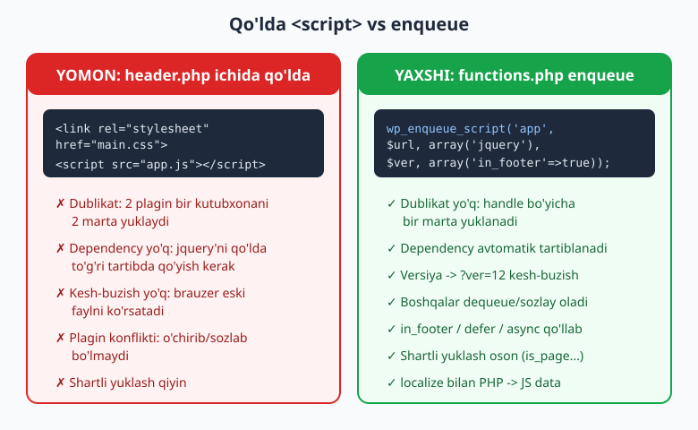
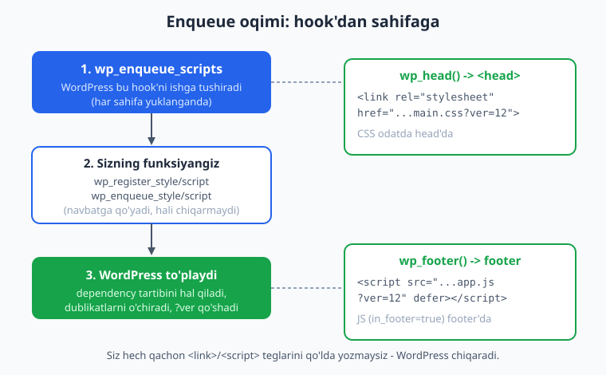
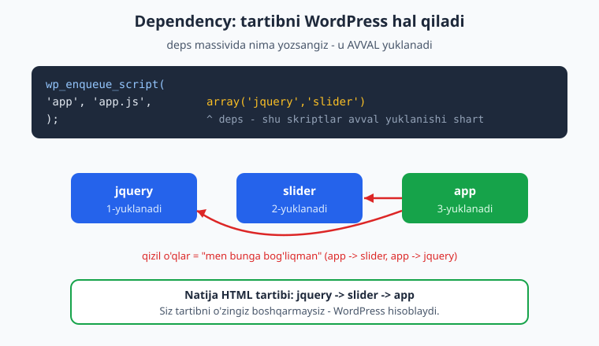

# 10 — Skript va uslublarni ulash (enqueue)

[⬅️ Oldingi: 09 — functions.php, hooks va theme setup](./09-functions-php-hooks.md) · [🏠 README](./README.md) · [Keyingi: 11 — Navigatsiya menyulari (Walker) ➡️](./11-menyular.md)

> **Bu bobda:** Temaga CSS va JavaScript qo'shishning yagona to'g'ri usulini o'rganamiz — `wp_enqueue_style()` va `wp_enqueue_script()`. Nega `header.php` ga qo'lda `<link>`/`<script>` yozish jiddiy xato ekanini, dependency (bog'liqlik), versiya (kesh-buzish), footer'da yuklash va `defer`/`async` strategiyalarini ko'ramiz. Yakunida PHP'dan JavaScript'ga ma'lumot uzatish (`wp_localize_script`) va faqat kerakli sahifada yuklash (shartli enqueue) usullarini o'rganamiz.

---

## Nega `header.php` ga qo'lda yozish YOMON?

Yangi boshlovchi birinchi o'ylaydigan narsa — CSS va JS qo'shish uchun shunchaki `header.php` ga teg yozish:

```html
<!-- ❌ header.php ichida - bunday QILMANG -->
<link rel="stylesheet" href="<?php echo get_template_directory_uri(); ?>/assets/css/main.css">
<script src="<?php echo get_template_directory_uri(); ?>/assets/js/app.js"></script>
```

Bu "ishlaydigandek" ko'rinadi — sayt ochilganda CSS va JS yuklanadi. Lekin bu yondashuv WordPress ekotizimini buzadi. Mana to'rt jiddiy muammo:

1. **Dublikat (takror yuklash).** Aytaylik, siz jQuery'ni qo'lda qo'shdingiz. Endi biror plagin ham jQuery'ni yuklaydi. Natijada bitta kutubxona **ikki marta** yuklanadi — sahifa sekinlashadi va ko'pincha JavaScript xatolari chiqadi (ikki nusxa bir-biriga xalal beradi).

2. **Dependency (bog'liqlik) yo'q.** `app.js` jQuery'ga bog'liq bo'lsa, jQuery'ni `app.js` dan **oldin** yuklashingiz kerak. Qo'lda yozsangiz, bu tartibni o'zingiz kuzatib turishingiz shart. Bitta faylni yuqoriga/pastga ko'chirsangiz — hammasi buziladi.

3. **Plagin va boshqa kod bilan konflikt.** WordPress'da CSS/JS'ni boshqarishning markaziy tizimi bor. Qo'lda yozilgan teglar bu tizimdan **tashqarida** turadi: boshqa kod uni o'chira (`wp_dequeue_script`), sozlay yoki almashtira olmaydi. Caching plaginlari uni minify/birlashtira olmaydi.

4. **Kesh-buzish (cache-busting) yo'q.** Foydalanuvchi brauzeri CSS faylni keshlaydi. Siz faylni yangiladingiz, lekin brauzer eski nusxani ko'rsatadi — chunki URL o'zgarmadi. Enqueue tizimi har faylga `?ver=...` qo'shib bu muammoni hal qiladi.



Yechim: WordPress'ga **"menda shu fayl bor, uni navbatga qo'y"** deb aytamiz — qachon va qanday chiqarishni WordPress o'zi hal qiladi. Bu jarayon **enqueue** (navbatga qo'yish) deyiladi.

Hayotiy o'xshatish: restoranda oshpazga to'g'ridan-to'g'ri pechkaga kirib ovqat pishirmaysiz. Buyurtmani **ofitsiantga** berasiz, u oshxona tartibini biladi — qaysi taom avval, qaysi keyin tayyorlanishini. Enqueue — sizning "ofitsiantingiz".

---

## `wp_enqueue_style()` va `wp_enqueue_script()`

CSS uchun `wp_enqueue_style()`, JavaScript uchun `wp_enqueue_script()` ishlatiladi. Eng muhim qoida: **bu funksiyalarni `wp_enqueue_scripts` hook'i ichida chaqiring** (hook tizimini 09-bobda ko'rgandik).

> Diqqat: hook nomi `wp_enqueue_scripts` — oxirida `s` bilan, **ko'plik**. Funksiyalar esa birlik: `wp_enqueue_script`. Bu eng ko'p adashtiradigan nuqta. Hook = frontend (sayt) uchun. Admin uchun `admin_enqueue_scripts`, block editor uchun `enqueue_block_editor_assets` (pastda ko'ramiz).

Mana eng oddiy, to'liq misol (`php -l` bilan tekshirilgan, barcha funksiyalar jonli WordPress 7.0 da mavjudligi tasdiqlangan):

```php
<?php
function ch10_assetlarni_ulash() {
	// Temaning asosiy CSS fayli (style.css).
	wp_enqueue_style(
		'ch10-asosiy',
		get_stylesheet_uri(),
		array(),
		wp_get_theme()->get( 'Version' )
	);

	// JavaScript fayl - footer'da, defer bilan.
	wp_enqueue_script(
		'ch10-app',
		get_theme_file_uri( 'assets/js/app.js' ),
		array(),
		'1.0.0',
		array(
			'in_footer' => true,
			'strategy'  => 'defer',
		)
	);
}
add_action( 'wp_enqueue_scripts', 'ch10_assetlarni_ulash' );
```

Bu funksiyani `wp_enqueue_scripts` hook'iga ulaymiz. WordPress har sahifa yuklanganda uni chaqiradi, sizning fayllaringizni navbatga qo'yadi, so'ng `wp_head()` (CSS) va `wp_footer()` (JS) orqali HTML'ga chiqaradi — esda tutsangiz, 08-bobda bu ikki funksiya nega majburiy ekanini ko'rgandik. **Mana ularning bir vazifasi.**



### Argumentlarni tushunamiz

`wp_enqueue_script()` ning jonli WordPress 7.0 dagi haqiqiy imzosi (Reflection bilan tasdiqlangan):

```
wp_enqueue_script( $handle, $src = '', $deps = array(), $ver = false, $args = array() )
```

`wp_enqueue_style()` ning imzosi:

```
wp_enqueue_style( $handle, $src = '', $deps = array(), $ver = false, $media = 'all' )
```

Har bir argument:

| Argument | Nima | Misol |
|----------|------|-------|
| `$handle` | Noyob nom (ID). Boshqa kod shu nom bilan murojaat qiladi. | `'ch10-app'` |
| `$src` | Fayl URL'i (yo'l emas, URL). | `get_theme_file_uri('assets/js/app.js')` |
| `$deps` | Bog'liqliklar massivi — shu handle'lar AVVAL yuklanadi. | `array('jquery')` |
| `$ver` | Versiya — `?ver=...` ga aylanadi (kesh-buzish). | `'1.0.0'` yoki `filemtime(...)` |
| `$args` (script) | Massiv: `in_footer`, `strategy`. | `array('in_footer'=>true)` |
| `$media` (style) | CSS media: `'all'`, `'print'`, `'screen'`. | `'all'` |

> **`$handle` — noyob bo'lsin.** Handle butun saytda yagona bo'lishi kerak (sizning tema, plaginlar, yadro — hammasi bitta ro'yxatda). Shuning uchun temangiz slug'ini prefiks qiling: `mavzu-app`, `mavzu-slider`. Oddiy `app` yoki `main` — konflikt manbai.

> **URL vs yo'l (path) — adashtirmang.** `$src` ga **URL** kerak (`https://sayt.uz/wp-content/themes/...`), `filemtime()` ga esa **fayl tizimi yo'li** (`C:\...\themes\...`). Shuning uchun ikki funksiya bor: `get_theme_file_uri()` URL beradi, `get_theme_file_path()` yo'l beradi.

---

## VERSIYA va kesh-buzish (`filemtime`)

`$ver` argumenti URL oxiriga `?ver=...` qo'shadi:

```
main.css?ver=1.0.0
```

Brauzer bu URL'ni o'ziga xos manzil deb biladi. URL o'zgarsa — brauzer faylni qaytadan yuklaydi (eskisini keshdan olmaydi). Bu **kesh-buzish** (cache-busting).

Muammo: agar `$ver` ni `'1.0.0'` deb yozsangiz, faylni o'zgartirganda versiyani **qo'lda** ko'tarishni unutib qolasiz. Foydalanuvchilar eski CSS'ni ko'radi.

Yechim — `filemtime()` (file modification time, faylning oxirgi o'zgartirilgan vaqti). Fayl har o'zgarganda bu son o'zgaradi, demak `?ver` ham avtomatik o'zgaradi:

```php
<?php
wp_enqueue_style(
	'ch10-main',
	get_theme_file_uri( 'assets/css/main.css' ),                 // URL
	array(),
	filemtime( get_theme_file_path( 'assets/css/main.css' ) )    // yo'l -> oxirgi o'zgartirish vaqti
);
```

Endi faylni saqlashingiz bilan `?ver` yangilanadi va brauzer yangi CSS'ni oladi. Bu — ishlab chiqish (development) paytida eng qulay usul.

> **Ogohlantirish:** `filemtime()` mavjud bo'lmagan faylga chaqirilsa PHP warning beradi. Fayl bor ekaniga ishonchingiz komil bo'lsin. Yirik production saytda ba'zilar `filemtime` o'rniga deploy versiyasini ishlatadi (har deploy'da o'zgaradi) — server'da `stat()` chaqiruvini tejaydi.

### Versiya qiymatining variantlari

| `$ver` qiymati | Natija | Qachon |
|----------------|--------|--------|
| `'1.0.0'` (matn) | `?ver=1.0.0` | Barqaror, qo'lda boshqariladigan versiya |
| `filemtime(...)` | `?ver=1718000000` | Development — avtomatik yangilanadi |
| `wp_get_theme()->get('Version')` | `?ver=1.2` | `style.css` dagi versiya bilan sinxron |
| `false` (default) | `?ver=7.0` (WP versiyasi) | Tavsiya etilmaydi — kesh-buzish ishlamaydi |
| `null` | `?ver` umuman qo'shilmaydi | Tashqi CDN URL uchun |

`wp_get_theme()->get('Version')` qulay — `style.css` header'idagi `Version:` maydonini oladi (04-bobda ko'rgandik). Tema versiyasini ko'tarsangiz, barcha asset'lar avtomatik yangilanadi.

---

## DEPENDENCY (bog'liqlik) — `array('jquery')`

`$deps` argumenti — enqueue tizimining eng kuchli xususiyati. U "bu fayl ishlashidan oldin shu fayllar yuklangan bo'lsin" deyish imkonini beradi. WordPress tartibni **avtomatik** hisoblaydi.

```php
<?php
function ch10_dependency_misol() {
	// Slider kutubxonasi (jquery'ga bog'liq).
	wp_enqueue_script(
		'ch10-slider',
		get_theme_file_uri( 'assets/js/slider.js' ),
		array( 'jquery' ),                  // slider jquery'ga bog'liq
		'1.0.0',
		array( 'in_footer' => true )
	);

	// Bizning kodimiz slider'ga bog'liq.
	wp_enqueue_script(
		'ch10-app',
		get_theme_file_uri( 'assets/js/app.js' ),
		array( 'ch10-slider' ),             // app slider'ga bog'liq
		'1.0.0',
		array( 'in_footer' => true )
	);
}
add_action( 'wp_enqueue_scripts', 'ch10_dependency_misol' );
```

Bu yerda biz tartibni **hech qaerda yozmadik** — faqat bog'liqliklarni e'lon qildik. WordPress o'zi hisoblab, HTML'ga shu tartibda chiqaradi:

```
jquery  ->  ch10-slider  ->  ch10-app
```



Diqqat qiling: `'jquery'` ni o'zingiz enqueue qilmadingiz. WordPress ichida jQuery va boshqa ko'plab kutubxonalar **oldindan ro'yxatdan o'tgan** (registered). Siz faqat `deps` da nomini yozsangiz — WordPress avtomatik yuklaydi. Yadroda mavjud ba'zi handle'lar:

| Handle | Nima |
|--------|------|
| `jquery` | jQuery kutubxonasi |
| `wp-element` | React (block editor uchun) |
| `wp-i18n` | Tarjima funksiyalari (JS) |
| `comment-reply` | Komment javob formasi skripti |

> **Eslatma:** zamonaviy temalarda jQuery'ga **kamroq** tayanasiz — toza ("vanilla") JavaScript afzal, jQuery sahifani sekinlashtiradi. Lekin eski plaginlar bilan ishlasangiz, hali ham kerak bo'lishi mumkin.

---

## `wp_register_script` — ro'yxatga olish, keyin enqueue

Ba'zan faylni **darrov yuklamasdan**, lekin "tayyor" holatda saqlab qo'yish kerak — keyin shartga qarab yuklash uchun. Buni ikki bosqichga ajratamiz:

1. `wp_register_script()` — faylni ro'yxatga oladi (yuklamaydi). Endi uni handle bilan chaqirsa bo'ladi.
2. `wp_enqueue_script( $handle )` — faqat handle berib, haqiqatan yuklaydi.

```php
<?php
function ch10_registratsiya() {
	// Faqat ro'yxatga olamiz - hali yuklanmaydi.
	wp_register_script(
		'ch10-xarita',
		get_theme_file_uri( 'assets/js/xarita.js' ),
		array(),
		'1.0.0',
		array( 'in_footer' => true )
	);
}
add_action( 'wp_enqueue_scripts', 'ch10_registratsiya' );

function ch10_xaritani_kerakda_ulash() {
	// Faqat 'aloqa' sahifasida haqiqatan yuklaymiz.
	if ( is_page( 'aloqa' ) ) {
		wp_enqueue_script( 'ch10-xarita' );   // faqat handle yetarli
	}
}
add_action( 'wp_enqueue_scripts', 'ch10_xaritani_kerakda_ulash' );
```

`register` + `enqueue` ajratishning foydasi:

- Bitta joyda fayl tafsilotlarini (URL, deps, ver) yozasiz, keyin turli joylarda faqat handle bilan yoqasiz.
- Boshqa kod sizning skriptingizni **bog'liqlik** sifatida ishlatishi mumkin (`deps` da handle'ni yozadi), garchi siz uni hali enqueue qilmagan bo'lsangiz ham.

> Agar register'siz to'g'ridan-to'g'ri `wp_enqueue_script()` ni to'liq argumentlar bilan chaqirsangiz — WordPress ichida avtomatik register + enqueue qiladi. Demak oddiy holatda register shart emas; u faqat "yuklashni keyinga qoldirish" kerak bo'lganda foydali.

---

## PHP'dan JavaScript'ga ma'lumot: `wp_localize_script` va `wp_add_inline_script`

JavaScript fayli statik — uni PHP qiymatlari bilan to'ldirib bo'lmaydi (masalan, foydalanuvchi ID, AJAX URL, til). Bu ma'lumotni JS'ga **uzatish** kerak. Ikki usul bor.

### `wp_localize_script()` — klassik, ishonchli usul

Nomi "localize" (mahalliylashtirish) — dastlab tarjima matnlarini uzatish uchun yaratilgan, lekin har qanday ma'lumot uchun ishlatiladi. U PHP massivini **global JavaScript obyekti** sifatida sahifaga chiqaradi.

```php
<?php
function ch10_js_data() {
	wp_enqueue_script(
		'ch10-ajax',
		get_theme_file_uri( 'assets/js/ajax.js' ),
		array(),
		'1.0.0',
		array( 'in_footer' => true )
	);

	// PHP -> JS ma'lumot uzatish.
	wp_localize_script(
		'ch10-ajax',          // qaysi skriptga (handle)
		'ch10Data',           // JS obyekt nomi
		array(
			'ajaxUrl' => admin_url( 'admin-ajax.php' ),
			'nonce'   => wp_create_nonce( 'ch10_nonce' ),
			'salom'   => __( 'Salom dunyo', 'ch10' ),
		)
	);
}
add_action( 'wp_enqueue_scripts', 'ch10_js_data' );
```

Bu HTML'da `ch10-ajax` skriptidan **oldin** quyidagini chiqaradi (taxminan):

```html
<script>var ch10Data = {"ajaxUrl":"...admin-ajax.php","nonce":"a1b2c3","salom":"Salom dunyo"};</script>
```

Endi `ajax.js` ichida shu obyektga murojaat qilasiz:

```js
fetch( ch10Data.ajaxUrl + '?action=men&_wpnonce=' + ch10Data.nonce );
```

Eng ko'p uchraydigan ish: AJAX URL'ini (`admin-ajax.php`) va xavfsizlik nonce'ini (27-bobda ko'ramiz) JS'ga uzatish.

> **Muhim:** `wp_localize_script()` ni shu skript **enqueue/register qilingandan keyin** chaqiring (yuqorida shunday). Aks hola data uzatilmaydi.

### `wp_add_inline_script()` — zamonaviy muqobil

`wp_localize_script` faqat data uchun emas, kichik JS kod ham qo'shsa bo'ladi:

```php
<?php
$config = array(
	'rejim' => 'tungi',
	'til'   => get_locale(),
);
wp_add_inline_script(
	'ch10-ajax',
	'const ch10Config = ' . wp_json_encode( $config ) . ';',
	'before'    // skriptdan oldin (default: 'after')
);
```

`wp_add_inline_script()` ning jonli WP 7.0 imzosi: `wp_add_inline_script( $handle, $data, $position = 'after' )`. `$position` — `'before'` yoki `'after'` (skriptga nisbatan).

Qaysi birini tanlash:

| Usul | Qachon |
|------|--------|
| `wp_localize_script` | Sof data uzatish (global obyekt). Tarjimaga ham mos. |
| `wp_add_inline_script` | Data + kichik kod; modul (`type=module`) skriptlar uchun yagona variant. |

> `wp_json_encode()` PHP massivini xavfsiz JSON'ga aylantiradi (oddiy `json_encode` o'rniga — u WordPress kontekstida to'g'riroq).

CSS uchun ham o'xshash narsa bor — `wp_add_inline_style( $handle, $css )` — masalan Customizer'dan kelgan rangni `:root` o'zgaruvchisi sifatida qo'shish uchun (Mashqlar bo'limida ishlatamiz).

---

## STRATEGY: `defer` va `async` (WP 6.3+)

JavaScript yuklash sahifa ko'rsatilishini sekinlashtirishi mumkin — brauzer skript yuklanguncha kutadi. WordPress 6.3'dan beri `$args` massivida `strategy` belgilash mumkin:

```php
<?php
wp_enqueue_script(
	'ch10-app',
	get_theme_file_uri( 'assets/js/app.js' ),
	array(),
	'1.0.0',
	array(
		'in_footer' => true,
		'strategy'  => 'defer',     // yoki 'async'
	)
);
```

Strategiyalar (jonli WP yadrosi tan oladigan qiymatlar `defer` va `async`):

| Strategiya | Ma'no | Qachon |
|-----------|-------|--------|
| `defer` | Skript fonda yuklanadi, **sahifa tayyor bo'lgach** ishga tushadi, tartib saqlanadi. | Ko'p hollar uchun eng yaxshi tanlov |
| `async` | Fonda yuklanadi, **yuklangach darrov** ishga tushadi, tartib kafolatlanmaydi. | Mustaqil skriptlar (analitika) |
| (yo'q) | Blokirovkali — brauzer kutadi. | Boshqa skriptga zarur old-kod bo'lsa |

`defer` deyarli har doim to'g'ri tanlov: skript sahifani sekinlashtirmaydi, lekin dependency tartibi saqlanadi.

### Eski boolean usul ham ishlaydi (back-compat)

WP 6.3 dan oldin 5-argument oddiy boolean `$in_footer` edi:

```php
<?php
// Eski usul - hali ishlaydi:
wp_enqueue_script( 'ch10-app', $url, array(), '1.0.0', true );

// Yangi, afzal usul:
wp_enqueue_script( 'ch10-app', $url, array(), '1.0.0', array( 'in_footer' => true ) );
```

Jonli WP 7.0 yadrosini tekshirib ko'rdik: agar 5-argument massiv bo'lmasa, WordPress uni avtomatik `array( 'in_footer' => (bool) $args )` ga aylantiradi. Demak ikkala yozuv ham ishlaydi. Yangi kodda **massiv** ishlating — chunki faqat massivda `strategy` ni qo'sha olasiz.

---

## `style.css` — temaning asosiy stili

04-bobda `style.css` ning ikki vazifasi borligini ko'rgandik: u **tema header'ini** saqlaydi (Theme Name, Version...) va asosiy CSS bo'lishi mumkin. Lekin WordPress `style.css` ni **avtomatik yuklamaydi** — uni ham enqueue qilish kerak:

```php
<?php
wp_enqueue_style(
	'mavzu-asosiy',
	get_stylesheet_uri(),                       // style.css URL'ini beradi
	array(),
	wp_get_theme()->get( 'Version' )            // header'dagi Version bilan sinxron
);
```

`get_stylesheet_uri()` aynan `style.css` ning URL'ini qaytaradi (child tema'da child'nikini — 29-bobda). Shuning uchun asosiy stil uchun `get_theme_file_uri('style.css')` emas, `get_stylesheet_uri()` ishlatiladi.

> Amalda ko'p temalar `style.css` ni faqat header + kichik stillar uchun saqlab, asosiy CSS'ni alohida `assets/css/main.css` ga ajratadi (toza tashkilot uchun). Ikkalasini ham enqueue qilasiz; `main.css` ni `style.css` ga bog'liq (`deps`) qilib qo'yish mumkin.

---

## Admin va block editor uchun alohida enqueue

`wp_enqueue_scripts` hook'i faqat **frontend** (tashqi sayt) uchun ishlaydi. Boshqa kontekstlarda boshqa hook bor:

```php
<?php
// 1) Admin panel uchun (faqat post tahrirlash sahifalarida).
function ch10_admin_assets( $hook ) {
	// $hook - joriy admin sahifa nomi.
	if ( 'post.php' !== $hook && 'post-new.php' !== $hook ) {
		return;
	}
	wp_enqueue_style(
		'ch10-admin',
		get_theme_file_uri( 'assets/css/admin.css' ),
		array(),
		'1.0.0'
	);
}
add_action( 'admin_enqueue_scripts', 'ch10_admin_assets' );

// 2) Block editor uchun (16+ boblarda batafsil).
function ch10_editor_assets() {
	wp_enqueue_style(
		'ch10-editor',
		get_theme_file_uri( 'assets/css/editor.css' ),
		array(),
		'1.0.0'
	);
}
add_action( 'enqueue_block_editor_assets', 'ch10_editor_assets' );
```

Uchta asosiy enqueue hook'i:

| Hook | Kontekst |
|------|----------|
| `wp_enqueue_scripts` | Frontend (sayt ko'rinishi) |
| `admin_enqueue_scripts` | Admin panel (wp-admin) |
| `enqueue_block_editor_assets` | Block editor (Gutenberg) ichi |

`admin_enqueue_scripts` callback'iga `$hook` argumenti keladi — joriy admin sahifa nomi. Buni tekshirib, faqat kerakli admin sahifada yuklang — har bir admin sahifaga keraksiz asset yuklash xato. Block editor uchun stil esa block tema va custom bloklar bilan ishlaganda muhim — bu mavzuga 16-bobdan (theme.json) va 22-bobdan (custom bloklar) boshlab chuqur kiramiz.

---

## SHARTLI enqueue — faqat kerakli sahifada

Eng katta performans yutug'i: faylni **faqat zarur sahifada** yuklash. Bosh sahifadagi slider skriptini blog postlarga yuklash — bekorga trafik. Shartli teglarni (06-bobda ko'rgandik) `if` bilan ishlatamiz:

```php
<?php
function ch10_shartli_assetlar() {
	// Asosiy stil - hamma joyda.
	wp_enqueue_style( 'ch10-asosiy', get_stylesheet_uri(), array(), '1.0.0' );

	// Kontakt formasi skripti - faqat 'aloqa' sahifasida.
	if ( is_page( 'aloqa' ) ) {
		wp_enqueue_script(
			'ch10-forma',
			get_theme_file_uri( 'assets/js/forma.js' ),
			array(),
			'1.0.0',
			array( 'in_footer' => true )
		);
	}

	// Komment javob skripti - faqat single post'da, kommentlar ochiq bo'lsa.
	if ( is_singular() && comments_open() && get_option( 'thread_comments' ) ) {
		wp_enqueue_script( 'comment-reply' );   // yadro skripti
	}
}
add_action( 'wp_enqueue_scripts', 'ch10_shartli_assetlar' );
```

Ko'p ishlatiladigan shartlar:

| Shart | Qachon yuklaydi |
|-------|-----------------|
| `is_front_page()` | Faqat bosh sahifa |
| `is_page('aloqa')` | Faqat 'aloqa' sahifasi |
| `is_singular()` | Bitta post/sahifa ko'rinishida |
| `is_archive()` | Arxiv/kategoriya ro'yxatlarida |
| `is_singular() && comments_open()` | Kommentlar yoqilgan single'da |

`comment-reply` — WordPress yadrosining tayyor skripti (ichma-ich komment javoblari uchun). Uni faqat kerak bo'lganda yoqasiz — bu klassik shartli enqueue namunasi.

---

## Tez-tez uchraydigan xatolar

1. **Hook nomini adashtirish.** `wp_enqueue_script` (funksiya, birlik) va `wp_enqueue_scripts` (hook, ko'plik). Hook'ni noto'g'ri yozsangiz — hech narsa yuklanmaydi.
2. **Hook'siz chaqirish.** `wp_enqueue_style()` ni to'g'ridan-to'g'ri `functions.php` da (hook ichida emas) chaqirsangiz — "doing it wrong" ogohlantirishi va asset chiqmaydi.
3. **URL o'rniga yo'l (yoki teskari).** `$src` ga `get_theme_file_path()` (yo'l) bersangiz — fayl topilmaydi. URL kerak: `get_theme_file_uri()`.
4. **Handle takrori.** Ikki joyda bir handle ishlatsangiz, ikkinchisi e'tiborga olinmaydi. Prefiks bilan noyob qiling.
5. **`localize` ni enqueue'dan oldin chaqirish.** Skript register/enqueue qilinmasdan `wp_localize_script` chaqirilsa — data chiqmaydi.
6. **Versiyasiz (`false`) qoldirish.** Kesh-buzish ishlamaydi; foydalanuvchi eski CSS/JS ko'radi. `filemtime` yoki tema versiyasini bering.

---

## Mashqlar

### Oson

1. **`style.css` ni enqueue qiling.** `functions.php` da `wp_enqueue_scripts` hook'iga ulangan funksiya yozing: `get_stylesheet_uri()` orqali asosiy stilni, versiya sifatida tema versiyasini bering. `php -l` dan o'tsin.
2. **JS faylni footer'da yuklang.** `assets/js/app.js` ni enqueue qiling, `in_footer` => `true` bo'lsin.
3. **Dependency belgilang.** `assets/js/galereya.js` ni enqueue qiling va u `jquery` ga bog'liq ekanini `deps` da ko'rsating.
4. **Kesh-buzish qo'shing.** `assets/css/main.css` ni enqueue qiling, versiya sifatida `filemtime()` ishlating (URL uchun `get_theme_file_uri`, yo'l uchun `get_theme_file_path`).

### O'rta

5. **`defer` strategiyasi qo'shing.** 2-mashqdagi skriptni `array('in_footer'=>true, 'strategy'=>'defer')` bilan yangilang.
6. **Bu `<link>` ni enqueue'ga aylantiring:**
   ```html
   <!-- ❌ header.php ichida -->
   <link rel="stylesheet" href="/wp-content/themes/mavzu/assets/css/main.css">
   ```
7. **Bu `<script>` ni enqueue'ga aylantiring:**
   ```html
   <!-- ❌ footer.php ichida -->
   <script src="/wp-content/themes/mavzu/assets/js/menu.js"></script>
   ```
8. **Shartli enqueue yozing.** `assets/js/hero.js` ni faqat bosh sahifada (`is_front_page()`) yuklang.

### Qiyin

9. **Register + shartli enqueue.** `assets/js/grafik.js` ni `wp_register_script` bilan ro'yxatga oling (footer, deps yo'q), so'ng faqat `is_page('statistika')` bo'lsa `wp_enqueue_script` bilan yoqing. Ikki alohida funksiya, ikkalasi ham `wp_enqueue_scripts` hook'ida.
10. **AJAX URL + nonce uzating.** `assets/js/ajax.js` ni enqueue qilib, `wp_localize_script` bilan `mavzuAjax` obyektida `admin-ajax.php` URL'i va `wp_create_nonce()` nonce'ini JS'ga uzating.
11. **Customizer rangini inline CSS qiling.** Asosiy stilni enqueue qiling, so'ng `get_theme_mod('asosiy_rang', '#2563eb')` qiymatini olib, `wp_add_inline_style` bilan `:root{ --asosiy-rang: ... }` qo'shing. Rangni `sanitize_hex_color()` bilan tozalang.
12. **To'liq enqueue tashkiloti.** Frontend uchun: `style.css` + `main.css` (main → asosiy stilga bog'liq, `filemtime` versiya) + `app.js` (footer, defer, `filemtime`) + single post'da `comment-reply`; block editor uchun alohida `editor.css`. Hammasini to'g'ri hook'larga ulang, `php -l` dan o'tsin.

---

## Yechimlar

<details markdown="1">
<summary>Yechim — 1</summary>

```php
<?php
function s1_enqueue() {
	wp_enqueue_style(
		'mavzu-asosiy',
		get_stylesheet_uri(),
		array(),
		wp_get_theme()->get( 'Version' )
	);
}
add_action( 'wp_enqueue_scripts', 's1_enqueue' );
```

`get_stylesheet_uri()` aynan `style.css` URL'ini beradi. `wp_get_theme()->get('Version')` header'dagi `Version:` ni o'qiydi — versiya bilan sinxron.

</details>

<details markdown="1">
<summary>Yechim — 2</summary>

```php
<?php
function s2_enqueue() {
	wp_enqueue_script(
		'mavzu-app',
		get_theme_file_uri( 'assets/js/app.js' ),
		array(),
		'1.0.0',
		array( 'in_footer' => true )
	);
}
add_action( 'wp_enqueue_scripts', 's2_enqueue' );
```

`array('in_footer'=>true)` skriptni `wp_footer()` joyiga (sahifa pastiga) chiqaradi — sahifa tezroq ko'rinadi.

</details>

<details markdown="1">
<summary>Yechim — 3</summary>

```php
<?php
function s3_enqueue() {
	wp_enqueue_script(
		'mavzu-galereya',
		get_theme_file_uri( 'assets/js/galereya.js' ),
		array( 'jquery' ),         // jquery avval yuklanadi
		'1.0.0',
		array( 'in_footer' => true )
	);
}
add_action( 'wp_enqueue_scripts', 's3_enqueue' );
```

`deps` da `'jquery'` yozilgani uchun WordPress jQuery'ni avtomatik yuklaydi va galereya'dan oldin qo'yadi.

</details>

<details markdown="1">
<summary>Yechim — 4</summary>

```php
<?php
function s4_enqueue() {
	$yol = get_theme_file_path( 'assets/css/main.css' );   // fayl tizimi yo'li
	wp_enqueue_style(
		'mavzu-main',
		get_theme_file_uri( 'assets/css/main.css' ),       // URL
		array(),
		filemtime( $yol )                                  // oxirgi o'zgartirish vaqti
	);
}
add_action( 'wp_enqueue_scripts', 's4_enqueue' );
```

`filemtime()` faylga yo'l (path) talab qiladi, `$src` esa URL. Shuning uchun ikki funksiya: `get_theme_file_path` (yo'l) va `get_theme_file_uri` (URL).

</details>

<details markdown="1">
<summary>Yechim — 5</summary>

```php
<?php
function s5_enqueue() {
	wp_enqueue_script(
		'mavzu-app',
		get_theme_file_uri( 'assets/js/app.js' ),
		array(),
		'1.0.0',
		array(
			'in_footer' => true,
			'strategy'  => 'defer',
		)
	);
}
add_action( 'wp_enqueue_scripts', 's5_enqueue' );
```

`strategy => 'defer'` skriptni sahifani bloklamasdan yuklaydi, lekin dependency tartibini saqlaydi. `strategy` faqat 5-argument **massiv** bo'lganda ishlaydi (eski boolean usulda emas).

</details>

<details markdown="1">
<summary>Yechim — 6</summary>

```php
<?php
function s6_enqueue() {
	// Oldin (yomon): header.php ichida qo'lda yozilgan <link> teg edi.
	// Endi (to'g'ri):
	wp_enqueue_style(
		'mavzu-main',
		get_theme_file_uri( 'assets/css/main.css' ),
		array(),
		'1.0.0'
	);
}
add_action( 'wp_enqueue_scripts', 's6_enqueue' );
```

Diqqat: URL'ni qo'lda `/wp-content/themes/...` deb yozmaymiz — `get_theme_file_uri()` to'g'ri URL'ni (child tema, ko'chirilgan papka holatlarini ham hisobga olib) beradi.

</details>

<details markdown="1">
<summary>Yechim — 7</summary>

```php
<?php
function s7_enqueue() {
	wp_enqueue_script(
		'mavzu-menu',
		get_theme_file_uri( 'assets/js/menu.js' ),
		array(),
		'1.0.0',
		array( 'in_footer' => true )
	);
}
add_action( 'wp_enqueue_scripts', 's7_enqueue' );
```

Endi WordPress `<script>` tegini `wp_footer()` joyida o'zi chiqaradi — versiya, dublikat nazorati va boshqalar bilan.

</details>

<details markdown="1">
<summary>Yechim — 8</summary>

```php
<?php
function s8_enqueue() {
	if ( is_front_page() ) {
		wp_enqueue_script(
			'mavzu-hero',
			get_theme_file_uri( 'assets/js/hero.js' ),
			array(),
			'1.0.0',
			array( 'in_footer' => true )
		);
	}
}
add_action( 'wp_enqueue_scripts', 's8_enqueue' );
```

`is_front_page()` faqat bosh sahifada `true` qaytaradi — `hero.js` boshqa sahifalarga bekorga yuklanmaydi. Bu performans uchun muhim.

</details>

<details markdown="1">
<summary>Yechim — 9</summary>

```php
<?php
// 1) Ro'yxatga olish (hali yuklanmaydi).
function s9_register() {
	wp_register_script(
		'mavzu-grafik',
		get_theme_file_uri( 'assets/js/grafik.js' ),
		array(),
		'1.0.0',
		array( 'in_footer' => true )
	);
}
add_action( 'wp_enqueue_scripts', 's9_register' );

// 2) Shartga qarab yoqish.
function s9_enqueue() {
	if ( is_page( 'statistika' ) ) {
		wp_enqueue_script( 'mavzu-grafik' );   // faqat handle
	}
}
add_action( 'wp_enqueue_scripts', 's9_enqueue' );
```

Register'da fayl tafsilotlari bir marta yoziladi; enqueue'da faqat handle berib yoqamiz. Ikkalasi ham bir hook'da, register ishlash tartibida enqueue'dan oldin chaqirilgani uchun ishlaydi.

</details>

<details markdown="1">
<summary>Yechim — 10</summary>

```php
<?php
function s10_enqueue() {
	wp_enqueue_script(
		'mavzu-ajax',
		get_theme_file_uri( 'assets/js/ajax.js' ),
		array(),
		'1.0.0',
		array( 'in_footer' => true )
	);

	wp_localize_script(
		'mavzu-ajax',
		'mavzuAjax',
		array(
			'url'   => admin_url( 'admin-ajax.php' ),
			'nonce' => wp_create_nonce( 'mavzu_ajax' ),
		)
	);
}
add_action( 'wp_enqueue_scripts', 's10_enqueue' );
```

JS ichida: `fetch(mavzuAjax.url + '?action=...&_wpnonce=' + mavzuAjax.nonce)`. `localize` ni **enqueue'dan keyin** chaqirdik — bu majburiy. Nonce — 27-bobdagi xavfsizlik mavzusi.

</details>

<details markdown="1">
<summary>Yechim — 11</summary>

```php
<?php
function s11_enqueue() {
	wp_enqueue_style( 'mavzu-asosiy', get_stylesheet_uri(), array(), '1.0.0' );

	$rang = get_theme_mod( 'asosiy_rang', '#2563eb' );
	$css  = ':root{ --asosiy-rang: ' . sanitize_hex_color( $rang ) . '; }';
	wp_add_inline_style( 'mavzu-asosiy', $css );
}
add_action( 'wp_enqueue_scripts', 's11_enqueue' );
```

`wp_add_inline_style()` inline CSS'ni `mavzu-asosiy` stilidan **keyin** qo'shadi. `sanitize_hex_color()` foydalanuvchi qiymatini xavfsizlantiradi (faqat to'g'ri hex rangga ruxsat — CSS injection'dan himoya). `get_theme_mod` Customizer qiymatini oladi (14-bob).

</details>

<details markdown="1">
<summary>Yechim — 12</summary>

```php
<?php
// Frontend asset'lari.
function s12_frontend() {
	$ver = wp_get_theme()->get( 'Version' );

	// Asosiy stil.
	wp_enqueue_style( 'mavzu-asosiy', get_stylesheet_uri(), array(), $ver );

	// main.css - asosiy stilga bog'liq, filemtime versiya.
	wp_enqueue_style(
		'mavzu-main',
		get_theme_file_uri( 'assets/css/main.css' ),
		array( 'mavzu-asosiy' ),                                   // dependency
		filemtime( get_theme_file_path( 'assets/css/main.css' ) )
	);

	// app.js - footer, defer, filemtime.
	wp_enqueue_script(
		'mavzu-app',
		get_theme_file_uri( 'assets/js/app.js' ),
		array(),
		filemtime( get_theme_file_path( 'assets/js/app.js' ) ),
		array(
			'in_footer' => true,
			'strategy'  => 'defer',
		)
	);

	// Faqat single post'da, kommentlar ochiq bo'lsa.
	if ( is_singular() && comments_open() && get_option( 'thread_comments' ) ) {
		wp_enqueue_script( 'comment-reply' );
	}
}
add_action( 'wp_enqueue_scripts', 's12_frontend' );

// Block editor asset'lari.
function s12_editor() {
	wp_enqueue_style(
		'mavzu-editor',
		get_theme_file_uri( 'assets/css/editor.css' ),
		array(),
		'1.0.0'
	);
}
add_action( 'enqueue_block_editor_assets', 's12_editor' );
```

Bu — real temaning enqueue strukturasi: frontend va editor uchun alohida hook, CSS dependency (`main` → `asosiy`), `filemtime` kesh-buzish, `defer` strategiya va shartli `comment-reply`. `php -l` dan o'tadi.

</details>

---

[⬅️ Oldingi: 09 — functions.php, hooks va theme setup](./09-functions-php-hooks.md) · [🏠 README](./README.md) · [Keyingi: 11 — Navigatsiya menyulari (Walker) ➡️](./11-menyular.md)
