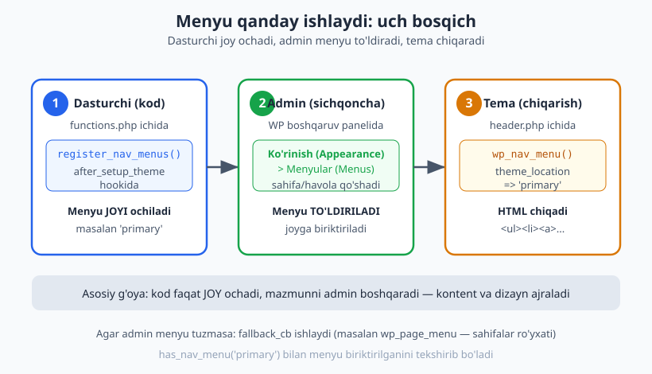
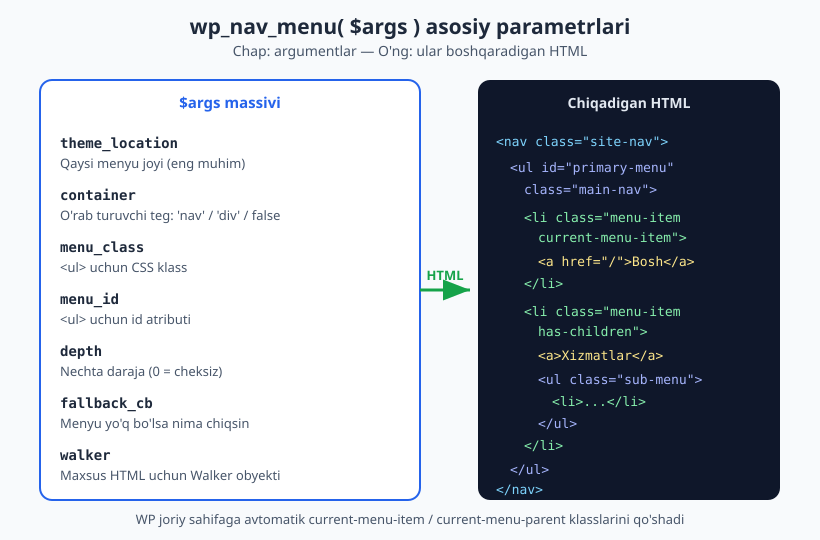
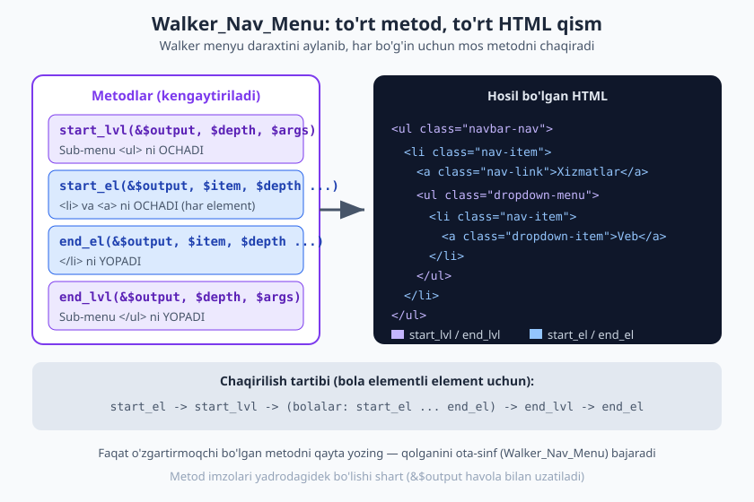

# 11 — Navigatsiya menyulari (Walker)

[⬅️ Oldingi: 10 — Skript va uslublarni ulash (enqueue)](./10-asset-enqueue.md) · [🏠 README](./README.md) · [Keyingi: 12 — Widget'lar va dinamik sidebar ➡️](./12-widget-sidebar.md)

> **Bu bobda:** Sayt yuqorisidagi navigatsiya menyusi temaning yuzi. Biz menyu joyini `register_nav_menus` bilan ro'yxatga olamiz, uni `wp_nav_menu` bilan chiqaramiz va admin uni `Ko'rinish > Menyular` bo'limidan boshqaradi. Eng kuchli qism — `Walker_Nav_Menu` ni kengaytirib, Bootstrap navbar yoki mega-menu kabi xohlagan HTML'ni hosil qilishni o'rganamiz. Menyusiz holat (fallback) va `current-menu-item` klasslari ham bu yerda.

---

## Nega menyu kodda yozilmaydi?

Yangi boshlovchi ko'pincha `header.php` ichiga to'g'ridan-to'g'ri shunday yozadi:

```php
<!-- ❌ YOMON: qattiq kodlangan menyu -->
<nav>
  <a href="/">Bosh sahifa</a>
  <a href="/about">Biz haqimizda</a>
  <a href="/contact">Bog'lanish</a>
</nav>
```

Bu ishlaydi, lekin muammosi katta: sayt egasi yangi sahifa qo'shmoqchi bo'lsa yoki tartibni o'zgartirmoqchi bo'lsa, **sizga (dasturchiga) murojaat qilishi** kerak. Tema kodi va sayt mazmuni bir-biriga yopishib qolgan.

To'g'ri yondashuv — WordPress menyu tizimidan foydalanish:

1. **Dasturchi** kodda menyu uchun **joy** (location) ochadi.
2. **Admin** boshqaruv panelida `Ko'rinish > Menyular` bo'limidan menyuni o'zi tuzadi: sahifalar, havolalar, tartib, ichki menyular.
3. **Tema** o'sha joyga biriktirilgan menyuni avtomatik chiqaradi.

Natijada sayt egasi sahifa qo'shadi, tartibni sudrab o'zgartiradi, kodga tegmasdan — dasturchini chaqirmasdan. Bu — kontent va kodni ajratish tamoyili.



---

## 1-qadam: `register_nav_menus` bilan joy ochish

Avval temaga ayting: "menda shuncha menyu joyi bor". Bu `after_setup_theme` hookida qilinadi (09-bobdagi tema sozlash hooki):

```php
<?php
function mytema_menyularni_royxatga_ol() {
	register_nav_menus( array(
		'primary' => __( 'Asosiy menyu', 'mytema' ),
		'footer'  => __( 'Footer menyu', 'mytema' ),
	) );
}
add_action( 'after_setup_theme', 'mytema_menyularni_royxatga_ol' );
```

Bu yerda:

- **Kalit** (`'primary'`, `'footer'`) — bu menyu joyining **mashina nomi** (`theme_location`). Kodda shu nomga murojaat qilamiz. O'zbekcha emas, lotin-ASCII, bo'shliqsiz nom bering.
- **Qiymat** (`'Asosiy menyu'`) — bu admin ko'radigan **odam o'qiydigan nom**. `__()` bilan tarjimaga tayyorlanadi (28-bobda i18n batafsil). Buni o'zbekcha yozsa bo'ladi.

> Bitta joy uchun `register_nav_menu()` (birlik) ham bor — `register_nav_menu( 'primary', __( 'Asosiy menyu', 'mytema' ) )`. Lekin odatda ko'plik `register_nav_menus()` qulayroq: bir vaqtda bir nechta joyni e'lon qiladi.

Bu kod ishga tushgach, admin panelidagi `Ko'rinish > Menyular` sahifasida "Menyu joylari" qismida ikkita joy paydo bo'ladi: "Asosiy menyu" va "Footer menyu".

### 2-qadam: admin menyuni tuzadi

Bu qadam **koddan tashqarida** — admin `Ko'rinish > Menyular`ga kiradi, yangi menyu yaratadi, unga sahifa/post/maxsus havola qo'shadi, kerakli elementlarni o'ngga sudrab **ichki menyu** (sub-menu) qiladi va menyuni bizning `primary` joyiga biriktiradi. Sudrab tartibni ham o'zgartiradi.

Bu jarayon vizual va sichqoncha bilan bo'lgani uchun bu yerda kod yo'q — lekin sizning kodingiz bu imkoniyatni **yoqib beradi**.

---

## 3-qadam: `wp_nav_menu` bilan chiqarish

Endi menyuni temada (odatda `header.php`da) chiqaramiz. Bitta funksiya hamma ishni qiladi:

```php
<?php
wp_nav_menu( array(
	'theme_location' => 'primary',
	'menu_id'        => 'primary-menu',
	'menu_class'     => 'main-nav',
	'container'      => 'nav',
) );
```

`theme_location => 'primary'` deganda WordPress: "shu joyga biriktirilgan menyuni topib, HTML qilib chiqar" deydi. Standart natija taxminan shunday bo'ladi:

```html
<nav class="menu-primary-container">
  <ul id="primary-menu" class="main-nav">
    <li class="menu-item"><a href="/">Bosh sahifa</a></li>
    <li class="menu-item menu-item-has-children">
      <a href="/services">Xizmatlar</a>
      <ul class="sub-menu">
        <li class="menu-item"><a href="/web">Veb-dizayn</a></li>
      </ul>
    </li>
  </ul>
</nav>
```

E'tibor bering: ichki menyu avtomatik `<ul class="sub-menu">` ichiga o'raladi, ota elementga `menu-item-has-children` klassi qo'shiladi. Buni biz yozmadik — WordPress o'zi qildi.

### Asosiy parametrlar

`wp_nav_menu()` ko'p parametr qabul qiladi. Eng muhimlari:

| Parametr | Vazifasi | Standart |
|----------|----------|----------|
| `theme_location` | Qaysi menyu joyi chiqsin (eng muhim) | — |
| `menu` | Joy o'rniga aniq menyu nomi/ID (kamroq ishlatiladi) | — |
| `container` | `<ul>` ni o'rab turuvchi teg: `'nav'`, `'div'` yoki `false` | `'div'` |
| `container_class` | O'rovchi tegga CSS klass | `'menu-{slug}-container'` |
| `menu_class` | `<ul>` ga CSS klass | `'menu'` |
| `menu_id` | `<ul>` ga `id` atributi | menyu slug'i |
| `depth` | Necha daraja chiqsin (`0` = cheksiz, `1` = faqat yuqori) | `0` |
| `fallback_cb` | Menyu yo'q bo'lsa nima chaqirilsin | `'wp_page_menu'` |
| `walker` | Maxsus HTML uchun Walker obyekti | yangi `Walker_Nav_Menu` |
| `items_wrap` | `<ul>` shabloni (`%1$s`=id, `%2$s`=class, `%3$s`=elementlar) | `<ul id="%1$s" class="%2$s">%3$s</ul>` |
| `echo` | `true` = chop etadi, `false` = qator qaytaradi | `true` |



> Eslatma: `echo => false` qilsangiz, funksiya HTML'ni chop etmaydi, balki uni qator qilib **qaytaradi**. Bu menyuni o'zgaruvchiga olib, oldindan tekshirish yoki qo'shimcha ishlov berish kerak bo'lganda foydali.

### `container => 'nav'` nega yaxshi?

Standart `container` qiymati `'div'`. Lekin navigatsiya uchun semantik to'g'ri teg — `<nav>`. Shuning uchun `'container' => 'nav'` berish accessibility (28-bob) nuqtai nazaridan tavsiya etiladi: skrin-reader buni "navigatsiya" deb taniydi.

`container => false` qilsangiz, hech qanday o'rovchi teg bo'lmaydi — faqat `<ul>` chiqadi. Bu o'z `<nav>` tegingizni qo'lda yozayotganda qulay.

> Diqqat: `container` faqat ruxsat etilgan teglarni qabul qiladi (`div` va `nav`). Boshqa teg bersangiz, WordPress uni e'tiborsiz qoldiradi va `<ul>` to'g'ridan-to'g'ri chiqadi.

---

## CURRENT klasslari: joriy sahifani belgilash

WordPress menyuni chiqarayotganda **qaysi sahifada turganingizni biladi** va mos `<li>` ga avtomatik maxsus klasslar qo'shadi. Bu menyuda "siz shu yerdasiz" effektini CSS bilan yasashga imkon beradi:

| Klass | Qachon qo'shiladi |
|-------|-------------------|
| `current-menu-item` | Joriy sahifaning aynan o'zi shu menyu elementida |
| `current-menu-parent` | Joriy elementning bevosita ota-elementi |
| `current-menu-ancestor` | Joriy elementning yuqoriroq ajdodi (bobo va undan yuqori) |
| `current_page_item` | (Eski moslik uchun) sahifa-element joriy bo'lsa |
| `menu-item-has-children` | Element ostida sub-menu bor |

Bularni shunchaki CSS bilan bezatasiz:

```css
.main-nav .current-menu-item > a {
  font-weight: 700;
  color: #2563eb;
  border-bottom: 2px solid #2563eb;
}
```

`<a>` tegining o'ziga esa WordPress `aria-current="page"` atributini qo'shadi — bu accessibility uchun joriy sahifani belgilaydi. Demak menyuni "active" qilish uchun JavaScript shart emas; klasslar tayyor keladi.

---

## Menyusiz holat: `fallback_cb`

Tasavvur qiling: foydalanuvchi sizning temangizni endi o'rnatdi, lekin hali hech qanday menyu tuzmadi. `theme_location => 'primary'` joyiga hech narsa biriktirilmagan. Bunda nima bo'ladi?

`wp_nav_menu` ning `fallback_cb` parametri shu holatni hal qiladi. Standart qiymati — `'wp_page_menu'`: agar menyu yo'q bo'lsa, WordPress saytdagi barcha **sahifalar**dan avtomatik menyu yasaydi. Bu yangi temada bo'sh joy ko'rsatmaslik uchun qulay.

Siz buni boshqarsangiz bo'ladi. Ikki keng tarqalgan variant:

**Variant A — fallbackni butunlay o'chirish** (menyu yo'q bo'lsa hech narsa chiqmasin):

```php
<?php
wp_nav_menu( array(
	'theme_location' => 'primary',
	'fallback_cb'    => false,
) );
```

**Variant B — o'z fallback funksiyangiz** (faqat adminni menyu yaratishga undash):

```php
<?php
function mytema_menyu_fallback() {
	if ( ! current_user_can( 'edit_theme_options' ) ) {
		return; // oddiy mehmonga hech narsa ko'rsatmaymiz
	}
	echo '<ul class="main-nav">';
	echo '<li><a href="' . esc_url( admin_url( 'nav-menus.php' ) ) . '">'
		. esc_html__( 'Menyu yarating', 'mytema' ) . '</a></li>';
	echo '</ul>';
}
```

Endi `wp_nav_menu`da `'fallback_cb' => 'mytema_menyu_fallback'` deb ko'rsatasiz. Faqat menyu boshqara oladigan foydalanuvchi (admin) "Menyu yarating" havolasini ko'radi.

> `has_nav_menu( 'primary' )` funksiyasi joyga menyu biriktirilgan-yo'qligini `true`/`false` qaytaradi. Masalan, menyu bo'lmasa butun `<nav>` blokini chiqarmaslik uchun `if ( has_nav_menu( 'primary' ) ) { ... }` bilan o'rab qo'yasiz.

---

## Walker_Nav_Menu: HTML'ni to'liq nazorat qilish

Standart `wp_nav_menu` HTML'i ko'p hollarda yetarli. Lekin Bootstrap navbar, mega-menu yoki maxsus markup kerak bo'lsa — har `<li>` ga `class="nav-item"`, har `<a>` ga `class="nav-link"`, sub-menuga `class="dropdown-menu"` qo'shish kerak. Buni `menu_class` bilan qila olmaysiz, chunki u faqat tashqi `<ul>` ga ta'sir qiladi.

Yechim — **Walker**. "Walker" — daraxt tuzilmasini (menyu ichma-ich joylashgan daraxt) aylanib chiqib (walk), har bo'g'in uchun HTML hosil qiladigan obyekt. WordPress'da menyu uchun tayyor `Walker_Nav_Menu` sinfi bor; biz uni **kengaytirib** (extends), faqat kerakli metodlarini qayta yozamiz.

To'rtta asosiy metod bor:

| Metod | Qachon chaqiriladi | Nimani chiqaradi |
|-------|--------------------|--------------------|
| `start_lvl()` | Yangi daraja (sub-menu) boshlanganda | Ochuvchi `<ul>` |
| `start_el()` | Har bir element boshida | Ochuvchi `<li>` va `<a>` |
| `end_el()` | Har bir element oxirida | Yopuvchi `</li>` |
| `end_lvl()` | Daraja tugaganda | Yopuvchi `</ul>` |

Nomidagi `lvl` = level (daraja, ya'ni sub-menu), `el` = element (bitta menyu bandi). Diqqat: barcha metodlar birinchi parametri `&$output` — bu **havola** orqali uzatiladi, ya'ni metod o'zgaruvchini to'g'ridan-to'g'ri to'ldiradi, `return` qilmaydi.



### Chaqirilish tartibi

Bola elementli element uchun metodlar shu tartibda chaqiriladi:

```text
start_el   (ota <li> + <a>)
  start_lvl  (ochuvchi <ul class="sub-menu">)
    start_el ... end_el   (har bir bola)
  end_lvl    (yopuvchi </ul>)
end_el     (ota </li>)
```

Ya'ni ota elementning `</li>` si bolalardan **keyin** yopiladi — chunki sub-menu `<ul>` ota `<li>` ichida joylashadi.

### Bootstrap navbar uchun maxsus Walker

Mana to'liq misol — Bootstrap-uslubidagi navbar HTML chiqaradigan Walker:

```php
<?php
class Mytema_Bootstrap_Walker extends Walker_Nav_Menu {

	// Sub-menu (ochiladigan ro'yxat) boshi.
	public function start_lvl( &$output, $depth = 0, $args = null ) {
		$indent  = str_repeat( "\t", $depth );
		$output .= "\n$indent<ul class=\"dropdown-menu\">\n";
	}

	// Sub-menu yakuni.
	public function end_lvl( &$output, $depth = 0, $args = null ) {
		$indent  = str_repeat( "\t", $depth );
		$output .= "$indent</ul>\n";
	}

	// Har bir <li> boshi.
	public function start_el( &$output, $data_object, $depth = 0, $args = null, $current_object_id = 0 ) {
		$item = $data_object;

		$has_children = in_array( 'menu-item-has-children', (array) $item->classes, true );

		$li_class = 'nav-item';
		if ( $has_children ) {
			$li_class .= ' dropdown';
		}
		if ( in_array( 'current-menu-item', (array) $item->classes, true ) ) {
			$li_class .= ' active';
		}

		$output .= '<li class="' . esc_attr( $li_class ) . '">';

		$link_class = $depth > 0 ? 'dropdown-item' : 'nav-link';
		$href       = ! empty( $item->url ) ? $item->url : '#';

		$output .= '<a class="' . esc_attr( $link_class ) . '" href="' . esc_url( $href ) . '">';
		$output .= esc_html( $item->title );
		$output .= '</a>';
	}

	// Har bir <li> yakuni.
	public function end_el( &$output, $data_object, $depth = 0, $args = null ) {
		$output .= "</li>\n";
	}
}
```

Endi shu Walker'ni `wp_nav_menu`ga uzatamiz:

```php
<?php
wp_nav_menu( array(
	'theme_location' => 'primary',
	'container'      => false,
	'menu_class'     => 'navbar-nav',
	'depth'          => 2,
	'walker'         => new Mytema_Bootstrap_Walker(),
	'fallback_cb'    => false,
) );
```

Natijada chiqadigan HTML (jonli WordPress 7.0'da tekshirilgan):

```html
<li class="nav-item active"><a class="nav-link" href="https://example.com/1">Bosh sahifa</a></li>
<li class="nav-item dropdown"><a class="nav-link" href="https://example.com/2">Xizmatlar</a>
<ul class="dropdown-menu">
<li class="nav-item"><a class="dropdown-item" href="https://example.com/3">Veb-dizayn</a></li>
</ul>
</li>
```

E'tibor bering:

- Yuqori darajadagi havolalar `nav-link`, sub-menu ichidagilari `dropdown-item` klassiga ega — buni biz `$depth > 0` sharti bilan ajratdik.
- Joriy sahifa elementiga `active`, bola elementli elementga `dropdown` klassi qo'shildi.
- `esc_url()` va `esc_html()` bilan chiqishni **escape** qildik. Bu MAJBURIY xavfsizlik qoidasi (27-bobda batafsil): menyu sarlavhasi va URL'ga ishonmang, har chiqishni tozalang.

> **Asosiy maslahat:** o'zgartirmoqchi bo'lmagan metodni qayta yozmang. Agar sizga faqat sub-menu `<ul>` ga klass qo'shish kerak bo'lsa — faqat `start_lvl()` ni yozing, qolgan uchtasini ota-sinf `Walker_Nav_Menu` o'zi bajaradi. Metod imzosi (parametrlar nomi va tartibi) yadrodagi bilan bir xil bo'lishi shart, aks holda PHP 8.4'da xato beradi.

### Mega-menu g'oyasi

Mega-menu — bu ochilganda butun ekran kengligida ko'p ustunli panel chiqaradigan menyu. Uni shu Walker yondashuvi bilan yasaysiz: `start_lvl()` da `<ul class="dropdown-menu">` o'rniga `<div class="mega-panel">` chiqarasiz, `start_el()` da `$depth` qiymatiga qarab elementlarni ustunlarga joylaysiz. Mantiq bir xil — faqat HTML boshqacha. Asosiy CSS/JS bilan ochilish-yopilish boshqariladi.

---

## Amaliy: responsive header menyu

Endi hammasini birlashtirib, mobil va desktopda ishlaydigan header menyu yasaymiz. Mobil uchun "hamburger" tugmasi, desktop uchun gorizontal menyu.

**`functions.php`** — joyni ro'yxatga olish (yuqorida ko'rdik):

```php
<?php
function mytema_setup_menyu() {
	register_nav_menus( array(
		'primary' => __( 'Asosiy menyu', 'mytema' ),
	) );
}
add_action( 'after_setup_theme', 'mytema_setup_menyu' );
```

**`header.php`** — toggle tugmasi va menyu:

```php
<header class="site-header">
	<div class="site-branding">
		<a href="<?php echo esc_url( home_url( '/' ) ); ?>" class="site-logo">
			<?php bloginfo( 'name' ); ?>
		</a>
	</div>

	<button class="menu-toggle" aria-controls="primary-menu" aria-expanded="false">
		<span class="screen-reader-text"><?php esc_html_e( 'Menyu', 'mytema' ); ?></span>
		<span class="hamburger"></span>
	</button>

	<?php
	if ( has_nav_menu( 'primary' ) ) {
		wp_nav_menu( array(
			'theme_location' => 'primary',
			'menu_id'        => 'primary-menu',
			'menu_class'     => 'main-nav',
			'container'      => 'nav',
			'container_class' => 'site-nav',
			'depth'          => 2,
		) );
	}
	?>
</header>
```

**CSS** (`style.css` yoki enqueue qilingan fayl) — mobil-birinchi:

```css
/* Mobil: menyu yashirin, toggle ko'rinadi */
.main-nav { display: none; }
.main-nav.is-open { display: block; }
.menu-toggle { display: block; }

/* Desktop (>= 768px): menyu gorizontal, toggle yashirin */
@media (min-width: 768px) {
	.menu-toggle { display: none; }
	.main-nav { display: flex; gap: 1.5rem; }
	.main-nav ul { display: flex; list-style: none; gap: 1.5rem; }
}

/* Joriy sahifa belgisi */
.main-nav .current-menu-item > a { color: #2563eb; font-weight: 700; }
```

**JavaScript** (enqueue qilingan fayl — 10-bobdagi `wp_enqueue_script` bilan ulanadi):

```js
document.addEventListener( 'DOMContentLoaded', function () {
	var toggle = document.querySelector( '.menu-toggle' );
	var nav = document.getElementById( 'primary-menu' );
	if ( ! toggle || ! nav ) {
		return;
	}
	toggle.addEventListener( 'click', function () {
		var open = nav.classList.toggle( 'is-open' );
		toggle.setAttribute( 'aria-expanded', open ? 'true' : 'false' );
	} );
} );
```

E'tibor bering: `aria-controls` va `aria-expanded` atributlari skrin-reader uchun toggle holatini bildiradi (accessibility — 28-bob). `screen-reader-text` klassi tugma matnini vizual yashirib, faqat skrin-reader uchun qoldiradi.

> Bu CSS/JS qismi brauzerda **vizual** ishlaydigan narsa — uni shu yerda matnli illustratsiya sifatida beramiz. PHP qismi `php -l` bilan tekshirilgan; menyu chiqarish mantig'i jonli WordPress 7.0'da render qilib tasdiqlangan.

---

## Tez-tez yo'l qo'yiladigan xatolar

- **`register_nav_menus` ni `after_setup_theme`dan tashqarida chaqirish.** Juda erta yoki kech chaqirilsa, menyu joyi admin panelida ko'rinmaydi. Doim `after_setup_theme` hookida bo'lsin.
- **`theme_location` slug'ini noto'g'ri yozish.** `register_nav_menus`dagi kalit va `wp_nav_menu`dagi `theme_location` aynan bir xil bo'lishi shart (`'primary'` != `'Primary'`).
- **Walker chiqishini escape qilmaslik.** `$item->title` va `$item->url` ni to'g'ridan-to'g'ri yozmang — `esc_html()` va `esc_url()` ishlating.
- **Walker metod imzosini o'zgartirish.** PHP 8.4 metod imzosi mosligini tekshiradi; `&$output` havola belgisini tushirib qoldirsangiz yoki parametr tartibini buzsangiz — fatal xato.
- **`depth` ni unutib, cheksiz ichki menyu chiqarish.** Dropdown faqat ikki daraja kerak bo'lsa `depth => 2` bering.

---

## Mashqlar

### Oson

1. `functions.php`da `register_nav_menus` bilan ikkita menyu joyi e'lon qiling: `'primary'` (Asosiy menyu) va `'social'` (Ijtimoiy tarmoqlar). Hookni to'g'ri tanlang.
2. `header.php`da `'primary'` joyidagi menyuni `wp_nav_menu` bilan chiqaring: `container` `'nav'` bo'lsin, `menu_class` `'main-nav'` bo'lsin.
3. `footer.php`da `'social'` menyusini `container => false` bilan chiqaring (faqat `<ul>` chiqsin, o'rovchi teg bo'lmasin).
4. Joriy sahifa menyu elementini ko'k va qalin qilib ko'rsatadigan CSS yozing (`current-menu-item` klassidan foydalaning).

### O'rta

5. `wp_nav_menu` chaqiruvini menyu faqat ikki darajagacha chiqadigan qilib sozlang (`depth`). Sub-menu `<ul>` ga maxsus klass qo'shilishini ham nazorat qilib ko'ring (`Walker_Nav_Menu` ning faqat `start_lvl()` metodini kengaytiring).
6. `'primary'` joyiga menyu biriktirilmagan bo'lsa, butun `<nav>` bloki umuman chiqmasin. `has_nav_menu()` ishlating.
7. Menyu yo'q bo'lganda admin "Menyu yarating" havolasini ko'radigan, oddiy mehmon esa hech narsa ko'rmaydigan `fallback_cb` funksiyasini yozing.
8. `wp_nav_menu`ni `echo => false` bilan chaqirib, natijani o'zgaruvchiga oling. Agar natija bo'sh bo'lmasa, uni `<div class="nav-wrap">...</div>` ichiga o'rab chiqaring.

### Qiyin

9. `Walker_Nav_Menu` ni kengaytirib, Bootstrap navbar HTML chiqaradigan Walker yozing: har `<li>` ga `nav-item`, yuqori darajadagi `<a>` ga `nav-link`, sub-menu ichidagi `<a>` ga `dropdown-item`, sub-menu `<ul>` ga `dropdown-menu` klassi. Joriy element `<li>` ga `active` qo'shilsin.
10. 9-mashqdagi Walker'da bola elementli `<li>` ga `dropdown` klassini va `<a>` ga `aria-haspopup="true"` atributini qo'shing. Chiqishni `esc_attr`/`esc_url`/`esc_html` bilan escape qiling.
11. Responsive header yasang: mobil uchun hamburger toggle tugmasi (`aria-controls`/`aria-expanded` bilan), 768px dan keng ekranda gorizontal menyu. PHP (`header.php`) + CSS + JS uchligini birlashtiring.
12. Mega-menu g'oyasini Walker bilan amalga oshiring: `start_lvl()`da sub-menu `<ul class="sub-menu">` o'rniga `<div class="mega-panel">` (va mos `end_lvl()`) chiqaring. Faqat `depth === 0` darajada ochiladigan panel bo'lsin.

---

## Yechimlar

<details markdown="1">
<summary>Yechim — 1</summary>

```php
<?php
function mytema_menyularni_royxatga_ol() {
	register_nav_menus( array(
		'primary' => __( 'Asosiy menyu', 'mytema' ),
		'social'  => __( 'Ijtimoiy tarmoqlar', 'mytema' ),
	) );
}
add_action( 'after_setup_theme', 'mytema_menyularni_royxatga_ol' );
```

`after_setup_theme` — temani sozlash uchun to'g'ri hook. Menyu joylari admin panelidagi `Ko'rinish > Menyular`da paydo bo'ladi.

</details>

<details markdown="1">
<summary>Yechim — 2</summary>

```php
<?php
wp_nav_menu( array(
	'theme_location' => 'primary',
	'container'      => 'nav',
	'menu_class'     => 'main-nav',
) );
```

`theme_location` 1-mashqdagi slug bilan aynan bir xil (`'primary'`). `container => 'nav'` semantik to'g'ri o'rovchi teg beradi.

</details>

<details markdown="1">
<summary>Yechim — 3</summary>

```php
<?php
wp_nav_menu( array(
	'theme_location' => 'social',
	'container'      => false,
	'menu_class'     => 'social-nav',
) );
```

`container => false` o'rovchi tegni butunlay olib tashlaydi — faqat `<ul class="social-nav">...</ul>` chiqadi.

</details>

<details markdown="1">
<summary>Yechim — 4</summary>

```css
.main-nav .current-menu-item > a {
	color: #2563eb;
	font-weight: 700;
}
```

`current-menu-item` klassini WordPress joriy sahifa elementiga avtomatik qo'shadi. `> a` to'g'ridan-to'g'ri ichidagi havolani tanlaydi (sub-menu havolalariga ta'sir qilmaslik uchun).

</details>

<details markdown="1">
<summary>Yechim — 5</summary>

```php
<?php
class Mytema_Submenu_Walker extends Walker_Nav_Menu {
	public function start_lvl( &$output, $depth = 0, $args = null ) {
		$indent  = str_repeat( "\t", $depth );
		$output .= "\n$indent<ul class=\"sub-menu dropdown\">\n";
	}
}

// Chaqirish:
wp_nav_menu( array(
	'theme_location' => 'primary',
	'depth'          => 2,
	'walker'         => new Mytema_Submenu_Walker(),
) );
```

`depth => 2` faqat ikki darajani chiqaradi. Faqat `start_lvl()` ni qayta yozdik — `<li>`, `<a>`, `</li>`, `</ul>` ni ota-sinf `Walker_Nav_Menu` standart ko'rinishda yasaydi.

</details>

<details markdown="1">
<summary>Yechim — 6</summary>

```php
<?php
if ( has_nav_menu( 'primary' ) ) {
	?>
	<nav class="site-nav">
		<?php
		wp_nav_menu( array(
			'theme_location' => 'primary',
			'container'      => false,
			'menu_class'     => 'main-nav',
		) );
		?>
	</nav>
	<?php
}
```

`has_nav_menu( 'primary' )` joyga menyu biriktirilgan bo'lsagina `true` qaytaradi. Menyu yo'q bo'lsa butun `<nav>` chiqmaydi — bo'sh teg qolmaydi.

</details>

<details markdown="1">
<summary>Yechim — 7</summary>

```php
<?php
function mytema_menyu_fallback() {
	if ( ! current_user_can( 'edit_theme_options' ) ) {
		return; // mehmonga hech narsa yo'q
	}
	echo '<ul class="main-nav">';
	echo '<li><a href="' . esc_url( admin_url( 'nav-menus.php' ) ) . '">'
		. esc_html__( 'Menyu yarating', 'mytema' ) . '</a></li>';
	echo '</ul>';
}

// Chaqirish:
wp_nav_menu( array(
	'theme_location' => 'primary',
	'fallback_cb'    => 'mytema_menyu_fallback',
) );
```

`current_user_can( 'edit_theme_options' )` faqat menyuni boshqara oladigan foydalanuvchini (odatda admin) o'tkazadi. `admin_url( 'nav-menus.php' )` to'g'ridan-to'g'ri menyu boshqaruvi sahifasiga olib boradi.

</details>

<details markdown="1">
<summary>Yechim — 8</summary>

```php
<?php
$menyu = wp_nav_menu( array(
	'theme_location' => 'primary',
	'container'      => false,
	'echo'           => false,
) );

if ( ! empty( $menyu ) ) {
	echo '<div class="nav-wrap">' . $menyu . '</div>';
}
```

`echo => false` HTML'ni chop etmay, qator qilib qaytaradi. `empty()` tekshiruvi menyu bo'sh bo'lsa (masalan menyu yo'q va `fallback_cb` ham hech narsa chiqarmagan) ortiqcha `<div>` chiqmasligini ta'minlaydi.

</details>

<details markdown="1">
<summary>Yechim — 9</summary>

```php
<?php
class Mytema_Bootstrap_Walker extends Walker_Nav_Menu {

	public function start_lvl( &$output, $depth = 0, $args = null ) {
		$indent  = str_repeat( "\t", $depth );
		$output .= "\n$indent<ul class=\"dropdown-menu\">\n";
	}

	public function end_lvl( &$output, $depth = 0, $args = null ) {
		$indent  = str_repeat( "\t", $depth );
		$output .= "$indent</ul>\n";
	}

	public function start_el( &$output, $data_object, $depth = 0, $args = null, $current_object_id = 0 ) {
		$item     = $data_object;
		$li_class = 'nav-item';

		if ( in_array( 'current-menu-item', (array) $item->classes, true ) ) {
			$li_class .= ' active';
		}

		$output .= '<li class="' . esc_attr( $li_class ) . '">';

		$link_class = $depth > 0 ? 'dropdown-item' : 'nav-link';
		$href       = ! empty( $item->url ) ? $item->url : '#';

		$output .= '<a class="' . esc_attr( $link_class ) . '" href="' . esc_url( $href ) . '">';
		$output .= esc_html( $item->title );
		$output .= '</a>';
	}

	public function end_el( &$output, $data_object, $depth = 0, $args = null ) {
		$output .= "</li>\n";
	}
}
```

`$depth > 0` shartiga qarab `nav-link` (yuqori) yoki `dropdown-item` (sub-menu) klassini tanlaymiz. `current-menu-item` bo'lsa `active` qo'shamiz. Metod imzolari yadrodagi `Walker_Nav_Menu` bilan bir xil — bu shart.

</details>

<details markdown="1">
<summary>Yechim — 10</summary>

```php
<?php
public function start_el( &$output, $data_object, $depth = 0, $args = null, $current_object_id = 0 ) {
	$item         = $data_object;
	$has_children = in_array( 'menu-item-has-children', (array) $item->classes, true );

	$li_class = 'nav-item';
	if ( $has_children ) {
		$li_class .= ' dropdown';
	}
	if ( in_array( 'current-menu-item', (array) $item->classes, true ) ) {
		$li_class .= ' active';
	}

	$output .= '<li class="' . esc_attr( $li_class ) . '">';

	$link_class = $depth > 0 ? 'dropdown-item' : 'nav-link';
	$href       = ! empty( $item->url ) ? $item->url : '#';

	$haspopup = $has_children ? ' aria-haspopup="true" aria-expanded="false"' : '';

	$output .= '<a class="' . esc_attr( $link_class ) . '" href="' . esc_url( $href ) . '"' . $haspopup . '>';
	$output .= esc_html( $item->title );
	$output .= '</a>';
}
```

`menu-item-has-children` klassi WordPress tomonidan bola elementli `<li>` ga avtomatik qo'shiladi — shundan bilamiz. `dropdown` klassi va `aria-haspopup` atributi faqat sub-menusi bor elementlarga qo'shiladi. Hamma chiqish escape qilingan.

</details>

<details markdown="1">
<summary>Yechim — 11</summary>

**`header.php`:**

```php
<header class="site-header">
	<button class="menu-toggle" aria-controls="primary-menu" aria-expanded="false">
		<span class="screen-reader-text"><?php esc_html_e( 'Menyu', 'mytema' ); ?></span>
		<span class="hamburger"></span>
	</button>

	<?php
	if ( has_nav_menu( 'primary' ) ) {
		wp_nav_menu( array(
			'theme_location' => 'primary',
			'menu_id'        => 'primary-menu',
			'menu_class'     => 'main-nav',
			'container'      => 'nav',
			'depth'          => 2,
		) );
	}
	?>
</header>
```

**CSS:**

```css
.main-nav { display: none; }
.main-nav.is-open { display: block; }
@media (min-width: 768px) {
	.menu-toggle { display: none; }
	.main-nav { display: flex; gap: 1.5rem; }
}
```

**JS (enqueue qilingan fayl):**

```js
document.addEventListener( 'DOMContentLoaded', function () {
	var toggle = document.querySelector( '.menu-toggle' );
	var nav = document.getElementById( 'primary-menu' );
	if ( ! toggle || ! nav ) { return; }
	toggle.addEventListener( 'click', function () {
		var open = nav.classList.toggle( 'is-open' );
		toggle.setAttribute( 'aria-expanded', open ? 'true' : 'false' );
	} );
} );
```

Mobil-birinchi yondashuv: menyu standart holatda yashirin, toggle bosilganda `is-open` klassi qo'shiladi. 768px dan keng ekranda toggle yashirinadi, menyu gorizontal flex bo'ladi. `aria-expanded` JS bilan yangilanadi.

</details>

<details markdown="1">
<summary>Yechim — 12</summary>

```php
<?php
class Mytema_Mega_Walker extends Walker_Nav_Menu {

	public function start_lvl( &$output, $depth = 0, $args = null ) {
		if ( 0 === $depth ) {
			$output .= "\n<div class=\"mega-panel\"><ul class=\"mega-list\">\n";
		} else {
			$output .= "\n<ul class=\"sub-menu\">\n";
		}
	}

	public function end_lvl( &$output, $depth = 0, $args = null ) {
		if ( 0 === $depth ) {
			$output .= "</ul></div>\n";
		} else {
			$output .= "</ul>\n";
		}
	}
}

// Chaqirish:
wp_nav_menu( array(
	'theme_location' => 'primary',
	'container'      => 'nav',
	'menu_class'     => 'mega-nav',
	'walker'         => new Mytema_Mega_Walker(),
) );
```

`$depth` qiymatiga qarab: birinchi daraja sub-menu (`depth === 0`) `<div class="mega-panel">` ichiga panel sifatida o'raladi, undan chuqurroq darajalar oddiy `<ul class="sub-menu">` bo'ladi. `start_lvl` va `end_lvl` juftligi mos yopilishi shart (`</ul></div>`). Panelni ekran kengligida ochish CSS bilan boshqariladi.

</details>

---

[⬅️ Oldingi: 10 — Skript va uslublarni ulash (enqueue)](./10-asset-enqueue.md) · [🏠 README](./README.md) · [Keyingi: 12 — Widget'lar va dinamik sidebar ➡️](./12-widget-sidebar.md)
