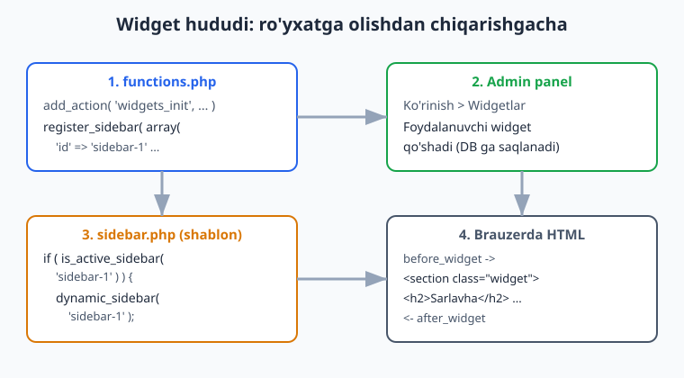
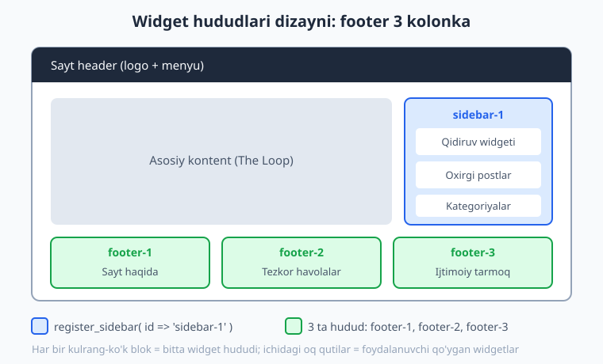
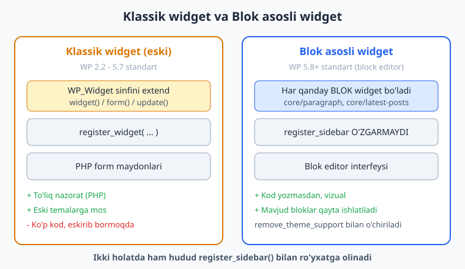

# 12 — Widget'lar va dinamik sidebar

[⬅️ Oldingi: 11 — Navigatsiya menyulari (Walker)](./11-menyular.md) · [🏠 README](./README.md) · [Keyingi: 13 — Custom Post Type va Taxonomy ➡️](./13-custom-post-type-taxonomy.md)

> **Bu bobda:** Foydalanuvchi temaning kodiga tegmasdan, admin panel orqali sahifaga bloklar (qidiruv, oxirgi postlar, kategoriyalar) qo'sha oladigan **widget hududlari** yaratishni o'rganamiz. `register_sidebar()` bilan hududni ro'yxatga olamiz, `dynamic_sidebar()` bilan uni shablonda chiqaramiz va `is_active_sidebar()` bilan bo'sh hududni yashiramiz. WP 5.8+ dagi **blok asosli widget** va eski **klassik widget** farqini, footer kolonkalari dizaynini va `WP_Widget` bilan o'z widgetingizni yaratishni ko'rib chiqamiz.

---

## Widget va sidebar nima?

08-bobda biz `sidebar.php` faylini yozdik va `dynamic_sidebar('sidebar-1')` ni ko'rganmiz, lekin u "kelajakda to'ldiriladigan joy" deb qoldirilgandi. Endi shu joyni to'ldiramiz.

**Widget** — bu sayt foydalanuvchisi (admin) kod yozmasdan, sichqoncha bilan joylashtira oladigan kichik kontent bloki: qidiruv maydoni, oxirgi postlar ro'yxati, kategoriyalar, matn, rasm va h.k.

**Widget hududi** (ko'pincha "sidebar" deb ataladi) — bu temada oldindan ajratilgan **joy**, foydalanuvchi widget'larni o'sha joyga tashlaydi. Nomi tarixiy: dastlab bu hududlar faqat yon panel uchun edi, lekin endi u sahifaning xohlagan joyida bo'lishi mumkin — footer, header, hatto kontent ostida.

Hayotiy o'xshatish: widget hududi — bu devordagi **bo'sh ramka**. Temani yozuvchi siz ramkani devorga o'rnatasiz (`register_sidebar`). Uy egasi (sayt admini) esa o'sha ramkaga xohlagan rasmini (widget'ni) qo'yadi. Siz qaysi rasm osilishini bilmaysiz — faqat ramka joyini tayyorlaysiz.

Bu — temaning eng kuchli tomonlaridan biri: **moslashuvchanlik**. Siz hudud yaratasiz; admin uni har xil mazmun bilan to'ldiradi. Kod va kontent ajraladi.

| Atama | Ma'nosi |
|-------|---------|
| Widget | Foydalanuvchi joylaydigan kichik kontent bloki |
| Widget hududi (sidebar) | Tema ajratgan, widget'lar tushadigan joy |
| `register_sidebar()` | Hududni ro'yxatga olish (yaratish) |
| `dynamic_sidebar()` | Hududni shablonda chiqarish |
| `is_active_sidebar()` | Hududda widget bor-yo'qligini tekshirish |

---

## `register_sidebar()` — hududni ro'yxatga olish

Widget hududini `register_sidebar()` funksiyasi bilan ro'yxatga olamiz. Eng muhim qoida: bu funksiya **`widgets_init` hook'ida** chaqirilishi kerak. Boshqa joyda chaqirsangiz, WordPress hududni tan olmaydi.

> **Diqqat — hook nomi:** menyu (`register_nav_menus`) `after_setup_theme` hook'ida ro'yxatga olinadi, lekin widget hududi **`widgets_init`** hook'ida. Bu ikkisini chalkashtirmang — bu eng ko'p uchraydigan xatolardan biri.

Mana to'liq, ishlaydigan namuna (`php -l` dan o'tgan va jonli WordPress 7.0 da ro'yxatga olinishi tasdiqlangan):

```php
<?php
/**
 * Widget hududlarini ro'yxatga olish.
 *
 * @package Ch12_Test
 */

add_action( 'widgets_init', 'ch12_test_widget_hududlari' );

function ch12_test_widget_hududlari() {
	register_sidebar(
		array(
			'name'          => __( 'Asosiy yon panel', 'ch12-test' ),
			'id'            => 'sidebar-1',
			'description'   => __( 'Blog sahifalaridagi yon panel.', 'ch12-test' ),
			'before_widget' => '<section id="%1$s" class="widget %2$s">',
			'after_widget'  => '</section>',
			'before_title'  => '<h2 class="widget-sarlavha">',
			'after_title'   => '</h2>',
		)
	);
}
```

### Argumentlar bir-bir

`register_sidebar()` bitta massiv qabul qiladi. Eng muhim kalitlar:

| Kalit | Vazifasi |
|-------|----------|
| `name` | Admin panelda ko'rinadigan nom (tarjima qilinadi) |
| `id` | Noyob identifikator — kodda shunga murojaat qilamiz (`'sidebar-1'`) |
| `description` | Admin uchun qisqa izoh |
| `before_widget` | Har widget'dan **oldin** chiqadigan HTML (ochiluvchi teg) |
| `after_widget` | Har widget'dan **keyin** chiqadigan HTML (yopuvchi teg) |
| `before_title` | Widget sarlavhasidan oldin (`<h2>`) |
| `after_title` | Widget sarlavhasidan keyin (`</h2>`) |

### `id` — eng muhim kalit

`id` ni doim **o'zingiz belgilang**. Agar belgilamasangiz, WordPress avtomatik `sidebar-1`, `sidebar-2` deb beradi va tartib o'zgarsa hududlar aralashib ketadi. Aniq `id` (masalan `'sidebar-1'`, `'footer-1'`) bersangiz, kodda shu nomga ishonch bilan murojaat qilasiz.

### `before_widget` ichidagi `%1$s` va `%2$s`

E'tibor bering: `before_widget` da `%1$s` va `%2$s` bor:

```php
'before_widget' => '<section id="%1$s" class="widget %2$s">',
```

Bular — `sprintf()` o'rinbosarlari. WordPress ularni avtomatik to'ldiradi:

- `%1$s` -> widget'ning noyob ID'si (masalan `recent-posts-2`)
- `%2$s` -> widget'ning CSS klasslari (masalan `widget_recent_entries`)

Shuning uchun bu ikkisini **o'zgartirmang** — ularni shundayligicha qoldiring, WordPress to'ldiradi. Brauzerda natija shunday bo'ladi:

```html
<section id="recent-posts-2" class="widget widget_recent_entries">
	<h2 class="widget-sarlavha">Oxirgi postlar</h2>
	<ul>...</ul>
</section>
```

> **WordPress standart qiymatlari:** agar `before_widget` ni umuman bermasangiz, WP standart qilib `<li id="%1$s" class="widget %2$s">` ishlatadi (ya'ni `<li>` taglari — eski temalar `<ul>` ichida ishlatardi). Zamonaviy temada deyarli doim o'zimiznikini beramiz — `<section>` yoki `<div>` semantik jihatdan to'g'riroq.



---

## `register_sidebars()` — bir nechta bir xil hudud

Agar bir necha bir xil hudud kerak bo'lsa (masalan, footer'da 3 bir xil kolonka), `register_sidebar()` ni uch marta yozish o'rniga `register_sidebars()` (ko'plik) dan foydalansa bo'ladi:

```php
add_action( 'widgets_init', 'ch12_takroriy_hududlar' );

function ch12_takroriy_hududlar() {
	register_sidebars(
		3,
		array(
			'name'          => __( 'Footer kolonka %d', 'ch12-test' ),
			'id'            => 'footer',
			'before_widget' => '<div id="%1$s" class="widget %2$s">',
			'after_widget'  => '</div>',
			'before_title'  => '<h3>',
			'after_title'   => '</h3>',
		)
	);
}
```

Birinchi argument — soni (`3`). WordPress hududlarni `footer-1`, `footer-2`, `footer-3` deb yaratadi, va `name` dagi `%d` har biriga raqam qo'yadi: "Footer kolonka 1", "Footer kolonka 2", "Footer kolonka 3".

Amalda ko'pchilik dasturchilar **aniqlik uchun** `for` sikli bilan `register_sidebar()` ni takror chaqirishni afzal ko'radi (har bir hududga alohida `description` berish mumkin):

```php
add_action( 'widgets_init', 'ch12_test_footer_kolonkalari' );

function ch12_test_footer_kolonkalari() {
	for ( $i = 1; $i <= 3; $i++ ) {
		register_sidebar(
			array(
				/* translators: %d: footer kolonka raqami. */
				'name'          => sprintf( __( 'Footer kolonka %d', 'ch12-test' ), $i ),
				'id'            => 'footer-' . $i,
				'description'   => __( 'Sayt pastidagi widget kolonkasi.', 'ch12-test' ),
				'before_widget' => '<div id="%1$s" class="widget %2$s">',
				'after_widget'  => '</div>',
				'before_title'  => '<h3 class="footer-widget-sarlavha">',
				'after_title'   => '</h3>',
			)
		);
	}
}
```

Ikkala usul ham to'g'ri. `register_sidebars()` qisqaroq; `for` sikli moslashuvchanroq. Bu kitobda biz `for` sikli usulini ishlatamiz, chunki u har hududni alohida sozlash imkonini beradi.

---

## `dynamic_sidebar()` — hududni shablonda chiqarish

Hududni ro'yxatga oldik — endi uni shablonda **chiqarishimiz** kerak. Buni `dynamic_sidebar('hudud-id')` qiladi. U foydalanuvchi admin panelda shu hududga tashlagan barcha widget'larni HTML qilib chop etadi.

08-bobdan eslang — `sidebar.php`:

```php
<?php
/**
 * Yon panel shabloni.
 *
 * @package Ch12_Test
 */

if ( ! is_active_sidebar( 'sidebar-1' ) ) {
	return;
}
?>
<aside id="ikkilamchi" class="sidebar" aria-label="Yon panel">
	<?php dynamic_sidebar( 'sidebar-1' ); ?>
</aside>
```

`dynamic_sidebar('sidebar-1')` ichida bo'lgan har bir widget uchun:

1. `before_widget` ni chiqaradi (ochiluvchi teg, ID va klass bilan).
2. Widget sarlavhasi bo'lsa, `before_title` + sarlavha + `after_title`.
3. Widget'ning o'z mazmuni (ro'yxat, matn, forma...).
4. `after_widget` ni chiqaradi (yopuvchi teg).

Bu siklni admin tashlagan har widget uchun takrorlaydi. Demak siz `register_sidebar()` da belgilagan `before_widget`/`after_widget` HTML qoliplari har bir widget'ni o'rab chiqadi.

> **Eslatma:** `dynamic_sidebar()` parametrsiz chaqirilganda (`dynamic_sidebar()`) hech narsa bermaydi — argument sifatida hudud `id` yoki nomini berishingiz **shart**. Doim `dynamic_sidebar('sidebar-1')` kabi aniq ID bilan chaqiring.

---

## `is_active_sidebar()` — bo'sh hududni yashirish

Agar foydalanuvchi hududga hech qanday widget tashlamasa-chi? U holda bo'sh `<aside>` yoki `<div>` qoladi — keraksiz, ba'zan dizaynni buzadigan bo'sh konteyner. Buning oldini olish uchun **chiqarishdan oldin tekshiramiz**:

```php
if ( ! is_active_sidebar( 'sidebar-1' ) ) {
	return; // Widget yo'q - hech narsa chizmaymiz.
}
```

`is_active_sidebar('sidebar-1')` shu hududda **hech bo'lmasa bitta** widget bormi, `true`/`false` qaytaradi. Bo'sh bo'lsa, `return` bilan fayldan chiqamiz va `<aside>` umuman chizilmaydi.

Bu — best-practice: **bo'sh konteynerlardan qoching**. Har bir widget hududini chiqarishdan oldin `is_active_sidebar()` bilan tekshiring.

---

## Footer widget hududlari dizayni

Endi amaliy misol: footer'da 3 kolonka. Yuqorida `for` sikli bilan `footer-1`, `footer-2`, `footer-3` hududlarini ro'yxatga oldik. Endi ularni footer'da chiqaramiz. Buni alohida bo'lakka (`template-parts/footer-widgets.php`) chiqarib, `footer.php` dan `get_template_part()` bilan chaqirish toza usul:

```php
<?php
/**
 * Footer widget hududlari (3 kolonka).
 *
 * @package Ch12_Test
 */

if (
	! is_active_sidebar( 'footer-1' ) &&
	! is_active_sidebar( 'footer-2' ) &&
	! is_active_sidebar( 'footer-3' )
) {
	return;
}
?>
<div class="footer-widgetlar">
	<?php for ( $i = 1; $i <= 3; $i++ ) : ?>
		<?php if ( is_active_sidebar( 'footer-' . $i ) ) : ?>
			<div class="footer-kolonka footer-kolonka--<?php echo esc_attr( (string) $i ); ?>">
				<?php dynamic_sidebar( 'footer-' . $i ); ?>
			</div>
		<?php endif; ?>
	<?php endfor; ?>
</div>
```

Mantiq:

1. **Tashqi tekshiruv:** uchala hudud ham bo'sh bo'lsa, butun `<div class="footer-widgetlar">` ni chizmaymiz (`return`).
2. **Sikl:** 1 dan 3 gacha aylanamiz.
3. **Ichki tekshiruv:** faqat **to'la** kolonkalar uchun `<div class="footer-kolonka">` chiqaramiz — bo'sh kolonka grid'da bo'sh joy qoldirmaydi.
4. `dynamic_sidebar('footer-' . $i)` shu kolonkaning widget'larini chiqaradi.

CSS bilan `.footer-widgetlar` ni `display: grid; grid-template-columns: repeat(3, 1fr);` qilsangiz, uchta kolonka yonma-yon turadi. Bu — odatiy blog/biznes tema footer dizayni.



---

## Klassik widget va Blok asosli widget (WP 5.8+)

Bu yerda muhim tarixiy o'zgarishni tushunish kerak, chunki u 2026'da temangiz qanday ishlashiga ta'sir qiladi.

**WP 5.8 (2021) gacha** — widget'lar "klassik" edi: admin panelda har bir widget alohida, oddiy forma ko'rinishida edi (sarlavha maydoni, matn maydoni va h.k.). Bu widget'lar `WP_Widget` PHP sinfi bilan yaratilardi.

**WP 5.8 dan boshlab** — widget hududlari **blok editor** bilan boshqariladi. Ya'ni endi widget hududiga **har qanday blokni** (paragraf, rasm, "Oxirgi postlar" bloki, guruh) xuddi post tahrirlagandek joylashtirasiz. Bu — "blok asosli widget".

Eng muhim xulosalar:

- **`register_sidebar()` o'zgarmaydi.** Hududni ro'yxatga olish kodi ikkala holatda ham bir xil. Faqat admin panelda widget joylash **interfeysi** o'zgargan.
- Foydalanuvchi endi kod yozmasdan, vizual bloklar bilan ishlaydi — bu osonroq.
- Eski `WP_Widget` widget'lari hali ham ishlaydi (blok editor ichida "Legacy Widget" bloki sifatida ko'rinadi).



### Klassik (eski) interfeysni qaytarish

Ba'zan foydalanuvchi yoki mijoz **eski, oddiy** widget interfeysini xohlaydi (blok editor murakkab tuyulsa). Buni `widgets-block-editor` tema qo'llab-quvvatlashini olib tashlash bilan qilamiz:

```php
add_action( 'after_setup_theme', 'ch12_klassik_widget_rejimi' );

function ch12_klassik_widget_rejimi() {
	remove_theme_support( 'widgets-block-editor' );
}
```

Bu kod blok asosli widget interfeysini o'chiradi va eski klassik interfeysni qaytaradi.

WordPress ichida bu qaror `wp_use_widgets_block_editor()` funksiyasi orqali aniqlanadi. U `use_widgets_block_editor` filtriga tayanadi. Demak, bir xil natijani filtr bilan ham olish mumkin:

```php
add_filter( 'use_widgets_block_editor', '__return_false' );
```

> **Maslahat:** zamonaviy temada **blok asosli widget'ni o'chirmang** — u WP 5.8+ standarti va foydalanuvchiga ko'proq imkoniyat beradi. `remove_theme_support('widgets-block-editor')` ni faqat aniq sabab bo'lganda (eski plagin mosligi, mijoz talabi) ishlating.

---

## Block tema'da widget yo'q — buning o'rniga nima bor?

Diqqat — bu klassik (PHP shablonli) tema bobi. Agar siz **block tema** (FSE) yaratsangiz (15-bobdan boshlab), `register_sidebar()` va `dynamic_sidebar()` **umuman ishlatilmaydi**. Block tema'da "sidebar" tushunchasi boshqacha:

- Yon panel — bu Site Editor'da yaratilgan **template part** yoki oddiy bloklar guruhi.
- "Oxirgi postlar", "Kategoriyalar" kabi narsalar — bular endi **bloklar** (`core/latest-posts`, `core/categories`), siz ularni to'g'ridan-to'g'ri template'ga qo'yasiz.
- Foydalanuvchi widget hududiga emas, **template'ning o'ziga** blok qo'shadi (Site Editor orqali).

Demak, bu bob (widget hududlari) — **klassik va hybrid temalar** uchun. Sof block tema'da bu bilim kerak emas, lekin:

1. Klassik temalar hali ham ko'p (ish bozorida tez-tez uchraydi).
2. Hybrid temalarda (21-bob) ikkalasi aralash bo'lishi mumkin.
3. Ko'p plaginlar hali ham widget hududiga tayanadi.

Shuning uchun widget'larni bilish foydali — lekin yangi sof block tema yozsangiz, buni Site Editor bloklari bilan almashtirasiz.

---

## Custom widget: `WP_Widget` sinfini extend qilish

WordPress yadrosi ko'p tayyor widget beradi (qidiruv, oxirgi postlar, kategoriyalar...). Lekin ba'zan **o'zingizniki** kerak bo'ladi — masalan, sozlanadigan salom xabari, maxsus banner yoki ijtimoiy tarmoq havolalari bloki.

> **Muhim eslatma:** zamonaviy yondashuvda custom widget o'rniga ko'pincha **custom blok** (22-25 boblar) yaratiladi — blok ham widget hududida, ham kontent ichida ishlaydi. Lekin `WP_Widget` hali ham ishlaydi va eski temalar/plaginlarda ko'p uchraydi, shuning uchun asoslarini bilish kerak. Bu yerda qisqa, to'liq misol beramiz.

Custom widget — bu `WP_Widget` abstrakt sinfini **extend** qilgan sinf. Siz to'rtta metodni yozasiz:

| Metod | Vazifasi |
|-------|----------|
| `__construct()` | Widget ID, nomi va izohini belgilash |
| `widget( $args, $instance )` | **Saytda** (front-end) widget'ni chiqarish |
| `form( $instance )` | **Admin'da** sozlash formasini chiqarish |
| `update( $new, $old )` | Saqlashdan oldin kiritilgan ma'lumotni tozalash |

Mana to'liq, ishlaydigan namuna (`php -l` dan o'tgan; jonli WP 7.0 da `register_widget` bilan ro'yxatga olinishi va `widget()` chiqishi tasdiqlangan):

```php
<?php
/**
 * Custom widget - "Salomlashish" widgeti.
 *
 * @package Ch12_Test
 */

class Ch12_Salom_Widget extends WP_Widget {

	public function __construct() {
		parent::__construct(
			'ch12_salom',
			__( 'Salomlashish', 'ch12-test' ),
			array(
				'description' => __( 'Sozlanadigan salom xabari.', 'ch12-test' ),
			)
		);
	}

	public function widget( $args, $instance ) {
		$sarlavha = ! empty( $instance['sarlavha'] ) ? $instance['sarlavha'] : '';
		$matn     = ! empty( $instance['matn'] ) ? $instance['matn'] : '';

		echo $args['before_widget'];

		if ( $sarlavha ) {
			echo $args['before_title'] . esc_html( $sarlavha ) . $args['after_title'];
		}

		echo '<p>' . esc_html( $matn ) . '</p>';

		echo $args['after_widget'];
	}

	public function form( $instance ) {
		$sarlavha = isset( $instance['sarlavha'] ) ? $instance['sarlavha'] : '';
		$matn     = isset( $instance['matn'] ) ? $instance['matn'] : '';
		?>
		<p>
			<label for="<?php echo esc_attr( $this->get_field_id( 'sarlavha' ) ); ?>">
				<?php esc_html_e( 'Sarlavha:', 'ch12-test' ); ?>
			</label>
			<input
				class="widefat"
				id="<?php echo esc_attr( $this->get_field_id( 'sarlavha' ) ); ?>"
				name="<?php echo esc_attr( $this->get_field_name( 'sarlavha' ) ); ?>"
				type="text"
				value="<?php echo esc_attr( $sarlavha ); ?>">
		</p>
		<p>
			<label for="<?php echo esc_attr( $this->get_field_id( 'matn' ) ); ?>">
				<?php esc_html_e( 'Matn:', 'ch12-test' ); ?>
			</label>
			<textarea
				class="widefat"
				id="<?php echo esc_attr( $this->get_field_id( 'matn' ) ); ?>"
				name="<?php echo esc_attr( $this->get_field_name( 'matn' ) ); ?>"
				rows="3"><?php echo esc_textarea( $matn ); ?></textarea>
		</p>
		<?php
	}

	public function update( $new_instance, $old_instance ) {
		$instance             = array();
		$instance['sarlavha'] = sanitize_text_field( $new_instance['sarlavha'] );
		$instance['matn']     = sanitize_textarea_field( $new_instance['matn'] );

		return $instance;
	}
}

add_action( 'widgets_init', 'ch12_salom_widgetni_royxatga' );

function ch12_salom_widgetni_royxatga() {
	register_widget( 'Ch12_Salom_Widget' );
}
```

### Har bir qism nima qiladi

**`__construct()`** — `parent::__construct()` ga uch narsa beramiz:
- `'ch12_salom'` — widget'ning noyob `id_base` (ichki ID asosi).
- `__('Salomlashish', ...)` — admin panelda ko'rinadigan nom.
- `array('description' => ...)` — admin uchun izoh.

**`widget($args, $instance)`** — saytda (front-end) chiqarish. Bu yerda:
- `$args` — `register_sidebar()` da belgilangan `before_widget`/`after_widget`/`before_title`/`after_title`. Ularni shu joydan chiqaramiz — shuning uchun widget hududning dizayniga moslashadi.
- `$instance` — foydalanuvchi formaga kiritgan qiymatlar (`sarlavha`, `matn`).
- **Eng muhimi:** har bir dinamik qiymatni `esc_html()` bilan escape qilamiz. Bu xavfsizlik qoidasi (27-bobda chuqur).

**`form($instance)`** — admin paneldagi sozlash formasi. `$this->get_field_id()` va `$this->get_field_name()` — WordPress bergan yordamchi metodlar; ular har bir maydonga to'g'ri, noyob `id` va `name` beradi (bir hududda bir necha shu widget bo'lsa ham aralashmaydi). Buni qo'lda yozmang — doim `get_field_id()`/`get_field_name()` ishlating.

**`update($new_instance, $old_instance)`** — saqlashdan oldin **tozalash** (sanitization):
- `sanitize_text_field()` — matn maydonidan keraksiz teglar va bo'shliqlarni olib tashlaydi.
- `sanitize_textarea_field()` — ko'p qatorli matn uchun.
- Tozalangan massivni `return` qilamiz — aynan shu DB ga saqlanadi.

> **Xavfsizlik qoidasi:** `update()` da **kirishni** tozalaymiz (sanitize), `widget()` da **chiqishni** escape qilamiz (esc_html). Bu ikkisi birga ishlaydi — "kirishda tozala, chiqishda escape qil". 27-bob buni chuqur ochadi.

**`register_widget('Ch12_Salom_Widget')`** — widget'ni WordPress'ga tanishtirish. Bu ham `widgets_init` hook'ida bo'lishi shart. Endi widget admin paneldagi widget ro'yxatida paydo bo'ladi va foydalanuvchi uni xohlagan hududga tashlay oladi.

> **Tekshirilgan natija:** jonli WP 7.0 da bu widget `register_widget` bilan ro'yxatdan o'tdi, `widget()` metodi `<section class="widget"><h2>Xush kelibsiz</h2><p>Saytimizga</p></section>` HTML berdi, va `update()` `<b>Hi</b>` ni `Hi` ga tozaladi (teglarni olib tashladi). Demak escaping va sanitization ishlayapti.

---

## Tez-tez uchraydigan xatolar

1. **Noto'g'ri hook.** `register_sidebar()` ni `after_setup_theme` da chaqirish (menyu bilan chalkashtirish). To'g'risi — **`widgets_init`**.
2. **`%1$s`/`%2$s` ni o'zgartirish.** `before_widget` dagi bu o'rinbosarlarni o'chirib tashlash — widget ID va klasslari yo'qoladi, CSS va plaginlar buziladi.
3. **`dynamic_sidebar()` ni `is_active_sidebar()` siz chaqirish.** Bo'sh hudud bo'sh konteyner qoldiradi — dizaynni buzadi.
4. **`id` ni belgilamaslik.** Avtomatik ID ga ishonib qolish — tartib o'zgarsa hududlar aralashadi. Doim aniq `id` bering.
5. **Custom widget'da escape/sanitize unutish.** `widget()` da `esc_html()` siz chiqarish — XSS xavfi. `update()` da tozalamaslik — DB ga iflos ma'lumot tushadi.
6. **`get_field_id()`/`get_field_name()` o'rniga qo'lda ID yozish.** Bir hududda bir nechta shu widget bo'lsa, maydonlar ID'lari to'qnashadi.
7. **Block tema'da `register_sidebar()` kutish.** Sof block tema'da widget hududlari yo'q — Site Editor bloklari ishlatiladi.

---

## Mashqlar

### Oson

1. **Bitta sidebar hududini ro'yxatga oling.** `functions.php` da `widgets_init` hook'ida `register_sidebar()` bilan `id` = `'sidebar-1'` bo'lgan hudud yarating. `name`, `description`, `before_widget`, `after_widget`, `before_title`, `after_title` to'liq bo'lsin. `php -l` dan o'tsin.
2. **Hududni shablonda chiqaring.** `sidebar.php` da `dynamic_sidebar('sidebar-1')` ni `<aside>` ichida chaqiring.
3. **Bo'sh hududni yashiring.** `sidebar.php` boshida `is_active_sidebar('sidebar-1')` bilan tekshiring: widget bo'lmasa, `return` bilan chiqing.
4. **`before_widget` ni to'g'ri yozing.** Widget'ni `<section id="%1$s" class="widget %2$s">` ... `</section>` ga o'rab chiqaradigan `register_sidebar` argumentlarini yozing. `%1$s` va `%2$s` nima ekanini izohda yozing.

### O'rta

5. **Footer'da 3 kolonka yarating.** `for` sikli bilan `footer-1`, `footer-2`, `footer-3` hududlarini ro'yxatga oling (har biriga `name` da raqam, alohida `description`). `php -l` dan o'tsin.
6. **Footer hududlarini chiqaring.** `template-parts/footer-widgets.php` yozing: faqat to'la kolonkalar uchun `<div class="footer-kolonka">` chiqsin, uchalasi bo'sh bo'lsa hech narsa chizmasin.
7. **`register_sidebars()` ga o'ting.** 5-mashqdagi `for` siklini bitta `register_sidebars(3, array(...))` chaqiruviga aylantiring. `name` da `%d` ishlating.
8. **Klassik widget interfeysini qaytaring.** `after_setup_theme` hook'ida `remove_theme_support('widgets-block-editor')` chaqiradigan funksiya yozing. Bir abzasda nima o'zgarishini izohlang.

### Qiyin

9. **Filtr bilan klassik rejim.** 8-mashqni `use_widgets_block_editor` filtri orqali (`__return_false` bilan) qaytadan yozing. Hook va filtr usulining farqini izohlang.
10. **Custom "Banner" widgeti yarating.** `WP_Widget` ni extend qiling: `form()` da sarlavha va matn maydonlari, `widget()` da escape bilan chiqarish, `update()` da `sanitize_text_field` bilan tozalash. `register_widget()` bilan ro'yxatga oling. `php -l` dan o'tsin.
11. **`get_field_id`/`get_field_name` ni to'g'ri qo'llang.** 10-mashqdagi widget formada har bir `<input>`/`<textarea>` uchun `$this->get_field_id()` va `$this->get_field_name()` ishlatilganini tekshiring va nega qo'lda ID yozmaslik kerakligini izohlang.
12. **To'liq widget tizimini yig'ing.** Bitta `functions.php` bo'lagida: (a) `sidebar-1` hududini ro'yxatga oling, (b) 3 ta footer hududi yarating, (c) custom widget sinfini yozing va `register_widget()` bilan ro'yxatga oling. Hammasi `widgets_init` hook'ida bo'lsin, `php -l` dan o'tsin.

---

## Yechimlar

<details markdown="1">
<summary>Yechim — 1</summary>

```php
<?php
add_action( 'widgets_init', 'tema_sidebar_royxatga' );

function tema_sidebar_royxatga() {
	register_sidebar(
		array(
			'name'          => __( 'Asosiy yon panel', 'tema' ),
			'id'            => 'sidebar-1',
			'description'   => __( 'Blog sahifalaridagi yon panel.', 'tema' ),
			'before_widget' => '<section id="%1$s" class="widget %2$s">',
			'after_widget'  => '</section>',
			'before_title'  => '<h2 class="widget-sarlavha">',
			'after_title'   => '</h2>',
		)
	);
}
```

Eng muhimi: hook nomi **`widgets_init`** (`after_setup_theme` emas), va `id` ni o'zimiz aniq belgiladik. `php -l` "No syntax errors detected" beradi.

</details>

<details markdown="1">
<summary>Yechim — 2</summary>

```php
<aside id="ikkilamchi" class="sidebar" aria-label="Yon panel">
	<?php dynamic_sidebar( 'sidebar-1' ); ?>
</aside>
```

`dynamic_sidebar('sidebar-1')` shu hududga admin tashlagan har bir widget'ni chiqaradi. Argumentni (`'sidebar-1'`) berish shart — parametrsiz chaqiruv hech narsa bermaydi.

</details>

<details markdown="1">
<summary>Yechim — 3</summary>

```php
<?php
if ( ! is_active_sidebar( 'sidebar-1' ) ) {
	return;
}
?>
<aside id="ikkilamchi" class="sidebar" aria-label="Yon panel">
	<?php dynamic_sidebar( 'sidebar-1' ); ?>
</aside>
```

`is_active_sidebar()` `false` qaytarsa (hudud bo'sh), fayl darrov `return` qiladi va `<aside>` umuman chiqmaydi. Bu keraksiz bo'sh konteynerdan qutqaradi.

</details>

<details markdown="1">
<summary>Yechim — 4</summary>

```php
register_sidebar(
	array(
		'name'          => __( 'Yon panel', 'tema' ),
		'id'            => 'sidebar-1',
		'before_widget' => '<section id="%1$s" class="widget %2$s">',
		'after_widget'  => '</section>',
		'before_title'  => '<h2>',
		'after_title'   => '</h2>',
	)
);
```

**Izoh:** `%1$s` va `%2$s` — `sprintf` o'rinbosarlari. WordPress ularni avtomatik to'ldiradi: `%1$s` -> widget'ning noyob ID'si (masalan `search-2`), `%2$s` -> widget'ning CSS klasslari (masalan `widget_search`). Shuning uchun ularni o'zgartirmaymiz — WordPress ularga aniq qiymat qo'yadi. Brauzerda: `<section id="search-2" class="widget widget_search">`.

</details>

<details markdown="1">
<summary>Yechim — 5</summary>

```php
<?php
add_action( 'widgets_init', 'tema_footer_kolonkalari' );

function tema_footer_kolonkalari() {
	for ( $i = 1; $i <= 3; $i++ ) {
		register_sidebar(
			array(
				/* translators: %d: footer kolonka raqami. */
				'name'          => sprintf( __( 'Footer kolonka %d', 'tema' ), $i ),
				'id'            => 'footer-' . $i,
				'description'   => __( 'Sayt pastidagi widget kolonkasi.', 'tema' ),
				'before_widget' => '<div id="%1$s" class="widget %2$s">',
				'after_widget'  => '</div>',
				'before_title'  => '<h3>',
				'after_title'   => '</h3>',
			)
		);
	}
}
```

`for` sikli `footer-1`, `footer-2`, `footer-3` hududlarini yaratadi. `sprintf(__('Footer kolonka %d', ...), $i)` har biriga raqamli nom beradi. `php -l` dan o'tadi.

</details>

<details markdown="1">
<summary>Yechim — 6</summary>

```php
<?php
if (
	! is_active_sidebar( 'footer-1' ) &&
	! is_active_sidebar( 'footer-2' ) &&
	! is_active_sidebar( 'footer-3' )
) {
	return;
}
?>
<div class="footer-widgetlar">
	<?php for ( $i = 1; $i <= 3; $i++ ) : ?>
		<?php if ( is_active_sidebar( 'footer-' . $i ) ) : ?>
			<div class="footer-kolonka footer-kolonka--<?php echo esc_attr( (string) $i ); ?>">
				<?php dynamic_sidebar( 'footer-' . $i ); ?>
			</div>
		<?php endif; ?>
	<?php endfor; ?>
</div>
```

Tashqi `if` — uchala hudud bo'sh bo'lsa, butun blokni chizmaymiz. Ichki `if ( is_active_sidebar(...) )` — faqat to'la kolonkalar uchun `<div>` chiqaradi, bo'sh kolonka grid'da joy egallamaydi. `php -l` dan o'tadi.

</details>

<details markdown="1">
<summary>Yechim — 7</summary>

```php
<?php
add_action( 'widgets_init', 'tema_footer_takroriy' );

function tema_footer_takroriy() {
	register_sidebars(
		3,
		array(
			'name'          => __( 'Footer kolonka %d', 'tema' ),
			'id'            => 'footer',
			'before_widget' => '<div id="%1$s" class="widget %2$s">',
			'after_widget'  => '</div>',
			'before_title'  => '<h3>',
			'after_title'   => '</h3>',
		)
	);
}
```

`register_sidebars(3, ...)` uchta hududni avtomatik `footer-1`, `footer-2`, `footer-3` deb yaratadi. `name` dagi `%d` har biriga raqam qo'yadi. Diqqat: bu yerda `%d` (name uchun) va `%1$s`/`%2$s` (before_widget uchun) — har xil maqsadlar, chalkashtirmang.

</details>

<details markdown="1">
<summary>Yechim — 8</summary>

```php
<?php
add_action( 'after_setup_theme', 'tema_klassik_widget' );

function tema_klassik_widget() {
	remove_theme_support( 'widgets-block-editor' );
}
```

**Izoh:** WP 5.8+ da widget hududlari blok editor bilan boshqariladi. `remove_theme_support('widgets-block-editor')` blok interfeysini o'chiradi va eski klassik (oddiy forma) interfeysni qaytaradi. Bu kod `after_setup_theme` hook'ida bo'lishi kerak — chunki tema qo'llab-quvvatlashi shu bosqichda sozlanadi. Hududlarning o'zi (`register_sidebar`) o'zgarmaydi.

</details>

<details markdown="1">
<summary>Yechim — 9</summary>

```php
<?php
add_filter( 'use_widgets_block_editor', '__return_false' );
```

**Izoh:** WordPress ichida `wp_use_widgets_block_editor()` funksiyasi blok editor ishlatilishini hal qiladi va u `use_widgets_block_editor` filtriga tayanadi (default qiymat — `get_theme_support('widgets-block-editor')`). `__return_false` — WordPress bergan yordamchi funksiya, doim `false` qaytaradi.

**Farqi:**
- `remove_theme_support('widgets-block-editor')` — tema darajasida qo'llab-quvvatlashni olib tashlaydi (`after_setup_theme` da).
- `add_filter('use_widgets_block_editor', '__return_false')` — yakuniy qarorni to'g'ridan-to'g'ri filtr bilan majburlaydi, plagin yoki boshqa tema'ning sozlamasidan qat'i nazar.

Natija ikkalasida ham bir xil — klassik interfeys. Filtr usuli "qat'iyroq", chunki u eng oxirgi nuqtada ishlaydi.

</details>

<details markdown="1">
<summary>Yechim — 10</summary>

```php
<?php
class Tema_Banner_Widget extends WP_Widget {

	public function __construct() {
		parent::__construct(
			'tema_banner',
			__( 'Banner', 'tema' ),
			array( 'description' => __( 'Sarlavha va matnli banner.', 'tema' ) )
		);
	}

	public function widget( $args, $instance ) {
		$sarlavha = ! empty( $instance['sarlavha'] ) ? $instance['sarlavha'] : '';
		$matn     = ! empty( $instance['matn'] ) ? $instance['matn'] : '';

		echo $args['before_widget'];
		if ( $sarlavha ) {
			echo $args['before_title'] . esc_html( $sarlavha ) . $args['after_title'];
		}
		echo '<p>' . esc_html( $matn ) . '</p>';
		echo $args['after_widget'];
	}

	public function form( $instance ) {
		$sarlavha = isset( $instance['sarlavha'] ) ? $instance['sarlavha'] : '';
		$matn     = isset( $instance['matn'] ) ? $instance['matn'] : '';
		?>
		<p>
			<label for="<?php echo esc_attr( $this->get_field_id( 'sarlavha' ) ); ?>">
				<?php esc_html_e( 'Sarlavha:', 'tema' ); ?>
			</label>
			<input class="widefat" type="text"
				id="<?php echo esc_attr( $this->get_field_id( 'sarlavha' ) ); ?>"
				name="<?php echo esc_attr( $this->get_field_name( 'sarlavha' ) ); ?>"
				value="<?php echo esc_attr( $sarlavha ); ?>">
		</p>
		<p>
			<label for="<?php echo esc_attr( $this->get_field_id( 'matn' ) ); ?>">
				<?php esc_html_e( 'Matn:', 'tema' ); ?>
			</label>
			<input class="widefat" type="text"
				id="<?php echo esc_attr( $this->get_field_id( 'matn' ) ); ?>"
				name="<?php echo esc_attr( $this->get_field_name( 'matn' ) ); ?>"
				value="<?php echo esc_attr( $matn ); ?>">
		</p>
		<?php
	}

	public function update( $new_instance, $old_instance ) {
		return array(
			'sarlavha' => sanitize_text_field( $new_instance['sarlavha'] ),
			'matn'     => sanitize_text_field( $new_instance['matn'] ),
		);
	}
}

add_action( 'widgets_init', 'tema_banner_widgetni_royxatga' );

function tema_banner_widgetni_royxatga() {
	register_widget( 'Tema_Banner_Widget' );
}
```

To'rt metod: `__construct` (ID + nom), `widget` (front-end, escape bilan), `form` (admin formasi), `update` (sanitize). `register_widget` ni `widgets_init` da chaqiramiz. `php -l` dan o'tadi.

</details>

<details markdown="1">
<summary>Yechim — 11</summary>

10-mashqdagi `form()` da har bir maydon shunday yozilgan:

```php
id="<?php echo esc_attr( $this->get_field_id( 'sarlavha' ) ); ?>"
name="<?php echo esc_attr( $this->get_field_name( 'sarlavha' ) ); ?>"
```

**Nega qo'lda ID yozmaslik kerak:** bir foydalanuvchi bitta widget hududiga **bir nechta** "Banner" widgetini tashlashi mumkin. Agar `id="sarlavha"` deb qo'lda yozsangiz, ikkala forma ham bir xil ID'ga ega bo'ladi — HTML buziladi, label'lar noto'g'ri maydonga ishora qiladi, va ma'lumot saqlanmaydi.

`$this->get_field_id('sarlavha')` esa har bir widget nusxasiga **noyob** ID beradi, masalan `widget-tema_banner-2-sarlavha`. Shunday qilib bir necha bir xil widget bir-biriga xalal bermaydi. `get_field_name()` esa `update()` ga ma'lumot to'g'ri yetib borishini ta'minlaydi (WordPress kutgan `name` formatida). Bu ikki metodni WordPress aynan shu muammoni hal qilish uchun bergan.

</details>

<details markdown="1">
<summary>Yechim — 12</summary>

```php
<?php
/**
 * To'liq widget tizimi.
 *
 * @package Tema
 */

// (c) Custom widget sinfi.
class Tema_Salom_Widget extends WP_Widget {

	public function __construct() {
		parent::__construct(
			'tema_salom',
			__( 'Salomlashish', 'tema' ),
			array( 'description' => __( 'Sozlanadigan salom xabari.', 'tema' ) )
		);
	}

	public function widget( $args, $instance ) {
		$sarlavha = ! empty( $instance['sarlavha'] ) ? $instance['sarlavha'] : '';
		echo $args['before_widget'];
		if ( $sarlavha ) {
			echo $args['before_title'] . esc_html( $sarlavha ) . $args['after_title'];
		}
		echo '<p>' . esc_html( $instance['matn'] ?? '' ) . '</p>';
		echo $args['after_widget'];
	}

	public function form( $instance ) {
		$sarlavha = isset( $instance['sarlavha'] ) ? $instance['sarlavha'] : '';
		?>
		<p>
			<label for="<?php echo esc_attr( $this->get_field_id( 'sarlavha' ) ); ?>">
				<?php esc_html_e( 'Sarlavha:', 'tema' ); ?>
			</label>
			<input class="widefat" type="text"
				id="<?php echo esc_attr( $this->get_field_id( 'sarlavha' ) ); ?>"
				name="<?php echo esc_attr( $this->get_field_name( 'sarlavha' ) ); ?>"
				value="<?php echo esc_attr( $sarlavha ); ?>">
		</p>
		<?php
	}

	public function update( $new_instance, $old_instance ) {
		return array(
			'sarlavha' => sanitize_text_field( $new_instance['sarlavha'] ),
			'matn'     => sanitize_textarea_field( $new_instance['matn'] ?? '' ),
		);
	}
}

add_action( 'widgets_init', 'tema_barcha_widgetlar' );

function tema_barcha_widgetlar() {
	// (a) Asosiy sidebar.
	register_sidebar(
		array(
			'name'          => __( 'Asosiy yon panel', 'tema' ),
			'id'            => 'sidebar-1',
			'before_widget' => '<section id="%1$s" class="widget %2$s">',
			'after_widget'  => '</section>',
			'before_title'  => '<h2>',
			'after_title'   => '</h2>',
		)
	);

	// (b) 3 ta footer hududi.
	for ( $i = 1; $i <= 3; $i++ ) {
		register_sidebar(
			array(
				/* translators: %d: footer kolonka raqami. */
				'name'          => sprintf( __( 'Footer kolonka %d', 'tema' ), $i ),
				'id'            => 'footer-' . $i,
				'before_widget' => '<div id="%1$s" class="widget %2$s">',
				'after_widget'  => '</div>',
				'before_title'  => '<h3>',
				'after_title'   => '</h3>',
			)
		);
	}

	// (c) Custom widgetni ro'yxatga olish.
	register_widget( 'Tema_Salom_Widget' );
}
```

Hammasi bitta `widgets_init` hook'ida: 1 ta sidebar, 3 ta footer hududi, va custom widget — barchasi bir funksiyada to'plangan. `php -l` "No syntax errors detected" beradi.

</details>

---

[⬅️ Oldingi: 11 — Navigatsiya menyulari (Walker)](./11-menyular.md) · [🏠 README](./README.md) · [Keyingi: 13 — Custom Post Type va Taxonomy ➡️](./13-custom-post-type-taxonomy.md)
