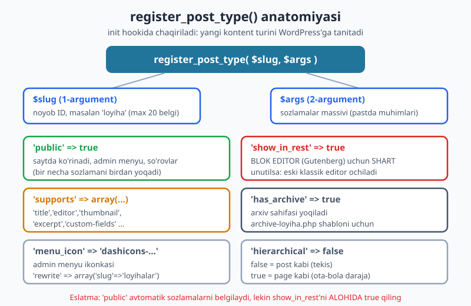
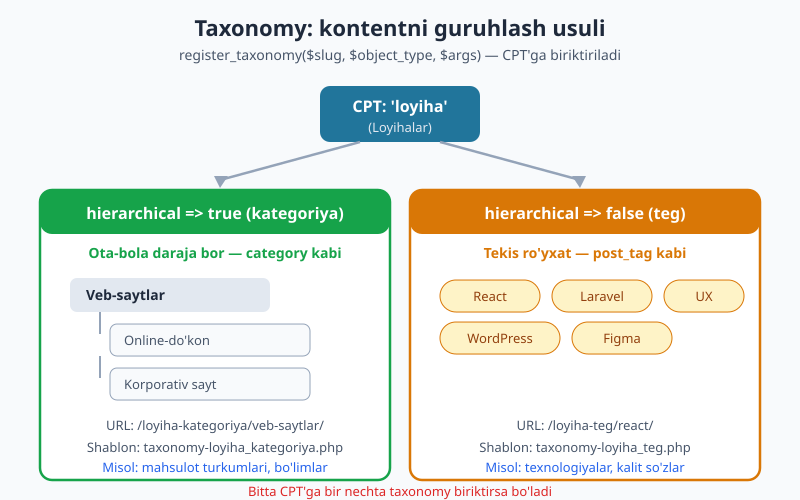
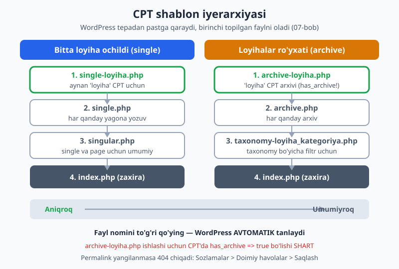

# 13 — Custom Post Type va Taxonomy

[⬅️ Oldingi: 12 — Widget'lar va dinamik sidebar](./12-widget-sidebar.md) · [🏠 README](./README.md) · [Keyingi: 14 — Custom Fields, meta va Customizer ➡️](./14-custom-fields-customizer.md)

> **Bu bobda:** WordPress'da hammasi "post" yoki "page" bo'lishi shart emas. Loyihalar, mahsulotlar, retseptlar, vakansiyalar — bularning har biri o'z **Custom Post Type** (CPT) bo'lishi mumkin. Biz `register_post_type()` bilan yangi kontent turi yaratamiz, `register_taxonomy()` bilan uni guruhlaymiz (kategoriya yoki teg kabi), `register_post_meta()` bilan qo'shimcha maydon qo'shamiz. Eng muhimi: CPT'ni **tema'da emas, plagin'da** yozish kerakligini va `show_in_rest` nega blok editor uchun shart ekanini tushunamiz.

---

## Nega oddiy "post" yetmaydi?

Tasavvur qiling, kichik biznes uchun sayt qilyapsiz. Saytda blog bor (yangiliklar) — bular oddiy **post**. "Biz haqimizda", "Aloqa" — bular **page**. Ammo bir kun mijoz aytadi: "Bizning ishlarimizni, ya'ni bajargan **loyihalar**imizni alohida bo'lim qilib chiqaringg".

Loyihalarni oddiy post sifatida yozsangiz, ular blog yangiliklari bilan aralashib ketadi. Har biriga "mijoz nomi", "loyiha sanasi", "havola" kabi maxsus maydonlar kerak. Ularni texnologiyalar bo'yicha guruhlash kerak. Oddiy post bunga yaramaydi.

Yechim — **Custom Post Type** (maxsus yozuv turi). Bu WordPress'ga: "Menga 'loyiha' degan yangi kontent turi kerak, u post'ga o'xshaydi, lekin alohida bo'lim, alohida URL, alohida admin menyu" deyish usuli.

Hayotiy o'xshatish: WordPress kontentni qutilarga soladi. Yodingizda standart qutilar bor — "Yozuvlar" (post), "Sahifalar" (page), "Media". CPT — bu **o'zingiz yasagan yangi quti**: "Loyihalar". Unga o'z yorlig'i, o'z rangi (ikonka) va o'z qoidalari bor.

Aslida WordPress'da ko'rib turgan barcha kontent turlari — `post`, `page`, `attachment`, `revision`, `nav_menu_item` — bularning hammasi **post type**. Yadro ulardan ba'zilarini sizdan yashiradi, lekin texnik jihatdan ular bir xil tizimda yashaydi. Siz shunchaki yangi turini qo'shasiz.

Bu bobning umumiy misoli: kichik biznes temasi uchun **"Loyihalar" (portfolio) CPT**. Oxirigacha unga ikkita taxonomy va meta maydonlar qo'shamiz.

---

## `register_post_type()` — yangi tur yaratish

CPT yaratish bitta funksiya bilan amalga oshadi: `register_post_type( $slug, $args )`.

- **`$slug`** — turning noyob ID'si (string). Masalan `'loyiha'`. **Maksimum 20 belgi**, kichik harf, faqat harf/raqam/pastki chiziq.
- **`$args`** — sozlamalar massivi: nomlar, ko'rinish, qo'llab-quvvatlanadigan imkoniyatlar va h.k.

Eng muhim qoida: `register_post_type()` ni **`init` hook'ida** chaqirish kerak. Bundan oldin (`init`dan avval) WordPress hali tayyor emas, keyin esa kech. 09-bobdan hook tizimini eslang — bu xuddi shu mexanizm.



Eng kichik ishlaydigan CPT shunaqa ko'rinadi:

```php
add_action( 'init', 'minbiznes_loyiha_cpt' );
function minbiznes_loyiha_cpt() {
	register_post_type(
		'loyiha',
		array(
			'public'       => true,
			'show_in_rest' => true,
		)
	);
}
```

Shu uch satr bilan admin panelda yangi "loyiha" bo'limi paydo bo'ladi. Ammo u juda bo'sh: menyuda "Loyiha" emas, balki standart yorliqlar, ikonka yo'q, arxiv yo'q. Endi har bir muhim argumentni ko'rib chiqamiz.

### Asosiy argumentlar

| Argument | Qiymat | Vazifasi |
|----------|--------|----------|
| `public` | `true` | Saytda ko'rinadi, admin menyu chiqadi, so'rovlar ishlaydi |
| `show_in_rest` | `true` | **Blok editor (Gutenberg) uchun SHART** |
| `has_archive` | `true` | Arxiv sahifasini yoqadi (`/loyihalar/`) |
| `menu_icon` | `'dashicons-portfolio'` | Admin menyu ikonkasi |
| `menu_position` | `5` | Menyuda joylashuv tartibi |
| `supports` | massiv | Qaysi tahrir maydonlari chiqadi (sarlavha, kontent, rasm...) |
| `rewrite` | `array('slug'=>'loyihalar')` | URL bo'lagi |
| `hierarchical` | `false` | `false` = post kabi, `true` = page kabi (ota-bola) |

### `supports` — qaysi maydonlar chiqsin?

`supports` argumenti tahrirlash ekranida qaysi qutilar (panel) ko'rinishini belgilaydi:

```php
'supports' => array( 'title', 'editor', 'thumbnail', 'excerpt', 'custom-fields' ),
```

- `'title'` — sarlavha maydoni
- `'editor'` — asosiy kontent (blok editor)
- `'thumbnail'` — namoyish rasmi (featured image). **Diqqat:** bu ishlashi uchun tema'da `add_theme_support('post-thumbnails')` ham bo'lishi kerak (09-bob)
- `'excerpt'` — qisqacha tavsif
- `'custom-fields'` — meta maydonlar paneli

Agar `supports`ni yozmasangiz, faqat `title` va `editor` chiqadi.

### `show_in_rest` — eng ko'p unutiladigan argument

Bu argumentni **alohida ta'kidlaymiz**, chunki u 2026-yilda kritik. WordPress 5.0'dan beri standart tahrirlovchi — **blok editor (Gutenberg)**. Blok editor ma'lumotni REST API orqali oladi. Demak:

> Agar `show_in_rest => true` qo'ymasangiz, CPT'ngizda **eski klassik editor** ochiladi (oddiy matn maydoni), bloklar emas.

Ko'pchilik "nega mening CPT'mda bloklar yo'q?" deb hayron bo'ladi — sabab aynan shu. Block tema (15-bobdan boshlanadigan FSE) bilan ishlasangiz, `show_in_rest` mutlaqo majburiy.

```php
// <!-- ❌ Eski/xato: blok editor ishlamaydi -->
register_post_type( 'kitob', array(
	'public'   => true,
	'supports' => array( 'title', 'editor' ),
	// show_in_rest yo'q!
) );

// <!-- ✅ To'g'ri -->
register_post_type( 'kitob', array(
	'public'       => true,
	'supports'     => array( 'title', 'editor' ),
	'show_in_rest' => true,
) );
```

> `'public' => true` ham `show_in_rest`'ni yoqadi deb o'ylamang. `public` boshqa narsalarni (menyu, so'rovlar ko'rinishi) yoqadi, lekin REST API'ni avtomatik yoqmaydi. Doim alohida yozing.

### `hierarchical` — post-mi yoki page-mi?

- `'hierarchical' => false` (standart) — yozuvlar **tekis**, post kabi. Ular orasida ota-bola munosabati yo'q. Loyihalar uchun shu mos.
- `'hierarchical' => true` — yozuvlar **daraja**li bo'ladi, page kabi (ota sahifa ostida bola sahifa). Masalan, hujjatlar bo'limi, bo'lim-kichik bo'lim tuzilishi uchun.

### To'liq, professional CPT

Endi labels (yorliqlar) bilan to'liq misol. Yorliqlar admin panelda ko'rinadigan o'zbekcha matnlar:

```php
add_action( 'init', 'minbiznes_loyiha_cpt' );
function minbiznes_loyiha_cpt() {
	$labels = array(
		'name'          => 'Loyihalar',
		'singular_name' => 'Loyiha',
		'add_new'       => 'Yangi qo\'shish',
		'add_new_item'  => 'Yangi loyiha qo\'shish',
		'edit_item'     => 'Loyihani tahrirlash',
		'new_item'      => 'Yangi loyiha',
		'view_item'     => 'Loyihani ko\'rish',
		'search_items'  => 'Loyiha qidirish',
		'not_found'     => 'Loyiha topilmadi',
		'all_items'     => 'Barcha loyihalar',
		'menu_name'     => 'Loyihalar',
	);

	$args = array(
		'labels'        => $labels,
		'public'        => true,
		'has_archive'   => true,
		'menu_icon'     => 'dashicons-portfolio',
		'menu_position' => 5,
		'supports'      => array( 'title', 'editor', 'thumbnail', 'excerpt', 'custom-fields' ),
		'rewrite'       => array( 'slug' => 'loyihalar' ),
		'show_in_rest'  => true,
		'hierarchical'  => false,
	);

	register_post_type( 'loyiha', $args );
}
```

Bu kodni jonli WordPress 7.0'da haqiqatan ro'yxatga oldik va tasdiqladik: `post_type_exists('loyiha')` -> `true`, `has_archive` -> `true`, `menu_icon` -> `dashicons-portfolio`, thumbnail qo'llab-quvvatlanadi.

> **`text_domain` haqida:** real loyihada yorliqlarni `__( 'Loyihalar', 'minbiznes' )` kabi tarjima funksiyalariga o'rashingiz kerak (i18n — 28-bob). Bu yerda soddalik uchun oddiy string qoldirdik.

---

## CPT'ni tema'da emas, plagin'da yozing

Bu bobning eng muhim **arxitektura darsi**. Ko'p yangi dasturchilar CPT'ni `functions.php`'ga (ya'ni tema'ga) yozadi. Bu **xato** va keyinchalik katta muammo tug'diradi.

Sababi oddiy: **tema — bu ko'rinish qatlami, kontent emas**. Foydalanuvchi temani o'zgartirsa (yangi dizaynga o'tsa), CPT tema bilan birga **yo'qoladi**. Loyihalar bazada qoladi-yu, lekin WordPress ularni "tanimaydi": admin menyuda yo'q, URL'lar 404 beradi. Mijozning yillik ishi ko'rinmay qoladi.

> **Oltin qoida:** Kontentni belgilaydigan narsa (CPT, taxonomy, meta) — **plagin**da. Kontentni ko'rsatadigan narsa (shablon, dizayn) — **tema**da.

Hayotiy o'xshatish: kontent — uy ichidagi mebel (sizniki, doimiy). Tema — devor rangi va parda. Pardani almashtirganda mebel chiqib ketmaydi. Agar CPT'ni tema'ga yozsangiz, "pardani olib tashlasangiz divan ham yo'qoladi" degani.

Amalda buni qanday qilamiz? Oddiy plagin — bu bitta PHP fayl bilan boshlanadi:

```php
<?php
/**
 * Plugin Name: MinBiznes Loyihalar
 * Description: Loyiha (portfolio) CPT va taxonomy.
 * Version: 1.0.0
 */

// (Yuqoridagi minbiznes_loyiha_cpt() funksiyasi shu yerga ko'chadi)
add_action( 'init', 'minbiznes_loyiha_cpt' );
function minbiznes_loyiha_cpt() {
	// ... yuqoridagi kod ...
}
```

Bu faylni `wp-content/plugins/minbiznes-loyihalar/minbiznes-loyihalar.php`'ga qo'yib, admin panelda yoqasiz. Endi CPT temadan **mustaqil** — istalgan temani qo'ying, loyihalar joyida qoladi.

**Istisno qachon?** Agar tema **maxsus mahsulot** bo'lsa va CPT u bilan ajralmas bog'liq bo'lsa (masalan, ThemeForest'dagi portfolio tema), ba'zida CPT tema bilan birga keladi. Bunda ham yaxshi amaliyot — uni `mu-plugins`'ga yoki ichki plagin'ga ajratish. Lekin bu bobda biz **shablonlarni** tema'da, **ro'yxatga olishni** esa kontseptual ravishda plagin'da deb ko'ramiz. Quyidagi misollarda kodni `functions.php`'da ko'rsatamiz (o'rganish qulay bo'lishi uchun), ammo eslang — real loyihada u plagin'ga ko'chadi.

---

## `register_taxonomy()` — kontentni guruhlash

CPT yozuvlarini guruhlash kerak bo'ladi. WordPress'da guruhlashning standart usuli ikkita: **kategoriya** (category) va **teg** (tag). Bularning ikkalasi ham **taxonomy** deb ataladigan tizimning ko'rinishlari.

Taxonomy — bu yozuvlarni tasniflash usuli. O'zingizning maxsus taxonomy'ngizni `register_taxonomy()` bilan yaratasiz:

```php
register_taxonomy( $slug, $object_type, $args );
```

- **`$slug`** — taxonomy ID'si, masalan `'loyiha_kategoriya'`
- **`$object_type`** — qaysi CPT(lar)ga biriktiriladi, masalan `'loyiha'`
- **`$args`** — sozlamalar

Eng muhim sozlama — `hierarchical`. U taxonomy kategoriya kabimi yoki teg kabimi ekanini belgilaydi:



- **`'hierarchical' => true`** — **kategoriya** kabi. Ota-bola daraja bor (masalan "Veb-saytlar" > "Online-do'kon"). Tahrirlash ekranida belgilash kataklari (checkbox) chiqadi.
- **`'hierarchical' => false`** — **teg** kabi. Tekis ro'yxat, daraja yo'q. Tahrirlash ekranida erkin yozma maydon (vergul bilan) chiqadi.

Loyihalar uchun ikkita taxonomy qilamiz: kategoriya (turlar bo'yicha) va teg (texnologiyalar bo'yicha):

```php
add_action( 'init', 'minbiznes_loyiha_taxonomiyalar' );
function minbiznes_loyiha_taxonomiyalar() {
	// Kategoriya (hierarchical) — loyiha turlari
	register_taxonomy(
		'loyiha_kategoriya',
		'loyiha',
		array(
			'labels'       => array(
				'name'          => 'Loyiha kategoriyalari',
				'singular_name' => 'Kategoriya',
			),
			'public'       => true,
			'hierarchical' => true,
			'show_in_rest' => true,
			'rewrite'      => array( 'slug' => 'loyiha-kategoriya' ),
		)
	);

	// Teg (flat) — texnologiyalar
	register_taxonomy(
		'loyiha_teg',
		'loyiha',
		array(
			'labels'       => array( 'name' => 'Loyiha teglari' ),
			'public'       => true,
			'hierarchical' => false,
			'show_in_rest' => true,
			'rewrite'      => array( 'slug' => 'loyiha-teg' ),
		)
	);
}
```

Bu yerda ham `show_in_rest => true` muhim — usiz taxonomy paneli blok editor sidebar'ida ko'rinmaydi. Jonli WP 7.0'da ikkala taxonomy ham ro'yxatga olindi (`taxonomy_exists` -> `true`) va `get_object_taxonomies('loyiha')` ikkalasini ham qaytaradi.

### Mavjud taxonomy'ni CPT'ga biriktirish

Ba'zan yangi taxonomy yaratish shart emas — oddiy post teglari (`post_tag`) yoki kategoriyalarini (`category`) CPT'ga ham ulatish mumkin:

```php
register_taxonomy_for_object_type( 'post_tag', 'loyiha' );
```

Buni `init`'da, CPT ro'yxatga olingandan **keyin** chaqiring. Shunda loyihalar ham oddiy blog teglarini ishlatadi.

### Taxonomy nomlarida ehtiyot bo'ling

Taxonomy slug'i `category`, `post_tag`, `type`, `tag`, `terms` kabi WordPress zaxiralangan so'zlari bilan to'qnashmasin. Shuning uchun `loyiha_kategoriya` kabi prefiks bilan noyob nom bering. Bu boshqa plaginlar bilan to'qnashuvning oldini oladi.

---

## CPT uchun shablonlar

CPT'ni ro'yxatga oldik, admin panelda loyiha qo'shdik. Endi uni **saytda chiroyli ko'rsatish** kerak. Mana shu yerda tema ishga tushadi: CPT shablonlari **tema'da** yashaydi (chunki bu ko'rinish).

07-bobdagi shablon iyerarxiyasini eslang — WordPress aniqdan umumiyga qarab fayl izlaydi. CPT uchun ham xuddi shu mantiq, faqat yangi fayl nomlari qo'shiladi:



### Bitta loyiha: `single-loyiha.php`

Foydalanuvchi bitta loyihani ochganda WordPress avval `single-loyiha.php`'ni izlaydi, topmasa `single.php`'ga, keyin `singular.php`'ga, oxirida `index.php`'ga tushadi.

```php
<?php
// single-loyiha.php
get_header();

while ( have_posts() ) {
	the_post();
	?>
	<article <?php post_class( 'loyiha-single' ); ?>>
		<h1><?php the_title(); ?></h1>

		<?php
		$mijoz = get_post_meta( get_the_ID(), 'loyiha_mijoz', true );
		if ( $mijoz ) {
			echo '<p class="mijoz">Mijoz: ' . esc_html( $mijoz ) . '</p>';
		}

		$kategoriyalar = get_the_term_list( get_the_ID(), 'loyiha_kategoriya', 'Kategoriya: ', ', ' );
		if ( $kategoriyalar ) {
			echo '<p class="kat">' . wp_kses_post( $kategoriyalar ) . '</p>';
		}

		if ( has_post_thumbnail() ) {
			the_post_thumbnail( 'large' );
		}

		the_content();
		?>
	</article>
	<?php
}

get_footer();
```

`get_the_term_list()` — yozuvga biriktirilgan taxonomy atamalarini havola sifatida chiqaradi. Diqqat: chiqishni **escape** qilamiz (`esc_html`, `wp_kses_post`) — bu 27-bobda chuqur o'rganiladigan xavfsizlik qoidasi, lekin odatni hozirdan boshlaymiz.

### Loyihalar ro'yxati: `archive-loyiha.php`

CPT'da `has_archive => true` bo'lgani uchun `/loyihalar/` URL'ida arxiv sahifasi paydo bo'ladi. Uni `archive-loyiha.php` boshqaradi:

```php
<?php
// archive-loyiha.php
get_header();
?>
<h1><?php post_type_archive_title(); ?></h1>

<div class="loyiha-grid">
<?php
if ( have_posts() ) {
	while ( have_posts() ) {
		the_post();
		?>
		<a class="loyiha-karta" href="<?php the_permalink(); ?>">
			<?php
			if ( has_post_thumbnail() ) {
				the_post_thumbnail( 'medium' );
			}
			?>
			<h2><?php the_title(); ?></h2>
			<?php the_excerpt(); ?>
		</a>
		<?php
	}
	the_posts_pagination();
} else {
	echo '<p>Hozircha loyiha yo\'q.</p>';
}
?>
</div>
<?php
get_footer();
```

`post_type_archive_title()` — arxiv sarlavhasini ("Loyihalar") chiqaradi.

### Taxonomy arxivi: `taxonomy-{taxonomy}.php`

Foydalanuvchi bitta kategoriyani bossa (masalan `/loyiha-kategoriya/veb-saytlar/`), WordPress `taxonomy-loyiha_kategoriya.php`'ni izlaydi, topmasa `taxonomy.php`'ga, keyin `archive.php`'ga tushadi. Hatto aniqroq: `taxonomy-loyiha_kategoriya-veb-saytlar.php` — faqat shu atama uchun.

Bu yerda yangi shablon yozmasangiz ham bo'ladi — `archive.php` (yoki block tema'da `archive.html`) avtomatik ishlaydi.

> **Block tema'da-chi?** 18-bobda ko'ramiz: block tema'da PHP shablon o'rniga `templates/single-loyiha.html` (block markup) ishlatiladi. Iyerarxiya mantig'i bir xil, faqat fayl formati HTML.

---

## Permalink va `flush_rewrite_rules()`

CPT yangi URL'lar yaratadi (`/loyihalar/`, `/loyiha-kategoriya/...`). WordPress bu URL'larni **rewrite rules** (qayta yozish qoidalari) degan ichki ro'yxatda saqlaydi va bu ro'yxatni keshlaydi. Yangi CPT qo'shganingizda kesh hali eskicha — natijada loyiha sahifasini ochsangiz **404 xato** chiqadi.

Eng oddiy yechim (qo'lda): admin panelda **Sozlamalar > Doimiy havolalar (Permalinks)** sahifasiga kiring va hech narsa o'zgartirmasdan **"Saqlash"** tugmasini bosing. Bu rewrite qoidalarini yangilaydi.

Dasturda buni `flush_rewrite_rules()` qiladi. Ammo **muhim ogohlantirish**:

> `flush_rewrite_rules()` — **og'ir** amal. Uni **hech qachon** `init`'da yoki har so'rovda chaqirmang. Faqat **aktivlashtirishda bir marta** chaqiring.

To'g'ri usul — plagin/tema aktivlashtirilganda:

```php
// Plagin uchun:
register_activation_hook( __FILE__, 'minbiznes_activate' );
function minbiznes_activate() {
	minbiznes_loyiha_cpt();          // avval CPT ro'yxatga olinsin
	minbiznes_loyiha_taxonomiyalar(); // taxonomy ham
	flush_rewrite_rules();           // keyin qoidalarni yangila
}
```

Tema'da `register_activation_hook` yo'q, o'rniga `after_switch_theme` ishlatiladi:

```php
add_action( 'after_switch_theme', 'minbiznes_flush_rewrite' );
function minbiznes_flush_rewrite() {
	minbiznes_loyiha_cpt();
	minbiznes_loyiha_taxonomiyalar();
	flush_rewrite_rules();
}
```

Diqqat qiling: flush'dan **oldin** CPT'ni ro'yxatga olamiz — aks holda WordPress hali yangi qoidalarni bilmaydi va flush foydasiz bo'ladi.

---

## `register_post_meta()` — qo'shimcha maydonlar

Loyihaga "mijoz nomi", "sayt havolasi" kabi maxsus ma'lumotlar kerak. Bular **post meta** (metama'lumot) — yozuvga biriktirilgan kalit-qiymat juftliklari.

Meta o'qish/yozishni 14-bobda chuqur ko'ramiz, lekin CPT bilan birga keladigan muhim qism — meta'ni **ro'yxatga olish**. `register_post_meta()` meta maydonini WordPress'ga tanitadi, REST API'ga (demak blok editor'ga) ochadi va sanitizatsiya qoidasini biriktiradi:

```php
add_action( 'init', 'minbiznes_loyiha_meta' );
function minbiznes_loyiha_meta() {
	register_post_meta(
		'loyiha',
		'loyiha_mijoz',
		array(
			'type'              => 'string',
			'single'            => true,
			'show_in_rest'      => true,
			'sanitize_callback' => 'sanitize_text_field',
			'auth_callback'     => function () {
				return current_user_can( 'edit_posts' );
			},
		)
	);

	register_post_meta(
		'loyiha',
		'loyiha_url',
		array(
			'type'              => 'string',
			'single'            => true,
			'show_in_rest'      => true,
			'sanitize_callback' => 'esc_url_raw',
		)
	);
}
```

- `'type'` — ma'lumot turi (`string`, `integer`, `boolean`, `number`)
- `'single' => true` — bitta qiymat (massiv emas)
- `'show_in_rest' => true` — blok editor va REST API uchun ochadi
- `'sanitize_callback'` — saqlashdan oldin tozalash funksiyasi (kirishni xavfsizlash)
- `'auth_callback'` — kim REST orqali o'zgartira oladi

Bu meta jonli WP 7.0'da ro'yxatga olindi va `get_registered_meta_keys('post','loyiha')` ro'yxatida ko'rindi.

---

## Hammasini birlashtirib: amaliy oqim

Loyihalar funksiyasini ishga tushirish bo'yicha to'liq tartib:

1. **Plagin** yarating (yoki o'rganish uchun `functions.php`'da boshlang).
2. `init`'da `register_post_type('loyiha', ...)` — `show_in_rest => true` bilan.
3. `init`'da `register_taxonomy('loyiha_kategoriya', 'loyiha', ...)` va `loyiha_teg`.
4. `init`'da `register_post_meta('loyiha', ...)` — mijoz, URL.
5. **Permalink'ni yangilang** (aktivlashtirishda `flush_rewrite_rules()` yoki qo'lda "Saqlash").
6. **Tema'da** `single-loyiha.php` va `archive-loyiha.php` yozing.
7. Admin panelda bir nechta loyiha qo'shing, taxonomy belgilang.

Yodda tuting: 2-4 va 5-qadamlar — **plagin** (kontent). 6-qadam — **tema** (ko'rinish). Mana shu ajratish professional yondashuvning kaliti.

> Butun ro'yxatga olish kodi (CPT + 2 taxonomy + meta + `register_taxonomy_for_object_type`) jonli WordPress 7.0'da to'liq sinab ko'rildi: `post_type_exists('loyiha')` -> `true`, ikkala taxonomy mavjud, `get_object_taxonomies('loyiha')` -> `post_tag, loyiha_kategoriya, loyiha_teg`, meta kalitlar ro'yxatga olindi. Barcha PHP bloklari `php -l` bilan tekshirilgan.

---

## Mashqlar

### Oson

1. `init` hook'ida `mahsulot` degan CPT'ni ro'yxatga oling: `public => true`, `show_in_rest => true`. Admin menyuda paydo bo'lishini ta'minlang.
2. Yuqoridagi `mahsulot` CPT'iga o'zbekcha yorliqlar (`labels`) qo'shing: `name` = "Mahsulotlar", `singular_name` = "Mahsulot", `add_new_item` = "Yangi mahsulot qo'shish".
3. `mahsulot` CPT'iga `menu_icon` sifatida `dashicons-cart` va `supports` ga `title`, `editor`, `thumbnail` qo'shing.
4. `mahsulot` CPT'iga `has_archive => true` va `rewrite` slug'ini `'mahsulotlar'` qiling, so'ng permalink'ni nima uchun yangilash kerakligini bir jumlada yozing.

### O'rta

5. `mahsulot` uchun **hierarchical** (kategoriya kabi) taxonomy yarating: slug `mahsulot_turkum`, CPT'ga biriktiring, `show_in_rest => true`.
6. Xuddi shu CPT uchun **flat** (teg kabi) taxonomy yarating: slug `mahsulot_belgi`, `hierarchical => false`.
7. `single-mahsulot.php` shabloni yozing: sarlavha, namoyish rasmi (agar bor bo'lsa) va kontentni chiqaring. `get_header()`/`get_footer()` ni unutmang.
8. `archive-mahsulot.php` yozing: barcha mahsulotlarni grid'da, har birida sarlavha va `the_permalink()` havolasi bilan ko'rsating.

### Qiyin

9. **Xatoni toping:** quyidagi CPT'da yozuvni tahrirlaganda blok editor o'rniga eski klassik editor chiqyapti. Sababini toping va tuzating:
   ```php
   register_post_type( 'vakansiya', array(
       'public'   => true,
       'supports' => array( 'title', 'editor' ),
   ) );
   ```
10. Tema aktivlashtirilganda (`after_switch_theme`) CPT va taxonomy ro'yxatga olinib, `flush_rewrite_rules()` ishlaydigan kod yozing. Nega flush'dan oldin ro'yxatga olish kerakligini izohlang.
11. `register_post_meta()` bilan `mahsulot`ga `narx` (integer) va `mavjud` (boolean) meta maydonlarini ro'yxatga oling. Ikkalasiga ham `show_in_rest => true` va mos `sanitize_callback` bering.
12. `pre_get_posts` hook'i bilan bosh sahifa asosiy loop'iga `mahsulot` CPT'ini qo'shing (post bilan birga ko'rinsin). Admin panelda ishlamasligini ta'minlang (`is_admin()` tekshiruvi).
13. **Arxitektura savoli + kod:** mijoz CPT'ini `functions.php`'ga yozgan. Tema almashtirilganda mahsulotlar yo'qolgan. Muammoni tushuntiring va to'g'ri yechimni (plagin) — minimal plagin sarlavhasi (`Plugin Name` izohi) bilan birga — ko'rsating.
14. `WP_Query` bilan `mahsulot_turkum` taxonomy'sida `'aksiya'` atamasiga tegishli oxirgi 4 ta mahsulotni oling (`tax_query` ishlating) va `wp_reset_postdata()` ni unutmang.

## Yechimlar

<details markdown="1">
<summary>Yechim — 1</summary>

```php
add_action( 'init', 'shop_mahsulot_cpt' );
function shop_mahsulot_cpt() {
	register_post_type(
		'mahsulot',
		array(
			'public'       => true,
			'show_in_rest' => true,
		)
	);
}
```

`init` hook'i — CPT ro'yxatga olishning to'g'ri vaqti. `public => true` admin menyuni chiqaradi, `show_in_rest => true` esa blok editor uchun.

</details>

<details markdown="1">
<summary>Yechim — 2</summary>

```php
add_action( 'init', 'shop_mahsulot_cpt' );
function shop_mahsulot_cpt() {
	$labels = array(
		'name'         => 'Mahsulotlar',
		'singular_name'=> 'Mahsulot',
		'add_new_item' => 'Yangi mahsulot qo\'shish',
	);
	register_post_type(
		'mahsulot',
		array(
			'labels'       => $labels,
			'public'       => true,
			'show_in_rest' => true,
		)
	);
}
```

`labels` massivi admin paneldagi barcha matnlarni o'zbekchaga aylantiradi. Apostrof ASCII `'` va PHP string ichida `\'` bilan escape qilinadi.

</details>

<details markdown="1">
<summary>Yechim — 3</summary>

```php
$args = array(
	'labels'       => $labels,
	'public'       => true,
	'show_in_rest' => true,
	'menu_icon'    => 'dashicons-cart',
	'supports'     => array( 'title', 'editor', 'thumbnail' ),
);
register_post_type( 'mahsulot', $args );
```

`dashicons-cart` — WordPress yadro ikonkalaridan. `thumbnail` ishlashi uchun tema'da `add_theme_support( 'post-thumbnails' )` ham bo'lishi kerak (09-bob).

</details>

<details markdown="1">
<summary>Yechim — 4</summary>

```php
$args = array(
	'labels'       => $labels,
	'public'       => true,
	'show_in_rest' => true,
	'has_archive'  => true,
	'rewrite'      => array( 'slug' => 'mahsulotlar' ),
);
register_post_type( 'mahsulot', $args );
```

**Permalink'ni yangilash kerak**, chunki yangi CPT `/mahsulotlar/` kabi yangi URL qoidalarini qo'shadi, lekin WordPress rewrite qoidalarini keshlaydi. Yangilamasangiz, arxiv va yakka sahifalar 404 beradi. Admin'da "Sozlamalar > Doimiy havolalar > Saqlash" yoki aktivlashtirishda `flush_rewrite_rules()`.

</details>

<details markdown="1">
<summary>Yechim — 5</summary>

```php
add_action( 'init', 'shop_mahsulot_turkum' );
function shop_mahsulot_turkum() {
	register_taxonomy(
		'mahsulot_turkum',
		'mahsulot',
		array(
			'labels'       => array(
				'name'          => 'Mahsulot turkumlari',
				'singular_name' => 'Turkum',
			),
			'public'       => true,
			'hierarchical' => true,
			'show_in_rest' => true,
		)
	);
}
```

`hierarchical => true` — kategoriya kabi (ota-bola, checkbox). Ikkinchi argument `'mahsulot'` — taxonomy'ni shu CPT'ga biriktiradi.

</details>

<details markdown="1">
<summary>Yechim — 6</summary>

```php
add_action( 'init', 'shop_mahsulot_belgi' );
function shop_mahsulot_belgi() {
	register_taxonomy(
		'mahsulot_belgi',
		'mahsulot',
		array(
			'labels'       => array( 'name' => 'Mahsulot belgilari' ),
			'public'       => true,
			'hierarchical' => false,
			'show_in_rest' => true,
		)
	);
}
```

`hierarchical => false` — teg kabi (tekis, vergulli erkin maydon). Bitta CPT'ga ham kategoriya, ham teg taxonomy'sini biriktirish odatiy hol.

</details>

<details markdown="1">
<summary>Yechim — 7</summary>

```php
<?php
// single-mahsulot.php
get_header();

while ( have_posts() ) {
	the_post();
	?>
	<article <?php post_class(); ?>>
		<h1><?php the_title(); ?></h1>
		<?php
		if ( has_post_thumbnail() ) {
			the_post_thumbnail( 'large' );
		}
		the_content();
		?>
	</article>
	<?php
}

get_footer();
```

`single-{cpt}.php` — shablon iyerarxiyasida `single.php`'dan ustun. `has_post_thumbnail()` rasm borligini tekshiradi, keyin `the_post_thumbnail()` chiqaradi.

</details>

<details markdown="1">
<summary>Yechim — 8</summary>

```php
<?php
// archive-mahsulot.php
get_header();
?>
<h1><?php post_type_archive_title(); ?></h1>
<div class="mahsulot-grid">
<?php
while ( have_posts() ) {
	the_post();
	?>
	<a class="karta" href="<?php the_permalink(); ?>">
		<h2><?php the_title(); ?></h2>
	</a>
	<?php
}
the_posts_pagination();
?>
</div>
<?php
get_footer();
```

`archive-{cpt}.php` faqat CPT'da `has_archive => true` bo'lsa ishlaydi. `post_type_archive_title()` arxiv sarlavhasini chiqaradi.

</details>

<details markdown="1">
<summary>Yechim — 9</summary>

**Muammo:** `show_in_rest` yo'q. Blok editor REST API orqali ishlaydi, shuning uchun usiz eski klassik editor ochiladi.

```php
register_post_type( 'vakansiya', array(
	'public'       => true,
	'supports'     => array( 'title', 'editor' ),
	'show_in_rest' => true, // <-- qo'shildi
) );
```

`show_in_rest => true` qo'shilishi bilan blok editor (Gutenberg) qaytadi. Bu eng ko'p uchraydigan CPT xatosi.

</details>

<details markdown="1">
<summary>Yechim — 10</summary>

```php
add_action( 'after_switch_theme', 'shop_flush' );
function shop_flush() {
	shop_mahsulot_cpt();      // CPT ro'yxatga olinsin
	shop_mahsulot_turkum();   // taxonomy ham
	flush_rewrite_rules();    // keyin qoidalarni yangila
}
```

**Nega flush'dan oldin ro'yxatga olamiz?** `flush_rewrite_rules()` joriy ro'yxatga olingan turlar asosida URL qoidalarini qayta quradi. Agar CPT hali ro'yxatga olinmagan bo'lsa, flush eski (CPT'siz) holatni keshlaydi — natijada 404 davom etadi. Shuning uchun avval `register_post_type`/`register_taxonomy`, keyin flush. Va flush — faqat aktivlashtirishda, `init`'da emas (og'ir amal).

</details>

<details markdown="1">
<summary>Yechim — 11</summary>

```php
add_action( 'init', 'shop_mahsulot_meta' );
function shop_mahsulot_meta() {
	register_post_meta(
		'mahsulot',
		'narx',
		array(
			'type'              => 'integer',
			'single'            => true,
			'show_in_rest'      => true,
			'sanitize_callback' => 'absint',
		)
	);
	register_post_meta(
		'mahsulot',
		'mavjud',
		array(
			'type'              => 'boolean',
			'single'            => true,
			'show_in_rest'      => true,
			'sanitize_callback' => 'rest_sanitize_boolean',
		)
	);
}
```

`absint` — musbat butun songa aylantiradi (narx uchun ideal). `rest_sanitize_boolean` — turli ko'rinishdagi qiymatlarni (`true`/`1`/`'yes'`) boolean'ga keltiradi. `show_in_rest => true` ikkalasini ham blok editor'ga ochadi.

</details>

<details markdown="1">
<summary>Yechim — 12</summary>

```php
add_action( 'pre_get_posts', 'shop_bosh_sahifa_mahsulot' );
function shop_bosh_sahifa_mahsulot( $query ) {
	if ( ! is_admin() && $query->is_main_query() && $query->is_home() ) {
		$query->set( 'post_type', array( 'post', 'mahsulot' ) );
	}
}
```

`pre_get_posts` so'rov bajarilishidan oldin ishlaydi (05-bobdan). Uchta shart kritik: `! is_admin()` (admin panelni buzmaslik), `is_main_query()` (faqat asosiy loop, har bir `WP_Query` emas), `is_home()` (faqat bosh sahifa). `post_type`'ni massivga o'rnatamiz, shunda post va mahsulot birga chiqadi.

</details>

<details markdown="1">
<summary>Yechim — 13</summary>

**Muammo:** CPT `functions.php`'da (tema'da) ro'yxatga olingan. Tema almashtirilganda eski tema o'chadi, demak `register_post_type` chaqirilmaydi. Mahsulotlar bazada qoladi, lekin WordPress ularni "tanimaydi": admin menyuda yo'q, URL'lar 404. Kontentni ko'rinish qatlamiga (tema) bog'lab qo'yish — arxitektura xatosi.

**Yechim — plagin:** kontentni belgilaydigan kod tema'dan mustaqil bo'lishi kerak.

```php
<?php
/**
 * Plugin Name: Shop Mahsulotlar
 * Description: Mahsulot CPT va taxonomy (kontent qatlami).
 * Version: 1.0.0
 */

add_action( 'init', 'shop_mahsulot_cpt' );
function shop_mahsulot_cpt() {
	register_post_type(
		'mahsulot',
		array(
			'public'       => true,
			'show_in_rest' => true,
			'has_archive'  => true,
		)
	);
}
```

Faylni `wp-content/plugins/shop-mahsulotlar/shop-mahsulotlar.php`'ga qo'yib aktivlashtiring. Endi istalgan temani qo'ying — mahsulotlar joyida qoladi. Tema esa faqat `single-mahsulot.php` shablonini beradi (ko'rinish).

</details>

<details markdown="1">
<summary>Yechim — 14</summary>

```php
$q = new WP_Query(
	array(
		'post_type'      => 'mahsulot',
		'posts_per_page' => 4,
		'tax_query'      => array(
			array(
				'taxonomy' => 'mahsulot_turkum',
				'field'    => 'slug',
				'terms'    => 'aksiya',
			),
		),
	)
);

if ( $q->have_posts() ) {
	while ( $q->have_posts() ) {
		$q->the_post();
		the_title( '<h3>', '</h3>' );
	}
	wp_reset_postdata();
}
```

`post_type => 'mahsulot'` — CPT'dan oladi. `tax_query` taxonomy bo'yicha filtrlaydi: `field => 'slug'` va `terms => 'aksiya'`. Ikkilamchi `WP_Query`dan keyin `wp_reset_postdata()` shart — aks holda keyingi `the_title()` global postni buzadi (05-bob).

</details>

---

[⬅️ Oldingi: 12 — Widget'lar va dinamik sidebar](./12-widget-sidebar.md) · [🏠 README](./README.md) · [Keyingi: 14 — Custom Fields, meta va Customizer ➡️](./14-custom-fields-customizer.md)
