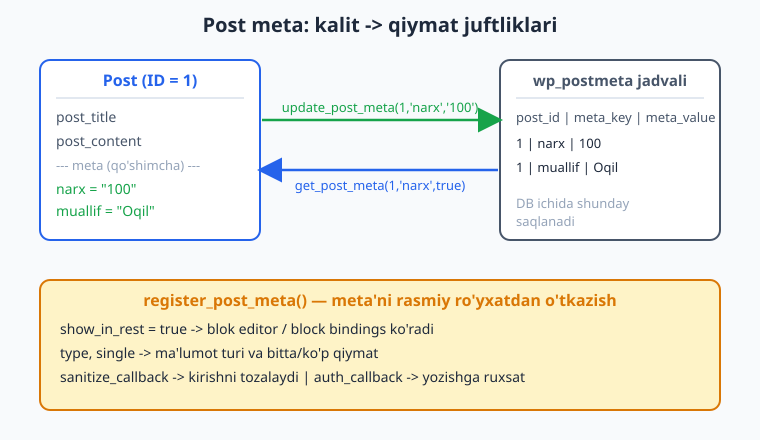
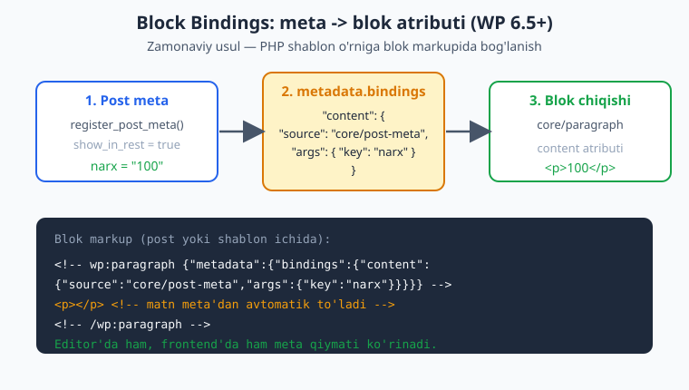
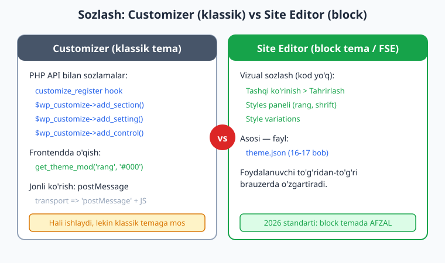

# 14 — Custom Fields, meta va Customizer

[⬅️ Oldingi: 13 — Custom Post Type va Taxonomy](./13-custom-post-type-taxonomy.md) · [🏠 README](./README.md) · [Keyingi: 15 — Block temaga kirish ➡️](./15-block-temaga-kirish.md)

> **Bu bobda:** Postga "qo'shimcha maydonlar" qo'shishni o'rganamiz — masalan, kitobga "narx" yoki "muallif" maydoni. Bu **post meta** deb ataladi: `get_post_meta`, `update_post_meta` va ularni rasmiy ro'yxatdan o'tkazuvchi `register_post_meta`. So'ng zamonaviy **Block Bindings API** bilan meta'ni to'g'ridan-to'g'ri blokga bog'lashni ko'ramiz (WP 6.5+ — PHP shablon yozmasdan). Oxirida klassik **Customizer** (`customize_register`, `get_theme_mod`) bilan tanishamiz va nega block temada uning o'rnini **Site Editor** egallaganini tushunamiz.

---

## Post meta nima?

Tasavvur qiling: blogingizda kitoblar haqida postlar bor. Har bir kitobning sarlavhasi (`post_title`) va matni (`post_content`) WordPress'da tayyor maydonlarda saqlanadi. Lekin sizga **qo'shimcha** narsa kerak: kitobning narxi, muallifi, sahifalar soni. Bu maydonlar WordPress'da standart emas — siz ularni o'zingiz qo'shasiz. Mana shu qo'shimcha maydonlar — **post meta** (yoki "custom fields").

Hayotiy o'xshatish: post — bu pasport. Ism va familiya (title, content) doim bor. Lekin pasportga qo'shimcha **muhrlar** (viza, ro'yxatdan o'tish) bosiladi — bular meta. Har bir muhr **nomi** (meta_key) va **mazmuni** (meta_value) bilan keladi.

Texnik jihatdan: har bir meta — `kalit => qiymat` (key/value) juftligi, alohida `wp_postmeta` jadvalida saqlanadi. Bitta postda istalgancha meta bo'lishi mumkin.



> 13-bobda Custom Post Type (CPT) yaratdik. Meta ko'pincha CPT bilan birga ishlatiladi: masalan "Kitob" CPT'iga "narx", "ISBN", "muallif" meta'lari. CPT — bu yangi **tur**, meta — har bir yozuvga **qo'shimcha maydonlar**.

---

## Meta funksiyalari: o'qish va yozish

WordPress meta bilan ishlash uchun to'rtta asosiy funksiya beradi. Hammasi `wp-includes/meta.php` da, jonli WP 7.0'da tasdiqlangan.

### `get_post_meta()` — o'qish

```php
$qiymat = get_post_meta( $post_id, $kalit, $single );
```

- `$post_id` — qaysi postning meta'si.
- `$kalit` — meta nomi (masalan `'narx'`). Bo'sh qoldirilsa — barcha meta.
- `$single` — **eng muhim parametr**:
  - `true` — bitta qiymatni to'g'ridan-to'g'ri qaytaradi (string yoki avtomatik unserialize qilingan massiv).
  - `false` (standart) — qiymatlar **massivini** qaytaradi (bitta kalitda bir nechta qiymat bo'lishi mumkin).

Jonli WP 7.0'da sinab ko'rildi:

```php
// update_post_meta(1, 'narx', '100') dan keyin:
get_post_meta( 1, 'narx', true );   // "100"  (string)
get_post_meta( 1, 'narx', false );  // array( "100" )  (massiv)
```

**Muhim qoida:** mavjud bo'lmagan kalitni so'rasangiz:
- `$single = true` -> bo'sh string `""` qaytaradi (jonli tasdiqlangan).
- `$single = false` -> bo'sh massiv `array()` qaytaradi.

Shuning uchun deyarli **har doim `true`** ishlatamiz (bitta qiymat kerak bo'lganda) va natijani tekshiramiz:

```php
$narx = get_post_meta( get_the_ID(), 'narx', true );
if ( $narx !== '' ) {
	echo '<p class="narx">' . esc_html( $narx ) . ' so\'m</p>';
}
```

> Diqqat: chiqishda doim `esc_html()` (yoki mos escaping). Meta'ni foydalanuvchi kiritgan bo'lishi mumkin — 27-bobda chuqur ko'ramiz, lekin odatni hoziroq saqlaymiz: **"har chiqishni escape qil"**.

### `update_post_meta()` — yozish (yoki yangilash)

```php
update_post_meta( $post_id, $kalit, $qiymat );
```

Bu **eng ko'p ishlatiladigan** yozish funksiyasi. Mantiq oddiy:
- Agar kalit hali yo'q bo'lsa — yangi meta yaratadi.
- Agar bor bo'lsa — qiymatni yangilaydi.

Jonli WP 7.0'da tasdiqlangan: `update_post_meta(1, 'narx', '100')` keyin `get_post_meta(1, 'narx', true)` -> `"100"`.

To'rtinchi, ixtiyoriy parametr — `$prev_value`. Bu faqat **aniq eski qiymatga** ega yozuvni yangilaydi (bir nechta bir xil kalitli meta bo'lganda foydali):

```php
// Faqat qiymati 'qoralama' bo'lganini 'nashr' ga o'zgartiradi.
update_post_meta( 1, 'holat', 'nashr', 'qoralama' );
```

Bu ham jonli tekshirildi — `true` qaytardi va qiymat `nashr` bo'ldi.

### `add_post_meta()` — qo'shish

```php
add_post_meta( $post_id, $kalit, $qiymat, $unique );
```

`update_post_meta` dan farqi: `add_post_meta` **har safar yangi yozuv** qo'shadi. Bitta kalitda bir nechta qiymat saqlash kerak bo'lganda ishlatiladi (masalan, postning bir nechta "teg"i):

```php
add_post_meta( 1, 'rang', 'kok' );
add_post_meta( 1, 'rang', 'yashil' );
get_post_meta( 1, 'rang', false ); // array( "kok", "yashil" )
```

Bu jonli WP 7.0'da aynan shunday natija berdi. To'rtinchi `$unique = true` parametri — agar kalit allaqachon bor bo'lsa, qo'shmaydi (yagonalikni kafolatlaydi).

> **Qachon `add` vs `update`?** Bitta qiymat kerakmi (narx, ISBN) — `update_post_meta`. Bir nechta qiymat kerakmi (bir nechta rang, bir nechta fayl) — `add_post_meta` + `get_post_meta(..., false)`.

### `delete_post_meta()` — o'chirish

```php
delete_post_meta( $post_id, $kalit );          // shu kalitning barcha qiymatlari
delete_post_meta( $post_id, $kalit, $qiymat ); // faqat aynan shu qiymat
```

Jonli tasdiqlangan: o'chirilgandan keyin `get_post_meta(1, 'narx', true)` -> `""`.

### Massivlarni saqlash

Meta qiymati string bo'lishi shart emas — massiv yoki obyekt ham bo'la oladi. WordPress uni avtomatik **serialize** qiladi (saqlashda) va **unserialize** qiladi (o'qishda):

```php
update_post_meta( 1, 'sozlamalar', array( 'rang' => 'kok', 'soni' => 5 ) );
$s = get_post_meta( 1, 'sozlamalar', true ); // array( 'rang' => 'kok', 'soni' => 5 )
```

Jonli WP 7.0'da bu massiv aynan saqlanib, qayta o'qildi. (`$single = true` shart — aks holda massiv ichida massiv qaytadi.)

---

## `register_post_meta()` — meta'ni rasmiy ro'yxatdan o'tkazish

Yuqoridagi funksiyalar meta'ni saqlaydi va o'qiydi, lekin WordPress bu meta haqida hech narsa **bilmaydi** — uning turi qanday, REST API'da ko'rinadimi, kim yoza oladi. Zamonaviy WordPress'da (ayniqsa **blok editor** va **block bindings** uchun) meta'ni rasmiy ro'yxatdan o'tkazish **muhim**.

```php
function tema_meta_royxat() {
	register_post_meta(
		'post', // post turi (yoki '' barcha turlar uchun)
		'narx',
		array(
			'show_in_rest'      => true,        // blok editor / block bindings KO'RADI
			'single'            => true,        // bitta qiymat
			'type'              => 'string',    // string, integer, number, boolean
			'sanitize_callback' => 'sanitize_text_field',
			'auth_callback'     => function () {
				return current_user_can( 'edit_posts' );
			},
			'default'           => '',
		)
	);
}
add_action( 'init', 'tema_meta_royxat' );
```

Bu kod jonli WP 7.0'da `register_post_meta(...)` -> `true` qaytardi va `get_registered_meta_keys('post', 'post')` ro'yxatida `narx` paydo bo'ldi (`show_in_rest = true` bilan).

Asosiy kalitlar:

| Kalit | Vazifasi |
|-------|----------|
| `show_in_rest` | `true` bo'lsa, meta REST API'da chiqadi — **blok editor va block bindings shart qiladi**. |
| `single` | `true` — bitta qiymat; `false` — qiymatlar massivi. |
| `type` | Ma'lumot turi: `string`, `integer`, `number`, `boolean`, `array`, `object`. |
| `sanitize_callback` | Saqlashdan oldin qiymatni tozalaydi (xavfsizlik). |
| `auth_callback` | `true` qaytarsa, foydalanuvchi REST orqali meta'ni o'zgartira oladi. |
| `default` | Meta yo'q bo'lsa qaytariladigan standart qiymat. |

### `sanitize_callback` haqiqatan ishlaydi

Ro'yxatdan o'tkazilgan meta'ga yozganda `sanitize_callback` avtomatik chaqiriladi. Jonli WP 7.0'da sinab ko'rildi:

```php
register_post_meta( 'post', 'baho', array(
	'type'              => 'integer',
	'single'            => true,
	'sanitize_callback' => 'absint', // butun musbat songa aylantiradi
	'show_in_rest'      => true,
) );

update_post_meta( 1, 'baho', '-5abc' );
get_post_meta( 1, 'baho', true ); // "5"  -- absint tozaladi!
```

Natija haqiqatan `"5"` bo'ldi — `absint('-5abc')` matnni tashladi, manfiyni musbat qildi. Bu meta'ni ro'yxatdan o'tkazishning kuchi: bir joyda tozalash qoidasini belgilaysiz, hamma joyda ishlaydi.

> **`register_post_meta` vs `register_meta`:** `register_meta('post', ...)` umumiy variant; `register_post_meta` — post uchun qulay o'rama (wrapper). Term meta uchun `register_term_meta`, user uchun `register_user_meta` bor. Ikkalasi ham jonli WP 7.0'da mavjud (`function_exists` -> `true`).

---

## Meta box — admin panelda meta kiritish (qisqa kirish)

Yuqorida meta'ni **kod bilan** yozdik. Lekin foydalanuvchi (kontent muharriri) postni tahrirlashda meta'ni **qo'lda** kiritishi kerak. Buning uchun post tahrirlash sahifasiga maydon qo'shamiz. Klassik usul — **meta box** (`add_meta_box`).

```php
function tema_meta_box_qoshish() {
	add_meta_box(
		'tema_narx_box',          // box ID
		'Kitob narxi',            // sarlavha
		'tema_narx_box_html',     // HTML chiqaruvchi funksiya
		'post',                   // qaysi post turida
		'side',                   // joylashuv: normal | side | advanced
		'default'                 // ustuvorlik
	);
}
add_action( 'add_meta_boxes', 'tema_meta_box_qoshish' );

function tema_narx_box_html( $post ) {
	$narx = get_post_meta( $post->ID, 'narx', true );
	wp_nonce_field( 'tema_narx_saqla', 'tema_narx_nonce' ); // xavfsizlik (27-bob)
	echo '<label for="tema_narx">Narx (so\'m):</label> ';
	echo '<input type="number" id="tema_narx" name="tema_narx" value="'
		. esc_attr( $narx ) . '">';
}

function tema_narx_saqla( $post_id ) {
	// Nonce tekshiruvi + ruxsat tekshiruvi (27-bobda batafsil).
	if ( ! isset( $_POST['tema_narx_nonce'] )
		|| ! wp_verify_nonce( sanitize_text_field( wp_unslash( $_POST['tema_narx_nonce'] ) ), 'tema_narx_saqla' ) ) {
		return;
	}
	if ( ! current_user_can( 'edit_post', $post_id ) ) {
		return;
	}
	if ( isset( $_POST['tema_narx'] ) ) {
		update_post_meta( $post_id, 'narx', absint( wp_unslash( $_POST['tema_narx'] ) ) );
	}
}
add_action( 'save_post', 'tema_narx_saqla' );
```

Bu klassik usul hali ham ishlaydi, lekin **block editor (Gutenberg)** davrida ikkita zamonaviyroq yo'l bor:

1. **Block editor sidebar paneli** (`register_post_meta` + `show_in_rest` + React panel) — 23-bobda InspectorControls'ni o'rganganimizda yondashuv bir xil.
2. **Block Bindings** — quyida.

> **`save_post` ehtiyotkorligi:** `save_post` har saqlashda (avtosaqlash, qayta ko'rish ham) ishlaydi. Real kodda `wp_is_post_autosave()` va `wp_is_post_revision()` tekshiruvlari ham qo'shiladi. Bu yerda mohiyatni ko'rsatish uchun qisqartirdik.

---

## ACF (Advanced Custom Fields) — qisqa izoh

Real loyihalarda ko'pchilik meta box'ni **qo'lda yozmaydi**. Buning o'rniga **ACF** (Advanced Custom Fields) plaginidan foydalaniladi — bu eng mashhur WordPress plaginlaridan biri.

ACF nima beradi:
- Admin panelda **vizual** (kod yozmasdan) maydon yaratish: matn, rasm, sana, takrorlanuvchi (repeater), bog'lanish (relationship) va h.k.
- Maydonlarni post turi, sahifa, foydalanuvchi rol shartiga ko'ra ko'rsatish.
- Frontendda o'qish: `get_field( 'narx' )` — bu aslida `get_post_meta` ustiga qurilgan, lekin qulayroq.

```php
// ACF o'rnatilgan bo'lsa (illustrativ — plagin kerak):
$narx = get_field( 'narx' );          // joriy post
$narx = get_field( 'narx', $post_id ); // aniq post
```

**Tema muallifi sifatida bilishingiz kerak:** ko'p mijozlar ACF ishlatadi, shuning uchun tema kodida `get_field()` qiymatlarini chiqarishga to'g'ri kelishi mumkin. Lekin **WordPress.org tema katalogi** uchun tema **ACF'ga bog'liq bo'lmasligi** kerak (plaginsiz ham ishlashi shart). Mustaqil tema yaratganda standart `get_post_meta` + `register_post_meta` afzal.

> Yuqoridagi `get_field()` misoli **illustrativ** — ACF plagini bu muhitda o'rnatilmagan, shuning uchun jonli sinab ko'rilmadi. Lekin API to'g'ri. `get_post_meta` esa to'liq jonli tekshirilgan.

---

## Block Bindings API — meta'ni blokga bog'lash (zamonaviy usul)

Mana bobning eng zamonaviy va muhim qismi. WP **6.5+** dan beri **Block Bindings API** bor: blok atributini (masalan paragrafning matni) to'g'ridan-to'g'ri **post meta'ga** bog'lash mumkin — **PHP shablon yozmasdan**.

Ilgari meta'ni ko'rsatish uchun klassik temada `single.php` ga `echo get_post_meta(...)` yozardingiz. Block temada PHP shablon yo'q (15-bobda ko'ramiz). Block bindings bu muammoni hal qiladi: blok markupida meta'ga "ip uloqtirasiz", va blok qiymatni avtomatik chiqaradi.



### Mexanizm: `metadata.bindings`

Blok markupida `metadata.bindings` obyekti qaysi atribut qaysi manbaga bog'lanishini aytadi:

```html
<!-- wp:paragraph {"metadata":{"bindings":{"content":{"source":"core/post-meta","args":{"key":"narx"}}}}} -->
<p></p>
<!-- /wp:paragraph -->
```

Bu yerda:
- `content` — paragrafning bog'lanadigan atributi.
- `"source":"core/post-meta"` — manba **post meta**.
- `"args":{"key":"narx"}` — qaysi meta kaliti.

Natija: paragraf matni `narx` meta'sidan to'ladi — editor'da ham, frontend'da ham.

Jonli WP 7.0'da ro'yxatdan o'tgan binding manbalarini tekshirdik (`WP_Block_Bindings_Registry`):

| Manba nomi | Vazifasi |
|------------|----------|
| `core/post-meta` | Post meta qiymatini blokga bog'laydi. |
| `core/post-data` | Post maydoni (title, content, excerpt va h.k.). |
| `core/term-data` | Taksonomiya termi ma'lumotlari. |
| `core/pattern-overrides` | Pattern ichidagi blok qiymatini almashtirish (20-bob). |

To'rttasi ham jonli tasdiqlangan.

### Shart: meta `show_in_rest` bilan ro'yxatdan o'tgan bo'lsin

`core/post-meta` faqat **ro'yxatdan o'tgan** va `show_in_rest = true` bo'lgan meta bilan ishlaydi. Demak bog'lashdan oldin `register_post_meta` shart:

```php
function tema_binding_meta() {
	register_post_meta( 'post', 'narx', array(
		'show_in_rest' => true,
		'single'       => true,
		'type'         => 'string',
	) );
}
add_action( 'init', 'tema_binding_meta' );
```

Bularsiz editor binding'ni ko'rmaydi.

### Qaysi bloklar `core/post-meta` ni qo'llaydi?

Hamma blok emas. Rasmiy qo'llab-quvvatlanadigan bloklar (WP 7.0): **Paragraph** (`content`), **Heading** (`content`), **Button** (`text`, `url`), **Image** (`url`, `alt`, `title`). Bu bog'lash mumkin bo'lgan atributlar bilan birga.

### Maxsus binding manbasi yaratish (kengaytma)

Faqat post meta emas — **o'z manbangizni** ham ro'yxatdan o'tkazishingiz mumkin (`register_block_bindings_source`). Masalan, joriy sanani yoki ob-havoni qaytaruvchi manba:

```php
function tema_binding_manba() {
	register_block_bindings_source( 'tema/joriy-yil', array(
		'label'              => 'Joriy yil',
		'get_value_callback' => function ( $args, $block, $attribute_name ) {
			return date_i18n( 'Y' );
		},
	) );
}
add_action( 'init', 'tema_binding_manba' );
```

Jonli WP 7.0'da `register_block_bindings_source` mavjud (`function_exists` -> `true`) va signaturasi `($source_name, $source_properties)` — tasdiqlangan. Endi blokda:

```html
<!-- wp:paragraph {"metadata":{"bindings":{"content":{"source":"tema/joriy-yil"}}}} -->
<p></p>
<!-- /wp:paragraph -->
```

> **Nega bu muhim?** Block bindings — meta va dinamik ma'lumotni block temada ko'rsatishning **rasmiy, zamonaviy yo'li**. 24-bobda (dinamik bloklar) bilan bir-birini to'ldiradi: oddiy meta uchun binding, murakkab mantiq uchun dinamik blok.

---

## Customizer — klassik tema sozlamalari

Endi butunlay boshqa mavzuga o'tamiz: **tema sozlamalari**. Foydalanuvchi temaning rangini, logosini, footer matnini o'zgartira olishi kerak. Klassik temada buning standart vositasi — **Customizer** (Tashqi ko'rinish > Sozlash).

Customizer uchta tushunchadan iborat:

| Tushuncha | Vazifasi |
|-----------|----------|
| **Section** (bo'lim) | Sozlamalarni guruhlash (masalan "Ranglar"). |
| **Setting** (sozlama) | Saqlanadigan qiymat (masalan asosiy rang). |
| **Control** (boshqaruv) | Foydalanuvchi ko'radigan UI (rang tanlash, matn maydoni). |



### `customize_register` hook va ro'yxatga olish

Sozlamalar `customize_register` hook'ida qo'shiladi. Funksiyaga `$wp_customize` (WP_Customize_Manager nusxasi) keladi:

```php
function tema_customize_register( $wp_customize ) {
	// 1. Bo'lim
	$wp_customize->add_section( 'tema_ranglar', array(
		'title'    => 'Tema ranglari',
		'priority' => 30,
	) );

	// 2. Sozlama
	$wp_customize->add_setting( 'asosiy_rang', array(
		'default'           => '#2563eb',
		'sanitize_callback' => 'sanitize_hex_color',
		'transport'         => 'postMessage', // jonli ko'rish uchun
	) );

	// 3. Boshqaruv (rang tanlagich)
	$wp_customize->add_control(
		new WP_Customize_Color_Control(
			$wp_customize,
			'asosiy_rang',
			array(
				'label'   => 'Asosiy rang',
				'section' => 'tema_ranglar',
			)
		)
	);
}
add_action( 'customize_register', 'tema_customize_register' );
```

Bu kod jonli WP 7.0'da to'liq sinab ko'rildi:
- `WP_Customize_Manager`, `WP_Customize_Setting`, `WP_Customize_Control`, `WP_Customize_Section`, `WP_Customize_Color_Control`, `WP_Customize_Image_Control` sinflari — hammasi mavjud (`class_exists` -> `true`).
- `add_section`/`add_setting`/`add_control` chaqirilgandan keyin `get_section`/`get_setting`/`get_control` ularni qaytardi.

### `get_theme_mod()` — frontendda o'qish

Customizer sozlamalari **theme mod** sifatida saqlanadi. Temada ularni `get_theme_mod()` bilan o'qiymiz:

```php
$rang = get_theme_mod( 'asosiy_rang', '#2563eb' ); // ikkinchi argument — default
```

Ko'pincha bu inline CSS chiqarish uchun ishlatiladi:

```php
function tema_customizer_css() {
	$rang = get_theme_mod( 'asosiy_rang', '#2563eb' );
	$css  = ':root { --asosiy-rang: ' . sanitize_hex_color( $rang ) . '; }';
	wp_add_inline_style( 'tema-asosiy', $css ); // 'tema-asosiy' — enqueue qilingan style (10-bob)
}
add_action( 'wp_enqueue_scripts', 'tema_customizer_css' );
```

Jonli WP 7.0'da `set_theme_mod('asosiy_rang', '#16a34a')` keyin `get_theme_mod('asosiy_rang', '#000000')` -> `"#16a34a"` qaytardi. Mavjud bo'lmagan mod uchun default ishladi: `get_theme_mod('yoq_mod', 'zaxira')` -> `"zaxira"`.

### `transport => postMessage` va jonli ko'rish (live preview)

Standart holatda (`transport => 'refresh'`) har o'zgarishda Customizer oynasi to'liq qayta yuklanadi — sekin. `transport => 'postMessage'` esa o'zgarishni **JavaScript orqali darrov** ko'rsatadi (qayta yuklanmasdan). Buning uchun qo'shimcha JS kerak:

```php
// functions.php — preview JS'ni faqat Customizer'da ulaymiz.
function tema_customize_preview_js() {
	wp_enqueue_script(
		'tema-customizer-preview',
		get_template_directory_uri() . '/assets/js/customizer-preview.js',
		array( 'customize-preview' ),
		'1.0',
		true
	);
}
add_action( 'customize_preview_init', 'tema_customize_preview_js' );
```

```js
// assets/js/customizer-preview.js (illustrativ — brauzerda ishlaydi)
( function ( $ ) {
	wp.customize( 'asosiy_rang', function ( value ) {
		value.bind( function ( newval ) {
			document.documentElement.style.setProperty( '--asosiy-rang', newval );
		} );
	} );
} )( jQuery );
```

> JS preview kodi **illustrativ** belgilanadi — u brauzerda Customizer ichida ishlaydi, lekin buyruq qatorida render qilib bo'lmaydi. PHP qismi to'liq jonli tekshirilgan.

### Sanitize doim shart

Har bir setting'da `sanitize_callback` bo'lishi **majburiy** (xavfsizlik). Eng ko'p ishlatiladigan:

| Qiymat turi | sanitize_callback |
|-------------|-------------------|
| Rang (hex) | `sanitize_hex_color` |
| Matn | `sanitize_text_field` |
| Butun son | `absint` |
| URL | `esc_url_raw` |
| Boolean (chekbox) | maxsus funksiya (`rest_sanitize_boolean` yoki o'zingizniki) |

---

## Customizer eskirdimi? Block temada Site Editor

Muhim haqiqat: **block temada (FSE) Customizer deyarli yo'qoladi.** WordPress block temani aktivlashtirganda "Sozlash" menyusi o'rniga **Site Editor** (Tashqi ko'rinish > Tahrirlash) chiqadi.

Nega? Block temada:
- **Ranglar, shriftlar, masofa** — `theme.json` faylida belgilanadi (16-17 bob) va Site Editor > Styles'da vizual sozlanadi.
- **Logo, menyu, header/footer** — block template parts orqali Site Editor'da tahrirlanadi (18-bob).
- **Style variations** — bir necha tayyor ko'rinish (19-bob).

Foydalanuvchi kod yozmasdan, to'g'ridan-to'g'ri brauzerda hamma narsani o'zgartiradi. Customizer'ning PHP-API'si bunda ortiqcha bo'lib qoladi.

**Customizer butunlay o'ldimi?** Yo'q:
- **Klassik temalar** hali Customizer ishlatadi (ish bozorida ko'p).
- **Hybrid temalar** (21-bob) ham ba'zan Customizer + block templates aralashtiradi.
- WordPress Customizer'ni hali **o'chirmagan** — barcha sinf/funksiyalar jonli WP 7.0'da mavjud va ishlaydi.

> **Tavsiya:** **yangi block tema** yaratayotgan bo'lsangiz — Customizer yozmang, `theme.json` + Site Editor ishlating. **Klassik tema** yoki mavjud temani qo'llab-quvvatlayotgan bo'lsangiz — Customizer to'g'ri tanlov. Bu kitob ikkalasini ham o'rgatadi, chunki ish bozorida ikkalasi ham uchraydi.

---

## Tez-tez uchraydigan xatolar

1. **`get_post_meta` da `$single` ni unutish.** `get_post_meta($id, 'narx')` (uchinchi argumentsiz) **massiv** qaytaradi, string emas. `if ($narx == '100')` ishlamaydi. Bitta qiymat kerak bo'lsa doim `true` bering.
2. **`add_post_meta` ni `update` o'rniga ishlatish.** Postni har saqlaganda `add_post_meta` chaqirsangiz, **dublikat** yozuvlar to'planadi. Bitta qiymat uchun `update_post_meta` ishlating.
3. **Block bindings uchun `show_in_rest` ni unutish.** Meta `register_post_meta` bilan `show_in_rest = true` qilinmasa, `core/post-meta` binding editor'da ko'rinmaydi.
4. **Customizer setting'da `sanitize_callback` yo'q.** Xavfsizlik teshigi va Theme Check rad etadi. Har setting'da bo'lsin.
5. **Chiqishda escape qilmaslik.** `echo get_post_meta(...)` xavfli — foydalanuvchi kiritgan bo'lishi mumkin. `esc_html`/`esc_attr`/`esc_url` ishlating.
6. **Block temada Customizer kutish.** Block tema aktiv bo'lsa "Sozlash" menyusi yo'q. Sozlash uchun `theme.json` + Site Editor.

---

## Mashqlar

### Oson

1. **Meta o'qing.** `single.php` (yoki content bo'lagi) ichida joriy postning `'narx'` meta'sini o'qib, `<p>` da chiqaring. Qiymat bo'sh bo'lsa hech narsa chiqmasin. Chiqishni `esc_html` bilan escape qiling.
2. **Meta yozing.** Bitta satr kod yozing: ID = 5 bo'lgan postga `'muallif'` meta'sini `'Oqil'` qiymati bilan saqlang.
3. **`add` vs `update` farqi.** Izohda yozing: bir postga ikkita "rang" saqlamoqchisiz (kok va yashil). `add_post_meta` va `update_post_meta` dan qaysi birini ishlatasiz va nega?
4. **`get_theme_mod` default bilan.** Bir satr: `'footer_matn'` theme mod'ini o'qing, agar yo'q bo'lsa `'Barcha huquqlar himoyalangan'` qaytsin.

### O'rta

5. **`register_post_meta` yozing.** `'post'` turi uchun `'kitob_yili'` meta'sini ro'yxatdan o'tkazing: `type=integer`, `single=true`, `show_in_rest=true`, `sanitize_callback=absint`. `init` hook'ida ulang. `php -l` dan o'tsin.
6. **Sanitize tekshiruvi.** 5-mashqdagi meta'ga `'2026xyz'` yozsangiz, `get_post_meta` nima qaytaradi va nega? Javobni izohda yozing (`absint` ishlashini hisobga oling).
7. **Block binding qo'llang.** Yuqoridagi `'kitob_yili'` meta'sini bir paragrafga bog'laydigan block markupni yozing (`metadata.bindings`, `core/post-meta`, `args.key`).
8. **Inline CSS Customizer'dan.** `get_theme_mod('asosiy_rang', '#2563eb')` ni o'qib, `:root { --asosiy-rang: ... }` CSS'ini `wp_add_inline_style` bilan chiqaradigan funksiya yozing. `php -l` dan o'tsin.

### Qiyin

9. **To'liq Customizer bo'limi.** `customize_register` da: bo'lim "Footer", `'footer_matn'` setting (default + `sanitize_text_field`), va `WP_Customize_Control` (type `text`) qo'shing. So'ng `footer.php` da `get_theme_mod('footer_matn', '...')` ni escape bilan chiqaring. PHP `php -l` dan o'tsin.
10. **Rang controli + live preview.** `'asosiy_rang'` setting'ni `transport => postMessage` bilan, `WP_Customize_Color_Control` bilan qo'shing. `customize_preview_init` da preview JS'ni ulang. PHP qismni yozing va `php -l` dan o'tkazing (JS illustrativ).
11. **Maxsus binding manbasi.** `register_block_bindings_source` bilan `'tema/oqilgan-vaqt'` manbasini yarating — joriy vaqtni (`current_time('H:i')`) qaytarsin. `init` hook'ida ulang. So'ng uni paragrafga bog'laydigan markup yozing. PHP `php -l` dan o'tsin.
12. **Meta box to'liq sikl.** `add_meta_box` bilan post tahrirlash sahifasiga "ISBN" maydoni qo'shing: HTML chiqaruvchi funksiya (nonce bilan), `save_post` da nonce + ruxsat tekshiruvi + `update_post_meta`. PHP `php -l` dan o'tsin.

---

## Yechimlar

<details markdown="1">
<summary>Yechim — 1</summary>

```php
<?php
$narx = get_post_meta( get_the_ID(), 'narx', true );
if ( $narx !== '' ) {
	echo '<p class="narx">' . esc_html( $narx ) . ' so\'m</p>';
}
```

`$single = true` bitta qiymatni string sifatida beradi. Mavjud bo'lmaganda `""` qaytadi (jonli tasdiqlangan), shuning uchun `!== ''` bilan tekshiramiz. `esc_html` — chiqishda majburiy.

</details>

<details markdown="1">
<summary>Yechim — 2</summary>

```php
update_post_meta( 5, 'muallif', 'Oqil' );
```

`update_post_meta` — yo'q bo'lsa yaratadi, bor bo'lsa yangilaydi. Bitta qiymat uchun eng to'g'ri tanlov.

</details>

<details markdown="1">
<summary>Yechim — 3</summary>

`add_post_meta` ishlataman, ikki marta:

```php
add_post_meta( $post_id, 'rang', 'kok' );
add_post_meta( $post_id, 'rang', 'yashil' );
```

Sababi: bitta kalitda **bir nechta** qiymat saqlamoqchiman. `update_post_meta` har safar ustiga yozadi — faqat oxirgisi qoladi. `add_post_meta` esa har qiymatni alohida yozuv qiladi, keyin `get_post_meta($id, 'rang', false)` -> `array('kok', 'yashil')`. Bu jonli WP 7.0'da aynan shunday natija berdi.

</details>

<details markdown="1">
<summary>Yechim — 4</summary>

```php
$footer = get_theme_mod( 'footer_matn', 'Barcha huquqlar himoyalangan' );
```

Ikkinchi argument — default. Mod hali sozlanmagan bo'lsa, default qaytadi (jonli tasdiqlangan: yo'q mod uchun default ishladi).

</details>

<details markdown="1">
<summary>Yechim — 5</summary>

```php
<?php
function tema_kitob_yili_meta() {
	register_post_meta(
		'post',
		'kitob_yili',
		array(
			'type'              => 'integer',
			'single'            => true,
			'show_in_rest'      => true,
			'sanitize_callback' => 'absint',
			'auth_callback'     => function () {
				return current_user_can( 'edit_posts' );
			},
		)
	);
}
add_action( 'init', 'tema_kitob_yili_meta' );
```

Jonli WP 7.0'da `register_post_meta(...)` -> `true` qaytardi va `get_registered_meta_keys('post','post')` da `kitob_yili` paydo bo'ldi. `php -l`: "No syntax errors detected".

</details>

<details markdown="1">
<summary>Yechim — 6</summary>

`'5'` (string "5") qaytaradi.

Sababi: meta `sanitize_callback => 'absint'` bilan ro'yxatdan o'tgan. Saqlashda `absint('2026xyz')` ishga tushadi — `absint` matnni tashlaydi, raqamni oladi: `2026`. (Jonli misolda `absint('-5abc')` -> `5` bo'lganini ko'rdik.) Demak `'2026xyz'` -> `2026` saqlanadi va `get_post_meta(..., true)` -> `"2026"`. Bu ro'yxatdan o'tkazishning foydasi: tozalash avtomatik.

</details>

<details markdown="1">
<summary>Yechim — 7</summary>

```html
<!-- wp:paragraph {"metadata":{"bindings":{"content":{"source":"core/post-meta","args":{"key":"kitob_yili"}}}}} -->
<p></p>
<!-- /wp:paragraph -->
```

`content` (paragraf atributi) `core/post-meta` manbasiga, `args.key = "kitob_yili"` orqali bog'landi. Shart: meta `show_in_rest = true` bilan ro'yxatdan o'tgan bo'lsin (5-mashq). `core/post-meta` manbasi jonli WP 7.0'da ro'yxatda mavjud.

</details>

<details markdown="1">
<summary>Yechim — 8</summary>

```php
<?php
function tema_inline_rang_css() {
	$rang = get_theme_mod( 'asosiy_rang', '#2563eb' );
	$rang = sanitize_hex_color( $rang );
	if ( $rang ) {
		$css = ':root { --asosiy-rang: ' . $rang . '; }';
		wp_add_inline_style( 'tema-asosiy', $css );
	}
}
add_action( 'wp_enqueue_scripts', 'tema_inline_rang_css' );
```

`get_theme_mod` defaultga ega. `sanitize_hex_color` chiqishdan oldin rangni tekshiradi (yaroqsiz bo'lsa `null`). `wp_add_inline_style` enqueue qilingan `'tema-asosiy'` style'iga CSS qo'shadi (10-bob). `php -l`: toza.

</details>

<details markdown="1">
<summary>Yechim — 9</summary>

`functions.php`:

```php
<?php
function tema_footer_customize( $wp_customize ) {
	$wp_customize->add_section( 'tema_footer', array(
		'title'    => 'Footer',
		'priority' => 120,
	) );

	$wp_customize->add_setting( 'footer_matn', array(
		'default'           => 'Barcha huquqlar himoyalangan',
		'sanitize_callback' => 'sanitize_text_field',
		'transport'         => 'refresh',
	) );

	$wp_customize->add_control( 'footer_matn', array(
		'label'   => 'Footer matni',
		'section' => 'tema_footer',
		'type'    => 'text',
	) );
}
add_action( 'customize_register', 'tema_footer_customize' );
```

`footer.php` ichida:

```php
<p class="footer-matn">
	<?php echo esc_html( get_theme_mod( 'footer_matn', 'Barcha huquqlar himoyalangan' ) ); ?>
</p>
```

Izoh: `add_control` ga sinf nusxasi shart emas — oddiy `type => 'text'` boshqaruvi uchun massiv yetarli. `get_theme_mod` defaultli, chiqish `esc_html` bilan. Jonli WP 7.0'da `add_section`/`add_setting`/`add_control` ishladi; `php -l`: toza.

</details>

<details markdown="1">
<summary>Yechim — 10</summary>

`functions.php`:

```php
<?php
function tema_rang_customize( $wp_customize ) {
	$wp_customize->add_section( 'tema_ranglar', array(
		'title'    => 'Ranglar',
		'priority' => 30,
	) );

	$wp_customize->add_setting( 'asosiy_rang', array(
		'default'           => '#2563eb',
		'sanitize_callback' => 'sanitize_hex_color',
		'transport'         => 'postMessage',
	) );

	$wp_customize->add_control(
		new WP_Customize_Color_Control(
			$wp_customize,
			'asosiy_rang',
			array(
				'label'   => 'Asosiy rang',
				'section' => 'tema_ranglar',
			)
		)
	);
}
add_action( 'customize_register', 'tema_rang_customize' );

function tema_customize_preview_js() {
	wp_enqueue_script(
		'tema-customizer-preview',
		get_template_directory_uri() . '/assets/js/customizer-preview.js',
		array( 'customize-preview' ),
		'1.0',
		true
	);
}
add_action( 'customize_preview_init', 'tema_customize_preview_js' );
```

`assets/js/customizer-preview.js` (illustrativ — brauzerda ishlaydi):

```js
( function () {
	wp.customize( 'asosiy_rang', function ( value ) {
		value.bind( function ( newval ) {
			document.documentElement.style.setProperty( '--asosiy-rang', newval );
		} );
	} );
} )();
```

`transport => postMessage` + `customize-preview` bog'liqligi + JS = qayta yuklanmasdan jonli ko'rish. `WP_Customize_Color_Control` jonli WP 7.0'da mavjud. PHP `php -l`: toza.

</details>

<details markdown="1">
<summary>Yechim — 11</summary>

```php
<?php
function tema_vaqt_binding() {
	register_block_bindings_source( 'tema/oqilgan-vaqt', array(
		'label'              => 'Joriy vaqt',
		'get_value_callback' => function ( $args, $block, $attribute_name ) {
			return current_time( 'H:i' );
		},
	) );
}
add_action( 'init', 'tema_vaqt_binding' );
```

Blok markup:

```html
<!-- wp:paragraph {"metadata":{"bindings":{"content":{"source":"tema/oqilgan-vaqt"}}}} -->
<p></p>
<!-- /wp:paragraph -->
```

`register_block_bindings_source` jonli WP 7.0'da mavjud (`function_exists` -> `true`), signaturasi `($source_name, $source_properties)`. `get_value_callback` blok render qilinganda chaqiriladi va qiymatni qaytaradi. `php -l`: toza.

</details>

<details markdown="1">
<summary>Yechim — 12</summary>

```php
<?php
// 1. Meta box qo'shish.
function tema_isbn_box() {
	add_meta_box(
		'tema_isbn_box',
		'ISBN',
		'tema_isbn_html',
		'post',
		'side'
	);
}
add_action( 'add_meta_boxes', 'tema_isbn_box' );

// 2. Box HTML (nonce bilan).
function tema_isbn_html( $post ) {
	$isbn = get_post_meta( $post->ID, 'isbn', true );
	wp_nonce_field( 'tema_isbn_saqla', 'tema_isbn_nonce' );
	echo '<label for="tema_isbn">ISBN:</label> ';
	echo '<input type="text" id="tema_isbn" name="tema_isbn" value="'
		. esc_attr( $isbn ) . '">';
}

// 3. Saqlash (nonce + ruxsat + update).
function tema_isbn_saqla( $post_id ) {
	if ( ! isset( $_POST['tema_isbn_nonce'] )
		|| ! wp_verify_nonce(
			sanitize_text_field( wp_unslash( $_POST['tema_isbn_nonce'] ) ),
			'tema_isbn_saqla'
		) ) {
		return;
	}
	if ( ! current_user_can( 'edit_post', $post_id ) ) {
		return;
	}
	if ( wp_is_post_autosave( $post_id ) || wp_is_post_revision( $post_id ) ) {
		return;
	}
	if ( isset( $_POST['tema_isbn'] ) ) {
		update_post_meta(
			$post_id,
			'isbn',
			sanitize_text_field( wp_unslash( $_POST['tema_isbn'] ) )
		);
	}
}
add_action( 'save_post', 'tema_isbn_saqla' );
```

To'liq sikl: `add_meta_box` maydonni ko'rsatadi, `wp_nonce_field` xavfsizlik tokenini qo'yadi, `save_post` da uch tekshiruv (nonce, ruxsat, autosave/revision) o'tgach `update_post_meta` saqlaydi. `wp_unslash` + `sanitize_text_field` — kirishni tozalaydi (27-bob). `php -l`: toza.

</details>

---

[⬅️ Oldingi: 13 — Custom Post Type va Taxonomy](./13-custom-post-type-taxonomy.md) · [🏠 README](./README.md) · [Keyingi: 15 — Block temaga kirish ➡️](./15-block-temaga-kirish.md)
