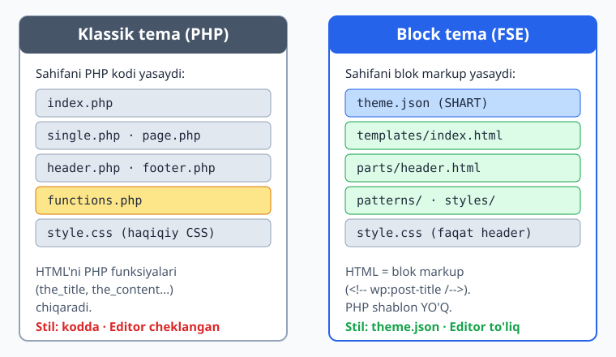
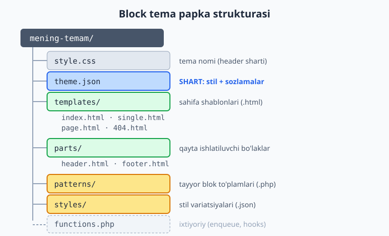
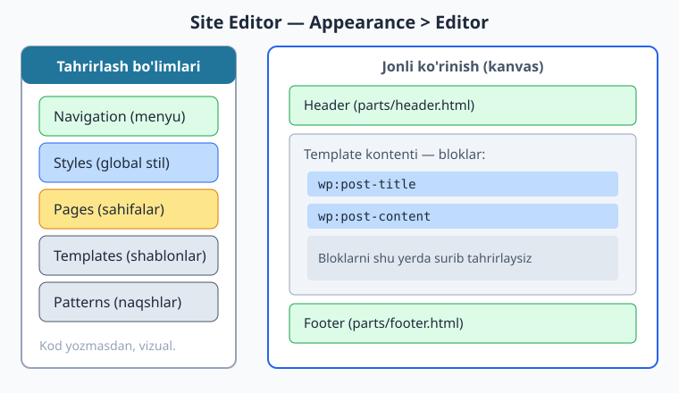

# 15 — Block temaga kirish

[⬅️ Oldingi: 14 — Custom Fields, meta va Customizer](./14-custom-fields-customizer.md) · [🏠 README](./README.md) · [Keyingi: 16 — theme.json I: settings ➡️](./16-theme-json-settings.md)

> **Bu bobda:** Shu paytgacha biz klassik tema yozdik — har bir sahifani PHP shabloni yasardi. Endi WordPress'ning zamonaviy yo'liga o'tamiz: **block tema** (Full Site Editing). Block temada PHP shablon fayllari o'rniga HTML blok markup fayllar va `theme.json` turadi. Saytning butun ko'rinishini — header, footer, ranglar, shriftlar — brauzerdagi vizual **Site Editor** orqali, kod yozmasdan tahrirlash mumkin. Bu bob IV qismni — kitobning eng zamonaviy yarmini — ochadi.

---

## Block tema nima va nega kerak?

Bizning klassik temamizda mantiq aniq edi: foydalanuvchi sahifani so'raydi, WordPress mos `.php` shablonni topadi (03-bobdagi template hierarchy), shablon ichidagi PHP kod HTML chiqaradi. Bu yondashuv yillar davomida ishlab keldi va hozir ham ishlaydi. Lekin bitta katta kamchiligi bor: **saytning ko'rinishini o'zgartirish uchun kod yozish kerak**. Mijoz "logoni o'ngga sur" desa, siz `header.php` ni ochib PHP/HTML tahrirlaysiz.

WordPress 5.9 dan boshlab (2022) yangi yondashuv standartga aylandi — **Full Site Editing** (FSE, "saytni to'liq tahrirlash"). Bu yondashuvni amalga oshiradigan tema turi **block tema** deyiladi. 2026-yilda, WordPress 7.0 davrida, block tema — yangi tema yaratishning **asosiy** usuli.

G'oya oddiy: agar postni blok editor (Gutenberg) bilan tahrirlaysiz, **nega butun saytni** — header, footer, sidebar, sahifa maketini — xuddi shu editor bilan tahrirlamaysiz? Block temada aynan shunday: sayt ham, kontent ham bir xil blok tilida yoziladi.

Hayotiy o'xshatish: klassik tema — bu **buyurtma kostyum**, uni faqat tikuvchi (dasturchi) o'zgartira oladi. Block tema — bu **konstruktor (LEGO)**: bo'laklar tayyor, mijozning o'zi ularni surib, almashtirib, yangi ko'rinish yig'a oladi. Dasturchi konstruktorni va qoidalarni beradi, lekin kundalik o'zgarishlar uchun har safar chaqirilmaydi.

Nega block temaga o'tish kerak:

- **Vizual tahrirlash.** Mijoz header, footer, ranglarni Site Editor'da o'zi o'zgartiradi — sizga har mayda o'zgarish uchun murojaat qilmaydi.
- **Kelajakka mos.** WordPress'ning yangi imkoniyatlari (global styles, style variations, block bindings) avval block temalarga keladi. Klassik tema asta-sekin "eski" toifaga o'tmoqda.
- **Kamroq kod.** Maketni PHP bilan emas, blok markup bilan tasvirlaysiz; stilni CSS bilan emas, `theme.json` bilan. Ko'p hollarda umuman PHP yozmasligingiz mumkin.
- **Tezroq.** Block tema generatsiya qiladigan CSS faqat sahifada ishlatilgan bloklar uchun yuklanadi, JavaScript kamroq — natijada sayt yengilroq.

> Diqqat: klassik tema **o'lmagan**. Eski saytlar, murakkab maxsus mantiq yoki mavjud klassik kod bazasi bilan ishlashda u hali ham uchraydi — shuning uchun biz uni I–III qismlarda puxta o'rgandik. Lekin **yangi loyiha** boshlayotgan bo'lsangiz, standart tanlov — block tema.

---

## Klassik vs block: asosiy farq

Eng muhim aqliy o'zgarish — **sahifani kim yasaydi** degan savolda.

Klassik temada sahifani **PHP kodi** yasaydi. Siz `single.php` ichida `the_title()`, `the_content()` kabi funksiyalarni chaqirasiz, ular HTML chiqaradi. Stil esa alohida `style.css` faylda — haqiqiy CSS.

Block temada sahifani **blok markup** yasaydi. PHP shablon fayllari umuman yo'q. Ularning o'rnida `.html` fayllar turadi, lekin ular ichida oddiy HTML emas, balki **blok markup** bor — maxsus HTML izohlari ko'rinishidagi bloklar:

```html
<!-- wp:post-title /-->
<!-- wp:post-content /-->
```

Bu satrlar "shu yerda post sarlavhasi bloki, undan keyin post kontenti bloki turadi" degani. WordPress ularni o'qib, haqiqiy HTML'ga aylantiradi. Stil esa `style.css` da emas, **`theme.json`** da — WordPress undan CSS'ni o'zi generatsiya qiladi.



Quyidagi jadval ikki yondashuvni yonma-yon qo'yadi:

| Jihat | Klassik tema | Block tema |
|-------|--------------|------------|
| Sahifa shablonlari | `index.php`, `single.php` (PHP) | `templates/index.html`, `templates/single.html` (blok markup) |
| Header / footer | `header.php`, `footer.php` | `parts/header.html`, `parts/footer.html` |
| HTML kim chiqaradi | PHP funksiyalari (`the_title`...) | blok markup (`<!-- wp:post-title /-->`) |
| Stil | `style.css` (haqiqiy CSS) | `theme.json` (WP CSS generatsiya qiladi) |
| `functions.php` | deyarli majburiy | ixtiyoriy |
| Ko'rinishni kim tahrirlaydi | dasturchi (kodda) | mijoz ham (Site Editor'da) |
| Tahrirlash joyi | matn muharriri / IDE | brauzerdagi Site Editor |

Diqqat qiling: klassik temada PHP bilim juda zarur edi. Block temada uning roli kamayadi — asosiy ish blok markup va JSON bilan. Lekin PHP butunlay yo'qolmaydi: dinamik imkoniyatlar, patterns va custom bloklar uchun u baribir kerak bo'ladi (V qism).

> Blok markup sintaksisi (`<!-- wp:... -->`) bu bobda faqat tanishtiriladi. Uni chuqur — atributlar, ichma-ich bloklar, template part chaqiruvi — 18-bobda batafsil ko'rib chiqamiz. Hozir asosiy g'oyani tushunish kifoya: **`.html` fayl ichida bloklar yashaydi**.

---

## Block tema fayl strukturasi

Block tema fayllari mantiqiy papkalarga ajratilgan. Quyida to'liq struktura — har biri o'z vazifasi bilan.



```
mening-temam/
├── style.css            # tema nomi (header izohi) — SHART
├── theme.json           # stil + sozlamalar — SHART
├── templates/           # sahifa shablonlari (.html)
│   ├── index.html       # zaxira shablon (har doim bo'lsin)
│   ├── single.html      # bitta post
│   ├── page.html        # sahifa
│   ├── archive.html     # arxiv ro'yxati
│   └── 404.html         # topilmadi
├── parts/               # qayta ishlatiluvchi bo'laklar (.html)
│   ├── header.html
│   └── footer.html
├── patterns/            # tayyor blok to'plamlari (.php)
│   └── hero.php
├── styles/              # stil variatsiyalari (.json)
│   └── tungi.json
├── functions.php        # ixtiyoriy (enqueue, hooks, theme support)
└── screenshot.png       # tema oynasidagi rasm (1200x900 tavsiya)
```

Har bir element nima qiladi:

- **`style.css` (SHART).** Klassik temadagi kabi tepasida tema haqida ma'lumot (header izohi) — `Theme Name`, `Author`, `Version` va hokazo. WordPress aynan shu fayl borligiga qarab papkani tema deb taniydi. Block temada uning ichida CSS deyarli bo'lmaydi (faqat kerak bo'lsa qo'shimcha tuzatishlar); asosiy stil `theme.json` da.
- **`theme.json` (SHART).** Block temani block tema qiladigan eng muhim fayl. Ranglar palitrasi, shriftlar, oraliqlar, maket o'lchamlari — hammasi shu yerda. WordPress undan saytning CSS'ini avtomatik generatsiya qiladi. 16- va 17-boblar to'liq shu faylga bag'ishlangan.
- **`templates/`.** Sahifa shablonlari. Klassik temadagi `index.php`, `single.php` ning ekvivalenti, lekin `.html` va blok markup bilan. Nomlash mantig'i bir xil — template hierarchy (03-bob) block temada ham ishlaydi. Minimal talab: `index.html`.
- **`parts/`.** Template part'lar — bir nechta shablonda qayta ishlatiladigan bo'laklar. Odatda `header.html` va `footer.html`. Klassik `get_header()` / `get_footer()` ning ekvivalenti.
- **`patterns/`.** Block pattern'lar — tayyor blok to'plamlari (masalan hero bo'limi, narx jadvali). Foydalanuvchi ularni bir bosishda sahifaga qo'ya oladi. `.php` fayl, tepasida maxsus izoh-header. 20-bobda batafsil.
- **`styles/`.** Style variation'lar — temaning muqobil ko'rinishlari (masalan "tungi rejim", boshqa rang sxemasi). Har biri kichik `.json` fayl. 19-bobda batafsil.
- **`functions.php` (ixtiyoriy).** Klassik temada bu deyarli majburiy edi; block temada esa ixtiyoriy. Kerak bo'ladigan holatlar: o'z shriftingizni yoki skriptni ulash (enqueue, 10-bob), pattern kategoriyasini ro'yxatga olish, dinamik blok yoki maxsus hook. Oddiy block temada umuman bo'lmasligi mumkin.

> Klassik tema bilan solishtiring: u yerda `header.php`, `footer.php`, `sidebar.php`, `functions.php` deyarli har doim kerak edi. Block temada esa **eng kam zarur fayl atigi ikkita**: `style.css` (tema nomi uchun) va `theme.json` (stil uchun), plus kamida bitta shablon — `templates/index.html`.

---

## Minimal block tema

Eng kichik ishlaydigan block tema atigi uchta fayldan iborat:

1. `style.css` — tema nomi uchun (faqat header izohi).
2. `theme.json` — stil va sozlamalar uchun.
3. `templates/index.html` — kamida bitta shablon.

Ana shu uchtasi bilan WordPress papkani to'liq block tema deb taniydi, aktivlashtirsa bo'ladi va Site Editor ham ochiladi. (Bu bobning oxirida aynan shunday temani yaratdik va jonli WordPress 7.0 da uni tasdiqladik — soxta emas.)

**1) `style.css`** — diqqat: barcha qatorlar izoh (`/* ... */`) ichida, CSS qoida emas. WordPress shu yerdan tema nomini o'qiydi:

```css
/*
Theme Name: Mening Block Temam
Author: Oqil Imomnazarov
Description: Minimal block tema namunasi.
Requires at least: 6.7
Tested up to: 7.0
Requires PHP: 8.0
Version: 1.0.0
License: GNU General Public License v2 or later
License URI: http://www.gnu.org/licenses/gpl-2.0.html
Text Domain: mening-block-temam
Tags: full-site-editing, blog, one-column
*/
```

`style.css` header maydonlarini 04-bobda batafsil o'rgangandik — block temada ham aynan o'sha maydonlar. Yagona farq: `Tags` ichiga `full-site-editing` qo'shilsa, tema katalogida block tema deb belgilanadi.

**2) `theme.json`** — eng minimal varianti `version` va bo'sh `settings`/`styles` dan iborat bo'lishi mumkin, lekin amalda kamida bir nechta sozlama qo'shamiz. `theme.json` — bu **JSON fayl**, demak sintaksisi qat'iy: kalitlar qo'shtirnoqda, oxirgi elementdan keyin vergul yo'q, izoh yozib bo'lmaydi.

```json
{
	"$schema": "https://schemas.wp.org/wp/6.7/theme.json",
	"version": 3,
	"settings": {
		"appearanceTools": true,
		"layout": {
			"contentSize": "640px",
			"wideSize": "1000px"
		},
		"color": {
			"palette": [
				{ "slug": "base", "color": "#ffffff", "name": "Asosiy fon" },
				{ "slug": "contrast", "color": "#1e293b", "name": "Matn" },
				{ "slug": "primary", "color": "#2563eb", "name": "Brend" }
			]
		}
	},
	"styles": {
		"color": {
			"background": "var:preset|color|base",
			"text": "var:preset|color|contrast"
		}
	}
}
```

Hozir har bir kalitni yodlash shart emas — `version: 3` block tema uchun majburiy, `settings` foydalanuvchiga nima ruxsat berishni belgilaydi, `styles` esa sayt ko'rinishini. To'liq tushuntirish 16–17-boblarda.

> **Nega `version: 3`?** Bu — `theme.json` formati versiyasi (WordPress versiyasi emas). WordPress 7.0 davrida eng so'nggi format — 3. Twenty Twenty-Five referens temasi ham `version: 3` ishlatadi.

**3) `templates/index.html`** — eng oddiy shablon: sayt sarlavhasi va postlar ro'yxati. Ichidagi `<!-- wp:... -->` satrlari — bloklar:

```html
<!-- wp:group {"tagName":"main","layout":{"type":"constrained"}} -->
<main class="wp-block-group">
	<!-- wp:site-title {"level":1} /-->

	<!-- wp:query {"queryId":1,"query":{"inherit":true}} -->
	<div class="wp-block-query">
		<!-- wp:post-template -->
			<!-- wp:post-title {"isLink":true} /-->
			<!-- wp:post-excerpt /-->
		<!-- /wp:post-template -->
	</div>
	<!-- /wp:query -->
</main>
<!-- /wp:group -->
```

Bu markup nima qiladi: `core/group` bloki `<main>` konteyner yasaydi; ichida `core/site-title` sayt nomini chiqaradi; `core/query` bloki esa main query'dan (`"inherit":true` — 05-bobdagi The Loop'ning block ekvivalenti) postlarni oladi va har biri uchun sarlavha (`post-title`) hamda qisqacha matn (`post-excerpt`) ko'rsatadi.

Bu yerda ishlatilgan barcha blok nomlari (`core/group`, `core/site-title`, `core/query`, `core/post-template`, `core/post-title`, `core/post-excerpt`) — jonli WordPress 7.0 da ro'yxatdan o'tgan haqiqiy core bloklar (tasdiqlangan).

> Diqqat: minimal temada `parts/header.html` va `parts/footer.html` bo'lmasligi mumkin — shablon o'zi to'liq sahifani tasvirlaydi. Ammo amaliy temada header/footer'ni alohida `parts/` ga chiqarish to'g'ri yondashuv (18-bob), xuddi klassik temada `get_header()` ishlatganimizdek.

---

## Site Editor bilan tahrirlash

Block temaning eng kuchli tomoni — **Site Editor** (Sayt muharriri). Block tema aktiv bo'lsa, admin panelda **Appearance > Editor** (Ko'rinish > Muharrir) menyusi paydo bo'ladi. Bu klassik temadagi mavjud bo'lmagan, butunlay yangi imkoniyat.



Site Editor ichida nimalarni tahrirlash mumkin:

- **Templates (Shablonlar).** `templates/` papkangizdagi har bir shablonni (index, single, page, 404...) brauzerda vizual ochib, bloklarni surib o'zgartirasiz. Saqlasangiz, o'zgarish ma'lumotlar bazasiga yoziladi (faylga emas — bu muhim nuans).
- **Template Parts (Bo'laklar).** `parts/` papkangizdagi header, footer kabi bo'laklarni tahrirlaysiz. Bir joyda o'zgartirsangiz, undan foydalangan barcha shablonda yangilanadi.
- **Styles (Global stil).** `theme.json` da belgilangan ranglar, shriftlar, oraliqlarni vizual o'zgartirasiz. Bu — `theme.json` ning grafik usti. Style variation'lar (`styles/`) ham shu yerda almashtiriladi.
- **Navigation (Menyu).** Sayt menyusini bevosita tahrirlaysiz. Klassik temadagi `wp_nav_menu` va Walker (11-bob) o'rnini bu yerda navigation bloki egallaydi.
- **Pages (Sahifalar).** Mavjud sahifalarni Site Editor kontekstida ko'rib, ularning maketini sozlaysiz.

Eng muhim tushuncha — **ikki manba**. Block tema fayllari (`templates/*.html`) — bu **boshlang'ich nuqta** (default). Foydalanuvchi Site Editor'da o'zgartirsa, o'zgartirilgan versiya **ma'lumotlar bazasida** saqlanadi va faylnikidan ustun bo'ladi. Site Editor'da "Clear customizations" (sozlamalarni tozalash) bossangiz, baza versiyasi o'chib, yana fayl versiyasiga qaytiladi. Shuning uchun siz, dasturchi, fayllarni yozasiz; mijoz esa baza orqali ularni moslaydi — bir-biriga xalal bermaydi.

> Klassik temada bunday narsa yo'q edi: shablonni o'zgartirish faqat `.php` faylni qo'lda tahrirlash demakdi va mijoz buni qila olmasdi (yoki Theme File Editor orqali xavfli tarzda qilardi). Block temada esa tahrirlash xavfsiz, vizual va orqaga qaytariladigan.

---

## Qachon klassik, qachon block tema tanlash?

Block tema standart bo'lsa-da, har bir loyiha uchun emas. To'g'ri tanlov uchun yo'riqnoma:

**Block tema tanlang, agar:**

- yangi loyiha boshlayotgan bo'lsangiz (eng keng tarqalgan holat);
- mijoz saytni o'zi tahrirlay olishini xohlasa (kontent + dizayn);
- zamonaviy, kelajakka mos, yengil tema kerak bo'lsa;
- dizayn standart blok imkoniyatlariga (ranglar, shriftlar, maketlar) sig'sa.

**Klassik tema (yoki hybrid) tanlang, agar:**

- mavjud katta klassik kod bazasini qo'llab-quvvatlayotgan bo'lsangiz;
- juda murakkab, blok tizimiga sig'maydigan maxsus PHP mantiq kerak bo'lsa;
- jamoangiz hali blok yondashuviga o'tmagan bo'lsa va muddat tig'iz bo'lsa;
- eski WordPress (FSE'gacha) bilan moslik talab qilinsa (kamdan-kam).

Uchinchi yo'l ham bor — **hybrid tema**: block templates'dan foydalanasiz, lekin `functions.php` bilan klassik imkoniyatlarni ham qo'shasiz. Bu klassikdan block'ga **bosqichma-bosqich** o'tishning amaliy usuli. Hybrid temalarni 21-bobda alohida ko'rib chiqamiz.

Maslahat: bu kitobda biz I–III qismda klassik temani puxta o'rgandik (ish bozori va eski saytlar uchun zarur), endi IV qismda block temaga to'liq sho'ng'iymiz. Ikkalasini ham bilish — sizni har qanday WordPress loyihasiga tayyor mutaxassis qiladi.

> **Referens tema.** Block tema sintaksisini o'rganishning eng yaxshi yo'li — WordPress bilan kelgan **Twenty Twenty-Five** temasini o'qish. U `theme.json`, `templates/`, `parts/`, `patterns/`, `styles/` — hammasini to'g'ri, zamonaviy tarzda ko'rsatadi. Keyingi boblarda biz unga bir necha bor murojaat qilamiz.

---

## Mashqlar

### Oson

1. Bo'sh papkadan boshlab **minimal block tema** yarating: `style.css` (faqat header izohi, `Theme Name: Mening Birinchi Block`), `theme.json` (`version: 3` va `appearanceTools: true`) va `templates/index.html` (faqat bitta `core/paragraph` bloki "Salom, block tema!" matni bilan). Uchta fayl ham joyida bo'lsin.

2. O'z `theme.json` faylingizning **yaroqli JSON** ekanini tekshiring: `php -r "var_dump(json_decode(file_get_contents('theme.json')) !== null);"` buyrug'i `bool(true)` qaytarsin.

3. Quyidagi fayllarning qaysilari **block** temaga, qaysilari **klassik** temaga tegishli ekanini belgilang: `single.php`, `templates/single.html`, `theme.json`, `header.php`, `parts/header.html`, `functions.php`.

4. Block temaning eng kam zarur uchta faylini nomlang va har birining vazifasini bir jumlada yozing.

### O'rta

5. `templates/index.html` ga sayt sarlavhasini qo'shadigan blok markup yozing: `core/group` (`tagName: main`) ichida `core/site-title` bloki, undan keyin `core/site-tagline` bloki. Markup to'g'ri ochilib-yopilsin (`<!-- wp:... -->` ... `<!-- /wp:... -->`).

6. Quyidagi buzuq `theme.json` ning **xatosini toping va tuzating** (JSON sifatida yaroqsiz):

   ```json
   {
     "version": 3,
     "settings": {
       "color": {
         "palette": [
           { "slug": "brand", "color": "#2563eb", "name": "Brend" },
         ]
       },
     }
   }
   ```

7. Klassik temadagi `header.php` + `get_header()` mexanizmining block temadagi ekvivalentini tushuntiring: qaysi fayl, qaysi papka, qaysi blok markup ishlatiladi?

8. `theme.json` ga uchta rangdan iborat palitra qo'shing (`base` oq, `contrast` to'q kulrang `#1e293b`, `primary` ko'k `#2563eb`) va uni yaroqli JSON ekanini tekshiring.

### Qiyin

9. To'liq minimal block tema yarating va uni jonli WordPress'da (yoki o'z lokal o'rnatmangizda) WP-CLI bilan **inactive** holatda ko'rinishini tasdiqlang (`wp theme list`). Temani **aktivlashtirmang** — faqat ro'yxatda paydo bo'lishini ko'rsating.

10. `templates/index.html` ga The Loop'ning block ekvivalentini yozing: `core/query` bloki (`"query":{"inherit":true}` bilan, ya'ni main query'dan meros oladi), ichida `core/post-template`, uning ichida `core/post-title` (`isLink: true`) va `core/post-excerpt`. Sahifa postlar ro'yxatini ko'rsatsin.

11. Bitta loyihaga qaror qabul qiling: *"Mijoz kichik biznes uchun sayt so'radi, kelajakda kontentni o'zi yangilab turmoqchi, dizayn standart (ranglar/shriftlar/oddiy maketlar). Byudjet va muddat o'rtacha."* — block, klassik yoki hybrid temani tanlang va kamida uchta sabab bilan asoslang.

12. Klassik temadagi quyidagi fayllar to'plamini block tema ekvivalentlariga **moslang** (jadval ko'rinishida): `index.php`, `single.php`, `header.php`, `footer.php`, `style.css` (CSS bilan), `functions.php`.

13. Referens sifatida **Twenty Twenty-Five** temasining `templates/index.html` faylini o'qing (yoki o'z lokal WP'ngizdagisini). U qaysi bloklardan foydalanadi va nega `parts/header.html` ni to'g'ridan-to'g'ri emas, `core/template-part` bloki orqali chaqiradi — tushuntiring.

14. Hybrid tema g'oyasini bir nechta jumlada tasvirlang: block templates ishlatib, lekin `functions.php` ni ham saqlash qaysi holatlarda foydali? Klassikdan block'ga bosqichma-bosqich o'tishda bu qanday yordam beradi?

---

## Yechimlar

<details markdown="1">
<summary>Yechim — 1</summary>

Uch fayl. Papka strukturasi:

```
mening-birinchi-block/
├── style.css
├── theme.json
└── templates/
    └── index.html
```

**style.css** (faqat header izohi):

```css
/*
Theme Name: Mening Birinchi Block
Author: Oqil Imomnazarov
Description: Birinchi minimal block tema.
Version: 1.0.0
Requires at least: 6.7
Tested up to: 7.0
Requires PHP: 8.0
License: GNU General Public License v2 or later
Text Domain: mening-birinchi-block
Tags: full-site-editing
*/
```

**theme.json**:

```json
{
	"$schema": "https://schemas.wp.org/wp/6.7/theme.json",
	"version": 3,
	"settings": {
		"appearanceTools": true
	}
}
```

**templates/index.html**:

```html
<!-- wp:paragraph -->
<p>Salom, block tema!</p>
<!-- /wp:paragraph -->
```

Uch fayl tayyor bo'lsa, WordPress papkani block tema deb taniydi va aktivlashtirsa bo'ladi.

</details>

<details markdown="1">
<summary>Yechim — 2</summary>

```
php -r "var_dump(json_decode(file_get_contents('theme.json')) !== null);"
```

Agar JSON yaroqli bo'lsa — `bool(true)`. Yaroqsiz bo'lsa — `bool(false)`. Sababni ko'rish uchun:

```
php -r "json_decode(file_get_contents('theme.json')); echo json_last_error_msg();"
```

Yaroqli faylda `No error`, buzuqida esa aniq xabar (masalan `Syntax error`) chiqadi. (Shu bob verifikatsiyasida aynan shu usul bilan `ch15-test` temasining `theme.json` faylini tekshirdik — natija: VALID JSON.)

</details>

<details markdown="1">
<summary>Yechim — 3</summary>

| Fayl | Tema turi |
|------|-----------|
| `single.php` | Klassik (PHP shablon) |
| `templates/single.html` | Block (blok markup) |
| `theme.json` | Block (stil + sozlamalar) |
| `header.php` | Klassik (`get_header()` chaqiradi) |
| `parts/header.html` | Block (template part) |
| `functions.php` | Ikkalasida ham bo'lishi mumkin — klassikda deyarli majburiy, block'da ixtiyoriy |

Kalit: `.php` shablon va `header.php`/`footer.php` — klassik belgisi; `.html` shablon, `theme.json`, `parts/`, `templates/` papkalar — block belgisi.

</details>

<details markdown="1">
<summary>Yechim — 4</summary>

1. **`style.css`** — tema nomi va ma'lumotlari (header izohi). WordPress papkani aynan shu fayl borligiga qarab tema deb taniydi.
2. **`theme.json`** — stil (ranglar, shriftlar, oraliqlar) va sozlamalar. WordPress undan saytning CSS'ini generatsiya qiladi; bu fayl block temani block tema qiladi.
3. **`templates/index.html`** — kamida bitta sahifa shabloni. Block markup bilan sahifa maketini tasvirlaydi (klassik `index.php` ekvivalenti).

</details>

<details markdown="1">
<summary>Yechim — 5</summary>

```html
<!-- wp:group {"tagName":"main","layout":{"type":"constrained"}} -->
<main class="wp-block-group">
	<!-- wp:site-title {"level":1} /-->
	<!-- wp:site-tagline /-->
</main>
<!-- /wp:group -->
```

Tushuntirish: `core/group` bloki `<main>` konteyner yasaydi (`tagName: main`). Ichida `core/site-title` sayt nomini `<h1>` darajada (`level: 1`) chiqaradi, `core/site-tagline` esa sayt shiorini. O'z-o'zini yopadigan bloklar `/-->` bilan tugaydi (ichki kontenti yo'q), `core/group` esa `<!-- /wp:group -->` bilan yopiladi (ichida boshqa bloklar bor).

</details>

<details markdown="1">
<summary>Yechim — 6</summary>

Ikki xato — ikkalasi ham **ortiqcha vergul** (trailing comma). JSON oxirgi element/kalitdan keyin vergulga ruxsat bermaydi (PHP massividan farqli o'laroq).

1. `palette` massivining oxirgi obyektidan keyin vergul.
2. `color` obyektidan keyin (ya'ni `settings` ning oxirgi kalitidan keyin) vergul.

Tuzatilgan, yaroqli JSON:

```json
{
	"version": 3,
	"settings": {
		"color": {
			"palette": [
				{ "slug": "brand", "color": "#2563eb", "name": "Brend" }
			]
		}
	}
}
```

`php -r "json_decode(...); echo json_last_error_msg();"` endi `No error` qaytaradi. (Buzuq variant `Syntax error` berardi.)

</details>

<details markdown="1">
<summary>Yechim — 7</summary>

Klassik temada `header.php` faylni `get_header()` chaqirar va sahifaga qo'shar edi. Block temadagi ekvivalenti:

- **Fayl:** `parts/header.html` (`.php` emas, `.html`; alohida `parts/` papkasida).
- **Chaqirish:** PHP funksiya bilan emas, **template part bloki** bilan:

  ```html
  <!-- wp:template-part {"slug":"header","tagName":"header"} /-->
  ```

  Bu satr "shu yerga `parts/header.html` ni qo'sh" degani.
- **theme.json'da ro'yxat (tavsiya):** `templateParts` ro'yxatiga `header` ni `area: "header"` bilan kiritish — Site Editor uni to'g'ri toifaga joylashtiradi.

Demak: `get_header()` -> `core/template-part` bloki; `header.php` -> `parts/header.html`.

</details>

<details markdown="1">
<summary>Yechim — 8</summary>

```json
{
	"$schema": "https://schemas.wp.org/wp/6.7/theme.json",
	"version": 3,
	"settings": {
		"color": {
			"palette": [
				{ "slug": "base", "color": "#ffffff", "name": "Asosiy fon" },
				{ "slug": "contrast", "color": "#1e293b", "name": "Matn" },
				{ "slug": "primary", "color": "#2563eb", "name": "Brend" }
			]
		}
	}
}
```

Tekshirish:

```
php -r "var_dump(json_decode(file_get_contents('theme.json')) !== null);"
```

`bool(true)` qaytishi kerak. Diqqat: oxirgi palitra elementidan keyin vergul yo'q, har bir kalit qo'shtirnoqda.

</details>

<details markdown="1">
<summary>Yechim — 9</summary>

Avval uch faylli minimal temani yarating (Yechim 1 dagi kabi) va WP'ning `wp-content/themes/` papkasiga joylang, masalan `mening-block-test/` nomi bilan.

Keyin WP-CLI bilan ro'yxatni ko'ring (temani **aktivlashtirmasdan**):

```
php wp-cli.phar theme list --path="WP_YO'LI"
```

Natijada temangiz `inactive` holatda ko'rinishi kerak:

```
name              status    version
mening-block-test inactive  1.0.0
```

`status` ustunida `inactive` bo'lsa — WordPress temani to'g'ri tanidi, lekin aktiv emas. (Aynan shu jarayonni bu bob verifikatsiyasida bajardik: `ch15-test` temasi `inactive` holatda ro'yxatda chiqdi, aktiv tema o'zgarmadi.) Temani aktivlashtirish — keyingi (markaziy) bosqich; parallel ishda bir saytni bir nechta tema talashmasligi uchun bu yerda aktivlashtirmaymiz.

</details>

<details markdown="1">
<summary>Yechim — 10</summary>

```html
<!-- wp:query {"queryId":1,"query":{"inherit":true}} -->
<div class="wp-block-query">
	<!-- wp:post-template -->
		<!-- wp:post-title {"isLink":true} /-->
		<!-- wp:post-excerpt /-->
	<!-- /wp:post-template -->
</div>
<!-- /wp:query -->
```

Tushuntirish:

- `core/query` — postlar so'rovi bloki. `"inherit":true` — main query'dan (joriy sahifaga mos so'rov) meros oladi, ya'ni 05-bobdagi **The Loop**'ning block ekvivalenti. Klassik `have_posts()` / `the_post()` siklini bu blok o'rnini bosadi.
- `core/post-template` — har bir post uchun ichidagi bloklarni takrorlaydi (sikl tanasi).
- `core/post-title` (`isLink: true`) — post sarlavhasi, postga havola bilan.
- `core/post-excerpt` — post qisqacha matni.

Bu markup'dagi barcha blok nomlari jonli WordPress 7.0 da ro'yxatdan o'tgan (tasdiqlangan).

</details>

<details markdown="1">
<summary>Yechim — 11</summary>

**Tanlov: block tema.**

Sabablar:

1. **Mijoz kontentni o'zi yangilamoqchi** — block tema Site Editor beradi, mijoz dizayn va kontentni kod yozmasdan o'zgartiradi.
2. **Dizayn standart** — ranglar, shriftlar, oddiy maketlar block tema imkoniyatlariga to'liq sig'adi; maxsus PHP mantiq talab etmaydi.
3. **Kelajakka mos va yengil** — kichik biznes sayti uzoq ishlaydi; block tema yangi imkoniyatlarni avval oladi va tezroq yuklanadi (kamroq CSS/JS).
4. **O'rtacha byudjet/muddat** — block temada PHP/CSS kam yoziladi, ko'p ish Site Editor'da bajariladi; bu vaqt va xarajatni tejaydi.

(Hybrid faqat keyinchalik maxsus PHP mantiq paydo bo'lsa kerak bo'ladi; klassik bu holatda asossiz — eski yondashuv, mijozga o'zi tahrirlash imkonini bermaydi.)

</details>

<details markdown="1">
<summary>Yechim — 12</summary>

| Klassik fayl | Block tema ekvivalenti |
|--------------|------------------------|
| `index.php` | `templates/index.html` (blok markup) |
| `single.php` | `templates/single.html` |
| `header.php` | `parts/header.html` (+ `core/template-part` bloki orqali chaqiriladi) |
| `footer.php` | `parts/footer.html` (+ `core/template-part` bloki) |
| `style.css` (CSS bilan) | `style.css` (faqat header) + stil `theme.json` da |
| `functions.php` | `functions.php` (ixtiyoriy) yoki butunlay yo'q |

Asosiy o'zgarish: PHP shablonlar -> `.html` blok markup; CSS -> `theme.json`; `get_header()` -> `core/template-part` bloki.

</details>

<details markdown="1">
<summary>Yechim — 13</summary>

Twenty Twenty-Five ning `templates/index.html` (referens) odatda quyidagicha:

```html
<!-- wp:template-part {"slug":"header"} /-->

<!-- wp:group {"tagName":"main", ...} -->
<main class="wp-block-group">
	<!-- wp:pattern {"slug":"twentytwentyfive/..."} /-->
</main>
<!-- /wp:group -->

<!-- wp:template-part {"slug":"footer"} /-->
```

Asosiy bloklar: `core/template-part` (header/footer), `core/group` (`<main>` konteyner), `core/pattern` (tayyor blok to'plamini chaqirish — masalan postlar ro'yxati).

**Nega `parts/header.html` ni to'g'ridan-to'g'ri emas, `core/template-part` orqali?** Chunki template part bloki — bu *havola*, nusxa emas. `parts/header.html` ni bitta joyda o'zgartirsangiz, undan foydalangan **barcha shablonda** yangilanadi (index, single, page...). Agar har shablonga header markup'ini nusxa qilsangiz, o'zgartirishda hammasini qo'lda tuzatishga to'g'ri kelardi. Bu — klassik `get_header()` bergan DRY foydaning aynan o'zi, block tilida.

</details>

<details markdown="1">
<summary>Yechim — 14</summary>

**Hybrid tema** — block templates (`templates/*.html`, `parts/*.html`, `theme.json`) bilan ishlaydi, lekin `functions.php` ni ham saqlaydi va undan klassik imkoniyatlardan foydalanadi (hook'lar, custom skript/stil enqueue, custom post type, maxsus PHP mantiq).

Qachon foydali:

- **Maxsus PHP mantiq kerak** — masalan tashqi API bilan ishlash, murakkab shartli logika yoki dinamik blok (`render_callback`), buni `functions.php` da yozasiz.
- **Mavjud klassik kod** — eski temadagi `functions.php` mantiqini saqlab qolib, sekin-asta shablonlarni block'ga ko'chirasiz.
- **Bosqichma-bosqich o'tish** — butun temani bir kunda block'ga aylantirish o'rniga: avval `theme.json` qo'shasiz, keyin bitta-bitta shablonni `.php` dan `.html` ga ko'chirasiz, `functions.php` esa o'tish davomida ishlab turadi. Sayt har qadamda ishlaydi, katta xavfli "katta portlash" bo'lmaydi.

Bu strategiya 21-bobda batafsil ko'rib chiqiladi.

</details>

---

[⬅️ Oldingi: 14 — Custom Fields, meta va Customizer](./14-custom-fields-customizer.md) · [🏠 README](./README.md) · [Keyingi: 16 — theme.json I: settings ➡️](./16-theme-json-settings.md)
