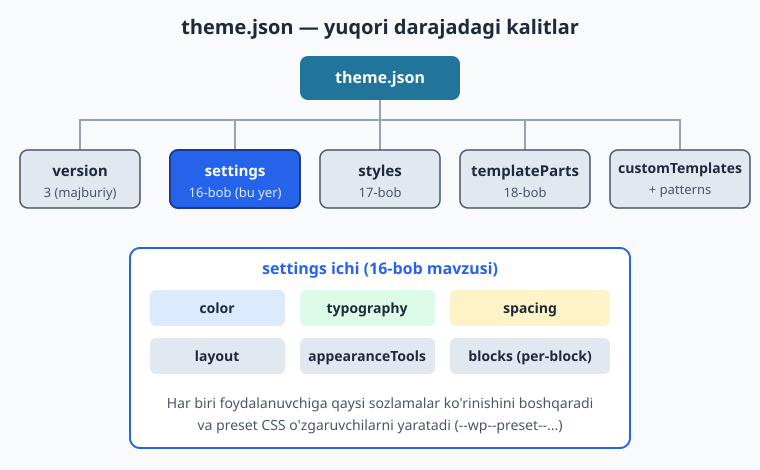
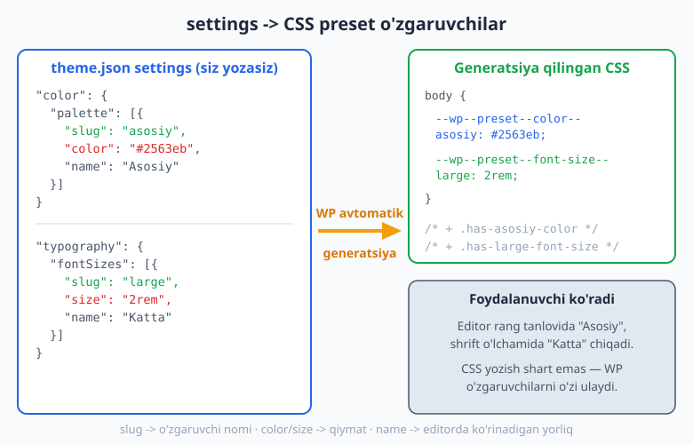
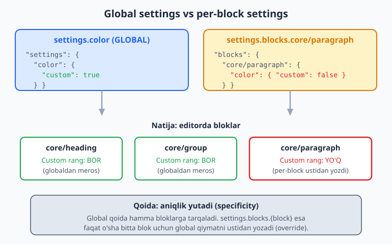

# 16 — theme.json I: settings

[⬅️ Oldingi: 15 — Block temaga kirish](./15-block-temaga-kirish.md) · [🏠 README](./README.md) · [Keyingi: 17 — theme.json II: styles ➡️](./17-theme-json-styles.md)

> **Bu bobda:** `theme.json` — block temaning "miya markazi". Uning `settings` bo'limi orqali siz foydalanuvchiga editorda **qaysi ranglar, shrift o'lchamlari va bo'shliqlar** taqdim etilishini boshqarasiz. Biz palitra, fluid (suyuq) typography, spacing scale, layout va `appearanceTools` ni chuqur o'rganamiz, settings'ni global hamda bitta blok uchun (`settings.blocks`) qanday belgilashni ko'ramiz, va WordPress bularning ortidan qanday CSS preset o'zgaruvchilarini avtomatik yaratishini tushunamiz. Hamma misol jonli WordPress 7.0 da yaroqli JSON ekani tekshirilgan.

---

## Nega `theme.json`?

15-bobda block temaning fayl strukturasini ko'rdik. Uning markazida bitta fayl turadi: `theme.json`. Bu fayl temaning **konfiguratsiya markazi** — u editor va frontend uchun bir vaqtda dizayn qoidalarini belgilaydi.

Klassik temada (1-14 boblar) siz rang va shriftlarni `style.css` da, qo'lda CSS yozib belgilardingiz. Muammo: bu CSS faqat frontend'ga ta'sir qilardi. Editor (Gutenberg) sizning ranglaringizdan bexabar edi — foydalanuvchi rang tanlovida WordPress'ning standart palitra'sini ko'rardi, sizning brendingizni emas.

`theme.json` shu uzilishni bartaraf etadi. Bitta joyda yozasiz — **editor ham, frontend ham** bir xil qoidalarni biladi. Bu yondashuv ikki ustunga bo'linadi:

| Bo'lim | Vazifasi | Bob |
|--------|----------|-----|
| `settings` | Foydalanuvchiga **qaysi imkoniyatlar** beriladi (palitra, o'lchamlar, sozlamalar) | **16 (bu bob)** |
| `styles` | O'sha imkoniyatlardan **qaysi qiymat standart** qo'llaniladi (sayt qanday ko'rinadi) | 17 |

Oddiy o'xshatish: `settings` — bu restoran **menyusi** (mijozga nima taklif qilinadi), `styles` esa **kun taomi** (oshxona nimani standart qilib chiqaradi). Bu bobda menyuni tuzamiz.

### theme.json tuzilishi: yuqori darajadagi kalitlar

`theme.json` ning eng yuqori darajasida bir nechta kalit bor. Mana ularning hammasi:

```json
{
	"$schema": "https://schemas.wp.org/wp/6.7/theme.json",
	"version": 3,
	"settings": {  },
	"styles": {  },
	"templateParts": [  ],
	"customTemplates": [  ],
	"patterns": [  ]
}
```

- `$schema` — IDE (VS Code) uchun avtomat-to'ldirish va xato tekshiruvini yoqadi. Majburiy emas, lekin juda foydali.
- `version` — **majburiy**, hozir `3` (WP 6.6+ standarti). Bu raqam theme.json sxemasining versiyasini bildiradi, temangiz versiyasini emas.
- `settings` — **bu bobning mavzusi**.
- `styles` — 17-bob.
- `templateParts`, `customTemplates`, `patterns` — 18 va 20-boblar.



> **`version` haqida diqqat:** `version: 3` WP 6.6 dan beri amalda. Eski temalarda `version: 2` uchraydi — u hali ishlaydi, lekin yangi temada doim `3` yozing. Versiyalar orasidagi asosiy farq: v3 da `fontSizes` va `spacingSizes` standart presetlari endi avtomatik qo'shilmaydi (`defaultFontSizes`/`defaultSpacingSizes`), bu siz to'liq nazoratga ega bo'lishingizni anglatadi.

---

## `settings` umumiy ko'rinishi

`settings` ichidagi har bir bo'lim block editordagi (Gutenberg) muayyan boshqaruvni yoqadi yoki o'chiradi. Asosiy bo'limlar:

```json
{
	"version": 3,
	"settings": {
		"appearanceTools": true,
		"useRootPaddingAwareAlignments": true,
		"layout": {  },
		"color": {  },
		"typography": {  },
		"spacing": {  },
		"blocks": {  }
	}
}
```

Har birini navbatma-navbat ochamiz. Eslatma: bu kalitlarni men o'ylab topmadim — ularning hammasi WordPress yadrosidagi `WP_Theme_JSON::VALID_SETTINGS` ro'yxatida bor (jonli WP 7.0 da tekshirildi). Mavjud bo'lmagan kalit yozsangiz, WordPress uni shunchaki e'tiborsiz qoldiradi — xato bermaydi, lekin ishlamaydi ham. Shuning uchun aniq kalit nomlari muhim.

---

## `color` — ranglar tizimi

`settings.color` — eng ko'p ishlatiladigan bo'lim. U editordagi rang tanlovini to'liq boshqaradi.

```json
{
	"version": 3,
	"settings": {
		"color": {
			"defaultPalette": false,
			"defaultGradients": false,
			"defaultDuotone": false,
			"custom": true,
			"customGradient": true,
			"palette": [
				{ "slug": "asosiy", "color": "#2563eb", "name": "Asosiy" },
				{ "slug": "ikkilamchi", "color": "#16a34a", "name": "Ikkilamchi" },
				{ "slug": "matn", "color": "#1e293b", "name": "Matn" },
				{ "slug": "fon", "color": "#f8fafc", "name": "Fon" }
			],
			"gradients": [
				{
					"slug": "kok-yashil",
					"gradient": "linear-gradient(135deg, #2563eb 0%, #16a34a 100%)",
					"name": "Kok-yashil"
				}
			],
			"duotone": [
				{ "slug": "kok-oq", "colors": ["#1e293b", "#2563eb"], "name": "Kok-oq" }
			]
		}
	}
}
```

### `palette` — rang to'plami

`palette` — temangizning rang to'plami. Har bir rang uchta maydonga ega:

- `slug` — texnik nom (CSS o'zgaruvchi va class'da ishlatiladi). Faqat kichik harf, defis. Masalan `asosiy`.
- `color` — rang qiymati (hex, rgb, hsl yoki hatto `color-mix(...)`).
- `name` — editorda ko'rinadigan inson o'qiydigan yorliq. Masalan "Asosiy".

WordPress har bir palitra rangidan **ikki narsa** yaratadi:

1. CSS o'zgaruvchi: `--wp--preset--color--asosiy: #2563eb;`
2. Utility class: `.has-asosiy-color { color: ... }` va `.has-asosiy-background-color { ... }`

Yani siz CSS yozmaysiz — slug'ni belgilash kifoya, WordPress qolganini o'zi qiladi.



### `gradients` va `duotone`

- `gradients` — gradient to'plami. `gradient` maydonida to'liq CSS gradient yoziladi. CSS o'zgaruvchi: `--wp--preset--gradient--kok-yashil`.
- `duotone` — rasmlarga ikki rangli filtr (masalan, Instagram'simon effekt). `colors` massivida soya (dark) va yorug' (light) ranglar. Cover va Image bloklariga qo'llaniladi.

### "default" kalitlar — WordPress'ning o'z presetlarini o'chirish

Mana eng muhim qoida: agar siz `palette` belgilasangiz ham, **WordPress o'zining standart palitra'sini ham qo'shadi** — natijada editorda sizning ranglaringiz + WP ning kulrang/oq ranglari aralashib ketadi. Bu chalkash ko'rinadi.

Buni `default*` kalitlar bilan o'chiramiz:

| Kalit | `false` qilsa nima bo'ladi |
|-------|----------------------------|
| `defaultPalette` | WordPress'ning standart rang palitra'si o'chadi — faqat sizning ranglaringiz qoladi |
| `defaultGradients` | WP standart gradientlari o'chadi |
| `defaultDuotone` | WP standart duotone filtrlari o'chadi |

Professional temada bu uchchovi deyarli doim `false`. Reference sifatida Twenty Twenty-Five ham aynan shunday qiladi (`defaultPalette: false`, `defaultGradients: false`, `defaultDuotone: false`).

### `custom` — foydalanuvchiga erkin rang ruxsati

- `custom: true` — foydalanuvchi rang tanlovida o'z (ixtiyoriy) rangini kiritishi mumkin (color picker chiqadi).
- `custom: false` — foydalanuvchi **faqat** sizning palitrangizdan tanlaydi, erkin rang kirita olmaydi. Bu brend izchilligini majburlash uchun kuchli vosita (pastda batafsil).

`customGradient` — xuddi shu, lekin gradientlar uchun.

---

## `typography` — shriftlar va o'lchamlar

`settings.typography` shrift oilalarini, o'lchamlarini va matn boshqaruvlarini belgilaydi.

```json
{
	"version": 3,
	"settings": {
		"typography": {
			"fluid": true,
			"defaultFontSizes": false,
			"customFontSize": true,
			"lineHeight": true,
			"fontWeight": true,
			"letterSpacing": true,
			"textDecoration": true,
			"textTransform": true,
			"fontSizes": [
				{ "slug": "small", "size": "1rem", "name": "Kichik", "fluid": false },
				{
					"slug": "medium",
					"size": "1.25rem",
					"name": "Orta",
					"fluid": { "min": "1.125rem", "max": "1.25rem" }
				},
				{
					"slug": "large",
					"size": "2rem",
					"name": "Katta",
					"fluid": { "min": "1.5rem", "max": "2rem" }
				}
			],
			"fontFamilies": [
				{
					"slug": "asosiy",
					"name": "Asosiy shrift",
					"fontFamily": "-apple-system, BlinkMacSystemFont, \"Segoe UI\", Roboto, sans-serif"
				},
				{
					"slug": "monospace",
					"name": "Monospace",
					"fontFamily": "\"Fira Code\", Consolas, monospace"
				}
			]
		}
	}
}
```

### `fontSizes` — shrift o'lchamlari

Har bir o'lcham `palette` kabi `slug`/`size`/`name` ga ega. CSS o'zgaruvchi: `--wp--preset--font-size--large`. Slug'lar uchun standart konvensiya: `small`, `medium`, `large`, `x-large`, `xx-large`.

### Fluid (suyuq) typography — `clamp()` avtomatik

Bu — `theme.json` ning eng kuchli imkoniyatlaridan biri. Odatda responsive shrift uchun siz qo'lda media query yoki `clamp()` yozasiz. WordPress buni avtomatlashtiradi.

Ikki bosqichda yoqiladi:

1. Yuqori darajada `"fluid": true` — fluid rejimni umumiy yoqadi.
2. Har bir o'lchamda `"fluid": { "min": "...", "max": "..." }` — eng kichik va eng katta qiymatni belgilaysiz.

Natijada WordPress avtomatik `clamp()` hosil qiladi: kichik ekranda `min`, katta ekranda `max`, orasida silliq o'tish — media query yozmasdan.

```json
{
	"slug": "large",
	"size": "2rem",
	"name": "Katta",
	"fluid": { "min": "1.5rem", "max": "2rem" }
}
```

Bu telefonda sarlavha `1.5rem`, kompyuterda `2rem` bo'lishini, orasida ekran kengligiga qarab silliq kattalashishini ta'minlaydi. `size` maydoni — fluid o'chirilgan brauzerlar yoki editor uchun zaxira qiymat.

Agar bitta o'lcham fluid bo'lishini xohlamasangiz (masalan kichik matn doim bir xil bo'lsin), unda `"fluid": false` yozasiz — yuqoridagi misolda `small` shunday.

### `fontFamilies` — shrift oilalari

Har bir oila `slug`/`name`/`fontFamily` ga ega. `fontFamily` to'liq CSS font-stack. CSS o'zgaruvchi: `--wp--preset--font-family--asosiy`.

> **Maxsus shrift (woff2) yuklash:** agar tema bilan birga shrift fayli (masalan Google Font'ning o'zbek-tilini qo'llovchi varianti) jo'natmoqchi bo'lsangiz, `fontFamilies` ichida `fontFace` massivi qo'shasiz va `src` da `"file:./assets/fonts/..."` yozasiz. Reference: Twenty Twenty-Five theme.json da Manrope va Fira Code aynan shunday ulangan. Shrift fayllarini boshqarish 17-bobda (styles) ko'riladi.

### Matn boshqaruvlari (boolean)

Quyidagi kalitlar editordagi qo'shimcha matn boshqaruvlarini yoqadi/o'chiradi:

| Kalit | Yoqsa nima ko'rinadi |
|-------|----------------------|
| `customFontSize` | Foydalanuvchi ixtiyoriy o'lcham kirita oladi (presetdan tashqari) |
| `lineHeight` | Qator balandligi boshqaruvi |
| `fontWeight` | Shrift qalinligi |
| `letterSpacing` | Harflar orasi masofasi |
| `textDecoration` | Tagi chizilgan / chizilmagan |
| `textTransform` | KATTA / kichik harf |
| `dropCap` | Birinchi harfni katta qilish (paragraph) |

---

## `spacing` — bo'shliqlar tizimi

`settings.spacing` padding, margin va bloklar orasidagi masofani (`blockGap`) boshqaradi.

```json
{
	"version": 3,
	"settings": {
		"spacing": {
			"defaultSpacingSizes": false,
			"customSpacingSize": true,
			"units": ["px", "em", "rem", "vh", "vw", "%"],
			"padding": true,
			"margin": true,
			"blockGap": true,
			"spacingSizes": [
				{ "slug": "30", "size": "0.75rem", "name": "Kichik" },
				{ "slug": "40", "size": "1.5rem", "name": "Orta" },
				{ "slug": "50", "size": "clamp(2rem, 5vw, 3rem)", "name": "Katta" },
				{ "slug": "60", "size": "clamp(3rem, 8vw, 5rem)", "name": "Juda katta" }
			]
		}
	}
}
```

### `spacingSizes` — bo'shliq presetlari

`palette` mantig'i bilan bir xil. CSS o'zgaruvchi: `--wp--preset--spacing--50`. Slug uchun konvensiya — raqamli pog'onalar (`20`, `30`, `40`, `50`...), chunki shunda editor slayder ularni tartib bilan ko'rsatadi. `size` da `clamp()` ishlatish responsive bo'shliq beradi — bu fluid typography'ga o'xshash usul.

### `spacingScale` — pog'onalarni avtomatik generatsiya

`spacingSizes` ni qo'lda yozish o'rniga, WordPress'dan ularni matematik formula bilan **avtomatik hosil qildirish** mumkin:

```json
{
	"version": 3,
	"settings": {
		"spacing": {
			"spacingScale": {
				"operator": "*",
				"increment": 1.5,
				"steps": 7,
				"mediumStep": 1.5,
				"unit": "rem"
			}
		}
	}
}
```

- `operator` — `"*"` (ko'paytirish) yoki `"+"` (qo'shish).
- `mediumStep` — o'rta (markaziy) qiymat.
- `increment` — har pog'onaga qo'shiladigan/ko'paytiriladigan miqdor.
- `steps` — nechta pog'ona yaratilsin.
- `unit` — o'lchov birligi (`rem`, `px`...).

**Diqqat:** `spacingScale` va `spacingSizes` bir vaqtda ishlamaydi — bittasini tanlang. Twenty Twenty-Five qo'lda `spacingSizes` ishlatadi (aniqroq nazorat uchun); ko'pgina starter temalar `spacingScale` afzal ko'radi (kamroq yozuv). Kalitlar (`operator`/`increment`/`steps`/`mediumStep`/`unit`) WP yadrosidagi `WP_Theme_JSON` da tekshirilgan.

### `units` — ruxsat etilgan o'lchov birliklari

Foydalanuvchi padding/margin kiritganda qaysi birliklarni tanlay olishini cheklaydi. Masalan faqat `["px", "rem"]` qoldirsangiz, foydalanuvchi `vw` yoki `%` tanlay olmaydi.

### Boolean boshqaruvlar

- `padding: true` / `margin: true` — bloklarda tegishli boshqaruvni yoqadi.
- `blockGap: true` — bloklar orasidagi masofa boshqaruvi (Group, Columns ichida).
- `customSpacingSize: true` — foydalanuvchi presetdan tashqari ixtiyoriy qiymat kirita oladi.

---

## `layout` — kontent kengligi

`settings.layout` saytning markaziy o'qidagi kengliklarni belgilaydi:

```json
{
	"version": 3,
	"settings": {
		"layout": {
			"contentSize": "650px",
			"wideSize": "1200px"
		}
	}
}
```

- `contentSize` — oddiy kontent (paragraph, sarlavha) kengligi. O'qilishga qulay bo'lishi uchun odatda 600-800px.
- `wideSize` — "wide" tekislash (alignwide) tanlanganda blok qancha keng bo'lishi. Odatda `contentSize` dan ancha katta.

Bu ikki qiymat block editordagi "Wide width" va "Full width" tugmalarining xatti-harakatini boshqaradi. Group bloki ichidagi kontent avtomatik `contentSize` bo'yicha markazlashadi — siz CSS container yozmaysiz.

---

## `appearanceTools` — hammasini bir zarbada yoqish

Yuqorida ko'rgan ko'plab boolean kalitlarni (`lineHeight`, `letterSpacing`, `padding`, `margin`, `blockGap`, `border`, `link` rangi, va h.k.) yakka-yakka yozish zerikarli. WordPress qulay qisqartma beradi:

```json
{
	"version": 3,
	"settings": {
		"appearanceTools": true,
		"layout": {
			"contentSize": "650px",
			"wideSize": "1200px"
		}
	}
}
```

`appearanceTools: true` bir vaqtda quyidagilarni yoqadi:

- `border` (color, radius, style, width)
- `color.link` va `color.heading` (link va sarlavha rangi)
- `spacing.blockGap`, `spacing.margin`, `spacing.padding`
- `typography.lineHeight`
- `dimensions.minHeight`
- `position.sticky`

Bu eng ko'p ishlatiladigan dizayn boshqaruvlarini bitta qatorda yoqadi. Aksariyat zamonaviy temalar (Twenty Twenty-Five ham) `appearanceTools: true` bilan boshlaydi, keyin kerak bo'lsa alohida kalitlar bilan moslaydi.

> **Eslatma:** `appearanceTools: true` qo'ysangiz ham, alohida kalitni `false` qilib **ustidan yozishingiz** mumkin. Masalan `appearanceTools: true` lekin `spacing.margin: false` — chegaradan tashqari hamma narsa yoqiladi, margin esa o'chadi.

### `useRootPaddingAwareAlignments`

Bu kalit (`true`) full-width bloklar saytning chap-o'ng padding'idan tashqariga to'g'ri "chiqib ketishini" ta'minlaydi, ichki kontent esa padding ichida qoladi. Zamonaviy temalarda deyarli doim `true`. U `styles.spacing.padding` (17-bob) bilan birga ishlaydi.

---

## Global vs per-block: `settings.blocks`

Hozirgacha biz **global** settings yozdik — ya'ni butun saytga, hamma bloklarga taalluqli. Lekin ba'zan bitta blok uchun boshqacha qoida kerak bo'ladi. Buning uchun `settings.blocks.{blok-nomi}` ishlatiladi:

```json
{
	"version": 3,
	"settings": {
		"color": {
			"custom": true
		},
		"blocks": {
			"core/paragraph": {
				"color": { "custom": false }
			},
			"core/heading": {
				"typography": { "customFontSize": false }
			}
		}
	}
}
```

Bu misolda:

- **Global:** `color.custom: true` — odatda hamma blokda foydalanuvchi ixtiyoriy rang kirita oladi.
- **Per-block:** `core/paragraph` uchun `color.custom: false` — paragrafda foydalanuvchi faqat palitra'dan tanlaydi.
- **Per-block:** `core/heading` uchun ixtiyoriy shrift o'lchami o'chiriladi.

Qoida oddiy: **per-block settings global'ni ustidan yozadi** (override), faqat o'sha blok uchun. Boshqa bloklar global qiymatni meros qilib oladi.



Blok nomlari haqiqiy core blok nomlari bo'lishi shart: `core/paragraph`, `core/heading`, `core/group`, `core/button`, `core/columns` va h.k. (jonli WordPress'dagi blok ro'yxatida bor). O'ylab topilgan nom yozsangiz, sozlama ishlamaydi.

### Qachon per-block ishlatamiz?

- Faqat sarlavhalarda maxsus shrift o'lchamlari kerak bo'lsa.
- Faqat Button blokida cheklangan palitra (brend tugmalari bir xil rangda bo'lsin).
- Kod (`core/code`) bloki uchun monospace shriftni majburlash (lekin bu odatda `styles` da, 17-bobda).

---

## Foydalanuvchini cheklash: `custom: false` san'ati

`theme.json` ning eng amaliy kuchlaridan biri — **brend izchilligini majburlash**. Mijoz saytini topshirganingizda, foydalanuvchi tasodifan pushti matn yoki 47px qizil sarlavha qo'yib dizaynni buzmasligini xohlaysiz.

`custom: false` kalitlari aynan shu uchun. Mana cheklovchi konfiguratsiya:

```json
{
	"version": 3,
	"settings": {
		"color": {
			"custom": false,
			"customGradient": false,
			"defaultPalette": false,
			"palette": [
				{ "slug": "asosiy", "color": "#2563eb", "name": "Asosiy" },
				{ "slug": "matn", "color": "#1e293b", "name": "Matn" }
			]
		},
		"typography": {
			"customFontSize": false,
			"defaultFontSizes": false,
			"fontSizes": [
				{ "slug": "medium", "size": "1.25rem", "name": "Orta" },
				{ "slug": "large", "size": "2rem", "name": "Katta" }
			]
		},
		"spacing": {
			"customSpacingSize": false
		}
	}
}
```

Natija: foydalanuvchi **faqat** siz bergan 2 ta rang va 2 ta o'lchamdan tanlaydi. Ixtiyoriy qiymat kirita olmaydi. Color picker, raqamli kiritish maydonlari editordan yo'qoladi — faqat sizning presetlaringiz qoladi.

| Maqsad | Kalit |
|--------|-------|
| Ixtiyoriy rangni taqiqlash | `color.custom: false` |
| Ixtiyoriy gradientni taqiqlash | `color.customGradient: false` |
| Ixtiyoriy shrift o'lchamini taqiqlash | `typography.customFontSize: false` |
| Ixtiyoriy bo'shliqni taqiqlash | `spacing.customSpacingSize: false` |
| WP standart palitra'sini olib tashlash | `color.defaultPalette: false` |

Bu "ozodlik vs nazorat" muvozanati. Shaxsiy blog uchun `custom: true` (erkinlik) yaxshi; mijoz/korporativ sayt uchun `custom: false` (nazorat) odatda to'g'ri tanlov.

---

## Generatsiya qilingan CSS preset o'zgaruvchilari

Bu — butun tizimning "sehri". Siz `settings` da preset belgilaganda, WordPress avtomatik CSS Custom Properties (o'zgaruvchilar) hosil qiladi va ularni `<head>` ga inline qiladi. Formula doim bir xil:

```
--wp--preset--{kategoriya}--{slug}
```

| Settings preset | Generatsiya qilingan CSS o'zgaruvchi |
|-----------------|--------------------------------------|
| `color.palette` slug `asosiy` | `--wp--preset--color--asosiy` |
| `color.gradients` slug `kok-yashil` | `--wp--preset--gradient--kok-yashil` |
| `typography.fontSizes` slug `large` | `--wp--preset--font-size--large` |
| `typography.fontFamilies` slug `asosiy` | `--wp--preset--font-family--asosiy` |
| `spacing.spacingSizes` slug `50` | `--wp--preset--spacing--50` |

(Bu nomlash formulasi WordPress 7.0 yadrosidagi `WP_Theme_JSON` da tasdiqlandi.)

Bu o'zgaruvchilarning ikki katta foydasi:

1. **Editorda avtomatik ko'rinadi.** `name` yorlig'i bilan rang/o'lcham tanlovida chiqadi.
2. **O'z CSS'ingizda ishlatasiz.** Maxsus CSS yozsangiz (`styles.css` yoki blok stillarida), bu o'zgaruvchilarni qayta ishlatasiz:

```css
.mening-blokim {
	background-color: var(--wp--preset--color--asosiy);
	padding: var(--wp--preset--spacing--50);
	font-size: var(--wp--preset--font-size--large);
}
```

Endi rangni faqat `theme.json` da o'zgartirasiz — sayt bo'ylab hamma joyda avtomatik yangilanadi. Bu DRY (o'zingni takrorlama) tamoyilining theme.json darajasidagi ko'rinishi.

> **`var:preset|...` sintaksisi:** `theme.json` ning `styles` bo'limida (17-bob) bu o'zgaruvchilarga maxsus qisqa sintaksis bilan murojaat qilinadi: `"var:preset|color|asosiy"`. Bu aynan `var(--wp--preset--color--asosiy)` ga aylanadi. Frontendda (oddiy CSS) esa to'liq `var(--wp--preset--...)` yozasiz.

---

## To'liq, ishlaydigan misol

Mana yuqoridagi hamma tushunchani birlashtirgan to'liq `settings` bo'limi. Bu fayl `ch16-test` test temasiga yozildi va jonli WordPress 7.0 da yaroqli JSON ekani `php -r "json_decode(...)"` bilan tasdiqlandi, har bir kalit `WP_Theme_JSON::VALID_SETTINGS` bilan solishtirildi:

```json
{
	"$schema": "https://schemas.wp.org/wp/6.7/theme.json",
	"version": 3,
	"settings": {
		"appearanceTools": true,
		"useRootPaddingAwareAlignments": true,
		"layout": {
			"contentSize": "650px",
			"wideSize": "1200px"
		},
		"color": {
			"defaultPalette": false,
			"defaultGradients": false,
			"custom": true,
			"palette": [
				{ "slug": "asosiy", "color": "#2563eb", "name": "Asosiy" },
				{ "slug": "ikkilamchi", "color": "#16a34a", "name": "Ikkilamchi" },
				{ "slug": "matn", "color": "#1e293b", "name": "Matn" },
				{ "slug": "fon", "color": "#f8fafc", "name": "Fon" }
			]
		},
		"typography": {
			"fluid": true,
			"defaultFontSizes": false,
			"fontSizes": [
				{ "slug": "small", "size": "1rem", "name": "Kichik", "fluid": false },
				{
					"slug": "medium",
					"size": "1.25rem",
					"name": "Orta",
					"fluid": { "min": "1.125rem", "max": "1.25rem" }
				},
				{
					"slug": "large",
					"size": "2rem",
					"name": "Katta",
					"fluid": { "min": "1.5rem", "max": "2rem" }
				}
			],
			"fontFamilies": [
				{
					"slug": "asosiy",
					"name": "Asosiy shrift",
					"fontFamily": "-apple-system, BlinkMacSystemFont, \"Segoe UI\", Roboto, sans-serif"
				}
			]
		},
		"spacing": {
			"defaultSpacingSizes": false,
			"units": ["px", "em", "rem", "vh", "vw", "%"],
			"spacingSizes": [
				{ "slug": "30", "size": "0.75rem", "name": "Kichik" },
				{ "slug": "40", "size": "1.5rem", "name": "Orta" },
				{ "slug": "50", "size": "clamp(2rem, 5vw, 3rem)", "name": "Katta" }
			]
		}
	}
}
```

Bu — to'liq dizayn tizimi: 4 rang, fluid typography, responsive spacing, layout — hammasi bitta faylda, CSS yozmasdan. Keyingi bobda (17) shu presetlarga `styles` bilan **standart qiymat** beramiz (sayt qanday ko'rinishini belgilaymiz).

---

## Tez-tez uchraydigan xatolar

1. **`version` ni unutish yoki noto'g'ri yozish.** `version: 3` bo'lmasa, WordPress faylni to'g'ri o'qiy olmaydi. Bu birinchi tekshiriladigan narsa.
2. **Yaroqsiz JSON.** Ortiqcha vergul (oxirgi elementdan keyin `,`), qo'shtirnoq yo'qligi — bularning bittasi butun faylni buzadi. Doim JSON-validator (yoki VS Code `$schema`) ishlating.
3. **`default*` kalitlarni unutish.** `defaultPalette: false` yozmasangiz, sizning ranglaringiz WP standart palitra'si bilan aralashib, editorda chalkash ko'rinadi.
4. **O'ylab topilgan kalit nomi.** `settings.colors` (ko'plik) yoki `settings.color.colours` kabi xatolar — WordPress ularni jim e'tiborsiz qoldiradi, sozlama ishlamaydi. Aniq nomlar: `color`, `typography`, `spacing`, `layout`.
5. **`spacingScale` va `spacingSizes` ni birga ishlatish.** Faqat bittasini tanlang.
6. **slug'da katta harf yoki bo'shliq.** `slug` faqat kichik harf va defis bo'lsin (`x-large`, `asosiy`) — aks holda CSS o'zgaruvchi noto'g'ri yaratiladi.
7. **fluid'ni yarim yoqish.** Yuqori darajada `"fluid": true` bo'lmasa, har bir o'lchamdagi `"fluid": {min, max}` ishlamaydi.

---

## Mashqlar

### Oson

1. **Minimal `settings` yozing.** `version: 3` va `settings` ichida faqat `layout` (`contentSize: "650px"`, `wideSize: "1200px"`) bo'lsin. JSON yaroqli bo'lsin.
2. **Uch rangli palitra qo'shing.** `settings.color.palette` ga `asosiy`, `matn`, `fon` ranglarini (slug/color/name bilan) qo'shing va WP standart palitra'sini o'chiring.
3. **`appearanceTools` ni yoqing.** `settings.appearanceTools: true` qo'shing va `layout` ham bo'lsin. Izohda `appearanceTools` qaysi 3 narsani yoqishini yozing.
4. **Uchta shrift o'lchami belgilang.** `settings.typography.fontSizes` ga `small` (1rem), `medium` (1.25rem), `large` (2rem) qo'shing.

### O'rta

5. **Fluid typography sozlang.** `large` o'lchami uchun `fluid: { min: "1.5rem", max: "2rem" }` qo'shing va yuqori darajada `fluid: true` yoqing. `small` esa `fluid: false` bo'lsin.
6. **Spacing presetlar yozing.** `settings.spacing.spacingSizes` ga `30`, `40`, `50` slug'li uchta bo'shliq qo'shing. `50` da `clamp()` ishlatib responsive qiling.
7. **Bitta gradient qo'shing.** `settings.color.gradients` ga `kok-yashil` slug'li `linear-gradient` qo'shing va WP standart gradientlarini o'chiring.
8. **`units` ni cheklang.** `settings.spacing.units` ni faqat `["px", "rem"]` ga cheklang — foydalanuvchi `vw`/`%` tanlay olmasin.

### Qiyin

9. **Brendni majburlovchi cheklov yozing.** `custom: false`, `customGradient: false`, `customFontSize: false`, `customSpacingSize: false` bilan to'liq cheklangan `settings` yozing — foydalanuvchi faqat sizning 2 rang va 2 o'lchamdan tanlasin.
10. **Per-block settings yozing.** Global `color.custom: true`, lekin `core/paragraph` uchun `color.custom: false` va `core/heading` uchun `typography.customFontSize: false`. Tushuntiring: qaysi blok nima oladi?
11. **`spacingScale` bilan avtomatik pog'ona.** `spacingSizes` o'rniga `spacingScale` ishlating (`operator: "*"`, `mediumStep: 1.5`, `increment: 1.5`, `steps: 5`, `unit: "rem"`). Nega `spacingScale` va `spacingSizes` birga ishlamasligini izohlang.
12. **To'liq dizayn tizimi.** Bitta `theme.json` da: `appearanceTools`, `useRootPaddingAwareAlignments`, `layout`, 4 rangli palitra (default'lar o'chirilgan), fluid typography (3 o'lcham), spacing (3 preset) — hammasini birlashtiring. JSON yaroqli bo'lishini tekshiring va `core/button` uchun cheklangan palitra qo'shing (per-block).

---

## Yechimlar

<details markdown="1">
<summary>Yechim — 1</summary>

```json
{
	"version": 3,
	"settings": {
		"layout": {
			"contentSize": "650px",
			"wideSize": "1200px"
		}
	}
}
```

`contentSize` — oddiy kontent kengligi, `wideSize` — "wide" tekislash kengligi. Bu eng minimal foydali `settings`.

</details>

<details markdown="1">
<summary>Yechim — 2</summary>

```json
{
	"version": 3,
	"settings": {
		"color": {
			"defaultPalette": false,
			"palette": [
				{ "slug": "asosiy", "color": "#2563eb", "name": "Asosiy" },
				{ "slug": "matn", "color": "#1e293b", "name": "Matn" },
				{ "slug": "fon", "color": "#f8fafc", "name": "Fon" }
			]
		}
	}
}
```

`defaultPalette: false` WordPress'ning standart ranglarini olib tashlaydi — natijada editorda faqat sizning 3 rangingiz ko'rinadi. Har biri `--wp--preset--color--{slug}` o'zgaruvchisini yaratadi.

</details>

<details markdown="1">
<summary>Yechim — 3</summary>

```json
{
	"version": 3,
	"settings": {
		"appearanceTools": true,
		"layout": {
			"contentSize": "650px",
			"wideSize": "1200px"
		}
	}
}
```

`appearanceTools: true` bir vaqtda (boshqalar qatorida) quyidagilarni yoqadi: `border` (chegara), `spacing.blockGap`/`margin`/`padding` (bo'shliqlar), `typography.lineHeight` (qator balandligi), `color.link`/`color.heading`. Bu eng ko'p kerak bo'ladigan boshqaruvlarni bitta qatorda yoqadi.

</details>

<details markdown="1">
<summary>Yechim — 4</summary>

```json
{
	"version": 3,
	"settings": {
		"typography": {
			"defaultFontSizes": false,
			"fontSizes": [
				{ "slug": "small", "size": "1rem", "name": "Kichik" },
				{ "slug": "medium", "size": "1.25rem", "name": "Orta" },
				{ "slug": "large", "size": "2rem", "name": "Katta" }
			]
		}
	}
}
```

`defaultFontSizes: false` WP standart o'lchamlarini o'chiradi. Har biri `--wp--preset--font-size--{slug}` ni yaratadi. Slug'lar standart konvensiyaga (`small`/`medium`/`large`) mos.

</details>

<details markdown="1">
<summary>Yechim — 5</summary>

```json
{
	"version": 3,
	"settings": {
		"typography": {
			"fluid": true,
			"defaultFontSizes": false,
			"fontSizes": [
				{ "slug": "small", "size": "1rem", "name": "Kichik", "fluid": false },
				{
					"slug": "large",
					"size": "2rem",
					"name": "Katta",
					"fluid": { "min": "1.5rem", "max": "2rem" }
				}
			]
		}
	}
}
```

Yuqori darajadagi `fluid: true` fluid rejimni umumiy yoqadi. `large` da `fluid: { min, max }` — WordPress avtomatik `clamp()` hosil qiladi (kichik ekranda 1.5rem, kattada 2rem). `small` da `fluid: false` — u doim bir xil 1rem, suyuq emas.

</details>

<details markdown="1">
<summary>Yechim — 6</summary>

```json
{
	"version": 3,
	"settings": {
		"spacing": {
			"defaultSpacingSizes": false,
			"spacingSizes": [
				{ "slug": "30", "size": "0.75rem", "name": "Kichik" },
				{ "slug": "40", "size": "1.5rem", "name": "Orta" },
				{ "slug": "50", "size": "clamp(2rem, 5vw, 3rem)", "name": "Katta" }
			]
		}
	}
}
```

`50` da `clamp(2rem, 5vw, 3rem)` — kichik ekranda 2rem, kattada 3rem, orasida ekran kengligi (5vw) bilan silliq o'tadi. Har biri `--wp--preset--spacing--{slug}` yaratadi. Raqamli slug'lar editor slayderida tartibli ko'rinadi.

</details>

<details markdown="1">
<summary>Yechim — 7</summary>

```json
{
	"version": 3,
	"settings": {
		"color": {
			"defaultGradients": false,
			"gradients": [
				{
					"slug": "kok-yashil",
					"gradient": "linear-gradient(135deg, #2563eb 0%, #16a34a 100%)",
					"name": "Kok-yashil"
				}
			]
		}
	}
}
```

`defaultGradients: false` WP standart gradientlarini o'chiradi. `gradient` maydonida to'liq CSS gradient. Bu `--wp--preset--gradient--kok-yashil` o'zgaruvchisini yaratadi.

</details>

<details markdown="1">
<summary>Yechim — 8</summary>

```json
{
	"version": 3,
	"settings": {
		"spacing": {
			"units": ["px", "rem"]
		}
	}
}
```

`units` massivi foydalanuvchi tanlay oladigan o'lchov birliklarini cheklaydi. Endi faqat `px` va `rem` mavjud — `vw`, `%`, `em`, `vh` tanlovdan yo'qoladi. Bu noaniq/buzg'unchi o'lchamlardan saqlaydi.

</details>

<details markdown="1">
<summary>Yechim — 9</summary>

```json
{
	"version": 3,
	"settings": {
		"color": {
			"custom": false,
			"customGradient": false,
			"defaultPalette": false,
			"palette": [
				{ "slug": "asosiy", "color": "#2563eb", "name": "Asosiy" },
				{ "slug": "matn", "color": "#1e293b", "name": "Matn" }
			]
		},
		"typography": {
			"customFontSize": false,
			"defaultFontSizes": false,
			"fontSizes": [
				{ "slug": "medium", "size": "1.25rem", "name": "Orta" },
				{ "slug": "large", "size": "2rem", "name": "Katta" }
			]
		},
		"spacing": {
			"customSpacingSize": false
		}
	}
}
```

`custom: false` (rang), `customFontSize: false` (shrift), `customSpacingSize: false` (bo'shliq) — bularning hammasi ixtiyoriy qiymat kiritishni taqiqlaydi. Foydalanuvchi **faqat** 2 rang va 2 o'lchamdan tanlaydi. Bu mijoz saytida brend izchilligini majburlaydi.

</details>

<details markdown="1">
<summary>Yechim — 10</summary>

```json
{
	"version": 3,
	"settings": {
		"color": {
			"custom": true
		},
		"blocks": {
			"core/paragraph": {
				"color": { "custom": false }
			},
			"core/heading": {
				"typography": { "customFontSize": false }
			}
		}
	}
}
```

**Tushuntirish:**
- **Global** `color.custom: true` — odatda hamma blok ixtiyoriy rang qabul qiladi.
- **`core/paragraph`** — `color.custom: false` (per-block) global'ni ustidan yozadi: paragrafda foydalanuvchi faqat palitra'dan tanlaydi, color picker chiqmaydi.
- **`core/heading`** — `typography.customFontSize: false`: sarlavhada ixtiyoriy o'lcham kiritish o'chadi.
- **Boshqa bloklar** (Group, Button...) global `color.custom: true` ni meros qiladi — ixtiyoriy rang qo'yishi mumkin.

Qoida: per-block faqat o'sha blokni o'zgartiradi, boshqalarga tegmaydi.

</details>

<details markdown="1">
<summary>Yechim — 11</summary>

```json
{
	"version": 3,
	"settings": {
		"spacing": {
			"spacingScale": {
				"operator": "*",
				"mediumStep": 1.5,
				"increment": 1.5,
				"steps": 5,
				"unit": "rem"
			}
		}
	}
}
```

`spacingScale` WordPress'ga bo'shliq pog'onalarini matematik formula bilan **avtomatik hosil qildiradi**: `mediumStep` (o'rta qiymat 1.5rem) dan boshlab, `operator` (`*`) va `increment` (1.5) bilan `steps` (5) ta pog'ona yaratadi.

**Nega birga ishlamaydi:** `spacingScale` (avtomatik) va `spacingSizes` (qo'lda) bir xil narsani — bo'shliq presetlarini — belgilaydi. Ikkalasini berib bo'lmaydi, chunki WordPress qaysi birini ishlatishni bilolmaydi. Bittasini tanlang: aniq nazorat kerak bo'lsa `spacingSizes`, tez sozlash kerak bo'lsa `spacingScale`.

</details>

<details markdown="1">
<summary>Yechim — 12</summary>

```json
{
	"$schema": "https://schemas.wp.org/wp/6.7/theme.json",
	"version": 3,
	"settings": {
		"appearanceTools": true,
		"useRootPaddingAwareAlignments": true,
		"layout": {
			"contentSize": "650px",
			"wideSize": "1200px"
		},
		"color": {
			"defaultPalette": false,
			"defaultGradients": false,
			"defaultDuotone": false,
			"custom": true,
			"palette": [
				{ "slug": "asosiy", "color": "#2563eb", "name": "Asosiy" },
				{ "slug": "ikkilamchi", "color": "#16a34a", "name": "Ikkilamchi" },
				{ "slug": "matn", "color": "#1e293b", "name": "Matn" },
				{ "slug": "fon", "color": "#f8fafc", "name": "Fon" }
			]
		},
		"typography": {
			"fluid": true,
			"defaultFontSizes": false,
			"fontSizes": [
				{ "slug": "small", "size": "1rem", "name": "Kichik", "fluid": false },
				{
					"slug": "medium",
					"size": "1.25rem",
					"name": "Orta",
					"fluid": { "min": "1.125rem", "max": "1.25rem" }
				},
				{
					"slug": "large",
					"size": "2rem",
					"name": "Katta",
					"fluid": { "min": "1.5rem", "max": "2rem" }
				}
			]
		},
		"spacing": {
			"defaultSpacingSizes": false,
			"units": ["px", "rem", "vw", "%"],
			"spacingSizes": [
				{ "slug": "30", "size": "0.75rem", "name": "Kichik" },
				{ "slug": "40", "size": "1.5rem", "name": "Orta" },
				{ "slug": "50", "size": "clamp(2rem, 5vw, 3rem)", "name": "Katta" }
			]
		},
		"blocks": {
			"core/button": {
				"color": {
					"custom": false,
					"palette": [
						{ "slug": "asosiy", "color": "#2563eb", "name": "Asosiy" }
					]
				}
			}
		}
	}
}
```

Bu to'liq dizayn tizimi:
- `appearanceTools` + `useRootPaddingAwareAlignments` — zamonaviy boshqaruvlar.
- `layout` — kontent/wide kengliklar.
- 4 rangli palitra, hamma default'lar o'chirilgan.
- Fluid typography — 3 o'lcham (`small` qattiq, `medium`/`large` suyuq).
- Spacing — 3 responsive preset.
- **Per-block:** `core/button` faqat bitta brend rangidan tanlaydi (`custom: false` + cheklangan palitra) — tugmalar doim bir xil ko'rinadi.

Bu fayl `ch16-test` test temasiga yozilib, `php -r "json_decode(...)"` bilan yaroqli JSON ekani va har kaliti `WP_Theme_JSON::VALID_SETTINGS` bilan mosligi tasdiqlandi.

</details>

---

[⬅️ Oldingi: 15 — Block temaga kirish](./15-block-temaga-kirish.md) · [🏠 README](./README.md) · [Keyingi: 17 — theme.json II: styles ➡️](./17-theme-json-styles.md)
