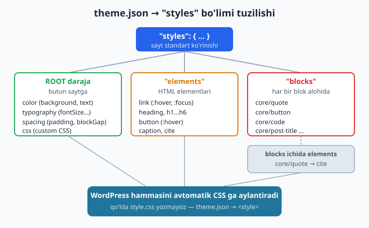
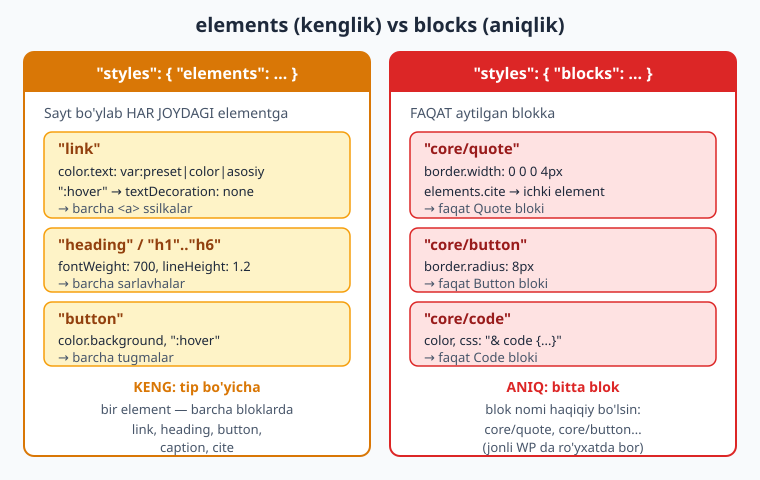

# 17 — theme.json II: styles

[⬅️ Oldingi: 16 — theme.json I: settings](./16-theme-json-settings.md) · [🏠 README](./README.md) · [Keyingi: 18 — Block templates va template parts ➡️](./18-block-templates-parts.md)

> **Bu bobda:** 16-bobda biz `settings` orqali "menyu" tuzdik — foydalanuvchiga qaysi ranglar va o'lchamlar taqdim etilishini belgiladik. Endi `styles` bo'limi orqali **kun taomi** ni tanlaymiz: sayt aslida qanday ko'rinishini. ROOT darajada umumiy ko'rinish (fon, matn rangi, asosiy shrift, bo'shliqlar), `styles.elements` orqali link/sarlavha/tugma kabi HTML elementlarini (hatto `:hover`/`:focus` holatlari bilan), `styles.blocks` orqali har bir blokni alohida bezaymiz. Eng muhimi: bularning hammasi **CSS ni avtomatik generatsiya qiladi** — siz qo'lda `style.css` yozmaysiz. Hamma misol jonli WordPress 7.0 da yaroqli JSON ekani va har kaliti yadroning `WP_Theme_JSON::VALID_STYLES` ro'yxati hamda Twenty Twenty-Five `theme.json` bilan solishtirilgani tekshirilgan.

---

## `settings` dan `styles` ga

16-bobni eslang: `theme.json` ikki ustunga bo'linadi.

| Bo'lim | Vazifasi | Bob |
|--------|----------|-----|
| `settings` | Foydalanuvchiga **qaysi imkoniyatlar** beriladi (palitra, o'lchamlar) | 16 |
| `styles` | O'sha imkoniyatlardan **qaysi qiymat standart** qo'llaniladi (sayt qanday ko'rinadi) | **17 (bu bob)** |

Restoran o'xshatishini davom ettiramiz: `settings` — menyu (mijozga nima taklif qilinadi), `styles` — kun taomi (oshxona standart nimani chiqaradi). Foydalanuvchi keyin Site Editor (Styles paneli) orqali bu standartni o'zgartirishi mumkin (19-bob), lekin temaning **boshlang'ich ko'rinishi** aynan `styles` da yoziladi.

`styles` ning eng katta kuchi: u **CSS generatsiya qiladi**. Klassik temada (1-14 boblar) siz `style.css` ga qo'lda `body { color: ... }`, `a { ... }`, `h1 { ... }` yozardingiz. Block temada buni `theme.json` ning `styles` bo'limiga yozasiz va WordPress avtomatik to'g'ri CSS hosil qilib, sahifaning `<head>` qismiga inline joylaydi. Bitta manba — editor ham, frontend ham bir xil ko'rinadi.

### `styles` ning uch darajasi

`styles` ichida uchta asosiy joy bor. Ularning farqini tushunish bu bobning yadrosi:

1. **ROOT daraja** — to'g'ridan-to'g'ri `styles.color`, `styles.typography`, `styles.spacing`. Bu butun saytga (`<body>` ga) ta'sir qiladi: umumiy fon, matn rangi, asosiy shrift.
2. **`styles.elements`** — muayyan **HTML element turi** ga: barcha linklar, barcha sarlavhalar, barcha tugmalar — qaysi blokda bo'lishidan qat'i nazar.
3. **`styles.blocks.{blok}`** — bitta muayyan **blok** ga: faqat Quote bloki, faqat Button bloki.



Umumiy skelet:

```json
{
	"version": 3,
	"styles": {
		"color": {  },
		"typography": {  },
		"spacing": {  },
		"elements": {  },
		"blocks": {  },
		"css": ""
	}
}
```

Eslatma: bu kalitlarni men o'ylab topmadim. `color`, `typography`, `spacing`, `border`, `dimensions`, `outline`, `filter`, `shadow`, `css` — hammasi WordPress 7.0 yadrosidagi `WP_Theme_JSON::VALID_STYLES` doimiysida bor (jonli WP'da tekshirildi). Noma'lum kalit yozsangiz, WordPress uni jim e'tiborsiz qoldiradi — xato bermaydi, lekin ishlamaydi ham.

---

## ROOT daraja: saytning umumiy ko'rinishi

ROOT darajadagi stillar `<body>` ga, ya'ni butun saytga qo'llaniladi. Bu yerda saytning "ovozini" — asosiy fon, matn rangi, shrift va bo'shliqni belgilaysiz.

```json
{
	"version": 3,
	"styles": {
		"color": {
			"background": "var:preset|color|fon",
			"text": "var:preset|color|matn"
		},
		"typography": {
			"fontFamily": "var:preset|font-family|asosiy",
			"fontSize": "var:preset|font-size|medium",
			"lineHeight": "1.6"
		},
		"spacing": {
			"blockGap": "1.5rem",
			"padding": {
				"top": "0",
				"right": "var:preset|spacing|50",
				"bottom": "0",
				"left": "var:preset|spacing|50"
			}
		}
	}
}
```

Mana har biri nima qiladi:

- **`color.background`** — saytning umumiy fon rangi (`<body>` foni).
- **`color.text`** — standart matn rangi.
- **`typography.fontFamily`** — saytning asosiy shrifti.
- **`typography.fontSize`** — standart matn o'lchami.
- **`typography.lineHeight`** — qator balandligi (o'qilishga ta'sir qiladi).
- **`spacing.blockGap`** — bloklar orasidagi vertikal masofa.
- **`spacing.padding`** — saytning chap-o'ng (va yuqori-past) ichki bo'shlig'i. `useRootPaddingAwareAlignments: true` (16-bob) bilan birga ishlaganda, full-width bloklar bu padding'dan tashqariga chiqib ketadi, oddiy kontent esa ichida qoladi.

`color.text` uchun ruxsat etilgan sub-kalitlar aniq uchta: `background`, `text`, `gradient`. (Bu `WP_Theme_JSON::VALID_STYLES['color']` da tasdiqlangan.)

> **`var:preset|...` qaytadan:** 16-bobda `settings.color.palette` da `asosiy` slug'ini belgilaganimizda WordPress `--wp--preset--color--asosiy` o'zgaruvchisini yaratdi. Endi `styles` da unga **`"var:preset|color|asosiy"`** maxsus sintaksis bilan murojaat qilamiz. Quyida bu jarayonni batafsil ko'ramiz. Avval shuni bilib qo'ying: `var:preset|KATEGORIYA|slug` — bu preset qiymatga ishora qilishning theme.json'dagi qisqa usuli.

ROOT `typography` da yana ko'p kalit bor: `fontWeight`, `letterSpacing`, `textAlign`, `textDecoration`, `textTransform`, `fontStyle`, `textColumns`, `writingMode`, `textIndent`. Hammasi `VALID_STYLES['typography']` da. Lekin ROOT darajada odatda faqat asosiylari (`fontFamily`, `fontSize`, `lineHeight`) yoziladi — qolganlari elementlar yoki bloklar darajasida aniqlanadi.

---

## `styles.elements` — HTML elementlarini bezash

ROOT daraja butun saytga ta'sir qiladi. Lekin link boshqacha rangda, sarlavha qalinroq, tugma esa fonli bo'lishi kerak. `styles.elements` aynan shu uchun: u **muayyan HTML element turi** ga uslub beradi — qaysi blokda joylashganidan qat'i nazar.



Ruxsat etilgan elementlar ro'yxati cheklangan (WordPress yadrosidagi `WP_Theme_JSON::ELEMENTS` da):

| Element | Nimaga ta'sir qiladi |
|---------|----------------------|
| `link` | Barcha havolalar (`<a>`) |
| `heading` | Barcha sarlavhalar (h1-h6 birga) |
| `h1`, `h2`, `h3`, `h4`, `h5`, `h6` | Har bir sarlavha darajasi alohida |
| `button` | Barcha tugmalar |
| `caption` | Rasm/jadval izohlari |
| `cite` | Iqtibos manbasi (`<cite>`) |

(WordPress 7.0 da `textInput` va `select` elementlari ham qo'shildi — forma maydonlari uchun; lekin tema dizaynida eng ko'p yuqoridagilar ishlatiladi.)

### `link` — havolalar va pseudo-holatlar

Bu eng muhim element. Linkning oddiy holati va `:hover`/`:focus` holatlarini birga belgilaysiz:

```json
{
	"version": 3,
	"styles": {
		"elements": {
			"link": {
				"color": { "text": "var:preset|color|asosiy" },
				"typography": { "textDecoration": "underline" },
				":hover": {
					"color": { "text": "var:preset|color|ikkilamchi" },
					"typography": { "textDecoration": "none" }
				},
				":focus": {
					"outline": {
						"color": "var:preset|color|asosiy",
						"offset": "2px",
						"style": "solid",
						"width": "2px"
					}
				}
			}
		}
	}
}
```

Bu yerda:

- Oddiy holat: link `asosiy` rangda, tagi chizilgan.
- **`:hover`** — sichqoncha ustiga kelganda `ikkilamchi` rangga o'tadi, tagi chizig'i yo'qoladi.
- **`:focus`** — klaviatura (Tab) bilan tanlanganda atrofida outline (kontur) chiqadi. Bu **accessibility** uchun juda muhim (28-bob).

Pseudo-selektorlar — kalit nomi `:` bilan boshlanadigan ichki obyekt. WordPress yadrosida `VALID_ELEMENT_PSEUDO_SELECTORS` faqat `link` va `button` elementlari uchun ularni qo'llab-quvvatlaydi. Ruxsat etilganlari: `:link`, `:any-link`, `:visited`, `:hover`, `:focus`, `:focus-visible`, `:active`. Boshqa elementda (masalan `heading` da) `:hover` ishlamaydi.

> **Specificity tartibi:** WordPress pseudo-selektorlarni ataylab quyidagi tartibda chiqaradi: `:link`, `:any-link`, `:visited`, `:hover`, `:focus`, `:active`. Buning sababi — hover/focus holatlari visited holatidan ustun bo'lishi kerak. Siz tartibni o'ylamasangiz ham bo'ladi — WordPress to'g'ri joylashtiradi.

### `heading` va `h1`-`h6`

`heading` barcha sarlavhalarga umumiy qoida beradi, `h1`-`h6` esa har birini aniqlashtiradi:

```json
{
	"version": 3,
	"styles": {
		"elements": {
			"heading": {
				"typography": {
					"fontFamily": "var:preset|font-family|asosiy",
					"fontWeight": "700",
					"lineHeight": "1.2"
				}
			},
			"h1": { "typography": { "fontSize": "var:preset|font-size|xx-large" } },
			"h2": { "typography": { "fontSize": "var:preset|font-size|x-large" } },
			"h3": { "typography": { "fontSize": "var:preset|font-size|large" } },
			"h4": { "typography": { "fontSize": "var:preset|font-size|medium" } },
			"h5": { "typography": { "fontSize": "var:preset|font-size|small" } },
			"h6": {
				"typography": {
					"fontSize": "var:preset|font-size|small",
					"textTransform": "uppercase",
					"letterSpacing": "1px"
				}
			}
		}
	}
}
```

Mantiq: `heading` umumiy qalinlik va qator balandligini hammasiga beradi; `h1`-`h6` esa faqat o'lchamni har bir darajaga moslab beradi. Bu DRY (takrorlanmaslik) yondashuvi — umumiy narsani bir joyda, o'ziga xosni alohida. Twenty Twenty-Five aynan shu naqshni ishlatadi.

### `button`, `caption`, `cite`

```json
{
	"version": 3,
	"styles": {
		"elements": {
			"button": {
				"color": { "background": "var:preset|color|asosiy", "text": "var:preset|color|fon" },
				"spacing": { "padding": { "top": "0.8rem", "right": "1.5rem", "bottom": "0.8rem", "left": "1.5rem" } },
				"typography": { "fontWeight": "600" },
				":hover": { "color": { "background": "var:preset|color|ikkilamchi" } },
				":focus": { "outline": { "color": "var:preset|color|matn", "offset": "2px" } }
			},
			"caption": {
				"typography": { "fontSize": "var:preset|font-size|small", "fontStyle": "italic" }
			},
			"cite": {
				"typography": { "fontSize": "var:preset|font-size|small", "fontStyle": "normal", "fontWeight": "600" }
			}
		}
	}
}
```

- **`button`** — fonli tugma, `:hover` da fon o'zgaradi, `:focus` da outline (link kabi, button ham pseudo'ni qo'llaydi).
- **`caption`** — rasm va jadval izohlari (odatda kichikroq, kursiv).
- **`cite`** — iqtibos manbasi nomi.

---

## `styles.blocks.{blok}` — har bir blokni alohida bezash

`elements` bir **tur** (barcha linklar) ga ta'sir qiladi. Ba'zan esa bitta **muayyan blok** ga maxsus uslub kerak: Quote blokining chap chegarasi, Button blokining burchak radiusi, Code blokining foni. Buning uchun `styles.blocks` ishlatiladi:

```json
{
	"version": 3,
	"styles": {
		"blocks": {
			"core/quote": {
				"border": { "style": "solid", "width": "0 0 0 4px", "color": "var:preset|color|asosiy" },
				"spacing": {
					"padding": {
						"left": "var:preset|spacing|40",
						"top": "var:preset|spacing|30",
						"bottom": "var:preset|spacing|30"
					}
				},
				"typography": { "fontSize": "var:preset|font-size|large", "fontStyle": "italic" }
			},
			"core/button": {
				"border": { "radius": "8px" },
				"color": { "background": "var:preset|color|asosiy" }
			}
		}
	}
}
```

Bu yerda:

- **`core/quote`** — iqtibos blokiga chap tomonda 4px qalin `asosiy` rangli chiziq, ichki bo'shliq va kursiv katta matn. Bu klassik "blockquote" ko'rinishi.
- **`core/button`** — tugmaga 8px yumaloq burchak va `asosiy` fon.

Blok nomi **haqiqiy core blok nomi** bo'lishi shart: `core/quote`, `core/button`, `core/code`, `core/paragraph`, `core/group`, `core/columns`, `core/post-title` va h.k. (jonli WordPress'dagi blok ro'yxatida bor — `core/quote`, `core/button`, `core/code`, `core/post-title` mavjudligi tekshirildi). O'ylab topilgan nom (`core/quoute`) yozsangiz, sozlama jim ishlamaydi.

Blok ichida ROOT bilan bir xil kalitlar ishlatiladi: `color`, `typography`, `spacing`, `border`, `dimensions`, `css`, `elements`, `variations`.

### Blok ichida `elements` — joriy element stillari

Eng kuchli imkoniyatlardan biri: `styles.blocks.{blok}.elements` — bitta blok ichidagi muayyan elementni bezash. Masalan, post sarlavhasi (`core/post-title`) ichidagi link boshqa linklardan farqli bo'lsin:

```json
{
	"version": 3,
	"styles": {
		"blocks": {
			"core/post-title": {
				"typography": { "fontSize": "var:preset|font-size|xx-large", "fontWeight": "700" },
				"elements": {
					"link": {
						"color": { "text": "var:preset|color|matn" },
						"typography": { "textDecoration": "none" },
						":hover": { "typography": { "textDecoration": "underline" } }
					}
				}
			}
		}
	}
}
```

Bu shuni anglatadi: post sarlavhasi katta va qalin; uning ichidagi link (post sahifasiga olib boruvchi) `matn` rangida, tagi chizilmagan, lekin ustiga kelganda tagi chiziladi. **Sayt bo'ylab boshqa linklar bunga ta'sir qilmaydi** — faqat post sarlavhasi ichidagi link. Twenty Twenty-Five `core/post-title`, `core/post-date`, `core/comment-author-name` kabi bloklarda aynan shu naqshni ishlatadi.

### Blok darajasida pseudo-selektor (WP 7.0)

WordPress 7.0 da `core/button` blokining o'zi uchun ham `:hover` kabi pseudo-holatlarni belgilash mumkin (`VALID_BLOCK_PSEUDO_SELECTORS`):

```json
{
	"version": 3,
	"styles": {
		"blocks": {
			"core/button": {
				"color": { "background": "var:preset|color|asosiy" },
				":hover": { "color": { "background": "var:preset|color|ikkilamchi" } }
			}
		}
	}
}
```

> **Eslatma:** blok darajasidagi pseudo-selektor hozircha asosan `core/button` uchun qo'llab-quvvatlanadi. Element darajasida (`button` elementi) `:hover` keng tarqalgan va ishonchli — ko'p hollarda `elements.button` ni ishlatish afzal.

---

## Custom CSS: `styles.css` va blok ichidagi `css`

theme.json'ning deyarli hamma narsani strukturali kalitlar bilan ifodalashga harakat qiladi. Lekin ba'zi narsalar uchun (masalan `transition`, `::before` pseudo-element, murakkab selektor) tayyor kalit yo'q. Shu holatlar uchun **`css`** kaliti bor — bevosita CSS yozasiz.

### ROOT `styles.css` — global custom CSS

```json
{
	"version": 3,
	"styles": {
		"css": "body { -webkit-font-smoothing: antialiased; } a { transition: color 0.2s ease; }"
	}
}
```

Bu CSS saytning umumiy stiliga qo'shiladi. `style.css` o'rniga bu yerda yozish afzal, chunki u editorga ham, frontendga ham qo'llaniladi.

### Blok ichida `css` va `&` selektori

Eng foydalisi — `styles.blocks.{blok}.css`. Bu yerda **`&`** belgisi "shu blokning o'zi" degan ma'noni bildiradi (xuddi SCSS dagidek):

```json
{
	"version": 3,
	"styles": {
		"blocks": {
			"core/quote": {
				"css": "& cite { display: block; margin-top: 0.5rem; } &.is-style-plain { border: 0; padding-left: 0; }"
			},
			"core/list": {
				"css": "& li { margin-top: 0.5rem; }"
			}
		}
	}
}
```

`&` belgisini WordPress avtomatik blokning to'liq selektoriga almashtiradi. Masalan `core/quote` uchun:

- `& cite { ... }` → `.wp-block-quote cite { ... }`
- `&.is-style-plain { ... }` → `.wp-block-quote.is-style-plain { ... }` (blokning o'ziga qo'shimcha class)
- `& li { ... }` (List da) → `.wp-block-list li { ... }`

Diqqat: `& cite` (bo'shliq bilan) — blok **ichidagi** `cite`; `&.is-style-plain` (bo'shliqsiz) — blokning **o'zida** qo'shimcha class. Bu farq SCSS bilan bir xil. Twenty Twenty-Five `core/quote`, `core/list`, `core/post-comments-form` kabi bloklarda `css` va `&` ni keng ishlatadi.

> **Custom CSS — oxirgi chora:** mumkin bo'lganda strukturali kalit (`color`, `spacing`, `border`) ishlating — ular editorga ham mos keladi va boshqarish oson. `css` ni faqat tayyor kalit yo'q bo'lgan holatlar (transition, pseudo-element, murakkab selektor) uchun saqlang. Custom CSS ichida ham preset o'zgaruvchilarini ishlating: `var(--wp--preset--color--asosiy)`.

---

## `var:preset|...` sintaksisi: chuqurroq

Bu — `settings` va `styles` ni bog'laydigan ko'prik. 16-bobda `settings` da preset belgilaganda WordPress CSS o'zgaruvchi yaratganini ko'rdik. `styles` da o'sha o'zgaruvchiga **`var:preset|...`** sintaksisi bilan murojaat qilasiz.



Formula doim bir xil:

```
var:preset|{kategoriya}|{slug}
```

| `styles` da yozasiz | WordPress aylantiradi |
|---------------------|------------------------|
| `"var:preset|color|asosiy"` | `var(--wp--preset--color--asosiy)` |
| `"var:preset|font-size|large"` | `var(--wp--preset--font-size--large)` |
| `"var:preset|font-family|asosiy"` | `var(--wp--preset--font-family--asosiy)` |
| `"var:preset|spacing|50"` | `var(--wp--preset--spacing--50)` |
| `"var:preset|gradient|kok-yashil"` | `var(--wp--preset--gradient--kok-yashil)` |

Diqqat qiling:

- Kategoriya nomida **ajratuvchi `|` (vertikal chiziq)**, defis emas. To'g'ri: `var:preset|font-size|large`. Noto'g'ri: `var:preset|fontSize|large` yoki `var:preset-color-asosiy`.
- Kategoriya **`font-size`** (defis bilan), `fontSize` (camelCase) EMAS — bu eng ko'p uchraydigan xato.
- Slug — 16-bobda `settings` da bergan slug'ingiz (`asosiy`, `large`, `50`).

**Nega `var:preset|...` ishlatamiz?** Chunki rang qiymatini bir joyda — `settings.color.palette` da — saqlaysiz. Agar `styles` da to'g'ridan-to'g'ri `#2563eb` yozsangiz va keyin brend rangi o'zgarsa, hamma joyni qidirib almashtirishingiz kerak bo'ladi. `var:preset|color|asosiy` bilan esa faqat `settings` dagi bitta qiymatni o'zgartirasiz — sayt bo'ylab hamma joyda yangilanadi. Bu DRY tamoyilining theme.json darajasidagi ifodasi.

> **Frontend (oddiy CSS) farqi:** `var:preset|...` sintaksisi FAQAT theme.json ichida ishlaydi. Agar `styles.css` (yoki `&` bilan blok css) ichida yozsangiz, u yerda to'liq CSS sintaksisi kerak: `var(--wp--preset--color--asosiy)`. theme.json'ning strukturali qiymatlarida (masalan `color.text`) qisqa `var:preset|color|asosiy`, custom CSS satrida esa to'liq `var(--wp--preset--color--asosiy)`.

---

## To'liq, ishlaydigan misol

Mana 16-bobning `settings` ustiga `styles` qo'shilgan to'liq tema konfiguratsiyasi. Bu fayl `ch17-test` test temasiga yozildi va jonli WordPress 7.0 da PHP `json_decode` bilan yaroqli JSON ekani, har kaliti `WP_Theme_JSON::VALID_STYLES`/`ELEMENTS` bilan mosligi tasdiqlandi:

```json
{
	"$schema": "https://schemas.wp.org/wp/6.7/theme.json",
	"version": 3,
	"settings": {
		"appearanceTools": true,
		"useRootPaddingAwareAlignments": true,
		"layout": { "contentSize": "650px", "wideSize": "1200px" },
		"color": {
			"defaultPalette": false,
			"palette": [
				{ "slug": "asosiy", "color": "#2563eb", "name": "Asosiy" },
				{ "slug": "ikkilamchi", "color": "#16a34a", "name": "Ikkilamchi" },
				{ "slug": "matn", "color": "#1e293b", "name": "Matn" },
				{ "slug": "fon", "color": "#f8fafc", "name": "Fon" }
			]
		},
		"typography": {
			"fluid": true,
			"defaultFontSizes": false,
			"fontSizes": [
				{ "slug": "small", "size": "1rem", "name": "Kichik" },
				{ "slug": "medium", "size": "1.25rem", "name": "Orta" },
				{ "slug": "large", "size": "2rem", "name": "Katta", "fluid": { "min": "1.5rem", "max": "2rem" } },
				{ "slug": "x-large", "size": "2.5rem", "name": "Juda katta", "fluid": { "min": "2rem", "max": "2.5rem" } },
				{ "slug": "xx-large", "size": "3.5rem", "name": "Ulkan", "fluid": { "min": "2.5rem", "max": "3.5rem" } }
			],
			"fontFamilies": [
				{ "slug": "asosiy", "name": "Asosiy shrift", "fontFamily": "-apple-system, BlinkMacSystemFont, \"Segoe UI\", Roboto, sans-serif" }
			]
		},
		"spacing": {
			"defaultSpacingSizes": false,
			"spacingSizes": [
				{ "slug": "30", "size": "0.75rem", "name": "Kichik" },
				{ "slug": "40", "size": "1.5rem", "name": "Orta" },
				{ "slug": "50", "size": "clamp(2rem, 5vw, 3rem)", "name": "Katta" }
			]
		}
	},
	"styles": {
		"color": { "background": "var:preset|color|fon", "text": "var:preset|color|matn" },
		"typography": {
			"fontFamily": "var:preset|font-family|asosiy",
			"fontSize": "var:preset|font-size|medium",
			"lineHeight": "1.6"
		},
		"spacing": {
			"blockGap": "var:preset|spacing|40",
			"padding": { "top": "0", "right": "var:preset|spacing|50", "bottom": "0", "left": "var:preset|spacing|50" }
		},
		"elements": {
			"link": {
				"color": { "text": "var:preset|color|asosiy" },
				":hover": { "typography": { "textDecoration": "none" } }
			},
			"heading": { "typography": { "fontFamily": "var:preset|font-family|asosiy", "fontWeight": "700", "lineHeight": "1.2" } },
			"h1": { "typography": { "fontSize": "var:preset|font-size|xx-large" } },
			"h2": { "typography": { "fontSize": "var:preset|font-size|x-large" } },
			"h3": { "typography": { "fontSize": "var:preset|font-size|large" } },
			"button": {
				"color": { "background": "var:preset|color|asosiy", "text": "var:preset|color|fon" },
				":hover": { "color": { "background": "var:preset|color|ikkilamchi" } }
			},
			"caption": { "typography": { "fontSize": "var:preset|font-size|small", "fontStyle": "italic" } }
		},
		"blocks": {
			"core/quote": {
				"border": { "style": "solid", "width": "0 0 0 4px", "color": "var:preset|color|asosiy" },
				"spacing": { "padding": { "left": "var:preset|spacing|40" } },
				"typography": { "fontStyle": "italic" },
				"elements": {
					"cite": { "typography": { "fontStyle": "normal", "fontSize": "var:preset|font-size|small" } }
				}
			},
			"core/button": { "border": { "radius": "8px" } },
			"core/code": {
				"color": { "background": "var:preset|color|matn", "text": "var:preset|color|fon" },
				"spacing": { "padding": { "top": "var:preset|spacing|30", "right": "var:preset|spacing|40", "bottom": "var:preset|spacing|30", "left": "var:preset|spacing|40" } },
				"css": "& code { white-space: pre-wrap; }"
			}
		}
	}
}
```

Bu — to'liq dizayn tizimi va uning standart ko'rinishi birga. Hammasini WordPress avtomatik CSS ga aylantiradi: `<body>` foni `fon`, matn `matn`, linklar `asosiy`, sarlavhalar qalin, Quote blokida chap chiziq, Code blokida to'q fon. **Birorta `style.css` qoidasi yozmadik.** Keyingi bobda (18) bu stillarni ko'rsatadigan block templates va template parts ni yaratamiz.

---

## Tez-tez uchraydigan xatolar

1. **`var:preset` da camelCase.** `var:preset|fontSize|large` ishlamaydi — to'g'risi `var:preset|font-size|large` (defis bilan). Xuddi shu `font-family` uchun ham.
2. **`var:preset` da defis ajratuvchi.** Ajratuvchi vertikal chiziq `|`, defis emas: `var:preset|color|asosiy`, NE `var:preset-color-asosiy`.
3. **Mavjud bo'lmagan slug.** `settings` da `asosiy` slug'i yo'q bo'lsa, `"var:preset|color|asosiy"` bo'sh qiymat beradi. Slug `settings` dagi bilan aynan mos kelishi shart.
4. **Custom CSS da `var:preset` ishlatish.** `styles.css` yoki blok `css` ichida `var:preset|...` ishlamaydi — u yerda to'liq `var(--wp--preset--color--asosiy)` yozing.
5. **Noma'lum element nomi.** `styles.elements` faqat aniq ro'yxatni qabul qiladi: `link`, `heading`, `h1`-`h6`, `button`, `caption`, `cite`. `paragraph` yoki `list` element EMAS — ular blok (`core/paragraph`), shuning uchun `styles.blocks` da.
6. **`heading` da `:hover`.** Pseudo-selektor faqat `link` va `button` da ishlaydi. `heading` yoki `caption` da `:hover` yozsangiz e'tiborsiz qoldiriladi.
7. **`&` ni unutish.** Blok `css` da `cite { ... }` (bo'shliqsiz `&` yo'q) butun saytdagi `cite` ga ta'sir qilishi mumkin. To'g'ri: `& cite { ... }` — faqat shu blok ichidagi.
8. **`color.text` o'rniga `color.color`.** Rang sub-kalitlari aniq: `background`, `text`, `gradient`. `color` ichida yana `color` yo'q.

---

## Mashqlar

### Oson

1. **Sayt fon va matn rangini belgilang.** `styles.color` da `background` ni `fon`, `text` ni `matn` preset'iga (`var:preset|...` bilan) qo'ying. JSON yaroqli bo'lsin.
2. **Asosiy shrift va qator balandligi.** `styles.typography` da `fontFamily` ni `asosiy` preset'iga, `fontSize` ni `medium` ga, `lineHeight` ni `1.6` ga qo'ying.
3. **Bloklar orasidagi masofa.** `styles.spacing.blockGap` ni `1.5rem` qiling.
4. **Link rangi.** `styles.elements.link.color.text` ni `asosiy` preset'iga qo'ying.

### O'rta

5. **Sarlavha o'lchamlari.** `styles.elements` da `h1` ni `xx-large`, `h2` ni `x-large` preset'iga qo'ying (`var:preset|font-size|...`).
6. **Link hover holati.** `styles.elements.link` ga oddiy holat (`asosiy`, tagi chizilgan) va `:hover` (`ikkilamchi`, tagi chizilmagan) qo'shing.
7. **Tugma elementi.** `styles.elements.button` ga fon (`asosiy`), matn (`fon`), padding va `:hover` (fon `ikkilamchi`) qo'shing.
8. **Umumiy sarlavha uslubi.** `styles.elements.heading` ga `fontFamily` (`asosiy`), `fontWeight: 700`, `lineHeight: 1.2` qo'shing — bu barcha h1-h6 ga ta'sir qilsin.

### Qiyin

9. **Quote blokini bezang.** `styles.blocks."core/quote"` ga chap chegara (`0 0 0 4px`, `asosiy` rang, `solid`), chap padding (`spacing|40`) va kursiv katta matn qo'shing.
10. **Code blok + custom CSS.** `styles.blocks."core/code"` ga to'q fon (`matn`), och matn (`fon`), monospace shrift va `css` da `& code { white-space: pre-wrap; word-break: break-word; }` qo'shing.
11. **Blok ichida element stili.** `styles.blocks."core/post-title"` ga katta qalin matn, va uning ichidagi `elements.link` ga: `matn` rang, tagi chizilmagan, `:hover` da tagi chiziladigan qiling. Sayt bo'ylab boshqa linklar bunga ta'sir qilmasligini tushuntiring.
12. **Root custom CSS.** `styles.css` ga: barcha linklarga `transition: color 0.2s ease`, barcha rasmlarga `max-width: 100%; height: auto` qo'shing.
13. **To'liq `styles` bo'limi.** Bitta `theme.json` da: ROOT (fon/matn/shrift/blockGap/padding), `elements` (link + hover, heading, h1-h3, button + hover, caption), `blocks` (core/quote chegara + ichida cite, core/button radius, core/code fon + css) — hammasini birlashtiring. JSON yaroqli bo'lishini tekshiring.

---

## Yechimlar

<details markdown="1">
<summary>Yechim — 1</summary>

```json
{
	"version": 3,
	"styles": {
		"color": {
			"background": "var:preset|color|fon",
			"text": "var:preset|color|matn"
		}
	}
}
```

`background` va `text` ROOT darajada butun `<body>` ga ta'sir qiladi. `var:preset|color|fon` → `var(--wp--preset--color--fon)`. `color` ning ruxsat etilgan sub-kalitlari: `background`, `text`, `gradient`.

</details>

<details markdown="1">
<summary>Yechim — 2</summary>

```json
{
	"version": 3,
	"styles": {
		"typography": {
			"fontFamily": "var:preset|font-family|asosiy",
			"fontSize": "var:preset|font-size|medium",
			"lineHeight": "1.6"
		}
	}
}
```

`fontFamily` kategoriyasi `font-family` (defis bilan), `fontSize` esa `font-size`. `lineHeight` to'g'ridan-to'g'ri raqam (preset emas). Bu uchtasi saytning umumiy matn ko'rinishini belgilaydi.

</details>

<details markdown="1">
<summary>Yechim — 3</summary>

```json
{
	"version": 3,
	"styles": {
		"spacing": {
			"blockGap": "1.5rem"
		}
	}
}
```

`blockGap` — bloklar orasidagi vertikal masofa (Group, Columns ichida ham). Bu yerda to'g'ridan-to'g'ri qiymat berdik; `var:preset|spacing|40` bilan preset'ga ham bog'lash mumkin edi.

</details>

<details markdown="1">
<summary>Yechim — 4</summary>

```json
{
	"version": 3,
	"styles": {
		"elements": {
			"link": {
				"color": { "text": "var:preset|color|asosiy" }
			}
		}
	}
}
```

`styles.elements.link` sayt bo'ylab barcha `<a>` havolalariga ta'sir qiladi. `link` — `WP_Theme_JSON::ELEMENTS` dagi yaroqli element nomi.

</details>

<details markdown="1">
<summary>Yechim — 5</summary>

```json
{
	"version": 3,
	"styles": {
		"elements": {
			"h1": { "typography": { "fontSize": "var:preset|font-size|xx-large" } },
			"h2": { "typography": { "fontSize": "var:preset|font-size|x-large" } }
		}
	}
}
```

`h1`-`h6` har bir sarlavha darajasini alohida boshqaradi. `font-size` kategoriyasi defis bilan. Slug'lar (`xx-large`, `x-large`) `settings.typography.fontSizes` da bo'lishi shart.

</details>

<details markdown="1">
<summary>Yechim — 6</summary>

```json
{
	"version": 3,
	"styles": {
		"elements": {
			"link": {
				"color": { "text": "var:preset|color|asosiy" },
				"typography": { "textDecoration": "underline" },
				":hover": {
					"color": { "text": "var:preset|color|ikkilamchi" },
					"typography": { "textDecoration": "none" }
				}
			}
		}
	}
}
```

`:hover` — kalit nomi `:` bilan boshlanadigan ichki obyekt. Pseudo-selektorlar `link` va `button` da ishlaydi. Oddiy holat: `asosiy`, tagi chizilgan; hover: `ikkilamchi`, tagi yo'q.

</details>

<details markdown="1">
<summary>Yechim — 7</summary>

```json
{
	"version": 3,
	"styles": {
		"elements": {
			"button": {
				"color": { "background": "var:preset|color|asosiy", "text": "var:preset|color|fon" },
				"spacing": { "padding": { "top": "0.8rem", "right": "1.5rem", "bottom": "0.8rem", "left": "1.5rem" } },
				":hover": { "color": { "background": "var:preset|color|ikkilamchi" } }
			}
		}
	}
}
```

`button` elementi barcha tugmalarga ta'sir qiladi (Button bloki, Search tugmasi va h.k.). `:hover` faqat fonni o'zgartiradi. Padding to'rt tomonni alohida belgilaydi.

</details>

<details markdown="1">
<summary>Yechim — 8</summary>

```json
{
	"version": 3,
	"styles": {
		"elements": {
			"heading": {
				"typography": {
					"fontFamily": "var:preset|font-family|asosiy",
					"fontWeight": "700",
					"lineHeight": "1.2"
				}
			}
		}
	}
}
```

`heading` — h1 dan h6 gacha hammasiga umumiy qoida. Bu yerda umumiy qalinlik va qator balandligi; har bir darajaning o'lchamini `h1`-`h6` da alohida berasiz (DRY naqsh).

</details>

<details markdown="1">
<summary>Yechim — 9</summary>

```json
{
	"version": 3,
	"styles": {
		"blocks": {
			"core/quote": {
				"border": { "style": "solid", "width": "0 0 0 4px", "color": "var:preset|color|asosiy" },
				"spacing": { "padding": { "left": "var:preset|spacing|40", "top": "var:preset|spacing|30", "bottom": "var:preset|spacing|30" } },
				"typography": { "fontStyle": "italic", "fontSize": "var:preset|font-size|large" }
			}
		}
	}
}
```

`border.width: "0 0 0 4px"` — faqat chap chegara (yuqori/o'ng/past 0). `color` preset'ga bog'langan. Bu klassik blockquote ko'rinishi. `core/quote` jonli WP da mavjud blok.

</details>

<details markdown="1">
<summary>Yechim — 10</summary>

```json
{
	"version": 3,
	"styles": {
		"blocks": {
			"core/code": {
				"color": { "background": "var:preset|color|matn", "text": "var:preset|color|fon" },
				"typography": { "fontFamily": "var:preset|font-family|monospace" },
				"css": "& code { white-space: pre-wrap; word-break: break-word; }"
			}
		}
	}
}
```

To'q fon (`matn`) + och matn (`fon`) — terminal ko'rinishi. `css` da `&` Code blokining selektoriga aylanadi: `& code` → `.wp-block-code code`. `white-space: pre-wrap` uzun kod satrlarini o'rab tashlaydi. (`monospace` shrift `settings.fontFamilies` da bo'lishi kerak.)

</details>

<details markdown="1">
<summary>Yechim — 11</summary>

```json
{
	"version": 3,
	"styles": {
		"blocks": {
			"core/post-title": {
				"typography": { "fontSize": "var:preset|font-size|xx-large", "fontWeight": "700" },
				"elements": {
					"link": {
						"color": { "text": "var:preset|color|matn" },
						"typography": { "textDecoration": "none" },
						":hover": { "typography": { "textDecoration": "underline" } }
					}
				}
			}
		}
	}
}
```

**Tushuntirish:** `styles.blocks."core/post-title".elements.link` — bu link uslubi FAQAT post sarlavhasi blokining ichidagi havolaga qo'llanadi. Sayt bo'ylab boshqa linklar (matn ichidagi, menyu, footer) `styles.elements.link` (global) ni oladi, bu blok-ichi qoidaga ta'sir qilmaydi. Bu "joriy element stillari" naqshi — keng global + aniq blok-ichi.

</details>

<details markdown="1">
<summary>Yechim — 12</summary>

```json
{
	"version": 3,
	"styles": {
		"css": "a { transition: color 0.2s ease; } img { max-width: 100%; height: auto; }"
	}
}
```

`styles.css` — ROOT custom CSS, butun saytga qo'shiladi. Bu yerda `transition` va responsive rasm uchun tayyor theme.json kaliti yo'q, shuning uchun bevosita CSS. Custom CSS satrida preset'lar to'liq sintaksis bilan: `var(--wp--preset--color--asosiy)`.

</details>

<details markdown="1">
<summary>Yechim — 13</summary>

```json
{
	"$schema": "https://schemas.wp.org/wp/6.7/theme.json",
	"version": 3,
	"styles": {
		"color": { "background": "var:preset|color|fon", "text": "var:preset|color|matn" },
		"typography": {
			"fontFamily": "var:preset|font-family|asosiy",
			"fontSize": "var:preset|font-size|medium",
			"lineHeight": "1.6"
		},
		"spacing": {
			"blockGap": "var:preset|spacing|40",
			"padding": { "top": "0", "right": "var:preset|spacing|50", "bottom": "0", "left": "var:preset|spacing|50" }
		},
		"elements": {
			"link": {
				"color": { "text": "var:preset|color|asosiy" },
				":hover": { "color": { "text": "var:preset|color|ikkilamchi" }, "typography": { "textDecoration": "none" } }
			},
			"heading": { "typography": { "fontFamily": "var:preset|font-family|asosiy", "fontWeight": "700", "lineHeight": "1.2" } },
			"h1": { "typography": { "fontSize": "var:preset|font-size|xx-large" } },
			"h2": { "typography": { "fontSize": "var:preset|font-size|x-large" } },
			"h3": { "typography": { "fontSize": "var:preset|font-size|large" } },
			"button": {
				"color": { "background": "var:preset|color|asosiy", "text": "var:preset|color|fon" },
				":hover": { "color": { "background": "var:preset|color|ikkilamchi" } }
			},
			"caption": { "typography": { "fontSize": "var:preset|font-size|small", "fontStyle": "italic" } }
		},
		"blocks": {
			"core/quote": {
				"border": { "style": "solid", "width": "0 0 0 4px", "color": "var:preset|color|asosiy" },
				"spacing": { "padding": { "left": "var:preset|spacing|40" } },
				"typography": { "fontStyle": "italic" },
				"elements": {
					"cite": { "typography": { "fontStyle": "normal", "fontSize": "var:preset|font-size|small" } }
				}
			},
			"core/button": { "border": { "radius": "8px" } },
			"core/code": {
				"color": { "background": "var:preset|color|matn", "text": "var:preset|color|fon" },
				"css": "& code { white-space: pre-wrap; }"
			}
		}
	}
}
```

Bu to'liq `styles` bo'limi uch darajani birlashtiradi:
- **ROOT:** fon, matn, shrift, blockGap, chap-o'ng padding.
- **elements:** link (+ hover), heading + h1-h3, button (+ hover), caption.
- **blocks:** `core/quote` (chap chegara + ichida `cite` element), `core/button` (radius), `core/code` (to'q fon + `&` bilan custom css).

Bu fayl `ch17-test` test temasiga yozilib, `php -r "json_decode(...)"` bilan yaroqli JSON ekani va har kaliti `WP_Theme_JSON::VALID_STYLES`/`ELEMENTS` bilan mosligi tasdiqlandi. Birorta `style.css` qoidasi yozmasdan — WordPress hammasini avtomatik CSS ga aylantiradi.

</details>

---

[⬅️ Oldingi: 16 — theme.json I: settings](./16-theme-json-settings.md) · [🏠 README](./README.md) · [Keyingi: 18 — Block templates va template parts ➡️](./18-block-templates-parts.md)
