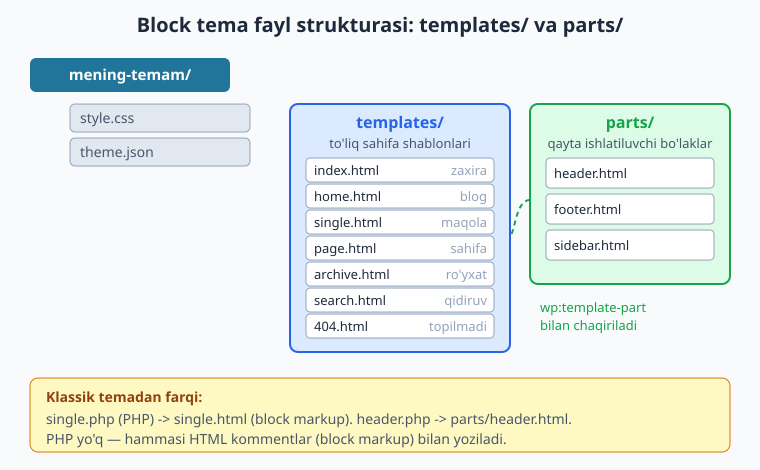
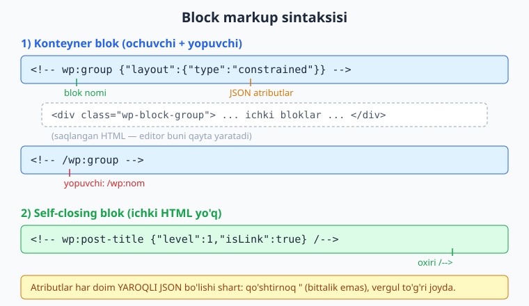
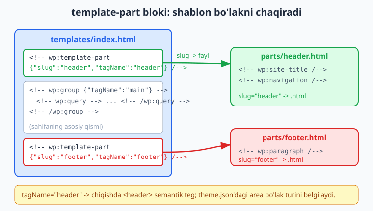

# 18 — Block templates va template parts

[⬅️ Oldingi: 17 — theme.json II: styles](./17-theme-json-styles.md) · [🏠 README](./README.md) · [Keyingi: 19 — Global styles va style variations ➡️](./19-global-styles-variations.md)

> **Bu bobda:** 16 va 17-boblarda `theme.json` orqali block temaning dizayn qoidalarini belgiladik. Endi sahifaning **tuzilishini** yasaymiz. Block temada klassik `single.php` o'rnini `templates/single.html` egallaydi — ichida PHP emas, **block markup** (`<!-- wp:... -->` ko'rinishidagi HTML kommentlar) bo'ladi. `header.php`, `footer.php`, `sidebar.php` esa `parts/` papkasidagi **template part** fayllariga aylanadi va `wp:template-part` bloki orqali shablonga ulanadi. Biz block markup sintaksisini (ochuvchi/yopuvchi va self-closing bloklar, JSON atributlar), query loop'ni (`wp:query` + `wp:post-template`), hamda `theme.json`'dagi `templateParts` va `customTemplates` bo'limlarini o'rganamiz. Hamma markup jonli WordPress 7.0 da `parse_blocks()` bilan tekshirilgan.

---

## Klassik PHP shablondan block markup'ga

7-bobda klassik temaning yuragi bo'lgan shablon iyerarxiyasini ko'rdik: `single.php`, `page.php`, `archive.php` va hokazo. Ularning ichi PHP edi — `the_title()`, `the_content()`, The Loop bilan.

Block temada bu mantiq saqlanadi, lekin **fayl ko'rinishi tubdan o'zgaradi**:

| Klassik tema | Block tema | Vazifasi |
|--------------|------------|----------|
| `index.php` | `templates/index.html` | Universal zaxira shablon |
| `single.php` | `templates/single.html` | Bitta maqola |
| `page.php` | `templates/page.html` | Bitta sahifa |
| `archive.php` | `templates/archive.html` | Maqolalar ro'yxati |
| `search.php` | `templates/search.html` | Qidiruv natijalari |
| `404.php` | `templates/404.html` | Topilmadi sahifasi |
| `home.php` | `templates/home.html` | Blog bosh sahifasi |
| `header.php` | `parts/header.html` | Sayt sarlavhasi |
| `footer.php` | `parts/footer.html` | Sayt pasti |
| `sidebar.php` | `parts/sidebar.html` | Yon panel |

Asosiy farqlar:

- **Kengaytma `.php` emas, `.html`** — chunki ichida PHP bajarilmaydi.
- **Papka tuzilishi qat'iy**: to'liq sahifa shablonlari `templates/` ichida, bo'laklar `parts/` ichida. Klassik temadagidek tema ildizida emas.
- **The Loop yo'q** — uning o'rnini `wp:query` + `wp:post-template` bloklari egallaydi.
- **`get_header()` chaqiruvi yo'q** — uning o'rnini `wp:template-part` bloki egallaydi.



> **O'xshatish:** klassik tema — bu qo'lda yozilgan **xat** (PHP harflar bilan). Block tema — bu **Lego konstruktor**: har bir blok tayyor detal, siz ularni terib chiqasiz. `templates/` — to'liq yig'ilgan modellar, `parts/` — qayta ishlatiladigan tayyor bo'limlar (masalan bitta sarlavha barcha sahifalarda).

Shablon iyerarxiyasi (3 va 7-boblar) block temada ham **xuddi shunday** ishlaydi: WordPress maqola so'ralganda avval `single.html` ni, topmasa `index.html` ni qidiradi. Faqat fayl turi o'zgaradi, tanlash mantig'i bir xil.

---

## Block markup sintaksisi

Block markup — bu Gutenberg editorining "saqlash formati". Editor har bir blokni HTML kommentlar ichiga o'rab saqlaydi. Bu kommentlar oddiy `<!-- ... -->` ga o'xshaydi, lekin WordPress ularni maxsus o'qiydi.

Uch ko'rinish bor:

### 1. Ochuvchi va yopuvchi blok (ichida kontent bor)

```html
<!-- wp:paragraph -->
<p>Salom, dunyo!</p>
<!-- /wp:paragraph -->
```

- `<!-- wp:paragraph -->` — **ochuvchi** komment, blok nomi `paragraph` (yadro bloklari uchun `core/` prefiksi tushiriladi).
- Ichidagi `<p>...</p>` — saqlangan HTML. Bu frontend'da to'g'ridan-to'g'ri chiqadi, editor esa uni qayta o'qiy oladi.
- `<!-- /wp:paragraph -->` — **yopuvchi** komment (`/` bilan).

### 2. Atributli blok (JSON bilan)

Blok sozlamalari ochuvchi kommentda **JSON** ko'rinishida yoziladi:

```html
<!-- wp:group {"tagName":"main","layout":{"type":"constrained"}} -->
<main class="wp-block-group">
	<!-- wp:heading {"level":2} -->
	<h2 class="wp-block-heading">Bo'lim sarlavhasi</h2>
	<!-- /wp:heading -->
</main>
<!-- /wp:group -->
```

Bu yerda `{"tagName":"main","layout":{"type":"constrained"}}` — blokning atributlari. Diqqat: bu **yaroqli JSON** bo'lishi shart — qo'shtirnoq `"` (bittalik `'` emas), kalitlar qo'shtirnoqda, vergullar joyida.



### 3. Self-closing blok (ichida saqlanadigan HTML yo'q)

Ko'p dinamik bloklar o'z HTML'ini frontend'da **server tomonda** yaratadi, shuning uchun markupda saqlanadigan HTML bo'lmaydi. Ular self-closing yoziladi — oxirida `/-->`:

```html
<!-- wp:post-title {"level":1} /-->
<!-- wp:post-content /-->
<!-- wp:template-part {"slug":"header"} /-->
```

`<!-- wp:post-title /-->` ichida `<h1>...</h1>` saqlanmaydi, chunki sarlavha matni har bir maqolada turlicha — WordPress uni render paytida o'rniga qo'yadi.

> **Qoidalar (jonli WP'da tekshirilgan):**
> - Blok nomi noto'g'ri yozilsa (masalan `core/post-titel`), WordPress uni **ro'yxatdan o'tmagan** deb hisoblaydi va render qilmaydi — xato bermaydi, shunchaki bo'sh chiqadi. Shuning uchun imlo muhim.
> - Self-closing blokda `/-->` o'rniga oddiy `-->` qo'ysangiz, WordPress yopuvchi kommentni izlay boshlaydi va keyingi kontentni shu blok ichiga "yutib yuboradi".
> - JSON atribut buzuq bo'lsa (masalan ortiqcha vergul), blok butunlay ishlamasligi mumkin.

---

## Eng oddiy block tema: `index.html`

Block temada **majburiy yagona shablon** — `templates/index.html`. Klassik temadagi `index.php` kabi, u eng past zaxira: WordPress mosroq shablon topmasa shunga tushadi.

Mana minimal `templates/index.html` — sarlavha, asosiy qism va sayt pasti:

```html
<!-- wp:template-part {"slug":"header","tagName":"header"} /-->

<!-- wp:group {"tagName":"main","layout":{"type":"constrained"}} -->
<main class="wp-block-group">
	<!-- wp:query {"queryId":1,"query":{"perPage":10,"postType":"post","inherit":true}} -->
	<div class="wp-block-query">
		<!-- wp:post-template -->
			<!-- wp:post-title {"isLink":true,"level":2} /-->
			<!-- wp:post-excerpt /-->
		<!-- /wp:post-template -->
	</div>
	<!-- /wp:query -->
</main>
<!-- /wp:group -->

<!-- wp:template-part {"slug":"footer","tagName":"footer"} /-->
```

Buni o'qib chiqaylik:

1. **`wp:template-part` (header)** — `parts/header.html` faylini shu joyga qo'yadi.
2. **`wp:group` `tagName:"main"`** — sahifaning asosiy qismi, `<main>` semantik tegi bilan o'raladi.
3. **`wp:query` + `wp:post-template`** — query loop: maqolalarni aylanib chiqib, har biri uchun sarlavha va qisqacha matn chiqaradi (pastda batafsil).
4. **`wp:template-part` (footer)** — `parts/footer.html` ni qo'yadi.

`<main class="wp-block-group">` va `<div class="wp-block-query">` kabi HTML kommentlar orasidagi belgilashlar — bu saqlangan tuzilma. WordPress (va editor) uni shu ko'rinishda qayta tiklaydi.

---

## Template part bloki: `wp:template-part`

Klassik temada `get_header()` chaqirig'i `header.php` ni shablon ichiga qo'shar edi. Block temada buni **`wp:template-part` bloki** bajaradi.

```html
<!-- wp:template-part {"slug":"header","tagName":"header"} /-->
```

Atributlar:

- **`slug`** — qaysi faylni qo'shish. `"header"` -> `parts/header.html`. Bu eng muhim atribut.
- **`tagName`** — chiqishda qaysi semantik HTML teg ishlatilsin. `"header"` -> `<header>`, `"footer"` -> `<footer>`. Yozmasangiz, oddiy `<div>` ishlatiladi.
- **`area`** (ixtiyoriy) — bo'lakning turi (`header`/`footer`/`uncategorized`). Odatda `theme.json`'da belgilanadi (pastda).



Endi `parts/header.html` faylini yozamiz. Bu sarlavha bo'lagi — sayt nomi va menyu:

```html
<!-- wp:group {"tagName":"header","layout":{"type":"constrained"}} -->
<header class="wp-block-group">
	<!-- wp:group {"layout":{"type":"flex","justifyContent":"space-between"}} -->
	<div class="wp-block-group">
		<!-- wp:site-title {"level":1} /-->
		<!-- wp:navigation {"layout":{"type":"flex","justifyContent":"right"}} /-->
	</div>
	<!-- /wp:group -->
</header>
<!-- /wp:group -->
```

- `wp:site-title` — sayt nomini chiqaradi (Sozlamalar > Umumiy dagi nom), avtomatik bosh sahifaga havola bilan.
- `wp:navigation` — block-based navigatsiya menyusi (klassik `wp_nav_menu` o'rnini bosadi).
- Tashqi `wp:group` `flex` layout bilan ikkisini bir qatorga, qarama-qarshi chetlarga joylaydi.

Va `parts/footer.html`:

```html
<!-- wp:group {"tagName":"footer","style":{"spacing":{"padding":{"top":"var:preset|spacing|50","bottom":"var:preset|spacing|50"}}},"layout":{"type":"constrained"}} -->
<footer class="wp-block-group" style="padding-top:var(--wp--preset--spacing--50);padding-bottom:var(--wp--preset--spacing--50)">
	<!-- wp:paragraph {"align":"center"} -->
	<p class="has-text-align-center">&copy; 2026 Mening Blogim. Barcha huquqlar himoyalangan.</p>
	<!-- /wp:paragraph -->
</footer>
<!-- /wp:group -->
```

E'tibor bering: `var:preset|spacing|50` (JSON atributda) va `var(--wp--preset--spacing--50)` (CSS'da). Bu 16-bobdagi `theme.json` spacing presetlariga ishora — block markupda preset shu sintaksis bilan ishlatiladi.

> **Bir bo'lak — hamma joyda:** `header.html` ni bir marta yozdik. Endi `index.html`, `single.html`, `page.html` — barchasi `wp:template-part {"slug":"header"}` orqali uni chaqiradi. Sarlavhaga o'zgartirish kiritsangiz, faqat bitta faylni tahrirlaysiz, butun sayt yangilanadi. Bu xuddi klassik temadagi `get_header()` kabi DRY tamoyili.

---

## Query loop: `wp:query` va `wp:post-template`

Klassik temada maqolalar ro'yxati The Loop bilan chiqarilardi (`while (have_posts())`). Block temada uning o'rnini **Query Loop** bloki egallaydi — ikki blokning juftligi:

- **`wp:query`** — "konteyner", qaysi maqolalarni olishni belgilaydi (so'rov sozlamalari).
- **`wp:post-template`** — ichida har bir maqola uchun **qanday ko'rinish** chiziladi (shablon).

```html
<!-- wp:query {"queryId":1,"query":{"perPage":10,"postType":"post","order":"desc","orderBy":"date","inherit":true}} -->
<div class="wp-block-query">
	<!-- wp:post-template -->
		<!-- wp:post-title {"isLink":true,"level":2} /-->
		<!-- wp:post-excerpt /-->
		<!-- wp:post-date /-->
	<!-- /wp:post-template -->
</div>
<!-- /wp:query -->
```

`wp:query` ning `query` atributi — bu so'rov sozlamalari:

| Kalit | Ma'nosi |
|-------|---------|
| `perPage` | Bir sahifada nechta maqola |
| `postType` | Qaysi tur (`post`, `page`, yoki CPT) |
| `order` | `asc` yoki `desc` |
| `orderBy` | `date`, `title`, `menu_order` va h.k. |
| `inherit` | `true` -> asosiy so'rovni meros qiladi (arxiv/qidiruv sahifalarida shu kerak) |

**`inherit` haqida muhim nuqta:** arxiv, qidiruv va blog sahifalarida `inherit: true` qo'ying — shunda Query Loop WordPress'ning asosiy so'rovini (URL/sahifalashga mos) ishlatadi. Mustaqil, qo'shimcha ro'yxat kerak bo'lsa (masalan "o'xshash maqolalar"), `inherit: false` qiling va `perPage`, `postType` ni qo'lda belgilang.

Query Loop ichiga sahifalash va "natija yo'q" holatini ham qo'shish mumkin:

```html
<!-- wp:query {"queryId":1,"query":{"perPage":10,"postType":"post","inherit":true}} -->
<div class="wp-block-query">
	<!-- wp:post-template -->
		<!-- wp:post-title {"isLink":true,"level":2} /-->
		<!-- wp:post-excerpt /-->
	<!-- /wp:post-template -->

	<!-- wp:query-pagination -->
		<!-- wp:query-pagination-previous /-->
		<!-- wp:query-pagination-numbers /-->
		<!-- wp:query-pagination-next /-->
	<!-- /wp:query-pagination -->

	<!-- wp:query-no-results -->
		<!-- wp:paragraph -->
		<p>Hech narsa topilmadi.</p>
		<!-- /wp:paragraph -->
	<!-- /wp:query-no-results -->
</div>
<!-- /wp:query -->
```

`wp:post-template` ichidagi bloklar (`wp:post-title`, `wp:post-excerpt`...) **maqola kontekstida** ishlaydi — ya'ni avtomatik joriy maqolaning sarlavhasi/matnini oladi. Bu xuddi The Loop ichidagi `the_title()` kabi.

---

## Single, page va boshqa shablonlar

Endi alohida maqola shabloni — `templates/single.html`. Bu yerda query loop kerak emas (faqat bitta maqola), shuning uchun to'g'ridan-to'g'ri post bloklari ishlatiladi:

```html
<!-- wp:template-part {"slug":"header","tagName":"header"} /-->

<!-- wp:group {"tagName":"main","layout":{"type":"constrained"}} -->
<main class="wp-block-group">
	<!-- wp:post-title {"level":1} /-->
	<!-- wp:post-featured-image /-->
	<!-- wp:post-content {"layout":{"type":"constrained"}} /-->
	<!-- wp:post-terms {"term":"category"} /-->
</main>
<!-- /wp:group -->

<!-- wp:template-part {"slug":"footer","tagName":"footer"} /-->
```

`single.html`'da query loop YO'Q, chunki WordPress joriy maqolani allaqachon biladi — `wp:post-title` va `wp:post-content` to'g'ridan-to'g'ri shu maqolaning ma'lumotini chiqaradi.

`templates/page.html` esa undan ham soddaroq — sahifalarda odatda kategoriya/teg bo'lmaydi:

```html
<!-- wp:template-part {"slug":"header","tagName":"header"} /-->

<!-- wp:group {"tagName":"main","layout":{"type":"constrained"}} -->
<main class="wp-block-group">
	<!-- wp:post-title {"level":1} /-->
	<!-- wp:post-content {"layout":{"type":"constrained"}} /-->
</main>
<!-- /wp:group -->

<!-- wp:template-part {"slug":"footer","tagName":"footer"} /-->
```

`templates/404.html` — topilmadi sahifasi. Bunda hech qanday post yo'q, faqat statik xabar va qidiruv:

```html
<!-- wp:template-part {"slug":"header","tagName":"header"} /-->

<!-- wp:group {"tagName":"main","layout":{"type":"constrained"}} -->
<main class="wp-block-group">
	<!-- wp:heading {"level":1} -->
	<h1 class="wp-block-heading">404 — Sahifa topilmadi</h1>
	<!-- /wp:heading -->

	<!-- wp:paragraph -->
	<p>Kechirasiz, siz qidirgan sahifa mavjud emas. Qidiruvdan foydalaning:</p>
	<!-- /wp:paragraph -->

	<!-- wp:search {"label":"Qidiruv","buttonText":"Qidirish"} /-->
</main>
<!-- /wp:group -->

<!-- wp:template-part {"slug":"footer","tagName":"footer"} /-->
```

`templates/search.html` esa `wp:query-title` (sahifa sarlavhasi: "Qidiruv natijalari: ...") va `inherit:true` li query loop ishlatadi:

```html
<!-- wp:template-part {"slug":"header","tagName":"header"} /-->

<!-- wp:group {"tagName":"main","layout":{"type":"constrained"}} -->
<main class="wp-block-group">
	<!-- wp:query-title {"type":"search"} /-->
	<!-- wp:search {"label":"Qidiruv","buttonText":"Qidirish"} /-->

	<!-- wp:query {"queryId":3,"query":{"perPage":10,"postType":"post","inherit":true}} -->
	<div class="wp-block-query">
		<!-- wp:post-template -->
			<!-- wp:post-title {"isLink":true,"level":2} /-->
			<!-- wp:post-excerpt /-->
		<!-- /wp:post-template -->

		<!-- wp:query-no-results -->
			<!-- wp:paragraph -->
			<p>So'rovingiz bo'yicha natija topilmadi.</p>
			<!-- /wp:paragraph -->
		<!-- /wp:query-no-results -->
	</div>
	<!-- /wp:query -->
</main>
<!-- /wp:group -->

<!-- wp:template-part {"slug":"footer","tagName":"footer"} /-->
```

> **Eslatma:** bu bobdagi barcha shablonlar Twenty Twenty-Five (block tema namunasi) tuzilishiga asoslanadi va jonli WordPress 7.0 da `parse_blocks()` bilan tahlil qilib tekshirilgan — barcha blok nomlari `WP_Block_Type_Registry` da mavjud.

---

## `theme.json`'da `templateParts` va `customTemplates`

Fayllarni yaratdik, lekin WordPress'ga ular haqida ma'lumot berish kerak: qaysi bo'lak qaysi turga tegishli va qaysi shablonlar maxsus. Bu `theme.json`'ning ikki bo'limida qilinadi (16-bobda yuqori darajadagi kalitlar orasida ko'rgan edik).

### `templateParts` — bo'laklarni ro'yxatga olish

```json
{
	"version": 3,
	"templateParts": [
		{
			"area": "header",
			"name": "header",
			"title": "Sayt sarlavhasi"
		},
		{
			"area": "footer",
			"name": "footer",
			"title": "Sayt pasti"
		},
		{
			"area": "uncategorized",
			"name": "sidebar",
			"title": "Yon panel"
		}
	]
}
```

Har bir element:

- **`name`** — fayl nomi (kengaytmasiz). `"header"` -> `parts/header.html`. `wp:template-part`'dagi `slug` shu nomga ulanadi.
- **`area`** — bo'lak turi: `"header"`, `"footer"` yoki `"uncategorized"`. Bu Site Editor'da bo'lakni to'g'ri toifaga joylaydi va to'g'ri semantik teg taklif qiladi. Ruxsat etilgan qiymatlar yadroda belgilangan.
- **`title`** — Site Editor'da ko'rinadigan inson o'qiydigan nom.

`templateParts` ro'yxatga olish **majburiy emas** — fayl baribir ishlaydi. Lekin yozsangiz, Site Editor bo'laklarni to'g'ri turkumlaydi va foydalanuvchi ularni qulay tahrirlaydi.

### `customTemplates` — maxsus shablonlarni ro'yxatga olish

Klassik temada "Template Name" izohi orqali maxsus sahifa shabloni yaratardik (7-bob). Block temada buni `customTemplates` bajaradi:

```json
{
	"version": 3,
	"customTemplates": [
		{
			"name": "page-keng",
			"postTypes": ["page"],
			"title": "Keng sahifa (sarlavhasiz)"
		},
		{
			"name": "single-no-sidebar",
			"postTypes": ["post"],
			"title": "Maqola (yon panelsiz)"
		}
	]
}
```

Har bir element:

- **`name`** — shablon fayli nomi. `"page-keng"` -> `templates/page-keng.html`.
- **`postTypes`** — bu shablon qaysi turdagi kontentga taklif etiladi (`["page"]`, `["post"]` yoki ikkalasi).
- **`title`** — muharrirning "Shablon" tanlovida ko'rinadigan nom.

Foydalanuvchi sahifa tahrirlayotganda o'ng paneldagi "Shablon" ro'yxatidan "Keng sahifa (sarlavhasiz)" ni tanlasa, WordPress shu sahifa uchun `page-keng.html` ni ishlatadi. Klassik temadagi maxsus sahifa shablonining aynan ekvivalenti.

`customTemplates`'dagi har bir nomga mos `templates/NN.html` fayli bo'lishi shart, aks holsa tanlovda chiqib, lekin ishlamaydi.

> **`templateParts` va `customTemplates` farqi:**
> - `templateParts` — qayta ishlatiladigan **bo'laklar** (header, footer) — boshqa shablonlar ichida chaqiriladi.
> - `customTemplates` — to'liq **muqobil sahifa shablonlari** — foydalanuvchi tanlaydi.

---

## Verifikatsiya: markup haqiqatan parse bo'ladimi?

Spec qoidasiga ko'ra, bu bobdagi barcha block markup **jonli WordPress 7.0** da tekshirildi. Test tema `wp-content/themes/ch18-test/` da yaratildi (faollashtirilmadi), keyin har bir fayl `parse_blocks()` bilan tahlil qilindi, blok nomlari `WP_Block_Type_Registry` da tekshirildi va `index.html` `do_blocks()` bilan render qilindi.

Mana verifikatsiya skripti g'oyasi (wp-cli `eval-file` orqali ishga tushirildi):

```php
<?php
$theme = WP_CONTENT_DIR . '/themes/ch18-test';

// Har bir template/part faylni parse qilish
foreach ( glob( $theme . '/templates/*.html' ) as $file ) {
	$blocks = parse_blocks( file_get_contents( $file ) );
	$named  = array_filter( $blocks, fn( $b ) => ! empty( $b['blockName'] ) );
	echo basename( $file ) . ": " . count( $named ) . " top-level blok\n";
}

// Ishlatilgan blok nomlari registry da bormi?
$registry = WP_Block_Type_Registry::get_instance();
var_dump( $registry->is_registered( 'core/query' ) );        // true
var_dump( $registry->is_registered( 'core/template-part' ) ); // true

// theme.json valid JSON mi?
$tj = json_decode( file_get_contents( $theme . '/theme.json' ), true );
var_dump( JSON_ERROR_NONE === json_last_error() );           // true
```

Natija: 12 ta fayl (9 ta `templates/` + 3 ta `parts/`) muvaffaqiyatli tahlil qilindi, ishlatilgan 27 ta blok nomi (`core/query`, `core/post-template`, `core/template-part`, `core/post-title` va h.k.) ro'yxatda mavjud, `theme.json` valid `version: 3` JSON, `templateParts` (3 ta) va `customTemplates` (2 ta) to'g'ri o'qildi.

> **Nima uchun bu muhim?** `parse_blocks()` — bu WordPress'ning markupni o'qiydigan aynan o'sha funksiyasi. Agar markup undan o'tsa, WordPress uni xato deb hisoblamaydi. Agar blok nomi noto'g'ri bo'lsa, `is_registered()` `false` qaytaradi — demak u render qilinmaydi. Markup yozganda shu ikki tekshiruv eng ishonchli "haqiqat sinovi".

---

## Mashqlar

### Oson

1. **Minimal `index.html`.** Yangi `templates/index.html` yozing: yuqorida `wp:template-part` (header), o'rtada `wp:group` (`tagName:"main"`) ichida bitta `wp:paragraph` ("Salom, dunyo!"), pastda `wp:template-part` (footer).
2. **Footer bo'lagi.** `parts/footer.html` yozing: `wp:group` (`tagName:"footer"`) ichida markazga tekislangan `wp:paragraph` bilan mualliflik huquqi matni.
3. **Self-closing aniqlang.** Quyidagilardan qaysilari self-closing (`/-->`) bo'lishi kerak, qaysilari ochuvchi/yopuvchi: `wp:post-title`, `wp:paragraph`, `wp:post-content`, `wp:heading`, `wp:template-part`?
4. **`tagName` qo'shish.** Quyidagi `wp:template-part`'ga `tagName` atributini qo'shing, shunda chiqishda `<header>` semantik tegi ishlatilsin: `<!-- wp:template-part {"slug":"header"} /-->`.

### O'rta

5. **`page.html` yozing.** To'liq `templates/page.html` yarating: header part, `wp:group` (`main`) ichida `wp:post-title` (level 1) va `wp:post-content`, so'ng footer part.
6. **Query loop.** `templates/home.html` da query loop tuzing: oxirgi 6 ta maqola (`perPage:6`, `postType:"post"`, `inherit:true`), har biri uchun `wp:post-featured-image` (havola bilan), `wp:post-title` (havola, level 2) va `wp:post-excerpt`.
7. **`templateParts` ro'yxati.** `theme.json`'ning `templateParts` bo'limini yozing: `header` (area header), `footer` (area footer), `sidebar` (area uncategorized). Har biriga `title` bering.
8. **`customTemplates` ro'yxati.** `theme.json`'da `page-keng` (faqat `page` uchun) maxsus shablonini ro'yxatga oling, sarlavhasi "Keng sahifa".

### Qiyin

9. **Sahifalash bilan `archive.html`.** To'liq arxiv shabloni yozing: header part, `wp:query-title` (`type:"archive"`), `inherit:true` li query loop (sarlavha + sana + qisqacha), `wp:query-pagination` (oldingi/raqamlar/keyingi) va footer part.
10. **Qidiruv shabloni.** `templates/search.html` yozing: `wp:query-title` (`type:"search"`), `wp:search` bloki, `inherit:true` li query loop va `wp:query-no-results` ("natija topilmadi" xabari bilan).
11. **Markup xatosini toping (1).** Quyidagi markupda **uchta** xato bor, ularni toping va tuzating:
    ```html
    <!-- wp:group {'layout':{'type':'constrained'}} -->
    <div class="wp-block-group">
    	<!-- wp:post-titel {"level":1} /-->
    	<!-- wp:post-content -->
    </div>
    <!-- /wp:group -->
    ```
12. **Markup xatosini toping (2).** Quyidagi `template-part` chaqirig'ida nima xato — nega WordPress hech narsa chiqarmaydi?
    ```html
    <!-- wp:template-part {"name":"header"} /-->
    ```
13. **Maxsus shablon to'liq.** `single-no-sidebar` maxsus shablonini boshidan oxirigacha amalga oshiring: (a) `theme.json` `customTemplates`'ga qo'shing (faqat `post`), (b) `templates/single-no-sidebar.html` faylini yozing (header, post-title, post-content, footer).
14. **`inherit` farqini ko'rsating.** Bitta sahifada **ikkita** query loop kerak: birinchisi joriy arxiv natijalarini ko'rsatadi (asosiy so'rovga mos), ikkinchisi yon panelda eng so'nggi 3 ta maqolani ko'rsatadi (asosiy so'rovdan mustaqil). Ikkala `wp:query` ning `query` atributi qanday farq qilishini yozing.

## Yechimlar

<details markdown="1">
<summary>Yechim — 1</summary>

`templates/index.html`:

```html
<!-- wp:template-part {"slug":"header","tagName":"header"} /-->

<!-- wp:group {"tagName":"main","layout":{"type":"constrained"}} -->
<main class="wp-block-group">
	<!-- wp:paragraph -->
	<p>Salom, dunyo!</p>
	<!-- /wp:paragraph -->
</main>
<!-- /wp:group -->

<!-- wp:template-part {"slug":"footer","tagName":"footer"} /-->
```

`wp:paragraph` ochuvchi/yopuvchi (ichida `<p>` saqlanadi), `wp:template-part` esa self-closing.

</details>

<details markdown="1">
<summary>Yechim — 2</summary>

`parts/footer.html`:

```html
<!-- wp:group {"tagName":"footer","layout":{"type":"constrained"}} -->
<footer class="wp-block-group">
	<!-- wp:paragraph {"align":"center"} -->
	<p class="has-text-align-center">&copy; 2026 Mening Saytim. Barcha huquqlar himoyalangan.</p>
	<!-- /wp:paragraph -->
</footer>
<!-- /wp:group -->
```

`{"align":"center"}` atributi `<p>` ga `has-text-align-center` klassini qo'shadi.

</details>

<details markdown="1">
<summary>Yechim — 3</summary>

- **Self-closing (`/-->`):** `wp:post-title`, `wp:post-content`, `wp:template-part` — bular dinamik bloklar, frontend'da kontentni server yaratadi, saqlanadigan HTML yo'q.
- **Ochuvchi/yopuvchi:** `wp:paragraph`, `wp:heading` — bular statik bloklar, matni markupda saqlanadi (`<p>...</p>`, `<h2>...</h2>`).

Umumiy qoida: agar blok kontenti markupda saqlansa — ochuvchi/yopuvchi; agar render paytida hosil bo'lsa — self-closing.

</details>

<details markdown="1">
<summary>Yechim — 4</summary>

```html
<!-- wp:template-part {"slug":"header","tagName":"header"} /-->
```

`tagName:"header"` qo'shilgach, chiqishda `<div>` o'rniga `<header>` semantik teg ishlatiladi. Bu accessibility (skrin reader) va SEO uchun foydali.

</details>

<details markdown="1">
<summary>Yechim — 5</summary>

`templates/page.html`:

```html
<!-- wp:template-part {"slug":"header","tagName":"header"} /-->

<!-- wp:group {"tagName":"main","layout":{"type":"constrained"}} -->
<main class="wp-block-group">
	<!-- wp:post-title {"level":1} /-->
	<!-- wp:post-content {"layout":{"type":"constrained"}} /-->
</main>
<!-- /wp:group -->

<!-- wp:template-part {"slug":"footer","tagName":"footer"} /-->
```

Sahifada query loop kerak emas — `wp:post-title` va `wp:post-content` joriy sahifaning ma'lumotini avtomatik oladi.

</details>

<details markdown="1">
<summary>Yechim — 6</summary>

`templates/home.html` query loop qismi:

```html
<!-- wp:query {"queryId":4,"query":{"perPage":6,"postType":"post","inherit":true}} -->
<div class="wp-block-query">
	<!-- wp:post-template -->
		<!-- wp:post-featured-image {"isLink":true} /-->
		<!-- wp:post-title {"isLink":true,"level":2} /-->
		<!-- wp:post-excerpt /-->
	<!-- /wp:post-template -->
</div>
<!-- /wp:query -->
```

`isLink:true` rasm va sarlavhani maqolaga havola qiladi. `inherit:true` blog sahifasi uchun WordPress'ning asosiy so'rovini ishlatadi.

</details>

<details markdown="1">
<summary>Yechim — 7</summary>

`theme.json`:

```json
{
	"version": 3,
	"templateParts": [
		{ "area": "header", "name": "header", "title": "Sayt sarlavhasi" },
		{ "area": "footer", "name": "footer", "title": "Sayt pasti" },
		{ "area": "uncategorized", "name": "sidebar", "title": "Yon panel" }
	]
}
```

`area` faqat `header`, `footer` yoki `uncategorized` bo'lishi mumkin. `name` esa `parts/` ichidagi fayl nomiga (kengaytmasiz) mos kelishi shart.

</details>

<details markdown="1">
<summary>Yechim — 8</summary>

`theme.json`:

```json
{
	"version": 3,
	"customTemplates": [
		{
			"name": "page-keng",
			"postTypes": ["page"],
			"title": "Keng sahifa"
		}
	]
}
```

Bu ro'yxatga `templates/page-keng.html` faylining mavjudligi mos bo'lishi kerak, aks holatda tanlovda chiqib lekin ishlamaydi.

</details>

<details markdown="1">
<summary>Yechim — 9</summary>

`templates/archive.html`:

```html
<!-- wp:template-part {"slug":"header","tagName":"header"} /-->

<!-- wp:group {"tagName":"main","layout":{"type":"constrained"}} -->
<main class="wp-block-group">
	<!-- wp:query-title {"type":"archive"} /-->
	<!-- wp:term-description /-->

	<!-- wp:query {"queryId":2,"query":{"perPage":10,"postType":"post","inherit":true}} -->
	<div class="wp-block-query">
		<!-- wp:post-template -->
			<!-- wp:post-title {"isLink":true,"level":2} /-->
			<!-- wp:post-date /-->
			<!-- wp:post-excerpt /-->
		<!-- /wp:post-template -->

		<!-- wp:query-pagination -->
			<!-- wp:query-pagination-previous /-->
			<!-- wp:query-pagination-numbers /-->
			<!-- wp:query-pagination-next /-->
		<!-- /wp:query-pagination -->
	</div>
	<!-- /wp:query -->
</main>
<!-- /wp:group -->

<!-- wp:template-part {"slug":"footer","tagName":"footer"} /-->
```

`wp:query-title {"type":"archive"}` arxiv sarlavhasini (kategoriya nomi, sana va h.k.) chiqaradi. `inherit:true` — sahifalash to'g'ri ishlashi uchun majburiy.

</details>

<details markdown="1">
<summary>Yechim — 10</summary>

`templates/search.html`:

```html
<!-- wp:template-part {"slug":"header","tagName":"header"} /-->

<!-- wp:group {"tagName":"main","layout":{"type":"constrained"}} -->
<main class="wp-block-group">
	<!-- wp:query-title {"type":"search"} /-->
	<!-- wp:search {"label":"Qidiruv","buttonText":"Qidirish"} /-->

	<!-- wp:query {"queryId":3,"query":{"perPage":10,"postType":"post","inherit":true}} -->
	<div class="wp-block-query">
		<!-- wp:post-template -->
			<!-- wp:post-title {"isLink":true,"level":2} /-->
			<!-- wp:post-excerpt /-->
		<!-- /wp:post-template -->

		<!-- wp:query-no-results -->
			<!-- wp:paragraph -->
			<p>So'rovingiz bo'yicha natija topilmadi.</p>
			<!-- /wp:paragraph -->
		<!-- /wp:query-no-results -->
	</div>
	<!-- /wp:query -->
</main>
<!-- /wp:group -->

<!-- wp:template-part {"slug":"footer","tagName":"footer"} /-->
```

`wp:query-no-results` ichidagi kontent faqat natija bo'lmaganda ko'rsatiladi. `wp:query-title {"type":"search"}` "Qidiruv natijalari: ..." sarlavhasini chiqaradi.

</details>

<details markdown="1">
<summary>Yechim — 11</summary>

Uchta xato va tuzatish:

1. **JSON bittalik qo'shtirnoq bilan** — `{'layout':{'type':'constrained'}}` yaroqsiz JSON. To'g'risi qo'shtirnoq `"` bilan: `{"layout":{"type":"constrained"}}`.
2. **Blok nomi xato** — `wp:post-titel` mavjud emas (imlo xatosi). To'g'risi `wp:post-title`. (Jonli WP'da `is_registered("core/post-titel")` -> `false`.)
3. **`wp:post-content` self-closing emas** — `<!-- wp:post-content -->` ochuvchi sifatida o'qiladi va yopuvchi `<!-- /wp:post-content -->` ni izlaydi, topmaydi. To'g'risi self-closing: `<!-- wp:post-content /-->`.

Tuzatilgan markup:

```html
<!-- wp:group {"layout":{"type":"constrained"}} -->
<div class="wp-block-group">
	<!-- wp:post-title {"level":1} /-->
	<!-- wp:post-content /-->
</div>
<!-- /wp:group -->
```

</details>

<details markdown="1">
<summary>Yechim — 12</summary>

Xato: atribut nomi `name` emas, **`slug`** bo'lishi kerak. `wp:template-part` bloki bo'lakni `slug` atributi orqali topadi:

```html
<!-- wp:template-part {"slug":"header"} /-->
```

`name` atributi `theme.json`'dagi `templateParts` ro'yxatida ishlatiladi (fayl nomini belgilash uchun), lekin block markupda bo'lakni chaqirish uchun `slug` kerak. `slug` topilmasa, WordPress qaysi faylni qo'shishni bilmaydi va hech narsa chiqarmaydi.

</details>

<details markdown="1">
<summary>Yechim — 13</summary>

**(a)** `theme.json`'ga qo'shish:

```json
{
	"version": 3,
	"customTemplates": [
		{
			"name": "single-no-sidebar",
			"postTypes": ["post"],
			"title": "Maqola (yon panelsiz)"
		}
	]
}
```

**(b)** `templates/single-no-sidebar.html`:

```html
<!-- wp:template-part {"slug":"header","tagName":"header"} /-->

<!-- wp:group {"tagName":"main","layout":{"type":"constrained"}} -->
<main class="wp-block-group">
	<!-- wp:post-title {"level":1} /-->
	<!-- wp:post-content {"layout":{"type":"constrained"}} /-->
</main>
<!-- /wp:group -->

<!-- wp:template-part {"slug":"footer","tagName":"footer"} /-->
```

Endi maqola tahrirlanayotganda o'ng paneldagi "Shablon" ro'yxatidan "Maqola (yon panelsiz)" ni tanlash mumkin.

</details>

<details markdown="1">
<summary>Yechim — 14</summary>

**Birinchi query (asosiy natijalar)** — `inherit:true`, WordPress'ning joriy so'rovini meros qiladi (URL/sahifaga mos):

```html
<!-- wp:query {"queryId":10,"query":{"inherit":true}} -->
<div class="wp-block-query">
	<!-- wp:post-template -->
		<!-- wp:post-title {"isLink":true,"level":2} /-->
		<!-- wp:post-excerpt /-->
	<!-- /wp:post-template -->
</div>
<!-- /wp:query -->
```

**Ikkinchi query (mustaqil yon panel)** — `inherit:false`, parametrlar qo'lda belgilanadi (eng so'nggi 3 ta):

```html
<!-- wp:query {"queryId":11,"query":{"perPage":3,"postType":"post","order":"desc","orderBy":"date","inherit":false}} -->
<div class="wp-block-query">
	<!-- wp:post-template -->
		<!-- wp:post-title {"isLink":true} /-->
	<!-- wp:post-template -->
</div>
<!-- /wp:query -->
```

Asosiy farq: `inherit:true` da WordPress qaysi maqolalarni ko'rsatishni o'zi hal qiladi (kontekstga qarab); `inherit:false` da siz `perPage`/`postType`/`orderBy` ni to'liq nazorat qilasiz. Har bir `wp:query` ga **noyob `queryId`** bering, aks holsa sahifalash chalkashadi.

</details>

---

[⬅️ Oldingi: 17 — theme.json II: styles](./17-theme-json-styles.md) · [🏠 README](./README.md) · [Keyingi: 19 — Global styles va style variations ➡️](./19-global-styles-variations.md)
