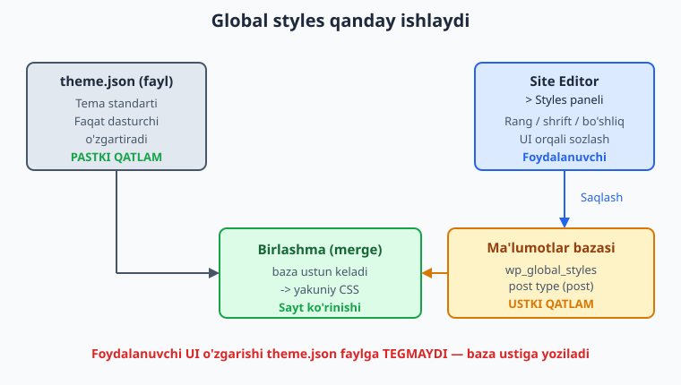
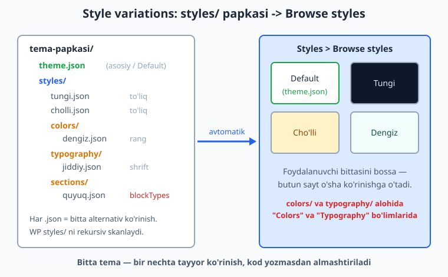
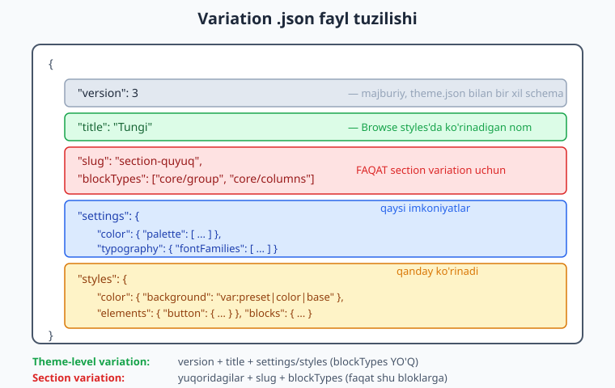

# 19 — Global styles va style variations

[⬅️ Oldingi: 18 — Block templates va template parts](./18-block-templates-parts.md) · [🏠 README](./README.md) · [Keyingi: 20 — Block patterns ➡️](./20-patterns.md)

> **Bu bobda:** Bir tema — bir nechta ko'rinish. Avval foydalanuvchi `theme.json` ni KOD yozmasdan, Site Editor ichidagi **Styles** paneli orqali qanday o'zgartirishini (global styles) va bu o'zgarishlar `theme.json` faylga tegmay, baza'dagi `wp_global_styles` post'iga qanday saqlanishini ko'ramiz. So'ng dasturchi sifatida `styles/` papkasiga **style variations** — alternativ ko'rinishlar (boshqa palitra, boshqa shrift) — qo'shishni o'rganamiz: to'liq variation, faqat-rang (`styles/colors/`) va faqat-shrift (`styles/typography/`) variantlari, hamda **section style variations** (WP 6.6+) — `blockTypes` orqali faqat ma'lum bloklarga ta'sir qiladigan ko'rinishlar. Hamma `.json` jonli WordPress 7.0 da yaroqli ekani va Twenty Twenty-Five tuzilishiga mosligi tekshirilgan.

---

## Bitta temadan ko'p ko'rinish

16 va 17-boblarda `theme.json` orqali temaning **bitta** ko'rinishini yasadik: bitta palitra, bitta shrift to'plami, bitta standart uslub. Lekin haqiqiy foydalanuvchi ko'pincha shuni xohlaydi: "Tema yaxshi, lekin men uni qoraroq qilsam yoki boshqa shrift bilan ko'rsam bo'ladimi?".

Klassik temada (1-14 boblar) bu uchun Customizer'da maxsus sozlamalar yozardingiz yoki bir nechta alohida tema chiqarardingiz. Block tema'da WordPress buni ikki darajada hal qiladi:

| Mexanizm | Kim ishlatadi | Qayerda yashaydi |
|----------|---------------|------------------|
| **Global styles** | Foydalanuvchi (sayt egasi) | Site Editor > Styles paneli -> baza (`wp_global_styles`) |
| **Style variations** | Dasturchi (siz) oldindan tayyorlaydi | `styles/` papkasidagi `.json` fayllar |

Ikkalasi ham bitta tilda — `theme.json` schema'sida — yoziladi. Faqat farqi: global styles foydalanuvchi UI orqali yaratadi va baza'da saqlanadi; style variations siz fayl sifatida temaga qo'shasiz va foydalanuvchi ulardan birini **tanlaydi**.

Bu bob shu ikki mexanizmni ochadi.

---

## Global styles: foydalanuvchi `theme.json` ni UI orqali o'zgartiradi

### Styles paneli qayerda?

Site Editor'ga kiring (**Appearance > Editor**), so'ng o'ng yuqoridagi qora-oq doira (Styles) belgisini bosing yoki **Styles** bo'limiga o'ting. Bu yerda foydalanuvchi:

- **Colors** — fon, matn, link, tugma ranglarini palitra'dan tanlaydi;
- **Typography** — sarlavha va matn shriftini, o'lchamini, qalinligini sozlaydi;
- **Layout** — content/wide kengligini, bo'shliqlarni o'zgartiradi;
- **Blocks** — har bir blok turini (masalan faqat Heading) alohida sozlaydi.

Diqqat qiling: bu **aynan** `theme.json` ning `styles` bo'limidagi narsalar (17-bob). Site Editor — bu `theme.json` ustidagi vizual muharrir. Foydalanuvchi tugmachani bosganida, WordPress ortda xuddi siz qo'lda yozadigan `styles.elements.button.color.background` kabi qiymatni hosil qiladi.

### Eng muhim savol: o'zgarishlar qayerga boradi?

Mana boshlovchilar ko'p adashadigan joy. Foydalanuvchi Styles panelida fon rangini o'zgartirsa — **bu sizning `theme.json` faylingizga YOZILMAYDI**. Aks holda har bir foydalanuvchi tema fayllarini buzgan bo'lardi va tema yangilanganda hammasi o'chib ketardi.

O'rniga, o'zgarishlar ma'lumotlar bazasida maxsus post turi — **`wp_global_styles`** — sifatida saqlanadi. Bu yashirin (foydalanuvchiga ko'rinmaydigan) post turi; har bir tema uchun bitta `wp_global_styles` post bo'ladi va u o'sha tema uchun foydalanuvchining barcha global styles o'zgarishlarini saqlaydi.

Bu post turi jonli WordPress 7.0 da haqiqatan mavjud (`post_type_exists('wp_global_styles')` -> `true`).



### Qatlamlash (cascade): kim ustun keladi?

WordPress sayt CSS'ini yasashda ikki manbani **birlashtiradi** (merge):

1. **Pastki qatlam** — `theme.json` fayli (sizning standartingiz).
2. **Ustki qatlam** — `wp_global_styles` post (foydalanuvchi o'zgarishlari).

Agar ikkalasi ham bir narsani belgilasa (masalan fon rangi), **baza'dagi qiymat ustun keladi**. Agar foydalanuvchi hech narsa o'zgartirmagan bo'lsa, `theme.json` standarti qoladi. Ya'ni:

> `theme.json` = "zavod sozlamasi", `wp_global_styles` = "foydalanuvchi sozlamasi". Foydalanuvchi sozlamasi har doim ustun.

Site Editor'da Styles > (uch nuqta menyu) > **Reset to defaults** bosilsa, `wp_global_styles` tozalanadi va tema yana sof `theme.json` ko'rinishiga qaytadi.

### Dasturchi uchun amaliy xulosa

- Tema yangilanganda foydalanuvchi sozlamalari **saqlanib qoladi** (chunki baza'da, fayl emas) — bu yaxshi.
- Agar siz `theme.json` da rangni o'zgartirsangiz-u, foydalanuvchi o'sha rangni allaqachon qo'lda o'zgartirgan bo'lsa, foydalanuvchi sizning yangi rangingizni **ko'rmaydi** (uniki ustun). Buni testda esda tuting.
- Global styles'ni REST API orqali ham o'qish mumkin (`/wp/v2/global-styles/...`), bu zamonaviy WordPress'ning bir qismi.

---

## Style variations: `styles/` papkasidagi alternativ ko'rinishlar

Global styles — foydalanuvchining qo'lidagi vosita. Endi **dasturchi** sifatida biz foydalanuvchiga tayyor alternativlar beramiz: "qora rejim", "cho'l ranglar", "jiddiy shrift" — bularning hammasi bir tugma bosishda.

Bu **style variations** deb ataladi. Ular oddiy: temangizning ildizida **`styles/`** papkasi yarating va ichiga `.json` fayllar qo'ying. Har bir `.json` = bitta alternativ ko'rinish.

```
mening-temam/
  style.css
  theme.json          <- asosiy ko'rinish ("Default")
  templates/
  parts/
  styles/             <- variation fayllar shu yerda
    tungi.json
    cholli.json
    colors/
      dengiz.json
    typography/
      jiddiy.json
    sections/
      quyuq.json
```

WordPress `styles/` papkasini **rekursiv** skanlaydi va har bir yaroqli `.json` ni variation sifatida ro'yxatga oladi. (Bu xatti-harakat jonli WP yadrosida `WP_Theme_JSON_Resolver::get_style_variations()` metodida amalga oshadi — u `styles/` ostidagi barcha JSON fayllarni topadi.)



### Foydalanuvchi variation'ni qanday tanlaydi?

Site Editor > **Styles** > **Browse styles** (Styles panelida ko'rinadigan kichik ikonalar qatori yoki "Browse styles" tugmasi). Bu yerda:

- birinchi karta — **Default** (sizning `theme.json` ingiz);
- keyin — `styles/` ildizidagi har bir to'liq variation (Tungi, Cho'lli, ...).

Foydalanuvchi bittasini bosishi bilan butun sayt o'sha ko'rinishga o'tadi. Texnik jihatdan: tanlangan variation `theme.json` ustiga, lekin global styles ostiga qatlam bo'lib qo'shiladi.

> **Reference:** Twenty Twenty-Five temasi `styles/` papkasida juda ko'p variation bilan keladi. Jonli WP'dagi nusxasini sanab chiqdik: **jami 32 ta** `.json` fayl — shundan **23 tasi tema darajasidagi** variation (palitra/typography to'plamlari), **9 tasi section/blok darajasidagi** variation. Bu papka strukturasi (`styles/`, `styles/colors/`, `styles/typography/`, `styles/sections/`, `styles/blocks/`) shu bobdagi yondashuvning haqiqiy namunasi.

---

## Variation fayl tuzilishi

Eng muhim qoida: **variation `.json` fayli `theme.json` bilan AYNAN bir xil schema'da yoziladi.** Hech qanday yangi sintaksis o'rganish kerak emas — siz 16 va 17-boblarda o'rgangan `settings` va `styles` bo'limlari shu yerda ham ishlaydi.

To'liq (tema darajasidagi) variation fayli quyidagi kalitlarga ega:

| Kalit | Majburiymi | Vazifasi |
|-------|-----------|----------|
| `version` | Ha | Doim `3` (theme.json bilan bir xil) |
| `title` | Ha | Browse styles'da ko'rinadigan nom |
| `$schema` | Yo'q | IDE avtomat-to'ldirishi uchun |
| `settings` | Yo'q | Yangi palitra, shriftlar va h.k. (16-bob) |
| `styles` | Yo'q | Standart uslublar (17-bob) |



### Birinchi variation: "Tungi" (qora rejim)

`styles/tungi.json` faylini yarataylik. U asosiy palitra'ni qora fon va och matnga o'zgartiradi:

```json
{
	"$schema": "https://schemas.wp.org/wp/6.7/theme.json",
	"version": 3,
	"title": "Tungi",
	"settings": {
		"color": {
			"palette": [
				{ "slug": "base", "name": "Asos", "color": "#0f172a" },
				{ "slug": "contrast", "name": "Kontrast", "color": "#e2e8f0" },
				{ "slug": "primary", "name": "Asosiy", "color": "#38bdf8" },
				{ "slug": "secondary", "name": "Ikkilamchi", "color": "#f59e0b" }
			]
		}
	},
	"styles": {
		"color": {
			"background": "var:preset|color|base",
			"text": "var:preset|color|contrast"
		},
		"elements": {
			"button": {
				"color": {
					"background": "var:preset|color|primary",
					"text": "var:preset|color|base"
				}
			},
			"link": {
				"color": { "text": "var:preset|color|primary" }
			}
		}
	}
}
```

Diqqat qiling: variation'da `slug` qiymatlari (`base`, `contrast`, `primary`, ...) asosiy `theme.json` dagi slug'lar bilan **bir xil** bo'lishi muhim. Shunda `var:preset|color|base` kabi havolalar templates/patterns'da ishlashda davom etadi — faqat ularning ortidagi rang o'zgaradi. Agar siz `theme.json` da `primary` slug ishlatgan bo'lsangiz-u, variation'da `asosiy` deb nomlasangiz, mavjud markup buziladi.

> **Eng muhim mantiq:** variation odatda faqat **qiymatlarni** o'zgartiradi, **strukturani** emas. Templates, parts, patterns — hammasi `var:preset|color|...` orqali ranglarga **slug bilan** murojaat qiladi. Variation o'sha slug'larning rangini almashtiradi, demak butun sayt avtomatik yangi ko'rinishga o'tadi.

### Variation'ni qaysi qism boshqaradi?

- Variation'dagi `settings.color.palette` — editordagi rang **tanlovini** o'zgartiradi (yangi paleta).
- Variation'dagi `styles` — saytning **standart ko'rinishini** o'zgartiradi (fon qora bo'lib qoldi).

Ko'pincha ikkalasi birga ishlatiladi: yangi palette e'lon qilasiz, so'ng o'sha palette'dan foydalangan holda `styles` da nimani qayerga qo'yishni belgilaysiz.

---

## Section style variations (WP 6.6+): faqat ma'lum bloklarga

Yuqoridagi variation'lar **butun saytga** ta'sir qiladi. Lekin ba'zan siz: "Default ko'rinish qolsin, lekin men ayrim **bo'limlarni** (masalan bitta Group blokini) qora panel qilmoqchiman" deysiz. Aynan shu uchun **section style variations** (block style variations) bor — WordPress 6.6 da kelgan va WP 7.0 da to'liq standart.

Section variation oddiy variation'dan ikki yangi kalit bilan farq qiladi:

| Kalit | Vazifasi |
|-------|----------|
| `slug` | Variation'ning ichki nomi (CSS klass va menyuda foydalaniladi) |
| `blockTypes` | Massiv — variation **qaysi bloklarga** taklif qilinishi (masalan `["core/group", "core/columns"]`) |

> **Qanday aniqlanadi?** WordPress yadrosi variation faylida `blockTypes` kaliti **bormi-yo'qmi** ga qarab uni ikkiga ajratadi: `blockTypes` **bor** bo'lsa — section (blok darajasidagi) variation; `blockTypes` **yo'q** bo'lsa — tema darajasidagi variation. Bu mantiq jonli WP'da `WP_Theme_JSON_Resolver::style_variation_has_scope()` metodida tasdiqlangan.

Odatda section variation'lar `styles/sections/` ichiga qo'yiladi (Twenty Twenty-Five shunday qiladi), lekin bu majburiy emas — muhimi `blockTypes` kalitining mavjudligi, papka nomi emas.

### Misol: "Quyuq blok" section variation

`styles/sections/quyuq.json`:

```json
{
	"$schema": "https://schemas.wp.org/wp/6.7/theme.json",
	"version": 3,
	"slug": "section-quyuq",
	"title": "Quyuq blok",
	"blockTypes": [
		"core/group",
		"core/columns"
	],
	"styles": {
		"color": {
			"background": "var:preset|color|contrast",
			"text": "var:preset|color|base"
		},
		"elements": {
			"heading": {
				"color": { "text": "currentColor" }
			},
			"button": {
				"color": {
					"background": "var:preset|color|primary",
					"text": "var:preset|color|base"
				}
			}
		}
	}
}
```

Endi foydalanuvchi editorda biror **Group** yoki **Columns** blokini tanlasa, o'ng paneldagi **Styles** bo'limida "Quyuq blok" ko'rinishi paydo bo'ladi. Uni bosganida, faqat **o'sha blok** (va uning ichidagilar) qora panelga aylanadi — sayt qolgan qismi tegmaydi.

`core/group` bloki haqiqatan ham WP registr'ida ro'yxatdan o'tgan (`WP_Block_Type_Registry`), shuningdek `core/columns` ham — bu bobda ishlatilgan barcha blok nomlari jonli WP bilan tekshirilgan.

> **`currentColor` nima?** Section variation fon rangini o'zgartirgani uchun, ichidagi sarlavha matni ham yangi fonga moslashishi kerak. `"text": "currentColor"` bu yerda: "tepadan kelgan matn rangini meros qilib ol" degani — shunday qilib sarlavha ham och rangga o'tadi va qora fonda o'qiladi. Twenty Twenty-Five section variationlari aynan shu usulni keng ishlatadi.

---

## Color-only va typography-only variations (WP 6.6+)

WordPress 6.6 dan boshlab siz to'liq variation o'rniga faqat **rang** yoki faqat **shrift** almashtiradigan kichik variation'lar bera olasiz. Bu foydalanuvchiga moslashuvchanlik beradi: u "Tungi" ranglarni "Jiddiy" shrift bilan **aralashtirib** ishlatishi mumkin.

Buning uchun maxsus papkalar:

| Papka | Variation turi | Browse styles'da qayerda |
|-------|----------------|--------------------------|
| `styles/colors/` | Faqat-rang | Styles > **Colors** bo'limida alohida |
| `styles/typography/` | Faqat-shrift | Styles > **Typography** bo'limida alohida |

Bu yerda papka nomi **ahamiyatga ega** — u WordPress'ga variation'ni qaysi bo'limga (Colors yoki Typography) qo'yishni aytadi.

### Faqat-rang variation: `styles/colors/dengiz.json`

```json
{
	"$schema": "https://schemas.wp.org/wp/6.7/theme.json",
	"version": 3,
	"title": "Dengiz",
	"settings": {
		"color": {
			"palette": [
				{ "slug": "base", "name": "Asos", "color": "#f0fdfa" },
				{ "slug": "contrast", "name": "Kontrast", "color": "#134e4a" },
				{ "slug": "primary", "name": "Asosiy", "color": "#0d9488" },
				{ "slug": "secondary", "name": "Ikkilamchi", "color": "#f59e0b" }
			]
		}
	},
	"styles": {
		"color": {
			"background": "var:preset|color|base",
			"text": "var:preset|color|contrast"
		}
	}
}
```

E'tibor bering: faqat-rang variation odatda faqat `settings.color` va `styles.color` ni belgilaydi — shriftga tegmaydi. Shunda foydalanuvchi uni istalgan shrift variation'i bilan birga ishlatishi mumkin.

### Faqat-shrift variation: `styles/typography/jiddiy.json`

```json
{
	"$schema": "https://schemas.wp.org/wp/6.7/theme.json",
	"version": 3,
	"title": "Jiddiy",
	"settings": {
		"typography": {
			"fontFamilies": [
				{
					"slug": "merriweather",
					"name": "Merriweather",
					"fontFamily": "Merriweather, Georgia, serif"
				}
			]
		}
	},
	"styles": {
		"typography": {
			"fontFamily": "var:preset|font-family|merriweather",
			"lineHeight": "1.7"
		},
		"elements": {
			"heading": {
				"typography": {
					"fontFamily": "var:preset|font-family|merriweather",
					"fontWeight": "700"
				}
			}
		}
	}
}
```

> **Eslatma — shrift fayli:** real loyihada `fontFamily` da haqiqatan yuklanadigan shriftni belgilash uchun `fontFace` bilan `.woff2` faylga (`file:./assets/fonts/...`) ishora qilinadi — Twenty Twenty-Five typography variationlari aynan shunday qiladi. Yuqorida soddalik uchun tizimga o'rnatilgan/Google Font deb faraz qildik. Variation orqali ham WordPress'ning Font Library mexanizmiga ulanish mumkin.

> **Bu uchlik birga ishlaydi:** Twenty Twenty-Five `styles/colors/` (8 ta rang), `styles/typography/` (7 ta shrift) va `styles/` ildizidagi to'liq variation'larni birlashtiradi. Foydalanuvchi to'liq ko'rinishni tanlab, so'ng faqat rangni yoki faqat shriftni alohida almashtirishi mumkin — **aralashtirib** o'z ko'rinishini yasaydi.

---

## Global styles vs style variations: farqni mustahkamlash

Boshlovchilar bu ikkisini ko'p chalkashtiradi. Mana aniq jadval:

| | Global styles | Style variations |
|---|---------------|------------------|
| **Kim yaratadi** | Foydalanuvchi (UI orqali) | Dasturchi (fayl yozib) |
| **Qayerda yashaydi** | Baza (`wp_global_styles`) | Tema fayli (`styles/*.json`) |
| **Format** | (ortda) theme.json schema | theme.json schema (`.json`) |
| **Tema yangilanganda** | Saqlanadi (baza'da) | Yangilanadi (fayl bilan keladi) |
| **Necha ta** | Tema uchun bitta (joriy holat) | Xohlagancha (har biri alohida fayl) |
| **Foydalanuvchi roli** | Tahrirlaydi | Tayyorlardan tanlaydi |

Eng qisqa ta'rif: **variation** — siz beradigan "tayyor kostyum"; **global styles** — foydalanuvchi o'sha kostyumni o'ziga moslab tikishi. Foydalanuvchi variation tanlaydi (poydevor), so'ng global styles bilan uni mayda-chuyda tuzatadi (ustki qatlam).

---

## Verifikatsiya: variation fayllar haqiqatan yaroqlimi?

Bu bobdagi barcha `.json` fayllar quruq nazariya emas. Men ularni jonli WordPress 7.0 muhitida test tema (`wp-content/themes/ch19-test/styles/`) ichiga yozib, ikki yo'l bilan tekshirdim:

1. **PHP `json_decode`** — har fayl `JSON_ERROR_NONE` qaytardi (yaroqli JSON).
2. **WordPress scope mantig'i** — `blockTypes` kalitiga qarab har faylni tema yoki section variation deb to'g'ri ajratdim, xuddi WP yadrosi qilganidek.

Natija (haqiqiy chiqish):

```
OK  cholli.json            title=Cho'lli       scope=theme
OK  colors/dengiz.json     title=Dengiz        scope=theme
OK  sections/aksent.json   title=Aksent panel  scope=section
OK  sections/quyuq.json    title=Quyuq blok    scope=section
OK  tungi.json             title=Tungi         scope=theme
OK  typography/jiddiy.json title=Jiddiy        scope=theme
OK  typography/qulay.json  title=Qulay o'qish  scope=theme
--- jami OK=7 FAIL=0
```

Shuningdek Twenty Twenty-Five `styles/` papkasini o'qib, tuzilishini (theme-level vs `blockTypes` bo'lgan section variation) tasdiqladim — yuqoridagi misollar xayoliy emas, reference temasiga mos.

Siz ham o'z variation faylingizni shunday tekshiring (Python misoli):

```bash
python -c "import json; json.load(open('styles/tungi.json', encoding='utf-8')); print('JSON OK')"
```

yoki PHP bilan:

```bash
php -r "json_decode(file_get_contents('styles/tungi.json'), true); echo json_last_error_msg();"
```

`No error` chiqsa — fayl yaroqli. Bitta vergul yoki qavs xatosi butun variation'ni "ko'rinmas" qiladi, shuning uchun bu tekshiruv majburiy odat bo'lsin.

---

## Mashqlar

### Oson

1. **Birinchi to'liq variation.** Temangiz ildizida `styles/` papkasini yarating va ichiga `kuzgi.json` faylini yozing: `title` = "Kuzgi", `version` = 3. `settings.color.palette` da kamida 3 ta rang (`base`, `contrast`, `primary`) e'lon qiling — issiq kuz ranglari (jigarrang/sariq). `styles.color` da `background` va `text` ni o'sha slug'larga bog'lang.

2. **Variation'ni JSON-valid qiling.** 1-mashqdagi `kuzgi.json` ni Python yoki PHP bilan tekshiring (`json.load` yoki `json_decode`). Agar xato chiqsa, vergul/qavslarni to'g'rilang va "JSON OK" olguncha takrorlang.

3. **`title` ning ahamiyati.** Variation faylida `title` kalitini ataylab olib tashlang, so'ng qaytadan qo'shing. `title` Browse styles ekranida nima uchun zarurligini 2 jumlada izohlang.

4. **Faqat-rang variation papkasi.** `styles/colors/` papkasini yarating va ichiga `mono.json` joylang: oq-qora (monoxrom) palette. Bu fayl nima uchun `styles/` ildiziga emas, `styles/colors/` ga qo'yilishini bir jumlada yozing.

### O'rta

5. **To'liq "Tungi" variation.** Bobdagi `tungi.json` ni qaytadan yozing, lekin tugma (`elements.button`) va link (`elements.link`) ranglarini ham qora rejimga moslang (matn o'qiladigan kontrastda bo'lsin). Faylni JSON-valid qiling.

6. **Faqat-shrift variation.** `styles/typography/` ichida `mono-shrift.json` yarating: `settings.typography.fontFamilies` da bitta monospace oila (`fontFamily` = `"'Courier New', monospace"`, `slug` = `mono`) e'lon qiling va `styles.typography.fontFamily` ni o'sha slug'ga bog'lang. JSON-valid qiling.

7. **Slug muvofiqligi.** Bir do'stingiz variation yozdi, lekin `theme.json` da `primary` slug ishlatilgani holda variation'da `asosiy` deb nomlagani uchun tugmalar rangsiz qoldi. Muammoni izohlang va tuzating: variation slug'larini `theme.json` bilan moslang.

8. **Global styles vs variation farqi.** Quyidagi 4 holatdan har birini "global styles" yoki "style variation" deb tasniflang va sababini yozing: (a) foydalanuvchi Site Editor'da fon rangini o'zgartirdi; (b) siz temaga `styles/tungi.json` qo'shdingiz; (c) tema yangilangach foydalanuvchi sozlamasi saqlanib qoldi; (d) Browse styles'da "Default"dan keyin ikkita karta chiqdi.

### Qiyin

9. **Section style variation.** `styles/sections/` ichida `aksent.json` yarating: `slug` = `section-aksent`, `blockTypes` = `["core/group"]`. `styles` da fonni `primary` rangga, matnni `base` ga o'zgartiring; ichki `heading` va `link` `currentColor` meros olsin. Faylni JSON-valid qiling va u nima uchun **section** variation (tema variation emas) ekanini `blockTypes` orqali tushuntiring.

10. **Scope aniqlash skripti.** Bitta PHP yoki Python skripti yozing: u `styles/` papkasini rekursiv aylanib, har bir `.json` ni o'qiydi, JSON-valid ekanini va `blockTypes` borligiga qarab "section" yoki "theme" deb chiqaradi. Skript hamma fayllaringizda ishlashini ko'rsating.

11. **Color + typography aralashmasi.** Foydalanuvchi "Dengiz" rangini "Jiddiy" shrift bilan birga ishlatmoqchi. Buni qo'llab-quvvatlash uchun temangizda qanday fayllar (qaysi papkalarda) bo'lishi kerakligini sanang va NEGA bu ikkisi mustaqil almashtirilishi mumkinligini (faqat-rang va faqat-shrift variationlar bir-biriga aralashmasligini) izohlang.

12. **Variation'da `var:preset` zanjiri.** Tushuntiring: agar variation faqat `settings.color.palette` da `primary` slug rangini o'zgartirsa-yu, `styles` bo'limiga tegmasa ham, templates/patterns ichidagi `var:preset|color|primary` ishlatilgan barcha joylar avtomatik yangi rangga o'tadimi? Javobingizni `var:preset|color|...` mexanizmi orqali asoslang.

13. **Twenty Twenty-Five strukturasini taqlid qilish.** Twenty Twenty-Five `styles/` papkasi `colors/`, `typography/`, `sections/`, `blocks/` kichik papkalardan iborat. O'z temangiz uchun shunday struktura rejasini yozing: har papkada kamida bittadan variation fayl nomi va vazifasi (nimani o'zgartiradi). Kamida 5 fayl rejalang.

14. **Buzuq variation'ni tuzatish.** Quyidagi fayl JSON-invalid: `{ "version": 3, "title": "Test", "settings": { "color": { "palette": [ { "slug": "base", "color": "#fff" } ] } "styles": {} }`. Xatoni toping, tuzating va JSON-valid qiling, so'ng nima xato bo'lganini bir jumlada yozing.

---

## Yechimlar

<details markdown="1">
<summary>Yechim — 1</summary>

`styles/kuzgi.json`:

```json
{
	"$schema": "https://schemas.wp.org/wp/6.7/theme.json",
	"version": 3,
	"title": "Kuzgi",
	"settings": {
		"color": {
			"palette": [
				{ "slug": "base", "name": "Asos", "color": "#fef6e4" },
				{ "slug": "contrast", "name": "Kontrast", "color": "#5b2c06" },
				{ "slug": "primary", "name": "Asosiy", "color": "#c2410c" }
			]
		}
	},
	"styles": {
		"color": {
			"background": "var:preset|color|base",
			"text": "var:preset|color|contrast"
		}
	}
}
```

Fayl `styles/` ildiziga qo'yilgani uchun Browse styles'da to'liq variation sifatida ko'rinadi. JSON-valid (PHP `json_decode` -> `No error`).

</details>

<details markdown="1">
<summary>Yechim — 2</summary>

Tekshirish buyruqlari:

```bash
python -c "import json; json.load(open('styles/kuzgi.json', encoding='utf-8')); print('JSON OK')"
```

yoki:

```bash
php -r "json_decode(file_get_contents('styles/kuzgi.json'), true); echo json_last_error_msg();"
```

Eng ko'p uchraydigan xatolar: oxirgi elementdan keyin **ortiqcha vergul** (`,`), juftlanmagan qavs (`{` yoki `[`), va qo'shtirnoq o'rniga to'g'ri apostrof. "JSON OK" / "No error" chiqsa — fayl yaroqli.

</details>

<details markdown="1">
<summary>Yechim — 3</summary>

`title` siz fayl baribir yuklanadi, lekin Browse styles ekranida variation'ning ko'rinadigan nomi bo'lmaydi (WordPress fayl nomidan zaxira nom yasashga urinadi yoki bo'sh ko'rinadi), bu foydalanuvchini chalkashtiradi. `title` — bu foydalanuvchiga ko'rinadigan inson-o'qiydigan yorliq, shuning uchun har bir variation'da aniq, tushunarli `title` yozish kerak ("Tungi", "Cho'lli" kabi).

</details>

<details markdown="1">
<summary>Yechim — 4</summary>

`styles/colors/mono.json`:

```json
{
	"$schema": "https://schemas.wp.org/wp/6.7/theme.json",
	"version": 3,
	"title": "Monoxrom",
	"settings": {
		"color": {
			"palette": [
				{ "slug": "base", "name": "Oq", "color": "#ffffff" },
				{ "slug": "contrast", "name": "Qora", "color": "#000000" },
				{ "slug": "primary", "name": "Kulrang", "color": "#475569" }
			]
		}
	},
	"styles": {
		"color": {
			"background": "var:preset|color|base",
			"text": "var:preset|color|contrast"
		}
	}
}
```

Fayl `styles/colors/` ga qo'yiladi, chunki papka nomi WordPress'ga buni **faqat-rang** variation deb bildiradi — u Styles > **Colors** bo'limida alohida ko'rinadi, butun saytni almashtiradigan to'liq variation sifatida emas.

</details>

<details markdown="1">
<summary>Yechim — 5</summary>

`styles/tungi.json` (tugma va link bilan):

```json
{
	"$schema": "https://schemas.wp.org/wp/6.7/theme.json",
	"version": 3,
	"title": "Tungi",
	"settings": {
		"color": {
			"palette": [
				{ "slug": "base", "name": "Asos", "color": "#0f172a" },
				{ "slug": "contrast", "name": "Kontrast", "color": "#e2e8f0" },
				{ "slug": "primary", "name": "Asosiy", "color": "#38bdf8" },
				{ "slug": "secondary", "name": "Ikkilamchi", "color": "#f59e0b" }
			]
		}
	},
	"styles": {
		"color": {
			"background": "var:preset|color|base",
			"text": "var:preset|color|contrast"
		},
		"elements": {
			"button": {
				"color": {
					"background": "var:preset|color|primary",
					"text": "var:preset|color|base"
				}
			},
			"link": {
				"color": { "text": "var:preset|color|primary" }
			}
		}
	}
}
```

Tugma fon = `primary` (yorqin ko'k), matni = `base` (qora) — qora-fon saytda yorqin tugma ajralib turadi. Link = `primary` — qora fonda o'qiladi. JSON-valid: ushbu fayl jonli WP'da `ch19-test/styles/tungi.json` sifatida tekshirildi (`scope=theme`, `No error`).

</details>

<details markdown="1">
<summary>Yechim — 6</summary>

`styles/typography/mono-shrift.json`:

```json
{
	"$schema": "https://schemas.wp.org/wp/6.7/theme.json",
	"version": 3,
	"title": "Monospace",
	"settings": {
		"typography": {
			"fontFamilies": [
				{
					"slug": "mono",
					"name": "Monospace",
					"fontFamily": "'Courier New', monospace"
				}
			]
		}
	},
	"styles": {
		"typography": {
			"fontFamily": "var:preset|font-family|mono",
			"lineHeight": "1.6"
		}
	}
}
```

`styles/typography/` ga qo'yilgani uchun Styles > **Typography** bo'limida faqat-shrift variation sifatida chiqadi. JSON-valid (`json_decode` -> `No error`).

</details>

<details markdown="1">
<summary>Yechim — 7</summary>

Muammo: `var:preset|color|primary` havolasi `primary` nomli preset'ni qidiradi. Variation `primary` o'rniga `asosiy` slug e'lon qilgani uchun, `primary` preset endi mavjud emas — tugma rangi "yo'q" bo'lib qoladi (zaxira/sukunatga tushadi).

Tuzatish: variation'dagi slug'larni `theme.json` bilan moslang:

```json
{ "slug": "primary", "name": "Asosiy", "color": "#0d9488" }
```

`name` (ko'rinadigan nom) istalgancha o'zbekcha bo'lishi mumkin, lekin **`slug` `theme.json` bilan AYNAN bir xil** bo'lishi shart — markup `var:preset|color|primary` ni shu slug bo'yicha topadi.

</details>

<details markdown="1">
<summary>Yechim — 8</summary>

- **(a)** Foydalanuvchi UI'da fon rangini o'zgartirdi -> **global styles** (UI orqali yaratiladi, `wp_global_styles` baza'siga saqlanadi).
- **(b)** Siz `styles/tungi.json` qo'shdingiz -> **style variation** (dasturchi fayl sifatida temaga qo'shadi).
- **(c)** Tema yangilangach foydalanuvchi sozlamasi saqlanib qoldi -> **global styles** (chunki u baza'da yashaydi, tema fayllaridan mustaqil).
- **(d)** Browse styles'da "Default"dan keyin ikkita karta -> **style variation** (`styles/` papkasidagi ikki `.json` fayl Browse styles'da karta sifatida ko'rinadi).

</details>

<details markdown="1">
<summary>Yechim — 9</summary>

`styles/sections/aksent.json`:

```json
{
	"$schema": "https://schemas.wp.org/wp/6.7/theme.json",
	"version": 3,
	"slug": "section-aksent",
	"title": "Aksent panel",
	"blockTypes": [
		"core/group"
	],
	"styles": {
		"color": {
			"background": "var:preset|color|primary",
			"text": "var:preset|color|base"
		},
		"elements": {
			"heading": { "color": { "text": "currentColor" } },
			"link": { "color": { "text": "currentColor" } }
		}
	}
}
```

Bu **section** variation, chunki unda **`blockTypes` kaliti bor**. WordPress yadrosi (`style_variation_has_scope`) variation'da `blockTypes` borligiga qarab uni blok darajasidagi (section) variation deb belgilaydi va uni faqat `core/group` blokini tanlaganda Styles panelida taklif qiladi — butun saytga emas. `currentColor` ichki sarlavha va linkning yangi fonda o'qilishini ta'minlaydi. Fayl jonli WP'da tekshirildi: `scope=section`, `No error`.

</details>

<details markdown="1">
<summary>Yechim — 10</summary>

Python skripti:

```python
import json, glob, os

base = "styles"
for path in glob.glob(base + "/**/*.json", recursive=True):
    try:
        with open(path, encoding="utf-8") as fh:
            data = json.load(fh)
    except json.JSONDecodeError as e:
        print("FAIL", path, "->", e)
        continue
    scope = "section" if "blockTypes" in data else "theme"
    rel = os.path.relpath(path, base).replace(os.sep, "/")
    print("OK  ", rel, "-> title=" + str(data.get("title")), "scope=" + scope)
```

Bu skript aynan WordPress mantig'ini takrorlaydi: `blockTypes` kaliti bo'lsa "section", bo'lmasa "theme". Men shu yondashuvni jonli WP'da 7 ta fayl ustida yurgizdim — hammasi `OK`, FAIL=0 chiqdi.

</details>

<details markdown="1">
<summary>Yechim — 11</summary>

Kerakli fayllar:

```
styles/
  colors/
    dengiz.json        <- faqat-rang (settings.color + styles.color)
  typography/
    jiddiy.json        <- faqat-shrift (settings.typography + styles.typography)
```

Bu ikkisi mustaqil almashtirilishi mumkin, chunki **har biri faqat o'z sohasiga tegadi**: `dengiz.json` faqat ranglarni belgilaydi (shriftga umuman tegmaydi), `jiddiy.json` faqat shriftni belgilaydi (rangga tegmaydi). WordPress ularni alohida bo'limlarda (Colors / Typography) ko'rsatadi va foydalanuvchi har birini boshqasidan mustaqil tanlaydi — natijada "Dengiz ranglari + Jiddiy shrifti" aralashmasi hosil bo'ladi. Agar faqat-rang variation shriftni ham belgilab qo'ysa, aralashtirish buzilardi.

</details>

<details markdown="1">
<summary>Yechim — 12</summary>

Ha, avtomatik o'tadi. Sababi: `var:preset|color|primary` — bu **bilvosita** havola. WordPress har bir palette rangidan CSS o'zgaruvchi yasaydi: `--wp--preset--color--primary`. Templates va patterns markup'i o'sha o'zgaruvchiga (slug bo'yicha) ishora qiladi, aniq rang qiymatiga emas.

Variation `settings.color.palette` da `primary` ning rangini o'zgartirganda, WordPress shu CSS o'zgaruvchining qiymatini yangilaydi. Demak `var:preset|color|primary` ishlatilgan **barcha** joylar (tugmalar, linklar, fonlar) yangi rangni avtomatik oladi — variation `styles` bo'limiga tegmasa ham. Bu butun saytni bitta palette o'zgarishi bilan qayta bo'yashning mexanizmi.

</details>

<details markdown="1">
<summary>Yechim — 13</summary>

Reja (Twenty Twenty-Five strukturasiga taqlid):

```
styles/
  tungi.json              <- to'liq variation: qora rejim (palette + styles)
  cholli.json             <- to'liq variation: cho'l ranglari (palette + styles)
  colors/
    dengiz.json           <- faqat-rang: ko'k-yashil dengiz palette
    mono.json             <- faqat-rang: oq-qora monoxrom palette
  typography/
    jiddiy.json           <- faqat-shrift: serif (Merriweather), katta lineHeight
    qulay.json            <- faqat-shrift: tizim sans-serif, keng o'qish
  sections/
    quyuq.json            <- section (blockTypes: group/columns): qora panel
    aksent.json           <- section (blockTypes: group): yorqin aksent panel
  blocks/
    iqtibos.json          <- blok-darajasidagi (blockTypes: core/quote) maxsus uslub
```

Jami 9 fayl. Har papka aniq vazifaga ega: ildiz = to'liq ko'rinish, `colors/` = faqat rang, `typography/` = faqat shrift, `sections/` = `blockTypes` bilan blok-bo'lim, `blocks/` = bitta blok turi uslubi. Bu Twenty Twenty-Five (jonli WP'da 32 ta variation: 23 theme + 9 section) yondashuvining kichraytirilgan namunasi.

</details>

<details markdown="1">
<summary>Yechim — 14</summary>

Xato: `palette` massivi yopilgandan keyin (`] }`) `"styles"` kalitidan oldin **vergul yo'q**. JSON'da obyekt ichidagi kalitlar vergul bilan ajratiladi.

Tuzatilgan, JSON-valid fayl:

```json
{
	"version": 3,
	"title": "Test",
	"settings": {
		"color": {
			"palette": [
				{ "slug": "base", "color": "#ffffff" }
			]
		}
	},
	"styles": {}
}
```

(`settings` obyektidan keyin, `styles` dan oldin vergul qo'yildi.) Tekshirilganda `json_decode` endi `No error` qaytaradi. Xato bir jumlada: **`settings` bilan `styles` orasida ajratuvchi vergul tushib qolgan edi.**

</details>

---

[⬅️ Oldingi: 18 — Block templates va template parts](./18-block-templates-parts.md) · [🏠 README](./README.md) · [Keyingi: 20 — Block patterns ➡️](./20-patterns.md)
