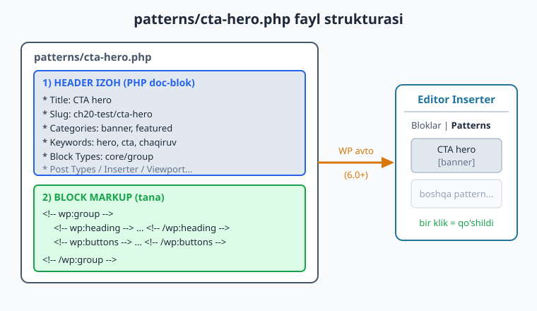
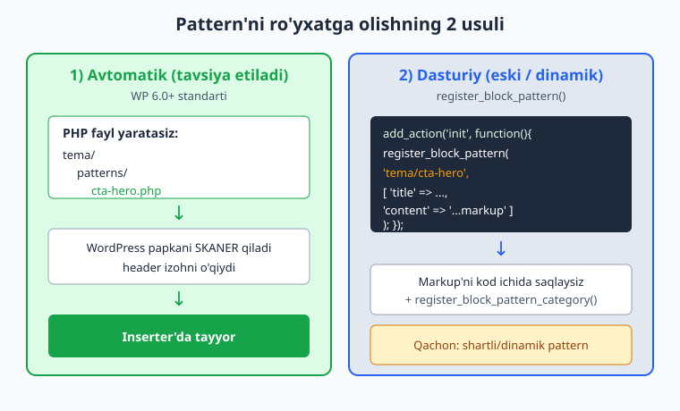
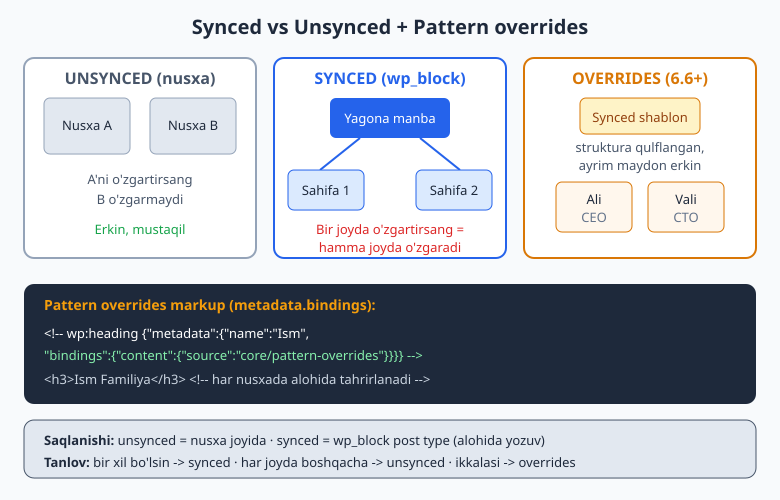

# 20 — Block patterns

[⬅️ Oldingi: 19 — Global styles va style variations](./19-global-styles-variations.md) · [🏠 README](./README.md) · [Keyingi: 21 — Site Editor va hybrid temalar ➡️](./21-site-editor-hybrid.md)

> **Bu bobda:** Block **pattern** — bu oldindan tayyorlangan, qayta ishlatiluvchi block to'plami (masalan, "chaqiruv bloki" yoki "narxlar jadvali"). Foydalanuvchi uni Inserter'dan bir klik bilan sahifaga qo'shadi va o'ziga moslab tahrirlaydi. Biz `patterns/` papkasidagi PHP fayl orqali pattern yaratishni (WP 6.0+ avtomatik ro'yxatga oladi), `register_block_pattern` bilan dasturiy usulni, pattern kategoriyalarini, **synced** (reusable, hamma joyda bog'langan) va **unsynced** (mustaqil nusxa) farqini, hamda **pattern overrides** (WP 6.6+ — synced shablon ichida ayrim maydonlarni alohida tahrirlash) ni o'rganamiz. Hamma misol jonli WordPress 7.0 da `php -l` va `parse_blocks` bilan tekshirilgan.

---

## Pattern nima va nega kerak?

18-bobda block markup yozdik (`<!-- wp:... -->`), 19-bobda esa style variations bilan butun sayt ko'rinishini almashtirdik. Endi orada turgan bo'g'inni to'ldiramiz: **takrorlanuvchi tuzilmalar**.

Tasavvur qiling, siz portfolio temasi yaratdingiz. Deyarli har sahifada bir xil "chaqiruv bloki" (call to action) kerak: markazlashtirilgan sarlavha + bir jumla + tugma. Agar foydalanuvchi har safar uchta blokni qo'lda yig'sa — bu zerikarli va xatoga moyil. **Pattern** shu muammoni hal qiladi.

Oddiy o'xshatish: pattern — bu **oshxonadagi tayyor xamir**. Har safar undan boshlaysiz (asos tayyor), keyin o'zingizning ne'matlaringizni qo'shasiz (matn, rasm). Tema muallifi sifatida siz bu xamirlarni tayyorlab qo'yasiz; foydalanuvchi esa Inserter'dan tanlab, ustiga ishlaydi.

Pattern bilan **reusable block** (eski nom) o'rtasidagi munosabatni keyinroq "synced vs unsynced" bo'limida ochamiz — chunki 2026'da bu ikkala tushuncha bitta "pattern" so'zi ostida birlashgan.

### Pattern qachon, template/template-part qachon?

Yangi boshlovchilar uchun chalkash joy. Mana farq:

| Tushuncha | Nima | Misol | Bob |
|-----------|------|-------|-----|
| **Template** | Butun sahifa qolipi | `single.html`, `page.html` | 18 |
| **Template part** | Sayt bo'ylab takror qism | `header.html`, `footer.html` | 18 |
| **Pattern** | Kontent bo'lagi, ixtiyoriy joyga qo'yiladi | CTA, narxlar, jamoa | **20 (bu bob)** |

Soddasi: template — bu **uy rejasi**, template part — **har xonada bir xil eshik**, pattern esa — **istalgan xonaga qo'yiladigan mebel to'plami**.



---

## `patterns/` papkasi: avtomatik ro'yxatga olish

WordPress 6.0'dan beri eng oson usul shu: temangiz ichida `patterns/` papkasi yaratasiz va unga PHP fayllar tashlaysiz. WordPress papkani **avtomatik skanerlaydi** — hech qanday qo'shimcha kod yozish shart emas.

Block tema strukturasida pattern fayli mana shu yerda turadi:

```
mening-temam/
├── style.css
├── theme.json
├── templates/
│   ├── index.html
│   └── page.html
├── parts/
│   ├── header.html
│   └── footer.html
├── patterns/            <- pattern fayllari shu yerda
│   ├── cta-hero.php
│   └── team-card.php
└── functions.php
```

Har bir pattern fayli ikki qismdan iborat:

1. **Header izoh** — fayl boshida PHP doc-blok (`/** ... */`) ko'rinishida metama'lumotlar (Title, Slug, Categories...).
2. **Block markup** — `?>` dan keyin keladigan haqiqiy block kodi (`<!-- wp:... -->`).

### Header maydonlari (to'liq ro'yxat)

Header — bu PHP izoh, lekin WordPress undagi maxsus kalitlarni o'qiydi. Mana hammasi:

| Maydon | Majburiy? | Vazifasi |
|--------|-----------|----------|
| `Title` | **Ha** | Inserter'da ko'rinadigan nom |
| `Slug` | **Ha** | Noyob identifikator, `tema-slug/nom` ko'rinishida |
| `Categories` | Yo'q | Inserter'da qaysi guruhga tushadi (vergul bilan ko'p) |
| `Keywords` | Yo'q | Qidiruvda topilishi uchun so'zlar |
| `Description` | Yo'q | Pattern haqida qisqa izoh |
| `Block Types` | Yo'q | Qaysi blokda taklif etiladi (masalan `core/post-content`) |
| `Post Types` | Yo'q | Qaysi post turida ko'rinadi (`page`, `post`) |
| `Inserter` | Yo'q | `no` qilinsa Inserter'da yashiriladi (faqat ichki ishlatish) |
| `Viewport width` | Yo'q | Editor'dagi ko'rinish kengligi (piksel, masalan `1400`) |
| `Template Types` | Yo'q | Yangi template yaratishda taklif etiladi (`single`, `page`) |

> **Eslatma — slug formati.** `Slug` doim `tema-slug/pattern-nomi` ko'rinishida bo'lishi shart (masalan `twentytwentyfive/hero-book`). Tema slug'i bo'lmasa, WordPress patternni qabul qilmaydi. Bu slug template ichida pattern chaqirishda ham ishlatiladi (pastda ko'ramiz).

### Birinchi pattern: CTA hero

Quyidagi fayl jonli WordPress 7.0 da yaratilib, `php -l` (sintaksis) va `parse_blocks` (block daraxti) bilan tekshirilgan — markup'da bitta `core/group` ildiz va ichida heading, paragraph, buttons bor.

```php
<?php
/**
 * Title: CTA hero (chaqiruv bloki)
 * Slug: ch20-test/cta-hero
 * Categories: banner, featured
 * Keywords: hero, cta, chaqiruv, banner
 * Block Types: core/group
 * Post Types: page, post
 * Viewport width: 1400
 * Description: Sarlavha, matn va tugmadan iborat to'liq kenglikdagi chaqiruv bloki.
 *
 * @package Ch20_Test
 * @since Ch20 Test 1.0.0
 */

?>
<!-- wp:group {"align":"full","style":{"spacing":{"padding":{"top":"var:preset|spacing|60","bottom":"var:preset|spacing|60"}}},"layout":{"type":"constrained"}} -->
<div class="wp-block-group alignfull" style="padding-top:var(--wp--preset--spacing--60);padding-bottom:var(--wp--preset--spacing--60)">
	<!-- wp:heading {"textAlign":"center","level":2} -->
	<h2 class="wp-block-heading has-text-align-center"><?php echo esc_html_x( 'Portfoliongizni bugun boshlang', 'CTA sarlavhasi', 'ch20-test' ); ?></h2>
	<!-- /wp:heading -->

	<!-- wp:paragraph {"align":"center"} -->
	<p class="has-text-align-center"><?php echo esc_html_x( 'Bir necha daqiqada professional sayt yarating.', 'CTA matni', 'ch20-test' ); ?></p>
	<!-- /wp:paragraph -->

	<!-- wp:buttons {"layout":{"type":"flex","justifyContent":"center"}} -->
	<div class="wp-block-buttons">
		<!-- wp:button -->
		<div class="wp-block-button"><a class="wp-block-button__link wp-element-button" href="#"><?php esc_html_e( 'Boshlash', 'ch20-test' ); ?></a></div>
		<!-- /wp:button -->
	</div>
	<!-- /wp:buttons -->
</div>
<!-- /wp:group -->
```

Diqqat qiling: matnlar `esc_html_e()` / `esc_html_x()` bilan o'ralgan. Pattern fayli — bu PHP fayl, shuning uchun u **tarjima qilinadi** va PHP funksiyalaridan foydalana oladi (rasm yo'lini olish, til satrlari...). Bu klassik temadagi escaping qoidasining davomi (27-bobda chuqurroq). `esc_html_x()` — bu `esc_html__()` ga o'xshaydi, lekin ikkinchi argument tarjimonga kontekst beradi.

> **Rasm yo'li.** Pattern ichida tema rasmlariga murojaat qilsangiz, qattiq URL yozmang. PHP'dan foydalaning:
> `src="<?php echo esc_url( get_template_directory_uri() ); ?>/assets/images/hero.webp"`
> Bu Twenty Twenty-Five `hero-book.php` patternidagi aynan shu yondashuv.

---

## Pattern kategoriyalari

`Categories: banner, featured` qatorida ko'rgan nomlar — bular Inserter'dagi guruhlar. WordPress'da tayyor (yadro) kategoriyalar bor: `banner`, `featured`, `call-to-action`, `text`, `gallery`, `posts`, `header`, `footer`, `about`, `contact`, `services`, `team` va boshqalar.

Agar **o'zingizning** kategoriyangizni xohlasangiz (masalan "Kartochkalar"), uni avval ro'yxatga olish kerak — aks holda WordPress patternni "Uncategorized" ga tashlaydi. Buni `functions.php` da, `init` hookida qilamiz.

Quyidagi kod jonli WP 7.0 da ishga tushirilib, `WP_Block_Pattern_Categories_Registry` orqali kategoriya haqiqatan ro'yxatga olingani tasdiqlangan:

```php
<?php
if ( ! function_exists( 'ch20_test_pattern_categories' ) ) :
	/**
	 * Pattern kategoriyalarini ro'yxatga oladi.
	 */
	function ch20_test_pattern_categories() {
		register_block_pattern_category(
			'ch20-test_cards',
			array(
				'label'       => __( 'Kartochkalar', 'ch20-test' ),
				'description' => __( 'Kartochka ko\'rinishidagi to\'plamlar.', 'ch20-test' ),
			)
		);
	}
endif;
add_action( 'init', 'ch20_test_pattern_categories' );
```

- Birinchi argument — kategoriya **slug'i** (`ch20-test_cards`). Pattern faylida `Categories:` da aynan shu yoziladi.
- `label` — Inserter'da ko'rinadigan nom (tarjima qilinadi).
- `description` — ixtiyoriy izoh.
- `function_exists` bilan o'rash — child tema yoki plagin funksiyani qayta aniqlay olishi uchun. Bu Twenty Twenty-Five'dagi standart amaliyot.

Endi patternda `Categories: ch20-test_cards` deb yozsangiz, u "Kartochkalar" guruhida ko'rinadi.

---

## `register_block_pattern`: dasturiy (eski) usul

`patterns/` papkasi paydo bo'lguncha (WP 6.0'dan oldin), patternlar **faqat** kod orqali ro'yxatga olinardi. Bu usul hali ham ishlaydi va ba'zan kerak bo'ladi — masalan pattern markup'i **dinamik** (shartga bog'liq) bo'lganda.

```php
<?php
if ( ! function_exists( 'ch20_test_register_patterns' ) ) :
	function ch20_test_register_patterns() {
		register_block_pattern(
			'ch20-test/spacer-divider',
			array(
				'title'      => __( 'Bo\'luvchi chiziq', 'ch20-test' ),
				'categories' => array( 'ch20-test_cards' ),
				'content'    => '<!-- wp:separator {"className":"is-style-wide"} --><hr class="wp-block-separator has-alpha-channel-opacity is-style-wide"/><!-- /wp:separator -->',
			)
		);
	}
endif;
add_action( 'init', 'ch20_test_register_patterns' );
```

Bu yerda:

- Birinchi argument — pattern slug'i (`tema-slug/nom`).
- `title` — majburiy.
- `content` — block markup **satr ko'rinishida** (eng noqulay joyi: katta markup'ni satrga sig'dirish qiyin).
- `categories`, `keywords`, `blockTypes`, `postTypes`, `inserter`, `description` — header maydonlarining massiv ekvivalenti.

Bu kod jonli WP 7.0 da ishga tushirilganda `WP_Block_Patterns_Registry::is_registered('ch20-test/spacer-divider')` => `true` qaytardi, ya'ni pattern haqiqatan tizimga qo'shildi.

### Qaysi usulni tanlash?



| Mezon | `patterns/` papka (avtomatik) | `register_block_pattern` |
|-------|-------------------------------|--------------------------|
| Qulaylik | Yuqori — fayl yaratasiz, tamom | Past — markup'ni satrga o'rab yozasiz |
| O'qiluvchanlik | Markup tabiiy ko'rinishda | Markup PHP satriga siqilgan |
| Tarjima | PHP funksiyalar bilan oson | Mumkin, lekin noqulay |
| Dinamik markup | Yo'q (statik fayl) | Ha (shartga qarab markup tuzasiz) |
| Tavsiya (2026) | **Standart tanlov** | Faqat dinamik holatlar uchun |

Amaliy qoida: **deyarli har doim `patterns/` papkasidan foydalaning.** `register_block_pattern` ni faqat markup'ni shartli (masalan, faollik holatiga qarab) tuzish kerak bo'lganda ishlating. Yana bir foydali holat — yadro patternlarini **o'chirish**: `unregister_block_pattern('core/...')`.

---

## Pattern'ni qo'shishning 3 usuli

Pattern tayyor bo'lgach, u uchta joyda ishlatiladi.

### 1. Editor Inserter orqali (foydalanuvchi)

Sahifa tahririda `+` tugmasi > **Patterns** yorlig'i > kategoriya > pattern ustiga bosish. Markup sahifaga **nusxalanadi** (unsynced). Foydalanuvchi uni xohlaganicha o'zgartiradi.

### 2. Template ichida (tema muallifi)

Template yoki template-part'ga patternni `wp:pattern` bloki bilan **chaqirishingiz** mumkin. Bu butun markup'ni qaytarmasdan, faqat slug yozish imkonini beradi:

```html
<!-- wp:template-part {"slug":"header","tagName":"header"} /-->

<!-- wp:group {"tagName":"main","layout":{"type":"constrained"}} -->
<main class="wp-block-group">
	<!-- wp:post-title {"level":1} /-->
	<!-- wp:post-content {"layout":{"type":"constrained"}} /-->

	<!-- wp:pattern {"slug":"ch20-test/cta-hero"} /-->
</main>
<!-- /wp:group -->

<!-- wp:template-part {"slug":"footer","tagName":"footer"} /-->
```

Bu fayl (`templates/page.html`) jonli WP 7.0 da `parse_blocks` bilan tekshirildi — `core/pattern` bloki `slug = ch20-test/cta-hero` bilan to'g'ri aniqlandi. Editor uni ochganda pattern markup'i **o'rniga qo'yiladi** (inline) va shu nuqtadan boshlab oddiy bloklarga aylanadi.

> **Diqqat.** `wp:pattern` bilan qo'yilgan kontent o'rnatilgandan keyin synced bo'lmaydi — bu shunchaki markup'ni "ekib qo'yish" usuli. Agar pattern faylini keyin o'zgartirsangiz, allaqachon yaratilgan sahifalar yangilanmaydi.

### 3. Starter pattern (yangi sahifa uchun)

Header'da `Block Types: core/post-content` va `Post Types: page` qo'ysangiz, foydalanuvchi **yangi bo'sh sahifa** ochganda WordPress unga "boshlang'ich qolip tanlang" deb shu patternni taklif qiladi. Bu "starter pattern" deyiladi — bo'sh sahifani to'ldirishni osonlashtiradi. Twenty Twenty-Five'dagi `page-coming-soon.php` aynan shunday ishlaydi (`Block Types: core/post-content`, `Post Types: page, wp_template`).

---

## Synced vs Unsynced pattern

Endi eng muhim tushuncha. Pattern'ni sahifaga qo'shganda ikki xil yo'l bor:

- **Unsynced (sinxron emas)** — markup **nusxalanadi**. Har bir qo'yilgan nusxa mustaqil. Birini o'zgartirsangiz, boshqalari o'zgarmaydi. Yuqorida ko'rgan barcha tema patternlari standart holatda shunday qo'shiladi.
- **Synced (sinxronlangan)** — bu eski "Reusable block". Markup **bitta markaziy joyda** (`wp_block` post turi) saqlanadi. Uni bir sahifada tahrirlasangiz, **u ishlatilgan hamma joyda** o'zgaradi.



Texnik tomoni: synced pattern ma'lumotlar bazasida `wp_block` nomli maxsus post turida saqlanadi. Sahifada esa faqat unga havola turadi:

```html
<!-- wp:block {"ref":123} /-->
```

Bu yerda `ref:123` — `wp_block` post ID'si. WordPress render paytida shu post kontentini o'rniga qo'yadi. Shuning uchun bitta o'zgartirish hamma joyga tarqaladi.

| Xususiyat | Unsynced | Synced |
|-----------|----------|--------|
| Saqlanish | Markup sahifa ichida (nusxa) | `wp_block` post turida (markaziy) |
| O'zgartirish | Faqat shu nusxaga ta'sir qiladi | Hamma joyga tarqaladi |
| Markup | To'liq bloklar | `<!-- wp:block {"ref":N} /-->` havola |
| Qachon | Har joyda boshqacha kontent | Bir xil bo'lishi shart (footer izohi, banner) |

**Qaysi birini tanlash?**

- Kontent har joyda **bir xil** bo'lishi kerakmi (masalan kompaniya manzili, aksiya banneri)? -> **synced**.
- Pattern shunchaki **boshlang'ich nuqta** bo'lib, keyin har joyda boshqacha to'ldirilsinmi? -> **unsynced**.
- Ikkalasi ham kerakmi — struktura qotgan, lekin matn har joyda boshqa? -> **pattern overrides** (keyingi bo'lim).

> **Tema muallifi uchun.** Synced patternlar foydalanuvchi tomonidan editorda yaratiladi va bazada saqlanadi — ular temaning fayl tarkibiga kirmaydi. Tema sifatida siz `patterns/` papkasida **unsynced** patternlar tarqatasiz. Synced — bu ko'proq foydalanuvchi imkoniyati. Lekin overrides orqali siz "yarim-synced" patternni temada yetkazib bera olasiz.

---

## Pattern overrides (WP 6.6+)

Synced pattern kuchli, lekin bitta kamchiligi bor: **hamma narsa** bog'langan. Tasavvur qiling, "jamoa kartochkasi" patterni bor — bir xil dizayn, lekin har xodimning ismi va lavozimi **boshqacha** bo'lishi kerak. Toza synced pattern bunga yaramaydi (ismni o'zgartirsangiz, hamma kartochkada o'zgaradi).

**Pattern overrides** shu muammoni hal qiladi: pattern strukturasini **qulflab** qo'yasiz (ranglar, joylashuv o'zgarmas), lekin **ayrim bloklarni** har nusxada alohida tahrirlashga ruxsat berasiz. Bu Block Bindings API'ning maxsus turi: `core/pattern-overrides`.

Buni sozlash uchun pattern markup'idagi blokga `metadata` qo'shasiz:

- `metadata.name` — blokga noyob nom (override'da uni shu nom orqali ajratadi).
- `metadata.bindings.content.source` = `"core/pattern-overrides"` — "bu blok override qilinadi".

```php
<?php
/**
 * Title: Jamoa kartochkasi (overrides)
 * Slug: ch20-test/team-card
 * Categories: ch20-test_cards
 * Keywords: jamoa, kartochka, overrides
 * Block Types: core/group
 * Description: Pattern overrides bilan: ism va lavozim har nusxada alohida tahrirlanadi.
 *
 * @package Ch20_Test
 * @since Ch20 Test 1.0.0
 */

?>
<!-- wp:group {"style":{"spacing":{"padding":{"top":"var:preset|spacing|40","bottom":"var:preset|spacing|40","left":"var:preset|spacing|40","right":"var:preset|spacing|40"}}},"layout":{"type":"constrained"}} -->
<div class="wp-block-group" style="padding-top:var(--wp--preset--spacing--40);padding-right:var(--wp--preset--spacing--40);padding-bottom:var(--wp--preset--spacing--40);padding-left:var(--wp--preset--spacing--40)">
	<!-- wp:heading {"metadata":{"name":"Ism","bindings":{"content":{"source":"core/pattern-overrides"}}},"level":3} -->
	<h3 class="wp-block-heading"><?php echo esc_html_x( 'Ism Familiya', 'Jamoa azosi ismi', 'ch20-test' ); ?></h3>
	<!-- /wp:heading -->

	<!-- wp:paragraph {"metadata":{"name":"Lavozim","bindings":{"content":{"source":"core/pattern-overrides"}}}} -->
	<p><?php echo esc_html_x( 'Lavozim', 'Jamoa azosi lavozimi', 'ch20-test' ); ?></p>
	<!-- /wp:paragraph -->
</div>
<!-- /wp:group -->
```

Bu fayl jonli WP 7.0 da `php -l` bilan tekshirildi va `parse_blocks` natijasida ikkala blokda ham `bindings.content.source = "core/pattern-overrides"` to'g'ri o'qildi.

**Qanday ishlaydi?** Foydalanuvchi bu patternni **synced** sifatida qo'shadi. Pattern strukturasi (group, padding, heading darajasi) qulflanadi — uni o'zgartirib bo'lmaydi. Lekin "Ism" va "Lavozim" bloklarining **matnini** har nusxada alohida yozadi. Ali — CEO, Vali — CTO, lekin dizayn aynan bir xil. Keyin pattern dizaynini bir joyda yangilasangiz (masalan padding'ni oshirsangiz), o'zgarish hamma kartochkaga tarqaladi, lekin ismlar saqlanib qoladi.

> **Cheklov.** Pattern overrides hozircha asosan matn bloklari (heading, paragraph, button) va rasm (`core/image`) uchun ishlaydi. Bog'lanadigan atribut odatda `content` (matn uchun) yoki `url`/`alt` (rasm uchun).

---

## Best-practice va keng tarqalgan xatolar

Pattern yozishda quyidagilarga e'tibor bering:

- **Slug noyob va tema-prefiksli bo'lsin.** `mening-temam/cta-hero`, shunchaki `cta-hero` emas. Aks holda boshqa tema/plagin bilan to'qnashadi.
- **Faylni `patterns/` ichiga to'g'ri joylashtiring** — WordPress faqat shu papkani skanerlaydi. Ichki papkalar ham ishlaydi, lekin Title/Slug header doim shart.
- **Matnni tarjima qiling.** Pattern PHP fayl — `esc_html_e()`, `esc_html__()`, `esc_html_x()` ishlating. Text domain = tema slug'i (28-bobda batafsil).
- **Rasm yo'liga `get_template_directory_uri()`** ishlating, qattiq URL emas — aks holda child temada yoki boshqa domenda buziladi.
- **Markup yaroqli block markup bo'lsin.** Eng oson yo'li: editorda tuzing, "Copy" qiling, faylga joylashtiring. Qo'lda yozsangiz, ochilish/yopilish kommentlari (`<!-- wp:x -->` ... `<!-- /wp:x -->`) mos kelishini tekshiring.
- **`Inserter: no`** — faqat ichki ishlatish (boshqa pattern/template ichida chaqirish) uchun mo'ljallangan patternlarni Inserter'dan yashiring. Twenty Twenty-Five'dagi `hidden-*.php` fayllar shunday.

Xato anti-misol — slug'siz pattern (ishlamaydi):

```php
<?php
// <!-- ❌ -->  Slug yo'q -> WordPress patternni RAD etadi
/**
 * Title: Notugri pattern
 */
?>
<!-- wp:paragraph --><p>Bu pattern royxatga olinmaydi</p><!-- /wp:paragraph -->
```

Va to'g'risi — har doim `Title` + `Slug`:

```php
<?php
// <!-- ✅ -->  Title va Slug bor
/**
 * Title: Togri pattern
 * Slug: mening-temam/oddiy-matn
 */
?>
<!-- wp:paragraph --><p>Bu pattern Inserter'da korinadi</p><!-- /wp:paragraph -->
```

---

## Mashqlar

Quyidagi mashqlar amaliy — har birida pattern yaratasiz, kategoriya qo'shasiz yoki override qo'llaysiz. Test temasi sifatida `mening-temam/` (yoki o'z block temangiz) ni ishlating; har bir PHP faylni `php -l` bilan tekshirib ko'ring.

### Oson

1. **Birinchi pattern.** `patterns/salom.php` fayl yarating: header'da `Title: Salom bloki` va `Slug: mening-temam/salom`, tana — bitta `core/paragraph` blok "Assalomu alaykum" matni bilan. `php -l` bilan tekshiring.

2. **Kategoriya belgilash.** 1-mashqdagi patternga `Categories: text` qatorini qo'shing. Inserter'da pattern endi "Text" guruhida ko'rinishini tushuntiring.

3. **Keyword qo'shish.** Patternga `Keywords: salom, assalom, kirish` qo'shing va bu maydon nima uchun kerakligini (qidiruvda topilish) bir jumlada yozing.

4. **Inserter'dan yashirish.** Bir patternga `Inserter: no` qo'shing. Bunday pattern qaysi holatda kerak bo'ladi — bitta misol keltiring.

5. **Tarjima funksiyasini qo'llash.** 1-mashqdagi paragraf matnini `<?php esc_html_e( 'Assalomu alaykum', 'mening-temam' ); ?>` ko'rinishiga o'tkazing va nega pattern faylida bu mumkinligini ayting.

### O'rta

6. **Custom kategoriya.** `functions.php` da `register_block_pattern_category` bilan `mening-temam_promo` nomli kategoriya yarating (`label` = "Aksiyalar"). Keyin bir patternda `Categories: mening-temam_promo` deb belgilang.

7. **Narxlar patterni.** Uchta ustunli narxlar jadvali patterni yarating: `core/columns` ichida 3 ta `core/column`, har birida sarlavha + narx + tugma. `Categories: featured` belgilang. `php -l` bilan tekshiring.

8. **Template'da pattern.** O'z `templates/page.html` faylida `<!-- wp:pattern {"slug":"mening-temam/cta-hero"} /-->` orqali patternni chaqiring. Bu usul markup'ni qaytarishdan qanday farq qilishini izohlang.

9. **Starter pattern.** Bir patternga `Block Types: core/post-content` va `Post Types: page` qo'shing. Foydalanuvchi yangi sahifa ochganda nima sodir bo'lishini tushuntiring.

10. **Synced vs unsynced tanlovi.** Quyidagi ikki holat uchun synced yoki unsynced tanlang va sababini yozing: (a) saytdagi barcha sahifalar pastida turadigan "Mualliflik huquqi (c) 2026" izohi; (b) har blog postiga qo'yiladigan "muallif haqida" qutisi (har postda boshqa muallif).

### Qiyin

11. **Pattern overrides.** "Xizmat kartochkasi" patterni yarating: `core/group` ichida sarlavha va tavsif. Sarlavhaga `metadata.name` = "Xizmat nomi" va `bindings.content.source` = `core/pattern-overrides` qo'shing. `parse_blocks` natijasida binding to'g'ri o'qilishini (yoki `php -l` ni) tekshiring.

12. **register_block_pattern dasturiy usul.** `functions.php` da `register_block_pattern` bilan `mening-temam/ajratuvchi` patternini ro'yxatga oling (`content` = bitta `core/separator` markup). Bu usul `patterns/` papkasidan qachon afzal ekanini bir jumlada ayting.

13. **Yadro patternini o'chirish.** `functions.php` da `unregister_block_pattern` bilan bitta yadro patternini (masalan `core/query-standard-posts`) o'chiring. Kodni `init` hookiga `priority` 11 bilan ulang va nega kechroq prioritet kerakligini tushuntiring.

14. **To'liq override pattern + kategoriya.** "Jamoa kartochkasi" patternini overrides bilan yarating (ism + lavozim override qilinadi) VA uni `mening-temam_team` nomli yangi kategoriyaga joylang (kategoriyani `functions.php` da ro'yxatga oling). Ikkala faylni `php -l` bilan tekshiring.

---

## Yechimlar

<details markdown="1">
<summary>Yechim — 1</summary>

`patterns/salom.php`:

```php
<?php
/**
 * Title: Salom bloki
 * Slug: mening-temam/salom
 *
 * @package Mening_Temam
 */

?>
<!-- wp:paragraph -->
<p>Assalomu alaykum</p>
<!-- /wp:paragraph -->
```

`php -l patterns/salom.php` => `No syntax errors detected`. Fayl `patterns/` papkasida bo'lgani uchun WordPress uni avtomatik ro'yxatga oladi — qo'shimcha kod kerak emas.

</details>

<details markdown="1">
<summary>Yechim — 2</summary>

Header'ga bitta qator qo'shiladi:

```php
/**
 * Title: Salom bloki
 * Slug: mening-temam/salom
 * Categories: text
 */
```

`text` — bu WordPress yadrosining tayyor kategoriyasi. Endi pattern Inserter > Patterns > **Text** guruhida ko'rinadi. Ro'yxatga olish shart emas, chunki `text` yadroda allaqachon mavjud.

</details>

<details markdown="1">
<summary>Yechim — 3</summary>

```php
/**
 * Title: Salom bloki
 * Slug: mening-temam/salom
 * Keywords: salom, assalom, kirish
 */
```

`Keywords` foydalanuvchi Inserter'da qidirayotganda patternni topishni osonlashtiradi. Masalan "kirish" deb qidirsa, garchi pattern nomida bu so'z bo'lmasa ham, pattern chiqadi. Bu ayniqsa ko'p patternli temalarda foydali.

</details>

<details markdown="1">
<summary>Yechim — 4</summary>

```php
/**
 * Title: Ichki blok
 * Slug: mening-temam/ichki
 * Inserter: no
 */
```

`Inserter: no` patternni Inserter ro'yxatidan yashiradi. Bu kerak bo'ladigan holat: pattern faqat **boshqa pattern yoki template ichida** `<!-- wp:pattern {"slug":"..."} /-->` orqali chaqirilishi uchun mo'ljallangan bo'lsa — foydalanuvchi uni mustaqil qo'yishi shart emas. Twenty Twenty-Five'dagi `hidden-blog-heading.php` aynan shunday (`Inserter: no`).

</details>

<details markdown="1">
<summary>Yechim — 5</summary>

```php
<?php
/**
 * Title: Salom bloki
 * Slug: mening-temam/salom
 *
 * @package Mening_Temam
 */

?>
<!-- wp:paragraph -->
<p><?php esc_html_e( 'Assalomu alaykum', 'mening-temam' ); ?></p>
<!-- /wp:paragraph -->
```

Pattern fayli — bu oddiy PHP fayl, shuning uchun `?>` dan keyin ham PHP teglarini (`<?php ... ?>`) ishlatish mumkin. `esc_html_e()` matnni tarjima qiladi (text domain `mening-temam`) **va** xavfsiz chiqaradi (escaping). Bu template'lardan farq qiladi: `.html` template'larda PHP ishlamaydi, lekin `.php` patternlarda ishlaydi.

</details>

<details markdown="1">
<summary>Yechim — 6</summary>

`functions.php`:

```php
<?php
if ( ! function_exists( 'mening_temam_pattern_categories' ) ) :
	function mening_temam_pattern_categories() {
		register_block_pattern_category(
			'mening-temam_promo',
			array(
				'label'       => __( 'Aksiyalar', 'mening-temam' ),
				'description' => __( 'Aksiya va chaqiruv bloklari.', 'mening-temam' ),
			)
		);
	}
endif;
add_action( 'init', 'mening_temam_pattern_categories' );
```

Pattern faylida:

```php
/**
 * Title: Yozgi aksiya
 * Slug: mening-temam/yozgi-aksiya
 * Categories: mening-temam_promo
 */
```

Endi pattern Inserter'da "Aksiyalar" guruhida ko'rinadi. Kategoriyani ro'yxatga olmasangiz, pattern "Uncategorized" ga tushardi.

</details>

<details markdown="1">
<summary>Yechim — 7</summary>

`patterns/narxlar.php`:

```php
<?php
/**
 * Title: Narxlar jadvali (3 ustun)
 * Slug: mening-temam/narxlar-3
 * Categories: featured
 * Description: Uchta tarif rejasi yonma-yon.
 *
 * @package Mening_Temam
 */

?>
<!-- wp:columns {"align":"wide"} -->
<div class="wp-block-columns alignwide">
	<!-- wp:column -->
	<div class="wp-block-column">
		<!-- wp:heading {"level":3} --><h3 class="wp-block-heading"><?php esc_html_e( 'Boshlang\'ich', 'mening-temam' ); ?></h3><!-- /wp:heading -->
		<!-- wp:paragraph --><p>$9</p><!-- /wp:paragraph -->
		<!-- wp:buttons --><div class="wp-block-buttons"><!-- wp:button --><div class="wp-block-button"><a class="wp-block-button__link wp-element-button" href="#"><?php esc_html_e( 'Tanlash', 'mening-temam' ); ?></a></div><!-- /wp:button --></div><!-- /wp:buttons -->
	</div>
	<!-- /wp:column -->

	<!-- wp:column -->
	<div class="wp-block-column">
		<!-- wp:heading {"level":3} --><h3 class="wp-block-heading"><?php esc_html_e( 'Pro', 'mening-temam' ); ?></h3><!-- /wp:heading -->
		<!-- wp:paragraph --><p>$19</p><!-- /wp:paragraph -->
		<!-- wp:buttons --><div class="wp-block-buttons"><!-- wp:button --><div class="wp-block-button"><a class="wp-block-button__link wp-element-button" href="#"><?php esc_html_e( 'Tanlash', 'mening-temam' ); ?></a></div><!-- /wp:button --></div><!-- /wp:buttons -->
	</div>
	<!-- /wp:column -->

	<!-- wp:column -->
	<div class="wp-block-column">
		<!-- wp:heading {"level":3} --><h3 class="wp-block-heading"><?php esc_html_e( 'Biznes', 'mening-temam' ); ?></h3><!-- /wp:heading -->
		<!-- wp:paragraph --><p>$49</p><!-- /wp:paragraph -->
		<!-- wp:buttons --><div class="wp-block-buttons"><!-- wp:button --><div class="wp-block-button"><a class="wp-block-button__link wp-element-button" href="#"><?php esc_html_e( 'Tanlash', 'mening-temam' ); ?></a></div><!-- /wp:button --></div><!-- /wp:buttons -->
	</div>
	<!-- /wp:column -->
</div>
<!-- /wp:columns -->
```

`php -l` => sintaksis xatosi yo'q. Eslatma: apostrof ichidagi matnda (`Boshlang\'ich`) PHP qochirish belgisi `\'` ishlatiladi.

</details>

<details markdown="1">
<summary>Yechim — 8</summary>

`templates/page.html` ichida:

```html
<!-- wp:group {"tagName":"main","layout":{"type":"constrained"}} -->
<main class="wp-block-group">
	<!-- wp:post-content {"layout":{"type":"constrained"}} /-->
	<!-- wp:pattern {"slug":"mening-temam/cta-hero"} /-->
</main>
<!-- /wp:group -->
```

Farqi: `wp:pattern` bloki butun markup'ni faylga ko'chirib o'tirmaydi — faqat **slug**'ni ko'rsatadi. WordPress render/editor paytida pattern markup'ini shu joyga **o'rniga qo'yadi** (inline). Bu template faylini qisqa va o'qiluvchan saqlaydi. Kamchiligi: o'rnatilgandan keyin bu kontent synced bo'lmaydi — pattern faylini keyin o'zgartirsangiz, mavjud sahifalar yangilanmaydi.

</details>

<details markdown="1">
<summary>Yechim — 9</summary>

```php
/**
 * Title: Landing sahifa
 * Slug: mening-temam/landing
 * Block Types: core/post-content
 * Post Types: page
 */
```

`Block Types: core/post-content` + `Post Types: page` birgalikda patternni **starter pattern** qiladi. Foydalanuvchi yangi (bo'sh) sahifa ochganda, WordPress "Patterns" modalini ko'rsatib, shu patternni boshlang'ich qolip sifatida taklif qiladi. Foydalanuvchi tanlasa, sahifa shu pattern bilan to'ladi. Bu bo'sh sahifadan boshlashni osonlashtiradi.

</details>

<details markdown="1">
<summary>Yechim — 10</summary>

**(a) Mualliflik huquqi izohi -> SYNCED.** Bu matn saytning hamma sahifasida **bir xil** bo'lishi kerak. Yilni yangilash kerak bo'lsa (2026 -> 2027), bir joyda o'zgartirasiz va hamma joyda yangilanadi. Synced pattern (`wp_block`) aynan shu uchun.

**(b) "Muallif haqida" qutisi -> UNSYNCED** (yoki overrides). Har postda muallif **boshqacha**. Agar toza synced ishlatsangiz, bir muallifni o'zgartirsangiz hamma postda o'zgaradi — noto'g'ri. Shuning uchun unsynced (har joyda mustaqil nusxa) yoki, agar dizayn qotgan bo'lib faqat matn o'zgarsa, **pattern overrides** to'g'ri keladi.

</details>

<details markdown="1">
<summary>Yechim — 11</summary>

`patterns/xizmat-karta.php`:

```php
<?php
/**
 * Title: Xizmat kartochkasi
 * Slug: mening-temam/xizmat-karta
 * Categories: featured
 *
 * @package Mening_Temam
 */

?>
<!-- wp:group {"layout":{"type":"constrained"}} -->
<div class="wp-block-group">
	<!-- wp:heading {"metadata":{"name":"Xizmat nomi","bindings":{"content":{"source":"core/pattern-overrides"}}},"level":3} -->
	<h3 class="wp-block-heading"><?php esc_html_e( 'Xizmat nomi', 'mening-temam' ); ?></h3>
	<!-- /wp:heading -->

	<!-- wp:paragraph {"metadata":{"name":"Tavsif","bindings":{"content":{"source":"core/pattern-overrides"}}}} -->
	<p><?php esc_html_e( 'Xizmat tavsifi', 'mening-temam' ); ?></p>
	<!-- /wp:paragraph -->
</div>
<!-- /wp:group -->
```

`php -l` => sintaksis xatosi yo'q. `parse_blocks` natijasida heading va paragraph bloklarida `attrs.metadata.bindings.content.source = "core/pattern-overrides"` ko'rinadi — bu blok synced pattern ichida alohida tahrirlanishini bildiradi. `metadata.name` ("Xizmat nomi") override'da blokni nomi orqali ajratish uchun shart.

</details>

<details markdown="1">
<summary>Yechim — 12</summary>

`functions.php`:

```php
<?php
if ( ! function_exists( 'mening_temam_register_patterns' ) ) :
	function mening_temam_register_patterns() {
		register_block_pattern(
			'mening-temam/ajratuvchi',
			array(
				'title'   => __( 'Ajratuvchi chiziq', 'mening-temam' ),
				'content' => '<!-- wp:separator {"className":"is-style-wide"} --><hr class="wp-block-separator has-alpha-channel-opacity is-style-wide"/><!-- /wp:separator -->',
			)
		);
	}
endif;
add_action( 'init', 'mening_temam_register_patterns' );
```

`register_block_pattern` `patterns/` papkasidan afzal bo'lgan holat: pattern markup'i **dinamik** (shartga bog'liq) bo'lganda — masalan, foydalanuvchi sozlamasiga yoki faol plaginga qarab markup'ni PHP'da tuzib, keyin ro'yxatga olganda. Statik markup uchun esa `patterns/` papka soddaroq.

</details>

<details markdown="1">
<summary>Yechim — 13</summary>

`functions.php`:

```php
<?php
function mening_temam_unregister_patterns() {
	if ( function_exists( 'unregister_block_pattern' ) ) {
		unregister_block_pattern( 'core/query-standard-posts' );
	}
}
add_action( 'init', 'mening_temam_unregister_patterns', 11 );
```

Priority `11` (standart `10` dan kech) kerak, chunki yadro patternlari `init` hookida `priority` 10 atrofida ro'yxatga olinadi. Agar siz ulardan **oldin** o'chirishga urinsangiz, pattern hali ro'yxatga olinmagan bo'ladi va `unregister_block_pattern` hech narsa qilmaydi. Kechroq prioritet bilan ishga tushsangiz, pattern allaqachon mavjud bo'ladi va muvaffaqiyatli o'chiriladi. `function_exists` tekshiruvi xavfsizlik uchun.

</details>

<details markdown="1">
<summary>Yechim — 14</summary>

**1) Kategoriya — `functions.php`:**

```php
<?php
if ( ! function_exists( 'mening_temam_team_category' ) ) :
	function mening_temam_team_category() {
		register_block_pattern_category(
			'mening-temam_team',
			array(
				'label' => __( 'Jamoa', 'mening-temam' ),
			)
		);
	}
endif;
add_action( 'init', 'mening_temam_team_category' );
```

**2) Pattern — `patterns/jamoa-karta.php`:**

```php
<?php
/**
 * Title: Jamoa kartochkasi
 * Slug: mening-temam/jamoa-karta
 * Categories: mening-temam_team
 * Keywords: jamoa, xodim, overrides
 *
 * @package Mening_Temam
 */

?>
<!-- wp:group {"layout":{"type":"constrained"}} -->
<div class="wp-block-group">
	<!-- wp:heading {"metadata":{"name":"Ism","bindings":{"content":{"source":"core/pattern-overrides"}}},"level":3} -->
	<h3 class="wp-block-heading"><?php esc_html_e( 'Ism Familiya', 'mening-temam' ); ?></h3>
	<!-- /wp:heading -->

	<!-- wp:paragraph {"metadata":{"name":"Lavozim","bindings":{"content":{"source":"core/pattern-overrides"}}}} -->
	<p><?php esc_html_e( 'Lavozim', 'mening-temam' ); ?></p>
	<!-- /wp:paragraph -->
</div>
<!-- /wp:group -->
```

Ikkala fayl ham `php -l` da xatosiz o'tadi. Natija: foydalanuvchi patternni synced sifatida qo'shganda, dizayn qulflanadi, lekin har xodimning ismi va lavozimi alohida tahrirlanadi — va pattern Inserter'da "Jamoa" guruhida ko'rinadi.

</details>

---

[⬅️ Oldingi: 19 — Global styles va style variations](./19-global-styles-variations.md) · [🏠 README](./README.md) · [Keyingi: 21 — Site Editor va hybrid temalar ➡️](./21-site-editor-hybrid.md)
