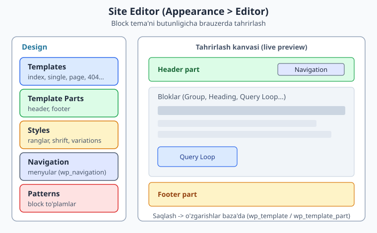
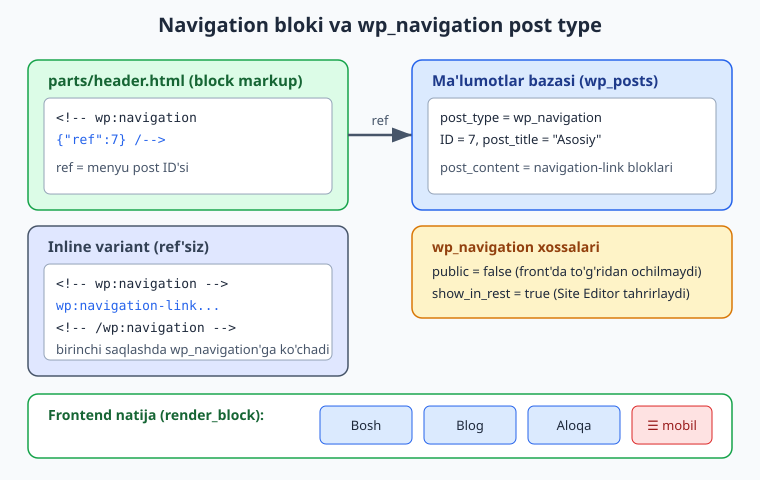
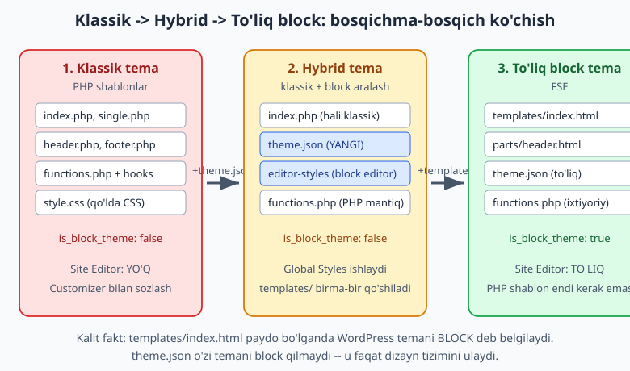

# 21 — Site Editor va hybrid temalar

[⬅️ Oldingi: 20 — Block patterns](./20-patterns.md) · [🏠 README](./README.md) · [Keyingi: 22 — Custom blok yaratish asoslari ➡️](./22-block-dev-asoslari.md)

> **Bu bobda:** Block temaning eng kuchli vositasi — **Site Editor** (FSE: Full Site Editing). Foydalanuvchi butun saytni (templates, parts, styles, navigation, patterns) brauzerda, kod yozmasdan tahrirlaydi. Biz Site Editor ish oqimini, `wp:navigation` blokini va uning ortidagi `wp_navigation` post type'ini, foydalanuvchi o'zgarishlari baza'da fayl ustiga qanday yozilishini ("Clear customizations") o'rganamiz. So'ng eng amaliy mavzu: **hybrid tema** (klassik + block aralash) va klassik temadan to'liq block temaga **bosqichma-bosqich ko'chish** strategiyasi. Hamma fakt va kod jonli WordPress 7.0 da tekshirilgan.

---

## Site Editor nima?

15-20 boblarda block temaning qismlarini ko'rdik: `theme.json`, templates, parts, global styles, patterns. Site Editor — bularning hammasini **bitta brauzer interfeysida** birlashtiruvchi vosita.

Klassik temada (1-14 boblar) tema dizaynini o'zgartirish uchun PHP fayllarni qo'lda tahrirlash kerak edi. Foydalanuvchi (mijoz) buni qila olmasdi — har o'zgarish uchun dasturchi kerak bo'lardi. Site Editor shu to'siqni oladi: mijoz header'ni, footer'ni, sahifa shablonini, ranglarni va menyuni o'zi, vizual tahrirlaydi.

Kirish yo'li: WordPress admin panelida **Appearance > Editor** (Ko'rinish > Tahrirlovchi). Bu menyu **faqat block tema aktiv bo'lganda** ko'rinadi. Ichkarida WordPress `Design` bo'limida besh asosiy bo'lim taqdim etadi:

| Bo'lim | Nima tahrirlanadi | Qayerda saqlanadi |
|--------|-------------------|--------------------|
| **Templates** | Sahifa shablonlari (index, single, page, 404...) | `wp_template` post type (baza) yoki `templates/*.html` (fayl) |
| **Template Parts** | Qayta ishlatiladigan bo'laklar (header, footer) | `wp_template_part` post type yoki `parts/*.html` |
| **Styles** | Ranglar, shriftlar, global stillar, variations | `wp_global_styles` post type (baza) |
| **Navigation** | Menyular | `wp_navigation` post type (baza) |
| **Patterns** | Block to'plamlar (20-bob) | tema `patterns/*.php` + foydalanuvchi yaratganlari baza'da |



> **Eslatma — atamalar:** "Site Editor", "Full Site Editing (FSE)", "block tema tahrirlovchisi" — bularning hammasi bir narsani anglatadi. WordPress 6.x dan beri rasmiy nom shunchaki "Editor" (Appearance > Editor); "FSE" jamoa ichidagi qisqartma.

### Block tema'mi yoki yo'q? — Editor menyusining sharti

Site Editor menyusi paydo bo'lishi uchun aktiv tema **block tema** bo'lishi shart. WordPress buni qanday aniqlaydi? Bu bobning kalit faktidir va hybrid temani tushunish uchun zarur:

WordPress temani block deb belgilashi uchun **`templates/index.html`** fayli (yoki eski `block-templates/index.html`) mavjud bo'lishi kerak. Boshqa hech narsa emas. Bu yadrodagi `WP_Theme::is_block_theme()` metodida shunday yozilgan (WordPress 7.0 da tekshirildi):

```php
$paths_to_index_block_template = array(
	$this->get_file_path( '/templates/index.html' ),
	$this->get_file_path( '/block-templates/index.html' ),
);
```

Ya'ni: temada `templates/index.html` bo'lsa — block tema (Site Editor yoqiladi). Bo'lmasa — klassik tema (Site Editor yo'q), `index.php` ishlatiladi. **`theme.json` ning bor-yo'qligi bu qarorga ta'sir qilmaydi** — bu fakt hybrid tema asosida yotadi (pastda batafsil).

---

## Site Editor ish oqimi

Site Editor'da ishlash klassik kod-tahrirlashdan tubdan farq qiladi. Tipik ish oqimi:

1. **Templates'ni ochish.** Masalan `Single Posts` shablonini ochasiz. Kanvasda haqiqiy postning ko'rinishi chiqadi (live preview).
2. **Bloklar bilan tahrirlash.** Sarlavha qo'shasiz, Query Loop sozlaysiz, ranglarni o'zgartirasiz — xuddi post yozgandek.
3. **Template Parts.** Header yoki footer'ni alohida tahrirlaysiz; ular hamma shablonlarda bir vaqtda yangilanadi (chunki `<!-- wp:template-part {"slug":"header"} /-->` bilan ulangan, 18-bob).
4. **Styles.** Global ranglar/shriftlarni o'zgartirasiz yoki tayyor style variation (19-bob) tanlaysiz.
5. **Navigation.** Menyu tuzasiz (pastda batafsil).
6. **Saqlash.** "Save" tugmasi bosilganda hamma o'zgarish **baza'ga** yoziladi.

Eng muhim tushuncha: Site Editor o'zgarishlari tema fayllarini O'ZGARTIRMAYDI. Ular baza'ga, alohida post type'larga yoziladi. Bu fayl ustiga "qatlam" qo'yadi — bu mantiqni keyingi bo'limda chuqurlashtiramiz.

### `template-canvas` — block tema qanday render bo'ladi

Klassik temada har URL `index.php`/`single.php` kabi PHP faylga boradi (3-bob, template hierarchy). Block temada PHP shablon yo'q — unda saytni nima render qiladi?

Javob: WordPress yadrosidagi yagona fayl — **`wp-includes/template-canvas.php`**. Block tema aktiv bo'lganda har bir so'rov shu faylga keladi. Uning butun mazmuni (WordPress 7.0 da tekshirildi):

```php
<?php
$template_html = get_the_block_template_html();
?><!DOCTYPE html>
<html <?php language_attributes(); ?>>
<head>
	<meta charset="<?php bloginfo( 'charset' ); ?>" />
	<?php wp_head(); ?>
</head>
<body <?php body_class(); ?>>
<?php wp_body_open(); ?>
<?php echo $template_html; ?>
<?php wp_footer(); ?>
</body>
</html>
```

Bu — block temaning "yagona `index.php`'si". U faqat bitta ish qiladi: `get_the_block_template_html()` bilan tegishli block template'ni (`index.html`, `single.html`...) topib, uni HTML'ga aylantiradi va `<body>` ichiga joylaydi. `wp_head()` va `wp_footer()` — klassik temadagidek (8-bob), majburiy hooklar bu yerda ham bor.

Diqqat qiling: `template-canvas.php` **tema ichida emas, WordPress yadrosida**. Siz uni yozmaysiz, o'zgartirmaysiz — block tema yaratganda u haqida bilishingiz kifoya. Bu klassik `header.php`/`footer.php`/`index.php` uchligini bitta yadro fayli bilan almashtiradi.

---

## Navigation bloki (`wp:navigation`)

Menyu — har saytning asosiy qismi. 11-bobda klassik usulni ko'rdik: `register_nav_menus()` + `wp_nav_menu()` + Walker. Block temada bu butunlay boshqacha ishlaydi — **Navigation bloki** (`core/navigation`) orqali.

Navigation bloki jonli WordPress 7.0 da ro'yxatdan o'tgan core blok (tekshirildi: `WP_Block_Type_Registry::is_registered("core/navigation")` -> `true`). Eng oddiy ko'rinishi — header part ichida (bu markup Twenty Twenty-Five header pattern'idan olingan):

```html
<!-- wp:navigation {"layout":{"type":"flex","justifyContent":"right"}} /-->
```

Bu o'z-o'zini yopuvchi (self-closing, `/-->`) blok. Ichida menyu havolalari ko'rinmaydi — chunki ular **baza'da** saqlanadi. Mana asosiy tushuncha.

### `wp_navigation` post type — menyu qayerda yashaydi

Navigation blokining ortida maxsus post type turadi: **`wp_navigation`**. Menyu (havolalar to'plami) shu post type'ning bitta yozuvi sifatida baza'da (`wp_posts` jadvali) saqlanadi.

Jonli WordPress 7.0 da tekshirildi:

```
post_type_exists("wp_navigation")  ->  true
post_type:  wp_navigation
public:        false   (front-endda /?p=... bilan to'g'ridan ochilmaydi)
show_in_rest:  true    (Site Editor / block editor REST orqali tahrirlaydi)
hierarchical:  false
```

- **`public: false`** — bu menyu sahifa emas; uni alohida URL bilan ochib bo'lmaydi. U faqat boshqa blok ichida ishlatiladigan ma'lumot.
- **`show_in_rest: true`** — Site Editor (React asosida) menyuni REST API orqali o'qiydi va yozadi.

Menyuning haqiqiy mazmuni (havolalar) `wp_navigation` postining `post_content` maydonida — `core/navigation-link` bloklari ketma-ketligi sifatida saqlanadi.



### `ref` atributi — menyuga ishora

Navigation bloki menyuga `ref` atributi orqali bog'lanadi. `ref` — bu `wp_navigation` postining ID'si. Tekshirilgan jonli misol (bizning sayt'da ID 7 li "Navigation" yozuvi bor):

```html
<!-- wp:navigation {"ref":7,"layout":{"type":"flex","justifyContent":"right"}} /-->
```

Bu markupni WordPress'ga `parse_blocks()` bilan berib tekshirdim: natija `blockName = "core/navigation"`, `attrs.ref = 7`. `render_block()` bu blokni ID 7 li `wp_navigation` postidan menyuni o'qib chiqaradi.

`ref` ning kuchi: **bitta menyu, ko'p joyda.** Header'da ham, footer'da ham `{"ref":7}` yozsangiz — ikkalasida bir xil menyu chiqadi. Menyuni Site Editor'da bir marta o'zgartirsangiz, hamma joyda yangilanadi.

### Inline (ref'siz) variant

Agar siz `theme.json` tema markupida menyuni qo'lda yozsangiz, `ref`siz, ichki bloklar bilan:

```html
<!-- wp:navigation {"overlayMenu":"mobile"} -->
	<!-- wp:navigation-link {"label":"Bosh","url":"/"} /-->
	<!-- wp:navigation-link {"label":"Blog","url":"/blog"} /-->
	<!-- wp:navigation-link {"label":"Aloqa","url":"/aloqa"} /-->
<!-- /wp:navigation -->
```

Buni ham `parse_blocks()` bilan tekshirdim: `core/navigation` ichida `core/navigation-link` bolalari to'g'ri o'qiladi. **Lekin diqqat:** foydalanuvchi bu menyuni Site Editor'da birinchi marta saqlaganda, WordPress uni avtomatik yangi `wp_navigation` postiga ko'chiradi va markupni `{"ref":N}` ga aylantiradi. Ya'ni inline variant — boshlang'ich holat, ref — barqaror holat.

### Navigation blokining foydali atributlari

Navigation bloki (tekshirilgan, `core/navigation` atributlarida bor):

| Atribut | Vazifasi |
|---------|----------|
| `ref` | `wp_navigation` post ID'si (menyuga ishora) |
| `overlayMenu` | Mobil "hamburger" rejimi: `"mobile"` (faqat kichik ekran), `"always"`, `"never"` |
| `layout` | Yo'nalish: `{"type":"flex","orientation":"horizontal"}` yoki `"vertical"` |
| `overlayBackgroundColor` / `overlayTextColor` | Ochilgan mobil menyu rangi |

`core/page-list` bloki ham bor (tekshirildi: ro'yxatdan o'tgan) — u barcha sahifalarni avtomatik menyu sifatida ko'rsatadi (qo'lda havola yozmasdan). Ko'pincha Navigation ichida ishlatiladi.

---

## Foydalanuvchi o'zgarishlari: baza fayl ustida

Bu — Site Editor'ning eng ko'p chalkashtiradigan, lekin eng muhim tushunchasi. Aniq tushunib oling.

Tema fayllari (`templates/index.html`, `parts/header.html`, `theme.json`) — bu **boshlang'ich qiymat** (default). Foydalanuvchi Site Editor'da biror narsani o'zgartirib saqlasa, o'zgarish faylga emas, **baza'ga** yoziladi:

| Foydalanuvchi tahrirlaydi | Fayl (default) | Saqlangan o'zgarish (baza) |
|----------------------------|----------------|-----------------------------|
| Template (Single) | `templates/single.html` | `wp_template` post type |
| Template part (Header) | `parts/header.html` | `wp_template_part` post type |
| Global stillar | `theme.json` (`styles`) | `wp_global_styles` post type |
| Menyu | (markup `ref`) | `wp_navigation` post type |

Mantiq: WordPress shablonni ko'rsatishda **avval baza'ga qaraydi**. Agar foydalanuvchi o'zgartirgan versiya baza'da bo'lsa — uni ishlatadi. Bo'lmasa — tema faylidagi default'ni ishlatadi. Ya'ni baza fayl ustiga **qatlam** (override) qo'yadi.

### "Clear customizations" — default'ga qaytarish

Bu modelning amaliy oqibati: foydalanuvchi Site Editor'da shablonni buzib qo'ysa, uni asl tema versiyasiga qaytarish oson. WordPress shablon yonida **"Clear customizations"** (yoki "Reset" — O'zgarishlarni tozalash) tugmasini ko'rsatadi.

Bu tugma faqat o'sha shablonning **baza'dagi** override yozuvini o'chiradi. Tema faylidagi default daxlsiz qoladi — WordPress qaytadan unga murojaat qila boshlaydi. Ya'ni "Clear customizations" hech qachon tema faylingizni o'chirmaydi, faqat foydalanuvchi qatlamini olib tashlaydi.

> **Dasturchi uchun amaliy nuqta:** temani yangilaganingizda (`templates/single.html` ni o'zgartirsangiz), agar mijoz o'sha shablonni Site Editor'da tahrirlagan bo'lsa, sizning yangi faylingiz **ko'rinmaydi** — chunki baza'dagi override ustun. Mijozdan "Clear customizations" bosishini so'rang yoki o'zgarishni Site Editor orqali kiriting. Bu klassik temada uchramaydigan yangi vaziyat.

---

## Hybrid tema: klassik + block aralash

Endi bobning ikkinchi yarmiga, eng amaliy mavzuga o'tamiz. Ko'p o'quvchi shunday savol beradi: "Menda katta klassik tema bor (yoki klassik bilim). Hammasini tashlab, noldan block tema yozishim shartmi?" Javob: **yo'q.** Oraliq yo'l bor — hybrid tema.

**Hybrid tema** — klassik va block xususiyatlarni aralashtirgan tema. Ikki asosiy ko'rinishi bor:

1. **Klassik tema + `theme.json`.** Tema hali `index.php`/`single.php` (PHP shablonlar) ishlatadi, lekin `theme.json` qo'shilgan — shu sababli block editor stillari, palitra va global sozlamalar ishlaydi.
2. **Block templates + PHP mantiq.** Tema `templates/*.html` (block shablonlar) ishlatadi, lekin `functions.php` orqali jiddiy PHP mantiq qo'shadi (hooklar, `render_block` filtri, custom logika).

### Hybrid asosini tasdiqlash (jonli test)

Eng kuchli dalil — kodning o'zi. Men jonli WordPress 7.0 da `ch21-hybrid-test` nomli tema yaratdim: `index.php` (klassik shablon) **va** `theme.json` (block sozlamalar) bilan. Natija:

```
is_block_theme:  false    <-- index.php bor, templates/index.html yo'q -> KLASSIK
wp_theme_has_theme_json:  true    <-- theme.json mavjud va ishlaydi
```

Va eng muhimi — bu **klassik** temaning `theme.json`'i haqiqatan parse qilindi (`WP_Theme_JSON_Resolver::get_theme_data()` bilan tekshirdim):

```
contentSize:  650px
palette ranglar soni:  2
  - asosiy = #2563eb
  - matn   = #1e293b
```

Ya'ni: **klassik tema (`is_block_theme: false`) ham `theme.json`'dan to'liq foydalanadi.** Palitra, layout, fluid typography — hammasi block editor'da va frontend'da ishlaydi, garchi tema PHP shablonlar bilan render bo'lsa ham. Bu — hybrid temaning poydevori, jonli tekshirilgan fakt.



### Klassik temaga `theme.json` qo'shish

Mavjud klassik temaga `theme.json` qo'shish — eng kam mehnat, eng katta foyda beradigan birinchi qadam. Faqat tema ildiziga `theme.json` faylini qo'shasiz:

```json
{
	"$schema": "https://schemas.wp.org/wp/6.7/theme.json",
	"version": 3,
	"settings": {
		"appearanceTools": true,
		"layout": { "contentSize": "650px", "wideSize": "1100px" },
		"color": {
			"defaultPalette": false,
			"palette": [
				{ "slug": "asosiy", "color": "#2563eb", "name": "Asosiy" },
				{ "slug": "matn", "color": "#1e293b", "name": "Matn" }
			]
		}
	}
}
```

Bu yaroqli JSON ekani (`json_decode`) va kalitlari `WP_Theme_JSON` schema'ga mosligi tekshirilgan. Faqat shu faylni qo'shish bilan klassik temangiz **darrov** quyidagilarni oladi:

- Block editor (post/sahifa yozishda) sizning brend palitrangizni ko'rsatadi (WP standartlari emas).
- `--wp--preset--color--asosiy` kabi CSS o'zgaruvchilari avtomatik yaratiladi (`style.css` da ishlatasiz).
- `contentSize`/`wideSize` bilan kontent kengligi boshqariladi.

### Block editor uchun stillarni ulash (`functions.php`)

`theme.json` ko'p narsani avtomatik beradi, lekin klassik temada block editor ichida tema CSS'ini ko'rsatish uchun `functions.php` da editor stillarini yoqish foydali. Bu kod `php -l` bilan tekshirilgan:

```php
<?php
add_action( 'after_setup_theme', 'mytheme_setup' );
function mytheme_setup() {
	// Block-editor uchun tema stillarini yoqish.
	add_theme_support( 'editor-styles' );
	add_editor_style( 'assets/editor.css' );

	// Klassik xususiyatlar ham qoladi.
	add_theme_support( 'title-tag' );
	add_theme_support( 'post-thumbnails' );
	add_theme_support( 'html5', array( 'search-form', 'gallery', 'caption' ) );

	// Menyu joyi (klassik wp_nav_menu uchun).
	register_nav_menus( array(
		'primary' => __( 'Asosiy menyu', 'mytheme' ),
	) );
}
```

`add_theme_support('editor-styles')` + `add_editor_style()` block editorni tema stilingiz bilan moslaydi (10-bobdagi enqueue mantig'ining editor varianti). `add_editor_style`, `register_nav_menus`, `wp_nav_menu` funksiyalari jonli WP 7.0 da mavjudligi tekshirildi.

### Block templates + PHP mantiq (ikkinchi hybrid ko'rinishi)

Aksincha yo'l: tema to'liq block (`templates/*.html`) bo'lsin, lekin PHP mantiq ham bo'lsin. Block tema'da ham `functions.php` ishlaydi — hooklar to'liq amal qiladi. Masalan, Navigation blokiga foydalanuvchi tizimga kirgan bo'lsa class qo'shadigan filtr (`php -l` bilan tekshirilgan):

```php
<?php
add_filter( 'render_block', 'mytheme_filter_nav', 10, 2 );
function mytheme_filter_nav( $block_content, $block ) {
	if ( 'core/navigation' === $block['blockName'] && is_user_logged_in() ) {
		$block_content = str_replace(
			'wp-block-navigation',
			'wp-block-navigation is-logged-in',
			$block_content
		);
	}
	return $block_content;
}
```

`render_block` filtri har blokning chiqishini PHP'da o'zgartirishga imkon beradi. Bu — block markup (HTML) + klassik PHP hook tizimi (9-bob) birikmasi: aniq hybrid. Bunday yondashuv real loyihalarda juda keng tarqalgan — dizayn block bilan, biznes-mantiq PHP bilan.

---

## Klassikdan block'ga bosqichma-bosqich ko'chish

Endi strategiyani yig'amiz. Katta klassik temani bir kechada block temaga aylantirish — xavfli va keraksiz. To'g'ri yo'l — **bosqichma-bosqich**, har bosqichda sayt ishlab tursin:

**1-bosqich: `theme.json` qo'shing.** Klassik temaga `theme.json` (settings) qo'shing. Sayt hali klassik (`index.php` ishlaydi), lekin block editor brendingizni biladi, palitra/CSS o'zgaruvchilari paydo bo'ladi. Eng kam xavf, darrov foyda. Bu — birinchi va eng muhim qadam.

**2-bosqich: editor stillarini ulang.** `add_theme_support('editor-styles')` + `add_editor_style()`. Endi block editor tema ko'rinishiga mos. `theme.json` ga `styles` (17-bob) qo'shib, frontend stilingizning bir qismini CSS'dan theme.json'ga ko'chiring.

**3-bosqich: templates'ni birma-bir ko'chiring.** Mana hal qiluvchi qadam. Bitta PHP shablonni block HTML shablonga aylantiring — lekin **`templates/index.html` ni eng oxirida** qo'shing, chunki u paydo bo'lishi bilan tema **block** ga aylanadi (yuqorida tekshirilgan fakt). Tartib odatda shunday:
   - `templates/page.html` yoki `templates/404.html` (eng oddiy, kam xavfli) bilan boshlang.
   - `templates/single.html`, `templates/archive.html` ni qo'shing.
   - `parts/header.html`, `parts/footer.html` yarating (`get_header()`/`get_footer()` o'rnini bosadi).
   - Hammasi tayyor bo'lganda **`templates/index.html`** qo'shing. Shu lahzada tema block bo'ladi, Site Editor yoqiladi, eski `index.php` endi ishlatilmaydi.

**4-bosqich: tozalash.** Endi PHP shablonlar (`index.php`, `single.php`...) keraksiz — o'chirishingiz mumkin (yoki ehtiyot uchun qoldirasiz; block temada ular e'tiborga olinmaydi). `functions.php` esa qoladi — hooklar, enqueue, custom mantiq block temada ham kerak.

| Bosqich | Qo'shasiz | Tema turi | Site Editor |
|---------|-----------|-----------|-------------|
| 1 | `theme.json` (settings) | Klassik | Yo'q |
| 2 | editor-styles + `theme.json` styles | Klassik | Yo'q |
| 3a | `page.html`, `single.html`, parts... | Klassik (hali `index.html` yo'q) | Yo'q |
| 3b | **`templates/index.html`** | **Block** | **Ha** |
| 4 | PHP shablonlarni olib tashlash | Block | Ha |

Bu strategiyaning go'zalligi: har bosqichda sayt to'liq ishlaydi. Xohlagan bosqichda to'xtashingiz mumkin — masalan 1-2 bosqichda qolib, "klassik + theme.json" hybrid tema sifatida yillab ishlatish mutlaqo to'g'ri tanlov.

---

## Tez-tez uchraydigan xatolar

1. **`theme.json` qo'shdim, lekin tema block bo'lib qoldi deb o'ylash.** `theme.json` temani block QILMAYDI. Faqat `templates/index.html` qiladi. Klassik tema + theme.json = hybrid, hali klassik.
2. **Site Editor menyusi yo'q.** Tema block emas (`templates/index.html` yo'q) yoki aktiv tema klassik. Editor menyusi faqat block tema aktiv bo'lganda chiqadi.
3. **Tema faylini o'zgartirdim, sayt'da ko'rinmadi.** Foydalanuvchi o'sha shablonni Site Editor'da tahrirlagan — baza'dagi override fayl ustun. "Clear customizations" bosing.
4. **Navigation menyu havolalari `parts/header.html` ichida ko'rinmaydi.** To'g'ri — menyu `wp_navigation` post type'ida (baza), markupda faqat `{"ref":N}`. Havolalarni Site Editor > Navigation'da tahrirlaysiz.
5. **`wp_navigation` ni front-endda URL bilan ochmoqchi bo'lish.** U `public: false` — alohida sahifa emas, faqat boshqa blok ichida ishlatiladigan ma'lumot.
6. **Inline menyu yozdim, lekin u `ref` ga aylanib qoldi.** Bu normal — foydalanuvchi birinchi saqlashda WordPress inline menyuni `wp_navigation` postiga ko'chiradi.
7. **`templates/index.html` ni birinchi qo'shish.** Ko'chishda buni oxirida qo'shing — aks holda tema yarim tayyor holatda block bo'lib, boshqa shablonlar yo'qligi sababli sayt buziladi.

---

## Mashqlar

### Oson

1. **Site Editor'ni oching.** Block tema (masalan Twenty Twenty-Five) aktiv qiling va Appearance > Editor'ga o'ting. Besh bo'lim (Templates, Template Parts, Styles, Navigation, Patterns) nimaga mas'ulligini bir jumladan yozing.
2. **Navigation blok markupini yozing.** Header part uchun `ref` siz, ichida 3 ta `navigation-link` (Bosh, Blog, Aloqa) bo'lgan `wp:navigation` blok markupini yozing.
3. **`template-canvas` ni tushuntiring.** Block temada qaysi yadro fayli saytni render qiladi va u qaysi funksiyani chaqiradi? Bir jumlada javob bering.
4. **Block tema shartini ayting.** WordPress temani qaysi bitta fayl borligiga qarab "block tema" deb belgilaydi? Klassik vs block farqini shu fakt bilan tushuntiring.

### O'rta

5. **Klassik temaga `theme.json` qo'shing.** `version 3`, `appearanceTools: true`, `layout` (contentSize 650px, wideSize 1100px) va 2 rangli palitra (asosiy, matn — default'lar o'chirilgan) bo'lgan `theme.json` yozing. JSON yaroqli bo'lsin.
6. **Navigation blokini `ref` bilan yozing.** Menyu post ID'si 12 bo'lsin; mobil rejimda hamburger menyu (`overlayMenu: "mobile"`), o'ngga tekislangan flex layout bilan markup yozing.
7. **Editor stillarini ulang.** Klassik temaga block editor stillarini ulaydigan `functions.php` qismini yozing (`add_theme_support('editor-styles')` + `add_editor_style()`), `after_setup_theme` hookida.
8. **"Clear customizations" ni tushuntiring.** Foydalanuvchi Site Editor'da `single.html` ni tahrirladi. Bu o'zgarish qayerda saqlandi? "Clear customizations" bosilsa nima o'chadi va nima qoladi?

### Qiyin

9. **Hybrid tema'ning ikki ko'rinishini farqlang.** Hybrid temaning ikki ko'rinishini misol bilan tushuntiring: (a) klassik + theme.json, (b) block templates + PHP mantiq. Har biri uchun bitta amaliy stsenariy keltiring.
10. **`render_block` filtri yozing.** Block temada `core/navigation` blokiga, faqat bosh sahifada (`is_front_page()`), `is-home-nav` class qo'shadigan `render_block` filtrini yozing. Kod sintaksis-toza bo'lsin.
11. **To'liq ko'chish rejasini tuzing.** Klassik temani (index.php, single.php, page.php, header.php, footer.php, functions.php) to'liq block temaga ko'chirish rejasini 4 bosqichda yozing. Har bosqichda: nima qo'shiladi, tema turi (klassik/block), va sayt ishlaydimi. `templates/index.html` ni qaysi bosqichda qo'shasiz va nega?
12. **Block templates + theme.json + PHP birlashtirilgan hybrid.** Quyidagini tasvirlang (kod va izoh bilan): block tema (`templates/index.html` bor) lekin `functions.php` da (a) `theme.json` palitra ranglarini enqueue qiluvchi inline style, (b) `render_block` filtri bilan custom logika. Nega bunday tema "hybrid" deb ataladi?

---

## Yechimlar

<details markdown="1">
<summary>Yechim — 1</summary>

Appearance > Editor (block tema aktiv bo'lganda ko'rinadi). Besh bo'lim:

- **Templates** — sahifa shablonlari (index, single, page, 404...) ni tahrirlash.
- **Template Parts** — qayta ishlatiladigan bo'laklar (header, footer) ni tahrirlash.
- **Styles** — global ranglar, shriftlar, stillar va style variations.
- **Navigation** — menyular (`wp_navigation` post type'ida).
- **Patterns** — block to'plamlar (qayta ishlatiluvchi).

Hamma tahrir baza'ga yoziladi, tema fayllari daxlsiz qoladi.

</details>

<details markdown="1">
<summary>Yechim — 2</summary>

```html
<!-- wp:navigation {"layout":{"type":"flex","justifyContent":"left"}} -->
	<!-- wp:navigation-link {"label":"Bosh","url":"/"} /-->
	<!-- wp:navigation-link {"label":"Blog","url":"/blog"} /-->
	<!-- wp:navigation-link {"label":"Aloqa","url":"/aloqa"} /-->
<!-- /wp:navigation -->
```

`ref` yo'q — havolalar markup ichida (inline). Bu `parse_blocks()` bilan tekshirilganda `core/navigation` ichida 3 ta `core/navigation-link` bolasini beradi. Foydalanuvchi birinchi saqlaganda WordPress buni `wp_navigation` postiga ko'chiradi va `{"ref":N}` ga aylantiradi.

</details>

<details markdown="1">
<summary>Yechim — 3</summary>

Block temada saytni WordPress yadrosidagi **`wp-includes/template-canvas.php`** render qiladi. U **`get_the_block_template_html()`** funksiyasini chaqiradi — bu tegishli block template'ni (index.html, single.html...) topib HTML'ga aylantiradi va `<body>` ichiga joylaydi. `wp_head()` va `wp_footer()` ham shu faylda. Bu — klassik `index.php`/`header.php`/`footer.php` o'rnini bosadi (lekin tema ichida emas, yadroda).

</details>

<details markdown="1">
<summary>Yechim — 4</summary>

WordPress temani **`templates/index.html`** (yoki eski `block-templates/index.html`) fayli borligiga qarab block tema deb belgilaydi (`WP_Theme::is_block_theme()`).

- **Bor** -> block tema, Site Editor yoqiladi, `template-canvas.php` render qiladi.
- **Yo'q** -> klassik tema, `index.php` ishlatiladi, template hierarchy (3-bob) amal qiladi.

`theme.json` ning bor-yo'qligi bu qarorga ta'sir qilmaydi — shu sababli klassik tema theme.json bilan ham mavjud bo'la oladi (hybrid).

</details>

<details markdown="1">
<summary>Yechim — 5</summary>

```json
{
	"$schema": "https://schemas.wp.org/wp/6.7/theme.json",
	"version": 3,
	"settings": {
		"appearanceTools": true,
		"layout": {
			"contentSize": "650px",
			"wideSize": "1100px"
		},
		"color": {
			"defaultPalette": false,
			"palette": [
				{ "slug": "asosiy", "color": "#2563eb", "name": "Asosiy" },
				{ "slug": "matn", "color": "#1e293b", "name": "Matn" }
			]
		}
	}
}
```

Bu fayl klassik temaga (index.php ishlatadigan) qo'shilsa ham, jonli WP 7.0 da tekshirildi: `theme.json` to'liq parse qilinadi (`contentSize: 650px`, 2 palitra rangi), block editor brendni biladi, `--wp--preset--color--asosiy` CSS o'zgaruvchisi yaratiladi. Tema esa `is_block_theme: false` bo'lib qoladi (hybrid).

</details>

<details markdown="1">
<summary>Yechim — 6</summary>

```html
<!-- wp:navigation {"ref":12,"overlayMenu":"mobile","layout":{"type":"flex","justifyContent":"right"}} /-->
```

- `ref: 12` — menyu `wp_navigation` post ID'si (havolalar baza'da).
- `overlayMenu: "mobile"` — kichik ekranda hamburger menyu, kattada oddiy.
- `layout` — flex, o'ngga tekislangan.

O'z-o'zini yopuvchi (`/-->`), chunki havolalar markupda emas, baza'da. `ref` va `overlayMenu` atributlari `core/navigation` blokida mavjudligi tekshirilgan.

</details>

<details markdown="1">
<summary>Yechim — 7</summary>

```php
<?php
add_action( 'after_setup_theme', 'mytheme_editor_styles' );
function mytheme_editor_styles() {
	add_theme_support( 'editor-styles' );
	add_editor_style( 'assets/editor.css' );
}
```

`add_theme_support('editor-styles')` WordPress'ga tema'ning maxsus editor stilini qabul qilishini aytadi; `add_editor_style('assets/editor.css')` esa o'sha CSS faylni block editor ichiga ulaydi. Natijada post yozayotgan foydalanuvchi tema ko'rinishini editor ichida ham ko'radi. Bu klassik temada ham, block temada ham ishlaydi. `after_setup_theme` — to'g'ri hook (9-bob). Funksiyalar jonli WP 7.0 da mavjud.

</details>

<details markdown="1">
<summary>Yechim — 8</summary>

- **Qayerda saqlandi:** o'zgarish tema fayliga (`templates/single.html`) emas, **baza'ga**, `wp_template` post type'iga yoziladi. Bu fayl ustiga "override qatlam" qo'yadi — WordPress shablonni ko'rsatishda avval baza'dagi versiyani ishlatadi.
- **"Clear customizations" bosilsa:** faqat baza'dagi `wp_template` override yozuvi o'chadi. Tema faylidagi `single.html` (default) daxlsiz qoladi — WordPress qaytadan unga murojaat qiladi. Ya'ni shablon asl tema versiyasiga qaytadi, fayl hech qachon o'chmaydi.

</details>

<details markdown="1">
<summary>Yechim — 9</summary>

**(a) Klassik + `theme.json`:** tema `index.php`/`single.php` (PHP shablonlar) ishlatadi, lekin `theme.json` qo'shilgan. `is_block_theme: false`, lekin block editor palitra/sozlamalarni biladi.
- *Stsenariy:* mavjud katta klassik tema'ga brend palitra va CSS o'zgaruvchilarini tez qo'shish — PHP shablonlarni qayta yozmasdan.

**(b) Block templates + PHP mantiq:** tema `templates/*.html` (block shablonlar) ishlatadi, lekin `functions.php` da jiddiy PHP logika bor (hooklar, `render_block`, custom funksiyalar). `is_block_theme: true`.
- *Stsenariy:* dizayn Site Editor'da (vizual, mijoz tahrirlaydi), lekin biznes-mantiq — masalan foydalanuvchi roliga qarab kontent ko'rsatish, tashqi API'dan ma'lumot — PHP'da.

Ikkalasi ham "hybrid", chunki klassik (PHP) va block (theme.json / HTML templates) yondashuvlarini birlashtiradi.

</details>

<details markdown="1">
<summary>Yechim — 10</summary>

```php
<?php
add_filter( 'render_block', 'mytheme_home_nav_class', 10, 2 );
function mytheme_home_nav_class( $block_content, $block ) {
	if ( 'core/navigation' === $block['blockName'] && is_front_page() ) {
		$block_content = str_replace(
			'wp-block-navigation',
			'wp-block-navigation is-home-nav',
			$block_content
		);
	}
	return $block_content;
}
```

`render_block` filtri har blokning HTML chiqishini PHP'da o'zgartiradi. Bu yerda: blok `core/navigation` bo'lsa **va** joriy sahifa bosh sahifa bo'lsa (`is_front_page()`), navigation'ning asosiy class'iga `is-home-nav` qo'shamiz. Boshqa sahifalarda yoki boshqa bloklarda hech narsa o'zgarmaydi. Kod `php -l` bilan tekshirilgan (shu naqsh jonli WP'da sintaksis-toza). 4-argument (`10, 2`) — prioritet va argumentlar soni (9-bob).

</details>

<details markdown="1">
<summary>Yechim — 11</summary>

**To'liq ko'chish rejasi (4 bosqich):**

| Bosqich | Nima qo'shiladi | Tema turi | Sayt ishlaydimi |
|---------|-----------------|-----------|------------------|
| **1** | `theme.json` (settings: palitra, layout) | Klassik | Ha — `index.php` render qiladi, block editor brendni biladi |
| **2** | `theme.json` styles + `editor-styles` (functions.php) | Klassik | Ha — frontend stilning bir qismi theme.json'ga ko'chadi |
| **3** | `templates/page.html`, `single.html`, `archive.html`, `parts/header.html`, `parts/footer.html` | Klassik (hali) | Ha — `index.html` yo'qligi sababli WP klassik shablonlarga tushadi |
| **4** | **`templates/index.html`** + eski `*.php` shablonlarni olib tashlash | **Block** | Ha — endi to'liq block, Site Editor yoqiladi |

**`templates/index.html` ni 4-bosqichda (oxirida) qo'shaman**, chunki u paydo bo'lishi bilan WordPress temani block deb belgilaydi (`is_block_theme: true`) va PHP shablonlarni e'tiborsiz qoldiradi. Agar uni erta qo'shsam, boshqa block shablonlar hali yo'qligi sababli sayt yarim-block holatda buziladi. Shuning uchun avval boshqa hamma block shablon/part tayyor bo'lsin, keyin `index.html` bilan "kalitni burab", temani block'ga o'tkazaman. `functions.php` hamma bosqichda qoladi.

</details>

<details markdown="1">
<summary>Yechim — 12</summary>

Block tema (`templates/index.html` bor -> `is_block_theme: true`), lekin `functions.php` da klassik PHP mantiq:

```php
<?php
// (a) theme.json palitrasiga asoslangan inline CSS frontend'ga ulash.
add_action( 'wp_enqueue_scripts', 'mytheme_brand_css' );
function mytheme_brand_css() {
	$css = ':root { --brand-accent: var(--wp--preset--color--asosiy); }';
	wp_register_style( 'mytheme-brand', false );
	wp_enqueue_style( 'mytheme-brand' );
	wp_add_inline_style( 'mytheme-brand', $css );
}

// (b) render_block bilan custom logika: maxsus postlarga belgi qo'yish.
add_filter( 'render_block', 'mytheme_highlight_featured', 10, 2 );
function mytheme_highlight_featured( $block_content, $block ) {
	if ( 'core/post-title' === $block['blockName'] && is_sticky() ) {
		$block_content = str_replace(
			'wp-block-post-title',
			'wp-block-post-title is-featured',
			$block_content
		);
	}
	return $block_content;
}
```

**Nega "hybrid":** tema dizayni block bilan (HTML templates, theme.json — Site Editor'da tahrirlanadi), lekin xatti-harakat va qo'shimcha mantiq klassik PHP hook tizimi bilan (`wp_enqueue_scripts`, `wp_add_inline_style`, `render_block`). (a) theme.json'ning CSS o'zgaruvchisini (`--wp--preset--color--asosiy`, 16-bob) PHP orqali qayta ishlatadi; (b) blok chiqishini PHP shartiga qarab o'zgartiradi. Ikki dunyoning eng yaxshisi birlashgani uchun "hybrid". Kod naqshlari `php -l` bilan sintaksis-toza tekshirilgan.

</details>

---

[⬅️ Oldingi: 20 — Block patterns](./20-patterns.md) · [🏠 README](./README.md) · [Keyingi: 22 — Custom blok yaratish asoslari ➡️](./22-block-dev-asoslari.md)
