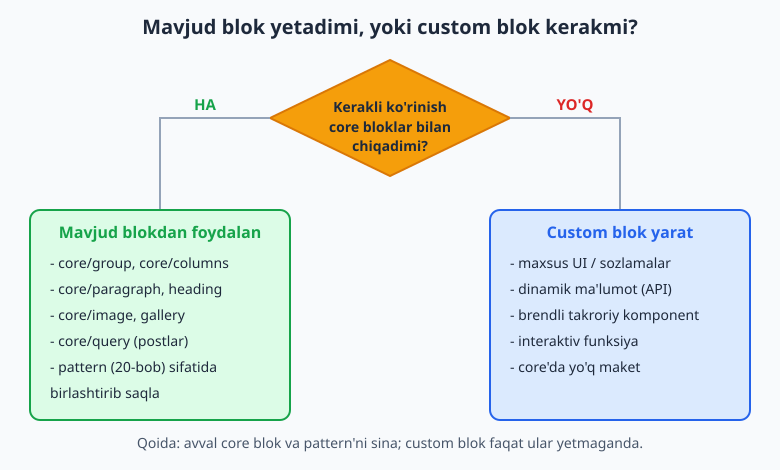
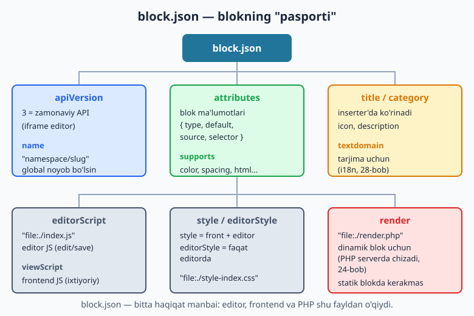
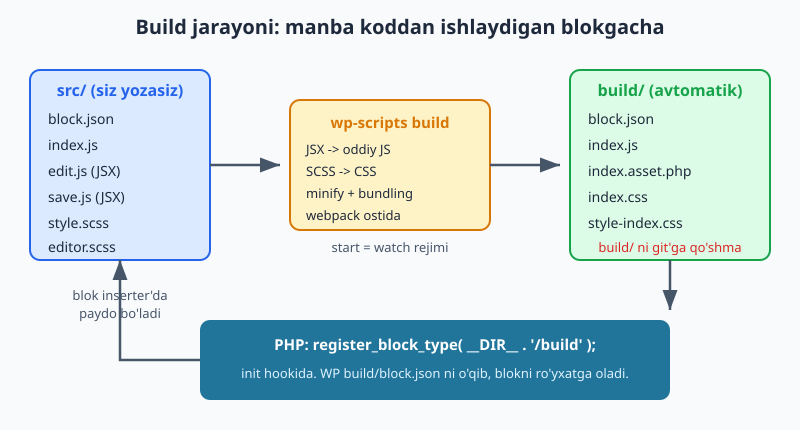

# 22 — Custom blok yaratish asoslari

[⬅️ Oldingi: 21 — Site Editor va hybrid temalar](./21-site-editor-hybrid.md) · [🏠 README](./README.md) · [Keyingi: 23 — Edit/Save, attributes va InspectorControls ➡️](./23-edit-save-attributes.md)

> **Bu bobda:** Endi biz tayyor bloklardan o'tib, **o'z blokimizni** yaratamiz. Custom blok qachon kerakligini (mavjud bloklar yetmaganda) aniqlaymiz, `@wordpress/scripts` asbobini sozlaymiz, blok loyihasi tuzilishini (`src/`, `build/`, `block.json`) o'rganamiz, `block.json` ning har bir muhim maydonini ko'rib chiqamiz, blokni `register_block_type` bilan PHP'da ro'yxatdan o'tkazamiz va eng muhimi — birinchi blokimizni `wp-scripts build` bilan **haqiqatan quramiz**. Bobdagi blok npm bilan qurib ko'rildi: `build/index.js` va `build/block.json` real hosil bo'ldi.

---

## Nega custom blok kerak?

V qismga xush kelibsiz. Shu paytgacha biz block temani **mavjud** bloklar bilan yig'dik: `core/group`, `core/paragraph`, `core/query`, `core/image` va boshqalar. Ko'pchilik sayt uchun bu yetarli. Lekin ba'zan kerakli ko'rinishni hech qanday core blok bera olmaydi — mana shunda **custom blok** (o'z blokingiz) yaratish vaqti keladi.

Avvalo bir muhim qoidani yodda tuting: **custom blok — oxirgi chora, birinchi emas.** WordPress'da blok yaratish nisbatan ko'p ish (npm, build, JavaScript). Shuning uchun har safar o'zingizga savol bering: "Bu ko'rinishni core bloklar va pattern (20-bob) bilan chiqara olamanmi?" Agar javob "ha" bo'lsa — pattern yarating, blok emas.



Custom blok **haqiqatan kerak** bo'ladigan tipik holatlar:

- **Maxsus UI / sozlamalar.** Masalan, "narx jadvali" bloki: 3 ustun, har birida sarlavha, narx, xususiyatlar ro'yxati va tugma. Core bloklar bilan buni yig'ish mumkin, lekin mijoz uchun qulay, soddalashtirilgan sozlamalar paneli kerak bo'lsa — custom blok afzal.
- **Dinamik ma'lumot.** Blok serverdan yangi ma'lumot ko'rsatishi kerak bo'lsa — masalan "oxirgi 5 ta post", "ob-havo", "valyuta kursi". Bunday blok har yuklanganda yangilanadi (24-bobdagi dinamik bloklar).
- **Brendli takroriy komponent.** Sayt bo'ylab bir xil ko'rinadigan, lekin har joyda ozgina farq qiladigan element — masalan "xizmat kartochkasi" yoki "jamoa a'zosi".
- **Interaktivlik.** Akkordeon, tab, kalkulyator kabi foydalanuvchi bilan o'zaro ta'sir qiladigan elementlar (25-bobdagi Interactivity API).
- **core'da umuman yo'q maket.** Standart bloklar qoplay olmaydigan o'ziga xos joylashuv.

> **Pattern vs custom blok — farqni aniq tushuning.** Pattern (20-bob) — bu mavjud bloklarning **oldindan tayyorlangan kombinatsiyasi**, faqat HTML/markup. Custom blok — bu **yangi JavaScript komponent**: o'z tahrirlash interfeysi, o'z sozlamalari, o'z save mantig'i bilan. Agar sizga shunchaki "tugma + matn + rasm"ning chiroyli birikmasi kerak bo'lsa — pattern. Agar yangi xulq-atvor (sozlamalar, dinamik ma'lumot, interaktivlik) kerak bo'lsa — custom blok.

---

## Blok tema'da yoki plaginda blok?

Ko'p o'rganuvchini chalkashtiradigan savol: blokni **tema** ichida yaratamizmi yoki **plagin** ichida? Ikkalasi ham texnik jihatdan ishlaydi, lekin tavsiya aniq:

**Asosiy qoida: blok odatda PLAGINda bo'ladi.** Sababi — blok bu **kontent**, tema esa **ko'rinish**. Foydalanuvchi temani almashtirsa (masalan, dizaynni yangilash uchun), uning kontenti yo'qolmasligi kerak. Agar "narx jadvali" bloki temaga bog'langan bo'lsa va tema o'chsa, mijozning barcha sahifalaridagi narx jadvallari "Bu blok mavjud emas" xatosiga aylanadi. Plaginda bo'lsa — blok temadan mustaqil yashaydi.

**Lekin tema-spetsifik blok ham bo'ladi.** Agar blok faqat shu tema dizaynining ajralmas qismi bo'lsa (masalan, temangizning maxsus "hero" bloki, boshqa temada mantiqsiz) — uni tema ichida saqlash o'rinli. Bu kitobda biz blokni **tema ichida** o'rgatamiz, chunki kitob temaga bag'ishlangan; lekin texnika ikkalasida bir xil — farqi faqat `register_block_type` ni qaysi fayl chaqirishida.

| Mezon | Plaginda blok | Tema ichida blok |
|-------|---------------|-------------------|
| Tema almashganda saqlanadimi? | Ha (mustaqil) | Yo'q (yo'qoladi) |
| Mos holat | Umumiy, qayta ishlatiluvchi blok | Faqat shu tema dizayniga xos |
| Ro'yxatdan o'tkazish | Plagin asosiy faylida | `functions.php` da |
| Tavsiya | **Odatda shu** | Maxsus holatlar |

> **Amaliy maslahat:** Mijoz loyihasida muhim kontent bloklarini doim **plaginda** saqlang ("site-specific plugin" deb ataladi). Tema sotyapsiz va blok dizaynning ajralmas qismi bo'lsa — temaga qo'shing. Shubha bo'lsa — plagin.

---

## `@wordpress/scripts` — blok asbobi

Custom blok JavaScript (aniqrog'i JSX — React'ning kengaytmasi) bilan yoziladi. Lekin brauzer va WordPress JSX'ni to'g'ridan-to'g'ri tushunmaydi — uni avval oddiy JavaScript'ga **kompilyatsiya** (build) qilish kerak. Bu jarayonni qo'lda webpack va babel sozlash bilan qilish murakkab. Shuning uchun WordPress rasmiy asbob beradi: **`@wordpress/scripts`** (qisqacha `wp-scripts`).

`wp-scripts` — bu "hammasi sozlangan" to'plam: u ichida webpack, babel, SCSS kompilyatori, linter va boshqa hammasini olib keladi. Siz faqat ikki buyruqni bilishingiz kifoya:

- `wp-scripts build` — `src/` papkadagi koddni bir martalik **production** uchun quradi (`build/` papkaga).
- `wp-scripts start` — **watch** rejimi: faylni har saqlaganingizda avtomatik qayta quradi (ishlab chiqish paytida).

### Eng tez yo'l: `create-block`

Yangi blok yaratishning eng oson usuli — rasmiy shablon generatori:

```bash
npx @wordpress/create-block@latest mening-blokim
```

Bu buyruq `mening-blokim/` papkasini yaratadi va ichiga to'liq ishlaydigan blok skeleti joylaydi: `package.json`, `block.json`, `src/` papkasi (edit.js, save.js, index.js, style.scss), hatto blokni ro'yxatdan o'tkazadigan PHP faylgacha. So'ng `npm start` qilsangiz — tayyor.

Foydali bayroqlar:

```bash
# Faqat fayllarni yaratish, plagin sifatida emas (mavjud tema/plagin ichiga):
npx @wordpress/create-block@latest salom-quti --no-plugin

# Tema ichida ishlatish uchun src'ni o'z papkangizga yaratib, keyin build qilasiz.
```

> **`create-block` nima qiladi?** U sizga o'rgatish maqsadida biz qo'lda yozadigan barcha fayllarni avtomatik generatsiya qiladi. Real ishda ko'pincha shundan boshlanadi. Lekin **ichida nima borligini tushunish uchun** biz bu bobda fayllarni qo'lda ham yozamiz — shunda generatordan chiqqan kodni o'qiy olasiz.

### Qo'lda sozlash (nima sodir bo'layotganini tushunish uchun)

`create-block` siz uchun qiladigan ishni qo'lda ham qilish mumkin. Bo'sh papkada:

```bash
npm init -y
npm install @wordpress/scripts --save-dev
```

So'ng `package.json` ga build buyruqlarini qo'shasiz:

```json
{
	"scripts": {
		"build": "wp-scripts build",
		"start": "wp-scripts start"
	}
}
```

> **Diqqat — `"type": "commonjs"` qo'shmang.** `npm init -y` ba'zi muhitlarda `package.json` ga `"type": "commonjs"` yozib qo'yishi mumkin. Bu webpack'ga `.js` fayllarni eski "script" rejimida o'qishni buyuradi va build `import`/`export` ustida xato beradi (`'import' and 'export' may appear only with 'sourceType: module'`). `create-block` bunday qatorni qo'shmaydi — agar `npm init` qo'shgan bo'lsa, uni **o'chiring**. (Bu xato bu bobni yozishda real uchradi va aynan shu sabab edi.)

---

## Blok loyihasi tuzilishi

Tayyor blok loyihasi quyidagicha ko'rinadi. Ikki asosiy papkani ajrating: siz **`src/`** ga yozasiz, `wp-scripts` esa **`build/`** ni generatsiya qiladi.

```text
mening-blokim/
├── package.json          # npm sozlamalari va build buyruqlari
├── src/                  # SIZ YOZASIZ (manba kod)
│   ├── block.json        # blokning "pasporti" (metama'lumot)
│   ├── index.js          # kirish nuqtasi: registerBlockType
│   ├── edit.js           # editorda blok qanday ko'rinadi (JSX)
│   ├── save.js           # bazaga saqlanadigan markup (JSX)
│   ├── style.scss        # frontend + editor uslubi
│   └── editor.scss       # faqat editor uslubi
├── build/                # WP-SCRIPTS GENERATSIYA QILADI (qo'l tegma)
│   ├── block.json        # src'dan nusxa
│   ├── index.js          # kompilyatsiya qilingan JS
│   ├── index.asset.php   # bog'liqliklar va versiya (avtomatik)
│   ├── index.css         # editor.scss'dan
│   └── style-index.css   # style.scss'dan
└── mening-blokim.php      # register_block_type (plagin yoki temada)
```

Ikki muhim qoida:

1. **`build/` ni hech qachon qo'lda tahrirlamang** — har build'da ustiga yoziladi.
2. **`build/` ni git'ga qo'shmang** — uni `.gitignore` ga yozing. Repo'da faqat `src/` va sozlama fayllari bo'lsin; build'ni har kim o'zi `npm run build` bilan tiklaydi.

> **`src/` va `build/` — oshpaz analogiyasi.** `src/` — bu xom mahsulotlar va retsept (siz yozgan kod). `build/` — tayyor taom (WordPress yeydigan kompilyatsiyalangan kod). Siz retseptni o'zgartirasiz, oshpaz (`wp-scripts`) taomni qayta tayyorlaydi. Hech qachon tayyor taomning ustidan tuz sepib o'zgartirmaysiz — retseptni o'zgartirasiz.

---

## `block.json` — blokning pasporti

`block.json` — har bir custom blokning **markazi**. Bu fayl blok haqida hamma narsani bir joyda e'lon qiladi: nomi, sarlavhasi, ma'lumotlari, qaysi JS/CSS fayllarni yuklash kerakligi. Editor ham, frontend ham, PHP ham shu bitta fayldan o'qiydi — bu "bitta haqiqat manbai" tamoyili.



Mana bizning birinchi blokimizning to'liq `block.json` faylimiz (bu fayl npm build bilan tekshirildi):

```json
{
	"$schema": "https://schemas.wp.org/trunk/block.json",
	"apiVersion": 3,
	"name": "mening-tema/salom-quti",
	"version": "1.0.0",
	"title": "Salom quti",
	"category": "widgets",
	"icon": "smiley",
	"description": "Birinchi custom blok: oddiy salomlashish qutisi.",
	"keywords": [ "salom", "demo" ],
	"textdomain": "mening-tema",
	"attributes": {
		"xabar": {
			"type": "string",
			"default": "Salom, custom blok!"
		}
	},
	"supports": {
		"html": false,
		"color": {
			"background": true,
			"text": true
		}
	},
	"editorScript": "file:./index.js",
	"editorStyle": "file:./index.css",
	"style": "file:./style-index.css"
}
```

Endi har bir maydonni ko'rib chiqamiz:

- **`$schema`** — IDE (VS Code) uchun avtomat-to'ldirish va xato tekshiruvi. Majburiy emas, lekin foydali.
- **`apiVersion`** — blok API versiyasi. Hozir **`3`** (eng zamonaviy). API v3 da editor blokni `iframe` ichida chizadi, bu uslublarning yaxshi izolyatsiyasini beradi. Yangi blokda doim `3` yozing.
- **`name`** — blokning **global noyob** identifikatori, doim `namespace/slug` ko'rinishida (masalan `mening-tema/salom-quti`). Namespace — sizning tema/plagin prefiksingiz; slug — blok nomi. Faqat kichik harf, raqam va `-` ishlatilsin. Bu nom butun WordPress'da takrorlanmasligi kerak.
- **`version`** — blokning o'z versiyasi. Asset kesh-buzish uchun ishlatiladi (yangilanganda foydalanuvchi eski JS'ni keshdan olmasin).
- **`title`** — blok inserter'da (qo'shish menyusida) ko'rinadigan nom.
- **`category`** — qaysi guruhda turishi: `text`, `media`, `design`, `widgets`, `theme`, `embed`. O'z kategoriyangizni ham yaratish mumkin.
- **`icon`** — Dashicon nomi (masalan `smiley`, `star-filled`) yoki o'z SVG.
- **`description`** — blok haqida qisqa izoh (inspector panelida ko'rinadi).
- **`keywords`** — inserter'da qidiruv uchun qo'shimcha so'zlar.
- **`textdomain`** — tarjima (i18n, 28-bob) uchun matn domeni; odatda tema/plagin slug'i.
- **`attributes`** — blokning **ma'lumotlari** (23-bobda chuqur). Har attribut `type` (string, number, boolean, array, object), ixtiyoriy `default`, va ba'zan `source`/`selector` (markupdan qiymat o'qish) bilan e'lon qilinadi.
- **`supports`** — blok WordPress'ning umumiy imkoniyatlaridan qaysilarini qo'llab-quvvatlaydi: `color` (matn/fon rangi), `spacing` (padding/margin), `typography`, `html` (`false` qilsangiz, foydalanuvchi blok HTML'ini qo'lda tahrirlay olmaydi). Bu — "tekin" funksiya: bir qator yozasiz, WordPress sozlamalar panelini o'zi qo'shadi.
- **`editorScript`** — `"file:./index.js"`. Editorda yuklanadigan JS (edit + save mantig'i). `file:` prefiksi `wp-scripts` ga bu nisbiy yo'l ekanini aytadi.
- **`editorStyle`** — faqat editorda yuklanadigan CSS (`index.css`, ya'ni `editor.scss`'dan).
- **`style`** — **ham editor, ham frontend**da yuklanadigan CSS (`style-index.css`, ya'ni `style.scss`'dan).
- **`viewScript`** — faqat **frontend**da yuklanadigan JS (interaktiv bloklar uchun, 25-bob). Bizning oddiy blokda kerak emas.
- **`render`** — `"file:./render.php"` — **dinamik blok** uchun PHP render fayli (24-bob). Statik blokda (bu bobdagidek, `save.js` markup chizadi) kerak emas.

> **`build/block.json` ichidagi yo'llar.** Diqqat qiling: `block.json` da `editorScript: "file:./index.js"` deb yozasiz, lekin `style: "file:./style-index.css"` deysiz — g'alati ko'rinadi, chunki `src/` da `style.scss` deb nomlangan. Sababi: `wp-scripts` SCSS'ni kompilyatsiya qilganda `style.scss` ni `style-index.css` ga, `editor.scss` ni `index.css` ga aylantiradi. `block.json` da **build natijasidagi** nom yoziladi, manba nomi emas. Bu — boshlovchilarni ko'p chalkashtiradigan nuqta.

---

## `register_block_type` — blokni PHP'da ro'yxatga olish

`block.json` va build tayyor bo'lgach, WordPress'ga "menda blok bor" deyish kerak. Buni PHP qiladi — bitta funksiya: `register_block_type()`. U `init` hookida chaqiriladi va `build/` papkadagi `block.json` ni o'qib, blokni ro'yxatga oladi.

**Tema ichida** (`functions.php` ga qo'shasiz):

```php
<?php
/**
 * Tema'dagi custom bloklarni ro'yxatdan o'tkazadi.
 */
function mening_tema_bloklarni_royxatdan_otkaz() {
	register_block_type( __DIR__ . '/build/salom-quti' );
}
add_action( 'init', 'mening_tema_bloklarni_royxatdan_otkaz' );
```

**Plagin ichida** (plaginning asosiy faylida — bu fayl `php -l` bilan tekshirildi):

```php
<?php
/**
 * Plugin Name: Mening custom blokim
 * Description: block.json orqali ro'yxatdan o'tadigan custom blok.
 * Version: 1.0.0
 */

if ( ! defined( 'ABSPATH' ) ) {
	exit;
}

/**
 * Blokni build/ papkadagi block.json orqali ro'yxatdan o'tkazadi.
 */
function mening_tema_blokni_royxatdan_otkaz() {
	register_block_type( __DIR__ . '/build' );
}
add_action( 'init', 'mening_tema_blokni_royxatdan_otkaz' );
```

Bu yerda muhim nuqtalar:

- **`register_block_type( __DIR__ . '/build' )`** — funksiyaga **`build/` papka yo'lini** beramiz, alohida fayl emas. WordPress o'zi ichidan `block.json` ni topadi va undan barcha metama'lumotni (script, style, attributes, supports) o'qiydi. Bu zamonaviy, qisqa usul.
- **`__DIR__`** — joriy fayl turgan papka. Shuning uchun yo'l absolyut bo'ladi va ko'chirilganda ham ishlaydi.
- **`add_action( 'init', ... )`** — `init` hooki. Bloklarni doim `init` da ro'yxatdan o'tkazing (oldinroq emas), aks holda WordPress hali tayyor bo'lmaydi.
- **`if ( ! defined( 'ABSPATH' ) ) exit;`** — plaginda xavfsizlik: faylga WordPress'dan tashqari to'g'ridan-to'g'ri kirishni to'sadi (27-bob).

> **Bir nechta blok bo'lsachi?** Agar temada/plaginda bir necha blok bo'lsa, har biri o'z papkasida (`build/salom-quti/`, `build/narx-jadvali/`) bo'ladi va har birini alohida `register_block_type` bilan ro'yxatdan o'tkazasiz. WP 6.8+ da bir nechta blokni bitta manifest bilan ro'yxatga olish ham bor (`wp_register_block_types_from_metadata_collection`), lekin boshlash uchun har bittasini alohida ro'yxatdan o'tkazish eng tushunarli.

---

## Build jarayoni amalda

Endi hammasini bir joyga yig'amiz va blokni **haqiqatan quramiz**. Quyidagi jarayonni bosqichma-bosqich bajaramiz.



### 1-qadam: manba fayllar (`src/`)

`src/block.json` — yuqorida ko'rsatilgan. Endi JavaScript fayllar.

`src/index.js` — **kirish nuqtasi**. U `block.json` dan metama'lumotni o'qiydi va blokni JavaScript tomonida ro'yxatga oladi:

```javascript
import { registerBlockType } from '@wordpress/blocks';
import metadata from './block.json';
import Edit from './edit';
import save from './save';
import './style.scss';

registerBlockType( metadata.name, {
	edit: Edit,
	save,
} );
```

`src/edit.js` — blok **editorda** qanday ko'rinishi (JSX). `useBlockProps` blokga kerakli class va atributlarni qo'shadi:

```javascript
import { useBlockProps } from '@wordpress/block-editor';
import { __ } from '@wordpress/i18n';
import './editor.scss';

export default function Edit( { attributes } ) {
	const blockProps = useBlockProps();
	return (
		<p { ...blockProps }>
			{ attributes.xabar || __( 'Salom, custom blok!', 'mening-tema' ) }
		</p>
	);
}
```

`src/save.js` — bazaga **saqlanadigan** markup (statik blok uchun):

```javascript
import { useBlockProps } from '@wordpress/block-editor';

export default function save( { attributes } ) {
	const blockProps = useBlockProps.save();
	return <p { ...blockProps }>{ attributes.xabar }</p>;
}
```

(`edit` va `save` ning farqi, attributes va JSX tafsilotlari — 23-bobning mavzusi. Hozir biz **build jarayoniga** e'tibor qaratamiz.)

`src/style.scss` va `src/editor.scss` — oddiy uslub fayllari:

```scss
/* style.scss — frontend va editorda */
.wp-block-mening-tema-salom-quti {
	padding: 1rem;
	border: 1px solid #2563eb;
	border-radius: 8px;
}
```

### 2-qadam: build

```bash
npm run build
```

Bu buyruq `wp-scripts build` ni ishga tushiradi. U `src/` ni o'qib, JSX'ni oddiy JS'ga, SCSS'ni CSS'ga aylantiradi va `build/` papkaga yozadi. **Mana shu bobni yozishda olingan haqiqiy chiqish:**

```text
> wp-scripts build

asset index.js 1.37 KiB [emitted] [minimized] (name: index)
asset index.asset.php 146 bytes [emitted] (name: index)
asset style-index.css 90 bytes [emitted] (name: ./style-index) (id hint: style)
asset index.css 54 bytes [emitted] (name: index)
asset block.json 674 bytes [emitted] [from: src/block.json] [copied]
webpack 5.107.2 compiled successfully in 3810 ms
```

Build'dan keyin `build/` papkada quyidagilar paydo bo'ladi (real tasdiqlangan):

```text
build/
├── block.json          # src'dan nusxa
├── index.js            # kompilyatsiya qilingan, minify qilingan JS
├── index.asset.php     # bog'liqliklar + versiya hash
├── index.css           # editor uslubi
├── index-rtl.css       # RTL (o'ngdan-chapga) varianti — avtomatik
├── style-index.css     # frontend + editor uslubi
└── style-index-rtl.css # RTL varianti
```

Eng muhimi — **`build/index.js` va `build/block.json` hosil bo'ldi**. Bu blok tayyorligini bildiradi.

> **`index.asset.php` nima?** Bu faylni `wp-scripts` avtomatik yaratadi. Uning ichida ikki narsa bor: blokning JS bog'liqliklari (masalan `wp-blocks`, `wp-block-editor`, `wp-i18n`) va versiya hash. `register_block_type` shu fayldan WordPress'ga "bu blok qaysi WP kutubxonalarini talab qiladi"ni aytadi — siz bog'liqliklarni qo'lda yozmaysiz. Bizning blokda u quyidagilarni topdi: `react-jsx-runtime`, `wp-block-editor`, `wp-blocks`, `wp-i18n`.

### 3-qadam: ishlab chiqish rejimi (watch)

Build paytida har safar qo'lda `npm run build` yozish zerikarli. Buning o'rniga:

```bash
npm run start
```

Bu `wp-scripts start` ni ishga tushiradi — **watch rejimi**. Endi `src/` dagi faylni har saqlaganingizda blok avtomatik qayta quriladi. Brauzerda editorni yangilab, o'zgarishni darhol ko'rasiz. Tugatganda `Ctrl+C` bilan to'xtatasiz va deploy'dan oldin yana `npm run build` (production, minify bilan) qilasiz.

> **`start` vs `build` — qachon qaysi?** `start` (watch) — **ishlab chiqish** paytida; tez, minify qilmaydi, source map bilan (xato qidirish oson). `build` — **deploy/production** uchun; minify qiladi, optimallashtiradi. Saytga doim `build` natijasini yuklang, `start` natijasini emas.

---

## Hammasi birga: jarayonning to'liq ko'rinishi

Custom blokning butun hayot sikli:

1. **Sozlash:** `npx @wordpress/create-block@latest salom-quti` (yoki qo'lda `npm init` + `npm i @wordpress/scripts`).
2. **Yozish:** `src/` da `block.json`, `index.js`, `edit.js`, `save.js`, uslublarni tahrirlaysiz.
3. **Qurish:** `npm run start` (watch) bilan ishlaysiz, tugaganda `npm run build`.
4. **Ro'yxatga olish:** PHP'da `register_block_type( __DIR__ . '/build' )` ni `init` hookida.
5. **Ishlatish:** WordPress editorida blok inserter'dan blokingizni qo'shasiz.

Keyingi boblarda bu poydevor ustiga quramiz: 23-bobda `edit`/`save` va attributes'ni chuqur o'rganamiz, 24-bobda dinamik bloklar (PHP render), 25-bobda InnerBlocks va Interactivity API.

> **Eslatma — eski usul (`registerBlockType` qo'lda).** Eski qo'llanmalarda blokni faqat JS'da, `block.json` siz ro'yxatdan o'tkazishni ko'rishingiz mumkin (`register_block_type` ga obyekt berib). Bu **eskirgan** yondashuv. Hozir doim `block.json` ishlatiladi — u editor, frontend va PHP'ni bitta manbadan boshqaradi, asset'larni avtomatik yuklaydi va WP'ning blok katalogiga moslashadi.

```php
<?php
// ❌ ESKI USUL — ishlatmang. block.json siz, hammasi PHP'da:
register_block_type( 'mening-tema/salom-quti', array(
	'editor_script' => 'mening-blok-skript',
	'render_callback' => 'mening_blok_render',
) );
// Bu asset'larni qo'lda enqueue qilishni talab qiladi va xatoga moyil.
```

---

## Mashqlar

### Oson

1. Yangi blok loyihasini **`create-block` bilan** boshlang: `npx @wordpress/create-block@latest mening-birinchi-blokim` buyrug'ini ishga tushiring. Yaratilgan papkada qaysi fayllar borligini ro'yxatlang va har birining vazifasini bir jumlada yozing.

2. Quyidagi `block.json` ga **yetishmayotgan majburiy maydonlarni** qo'shing (`apiVersion`, `name`, `title`, `category`):

   ```json
   {
   	"icon": "star-filled",
   	"editorScript": "file:./index.js"
   }
   ```

3. Bo'sh papkada qo'lda blok loyihasini sozlang: `npm init -y`, `npm install @wordpress/scripts --save-dev`, va `package.json` ga `build` hamda `start` skriptlarini qo'shing.

4. `register_block_type` ni `init` hookida chaqiradigan PHP kodini yozing. Blok `build/` papkada deb faraz qiling.

### O'rta

5. Quyidagi `block.json` ning `name` maydonida xato bor. Toping va tuzating, nega xato ekanini tushuntiring:

   ```json
   {
   	"apiVersion": 3,
   	"name": "Salom Quti",
   	"title": "Salom quti",
   	"category": "widgets"
   }
   ```

6. `block.json` ga bitta attribut qo'shing: `sarlavha` nomli, `string` turidagi, default qiymati `"Mening sarlavham"`. To'liq `attributes` blokini yozing.

7. `block.json` ga `supports` qo'shing: blok matn va fon rangini (`color`), hamda padding/margin (`spacing`) sozlamalarini qo'llab-quvvatlasin. To'liq `supports` blokini yozing.

8. Bitta blokda `editorScript`, `editorStyle`, `style` va `viewScript` maydonlarining **har biri qachon** yuklanishini (editor / frontend / ikkalasi) jadval ko'rinishida tushuntiring.

9. Plagin uchun asosiy faylni yozing: plagin header izohi (`Plugin Name`), `ABSPATH` xavfsizlik tekshiruvi, va `register_block_type( __DIR__ . '/build' )` ni `init` hookida. Faylni `php -l` bilan tekshiring.

### Qiyin

10. **To'liq blok qurib ko'ring.** Vaqtinchalik papkada `npm init -y` qiling, `@wordpress/scripts` o'rnating, `src/` ichida `block.json`, `index.js`, `edit.js`, `save.js` yarating, so'ng `npx wp-scripts build` ishga tushiring. `build/index.js` va `build/block.json` hosil bo'lganini tasdiqlang (`ls build/`).

11. Build paytida `'import' and 'export' may appear only with 'sourceType: module'` xatosi chiqdi. Sabab nimada bo'lishi mumkin va qanday tuzatasiz? (Maslahat: `package.json` dagi `"type"` maydonini tekshiring.)

12. `src/style.scss` faylida yozgan uslubingiz build'dan keyin qaysi nomdagi faylga aylanadi va `block.json` da uni qaysi maydonda qanday yo'l bilan ko'rsatasiz? `editor.scss` uchun ham javob bering. Nega manba nomi va `block.json` dagi nom farq qiladi?

13. Bitta tema ichida **ikkita** custom blok (`salom-quti` va `narx-jadvali`) bo'lsa, build natijasi qanday tuzilishda bo'ladi va `functions.php` da ularni qanday ro'yxatdan o'tkazasiz? PHP kodini yozing.

14. Mijoz loyihasida "narx jadvali" bloki kerak. Uni **temaga** qo'shasizmi yoki **plaginga**? Tanlovingizni kamida uchta sabab bilan asoslang. Mijoz keyinchalik temani almashtirsa nima bo'ladi?

15. `npm run start` va `npm run build` o'rtasidagi farqni tushuntiring: qaysi biri minify qiladi, qaysi biri watch rejimida ishlaydi, va saytga (production) qaysi birining natijasini yuklash kerak? Nega?

---

## Yechimlar

<details markdown="1">
<summary>Yechim — 1</summary>

`npx @wordpress/create-block@latest mening-birinchi-blokim` ishga tushgandan keyin yaratiladigan asosiy fayllar:

- **`package.json`** — npm sozlamalari va `build`/`start` skriptlari.
- **`block.json`** — `src/` ichida; blokning metama'lumoti (name, title, category, attributes, supports, script/style yo'llari).
- **`src/index.js`** — kirish nuqtasi: `registerBlockType` ni chaqiradi.
- **`src/edit.js`** — blok editorda qanday ko'rinishi (JSX).
- **`src/save.js`** — bazaga saqlanadigan markup (JSX).
- **`src/style.scss`** — frontend + editor uslubi.
- **`src/editor.scss`** — faqat editor uslubi.
- **`mening-birinchi-blokim.php`** — plagin asosiy fayli, `register_block_type` bilan blokni ro'yxatga oladi.
- **`readme.txt`** va **`.gitignore`** — yordamchi fayllar (`build/` ignorelanadi).

</details>

<details markdown="1">
<summary>Yechim — 2</summary>

```json
{
	"apiVersion": 3,
	"name": "mening-tema/yulduz",
	"title": "Yulduz",
	"category": "design",
	"icon": "star-filled",
	"editorScript": "file:./index.js"
}
```

`apiVersion: 3` (zamonaviy API), `name` doim `namespace/slug` ko'rinishida, `title` inserter'da ko'rinadi, `category` blokning guruhi. Bularsiz blok WordPress'da to'g'ri ro'yxatdan o'tmaydi.

</details>

<details markdown="1">
<summary>Yechim — 3</summary>

```bash
npm init -y
npm install @wordpress/scripts --save-dev
```

So'ng `package.json` ni tahrirlang:

```json
{
	"scripts": {
		"build": "wp-scripts build",
		"start": "wp-scripts start"
	}
}
```

Agar `npm init -y` `"type": "commonjs"` qo'shgan bo'lsa — uni o'chiring, aks holda build `import`/`export` ustida xato beradi.

</details>

<details markdown="1">
<summary>Yechim — 4</summary>

```php
<?php
function mening_tema_blokni_royxatdan_otkaz() {
	register_block_type( __DIR__ . '/build' );
}
add_action( 'init', 'mening_tema_blokni_royxatdan_otkaz' );
```

`register_block_type` ga `build/` papka yo'lini beramiz — WP o'zi ichidan `block.json` ni topadi. `__DIR__` joriy fayl papkasi (yo'l ko'chirilganda ham ishlaydi). `init` hooki — bloklar uchun to'g'ri vaqt. (Bu kod bobni yozishda `php -l` bilan tekshirildi — sintaksis xatosi yo'q.)

</details>

<details markdown="1">
<summary>Yechim — 5</summary>

Xato: `"name": "Salom Quti"` — noto'g'ri. To'g'ri:

```json
{
	"apiVersion": 3,
	"name": "mening-tema/salom-quti",
	"title": "Salom quti",
	"category": "widgets"
}
```

Sabablar:
- `name` doim `namespace/slug` ko'rinishida bo'lishi shart (slash bilan).
- Faqat **kichik harf**, raqam va `-` (defis) ishlatiladi — bo'shliq va bosh harf mumkin emas.
- `title` esa odamga mo'ljallangan, istalgan matn bo'lishi mumkin ("Salom quti"). `name` — texnik identifikator, `title` — ko'rinadigan nom. Bu ikkisini aralashtirmang.

</details>

<details markdown="1">
<summary>Yechim — 6</summary>

```json
{
	"attributes": {
		"sarlavha": {
			"type": "string",
			"default": "Mening sarlavham"
		}
	}
}
```

`type` attribut ma'lumot turini belgilaydi (`string`, `number`, `boolean`, `array`, `object`). `default` — foydalanuvchi o'zgartirmaguncha amal qiladigan boshlang'ich qiymat. (Attributes 23-bobda chuqur o'rganiladi.)

</details>

<details markdown="1">
<summary>Yechim — 7</summary>

```json
{
	"supports": {
		"color": {
			"background": true,
			"text": true
		},
		"spacing": {
			"padding": true,
			"margin": true
		}
	}
}
```

`supports` — WordPress'ning umumiy imkoniyatlaridan foydalanish. Bir qator yozasiz, WordPress sozlamalar paneliga rang va bo'shliq boshqaruvlarini avtomatik qo'shadi — JS yozish kerak emas. Bu "tekin" funksionallik.

</details>

<details markdown="1">
<summary>Yechim — 8</summary>

| Maydon | Editor | Frontend | Izoh |
|--------|:------:|:--------:|------|
| `editorScript` | Ha | Yo'q | edit/save mantig'i (`index.js`) |
| `editorStyle` | Ha | Yo'q | faqat editor uslubi (`index.css`) |
| `style` | Ha | Ha | ikkalasida ham uslub (`style-index.css`) |
| `viewScript` | Yo'q | Ha | faqat frontend JS (interaktivlik) |

Asosiy mantiq: `editor*` — faqat tahrirlash ekranida, `view*` — faqat tashrif buyuruvchi ko'radigan saytda, `style` — har ikkala joyda bir xil ko'rinishi uchun.

</details>

<details markdown="1">
<summary>Yechim — 9</summary>

```php
<?php
/**
 * Plugin Name: Mening custom blokim
 * Description: block.json orqali ro'yxatdan o'tadigan custom blok.
 * Version: 1.0.0
 */

if ( ! defined( 'ABSPATH' ) ) {
	exit;
}

function mening_tema_blokni_royxatdan_otkaz() {
	register_block_type( __DIR__ . '/build' );
}
add_action( 'init', 'mening_tema_blokni_royxatdan_otkaz' );
```

- Plagin header (`Plugin Name`) — WordPress plaginni tanishi uchun **majburiy**.
- `if ( ! defined( 'ABSPATH' ) ) exit;` — faylga to'g'ridan-to'g'ri (WP'siz) kirishni to'sadi (xavfsizlik, 27-bob).
- `register_block_type( __DIR__ . '/build' )` `init` hookida — blokni ro'yxatga oladi.

Tekshiruv: `php -l plagin.php` -> `No syntax errors detected`. (Bu kod aynan shunday tekshirildi.)

</details>

<details markdown="1">
<summary>Yechim — 10</summary>

```bash
mkdir test-blok && cd test-blok
npm init -y
# Agar package.json da "type": "commonjs" bo'lsa — o'chiring!
npm install @wordpress/scripts --save-dev
mkdir src
```

`src/block.json`, `src/index.js`, `src/edit.js`, `src/save.js` ni bu bobdagi misollar bilan yarating. `package.json` ga build skriptini qo'shib:

```bash
npx wp-scripts build
ls build/
```

Kutilgan natija: `build/` papkada `index.js`, `block.json`, `index.asset.php`, `index.css`, `style-index.css` (va RTL variantlari) paydo bo'ladi. `webpack ... compiled successfully` chiqsa — muvaffaqiyat.

**Bu mashq bobni yozishda haqiqatan bajarildi:** `npm install` 1532 paket o'rnatdi, `npm run build` muvaffaqiyatli yakunlandi va `build/index.js` (1.37 KiB) hamda `build/block.json` (674 bayt) real hosil bo'ldi.

</details>

<details markdown="1">
<summary>Yechim — 11</summary>

**Sabab:** `package.json` da `"type": "commonjs"` bor. Bu webpack'ga `.js` fayllarni eski CommonJS "script" rejimida o'qishni buyuradi, lekin blok kodi ESM (`import`/`export`) ishlatadi — natijada parse xatosi.

**Tuzatish:** `package.json` dan `"type": "commonjs"` qatorini **o'chiring**. `create-block` bu qatorni hech qachon qo'shmaydi; muammo odatda qo'lda `npm init -y` qilganda paydo bo'ladi (ba'zi npm versiyalari uni avtomatik qo'shadi). O'chirgandan keyin `node_modules/.cache` ni tozalab (`rm -rf node_modules/.cache`) qayta build qiling.

(Bu xato bu bobni tayyorlashda haqiqatan uchradi va aynan shu yechim ishladi — `"type": "commonjs"` ni o'chirgandan keyin build muvaffaqiyatli o'tdi.)

</details>

<details markdown="1">
<summary>Yechim — 12</summary>

- `src/style.scss` -> build'dan keyin **`style-index.css`** bo'ladi. `block.json` da: `"style": "file:./style-index.css"`.
- `src/editor.scss` -> build'dan keyin **`index.css`** bo'ladi. `block.json` da: `"editorStyle": "file:./index.css"`.

**Nega farq qiladi:** `block.json` da siz **build natijasidagi** (kompilyatsiyalangan CSS) nomni yozasiz, manba `.scss` nomini emas. `wp-scripts` SCSS'ni standart nomlash konvensiyasi bilan kompilyatsiya qiladi: `style.scss` -> `style-index.css`, asosiy entry (index.js + uning import qilgan editor.scss) -> `index.css`. WordPress oxir-oqibat faqat `build/` dagi `.css` fayllarni yuklaydi, shuning uchun `block.json` ham o'shalarga ishora qiladi.

</details>

<details markdown="1">
<summary>Yechim — 13</summary>

Build tuzilishi (har blok o'z papkasida):

```text
build/
├── salom-quti/
│   ├── block.json
│   ├── index.js
│   └── ...
└── narx-jadvali/
    ├── block.json
    ├── index.js
    └── ...
```

`functions.php`:

```php
<?php
function mening_tema_bloklarni_royxatdan_otkaz() {
	register_block_type( __DIR__ . '/build/salom-quti' );
	register_block_type( __DIR__ . '/build/narx-jadvali' );
}
add_action( 'init', 'mening_tema_bloklarni_royxatdan_otkaz' );
```

Har blokni alohida `register_block_type` bilan, har biriga o'z papka yo'li bilan ro'yxatga olasiz. (Bir nechta blokni qurish uchun `package.json` build sozlamasini ham moslash kerak bo'ladi — `create-block` har blok uchun alohida loyiha tavsiya etadi yoki bitta loyihada bir necha `src/<blok>/` papka ishlatiladi.)

</details>

<details markdown="1">
<summary>Yechim — 14</summary>

"Narx jadvali" blokini **plaginga** qo'shaman. Sabablar:

1. **Kontent saqlanishi.** Narx jadvali — bu kontent (sayt ma'lumoti), ko'rinish emas. Tema almashganda u yo'qolmasligi kerak.
2. **Mustaqillik.** Plagin temadan mustaqil ishlaydi — mijoz dizaynni yangilash uchun temani almashtirsa ham, narx jadvallari joyida qoladi.
3. **Qayta ishlatish.** Plagin boshqa loyiha/saytlarda ham ishlatilishi mumkin; temaga bog'lansa — yo'q.

**Tema almashtirilsa:** agar blok temada bo'lsa va tema o'chsa, barcha narx jadvallari "Bu blok mavjud emas / xato kontent" holatiga tushadi (markup qoladi, lekin blok ro'yxatdan o'tmagani uchun buziladi). Plaginda bo'lsa — hech narsa o'zgarmaydi.

(Istisno: agar blok faqat shu tema dizaynining ajralmas qismi bo'lsa — masalan temaga maxsus "hero" — temada saqlash o'rinli.)

</details>

<details markdown="1">
<summary>Yechim — 15</summary>

| Xususiyat | `npm run start` | `npm run build` |
|-----------|-----------------|-----------------|
| Rejim | Watch (avtomatik qayta quradi) | Bir martalik |
| Minify | Yo'q | Ha |
| Source map | Ha (xato qidirish oson) | Yo'q (yoki cheklangan) |
| Tezlik | Tez (ishlab chiqish uchun) | Optimallashtirilgan |
| Maqsad | Ishlab chiqish (development) | Production / deploy |

**Saytga doim `npm run build` natijasini yuklang.** Sababi: `build` kod minify qilingan (kichikroq fayl, tez yuklanadi) va optimallashtirilgan. `start` natijasi katta, optimallashtirilmagan va ishlab chiqish uchun mo'ljallangan — uni production'ga yuklash sayt tezligini pasaytiradi. Ish jarayoni: `start` bilan ishlang, tugaganda `build` qilib deploy qiling.

</details>

---

[⬅️ Oldingi: 21 — Site Editor va hybrid temalar](./21-site-editor-hybrid.md) · [🏠 README](./README.md) · [Keyingi: 23 — Edit/Save, attributes va InspectorControls ➡️](./23-edit-save-attributes.md)
