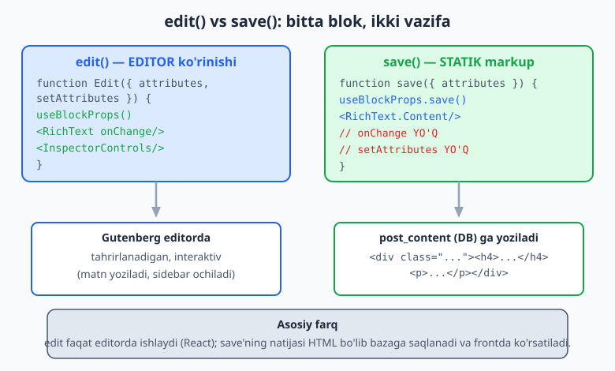
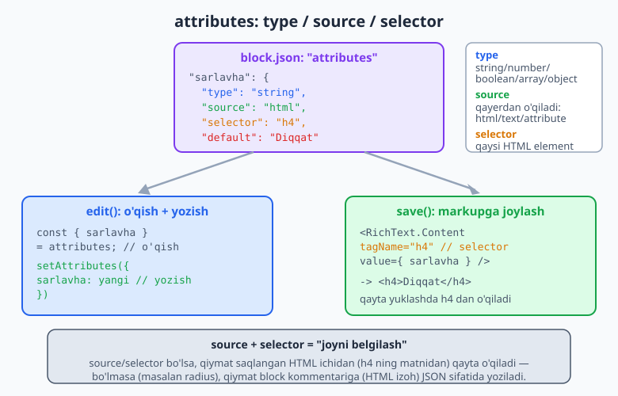
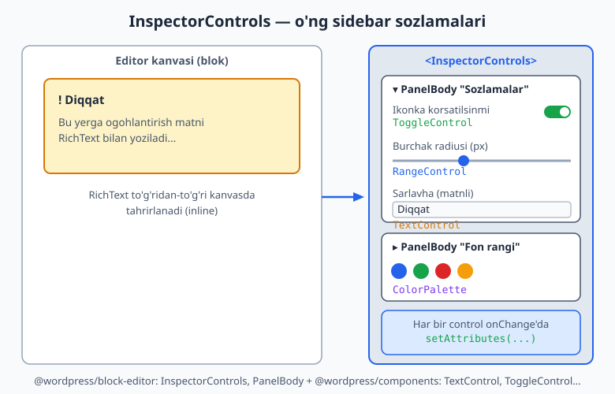

# 23 — Edit/Save, attributes va InspectorControls

[⬅️ Oldingi: 22 — Custom blok yaratish asoslari](./22-block-dev-asoslari.md) · [🏠 README](./README.md) · [Keyingi: 24 — Dinamik bloklar (render_callback) ➡️](./24-dinamik-bloklar.md)

> **Bu bobda:** 22-bobda blokni "qobiq" sifatida qurdik — endi unga jon kiritamiz. Blokning ikki yuragi bor: `edit` (editorda nima ko'rinadi va qanday tahrirlanadi) va `save` (frontga qanday HTML saqlanadi). Ular orasidagi ko'prik — **attributes** (blok ma'lumotlari). Biz `RichText` bilan matn tahrirlashni, `attributes` ni `block.json` da `type`/`source`/`selector` bilan e'lon qilishni, ularni `setAttributes` bilan yozishni, va o'ng sidebar'da `InspectorControls` orqali sozlamalar panelini (TextControl, ToggleControl, ColorPalette, RangeControl) qurishni o'rganamiz. Hamma kod haqiqiy `npx wp-scripts build` bilan (JSX transpilatsiyasi muvaffaqiyatli) tekshirilgan.

---

## edit va save: blokning ikki yuragi

22-bobda biz blok `block.json` bilan ro'yxatdan o'tishini va `index.js` da `registerBlockType` chaqirilishini ko'rdik. Endi shu `registerBlockType` ga beriladigan ikki funksiyaga chuqur kiramiz:

```js
registerBlockType( metadata.name, {
	edit: Edit,   // editorda ko'rinish (React komponent)
	save,         // frontga saqlanadigan HTML
} );
```

Ularni tushunish uchun bitta o'xshatish yetarli. Tasavvur qiling, blok — bu **xat yozish**:

- `edit` — bu **qog'oz va qalam**: siz xatni yozasiz, o'chirib qayta yozasiz, joylashtirishni o'zgartirasiz. Interaktiv, jonli.
- `save` — bu **konvert ichidagi tayyor xat**: yozib bo'lgach, uni muhrlaysiz. O'quvchi (frontend) faqat shu tayyor natijani ko'radi, qalamingizni emas.

Texnik tilda:

| | `edit` | `save` |
|---|--------|--------|
| **Qachon ishlaydi** | Faqat Gutenberg editorda | Saqlash paytida (bir marta) |
| **Nimani qaytaradi** | Tahrirlanadigan React UI | Statik HTML markup |
| **Interaktivlik** | Bor (onChange, sidebar) | Yo'q (faqat tayyor HTML) |
| **Natija qayerda** | Editor ekranida | `post_content` (bazada), keyin frontda |
| **`setAttributes`** | Bor | **Yo'q** (faqat o'qiydi) |



Eng muhim tushuncha shu: **`save` ning natijasi bazaga matn (HTML) sifatida saqlanadi.** Postni frontda ochganingizda WordPress JavaScript ishlatmaydi — u shunchaki saqlangan HTML'ni ko'rsatadi. Shuning uchun oddiy (statik) blok tez ishlaydi: front uchun React kerak emas. (Dinamik bloklar boshqacha — ular `save` o'rniga PHP `render_callback` ishlatadi, bu 24-bobning mavzusi.)

> **DIQQAT — eng ko'p uchraydigan boshlovchi xatosi:** `save` funksiyasini o'zgartirib, blokni qayta yuklasangiz, WordPress "Bu blok kutilmagan yoki yaroqsiz kontentni o'z ichiga oladi" (block validation) ogohlantirishini beradi. Sababi: bazadagi eski HTML endi yangi `save` chiqaradigan HTML'ga mos kelmaydi. Buni keyinroq (oxirgi bo'limda) `block.json` `version` va deprecation bilan qanday hal qilishni ko'ramiz.

---

## Loyiha bloki: "Ogohlantirish qutisi"

Butun bob davomida bitta amaliy blok quramiz: **ogohlantirish qutisi** (notice/callout) — sarlavha, matn, ixtiyoriy ikonka va sozlanadigan fon rangi bilan. Bu blok hamma asosiy tushunchani (RichText, attributes, InspectorControls, supports) bitta joyda ko'rsatadi.

Fayl strukturasi (22-bobdagidek `src/` papkada, `wp-scripts build` bilan quriladi):

```
ogohlantirish/
├── package.json
└── src/
    ├── block.json    <- metadata + attributes + supports
    ├── index.js      <- registerBlockType
    ├── edit.js       <- editor komponenti
    ├── save.js       <- frontga saqlash
    ├── style.scss    <- front + editor stil
    └── editor.scss   <- faqat editor stil
```

---

## RichText: tahrirlanadigan matn

Oddiy HTML'da matnni `<p>matn</p>` deb yozasiz. Lekin editorda foydalanuvchi matnni **bevosita** yozishi, qalin/kursiv qilishi kerak. Buning uchun `@wordpress/block-editor` dan keladigan `RichText` komponenti ishlatiladi.

```jsx
import { RichText, useBlockProps } from '@wordpress/block-editor';

export default function Edit( { attributes, setAttributes } ) {
	const { matn } = attributes;
	const blockProps = useBlockProps();

	return (
		<p { ...blockProps }>
			<RichText
				tagName="p"
				value={ matn }
				onChange={ ( yangi ) => setAttributes( { matn: yangi } ) }
				placeholder="Matn kiriting..."
			/>
		</p>
	);
}
```

`RichText` ning to'rt asosiy propi:

| Prop | Vazifasi |
|------|----------|
| `tagName` | Qaysi HTML teg yaratiladi (`p`, `h2`, `span`, `div`...) |
| `value` | Hozirgi matn — `attributes` dan keladi |
| `onChange` | Foydalanuvchi yozganda chaqiriladi — `setAttributes` bilan qiymatni saqlaymiz |
| `placeholder` | Bo'sh bo'lganda ko'rinadigan rangsiz ko'rsatma matn |

Bu yerda **bir tomonlama ma'lumot oqimi** (one-way data flow) deb ataladigan React tamoyili ishlaydi: `value` har doim `attributes` dan o'qiladi (haqiqat manbai — single source of truth), `onChange` esa o'sha manbani yangilaydi. Komponent o'zida holat (state) saqlamaydi — hamma narsa `attributes` da.

> **`useBlockProps()` nima?** Bu hook blokning tashqi elementiga WordPress kutadigan barcha atributlarni (class, `data-*`, tekislash, rang class'lari) qo'shadi. **Har bir blokning tashqi (root) elementiga** uni qo'llash **majburiy** — aks holda blok editorda to'g'ri tanlanmaydi va supports (rang, spacing) ishlamaydi.

### RichText'ni `save` da: `RichText.Content`

`edit` da `RichText` interaktiv komponentdir. `save` da esa bizga interaktivlik kerak emas — faqat tayyor HTML kerak. Shuning uchun `RichText.Content` ishlatiladi:

```jsx
import { RichText, useBlockProps } from '@wordpress/block-editor';

export default function save( { attributes } ) {
	const { matn } = attributes;
	const blockProps = useBlockProps.save();

	return (
		<p { ...blockProps }>
			<RichText.Content tagName="p" value={ matn } />
		</p>
	);
}
```

Ikki farqni yodda tuting:

1. `useBlockProps()` o'rniga **`useBlockProps.save()`** — `save` da har doim `.save()` variant.
2. `<RichText ... />` o'rniga **`<RichText.Content ... />`** — onChange yo'q, faqat `value` ni HTML'ga aylantiradi.

Agar `matn = "Salom <strong>dunyo</strong>"` bo'lsa, `save` quyidagini chiqaradi:

```html
<p class="...">Salom <strong>dunyo</strong></p>
```

---

## attributes: blokning xotirasi

Yuqorida `attributes.matn` ni ishlatdik — lekin u qayerdan keladi? Javob: `block.json` ning `attributes` bo'limidan. **Attributes — blok saqlaydigan barcha ma'lumotlar:** matn, ranglar, sonlar, true/false bayroqlar va h.k.

Har bir attribute to'rt mumkin bo'lgan maydonga ega:

| Maydon | Vazifasi | Misol |
|--------|----------|-------|
| `type` | Ma'lumot turi | `string`, `number`, `boolean`, `array`, `object` |
| `source` | Qiymat **qayerdan o'qiladi** (saqlangan HTML ichidan) | `html`, `text`, `attribute`, `query` |
| `selector` | Qaysi HTML element bilan ishlaymiz | `h4`, `p`, `img`, `a` |
| `default` | Boshlang'ich qiymat (hech narsa kiritilmaganda) | `"Diqqat"`, `true`, `8` |

```json
{
	"attributes": {
		"sarlavha": {
			"type": "string",
			"source": "html",
			"selector": "h4",
			"default": "Diqqat"
		},
		"matn": {
			"type": "string",
			"source": "html",
			"selector": "p"
		},
		"ikonkoYoq": {
			"type": "boolean",
			"default": true
		},
		"radius": {
			"type": "number",
			"default": 8
		}
	}
}
```



### `type` — ma'lumot turi

Bu eng oddiy maydon. JSON turlaridan biri: `string` (matn), `number` (son), `boolean` (true/false), `array` (ro'yxat), `object` (ob'ekt). `type` deyarli har doim majburiy.

### `source` va `selector` — qiymat qayerdan o'qiladi

Mana eng nozik tushuncha. WordPress attribute qiymatini ikki usuldan biri bilan saqlaydi:

**1-usul: `source` YO'Q (attribute block kommentariga yoziladi)**

Agar attribute'da `source` bo'lmasa (yuqorida `ikonkoYoq` va `radius`), WordPress qiymatni blok kommentari ichiga **JSON** sifatida yozadi:

```html
<!-- wp:kitob/ogohlantirish {"ikonkoYoq":true,"radius":8} -->
<div class="...">...</div>
<!-- /wp:kitob/ogohlantirish -->
```

**2-usul: `source` BOR (qiymat HTML ichidan o'qiladi)**

Agar `source: "html"` va `selector: "h4"` bersangiz (`sarlavha`), WordPress qiymatni **HTML markupning ichidan** — `h4` elementining ichidagi HTML'dan — o'qiydi. Kommentarda saqlanmaydi:

```html
<!-- wp:kitob/ogohlantirish -->
<div class="..."><h4>Diqqat</h4><p>Matn...</p></div>
<!-- /wp:kitob/ogohlantirish -->
```

Bu yerda `sarlavha` qiymati `<h4>` ning ichidan, `matn` esa `<p>` ning ichidan qayta o'qiladi.

`source` ning asosiy qiymatlari:

| `source` | Nimani o'qiydi | Tipik ishlatilishi |
|----------|----------------|--------------------|
| `html` | Element ichidagi to'liq HTML | RichText (qalin/kursiv saqlash kerak) |
| `text` | Element ichidagi faqat oddiy matn | HTML formatlashsiz matn |
| `attribute` | HTML atribut qiymati (qo'shimcha `attribute` kalitidan) | `img` ning `src`, `a` ning `href` |
| `query` | Bir nechta elementdan massiv | Ro'yxat (`li` elementlari) |

`source: "attribute"` misoli — rasm manzili:

```json
{
	"rasmUrl": {
		"type": "string",
		"source": "attribute",
		"selector": "img",
		"attribute": "src"
	}
}
```

Bu `img` elementining `src` atributidan qiymatni o'qiydi.

> **Qachon `source` ishlataman, qachon yo'q?** Oddiy qoida: agar qiymat **`save` markupining ichida ko'rinsa** (matn, sarlavha, rasm manzili) — `source`/`selector` bering, shunda u HTML'dan qayta o'qiladi va markup "haqiqat manbai" bo'ladi. Agar qiymat ko'rinmaydigan sozlama bo'lsa (true/false bayroq, raqamli radius, rang kodi) — `source` siz qoldiring, u kommentarda JSON sifatida saqlanadi.

### `default` — boshlang'ich qiymat

Blok birinchi qo'shilganda yoki qiymat hali kiritilmaganda ishlatiladigan qiymat. `default: "Diqqat"` bersangiz, yangi blokda sarlavha "Diqqat" bo'lib turadi.

---

## setAttributes: qiymatni yozish

`attributes` ni **o'qiy** olasiz, lekin to'g'ridan-to'g'ri **o'zgartira olmaysiz** (`attributes.matn = "..."` ishlamaydi — React tamoyili). O'zgartirish uchun WordPress beradigan `setAttributes` funksiyasi ishlatiladi:

```jsx
export default function Edit( { attributes, setAttributes } ) {
	const { matn } = attributes;

	// O'QISH: attributes dan
	// YOZISH: setAttributes bilan
	const yangileMatn = ( yangi ) => setAttributes( { matn: yangi } );
	// ...
}
```

`setAttributes` ob'ekt qabul qiladi — faqat o'zgargan kalitlarni berasiz, qolganlari tegmaydi:

```jsx
setAttributes( { matn: 'Yangi matn' } );          // faqat matn
setAttributes( { radius: 12, ikonkoYoq: false } ); // ikkita birdan
```

Bu — React'dagi `setState` ga o'xshaydi: u faqat ko'rsatilgan kalitlarni yangilaydi (qisman yangilash — merge), butun ob'ektni almashtirmaydi.

> **`save` da `setAttributes` YO'Q.** `save` funksiyasiga faqat `{ attributes }` keladi, `setAttributes` kelmaydi. Sababi aniq: `save` saqlash paytida bir marta ishlaydi, hech narsani o'zgartirmaydi — faqat hozirgi qiymatlardan HTML yasaydi.

---

## InspectorControls: o'ng sidebar sozlamalari

RichText kanvasda bevosita tahrirlash uchun yaxshi. Lekin ba'zi sozlamalar matn emas — masalan ikonka ko'rsatish/ko'rsatmaslik, fon rangi, burchak radiusi. Bularni kanvasga qo'ymaymiz; ular editor o'ng tomonidagi **sozlamalar panelida** (Settings sidebar) bo'lishi kerak.

Buning uchun `@wordpress/block-editor` dan `InspectorControls` komponentini ishlatamiz. Uning ichiga qo'ygan hamma narsa avtomatik o'ng sidebar'ga ko'chadi:

```jsx
import { InspectorControls, useBlockProps } from '@wordpress/block-editor';
import { PanelBody, ToggleControl } from '@wordpress/components';

export default function Edit( { attributes, setAttributes } ) {
	const { ikonkoYoq } = attributes;
	const blockProps = useBlockProps();

	return (
		<>
			<InspectorControls>
				<PanelBody title="Sozlamalar" initialOpen={ true }>
					<ToggleControl
						label="Ikonka korsatilsinmi"
						checked={ ikonkoYoq }
						onChange={ ( yangi ) => setAttributes( { ikonkoYoq: yangi } ) }
					/>
				</PanelBody>
			</InspectorControls>

			<div { ...blockProps }>
				{ /* kanvas ko'rinishi shu yerda */ }
			</div>
		</>
	);
}
```

E'tibor bering: `return` ichida **ikki narsa** bor — `InspectorControls` (sidebar) va `div` (kanvas). Ularni `<>...</>` (React Fragment) bilan o'rab beramiz, chunki funksiya bitta ildiz element qaytarishi kerak. `InspectorControls` ning o'zi kanvasda ko'rinmaydi — WordPress uni avtomatik sidebar'ga "ko'chiradi" (portal orqali).



### `PanelBody` — yig'iluvchi panel bo'limi

`@wordpress/components` dan keladigan `PanelBody` — sozlamalarni guruhlaydigan, ochiluvchi/yopiluvchi bo'lim:

- `title` — bo'lim sarlavhasi.
- `initialOpen` — boshda ochiq (`true`) yoki yopiq (`false`) bo'lishi.

Bir nechta `PanelBody` ishlatib, sozlamalarni mantiqiy guruhlarga bo'lasiz (masalan "Tarkib", "Ko'rinish", "Kengaytirilgan").

### `@wordpress/components` boshqaruvlari

`@wordpress/components` paketi tayyor, WordPress dizayniga mos UI komponentlar to'plamidir. Eng ko'p ishlatiladiganlari:

```jsx
import {
	PanelBody,
	TextControl,
	ToggleControl,
	RangeControl,
	ColorPalette,
} from '@wordpress/components';
```

| Komponent | Nima uchun | Asosiy proplar |
|-----------|-----------|----------------|
| `TextControl` | Matn kiritish maydoni | `label`, `value`, `onChange` |
| `ToggleControl` | Yoqish/o'chirish (true/false) | `label`, `checked`, `onChange` |
| `RangeControl` | Slayder (son tanlash) | `label`, `value`, `onChange`, `min`, `max` |
| `ColorPalette` | Rang tanlash palitra'si | `value`, `onChange` |
| `SelectControl` | Ochiluvchi ro'yxat | `label`, `value`, `options`, `onChange` |

Diqqat qiling: **`ToggleControl` `checked` propini ishlatadi** (boshqalar `value`). Bu tez-tez yangilanadigan xato — `value` bersangiz toggle ishlamaydi.

Har birining `onChange` i `setAttributes` bilan bog'lanadi:

```jsx
<TextControl
	label="Sarlavha"
	value={ sarlavha }
	onChange={ ( yangi ) => setAttributes( { sarlavha: yangi } ) }
/>

<RangeControl
	label="Burchak radiusi (px)"
	value={ radius }
	onChange={ ( yangi ) => setAttributes( { radius: yangi } ) }
	min={ 0 }
	max={ 32 }
/>

<ColorPalette
	value={ fonRangi }
	onChange={ ( yangi ) => setAttributes( { fonRangi: yangi } ) }
/>
```

> **Import nomlarini ixtiro qilmang.** Komponentlar aniq paketdan keladi: layout/RichText/InspectorControls/useBlockProps — `@wordpress/block-editor`; UI boshqaruvlar (TextControl, ToggleControl...) — `@wordpress/components`; `__()` tarjima — `@wordpress/i18n`; `registerBlockType` — `@wordpress/blocks`. `wp-scripts` bu importlarni avtomatik WordPress global'lariga (`wp.blockEditor`, `wp.components`...) aylantiradi — npm'dan bu paketlar yuklab olinmaydi, ular WordPress'da allaqachon bor.

---

## block supports: bepul UI

Ko'p sozlamalarni qo'lda yozish (rang uchun ColorPalette, padding uchun maydon...) zerikarli. WordPress qulay yo'l beradi: `block.json` ning `supports` bo'limi. Bitta `true` yozsangiz, WordPress mos sidebar boshqaruvini **avtomatik** qo'shadi — siz hech qanday JSX yozmaysiz.

```json
{
	"supports": {
		"html": false,
		"color": {
			"background": true,
			"text": true
		},
		"spacing": {
			"padding": true,
			"margin": true
		},
		"typography": {
			"fontSize": true,
			"lineHeight": true
		}
	}
}
```

Bu nima beradi:

| `supports` kaliti | Avtomatik qo'shiladigan UI |
|-------------------|----------------------------|
| `color.background` | Sidebar'da fon rangi tanlovi |
| `color.text` | Matn rangi tanlovi |
| `spacing.padding` | Ichki bo'shliq (padding) boshqaruvi |
| `spacing.margin` | Tashqi bo'shliq (margin) boshqaruvi |
| `typography.fontSize` | Shrift o'lchami tanlovi |
| `typography.lineHeight` | Qator balandligi |
| `align` | Tekislash (`["wide", "full"]`) |
| `html: false` | "HTML sifatida tahrirlash" tugmasini o'chiradi (custom blokda tavsiya etiladi) |

`supports` ning sehri: WordPress nafaqat UI'ni qo'shadi, balki tanlangan qiymatni **avtomatik saqlaydi va CSS class/style'ga aylantiradi** — siz `attributes` ham, qo'shimcha JSX ham yozmaysiz. Masalan foydalanuvchi fon rangini tanlasa, WordPress `has-{slug}-background-color` class'ini yoki inline style'ni o'zi qo'shadi.

> **Qachon `supports`, qachon o'z attribute'im?** Standart dizayn sozlamalari (rang, bo'shliq, shrift) uchun — har doim `supports`. Bu kamroq kod, WordPress standartlariga mos, theme.json bilan integratsiya qiladi. Faqat `supports` qoplamaydigan maxsus sozlama uchun (masalan bizning "ikonka ko'rsatilsinmi" bayrog'i) o'z attribute + InspectorControls yozasiz. Bizning blokda ikkalasini ham aralash ishlatamiz: rang/spacing/typography — `supports`; ikonka/radius/sarlavha — o'z attributes.

---

## To'liq, qurilgan blok

Mana yuqoridagi hamma tushunchani birlashtirgan to'liq blok. **Bu kod vaqtinchalik papkada `npx wp-scripts build` bilan haqiqatan qurildi — JSX muvaffaqiyatli transpilatsiya qilindi, `build/` papka hosil bo'ldi, `block.json` yaroqli JSON va barcha `@wordpress/*` importlari to'g'ri WordPress script handle'lariga (`wp-block-editor`, `wp-blocks`, `wp-components`, `wp-i18n`) bog'landi.**

### `src/block.json`

```json
{
	"$schema": "https://schemas.wp.org/trunk/block.json",
	"apiVersion": 3,
	"name": "kitob/ogohlantirish",
	"title": "Ogohlantirish qutisi",
	"category": "text",
	"icon": "warning",
	"description": "Sarlavha va matnli ogohlantirish qutisi.",
	"keywords": ["ogohlantirish", "notice", "callout"],
	"textdomain": "kitob",
	"attributes": {
		"sarlavha": {
			"type": "string",
			"source": "html",
			"selector": "h4",
			"default": "Diqqat"
		},
		"matn": {
			"type": "string",
			"source": "html",
			"selector": "p"
		},
		"ikonkoYoq": { "type": "boolean", "default": true },
		"fonRangi": { "type": "string", "default": "#fef3c7" },
		"radius": { "type": "number", "default": 8 }
	},
	"supports": {
		"html": false,
		"color": { "background": true, "text": true },
		"spacing": { "padding": true, "margin": true },
		"typography": { "fontSize": true, "lineHeight": true }
	},
	"editorScript": "file:./index.js",
	"editorStyle": "file:./index.css",
	"style": "file:./style-index.css"
}
```

### `src/edit.js`

```jsx
import { __ } from '@wordpress/i18n';
import {
	useBlockProps,
	RichText,
	InspectorControls,
} from '@wordpress/block-editor';
import {
	PanelBody,
	TextControl,
	ToggleControl,
	RangeControl,
	ColorPalette,
} from '@wordpress/components';

export default function Edit( { attributes, setAttributes } ) {
	const { sarlavha, matn, ikonkoYoq, fonRangi, radius } = attributes;

	const blockProps = useBlockProps( {
		className: 'kitob-ogohlantirish',
		style: {
			backgroundColor: fonRangi,
			borderRadius: radius + 'px',
		},
	} );

	return (
		<>
			<InspectorControls>
				<PanelBody title={ __( 'Ogohlantirish sozlamalari', 'kitob' ) } initialOpen={ true }>
					<ToggleControl
						label={ __( 'Ikonka korsatilsinmi', 'kitob' ) }
						checked={ ikonkoYoq }
						onChange={ ( yangi ) => setAttributes( { ikonkoYoq: yangi } ) }
					/>
					<RangeControl
						label={ __( 'Burchak radiusi (px)', 'kitob' ) }
						value={ radius }
						onChange={ ( yangi ) => setAttributes( { radius: yangi } ) }
						min={ 0 }
						max={ 32 }
					/>
					<TextControl
						label={ __( 'Sarlavha (matnli)', 'kitob' ) }
						value={ sarlavha }
						onChange={ ( yangi ) => setAttributes( { sarlavha: yangi } ) }
					/>
				</PanelBody>
				<PanelBody title={ __( 'Fon rangi', 'kitob' ) } initialOpen={ false }>
					<ColorPalette
						value={ fonRangi }
						onChange={ ( yangi ) => setAttributes( { fonRangi: yangi } ) }
					/>
				</PanelBody>
			</InspectorControls>

			<div { ...blockProps }>
				{ ikonkoYoq && <span className="kitob-ogohlantirish__ikonka">!</span> }
				<RichText
					tagName="h4"
					value={ sarlavha }
					onChange={ ( yangi ) => setAttributes( { sarlavha: yangi } ) }
					placeholder={ __( 'Sarlavha kiriting...', 'kitob' ) }
				/>
				<RichText
					tagName="p"
					value={ matn }
					onChange={ ( yangi ) => setAttributes( { matn: yangi } ) }
					placeholder={ __( 'Matn kiriting...', 'kitob' ) }
				/>
			</div>
		</>
	);
}
```

### `src/save.js`

```jsx
import { useBlockProps, RichText } from '@wordpress/block-editor';

export default function save( { attributes } ) {
	const { sarlavha, matn, ikonkoYoq, fonRangi, radius } = attributes;

	const blockProps = useBlockProps.save( {
		className: 'kitob-ogohlantirish',
		style: {
			backgroundColor: fonRangi,
			borderRadius: radius + 'px',
		},
	} );

	return (
		<div { ...blockProps }>
			{ ikonkoYoq && <span className="kitob-ogohlantirish__ikonka">!</span> }
			<RichText.Content tagName="h4" value={ sarlavha } />
			<RichText.Content tagName="p" value={ matn } />
		</div>
	);
}
```

### `src/index.js`

```jsx
import { registerBlockType } from '@wordpress/blocks';
import metadata from './block.json';
import Edit from './edit';
import save from './save';
import './style.scss';
import './editor.scss';

registerBlockType( metadata.name, {
	edit: Edit,
	save,
} );
```

E'tibor bering: `edit` va `save` **bir xil** kanvas markupini chiqaradi (`div` > ikonka + h4 + p). Bu **edit/save mosligi** qoidasi — `save` chiqaradigan HTML editor ko'rsatadigan strukturaga mos bo'lishi kerak, aks holda block validation xatosi chiqadi.

---

## edit/save mosligi va block validation

Eng ko'p og'riq beradigan mavzu — qachon "Bu blok yaroqsiz kontentni o'z ichiga oladi" xatosi chiqadi va nima qilish kerak.

**Nima sodir bo'ladi:** WordPress postni ochganda, bazadagi saqlangan HTML'ni hozirgi `save` funksiyasi chiqaradigan HTML bilan **solishtiradi**. Agar ular bir xil bo'lmasa — validation xatosi.

**Eng tipik sabab:** siz `save` funksiyasini o'zgartirdingiz (masalan `<div>` ni `<section>` qildingiz yoki bitta class qo'shdingiz), lekin bazada eski markupli postlar bor. Endi ular mos kelmaydi.

Yechimlar:

1. **Yangi blok (hali post yo'q):** muammo yo'q — shunchaki yangi `save` ishlatiladi.
2. **Mavjud postlar bor — `deprecated` ishlatish:** eski `save` variantini `deprecated` massiviga qo'shasiz, shunda WordPress eski markupni ham taniydi va avtomatik yangisiga o'tkazadi:

```jsx
registerBlockType( metadata.name, {
	edit: Edit,
	save,
	deprecated: [
		{
			attributes: metadata.attributes,
			save: function eskiSave( { attributes } ) {
				// eski markup (avvalgi versiya)
				return <div>{ /* ... */ }</div>;
			},
		},
	],
} );
```

3. **Vaqtinchalik (dev paytida):** postni qaytadan saqlash yoki "Recover" tugmasini bosish.

> **Maslahat:** blok ommaga chiqib, real postlarda ishlatilgach, `save` ni o'zgartirsangiz — **doim `deprecated` qo'shing.** Aks holda foydalanuvchilarning postlari "buziladi". Yangi loyihada esa erkin o'zgartiring.

---

## Tez-tez uchraydigan xatolar

1. **`useBlockProps()` ni unutish.** Root elementga `{ ...blockProps }` qo'ymasangiz, blok editorda to'g'ri tanlanmaydi va `supports` (rang, spacing) ishlamaydi.
2. **`save` da `useBlockProps()` ishlatish** (`.save()` o'rniga). `save` da har doim `useBlockProps.save()`.
3. **`RichText` ni `save` da ishlatish** (`RichText.Content` o'rniga). `save` da onChange bo'lmaydi — faqat `RichText.Content`.
4. **`attributes` ni to'g'ridan-to'g'ri o'zgartirish.** `attributes.matn = "..."` ishlamaydi — har doim `setAttributes({ matn: ... })`.
5. **`ToggleControl` ga `value` berish.** U `checked` ishlatadi, `value` emas.
6. **Import paketini adashtirish.** `RichText`/`InspectorControls` — `@wordpress/block-editor`; `TextControl`/`PanelBody` — `@wordpress/components`. Aralashtirsangiz, build xato beradi.
7. **edit va save markupi mos kelmasligi.** Ikkalasi bir xil struktura chiqarishi kerak (yoki `deprecated` qo'shing) — aks holda validation xatosi.
8. **`source`/`selector` ni noto'g'ri ishlatish.** `selector` saqlangan HTML'dagi haqiqiy element bo'lishi kerak. `selector: "h4"` desangiz, `save` da `h4` chiqishi shart, aks holda qiymat qayta o'qilmaydi.

---

## Mashqlar

### Oson

1. **Yangi attribute qo'shing.** `block.json` ga `string` turli `tugmaMatni` attribute qo'shing (`default: "Batafsil"`). JSON yaroqli bo'lsin.
2. **RichText sarlavhasi.** `edit` da `tagName="h3"` bilan `sarlavha` attribute'ini tahrirlaydigan `RichText` yozing (`value`, `onChange`, `placeholder` bilan).
3. **save'da RichText.Content.** 2-mashqdagi sarlavhaning `save` variantini yozing — `RichText.Content` bilan `h3` chiqsin.
4. **ToggleControl qo'shing.** `ikonkoYoq` (boolean) attribute uchun InspectorControls ichida `ToggleControl` yozing (`checked` va `onChange` to'g'ri).

### O'rta

5. **`source`/`selector` belgilang.** `matn` attribute'ini `source: "html"`, `selector: "p"` bilan e'lon qiling va `save` da mos `<p>` chiqaring. Nega `source` qo'shganimizni bir jumlada izohlang.
6. **RangeControl bilan son.** `chegaraQalinligi` (number, `default: 2`) attribute qo'shing va InspectorControls'da `RangeControl` (`min: 0`, `max: 10`) bilan boshqaring.
7. **ColorPalette bilan rang.** `fonRangi` attribute uchun PanelBody ichida `ColorPalette` qo'ying. `edit` va `save` da `style.backgroundColor` ga shu qiymatni bering.
8. **block supports yoqing.** `block.json` ga `supports` qo'shing: `color.background`, `spacing.padding`, `typography.fontSize`. Har biri qaysi UI'ni qo'shishini izohlang.

### Qiyin

9. **To'liq edit funksiya.** `sarlavha` (RichText), `matn` (RichText) va InspectorControls'da `ToggleControl` + `RangeControl` bo'lgan to'liq `edit` yozing. `useBlockProps` root'da bo'lsin.
10. **Mos `save` funksiya.** 9-mashqning `save` variantini yozing — markup `edit` kanvasiga mos bo'lsin (`useBlockProps.save`, `RichText.Content`). Nega ular mos bo'lishi kerakligini izohlang.
11. **`source: "attribute"`.** Rasmli blok uchun `rasmUrl` attribute'ini `source: "attribute"`, `selector: "img"`, `attribute: "src"` bilan e'lon qiling. Bu nimani qiladi — tushuntiring.
12. **deprecated bilan migratsiya.** `save` ni `<div>` dan `<section>` ga o'zgartirdingiz deb tasavvur qiling. Eski postlar buzilmasligi uchun `registerBlockType` ga `deprecated` qanday qo'shilishini yozing.
13. **supports + custom attribute aralash.** Bitta blokda: rang/spacing — `supports` orqali (`block.json`), ikonka ko'rsatish — o'z attribute + `ToggleControl` orqali boshqarilsin. Qaysi sozlama qaysi yo'l bilan kelishini izohlang.
14. **SelectControl bilan variant.** `daraja` attribute (`string`, `default: "info"`) qo'shing va InspectorControls'da `SelectControl` bilan uchta variant (`info`, `ogohlantirish`, `xato`) tanlash imkonini bering.

---

## Yechimlar

<details markdown="1">
<summary>Yechim — 1</summary>

```json
{
	"attributes": {
		"tugmaMatni": {
			"type": "string",
			"default": "Batafsil"
		}
	}
}
```

`type: "string"` — matn turi. `source` yo'q, demak qiymat blok kommentariga JSON sifatida saqlanadi. `default: "Batafsil"` — yangi blokda boshlang'ich qiymat.

</details>

<details markdown="1">
<summary>Yechim — 2</summary>

```jsx
import { RichText } from '@wordpress/block-editor';

// edit ichida:
<RichText
	tagName="h3"
	value={ sarlavha }
	onChange={ ( yangi ) => setAttributes( { sarlavha: yangi } ) }
	placeholder="Sarlavha kiriting..."
/>
```

`value` har doim `attributes` dan o'qiladi (haqiqat manbai), `onChange` esa `setAttributes` bilan uni yangilaydi — bu bir tomonlama ma'lumot oqimi.

</details>

<details markdown="1">
<summary>Yechim — 3</summary>

```jsx
import { RichText } from '@wordpress/block-editor';

// save ichida:
<RichText.Content tagName="h3" value={ sarlavha } />
```

`save` da interaktivlik yo'q — `RichText` o'rniga `RichText.Content`, `onChange` ham yo'q. Bu `<h3>` ichiga `sarlavha` ning HTML'ini joylaydi (qalin/kursiv formatlash saqlanadi).

</details>

<details markdown="1">
<summary>Yechim — 4</summary>

```jsx
import { InspectorControls } from '@wordpress/block-editor';
import { PanelBody, ToggleControl } from '@wordpress/components';

<InspectorControls>
	<PanelBody title="Sozlamalar" initialOpen={ true }>
		<ToggleControl
			label="Ikonka korsatilsinmi"
			checked={ ikonkoYoq }
			onChange={ ( yangi ) => setAttributes( { ikonkoYoq: yangi } ) }
		/>
	</PanelBody>
</InspectorControls>
```

`ToggleControl` boolean qiymatni boshqaradi — `checked` (NE `value`) propini ishlatadi. `onChange` to'g'ridan-to'g'ri true/false beradi.

</details>

<details markdown="1">
<summary>Yechim — 5</summary>

```json
{
	"attributes": {
		"matn": {
			"type": "string",
			"source": "html",
			"selector": "p"
		}
	}
}
```

```jsx
// save ichida:
<RichText.Content tagName="p" value={ matn } />
```

**Nega `source`:** `matn` qiymati `save` markupining ichida (`<p>` da) ko'rinadi. `source: "html"` + `selector: "p"` bilan WordPress qiymatni shu `<p>` ning ichidan qayta o'qiydi — markup haqiqat manbai bo'ladi, kommentar shishmaydi.

</details>

<details markdown="1">
<summary>Yechim — 6</summary>

```json
{
	"chegaraQalinligi": { "type": "number", "default": 2 }
}
```

```jsx
import { RangeControl } from '@wordpress/components';

<RangeControl
	label="Chegara qalinligi (px)"
	value={ chegaraQalinligi }
	onChange={ ( yangi ) => setAttributes( { chegaraQalinligi: yangi } ) }
	min={ 0 }
	max={ 10 }
/>
```

`type: "number"` — son. `RangeControl` slayder ko'rinishida son tanlatadi; `min`/`max` chegaralarni belgilaydi. `onChange` to'g'ridan-to'g'ri sonni beradi.

</details>

<details markdown="1">
<summary>Yechim — 7</summary>

```json
{
	"fonRangi": { "type": "string", "default": "#fef3c7" }
}
```

```jsx
import { InspectorControls } from '@wordpress/block-editor';
import { PanelBody, ColorPalette } from '@wordpress/components';

// InspectorControls ichida:
<PanelBody title="Fon rangi">
	<ColorPalette
		value={ fonRangi }
		onChange={ ( yangi ) => setAttributes( { fonRangi: yangi } ) }
	/>
</PanelBody>
```

```jsx
// edit VA save da root elementga:
style={ { backgroundColor: fonRangi } }
```

`ColorPalette` `value`/`onChange` ishlatadi. Qiymat `edit` va `save` da bir xil `style.backgroundColor` ga berilishi kerak — shunda editor va front bir xil ko'rinadi.

</details>

<details markdown="1">
<summary>Yechim — 8</summary>

```json
{
	"supports": {
		"color": { "background": true },
		"spacing": { "padding": true },
		"typography": { "fontSize": true }
	}
}
```

Har biri avtomatik sidebar UI qo'shadi:
- `color.background` -> fon rangi tanlovi (qo'shimcha JSX yozmasdan).
- `spacing.padding` -> ichki bo'shliq (padding) boshqaruvi.
- `typography.fontSize` -> shrift o'lchami tanlovi.

WordPress tanlangan qiymatni avtomatik saqlaydi va CSS class/style'ga aylantiradi — o'z attribute kerak emas.

</details>

<details markdown="1">
<summary>Yechim — 9</summary>

```jsx
import {
	useBlockProps,
	RichText,
	InspectorControls,
} from '@wordpress/block-editor';
import { PanelBody, ToggleControl, RangeControl } from '@wordpress/components';

export default function Edit( { attributes, setAttributes } ) {
	const { sarlavha, matn, ikonkoYoq, radius } = attributes;
	const blockProps = useBlockProps( {
		style: { borderRadius: radius + 'px' },
	} );

	return (
		<>
			<InspectorControls>
				<PanelBody title="Sozlamalar" initialOpen={ true }>
					<ToggleControl
						label="Ikonka korsatilsinmi"
						checked={ ikonkoYoq }
						onChange={ ( yangi ) => setAttributes( { ikonkoYoq: yangi } ) }
					/>
					<RangeControl
						label="Burchak radiusi (px)"
						value={ radius }
						onChange={ ( yangi ) => setAttributes( { radius: yangi } ) }
						min={ 0 }
						max={ 32 }
					/>
				</PanelBody>
			</InspectorControls>

			<div { ...blockProps }>
				{ ikonkoYoq && <span className="ikonka">!</span> }
				<RichText
					tagName="h4"
					value={ sarlavha }
					onChange={ ( yangi ) => setAttributes( { sarlavha: yangi } ) }
					placeholder="Sarlavha..."
				/>
				<RichText
					tagName="p"
					value={ matn }
					onChange={ ( yangi ) => setAttributes( { matn: yangi } ) }
					placeholder="Matn..."
				/>
			</div>
		</>
	);
}
```

`<>...</>` (Fragment) bilan `InspectorControls` va kanvas `div` birga qaytariladi. `useBlockProps` root `div` ga qo'llangan. Har bir boshqaruv `setAttributes` bilan bog'langan.

</details>

<details markdown="1">
<summary>Yechim — 10</summary>

```jsx
import { useBlockProps, RichText } from '@wordpress/block-editor';

export default function save( { attributes } ) {
	const { sarlavha, matn, ikonkoYoq, radius } = attributes;
	const blockProps = useBlockProps.save( {
		style: { borderRadius: radius + 'px' },
	} );

	return (
		<div { ...blockProps }>
			{ ikonkoYoq && <span className="ikonka">!</span> }
			<RichText.Content tagName="h4" value={ sarlavha } />
			<RichText.Content tagName="p" value={ matn } />
		</div>
	);
}
```

**Nega mos bo'lishi kerak:** WordPress postni ochganda, bazadagi saqlangan HTML'ni hozirgi `save` chiqaradigan HTML bilan solishtiradi. Agar struktura (`div` > ikonka + h4 + p) `edit` kanvasiga mos kelmasa, "yaroqsiz kontent" (block validation) xatosi chiqadi. Shuning uchun `edit` va `save` bir xil markup yaratadi.

</details>

<details markdown="1">
<summary>Yechim — 11</summary>

```json
{
	"rasmUrl": {
		"type": "string",
		"source": "attribute",
		"selector": "img",
		"attribute": "src"
	}
}
```

**Bu nima qiladi:** `source: "attribute"` qiymatni element ichidagi matndan emas, balki **HTML atributidan** o'qiydi. `selector: "img"` — qaysi element (``), `attribute: "src"` — qaysi atribut. Ya'ni WordPress saqlangan markupdagi `` dan `src` qiymatini qayta o'qiydi. Bu rasm/havola bloklarida (`img` `src`, `a` `href`) ishlatiladi.

</details>

<details markdown="1">
<summary>Yechim — 12</summary>

```jsx
import { registerBlockType } from '@wordpress/blocks';
import metadata from './block.json';
import Edit from './edit';
import save from './save';   // YANGI: <section> chiqaradi

registerBlockType( metadata.name, {
	edit: Edit,
	save,
	deprecated: [
		{
			attributes: metadata.attributes,
			save: function eskiSave( { attributes } ) {
				// ESKI markup: <div> ishlatardi
				const blockProps = useBlockProps.save();
				return <div { ...blockProps }>{ /* eski tarkib */ }</div>;
			},
		},
	],
} );
```

`deprecated` massivi eski `save` variantlarini saqlaydi. WordPress postni ochganda avval hozirgi `save` (`<section>`) bilan solishtiradi; mos kelmasa, `deprecated` dagi eski `save` (`<div>`) bilan urinadi. Mos kelsa — eski markupni avtomatik yangisiga o'tkazadi (migratsiya), foydalanuvchi postlari buzilmaydi.

</details>

<details markdown="1">
<summary>Yechim — 13</summary>

`block.json` (rang/spacing — supports):

```json
{
	"attributes": {
		"ikonkoYoq": { "type": "boolean", "default": true }
	},
	"supports": {
		"color": { "background": true, "text": true },
		"spacing": { "padding": true }
	}
}
```

`edit` (ikonka — custom attribute + ToggleControl):

```jsx
<InspectorControls>
	<PanelBody title="Sozlamalar">
		<ToggleControl
			label="Ikonka korsatilsinmi"
			checked={ ikonkoYoq }
			onChange={ ( yangi ) => setAttributes( { ikonkoYoq: yangi } ) }
		/>
	</PanelBody>
</InspectorControls>
```

**Tushuntirish:**
- **Rang va padding** — `supports` orqali keladi. WordPress UI'ni, attribute'ni va CSS'ni avtomatik boshqaradi — qo'shimcha JSX yozmaymiz.
- **Ikonka ko'rsatish** — `supports` qoplamaydigan maxsus mantiq. Shuning uchun o'z `ikonkoYoq` attribute + `ToggleControl` yozamiz va `edit`/`save` da `{ ikonkoYoq && <span>...</span> }` bilan shartli render qilamiz.

Qoida: standart dizayn sozlamalari — `supports`; maxsus, blokka xos mantiq — o'z attribute.

</details>

<details markdown="1">
<summary>Yechim — 14</summary>

```json
{
	"daraja": { "type": "string", "default": "info" }
}
```

```jsx
import { SelectControl } from '@wordpress/components';

<SelectControl
	label="Daraja"
	value={ daraja }
	options={ [
		{ label: 'Ma\'lumot', value: 'info' },
		{ label: 'Ogohlantirish', value: 'ogohlantirish' },
		{ label: 'Xato', value: 'xato' },
	] }
	onChange={ ( yangi ) => setAttributes( { daraja: yangi } ) }
/>
```

`SelectControl` ochiluvchi ro'yxat beradi. `options` — har biri `label` (ko'rinadigan) va `value` (saqlanadigan) bo'lgan massiv. `value` joriy tanlovni `attributes` dan o'qiydi, `onChange` esa `setAttributes` bilan yangilaydi. Tanlangan `daraja` ni `edit`/`save` da CSS class sifatida ishlatish mumkin (masalan `is-${daraja}`).

</details>

---

[⬅️ Oldingi: 22 — Custom blok yaratish asoslari](./22-block-dev-asoslari.md) · [🏠 README](./README.md) · [Keyingi: 24 — Dinamik bloklar (render_callback) ➡️](./24-dinamik-bloklar.md)
