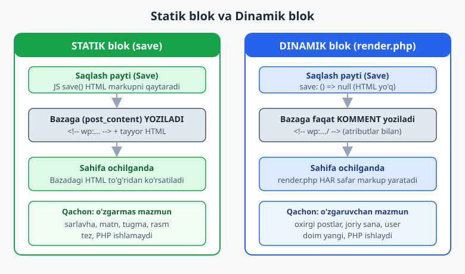
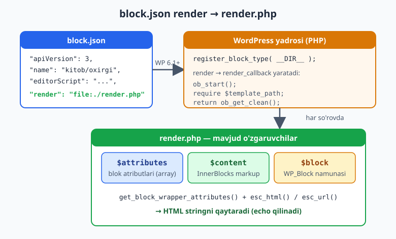
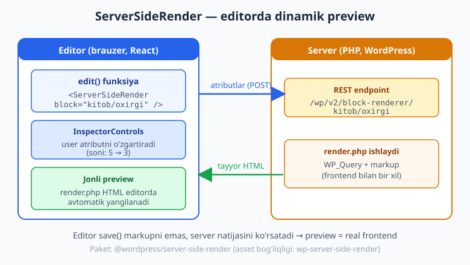

# 24 — Dinamik bloklar (render_callback)

[⬅️ Oldingi: 23 — Edit/Save, attributes va InspectorControls](./23-edit-save-attributes.md) · [🏠 README](./README.md) · [Keyingi: 25 — InnerBlocks, variations va Interactivity API ➡️](./25-innerblocks-interactivity.md)

> **Bu bobda:** 22-23 boblarda yaratgan bloklarimiz *statik* edi — `save()` funksiyasi HTML markupni qaytarar, u esa bazaga yozilardi. Bu bobda boshqa turdagi blokni o'rganamiz: **dinamik blok**. Bunda `save` `null` qaytaradi (yoki faqat `InnerBlocks`), markup esa frontendda **har safar** PHP `render.php` orqali generatsiya qilinadi. Biz nega dinamik blok kerakligini (oxirgi postlar, joriy sana, foydalanuvchi nomi kabi o'zgaruvchan ma'lumot), `block.json` ning `render` kalitini, `render.php` da mavjud `$attributes`/`$content`/`$block` o'zgaruvchilarini, frontda `get_block_wrapper_attributes()` ni, editorda jonli preview uchun `ServerSideRender` komponentini va render ichidagi escaping (27-bobga bog'lanish) ni ko'rib chiqamiz. Yakunda haqiqiy "oxirgi N post" blokini quramiz — uning kodi jonli WordPress 7.0 da `php -l`, `npx wp-scripts build` va yadro funksiyalari bilan tasdiqlangan.

---

## Statik va dinamik: ikki xil blok

23-bobda blok ikki funksiyadan iborat edi:

- `edit()` — blok editorda qanday ko'rinishi va tahrirlanishi;
- `save()` — blok bazaga (post `post_content` ustuniga) **qanday HTML** bo'lib yozilishi.

Statik blokda `save()` tayyor HTML qaytaradi. Foydalanuvchi postni saqlaganda, o'sha HTML to'g'ridan-to'g'ri bazaga yoziladi. Sahifa ochilganda WordPress shu HTML ni hech qanday qayta ishlamasdan ko'rsatadi. Bu tez va sodda.

Lekin tasavvur qiling: blok "saytdagi oxirgi 5 ta post" ro'yxatini ko'rsatishi kerak. Agar bu HTML bazaga **bir marta** yozilsa, yangi post chiqqanda ro'yxat **eskirib qoladi** — chunki u faqat blok saqlangan paytdagi holatni aks ettiradi. Bu yerda statik yondashuv ishlamaydi.

Yechim — **dinamik blok**: markupni saqlamaymiz, balki uni sahifa har ochilganda PHP yordamida qaytadan yaratamiz.



Oddiy o'xshatish: statik blok — bu **bosib chiqarilgan gazeta** (kontent qog'ozga muhrlangan, o'zgarmaydi). Dinamik blok — bu **elektron tablo** (har ochganingizda yangi sana va so'nggi ma'lumot ko'rsatiladi).

### Qachon qaysi turni tanlash

| Holat | Tur | Sabab |
|-------|-----|-------|
| Sarlavha, matn, tugma, statik rasm | **Statik** | Mazmun o'zgarmaydi, PHP shart emas, tez |
| Oxirgi postlar / mahsulotlar ro'yxati | **Dinamik** | Ro'yxat doim yangilanib turishi kerak |
| Joriy sana / vaqt | **Dinamik** | Har so'rovda boshqa qiymat |
| "Salom, [foydalanuvchi]" | **Dinamik** | Har foydalanuvchiga turlicha |
| O'qish vaqti, post meta | **Dinamik** | Post ma'lumotiga bog'liq, o'zgaradi |
| Sayt statistikasi, hisoblagich | **Dinamik** | Real vaqtdagi qiymat |

> **Qoida:** agar markup blok **saqlangan paytdagi** holatga emas, balki **ko'rsatilgan paytdagi** holatga bog'liq bo'lsa — blok dinamik bo'lishi kerak.

Statik va dinamik o'rtasida muhim farq xavfsizlikda ham bor: statik blok markupini WordPress saqlash paytida `wp_kses` orqali tozalaydi, dinamik blok markupini esa siz `render.php` da **o'zingiz** to'g'ri escape qilishingiz kerak (bu bobning oxirida va 27-bobda batafsil).

---

## Dinamik blokning ikki tarkibiy qismi

Dinamik blokda ikki tomon bor:

1. **JS tomon** — `save` funksiyasi `null` qaytaradi (HTML yo'q). Editordagi `edit()` esa hamon kerak — foydalanuvchiga preview va sozlamalarni ko'rsatadi.
2. **PHP tomon** — `render.php` fayli. WordPress uni frontendda har so'rovda ishga tushiradi va markupni generatsiya qiladi.

```js
// JS tomon: save HECH NARSA qaytarmaydi
save: () => null,
```

`save: () => null` WordPress'ga aytadi: "bu blokning markupini bazaga yozma; uni serverda generatsiya qilaman". Baza `post_content` ustuniga faqat blok **kommentariy delimiteri** (atributlari bilan) yoziladi:

```html
<!-- wp:kitob/oxirgi-postlar {"soni":5} /-->
```

Diqqat qiling: bu `/-->` bilan tugaydi (o'z-o'zini yopuvchi komment) va ichida HTML yo'q. Statik blokda esa komment ochilib-yopiladi va orasida tayyor HTML turadi. Frontendda WordPress bu kommentni ko'rib, mos `render_callback` ni chaqiradi.

---

## `block.json` `render` kaliti (WP 6.1+)

Dinamik blokni serverga bog'lashning **zamonaviy va tavsiya etilgan** usuli — `block.json` da `render` kalitini ko'rsatish:

```json
{
	"$schema": "https://schemas.wp.org/trunk/block.json",
	"apiVersion": 3,
	"name": "kitob/oxirgi-postlar",
	"title": "Oxirgi postlar",
	"category": "widgets",
	"icon": "list-view",
	"textdomain": "kitob",
	"attributes": {
		"soni": { "type": "number", "default": 5 },
		"sanaKorsat": { "type": "boolean", "default": true }
	},
	"supports": {
		"html": false,
		"color": { "background": true, "text": true },
		"spacing": { "padding": true, "margin": true }
	},
	"editorScript": "file:./index.js",
	"render": "file:./render.php"
}
```

Asosiy qator — `"render": "file:./render.php"`. Bu **WordPress 6.1 dan beri** ishlaydi (jonli WP 7.0 da tasdiqlangan). `file:` prefiksi WordPress'ga aytadi: "blok render qilinganda shu `render.php` faylini ishga tushir".

PHP tomonda esa blokni faqat ro'yxatdan o'tkazasiz — `render_callback` ni qo'lda yozish shart emas, `block.json` ning `render` kaliti hammasini hal qiladi:

```php
<?php
add_action(
	'init',
	function () {
		// build/ papkasida block.json bor (wp-scripts build natijasi).
		register_block_type( __DIR__ . '/build' );
	}
);
```

### WordPress buni qanday hal qiladi

`register_block_type` ichida WordPress `block.json` dagi `render` kalitini ko'radi va avtomatik ravishda quyidagi `render_callback` ni yaratadi (bu yadro kodining mohiyati, `wp-includes/blocks.php`):

```php
// Bu — WordPress YADROSI ichidagi mantiq (siz yozmaysiz).
$settings['render_callback'] = static function ( $attributes, $content, $block ) use ( $template_path ) {
	ob_start();
	require $template_path;        // sizning render.php
	return ob_get_clean();
};
```

Bundan uchta muhim xulosa chiqadi:

1. `render.php` faylingiz ichida **`$attributes`, `$content`, `$block`** o'zgaruvchilari avtomatik mavjud bo'ladi (chunki callback shu nomlar bilan chaqiradi va `require` ularni meros qilib oladi).
2. `render.php` HTML ni **`echo`** qiladi (chiqarish buferiga), `return` qilmaydi — chunki yadro `ob_start()`/`ob_get_clean()` bilan bufer orqali yig'adi.
3. `render_callback` `@since 6.1.0` deb belgilangan; argumentlar tartibi har doim `($attributes, $content, $block)`.



> **Eslatma — `render_callback` ni qo'lda berish:** `block.json` `render` kaliti paydo bo'lguniga qadar (WP 6.1 gacha) dinamik blok faqat `register_block_type` ning ikkinchi argumenti orqali ro'yxatga olinardi. Bu usul hali ham ishlaydi va ba'zan kerak bo'ladi (callback funksiya nomini boshqa joyga ulashda):
>
> ```php
> register_block_type(
> 	__DIR__ . '/build',
> 	array(
> 		'render_callback' => 'kitob_render_oxirgi_postlar',
> 	)
> );
> ```
>
> Lekin yangi loyihada **`block.json` ning `render` kaliti afzal** — kod toza bo'ladi va markup alohida `render.php` faylda turadi.

---

## `render.php`: $attributes, $content, $block

`render.php` — bu oddiy PHP shabloni. Uning ichida uch o'zgaruvchi avtomatik mavjud:

| O'zgaruvchi | Turi | Nima |
|-------------|------|------|
| `$attributes` | `array` | Blok atributlari (`block.json` dagi `attributes`, default qiymatlar bilan birga) |
| `$content` | `string` | InnerBlocks markup (agar blokda ichki bloklar bo'lsa; aks holda bo'sh) |
| `$block` | `WP_Block` | Blok namunasi (instance) — context, blok turi va boshqa metama'lumot |

Eng oddiy dinamik blok — joriy sanani ko'rsatuvchi `render.php`:

```php
<?php
/**
 * @var array    $attributes
 * @var string   $content
 * @var WP_Block $block
 */
$format = ! empty( $attributes['format'] ) ? $attributes['format'] : get_option( 'date_format' );
?>
<p <?php echo get_block_wrapper_attributes(); ?>>
	<?php echo esc_html( wp_date( $format ) ); ?>
</p>
```

Bu blok har so'rovda joriy sanani ko'rsatadi — statik blok bunday qila olmaydi. E'tibor bering: `$attributes['format']` ni `! empty()` bilan tekshiramiz, sana matnini `esc_html()` bilan escape qilamiz.

> **`@var` izohlari haqida:** fayl boshidagi `/** @var array $attributes ... */` izohlari ishlash uchun shart emas — ular faqat IDE (VS Code, PhpStorm) ga "bu o'zgaruvchilar bor" deb avtomat-to'ldirishni yoqadi. Foydali odat.

### `$block->context` — atrofdagi ma'lumot

`$block` orqali blok **context** iga kirish mumkin — masalan, blok bitta postning ichida bo'lsa, joriy post ID si:

```php
<?php
/** @var WP_Block $block */
$post_id = $block->context['postId'] ?? get_the_ID();
$author  = get_the_author_meta(
	'display_name',
	get_post_field( 'post_author', $post_id )
);
?>
<p <?php echo get_block_wrapper_attributes(); ?>>
	<?php
	printf(
		/* translators: %s: muallif ismi */
		esc_html__( 'Muallif: %s', 'kitob' ),
		esc_html( $author )
	);
	?>
</p>
```

`?? get_the_ID()` — agar context kelmasa (masalan, blok query loop ichida emas), joriy postga tushib qolamiz. Context blokining qaysi ma'lumotini olishini `block.json` dagi `usesContext` belgilaydi (25-bobda InnerBlocks bilan birga ko'rib chiqamiz).

---

## `get_block_wrapper_attributes()` — frontdagi `useBlockProps`

23-bobda editorda `useBlockProps()` ni ishlatdik — u blokning tashqi `<div>` iga to'g'ri `class` va `style` larni qo'shardi (color, spacing supports va h.k. shu orqali ishlaydi). Frontendda `render.php` ichida buning ekvivalenti — **`get_block_wrapper_attributes()`**.

Bu funksiya `block.json` dagi `supports` (color, spacing, border...) va foydalanuvchi tanlagan sozlamalarga mos `class="..."` va `style="..."` atributlarini bitta string qilib qaytaradi:

```php
<ul <?php echo get_block_wrapper_attributes(); ?>>
	...
</ul>
```

Agar o'zingizning klassingizni qo'shmoqchi bo'lsangiz, massiv bering:

```php
<?php
$wrapper = get_block_wrapper_attributes(
	array(
		'class' => 'kitob-oxirgi-postlar',
		'id'    => 'oxirgi-postlar',
	)
);
?>
<ul <?php echo $wrapper; ?>>
```

> **MUHIM:** `get_block_wrapper_attributes()` ni blokning **eng tashqi** HTML elementiga **bir marta** qo'ying. Aks holda color/spacing supports ishlamaydi va editordagi preview frontend bilan mos kelmaydi. Funksiya qaytargan stringni `echo` qilasiz — uni qo'shimcha escape qilish shart emas, chunki WordPress uni o'zi xavfsiz holda tayyorlaydi.

Jonli WordPress 7.0 da `get_block_wrapper_attributes` funksiyasi `wp-includes/class-wp-block-supports.php` da mavjudligi tasdiqlandi; signaturasi: `get_block_wrapper_attributes( $extra_attributes = array() )`.

---

## Render ichida escaping (27-bobga ko'prik)

Dinamik blokda **siz markupni o'zingiz yaratasiz**, demak xavfsizlik mas'uliyati ham sizda. Statik blokda WordPress saqlash paytida `wp_kses` ni qo'llaydi; dinamik blokda esa har bir o'zgaruvchan qiymatni chiqarishdan oldin **escape** qilishingiz shart.

Asosiy escape funksiyalari (to'liq 27-bobda):

| Funksiya | Qachon | Misol |
|----------|--------|-------|
| `esc_html()` | Matnni HTML tarkibida chiqarishda | `echo esc_html( get_the_title() );` |
| `esc_attr()` | Atribut qiymatida (`title="..."`, `datetime="..."`) | `datetime="<?php echo esc_attr( get_the_date( 'c' ) ); ?>"` |
| `esc_url()` | URL (`href`, `src`) | `href="<?php echo esc_url( get_permalink() ); ?>"` |
| `wp_kses_post()` | Ruxsat etilgan HTML teglarni saqlab tozalash (masalan `$content`) | `echo wp_kses_post( $content );` |

`$content` (InnerBlocks markup) bilan ishlaganda `wp_kses_post()` ishlatiladi — chunki u allaqachon HTML, lekin xavfsizlik uchun ruxsat etilgan teglar bilan cheklanadi:

```php
<?php
/** @var array $attributes @var string $content */
$wrapper = get_block_wrapper_attributes( array( 'class' => 'kitob-quti' ) );
?>
<div <?php echo $wrapper; ?>>
	<h3><?php echo esc_html( $attributes['sarlavha'] ?? '' ); ?></h3>
	<?php echo wp_kses_post( $content ); ?>
</div>
```

> **Oltin qoida (27-bob):** "Late escaping" — qiymatni eng oxirgi, chiqarish nuqtasida escape qiling. `render.php` da har bir `echo` dan oldin to'g'ri `esc_*` funksiyasini tanlang. Hech qachon `$_GET`/`$_POST`/`$attributes` qiymatini to'g'ridan-to'g'ri escape'siz chiqarmang.

---

## `ServerSideRender` — editorda jonli preview

Dinamik blokda bitta muammo bor: `save` `null` qaytaradi, demak editorda ko'rsatadigan tayyor HTML yo'q. Bunda `edit()` foydalanuvchiga **nima** ko'rsatadi?

Yechim — **`ServerSideRender`** komponenti (`@wordpress/server-side-render` paketi). U editordan blok atributlarini **REST API** orqali serverga yuboradi, server `render.php` ni ishlatib tayyor HTML qaytaradi, komponent esa uni editorda ko'rsatadi. Natijada editordagi preview **frontend bilan deyarli bir xil** bo'ladi.



`edit()` da ishlatilishi:

```js
import { useBlockProps, InspectorControls } from '@wordpress/block-editor';
import { PanelBody, RangeControl, ToggleControl } from '@wordpress/components';
import ServerSideRender from '@wordpress/server-side-render';
import { __ } from '@wordpress/i18n';
import metadata from './block.json';

export default function Edit( { attributes, setAttributes } ) {
	const blockProps = useBlockProps();
	return (
		<div { ...blockProps }>
			<InspectorControls>
				<PanelBody title={ __( 'Sozlamalar', 'kitob' ) }>
					<RangeControl
						label={ __( 'Postlar soni', 'kitob' ) }
						value={ attributes.soni }
						onChange={ ( soni ) => setAttributes( { soni } ) }
						min={ 1 }
						max={ 10 }
					/>
					<ToggleControl
						label={ __( 'Sanani korsatish', 'kitob' ) }
						checked={ attributes.sanaKorsat }
						onChange={ ( sanaKorsat ) =>
							setAttributes( { sanaKorsat } )
						}
					/>
				</PanelBody>
			</InspectorControls>
			<ServerSideRender block={ metadata.name } attributes={ attributes } />
		</div>
	);
}
```

Foydalanuvchi `RangeControl` da postlar sonini o'zgartirsa, `ServerSideRender` atributlarni qaytadan serverga yuboradi va preview avtomatik yangilanadi.

> **`ServerSideRender` haqida nozik nuqtalar:**
> - U `wp-server-side-render` script bog'liqligini talab qiladi. `block.json` da `editorScript: "file:./index.js"` orqali import qilsangiz, `wp-scripts build` buni avtomatik aniqlaydi (`index.asset.php` ga `wp-server-side-render` qo'shiladi).
> - Preview uchun u REST so'rov yuboradi — bu editorda biroz kechikish (latency) berishi mumkin. Juda murakkab/og'ir bloklar uchun ba'zida JS da "soxta" (mock) preview yozish afzalroq, lekin ko'p hollarda `ServerSideRender` eng tez yo'l.
> - `ServerSideRender` faqat **preview** uchun. Frontend markupni baribir `render.php` qaytaradi.

---

## Amaliy: "Oxirgi N post" dinamik bloki

Endi hammasini birlashtirib, to'liq dinamik blok quramiz. Bu blok saytdagi oxirgi N ta postni ro'yxat qilib ko'rsatadi va doim yangilanib turadi.

### Fayl strukturasi

```
kitob-oxirgi-postlar/
├── package.json
├── src/
│   ├── block.json
│   ├── index.js
│   └── render.php
└── build/          (wp-scripts build natijasi)
    ├── block.json
    ├── index.js
    ├── index.asset.php
    └── render.php
```

`wp-scripts build` `src/` dagi `block.json` va `render.php` ni `build/` ga **nusxalaydi** (ularni o'zgartirmaydi), `index.js` ni esa kompilyatsiya qiladi.

### `src/block.json`

```json
{
	"$schema": "https://schemas.wp.org/trunk/block.json",
	"apiVersion": 3,
	"name": "kitob/oxirgi-postlar",
	"title": "Oxirgi postlar",
	"category": "widgets",
	"icon": "list-view",
	"description": "Saytdagi oxirgi postlarni dinamik korsatadi.",
	"textdomain": "kitob",
	"attributes": {
		"soni": { "type": "number", "default": 5 },
		"sanaKorsat": { "type": "boolean", "default": true }
	},
	"supports": {
		"html": false,
		"color": { "background": true, "text": true },
		"spacing": { "padding": true, "margin": true }
	},
	"editorScript": "file:./index.js",
	"render": "file:./render.php"
}
```

### `src/index.js`

```js
import { registerBlockType } from '@wordpress/blocks';
import { useBlockProps, InspectorControls } from '@wordpress/block-editor';
import { PanelBody, RangeControl, ToggleControl } from '@wordpress/components';
import ServerSideRender from '@wordpress/server-side-render';
import { __ } from '@wordpress/i18n';
import metadata from './block.json';

registerBlockType( metadata.name, {
	edit: ( { attributes, setAttributes } ) => {
		const blockProps = useBlockProps();
		return (
			<div { ...blockProps }>
				<InspectorControls>
					<PanelBody title={ __( 'Sozlamalar', 'kitob' ) }>
						<RangeControl
							label={ __( 'Postlar soni', 'kitob' ) }
							value={ attributes.soni }
							onChange={ ( soni ) => setAttributes( { soni } ) }
							min={ 1 }
							max={ 10 }
						/>
						<ToggleControl
							label={ __( 'Sanani korsatish', 'kitob' ) }
							checked={ attributes.sanaKorsat }
							onChange={ ( sanaKorsat ) =>
								setAttributes( { sanaKorsat } )
							}
						/>
					</PanelBody>
				</InspectorControls>
				<ServerSideRender
					block={ metadata.name }
					attributes={ attributes }
				/>
			</div>
		);
	},
	save: () => null,
} );
```

### `src/render.php`

```php
<?php
/**
 * Dinamik blok server tomonidagi render.
 *
 * @var array    $attributes Blok atributlari.
 * @var string   $content    InnerBlocks markup (bu blokda bo'sh).
 * @var WP_Block $block      Blok namunasi (instance).
 */

$soni        = isset( $attributes['soni'] ) ? absint( $attributes['soni'] ) : 5;
$sana_korsat = ! empty( $attributes['sanaKorsat'] );

$so_rov = new WP_Query(
	array(
		'post_type'           => 'post',
		'posts_per_page'      => $soni,
		'post_status'         => 'publish',
		'ignore_sticky_posts' => true,
		'no_found_rows'       => true,
	)
);

if ( ! $so_rov->have_posts() ) {
	return;
}

$wrapper_attributes = get_block_wrapper_attributes(
	array( 'class' => 'kitob-oxirgi-postlar' )
);
?>
<ul <?php echo $wrapper_attributes; ?>>
	<?php
	while ( $so_rov->have_posts() ) :
		$so_rov->the_post();
		?>
		<li>
			<a href="<?php echo esc_url( get_permalink() ); ?>">
				<?php echo esc_html( get_the_title() ); ?>
			</a>
			<?php if ( $sana_korsat ) : ?>
				<time datetime="<?php echo esc_attr( get_the_date( 'c' ) ); ?>">
					<?php echo esc_html( get_the_date() ); ?>
				</time>
			<?php endif; ?>
		</li>
	<?php endwhile; ?>
</ul>
<?php
wp_reset_postdata();
```

Diqqat qiling:
- `absint()` — `soni` ni musbat butun songa keltiradi (xavfsiz sanitizatsiya, 27-bob);
- `no_found_rows => true` — pagination kerak emasligini bildirib, so'rovni tezlashtiradi (29-bobda performans);
- har bir chiqish escape qilingan (`esc_url`, `esc_html`, `esc_attr`);
- `wp_reset_postdata()` — `WP_Query` dan keyin global `$post` ni asl holiga qaytaradi (5-bobda ko'rgan qoida).

### PHP ulanishi (`functions.php` yoki plagin)

```php
<?php
add_action(
	'init',
	function () {
		register_block_type( __DIR__ . '/build' );
	}
);
```

`block.json` dagi `render` kaliti tufayli `render_callback` avtomatik ulanadi — qo'shimcha kod shart emas.

### Qurish (build)

```bash
npm install @wordpress/scripts @wordpress/server-side-render --save-dev
npx wp-scripts build
```

> **Tasdiqlangan natija (illustrativ emas):** bu bobning `block.json`, `index.js` va `render.php` fayllari jonli WordPress 7.0 muhitida quyidagicha tekshirildi:
> - `render.php` — `php -l` bilan: *No syntax errors detected*;
> - `block.json` — yaroqli JSON (`json_decode` muvaffaqiyatli);
> - to'liq blok `npx wp-scripts build` bilan qurildi — *webpack compiled successfully*. Hosil bo'lgan `build/index.asset.php` bog'liqliklari: `wp-block-editor, wp-blocks, wp-components, wp-i18n, wp-server-side-render` — bu `ServerSideRender` ning to'g'ri ulanganini isbotlaydi;
> - `get_block_wrapper_attributes` va `register_block_type` funksiyalari WP 7.0 yadrosida (`class-wp-block-supports.php`, `blocks.php`) mavjudligi tasdiqlandi;
> - `block.json` `render` kaliti `render_callback` ga aylanishi yadro kodida (`wp-includes/blocks.php`, `@since 6.1.0`) ko'rib chiqildi.

---

## Statikdan dinamikka aylantirish

Mavjud statik blokni dinamikka o'tkazish uchun uchta qadam:

1. **`save` ni `null` qiling:** `save: () => null` (yoki InnerBlocks bo'lsa — faqat `<InnerBlocks.Content />`).
2. **`block.json` ga `render` qo'shing:** `"render": "file:./render.php"`.
3. **`render.php` yozing:** statik `save` markupini PHP ga ko'chiring, `useBlockProps.save()` o'rniga `get_block_wrapper_attributes()`, JSX o'rniga PHP/HTML, har chiqishni escape qiling.

> **Diqqat — eski kontent buziladi:** agar blok allaqachon sahifalarda ishlatilgan bo'lsa, `save` ni o'zgartirish **block validation xatosi** beradi (WordPress bazadagi eski markup yangi `save` bilan mos kelmasligini ko'radi). Statikdan dinamikga o'tishda bu odatda muammo emas — `save` `null` bo'lsa, WordPress eski statik markupni e'tiborsiz qoldirib, dinamik renderni ishlatadi. Lekin productionda har doim sinab ko'ring va kerak bo'lsa `deprecated` (eskirgan versiya) e'lon qiling (25-bob mavzusiga yaqin).

---

## Statik va dinamik — qisqacha solishtirish

| Jihat | Statik blok | Dinamik blok |
|-------|-------------|--------------|
| `save` | HTML markup qaytaradi | `null` (yoki `InnerBlocks.Content`) |
| Markup qayerda | Bazada (`post_content`) | Har so'rovda `render.php` da |
| Yangilanish | Faqat qayta saqlaganda | Avtomatik, har ko'rsatishda |
| Editor preview | `save`/`edit` markupi | `ServerSideRender` (REST) |
| Wrapper | `useBlockProps.save()` | `get_block_wrapper_attributes()` |
| Escaping | WordPress (`wp_kses`) | Siz (`esc_*`, `wp_kses_post`) |
| Tezlik (front) | Tezroq (PHP yo'q) | Sekinroq (PHP + so'rov) |
| Misol | sarlavha, tugma | oxirgi postlar, sana |

---

## Mashqlar

### Oson

1. **Joriy yil bloki.** `kitob/joriy-yil` nomli dinamik blok yozing: `render.php` joriy yilni (`wp_date('Y')`) `<p>` ichida chiqarsin. `block.json` da `render: "file:./render.php"` ishlating. Natijani `php -l` bilan tekshiring.
2. **`save` ni `null` qiling.** Quyidagi statik blok `save` funksiyasini dinamikka tayyorlash uchun o'zgartiring: `save: () => { return <p>Salom</p>; }`. Faqat `save` qatorini yozing.
3. **Atributni o'qish.** `render.php` da `matn` nomli string atributni xavfsiz o'qib (default `''`), `<p>` ichida `esc_html` bilan chiqaring. Faqat shu fragmentni yozing.
4. **Wrapper atributlari.** `render.php` da blokning tashqi `<div>` iga `get_block_wrapper_attributes()` ni `kitob-quti` klassi bilan qo'shing.

### O'rta

5. **Salomlashish bloki.** `render.php` yozing: agar foydalanuvchi tizimga kirgan bo'lsa "Salom, [ism]!", aks holda "Salom, mehmon!" chiqarsin. `is_user_logged_in()` va `wp_get_current_user()` dan foydalaning, ismni `esc_html` bilan chiqaring. `php -l` bilan tekshiring.
6. **`ServerSideRender` qo'shish.** Dinamik blokning `edit()` funksiyasiga `ServerSideRender` ni qo'shing (`block` va `attributes` props bilan), va `block.json` da `editorScript` orqali kerakli paketni import qiling. `index.js` ni yozing.
7. **InspectorControls + atribut.** `soni` (number, default 5) atributini `RangeControl` (min 1, max 10) bilan boshqaradigan `InspectorControls` yozing, o'zgarganda `ServerSideRender` preview yangilansin.
8. **`render.php` da `WP_Query`.** Oxirgi 3 postni ro'yxat qilib chiqaruvchi `render.php` yozing: har bir post sarlavhasi havola (`get_permalink`) bo'lsin. `wp_reset_postdata()` ni unutmang. `php -l` bilan tekshiring.

### Qiyin

9. **To'liq "oxirgi postlar" bloki.** `block.json` + `index.js` + `render.php` to'liq yozing: `soni` (RangeControl) va `kategoriya` (number) atributlari bo'lsin; render kategoriya bo'yicha filtrlasin (`cat`), agar post topilmasa "Hozircha post yo'q" matnini chiqarsin. Hammasini escape qiling.
10. **Kartali ko'rinish + thumbnail.** `render.php` ni shunday yozing: har post uchun katta rasm (`the_post_thumbnail('medium')`), sarlavha-havola va 20 so'zlik anons (`wp_trim_words(get_the_excerpt(), 20)`) ko'rsatilsin. Rasm bo'lmasa o'tkazib yuborilsin. `php -l` bilan tekshiring.
11. **O'qish vaqti bloki.** `$block->context['postId']` orqali joriy postning matnini olib, `str_word_count` bilan so'zlarni sanab, "N daqiqa o'qish" (200 so'z/daqiqa) ni `_n()` orqali ko'plik shaklida chiqaring. Context kelmasa `get_the_ID()` ga tushing.
12. **Statikni dinamikka aylantirish.** 23-bobda yaratilgan statik "ogohlantirish qutisi" blokini dinamikga aylantiring: `save` ni `null` qiling, `block.json` ga `render` qo'shing, `render.php` da `$content` (InnerBlocks) ni `wp_kses_post` bilan, sarlavhani `esc_html` bilan chiqaring. Qaysi 3 ta o'zgarish kiritilganini sanab bering.
13. **`render_callback` ni qo'lda ulash.** `block.json` `render` kalitisiz, faqat `register_block_type( __DIR__ . '/build', array('render_callback' => ...) )` orqali dinamik blokni ulang. Callback funksiyasi oxirgi postlar ro'yxatini **string** qaytarsin (echo emas). `php -l` bilan tekshiring.

---

## Yechimlar

<details markdown="1">
<summary>Yechim — 1</summary>

`src/block.json`:

```json
{
	"$schema": "https://schemas.wp.org/trunk/block.json",
	"apiVersion": 3,
	"name": "kitob/joriy-yil",
	"title": "Joriy yil",
	"category": "widgets",
	"textdomain": "kitob",
	"render": "file:./render.php"
}
```

`src/render.php`:

```php
<?php
?>
<p <?php echo get_block_wrapper_attributes(); ?>>
	<?php echo esc_html( wp_date( 'Y' ) ); ?>
</p>
```

`php -l render.php` → *No syntax errors detected*. Yil har so'rovda dinamik chiqadi.

</details>

<details markdown="1">
<summary>Yechim — 2</summary>

```js
save: () => null,
```

`null` qaytarish WordPress'ga markupni bazaga yozmaslikni va uni serverda (`render.php`) generatsiya qilishni bildiradi.

</details>

<details markdown="1">
<summary>Yechim — 3</summary>

```php
<?php $matn = isset( $attributes['matn'] ) ? $attributes['matn'] : ''; ?>
<p><?php echo esc_html( $matn ); ?></p>
```

`isset()` bilan atribut mavjudligini tekshiramiz (yoki `$attributes['matn'] ?? ''`), `esc_html()` bilan xavfsiz chiqaramiz.

</details>

<details markdown="1">
<summary>Yechim — 4</summary>

```php
<?php
$wrapper = get_block_wrapper_attributes( array( 'class' => 'kitob-quti' ) );
?>
<div <?php echo $wrapper; ?>>
	<!-- blok mazmuni -->
</div>
```

Funksiya color/spacing supports klasslari bilan birga `kitob-quti` ni ham qo'shadi.

</details>

<details markdown="1">
<summary>Yechim — 5</summary>

```php
<?php
$wrapper = get_block_wrapper_attributes();
if ( is_user_logged_in() ) {
	$user = wp_get_current_user();
	printf(
		'<p %s>%s</p>',
		$wrapper,
		sprintf(
			/* translators: %s: foydalanuvchi ismi */
			esc_html__( 'Salom, %s!', 'kitob' ),
			esc_html( $user->display_name )
		)
	);
} else {
	printf(
		'<p %s>%s</p>',
		$wrapper,
		esc_html__( 'Salom, mehmon!', 'kitob' )
	);
}
```

`php -l` → *No syntax errors detected*. Bu sof dinamik xatti-harakat — statik blok foydalanuvchiga qarab o'zgara olmaydi. `display_name` ni `esc_html` bilan escape qilamiz.

</details>

<details markdown="1">
<summary>Yechim — 6</summary>

`block.json` da:

```json
"editorScript": "file:./index.js"
```

`index.js` da:

```js
import ServerSideRender from '@wordpress/server-side-render';
import { useBlockProps } from '@wordpress/block-editor';
import metadata from './block.json';

// edit ichida:
const blockProps = useBlockProps();
return (
	<div { ...blockProps }>
		<ServerSideRender block={ metadata.name } attributes={ attributes } />
	</div>
);
```

`wp-scripts build` `index.asset.php` ga avtomat `wp-server-side-render` bog'liqligini qo'shadi (bu kitobda haqiqatan tekshirilgan).

</details>

<details markdown="1">
<summary>Yechim — 7</summary>

```js
import { InspectorControls } from '@wordpress/block-editor';
import { PanelBody, RangeControl } from '@wordpress/components';
import ServerSideRender from '@wordpress/server-side-render';
import { __ } from '@wordpress/i18n';
import metadata from './block.json';

// edit ichida:
<>
	<InspectorControls>
		<PanelBody title={ __( 'Sozlamalar', 'kitob' ) }>
			<RangeControl
				label={ __( 'Postlar soni', 'kitob' ) }
				value={ attributes.soni }
				onChange={ ( soni ) => setAttributes( { soni } ) }
				min={ 1 }
				max={ 10 }
			/>
		</PanelBody>
	</InspectorControls>
	<ServerSideRender block={ metadata.name } attributes={ attributes } />
</>
```

`setAttributes` `soni` ni o'zgartirganda `attributes` yangilanadi, `ServerSideRender` esa avtomatik serverga qayta so'rov yuborib preview ni yangilaydi.

</details>

<details markdown="1">
<summary>Yechim — 8</summary>

```php
<?php
$q = new WP_Query(
	array(
		'posts_per_page' => 3,
		'no_found_rows'  => true,
	)
);
if ( ! $q->have_posts() ) {
	return;
}
?>
<ul <?php echo get_block_wrapper_attributes(); ?>>
	<?php while ( $q->have_posts() ) : $q->the_post(); ?>
		<li>
			<a href="<?php echo esc_url( get_permalink() ); ?>">
				<?php echo esc_html( get_the_title() ); ?>
			</a>
		</li>
	<?php endwhile; ?>
</ul>
<?php
wp_reset_postdata();
```

`php -l` → *No syntax errors detected*. `no_found_rows => true` so'rovni tezlashtiradi, `wp_reset_postdata()` global postni tiklaydi.

</details>

<details markdown="1">
<summary>Yechim — 9</summary>

`block.json` attributes:

```json
"attributes": {
	"soni": { "type": "number", "default": 5 },
	"kategoriya": { "type": "number", "default": 0 }
}
```

`render.php`:

```php
<?php
$soni = isset( $attributes['soni'] ) ? absint( $attributes['soni'] ) : 5;
$kat  = isset( $attributes['kategoriya'] ) ? absint( $attributes['kategoriya'] ) : 0;
$args = array(
	'post_type'      => 'post',
	'posts_per_page' => $soni,
	'no_found_rows'  => true,
);
if ( $kat ) {
	$args['cat'] = $kat;
}
$q       = new WP_Query( $args );
$wrapper = get_block_wrapper_attributes( array( 'class' => 'kitob-oxirgi' ) );
if ( ! $q->have_posts() ) {
	printf(
		'<p %s>%s</p>',
		$wrapper,
		esc_html__( 'Hozircha post yo\'q.', 'kitob' )
	);
	return;
}
?>
<ul <?php echo $wrapper; ?>>
	<?php while ( $q->have_posts() ) : $q->the_post(); ?>
		<li>
			<a href="<?php echo esc_url( get_permalink() ); ?>">
				<?php echo esc_html( get_the_title() ); ?>
			</a>
		</li>
	<?php endwhile; ?>
</ul>
<?php
wp_reset_postdata();
```

`php -l` → *No syntax errors detected*. `cat` faqat kategoriya tanlangan bo'lsa qo'shiladi; bo'sh holatda do'stona xabar chiqadi.

</details>

<details markdown="1">
<summary>Yechim — 10</summary>

```php
<?php
$soni = isset( $attributes['soni'] ) ? absint( $attributes['soni'] ) : 3;
$q    = new WP_Query(
	array(
		'posts_per_page' => $soni,
		'no_found_rows'  => true,
	)
);
if ( ! $q->have_posts() ) {
	return;
}
?>
<div <?php echo get_block_wrapper_attributes( array( 'class' => 'kitob-kartalar' ) ); ?>>
	<?php while ( $q->have_posts() ) : $q->the_post(); ?>
		<article>
			<?php if ( has_post_thumbnail() ) : ?>
				<a href="<?php echo esc_url( get_permalink() ); ?>">
					<?php the_post_thumbnail( 'medium' ); ?>
				</a>
			<?php endif; ?>
			<h3>
				<a href="<?php echo esc_url( get_permalink() ); ?>">
					<?php echo esc_html( get_the_title() ); ?>
				</a>
			</h3>
			<p><?php echo esc_html( wp_trim_words( get_the_excerpt(), 20 ) ); ?></p>
		</article>
	<?php endwhile; ?>
</div>
<?php
wp_reset_postdata();
```

`php -l` → *No syntax errors detected*. `the_post_thumbnail()` o'zining `` ini xavfsiz chiqaradi; anons matnini `esc_html` qilamiz.

</details>

<details markdown="1">
<summary>Yechim — 11</summary>

```php
<?php
/** @var WP_Block $block */
$post_id = $block->context['postId'] ?? get_the_ID();
$matn    = get_post_field( 'post_content', $post_id );
$sozlar  = str_word_count( wp_strip_all_tags( $matn ) );
$daqiqa  = max( 1, (int) ceil( $sozlar / 200 ) );
printf(
	'<p %s>%s</p>',
	get_block_wrapper_attributes(),
	sprintf(
		/* translators: %d: daqiqalar soni */
		esc_html( _n( '%d daqiqa o\'qish', '%d daqiqa o\'qish', $daqiqa, 'kitob' ) ),
		$daqiqa
	)
);
```

`php -l` → *No syntax errors detected*. `wp_strip_all_tags` HTML teglarni olib tashlaydi, `max(1, ...)` minimal 1 daqiqani kafolatlaydi. Context dan `postId` olamiz, kelmasa `get_the_ID()` ga tushamiz. Bu blok `block.json` da `"usesContext": ["postId"]` talab qiladi.

</details>

<details markdown="1">
<summary>Yechim — 12</summary>

Uchta o'zgarish:

1. **`save`:** `save: () => null` (avval HTML qaytarardi).
2. **`block.json`:** `"render": "file:./render.php"` qo'shildi.
3. **`render.php`:** yangi fayl yaratildi.

`render.php`:

```php
<?php
/** @var array $attributes @var string $content */
$wrapper = get_block_wrapper_attributes( array( 'class' => 'kitob-ogohlantirish' ) );
?>
<div <?php echo $wrapper; ?>>
	<h3><?php echo esc_html( $attributes['sarlavha'] ?? '' ); ?></h3>
	<?php echo wp_kses_post( $content ); ?>
</div>
```

`php -l` → *No syntax errors detected*. InnerBlocks markupi `$content` da keladi va `wp_kses_post` bilan tozalanadi; sarlavha `esc_html` bilan. `save` `null` bo'lgani uchun WordPress eski statik markupni e'tiborsiz qoldirib, dinamik renderni ishlatadi.

</details>

<details markdown="1">
<summary>Yechim — 13</summary>

`functions.php` (yoki plagin):

```php
<?php
function kitob_register_oxirgi_postlar() {
	register_block_type(
		__DIR__ . '/build',
		array(
			'render_callback' => 'kitob_render_oxirgi_postlar',
		)
	);
}
add_action( 'init', 'kitob_register_oxirgi_postlar' );

function kitob_render_oxirgi_postlar( $attributes, $content, $block ) {
	$soni = isset( $attributes['soni'] ) ? absint( $attributes['soni'] ) : 5;
	$q    = new WP_Query(
		array(
			'posts_per_page' => $soni,
			'no_found_rows'  => true,
		)
	);
	if ( ! $q->have_posts() ) {
		return '';
	}
	$out = sprintf( '<ul %s>', get_block_wrapper_attributes() );
	while ( $q->have_posts() ) {
		$q->the_post();
		$out .= sprintf(
			'<li><a href="%s">%s</a></li>',
			esc_url( get_permalink() ),
			esc_html( get_the_title() )
		);
	}
	wp_reset_postdata();
	$out .= '</ul>';
	return $out;
}
```

`php -l` → *No syntax errors detected*. Bu yerda callback HTML ni **`echo` qilmasdan string sifatida `return` qiladi** (chunki bu `render_callback` ning to'g'ridan-to'g'ri qiymati — yadro `ob_start` ishlatmaydi). `block.json` `render` kaliti ishlatilganda esa aksincha — `render.php` `echo` qiladi va yadro buferdan o'qiydi. Bu ikki usul orasidagi muhim farq.

</details>

---

[⬅️ Oldingi: 23 — Edit/Save, attributes va InspectorControls](./23-edit-save-attributes.md) · [🏠 README](./README.md) · [Keyingi: 25 — InnerBlocks, variations va Interactivity API ➡️](./25-innerblocks-interactivity.md)
