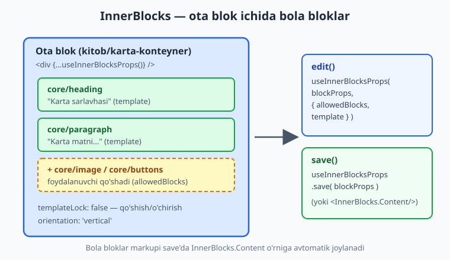
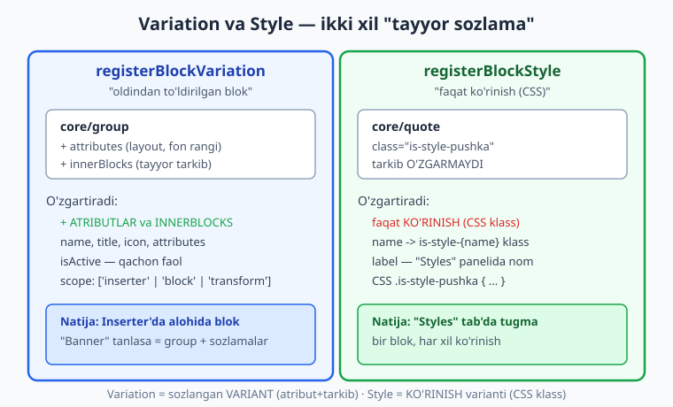
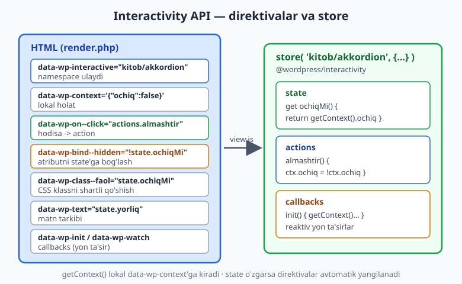

# 25 — InnerBlocks, variations va Interactivity API

[⬅️ Oldingi: 24 — Dinamik bloklar (render_callback)](./24-dinamik-bloklar.md) · [🏠 README](./README.md) · [Keyingi: 26 — WooCommerce tema integratsiyasi ➡️](./26-woocommerce-tema.md)

> **Bu bobda:** 22-24 boblarda yakka bloklar yaratdik. Endi bloklarni bir-biriga ulashni va ularga harakat berishni o'rganamiz. Avval **InnerBlocks** — blok ichida boshqa bloklarni joylashtirish (`allowedBlocks`, `template`, `templateLock`, `orientation`, hamda zamonaviy `useInnerBlocksProps`). So'ng **variations** (`registerBlockVariation`) va **styles** (`registerBlockStyle`) — bitta blokdan ko'p variant chiqarish; ularning farqini aniq ajratamiz. Transformlarga (`transforms.from/to`) qisqa nazar tashlaymiz. Nihoyat WordPress 6.5 dan kelgan **Interactivity API** (`@wordpress/interactivity`, `store()`, `data-wp-*` direktivalari) bilan frontendda jonli interaktiv blok — akkordion — quramiz. Butun kod jonli WordPress 7.0 da `npx wp-scripts build` (`webpack compiled successfully`), `php -l` va yadro funksiyalari bilan tasdiqlangan; har bir API nomi yadro manbasidan (`wp-includes`) tekshirilgan, ixtiro qilinmagan.

---

## InnerBlocks: blok ichida bloklar

Hozirgacha bloklarimiz "yopiq qutilar" edi — ichiga faqat o'zimiz belgilagan narsa (RichText, rasm) joylanardi. Lekin ko'p hollarda blok **konteyner** bo'lishi kerak: foydalanuvchi uning ichiga istalgan boshqa bloklarni (sarlavha, paragraf, rasm, tugma) tashlay olsin.

Buni `core/group`, `core/columns`, `core/cover` kabi yadro bloklari qiladi — ularning hammasi ichida **InnerBlocks** ishlatadi.

Oddiy o'xshatish: oddiy blok — bu **rasm romi** (faqat bitta rasmni tutadi). InnerBlocks bo'lgan blok — bu **javon**: siz unga turli kitoblar (bola bloklar) terib qo'yasiz, javon esa ularni saqlab, tartibga soladi.



### Klassik sintaksis: `<InnerBlocks />`

Eng tushunarli usul — `@wordpress/block-editor` dan `InnerBlocks` komponentini import qilish. Editorda `<InnerBlocks />`, saqlashda `<InnerBlocks.Content />`:

```js
import { registerBlockType } from '@wordpress/blocks';
import { useBlockProps, InnerBlocks } from '@wordpress/block-editor';
import metadata from './block.json';

registerBlockType( metadata.name, {
	edit: () => {
		const blockProps = useBlockProps( { className: 'kitob-karta' } );
		return (
			<div { ...blockProps }>
				<InnerBlocks />
			</div>
		);
	},
	save: () => {
		const blockProps = useBlockProps.save( { className: 'kitob-karta' } );
		return (
			<div { ...blockProps }>
				<InnerBlocks.Content />
			</div>
		);
	},
} );
```

Bu yerda ikki muhim nuqta:

- `edit()` da `<InnerBlocks />` — editorda foydalanuvchi bloklar qo'shadigan "bo'sh joy" (drop zone).
- `save()` da `<InnerBlocks.Content />` — bola bloklar markupini o'sha joyga **avtomatik** joylaydi. Agar buni unutsangiz, ichki bloklar saqlanmaydi va yo'qoladi.

> **`InnerBlocks` faqat statik blokda emas:** dinamik blokda `save: () => null` bo'lsa ham InnerBlocks ishlaydi — bola bloklar markupi PHP `render.php` ichida `$content` o'zgaruvchisi orqali keladi (24-bobda ko'rganmiz). Statik blokda esa `<InnerBlocks.Content />` markupni bazaga yozadi.

### `allowedBlocks`, `template`, `templateLock`, `orientation`

`<InnerBlocks />` bo'sh holicha ham ishlaydi, lekin uni boshqarish uchun props beriladi:

```js
const ALLOWED = [ 'core/heading', 'core/paragraph', 'core/image', 'core/buttons' ];
const TEMPLATE = [
	[ 'core/heading', { level: 3, placeholder: 'Karta sarlavhasi' } ],
	[ 'core/paragraph', { placeholder: 'Karta matni...' } ],
];

<InnerBlocks
	allowedBlocks={ ALLOWED }
	template={ TEMPLATE }
	templateLock={ false }
	orientation="vertical"
/>
```

| Prop | Nima qiladi |
|------|-------------|
| `allowedBlocks` | Konteyner ichiga **qaysi** bloklar qo'shilishi mumkinligini cheklaydi (massiv). Bo'sh qoldirilsa — hamma bloklar ruxsat etiladi. |
| `template` | Blok birinchi qo'shilganda **avtomatik paydo bo'ladigan** bola bloklar. Har element: `[ 'blok/nomi', { atributlar } ]`. |
| `templateLock` | Foydalanuvchi bloklarni qo'sha/o'chira/ko'chira oladimi: `false` (erkin), `'all'` (umuman qulflangan), `'insert'` (ko'chirish mumkin, qo'shish/o'chirish yo'q), `'contentOnly'` (faqat tarkibni tahrirlash). |
| `orientation` | Bloklar joylashuvi: `'vertical'` (default) yoki `'horizontal'` — drag-and-drop va klaviatura navigatsiyasiga ta'sir qiladi. |

`template` quyidagicha — yangi karta qo'shilganda ichida darhol bitta sarlavha va bitta paragraf paydo bo'ladi, foydalanuvchi bo'sh sahifaga qaramaydi.

> **`templateLock` ni tushunish:** `'all'` — foydalanuvchi blok tuzilishini umuman o'zgartira olmaydi (faqat siz bergan template). `'contentOnly'` — bloklar joyi qulf, lekin matn/rasm kabi tarkibni tahrirlash mumkin (landing-page patternlar uchun zo'r). `false` — to'liq erkinlik.

### Zamonaviy sintaksis: `useInnerBlocksProps`

`<InnerBlocks />` komponenti bitta cheklov beradi: u o'zining `<div>` ini yaratadi, demak siz tashqi `<div>` ni qo'shasiz va InnerBlocks ichiga ko'milib qoladi (ortiqcha o'rash). Zamonaviy va tavsiya etilgan usul — **`useInnerBlocksProps`** hooki. U `useBlockProps` natijasini olib, InnerBlocks xususiyatlarini **bitta** elementga birlashtiradi:

```js
import { useBlockProps, useInnerBlocksProps } from '@wordpress/block-editor';

edit: () => {
	const blockProps = useBlockProps( { className: 'kitob-karta' } );
	const innerBlocksProps = useInnerBlocksProps( blockProps, {
		allowedBlocks: ALLOWED,
		template: TEMPLATE,
		templateLock: false,
		orientation: 'vertical',
	} );
	return <div { ...innerBlocksProps } />;
},
save: () => {
	const blockProps = useBlockProps.save( { className: 'kitob-karta' } );
	const innerBlocksProps = useInnerBlocksProps.save( blockProps );
	return <div { ...innerBlocksProps } />;
},
```

Bu yerda `<div>` ham wrapper, ham InnerBlocks konteyneri — qo'shimcha qatlam yo'q. `useInnerBlocksProps` `block-editor` paketida mavjudligi jonli WP 7.0 yadrosida (`wp-includes/js/dist/block-editor`) tasdiqlandi.

> **Qaysi birini ishlatish?** Yangi loyihada `useInnerBlocksProps` afzal — toza markup, bitta o'rov. `<InnerBlocks />` esa tushunarliroq va eski qo'llanmalarda ko'p uchraydi. Ikkalasi ham WP 7.0 da to'liq ishlaydi.

---

## Block variations: bitta blok, ko'p variant

Tasavvur qiling, `core/group` blokini "Banner" sifatida sozlash kerak: to'q ko'k fon, katta padding, ichida sarlavha va tugma. Buni har safar qo'lda sozlash zerikarli. **Block variation** — bu blokning **oldindan sozlangan** nusxasi: foydalanuvchi Inserter'dan "Banner" ni tanlaydi va tayyor sozlamalar bilan group oladi.

Variation `@wordpress/blocks` dan `registerBlockVariation` bilan ro'yxatga olinadi (funksiya jonli WP 7.0 `blocks` bundle'ida mavjudligi tasdiqlandi):

```js
import { registerBlockVariation } from '@wordpress/blocks';
import { __ } from '@wordpress/i18n';

registerBlockVariation( 'core/group', {
	name: 'kitob-banner',
	title: __( 'Banner', 'kitob' ),
	description: __( 'To\'q fonli e\'lon banneri.', 'kitob' ),
	icon: 'megaphone',
	attributes: {
		backgroundColor: 'contrast',
		textColor: 'base',
		layout: { type: 'constrained' },
	},
	innerBlocks: [
		[ 'core/heading', { level: 2, content: __( 'Sarlavha', 'kitob' ) } ],
		[ 'core/buttons', {}, [
			[ 'core/button', { text: __( 'Batafsil', 'kitob' ) } ],
		] ],
	],
	scope: [ 'inserter' ],
} );
```

| Kalit | Nima |
|-------|------|
| `name` | Variation noyob identifikatori (blok ichida). |
| `title` / `description` / `icon` | Inserter'da ko'rinadigan nom, izoh, ikonka. |
| `attributes` | Variation faollashganda blokka qo'llanadigan **default atributlar**. |
| `innerBlocks` | Variation ichida darhol paydo bo'ladigan bola bloklar (InnerBlocks template formati). |
| `scope` | Variation qayerda ko'rinadi: `'inserter'` (blok ro'yxatida), `'block'` (mavjud blokni almashtirishda), `'transform'` (transform menyusida). |
| `isActive` | WordPress qaysi variation faolligini qanday aniqlashi (pastda). |

### `isActive` — faol variationni aniqlash

WordPress bir blok namunasiga qarab, "bu qaysi variation?" ni bilishi kerak (masalan blok inspector'da to'g'ri nomni ko'rsatish uchun). Buni `isActive` belgilaydi. Eng oddiy shakli — taqqoslanadigan atributlar ro'yxati (massiv):

```js
isActive: [ 'backgroundColor' ],
```

Bu WordPress'ga aytadi: "agar blokning `backgroundColor` atributi bu variation'nikiga teng bo'lsa, demak bu variation faol". Murakkabroq mantiq kerak bo'lsa, funksiya beriladi:

```js
isActive: ( blockAttributes, variationAttributes ) =>
	blockAttributes.backgroundColor === variationAttributes.backgroundColor,
```

> **`isActive` ni unutmang:** uni bermasangiz, editor inspector'da variation nomini ko'rsata olmaydi (oddiy "Group" deb qoladi) va bir blokda bir nechta variation chalkashishi mumkin. `scope: ['inserter']` faqat ro'yxatda ko'rsatish uchun, `isActive` esa tanib olish uchun.

---

## Block styles: faqat ko'rinish varianti

**Block style** — variationdan butunlay boshqa narsa. U blokning **tuzilishini yoki atributlarini emas, faqat KO'RINISHINI (CSS)** o'zgartiradi. Masalan, `core/quote` blokiga "Katta tirnoq" yoki "Chiziqli" uslublarini qo'shasiz — tarkib bir xil, faqat CSS boshqacha.



`registerBlockStyle` (`@wordpress/blocks`, jonli WP 7.0 da tasdiqlangan) blokga uslub qo'shadi:

```js
import { registerBlockStyle } from '@wordpress/blocks';
import { __ } from '@wordpress/i18n';

registerBlockStyle( 'core/quote', {
	name: 'pushka',
	label: __( 'Katta tirnoq', 'kitob' ),
} );
```

Bu ikki narsa qiladi:

1. Blok inspector'idagi **"Styles"** panelida "Katta tirnoq" tugmasi paydo bo'ladi.
2. Foydalanuvchi uni tanlasa, blokning tashqi elementiga **`is-style-pushka`** CSS klassi qo'shiladi (`is-style-{name}` qoidasi).

So'ng siz shu klassga CSS yozasiz (tema `style.css` yoki blokning `style` faylida):

```css
.wp-block-quote.is-style-pushka {
	border-left: none;
	font-size: 1.6rem;
	font-style: italic;
	quotes: '\201C' '\201D';
}

.wp-block-quote.is-style-pushka::before {
	content: open-quote;
	font-size: 3rem;
	color: var( --wp--preset--color--primary );
}
```

### Default uslub va uslubni o'chirish

`isDefault: true` bersangiz, uslub blokning standart ko'rinishi bo'ladi:

```js
registerBlockStyle( 'core/quote', {
	name: 'oddiy',
	label: __( 'Oddiy', 'kitob' ),
	isDefault: true,
} );
```

Yadro uslubini olib tashlash uchun `unregisterBlockStyle` (masalan `core/button` ning "Outline" uslubini yashirish):

```js
import { unregisterBlockStyle } from '@wordpress/blocks';

// MUHIM: domReady ichida chaqiring (blok ro'yxatdan o'tib bo'lgach).
import domReady from '@wordpress/dom-ready';
domReady( () => {
	unregisterBlockStyle( 'core/button', 'outline' );
} );
```

> **Variation va style — qachon qaysi?**
> - **Style** = faqat *ko'rinish* (rang, ramka, shrift) o'zgaradi, tarkib va atribut o'zgarmaydi. Bir blok, ko'p "tema". Misol: tirnoq uslubi, tugma uslubi.
> - **Variation** = *atributlar* va/yoki *ichki bloklar* oldindan to'ldiriladi. Inserter'da go'yo alohida blokdek ko'rinadi. Misol: "Banner" (group), "Ikki ustun" (columns).
> - Qoidaga: "faqat CSS kerakmi?" → style. "Tayyor sozlama/tarkib kerakmi?" → variation.

### `block.json` orqali style (build shart emas)

Oddiy holatlar uchun uslubni JS'siz, to'g'ridan-to'g'ri **o'z blokingiz** `block.json` da e'lon qilish mumkin:

```json
"styles": [
	{ "name": "oddiy", "label": "Oddiy", "isDefault": true },
	{ "name": "pushka", "label": "Katta tirnoq" }
]
```

Bu faqat o'zingiz yaratayotgan blok uchun ishlaydi. Yadro yoki boshqa blokga uslub qo'shish uchun esa `registerBlockStyle` JS chaqiruvi kerak.

---

## Transforms: bloklarni bir-biriga aylantirish (qisqacha)

**Transforms** foydalanuvchiga bir blokni boshqasiga aylantirishga ruxsat beradi — masalan paragrafni iqtibosga, yoki sizning blokni `core/group` ga. Bu `registerBlockType` ning `transforms` kalitida e'lon qilinadi (`transforms` `blocks` bundle'ida mavjudligi tasdiqlangan):

```js
import { createBlock } from '@wordpress/blocks';

transforms: {
	from: [
		{
			type: 'block',
			blocks: [ 'core/paragraph' ],
			transform: ( attributes ) =>
				createBlock( 'kitob/akkordion', {
					sarlavha: 'Savol',
					matn: attributes.content,
				} ),
		},
	],
	to: [
		{
			type: 'block',
			blocks: [ 'core/paragraph' ],
			transform: ( attributes ) =>
				createBlock( 'core/paragraph', { content: attributes.matn } ),
		},
	],
},
```

- `from` — boshqa blokdan **sizning** blokingizga aylantirish.
- `to` — sizning blokingizdan boshqasiga.
- `createBlock( 'blok/nomi', { atributlar } )` — yangi blok namunasini yaratadi.

Transforms `type: 'block'` dan tashqari `'text'`, `'raw'`, `'shortcode'` turlarini ham qo'llab-quvvatlaydi, lekin ular kamroq kerak bo'ladi. Bu bobda asosini bilish yetarli.

---

## Interactivity API: frontendda jonli bloklar

Hozirgacha frontend bloklar **statik** edi — bosilganda hech narsa o'zgarmaydi. Akkordion, tab, "ko'proq ko'rish" tugmasi, savatcha hisoblagichi kabi **interaktiv** bloklar uchun JavaScript kerak. WordPress 6.5 dan beri buning rasmiy, yengil va standart yo'li bor — **Interactivity API** (`@wordpress/interactivity`).

Nega yangi API? Avval har bir interaktiv blok o'zicha jQuery yoki React yozardi — natijada sahifada bir nechta framework, og'irlik va mosliksizlik. Interactivity API esa:

- **Deklarativ** — HTML atributlarida (`data-wp-*`) "nima qilish" ni belgilaysiz, "qanday" ni emas.
- **Yengil** — kichik runtime, server-render bilan to'liq mos (SSR).
- **Standart** — yadro bloklari (`core/search`, `core/navigation`, `core/image` lightbox) shu API'da yozilgan.



### Ikki tomon: `data-wp-*` direktivalar va `store()`

Interactivity API ikki qismdan iborat:

1. **HTML tomon** (`render.php`) — elementlarga `data-wp-*` **direktivalari** qo'yiladi. Ular HTML'ga "bu element interaktiv, mana qanday" deb aytadi.
2. **JS tomon** (`view.js` — script *module*) — `store()` bilan `state`, `actions`, `callbacks` e'lon qilinadi.

WordPress yadro manbasidan (`wp-includes/interactivity-api/class-wp-interactivity-api.php`) tasdiqlangan asosiy direktivalar:

| Direktiva | Nima qiladi |
|-----------|-------------|
| `data-wp-interactive="namespace"` | Elementni store'ga ulaydi (interaktivlik ildizi). |
| `data-wp-context='{...}'` | Element va uning ichi uchun **lokal holat** (JSON). |
| `data-wp-bind--ATRIBUT="state.x"` | HTML atributini (masalan `hidden`, `aria-expanded`) state'ga bog'laydi. |
| `data-wp-on--HODISA="actions.y"` | Hodisani (masalan `click`) action'ga ulaydi. |
| `data-wp-class--KLASS="state.z"` | CSS klassini shartli qo'shadi/olib tashlaydi. |
| `data-wp-style--XOSSA="state.w"` | Inline CSS xossasini bog'laydi. |
| `data-wp-text="state.t"` | Elementning matn tarkibini bog'laydi. |
| `data-wp-each="state.list"` | Ro'yxat (massiv) bo'yicha shablonni takrorlaydi. |
| `data-wp-init="callbacks.i"` | Element birinchi render bo'lganda callback ishga tushadi. |
| `data-wp-watch="callbacks.c"` | Bog'liq state o'zgarganda callback qayta ishlaydi. |

> **Direktiva nomlari — ixtiro qilinmagan:** yuqoridagi `data-wp-bind`, `data-wp-context`, `data-wp-on`, `data-wp-class`, `data-wp-style`, `data-wp-text`, `data-wp-each` server tomonida `class-wp-interactivity-api.php` da ro'yxatdan o'tgan. `data-wp-on--*`, `data-wp-init`, `data-wp-watch` esa **client tomonda** (`@wordpress/interactivity` runtime) ishlaydi — server ularni HTML'da o'zgarishsiz qoldiradi, brauzerda runtime hayotga keltiradi. Suffiks sintaksisi (`data-wp-on--click`) ham yadro koddan tasdiqlangan.

### `block.json` da Interactivity'ni yoqish

Interaktiv blok `block.json` da ikki narsani talab qiladi (ikkalasi ham jonli WP 7.0 `wp-includes/blocks.php` da tasdiqlangan):

```json
{
	"apiVersion": 3,
	"name": "kitob/akkordion",
	"supports": {
		"interactivity": true
	},
	"viewScriptModule": "file:./view.js",
	"render": "file:./render.php"
}
```

- **`supports.interactivity: true`** — blokga Interactivity API runtime'ni yuklash kerakligini bildiradi (`@since` yadro logikasida `$is_interactive` tekshiruvi).
- **`viewScriptModule`** — frontend uchun **script module** (oddiy `viewScript` emas!). Bu kalit `@since 6.5.0` (yadro `blocks.php` da `'viewScriptModule' => 'view-script-module'`). Interactivity API ES modullar (`import`) bilan ishlagani uchun aynan `viewScriptModule` kerak.

> **`viewScript` va `viewScriptModule` farqi:** eski `viewScript` — oddiy `<script>` (global o'zgaruvchilar). `viewScriptModule` — `<script type="module">` (ES `import`/`export`). Interactivity API `@wordpress/interactivity` dan `store`, `getContext` ni `import` qiladi, shuning uchun **albatta `viewScriptModule`**.

### `store()`: state, actions, callbacks

`view.js` faylida `@wordpress/interactivity` dan `store` va `getContext` import qilinadi:

```js
import { store, getContext } from '@wordpress/interactivity';

store( 'kitob/akkordion', {
	state: {
		// "computed" — kontekstdan hisoblanadigan qiymat (getter).
		get ochiqMi() {
			return getContext().ochiq;
		},
	},
	actions: {
		// data-wp-on--click shu yerga ulanadi.
		almashtir() {
			const context = getContext();
			context.ochiq = ! context.ochiq;
		},
	},
	callbacks: {
		// data-wp-init / data-wp-watch shu yerga ulanadi.
		init() {
			const context = getContext();
			if ( typeof context.ochiq === 'undefined' ) {
				context.ochiq = false;
			}
		},
	},
} );
```

| Bo'lim | Nima uchun |
|--------|-----------|
| `state` | Umumiy holat va hisoblanadigan (getter) qiymatlar. `data-wp-bind`, `data-wp-text` shularga murojaat qiladi. |
| `actions` | Foydalanuvchi hodisalariga javob (`data-wp-on--click`). State yoki context ni o'zgartiradi. |
| `callbacks` | Yon ta'sirlar (`data-wp-init`, `data-wp-watch`) — state o'zgarishiga reaktiv javob. |

**`getContext()`** — joriy elementning eng yaqin `data-wp-context` ma'lumotiga kiradi. Context o'zgartirilsa (`context.ochiq = true`), unga bog'langan barcha direktivalar (`data-wp-bind--hidden` va h.k.) **avtomatik** yangilanadi — bu reaktivlik.

### PHP yordamida context yozish

`render.php` da context'ni qo'lda JSON yozish o'rniga WordPress'ning xavfsiz yordamchisi bor — **`wp_interactivity_data_wp_context()`** (jonli WP 7.0 `interactivity-api.php` da tasdiqlangan):

```php
<div
	<?php echo get_block_wrapper_attributes(); ?>
	data-wp-interactive="kitob/akkordion"
	<?php echo wp_interactivity_data_wp_context( array( 'ochiq' => false ) ); ?>
>
```

Bu funksiya `data-wp-context='{"ochiq":false}'` atributini xavfsiz (to'g'ri kodlangan) qaytaradi. Massiv → JSON ni o'zingiz yozib, escape qilishdan ko'ra ishonchli.

Server tomonidan **global** state/config berish uchun `wp_interactivity_state()` va `wp_interactivity_config()` ham mavjud (ikkalasi ham yadroda tasdiqlangan) — masalan tarjima qatorlari yoki sayt sozlamalarini JS'ga uzatish.

---

## Amaliy: interaktiv akkordion bloki

Endi hammasini birlashtirib, **akkordion** quramiz — sarlavhaga bosilganda javob ochiladi/yopiladi. Bu blok InnerBlocks ishlatmaydi (sodda matnli), lekin Interactivity API'ni to'liq ko'rsatadi. Bobning oxirida InnerBlocks bilan konteyner blokni ham qo'shamiz.

### Fayl strukturasi

```
akkordion/
├── package.json
└── src/
    ├── block.json
    ├── index.js     <- editor (registerBlockType, edit)
    ├── view.js      <- frontend store (script module)
    └── render.php   <- server markup + data-wp-* direktivalar
```

### `src/block.json`

```json
{
	"$schema": "https://schemas.wp.org/trunk/block.json",
	"apiVersion": 3,
	"name": "kitob/akkordion",
	"title": "Akkordion",
	"category": "design",
	"icon": "list-view",
	"description": "Interactivity API bilan ochiladigan akkordion.",
	"textdomain": "kitob",
	"supports": {
		"interactivity": true,
		"html": false
	},
	"attributes": {
		"sarlavha": { "type": "string", "default": "Savol" },
		"matn": { "type": "string", "default": "Javob matni." }
	},
	"editorScript": "file:./index.js",
	"viewScriptModule": "file:./view.js",
	"render": "file:./render.php"
}
```

### `src/index.js` (editor)

```js
import { registerBlockType } from '@wordpress/blocks';
import { useBlockProps, RichText } from '@wordpress/block-editor';
import { __ } from '@wordpress/i18n';
import metadata from './block.json';

registerBlockType( metadata.name, {
	edit: ( { attributes, setAttributes } ) => {
		const blockProps = useBlockProps();
		return (
			<div { ...blockProps }>
				<RichText
					tagName="strong"
					value={ attributes.sarlavha }
					onChange={ ( sarlavha ) => setAttributes( { sarlavha } ) }
					placeholder={ __( 'Savol', 'kitob' ) }
				/>
				<RichText
					tagName="p"
					value={ attributes.matn }
					onChange={ ( matn ) => setAttributes( { matn } ) }
					placeholder={ __( 'Javob...', 'kitob' ) }
				/>
			</div>
		);
	},
	save: () => null,
} );
```

`save: () => null` — blok dinamik (24-bob), markupni `render.php` beradi. Editorda foydalanuvchi sarlavha va matnni RichText bilan tahrirlaydi; interaktivlik faqat frontendda kerak.

### `src/view.js` (frontend store, script module)

```js
import { store, getContext } from '@wordpress/interactivity';

store( 'kitob/akkordion', {
	state: {
		get ochiqMi() {
			return getContext().ochiq;
		},
	},
	actions: {
		almashtir() {
			const context = getContext();
			context.ochiq = ! context.ochiq;
		},
	},
	callbacks: {
		init() {
			const context = getContext();
			if ( typeof context.ochiq === 'undefined' ) {
				context.ochiq = false;
			}
		},
	},
} );
```

### `src/render.php` (server markup + direktivalar)

```php
<?php
/**
 * Akkordion bloki server render (Interactivity API).
 *
 * @var array    $attributes
 * @var string   $content
 * @var WP_Block $block
 */

$sarlavha = isset( $attributes['sarlavha'] ) ? $attributes['sarlavha'] : '';
$matn     = isset( $attributes['matn'] ) ? $attributes['matn'] : '';

$wrapper = get_block_wrapper_attributes( array( 'class' => 'kitob-akkordion' ) );
?>
<div
	<?php echo $wrapper; ?>
	data-wp-interactive="kitob/akkordion"
	<?php echo wp_interactivity_data_wp_context( array( 'ochiq' => false ) ); ?>
	data-wp-init="callbacks.init"
>
	<button
		type="button"
		class="kitob-akkordion__tugma"
		data-wp-on--click="actions.almashtir"
		data-wp-bind--aria-expanded="state.ochiqMi"
	>
		<?php echo esc_html( $sarlavha ); ?>
	</button>
	<div
		class="kitob-akkordion__panel"
		data-wp-bind--hidden="!state.ochiqMi"
	>
		<p><?php echo esc_html( $matn ); ?></p>
	</div>
</div>
```

Mantiq:

- `data-wp-interactive="kitob/akkordion"` — `store()` namespace'iga ulaydi.
- `wp_interactivity_data_wp_context(...)` — `ochiq: false` lokal holatni xavfsiz yozadi.
- Tugma bosilsa `actions.almashtir` `context.ochiq` ni teskari qiladi.
- `data-wp-bind--aria-expanded="state.ochiqMi"` — accessibility uchun ARIA holatini state'ga bog'laydi.
- `data-wp-bind--hidden="!state.ochiqMi"` — panel `ochiq` bo'lmasa `hidden` atributi qo'shiladi (yopiq).
- Har bir foydalanuvchi qiymati (`$sarlavha`, `$matn`) `esc_html` bilan escape qilingan (27-bob).

### PHP ulanishi (`functions.php` yoki plagin)

```php
<?php
add_action(
	'init',
	function () {
		register_block_type( __DIR__ . '/build/akkordion' );
	}
);
```

`block.json` dagi `render`, `viewScriptModule` va `supports.interactivity` kalitlari tufayli WordPress render.php ni, view modulni va Interactivity runtime'ni avtomatik ulaydi.

### Qurish (build)

Interactivity API script modullari `--experimental-modules` bayrog'ini talab qiladi (script module sifatida emit qilish uchun):

```bash
npm install @wordpress/scripts --save-dev
npx wp-scripts build --experimental-modules
```

> **Tasdiqlangan natija (illustrativ emas):** bu bobning bloklari (`akkordion` interaktiv + `karta-konteyner` InnerBlocks) jonli WordPress 7.0 muhitida (`@wordpress/scripts@^32`) quyidagicha tekshirildi:
> - `npx wp-scripts build --experimental-modules` → **`webpack compiled successfully`**;
> - `build/akkordion/view.js` **`[javascript module]`** sifatida emit qilindi, `build/akkordion/view.asset.php` da bog'liqlik: `array('@wordpress/interactivity'), 'type' => 'module'` — bu `store`/`getContext` ning `@wordpress/interactivity` dan to'g'ri import qilinganini va script module ekanini isbotlaydi;
> - `build/akkordion/render.php` — `php -l` bilan: *No syntax errors detected*;
> - ikkala `block.json` — yaroqli JSON (`json_decode` muvaffaqiyatli);
> - `karta-konteyner` `build/container/index.asset.php` bog'liqliklari: `wp-block-editor, wp-blocks` — `useInnerBlocksProps` ning `@wordpress/block-editor` dan kelganini tasdiqlaydi;
> - API nomlari yadro manbasidan tekshirildi: `data-wp-*` direktivalar va `data-wp-on--click` suffiksi `wp-includes/interactivity-api/class-wp-interactivity-api.php` da; `viewScriptModule` (`@since 6.5.0`) va `supports.interactivity` `wp-includes/blocks.php` da; `wp_interactivity_data_wp_context`/`_state`/`_config` `wp-includes/interactivity-api/interactivity-api.php` da; `registerBlockVariation`/`registerBlockStyle`/`unregisterBlockStyle` va `useInnerBlocksProps` yadro JS bundle'larida (`wp-includes/js/dist/blocks`, `block-editor`).

---

## Amaliy: InnerBlocks konteyner bloki

Endi InnerBlocks bilan **karta-konteyner** blokini quramiz — foydalanuvchi ichiga sarlavha, matn, rasm, tugma joylaydi.

### `src/block.json`

```json
{
	"$schema": "https://schemas.wp.org/trunk/block.json",
	"apiVersion": 3,
	"name": "kitob/karta-konteyner",
	"title": "Karta konteyner",
	"category": "design",
	"icon": "layout",
	"description": "InnerBlocks bilan karta konteyner.",
	"textdomain": "kitob",
	"supports": {
		"html": false,
		"color": { "background": true, "text": true },
		"spacing": { "padding": true }
	},
	"editorScript": "file:./index.js",
	"style": "file:./style-index.css"
}
```

### `src/index.js`

```js
import { registerBlockType } from '@wordpress/blocks';
import { useBlockProps, useInnerBlocksProps } from '@wordpress/block-editor';
import metadata from './block.json';

const ALLOWED = [ 'core/heading', 'core/paragraph', 'core/image', 'core/buttons' ];
const TEMPLATE = [
	[ 'core/heading', { level: 3, placeholder: 'Karta sarlavhasi' } ],
	[ 'core/paragraph', { placeholder: 'Karta matni...' } ],
];

registerBlockType( metadata.name, {
	edit: () => {
		const blockProps = useBlockProps( { className: 'kitob-karta' } );
		const innerBlocksProps = useInnerBlocksProps( blockProps, {
			allowedBlocks: ALLOWED,
			template: TEMPLATE,
			templateLock: false,
			orientation: 'vertical',
		} );
		return <div { ...innerBlocksProps } />;
	},
	save: () => {
		const blockProps = useBlockProps.save( { className: 'kitob-karta' } );
		const innerBlocksProps = useInnerBlocksProps.save( blockProps );
		return <div { ...innerBlocksProps } />;
	},
} );
```

Bu blok statik (`save` markup qaytaradi) — InnerBlocks markupi `useInnerBlocksProps.save` orqali bazaga yoziladi. `color`/`spacing` supports foydalanuvchiga fon va padding sozlashga imkon beradi. Build natijasi yuqoridagi "Tasdiqlangan natija" da hujjatlangan.

---

## Mashqlar

### Oson

1. **InnerBlocks save'ni tuzating.** Quyidagi blokda muammo bor — bola bloklar saqlanmaydi. Toping va tuzating:

   ```js
   save: () => {
   	const blockProps = useBlockProps.save();
   	return <div { ...blockProps }></div>;
   },
   ```

2. **`allowedBlocks` cheklash.** `<InnerBlocks />` ni shunday yozing: ichiga faqat `core/heading` va `core/paragraph` qo'shilsin.
3. **Block style ro'yxatga olish.** `core/button` blokiga `name: 'yumaloq'`, label "Yumaloq" uslubini `registerBlockStyle` bilan qo'shing va unga mos `.is-style-yumaloq` CSS klassini (yumaloq burchaklar) yozing.
4. **`block.json` da style.** O'z blokingiz `block.json` ga ikki uslub e'lon qiling: "Oddiy" (default) va "Soyali". JS chaqiruvsiz, faqat `styles` massivi orqali.

### O'rta

5. **`useInnerBlocksProps` ga o'tkazing.** 1-mashqdagi `<InnerBlocks />` li blokni `useInnerBlocksProps` hookiga aylantiring (edit va save) — qo'shimcha `<div>` o'rovisiz, bitta element bo'lsin.
6. **`template` + `templateLock`.** InnerBlocks shunday sozlang: birinchi qo'shilganda ichida `core/image` va `core/heading` (h4) paydo bo'lsin, foydalanuvchi blok qo'sha/o'chira olmasin (faqat tarkibni tahrirlasin). `templateLock` ning qaysi qiymatini tanladingiz va nega?
7. **Block variation.** `core/columns` blokiga "Ikki ustun karta" variationini ro'yxatga oling (`name`, `title`, `icon`, `scope: ['inserter']`): ikki ustun ichida har birida bitta `core/group` bo'lsin (`innerBlocks`).
8. **`isActive` qo'shish.** 7-mashqdagi variationga `isActive` qo'shing, u `verticalAlignment` atributi bo'yicha faolligini aniqlasin (massiv shaklida). Nega `isActive` kerakligini bir jumlada tushuntiring.

### Qiyin

9. **To'liq interaktiv "ko'proq ko'rish" bloki.** `block.json` + `view.js` + `render.php` to'liq yozing: matn boshida qisqargan, "Ko'proq ko'rish" tugmasi bosilsa to'liq matn ochilsin. `data-wp-context` da `kengaytirilgan: false`, `data-wp-on--click` action `almashtir`, `data-wp-bind--hidden` panelda. `supports.interactivity: true` va `viewScriptModule` bo'lsin. `render.php` ni `php -l` bilan tekshiring.
10. **Tab (yorliq) bloki — `data-wp-class`.** Interaktiv "tab" blokining `render.php` va `view.js` ini yozing: ikki tugma, faol tugmaga `data-wp-class--faol` orqali `is-faol` klassi qo'shilsin, faol kontent `data-wp-bind--hidden` bilan boshqarilsin. Context'da `faolTab: 0`. `php -l` bilan tekshiring.
11. **InnerBlocks dinamik blokda.** Konteyner blokni **dinamik** qiling: `save: () => null`, `block.json` ga `render: "file:./render.php"` qo'shing. `render.php` da InnerBlocks markupini (`$content`) `wp_kses_post` bilan, blokni `get_block_wrapper_attributes()` bilan o'rab chiqaring. `php -l` bilan tekshiring.
12. **Transform: paragraf → akkordion.** Akkordion blokiga `transforms.from` qo'shing: `core/paragraph` ni akkordionga aylantirsin, paragraf matni akkordion `matn` atributiga, sarlavhaga esa "Savol" qo'yilsin. `createBlock` to'g'ri import qilinsin.
13. **Hisoblagich bloki — to'liq Interactivity API.** "Like" hisoblagich blok quring: tugma bosilsa son ortsin. `view.js` da `state` (computed son matni), `actions.qoshish`, `data-wp-text` bilan sonni ko'rsatish, `data-wp-context` da `son: 0`. `render.php` da `data-wp-text="state.sonMatni"`. Build qaysi bayroq bilan qilinishini ayting va nega `viewScriptModule` (`viewScript` emas) kerakligini tushuntiring.

---

## Yechimlar

<details markdown="1">
<summary>Yechim — 1</summary>

`<InnerBlocks.Content />` unutilgan — bola bloklar markupi joylanmaydi, shuning uchun saqlanmaydi:

```js
save: () => {
	const blockProps = useBlockProps.save();
	return (
		<div { ...blockProps }>
			<InnerBlocks.Content />
		</div>
	);
},
```

`InnerBlocks` ni import qilishni unutmang: `import { useBlockProps, InnerBlocks } from '@wordpress/block-editor';`. Bu eng ko'p uchraydigan InnerBlocks xatosi.

</details>

<details markdown="1">
<summary>Yechim — 2</summary>

```js
import { InnerBlocks } from '@wordpress/block-editor';

<InnerBlocks
	allowedBlocks={ [ 'core/heading', 'core/paragraph' ] }
/>
```

`allowedBlocks` bergan massiv konteyner ichiga qo'shiladigan bloklarni cheklaydi. Boshqa bloklar (rasm, tugma) Inserter'da ko'rinmaydi.

</details>

<details markdown="1">
<summary>Yechim — 3</summary>

JS (masalan `editor.js` yoki blokning `index.js`):

```js
import { registerBlockStyle } from '@wordpress/blocks';
import { __ } from '@wordpress/i18n';

registerBlockStyle( 'core/button', {
	name: 'yumaloq',
	label: __( 'Yumaloq', 'kitob' ),
} );
```

CSS (`style.css` yoki blok `style` fayli):

```css
.wp-block-button.is-style-yumaloq .wp-block-button__link {
	border-radius: 999px;
}
```

`registerBlockStyle` "Styles" panelida "Yumaloq" tugmasini qo'shadi va tanlanganda `is-style-yumaloq` klassi paydo bo'ladi (`is-style-{name}` qoidasi).

</details>

<details markdown="1">
<summary>Yechim — 4</summary>

`block.json`:

```json
"styles": [
	{ "name": "oddiy", "label": "Oddiy", "isDefault": true },
	{ "name": "soyali", "label": "Soyali" }
]
```

CSS:

```css
.wp-block-kitob-karta-konteyner.is-style-soyali {
	box-shadow: 0 4px 12px rgba( 0, 0, 0, 0.15 );
}
```

`block.json` `styles` massivi faqat **o'z** blokingiz uchun ishlaydi — JS chaqiruvi shart emas. `isDefault: true` "Oddiy" ni standart uslub qiladi.

</details>

<details markdown="1">
<summary>Yechim — 5</summary>

```js
import { useBlockProps, useInnerBlocksProps } from '@wordpress/block-editor';

edit: () => {
	const blockProps = useBlockProps();
	const innerBlocksProps = useInnerBlocksProps( blockProps );
	return <div { ...innerBlocksProps } />;
},
save: () => {
	const blockProps = useBlockProps.save();
	const innerBlocksProps = useInnerBlocksProps.save( blockProps );
	return <div { ...innerBlocksProps } />;
},
```

Endi `<div>` bir vaqtning o'zida ham wrapper, ham InnerBlocks konteyneri — ortiqcha o'rov yo'q. `useInnerBlocksProps` `block-editor` paketida (WP 7.0 yadrosida tasdiqlangan).

</details>

<details markdown="1">
<summary>Yechim — 6</summary>

```js
const TEMPLATE = [
	[ 'core/image', {} ],
	[ 'core/heading', { level: 4, placeholder: 'Sarlavha' } ],
];

<InnerBlocks
	template={ TEMPLATE }
	templateLock="contentOnly"
/>
```

`templateLock="contentOnly"` ni tanladim, chunki shart "blok qo'sha/o'chira olmasin, **faqat tarkibni** (rasm/matn) tahrirlasin" edi — bu aynan `contentOnly` ning vazifasi. `'all'` bo'lsa tarkib ham qulflanardi (matnni ham o'zgartirib bo'lmasdi).

</details>

<details markdown="1">
<summary>Yechim — 7</summary>

```js
import { registerBlockVariation } from '@wordpress/blocks';
import { __ } from '@wordpress/i18n';

registerBlockVariation( 'core/columns', {
	name: 'ikki-ustun-karta',
	title: __( 'Ikki ustun karta', 'kitob' ),
	icon: 'columns',
	scope: [ 'inserter' ],
	attributes: {},
	innerBlocks: [
		[ 'core/column', {}, [ [ 'core/group', {} ] ] ],
		[ 'core/column', {}, [ [ 'core/group', {} ] ] ],
	],
} );
```

`innerBlocks` har element `[ 'blok/nomi', { atributlar }, [ bola bloklar ] ]` formatida — bu yerda ikki ustun, har birida bitta group.

</details>

<details markdown="1">
<summary>Yechim — 8</summary>

```js
registerBlockVariation( 'core/columns', {
	name: 'ikki-ustun-karta',
	title: __( 'Ikki ustun karta', 'kitob' ),
	icon: 'columns',
	scope: [ 'inserter' ],
	isActive: [ 'verticalAlignment' ],
	attributes: { verticalAlignment: 'center' },
	innerBlocks: [
		[ 'core/column', {}, [ [ 'core/group', {} ] ] ],
		[ 'core/column', {}, [ [ 'core/group', {} ] ] ],
	],
} );
```

`isActive` kerak, chunki usiz editor blok inspector'ida qaysi variation tanlanganini aniqlay olmaydi va variation nomini ko'rsata olmaydi (oddiy "Columns" deb qoladi). `[ 'verticalAlignment' ]` — WordPress shu atributni taqqoslab variationni tanib oladi.

</details>

<details markdown="1">
<summary>Yechim — 9</summary>

`block.json` (asosiy qismlar):

```json
{
	"apiVersion": 3,
	"name": "kitob/koproq",
	"title": "Ko'proq ko'rish",
	"category": "design",
	"supports": { "interactivity": true, "html": false },
	"attributes": {
		"qisqa": { "type": "string", "default": "" },
		"toliq": { "type": "string", "default": "" }
	},
	"editorScript": "file:./index.js",
	"viewScriptModule": "file:./view.js",
	"render": "file:./render.php"
}
```

`view.js`:

```js
import { store, getContext } from '@wordpress/interactivity';

store( 'kitob/koproq', {
	state: {
		get kengaytirilganMi() {
			return getContext().kengaytirilgan;
		},
	},
	actions: {
		almashtir() {
			const context = getContext();
			context.kengaytirilgan = ! context.kengaytirilgan;
		},
	},
} );
```

`render.php`:

```php
<?php
/** @var array $attributes */
$qisqa = isset( $attributes['qisqa'] ) ? $attributes['qisqa'] : '';
$toliq = isset( $attributes['toliq'] ) ? $attributes['toliq'] : '';
?>
<div
	<?php echo get_block_wrapper_attributes(); ?>
	data-wp-interactive="kitob/koproq"
	<?php echo wp_interactivity_data_wp_context( array( 'kengaytirilgan' => false ) ); ?>
>
	<p><?php echo esc_html( $qisqa ); ?></p>
	<p data-wp-bind--hidden="!state.kengaytirilganMi">
		<?php echo esc_html( $toliq ); ?>
	</p>
	<button type="button" data-wp-on--click="actions.almashtir">
		<?php echo esc_html__( 'Ko\'proq ko\'rish', 'kitob' ); ?>
	</button>
</div>
```

`php -l render.php` → *No syntax errors detected*. To'liq matn `data-wp-bind--hidden` orqali yashirin, tugma bosilsa context'dagi `kengaytirilgan` teskari bo'ladi va panel ochiladi.

</details>

<details markdown="1">
<summary>Yechim — 10</summary>

`view.js`:

```js
import { store, getContext } from '@wordpress/interactivity';

store( 'kitob/tab', {
	actions: {
		tanla() {
			const context = getContext();
			context.faolTab = context.tabRaqam;
		},
	},
} );
```

`render.php` (soddalashtirilgan, ikki tab):

```php
<?php $wrapper = get_block_wrapper_attributes( array( 'class' => 'kitob-tab' ) ); ?>
<div
	<?php echo $wrapper; ?>
	data-wp-interactive="kitob/tab"
	<?php echo wp_interactivity_data_wp_context( array( 'faolTab' => 0 ) ); ?>
>
	<div class="kitob-tab__tugmalar">
		<button type="button"
			data-wp-context='{"tabRaqam":0}'
			data-wp-on--click="actions.tanla"
			data-wp-class--is-faol="state.birinchiFaol">
			<?php echo esc_html__( 'Birinchi', 'kitob' ); ?>
		</button>
		<button type="button"
			data-wp-context='{"tabRaqam":1}'
			data-wp-on--click="actions.tanla"
			data-wp-class--is-faol="state.ikkinchiFaol">
			<?php echo esc_html__( 'Ikkinchi', 'kitob' ); ?>
		</button>
	</div>
	<div data-wp-bind--hidden="state.ikkinchiFaol"><p>Birinchi kontent</p></div>
	<div data-wp-bind--hidden="state.birinchiFaol"><p>Ikkinchi kontent</p></div>
</div>
```

`view.js` da computed state'lar (ota context'dagi `faolTab` ni taqqoslab):

```js
state: {
	get birinchiFaol() { return getContext().faolTab === 0; },
	get ikkinchiFaol() { return getContext().faolTab === 1; },
},
```

`php -l render.php` → *No syntax errors detected*. Har tugmada o'z `data-wp-context` (`tabRaqam`) bor; `tanla` ota `faolTab` ni o'rnatadi; `data-wp-class--is-faol` faol tugmaga klass qo'shadi. (Eslatma: ichki context ota kontekstni meros qiladi, shuning uchun `faolTab` ham ko'rinadi.)

</details>

<details markdown="1">
<summary>Yechim — 11</summary>

`index.js`:

```js
save: () => null,
```

`block.json`:

```json
"render": "file:./render.php"
```

`render.php`:

```php
<?php
/** @var string $content */
$wrapper = get_block_wrapper_attributes( array( 'class' => 'kitob-karta' ) );
?>
<div <?php echo $wrapper; ?>>
	<?php echo wp_kses_post( $content ); ?>
</div>
```

`php -l render.php` → *No syntax errors detected*. Dinamik blokda InnerBlocks markupi `$content` orqali keladi (24-bob); uni `wp_kses_post` bilan xavfsiz chiqaramiz. `useInnerBlocksProps.save` o'rniga PHP'da `get_block_wrapper_attributes()` ishlatamiz.

</details>

<details markdown="1">
<summary>Yechim — 12</summary>

```js
import { createBlock } from '@wordpress/blocks';

// registerBlockType( metadata.name, { ... }) ichidagi obyektga:
transforms: {
	from: [
		{
			type: 'block',
			blocks: [ 'core/paragraph' ],
			transform: ( attributes ) =>
				createBlock( 'kitob/akkordion', {
					sarlavha: 'Savol',
					matn: attributes.content,
				} ),
		},
	],
},
```

`type: 'block'` + `blocks: ['core/paragraph']` — paragrafni tanlab "Akkordion" ga aylantirish mumkinligini bildiradi. `transform` callback yangi blokni `createBlock` bilan yaratadi: paragraf `content` → akkordion `matn`, sarlavha statik "Savol". `createBlock` `@wordpress/blocks` dan import qilinadi.

</details>

<details markdown="1">
<summary>Yechim — 13</summary>

`block.json` (asosiy): `supports.interactivity: true`, `viewScriptModule: "file:./view.js"`, `render: "file:./render.php"`.

`view.js`:

```js
import { store, getContext } from '@wordpress/interactivity';

store( 'kitob/hisoblagich', {
	state: {
		get sonMatni() {
			return String( getContext().son );
		},
	},
	actions: {
		qoshish() {
			getContext().son += 1;
		},
	},
} );
```

`render.php`:

```php
<?php $wrapper = get_block_wrapper_attributes( array( 'class' => 'kitob-hisoblagich' ) ); ?>
<div
	<?php echo $wrapper; ?>
	data-wp-interactive="kitob/hisoblagich"
	<?php echo wp_interactivity_data_wp_context( array( 'son' => 0 ) ); ?>
>
	<button type="button" data-wp-on--click="actions.qoshish">
		<?php echo esc_html__( 'Like', 'kitob' ); ?>
	</button>
	<span data-wp-text="state.sonMatni"></span>
</div>
```

`php -l render.php` → *No syntax errors detected*.

**Build:** `npx wp-scripts build --experimental-modules`. `--experimental-modules` kerak, chunki Interactivity API **script module** (ES `import`/`export`) bilan ishlaydi — bu bayroqsiz `wp-scripts` `view.js` ni module sifatida emit qilmaydi.

**Nega `viewScriptModule` (`viewScript` emas):** Interactivity API `view.js` da `import { store, getContext } from '@wordpress/interactivity'` qatorini ishlatadi — bu ES module sintaksisi. `viewScript` oddiy `<script>` (global) yuklaydi va `import` ni qo'llab-quvvatlamaydi; `viewScriptModule` esa `<script type="module">` sifatida yuklaydi va `@wordpress/interactivity` ni module bog'liqligi sifatida to'g'ri ulaydi (build natijasidagi `view.asset.php` da `'type' => 'module'` shuni tasdiqlaydi).

</details>

---

[⬅️ Oldingi: 24 — Dinamik bloklar (render_callback)](./24-dinamik-bloklar.md) · [🏠 README](./README.md) · [Keyingi: 26 — WooCommerce tema integratsiyasi ➡️](./26-woocommerce-tema.md)
