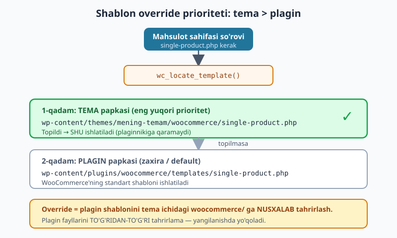
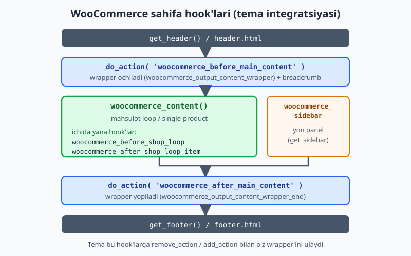
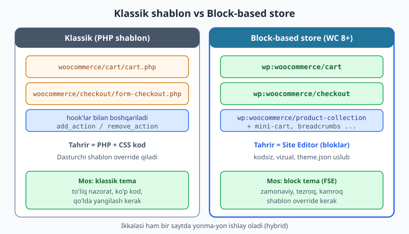

# 26 — WooCommerce tema integratsiyasi

[⬅️ Oldingi: 25 — InnerBlocks, variations va Interactivity API](./25-innerblocks-interactivity.md) · [🏠 README](./README.md) · [Keyingi: 27 — Xavfsizlik: escaping, sanitization, nonce ➡️](./27-xavfsizlik.md)

> **Bu bobda:** WordPress saytlarining katta qismi onlayn-do'kon, eng mashhur e-commerce plagini esa **WooCommerce**. Tema do'konni qo'llab-quvvatlashi uchun maxsus integratsiya kerak. Bu bobda WooCommerce nimaligini, temaga WC qo'llab-quvvatlashini qo'shishni (`add_theme_support('woocommerce')` va mahsulot galereyasi), WC shablonlarini tema ichidagi `woocommerce/` papkaga **override** qilishni, WC **hook** tizimini (`woocommerce_before_main_content`, `woocommerce_after_main_content`, `woocommerce_sidebar` va wrapper hook'lari) `remove_action`/`add_action` bilan moslashtirishni, klassik temadagi `woocommerce.php` + `woocommerce_content()` yondashuvini, hamda zamonaviy **block-based store** (Cart/Checkout/Product Collection bloklari, WC 8+) yondashuvini ko'rib chiqamiz. WooCommerce har saytda o'rnatilmagan bo'lishi mumkin, shuning uchun bu bobdagi kod **illustrativ** (sintaksis va WC API/hook nomlari rasmiy hujjat va jonli WooCommerce 10.8 manbasi bilan tasdiqlangan, lekin tema brauzerda render qilingani aytilmaydi).

---

## WooCommerce nima va tema nega aralashadi

**WooCommerce** — WordPress uchun bepul, ochiq kodli e-commerce plagini. U saytga mahsulotlar, savat (cart), to'lov (checkout), buyurtmalar, soliq, yetkazib berish kabi do'kon funksiyalarini qo'shadi. WordPress saytlarining juda katta ulushi aynan WooCommerce orqali do'kon yuritadi — bu uni dunyodagi eng ko'p ishlatiladigan onlayn-savdo platformalaridan biriga aylantiradi.

Bu yerda muhim savol tug'iladi: agar WooCommerce **plagin** bo'lsa va mahsulot/savat/checkout funksiyasini o'zi qo'shsa, **temaning** bunda nima ishi bor?

Javob — qatlamlar bo'linishida. 01-bobdan eslang: plagin **funksiya** (nima ishlaydi), tema esa **ko'rinish** (qanday ko'rinadi) qatlami. WooCommerce mahsulot ma'lumotini, savat mantig'ini, to'lov jarayonini ta'minlaydi — lekin mahsulot sahifasi **sizning temangiz dizayniga** mos kelishi kerak: bir xil header/footer, bir xil ranglar, bir xil tipografiya. Aks holda do'kon sahifalari saytning qolgan qismidan "begona" ko'rinadi.

Demak temaning vazifasi:

- WooCommerce'ga "men seni qo'llab-quvvatlayman" deb aytish (`add_theme_support`);
- WC sahifalarini temaning umumiy tartib-tuzilishiga (layout) joylashtirish;
- kerak bo'lganda WC chiqaradigan HTML'ni o'zgartirish (template override yoki hook).

> **O'xshatish:** WooCommerce — bu do'konning **kassasi va ombori** (tovar harakati, hisob-kitob). Tema — bu **do'konning interyeri** (javonlar qanday joylashgan, ranglar, yorug'lik). Kassa qanchalik kuchli bo'lmasin, mijoz baribir interyerni ko'radi. Tema integratsiyasi — kassani interyerga chiroyli "joylashtirish".

WooCommerce'ning yaxshi tomoni: tema **hech narsa qilmasa ham** do'kon ishlaydi. WC o'zining standart (default) shablonlarini ishlatadi va sahifa ochiladi — faqat dizayni temaga to'liq mos kelmasligi mumkin. Bizning ishimiz — shu moslikni yaxshilash.

---

## 1-qadam: temaga WooCommerce qo'llab-quvvatlashini qo'shish

Birinchi qadam — WC'ga temaning WooCommerce'ni "biladigan"ini bildirish. Buni `functions.php` da `after_setup_theme` hook'ida `add_theme_support()` bilan qilamiz (9-bobdagi `add_theme_support` bilan bir xil mexanizm):

```php
<?php
add_action( 'after_setup_theme', 'kitob_woo_support' );
function kitob_woo_support() {
	// Temaning WooCommerce'ni qo'llab-quvvatlashini e'lon qilamiz.
	add_theme_support( 'woocommerce' );

	// Mahsulot galereyasi imkoniyatlari (rasm zoom, lightbox, slider).
	add_theme_support( 'wc-product-gallery-zoom' );
	add_theme_support( 'wc-product-gallery-lightbox' );
	add_theme_support( 'wc-product-gallery-slider' );
}
```

Bu nima beradi?

- **`add_theme_support( 'woocommerce' )`** — eng muhim qatori. Busiz WooCommerce temani "WC-ga mos emas" deb hisoblaydi va admin panelida ogohlantirish ko'rsatadi, ba'zan o'zining shim (shim — vaqtinchalik moslashtiruvchi) qatlamini yoqadi. Bu qator bilan WC sizning temangizga ishonadi va shablonlarni to'g'ri ulaydi.
- **`wc-product-gallery-zoom`** — mahsulot rasmiga sichqoncha olib borilganda kattalashtirish (zoom).
- **`wc-product-gallery-lightbox`** — rasmni bosganda to'liq ekranli lightbox oynasi.
- **`wc-product-gallery-slider`** — bir nechta mahsulot rasmini slayder (carousel) ko'rinishida ko'rsatish.

Galereya imkoniyatlarini xohlasangiz o'chirib qo'yishingiz ham mumkin (masalan, o'z slayder kutubxonangizni ishlatmoqchi bo'lsangiz):

```php
<?php
add_action( 'after_setup_theme', 'kitob_woo_remove_gallery', 11 );
function kitob_woo_remove_gallery() {
	remove_theme_support( 'wc-product-gallery-zoom' );
	remove_theme_support( 'wc-product-gallery-slider' );
}
```

> **Diqqat — prioritet:** `remove_theme_support()` ni o'chirmoqchi bo'lsangiz, uni `add_theme_support()` qo'shgan hook'dan **keyinroq** ishlating. Yuqorida `priority` ni `11` qildik (qo'shish `10`, default), shunda o'chirish keyin bajariladi. Aks holda avval o'chirib, keyin qayta qo'shilib qoladi.

Mahsulot galereyasi imkoniyati `current_theme_supports()` orqali tekshiriladi — bu jonli WooCommerce 10.8 manbasida `current_theme_supports( 'wc-product-gallery-lightbox' )` va `get_theme_support( 'wc-product-gallery-slider' )` ko'rinishida tasdiqlandi.

> **Block tema eslatmasi:** zamonaviy block tema (Twenty Twenty-Five kabi) WooCommerce 8+ bilan ishlaganda ko'pgina integratsiyani avtomatik hal qiladi va Cart/Checkout bloklaridan foydalanadi (pastroqda ko'ramiz). Lekin `add_theme_support( 'woocommerce' )` va galereya e'lonlari **klassik** tema integratsiyasi uchun hamon asosiy.

---

## WooCommerce shablon strukturasi va template override

WooCommerce o'z HTML'ini chiqarish uchun ichida ko'plab **shablon fayl** saqlaydi: `plugins/woocommerce/templates/` papkasida. Masalan:

```
woocommerce/templates/
├── single-product.php           (bitta mahsulot sahifasi)
├── archive-product.php          (do'kon / mahsulotlar ro'yxati)
├── content-product.php          (loop dagi bitta mahsulot karti)
├── cart/
│   └── cart.php
├── checkout/
│   └── form-checkout.php
└── global/
    ├── wrapper-start.php
    ├── wrapper-end.php
    └── sidebar.php
```

Bu fayllarning ko'rinishini o'zgartirmoqchi bo'lsangiz, **plagin fayllarini hech qachon to'g'ridan-to'g'ri tahrir qilmang** — WooCommerce yangilanganda o'zgartirishlaringiz o'chib ketadi. Buning o'rniga **template override** mexanizmidan foydalanasiz: shablonni temangiz ichidagi `woocommerce/` papkaga **nusxalab**, nusxani tahrirlaysiz.

WooCommerce shablonni qidirganda quyidagi tartibni ishlatadi (`wc_locate_template()` funksiyasi):

1. **Avval temada qaraydi:** `wp-content/themes/SENING-TEMANG/woocommerce/single-product.php`
2. **Topmasa plaginga qaytadi:** `wp-content/plugins/woocommerce/templates/single-product.php`

Yo'l ichidagi nisbiy struktura **bir xil** bo'lishi shart: plagindagi `templates/cart/cart.php` -> temada `woocommerce/cart/cart.php`.



Misol: do'kon sahifasidagi (`archive-product.php`) mahsulot kartini o'zgartirmoqchimiz. Plagindagi `templates/content-product.php` ni temamizdagi `woocommerce/content-product.php` ga nusxalaymiz va o'sha nusxani tahrir qilamiz:

```
mening-temam/
├── style.css
├── functions.php
└── woocommerce/
    └── content-product.php   <- plagindan nusxalangan va tahrirlangan
```

WooCommerce har bir shablon faylining yuqorisida override yo'lini ham yozib qo'yadi. Masalan plagindagi `global/wrapper-start.php` izohida aniq shunday deyilgan:

> *"This template can be overridden by copying it to yourtheme/woocommerce/global/wrapper-start.php."*

> **MUHIM — versiya kuzatuvi:** har shablonning yuqorisida `@version` raqami bor. WooCommerce shablonni yangilaganda bu raqam oshadi. Agar siz override qilgan shablon eski versiyada qolsa, **WooCommerce > Status > System Status** sahifasi "out of date" deb ogohlantiradi. Shunda yangi plagin shablonini qaytadan nusxalab, o'zgarishlaringizni unga qayta qo'llashingiz kerak. Shuning uchun: **kerak bo'lmasa, butun shablonni override qilmang** — ko'pincha hook yetarli (keyingi bo'lim).

---

## WooCommerce hook'lari — override'siz integratsiya

Butun shablonni nusxalash og'ir: faylni yangilab turish kerak. Ko'p hollarda sizga butun shablon emas, undagi **bitta joyni** o'zgartirish kerak — masalan mahsulot loop'iga qator qo'shish yoki wrapper `<div>` larni o'zingiznikiga almashtirish. Buning uchun WooCommerce shablonlari ichi **hook**'larga to'la (9-bobdagi action/filter tizimi).

Eng muhim sahifa hook'lari — WooCommerce sahifasini header va footer orasiga joylashtiruvchi to'rt hook:

| Hook | Vazifa | Standartda ulangan funksiya |
|------|--------|------------------------------|
| `woocommerce_before_main_content` | Asosiy kontentdan oldin (wrapper ochish, breadcrumb) | `woocommerce_output_content_wrapper` (prioritet 10), `woocommerce_breadcrumb` (20) |
| `woocommerce_after_main_content` | Asosiy kontentdan keyin (wrapper yopish) | `woocommerce_output_content_wrapper_end` (10) |
| `woocommerce_sidebar` | Yon panel chiqarish | `woocommerce_get_sidebar` (10) |



Bu hook'lar va ularga standart ulangan funksiyalar jonli WooCommerce 10.8 manbasidagi `includes/wc-template-hooks.php` da aynan shunday tasdiqlandi:

```php
// WooCommerce yadrosidan (illustrativ ko'chirma — siz yozmaysiz):
add_action( 'woocommerce_before_main_content', 'woocommerce_output_content_wrapper', 10 );
add_action( 'woocommerce_after_main_content', 'woocommerce_output_content_wrapper_end', 10 );
add_action( 'woocommerce_before_main_content', 'woocommerce_breadcrumb', 20, 0 );
add_action( 'woocommerce_sidebar', 'woocommerce_get_sidebar', 10 );
```

### Wrapper'ni o'zingiznikiga almashtirish

WooCommerce standart wrapper'i (`woocommerce_output_content_wrapper`) `<div id="primary"><main id="main">...` kabi markup chiqaradi. Agar sizning temangiz boshqa konteyner strukturasini ishlatsa (masalan `<div class="container"><section class="shop-area">`), WC sahifasi temangizning gridiga to'g'ri tushmaydi. Yechim — standart funksiyani `remove_action` bilan olib tashlab, o'zingiznikini `add_action` bilan ulash:

```php
<?php
// 1) WooCommerce'ning standart wrapper'ini o'chiramiz.
remove_action( 'woocommerce_before_main_content', 'woocommerce_output_content_wrapper', 10 );
remove_action( 'woocommerce_after_main_content', 'woocommerce_output_content_wrapper_end', 10 );

// 2) O'zimiznikini ulaymiz.
add_action( 'woocommerce_before_main_content', 'kitob_woo_wrapper_start', 10 );
add_action( 'woocommerce_after_main_content', 'kitob_woo_wrapper_end', 10 );

function kitob_woo_wrapper_start() {
	echo '<div class="container"><main id="main" class="site-main shop-area">';
}

function kitob_woo_wrapper_end() {
	echo '</main></div>';
}
```

> **Qoida — `remove_action` aniq mos kelishi shart:** `remove_action()` ga uzatilgan **hook nomi, funksiya nomi va prioritet** ulanganidagi qiymatlar bilan **aynan** mos bo'lishi kerak. WooCommerce wrapper'ni prioritet `10` bilan ulagani uchun biz ham `10` yozdik. `remove_action` ni `after_setup_theme` yoki undan keyingi paytda chaqiring (WC hook'lari `init` paytida ulanadi, shuning uchun `functions.php` ning yuqori darajasida ham, `after_setup_theme` da ham bo'ladi).

### Sidebar'ni o'chirish

Ko'p do'kon dizaynlari to'liq kenglikdagi (full-width) bo'lib, yon panel kerak emas. Sidebar'ni shunchaki o'chirib qo'yish mumkin:

```php
<?php
// WooCommerce sahifalarida yon panelni butunlay o'chiramiz.
remove_action( 'woocommerce_sidebar', 'woocommerce_get_sidebar', 10 );
```

### Loop ichidagi hook'lar bilan element qo'shish

Mahsulot loop'idagi har bir mahsulot karti ham hook'lar bilan yig'iladi. Masalan, narx va savat tugmasi shu funksiyalar bilan chiqadi (jonli manbada tasdiqlangan):

```php
// WooCommerce yadrosidan (illustrativ):
add_action( 'woocommerce_after_shop_loop_item_title', 'woocommerce_template_loop_price', 10 );
add_action( 'woocommerce_after_shop_loop_item', 'woocommerce_template_loop_add_to_cart', 10 );
```

Demak siz mahsulot kartiga narxdan keyin o'z elementingizni qo'shmoqchi bo'lsangiz, shu hook'ga ulanasiz:

```php
<?php
add_action( 'woocommerce_after_shop_loop_item_title', 'kitob_woo_yetkazib_berish_eslatma', 11 );
function kitob_woo_yetkazib_berish_eslatma() {
	echo '<p class="kitob-yetkazib">Tekin yetkazib berish</p>';
}
```

Prioritetni `11` qildik — bu narx (`woocommerce_template_loop_price`, prioritet 10) dan **keyin** chiqishini ta'minlaydi.

---

## Klassik tema: `woocommerce.php` va `woocommerce_content()`

03-bobdagi template hierarchy'ni eslang: WordPress so'rovga qarab tema ichidan shablon fayl tanlaydi. WooCommerce o'rnatilganda hierarchyga bitta maxsus fayl qo'shadi: **`woocommerce.php`**. Agar tema ildizida `woocommerce.php` bo'lsa, WC barcha do'kon sahifalari (do'kon, mahsulot, kategoriya) uchun **shu faylni** ishlatadi. Bu — barcha WC sahifalarini bitta joydan boshqarishning eng oson usuli.

`woocommerce.php` ning klassik shabloni odatda shunday:

```php
<?php
/**
 * Klassik temada WooCommerce sahifalari uchun yagona shablon.
 * Tema ildizida: mening-temam/woocommerce.php
 */
get_header();
?>

<div class="container">
	<?php
	/**
	 * woocommerce_content() — WooCommerce'ning "sehrli" funksiyasi.
	 * U joriy so'rovga qarab to'g'ri kontentni chiqaradi:
	 * - bitta mahsulot bo'lsa: single-product
	 * - do'kon/arxiv bo'lsa: mahsulot loop
	 */
	woocommerce_content();
	?>
</div>

<?php
get_footer();
```

`woocommerce_content()` — WooCommerce yadrosidagi funksiya (jonli manbada `includes/wc-template-functions.php` da tasdiqlandi). U ichida `is_singular( 'product' )` ni tekshirib, mahsulot sahifasi bo'lsa `content-single-product` shablonini, aks holda mahsulot loop'ini chiqaradi.

> **MUHIM — qaysi yo'lni tanlash:**
> - **`woocommerce.php` ishlatish** (yuqoridagi) — eng oson, bitta fayl barcha WC sahifalarini boshqaradi. Lekin barcha do'kon sahifalari bir xil tartibga ega bo'ladi.
> - **`woocommerce.php` yozMASLIK + hook'lar** — WC o'zining `archive-product.php`/`single-product.php` shablonlarini ishlatadi, siz esa `woocommerce_before_main_content` kabi hook'lar orqali faqat wrapper'ni moslashtirasiz. Bu ko'pincha **afzal** yo'l, chunki har sahifa turi o'z shablonini saqlaydi.

Ikkala yo'lda ham WC sizning header/footer'ingizni (`get_header()`/`get_footer()`) ishlatadi — chunki uning standart shablonlari ichida ham `get_header()`/`get_footer()` chaqiriladi.

---

## Zamonaviy yo'l: block-based store (WC 8+)

WooCommerce 8.0+ va block tema (FSE) davrida do'kon integratsiyasi **butunlay boshqacha** ko'rinadi. Endi savat va to'lov sahifalari PHP shablon va hook bilan emas, **bloklar** bilan quriladi. Bu bloklar block tema ichida, **Site Editor** orqali kodsiz tahrirlanadi.



WooCommerce taqdim etadigan asosiy bloklar (block nomlari jonli WooCommerce 10.8 manbasida tasdiqlangan):

| Blok | Vazifa |
|------|--------|
| `woocommerce/cart` | To'liq savat sahifasi (mahsulotlar, miqdor, jami) |
| `woocommerce/checkout` | To'lov sahifasi (manzil, to'lov usuli, buyurtma) |
| `woocommerce/product-collection` | Mahsulotlar ro'yxati/gridi (zamonaviy "Products" bloki) |
| `woocommerce/mini-cart` | Header'dagi kichik savat ikonkasi (mahsulot soni) |
| `woocommerce/breadcrumbs` | Do'kon navigatsiya zanjiri |
| `woocommerce/store-notices` | Do'kon e'lonlari/xabarlari |

Block markup ko'rinishida (18-bobdagi `<!-- wp:... -->` sintaksisi) savat sahifasi shunchaki shunday bo'lishi mumkin:

```html
<!-- wp:woocommerce/cart -->
<div class="wp-block-woocommerce-cart is-loading"></div>
<!-- /wp:woocommerce/cart -->
```

To'lov sahifasi:

```html
<!-- wp:woocommerce/checkout -->
<div class="wp-block-woocommerce-checkout is-loading"></div>
<!-- /wp:woocommerce/checkout -->
```

Header'ga mini-cart qo'shish (masalan tema `parts/header.html` ichida):

```html
<!-- wp:woocommerce/mini-cart /-->
```

**Nega bu yaxshi?**

- **Kodsiz tahrir:** do'kon egasi savat/checkout maydonlarini Site Editor'da sudrab-tashlab o'zgartira oladi — dasturchi shart emas.
- **Tezroq:** Cart/Checkout bloklari REST API va zamonaviy front-end ishlatadi, klassik AJAX-page reload'dan tezroq.
- **Kamroq override:** ko'p hollarda shablon nusxalash kerak emas — uslublar `theme.json` dan keladi (17-bob).

> **MUHIM — ikkalasi ham yashaydi:** klassik shablon/hook yondashuvi **eskirgan emas** — u hozir ham to'liq ishlaydi va ko'p mavjud temalar shunga tayanadi. Lekin **yangi block tema** quryotgan bo'lsangiz, Cart/Checkout bloklari afzal. Hatto bitta saytda ham hybrid (21-bob) bo'lishi mumkin: mahsulot loop'i `product-collection` bloki bilan, lekin ba'zi maxsus joylar hook bilan.

> **Block tema'da `woocommerce.php` ishlamaydi:** block temada PHP shablon hierarchysi o'rniga `templates/*.html` ishlatiladi. WooCommerce block temalar uchun o'z block-shablonlarini (masalan `single-product`, `archive-product`) WordPress orqali ta'minlaydi, siz ularni Site Editor'da yoki tema ichidagi `templates/single-product.html` bilan override qilasiz. Klassik `woocommerce_content()` + `woocommerce.php` faqat **klassik** temada ma'noga ega.

---

## Hammasini birga: minimal WC-ga mos klassik tema `functions.php`

Endi yuqoridagilarni bitta amaliy `functions.php` bo'lagiga jamlaymiz. Bu — WC-ga mos klassik temaning integratsiya yadrosi:

```php
<?php
/**
 * Tema: kitob-shop (klassik) — WooCommerce integratsiyasi.
 * Bu kod illustrativ: sintaksis php -l bilan, hook/funksiya nomlari
 * jonli WooCommerce 10.8 manbasi va rasmiy hujjat bilan tasdiqlangan.
 */

add_action( 'after_setup_theme', 'kitob_shop_setup' );
function kitob_shop_setup() {
	// WooCommerce qo'llab-quvvatlash.
	add_theme_support( 'woocommerce' );
	add_theme_support( 'wc-product-gallery-zoom' );
	add_theme_support( 'wc-product-gallery-lightbox' );
	add_theme_support( 'wc-product-gallery-slider' );
}

// Standart wrapper'ni o'z konteynerimizga almashtiramiz.
remove_action( 'woocommerce_before_main_content', 'woocommerce_output_content_wrapper', 10 );
remove_action( 'woocommerce_after_main_content', 'woocommerce_output_content_wrapper_end', 10 );
add_action( 'woocommerce_before_main_content', 'kitob_shop_wrapper_start', 10 );
add_action( 'woocommerce_after_main_content', 'kitob_shop_wrapper_end', 10 );

function kitob_shop_wrapper_start() {
	echo '<div class="container"><main id="main" class="site-main">';
}

function kitob_shop_wrapper_end() {
	echo '</main></div>';
}

// Do'kon sahifalarida yon panelni o'chiramiz (full-width dizayn).
remove_action( 'woocommerce_sidebar', 'woocommerce_get_sidebar', 10 );

// Mahsulot kartiga narxdan keyin kichik eslatma qo'shamiz.
add_action( 'woocommerce_after_shop_loop_item_title', 'kitob_shop_loop_eslatma', 11 );
function kitob_shop_loop_eslatma() {
	echo '<p class="kitob-yetkazib">Tekin yetkazib berish</p>';
}
```

> **Xavfsizlik eslatmasi (27-bob):** yuqoridagi `echo` lar statik HTML — o'zgaruvchi yo'q, shuning uchun escape shart emas. Lekin agar wrapper yoki loop funksiyalaringizda **dinamik** qiymat (post meta, sozlama, `$_GET`) chiqarsangiz, uni albatta `esc_html()`/`esc_attr()`/`esc_url()` bilan escape qiling. Bu 27-bobda batafsil.

---

## Tema-WooCommerce moslik tekshiruvi (xulosa)

WC-ga mos tema quryotganingizda quyidagilarni eslab qoling:

- **`add_theme_support( 'woocommerce' )` — majburiy.** Busiz admin ogohlantiradi va dizayn buziladi.
- **Galereya support'lari ixtiyoriy**, lekin mahsulot sahifasi uchun foydali (zoom/lightbox/slider).
- **Avval hook'ni o'ylang, keyin override'ni.** Hook engilroq va yangilanishga chidamliroq. Faqat hook yetmasagina butun shablonni `woocommerce/` papkaga nusxalang.
- **Override qilsangiz, `@version` ni kuzating** — WC yangilanganda eskirgan shablonni qayta nusxalang.
- **Block tema** quryotgan bo'lsangiz, Cart/Checkout/Product Collection bloklaridan foydalaning va `theme.json` bilan uslub bering.
- **Header/footer izchilligi** — WC har doim `get_header()`/`get_footer()` (klassik) yoki tema `parts/` (block) ni ishlatadi, shuning uchun do'kon avtomatik temangiz ramkasiga tushadi.

> **Halol eslatma:** bu bobdagi PHP kodlar `php -l` bilan tekshirildi (sintaksis xatosi yo'q), HTML/block markup esa yaroqli `<!-- wp:... -->` sintaksisida. Hook va funksiya nomlari jonli WooCommerce 10.8.1 manbasi (`wc-template-hooks.php`, `wc-template-functions.php`) va rasmiy WooCommerce developer hujjati bilan **tasdiqlangan**. Lekin bu kod sizning saytingizning real brauzer ko'rinishini kafolatlamaydi — chunki natija temangiz CSS'iga, mahsulot ma'lumotiga va WC sozlamalariga bog'liq. Kodni o'z saytingizda sinab ko'ring.

---

## Mashqlar

### Oson

1. `functions.php` da `after_setup_theme` hook'iga ulangan funksiya yozing, u temaga WooCommerce qo'llab-quvvatlashini (`add_theme_support( 'woocommerce' )`) qo'shsin.
2. Avvalgi funksiyaga mahsulot galereyasining uchta imkoniyatini (zoom, lightbox, slider) qo'shing.
3. Plagindagi `templates/cart/cart.php` shablonini temangizda override qilmoqchisiz. To'g'ri tema yo'lini (papka + fayl nomi) yozing.
4. Bitta jumlada tushuntiring: nega WooCommerce plagin fayllarini to'g'ridan-to'g'ri tahrir qilish yomon g'oya?

### O'rta

5. `woocommerce_before_main_content` va `woocommerce_after_main_content` hook'lariga o'z wrapper funksiyalaringizni ulang: ochilishda `<div class="shop"><main>`, yopilishda `</main></div>` chiqarsin.
6. WooCommerce do'kon sahifalarida yon panelni (`woocommerce_sidebar`) butunlay o'chirib qo'yadigan kod yozing.
7. Klassik tema uchun `woocommerce.php` shablonini yozing: `get_header()`, konteyner ichida `woocommerce_content()`, so'ng `get_footer()`.
8. Mahsulot loop'idagi har bir mahsulot **nomidan keyin** "Yangi!" yorlig'ini chiqaradigan funksiyani to'g'ri hook'ga ulang.

### Qiyin

9. Standart WooCommerce wrapper'ini (`woocommerce_output_content_wrapper`) `remove_action` bilan o'chiring va o'rniga o'zingiznikini ulang. `remove_action` ning uchala argumenti (hook, funksiya, prioritet) nega aynan mos kelishi kerakligini izohlang.
10. Block tema uchun savat va to'lov sahifalarining block markup'ini yozing (`woocommerce/cart` va `woocommerce/checkout` bloklari).
11. To'liq WC-ga mos klassik tema `functions.php` integratsiya bloki yozing: WC support + galereya + wrapper almashtirish + sidebar o'chirish + loop'ga element qo'shish.
12. Galereya `slider` va `zoom` imkoniyatlarini **o'chiradigan** kod yozing va `remove_theme_support` ning prioriteti nega `add_theme_support` dan kattaroq (keyinroq) bo'lishi kerakligini tushuntiring.
13. Klassik vs block-based store farqini tushuntiring: qaysi holatda `woocommerce.php` + `woocommerce_content()` ishlatasiz, qaysi holatda `woocommerce/checkout` blokini? Har biriga bitta amaliy stsenariy keltiring.

---

## Yechimlar

<details markdown="1">
<summary>Yechim — 1</summary>

```php
<?php
add_action( 'after_setup_theme', 'kitob_woo_support' );
function kitob_woo_support() {
	add_theme_support( 'woocommerce' );
}
```

`after_setup_theme` — tema sozlamalari uchun standart hook (9-bob). `add_theme_support( 'woocommerce' )` WC'ga temaning mos ekanini bildiradi; busiz admin panelida ogohlantirish chiqadi.

</details>

<details markdown="1">
<summary>Yechim — 2</summary>

```php
<?php
add_action( 'after_setup_theme', 'kitob_woo_support' );
function kitob_woo_support() {
	add_theme_support( 'woocommerce' );
	add_theme_support( 'wc-product-gallery-zoom' );
	add_theme_support( 'wc-product-gallery-lightbox' );
	add_theme_support( 'wc-product-gallery-slider' );
}
```

Uchala galereya imkoniyati alohida `add_theme_support` chaqiruvi bilan e'lon qilinadi. Bu nomlar jonli WooCommerce manbasida (`wc-product-gallery-zoom/lightbox/slider`) tasdiqlangan.

</details>

<details markdown="1">
<summary>Yechim — 3</summary>

To'g'ri yo'l — plagindagi nisbiy strukturani saqlagan holda tema ichidagi `woocommerce/` papka:

```
mening-temam/woocommerce/cart/cart.php
```

Ya'ni plagindagi `templates/cart/cart.php` -> temada `woocommerce/cart/cart.php`. Papka ichidagi struktura (`cart/`) **aynan saqlanishi** shart.

</details>

<details markdown="1">
<summary>Yechim — 4</summary>

Chunki WooCommerce yangilanganda plagin papkasi (`wp-content/plugins/woocommerce/`) butunlay qayta yoziladi va siz kiritgan barcha o'zgarishlar **yo'qoladi**. Template override (tema ichidagi `woocommerce/` papka) yangilanishlardan saqlanib qoladi.

</details>

<details markdown="1">
<summary>Yechim — 5</summary>

```php
<?php
remove_action( 'woocommerce_before_main_content', 'woocommerce_output_content_wrapper', 10 );
remove_action( 'woocommerce_after_main_content', 'woocommerce_output_content_wrapper_end', 10 );

add_action( 'woocommerce_before_main_content', 'kitob_woo_wrapper_start', 10 );
add_action( 'woocommerce_after_main_content', 'kitob_woo_wrapper_end', 10 );

function kitob_woo_wrapper_start() {
	echo '<div class="shop"><main>';
}

function kitob_woo_wrapper_end() {
	echo '</main></div>';
}
```

Avval standart wrapper'ni o'chiramiz (aks holda ikkita wrapper chiqadi), keyin o'zimiznikini ulaymiz.

</details>

<details markdown="1">
<summary>Yechim — 6</summary>

```php
<?php
remove_action( 'woocommerce_sidebar', 'woocommerce_get_sidebar', 10 );
```

`woocommerce_get_sidebar` — `woocommerce_sidebar` hook'iga prioritet 10 bilan ulangan standart funksiya (jonli manbada tasdiqlangan). Uni o'chirsak, yon panel umuman chiqmaydi.

</details>

<details markdown="1">
<summary>Yechim — 7</summary>

```php
<?php
/**
 * mening-temam/woocommerce.php
 */
get_header();
?>

<div class="container">
	<?php woocommerce_content(); ?>
</div>

<?php
get_footer();
```

`woocommerce_content()` joriy so'rovga qarab (mahsulot yoki loop) to'g'ri kontentni chiqaradi. Header/footer temangiznikini ishlatadi, shuning uchun do'kon sahifasi izchil ko'rinadi.

</details>

<details markdown="1">
<summary>Yechim — 8</summary>

Mahsulot nomi `woocommerce_shop_loop_item_title` hook'ida chiqadi (prioritet 10). Undan keyin chiqishi uchun `woocommerce_after_shop_loop_item_title` ga ulanamiz:

```php
<?php
add_action( 'woocommerce_after_shop_loop_item_title', 'kitob_woo_yangi_yorliq', 9 );
function kitob_woo_yangi_yorliq() {
	echo '<span class="kitob-yangi">Yangi!</span>';
}
```

Prioritet `9` — narx (`woocommerce_template_loop_price`, prioritet 10) dan oldin, ya'ni nom ostida darrov chiqadi. (Agar narxdan keyin xohlasangiz, `11` bering.)

</details>

<details markdown="1">
<summary>Yechim — 9</summary>

```php
<?php
remove_action( 'woocommerce_before_main_content', 'woocommerce_output_content_wrapper', 10 );
add_action( 'woocommerce_before_main_content', 'kitob_woo_wrapper_start', 10 );

function kitob_woo_wrapper_start() {
	echo '<div class="container"><main id="main">';
}
```

`remove_action()` ichki ravishda **hook nomi + funksiya nomi + prioritet** kombinatsiyasi bo'yicha aniq moslikni qidiradi. WooCommerce wrapper'ni `woocommerce_before_main_content` hook'iga, `woocommerce_output_content_wrapper` funksiyasi bilan, prioritet `10` da ulagan. Agar uchtadan birortasi noto'g'ri bo'lsa (masalan prioritet `5` deb yozsak), `remove_action` mos keladigan ulanishni topolmaydi va **hech narsani o'chirmaydi** — natijada ikkita wrapper chiqib, HTML buziladi.

</details>

<details markdown="1">
<summary>Yechim — 10</summary>

Savat sahifasi:

```html
<!-- wp:woocommerce/cart -->
<div class="wp-block-woocommerce-cart is-loading"></div>
<!-- /wp:woocommerce/cart -->
```

To'lov sahifasi:

```html
<!-- wp:woocommerce/checkout -->
<div class="wp-block-woocommerce-checkout is-loading"></div>
<!-- /wp:woocommerce/checkout -->
```

`woocommerce/cart` va `woocommerce/checkout` block nomlari jonli WooCommerce 10.8 manbasida tasdiqlangan. Bu bloklar Site Editor'da kodsiz tahrirlanadi va REST API orqali tez ishlaydi.

</details>

<details markdown="1">
<summary>Yechim — 11</summary>

```php
<?php
add_action( 'after_setup_theme', 'kitob_shop_setup' );
function kitob_shop_setup() {
	add_theme_support( 'woocommerce' );
	add_theme_support( 'wc-product-gallery-zoom' );
	add_theme_support( 'wc-product-gallery-lightbox' );
	add_theme_support( 'wc-product-gallery-slider' );
}

remove_action( 'woocommerce_before_main_content', 'woocommerce_output_content_wrapper', 10 );
remove_action( 'woocommerce_after_main_content', 'woocommerce_output_content_wrapper_end', 10 );
add_action( 'woocommerce_before_main_content', 'kitob_shop_wrapper_start', 10 );
add_action( 'woocommerce_after_main_content', 'kitob_shop_wrapper_end', 10 );

function kitob_shop_wrapper_start() {
	echo '<div class="container"><main id="main" class="site-main">';
}
function kitob_shop_wrapper_end() {
	echo '</main></div>';
}

remove_action( 'woocommerce_sidebar', 'woocommerce_get_sidebar', 10 );

add_action( 'woocommerce_after_shop_loop_item_title', 'kitob_shop_loop_eslatma', 11 );
function kitob_shop_loop_eslatma() {
	echo '<p class="kitob-yetkazib">Tekin yetkazib berish</p>';
}
```

Bu — WC-ga mos klassik temaning to'liq integratsiya yadrosi: support e'loni, wrapper almashtirish, sidebar o'chirish va loop'ga element qo'shish. `php -l` bilan tekshirilgan.

</details>

<details markdown="1">
<summary>Yechim — 12</summary>

```php
<?php
add_action( 'after_setup_theme', 'kitob_woo_galereya_ozgartirish', 11 );
function kitob_woo_galereya_ozgartirish() {
	remove_theme_support( 'wc-product-gallery-slider' );
	remove_theme_support( 'wc-product-gallery-zoom' );
}
```

Prioritet `11` — qo'shish odatda `after_setup_theme` da prioritet `10` (default) bilan bajariladi. Hook'lar prioritet tartibida ishlaydi: kichik raqam oldin. Agar o'chirishni ham `10` (yoki kichikroq) qilsak, u **qo'shishdan oldin** ishga tushib, hali mavjud bo'lmagan support'ni o'chirishga urinadi — natija samarasiz. `11` ni berib, o'chirish **qo'shishdan keyin** bajarilishiga kafolat beramiz.

</details>

<details markdown="1">
<summary>Yechim — 13</summary>

- **`woocommerce.php` + `woocommerce_content()` — klassik tema.** Bu PHP shablon hierarchysi asosida ishlaydi. Misol: siz mavjud klassik (PHP) temani WooCommerce'ga moslayapsiz, do'kon egasi kod yozmaydi va do'konni dasturchi boshqaradi. Barcha WC sahifalarini bitta `woocommerce.php` orqali nazorat qilasiz.

- **`woocommerce/checkout` bloki — block tema (FSE).** Bu Site Editor'da bloklar bilan ishlaydi. Misol: siz yangi block tema quryapsiz, do'kon egasining o'zi checkout maydonlarini sudrab-tashlab moslashtirishi va uslubni `theme.json` dan boshqarishi kerak. PHP shablon va hook deyarli kerak emas.

Asosiy farq: klassik = PHP shablon + hook (dasturchi nazorat qiladi); block = bloklar + Site Editor (do'kon egasi vizual tahrir qiladi).

</details>

---

[⬅️ Oldingi: 25 — InnerBlocks, variations va Interactivity API](./25-innerblocks-interactivity.md) · [🏠 README](./README.md) · [Keyingi: 27 — Xavfsizlik: escaping, sanitization, nonce ➡️](./27-xavfsizlik.md)
