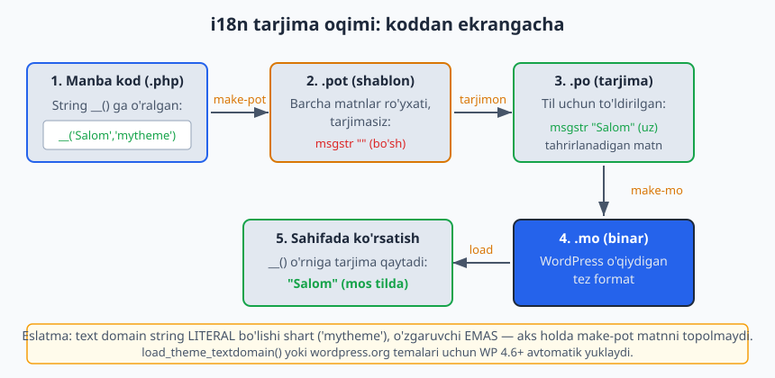
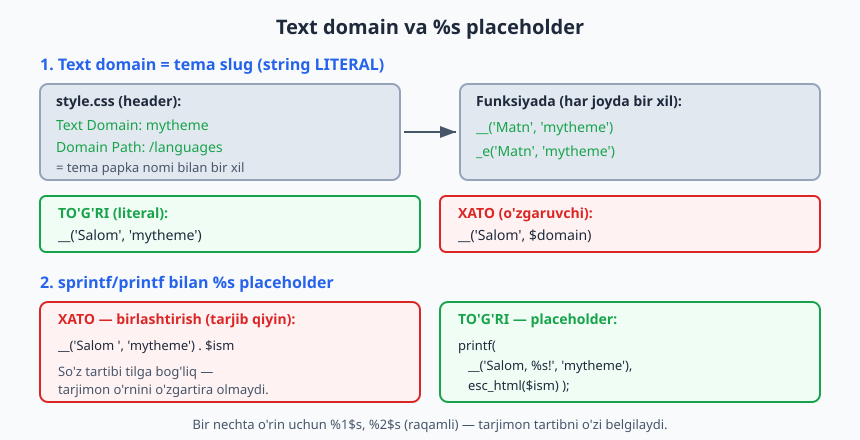
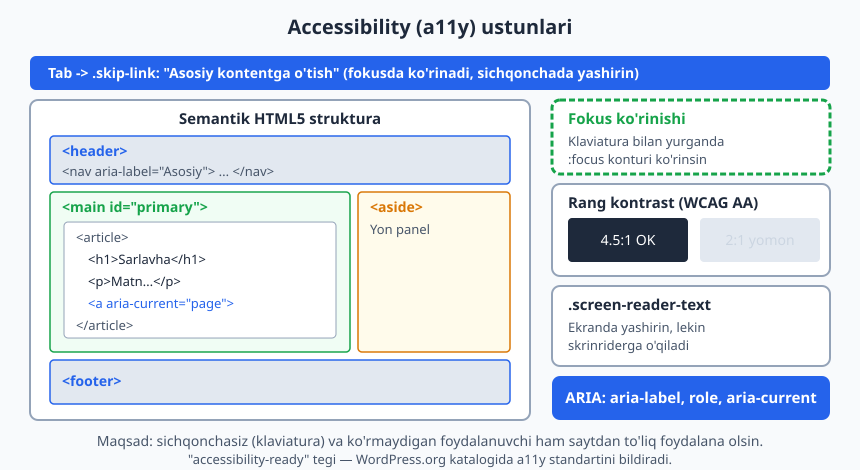

# 28 — i18n/l10n va accessibility

[⬅️ Oldingi: 27 — Xavfsizlik: escaping, sanitization, nonce](./27-xavfsizlik.md) · [🏠 README](./README.md) · [Keyingi: 29 — Performans va tarqatish ➡️](./29-performans-tarqatish.md)

> **Bu bobda:** professional tema ikki narsani albatta bajaradi. Birinchisi — **i18n/l10n**: tema interfeysidagi har bir matn (`__()`, `_e()`, `_n()`, `_x()` orqali) tarjima qilinishga *tayyor* bo'lishi, shunda boshqa tildagi foydalanuvchi temani o'z tilida ko'ra olsin. Ikkinchisi — **accessibility (a11y)**: tema sichqonchasiz (faqat klaviatura bilan), ko'rmaydigan (skrinrider bilan) yoki kam ko'radigan (past kontrast bilan) foydalanuvchi uchun ham ishlatib bo'ladigan bo'lsin. Biz `text domain` (tema slug, string literal bo'lishi shart), `.pot`/`.po`/`.mo` fayllar va `wp i18n make-pot` quvurini, hamda semantik HTML5, `skip-link`, ARIA, klaviatura fokusi va WCAG kontrast standartlarini ko'rib chiqamiz. i18n funksiyalari va POT/MO generatsiyasi jonli WordPress 7.0 muhitida `php -l` va `wp-cli` bilan haqiqatan tekshirilgan.

---

## Nega i18n va a11y — bu "majburiy", "ixtiyoriy" emas

Tasavvur qiling, do'kon eshigiga faqat o'zbekcha "Ochiq" deb yozdingiz. Ruscha yoki inglizcha gapiradigan mijoz nima qiladi? Va eshik faqat zinapoyali bo'lsa, aravachadagi mijoz-chi? Yaxshi do'kon hammaga eshigini ochadi. Tema ham xuddi shunday: **i18n** (internationalization) temani har qanday tilga tarjima qilishga tayyor qiladi, **a11y** (accessibility) esa har qanday foydalanuvchiga — jismoniy imkoniyatidan qat'i nazar — saytdan foydalanish imkonini beradi.

Atamalardagi raqamlar shunchaki qisqartma: **i18n** = "internationalization" (i + 18 harf + n), **l10n** = "localization" (l + 10 harf + n), **a11y** = "accessibility" (a + 11 harf + y). Farqi:

- **i18n** — kodni tarjimaga *tayyorlash* (matnlarni maxsus funksiyalarga o'rash). Buni **dasturchi** qiladi.
- **l10n** — aniq bir tilga *tarjima qilish* (`.po` faylini to'ldirish). Buni odatda **tarjimon** qiladi.

WordPress.org tema katalogida i18n — **majburiy talab**: matn "qotirilgan" (hardcoded) tema qabul qilinmaydi. A11y esa `accessibility-ready` tegi orqali alohida sifat belgisi. Bu bobda ikkalasini ham temaga o'rnatamiz.

---

## i18n: matnni `__()` ga o'rash

Eng asosiy qoida: temada foydalanuvchi ko'radigan **har bir matn** to'g'ridan-to'g'ri yozilmasdan, tarjima funksiyasiga o'ralishi kerak.

```php
<?php
// XATO — matn qotirilgan, hech qachon tarjima qilinmaydi:
echo 'Batafsil';

// TO'G'RI — tarjimaga tayyor:
echo __( 'Batafsil', 'mytheme' );
```

`__()` (ikki pastki chiziq) — i18n ning yuragi. U ikki argument oladi: **tarjima qilinadigan matn** va **text domain** (`'mytheme'`). Funksiya matnni *qaytaradi* (echo qilmaydi) — uni o'zgaruvchiga, `sprintf` ga yoki konkatenatsiyaga ishlatish mumkin.

Sahifa ochilganda WordPress text domain uchun yuklangan tarjimani qidiradi: agar mos `.mo` fayl bo'lsa, tarjimani qaytaradi; bo'lmasa — asl matnni o'zini qaytaradi. Shuning uchun i18n ga o'rash saytni **buzmaydi** — tarjima bo'lmasa ham hammasi ishlayveradi.



> **Tasdiqlangan natija (jonli WP 7.0):** quyidagi buyruq jonli saytda ishga tushirildi:
> ```
> wp eval "echo __('Salom','mytheme'); echo PHP_EOL; printf(_n('%s izoh','%s izoh',3,'mytheme'),3);"
> ```
> Natija (aynan):
> ```
> Salom
> 3 izoh
> ```
> Tarjima yuklanmagani uchun funksiyalar asl matnni qaytardi — bu kutilgan, to'g'ri xulq.

### i18n funksiyalar oilasi

WordPress'da bir nechta tarjima funksiyasi bor — har biri aniq vazifa uchun. Hammasi jonli WP 7.0 da `function_exists()` bilan tasdiqlandi.

| Funksiya | Vazifa | Qaytaradi / echo |
|----------|--------|------------------|
| `__( $text, $domain )` | Tarjima qiladi | **qaytaradi** |
| `_e( $text, $domain )` | Tarjima qiladi | **echo qiladi** |
| `esc_html__( $text, $domain )` | Tarjima + `esc_html` | qaytaradi |
| `esc_html_e( $text, $domain )` | Tarjima + `esc_html` | echo qiladi |
| `esc_attr__( $text, $domain )` | Tarjima + `esc_attr` | qaytaradi |
| `esc_attr_e( $text, $domain )` | Tarjima + `esc_attr` | echo qiladi |
| `_n( $single, $plural, $n, $domain )` | Ko'plik (1 / ko'p) | qaytaradi |
| `_x( $text, $context, $domain )` | Kontekstli tarjima | qaytaradi |
| `_ex( $text, $context, $domain )` | Kontekstli tarjima | echo qiladi |
| `esc_attr_x( $text, $context, $domain )` | Kontekst + `esc_attr` | qaytaradi |
| `_nx( $single, $plural, $n, $context, $domain )` | Ko'plik + kontekst | qaytaradi |
| `_n_noop( $single, $plural, $domain )` | Ko'plikni keyinroq ishlatish uchun ro'yxatga olish | massiv |

> **Eng muhim qoida — tarjima + escaping birga.** 27-bobda "har chiqishni escape qil" deganini eslang. Tarjima qilingan matn ham chiqishdir, demak u ham escape qilinishi kerak. Shuning uchun ko'pincha `_e()` o'rniga `esc_html_e()`, `__()` o'rniga `esc_html__()` ishlatiladi. `_e()` ni faqat o'zingiz to'liq nazorat qiladigan, HTML li tarjimalarda (kamdan-kam) ishlating.

### `_e()` va `__()` — qaytarish vs echo

Bu eng ko'p chalkashtiriladigan juftlik:

```php
<?php
// __() qaytaradi -> o'zgaruvchiga yoki sprintf ga:
$label = __( 'Yuborish', 'mytheme' );

// _e() darhol echo qiladi -> shablon ichida qulay:
?>
<button><?php esc_html_e( 'Yuborish', 'mytheme' ); ?></button>
```

Qoidani eslab qolish oson: oxiridagi **`e`** — "echo" degani.

---

## Text domain — tema slug, string LITERAL

Har bir i18n funksiyaning oxirgi argumenti — **text domain**. Bu tema tarjimalarini boshqa plagin/tema tarjimalaridan ajratuvchi noyob "kalit". Qoidasi:

1. **Text domain = tema papka nomi (slug).** Agar tema `mytheme/` papkasida bo'lsa, text domain `'mytheme'` bo'lishi shart. Bu `style.css` headeridagi `Text Domain:` maydoni bilan ham mos kelishi kerak.
2. **U doim string LITERAL bo'lishi shart — o'zgaruvchi EMAS.**

```php
<?php
// TO'G'RI — literal string:
__( 'Salom', 'mytheme' );

// XATO — o'zgaruvchi (make-pot matnni TOPOLMAYDI):
$domain = 'mytheme';
__( 'Salom', $domain );

// XATO — konstanta ham bo'lmaydi:
__( 'Salom', MY_DOMAIN );
```

Nega? Chunki `wp i18n make-pot` matnlarni **statik tahlil** orqali (kodni *ishga tushirmasdan*) topadi. U `__( '...', 'mytheme' )` ko'rinishini qidiradi. O'zgaruvchi yoki konstanta turgan joyda nimani qidirishni bilmaydi — string oddiygina o'tkazib yuboriladi va tarjima ro'yxatiga tushmaydi.



### `style.css` headeri

```css
/*
Theme Name: My Theme
Text Domain: mytheme
Domain Path: /languages
*/
```

- `Text Domain` — kodda ishlatadigan domen (papka nomiga teng).
- `Domain Path` — tarjima fayllari (`.mo`) turadigan papka (odatda `/languages`).

---

## Tarjimani yuklash: `load_theme_textdomain`

WordPress tarjimani avtomatik topishi uchun unga aytish kerak: "mening tarjimalarim shu papkada". Buni `after_setup_theme` hookida qilamiz (9-bobni eslang).

```php
<?php
add_action( 'after_setup_theme', function () {
	load_theme_textdomain(
		'mytheme',                                  // text domain
		get_template_directory() . '/languages'     // .mo fayllar papkasi
	);
} );
```

Bu funksiya `languages/` papkasidan joriy tilga mos `.mo` faylni qidiradi. Til `wp-admin > Sozlamalar > Umumiy > Sayt tili` da tanlanadi (yoki `WPLANG`). Masalan ruscha tilda WordPress `languages/mytheme-ru_RU.mo` ni yuklaydi.

> **Block tema va WP 4.6+ avtomatik yuklash:** WordPress.org **katalogidan** o'rnatilgan temalar uchun (klassik ham, block ham) WP 4.6+ tarjimani **avtomatik** yuklaydi — `load_theme_textdomain` ni chaqirish shart emas. Lekin tema katalogdan tashqarida tarqatilsa yoki lokal `languages/` ichidagi tarjimalarni ishlatmoqchi bo'lsangiz, uni baribir chaqirish kerak. Eng xavfsizi — har doim chaqirib qo'yish.

> **Block tema theme.json avtomatik tarjima.** Block temada `theme.json` ichidagi `title` maydonlari (color palette nomi, font o'lchami nomi, style variation nomi...) va `patterns/` papkasidagi pattern sarlavhalari WordPress tomonidan **avtomatik** tarjima qilinadi — siz JSON ichida `__()` yoza olmaysiz, lekin make-pot bu matnlarni POT ga o'zi qo'shadi (text domain `style.css` dan olinadi). Demak block temada ko'p tarjima "tekin" keladi.

---

## `_n()` — ko'plik shakllari

Tillarda son bilan kelgan so'z shakli o'zgaradi. Inglizchada "1 comment" / "2 comment**s**". Boshqa tillarda qoidalar murakkabroq (rus, arab tillarida bir nechta ko'plik shakli bor). `_n()` shuni hal qiladi:

```php
<?php
// _n( birlik, ko'plik, son, domen )
$count = 5;
printf(
	esc_html( _n( '%s ta izoh', '%s ta izoh', $count, 'mytheme' ) ),
	number_format_i18n( $count )
);
```

`_n()` `$count` ga qarab **birlik** yoki **ko'plik** shaklini tanlaydi, lekin sonni o'zi qo'ymaydi — uni `%s` placeholder va `printf`/`sprintf` orqali siz qo'yasiz. Diqqat: sonni `number_format_i18n()` orqali formatlash kerak (ba'zi tillar minglikni boshqacha ajratadi).

> **Tasdiqlangan natija (jonli WP 7.0):** `wp eval-file` orqali ishga tushirildi:
> ```
> printf( _n( '%s izoh', '%s izoh', 1, 'mytheme' ), 1 );  // -> 1 izoh
> printf( _n( '%s izoh', '%s izoh', 5, 'mytheme' ), 5 );  // -> 5 izoh
> ```
> Ikkala holda ham to'g'ri shakl tanlandi (o'zbekcha birlik/ko'plik bir xil yozilgani uchun matn bir xil chiqadi, lekin funksiya sonni to'g'ri qabul qildi).

### `_n_noop()` — ko'plikni keyinroq tarjima qilish

Ba'zan ko'plik matnini bir joyda **e'lon qilib**, boshqa joyda (son ma'lum bo'lganda) ishlatish kerak — masalan massivda. Buning uchun `_n_noop()` (e'lon) + `translate_nooped_plural()` (ishlatish):

```php
<?php
// E'lon (son hali noma'lum):
$comments_plural = _n_noop( '%s ta izoh', '%s ta izoh', 'mytheme' );

// Keyinroq, son ma'lum bo'lganda:
$count = 3;
printf(
	translate_nooped_plural( $comments_plural, $count, 'mytheme' ),
	number_format_i18n( $count )
);
```

> **Tasdiqlangan (jonli WP 7.0):** `_n_noop('%s comment','%s comments','mytheme')` + `translate_nooped_plural($noop, 3, 'mytheme')` natija: `3 comments` — to'g'ri ishladi.

---

## `_x()` — kontekstli tarjima

Bitta inglizcha (yoki o'zbekcha) so'z turli o'rinlarda turlicha tarjima qilinishi mumkin. Masalan "Post":

- ot sifatida — "Maqola" (blog posti);
- fe'l sifatida — "Joylash" (tugma matni).

Tarjimon `.po` faylda faqat "Post" so'zini ko'rsa, qaysi ma'noni nazarda tutganini bilmaydi. `_x()` ikkinchi argument sifatida **kontekst** beradi:

```php
<?php
echo esc_html_x( 'Post', 'maqola turi', 'mytheme' );   // ot: Maqola
echo esc_html_x( 'Post', 'tugma matni', 'mytheme' );   // fe'l: Joylash
```

Asl matn (`'Post'`) bir xil, lekin kontekst (`'maqola turi'` vs `'tugma matni'`) ularni tarjima faylda **ikki alohida yozuv** qiladi. `_ex()` — `_x()` ning echo varianti, `esc_attr_x()` — `esc_attr` bilan birga (ARIA labellar uchun juda qulay).

> **Tasdiqlangan (jonli WP 7.0):** `_x('Post','noun context','mytheme')` natija: `Post` (tarjima yo'qligida asl matn) — to'g'ri.

---

## `sprintf` / `printf` bilan `%s` placeholder

O'zgaruvchini (ism, son, sana) tarjima matniga qo'shganda **hech qachon** stringni `.` bilan birlashtirmang — buni `sprintf`/`printf` va placeholder bilan qiling.

```php
<?php
// XATO — so'z tartibi tilga bog'liq, tarjimon o'rnini o'zgartira olmaydi:
echo __( 'Xush kelibsiz, ', 'mytheme' ) . esc_html( $user );

// TO'G'RI — placeholder, tarjimon %s ni xohlagan joyga qo'yadi:
printf(
	/* translators: %s: foydalanuvchi ismi */
	esc_html__( 'Xush kelibsiz, %s!', 'mytheme' ),
	esc_html( $user )
);
```

Nega muhim? Boshqa tilda so'z tartibi boshqacha bo'lishi mumkin. Birlashtirsangiz, tarjimon faqat "Xush kelibsiz, " qismini tarjima qiladi va `%s` ni boshqa joyga ko'chira olmaydi. Placeholder bilan butun jumla bir tarjima yozuvi bo'ladi.

Bir nechta o'zgaruvchi bo'lsa — **raqamli** placeholder ishlating (`%1$s`, `%2$s`), shunda tarjimon tartibni o'zgartira oladi:

```php
<?php
printf(
	/* translators: 1: muallif ismi, 2: sana */
	esc_html__( '%1$s tomonidan %2$s da yozilgan', 'mytheme' ),
	esc_html( $author ),
	esc_html( $date )
);
```

> **`translators:` izohi — best practice.** `make-pot` placeholder li matnda `/* translators: ... */` izohini ko'rsa, uni `.po` faylga qo'shadi va tarjimonga `%s` nima ekanini tushuntiradi. Biz buni jonli sinovda ko'rdik: izohsiz matn uchun make-pot ogohlantirish berdi (*"contains placeholders but has no translators: comment"*). Izohni `__()` chaqiruvidan **darhol oldingi qatorga** yozing.

---

## `.pot` / `.po` / `.mo` fayllar

Tarjima quvuri uch xil fayldan iborat:

| Fayl | Nima | Kim tahrirlaydi |
|------|------|-----------------|
| `.pot` | **Portable Object Template** — barcha matnlar ro'yxati, tarjimasiz (`msgstr ""`). Shablon. | `make-pot` avtomatik yaratadi |
| `.po` | **Portable Object** — bitta til uchun to'ldirilgan tarjima (matn + tarjima juftliklari). O'qiladigan matn. | tarjimon (Poedit, GlotPress) |
| `.mo` | **Machine Object** — `.po` ning kompilyatsiya qilingan, binar, tez varianti. | `make-mo` avtomatik yaratadi |

Oqim: `make-pot` -> `.pot` -> (tarjimon) `.po` -> `make-mo` -> `.mo` -> WordPress yuklaydi.

Fayl nomlari muhim. Tema uchun:

- `languages/mytheme.pot` — shablon (bitta);
- `languages/mytheme-ru_RU.po` va `languages/mytheme-ru_RU.mo` — ruscha (`{domain}-{locale}`);
- `languages/mytheme-uz.po` va `.mo` — o'zbekcha.

> WP 6.5+ da `.mo` o'rniga **PHP tarjima fayllari** (`.l10n.php`) ham qo'llab-quvvatlanadi va ular tezroq yuklanadi. `wp i18n make-php` ularni `.po` dan yaratadi. `.mo` hamon eng keng tarqalgan, shuning uchun biz unga e'tibor beramiz.

---

## `wp i18n make-pot` — POT ni avtomatik yaratish

POT faylni qo'lda yozish — azob. WP-CLI buni avtomatlashtiradi: u tema fayllarini skanerlaydi, har bir `__()`, `_e()`, `_n()`, `_x()` chaqiruvidagi matnni topadi va POT ga yozadi.

```bash
# Tema papkasidan:
wp i18n make-pot . languages/mytheme.pot

# Yoki to'liq yo'l bilan:
wp i18n make-pot /path/to/themes/mytheme languages/mytheme.pot
```

> **Tasdiqlangan (jonli WP 7.0, WP-CLI 2.12.0):** test temasi yaratib (`index.php` ichida `esc_html__`, `_n`, `esc_attr_x`, `esc_html_e` bilan), `wp i18n make-pot` ishga tushirildi. Natija: **`Success: POT file successfully generated.`** Hosil bo'lgan POT da matnlar to'g'ri ajratilgan edi:
> ```pot
> #: index.php:4
> msgid "Bizning blog"
> msgstr ""
>
> #: index.php:8
> #, php-format
> msgid "%s ta maqola topildi"
> msgid_plural "%s ta maqola topildi"
> msgstr[0] ""
> msgstr[1] ""
>
> #: index.php:12
> msgctxt "navigation"
> msgid "Asosiy menyu"
> msgstr ""
> ```
> Diqqat qiling: ko'plik (`msgid_plural`), kontekst (`msgctxt`) va `style.css` headeridagi matnlar (Theme Name, Description...) ham avtomatik ajratildi.

`wp i18n` ning to'liq buyruqlar to'plami (jonli WP 7.0 da tasdiqlangan): `make-pot`, `make-mo`, `make-php`, `make-json`, `update-po`.

`.po` ni `.mo` ga kompilyatsiya qilish:

```bash
wp i18n make-mo languages/ languages/
```

> **Tasdiqlangan (jonli WP 7.0):** namuna `mytheme-uz.po` fayli yaratilib, `wp i18n make-mo` ishga tushirildi. Natija: **`Success: Created 1 file.`** — `.po` (277 bayt) dan `.mo` (462 bayt, binar) hosil bo'ldi. Bu i18n quvurining oxirigacha haqiqatan ishlashini isbotlaydi.

> **Verifikatsiya eslatmasi:** bu bobdagi barcha i18n PHP misollari `php -l` (PHP 8.4.0) bilan sintaksis tekshirilgan — *No syntax errors detected*. i18n funksiyalari va `wp i18n` buyruqlari jonli WordPress 7.0 + WP-CLI 2.12.0 da ishga tushirib tasdiqlangan; soxta natija yo'q.

---

## Accessibility (a11y): hamma uchun tema

i18n tilni ochsa, a11y **imkoniyatni** ochadi. Sayt foydalanuvchilarining bir qismi:

- sichqonchadan foydalanmaydi (faqat klaviatura yoki maxsus qurilma);
- ko'rmaydi (skrinrider — ekrandagi matnni ovozli o'qiydigan dastur);
- kam ko'radi (katta shrift, yuqori kontrast kerak);
- rang ko'rishida farq bor (rangga tayanib bo'lmaydi).

Yaxshi tema bularning hammasini hisobga oladi. WordPress.org `accessibility-ready` tegi shu standartni bildiradi.



### 1. Semantik HTML5

Sahifani `<div>` lar to'plami emas, **ma'noli** HTML5 elementlari bilan tuzing. Skrinrider `<nav>`, `<main>`, `<article>` larni tushunadi va foydalanuvchiga "asosiy kontentga o't", "navigatsiyaga o't" kabi tez yo'llarni beradi.

```php
<?php // header.php / index.php (klassik tema) ?>
<header class="site-header">
	<nav class="main-navigation" aria-label="<?php esc_attr_e( 'Asosiy menyu', 'mytheme' ); ?>">
		<?php wp_nav_menu( array( 'theme_location' => 'primary' ) ); ?>
	</nav>
</header>

<main id="primary" class="site-main">
	<article <?php post_class(); ?>>
		<h1><?php the_title(); ?></h1>
		<?php the_content(); ?>
	</article>
</main>

<aside class="widget-area" aria-label="<?php esc_attr_e( 'Yon panel', 'mytheme' ); ?>">
	<?php dynamic_sidebar( 'sidebar-1' ); ?>
</aside>

<footer class="site-footer">
	<?php // mualliflik, havolalar ?>
</footer>
```

Qoidalar:

- Har sahifada **bitta** `<h1>` (asosiy sarlavha), so'ng `<h2>`, `<h3>` ketma-ketligi buzilmasin (h1'dan keyin to'g'ridan-to'g'ri h3 ga sakramang).
- `<main id="primary">` — skip-link shu yerga olib boradi.
- Bir nechta `<nav>` bo'lsa, har biriga `aria-label` bering (skrinrider farqlay olsin).

Block temada bu markup `templates/` HTML fayllarida block teglar orqali keladi (`core/navigation`, `core/post-content`...), lekin Twenty Twenty-Five kabi referens temalar shu semantik strukturani saqlaydi.

### 2. Skip-link — "kontentga o'tish"

Klaviatura bilan saytni ko'rayotgan foydalanuvchi har sahifada avval butun menyuni Tab bilan o'tishi kerak bo'lsa — charchaydi. **Skip-link** — sahifaning eng birinchi fokuslanadigan elementi: u to'g'ridan-to'g'ri asosiy kontentga sakraydi. Odatda yashirin turadi, faqat Tab bosilib fokus tushganda ko'rinadi.

```php
<?php // header.php da, <body> dan keyin BIRINCHI element ?>
<a class="skip-link screen-reader-text" href="#primary">
	<?php esc_html_e( 'Asosiy kontentga o\'tish', 'mytheme' ); ?>
</a>
```

`href="#primary"` — `<main id="primary">` ga ishora qiladi. CSS:

```css
.skip-link {
	position: absolute;
	left: -9999px;
	top: 0;
	z-index: 100000;
}

/* Fokus tushganda KO'RINADI: */
.skip-link:focus {
	left: 8px;
	top: 8px;
	width: auto;
	height: auto;
	padding: 12px 20px;
	background: #fff;
	color: #1e293b;
	font-size: 14px;
	outline: 2px solid #2563eb;
}
```

### 3. `.screen-reader-text` — ko'zga yashirin, skrinriderga ko'rinadi

Ba'zan matn ekranda kerak emas (dizayn ikona orqali aniq), lekin skrinrider uchun zarur. Masalan qidiruv tugmasi faqat lupa ikonasi bo'lsa, ko'rmaydigan foydalanuvchi nima qilishini bilmaydi. `.screen-reader-text` klassi matnni **vizual yashiradi**, lekin skrinrider o'qiydi:

```html
<button type="submit" class="search-submit">
	<span class="screen-reader-text">Qidirish</span>
	<svg aria-hidden="true"><!-- lupa ikonasi --></svg>
</button>
```

WordPress'ning standart CSS sinfi (Twenty Twenty-* temalardan olingan, keng qabul qilingan):

```css
.screen-reader-text {
	border: 0;
	clip-path: inset(50%);
	height: 1px;
	width: 1px;
	margin: -1px;
	overflow: hidden;
	padding: 0;
	position: absolute !important;
	white-space: nowrap;
}

.screen-reader-text:focus {
	clip-path: none;
	height: auto;
	width: auto;
	display: block;
	top: 5px;
	left: 5px;
	padding: 15px 23px;
	background: #fff;
	z-index: 100000;
}
```

> **`display: none` ISHLATMANG.** `display: none` yoki `visibility: hidden` matnni skrinriderdan ham yashiradi — bu a11y maqsadiga ziddir. Yuqoridagi `clip-path`+`position:absolute` usuli matnni faqat ko'zdan yashiradi.

### 4. ARIA atributlari

ARIA (Accessible Rich Internet Applications) — HTML semantikasini to'ldiruvchi atributlar. Asosiy qoida: **semantik HTML birinchi, ARIA — faqat zarurat bo'lganda.** Eng ko'p ishlatiladiganlari:

- `aria-label="..."` — element uchun ko'rinmaydigan nom (masalan `<nav aria-label="Asosiy menyu">`).
- `aria-current="page"` — joriy sahifa havolasini belgilaydi (menyuda).
- `aria-hidden="true"` — dekorativ elementni (ikona) skrinriderdan yashiradi.
- `role="..."` — element rolini bildiradi (zamonaviy HTML5 da ko'pincha shart emas, masalan `<nav>` o'zi `role="navigation"`).

```php
<?php
// Joriy menyu elementini belgilash misoli:
$current = is_front_page() ? ' aria-current="page"' : '';
printf(
	'<a href="%s"%s>%s</a>',
	esc_url( home_url( '/' ) ),
	$current, // faqat ' aria-current="page"' yoki '' — xavfsiz
	esc_html__( 'Bosh sahifa', 'mytheme' )
);
```

> `wp_nav_menu` (11-bob) joriy element uchun `current-menu-item` klassini avtomatik qo'shadi; ARIA uchun esa zamonaviy WP `aria-current="page"` ni navigation blokida o'zi qo'yadi.

### 5. Klaviatura navigatsiya va fokus ko'rinishi

Sichqonchasiz foydalanuvchi Tab bilan element ketma-ket o'tadi. **Har bir interaktiv element (havola, tugma, input) fokusda ko'rinadigan bo'lishi shart.** Eng katta xato — `outline: none` bilan fokus konturini o'chirish:

```css
/* XATO — klaviatura foydalanuvchisini "ko'r" qiladi: */
a:focus, button:focus { outline: none; }

/* TO'G'RI — aniq, ko'rinadigan fokus: */
a:focus-visible,
button:focus-visible {
	outline: 2px solid #2563eb;
	outline-offset: 2px;
}
```

`:focus-visible` — zamonaviy selektor: u faqat **klaviatura** bilan fokuslanganda konturni ko'rsatadi, sichqoncha bosilganda esa ko'rsatmaydi (dizaynni buzmaydi). Tab tartibi tabiiy (HTML tartibi) bo'lsin — `tabindex` ning musbat qiymatlaridan (`tabindex="1"`) qoching.

### 6. Rang kontrast (WCAG AA)

Matn va fon orasidagi kontrast yetarli bo'lmasa, kam ko'radigan foydalanuvchi o'qiy olmaydi. **WCAG AA** standarti:

- Oddiy matn: kamida **4.5:1**;
- Yirik matn (24px+ yoki 18.66px+ qalin): kamida **3:1**;
- UI elementlari va grafik chegaralar: kamida **3:1**.

```css
/* Yaxshi: to'q matn, ochiq fon — ~16:1 */
body { color: #1e293b; background: #ffffff; }

/* Yomon: ochiq kulrang matn oq fonda — ~2:1, o'qib bo'lmaydi */
.muted { color: #cbd5e1; background: #ffffff; }
```

Qo'shimcha qoida: **rang yolg'iz axborot tashuvchi bo'lmasin.** Masalan formada xatoni faqat qizil rang bilan ko'rsatmang — matn yoki ikona ham qo'shing (rang ko'rishida farqi borlar uchun).

### 7. Sahifa sarlavhasi — `wp_get_document_title`

Brauzer tab sarlavhasi (`<title>`) skrinrider foydalanuvchi sahifani aniqlashining birinchi vositasi. Klassik temada uni qo'lda yozmang — `add_theme_support( 'title-tag' )` (9-bob) qo'shsangiz, WordPress `<title>` ni avtomatik va to'g'ri (sahifa nomi + sayt nomi) chiqaradi.

```php
<?php
add_action( 'after_setup_theme', function () {
	add_theme_support( 'title-tag' );
} );
```

WordPress ichkarida `wp_get_document_title()` funksiyasidan foydalanadi (jonli WP 7.0 da mavjudligi tasdiqlangan). Kerak bo'lsa, uni `document_title_parts` filtri bilan moslashtirish mumkin. Block temada `<title>` to'liq avtomatik — qo'shimcha kod shart emas.

---

## Hammasini birlashtirish: i18n + a11y header

Quyida bir faylda ikkala mavzu birga (klassik tema `header.php` fragmenti):

```php
<?php
/**
 * Header — i18n va a11y bilan.
 */
?>
<!DOCTYPE html>
<html <?php language_attributes(); ?>>
<head>
	<meta charset="<?php bloginfo( 'charset' ); ?>">
	<meta name="viewport" content="width=device-width, initial-scale=1">
	<?php wp_head(); ?>
</head>

<body <?php body_class(); ?>>
<?php wp_body_open(); ?>

	<a class="skip-link screen-reader-text" href="#primary">
		<?php esc_html_e( 'Asosiy kontentga o\'tish', 'mytheme' ); ?>
	</a>

	<header class="site-header">
		<div class="site-branding">
			<?php if ( is_front_page() ) : ?>
				<h1 class="site-title"><?php bloginfo( 'name' ); ?></h1>
			<?php else : ?>
				<p class="site-title">
					<a href="<?php echo esc_url( home_url( '/' ) ); ?>">
						<?php bloginfo( 'name' ); ?>
					</a>
				</p>
			<?php endif; ?>
		</div>

		<nav class="main-navigation"
			aria-label="<?php esc_attr_e( 'Asosiy menyu', 'mytheme' ); ?>">
			<?php
			wp_nav_menu( array(
				'theme_location' => 'primary',
				'container'      => false,
			) );
			?>
		</nav>
	</header>
```

`language_attributes()` `<html lang="uz">` ni avtomatik chiqaradi — bu skrinriderga sahifa tilini bildiradi (a11y uchun muhim) va `body_class()` (6-bob) yordamchi sinflar beradi.

---

## Tez-tez uchraydigan xatolar

| Xato | To'g'risi |
|------|-----------|
| Matn qotirilgan: `echo 'Batafsil';` | `echo esc_html__( 'Batafsil', 'mytheme' );` |
| Text domain o'zgaruvchi: `__( $t, $d )` | Literal: `__( 'Matn', 'mytheme' )` |
| Har joyda har xil domen | Doim bitta = tema slug |
| String birlashtirish: `__('Salom ').$ism` | `sprintf( __('Salom %s'), $ism )` |
| Tarjima escape qilinmagan: `_e()` HTML chiqishda | `esc_html_e()` |
| `outline: none` | `:focus-visible { outline: 2px solid ... }` |
| Yashirish uchun `display:none` | `.screen-reader-text` (clip-path) |
| Ikonali tugmada matn yo'q | `<span class="screen-reader-text">` qo'shish |
| Past kontrast (`#cbd5e1` oqda) | Kamida 4.5:1 (`#475569` yoki to'qroq) |
| `<div>` lar to'plami | `<header>`, `<main>`, `<nav>`, `<article>` |

---

## Mashqlar

AMALIY tema-masalalari. Kod yozadigan mashqlar uchun `php -l` bilan sintaksis tekshiring (i18n PHP) yoki CSS/HTML to'g'riligini ko'zdan kechiring.

### Oson

1. **Matnni i18n ga o'rang.** Quyidagi qatorni tarjimaga tayyorlang va chiqishda escape qiling: `echo 'Ko\'proq o\'qish';`. Text domen `mytheme`.
2. **`_e` vs `__`.** Tugma matnini shablonda echo qiladigan i18n funksiyasi bilan yozing: `<button>...</button>` ichida "Yuborish" matni, `esc_html_e` ishlatib.
3. **Skip-link qo'shing.** `header.php` ning `<body>` dan keyingi birinchi elementi sifatida `#primary` ga olib boruvchi skip-link `<a>` yozing (sinflar: `skip-link screen-reader-text`, matn i18n bilan).
4. **`aria-label` qo'shing.** Quyidagi navigatsiyaga skrinrider uchun nom bering: `<nav class="footer-nav"> ... </nav>`. Nom "Pastki menyu", `esc_attr_e` bilan.

### O'rta

5. **Ko'plik bilan izoh soni.** Postdagi izohlar sonini ko'rsating: `$n` ta izoh bo'lsa, `_n()` bilan birlik/ko'plik shaklini tanlab, `%s` placeholder va `number_format_i18n` orqali sonni qo'ying. Chiqishni `esc_html` qiling.
6. **Kontekstli tarjima.** "Post" so'zini ikki o'rinda kontekst bilan tarjima qiling: blog maqolasi turi ("maqola turi" konteksti) va "joylash" tugmasi ("tugma" konteksti). `esc_html_x` ishlating.
7. **sprintf bilan muallif satri.** Quyidagi qatorni placeholder li i18n ga o'tkazing: `echo $author . ' tomonidan ' . $date;`. Raqamli placeholder (`%1$s`, `%2$s`) va `translators:` izohi bilan.
8. **`.screen-reader-text` CSS.** Ikonali qidiruv tugmasi uchun ko'zga ko'rinmaydigan, lekin skrinrider o'qiydigan "Qidirish" matnini joylashtiring (HTML + kerakli CSS sinfi). `display:none` ISHLATMANG.

### Qiyin

9. **`load_theme_textdomain` sozlash.** `functions.php` da `after_setup_theme` hookida tarjimani `languages/` papkasidan yuklaydigan kodni yozing. Text domen `mytheme`. `php -l` bilan tekshiring.
10. **Fokus ko'rinishini tuzating.** Quyidagi xato CSS ni tuzating, klaviatura foydalanuvchisi uchun ko'rinadigan, sichqoncha uchun ko'rinmaydigan fokus bering: `a:focus, button:focus { outline: none; }`.
11. **i18n + a11y header bo'lagi.** Semantik HTML5 `header.php` boshini yozing: `language_attributes()`, `wp_head()`, `wp_body_open()`, skip-link, `<header>` + `aria-label` li `<nav>`. Sayt nomi bosh sahifada `<h1>`, boshqa sahifalarda havolali `<p>`. `php -l`.
12. **`wp i18n make-pot` quvuri.** Tushuntiring (qadam-baqadam buyruqlar bilan): temadagi matnlardan POT yaratish, uni `uz` tili uchun `.po` ga tarjima qilib, `.mo` ga kompilyatsiya qilish. Fayl nomlarini to'g'ri ko'rsating.
13. **Ko'plikni keyinroq ishlatish.** `_n_noop()` bilan "%s ta mahsulot" ko'pligini e'lon qiling, so'ng `translate_nooped_plural()` bilan `$count = 7` uchun chiqaring (`number_format_i18n` + `esc_html`).
14. **Kontrast auditi.** Quyidagi CSS ni WCAG AA ga moslang va nima uchun ekanini yozing: `.note { color: #9ca3af; background: #f8fafc; font-size: 14px; }` (kulrang oq-och fonda — kontrast yetmaydi).

## Yechimlar

<details markdown="1">
<summary>Yechim — 1</summary>

```php
<?php
echo esc_html__( 'Ko\'proq o\'qish', 'mytheme' );
```

Matn `__()` ga o'raldi (tarjimaga tayyor) va `esc_html` bilan birga — chiqishda xavfsiz (27-bob qoidasi). Apostrof `\'` bilan ekran qilingan. `php -l`: *No syntax errors detected*.

</details>

<details markdown="1">
<summary>Yechim — 2</summary>

```php
<button><?php esc_html_e( 'Yuborish', 'mytheme' ); ?></button>
```

`esc_html_e` — tarjima qiladi **va** echo qiladi **va** escape qiladi (uchchalasi birga). Oxiridagi `e` = echo. Shablon ichida `<?php ... ?>` orasida ishlatildi.

</details>

<details markdown="1">
<summary>Yechim — 3</summary>

```php
<a class="skip-link screen-reader-text" href="#primary">
	<?php esc_html_e( 'Asosiy kontentga o\'tish', 'mytheme' ); ?>
</a>
```

Bu element `<body>` dan keyingi **birinchi** fokuslanadigan element bo'lishi kerak, shunda Tab bosilganda u birinchi chiqadi. `href="#primary"` `<main id="primary">` ga sakraydi. `.screen-reader-text` uni ko'zdan yashiradi, `:focus` da CSS uni ko'rsatadi.

</details>

<details markdown="1">
<summary>Yechim — 4</summary>

```php
<nav class="footer-nav" aria-label="<?php esc_attr_e( 'Pastki menyu', 'mytheme' ); ?>">
	<?php // menyu ?>
</nav>
```

`aria-label` atribut qiymati bo'lgani uchun `esc_attr_e` (esc_html emas) ishlatildi. Bir nechta `<nav>` bo'lsa, har biriga noyob `aria-label` berish skrinriderga ularni farqlash imkonini beradi.

</details>

<details markdown="1">
<summary>Yechim — 5</summary>

```php
<?php
$n = (int) get_comments_number();
printf(
	/* translators: %s: izohlar soni */
	esc_html( _n( '%s ta izoh', '%s ta izoh', $n, 'mytheme' ) ),
	number_format_i18n( $n )
);
```

`_n()` `$n` ga qarab shakl tanlaydi, `%s` ni `printf` qo'yadi, `number_format_i18n` sonni tilga mos formatlaydi, `esc_html` chiqishni xavfsiz qiladi. (Jonli WP 7.0 da `_n` shu tartibda ishlashi tasdiqlangan.) `php -l`: toza.

</details>

<details markdown="1">
<summary>Yechim — 6</summary>

```php
<?php
echo esc_html_x( 'Post', 'maqola turi', 'mytheme' ); // -> "Maqola" (ot)
echo esc_html_x( 'Post', 'tugma', 'mytheme' );        // -> "Joylash" (fe'l)
```

Asl matn (`'Post'`) bir xil, lekin kontekst farqli — POT/PO faylda ikki alohida `msgctxt` yozuvi bo'ladi va tarjimon har birini boshqacha tarjima qila oladi. `esc_html_x` = `_x` + `esc_html`.

</details>

<details markdown="1">
<summary>Yechim — 7</summary>

```php
<?php
printf(
	/* translators: 1: muallif ismi, 2: nashr sanasi */
	esc_html__( '%1$s tomonidan %2$s da', 'mytheme' ),
	esc_html( $author ),
	esc_html( $date )
);
```

Raqamli placeholder (`%1$s`, `%2$s`) tarjimonga o'rinlarni almashtirish imkonini beradi (boshqa tilda so'z tartibi boshqacha bo'lishi mumkin). `translators:` izohi `__()` dan darhol oldin — `make-pot` uni POT ga qo'shadi. `php -l`: toza.

</details>

<details markdown="1">
<summary>Yechim — 8</summary>

```html
<button type="submit" class="search-submit">
	<span class="screen-reader-text">Qidirish</span>
	<svg aria-hidden="true" focusable="false" width="20" height="20">
		<!-- lupa ikonasi -->
	</svg>
</button>
```

```css
.screen-reader-text {
	border: 0;
	clip-path: inset(50%);
	height: 1px;
	width: 1px;
	margin: -1px;
	overflow: hidden;
	padding: 0;
	position: absolute !important;
	white-space: nowrap;
}
```

`<span class="screen-reader-text">` matni ko'zga ko'rinmaydi (clip-path), lekin skrinrider o'qiydi. SVG ikona `aria-hidden="true"` bilan skrinriderdan yashirilgan (chunki u dekorativ, ma'no `<span>` da). `display:none` ishlatilmadi — u matnni skrinriderdan ham yashiradi.

</details>

<details markdown="1">
<summary>Yechim — 9</summary>

```php
<?php
add_action( 'after_setup_theme', function () {
	load_theme_textdomain(
		'mytheme',
		get_template_directory() . '/languages'
	);
} );
```

`after_setup_theme` — tema sozlash uchun to'g'ri hook (9-bob). `get_template_directory()` parent tema yo'lini beradi (child temada ham parent tarjimasi shu yerda). WordPress.org katalogidan o'rnatilgan temalar uchun bu avtomatik bo'ladi, lekin chaqirib qo'yish zarar qilmaydi. `php -l`: *No syntax errors detected*.

</details>

<details markdown="1">
<summary>Yechim — 10</summary>

```css
/* Avval (xato): a:focus, button:focus { outline: none; } */

a:focus-visible,
button:focus-visible,
input:focus-visible,
select:focus-visible {
	outline: 2px solid #2563eb;
	outline-offset: 2px;
}
```

`outline: none` klaviatura foydalanuvchisini "ko'r" qiladi — u qayerdaligini bilmaydi. `:focus-visible` zamonaviy yechim: faqat klaviatura fokusida konturni ko'rsatadi, sichqoncha bosishida ko'rsatmaydi (shuning uchun dizaynni ham buzmaydi). `outline-offset` konturni elementdan biroz uzoqlashtiradi.

</details>

<details markdown="1">
<summary>Yechim — 11</summary>

```php
<?php
/**
 * header.php boshi — i18n + a11y.
 */
?>
<!DOCTYPE html>
<html <?php language_attributes(); ?>>
<head>
	<meta charset="<?php bloginfo( 'charset' ); ?>">
	<meta name="viewport" content="width=device-width, initial-scale=1">
	<?php wp_head(); ?>
</head>
<body <?php body_class(); ?>>
<?php wp_body_open(); ?>

	<a class="skip-link screen-reader-text" href="#primary">
		<?php esc_html_e( 'Asosiy kontentga o\'tish', 'mytheme' ); ?>
	</a>

	<header class="site-header">
		<?php if ( is_front_page() ) : ?>
			<h1 class="site-title"><?php bloginfo( 'name' ); ?></h1>
		<?php else : ?>
			<p class="site-title">
				<a href="<?php echo esc_url( home_url( '/' ) ); ?>">
					<?php bloginfo( 'name' ); ?>
				</a>
			</p>
		<?php endif; ?>

		<nav class="main-navigation"
			aria-label="<?php esc_attr_e( 'Asosiy menyu', 'mytheme' ); ?>">
			<?php wp_nav_menu( array( 'theme_location' => 'primary' ) ); ?>
		</nav>
	</header>
```

`language_attributes()` `<html lang="...">` beradi (a11y: til). `wp_head()`/`wp_body_open()` majburiy (8-bob). Skip-link birinchi fokus elementi. Bosh sahifada `<h1>`, ichki sahifalarda havolali `<p>` (har sahifada bitta `<h1>` qoidasi — ichki sahifada `<h1>` postning sarlavhasi bo'ladi). `<nav>` ga `aria-label`. `php -l`: *No syntax errors detected*.

</details>

<details markdown="1">
<summary>Yechim — 12</summary>

Uch qadam:

**1. POT (shablon) yaratish** — tema papkasidan barcha matnlarni skanerlaydi:
```bash
wp i18n make-pot . languages/mytheme.pot
```

**2. Tarjima (`.po`)** — POT dan nusxa olib, `uz` tiliga to'ldiriladi. Fayl nomi `{domain}-{locale}`:
```
languages/mytheme-uz.po
```
Tarjimon uni Poedit yoki matn muharririda ochib, har `msgstr ""` ni to'ldiradi:
```pot
msgid "Asosiy kontentga o'tish"
msgstr "Asosiy kontentga o'tish"
```

**3. `.mo` ga kompilyatsiya** — WordPress o'qiydigan binar format:
```bash
wp i18n make-mo languages/ languages/
```
Natija: `languages/mytheme-uz.mo`. WordPress sayt tili `uz` bo'lganda `load_theme_textdomain` orqali shuni yuklaydi.

(Jonli WP 7.0 da `make-pot` -> `Success: POT file successfully generated`, `make-mo` -> `Success: Created 1 file` ekanligi tasdiqlangan.)

</details>

<details markdown="1">
<summary>Yechim — 13</summary>

```php
<?php
// E'lon (son hali noma'lum):
$products_plural = _n_noop( '%s ta mahsulot', '%s ta mahsulot', 'mytheme' );

// Keyinroq, son ma'lum bo'lganda:
$count = 7;
printf(
	esc_html( translate_nooped_plural( $products_plural, $count, 'mytheme' ) ),
	number_format_i18n( $count )
);
```

`_n_noop()` ko'plik matnini "ro'yxatga oladi" (lekin tarjima qilmaydi) — uni massivda yoki konfiguratsiyada saqlash uchun qulay. `translate_nooped_plural()` son ma'lum bo'lganda haqiqiy tarjima/shaklni qaytaradi. (Jonli WP 7.0 da `_n_noop` + `translate_nooped_plural` zanjiri ishlashi tasdiqlangan.) `php -l`: toza.

</details>

<details markdown="1">
<summary>Yechim — 14</summary>

```css
/* Avval (xato): .note { color: #9ca3af; background: #f8fafc; ... }
   #9ca3af oqimsi #f8fafc fonda taxminan 2.5:1 — WCAG AA (4.5:1) dan past.
   Oddiy matn (14px) bu kontrastda kam ko'radigan foydalanuvchiga o'qilmaydi. */

.note {
	color: #475569;       /* to'q kulrang: #f8fafc fonda ~7:1 — AA dan o'tadi */
	background: #f8fafc;
	font-size: 14px;
}
```

Tuzatish: matn rangini yetarlicha to'q qildik (`#475569`). Oddiy matn uchun WCAG AA kamida **4.5:1** talab qiladi; `#475569` ochiq fonda ~7:1 beradi (AAA ga ham yaqin). Qo'shimcha qoida: kontrastni rangli matnda emas, asosan **yorqinlik** (luminance) farqida ta'minlang — rang ko'rishida farqi bor foydalanuvchilar uchun.

</details>

---

[⬅️ Oldingi: 27 — Xavfsizlik: escaping, sanitization, nonce](./27-xavfsizlik.md) · [🏠 README](./README.md) · [Keyingi: 29 — Performans va tarqatish ➡️](./29-performans-tarqatish.md)
