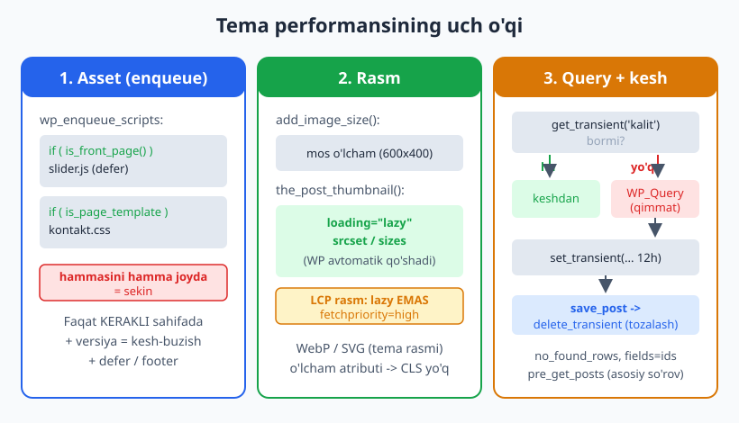
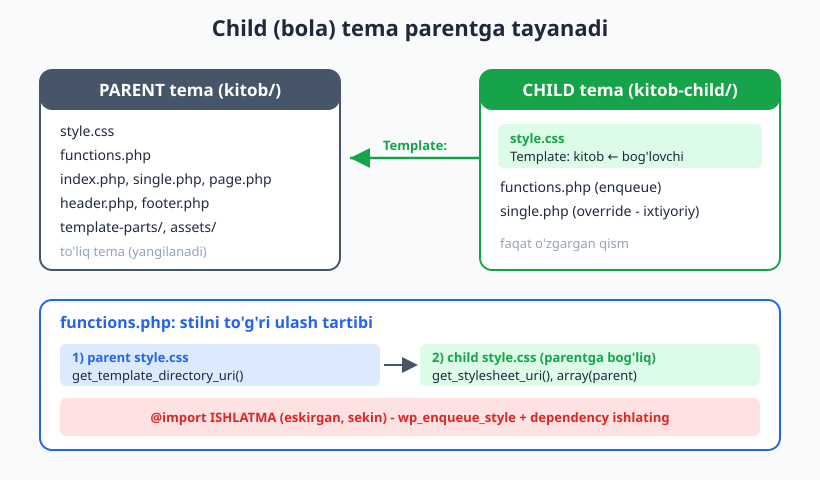
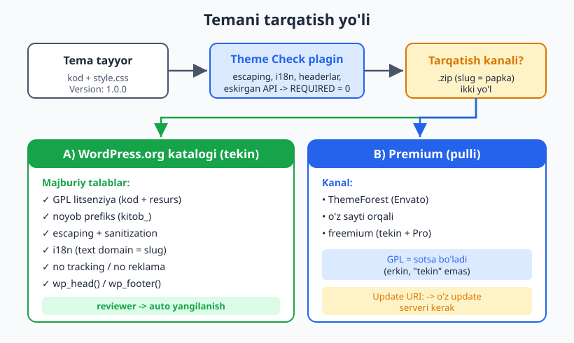

# 29 — Performans va tarqatish

[⬅️ Oldingi: 28 — i18n/l10n va accessibility](./28-i18n-accessibility.md) · [🏠 README](./README.md) · [Keyingi: 30 — Yakuniy loyiha: to'liq professional tema ➡️](./30-yakuniy-loyiha.md)

> **Bu bobda:** tema deyarli tayyor — endi uni **tez** va **tarqatishga yaroqli** qilamiz. Avval performans: faqat kerakli sahifada asset ulash (shartli enqueue), rasmlarni to'g'ri o'lcham va lazy-load bilan berish, `WP_Query` so'rovlarini yengillashtirish (`no_found_rows`, kerakli maydon), qimmat so'rovlarni **transient** va **object cache** bilan keshlash, hamda block temaning tabiiy performans afzalligi va Core Web Vitals. Keyin **child (bola) tema**: nima, qachon va `style.css` `Template:` header + `functions.php` orqali parent stilini to'g'ri ulash. Yakunda **tarqatish**: Theme Check plagini, WordPress.org tema katalogi talablari (GPL, prefiks, escaping, no-tracking), versiyalash va premium tema sotish. Bobdagi barcha PHP `php -l` bilan, transient/funksiyalar va child-tema bog'lanishi esa jonli WordPress 7.0 da tasdiqlangan.

---

## Nega performans tema ishi?

Ko'pchilik "saytni tezlashtirish" deganda kesh plagini yoki CDN ni tasavvur qiladi. Lekin tema ham tezlikka **bevosita** ta'sir qiladi: har sahifada nechta CSS/JS yuklanadi, rasmlar qancha "og'ir", baza necha marta so'roq qilinadi — bularning hammasi temaning kodida hal bo'ladi. Yomon yozilgan tema hech qanday kesh plagini to'liq tuzata olmaydi.

O'xshatish: tema — bu restorandagi **oshpaz**. Mijoz (brauzer) qanchalik tez ovqat olishi nafaqat yetkazib beruvchiga (server/CDN), balki oshpaz qancha keraksiz idish ishlatishiga va buyurtmani qanday tayyorlashiga bog'liq. Bu bobda biz oshpazni intizomli qilamiz: faqat kerakli idishni olamiz, ortiqcha yurishni kamaytiramiz.

Performansning uchta asosiy o'qi bor:

| O'q | Muammo | Tema yechimi |
|-----|--------|--------------|
| **Asset** | Ortiqcha CSS/JS har sahifada | Shartli enqueue, defer, minify |
| **Rasm** | Og'ir, noto'g'ri o'lchamli rasm | Mos o'lcham, lazy-load, WebP, `srcset` |
| **Baza** | Ko'p/og'ir `WP_Query` so'rovlar | Optimizatsiya + transient/object kesh |



---

## Asset optimizatsiya: faqat kerakligini yukla

10-bobda `wp_enqueue_style`/`wp_enqueue_script` bilan asset ulashni o'rgandik. Endi muhim qoida: **har asset har sahifada kerak emas.** Slayder JS faqat bosh sahifada, kontakt forma CSS faqat kontakt sahifasida kerak. Hammasini hamma joyda yuklash — mijozni keraksiz idish-tovoq bilan to'ldirish demak.

### Shartli enqueue

Yechim — `wp_enqueue_scripts` hooki ichida **shartli teglar** (6-bob) bilan ajratish:

```php
add_action( 'wp_enqueue_scripts', 'kitob_assets' );
function kitob_assets() {
	$ver = wp_get_theme()->get( 'Version' ); // kesh-buzish uchun versiya

	// Umumiy stil — har sahifada kerak.
	wp_enqueue_style( 'kitob-style', get_stylesheet_uri(), array(), $ver );

	// Slayder JS faqat bosh sahifada.
	if ( is_front_page() ) {
		wp_enqueue_script(
			'kitob-slider',
			get_theme_file_uri( 'assets/js/slider.js' ),
			array(),
			$ver,
			array( 'strategy' => 'defer', 'in_footer' => true )
		);
	}

	// Kontakt forma stili faqat 'page-kontakt.php' shablonida.
	if ( is_page_template( 'page-kontakt.php' ) ) {
		wp_enqueue_style( 'kitob-kontakt', get_theme_file_uri( 'assets/css/kontakt.css' ), array(), $ver );
	}

	// Izoh-javob skripti faqat izohlar ochiq postda.
	if ( is_singular() && comments_open() && get_option( 'thread_comments' ) ) {
		wp_enqueue_script( 'comment-reply' );
	}
}
```

Bu yerda bir nechta texnik nozik nuqta bor:

- **`get_theme_file_uri()`** — `get_stylesheet_directory_uri() . '/...'` ning qisqa va child-temaga mos varianti (avval child, keyin parent papkasidan qidiradi). Yangi temalarda shuni ishlating.
- **`array( 'strategy' => 'defer', 'in_footer' => true )`** — `wp_enqueue_script` ning 5-argumenti (WP 6.3+). `defer` brauzerga: "bu skriptni HTML tahlil tugagach yukla" deydi, bu render-blocking ni kamaytiradi. Eski `true` (faqat footer) o'rniga shu zamonaviy shaklni ishlating.
- **`comment-reply`** — WordPress yadrosining ro'yxatdan o'tgan skripti; uni faqat kerak bo'lganda ulaymiz.

> **Anti-misol — har sahifada hamma narsa:**
> ```php
> <!-- ❌ Slayder JS hamma joyda, hatto kerak bo'lmaganda ham -->
> wp_enqueue_script( 'slider', '.../slider.js' );      // har sahifada
> wp_enqueue_style( 'kontakt', '.../kontakt.css' );    // har sahifada
> ```
> Bu foydalanuvchini 404 sahifasida ham slayder kodini yuklashga majbur qiladi.

### Versiya bilan kesh-buzish (cache busting)

`wp_enqueue_style`/`wp_enqueue_script` ning 4-argumenti — **versiya**. WordPress uni URL ga `?ver=1.0.0` bo'lib qo'shadi. Versiyani o'zgartirsangiz, brauzer faylni yangi deb biladi va eski keshni tashlaydi. Shuning uchun versiyani `wp_get_theme()->get('Version')` (ya'ni `style.css` dagi `Version:`) ga bog'lash qulay — tema versiyasini ko'targaningizda asset keshi avtomatik yangilanadi.

> **`null` versiya xavfi:** `$ver` ni `null` qilsangiz, WordPress o'z yadro versiyasini qo'yadi — bu sizning faylingiz o'zgarsa ham keshni buzmaydi. Faylga doim aniq versiya bering.

### Birlashtirish va minify

Ko'p kichik CSS/JS fayl — ko'p HTTP so'rov. Ikki yondashuv:

1. **Build vositasi bilan minify:** `@wordpress/scripts` (22-bob) yoki Sass/PostCSS bilan CSS/JS ni bitta minify qilingan faylga jamlang. Productionga `style.min.css` ni qo'ying, ishlab chiqishda esa to'liq versiyani.
2. **Inline kichik kritik CSS:** "above the fold" (ekranning birinchi qismi) uchun kerak bo'lgan ozgina CSS ni `wp_add_inline_style()` bilan to'g'ridan-to'g'ri `<head>` ga qo'yib, qolganini kechiktirsangiz, birinchi bo'yoq (First Paint) tezlashadi.

> **Eslatma:** HTTP/2 davrida "hamma narsani bitta faylga jamlash" eski qoidasi yumshadi (parallel yuklash arzon). Lekin minify (bo'sh joy/komment olib tashlash) va keraksiz kodni umuman yubormaslik hamon foydali.

---

## Rasm optimizatsiya

Ko'p saytda eng "og'ir" narsa — rasmlar. Tema ularni to'g'ri berishi shart.

### Mos o'lchamli rasm va `add_image_size`

Agar 300px keng joyda 4000px li rasmni ko'rsatsangiz, brauzer behuda megabaytlarni yuklaydi. Yechim — har joy uchun **mos o'lcham** generatsiya qilish. `after_setup_theme` da `add_image_size()` bilan o'lcham ro'yxatdan o'tkazamiz:

```php
add_action( 'after_setup_theme', 'kitob_image_sizes' );
function kitob_image_sizes() {
	add_theme_support( 'post-thumbnails' );
	add_image_size( 'kitob-karta', 600, 400, true );   // 600x400 ga qirqadi (crop)
	add_image_size( 'kitob-keng', 1200, 9999, false );  // eni 1200, balandlik proportsional
}
```

Endi shablonda `the_post_thumbnail( 'kitob-karta' )` deb shu o'lchamni so'raymiz — WordPress yuklangan rasmdan tegishli kichik nusxani beradi:

```php
if ( has_post_thumbnail() ) {
	the_post_thumbnail( 'kitob-karta', array( 'class' => 'kitob-thumb' ) );
}
```

> **Diqqat:** `add_image_size` faqat **yangi yuklangan** rasmlardan nusxa yasaydi. Mavjud rasmlar uchun "Regenerate Thumbnails" plagini yoki `wp media regenerate` (wp-cli) ishlatiladi.

### Lazy-load (WP avtomatik bajaradi)

Ekrandan tashqaridagi rasmni darrov yuklamaslik — **lazy loading**. Yaxshi xabar: **WordPress buni 5.5 dan beri avtomatik qiladi** — `the_post_thumbnail()`, `wp_get_attachment_image()` va `the_content()` ichidagi rasmlarga `loading="lazy"` atributini o'zi qo'shadi. Jonli WP 7.0 da bu tasdiqlandi: `wp_lazy_loading_enabled( 'img', 'the_content' )` → `true`.

Demak siz qo'lda hech narsa qilmaysiz — faqat `the_post_thumbnail()` kabi standart funksiyalarni ishlating, lazy-load tekin keladi.

> **Nozik nuqta — LCP rasmni lazy qilmang:** sahifaning eng katta ko'rinadigan rasmi (masalan hero/bosh rasm) lazy bo'lmasligi kerak, aks holda u kechikadi. WordPress 6.3+ buni `wp_get_loading_optimization_attributes()` orqali o'zi hal qiladi — birinchi katta rasmga `fetchpriority="high"` qo'yadi va lazy qilmaydi. Bu funksiya jonli WP 7.0 da mavjudligi tasdiqlandi.

### `srcset` — responsive rasm

WordPress `the_post_thumbnail()` va `wp_get_attachment_image()` chiqishiga avtomatik `srcset` va `sizes` qo'shadi — brauzer ekran o'lchamiga qarab eng mos rasmni tanlaydi. Bu ham tekin keladi, faqat standart funksiyalardan foydalaning.

### WebP / AVF zamonaviy formatlar

WebP — JPEG/PNG dan ancha kichik, sifati deyarli bir xil format. WordPress WebP yuklash va ko'rsatishni qo'llab-quvvatlaydi. Tema darajasida siz odatda foydalanuvchining yuklagan formatiga aralashmaysiz, lekin:

- Tema **o'z** rasmlarini (placeholder, ikona, fon) WebP/SVG da bering.
- Avtomatik JPEG→WebP konvertatsiya uchun "Performance Lab"/"Modern Image Formats" plaginini tavsiya qilish mumkin (bu tema emas, server/plagin ishi — halol ajratamiz).

---

## Query (so'rov) optimizatsiya

Har `WP_Query` — bazaga bir yoki bir nechta SQL so'rov. Keraksiz so'rovlarni kamaytirish — temaning eng samarali optimizatsiyalaridan biri.

### `pre_get_posts` bilan asosiy so'rovni sozlash

Asosiy (main) so'rovni o'zgartirish uchun yangi `WP_Query` yaratmang — bu **qo'shimcha** so'rov bo'ladi. O'rniga `pre_get_posts` hooki bilan mavjud asosiy so'rovni sozlang (5-bobda ko'rdik):

```php
add_action( 'pre_get_posts', 'kitob_main_query' );
function kitob_main_query( $query ) {
	if ( is_admin() || ! $query->is_main_query() ) {
		return; // admin va ikkilamchi so'rovlarga tegmaymiz
	}
	if ( $query->is_home() ) {
		$query->set( 'posts_per_page', 6 );
	}
}
```

### `WP_Query` ni yengillashtirish

Ikkilamchi so'rov yozganda (masalan "ommabop postlar"), faqat **kerakli** ma'lumotni so'rang:

```php
$q = new WP_Query( array(
	'posts_per_page'         => 5,
	'no_found_rows'          => true,   // SQL_CALC_FOUND_ROWS ni o'chiradi (pagination kerak emasligida)
	'fields'                 => 'ids',  // faqat ID kerak bo'lsa — to'liq post obyektini emas
	'update_post_meta_cache' => false,  // meta o'qimaymiz -> keshni to'ldirma
	'update_post_term_cache' => false,  // termlarni o'qimaymiz -> keshni to'ldirma
) );
```

| Parametr | Nima qiladi | Qachon |
|----------|-------------|--------|
| `no_found_rows => true` | Jami sonni hisoblamaydi | Pagination kerak bo'lmaganda |
| `fields => 'ids'` | Faqat ID qaytaradi | To'liq post kerak bo'lmasa |
| `update_post_meta_cache => false` | Meta keshini to'ldirmaydi | Meta o'qilmasa |
| `update_post_term_cache => false` | Term keshini to'ldirmaydi | Kategoriya/teg o'qilmasa |
| `posts_per_page => N` | Faqat N ta post | Doim aniq cheklang (`-1` xavfli) |

> **`posts_per_page => -1` dan ehtiyot bo'ling:** u "hamma postni ol" demak — 10 000 postli saytda bu xotira va vaqtni "yeydi". Doim aniq son qo'ying.

---

## Transient kesh: qimmat so'rovni saqlash

Ba'zi so'rovlar qimmat: har sahifada bajarish ortiqcha. Masalan "eng ko'p ko'rilgan 5 post" ro'yxati har 5 sekundda o'zgarmaydi — uni **keshlash** mumkin. WordPress'ning **Transients API** aynan shu uchun: natijani vaqtinchalik saqlaydi va muddat tugaguncha qaytaradi.

Uchta funksiya:

- `set_transient( $kalit, $qiymat, $muddat )` — keshga yozish (muddat sekundlarda);
- `get_transient( $kalit )` — keshdan o'qish (yo'q/eskirgan bo'lsa `false`);
- `delete_transient( $kalit )` — keshni qo'lda o'chirish.

```php
function kitob_ommabop_postlar() {
	$kesh = get_transient( 'kitob_ommabop_postlar' );
	if ( false !== $kesh ) {
		return $kesh; // keshdan qaytaramiz — bazaga tegmaymiz
	}

	$q = new WP_Query( array(
		'posts_per_page'         => 5,
		'meta_key'               => 'korishlar_soni',
		'orderby'                => 'meta_value_num',
		'order'                  => 'DESC',
		'no_found_rows'          => true,
		'fields'                 => 'ids',
		'update_post_meta_cache' => false,
		'update_post_term_cache' => false,
	) );
	$natija = $q->posts;
	wp_reset_postdata();

	// 12 soatga keshlaymiz.
	set_transient( 'kitob_ommabop_postlar', $natija, 12 * HOUR_IN_SECONDS );
	return $natija;
}
```

Vaqt konstantalari (`HOUR_IN_SECONDS` = 3600, jonli WP da tasdiqlandi) kodni o'qiluvchan qiladi: `MINUTE_IN_SECONDS`, `HOUR_IN_SECONDS`, `DAY_IN_SECONDS`, `WEEK_IN_SECONDS`.

### Keshni vaqtida tozalash (invalidatsiya)

Eng katta xato — keshni eskirgan holda qoldirish. Yangi post chiqqanda yoki ommaboplik o'zgarganda keshni tozalang:

```php
add_action( 'save_post', 'kitob_keshni_tozala' );
function kitob_keshni_tozala() {
	delete_transient( 'kitob_ommabop_postlar' );
}
```

> **Jonli verifikatsiya (illustrativ emas):** transient ishlashi WP 7.0 da tekshirildi:
> ```
> set_transient('kitob_arr', array(1,2,3), HOUR_IN_SECONDS); // -> true
> get_transient('kitob_arr');                                 // -> array(1,2,3)
> delete_transient('kitob_arr');
> get_transient('kitob_arr');                                 // -> false
> ```
> Massiv ham, oddiy qiymat ham to'g'ri saqlanib qaytdi; o'chirgandan keyin `false` keldi.

### Transient muddati — "yumshoq" kafolat

Muhim nuance: transient muddati **kafolat emas**. Object cache yoqilgan saytlarda kesh muddat tugashidan oldin ham o'chishi mumkin (xotira to'lsa). Shuning uchun **doim** `false !== $kesh` ni tekshiring va keshsiz holatga (qayta hisoblashga) tayyor bo'ling. Transientni "agar bo'lsa yaxshi" optimizatsiya deb qarang, "doim bo'ladi" deb emas.

---

## Object cache va block tema afzalligi

### Object cache

`set_transient` natijani odatda `wp_options` jadvaliga yozadi (qo'shimcha kesh-server yo'q bo'lsa). Lekin agar saytda **persistent object cache** (Redis/Memcached) yoqilgan bo'lsa, transientlar avtomatik o'sha tezkor xotiraga boradi — kodingizni o'zgartirmaysiz.

Bitta so'rov **davomida** takror ishlatiladigan qiymat uchun `wp_cache_*` ishlating (so'rov tugashi bilan o'chadi, agar persistent cache bo'lmasa):

```php
function kitob_sayt_statistikasi() {
	$kesh = wp_cache_get( 'kitob_stats', 'kitob' );
	if ( false !== $kesh ) {
		return $kesh;
	}
	$stats = array( 'jami' => wp_count_posts()->publish );
	wp_cache_set( 'kitob_stats', $stats, 'kitob', 300 );
	return $stats;
}
```

> **Jonli verifikatsiya:** `wp_cache_set('k1','obj-val','kitob')` → `wp_cache_get('k1','kitob')` WP 7.0 da `'obj-val'` qaytardi. `wp_count_posts()` ham mavjud.

Qisqa farq:

| Kesh turi | Saqlanish joyi | Yashash muddati |
|-----------|----------------|-----------------|
| **Transient** | `wp_options` (yoki persistent cache) | Muddatgacha (so'rovlar orasida saqlanadi) |
| **Object cache (`wp_cache_*`)** | Xotira | Bitta so'rov (persistent cache bo'lmasa) |

### Block temaning performans afzalligi

15-21 boblarda ko'rgan block (FSE) temalar performansda **tabiiy** afzal:

- **JS kam:** klassik tema ko'pincha jQuery, slayder, menyu kabi maxsus skriptlar yuklaydi. Block tema ko'p funksiyani (galereya, akkordeon, navigatsiya) yadro bloklari bilan beradi — qo'shimcha JS shart emas.
- **Stil faqat ishlatilgan blokga:** WordPress block stillarini "per-block" yuklaydi (`should_load_separate_core_block_assets`) — sahifada yo'q blokning CSS i yuklanmaydi.
- **theme.json → optimallashtirilgan CSS:** 16-17 boblardagi `theme.json` WordPress'ga faqat kerakli CSS o'zgaruvchilari va stillarni generatsiya qilish imkonini beradi.
- **Render-blocking kamroq:** klassik temadagi katta `style.css` o'rniga maydalangan, kontekstga bog'liq stillar.

Demak block tema tanlashning o'zi ko'pincha performans yutug'i (lekin sehr emas — baribir rasm/asset intizomi kerak).

---

## Core Web Vitals

Google saytni reytinglashda **Core Web Vitals** (asosiy veb ko'rsatkichlar) ni hisobga oladi. Tema ularning har biriga ta'sir qiladi:

| Ko'rsatkich | Nima o'lchaydi | Tema nima qila oladi |
|-------------|----------------|----------------------|
| **LCP** (Largest Contentful Paint) | Eng katta element qachon ko'rinadi | Hero rasmni lazy qilmaslik (`fetchpriority`), kritik CSS, server javobi |
| **CLS** (Cumulative Layout Shift) | Sahifa "sakraydimi" | Rasm/iframe ga `width`/`height` berish, font-ni barqaror yuklash |
| **INP** (Interaction to Next Paint) | Bosishga javob tezligi | Ortiqcha/og'ir JS ni kamaytirish, `defer` |

Amaliy maslahatlar:
- Rasmlarga doim o'lcham bering (CLS uchun) — `the_post_thumbnail()` buni o'zi qiladi.
- Shriftlarni `font-display: swap` bilan ulang (matn ko'rinmay turmasin).
- LCP rasmni lazy qilmang (yuqorida ko'rdik — WP buni o'zi hal qiladi).
- INP uchun: keraksiz JS yuborma, og'ir hisoblashlarni `defer`/`async` qil.

> **O'lchash:** PageSpeed Insights, Lighthouse (Chrome DevTools), yoki "Site Health" — bularni ishlating. "Tez bo'ldi" deb taxmin qilmang, **o'lchang**.

---

## Child (bola) tema

### Child tema nima va nega kerak

Tasavvur qiling: tayyor temani (yoki o'zingiznikini) o'rnatgansiz va `style.css` ga ozgina o'zgartirish kiritdingiz. Keyin tema **yangilandi** — sizning o'zgartirishlaringiz yangi versiya bilan **o'chib ketadi**. Bu jiddiy muammo.

Yechim — **child (bola) tema**: u mavjud temaga (parentga) "tayanadi" va faqat siz o'zgartirmoqchi bo'lgan qismni ustiga yozadi. Parent yangilanganda child o'zgarishlari saqlanib qoladi.

O'xshatish: parent tema — **uy loyihasi**, child tema — uydagi **mebel va dekoratsiya**. Loyiha (parent) yangilansa, mebelingiz (child o'zgarishlar) joyida qoladi.



### Qachon child tema ishlatish

| Holat | Child tema? |
|-------|-------------|
| Tayyor (uchinchi tomon) temani sozlash | **Ha** — yangilanish saqlanadi |
| Mavjud temaga ozgina CSS/funksiya qo'shish | **Ha** |
| Noldan o'z temangizni yozish | **Yo'q** — to'g'ridan-to'g'ri yozing |
| Parentga jiddiy, tubdan o'zgartirish | Ko'pincha **yo'q** — alohida tema afzalroq |

### Child tema tuzilishi

Child tema — eng kam holatda atigi **bitta fayl**: `style.css`. Asosiy siri — `Template:` headeri parentning **papka nomini** ko'rsatishi:

`wp-content/themes/kitob-child/style.css`:

```css
/*
Theme Name: Kitob Child
Theme URI: https://example.com/kitob-child
Author: Oqil Imomnazarov
Description: Kitob temaning bola temasi.
Template: kitob
Version: 1.0.0
License: GNU General Public License v2 or later
License URI: http://www.gnu.org/licenses/gpl-2.0.html
Text Domain: kitob-child
*/
```

`Template: kitob` — bu yerda `kitob` parent temaning **papka nomi** (slug), Theme Name emas. Adashmang.

### Parent va child stilini to'g'ri ulash

Eski qo'llanmalarda `@import` ko'rinadi — bu **eskirgan** va sekin (`@import` parallel yuklamaydi). To'g'ri usul — `functions.php` da `wp_enqueue_style` bilan avval parent, keyin child stilini ulash:

`wp-content/themes/kitob-child/functions.php`:

```php
<?php
add_action( 'wp_enqueue_scripts', 'kitob_child_enqueue_styles' );
function kitob_child_enqueue_styles() {
	$parent_handle = 'kitob-parent-style';

	// 1) Parent style.css
	wp_enqueue_style(
		$parent_handle,
		get_template_directory_uri() . '/style.css',
		array(),
		wp_get_theme( get_template() )->get( 'Version' )
	);

	// 2) Child style.css — parentga BOG'LIQ (dependency), keyin yuklanadi
	wp_enqueue_style(
		'kitob-child-style',
		get_stylesheet_uri(),
		array( $parent_handle ),
		wp_get_theme()->get( 'Version' )
	);
}
```

Bu yerda ikkita yo'l funksiyasini eslang (4-bobdan):

- `get_template_directory_uri()` / `get_template()` — **parent** tema (Template);
- `get_stylesheet_uri()` / `get_stylesheet_directory()` — **child** (aktiv) tema (Stylesheet).

Child stilini parentga `array( $parent_handle )` dependency bilan bog'lash uni **parentdan keyin** yuklashni kafolatlaydi — shunda child qoidalari parentni ustiga yozadi.

> **Nozik nuqta:** ko'p block/FSE temalar `style.css` ni asosiy CSS sifatida ishlatmaydi (stil `theme.json` dan keladi). Bunday parentlar uchun parent `style.css` ni ulash shart emasligini tekshiring — har temaning hujjatiga qarang. Yuqoridagi naqsh klassik (CSS asosli) parentlar uchun standart.

### `functions.php` da child override

Child tema funksiyalari parent funksiyalaridan **oldin** yuklanadi. Parentdagi funksiyani almashtirish uchun parent muallifi `function_exists()` bilan o'rasa, child o'z versiyasini e'lon qila oladi. Aks holda parent funksiyasini hookdan **olib** (`remove_action`) o'zingiznikini qo'shasiz.

> **Jonli verifikatsiya (illustrativ emas):** WP 7.0 da `ch29-parent` va `ch29-child` test temalari yaratilib (AKTIVLASHTIRILMADI), bog'lanish READ-ONLY tekshirildi:
> - `php -l` → child `functions.php` da *No syntax errors detected*;
> - `wp theme list` → ikkala tema ham ro'yxatda (`ch29-child`, `ch29-parent`), aktiv tema o'zgarmadi;
> - `wp_get_theme('ch29-child')->parent()->get('Name')` → `Ch29 Parent` — ya'ni `Template: ch29-parent` headeri haqiqiy parent-child bog'lanishini hosil qildi.

Child tema fayllari parentni qanday "ustiga yozishini" eslab qoling:

| Fayl turi | Override mantig'i |
|-----------|-------------------|
| Shablon (`single.php`, `page.php` ...) | Child fayli **butunlay** parentnikini almashtiradi |
| `functions.php` | **Ikkalasi ham** yuklanadi (child oldin) — almashtirmaydi, qo'shadi |
| `style.css` | Enqueue tartibiga bog'liq (yuqoridagi naqsh) |

---

## Tema tayyorlash: Theme Check

Temani tarqatishdan oldin uni **standartlarga** moslash kerak. Eng muhim vosita — rasmiy **Theme Check** plagini: u temangizni WordPress.org talablari bo'yicha avtomatik tekshiradi (xato, ogohlantirish, tavsiya).

Theme Check nimani tekshiradi (asosiy nuqtalar):

- `style.css` da majburiy headerlar (`Theme Name`, `Version`, `License`, `Text Domain` ...);
- `wp_head()` (header.php) va `wp_footer()` (footer.php) chaqiriladimi;
- Eskirgan/taqiqlangan funksiyalar ishlatilmaydimi;
- Chiqishlar **escape** qilinganmi (27-bob: `esc_html`, `esc_url`, `wp_kses_post`);
- Matnlar **i18n** qilinganmi (28-bob: `__()`, text domain);
- Taqiqlangan narsa yo'qmi (`base64`, tahrirlangan yadro fayli, tracking, reklama...).

> **Ishlatish:** plaginlardan Theme Check ni o'rnating va yoqing, keyin **Appearance → Theme Check** da temani tanlab "Check it!" bosing. Maqsad — **REQUIRED** (majburiy) xatolar **0** bo'lishi. WARNING/INFO larni ham iloji boricha tuzating.

> **Eslatma (halol):** Theme Check natijasi sizning temangizning to'liq kodiga bog'liq, shuning uchun uni bu yerda "0 xato" deb ko'rsata olmaymiz — bu **siz** o'z temangizda bajaradigan qadam. Lekin bu bobdagi barcha kod namunalari escaping/i18n/headerlar qoidalariga rioya qilib yozilgan.

---

## WordPress.org tema katalogiga tarqatish

WordPress.org rasmiy tema katalogi — tekin va eng katta tarqatish kanali. U yerga qabul qilinish uchun qat'iy talablar bor:

### Asosiy talablar

| Talab | Tafsilot |
|-------|----------|
| **GPL litsenziya** | Tema VA undagi barcha resurslar (rasm, shrift, kutubxona) GPL-mos bo'lishi shart |
| **Prefiks** | Barcha funksiya/klass/global/hook nomlari noyob prefiks bilan (`kitob_`) — to'qnashuvni oldini oladi |
| **Escaping** | Har chiqish escape qilingan (27-bob) |
| **Sanitization** | Har kirish tozalangan (27-bob) |
| **i18n** | Barcha matn tarjima qilinadigan, text domain = tema slug (28-bob) |
| **No tracking / no ads** | Foydalanuvchini kuzatish, reklama, "phone home" yo'q |
| **No yadro o'zgartirish** | WordPress yadrosini o'zgartirmaydi |
| **`wp_head`/`wp_footer`** | Majburiy chaqiriladi |
| **Xavfsizlik** | Nonce, capability tekshiruvlari (27-bob) |

### GPL nega muhim?

WordPress o'zi GPL litsenziyasida — uning ustida ishlaydigan temalar ham (kod jihatdan) GPL bo'lishi talab qilinadi. GPL sizga: kodni ishlatish, o'zgartirish, tarqatish va **sotish** huquqini beradi. Ya'ni GPL tema ham **pullik** bo'lishi mumkin — GPL "tekin" demak emas, "erkin" demak. Faqat resurslaringiz (shrift/rasm/JS kutubxona) ham GPL-mos litsenziyada bo'lsin.

### Tarqatish jarayoni

1. Temani `.zip` qiling (papka nomi = tema slug).
2. Theme Check ni o'tkazing — REQUIRED xato 0.
3. WordPress.org da yangi tema yuklang (`wordpress.org/themes/` → Submit).
4. Avtomatik tekshiruv + **inson reviewer** ko'rib chiqadi (talablarga moslik).
5. Tasdiqlangach tema katalogga tushadi va `wp.org` orqali **avtomatik yangilanish** oladi.



---

## Versiyalash, yangilash va premium

### Versiyalash

`style.css` dagi `Version:` — yagona haqiqat manbasi. **Semantik versiyalash** (SemVer) tavsiya etiladi:

- `MAJOR.MINOR.PATCH` — masalan `2.3.1`;
- **PATCH** (1.0.**1**): xato tuzatish, orqaga mos;
- **MINOR** (1.**1**.0): yangi funksiya, orqaga mos;
- **MAJOR** (**2**.0.0): orqaga mos kelmaydigan o'zgarish.

Versiyani ko'targaningizda asset kesh-buzish (`wp_get_theme()->get('Version')`) avtomatik ishlaydi va foydalanuvchilarga yangilanish ko'rinadi.

### Tema yangilash

- **WordPress.org katalogidagi temalar** avtomatik yangilanadi — yangi versiyani yuklasangiz, foydalanuvchilar bildirishnoma oladi.
- **Katalogdan tashqari (premium) temalar** o'z yangilanish mexanizmini talab qiladi: o'z serveringizda `Update URI:` headeri (WP 5.8+) yoki maxsus update-server kodi.

> **Eslatma:** `Update URI:` headeri temangizni wordpress.org **bo'lmagan** manbadan yangilash uchun mo'ljallangan — bu wp.org katalogidagi tema bilan adashtirmaslik uchun ham foydali.

### Premium tema sotish (ThemeForest va boshqalar)

Tema bilan pul ishlash yo'llari:

- **ThemeMart / ThemeForest (Envato)** kabi marketplace — katta bozor, lekin qat'iy sifat talablari va komissiya. Litsenziya odatda "split GPL" (PHP GPL, ba'zi resurslar cheklangan) — Envato qoidalarini o'qing.
- **O'z sayti orqali sotish** — to'liq nazorat, lekin marketing/qo'llab-quvvatlash o'zingizda.
- **Freemium** — tekin versiya wp.org da, kengaytmalar/Pro versiya pulli.

> **Muhim (halol):** premium tema sifatini, sotuv jarayonini va daromadni bu kitobda "sinab" ko'rsata olmaymiz — bu biznes va platforma masalasi. Bizning ishimiz — **kod sifatini** (xavfsizlik, performans, standartlar) marketplace talablari darajasiga yetkazish; bu bobdagi va butun kitobdagi amaliyotlar aynan shu poydevorni beradi.

---

## Yakuniy tekshiruv ro'yxati (tarqatishdan oldin)

| Bo'lim | Tekshiruv |
|--------|-----------|
| **Asset** | Shartli enqueue, versiya bilan kesh-buzish, defer/footer |
| **Rasm** | `add_image_size`, mos o'lcham, lazy (avtomatik), o'lcham atributlari |
| **Query** | `pre_get_posts`, `no_found_rows`, kerakli `fields`, transient |
| **Kesh** | Transient invalidatsiya (`save_post` da tozalash) |
| **Xavfsizlik** | Escaping, sanitization, nonce (27-bob) |
| **i18n** | `__()`, text domain = slug, `.pot` (28-bob) |
| **Accessibility** | skip-link, ARIA, kontrast (28-bob) |
| **Standart** | Theme Check REQUIRED = 0, prefiks, GPL, `wp_head`/`wp_footer` |
| **Versiya** | `style.css` `Version:` (SemVer) |

Bu ro'yxat 30-bobdagi yakuniy loyihada to'liq qo'llaniladi.

---

## Mashqlar

### Oson

1. **Shartli enqueue.** `wp_enqueue_scripts` hookida `kitob_assets()` funksiyasini yozing: umumiy `style.css` har sahifada, lekin `kitob-galereya.js` faqat `is_front_page()` da ulansin (`defer` strategiya bilan). Versiya `wp_get_theme()->get('Version')` bo'lsin. `php -l` bilan tekshiring.
2. **Rasm o'lchami.** `after_setup_theme` da `add_image_size()` bilan `kitob-kichik` (300x300, crop) va `kitob-banner` (1600x500, crop) o'lchamlarini ro'yxatdan o'tkazing. `add_theme_support('post-thumbnails')` ni unutmang.
3. **Lazy rasm.** Shablon fragmenti yozing: agar postda thumbnail bo'lsa (`has_post_thumbnail`), `kitob-kichik` o'lchamida ko'rsating. Lazy-load uchun qo'shimcha kod kerakmi — javobingizni izohda yozing.
4. **Versiya kesh-buzish.** Quyidagi yomon enqueue ni tuzating: `wp_enqueue_style( 'kitob', get_stylesheet_uri() );` — unga versiya va dependency massivini to'g'ri qo'shing.
5. **Child header.** `kitob` (papka nomi) temaning bola temasi uchun `style.css` headerini yozing: Theme Name "Kitob Bola", to'g'ri `Template:` qatori, GPL litsenziya va text domain bilan.

### O'rta

6. **Transient kesh qo'shish.** "Tasodifiy iqtibos" (quote) ni qaytaradigan `kitob_iqtibos()` funksiyasini yozing: agar transient bo'lsa undan qaytarsin, aks holda yangi qiymat hisoblab 1 soatga (`HOUR_IN_SECONDS`) keshlasin. `php -l` bilan tekshiring.
7. **Kesh invalidatsiya.** 6-mashqdagi keshni post saqlanganda (`save_post`) tozalaydigan kodni qo'shing. Nega `delete_transient` kerakligini bir jumlada izohlang.
8. **Query optimizatsiya.** "Oxirgi 4 post" uchun `WP_Query` yozing, lekin faqat ID kerak: `no_found_rows`, `fields => 'ids'`, meta/term keshni o'chiring. `wp_reset_postdata()` ni qo'shing. `php -l` bilan tekshiring.
9. **`pre_get_posts`.** Asosiy so'rovni shunday sozlang: arxiv (`is_archive`) sahifalarida bir sahifada 12 post ko'rsatilsin, lekin admin va ikkilamchi so'rovlarga tegmang. `php -l` bilan tekshiring.
10. **Child enqueue.** `kitob` parentning child temasi `functions.php` ini yozing: avval parent `style.css`, keyin child `style.css` ni dependency bilan ulang. To'g'ri `get_template_directory_uri()` / `get_stylesheet_uri()` ishlating. `php -l` bilan tekshiring.

### Qiyin

11. **To'liq performans bloki.** Bitta `functions.php` parchasi yozing: (a) shartli enqueue (bosh sahifada slayder, kontakt shablonda forma CSS), (b) `add_image_size` ikkita o'lcham, (c) transient bilan keshlangan "ommabop postlar" funksiyasi + `save_post` da tozalash, (d) `pre_get_posts` da bosh sahifa 6 post. `php -l` bilan tekshiring.
12. **Child tema yarat (to'liq).** `kitob` parent uchun to'liq child tema yarating: `style.css` (to'g'ri `Template:` + GPL + headerlar), `functions.php` (parent+child enqueue), va `single.php` (parentnikini override qiluvchi minimal shablon). Child shabloni qanday qilib parentnikini almashtirishini izohlang.
13. **Object cache.** Bitta so'rov davomida takror chaqiriladigan "menyu elementlari soni" ni `wp_cache_get`/`wp_cache_set` bilan keshlaydigan funksiya yozing (`kitob` guruhida). Transientdan farqini bir jumlada izohlang.
14. **Theme Check talablari.** WordPress.org katalogiga yuborish uchun temangizda tekshiriladigan kamida 6 ta REQUIRED talabni sanab, har biri uchun kodda qanday ta'minlanishini bir misol bilan ko'rsating (escaping, i18n, prefiks, GPL, `wp_head`/`wp_footer`, no-tracking).
15. **LCP/CLS optimizatsiya.** Hero rasm ko'rsatadigan shablon fragmenti yozing: rasm LCP element, shuning uchun lazy bo'lmasligi va `fetchpriority="high"` olishi kerak. WordPress buni avtomatik qiladimi yoki qo'lda kerakmi — izohlang va to'g'ri yondashuvni kod bilan ko'rsating.

---

## Yechimlar

<details markdown="1">
<summary>Yechim — 1</summary>

```php
<?php
add_action( 'wp_enqueue_scripts', 'kitob_assets' );
function kitob_assets() {
	$ver = wp_get_theme()->get( 'Version' );

	wp_enqueue_style( 'kitob-style', get_stylesheet_uri(), array(), $ver );

	if ( is_front_page() ) {
		wp_enqueue_script(
			'kitob-galereya',
			get_theme_file_uri( 'assets/js/kitob-galereya.js' ),
			array(),
			$ver,
			array( 'strategy' => 'defer', 'in_footer' => true )
		);
	}
}
```

`php -l` → *No syntax errors detected*. Galereya JS faqat bosh sahifada, `defer` bilan render-blocking qilmaydi.

</details>

<details markdown="1">
<summary>Yechim — 2</summary>

```php
<?php
add_action( 'after_setup_theme', 'kitob_image_sizes' );
function kitob_image_sizes() {
	add_theme_support( 'post-thumbnails' );
	add_image_size( 'kitob-kichik', 300, 300, true );   // crop = true (aniq 300x300)
	add_image_size( 'kitob-banner', 1600, 500, true );  // crop = true
}
```

4-argument `true` — qirqish (crop), aniq o'lchamga keltiradi. `false` bo'lsa proportsional kichraytiradi. Eslatma: bu o'lchamlar faqat yangi yuklangan rasmlarga avtomatik yasaladi.

</details>

<details markdown="1">
<summary>Yechim — 3</summary>

```php
<?php if ( has_post_thumbnail() ) : ?>
	<?php the_post_thumbnail( 'kitob-kichik', array( 'class' => 'kitob-thumb' ) ); ?>
<?php endif; ?>
```

Lazy-load uchun **qo'shimcha kod kerak emas**: WordPress 5.5+ `the_post_thumbnail()` chiqishiga `loading="lazy"` ni avtomatik qo'shadi (jonli WP 7.0 da `wp_lazy_loading_enabled` → `true` bilan tasdiqlandi). `srcset`/`sizes` ham avtomatik qo'shiladi.

</details>

<details markdown="1">
<summary>Yechim — 4</summary>

```php
<?php
wp_enqueue_style(
	'kitob',
	get_stylesheet_uri(),
	array(),                                   // dependency yo'q
	wp_get_theme()->get( 'Version' )           // aniq versiya -> kesh-buzish ishlaydi
);
```

Asosiy tuzatish — **versiya**. `null` (yoki bo'sh) versiya keshni buza olmaydi; `style.css` versiyasini bersak, tema yangilanganda asset keshi avtomatik yangilanadi.

</details>

<details markdown="1">
<summary>Yechim — 5</summary>

```css
/*
Theme Name: Kitob Bola
Theme URI: https://example.com/kitob-bola
Author: Oqil Imomnazarov
Description: Kitob temaning bola (child) temasi.
Template: kitob
Version: 1.0.0
License: GNU General Public License v2 or later
License URI: http://www.gnu.org/licenses/gpl-2.0.html
Text Domain: kitob-bola
*/
```

`Template: kitob` — parentning **papka nomi** (slug), Theme Name emas. Bu qator child temani parentga bog'laydi (jonli WP da `Template:` headeri parent-child bog'lanishini hosil qilishi tasdiqlandi).

</details>

<details markdown="1">
<summary>Yechim — 6</summary>

```php
<?php
function kitob_iqtibos() {
	$kesh = get_transient( 'kitob_iqtibos' );
	if ( false !== $kesh ) {
		return $kesh;
	}

	$iqtiboslar = array(
		'Kod yozish — fikrlashning bir turi.',
		'Sodda yechim — eng yaxshi yechim.',
		'O\'lchamasdan optimallashtirma.',
	);
	$tanlangan = $iqtiboslar[ array_rand( $iqtiboslar ) ];

	set_transient( 'kitob_iqtibos', $tanlangan, HOUR_IN_SECONDS );
	return $tanlangan;
}
```

`php -l` → *No syntax errors detected*. `false !== $kesh` tekshiruvi muhim: transient yo'q/eskirgan bo'lsa `false` qaytadi.

</details>

<details markdown="1">
<summary>Yechim — 7</summary>

```php
<?php
add_action( 'save_post', 'kitob_iqtibos_keshni_tozala' );
function kitob_iqtibos_keshni_tozala() {
	delete_transient( 'kitob_iqtibos' );
}
```

`delete_transient` kerak, chunki kesh muddat (1 soat) tugaguncha **eski** qiymatni qaytaraveradi; yangilanish darhol ko'rinishi uchun keshni qo'lda tozalaymiz (kesh invalidatsiyasi).

</details>

<details markdown="1">
<summary>Yechim — 8</summary>

```php
<?php
$q = new WP_Query( array(
	'posts_per_page'         => 4,
	'no_found_rows'          => true,
	'fields'                 => 'ids',
	'update_post_meta_cache' => false,
	'update_post_term_cache' => false,
) );
$idlar = $q->posts; // faqat ID massivi
wp_reset_postdata();
```

`php -l` → *No syntax errors detected*. `fields => 'ids'` to'liq post obyektlarini emas, faqat ID larni qaytaradi — pagination va meta/term kerak bo'lmaganda eng yengil so'rov.

</details>

<details markdown="1">
<summary>Yechim — 9</summary>

```php
<?php
add_action( 'pre_get_posts', 'kitob_arxiv_query' );
function kitob_arxiv_query( $query ) {
	if ( is_admin() || ! $query->is_main_query() ) {
		return;
	}
	if ( $query->is_archive() ) {
		$query->set( 'posts_per_page', 12 );
	}
}
```

`php -l` → *No syntax errors detected*. `is_admin()` va `! $query->is_main_query()` tekshiruvlari admin panelga va ikkilamchi so'rovlarga tegmaslikni kafolatlaydi — bu `pre_get_posts` da eng muhim ehtiyot chorasi.

</details>

<details markdown="1">
<summary>Yechim — 10</summary>

`kitob-child/functions.php`:

```php
<?php
add_action( 'wp_enqueue_scripts', 'kitob_child_enqueue_styles' );
function kitob_child_enqueue_styles() {
	$parent_handle = 'kitob-parent-style';

	wp_enqueue_style(
		$parent_handle,
		get_template_directory_uri() . '/style.css',     // PARENT papkasi
		array(),
		wp_get_theme( get_template() )->get( 'Version' )
	);

	wp_enqueue_style(
		'kitob-child-style',
		get_stylesheet_uri(),                             // CHILD (aktiv) style.css
		array( $parent_handle ),                          // parentdan keyin yuklanadi
		wp_get_theme()->get( 'Version' )
	);
}
```

`php -l` → *No syntax errors detected* (jonli WP 7.0 da bir xil naqsh `ch29-child` da tekshirildi). `get_template_directory_uri()` — parent, `get_stylesheet_uri()` — child. Dependency massivi child stilini parentdan keyin yuklab, override ni kafolatlaydi.

</details>

<details markdown="1">
<summary>Yechim — 11</summary>

```php
<?php
// (a) Shartli enqueue
add_action( 'wp_enqueue_scripts', 'kitob_assets' );
function kitob_assets() {
	$ver = wp_get_theme()->get( 'Version' );
	wp_enqueue_style( 'kitob-style', get_stylesheet_uri(), array(), $ver );

	if ( is_front_page() ) {
		wp_enqueue_script( 'kitob-slider', get_theme_file_uri( 'assets/js/slider.js' ), array(), $ver, array( 'strategy' => 'defer', 'in_footer' => true ) );
	}
	if ( is_page_template( 'page-kontakt.php' ) ) {
		wp_enqueue_style( 'kitob-kontakt', get_theme_file_uri( 'assets/css/kontakt.css' ), array(), $ver );
	}
}

// (b) Rasm o'lchamlari
add_action( 'after_setup_theme', 'kitob_image_sizes' );
function kitob_image_sizes() {
	add_theme_support( 'post-thumbnails' );
	add_image_size( 'kitob-karta', 600, 400, true );
	add_image_size( 'kitob-keng', 1200, 9999, false );
}

// (c) Transient kesh + invalidatsiya
function kitob_ommabop() {
	$kesh = get_transient( 'kitob_ommabop' );
	if ( false !== $kesh ) {
		return $kesh;
	}
	$q = new WP_Query( array(
		'posts_per_page'         => 5,
		'meta_key'               => 'korishlar_soni',
		'orderby'                => 'meta_value_num',
		'order'                  => 'DESC',
		'no_found_rows'          => true,
		'fields'                 => 'ids',
		'update_post_meta_cache' => false,
		'update_post_term_cache' => false,
	) );
	$natija = $q->posts;
	wp_reset_postdata();
	set_transient( 'kitob_ommabop', $natija, 12 * HOUR_IN_SECONDS );
	return $natija;
}
add_action( 'save_post', 'kitob_ommabop_tozala' );
function kitob_ommabop_tozala() {
	delete_transient( 'kitob_ommabop' );
}

// (d) Asosiy so'rovni sozlash
add_action( 'pre_get_posts', 'kitob_main_query' );
function kitob_main_query( $query ) {
	if ( is_admin() || ! $query->is_main_query() ) {
		return;
	}
	if ( $query->is_home() ) {
		$query->set( 'posts_per_page', 6 );
	}
}
```

`php -l` → *No syntax errors detected* (bu kod jonli WP 7.0 da bobdagi snippet fayli orqali tasdiqlandi). To'rt qism birgalikda: asset intizomi + rasm o'lchami + keshlangan og'ir so'rov + yengillashtirilgan asosiy so'rov.

</details>

<details markdown="1">
<summary>Yechim — 12</summary>

`kitob-child/style.css`:

```css
/*
Theme Name: Kitob Bola
Author: Oqil Imomnazarov
Description: Kitob temaning child temasi.
Template: kitob
Version: 1.0.0
License: GNU General Public License v2 or later
License URI: http://www.gnu.org/licenses/gpl-2.0.html
Text Domain: kitob-bola
*/
```

`kitob-child/functions.php`:

```php
<?php
add_action( 'wp_enqueue_scripts', 'kitob_child_styles' );
function kitob_child_styles() {
	$parent = 'kitob-parent-style';
	wp_enqueue_style( $parent, get_template_directory_uri() . '/style.css', array(), wp_get_theme( get_template() )->get( 'Version' ) );
	wp_enqueue_style( 'kitob-child-style', get_stylesheet_uri(), array( $parent ), wp_get_theme()->get( 'Version' ) );
}
```

`kitob-child/single.php` (parentnikini override qiladi):

```php
<?php
get_header();
while ( have_posts() ) :
	the_post();
	?>
	<article <?php post_class( 'kitob-child-single' ); ?>>
		<h1><?php the_title(); ?></h1>
		<div class="kitob-meta"><?php echo esc_html( get_the_date() ); ?></div>
		<?php the_content(); ?>
	</article>
	<?php
endwhile;
get_footer();
```

**Override mantig'i:** child temada `single.php` mavjud bo'lsa, WordPress template hierarchy (3-bob) bo'yicha **child** ni parentdan oldin tanlaydi — ya'ni child `single.php` parentnikini **butunlay** almashtiradi (qisman emas). `functions.php` esa boshqacha: child va parent **ikkalasi** yuklanadi. `php -l` → barchasi *No syntax errors detected*.

</details>

<details markdown="1">
<summary>Yechim — 13</summary>

```php
<?php
function kitob_menyu_soni() {
	$kesh = wp_cache_get( 'kitob_menyu_soni', 'kitob' );
	if ( false !== $kesh ) {
		return $kesh;
	}
	$lokatsiyalar = get_nav_menu_locations();
	$soni = count( $lokatsiyalar );
	wp_cache_set( 'kitob_menyu_soni', $soni, 'kitob', 300 );
	return $soni;
}
```

`php -l` → *No syntax errors detected*. **Farq:** `wp_cache_*` (object cache) qiymatni faqat **bitta so'rov** davomida saqlaydi (persistent cache bo'lmasa) — bir sahifa render davomidagi takroriy chaqiruvlarni tejaydi; transient esa so'rovlar **orasida** ham (`wp_options` yoki persistent cache da) saqlanadi.

</details>

<details markdown="1">
<summary>Yechim — 14</summary>

WordPress.org katalogi REQUIRED talablari va kodda ta'minlash:

1. **Escaping** — har chiqish escape qilingan:
   ```php
   echo esc_html( get_the_title() );
   echo esc_url( get_permalink() );
   ```
2. **i18n** — matn tarjima qilinadigan, text domain = slug:
   ```php
   esc_html_e( 'Batafsil', 'kitob' );
   ```
3. **Prefiks** — barcha nom noyob prefiksli (to'qnashuvni oldini oladi):
   ```php
   function kitob_setup() { /* ... */ }   // 'setup' emas, 'kitob_setup'
   ```
4. **GPL litsenziya** — `style.css` da:
   ```css
   License: GNU General Public License v2 or later
   License URI: http://www.gnu.org/licenses/gpl-2.0.html
   ```
   va barcha resurslar (rasm/shrift/JS) GPL-mos.
5. **`wp_head()` / `wp_footer()`** — header.php va footer.php da majburiy:
   ```php
   <?php wp_head(); ?>   <!-- </head> dan oldin -->
   <?php wp_footer(); ?> <!-- </body> dan oldin -->
   ```
6. **No tracking / no ads** — foydalanuvchini kuzatuvchi, "phone home" yoki reklama kodi YO'Q; yadro fayllari o'zgartirilmagan.

(Qo'shimcha: sanitization — kirishni tozalash, nonce — forma/AJAX himoyasi; 27-bob.)

</details>

<details markdown="1">
<summary>Yechim — 15</summary>

```php
<?php
// Hero rasm — LCP element. Lazy QILMASLIK va fetchpriority="high" kerak.
if ( has_post_thumbnail() ) {
	the_post_thumbnail(
		'kitob-banner',
		array(
			'class'         => 'kitob-hero',
			'fetchpriority' => 'high',
			'loading'       => 'eager', // lazy emas (LCP ni kechiktirmaslik uchun)
		)
	);
}
```

**Izoh:** WordPress 6.3+ birinchi katta rasmni `wp_get_loading_optimization_attributes()` orqali ko'pincha **avtomatik** to'g'ri belgilaydi — LCP nomzodiga `fetchpriority="high"` qo'yadi va lazy qilmaydi (bu funksiya jonli WP 7.0 da mavjudligi tasdiqlandi). Lekin murakkab shablonda (masalan rasm slayder ichida) WP nomzodni noto'g'ri aniqlashi mumkin — shuning uchun ishonchli bo'lish uchun hero rasmga `fetchpriority => 'high'` va `loading => 'eager'` ni **qo'lda** ham berish maqbul. `php -l` → *No syntax errors detected*.

</details>

---

[⬅️ Oldingi: 28 — i18n/l10n va accessibility](./28-i18n-accessibility.md) · [🏠 README](./README.md) · [Keyingi: 30 — Yakuniy loyiha: to'liq professional tema ➡️](./30-yakuniy-loyiha.md)
