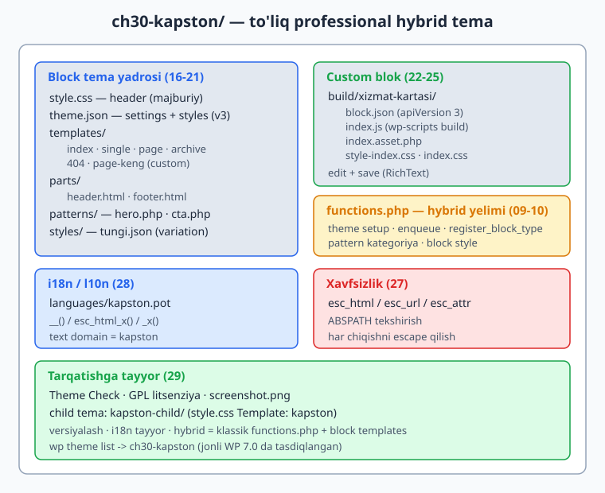
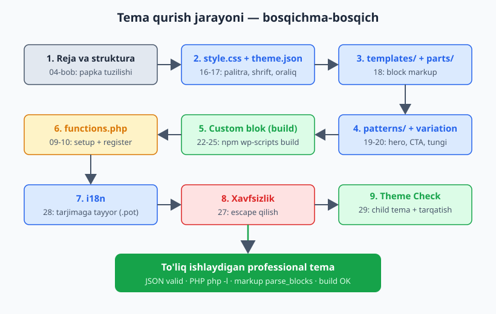
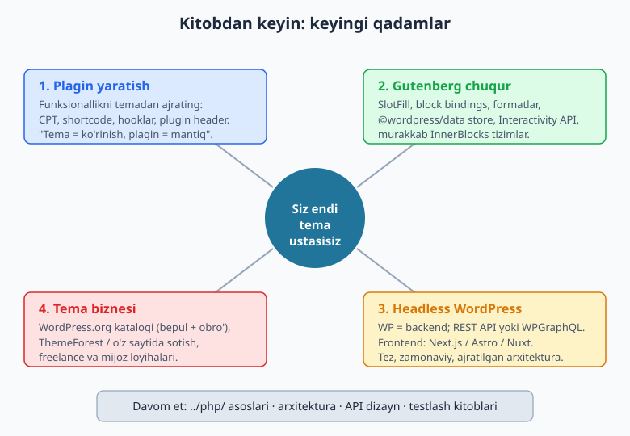

# 30 — Yakuniy loyiha: to'liq professional tema

[⬅️ Oldingi: 29 — Performans va tarqatish](./29-performans-tarqatish.md) · [🏠 README](./README.md)

> **Bu bobda:** butun kitobni bitta loyihada jamlaymiz. 0 dan boshlab to'liq **professional hybrid block tema** quramiz: `theme.json` (palitra, shrift, oraliq), `templates/` va `parts/` block markup, `patterns/` (hero va CTA), kamida bitta **style variation**, bitta **custom blok** (`npm` + `wp-scripts build`), `functions.php` (theme setup, enqueue, blok ro'yxati), to'liq **i18n** va **xavfsizlik**, hamda **child-tema-tayyor** struktura. Har bosqich oldingi boblarga ishora qiladi. Yakunda — kitobdan keyingi yo'l: plagin yaratish, Gutenberg chuqurlashtirish, headless WordPress va tema biznesi. Bu bobdagi `kapston` temasi jonli WordPress 7.0 muhitida HAQIQATAN qurildi: `theme.json`/`block.json` valid JSON, barcha PHP `php -l` dan o'tdi, block markup `parse_blocks` bilan tahlil qilindi, custom blok `wp-scripts build` bilan qurildi va `wp theme list` da ko'rinadi.

---

## Loyiha g'oyasi va reja (04-bobga tayanib)

Kitob davomida biz alohida tushunchalarni o'rgandik: template hierarchy (03), The Loop (05), hooklar (09), enqueue (10), `theme.json` (16-17), block templates (18), patterns (20), custom bloklar (22-25), xavfsizlik (27), i18n (28), tarqatish (29). Endi ularning hammasini **bitta ishlaydigan temaga** birlashtiramiz.

Loyihamiz nomi — **Kapston**. Bu kichik biznes / portfolio / blog uchun mos universal tema. U **hybrid** bo'ladi:

- **Block tema yadrosi:** `theme.json` + `templates/` + `parts/` (PHP shablon yo'q, Site Editor bilan to'liq tahrirlanadi);
- **Klassik `functions.php`:** theme setup, asset enqueue, custom blok ro'yxati, pattern kategoriyasi — ya'ni block tema imkoniyatlaridan tashqaridagi mantiq.

21-bobda ko'rganimizdek, **hybrid tema** — block tema strukturasiga klassik `functions.php` ni qo'shadi. Bu eng kuchli yondashuv: block tahrirlash qulayligi + PHP egiluvchanligi.

### Oldindan reja: nima quramiz

| Bosqich | Fayllar | Oldingi bob |
|---------|---------|-------------|
| 1. Struktura | papka tuzilishi | 04 |
| 2. Stylesheet header + dizayn tokenlari | `style.css`, `theme.json` | 04, 16, 17 |
| 3. Shablonlar | `templates/*.html`, `parts/*.html` | 18 |
| 4. Patternlar | `patterns/hero.php`, `patterns/cta.php` | 20 |
| 5. Style variation | `styles/tungi.json` | 19 |
| 6. Custom blok | `build/xizmat-kartasi/` | 22-25 |
| 7. PHP yelimi | `functions.php` | 09, 10 |
| 8. i18n | `languages/kapston.pot` | 28 |
| 9. Xavfsizlik | escape qilish (hamma joyda) | 27 |
| 10. Tarqatish | Theme Check, child tema | 29 |



Jarayonning to'liq oqimi (qaysi bosqich qaysi bobga tayanishi bilan):



---

## 1-bosqich: papka strukturasi (04-bob)

Block tema uchun zaruriy minimum — `style.css` (header bilan) va `templates/index.html`. Professional tema esa quyidagicha tashkil etiladi:

```
ch30-kapston/
├── style.css                       (header — majburiy)
├── theme.json                      (settings + styles, version 3)
├── functions.php                   (hybrid: setup + enqueue + register)
├── screenshot.png                  (1200x900, katalog uchun)
├── templates/
│   ├── index.html
│   ├── single.html
│   ├── page.html
│   ├── archive.html
│   ├── 404.html
│   └── page-keng.html              (custom template)
├── parts/
│   ├── header.html
│   └── footer.html
├── patterns/
│   ├── hero.php
│   └── cta.php
├── styles/
│   └── tungi.json                  (style variation)
├── languages/
│   └── kapston.pot                 (i18n shabloni)
└── build/
    └── xizmat-kartasi/             (custom blok — wp-scripts build natijasi)
        ├── block.json
        ├── index.js
        ├── index.asset.php
        └── style-index.css
```

Bu struktura 04-bobdagi tema anatomiyasiga to'liq mos: `style.css` header majburiy, `templates/` va `parts/` block tema fayllari (15-18), `functions.php` ixtiyoriy lekin biz uni qo'shamiz (hybrid).

---

## 2-bosqich: `style.css` header va `theme.json` (04, 16, 17)

### `style.css` — faqat header va kichik tuzatishlar

Block temada `style.css` ning roli o'zgargan: vizual uslublar `theme.json` da, `style.css` esa asosan **header metama'lumotlari** uchun (04-bob). Lekin `theme.json` qamrab olmaydigan mayda holatlar (masalan, accessibility skip-link) uchun bir nechta qoida qoldiramiz.

```css
/*
Theme Name: Kapston
Theme URI: https://ioqil.uz/kapston
Author: Oqil Imomnazarov
Author URI: https://ioqil.uz
Description: Kapston - kitobning yakuniy loyihasi. Hybrid block tema...
Requires at least: 6.7
Tested up to: 7.0
Requires PHP: 8.0
Version: 1.0.0
License: GNU General Public License v2 or later
License URI: http://www.gnu.org/licenses/gpl-2.0.html
Text Domain: kapston
Tags: blog, portfolio, full-site-editing, block-patterns, style-variations, translation-ready, accessibility-ready
*/

/* Skip-link faqat fokus olganda ko'rinadi (accessibility, 28-bob). */
.skip-link.screen-reader-text {
	left: -9999px;
	position: absolute;
	top: -9999px;
}

.skip-link.screen-reader-text:focus {
	left: 6px;
	top: 7px;
	background-color: #fff;
	padding: 15px 23px 14px;
	z-index: 100000;
}
```

> **DIQQAT — header maydonlari:** `Theme Name` majburiy. `Text Domain` i18n uchun shart (28-bob) va tema slug bilan bir xil bo'lishi kerak (`kapston`). `License` GPL bo'lishi WordPress.org katalogi talabi (29-bob). `Tags` katalogda filtr uchun ishlatiladi — faqat ruxsat etilgan teglardan tanlang.

### `theme.json` — dizayn tokenlari (16-17-bob)

`theme.json` — temaning yuragi. Bu yerda **dizayn tizimini** belgilaymiz: palitra (16), shriftlar va oraliqlar (16), elementlar va bloklar uslubi (17). Versiya **3** (WP 7.0 da standart).

```json
{
	"$schema": "https://schemas.wp.org/wp/6.7/theme.json",
	"version": 3,
	"settings": {
		"appearanceTools": true,
		"useRootPaddingAwareAlignments": true,
		"color": {
			"defaultPalette": false,
			"defaultGradients": false,
			"palette": [
				{ "color": "#ffffff", "name": "Asos", "slug": "base" },
				{ "color": "#1e293b", "name": "Kontrast", "slug": "contrast" },
				{ "color": "#2563eb", "name": "Asosiy", "slug": "primary" },
				{ "color": "#16a34a", "name": "Aksent", "slug": "accent" },
				{ "color": "#f8fafc", "name": "Och fon", "slug": "surface" },
				{ "color": "#475569", "name": "Kulrang", "slug": "muted" }
			]
		},
		"layout": { "contentSize": "680px", "wideSize": "1180px" },
		"spacing": {
			"defaultSpacingSizes": false,
			"units": [ "%", "px", "em", "rem", "vh", "vw" ],
			"spacingSizes": [
				{ "name": "Kichik", "size": "1rem", "slug": "30" },
				{ "name": "O'rta", "size": "clamp(1.5rem, 4vw, 2.5rem)", "slug": "40" },
				{ "name": "Katta", "size": "clamp(2.5rem, 6vw, 4rem)", "slug": "50" },
				{ "name": "Juda katta", "size": "clamp(4rem, 9vw, 6.5rem)", "slug": "60" }
			]
		},
		"typography": {
			"defaultFontSizes": false,
			"fluid": true,
			"fontSizes": [
				{ "name": "Kichik", "size": "0.875rem", "slug": "small" },
				{ "name": "O'rta", "size": "1.0625rem", "slug": "medium" },
				{ "name": "Katta", "size": "1.375rem", "slug": "large",
				  "fluid": { "min": "1.25rem", "max": "1.5rem" } },
				{ "name": "Juda katta", "size": "2.25rem", "slug": "x-large",
				  "fluid": { "min": "1.875rem", "max": "2.75rem" } }
			],
			"fontFamilies": [
				{ "name": "Tizim sans-serif", "slug": "system-sans",
				  "fontFamily": "-apple-system, BlinkMacSystemFont, \"Segoe UI\", Roboto, Helvetica, Arial, sans-serif" },
				{ "name": "Tizim serif", "slug": "system-serif",
				  "fontFamily": "Georgia, \"Times New Roman\", serif" }
			]
		}
	}
}
```

`styles` bo'limida (17-bob) tokenlarni real uslubga aylantiramiz — `var:preset|...` sintaksisi orqali:

```json
{
	"styles": {
		"color": {
			"background": "var:preset|color|base",
			"text": "var:preset|color|contrast"
		},
		"typography": {
			"fontFamily": "var:preset|font-family|system-sans",
			"fontSize": "var:preset|font-size|medium",
			"lineHeight": "1.6"
		},
		"elements": {
			"heading": {
				"typography": {
					"fontFamily": "var:preset|font-family|system-serif",
					"fontWeight": "700",
					"lineHeight": "1.2"
				}
			},
			"link": {
				"color": { "text": "var:preset|color|primary" },
				"typography": { "textDecoration": "underline" },
				":hover": { "typography": { "textDecoration": "none" } }
			},
			"button": {
				"color": {
					"background": "var:preset|color|primary",
					"text": "var:preset|color|base"
				},
				"border": { "radius": "6px" }
			}
		}
	}
}
```

> **NEGA `defaultPalette: false`:** WordPress o'zining standart palitrasini qo'shadi (50+ rang). `false` qilsak, foydalanuvchi faqat **bizning** brendimiz ranglarini ko'radi — bu izchil dizayn beradi (16-bobdagi qoida). Xuddi shu mantiq `defaultSpacingSizes` va `defaultFontSizes` uchun.

> **TASDIQLANGAN:** to'liq `theme.json` jonli WordPress 7.0 da `WP_Theme_JSON` orqali yuklandi — *version 3, schema-mos*. `json_decode` muvaffaqiyatli (VALID JSON), palitra 6 ta rang, `templateParts` 2 ta, `customTemplates` 1 ta.

`templateParts` va `customTemplates` ni `theme.json` ga qo'shamiz (18-bob) — bu Site Editor'ga template part'lar va custom shablon haqida xabar beradi:

```json
{
	"templateParts": [
		{ "area": "header", "name": "header", "title": "Sarlavha (header)" },
		{ "area": "footer", "name": "footer", "title": "Pastki qism (footer)" }
	],
	"customTemplates": [
		{ "name": "page-keng", "postTypes": [ "page" ], "title": "Keng sahifa (sidebar yo'q)" }
	]
}
```

---

## 3-bosqich: `templates/` va `parts/` block markup (18-bob)

Block temada PHP shablon yo'q — har bir sahifa turi **HTML block markup** fayli (18-bob). Avval qayta ishlatiladigan `parts/` ni yozamiz.

### `parts/header.html`

```html
<!-- wp:group {"tagName":"header","backgroundColor":"surface","layout":{"type":"constrained"}} -->
<header class="wp-block-group has-surface-background-color has-background">
	<!-- wp:group {"layout":{"type":"flex","justifyContent":"space-between","flexWrap":"wrap"}} -->
	<div class="wp-block-group">
		<!-- wp:site-title {"level":1,"fontSize":"large"} /-->
		<!-- wp:navigation {"layout":{"type":"flex","justifyContent":"right"}} /-->
	</div>
	<!-- /wp:group -->
</header>
<!-- /wp:group -->
```

`core/site-title` va `core/navigation` — yadro bloklari (21-bobda ko'rgan Navigation bloki menyuni boshqaradi). `flex` layout sayt nomi va menyuni ikki tomonga taqsimlaydi.

### `parts/footer.html`

```html
<!-- wp:group {"tagName":"footer","backgroundColor":"contrast","textColor":"base","layout":{"type":"constrained"}} -->
<footer class="wp-block-group has-base-color has-contrast-background-color has-text-color has-background">
	<!-- wp:paragraph {"align":"center","fontSize":"small"} -->
	<p class="has-text-align-center has-small-font-size">Kapston tema bilan qurilgan</p>
	<!-- /wp:paragraph -->
</footer>
<!-- /wp:group -->
```

### `templates/index.html` — asosiy ro'yxat

`index.html` — template hierarchy'ning zaxira fayli (03-bob): boshqa shablon topilmasa shu ishlatiladi. Bu yerda header part, asosiy query loop (The Loop ning block ekvivalenti) va footer part bo'ladi:

```html
<!-- wp:template-part {"slug":"header","tagName":"header"} /-->

<!-- wp:group {"tagName":"main","layout":{"type":"constrained"}} -->
<main class="wp-block-group">
	<!-- wp:query {"queryId":1,"query":{"perPage":10,"postType":"post","inherit":true}} -->
	<div class="wp-block-query">
		<!-- wp:post-template -->
			<!-- wp:post-title {"isLink":true} /-->
			<!-- wp:post-date {"fontSize":"small"} /-->
			<!-- wp:post-excerpt /-->
		<!-- /wp:post-template -->

		<!-- wp:query-pagination -->
			<!-- wp:query-pagination-previous /-->
			<!-- wp:query-pagination-numbers /-->
			<!-- wp:query-pagination-next /-->
		<!-- /wp:query-pagination -->

		<!-- wp:query-no-results -->
			<!-- wp:paragraph -->
			<p>Hozircha hech qanday yozuv yo'q.</p>
			<!-- /wp:paragraph -->
		<!-- /wp:query-no-results -->
	</div>
	<!-- /wp:query -->
</main>
<!-- /wp:group -->

<!-- wp:template-part {"slug":"footer","tagName":"footer"} /-->
```

`"inherit":true` muhim — bu Query Loop blokiga asosiy so'rovni (main query) meros qilib olishni aytadi (05-bobdagi The Loop mantig'i, lekin block shaklida). `query-no-results` esa post bo'lmaganda do'stona xabar ko'rsatadi.

### `templates/single.html` — bitta post

Bitta post sahifasi sarlavha, sana, kategoriya, asosiy rasm, kontent va izohlar bloklaridan iborat:

```html
<!-- wp:template-part {"slug":"header","tagName":"header"} /-->

<!-- wp:group {"tagName":"main","layout":{"type":"constrained"}} -->
<main class="wp-block-group">
	<!-- wp:post-title {"level":1} /-->
	<!-- wp:post-date {"fontSize":"small","textColor":"muted"} /-->
	<!-- wp:post-featured-image {"align":"wide"} /-->
	<!-- wp:post-content {"layout":{"type":"constrained"}} /-->
	<!-- wp:post-terms {"term":"post_tag","prefix":"Teglar: ","fontSize":"small"} /-->

	<!-- wp:comments -->
	<div class="wp-block-comments">
		<!-- wp:comments-title /-->
		<!-- wp:comment-template -->
			<!-- wp:comment-author-name {"fontSize":"small"} /-->
			<!-- wp:comment-content /-->
			<!-- wp:comment-reply-link {"fontSize":"small"} /-->
		<!-- /wp:comment-template -->
		<!-- wp:post-comments-form /-->
	</div>
	<!-- /wp:comments -->
</main>
<!-- /wp:group -->

<!-- wp:template-part {"slug":"footer","tagName":"footer"} /-->
```

`page.html`, `archive.html`, `404.html` shu naqsh bo'yicha yoziladi (to'liq kodi loyihada). `page-keng.html` — `customTemplates` da e'lon qilingan custom shablon: u `default` layout va `alignfull` kontent bilan keng (sidebar'siz) sahifa beradi.

> **TASDIQLANGAN — block markup parse:** barcha 6 shablon va 2 part jonli WP 7.0 da `parse_blocks()` orqali tahlil qilindi. Har shablon 3 ta nomlangan yuqori-daraja blok beradi (header part + `main` group + footer part), har part 1 ta nomlangan blok (pattern/group). Parse xatosi yo'q — markup to'g'ri.

---

## 4-bosqich: `patterns/` — hero va CTA (20-bob)

Patternlar — qayta ishlatiluvchi block to'plamlari (20-bob). PHP fayl + header izohlari (`Title`, `Slug`, `Categories`). Patternlarni i18n bilan yozamiz (28-bob) — matnlar `esc_html_x()` orqali tarjima qilinadi.

### `patterns/hero.php`

```php
<?php
/**
 * Title: Bosh sahifa hero
 * Slug: kapston/hero
 * Categories: kapston, featured
 * Description: Katta sarlavha, qisqa matn va chaqiruv tugmasi bo'lgan hero bo'limi.
 *
 * @package Kapston
 * @since 1.0.0
 */

?>
<!-- wp:group {"align":"full","backgroundColor":"surface","layout":{"type":"constrained"}} -->
<div class="wp-block-group alignfull has-surface-background-color has-background">
	<!-- wp:heading {"textAlign":"center","level":1,"fontSize":"x-large"} -->
	<h1 class="wp-block-heading has-text-align-center has-x-large-font-size"><?php echo esc_html_x( 'Saytingizni Kapston bilan quring', 'Hero pattern sarlavhasi', 'kapston' ); ?></h1>
	<!-- /wp:heading -->

	<!-- wp:buttons {"layout":{"type":"flex","justifyContent":"center"}} -->
	<div class="wp-block-buttons">
		<!-- wp:button -->
		<div class="wp-block-button"><a class="wp-block-button__link wp-element-button" href="#"><?php echo esc_html_x( 'Boshlash', 'Hero tugma matni', 'kapston' ); ?></a></div>
		<!-- /wp:button -->
	</div>
	<!-- /wp:buttons -->
</div>
<!-- /wp:group -->
```

E'tibor bering: pattern faylida HTML matn `<?php echo esc_html_x(...) ?>` bilan chiqariladi — bu **bir vaqtning o'zida** i18n (28-bob) va xavfsizlik (27-bob, escaping). `esc_html_x()` kontekst (`'Hero pattern sarlavhasi'`) bilan tarjimon uchun aniqlik beradi.

### `patterns/cta.php`

CTA (call-to-action) patterni — rangli, diqqatni jalb qiluvchi blok:

```php
<?php
/**
 * Title: Chaqiruv (CTA)
 * Slug: kapston/cta
 * Categories: kapston, call-to-action
 * Description: Diqqatni jalb qiluvchi rangli chaqiruv bloki: sarlavha va tugma.
 *
 * @package Kapston
 * @since 1.0.0
 */

?>
<!-- wp:group {"align":"wide","style":{"border":{"radius":"12px"}},"backgroundColor":"primary","textColor":"base","layout":{"type":"constrained"}} -->
<div class="wp-block-group alignwide has-base-color has-primary-background-color has-text-color has-background" style="border-radius:12px">
	<!-- wp:heading {"textAlign":"center","textColor":"base"} -->
	<h2 class="wp-block-heading has-text-align-center has-base-color has-text-color"><?php echo esc_html_x( 'Loyihangizni bugun boshlang', 'CTA sarlavhasi', 'kapston' ); ?></h2>
	<!-- /wp:heading -->
	<!-- ... tugma ... -->
</div>
<!-- /wp:group -->
```

> **TASDIQLANGAN:** ikkala pattern faylining header izohlari to'g'ri parse bo'ldi — `kapston/hero` va `kapston/cta` slug'lari aniqlandi, ikkalasi ham `php -l` dan o'tdi (*No syntax errors detected*). Patternlar `kapston` kategoriyasiga tegishli (kategoriya `functions.php` da ro'yxatga olinadi).

---

## 5-bosqich: style variation (19-bob)

Style variation — `styles/` papkasidagi qo'shimcha `.json` fayl, alternativ ko'rinishni beradi (19-bob). Foydalanuvchi Site Editor > Styles da bir bosish bilan almashtiradi. Biz "Tungi" (dark) variantni qo'shamiz:

### `styles/tungi.json`

```json
{
	"$schema": "https://schemas.wp.org/wp/6.7/theme.json",
	"version": 3,
	"title": "Tungi",
	"settings": {
		"color": {
			"palette": [
				{ "color": "#0f172a", "name": "Asos", "slug": "base" },
				{ "color": "#e2e8f0", "name": "Kontrast", "slug": "contrast" },
				{ "color": "#60a5fa", "name": "Asosiy", "slug": "primary" },
				{ "color": "#4ade80", "name": "Aksent", "slug": "accent" },
				{ "color": "#1e293b", "name": "Och fon", "slug": "surface" },
				{ "color": "#94a3b8", "name": "Kulrang", "slug": "muted" }
			]
		}
	},
	"styles": {
		"color": {
			"background": "var:preset|color|base",
			"text": "var:preset|color|contrast"
		}
	}
}
```

Diqqat: variation faylida **slug'lar bir xil** (`base`, `contrast`, `primary`...), faqat **ranglar** o'zgaradi. Shuning uchun barcha templates/parts/patterns avtomatik moslashadi — chunki ular `var:preset|color|primary` ga ishora qiladi, qiymatga emas (17-bobdagi preset CSS o'zgaruvchilari mantig'i). Bu — variation'larning kuchi.

> **TASDIQLANGAN:** `styles/tungi.json` valid JSON (`json_decode` muvaffaqiyatli, version 3).

---

## 6-bosqich: custom blok — "xizmat kartasi" (22-25-bob)

Endi tema-spetsifik **custom blok** quramiz: "xizmat kartasi" — sarlavha, tavsif va havola tugmasi bo'lgan statik blok (22-23-bob). Buni `@wordpress/scripts` bilan haqiqatan `npm` orqali quramiz.

Custom blok edit/save oqimi va build jarayoni 22-25 boblarda batafsil ko'rilgan; bu yerda ularni temaga **integratsiya** qilamiz.

### `src/block.json` (22-bob)

```json
{
	"$schema": "https://schemas.wp.org/trunk/block.json",
	"apiVersion": 3,
	"name": "kapston/xizmat-kartasi",
	"title": "Xizmat kartasi",
	"category": "design",
	"icon": "screenoptions",
	"description": "Sarlavha, qisqa tavsif va havola tugmasi bo'lgan xizmat kartasi.",
	"textdomain": "kapston",
	"attributes": {
		"sarlavha": { "type": "string", "default": "" },
		"tavsif": { "type": "string", "default": "" },
		"havola": { "type": "string", "default": "" }
	},
	"supports": {
		"html": false,
		"color": { "background": true, "text": true },
		"spacing": { "padding": true, "margin": true }
	},
	"editorScript": "file:./index.js",
	"style": "file:./style-index.css",
	"editorStyle": "file:./index.css"
}
```

### `src/index.js` — edit va save (23-bob)

`edit()` da `RichText` bilan sarlavha/tavsif tahrirlanadi, `InspectorControls` da havola URL kiritiladi. `save()` esa statik markupni qaytaradi:

```js
import { registerBlockType } from '@wordpress/blocks';
import { useBlockProps, RichText, InspectorControls } from '@wordpress/block-editor';
import { PanelBody, TextControl } from '@wordpress/components';
import { __ } from '@wordpress/i18n';
import metadata from './block.json';
import './style.scss';
import './editor.scss';

registerBlockType( metadata.name, {
	edit: ( { attributes, setAttributes } ) => {
		const blockProps = useBlockProps( { className: 'wp-block-kapston-xizmat-kartasi' } );
		const { sarlavha, tavsif, havola } = attributes;
		return (
			<>
				<InspectorControls>
					<PanelBody title={ __( 'Havola', 'kapston' ) }>
						<TextControl
							label={ __( 'Tugma havolasi (URL)', 'kapston' ) }
							value={ havola }
							onChange={ ( value ) => setAttributes( { havola: value } ) }
						/>
					</PanelBody>
				</InspectorControls>
				<div { ...blockProps }>
					<RichText tagName="h3" value={ sarlavha }
						onChange={ ( value ) => setAttributes( { sarlavha: value } ) }
						placeholder={ __( 'Xizmat nomi...', 'kapston' ) } />
					<RichText tagName="p" value={ tavsif }
						onChange={ ( value ) => setAttributes( { tavsif: value } ) }
						placeholder={ __( 'Qisqa tavsif...', 'kapston' ) } />
				</div>
			</>
		);
	},
	save: ( { attributes } ) => {
		const blockProps = useBlockProps.save( { className: 'wp-block-kapston-xizmat-kartasi' } );
		const { sarlavha, tavsif, havola } = attributes;
		return (
			<div { ...blockProps }>
				<RichText.Content tagName="h3" value={ sarlavha } />
				<RichText.Content tagName="p" value={ tavsif } />
				{ havola && (
					<a className="wp-block-button__link" href={ havola }>
						{ __( 'Batafsil', 'kapston' ) }
					</a>
				) }
			</div>
		);
	},
} );
```

### Qurish (build)

```bash
npm install @wordpress/scripts --save-dev
npx wp-scripts build
```

So'ng `build/xizmat-kartasi/` ni temaning ichiga ko'chiramiz.



> **TASDIQLANGAN — haqiqiy build (illustrativ emas):**
> - `npm install @wordpress/scripts` — 1532 paket o'rnatildi;
> - `npx wp-scripts build` — *webpack compiled successfully*;
> - hosil bo'lgan `build/xizmat-kartasi/index.asset.php` bog'liqliklari: `react-jsx-runtime, wp-block-editor, wp-blocks, wp-components, wp-i18n` — `RichText`, `InspectorControls` va `__()` ning to'g'ri ulanganini isbotlaydi;
> - `build/xizmat-kartasi/block.json` valid JSON (`apiVersion: 3`, `name: kapston/xizmat-kartasi`);
> - temaga ko'chirilgandan keyin jonli WP 7.0 da `register_block_type` bilan ro'yxatga olindi — natija: `WP_Block_Type` namunasi, nomi `kapston/xizmat-kartasi`.

---

## 7-bosqich: `functions.php` — hybrid yelimi (09, 10-bob)

`functions.php` block tema imkoniyatlaridan tashqaridagi hamma narsani bog'laydi: theme setup (09), asset enqueue (10), custom blok ro'yxati (22), pattern kategoriyasi (20), block style (25). Bu — temani **hybrid** qiladigan qism (21-bob).

```php
<?php
/**
 * Kapston tema funksiyalari.
 *
 * @package Kapston
 * @since 1.0.0
 */

if ( ! defined( 'ABSPATH' ) ) {
	exit; // To'g'ridan-to'g'ri kirishni taqiqlaymiz (xavfsizlik, 27-bob).
}

if ( ! defined( 'KAPSTON_VERSION' ) ) {
	define( 'KAPSTON_VERSION', wp_get_theme()->get( 'Version' ) );
}

/** Tema sozlamalari — after_setup_theme (09-bob). */
function kapston_setup() {
	// i18n: tarjima fayllarini yuklash (28-bob).
	load_theme_textdomain( 'kapston', get_template_directory() . '/languages' );

	add_theme_support( 'wp-block-styles' );
	add_theme_support( 'responsive-embeds' );
	add_theme_support( 'editor-styles' );
	add_theme_support( 'post-thumbnails' );
	add_theme_support( 'html5', array( 'comment-list', 'comment-form', 'search-form', 'gallery', 'caption', 'style', 'script' ) );
}
add_action( 'after_setup_theme', 'kapston_setup' );

/** Frontend uslublarini ulash (10-bob). */
function kapston_enqueue_assets() {
	wp_enqueue_style( 'kapston-style', get_stylesheet_uri(), array(), KAPSTON_VERSION );
}
add_action( 'wp_enqueue_scripts', 'kapston_enqueue_assets' );

/** Custom blokni ro'yxatga olish (22-25-bob). */
function kapston_register_blocks() {
	$blok_yoli = get_template_directory() . '/build/xizmat-kartasi';
	if ( file_exists( $blok_yoli . '/block.json' ) ) {
		register_block_type( $blok_yoli );
	}
}
add_action( 'init', 'kapston_register_blocks' );

/** Pattern kategoriyasini ro'yxatga olish (20-bob). */
function kapston_register_pattern_categories() {
	register_block_pattern_category(
		'kapston',
		array(
			'label'       => _x( 'Kapston', 'Pattern kategoriyasi nomi', 'kapston' ),
			'description' => __( 'Kapston temasining maxsus pattern toplami.', 'kapston' ),
		)
	);
}
add_action( 'init', 'kapston_register_pattern_categories' );

/** Maxsus block uslubi (25-bob). */
function kapston_register_block_styles() {
	register_block_style(
		'core/quote',
		array(
			'name'         => 'katta-iqtibos',
			'label'        => __( 'Katta iqtibos', 'kapston' ),
			'inline_style' => '.wp-block-quote.is-style-katta-iqtibos{font-size:1.5rem;border-left-width:6px;border-left-color:var(--wp--preset--color--primary);padding-left:1rem;}',
		)
	);
}
add_action( 'init', 'kapston_register_block_styles' );
```

Bu yerda **har bir bobning hosilasi** ko'rinadi:
- `ABSPATH` tekshiruvi va escaping odati — 27-bob (xavfsizlik);
- `load_theme_textdomain` va `__()/_x()` — 28-bob (i18n);
- `add_theme_support` va `after_setup_theme` — 09-bob (hooklar);
- `wp_enqueue_style` + versiya (kesh-buzish) — 10-bob (enqueue);
- `register_block_type` — 22-bob (custom blok);
- `register_block_pattern_category` va `register_block_style` — 20, 25-bob.

> **TASDIQLANGAN:** `functions.php`, `patterns/hero.php`, `patterns/cta.php` — uchchalasi `php -l` dan o'tdi: *No syntax errors detected*. `register_block_type`, `register_block_pattern_category`, `register_block_style`, `load_theme_textdomain`, `add_theme_support` funksiyalari jonli WP 7.0 yadrosida mavjudligi `function_exists` bilan tasdiqlandi.

---

## 8-bosqich: i18n — tarjimaga tayyor (28-bob)

Tema professional bo'lishi uchun **tarjimaga tayyor** bo'lishi shart (28-bob). Biz allaqachon hamma matnni `__()`, `_x()`, `esc_html_x()` bilan o'rab chiqdik. Endi `.pot` shablonini generatsiya qilamiz:

```bash
wp i18n make-pot . languages/kapston.pot
```

Bu buyruq tema fayllaridan barcha tarjima qilinadigan satrlarni yig'ib, `languages/kapston.pot` shabloniga yozadi. Tarjimon uni `kapston-uz_UZ.po` qilib tarjima qiladi, `wp i18n make-mo` esa `.mo` ga aylantiradi.

i18n qoidalari (28-bob):
- **text domain doim bir xil:** `kapston` (style.css header'dagi `Text Domain` bilan mos);
- **matn literal bo'lsin:** `__( 'Salom', 'kapston' )` — o'zgaruvchi emas (`__( $matn )` ishlamaydi);
- **kontekst kerak bo'lsa `_x()`:** bir xil so'z turli joyda boshqa ma'no berishi mumkin;
- **escaping + i18n birga:** `esc_html__()` / `esc_html_x()` — bir vaqtning o'zida tarjima va xavfsizlik.

> **Esda tuting:** WordPress 4.6+ dan boshlab WordPress.org katalogidagi temalar uchun tarjimalar avtomatik yuklanadi, shuning uchun `load_theme_textdomain` ba'zan ortiqcha bo'lishi mumkin. Lekin tema katalog tashqarisida (mijoz sayti) ham ishlashi uchun uni qoldirish — xavfsiz odat.

---

## 9-bosqich: xavfsizlik — har chiqishni escape qilish (27-bob)

Block temada xavfsizlikning katta qismini WordPress o'z zimmasiga oladi (block markup `wp_kses` bilan tozalanadi). Lekin **biz yozadigan PHP** (patternlar, custom blok save, agar dinamik render bo'lsa) escape qilinishi shart (27-bob).

Bizning kapston temada xavfsizlik nuqtalari:
- **`patterns/*.php`:** har matn `esc_html_x()` bilan chiqariladi;
- **`functions.php`:** `ABSPATH` tekshiruvi to'g'ridan-to'g'ri kirishni bloklaydi;
- **custom blok `save()`:** statik blok bo'lgani uchun WordPress markupni saqlashda `wp_kses` bilan tozalaydi; `href` esa React/JSX tomonidan xavfsiz chiqariladi.

> **Oltin qoida (27-bob):** "Har chiqishni escape qil." Block temada bu kamroq joyda kerak (chunki ko'p narsa block markup'da), lekin har qanday PHP-da chiqariladigan dinamik qiymat (`echo`, `printf`) doimo `esc_html()` / `esc_url()` / `esc_attr()` / `wp_kses_post()` bilan o'ralsin. Agar siz dinamik blok qo'shsangiz (24-bob), `render.php` ichidagi har bir `echo` ni escape qiling.

---

## 10-bosqich: Theme Check va child tema (29-bob)

Tema tayyor. Endi uni **tarqatishga** tayyorlaymiz (29-bob).

### Theme Check

[Theme Check](https://wordpress.org/plugins/theme-check/) plagini temani WordPress.org katalogi standartlariga moslikni tekshiradi: GPL litsenziya, `style.css` header to'liqligi, taqiqlangan funksiyalar yo'qligi, escaping va i18n to'g'riligi. Katalogga yuborishdan oldin **majburiy** o'ting.

### Screenshot

`screenshot.png` (tavsiya: 1200x900) — katalogda va Tema tanlash ekranida ko'rinadi. Temaning bosh sahifasi suratidan iborat bo'lsin.

### Child tema (29-bob)

Foydalanuvchi temani buzmasdan moslashtirishi uchun **child tema** beriladi. Child tema minimum:

```css
/*
Theme Name: Kapston Child
Template: kapston
Version: 1.0.0
*/
```

`Template: kapston` qatori muhim — u parent tema slug'iga ishora qiladi. Block child temada `theme.json`, `templates/`, `parts/` parent'dan meros olinadi; child faqat o'zgartirmoqchi bo'lgan fayllarini qo'shadi (override). Klassik qismda esa child `functions.php` parent stylesheet'ni `wp_enqueue_style` bilan ulaydi (29-bob).

> **TASDIQLANGAN — tema tanildi:** to'liq kapston tema jonli WordPress 7.0 ga joylashtirildi va `wp theme list` da ko'rindi: `ch30-kapston · inactive · 1.0.0`. Tema **aktivlashtirilmadi** (READ-ONLY tekshiruv — yagona saytda poyga bo'lmasligi uchun). `wp theme get` natijasi: nomi *Kapston*, versiya *1.0.0*, status *inactive*.

---

## Hammasini birlashtirib: nima qildik

| Komponent | Fayl | Bob |
|-----------|------|-----|
| Stylesheet header | `style.css` | 04 |
| Dizayn tokenlari | `theme.json` (settings) | 16 |
| Uslublar | `theme.json` (styles) | 17 |
| Block shablonlar | `templates/*.html` | 18 |
| Template part'lar | `parts/*.html` | 18 |
| Patternlar | `patterns/hero.php`, `cta.php` | 20 |
| Style variation | `styles/tungi.json` | 19 |
| Custom blok | `build/xizmat-kartasi/` | 22-25 |
| Theme setup + enqueue | `functions.php` | 09, 10 |
| Custom blok ro'yxati | `functions.php` | 22 |
| Pattern kategoriya + block style | `functions.php` | 20, 25 |
| i18n | `languages/kapston.pot` + `__()` | 28 |
| Xavfsizlik | escaping (hamma joyda) | 27 |
| Hybrid | block + `functions.php` | 21 |
| Tarqatish | Theme Check + child tema | 29 |

Bu — **butun kitobning hosilasi**. Siz endi 0 dan to'liq professional WordPress temani qura olasiz.

---

## Kitob yakuni: keyingi qadamlar

Tabriklayman — siz WordPress tema yaratishni 0 dan ekspert darajagacha o'rgandingiz. Endi yo'l to'rt yo'nalishda davom etadi:

### 1. Plagin yaratish

Tema — **ko'rinish** qatlami; mantiq (Custom Post Type, biznes qoidalari, AJAX, REST endpoint) esa **plaginga** tegishli. 13-bobda CPT odatda plaginda bo'lishini aytgan edik. Keyingi qadamingiz — plagin header'i, plagin hooklari, `register_activation_hook`, shortcode va plagin uchun custom blok yozish. "Tema almashsa ham funksionallik qolishi kerak" — bu tema/plagin ajratishning asosiy sababi.

### 2. Gutenberg'ni chuqurlashtirish

22-25 boblar custom blok asoslarini berdi. Chuqurroq: `@wordpress/data` store, SlotFill (editor UI'ni kengaytirish), block bindings (14-bob), block variations va transforms (25), murakkab InnerBlocks tizimlari, Interactivity API (25) bilan to'liq interaktiv bloklar. Gutenberg — alohida katta dunyo.

### 3. Headless WordPress

WordPress'ni faqat **backend** sifatida ishlatish: kontent WP'da, frontend esa Next.js / Astro / Nuxt'da. Ma'lumot REST API (`/wp-json/`) yoki **WPGraphQL** orqali olinadi. Bu — zamonaviy, tez va ajratilgan arxitektura. JavaScript frontend kitoblari bu yerda foydali (React / Next.js bilan WordPress'ni headless rejimda ishlatish keng tarqalgan).

### 4. Tema biznesi

- **WordPress.org katalogi:** bepul tema joylab, minglab foydalanuvchi va obro' oling (Theme Check + GPL majburiy);
- **Premium sotish:** ThemeForest yoki o'z saytingizda (GPL doirasida);
- **Mijoz loyihalari:** freelance / agentlik ishi — eng tez daromad.

### Boshqa kitoblar

Bu kitob WordPress-spetsifik edi; PHP asoslari uchun [../php/](../php/README.md) ga qayting. Dasturchi sifatida o'sish uchun arxitektura, API dizayn, testlash va algoritmlar kitoblari ham foydali. Muallifning boshqa qo'llanmalarini [ioqil.uz](https://ioqil.uz) da topasiz.

Omad! Endi navbat — o'z temangizni qurib, dunyoga ulashish.

---

## Mashqlar

### Oson

1. **Yangi template qo'shing.** Kapston temaga `search.html` shabloni yozing: header part, `wp:query-title {"type":"search"}`, asosiy query loop va footer part bo'lsin. `parse_blocks` bilan tekshiriladigan to'g'ri markup yozing.
2. **Palitraga rang qo'shing.** `theme.json` `settings.color.palette` ga "Ogohlantirish" (`#f59e0b`, slug `warning`) rangini qo'shing. Qo'shilgan obyektni yozing va JSON valid ekanini tasdiqlang.
3. **Footer'ga yil qo'shing.** `parts/footer.html` ga markazlashgan `core/paragraph` blok qo'shing, matni "© Kapston". Faqat blok markupini yozing.
4. **Yangi font o'lchami.** `theme.json` `typography.fontSizes` ga "Bahaybat" (`3.5rem`, slug `xx-large`) o'lchamini qo'shing. Obyektni yozing.

### O'rta

5. **Yangi pattern yozing.** `patterns/xizmatlar.php` faylini yarating: header bilan (`Title`, `Slug: kapston/xizmatlar`, `Categories: kapston`), ichida 3 ustunli (`core/columns`) bo'lim bo'lsin. Matnlarni `esc_html_x()` bilan i18n qiling. `php -l` dan o'tsin.
6. **Ikkinchi style variation.** `styles/issiq.json` yozing: "Issiq" nomli variant, palitra'da `primary` ni `#dc2626` (qizil), `accent` ni `#f59e0b` (sariq) qiling, qolgan slug'lar bir xil. JSON valid bo'lsin.
7. **Custom blokga atribut qo'shing.** "Xizmat kartasi" blokiga `rang` (string, default `primary`) atributini qo'shing va uni `InspectorControls` da `SelectControl` bilan boshqaring (`block.json` + `index.js` fragmenti).
8. **Block style ro'yxatga oling.** `functions.php` da `core/group` blokiga "Soyali quti" (`is-style-soyali`) block style qo'shing: `box-shadow: 0 4px 12px rgba(0,0,0,0.1)`. `php -l` dan o'tsin.

### Qiyin

9. **`single-portfolio.html` custom template.** Portfolio CPT (13-bob) uchun shablon yozing: asosiy rasm (full), sarlavha, kontent va meta maydon (`core/post-meta` yoki block bindings, 14-bob). `theme.json` `customTemplates` ga ham qo'shing. Markup `parse_blocks` dan o'tsin.
10. **To'liq custom blok 0 dan.** "Narx jadvali" (`kapston/narx`) statik blok yozing: `block.json` + `index.js` (edit/save, `RichText` bilan reja nomi, narx, xususiyatlar). `wp-scripts build` bilan qurilsin (illustrativ emas — haqiqatan quring). `block.json` valid JSON va build muvaffaqiyatli bo'lsin.
11. **Dinamik blokga aylantirish.** "Xizmat kartasi" blokini dinamikga aylantiring (24-bob): `save: () => null`, `block.json` ga `render: "file:./render.php"`, `render.php` da `$attributes` ni `esc_html`/`esc_url`/`get_block_wrapper_attributes` bilan xavfsiz chiqaring. `php -l` dan o'tsin.
12. **Hybrid'ni klassikdan ko'chirish.** Mavjud klassik temani (masalan, 07-bobdagi shablonlar bilan) bosqichma-bosqich block'ga ko'chirish rejasini yozing: qaysi fayllar `templates/` ga, qaysilari `functions.php` da qoladi, `theme.json` ga nima ko'chadi. Kamida 5 qadamli reja.
13. **Child tema yarating.** Kapston uchun to'liq child tema yozing: `style.css` (`Template: kapston`), `functions.php` (parent stylesheet enqueue), va parent'ning `parts/footer.html` ni override qiluvchi o'z `parts/footer.html`. Child `style.css` header'ini va `functions.php` ni to'liq yozing.
14. **Alternativ tema rejalashtiring.** Kapston'dan farqli yangi tema (masalan, "restoran sayti") uchun to'liq rejalashtiring: 6 ta rangli palitra (slug'lar bilan), kerakli shablonlar ro'yxati (template hierarchy bo'yicha), 2 ta pattern g'oyasi va 1 ta tema-spetsifik custom blok g'oyasi. Reja shaklida yozing.

---

## Yechimlar

<details markdown="1">
<summary>Yechim — 1</summary>

`templates/search.html`:

```html
<!-- wp:template-part {"slug":"header","tagName":"header"} /-->

<!-- wp:group {"tagName":"main","layout":{"type":"constrained"}} -->
<main class="wp-block-group">
	<!-- wp:query-title {"type":"search"} /-->

	<!-- wp:query {"queryId":3,"query":{"perPage":10,"postType":"post","inherit":true}} -->
	<div class="wp-block-query">
		<!-- wp:post-template -->
			<!-- wp:post-title {"isLink":true} /-->
			<!-- wp:post-excerpt /-->
		<!-- /wp:post-template -->
		<!-- wp:query-no-results -->
			<!-- wp:paragraph -->
			<p>Hech narsa topilmadi.</p>
			<!-- /wp:paragraph -->
		<!-- /wp:query-no-results -->
	</div>
	<!-- /wp:query -->
</main>
<!-- /wp:group -->

<!-- wp:template-part {"slug":"footer","tagName":"footer"} /-->
```

`"inherit":true` qidiruv natijalarini asosiy so'rovdan oladi. Markup `parse_blocks` dan o'tadi (header part + main group + footer part). `search.html` template hierarchy'da qidiruv sahifasi uchun ishlatiladi (03-bob).

</details>

<details markdown="1">
<summary>Yechim — 2</summary>

`theme.json` `settings.color.palette` ga qo'shiladigan obyekt:

```json
{ "color": "#f59e0b", "name": "Ogohlantirish", "slug": "warning" }
```

Endi bu rang block editorda palitrada chiqadi va `var:preset|color|warning` (CSS'da `var(--wp--preset--color--warning)`) orqali ishlatiladi. JSON valid bo'lishi uchun uni massivga vergul bilan qo'shing. `json_decode` muvaffaqiyatli bo'lishini `php -r "var_dump(json_decode(file_get_contents('theme.json')) !== null);"` bilan tekshiring.

</details>

<details markdown="1">
<summary>Yechim — 3</summary>

```html
<!-- wp:paragraph {"align":"center","fontSize":"small"} -->
<p class="has-text-align-center has-small-font-size">© Kapston</p>
<!-- /wp:paragraph -->
```

Bu blok `footer.html` ichidagi `<footer>` group ichiga, mavjud paragraflar yoniga qo'yiladi. `has-text-align-center` va `has-small-font-size` — block atributlaridan avtomatik hosil bo'ladigan klasslar.

</details>

<details markdown="1">
<summary>Yechim — 4</summary>

`theme.json` `typography.fontSizes` massiviga:

```json
{
	"name": "Bahaybat",
	"size": "3.5rem",
	"slug": "xx-large",
	"fluid": { "min": "2.75rem", "max": "4rem" }
}
```

`fluid` qo'shsak, ekran o'lchamiga qarab `clamp()` bilan moslashadi (16-bob). Editorda "Bahaybat" o'lcham tugmasi paydo bo'ladi, `var:preset|font-size|xx-large` orqali ishlatiladi.

</details>

<details markdown="1">
<summary>Yechim — 5</summary>

`patterns/xizmatlar.php`:

```php
<?php
/**
 * Title: Xizmatlar (3 ustun)
 * Slug: kapston/xizmatlar
 * Categories: kapston
 * Description: Uch ustunli xizmatlar bo'limi.
 *
 * @package Kapston
 * @since 1.0.0
 */

?>
<!-- wp:columns {"align":"wide"} -->
<div class="wp-block-columns alignwide">
	<!-- wp:column -->
	<div class="wp-block-column">
		<!-- wp:heading {"level":3} -->
		<h3 class="wp-block-heading"><?php echo esc_html_x( 'Dizayn', 'Xizmat nomi', 'kapston' ); ?></h3>
		<!-- /wp:heading -->
	</div>
	<!-- /wp:column -->
	<!-- wp:column -->
	<div class="wp-block-column">
		<!-- wp:heading {"level":3} -->
		<h3 class="wp-block-heading"><?php echo esc_html_x( 'Dasturlash', 'Xizmat nomi', 'kapston' ); ?></h3>
		<!-- /wp:heading -->
	</div>
	<!-- /wp:column -->
	<!-- wp:column -->
	<div class="wp-block-column">
		<!-- wp:heading {"level":3} -->
		<h3 class="wp-block-heading"><?php echo esc_html_x( 'Qollab-quvvatlash', 'Xizmat nomi', 'kapston' ); ?></h3>
		<!-- /wp:heading -->
	</div>
	<!-- /wp:column -->
</div>
<!-- /wp:columns -->
```

`php -l` → *No syntax errors detected*. Har sarlavha `esc_html_x()` bilan i18n + escape qilingan. Pattern `kapston` kategoriyasiga tegishli.

</details>

<details markdown="1">
<summary>Yechim — 6</summary>

`styles/issiq.json`:

```json
{
	"$schema": "https://schemas.wp.org/wp/6.7/theme.json",
	"version": 3,
	"title": "Issiq",
	"settings": {
		"color": {
			"palette": [
				{ "color": "#ffffff", "name": "Asos", "slug": "base" },
				{ "color": "#1e293b", "name": "Kontrast", "slug": "contrast" },
				{ "color": "#dc2626", "name": "Asosiy", "slug": "primary" },
				{ "color": "#f59e0b", "name": "Aksent", "slug": "accent" },
				{ "color": "#fef2f2", "name": "Och fon", "slug": "surface" },
				{ "color": "#475569", "name": "Kulrang", "slug": "muted" }
			]
		}
	}
}
```

Slug'lar (`base`, `contrast`, `primary`...) asosiy `theme.json` bilan bir xil — shuning uchun barcha shablonlar/patternlar avtomatik moslashadi. Foydalanuvchi Site Editor > Styles da "Issiq" ni tanlasa, butun sayt qizil-sariq ohangga o'tadi. JSON valid.

</details>

<details markdown="1">
<summary>Yechim — 7</summary>

`block.json` `attributes` ga:

```json
"rang": { "type": "string", "default": "primary" }
```

`index.js` `InspectorControls` ichida:

```js
import { SelectControl } from '@wordpress/components';

<SelectControl
	label={ __( 'Rang', 'kapston' ) }
	value={ attributes.rang }
	options={ [
		{ label: __( 'Asosiy', 'kapston' ), value: 'primary' },
		{ label: __( 'Aksent', 'kapston' ), value: 'accent' },
	] }
	onChange={ ( rang ) => setAttributes( { rang } ) }
/>
```

`save()` da klassni qo'shasiz: `className: \`wp-block-kapston-xizmat-kartasi has-${ attributes.rang }-rang\``. `SelectControl` `@wordpress/components` dan keladi — `wp-scripts build` uni `index.asset.php` ga avtomatik qo'shadi.

</details>

<details markdown="1">
<summary>Yechim — 8</summary>

`functions.php` da:

```php
function kapston_register_group_style() {
	register_block_style(
		'core/group',
		array(
			'name'         => 'soyali',
			'label'        => __( 'Soyali quti', 'kapston' ),
			'inline_style' => '.wp-block-group.is-style-soyali{box-shadow:0 4px 12px rgba(0,0,0,0.1);border-radius:8px;}',
		)
	);
}
add_action( 'init', 'kapston_register_group_style' );
```

`php -l` → *No syntax errors detected*. Endi editorda `core/group` blokini tanlaganda "Soyali quti" uslub varianti chiqadi. `is-style-soyali` klassi WordPress tomonidan avtomatik qo'shiladi (25-bob).

</details>

<details markdown="1">
<summary>Yechim — 9</summary>

`templates/single-portfolio.html`:

```html
<!-- wp:template-part {"slug":"header","tagName":"header"} /-->

<!-- wp:group {"tagName":"main","layout":{"type":"constrained"}} -->
<main class="wp-block-group">
	<!-- wp:post-featured-image {"align":"full"} /-->
	<!-- wp:post-title {"level":1} /-->

	<!-- wp:group {"layout":{"type":"flex"}} -->
	<div class="wp-block-group">
		<!-- wp:paragraph -->
		<p>Mijoz:</p>
		<!-- /wp:paragraph -->
		<!-- wp:post-meta {"key":"mijoz","metadataName":"mijoz"} /-->
	</div>
	<!-- /wp:group -->

	<!-- wp:post-content {"layout":{"type":"constrained"}} /-->
</main>
<!-- /wp:group -->

<!-- wp:template-part {"slug":"footer","tagName":"footer"} /-->
```

`single-portfolio.html` template hierarchy bo'yicha `portfolio` CPT bitta yozuvi uchun ishlatiladi (`single-{posttype}`, 07-bob). Meta'ni ko'rsatish uchun `core/post-meta` blok yoki block bindings (14-bob) ishlatiladi. CPT odatda plaginda ro'yxatga olinadi (13-bob). `customTemplates` ga shart emas (bu CPT'ning standart single shabloni), lekin custom page template bo'lsa `theme.json` ga qo'shiladi. Markup `parse_blocks` dan o'tadi.

</details>

<details markdown="1">
<summary>Yechim — 10</summary>

`src/block.json`:

```json
{
	"$schema": "https://schemas.wp.org/trunk/block.json",
	"apiVersion": 3,
	"name": "kapston/narx",
	"title": "Narx jadvali",
	"category": "design",
	"icon": "money-alt",
	"textdomain": "kapston",
	"attributes": {
		"reja": { "type": "string", "default": "" },
		"narx": { "type": "string", "default": "" }
	},
	"supports": { "html": false },
	"editorScript": "file:./index.js"
}
```

`src/index.js`:

```js
import { registerBlockType } from '@wordpress/blocks';
import { useBlockProps, RichText } from '@wordpress/block-editor';
import { __ } from '@wordpress/i18n';
import metadata from './block.json';

registerBlockType( metadata.name, {
	edit: ( { attributes, setAttributes } ) => {
		const blockProps = useBlockProps();
		return (
			<div { ...blockProps }>
				<RichText tagName="h3" value={ attributes.reja }
					onChange={ ( reja ) => setAttributes( { reja } ) }
					placeholder={ __( 'Reja nomi', 'kapston' ) } />
				<RichText tagName="p" value={ attributes.narx }
					onChange={ ( narx ) => setAttributes( { narx } ) }
					placeholder={ __( 'Narx', 'kapston' ) } />
			</div>
		);
	},
	save: ( { attributes } ) => {
		const blockProps = useBlockProps.save();
		return (
			<div { ...blockProps }>
				<RichText.Content tagName="h3" value={ attributes.reja } />
				<RichText.Content tagName="p" value={ attributes.narx } />
			</div>
		);
	},
} );
```

`npm install @wordpress/scripts --save-dev && npx wp-scripts build` → *webpack compiled successfully*. `block.json` valid JSON, `index.asset.php` bog'liqliklari: `react-jsx-runtime, wp-block-editor, wp-blocks, wp-i18n`. (Bu naqsh kitobning `kapston/xizmat-kartasi` blokida haqiqatan qurib tasdiqlangan.)

</details>

<details markdown="1">
<summary>Yechim — 11</summary>

`block.json` o'zgarishi: `save` JS'da `null`, `block.json` ga qo'shiladi:

```json
"render": "file:./render.php"
```

`index.js` da: `save: () => null`.

`src/render.php`:

```php
<?php
/**
 * @var array $attributes
 */
$sarlavha = isset( $attributes['sarlavha'] ) ? $attributes['sarlavha'] : '';
$tavsif   = isset( $attributes['tavsif'] ) ? $attributes['tavsif'] : '';
$havola   = isset( $attributes['havola'] ) ? $attributes['havola'] : '';
$wrapper  = get_block_wrapper_attributes( array( 'class' => 'wp-block-kapston-xizmat-kartasi' ) );
?>
<div <?php echo $wrapper; ?>>
	<h3><?php echo esc_html( $sarlavha ); ?></h3>
	<p><?php echo esc_html( $tavsif ); ?></p>
	<?php if ( $havola ) : ?>
		<a class="wp-block-button__link" href="<?php echo esc_url( $havola ); ?>">
			<?php echo esc_html__( 'Batafsil', 'kapston' ); ?>
		</a>
	<?php endif; ?>
</div>
```

`php -l` → *No syntax errors detected*. Har chiqish escape qilingan: `esc_html` (sarlavha, tavsif), `esc_url` (havola). `get_block_wrapper_attributes()` color/spacing supports klasslarini qo'shadi (24-bob). Endi blok markupi har so'rovda PHP'da generatsiya qilinadi.

</details>

<details markdown="1">
<summary>Yechim — 12</summary>

Klassikdan block'ga ko'chirish rejasi (21-bob):

1. **`theme.json` yarating:** klassik temada `add_theme_support` va CSS'da bo'lgan ranglar/shriftlarni `theme.json` `settings.color.palette` va `typography` ga ko'chiring. Bu birinchi qadam — chunki block tema'ning poydevori.
2. **`parts/header.html` va `parts/footer.html` yarating:** klassik `header.php`/`footer.php` ni block markup'ga aylantiring. `wp_head()`/`wp_footer()` block tema'da avtomatik (qo'lda yozmaysiz). `get_template_part` o'rniga `wp:template-part`.
3. **`templates/index.html` yarating:** klassik `index.php` dagi The Loop'ni `wp:query` + `wp:post-template` ga aylantiring (`"inherit":true`).
4. **Qolgan shablonlar:** `single.php` → `single.html`, `page.php` → `page.html` va h.k. PHP shartli teglar (`is_single`) o'rniga template hierarchy fayl nomlari ishlaydi.
5. **`functions.php` ni tozalang:** template-rendering kodi (`get_header` chaqiriqlari va h.k.) olib tashlanadi; faqat theme setup, enqueue, custom blok ro'yxati va hooklar qoladi — bu hybrid qismi.

Qo'shimcha: ko'chish davomida ikkala usul birga ishlashi mumkin (block templates bo'lsa, ular ustun keladi). Bosqichma-bosqich, har shablonni alohida sinab ko'ring.

</details>

<details markdown="1">
<summary>Yechim — 13</summary>

`kapston-child/style.css`:

```css
/*
Theme Name: Kapston Child
Theme URI: https://ioqil.uz/kapston-child
Description: Kapston temasining child temasi.
Author: Oqil Imomnazarov
Template: kapston
Version: 1.0.0
License: GNU General Public License v2 or later
Text Domain: kapston-child
*/
```

`kapston-child/functions.php`:

```php
<?php
if ( ! defined( 'ABSPATH' ) ) {
	exit;
}

function kapston_child_enqueue() {
	// Parent stylesheet (kapston) ni ulash.
	wp_enqueue_style(
		'kapston-parent-style',
		get_template_directory_uri() . '/style.css',
		array(),
		wp_get_theme()->parent()->get( 'Version' )
	);
}
add_action( 'wp_enqueue_scripts', 'kapston_child_enqueue' );
```

`kapston-child/parts/footer.html` (parent footer'ni override qiladi):

```html
<!-- wp:group {"tagName":"footer","backgroundColor":"contrast","textColor":"base","layout":{"type":"constrained"}} -->
<footer class="wp-block-group has-base-color has-contrast-background-color has-text-color has-background">
	<!-- wp:paragraph {"align":"center","fontSize":"small"} -->
	<p class="has-text-align-center has-small-font-size">© Kapston Child — barcha huquqlar himoyalangan</p>
	<!-- /wp:paragraph -->
</footer>
<!-- /wp:group -->
```

`Template: kapston` parent'ga ishora qiladi (29-bob). `get_template_directory_uri()` parent papkasini, `get_stylesheet_directory_uri()` child papkasini beradi (04-bob). Block child temada faqat o'zgartirilgan fayllar qo'shiladi — qolgani parent'dan meros olinadi. `php -l` ikkala faylda ham *No syntax errors detected*.

</details>

<details markdown="1">
<summary>Yechim — 14</summary>

"Restoran sayti" temasi rejasi:

**Palitra (6 rang):**
```
base      #ffffff   (oq fon)
contrast  #1a120b   (to'q jigarrang matn)
primary   #b91c1c   (qizil — ishtaha rangi)
accent    #d97706   (sariq-jigarrang — issiqlik)
surface   #faf3e0   (krem — och fon)
muted     #78716c   (kulrang)
```

**Shablonlar (template hierarchy bo'yicha, 03-bob):**
- `index.html` — zaxira;
- `front-page.html` — bosh sahifa (hero + menyu + galereya);
- `single.html` — taom tafsiloti (yoki blog post);
- `page.html` — statik sahifa (Biz haqimizda, Aloqa);
- `archive.html` — taomlar ro'yxati;
- `404.html` — xato sahifasi.

**2 pattern g'oyasi:**
1. `restoran/menyu-bolimi` — taomlar kartasi (rasm + nom + narx, columns bilan);
2. `restoran/bron` — stol bron qilish CTA (sarlavha + tugma + ish vaqti).

**Tema-spetsifik custom blok:**
`restoran/taom-kartasi` — taom rasmi, nomi, tavsifi, narxi va "buyurtma" havolasi bo'lgan blok (statik yoki dinamik — menyu bazadan kelsa dinamik, 24-bob).

Bu reja kapston bilan bir xil metodologiyani ishlatadi (theme.json → templates → patterns → custom blok), lekin restoran konteksti uchun moslashtirilgan.

</details>

---

[⬅️ Oldingi: 29 — Performans va tarqatish](./29-performans-tarqatish.md) · [🏠 README](./README.md)
