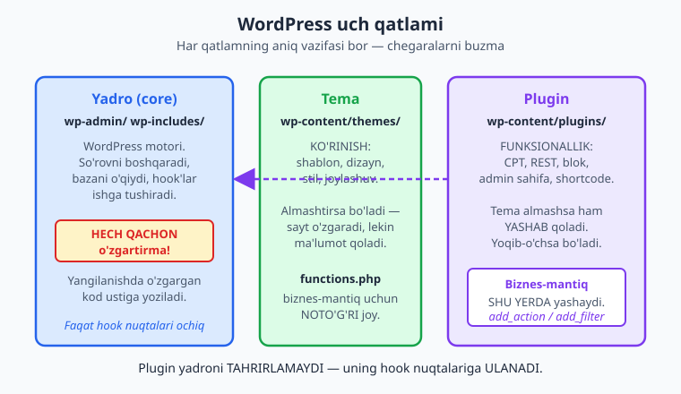
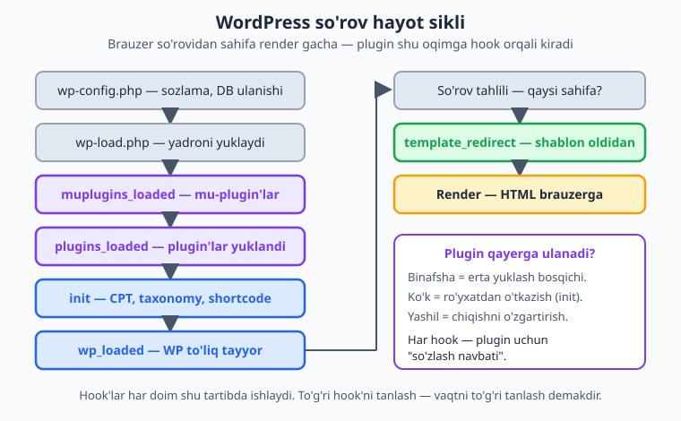
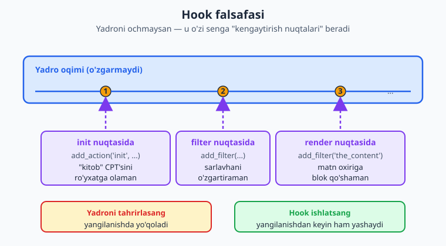

# 01 — WordPress arxitekturasi va plugin falsafasi

[🏠 README](./README.md) · [Keyingi: 02 — Lokal muhit va asboblar ➡️](./02-lokal-muhit.md)

> **Bu bobda:** WordPress nima ekanini va nega u dunyodagi saytlarning katta qismini quvvatlashini, uning uch qatlamini (yadro / tema / plugin) va har birining vazifasini, brauzer so'rovining yadro ichidagi to'liq hayot siklini (`wp-config.php` -> `wp-load.php` -> `muplugins_loaded` -> `plugins_loaded` -> `init` -> `wp_loaded` -> so'rov -> `template_redirect` -> render), plugin'ning bu oqimga hook orqali qanday kirishini, "yadroni hech qachon o'zgartirma" falsafasini, nega tema `functions.php` ham biznes-mantiq uchun noto'g'ri joy ekanini, plugin nimalar qila olishini va butun kitob bo'ylab quradigan namuna plugin'imiz — "Kitoblar katalogi" — g'oyasini ko'rib chiqamiz.

---

## WordPress nima va nega bu kitob

Sizning qo'lingizda allaqachon PHP bor: funksiya, sinf, namespace, massiv, OOP — bularni bilasiz. WordPress'ni foydalanuvchi sifatida ham ko'rgansiz: yozuv qo'shgansiz, tema o'rnatgansiz, balki bitta-ikkita plugin yoqib ko'rgansiz. Endi savol boshqacha:

> Men PHP yoza olaman. WordPress'dan foydalana olaman. Lekin WordPress'ga **o'z funksiyamni** qanday qo'shaman — shunday qo'shamanki, u yadro yangilanganda ham, tema almashtirilganda ham yo'qolmasin?

Mana shu savolga javob — **plugin** yozish. Bu kitob sizni "tema `functions.php`'ga kod tashlaydigan" havaskordan **toza, xavfsiz, yangilanishga chidamli plugin** yozadigan muhandisga aylantiradi.

WordPress — ochiq kodli (GPL litsenziya) kontent boshqaruv tizimi (CMS). Internetdagi saytlarning juda katta ulushi unda ishlaydi. Sababi bitta so'zda: **kengaytiriluvchanlik**. WordPress yadrosi sizga "hamma narsa" emas, balki **mustahkam asos** va undan kengayish uchun **minglab nuqta** beradi. Bu nuqtalar — **hook**'lar (ilgaklar). Plugin — aynan shu hook'lar orqali yadroga ulanadigan o'z kodingiz.

ℹ️ Bu kitob siz PHP'ni bilasiz deb hisoblaydi. PHP yangi bo'lsa, avval [PHP — Mutlaqo Noldan](../php/README.md), so'ng ilg'or mavzular uchun [PHP — Ekspert Darajasi](../php-expert/README.md) kitoblarini ko'ring. Gutenberg (blok muharriri) boblari uchun [JavaScript](../js/README.md) bilan tanishlik foydali.

---

## Uch qatlam: yadro, tema, plugin

WordPress saytini tushunishning eng aniq yo'li — uni **uch qatlam**ga ajratish. Har qatlamning aniq mas'uliyati bor, va ularning chegarasini hurmat qilish — professional WordPress dasturchisini havaskordan ajratadigan birinchi narsa.



### 1. Yadro (core) — motor

Yadro — bu WordPress'ning o'zi: `wp-admin/` va `wp-includes/` papkalaridagi kod. U so'rovni qabul qiladi, ma'lumotlar bazasini o'qiydi, foydalanuvchini autentifikatsiya qiladi, qaysi sahifani ko'rsatishni hal qiladi va — eng muhimi — **hook'larni ishga tushiradi**.

📌 Yadro haqida bitta oltin qoida bor: **yadro fayllarini hech qachon o'zgartirmang**. Sababi oddiy — WordPress yangilanganda (xavfsizlik yamoqlari tez-tez chiqadi) bu fayllar yangi versiya bilan **ustiga yoziladi** va sizning o'zgartirishingiz izsiz yo'qoladi. Yadro siz uchun ataylab ochiq qoldirilgan yagona narsasi — uning **hook nuqtalari**.

### 2. Tema — ko'rinish

Tema (`wp-content/themes/` ichida) saytning **ko'rinishi** uchun javob beradi: shablonlar, dizayn, ranglar, joylashuv. Temani almashtirsangiz — sayt boshqacha ko'rinadi, lekin **ma'lumotingiz** (yozuvlar, foydalanuvchilar, sozlamalar) o'zgarmaydi.

Har temada `functions.php` fayli bor, va u PHP kodini bajaradi. Ko'p havaskorlar shu yerga to'xtaydi: "menga maxsus funksiya kerakmi? `functions.php`'ga yozaman". Bu **vasvasa** va u xato (sababini quyida ko'ramiz).

### 3. Plugin — funksionallik

Plugin (`wp-content/plugins/` ichida) saytga **xulq-atvor** qo'shadi: yangi kontent turlari, admin sahifalar, REST endpoint'lar, bloklar, integratsiyalar. Plugin'ni alohida **yoqib-o'chirish** mumkin, va u **temadan mustaqil** — temani almashtirsangiz ham plugin ishlayveradi.

💡 Sodda mnemonika: **tema = qanday ko'rinadi**, **plugin = nima qiladi**, **yadro = bularning ikkalasiga ham asos**. Saytning ma'lumoti va mantig'i temaga emas, plugin'ga tegishli bo'lishi kerak.

---

## So'rov hayot sikli: kod qachon ishlaydi

Plugin yozishning eng katta "aha" lahzasi — **kodingiz o'z-o'zidan ishlamaydi**. Siz funksiya yozasiz, lekin uni darrov **chaqirmaysiz**. O'rniga, WordPress'ga aytasiz: "mana bu funksiyamni **falon lahzada** chaqir". Bu "lahza" — hook. To'g'ri hook'ni tanlash uchun esa, so'rov **qaysi tartibda** kechishini bilish kerak.

Brauzer saytingizdagi sahifani so'raganida, yadro ichida shunday ketma-ketlik kechadi:



1. **`wp-config.php`** — eng birinchi o'qiladigan fayl: ma'lumotlar bazasi ulanishi, maxfiy kalitlar, `WP_DEBUG` kabi sozlamalar shu yerda.
2. **`wp-load.php`** — yadroni xotiraga yuklaydi: barcha asosiy funksiyalar, sinflar va `$wpdb` (baza qatlami) shu bosqichda tayyor bo'ladi.
3. **`muplugins_loaded`** — "must-use" plugin'lar (`wp-content/mu-plugins/`, har doim faol) yuklangandan keyin ishga tushadigan birinchi action hook.
4. **`plugins_loaded`** — barcha faol oddiy plugin'lar yuklangach ishlaydi. Plugin'ingiz boshqa plugin bilan ishlashi kerak bo'lsa (masalan WooCommerce mavjudligini tekshirish), ko'pincha shu yerdan boshlaysiz.
5. **`init`** — WordPress to'liq ishga tushgan, joriy foydalanuvchi aniqlangan. Bu — plugin'larning **eng ko'p ishlatadigan** hook'i: Custom Post Type, taksonomiya, shortcode, blok aynan shu yerda ro'yxatdan o'tkaziladi.
6. **`wp_loaded`** — yadro va barcha plugin/tema to'liq yuklangan; "hammasi tayyor" nuqtasi.
7. **So'rov tahlili** — yadro URL'ni o'qib, qaysi sahifa (yozuv, arxiv, bosh sahifa...) so'ralganini aniqlaydi.
8. **`template_redirect`** — shablon tanlanishi **oldidan** ishlaydigan oxirgi qulay hook: bu yerda yo'naltirish (redirect), kirish tekshiruvi yoki maxsus chiqish qilish mumkin.
9. **Render** — tema shabloni HTML hosil qiladi va brauzerga yuboriladi.

⚠️ Bu tartib **o'zgarmas**. `init`'da bajariladigan ishni `plugins_loaded`'da qilishga urinsangiz — ba'zi funksiyalar hali tayyor bo'lmaydi va kod "tushunarsiz" tarzda sinadi. Shuning uchun "to'g'ri hook'ni tanlash" amalda "to'g'ri **vaqtni** tanlash" demakdir. Kitob davomida har bir vazifa uchun **qaysi** hook ekanini aniq ko'rsatamiz.

ℹ️ Yuqoridagi hook nomlari — `muplugins_loaded`, `plugins_loaded`, `init`, `wp_loaded`, `template_redirect` — WordPress'ning rasmiy [action ma'lumotnomasi](https://developer.wordpress.org/apis/hooks/action-reference/)dagi haqiqiy nomlar va aynan shu tartibda ishlaydi. Hech qachon hook nomini "taxmin qilmang" — shubha bo'lsa rasmiy hujjatni oching.

---

## Hook — WordPress'ning kengaytirish mexanizmi

Hook — yadro o'z oqimining ma'lum nuqtalarida qoldirgan **ulanish nuqtasi**. Siz yadroni ochmaysiz; yadro o'zi sizga "mana bu yerda mening kodimga qo'shilishing mumkin" deydi. Ikki xil hook bor:

- **Action** (amal) — "falon lahza yetganda mening funksiyamni **bajar**". Hech narsa qaytarmaydi; biror ish qiladi (CPT ro'yxatga olish, email yuborish, fayl yozish). `add_action()` bilan ulanasiz.
- **Filter** (filtr) — "falon ma'lumot chiqishidan oldin uni mening funksiyamdan **o'tkaz**, men uni o'zgartirib qaytaraman". `add_filter()` bilan ulanasiz. **Filter har doim qiymat qaytaradi.**



Mana action hook'ning eng sodda ko'rinishi — bu kitobdagi birinchi WordPress kodingiz:

```php
<?php
// "init" lahzasi yetganda mening funksiyam chaqirilsin.
add_action( 'init', 'kk_salom' );

function kk_salom(): void {
    // Bu yerda haqiqiy plugin biror narsani ro'yxatga oladi.
    // Hozircha shunchaki misol: WordPress jurnaliga yozamiz.
    error_log( 'Kitoblar katalogi plugini init bosqichida ishga tushdi.' );
}
```

`add_action( $hook, $callback, $priority = 10, $accepted_args = 1 )` — to'rt parametr oladi: hook nomi, chaqiriladigan funksiya, **prioritet** (kichik son oldinroq ishlaydi, sukut bo'yicha 10) va funksiya qabul qiladigan **argumentlar soni**. Prioritet va argumentlarni 04-bobda chuqur ko'ramiz.

Endi filter. U action'dan farqli — **qiymatni oladi va o'zgartirilganini qaytaradi**:

```php
<?php
// Har yozuv sarlavhasi chiqishidan oldin men uni o'zgartiraman.
add_filter( 'the_title', 'kk_sarlavhaga_qoshimcha' );

function kk_sarlavhaga_qoshimcha( string $title ): string {
    // ⚠️ Filter HAR DOIM qiymat qaytarishi shart.
    // Qaytarmasangiz — sarlavha bo'sh bo'lib qoladi.
    return $title . ' [katalog]';
}
```

📌 Action va filter o'rtasidagi farqni esda tuting: **action bajaradi, filter o'zgartiradi va qaytaradi**. Filter ichida `return` qilishni unutish — yangi boshlovchilarning eng keng tarqalgan xatosi.

⚠️ Yuqoridagi misollar **to'g'ri** yozilgan, lekin natijasini ko'rish uchun **ishlaydigan WordPress sayti** kerak (`add_action`/`add_filter` faqat WP ichida mavjud). Lokal sayt'ni 02-bobda `wp-env` yoki Docker bilan ko'taramiz; shundan keyin har misolni **o'z saytingizda** sinab ko'rasiz.

---

## Plugin falsafasi: nega yadro va `functions.php` emas

Endi eng muhim qoidaga keldik — bu kitobning butun ruhini belgilaydi.

### Yadroni hech qachon o'zgartirma

Yadro faylini tahrirlash — eng oson ko'rinadigan, lekin eng yomon yo'l. Birinchi yangilanishda o'zgartirishingiz **ustiga yoziladi**. Yangilanmaslik esa yana yomonroq: WordPress yangilanishlari ko'pincha **xavfsizlik** yamoqlari, eskirgan saytlar buzg'unchilarning birinchi nishoni. Demak yadroni "qulflab" qo'yib bo'lmaydi — uni yangilash kerak, shuning uchun unga tegmaslik kerak.

### Tema `functions.php` ham noto'g'ri joy

"Mayli, yadroga tegmayman — `functions.php`'ga yozaman" degan vasvasa keladi. Bu yadrodan yaxshiroq, lekin baribir noto'g'ri:

- ⚠️ **Tema almashsa, mantiq yo'qoladi.** Mijoz dizaynni yangilamoqchi bo'lib temani almashtirsa, `functions.php`'dagi Custom Post Type, sozlamalar va hisob-kitoblar **birga g'oyib bo'ladi** — go'yo ma'lumotingiz o'chgandek tuyuladi (aslida CPT ro'yxatdan o'tmay qolgani uchun ko'rinmaydi).
- **Aralashish.** Ko'rinish (tema) va xulq-atvor (mantiq) bir faylda chalkashadi; kodni saqlash va sinash qiyinlashadi.
- **Qayta ishlatib bo'lmaslik.** `functions.php` o'sha temaga bog'langan; mantiqni boshqa saytda ishlatolmaysiz.

📌 **Qoida:** biznes-mantiq — ma'lumotning **strukturasi** va **xulqi** — har doim **plugin**'da yashashi kerak. Tema faqat uni **ko'rsatadi**. Sinov savoli: "temani almashtirsam, bu kod yo'qolib ketsa muammo bo'ladimi?" Javob "ha" bo'lsa — bu plugin'ga tegishli.

💡 Amaliy istisno: faqat o'sha temaga xos kichik ko'rinish sozlamalari (masalan menyu joyini ro'yxatga olish) `functions.php`'da qolishi mumkin. Amma shubha bo'lsa — plugin'ni tanlang.

---

## Plugin nimalar qila oladi

Plugin yadroga ulanib, deyarli istalgan funksiyani qo'sha oladi. Mana imkoniyatlarning kichik xaritasi — va ularning har biri bu kitobning bobi:

| Imkoniyat | Nima beradi | Bob |
|---|---|---|
| Custom Post Type (CPT) | Yangi kontent turi (kitob, mahsulot, voqea) | 07 |
| Taksonomiya | Kontentni guruhlash (janr, kategoriya) | 08 |
| Meta box / custom field | Yozuvga qo'shimcha maydon | 09 |
| Settings API / admin sahifa | Plugin sozlamalari oynasi | 06 |
| `$wpdb` / Options / Transients | O'z jadvaling, sozlama, kesh | 10 |
| Shortcode | `[katalog]` kabi qisqa kodlar | 13 |
| REST API endpoint | Frontend/mobil uchun JSON API | 16 |
| Gutenberg blok | Muharrirga maxsus blok | 19-23 |
| WP-Cron | Rejalashtirilgan fon vazifalari | 17 |
| WooCommerce kengaytmasi | Do'kon funksiyalarini kengaytirish | 27 |

Bu ro'yxat to'liq emas — plugin yadroning **istalgan** hook'iga ulanishi mumkin, demak imkoniyatlar amalda cheksiz. Muhimi — har biri **bir xil falsafa**ga bo'ysunadi: yadroni o'zgartirma, hook orqali kengaytir.

---

## Namuna plugin: "Kitoblar katalogi"

Nazariya yetarli ravon o'rganilmaydi. Shuning uchun bu kitob bo'ylab **bitta haqiqiy plugin** quramiz va har bob unga yangi qism qo'shadi. Plugin'imiz — onlayn kutubxona yoki kitob do'koni uchun **"Kitoblar katalogi"**.

Uning izchil "shaxsiy ma'lumotlari" (barcha boblarda **aynan** shu nomlar ishlatiladi):

| Narsa | Qiymat |
|---|---|
| Plugin slug (papka/fayl) | `kitoblar-katalogi` |
| PHP namespace | `Oqil\KitobKatalog` |
| Text domain (tarjima) | `kitoblar-katalogi` |
| Funksiya/hook prefiksi | `kk_` |
| Asosiy CPT | `kitob` |
| Taksonomiya | `janr` |

Kitob oxiriga borib bu plugin quyidagilarga ega bo'ladi: `kitob` Custom Post Type'i, `janr` taksonomiyasi, sozlamalar sahifasi, REST endpoint'i, kitoblar ro'yxatini ko'rsatadigan Gutenberg blok'i, va distribution'ga tayyor paket.

💡 **Nega prefiks?** WordPress'da barcha plugin'lar **bir xil global makonda** ishlaydi. Ikki plugin `salom()` nomli funksiya e'lon qilsa — PHP "qayta e'lon" xatosi bilan **butun sayt qulaydi**. Shuning uchun har nomga noyob prefiks (`kk_`) yoki — yaxshirog'i — `namespace` qo'yiladi. Buni 05-bobda PSR-4 autoload bilan professional darajada hal qilamiz.

📌 Hozircha papka tuzilishini yodlash shart emas. 03-bobda birinchi plugin'ni noldan, header'i va aktivatsiya hook'i bilan birga quramiz. Bu bobning maqsadi — **falsafani** (uch qatlam, hook, "yadroni o'zgartirma") miyaga mustahkamlash edi. Qolgani — amaliyot.

---

## Xulosa

- WordPress uch qatlamdan iborat: **yadro** (motor, tegma), **tema** (ko'rinish), **plugin** (funksionallik). Biznes-mantiq plugin'ga tegishli.
- Har so'rov o'zgarmas tartibda kechadi: `wp-config.php` -> `wp-load.php` -> `muplugins_loaded` -> `plugins_loaded` -> `init` -> `wp_loaded` -> so'rov -> `template_redirect` -> render. Plugin shu oqimning **hook nuqtalariga** ulanadi.
- **Action** ish bajaradi (`add_action`), **filter** qiymatni o'zgartirib qaytaradi (`add_filter`). Filter har doim `return` qiladi.
- "Yadroni hech qachon o'zgartirma" va "biznes-mantiqni `functions.php`'da emas, plugin'da sakla" — kasbiy WordPress dasturchisining ikki tamal qoidasi.
- Kitob bo'ylab **"Kitoblar katalogi"** (`kitoblar-katalogi`) plugin'ini quramiz; slug, namespace va prefikslar barcha boblarda izchil.

Keyingi bobda lokal WordPress muhitini (`wp-env` / Docker), `WP_DEBUG`, WP-CLI va plugin papkasini sozlaymiz — shundan keyin yuqoridagi misollarni o'z saytingizda haqiqatan ishga tushira olasiz.

---

## 01-bob mashqlari

> Bu bob konseptual, shuning uchun mashqlar ham asosan **tushunish** va **rejalashtirish**ga qaratilgan. Kod yozadigan mashqlar 03-bobdan boshlanadi, lekin bu yerdagi mantiqiy mashg'ulotlar keyingi hamma narsaning poydevori.

### Oson

1. **(Oson)** O'z so'zlaringiz bilan ayting: yadro, tema va plugin — har biri nima uchun javob beradi? Har biriga sayt papkasidagi joyini (`wp-includes/`, `wp-content/themes/`, `wp-content/plugins/`) moslang.
2. **(Oson)** Quyidagi vazifalarni "tema" yoki "plugin" deb belgilang: (a) sahifa fonini ko'k qilish, (b) "kitob" kontent turini qo'shish, (c) menyu shriftini o'zgartirish, (d) har yangi yozuvda adminga email yuborish.
3. **(Oson)** So'rov hayot siklidagi besh hook'ni (`muplugins_loaded`, `plugins_loaded`, `init`, `wp_loaded`, `template_redirect`) to'g'ri tartibda yozing.
4. **(Oson)** Action va filter o'rtasidagi asosiy farqni bir jumlada tushuntiring. Qaysi biri qiymat qaytarishi **shart**?

### O'rta

5. **(O'rta)** Bir dasturchi "menga maxsus funksiya kerak edi, shuning uchun yadrodagi `wp-includes/post.php`'ni tahrirladim" deydi. Unga **uch** muammoni tushuntiring va to'g'ri yo'lni ayting.
6. **(O'rta)** Mijoz: "saytimga maxsus funksiyalarni temamning `functions.php`'iga yozganman, endi yangi tema sotib oldim". Nima yuz beradi va nima uchun? Qanday tuzatasiz?
7. **(O'rta)** Nega plugin'ingizdagi funksiyalarga prefiks (`kk_`) yoki namespace kerak? Prefiks bo'lmasa qanday halokat yuz berishi mumkin?

<details markdown="1"><summary>Yechim (5)</summary>

Uch muammo:

1. **Yangilanish o'chiradi.** Birinchi WordPress yangilanishida `wp-includes/post.php` yangi versiya bilan ustiga yoziladi — o'zgartirish izsiz yo'qoladi.
2. **Xavfsizlik.** Yangilamaslik mumkin emas — yangilanishlar ko'pincha xavfsizlik yamoqlari. Demak yadro o'zgarishi muqarrar, shuning uchun unga tayanib bo'lmaydi.
3. **Saqlash/kuzatish dahshatli.** O'zgartirish hech qayerda hujjatlanmagan; keyingi dasturchi (yoki kelajakdagi siz) buni topolmaydi.

To'g'ri yo'l: kerakli o'zgarishni **plugin** ichida tegishli **hook** orqali qiling. Deyarli har yadro xatti-harakatining action yoki filter hook'i bor; rasmiy hujjatdan toping va shunga ulaning — yadroga tegmang.
</details>

<details markdown="1"><summary>Yechim (6)</summary>

Yangi temani faollashtirgan zahoti **eski `functions.php`dagi barcha kod ishlashdan to'xtaydi** — Custom Post Type'lar ro'yxatdan o'tmay qoladi (admin'da "kitoblar" menyusi yo'qoladi), maxsus shortcode'lar bo'sh chiqadi, sozlamalar ishlamaydi. Ma'lumot bazada **turibdi**, lekin uni ro'yxatga oladigan kod faol bo'lmagani uchun WordPress uni ko'rsatmaydi.

Tuzatish: o'sha mantiqni `functions.php`'dan **plugin**ga ko'chiring (kod deyarli bir xil — `add_action`/`add_filter` o'zgarmaydi, faqat plugin header'i bilan alohida faylga o'tadi). Shundan keyin tema ixtiyoriy: istalgancha almashtiring, funksionallik joyida qoladi.
</details>

<details markdown="1"><summary>Yechim (7)</summary>

WordPress'da yadro, barcha plugin'lar va faol tema **bitta umumiy PHP global makonida** ishlaydi. Agar sizning plugin'ingiz `init_plugin()` nomli funksiya e'lon qilsa va boshqa plugin ham xuddi shu nomni ishlatsa, PHP `Cannot redeclare function` **halokatli xatosi** beradi — bu butun saytni "oq ekran"ga olib keladi (ikkala plugin ham emas, **butun sayt** ishlamay qoladi).

Yechim: har bir global nomga noyob prefiks (`kk_init`) qo'shing, yoki — professional yo'l — barcha kodni `namespace Oqil\KitobKatalog;` ichiga oling, shunda nomlar tabiiy ravishda ajraladi. Buni 05-bobda PSR-4 autoload bilan to'liq quramiz.
</details>

### Qiyin

8. **(Qiyin)** "Kitoblar katalogi" plugin'i uchun **vazifa -> hook** rejasini tuzing: (a) `kitob` CPT'sini qaysi hook'da ro'yxatga olasiz? (b) sozlamalar sahifasi menyusini qaysi hook'da qo'shasiz (taxmin qiling, 06-bobda tasdiqlaymiz)? (c) yozuv matni oxiriga "Janr: ..." qatorini qo'shish action'mi yoki filter'mi?
9. **(Qiyin)** Hayot siklini diagramma sifatida (qog'ozda yoki matnda) qaytadan chizing va har bosqichga "bu yerda plugin nima qila oladi?" degan bir misol yozing.
10. **(Qiyin)** "Kitoblar katalogi" plugin'ining **identifikatorlar jadvali**ni (slug, namespace, text domain, prefiks, CPT, taksonomiya) yodingizdan yozing va nega ularning **izchil** bo'lishi muhimligini tushuntiring.
11. **(Qiyin)** Bir do'st filter yozdi, lekin sahifadagi barcha sarlavhalar **bo'sh** chiqyapti. Uning kodi: `add_filter( 'the_title', fn( $title ) => { /* log qiladi, hech narsa qaytarmaydi */ } );`. Xatoni toping va tuzating.
12. **(Qiyin)** Nega `init` plugin'lar uchun eng ko'p ishlatiladigan hook? `plugins_loaded`'da CPT ro'yxatga olishga urinish nega muammo bo'lishi mumkin? (Maslahat: 07-bobda `register_post_type` aynan `init`'da chaqirilishi tavsiya etiladi.)

<details markdown="1"><summary>Yechim (8)</summary>

- **(a)** `kitob` CPT'si **`init`** hook'ida ro'yxatga olinadi. WordPress hujjati `register_post_type`'ni `init`'da chaqirishni tavsiya qiladi — bu paytda yadro tayyor, lekin so'rov hali ishlanmagan.

```php
<?php
add_action( 'init', 'kk_kitob_cpt_royxatga_ol' );

function kk_kitob_cpt_royxatga_ol(): void {
    // To'liq register_post_type chaqiruvini 07-bobda quramiz.
    // Hozircha muhimi: bu "init" ichida turadi.
}
```

- **(b)** Admin menyusi **`admin_menu`** hook'ida qo'shiladi (`add_menu_page`/`add_options_page` bilan — 06-bobda). Bu hook faqat admin so'rovlarida ishlaydi, frontend'da behuda ishlamaydi.
- **(c)** Yozuv matnini **o'zgartirib** qaytarish kerak (yangi matn = eski matn + qatordan), demak bu **filter** — odatda `the_content` filter'i. Action emas, chunki chiqishni o'zgartirib **qaytarish** kerak.
</details>

<details markdown="1"><summary>Yechim (9)</summary>

Namuna javob (har bosqich + plugin imkoniyati):

| Bosqich | Plugin nima qila oladi |
|---|---|
| `wp-config.php` | (To'g'ridan tegmaymiz — sozlama yadro/server ishi.) |
| `plugins_loaded` | Boshqa plugin (masalan WooCommerce) bor-yo'qligini tekshirib, integratsiyani yoqish. |
| `init` | `kitob` CPT'si, `janr` taksonomiyasi, shortcode'larni ro'yxatga olish. |
| `wp_loaded` | Hammasi tayyor bo'lgach bir martalik tekshiruv yoki migratsiya. |
| `template_redirect` | Faqat tizimga kirgan foydalanuvchilar uchun sahifani himoyalash (redirect). |
| Render (`the_content` filter) | Kitob matni oxiriga "Janr: ..." qatorini qo'shish. |

Asosiy g'oya: **har bosqich plugin uchun aniq "navbat"** — to'g'ri hook = to'g'ri vaqt.
</details>

<details markdown="1"><summary>Yechim (11)</summary>

Xato: filter funksiyasi **qiymat qaytarmayapti**. Filter har doim o'zgartirilgan (yoki o'zgartirilmagan) qiymatni `return` qilishi shart; qaytarmasa, WordPress `null` oladi va sarlavha bo'sh bo'ladi.

To'g'ri kod:

```php
<?php
add_filter( 'the_title', 'kk_sarlavha_logla' );

function kk_sarlavha_logla( string $title ): string {
    error_log( "Sarlavha render qilindi: " . $title );
    return $title; // ⚠️ ENG MUHIMI: qiymatni qaytaramiz.
}
```

📌 Qoida: filter ichida nima qilsangiz ham, oxirida qiymatni **qaytaring**. Action'da `return` shart emas (u qiymat kutmaydi), lekin filter'da `return`siz kod jim turib ma'lumotni o'chiradi.
</details>

<details markdown="1"><summary>Yechim (12)</summary>

`init` eng ko'p ishlatiladi, chunki bu nuqtada:

- Yadro **to'liq yuklangan** (barcha funksiya, sinf, `$wpdb` tayyor).
- Joriy foydalanuvchi **aniqlangan** (`current_user_can()` ishlaydi).
- So'rov **hali ishlanmagan** — demak CPT, taksonomiya, shortcode'larni ro'yxatga olish uchun ayni payti; yadro bu ro'yxatlarni `init`dan keyin o'qiydi.

`plugins_loaded`'da `register_post_type` chaqirsangiz, ba'zi yadro qismlari hali to'liq sozlanmagan bo'lishi mumkin va CPT noto'g'ri yoki to'liqsiz ro'yxatga olinadi (masalan ba'zi xususiyatlar/rewrite qoidalari ishlamaydi). WordPress hujjati `register_post_type`'ni aniq **`init`**'da chaqirishni tavsiya qiladi — shuning uchun "to'g'ri hook" har doim hujjatdan tekshiriladi, taxmin qilinmaydi.
</details>

---

[🏠 README](./README.md) · [Keyingi: 02 — Lokal muhit va asboblar ➡️](./02-lokal-muhit.md)
