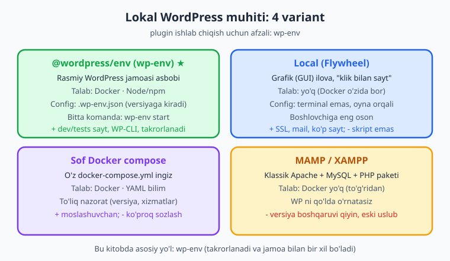
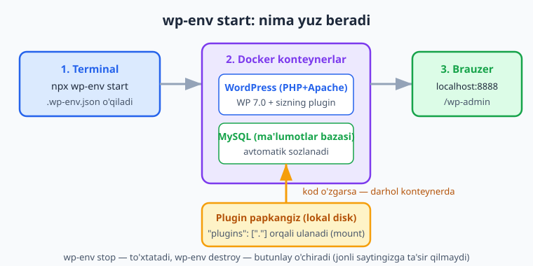
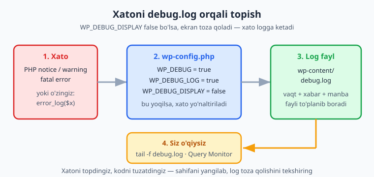

# 02 — Lokal muhit va asboblar

[⬅️ Oldingi: 01 — WordPress arxitekturasi va plugin falsafasi](./01-arxitektura-falsafa.md) · [🏠 README](./README.md) · [Keyingi: 03 — Birinchi plugin: tuzilish va hayot sikli ➡️](./03-birinchi-plugin.md)

> **Bu bobda:** plugin yozish uchun professional **lokal muhit** quramiz — nega jonli saytda eksperiment qilmaslik kerakligidan boshlab, `wp-env` (rasmiy, Docker asosidagi asbob), Local, sof Docker va MAMP/XAMPP variantlarini taqqoslaymiz; `.wp-env.json` config, portlar va tozalashni o'rganamiz; **WP-CLI** (`wp`) bilan saytni terminal orqali boshqaramiz; `WP_DEBUG`/`WP_DEBUG_LOG`/`SCRIPT_DEBUG` debug rejimi va `debug.log` ni sozlaymiz, Query Monitor bilan ko'ramiz; plugin papkasini symlink bilan ulaymiz va VS Code + Intelephense + Xdebug ni qisqacha sozlaymiz — shu bilan keyingi boblardagi har bir misolni o'z mashinangizda xavfsiz sinaydigan holatga kelamiz.

---

## Muammo: nega jonli saytda kod yozib bo'lmaydi

Tasavvur qiling: mijozning ishlab turgan do'koni bor, har kuni buyurtmalar tushadi. Siz "kichik" plugin qo'shasiz, bitta nuqtali vergulni unutasiz — va butun sayt **oq ekran** (white screen of death) bo'lib qoladi. Mijoz pul yo'qotadi, siz esa tunda telefon ko'taradigan odamga aylanasiz.

Jonli (production) sayt — eksperiment maydoni emas. Plugin ishlab chiqishda sizga shunday muhit kerakki, unda:

- xato qilsangiz **hech kim** ko'rmaydi va hech narsa yo'qolmaydi;
- xatolarni **to'liq** ko'rasiz (jonli saytda ular yashiriladi);
- WordPress va PHP **versiyasini** xohlaganingizcha o'zgartirasiz;
- saytni **bir komanda bilan** ko'tarib, buzilsa **bir komanda bilan** noldan tiklaysiz.

Bu — **lokal muhit**: o'z kompyuteringizda ishlaydigan, internetga ulanmagan, faqat sizniki bo'lgan WordPress. Bu bobda uni quramiz.

📌 **Oltin qoida.** Kod avval lokalda yoziladi va sinaladi, keyin staging (sinov nusxasi), keyingina production. Plugin'ni to'g'ridan-to'g'ri jonli saytga "tahrirla va saqla" qilish — havaskorlik belgisi.

---

## Variantlar: qaysi muhitni tanlash

Lokal WordPress ko'tarishning to'rtta asosiy yo'li bor. Hammasi ishlaydi, lekin plugin ishlab chiqish uchun bittasi ayniqsa qulay.



| Variant | Asos | Talab | Kuchli tomoni | Kim uchun |
|---|---|---|---|---|
| **`@wordpress/env` (wp-env)** | Docker | Docker + Node/npm | Rasmiy, `.wp-env.json` versiyaga kiradi, dev+tests sayt, takrorlanadi | **Plugin dev (afzal)** |
| **Local** (Flywheel) | Docker (yashirin) | Yo'q (o'zida) | Grafik, "klik bilan sayt", SSL/mail tayyor | Boshlovchi, dizayner |
| **Sof Docker compose** | Docker | Docker + YAML | To'liq nazorat, istalgan xizmat | Murakkab stek kerak bo'lsa |
| **MAMP / XAMPP** | Apache+MySQL+PHP | Yo'q | Docker shart emas | Eski uslub, sodda saytlar |

Biz **`wp-env`** ni tanlaymiz, chunki:

1. Uni **rasmiy WordPress jamoasi** ishlab chiqaradi va Gutenberg, keyingi boblardagi blok asboblari bilan bir xil oilada.
2. Konfiguratsiya `.wp-env.json` faylida bo'ladi — uni Git'ga qo'shsangiz, jamoadagi har kim **aynan bir xil** muhitni bir komanda bilan oladi.
3. U sizga **ikkita** sayt beradi: ishlash uchun (dev) va avtomatik testlar uchun (tests) — bu 25-bobda kerak bo'ladi.

💡 Agar Docker o'rnatishni xohlamasangiz yoki terminaldan qo'rqsangiz — **Local** dan boshlang, u grafik va juda oson. Kitobdagi tushunchalar (debug, WP-CLI, plugin papkasi) hamma muhitga bir xil tegishli; faqat saytni ko'tarish usuli farq qiladi.

⚠️ `wp-env`, Local va Docker compose — uchchalasi ham **Docker** ga tayanadi. Avval [Docker Desktop](https://www.docker.com/) o'rnatib, uni **ishga tushiring** (daemon yoqilgan bo'lsin), aks holda `wp-env start` "cannot connect to Docker" xatosi beradi.

---

## `wp-env`: bir komanda bilan WordPress

> ℹ️ **Halol eslatma.** Quyidagi `wp-env`/`wp` buyruqlari ishlash uchun mashinangizda **Docker ishga tushgan** bo'lishi shart. Bu bob buyruqlarni va ularning natijasini **o'z mashinangizda** (illustrativ) bajarishingizni nazarda tutadi; men bu yerda soxta chiqindi yozmayman — natijani o'zingiz ko'rasiz.

### Talablar

- **Docker Desktop** — o'rnatilgan va ishlab turgan.
- **Node.js + npm** — `wp-env` Node paketidir. (Node yangi bo'lsa, [JavaScript](../js/README.md) kitobiga qarang.)

Tekshiring:

```bash
docker --version
node --version
npm --version
```

### Ishga tushirish

Eng tez yo'l — global o'rnatmasdan, `npx` bilan:

```bash
# plugin papkangiz ichida turib:
npx @wordpress/env start
```

Yoki global o'rnatib, qisqa `wp-env` komandasidan foydalaning (rasmiy hujjat shu yo'lni ko'rsatadi):

```bash
npm -g install @wordpress/env
wp-env start
```

Birinchi marta Docker WordPress va MySQL "image"larini yuklab oladi — biroz vaqt ketadi. Tugagach terminal sayt manzilini chiqaradi: odatda **`http://localhost:8888`** (admin: `http://localhost:8888/wp-admin`). Standart admin login — `admin`, parol — `password`.

📌 `wp-env start` aynan nima qiladi: `.wp-env.json` ni o'qiydi, Docker'da **WordPress** (PHP+Apache) va **MySQL** konteynerlarini ko'taradi, plugin papkangizni konteyner ichiga **ulaydi** (mount). Kodingizni o'zgartirsangiz — darhol konteynerda aks etadi, qayta ishga tushirish shart emas.



### Foydali `wp-env` buyruqlari

```bash
wp-env start          # muhitni ko'tarish (yoki yangilash)
wp-env stop           # to'xtatish (ma'lumot saqlanib qoladi)
wp-env clean all      # ma'lumotlar bazasini tozalash (qaytadan boshlash)
wp-env destroy        # konteyner va ma'lumotni butunlay o'chirish
wp-env run cli wp ...  # konteyner ichida WP-CLI buyrug'ini ishlatish
```

`wp-env run` ning birinchi argumenti — **konteyner nomi**. Asosiylari: `cli` (WP-CLI), `wordpress` (asosiy sayt), `tests-cli`/`tests-wordpress` (test sayti), `mysql`. Masalan, sayt ichidagi plugin'lar ro'yxatini ko'rish:

```bash
wp-env run cli wp plugin list
```

### `.wp-env.json` config

Plugin papkangiz ildiziga `.wp-env.json` faylini qo'ying — bu muhitingizni "kodga aylantiradi". Quyidagi config **JSON sifatida tekshirilgan** (valid):

```json
{
	"core": "WordPress/WordPress#7.0",
	"phpVersion": "8.3",
	"plugins": [ "." ],
	"port": 8888,
	"testsPort": 8889,
	"config": {
		"WP_DEBUG": true,
		"WP_DEBUG_LOG": true,
		"WP_DEBUG_DISPLAY": false,
		"SCRIPT_DEBUG": true
	},
	"mappings": {
		"wp-content/mu-plugins": "./.dev/mu-plugins"
	}
}
```

Maydonlarni o'qiymiz:

- **`core`** — qaysi WordPress versiyasi. `"WordPress/WordPress#7.0"` — aynan 7.0; `null` — eng so'nggi stable.
- **`phpVersion`** — PHP versiyasi (`"8.3"`). Plugin'ingiz minimal PHP'da ishlashini shu yerda sinaysiz.
- **`plugins`** — o'rnatilib **aktivlashtiriladigan** plugin'lar ro'yxati. `"."` — joriy papka (ya'ni siz yozayotgan plugin) konteynerga ulanadi va yoqiladi. Bu plugin dev uchun aynan kerakli narsa.
- **`port`** / **`testsPort`** — dev sayt (standart **8888**) va tests sayt (standart **8889**) portlari. Agar 8888 band bo'lsa, shu yerda o'zgartiring.
- **`config`** — `wp-config.php` ga qo'shiladigan konstantalar. Debug'ni shu yerdan yoqamiz (pastda batafsil).
- **`mappings`** — qo'shimcha papkalarni konteynerga ulash (masalan `mu-plugins`).

💡 `.wp-env.json` ni **Git'ga qo'shing**, lekin shaxsiy o'zgarishlaringizni `.wp-env.override.json` ga yozing (u odatda `.gitignore` da) — shunda jamoa configi toza qoladi.

---

## WP-CLI: WordPress'ni terminaldan boshqarish

**WP-CLI** — `wp` buyrug'i orqali WordPress'ni brauzersiz, terminaldan boshqarish vositasi. Plugin'ni yoqish, post yaratish, foydalanuvchi qo'shish, hatto ixtiyoriy PHP kodini sayt kontekstida ishga tushirish — hammasi bitta qatorda.

`wp-env` ichida WP-CLI tayyor turadi; uni `wp-env run cli wp ...` orqali chaqirasiz:

```bash
# plugin'larni ro'yxatlash
wp-env run cli wp plugin list

# bizning namuna plugin'ni yoqish/o'chirish
wp-env run cli wp plugin activate kitoblar-katalogi
wp-env run cli wp plugin deactivate kitoblar-katalogi

# test ma'lumoti: "kitob" CPT'siga post yaratish (07-bobda CPT'ni quramiz)
wp-env run cli wp post create --post_type=kitob --post_title="Sukunat" --post_status=publish

# ixtiyoriy PHP'ni sayt ichida ishga tushirish
wp-env run cli wp eval 'echo get_bloginfo("version");'
```

Nega WP-CLI kuchli:

- **Tezlik** — 50 ta test post yaratishni bir `for` siklida qilasiz, qo'lda emas.
- **Avtomatlashtirish** — skriptlar, CI, deploy.
- **Debug** — `wp eval` bilan funksiyangizni jonli sayt kontekstida (barcha WP funksiyalari mavjud holatda) sinaysiz.

📌 `wp` (WP-CLI) — bu kitobda tez-tez ko'rinadi. Agar lokal muhitingiz Docker'siz bo'lsa (masalan Local), WP-CLI ko'pincha ilova ichida yoki PATH'da `wp` sifatida mavjud bo'ladi; u holda `wp-env run cli` o'rniga to'g'ridan `wp ...` yozasiz.

---

## Debug rejimi: xatoni ko'rinadigan qilish

Standart WordPress xatolarni **yashiradi** — bu jonli sayt uchun to'g'ri, lekin dev uchun halokat. Lokal muhitda biz teskarisini xohlaymiz: har bir notice, warning va fatal error ko'rinsin yoki logga yozilsin.

Buni `wp-config.php` dagi (yoki `.wp-env.json` ning `config` bo'limidagi) bir nechta konstanta boshqaradi. Quyidagi snippet **`php -l`** dan o'tgan:

```php
<?php
// wp-config.php (faqat debug qismi — "/* That's all, stop editing! */" dan YUQORIDA)
define( 'WP_DEBUG', true );          // debug rejimini umuman yoqadi
define( 'WP_DEBUG_LOG', true );      // xatolarni wp-content/debug.log ga yozadi
define( 'WP_DEBUG_DISPLAY', false ); // xatolarni sahifa HTML'ida KO'RSATMAYDI
@ini_set( 'display_errors', '0' );   // PHP darajasida ham ekranga chiqarmaslik
define( 'SCRIPT_DEBUG', true );      // core CSS/JS ning minify QILINMAGAN versiyasi
define( 'SAVEQUERIES', true );       // har bir SQL so'rovni $wpdb->queries ga saqlaydi
```

Har birini ochib beraylik:

- **`WP_DEBUG`** — bosh kalit. `true` bo'lsa, WordPress barcha xato darajalarini (notice/warning ham) faollashtiradi.
- **`WP_DEBUG_LOG`** — `true` bo'lsa, xatolar **`wp-content/debug.log`** fayliga yoziladi. Bunga **maxsus yo'l** ham berishingiz mumkin:
  ```php
  define( 'WP_DEBUG_LOG', '/tmp/kitoblar-katalogi.log' );
  ```
- **`WP_DEBUG_DISPLAY`** — xatolar sahifa **HTML'iga** chiqsinmi? Logga yozayotganda buni `false` qiling, aks holda har bir notice sahifa boshini buzadi (ayniqsa AJAX/REST javoblarini).
- **`SCRIPT_DEBUG`** — core'ning va `@wordpress/scripts` ning minify qilinmagan (o'qilishi oson) JS/CSS versiyalarini yuklaydi. Blok boblarida (19-23) foydali.
- **`SAVEQUERIES`** — bajarilgan har bir SQL so'rovni xotirada saqlaydi (Query Monitor undan foydalanadi). ℹ️ Ishlab chiqishda yoqing, jonli saytda **o'chiring** — xotira yeydi.

⚠️ **Bu konstantalar faqat lokal/dev uchun.** Jonli saytda `WP_DEBUG` va ayniqsa `WP_DEBUG_DISPLAY` ni hech qachon `true` qoldirmang: xato matnlari fayl yo'llarini va sayt ichki tuzilishini ochib, hujumchiga yordam beradi.

### `debug.log` bilan ishlash

Xato yuz berganda u `wp-content/debug.log` ga to'planadi. Oqim shunday:



Log faylni "jonli" kuzatish (yangi xatolar paydo bo'lishi bilan ko'rinadi):

```bash
# wp-env ichidagi WordPress konteynerida:
wp-env run wordpress tail -f wp-content/debug.log
```

O'z plugin kodingizdan logga yozishingiz mumkin. PHP'ning `error_log()` funksiyasi `WP_DEBUG_LOG` yoqilgan bo'lsa shu faylga yozadi. Kichik yordamchi (`php -l` dan o'tgan):

```php
<?php
// plugin ichida: xavfsiz debug yordamchisi
function kk_debug( mixed $data ): void {
    if ( defined( 'WP_DEBUG' ) && WP_DEBUG ) {
        error_log( print_r( $data, true ) );
    }
}

// foydalanish:
kk_debug( [ 'kitob_id' => 42, 'holat' => 'saqlandi' ] );
```

💡 `print_r( $data, true )` — ikkinchi argument `true` bo'lsa, natijani **ekranga chiqarmay**, satr sifatida qaytaradi — aynan logga yozish uchun.

### Query Monitor

Brauzerda debug qilishning eng qulay vositasi — **Query Monitor** plugin'i (wordpress.org'da bepul). U admin panelga panel qo'shadi va sahifaning: barcha SQL so'rovlarini (sekinlarini qizil bilan), ishga tushgan hook'larni, REST/AJAX so'rovlarni, PHP xato/notice'larni, qanday shablon yuklanganini ko'rsatadi. 26-bobda (performance) buni chuqur ishlatamiz.

Uni WP-CLI bilan tez o'rnatib yoqing:

```bash
wp-env run cli wp plugin install query-monitor --activate
```

---

## Plugin papkasi va symlink bilan dev

WordPress plugin'larni **`wp-content/plugins/`** papkasida qidiradi. Har bir plugin — shu papka ichidagi alohida papka:

```text
wp-content/
└── plugins/
    └── kitoblar-katalogi/        <- bizning namuna plugin (butun kitob bo'ylab)
        ├── kitoblar-katalogi.php  <- asosiy fayl (plugin header shu yerda)
        ├── includes/
        ├── assets/
        └── readme.txt
```

📌 Butun kitob bo'ylab **bitta** namuna plugin'ni quramiz: slug `kitoblar-katalogi`, namespace `Oqil\KitobKatalog`, text domain `kitoblar-katalogi`. 03-bobda uni noldan boshlaymiz.

`wp-env` da `"plugins": [ "." ]` yozsangiz, joriy papka avtomatik ulanadi — symlink kerak emas. Lekin Local yoki sof Docker'da plugin'ingizni boshqa joyda saqlab, `plugins/` ga **symlink** (ramziy havola) qo'yish qulay (kod bitta joyda turadi, lekin saytlar uni ko'radi):

```bash
# Linux / macOS (yoki Windows'da Git Bash / WSL):
ln -s ~/loyihalar/kitoblar-katalogi /yo'l/wp-content/plugins/kitoblar-katalogi
```

Windows'da PowerShell orqali (administrator rejimida):

```text
New-Item -ItemType SymbolicLink -Path "C:\...\wp-content\plugins\kitoblar-katalogi" -Target "C:\loyihalar\kitoblar-katalogi"
```

⚠️ Ba'zi muhitlarda WordPress symlink qilingan plugin'ning `__FILE__` yo'lini boshqacha hal qiladi; agar `plugins_url()` noto'g'ri manzil bersa, symlink o'rniga to'g'ridan papkaga ko'chiring yoki `wp-env`/mappings'dan foydalaning.

---

## IDE, Intelephense va Xdebug (qisqa)

Plugin'ni qulay yozish uchun muharrir sozlamasi:

- **VS Code** — bepul va WordPress dev'da keng tarqalgan. Yoki PhpStorm (pullik, WP'ni juda yaxshi tushunadi).
- **PHP Intelephense** kengaytmasi — avtoto'ldirish, "go to definition", xato belgilash. WordPress core funksiyalarini taniydi (`add_action`, `register_post_type` ...), shuning uchun xayoliy funksiya yozsangiz darhol ogohlantiradi — bu **anti-hallucination** uchun ham foydali.
- **WordPress stub'lari** — Intelephense core funksiyalarini bilishi uchun loyihaga `php-stubs/wordpress-stubs` ni Composer bilan qo'shing (dev-dependency).

**Xdebug** — kodni qadam-baqadam (breakpoint qo'yib) kuzatadigan debugger. `error_log()` "print bilan debug" bo'lsa, Xdebug — "to'xtab, o'zgaruvchilarni ko'rib" debug. `wp-env` da `xdebug` rejimini yoqish mumkin:

```bash
wp-env start --xdebug
```

So'ng VS Code'da "PHP Debug" kengaytmasini o'rnatib, 9003-portda tinglaydigan launch konfiguratsiyasi qo'shasiz va breakpoint qo'yib so'rov yuborasiz. Boshida `error_log()` yetarli; loyiha o'sgach Xdebug ancha vaqtni tejaydi.

💡 26 va 29-boblar (performance, xavfsizlik auditi) uchun Query Monitor + Xdebug juftligi — eng kuchli kombinatsiya.

---

## Bularning hammasi birga: ish oqimi

Kundalik plugin dev sikli odatda shunday ko'rinadi:

1. `wp-env start` — muhitni ko'tar (kuningiz boshida bir marta).
2. Muharrirda kod yoz — fayl saqlanishi bilan konteynerda aks etadi.
3. `http://localhost:8888` da natijani ko'r; xato bo'lsa `debug.log` yoki Query Monitor'ga qara.
4. `wp-env run cli wp ...` bilan test ma'lumoti yarat yoki holatni tekshir.
5. Tugagach `wp-env stop`; muhit buzilsa `wp-env clean all` yoki `wp-env destroy` bilan noldan boshla.

Bu sikl 03-bobda birinchi haqiqiy plugin'ni yozganimizda darhol ishga tushadi.

---

## 02-bob mashqlari

> Ko'p mashqlar **o'z mashinangizda** (Docker bilan) bajariladi. Ularni haqiqatan ishga tushirib, natijani ko'ring — plugin o'qib emas, **qilib** o'rganiladi.

### Oson

1. **(Oson)** Docker Desktop, Node va npm o'rnatilganini tekshiring: `docker --version`, `node --version`, `npm --version`. Uchchalasi versiya chiqarsa, tayyorsiz.
2. **(Oson)** Bo'sh papka yarating va unda `npx @wordpress/env start` ni ishga tushiring. Brauzerda `http://localhost:8888/wp-admin` ni oching (`admin` / `password`).
3. **(Oson)** `wp-env stop` va `wp-env start` ni ketma-ket bajaring. To'xtatib yoqsangiz ma'lumot saqlanib qolishini kuzating.
4. **(Oson)** To'rt variant (`wp-env`, Local, Docker compose, MAMP) dan qaysi biri **Docker talab qilmasligini** ayting (ikkitasi bor).

### O'rta

5. **(O'rta)** Plugin papkangizga `.wp-env.json` yozing: `core` 7.0, `phpVersion` 8.3, `plugins` ga `"."`, va `config` da `WP_DEBUG`/`WP_DEBUG_LOG`/`SCRIPT_DEBUG` yoqilgan. Faylni JSON sifatida tekshiring.

   <details markdown="1"><summary>Yechim</summary>

   ```json
   {
   	"core": "WordPress/WordPress#7.0",
   	"phpVersion": "8.3",
   	"plugins": [ "." ],
   	"config": {
   		"WP_DEBUG": true,
   		"WP_DEBUG_LOG": true,
   		"WP_DEBUG_DISPLAY": false,
   		"SCRIPT_DEBUG": true
   	}
   }
   ```

   JSON to'g'riligini tekshirish: `python -m json.tool .wp-env.json` (xato bo'lmasa — valid). `wp-env start` dan keyin `config` dagi konstantalar konteyner `wp-config.php` ga qo'shiladi.

   </details>

6. **(O'rta)** `wp-env run cli wp plugin list` ni ishga tushiring va aktiv plugin'lar ro'yxatini ko'ring.
7. **(O'rta)** WP-CLI bilan uchta test post yarating (`wp post create --post_title="..." --post_status=publish`) va `wp post list` bilan tekshiring.
8. **(O'rta)** `wp-config.php` (yoki `.wp-env.json` `config`) da `WP_DEBUG_DISPLAY` ni avval `true`, keyin `false` qilib, sahifada xato ko'rinishi qanday o'zgarishini taqqoslang.
9. **(O'rta)** Query Monitor'ni `wp-env run cli wp plugin install query-monitor --activate` bilan o'rnatib yoqing va admin panelda uning panelini oching.

   <details markdown="1"><summary>Yechim</summary>

   ```bash
   wp-env run cli wp plugin install query-monitor --activate
   ```

   So'ng `http://localhost:8888/wp-admin` ga kirib, yuqori admin panelida Query Monitor ko'rsatkichini bosing. U joriy sahifaning SQL so'rovlari, hook'lar, PHP xatolari va shablon ma'lumotini ochadi. `SAVEQUERIES` yoqilgan bo'lsa, so'rovlar vaqti ham ko'rinadi.

   </details>

### Qiyin

10. **(Qiyin)** Plugin kodi uchun `WP_DEBUG` yoqilganda logga yozadigan, aks holda jim turadigan `kk_debug()` yordamchi funksiyasini yozing.

    <details markdown="1"><summary>Yechim</summary>

    ```php
    <?php
    /**
     * Faqat WP_DEBUG yoqilganda wp-content/debug.log ga yozadi.
     */
    function kk_debug( mixed $data ): void {
        if ( defined( 'WP_DEBUG' ) && WP_DEBUG ) {
            // skalyar bo'lsa to'g'ridan, massiv/obyekt bo'lsa o'qilishi oson ko'rinishda
            $matn = is_scalar( $data ) ? (string) $data : print_r( $data, true );
            error_log( '[kitoblar-katalogi] ' . $matn );
        }
    }

    // foydalanish:
    kk_debug( 'saqlash boshlandi' );
    kk_debug( [ 'kitob_id' => 42, 'janr' => 'roman' ] );
    ```

    `WP_DEBUG_LOG` yoqilgan bo'lsa, `error_log()` `wp-content/debug.log` ga yozadi. `is_scalar()` tekshiruvi satr/sonni `print_r` bilan o'rab tashlamaslik uchun; prefiks (`[kitoblar-katalogi]`) log ichida o'z xabarlaringizni tez topishga yordam beradi. Bu fayl PHP sintaksisi `php -l` dan o'tadi.

    </details>

11. **(Qiyin)** Sof PHP (WordPress'siz) `kk_slugify()` funksiyasini yozing: satrni kichik harf, ortiqcha belgilarni `-` ga, chetlarini tozalaydi. `php -r` yoki test bilan `"  Salom Dunyo!! 123  "` ni `salom-dunyo-123` ga aylantirishini tekshiring.

    <details markdown="1"><summary>Yechim</summary>

    ```php
    <?php
    function kk_slugify( string $s ): string {
        $s = strtolower( trim( $s ) );
        $s = preg_replace( '/[^a-z0-9]+/', '-', $s );
        return trim( $s, '-' );
    }

    echo kk_slugify( '  Salom Dunyo!! 123  ' ); // salom-dunyo-123
    ```

    Bu funksiya WP'ga tayanmaydi, shuning uchun uni `php -r` bilan **haqiqatan** ishga tushirib tekshirish mumkin (chiqishi: `salom-dunyo-123`). E'tibor bering: bu o'quv namunasi — haqiqiy plugin'da slug uchun WordPress'ning `sanitize_title()` funksiyasidan foydalaning (u Unicode va WP qoidalarini to'g'ri hal qiladi). 07-bobda CPT slug'ida shuni ishlatamiz.

    </details>

12. **(Qiyin)** `.wp-env.json` da `port` ni 8888 dan 8910 ga o'zgartiring, `wp-env start` ni qayta bajaring va sayt yangi portda ochilishini tasdiqlang. Nega portni o'zgartirish kerak bo'lishi mumkinligini bir jumlada yozing.

    <details markdown="1"><summary>Yechim</summary>

    ```json
    {
    	"core": "WordPress/WordPress#7.0",
    	"plugins": [ "." ],
    	"port": 8910,
    	"testsPort": 8911
    }
    ```

    `wp-env start` dan so'ng sayt `http://localhost:8910` da ochiladi. Sababi: standart **8888** porti boshqa dastur (yoki boshqa `wp-env` loyihasi) tomonidan band bo'lishi mumkin — u holda `start` "port already in use" beradi va portni o'zgartirish kerak bo'ladi. `testsPort` ni ham (standart 8889) birga o'zgartirgan ma'qul, ular to'qnashmasin.

    </details>

13. **(Qiyin)** Tasavvur qiling: plugin'ingiz aktivlashganda fatal error berdi va sayt oq ekran bo'ldi. `WP_DEBUG`/`WP_DEBUG_LOG`/`WP_DEBUG_DISPLAY` ni qanday sozlasangiz, sayt ekranida xato chiqmay, lekin aniq sabab `debug.log` ga yozilishini tushuntiring va sababni `tail` bilan qanday o'qishingizni yozing.

    <details markdown="1"><summary>Yechim</summary>

    `wp-config.php` (yoki `.wp-env.json` `config`):

    ```php
    define( 'WP_DEBUG', true );          // xato darajalarini yoq
    define( 'WP_DEBUG_LOG', true );      // debug.log ga yoz
    define( 'WP_DEBUG_DISPLAY', false ); // ekranga chiqarma (sahifa toza qolsin)
    @ini_set( 'display_errors', '0' );
    ```

    So'ng logni jonli kuzating:

    ```bash
    wp-env run wordpress tail -f wp-content/debug.log
    ```

    Endi muammoli sahifani brauzerda yangilang — fatal error sahifaga chiqmaydi, lekin `tail -f` oynasida fayl nomi va satr raqami bilan ko'rinadi (masalan `PHP Fatal error: ... in .../kitoblar-katalogi.php on line 12`). Shu satrga borib tuzatasiz, yangilab, log toza qolishini tasdiqlaysiz. ℹ️ Bu yondashuv jonli saytda ham (faqat `WP_DEBUG_DISPLAY` `false` bo'lishi shart) tashxis qo'yishning xavfsiz yo'li.

    </details>

---

[⬅️ Oldingi: 01 — WordPress arxitekturasi va plugin falsafasi](./01-arxitektura-falsafa.md) · [🏠 README](./README.md) · [Keyingi: 03 — Birinchi plugin: tuzilish va hayot sikli ➡️](./03-birinchi-plugin.md)
