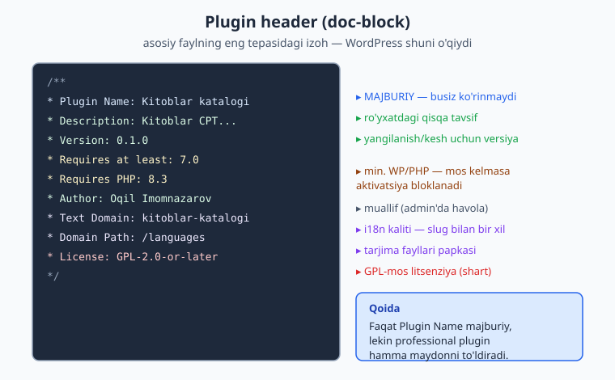
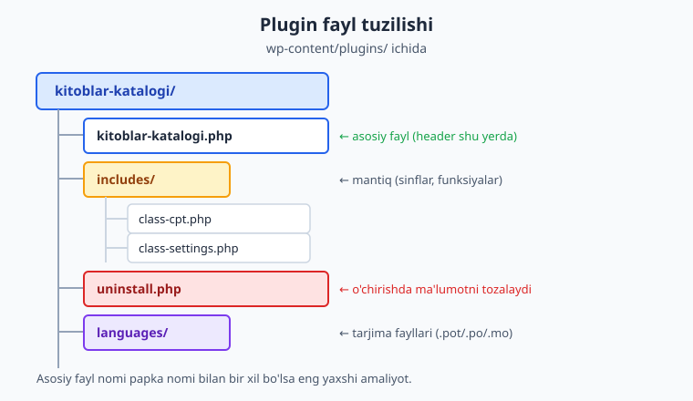
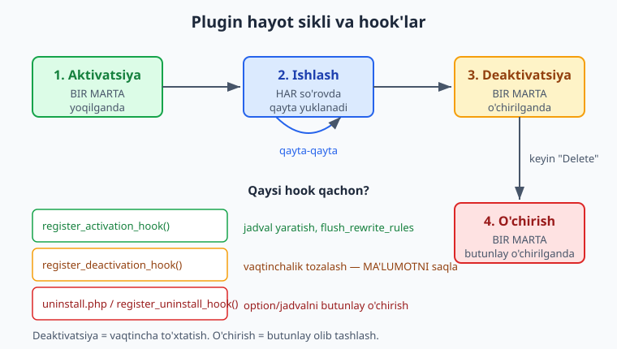

# 03 — Birinchi plugin: tuzilish va hayot sikli

[⬅️ Oldingi: 02 — Lokal muhit va asboblar](./02-lokal-muhit.md) · [🏠 README](./README.md) · [Keyingi: 04 — Hooks: action va filter (chuqur) ➡️](./04-hooks-action-filter.md)

> **Bu bobda:** birinchi haqiqiy plugin'ni noldan quramiz — WordPress plugin'ni "ko'rishi" uchun zarur header (doc-block) maydonlarini, bitta fayl va papka tuzilishi o'rtasidagi farqni, `ABSPATH` himoyasini, plugin yuklanganini ko'rsatuvchi birinchi belgini, hamda eng muhimi — `register_activation_hook` / `register_deactivation_hook` / `uninstall.php` orqali plugin hayot siklining (aktivatsiya → har so'rovda ishlash → deaktivatsiya → o'chirish) qaysi bosqichida nima qilish kerakligini o'rganamiz.

---

## Muammo: WordPress kodingizni qachon "ko'radi"?

Tasavvur qiling: siz `wp-content/plugins/` ichiga ajoyib bir PHP fayl tashladingiz, ichida zo'r funksiyalar bor. Lekin wp-admin'dagi **Plugins** sahifasini ochsangiz — u yerda hech narsa yo'q. Plugin'ingiz "ko'rinmaydi". Nega?

Chunki WordPress fayllarni shunchaki PHP kodi deb bilmaydi. U **maxsus signal** qidiradi — faylning eng tepasidagi izoh blokida `Plugin Name:` qatorini. Bu signal bo'lmasa, fayl WordPress uchun mavjud emas.

Bu bob ana shu signaldan boshlanadi va plugin'ning butun **hayotini** — yoqilganda, ishlab turganda, o'chirilganda va butunlay olib tashlanganda nima sodir bo'lishini — chiziq-chiziq tushuntiradi. Biz kitob bo'ylab quradigan **"Kitoblar katalogi"** plugin'ining poydevorini shu yerda quyamiz.

> ℹ️ Bu bob siz [02-bobda](./02-lokal-muhit.md) o'rgangan lokal WordPress muhitida (`wp-env` yoki Docker) `WP_DEBUG` yoqilgan holda ishlashingizni faraz qiladi. Plugin'ni **aktivatsiya qilish** va admin'da ko'rish bilan bog'liq natijalar — "o'z saytingizda sinab ko'ring" ohangida beriladi.

---

## Plugin header: WordPress o'qiydigan birinchi narsa

Plugin **header** — bu asosiy fayl boshidagi maxsus doc-block (PHP izohi). WordPress yangi plugin'larni qidirayotganda har bir fayl tepasini o'qiydi va shu maydonlarni topadi.



Mana bizning `kitoblar-katalogi.php` faylining boshi:

```php
<?php
/**
 * Plugin Name:       Kitoblar katalogi
 * Plugin URI:        https://ioqil.uz/plugins/kitoblar-katalogi
 * Description:       Kitoblar uchun CPT, janr taksonomiyasi, sozlamalar va REST endpoint qo'shadi.
 * Version:           0.1.0
 * Requires at least: 7.0
 * Requires PHP:      8.3
 * Author:            Oqil Imomnazarov
 * Author URI:        https://ioqil.uz
 * Text Domain:       kitoblar-katalogi
 * Domain Path:       /languages
 * License:           GPL-2.0-or-later
 * License URI:       https://www.gnu.org/licenses/gpl-2.0.html
 *
 * @package Oqil\KitobKatalog
 */
```

Har bir maydon nima uchun kerak:

| Maydon | Vazifasi |
|---|---|
| **Plugin Name** | Plugins ro'yxatida ko'rinadigan nom. **Yagona majburiy maydon** — busiz WordPress plugin'ni umuman ko'rmaydi. |
| **Plugin URI** | Plugin sahifasi (wordpress.org havolasi emas, o'z saytingiz). |
| **Description** | Qisqa tavsif (140 belgigacha), admin'da nom ostida chiqadi. |
| **Version** | Joriy versiya. WordPress yangilanishni va asset keshini shunga qarab boshqaradi. |
| **Requires at least** | Minimal WordPress versiyasi. |
| **Requires PHP** | Minimal PHP versiyasi. Muhit mos kelmasa, WordPress aktivatsiyani **bloklaydi**. |
| **Author / Author URI** | Muallif va uning havolasi. |
| **Text Domain** | i18n (lokalizatsiya) kaliti — odatda plugin **slug**i bilan bir xil. |
| **Domain Path** | Tarjima fayllari papkasi (`/languages`). |
| **License / License URI** | Litsenziya. WordPress ekotizimi GPL-mos litsenziyani talab qiladi. |

> 📌 Faqat **Plugin Name** texnik jihatdan majburiy, lekin **professional plugin barcha maydonlarni** to'ldiradi. `Requires PHP: 8.3` deganingizda PHP 8.2'dagi foydalanuvchi plugin'ni aktivatsiya qila olmaydi — bu sizni va undan ham ko'proq foydalanuvchini "oq ekran" (fatal error) dan saqlaydi.

> 💡 Header maydon nomlari **aniq** yozilishi shart: `Requires at least` (ko'plikda emas), `Text Domain` (ikki so'z). WordPress ularni `Plugin Name:` kabi `Nom: qiymat` shaklida qidiradi. Xato yozsangiz, maydon shunchaki e'tiborga olinmaydi.

⚠️ **Litsenziya bo'sh qoldirilmasin.** wordpress.org katalogiga joylaganda GPL-mos litsenziya (`GPL-2.0-or-later` yoki keyinroq) talab qilinadi. Buni boshdanoq to'g'ri qo'ying.

---

## ABSPATH: faylni to'g'ridan-to'g'ri kirishdan himoyalash

Header'dan keyin darhol mana bu ikki qatorni qo'shamiz:

```php
declare(strict_types=1);

namespace Oqil\KitobKatalog;

// To'g'ridan-to'g'ri kirishni to'sish: fayl WordPress'siz so'ralsa, darhol chiqamiz.
if (!defined('ABSPATH')) {
    exit;
}
```

`ABSPATH` — bu WordPress yuklanganda e'lon qiladigan konstanta (WordPress ildiz papkasining yo'li). Agar kimdir brauzerda to'g'ridan-to'g'ri `.../wp-content/plugins/kitoblar-katalogi/kitoblar-katalogi.php` manzilini ochsa, WordPress yuklanmagan bo'ladi — demak `ABSPATH` aniqlanmagan — demak `exit` ishlaydi va fayl hech narsa qilmasdan to'xtaydi.

⚠️ **Bu kichik tekshiruv — muhim xavfsizlik odati.** U faylingiz mantig'ini, o'zgaruvchilarini va xato xabarlarini begona ko'zlardan yashiradi. WordPress plugin'larida bu deyarli **standart** — har bir to'g'ridan-to'g'ri kirilishi mumkin bo'lgan PHP faylga qo'ying.

> ℹ️ `namespace` haqida to'liqroq [05-bobda](./05-namespace-oop-autoload.md) gaplashamiz. Hozircha shuni bilsangiz kifoya: `namespace Oqil\KitobKatalog;` bizning funksiyalarimizni boshqa plugin'larning funksiyalaridan ajratib turadi — global "ism urushi"ni oldini oladi. Bu PHP'dagi oddiy namespace; WordPress'ga xos sehr emas. PHP namespace yangi bo'lsa, [PHP kitobiga](../php/README.md) qarang.

---

## Fayl tuzilishi: bitta fayl vs papka

Plugin'ni ikki xil joylash mumkin.

**1-variant — bitta fayl.** Eng oddiy plugin — `wp-content/plugins/` ichidagi bitta `.php` fayl:

```text
wp-content/plugins/
└── kitoblar-katalogi.php
```

Bu kichik, bir vazifali plugin uchun yetarli (masalan, bitta filter qo'shadigan plugin).

**2-variant — papka (tavsiya etiladi).** Jiddiy plugin o'z papkasida yashaydi, asosiy fayl odatda papka bilan **bir xil nomda** bo'ladi:

```text
wp-content/plugins/kitoblar-katalogi/
├── kitoblar-katalogi.php   ← asosiy fayl (header shu yerda)
├── includes/               ← mantiq: sinflar, funksiyalar
│   ├── class-cpt.php
│   └── class-settings.php
├── uninstall.php           ← o'chirishda tozalash
└── languages/              ← tarjima fayllari
```



> 📌 **Kitoblar katalogi** uchun biz **papka** variantini tanlaymiz, chunki kitob davomida CPT, sozlamalar, REST va blok qo'shamiz — bularning hammasi bitta faylga sig'maydi. Asosiy fayl `kitoblar-katalogi.php` faqat **header + boshlang'ich ulanish** (bootstrap) ni saqlaydi; haqiqiy mantiq `includes/` ichidagi fayllarga bo'linadi (buni [05-bobda](./05-namespace-oop-autoload.md) autoload bilan yig'amiz).

💡 **Slug izchilligi.** Papka nomi, asosiy fayl nomi va text domain — uchalasi ham `kitoblar-katalogi`. Bu tasodif emas: izchil slug WordPress'da va sizning kodingizda ishni soddalashtiradi. Kitob bo'ylab namespace har doim `Oqil\KitobKatalog`, prefiks `kitoblar_katalogi_` bo'lib qoladi.

---

## Birinchi ish: plugin yuklanganini ko'rsatish

Plugin haqiqatan yuklanayotganini ko'rishning oddiy yo'li — admin panelida xabar (admin notice) chiqarish. Bu `admin_notices` hook'iga ulanadi:

```php
/**
 * Plugin yuklanganini admin'da ko'rsatuvchi vaqtinchalik xabar (faqat namoyish uchun).
 */
function salomlash_xabari(): void {
    // Faqat sozlama huquqiga ega foydalanuvchiga ko'rsatamiz.
    if (!current_user_can('manage_options')) {
        return;
    }
    $matn = esc_html__('Kitoblar katalogi plugin yuklandi.', 'kitoblar-katalogi');
    printf(
        '<div class="notice notice-success is-dismissible"><p>%s</p></div>',
        $matn
    );
}
add_action('admin_notices', __NAMESPACE__ . '\\salomlash_xabari');
```

Bu yerda kichik kod bo'lsa-da, **uchta** muhim odat allaqachon bor:

- ⚠️ `current_user_can('manage_options')` — xabarni **faqat** kerakli huquqli foydalanuvchiga ko'rsatamiz. Hech qachon "hammaga ko'rsatib qo'yaqolaman" demang.
- ⚠️ `esc_html__()` — matnni ham **tarjima qilamiz** (text domain bilan), ham **escape** qilamiz. Output har doim escape qilinadi (12-bobda chuqurroq).
- 📌 `__NAMESPACE__ . '\\salomlash_xabari'` — callback'ni to'liq nom bilan beramiz, chunki funksiya namespace ichida. (`'\\'` — PHP satrida bitta backslash.)

> 💡 Bu xabar — vaqtinchalik **"tirik ekanini tekshirish"** uchun. Haqiqiy plugin'da uni keyin olib tashlaysiz yoki ma'noli xabarga aylantirasiz. Diagnostika uchun `init` hook'ida `error_log('Kitoblar katalogi: init')` ham yozishingiz mumkin — bu `debug.log` ga tushadi (02-bob, `WP_DEBUG_LOG`).

Bu blok **to'g'ri**, lekin natijani (yashil xabar paneli) **o'z saytingizda** ko'rasiz: plugin'ni aktivatsiya qiling, so'ng istalgan admin sahifasini oching.

---

## Hayot sikli: aktivatsiya, ishlash, deaktivatsiya, o'chirish

Endi eng muhim mavzu. Plugin **bir tekisda** ishlamaydi — uning hayotida tubdan farq qiladigan bosqichlar bor, va har birida WordPress boshqa hook'ni ishga tushiradi.



To'rt holatni ajratib oling:

1. **Aktivatsiya** — foydalanuvchi "Activate" bosganda **bir marta**. Bir martalik sozlash uchun: jadval yaratish, dastlabki opsiyalarni qo'yish, `flush_rewrite_rules()`.
2. **Ishlash** — plugin aktiv ekan, u **har bir so'rovda** (har sahifa yuklanganda) qaytadan yuklanadi va PHP qaytadan ishlaydi. Bu yerda holat saqlanmaydi: har so'rov toza varaqdan boshlanadi.
3. **Deaktivatsiya** — "Deactivate" bosilganda **bir marta**. Vaqtinchalik narsalarni tozalaymiz (rejalashtirilgan cron, kesh), lekin **foydalanuvchi ma'lumotini O'CHIRMAYMIZ**.
4. **O'chirish (uninstall)** — plugin **butunlay o'chirilganda** (Deactivate'dan keyin "Delete") **bir marta**. Mana shu yerda barcha izlarni — opsiyalar, jadvallar — tozalaymiz.

> 📌 Eng ko'p qilinadigan xato: **deaktivatsiya** va **o'chirish**ni aralashtirish. Deaktivatsiya = vaqtincha to'xtatish (foydalanuvchi keyin yana yoqishi mumkin — ma'lumoti joyida turishi kerak). O'chirish = butunlay olib tashlash (endi tozalash o'rinli).

### Aktivatsiya hook'i

```php
const VERSION = '0.1.0';

/**
 * Aktivatsiyada bir marta ishlaydi: dastlabki sozlamani qo'yadi va rewrite rules'ni yangilaydi.
 */
function aktivatsiya(): void {
    add_option('kitoblar_katalogi_versiya', VERSION);
    // CPT keyingi boblarda ro'yxatdan o'tadi; permalinklarni yangilab qo'yamiz.
    flush_rewrite_rules();
}
register_activation_hook(__FILE__, __NAMESPACE__ . '\\aktivatsiya');
```

`register_activation_hook(string $file, callable $callback)` ikki argument oladi:

- `__FILE__` — joriy fayl yo'li. WordPress shu yo'ldan plugin'ni aniqlaydi, shuning uchun bu **asosiy plugin faylida** chaqirilishi shart.
- callback — aktivatsiyada bir marta chaqiriladigan funksiya.

`flush_rewrite_rules()` nima uchun? Plugin CPT yoki o'z URL strukturasini qo'shganda WordPress'ning ichki "URL → handler" jadvalini yangilash kerak. Aktivatsiyada **bir marta** yangilash to'g'ri yo'l. Buni **har so'rovda** chaqirish — sekinlikning klassik sababi, shuning uchun u faqat aktivatsiyada turadi.

⚠️ **Aktivatsiya hook'ida og'ir ish qilmang.** Bu o'rin tez bo'lishi kerak; ulkan migratsiyani yoki tashqi API'ni shu yerda ishga tushirish aktivatsiyani osib qo'yishi mumkin. Faqat zarur boshlang'ich sozlash.

### Deaktivatsiya hook'i

```php
/**
 * Deaktivatsiyada ishlaydi: vaqtinchalik narsalarni tozalaydi, MA'LUMOTNI O'CHIRMAYDI.
 */
function deaktivatsiya(): void {
    // Masalan: rejalashtirilgan wp-cron vazifalarini bekor qilish (17-bob).
    flush_rewrite_rules();
}
register_deactivation_hook(__FILE__, __NAMESPACE__ . '\\deaktivatsiya');
```

`register_deactivation_hook(string $file, callable $callback)` — imzosi aktivatsiya bilan **bir xil**. Callback plugin hali **aktiv** holatida ishlaydi, shuning uchun plugin funksiyalariga kirish mumkin. Bu yerda CPT qoidalarini tozalash uchun yana `flush_rewrite_rules()` chaqiramiz.

> 📌 **Oltin qoida:** deaktivatsiyada foydalanuvchi yaratgan **ma'lumotni (postlar, opsiyalardagi sozlamalar) o'chirmang**. Odam plugin'ni vaqtincha o'chirib, keyin yana yoqishi mumkin — sozlamalari joyida turishini kutadi.

### O'chirish (uninstall): ikki yo'l

Plugin butunlay o'chirilganda ma'lumotni tozalashning **ikki** yo'li bor. Ikkalasi ham WordPress hujjatida tasdiqlangan; tavsiya etilgani — **`uninstall.php`**.

**1-yo'l — `uninstall.php` (tavsiya etiladi).** Plugin papkasining ildizida shu nomli fayl bo'lsa, WordPress plugin o'chirilganda uni avtomatik chaqiradi:

```php
<?php
/**
 * Kitoblar katalogi o'chirilganda ishlaydi: plugin ma'lumotlarini butunlay tozalaydi.
 *
 * @package Oqil\KitobKatalog
 */

declare(strict_types=1);

// Xavfsizlik: bu fayl faqat WordPress'ning o'chirish jarayonida ishlashi shart.
if (!defined('WP_UNINSTALL_PLUGIN')) {
    exit;
}

// Options API'da saqlangan barcha sozlamalarni o'chiramiz.
delete_option('kitoblar_katalogi_versiya');
delete_option('kitoblar_katalogi_sozlamalar');

// O'z jadvalingiz bo'lsa, uni DROP qilish ham shu yerda (10-bob).
```

⚠️ `if (!defined('WP_UNINSTALL_PLUGIN')) exit;` — `uninstall.php` da **majburiy**. WordPress o'chirish jarayonida `WP_UNINSTALL_PLUGIN` konstantasini e'lon qiladi; bu tekshiruvsiz fayl to'g'ridan-to'g'ri so'ralsa zararli ish qilishi mumkin.

**2-yo'l — `register_uninstall_hook()`.** Agar siz `uninstall.php` fayli o'rniga asosiy faylda hook'dan foydalanishni xohlasangiz:

```php
/**
 * Plugin o'chirilganda chaqiriladi. NAMED funksiya bo'lishi SHART.
 */
function ochirish(): void {
    delete_option('kitoblar_katalogi_versiya');
    delete_option('kitoblar_katalogi_sozlamalar');
}
register_uninstall_hook(__FILE__, __NAMESPACE__ . '\\ochirish');
```

`register_uninstall_hook(string $file, callable $callback)` — imzosi yana o'sha ikki argument.

⚠️ **Diqqat:** `register_uninstall_hook` callback'i **named funksiya yoki static metod** bo'lishi kerak — **anonim funksiya BO'LMAYDI**. Sababi: WordPress callback'ni bazaga saqlaydi (serializatsiya qiladi), anonim funksiyani esa serializatsiya qilib bo'lmaydi. `uninstall.php` da bu muammo yo'q, shu sababli ham u soddaroq va tavsiya etilgan yo'l.

> ℹ️ **Qaysi birini tanlash?** Ko'pchilik professional plugin **`uninstall.php`** ni tanlaydi — u toza, asosiy faylni shishirmaydi va anonim-callback tuzog'i yo'q. Agar plugin papkasida `uninstall.php` bo'lsa, u `register_uninstall_hook` dan **ustun** turadi (WordPress hook'ni o'tkazib yuboradi). Ikkalasini birga ishlatishning hojati yo'q.

---

## Plugin'ni aktivatsiya qilish

Hammasi joyida bo'lsa, plugin'ni ikki yo'l bilan yoqasiz (har ikkalasini **o'z saytingizda** bajaring):

**wp-admin orqali.** Admin panel → **Plugins** → ro'yxatda "Kitoblar katalogi" → **Activate**. Aktivatsiya hook'i shu daqiqada ishlaydi, so'ng yashil "plugin yuklandi" xabarini ko'rasiz.

**WP-CLI orqali.** Terminal'da (02-bobda o'rnatilgan):

```bash
wp plugin activate kitoblar-katalogi
```

Deaktivatsiya: `wp plugin deactivate kitoblar-katalogi`. Butunlay o'chirish: `wp plugin delete kitoblar-katalogi` (bu `uninstall.php` ni ishga tushiradi).

> ℹ️ Bu buyruqlar va wp-admin natijalari **jonli WordPress'ni** talab qiladi — shuning uchun ularni "o'z saytingizda sinab ko'ring" deb belgilaymiz. Plugin **kodi** to'g'ri (header, hook imzolari WordPress hujjati bilan tasdiqlangan va PHP sintaksisi tekshirilgan), lekin `flush_rewrite_rules`, `add_option`, `current_user_can` kabi funksiyalar faqat ishlab turgan WordPress ichida mavjud.

💡 **WP_DEBUG yoqing.** Aktivatsiya paytida fatal error bo'lsa (masalan, `Requires PHP` mos kelmasa yoki xayoliy funksiya chaqirilsa), `WP_DEBUG` yoqilgan bo'lsa siz aniq xabarni ko'rasiz; aks holda "oq ekran" chiqadi. Plugin yozayotganda har doim yoqib qo'ying.

---

## Hammasi birga: minimal poydevor fayl

Mana `kitoblar-katalogi.php` ning to'liq, ishga tayyor minimal ko'rinishi — bu boblar davomida o'sib boradi:

```php
<?php
/**
 * Plugin Name:       Kitoblar katalogi
 * Plugin URI:        https://ioqil.uz/plugins/kitoblar-katalogi
 * Description:       Kitoblar uchun CPT, janr taksonomiyasi, sozlamalar va REST endpoint qo'shadi.
 * Version:           0.1.0
 * Requires at least: 7.0
 * Requires PHP:      8.3
 * Author:            Oqil Imomnazarov
 * Author URI:        https://ioqil.uz
 * Text Domain:       kitoblar-katalogi
 * Domain Path:       /languages
 * License:           GPL-2.0-or-later
 * License URI:       https://www.gnu.org/licenses/gpl-2.0.html
 *
 * @package Oqil\KitobKatalog
 */

declare(strict_types=1);

namespace Oqil\KitobKatalog;

if (!defined('ABSPATH')) {
    exit;
}

const VERSION = '0.1.0';

function aktivatsiya(): void {
    add_option('kitoblar_katalogi_versiya', VERSION);
    flush_rewrite_rules();
}
register_activation_hook(__FILE__, __NAMESPACE__ . '\\aktivatsiya');

function deaktivatsiya(): void {
    flush_rewrite_rules();
}
register_deactivation_hook(__FILE__, __NAMESPACE__ . '\\deaktivatsiya');

function salomlash_xabari(): void {
    if (!current_user_can('manage_options')) {
        return;
    }
    $matn = esc_html__('Kitoblar katalogi plugin yuklandi.', 'kitoblar-katalogi');
    printf('<div class="notice notice-success is-dismissible"><p>%s</p></div>', $matn);
}
add_action('admin_notices', __NAMESPACE__ . '\\salomlash_xabari');
```

📌 Bu fayl — kitobning **izchil namuna plugin**ining poydevori. [04-bobda](./04-hooks-action-filter.md) hooks'ni chuqur o'rganamiz, [05-bobda](./05-namespace-oop-autoload.md) mantiqni `includes/` ga ko'chirib autoload bilan yig'amiz, keyin CPT, sozlamalar, REST va Gutenberg blok qo'shamiz.

---

## Bu bobda nimani o'rgandik

- WordPress plugin'ni **header** (`Plugin Name` majburiy) orqali taniydi; professional plugin barcha maydonni to'ldiradi (`Requires PHP: 8.3` muhitni himoyalaydi).
- `if (!defined('ABSPATH')) exit;` — har faylda to'g'ridan-to'g'ri kirishdan himoya.
- **Papka** tuzilishi (asosiy fayl + `includes/` + `uninstall.php` + `languages/`) jiddiy plugin uchun standart.
- Hayot sikli to'rt bosqich: aktivatsiya (bir marta), ishlash (har so'rovda), deaktivatsiya (bir marta), o'chirish (bir marta).
- `register_activation_hook` / `register_deactivation_hook` / `uninstall.php` — har biri **boshqa** vazifa uchun. Deaktivatsiyada ma'lumotni o'chirmang; o'chirishda tozalang.

---

## 03-bob mashqlari

> Mashqlarni **o'z lokal WordPress muhitingizda** bajaring (02-bob). Har bir PHP misolni terib, `php -l` bilan sintaksisni tekshirib, so'ng saytingizda aktivatsiya qiling.

**1 (Oson).** `wp-content/plugins/` ichida `kitoblar-katalogi/` papkasini va undagi `kitoblar-katalogi.php` faylini yarating. Faqat `Plugin Name: Kitoblar katalogi` header'ini yozing va plugin Plugins ro'yxatida paydo bo'lishini tekshiring.

**2 (Oson).** Yuqoridagi headerga `Description`, `Version`, `Author` va `Requires PHP: 8.3` maydonlarini qo'shing. Plugins ro'yxatida tavsif va versiya ko'rinishini kuzating.

**3 (Oson).** Faylga `if (!defined('ABSPATH')) exit;` qatorini qo'shing va nima uchun kerakligini bir jumlada izohlang.

**4 (Oson).** `Text Domain` qiymati nima uchun aynan `kitoblar-katalogi` (plugin slug) bo'lishi kerakligini tushuntiring.

**5 (O'rta).** `admin_notices` hook'iga ulanib, "Kitoblar katalogi tayyor" degan **escape qilingan** va **faqat `manage_options` huquqlilarga** ko'rinadigan xabar chiqaring.

<details markdown="1"><summary>Yechim</summary>

```php
function kk_tayyor_xabari(): void {
    if (!current_user_can('manage_options')) {
        return;
    }
    printf(
        '<div class="notice notice-info is-dismissible"><p>%s</p></div>',
        esc_html__('Kitoblar katalogi tayyor', 'kitoblar-katalogi')
    );
}
add_action('admin_notices', 'kk_tayyor_xabari');
```

`current_user_can` xabarni faqat huquqli foydalanuvchiga cheklaydi, `esc_html__` esa matnni ham tarjima qiladi, ham escape qiladi. (Namespace ichida bo'lsa, callback'ni `__NAMESPACE__ . '\\kk_tayyor_xabari'` deb bering.)
</details>

**6 (O'rta).** Aktivatsiya hook'i yozing: u `kitoblar_katalogi_versiya` opsiyasini `'0.1.0'` qiymati bilan qo'shsin va `flush_rewrite_rules()` chaqirsin.

<details markdown="1"><summary>Yechim</summary>

```php
function kk_aktivatsiya(): void {
    add_option('kitoblar_katalogi_versiya', '0.1.0');
    flush_rewrite_rules();
}
register_activation_hook(__FILE__, 'kk_aktivatsiya');
```

`add_option` opsiya mavjud bo'lmasagina qo'shadi. `flush_rewrite_rules()` aktivatsiyada bir marta chaqiriladi — har so'rovda emas (sekinlik sababi).
</details>

**7 (O'rta).** Deaktivatsiya hook'i yozing va u **nima qilmasligi** kerakligini izohda yozing.

<details markdown="1"><summary>Yechim</summary>

```php
function kk_deaktivatsiya(): void {
    // Vaqtinchalik narsalarni tozalaymiz (cron, kesh).
    // DIQQAT: foydalanuvchi ma'lumotini (postlar, sozlamalar) O'CHIRMAYMIZ —
    // odam plugin'ni keyin qayta yoqishi mumkin.
    flush_rewrite_rules();
}
register_deactivation_hook(__FILE__, 'kk_deaktivatsiya');
```

Deaktivatsiya = vaqtincha to'xtatish. Ma'lumotni o'chirish faqat **o'chirish (uninstall)** bosqichida o'rinli.
</details>

**8 (O'rta).** `uninstall.php` faylini yarating: u `WP_UNINSTALL_PLUGIN` ni tekshirsin va `kitoblar_katalogi_versiya` opsiyasini o'chirsin.

<details markdown="1"><summary>Yechim</summary>

```php
<?php
declare(strict_types=1);

if (!defined('WP_UNINSTALL_PLUGIN')) {
    exit;
}

delete_option('kitoblar_katalogi_versiya');
```

`uninstall.php` plugin papkasi ildizida turadi va o'chirishda avtomatik chaqiriladi. `WP_UNINSTALL_PLUGIN` tekshiruvi — majburiy himoya: faylni to'g'ridan-to'g'ri so'rash hech narsa qilmasligini ta'minlaydi.
</details>

**9 (O'rta).** Bitta jadvalda **deaktivatsiya** va **o'chirish (uninstall)** o'rtasidagi farqni yozing: qachon ishlaydi, nima qilish o'rinli, ma'lumotga nima bo'ladi.

**10 (Qiyin).** `register_uninstall_hook` ni named funksiya bilan to'g'ri ulang va nima uchun anonim funksiya bu yerda **ishlamasligini** izohlang. So'ng nega ko'pchilik baribir `uninstall.php` ni afzal ko'rishini ayting.

<details markdown="1"><summary>Yechim</summary>

```php
namespace Oqil\KitobKatalog;

if (!defined('ABSPATH')) {
    exit;
}

function kk_ochirish(): void {
    delete_option('kitoblar_katalogi_versiya');
    delete_option('kitoblar_katalogi_sozlamalar');
}
register_uninstall_hook(__FILE__, __NAMESPACE__ . '\\kk_ochirish');
```

WordPress uninstall callback'ini bazaga **saqlaydi** (serializatsiya qiladi). Anonim funksiyani (closure) serializatsiya qilib bo'lmaydi — shuning uchun callback **named funksiya yoki static metod** bo'lishi shart. `uninstall.php` da esa hech qanday callback saqlanmaydi (fayl o'chirishda to'g'ridan-to'g'ri ishga tushadi), shuning uchun u soddaroq, asosiy faylni shishirmaydi va anonim-callback tuzog'i yo'q — shu sababli tavsiya etiladi. Agar `uninstall.php` mavjud bo'lsa, u `register_uninstall_hook` dan ustun turadi.
</details>

**11 (Qiyin).** Aktivatsiyada **migratsiya kerakmi** degan sof-PHP mantiq yozing: saqlangan versiyani joriy versiya bilan solishtirib, yangilash kerakligini `bool` qaytarsin (`version_compare` bilan). WordPress'siz `php -r` da ham ishlasin.

<details markdown="1"><summary>Yechim</summary>

```php
function kk_migratsiya_kerakmi(?string $saqlangan, string $joriy): bool {
    if ($saqlangan === null) {
        return true; // birinchi aktivatsiya — sozlash kerak
    }
    return version_compare($saqlangan, $joriy, '<');
}
```

Aktivatsiya hook'ida ishlatilishi:

```php
function kk_aktivatsiya(): void {
    $saqlangan = get_option('kitoblar_katalogi_versiya') ?: null;
    if (kk_migratsiya_kerakmi($saqlangan, VERSION)) {
        // ... migratsiya / boshlang'ich sozlash ...
        update_option('kitoblar_katalogi_versiya', VERSION);
    }
    flush_rewrite_rules();
}
```

`kk_migratsiya_kerakmi` toza, WordPress'siz funksiya — `version_compare('0.1.0', '0.2.0', '<')` `true` qaytaradi. Shuning uchun uni `php -r` bilan yoki unit-test bilan alohida sinash mumkin. Bu — mantiqni WordPress'ga bog'liq bo'lmagan, sinaladigan bo'laklarga ajratishning yaxshi namunasi (25-bob, testlash).
</details>

**12 (Qiyin).** Plugin'ni papka tuzilishida tashkil qiling: asosiy `kitoblar-katalogi.php` faqat header + `ABSPATH` + hook'larni saqlasin, `salomlash_xabari` funksiyasi esa `includes/notices.php` da bo'lib, asosiy fayldan `require_once __DIR__ . '/includes/notices.php';` bilan ulansin. Har ikkala faylni `php -l` bilan tekshiring.

<details markdown="1"><summary>Yechim</summary>

`kitoblar-katalogi/kitoblar-katalogi.php`:

```php
<?php
/**
 * Plugin Name: Kitoblar katalogi
 * Version:     0.1.0
 * Requires PHP: 8.3
 * Text Domain: kitoblar-katalogi
 * License:     GPL-2.0-or-later
 *
 * @package Oqil\KitobKatalog
 */
declare(strict_types=1);
namespace Oqil\KitobKatalog;

if (!defined('ABSPATH')) {
    exit;
}

require_once __DIR__ . '/includes/notices.php';

function aktivatsiya(): void {
    flush_rewrite_rules();
}
register_activation_hook(__FILE__, __NAMESPACE__ . '\\aktivatsiya');
```

`kitoblar-katalogi/includes/notices.php`:

```php
<?php
declare(strict_types=1);
namespace Oqil\KitobKatalog;

if (!defined('ABSPATH')) {
    exit;
}

function salomlash_xabari(): void {
    if (!current_user_can('manage_options')) {
        return;
    }
    printf(
        '<div class="notice notice-success is-dismissible"><p>%s</p></div>',
        esc_html__('Kitoblar katalogi plugin yuklandi.', 'kitoblar-katalogi')
    );
}
add_action('admin_notices', __NAMESPACE__ . '\\salomlash_xabari');
```

`__DIR__` joriy fayl papkasini beradi, shuning uchun `require_once` har doim to'g'ri yo'lni topadi. Har ikkala fayl boshida `ABSPATH` himoyasi bor. ([05-bobda](./05-namespace-oop-autoload.md) `require_once` o'rniga avtomatik autoload qo'yamiz.)
</details>

---

[⬅️ Oldingi: 02 — Lokal muhit va asboblar](./02-lokal-muhit.md) · [🏠 README](./README.md) · [Keyingi: 04 — Hooks: action va filter (chuqur) ➡️](./04-hooks-action-filter.md)
