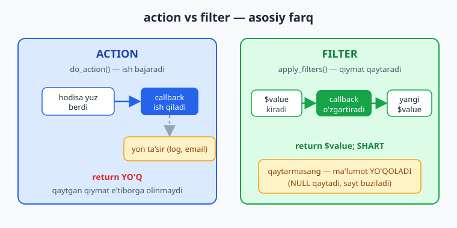
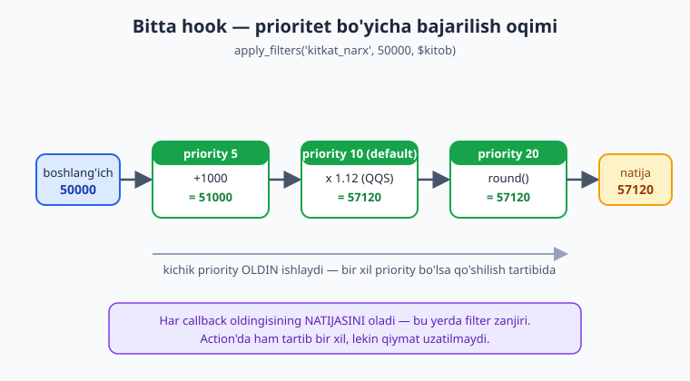
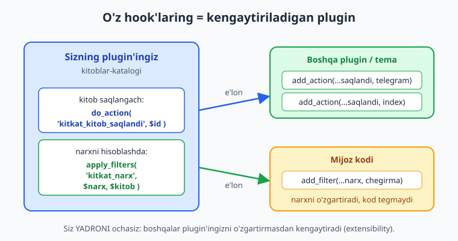

# 04 — Hooks: action va filter (chuqur)

[⬅️ Oldingi: 03 — Birinchi plugin: tuzilish va hayot sikli](./03-birinchi-plugin.md) · [🏠 README](./README.md) · [Keyingi: 05 — Zamonaviy PHP: namespace, autoload, OOP ➡️](./05-namespace-oop-autoload.md)

> **Bu bobda:** WordPress plugin'ning yuragi bo'lgan **hook** tizimini chuqur o'rganamiz — *action* (biror nuqtada ish bajaradi, hech narsa qaytarmaydi) bilan *filter* (qiymatni oladi, o'zgartiradi va albatta qaytaradi) o'rtasidagi tub farqni, `add_action`/`add_filter` ning prioritet va argument-soni parametrlarini, `do_action`/`apply_filters` qachon "fire" bo'lishini, callback'ni to'g'ri olib tashlash (`remove_action`), holatni tekshirish (`has_action`, `did_action`, `current_action`, `doing_action`), to'rt xil callback turini, hook'ni qanday topishni, va eng muhimi — o'z plugin'ingizni boshqalar uchun kengaytiriladigan qiladigan **o'z hook'laringizni** (`do_action('kitkat_kitob_saqlandi')`, `apply_filters('kitkat_narx')`) yaratishni ko'rib chiqamiz.

---

## Muammo: yadroga tegmasdan, qanday qilib aralashamiz?

01-bobda "yadroni o'zgartirma — hook ishlat" falsafasini ko'rdik. Endi savol: **WordPress sizning kodingizni qachon va qayerda chaqirishni qanday biladi?**

Tasavvur qiling: WordPress maqolani ekranga chiqaryapti. Siz har bir maqola oxiriga "Muallif: Oqil" degan qator qo'shmoqchisiz. Yadro faylini ochib `the_content` chiqishini tahrirlash — falokat (keyingi yangilanishda yo'qoladi, boshqa saytlarda ishlamaydi). Buning o'rniga WordPress aytadi: *"Men kontentni ekranga chiqarishdan oldin uni senga ko'rsataman — xohlasang o'zgartir, keyin menga qaytar."* Bu — **filter**.

Yoki: foydalanuvchi yangi maqola saqladi. Siz shu paytda Telegram'ga xabar yubormoqchisiz. WordPress aytadi: *"Men maqolani saqlab bo'ldim — mana, sen ham nimadir qilmoqchimisan?"* Bu — **action**.

Mana shu ikki turdagi "ilgak" — **hook** — butun WordPress kengaytirish modelining asosi. Plugin yozish, aslida, **to'g'ri hook'larga to'g'ri kod ulashdir**.

ℹ️ **Hook** so'zma-so'z "ilgak". WordPress ish jarayonining ma'lum nuqtalarida "ilgaklar" qoldiradi; siz o'z funksiyangizni shu ilgakka osasiz (`add_action`/`add_filter`), va o'sha nuqtaga yetganda WordPress sizning funksiyangizni chaqiradi.

---

## Ikki tur: action va filter

Butun farq bitta jumlada: **action ish bajaradi, filter qiymat qaytaradi.**



| | **action** | **filter** |
|---|---|---|
| Maqsad | biror nuqtada **ish bajarish** (yon ta'sir) | qiymatni **o'zgartirib qaytarish** |
| Ulash | `add_action()` | `add_filter()` |
| "Fire" | `do_action()` | `apply_filters()` |
| Callback qaytaradi | hech narsa (qaytsa ham e'tiborsiz) | **o'zgartirilgan qiymat (SHART)** |
| Misol hook | `init`, `save_post`, `wp_enqueue_scripts` | `the_content`, `the_title`, `body_class` |

📌 **Eng muhim qoida.** Filter callback'i **doimo qiymat qaytarishi shart** — hatto o'zgartirmagan bo'lsa ham asl qiymatni qaytaring. Qaytarmasangiz, funksiya `null` qaytaradi va o'sha qiymat (maqola matni, sarlavha, narx...) **yo'qoladi** — sayt buziladi.

### Action: ish bajaradi, qaytarmaydi

```php
<?php
// "init" hook'i — WordPress to'liq yuklanib, so'rovni qabul qilishga tayyor bo'lganda fire bo'ladi.
add_action( 'init', 'kitkat_init_setup' );

function kitkat_init_setup(): void {
	register_post_type( 'kitob', array(
		'public'       => true,
		'show_in_rest' => true,
		'label'        => 'Kitoblar',
	) );
}
```

Bu yerda `kitkat_init_setup()` **hech narsa qaytarmaydi** (`: void`). U faqat ish bajaradi — CPT ro'yxatdan o'tkazadi. WordPress qaytgan qiymatga qaramaydi.

### Filter: oladi, o'zgartiradi, qaytaradi

```php
<?php
// "the_content" filter'i — maqola matni ekranga chiqishidan oldin fire bo'ladi.
add_filter( 'the_content', 'kitkat_kitob_izoh' );

function kitkat_kitob_izoh( string $content ): string {
	if ( get_post_type() !== 'kitob' ) {
		return $content; // O'zgartirmasak ham — qaytarish SHART!
	}
	$izoh = '<p class="kitkat-izoh">'
		. esc_html__( 'Bu kitob "Kitoblar katalogi" plugin orqali korsatilmoqda.', 'kitoblar-katalogi' )
		. '</p>';
	return $content . $izoh; // o'zgartirilgan qiymatni qaytaramiz
}
```

⚠️ `the_content` ga ulanganda **HTML chiqaryapsiz** — uni `esc_html__()` (matn qismi) bilan tozaladik. Foydalanuvchi kiritgan ma'lumotni filter ichida chiqarganda doimo kontekstga mos escape qiling (12-bob). Va `the_content` ichida `the_content` chaqirmang — cheksiz rekursiya bo'ladi.

💡 Ko'pchilik adashadi: "filter — ko'rsatmaydigan, action — ko'rsatadigan" deb o'ylashadi. Aslida farq **qiymat qaytarish/qaytarmaslikda**. `the_content` filter ham natijani ekranga chiqaradi (uni WordPress chiqaradi), lekin siz unga **qiymat qaytarib** ta'sir qilasiz.

---

## `add_action` va `add_filter` imzosi: 4 parametr

Ikkalasining imzosi **bir xil**:

```text
add_action( string $hook_name, callable $callback, int $priority = 10, int $accepted_args = 1 ): true
add_filter( string $hook_name, callable $callback, int $priority = 10, int $accepted_args = 1 ): true
```

1. **`$hook_name`** — hook nomi (`'init'`, `'the_content'`, `'save_post'`...).
2. **`$callback`** — chaqiriladigan funksiya (callable).
3. **`$priority`** — bajarilish tartibi. **Kichik raqam oldin** ishlaydi. Default `10`.
4. **`$accepted_args`** — callback nechta argument **qabul qiladi**. Default `1`.

### Prioritet: kim oldin ishlaydi?

Bitta hook'ga bir nechta callback ulansa, ular **prioritet bo'yicha** (kichikdan kattaga) ishlaydi. Bir xil prioritet bo'lsa — **qo'shilgan tartibida**.



```php
<?php
add_filter( 'kitkat_narx', 'kitkat_qqs',      10 ); // ikkinchi
add_filter( 'kitkat_narx', 'kitkat_baza',      5 ); // BIRINCHI (5 < 10)
add_filter( 'kitkat_narx', 'kitkat_yaxlitla', 20 ); // uchinchi
```

📌 Filter'da prioritet **juda muhim**, chunki har callback **oldingisining natijasini** oladi. QQS dan oldin chegirma qo'llanadimi yoki keyinmi — pul masalasi. Tartibni ataylab boshqaring.

### `accepted_args`: nechta argument olaman?

Default `1` — callback faqat **birinchi** argumentni oladi. Ko'proq kerak bo'lsa, oshiring:

```php
<?php
// save_post 3 argument uzatadi: $post_id, $post, $update.
// Ularning hammasini olish uchun accepted_args = 3.
add_action( 'save_post_kitob', 'kitkat_kitob_saqlangach', 20, 3 );

function kitkat_kitob_saqlangach( int $post_id, WP_Post $post, bool $update ): void {
	if ( $update ) {
		return; // faqat YANGI kitobda ishlaymiz
	}
	error_log( "Yangi kitob qoshildi: {$post_id}" );
}
```

⚠️ Agar `accepted_args` ni 1 qoldirib, callback'da 3 ta parametr e'lon qilsangiz — `$post` va `$update` ga `null` keladi (yoki PHP 8 da xato), chunki WordPress ularni uzatmaydi. **`accepted_args` callback parametrlari soniga mos kelsin.**

💡 Birorta ham argument kerak bo'lmasa, callback'ni argumentsiz e'lon qiling — `accepted_args` ni teginish shart emas. Kerakli sondan **kamroq** olsangiz ham bo'ladi (qolganini WordPress shunchaki uzatmaydi).

---

## `do_action` va `apply_filters`: hook qachon "fire" bo'ladi?

`add_action`/`add_filter` — bu **ulanish** (registratsiya). Hech narsa darhol ishlamaydi. Callback faqat hook **fire bo'lganda** ishga tushadi:

```text
do_action( string $hook_name, mixed ...$arg ): void           // action'ni fire qiladi
apply_filters( string $hook_name, mixed $value, mixed ...$args ): mixed  // filter'ni fire qiladi
```

- `do_action('save_post', $id, $post, $update)` — WordPress yadrosi maqolani saqlagach **shuni chaqiradi**. Shunda barcha ulangan callback'lar ishlaydi. Hech narsa qaytmaydi.
- `apply_filters('the_content', $content)` — yadro shuni chaqiradi, barcha callback'lar `$content` ni navbatma-navbat o'zgartiradi, va **oxirgi natija** qaytadi.

📌 **Tartib muhim:** `add_action` ni hook **fire bo'lishidan oldin** chaqirish kerak. Shuning uchun ulashlarni odatda plugin yuklanganda yoki `plugins_loaded`/`init` da bajaramiz — `save_post` fire bo'lgandan keyin unga ulanish kech.

### Mashhur hook'lar (yodlab oling)

| Hook | Tur | Qachon |
|---|---|---|
| `plugins_loaded` | action | barcha plugin'lar yuklangach (eng erta ishonchli nuqta) |
| `init` | action | WP yuklanib, so'rovga tayyor (CPT/taxonomy/shortcode shu yerda) |
| `wp_loaded` | action | `init` dan keyin, hammasi tayyor |
| `admin_init` | action | har admin so'rovida (faqat wp-admin) |
| `wp_enqueue_scripts` | action | frontend skript/stillarni ulash joyi (14-bob) |
| `the_content` | filter | maqola matni chiqishidan oldin |
| `the_title` | filter | sarlavha chiqishidan oldin |
| `body_class` | filter | `<body>` klasslari massiviga |

⚠️ `init` ni "hammasi shu yerda" deb suiiste'mol qilmang. Masalan, `register_activation_hook` aktivatsiya paytida ishlaydi (03-bob), enqueue esa `wp_enqueue_scripts` da bo'lishi kerak. To'g'ri hook'ni tanlash — kasbiy mahorat.

---

## Filter mexanikasi sof PHP'da (WordPress'siz)

"Filter qiymat qaytaradi" tushunchasini his qilish uchun, WordPress'siz, **sof PHP** bilan kichik modelini yaratamiz. Bu `add_filter`/`apply_filters` ichida nima bo'layotganini ochib beradi:

```php
<?php
$filtrlar = array();

function mock_add_filter( string $nom, callable $cb, int $priority = 10 ): void {
	$GLOBALS['filtrlar'][ $nom ][ $priority ][] = $cb;
}

function mock_apply_filters( string $nom, mixed $value, mixed ...$args ): mixed {
	if ( empty( $GLOBALS['filtrlar'][ $nom ] ) ) {
		return $value; // hech kim ulanmagan — qiymat o'zgarishsiz qaytadi
	}
	ksort( $GLOBALS['filtrlar'][ $nom ] ); // priority: kichik oldin
	foreach ( $GLOBALS['filtrlar'][ $nom ] as $guruh ) {
		foreach ( $guruh as $cb ) {
			$value = $cb( $value, ...$args ); // har callback YANGI qiymat qaytaradi
		}
	}
	return $value; // zanjir natijasi
}

mock_add_filter( 'narx', fn ( float $n ): float => $n * 1.12, 10 ); // QQS
mock_add_filter( 'narx', fn ( float $n ): float => $n - 5000, 20 ); // chegirma
mock_add_filter( 'narx', fn ( float $n ): float => round( $n ), 30 ); // yaxlitlash

echo mock_apply_filters( 'narx', 50000.0 ); // 51000
```

Bu kod **haqiqatan ishlaydi** (men `php` bilan ishga tushirib tekshirdim): `50000 × 1.12 = 56000`, `− 5000 = 51000`, `round = 51000`. Mana shu — filter zanjiri. Har callback `$value` ni oladi va qaytaradi; oxirgi natija foydalanuvchiga boradi.

💡 Diqqat qiling: agar bironta `fn` o'rniga `return` qo'ymaganini tasavvur qilsangiz — `$value` `null` bo'lib qoladi va keyingi callback'larga `null` o'tadi. WordPress'da bu "sahifam bo'sh chiqdi" muammosining tez-tez uchraydigan sababi.

Action esa qiymat uzatmaydi — faqat chaqiradi:

```php
<?php
function mock_do_action( callable ...$cbs ): void {
	foreach ( $cbs as $cb ) {
		$cb(); // qaytgan qiymat E'TIBORGA OLINMAYDI
	}
}
```

---

## Callback turlari: funksiyadan first-class callable'gacha

`$callback` har qanday PHP **callable** bo'lishi mumkin:


```php
<?php
// 1) Funksiya nomi (string) — eng oddiy.
add_action( 'init', 'kitkat_oddiy_funksiya' );

// 2) Closure (anonim funksiya) — qisqa mantiq uchun qulay.
add_filter( 'kitkat_narx', function ( float $narx ): float {
	return $narx + 1000.0;
}, 5 );

class Kitkat_Narx_Hisoblagich {
	public function qollash( float $narx ): float {
		return $narx * 1.12; // QQS
	}

	public function ulan(): void {
		// 3) [$obj, 'method'] — obyekt metodi.
		add_filter( 'kitkat_narx', array( $this, 'qollash' ), 20 );

		// 4) First-class callable (PHP 8.1+) — eng o'qiluvchan.
		add_filter( 'kitkat_narx', $this->qollash( ... ), 25 );
	}

	// Statik metod: [Sinf::class, 'metod'] yoki 'Sinf::metod'.
	public static function yaxlitla( float $narx ): float {
		return ceil( $narx );
	}
}

add_filter( 'kitkat_narx', array( Kitkat_Narx_Hisoblagich::class, 'yaxlitla' ), 99 );
```

⚠️ **Closure va `remove_action` muammosi.** Closure (anonim funksiya) ulasangiz, keyin uni `remove_action`/`remove_filter` bilan **olib tashlay olmaysiz** — chunki olib tashlash uchun aynan **o'sha** callback havolasi kerak, closure esa har safar yangi obyekt. Agar callback'ni keyin o'chirish ehtimoli bo'lsa, **nomli funksiya** yoki obyekt metodidan foydalaning.

💡 OOP plugin'da odatda metodlarni `[$this, 'method']` yoki `$this->method(...)` bilan ulaysiz. 05-bobda buni toza singleton/registrator naqshi bilan tashkil qilamiz.

---

## To'g'ri olib tashlash: `remove_action` / `remove_filter`

Boshqa plugin yoki yadro ulagan callback'ni o'chirib tashlash mumkin:

```text
remove_action( string $hook_name, callable|string|array $callback, int $priority = 10 ): bool
remove_filter( string $hook_name, callable|string|array $callback, int $priority = 10 ): bool
```

📌 **Oltin qoida:** olib tashlash uchun `$callback` VA `$priority` **aynan ulangandagidek** bo'lishi shart. Priority noto'g'ri bo'lsa — jim-jit muvaffaqiyatsiz bo'ladi (xato bermaydi, lekin o'chmaydi).

```php
<?php
// Yadro emojini o'chirish (klassik misol). Yadro buni priority 7 bilan ulagan:
remove_action( 'wp_head', 'print_emoji_detection_script', 7 );
remove_action( 'wp_print_styles', 'print_emoji_styles' );

// O'z callback'imizni: bir xil callback + bir xil priority.
add_action( 'init', 'kitkat_init_setup', 10 );
remove_action( 'init', 'kitkat_init_setup', 10 ); // OK — to'liq mos
```

⚠️ Obyekt metodini olib tashlash qiyin: `remove_action('init', [$obj, 'method'], 10)` da **aynan o'sha `$obj`** havolasi kerak. Singleton bo'lmasa, obyektga yetib bo'lmaydi — bu OOP plugin'ni o'chirib bo'lmaydigan qiladigan tez-tez uchraydigan muammo. (05-bobda singleton bilan hal qilamiz.)

💡 Olib tashlashni `init` yoki kechroq hook ichida bajaring — chunki o'sha paytda ulanish allaqachon mavjud bo'lishi kerak.

---

## Holatni tekshirish: did / current / doing / has

WordPress hook holati haqida bir necha foydali funksiya beradi:

```text
did_action( string $hook_name ): int                  // necha marta fire bo'lgan
current_action(): string|false                        // hozir bajarilayotgan action nomi
doing_action( string|null $hook_name = null ): bool    // shu action hozir stack'dami?
has_action( string $hook_name, callable|string|array|false $callback = false ): bool|int
```

```php
<?php
function kitkat_holat_tekshir(): void {
	// init hali ishlamaganmi? Unda CPT ro'yxatdan o'tmagan — to'xtaymiz.
	if ( did_action( 'init' ) === 0 ) {
		return;
	}

	if ( doing_action( 'save_post' ) ) {
		error_log( 'Hozir saqlash jarayonida: ' . current_action() );
	}

	// Bizning hook'imizga kimdir ulanganmi?
	if ( has_action( 'kitkat_kitob_saqlandi' ) ) {
		error_log( 'kitkat_kitob_saqlandi hook ga kimdir ulangan.' );
	}
}
```

💡 `did_action()` "bir marta bajariladigan" mantiq uchun foydali: `if ( did_action('my_hook') ) return;`. `has_action()` esa callback berilsa **prioritetni** (int) qaytaradi — `0` ham bo'lishi mumkin, shuning uchun `=== false` bilan tekshiring, `!` bilan emas.

📌 `doing_action`/`current_action` bilan bir xil callback'ni turli hook'larda qayta ishlatib, qaysi kontekstda ekanini bilib olishingiz mumkin.

---

## O'Z HOOK'LARING: plugin'ni kengaytiriladigan qilish

Mana bu — havaskorni muhandisdan ajratadigan narsa. Siz **iste'molchi** emas, **ishlab chiqaruvchi** hook bo'lishingiz mumkin: o'z plugin'ingiz ichida `do_action`/`apply_filters` chaqirib, boshqalarga (yoki kelajakdagi o'zingizga) **kodingizga tegmasdan** kengaytirish imkonini berasiz.



```php
<?php
function kitkat_kitob_saqla( array $maydonlar ): int {
	$post_id = wp_insert_post( array(
		'post_type'   => 'kitob',
		'post_title'  => sanitize_text_field( $maydonlar['nom'] ),
		'post_status' => 'publish',
	) );

	// O'Z ACTION hook'imiz: "kitob saqlandi" — boshqa kod shu nuqtaga ulanadi.
	do_action( 'kitkat_kitob_saqlandi', $post_id, $maydonlar );

	return $post_id;
}

function kitkat_kitob_narxi( float $asosiy_narx, array $kitob ): float {
	// O'Z FILTER hook'imiz: boshqa kod narxni o'zgartirishi mumkin.
	return (float) apply_filters( 'kitkat_narx', $asosiy_narx, $kitob );
}
```

Endi **boshqa biror plugin** (yoki tema `functions.php`) sizning kodingizga tegmasdan kengaytiradi:

```php
<?php
// Boshqa plugin: yangi kitob saqlanganda Telegram'ga yuborish.
add_action( 'kitkat_kitob_saqlandi', function ( int $post_id ): void {
	// ... wp_remote_post(...) bilan Telegram'ga ... (18-bob)
}, 10, 1 );

// Mijoz kodi: bayram chegirmasi.
add_filter( 'kitkat_narx', function ( float $narx ): float {
	return $narx * 0.9; // 10% chegirma
}, 20 );
```

📌 **Nomlash qoidasi.** O'z hook'laringizni **prefiks** bilan nomlang (`kitkat_` yoki plugin slug) — yadro yoki boshqa plugin hook'lari bilan to'qnashmasin. Bu kitobda izchil `kitkat_` prefiksini ishlatamiz.

💡 **Qachon hook chiqaraman?** Plugin'ingizda muhim "voqea" yuz berganda (saqlandi, o'chirildi, yuborildi) — action. Foydalanuvchiga ko'rsatiladigan yoki hisoblanadigan **qiymat** bo'lsa (narx, matn, sozlama) — filter. Yaxshi plugin "kengaytirish nuqtalari" bilan to'la.

ℹ️ **Hujjatlash.** O'z hook'laringizni `@param`/`@since` PHPDoc bilan `do_action`/`apply_filters` ustida izohlang — boshqalar (va kelajakdagi siz) qanday ulanishni bilsin. Bu professional plugin belgisi.

---

## Hook'ni qanday topish kerak?

Kerakli hook'ni topishning ishonchli yo'llari:

1. **Code Reference** — [developer.wordpress.org/reference](https://developer.wordpress.org/reference/) (hooks ro'yxati, har biri qachon fire bo'lishi va argumentlari bilan).
2. **Plugin Handbook** — [Hooks](https://developer.wordpress.org/plugins/hooks/) bo'limi.
3. **Manba kodini qidirish.** Yadro yoki plugin papkasida `do_action(` / `apply_filters(` ni qidiring — qaysi nuqtalarda hook borligini aniq ko'rasiz.
4. **Query Monitor** plugin'i — sahifada qaysi hook'lar ishga tushganini jonli ko'rsatadi (26-bob).

💡 Yangi mavzuga kirsangiz, avval "bu yerda qanaqa hook bor?" deb qidiring. Deyarli har doim WordPress sizga kerakli nuqtada ilgak qoldirgan bo'ladi.

⚠️ **Ixtiro qilmang.** "Shunday hook bo'lsa kerak" deb taxmin qilib yozmang — Code Reference'da tasdiqlang. Yo'q hook'ga ulansangiz, kod jim turadi (xato bermaydi, lekin hech qachon ishlamaydi) — bu eng chalg'ituvchi xatolardan biri.

---

## 04-bob mashqlari

> Eslatma: bu mashqlardagi plugin kodlarini **o'z WordPress saytingizda** sinab ko'ring (02-bobdagi `wp-env`/Docker bilan). Bu yerda kod to'g'ri yozilgan, lekin natijani faqat ishlayotgan WP ko'rsatadi.

### Oson

1. **(Oson)** `init` hook'iga ulangan, `error_log('init ishladi')` yozadigan funksiya yozing. Bu action'mi yoki filter'mi — javobingizni izohda yozing.
2. **(Oson)** `the_title` filter'iga ulanib, har sarlavha oldiga `📖 ` emoji qo'shing. **Qiymatni qaytarishni unutmang.**
3. **(Oson)** `add_action('init', 'foo', 5)` va `add_action('init', 'bar', 20)` — qaysi biri oldin ishlaydi? Nega?
4. **(Oson)** `did_action('init')` nima qaytaradi va u nima uchun foydali — bir jumlada tushuntiring.

### O'rta

5. **(O'rta)** `save_post_kitob` hook'iga `accepted_args = 3` bilan ulanib, faqat **yangi** (update emas) kitobda `error_log` yozing.
6. **(O'rta)** `body_class` filter'iga ulanib, faqat `kitob` post turida `<body>` ga `kitkat-kitob` klassini qo'shing.
7. **(O'rta)** Yadroning emoji skriptini o'chiring (`remove_action`). To'g'ri priority'ni qanday topdingiz?
8. **(O'rta)** Bir hook'ga closure ulang, keyin uni `remove_filter` bilan o'chirishga harakat qiling — nega ishlamaydi? Yechimini yozing.
9. **(O'rta)** O'z action hook'ingizni (`kitkat_kitob_ochildi`) yarating va unga ikkita callback (priority 10 va 5) ulang. Qaysi biri oldin ishlaydi?

### Qiyin

10. **(Qiyin)** `kitkat_narx` filter zanjirini yozing: baza narx → QQS (×1.12) → chegirma (aksiyada bo'lsa −20%) → yaxlitlash. Prioritetlarni shunday joylashtiringki, chegirma QQS'dan **keyin** qo'llansin.

<details markdown="1"><summary>Yechim</summary>

```php
<?php
// Baza narxni qaytaruvchi funksiya — o'z filter hook'ini chiqaradi.
function kitkat_kitob_narxi( float $asosiy_narx, array $kitob ): float {
	return (float) apply_filters( 'kitkat_narx', $asosiy_narx, $kitob );
}

// priority 10: QQS
add_filter( 'kitkat_narx', function ( float $narx ): float {
	return $narx * 1.12;
}, 10 );

// priority 20: chegirma (QQS'dan KEYIN — 20 > 10)
add_filter( 'kitkat_narx', function ( float $narx, array $kitob ): float {
	if ( ! empty( $kitob['aksiyada'] ) ) {
		return $narx * 0.8; // 20% chegirma
	}
	return $narx; // o'zgartirmasak ham QAYTARAMIZ
}, 20, 2 ); // accepted_args = 2, chunki $kitob ham kerak

// priority 30: yaxlitlash (oxirgi)
add_filter( 'kitkat_narx', function ( float $narx ): float {
	return round( $narx );
}, 30 );

// Foydalanish:
$narx = kitkat_kitob_narxi( 50000.0, array( 'aksiyada' => true ) );
// 50000 * 1.12 = 56000; * 0.8 = 44800; round = 44800
```

Asosiy nuqtalar: chegirma callback'i `$kitob` ga muhtoj, shuning uchun `accepted_args = 2`. Priority tartibi narx mantig'ini belgilaydi — QQS (10) oldin, chegirma (20) keyin, yaxlitlash (30) oxirida. Har callback **qiymat qaytaradi**.
</details>

11. **(Qiyin)** Plugin'ingizga `do_action('kitkat_kitob_saqlandi', $post_id, $maydonlar)` hook'ini qo'shing, keyin "boshqa plugin" sifatida shu hook'ga ulanib, kitob nomini log'ga yozadigan kod yozing. `accepted_args` to'g'ri bo'lsin.

<details markdown="1"><summary>Yechim</summary>

```php
<?php
// ===== PLUGIN ICHIDA: hook'ni chiqaramiz =====
function kitkat_kitob_saqla( array $maydonlar ): int {
	$post_id = wp_insert_post( array(
		'post_type'   => 'kitob',
		'post_title'  => sanitize_text_field( $maydonlar['nom'] ),
		'post_status' => 'publish',
	) );

	// Kengaytirish nuqtasi: ikki argument uzatamiz.
	do_action( 'kitkat_kitob_saqlandi', $post_id, $maydonlar );

	return $post_id;
}

// ===== BOSHQA PLUGIN / tema: hook'ga ulanamiz =====
// 2 argument kerak (post_id va maydonlar), shuning uchun accepted_args = 2.
add_action( 'kitkat_kitob_saqlandi', function ( int $post_id, array $maydonlar ): void {
	$nom = sanitize_text_field( $maydonlar['nom'] ?? '' );
	error_log( "Yangi kitob saqlandi (#{$post_id}): {$nom}" );
}, 10, 2 );
```

Diqqat: hook chiqaruvchi `do_action` da 2 argument uzatadi; ulanuvchi `accepted_args = 2` bilan ikkalasini ham oladi. Agar `2` ni qoldirib `1` desangiz, `$maydonlar` ga `null` kelar va `?? ''` uni qutqarardi — lekin to'g'risi `accepted_args` ni mos qilish.
</details>

12. **(Qiyin)** OOP plugin'da metodni hook'ga ulang (`[$this, 'method']`), keyin uni **to'g'ri** olib tashlay oladigan tarzda tashkil qiling (maslahat: singleton/instansiyaga yetish). Nega bu muhim?

<details markdown="1"><summary>Yechim</summary>

```php
<?php
final class Kitkat_Plugin {
	private static ?Kitkat_Plugin $instance = null;

	public static function instance(): self {
		if ( null === self::$instance ) {
			self::$instance = new self();
		}
		return self::$instance;
	}

	public function ulan(): void {
		add_filter( 'the_content', array( $this, 'kontent_filtri' ), 10 );
	}

	public function kontent_filtri( string $content ): string {
		return $content; // ... mantiq ...
	}
}

// Ulash:
Kitkat_Plugin::instance()->ulan();

// To'g'ri OLIB TASHLASH — aynan o'sha instansiya kerak:
remove_filter(
	'the_content',
	array( Kitkat_Plugin::instance(), 'kontent_filtri' ),
	10 // priority ham mos bo'lishi SHART
);
```

Nega muhim: `remove_filter` callback'ni **shaxsiyat (identity)** bo'yicha solishtiradi. Agar `new Kitkat_Plugin()` bilan har safar yangi obyekt yaratsangiz, `remove_filter` ulangan obyektni topa olmaydi. **Singleton** bir xil instansiyani qaytaradi, shuning uchun `instance()` orqali ulagan va o'chirgan obyekt — aynan bitta. Priority ham (`10`) mos kelishi shart. 05-bobda bu naqshni to'liq ishlab chiqamiz.
</details>

---

[⬅️ Oldingi: 03 — Birinchi plugin: tuzilish va hayot sikli](./03-birinchi-plugin.md) · [🏠 README](./README.md) · [Keyingi: 05 — Zamonaviy PHP: namespace, autoload, OOP ➡️](./05-namespace-oop-autoload.md)
