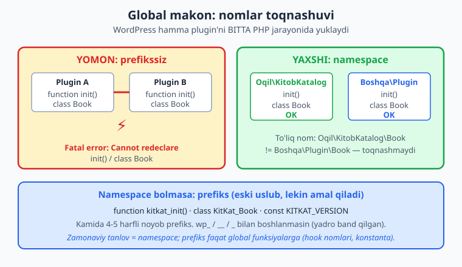
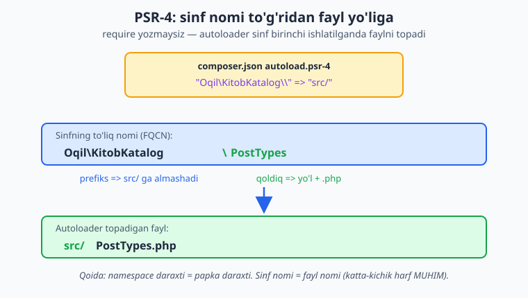
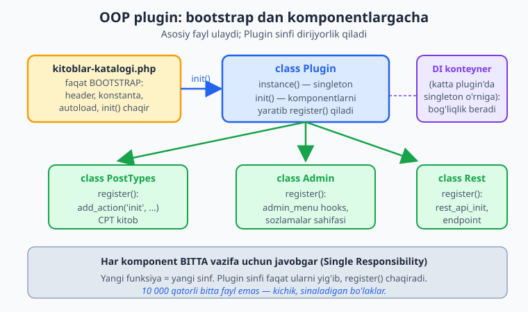

# 05 — Zamonaviy PHP: namespace, autoload, OOP

[⬅️ Oldingi: 04 — Hooks: action va filter (chuqur)](./04-hooks-action-filter.md) · [🏠 README](./README.md) · [Keyingi: 06 — Settings API va admin sahifalar ➡️](./06-settings-api-admin.md)

> **Bu bobda:** WordPress barcha plugin'larni bitta global PHP makonida yuklaganini, shu sababli prefikssiz funksiya/sinf nomlari boshqa plugin bilan toqnashib "Fatal error" berishini ko'ramiz; yechim sifatida `namespace` va prefiksni, har faylni qo'lda `require` qilish o'rniga avtomatik yuklash (Composer PSR-4 hamda o'z `spl_autoload_register`) ni, OOP plugin tuzilmasini (asosiy `Plugin` sinfi, singleton va DI konteyner taqqosi, `PostTypes`/`Admin`/`Rest` komponentlarga bo'lish), `KITKAT_VERSION`/`KITKAT_PATH`/`KITKAT_URL` konstantalarini va `src/` papkali toza fayl tashkilini — barchasini izchil "Kitoblar katalogi" plugin'i ustida quramiz.

---

## Muammo: hammasi bitta xonada yashaydi

Tasavvur qiling: yuzlab odam bitta katta zalda ishlaydi va hech kimning stoli, eshigi yo'q. Kimdir "Ali!" deb baqirsa, uchta Ali boshini ko'taradi. Aynan shu narsa WordPress'da sodir bo'ladi.

WordPress har bir so'rovda **barcha faol plugin'larni bitta PHP jarayoniga** yuklaydi. Sizning plugin'ingiz, mening plugin'im va wordpress.org'dagi yana 30 ta plugin — hammasi **bitta global makonda** yashaydi. Agar siz `function init()` deb funksiya e'lon qilsangiz va boshqa plugin ham xuddi shunday qilsa, PHP ikkalasini ham e'lon qila olmaydi:

```text
PHP Fatal error: Cannot redeclare init() (previously declared in ...)
```

Bu — boshlovchi plugin mualliflari uchun eng keng tarqalgan baxtsizlik. Siz hamma narsani to'g'ri yozasiz, lekin foydalanuvchining saytida sizning plugin'ingiz **boshqa birovning kodi tufayli** ishdan chiqadi. Va aksincha — sizning umumiy nomdagi funksiyangiz boshqa plugin'ni buzadi.



📌 **Asosiy qoida.** Plugin'ingiz **global makonga chiqaradigan har bir nom** — funksiya, sinf, konstanta, hatto global o'zgaruvchi — **noyob bo'lishi shart**. Buni ta'minlashning ikki yo'li bor: zamonaviy `namespace` (afzal) yoki eski uslubdagi prefiks.

---

## Yechim 1: prefiks (eski uslub, lekin bilib qo'yish kerak)

Eng oddiy himoya — har bir nomning oldiga noyob, qisqa belgi qo'yish. WordPress Plugin Handbook'ning ["Best Practices"](https://developer.wordpress.org/plugins/plugin-basics/best-practices/) bo'limi buni shunday tavsiflaydi: kamida **4-5 harfli noyob prefiks** ishlatish va `wp_`, `__`, bitta tagchiziq (`_`) bilan boshlanmaslik — bular WordPress yadrosi uchun band.

Bizning plugin'imiz "Kitoblar katalogi" bo'lgani uchun prefiks `kitkat_` (yoki sinflar uchun `KitKat_`) bo'ladi:

```php
<?php
function kitkat_init(): void {
    // ...
}

class KitKat_Book {
    // ...
}

const KITKAT_VERSION = '1.0.0';
```

Endi `kitkat_init()` boshqa plugin'ning `init()` bilan toqnashmaydi.

⚠️ **Prefiks — yetarli emas, balki minimum.** U ishlaydi, lekin uzun, takrorlanuvchan va xunuk: `KitKat_Book_Repository_Factory`. Zamonaviy PHP'da buning aniq, toza muqobili bor — `namespace`. Prefiks endi faqat **global qolishi shart bo'lgan narsalar** uchun kerak: konstantalar (`KITKAT_VERSION`), hook nomlari (`do_action('kitkat_book_saved')`) va option kalitlari (`kitkat_settings`). Sinf va funksiyalarni esa namespace ichiga olamiz.

---

## Yechim 2: namespace — zamonaviy javob

`namespace` — bu kodingiz uchun **alohida xona** yaratadi. Xona ichida nomlar qisqa qoladi (`Book`, `init`), lekin tashqaridan ularning **to'liq nomi** (FQCN — Fully Qualified Class Name) noyob bo'ladi.

Plugin'ning har bir PHP faylini faylning eng boshida (`<?php` dan keyin, har qanday kod oldidan) namespace bilan boshlaymiz:

```php
<?php
namespace Oqil\KitobKatalog;

class Book {
    public function title(): string {
        return 'Misol kitob';
    }
}
```

Endi bu sinfning haqiqiy, global nomi — `Oqil\KitobKatalog\Book`. Boshqa plugin'da `Book` sinfi bo'lsa ham (`Boshqa\Plugin\Book`), ular **butunlay boshqa sinf** — toqnashmaydi.

📌 **Namespace nomi konvensiyasi.** Odatda `Vendor\Paket` shaklida: `Vendor` — siz yoki tashkilotingiz (`Oqil`), `Paket` — plugin nomi (`KitobKatalog`). Kitob bo'ylab biz **doimo** `Oqil\KitobKatalog` ishlatamiz.

### `use` — boshqa namespace'dan import

Boshqa namespace'dagi (jumladan global makondagi WordPress) sinflarni ishlatish uchun `use` bilan import qilamiz:

```php
<?php
namespace Oqil\KitobKatalog;

use WP_Query;       // global sinf
use WP_Error;

function topib_ber(): WP_Query {
    return new WP_Query(['post_type' => 'kitob']);
}
```

💡 **Funksiyalar va global makon.** Namespace ichidan `add_action()` kabi **global funksiyani** chaqirsangiz, PHP avval `Oqil\KitobKatalog\add_action` ni qidiradi, topmasa global'ga tushadi — shuning uchun WordPress funksiyalari **avtomatik** ishlaydi. Lekin global **sinflarni** (`WP_Query`, `WP_Error`) namespace ichidan ishlatganda boshiga `\` qo'yish yoki `use` qilish kerak: `new \WP_Query()` yoki yuqoridagidek `use WP_Query;`.

⚠️ **Bitta faylda bitta `<?php`, bitta namespace.** `namespace` e'loni faylning birinchi ifodasi bo'lishi shart (faqat izoh va `declare(strict_types=1);` undan oldin kelishi mumkin). Oraga bo'sh qator yoki HTML tushsa, PHP xato beradi.

---

## Avtomatik yuklash (autoloading): `require` jahannamidan qutulish

Namespace nomlarni ajratdi, lekin yangi muammo tug'diradi. Har bir sinf alohida faylda yashashi kerak (toza tashkil uchun). Eski uslubda har faylni qo'lda ulardingiz:

```php
<?php
// ❌ require jahannami — har yangi sinfda qo'lda qator qo'shasiz
require __DIR__ . '/src/Book.php';
require __DIR__ . '/src/PostTypes.php';
require __DIR__ . '/src/Admin.php';
require __DIR__ . '/src/Rest.php';
// ... 50 ta sinf bo'lsa, 50 ta qator. Biror faylni unutsangiz — Fatal error.
```

Bu xato oson, tartibga bog'liq va zerikarli. **Autoloading** muammoni hal qiladi: PHP'ga "agar nomi shu bo'lgan sinf kerak bo'lib, u hali yuklanmagan bo'lsa — mana shu funksiyani chaqir, u faylni topadi" deb aytamiz. Sinf **birinchi marta ishlatilganda** (`new`, statik chaqiruv, `instanceof`) faqat o'sha fayl yuklanadi — qolganlari diskdan ham o'qilmaydi.

Buning standarti — **PSR-4**. U bitta oddiy qoidani belgilaydi: **namespace daraxti = papka daraxti, sinf nomi = fayl nomi**.



Masalan, `Oqil\KitobKatalog\` prefiksi `src/` papkasiga moslangan bo'lsa:

| Sinfning to'liq nomi | Fayl yo'li |
|---|---|
| `Oqil\KitobKatalog\Plugin` | `src/Plugin.php` |
| `Oqil\KitobKatalog\PostTypes` | `src/PostTypes.php` |
| `Oqil\KitobKatalog\Rest\Controller` | `src/Rest/Controller.php` |

⚠️ **Katta-kichik harf muhim.** Linux serverlarda fayl tizimi katta-kichik harfni ajratadi. `class PostTypes` faylning nomi **aniq** `PostTypes.php` bo'lishi shart — `posttypes.php` emas. Windows'da ishlab, Linux'da deploy qilsangiz, bu eng ko'p uchraydigan "menda ishlardi-ku" xatosi.

---

### Yo'l A: Composer PSR-4 (sanoat standarti)

Agar plugin'ingiz uchinchi tomon kutubxonalaridan foydalansa yoki jamoada ishlasangiz — **Composer** ishlating. Plugin ildizida `composer.json` yarating:

```json
{
    "name": "oqil/kitoblar-katalogi",
    "description": "Kitoblar katalogi WordPress plugin",
    "type": "wordpress-plugin",
    "require": {
        "php": ">=8.3"
    },
    "autoload": {
        "psr-4": {
            "Oqil\\KitobKatalog\\": "src/"
        }
    }
}
```

So'ng terminalda autoloader'ni generatsiya qiling:

```bash
composer dump-autoload
```

Bu `vendor/autoload.php` faylini yaratadi. Plugin'ning asosiy faylida faqat **bitta** qator yozasiz va barcha sinflar avtomatik yuklanadi:

```php
<?php
require __DIR__ . '/vendor/autoload.php';
// Endi Oqil\KitobKatalog\* sinflari "new" qilinganda o'zi yuklanadi.
```

💡 **JSON'da ikki teskari chiziq.** `"Oqil\\KitobKatalog\\"` da `\\` yozilishiga e'tibor bering — JSON'da `\` maxsus belgi, shuning uchun har bir namespace ajratuvchisi ikki marta yoziladi. Bu eng ko'p uchraydigan `composer.json` xatosi.

📌 **`vendor/` ni Git'ga qo'shasizmi?** Faqat o'z PSR-4 kodingiz bo'lsa — `vendor/` ni `.gitignore` ga qo'shib, deploy paytida `composer install --no-dev -o` ishlatish toza yo'l. Lekin wordpress.org'ga yuborilgan plugin'da foydalanuvchi Composer ishlata olmaydi — shuning uchun **distribution paketiga `vendor/` ni qo'shib yuborasiz** (28-bobda batafsil). `-o` (`--optimize-autoloader`) sinf↔fayl xaritasini oldindan tuzib, productionda tezlashtiradi.

---

### Yo'l B: o'z `spl_autoload_register` (Composer'siz)

Oddiy plugin uchun (tashqi kutubxona kerak emas), atigi 15 qatorlik o'z PSR-4 autoloader'ingiz yetarli — Composer'ga bog'liqlik qo'shmaysiz. PHP'ning `spl_autoload_register()` funksiyasi yuklovchi funksiyalarni ro'yxatga oladi; sinf topilmaganda PHP ularni navbat bilan chaqiradi.

`src/Autoloader.php`:

```php
<?php
namespace Oqil\KitobKatalog;

final class Autoloader {
    public static function register(string $baseDir): void {
        spl_autoload_register(static function (string $class) use ($baseDir): void {
            $prefix = __NAMESPACE__ . '\\';      // "Oqil\KitobKatalog\"
            $len = strlen($prefix);

            // Faqat o'z namespace'imizni boshqaramiz; boshqasini tark etamiz.
            if (strncmp($class, $prefix, $len) !== 0) {
                return;
            }

            // Prefiksdan keyingi qism: "PostTypes" yoki "Rest\Controller"
            $relative = substr($class, $len);

            // Namespace ajratuvchini papka ajratuvchiga aylantiramiz + .php
            $file = $baseDir . '/' . str_replace('\\', '/', $relative) . '.php';

            if (is_readable($file)) {
                require $file;
            }
        });
    }
}
```

Mantiqning har bir qadami:

1. `__NAMESPACE__` joriy namespace nomini beradi (`Oqil\KitobKatalog`) — qattiq yozib qo'ymaymiz, o'zgartirsangiz avtomatik moslashadi.
2. `strncmp(...) !== 0` — boshqa namespace'dagi sinflar (masalan `WP_Query`) bizniki emas; biz indamaymiz va PHP keyingi autoloader'ga (Composer'niki bo'lsa) o'tadi.
3. `substr` prefiksni kesib tashlaydi, `str_replace('\\', '/', ...)` namespace yo'lini fayl yo'liga aylantiradi.
4. `is_readable` tekshiruvi — fayl yo'q bo'lsa "Fatal error" o'rniga jim o'tib ketamiz (boshqa autoloader urinib ko'rsin).

⚠️ **Nega `require_once` emas, `require`?** Autoloader bir sinf uchun **faqat bir marta** chaqiriladi (yuklangach PHP uni eslab qoladi), shuning uchun `require` yetarli va bir tomchi tezroq. `require_once` ham xato bo'lmaydi — ikkalasi ham to'g'ri.

---

## OOP plugin boilerplate: `Plugin` sinfi dirijyor

Endi tartiblangan kodimiz bor. Lekin barcha hook'larni asosiy faylga to'kib tashlash — yana o'sha eski "spagetti". Zamonaviy plugin **obyektga yo'naltirilgan** quriladi: bitta asosiy `Plugin` sinfi dirijyorlik qiladi, har bir mas'uliyat alohida **komponent sinf**da yashaydi.



### Komponent sinflar

Har bir sinf **bitta** vazifa uchun javobgar (Single Responsibility printsipi). Har birida `register()` metodi bo'ladi — u o'z hook'larini WordPress'ga ulaydi.

`src/PostTypes.php`:

```php
<?php
namespace Oqil\KitobKatalog;

final class PostTypes {
    public function register(): void {
        add_action('init', [$this, 'registerKitob']);
    }

    public function registerKitob(): void {
        // To'liq register_post_type 07-bobda. Hozir tuzilmaga e'tibor bering.
        register_post_type('kitob', [
            'labels'       => ['name' => __('Kitoblar', 'kitoblar-katalogi')],
            'public'       => true,
            'show_in_rest' => true,
            'supports'     => ['title', 'editor', 'thumbnail'],
        ]);
    }
}
```

`src/Admin.php`:

```php
<?php
namespace Oqil\KitobKatalog;

final class Admin {
    public function register(): void {
        // Admin sahifa va sozlamalar — 06-bobda to'liq.
        add_action('admin_menu', [$this, 'addMenu']);
    }

    public function addMenu(): void {
        add_menu_page(
            __('Kitoblar katalogi', 'kitoblar-katalogi'),
            __('Kitoblar', 'kitoblar-katalogi'),
            'manage_options',
            'kitoblar-katalogi',
            [$this, 'renderPage'],
            'dashicons-book'
        );
    }

    public function renderPage(): void {
        echo '<div class="wrap"><h1>'
            . esc_html__('Kitoblar katalogi', 'kitoblar-katalogi')
            . '</h1></div>';
    }
}
```

💡 **`[$this, 'metod']` — callback'lar.** Hook'ga obyekt metodini ulash uchun `[$this, 'metodNomi']` massivini beramiz. PHP 8.1+ da first-class callable sintaksisi ham bor: `$this->metodNomi(...)` — ikkalasi teng ishlaydi.

### Asosiy `Plugin` sinfi — singleton

`src/Plugin.php` barcha komponentlarni yig'adi:

```php
<?php
namespace Oqil\KitobKatalog;

final class Plugin {
    private static ?Plugin $instance = null;

    public static function instance(): Plugin {
        return self::$instance ??= new self();
    }

    private function __construct() {}

    public function init(): void {
        (new PostTypes())->register();
        (new Admin())->register();
        // (new Rest())->register();  // 16-bobda qo'shamiz
    }

    public static function activate(): void {
        // CPT registratsiyasidan keyin permalinklarni yangilash kerak.
        (new PostTypes())->registerKitob();
        flush_rewrite_rules();
    }

    public static function deactivate(): void {
        flush_rewrite_rules();
    }
}
```

Bu yerda **singleton** naqshi qo'llanilgan:

- `private static ?Plugin $instance` — yagona nusxani saqlaydigan maydon.
- `instance()` — `??=` (null coalescing assignment) bilan: nusxa yo'q bo'lsa yaratadi, bor bo'lsa o'shani qaytaradi. Ya'ni butun so'rov davomida **bitta** `Plugin` obyekti bo'ladi.
- `private __construct()` — tashqaridan `new Plugin()` qilishni taqiqlaydi; faqat `Plugin::instance()` orqali olinadi.

⚠️ **`activate()` da `flush_rewrite_rules()`.** CPT'ga ega plugin aktivatsiyada permalink qoidalarini yangilamasa, kitob sahifalari 404 berishi mumkin. Lekin `flush_rewrite_rules()` **og'ir** amal — uni faqat aktivatsiya/deaktivatsiyada chaqiring, **hech qachon** har so'rovda `init`da emas.

---

## Bootstrap fayl — faqat ulash, mantiq yo'q

Plugin'ning asosiy fayli (`kitoblar-katalogi.php`) endi **juda yupqa** bo'ladi: header, konstantalar, autoload va `init()` chaqiruvi. Hech qanday biznes-mantiq bu yerda yashamaydi.

```php
<?php
/**
 * Plugin Name:       Kitoblar katalogi
 * Description:       Kitoblar uchun CPT, taksonomiya, REST va blok.
 * Version:           1.0.0
 * Requires at least: 7.0
 * Requires PHP:      8.3
 * Author:            Oqil Imomnazarov
 * Text Domain:       kitoblar-katalogi
 * License:           GPL-2.0-or-later
 */

namespace Oqil\KitobKatalog;

// To'g'ridan-to'g'ri faylga kirishni to'sib qo'yamiz.
if (!defined('ABSPATH')) {
    exit;
}

// Plugin konstantalari.
define('KITKAT_VERSION', '1.0.0');
define('KITKAT_FILE', __FILE__);
define('KITKAT_PATH', plugin_dir_path(__FILE__)); // .../plugins/kitoblar-katalogi/
define('KITKAT_URL', plugin_dir_url(__FILE__));    // https://sayt.uz/wp-content/plugins/kitoblar-katalogi/

// Composer bo'lsa o'shani, bo'lmasa o'z autoloader'imizni ishlatamiz.
if (is_readable(KITKAT_PATH . 'vendor/autoload.php')) {
    require KITKAT_PATH . 'vendor/autoload.php';
} else {
    require KITKAT_PATH . 'src/Autoloader.php';
    Autoloader::register(KITKAT_PATH . 'src');
}

// Hamma plugin yuklangach, o'z plugin'imizni ishga tushiramiz.
add_action('plugins_loaded', static function (): void {
    Plugin::instance()->init();
});

// Aktivatsiya/deaktivatsiya hook'lari (03-bobdan tanish).
register_activation_hook(__FILE__, [Plugin::class, 'activate']);
register_deactivation_hook(__FILE__, [Plugin::class, 'deactivate']);
```

### Konstantalar — to'g'ri yo'l va URL olish

Plugin fayllariga (rasm, CSS, JS, shablon) yo'l yoki URL kerak bo'lganda **qattiq yozmang** — WordPress yordamchilaridan foydalaning. Bu funksiyalarni rasmiy hujjat bilan tasdiqladik:

| Konstanta | Funksiya | Qiymat |
|---|---|---|
| `KITKAT_PATH` | [`plugin_dir_path(__FILE__)`](https://developer.wordpress.org/reference/functions/plugin_dir_path/) | Fayl tizimi yo'li (oxirida `/`) — `require`, `file_exists` uchun |
| `KITKAT_URL` | [`plugin_dir_url(__FILE__)`](https://developer.wordpress.org/reference/functions/plugins_url/) | Brauzer URL'i (oxirida `/`) — ``, enqueue uchun |
| `KITKAT_FILE` | `__FILE__` | Asosiy fayl yo'li — `plugin_basename`, hook'lar uchun |

📌 **Yo'l != URL.** `KITKAT_PATH` serverdagi haqiqiy papka (`/var/www/.../kitoblar-katalogi/`) — uni brauzerga bera olmaysiz. `KITKAT_URL` esa brauzer ko'radigan manzil (`https://sayt.uz/.../kitoblar-katalogi/`) — undan `require` qila olmaysiz. Ikkalasi **ham trailing slash** (oxirgi `/`) bilan keladi, shuning uchun `KITKAT_URL . 'assets/style.css'` to'g'ri ulanadi. `plugin_dir_path` ichki tuzilishi `trailingslashit(dirname(__FILE__))` — slash kafolatlangan.

ℹ️ **`if (!defined('ABSPATH')) exit;`** — har bir PHP faylning boshida turadigan himoya. `ABSPATH` faqat WordPress ichida aniqlangan; kimdir `kitoblar-katalogi.php` ga to'g'ridan-to'g'ri brauzerdan kirsa, kod ishlamay to'xtaydi (ma'lumot sizib chiqmaydi).

---

## Singleton emas — Dependency Injection: qaysi biri?

Singleton sodda va WordPress dunyosida juda keng tarqalgan. Lekin u kamchiliksiz emas, va katta plugin'da **Dependency Injection (DI)** afzal. Ikkalasini taqqoslaymiz.

**Singleton** — sinf o'z yagona nusxasini o'zi yaratib, global nuqtadan beradi (`Plugin::instance()`):

```php
// Istalgan joydan chaqirish mumkin:
$book = Repository::instance()->find(5);
```

Bu qulay, lekin **yashirin bog'liqlik** yaratadi: `Repository::instance()` chaqirilgan har bir sinf aslida `Repository`'ga bog'langan, biroq buni konstruktoridan ko'rib bo'lmaydi. Test yozganda haqiqiy `Repository` o'rniga soxtasini qo'yish ham qiyin (global holatni almashtirish kerak).

**Dependency Injection** — sinf o'ziga kerakli obyektni **o'zi yaratmaydi**, balki tashqaridan, odatda konstruktor orqali **oladi**:

```php
<?php
namespace Oqil\KitobKatalog;

final class BookService {
    // Bog'liqlik OCHIQ ko'rinadi va tashqaridan beriladi.
    public function __construct(private Repository $repository) {}

    public function eng_yangi(): array {
        return $this->repository->latest(10);
    }
}
```

Endi `BookService` ga test yozganda soxta `Repository` ni shunchaki konstruktorga uzatasiz — global holatga tegmaysiz. Bog'liqliklar **aniq**: konstruktorga qarab sinf nimaga muhtojligini bilasiz.

Kimdir bog'liqliklarni yig'ib berishi kerak — bu vazifani **DI konteyner** bajaradi. Mana minimal, ishlaydigan konteyner:

```php
<?php
namespace Oqil\KitobKatalog;

use RuntimeException;

final class Container {
    /** @var array<string, callable> */
    private array $factories = [];
    /** @var array<string, object> */
    private array $instances = [];

    public function set(string $id, callable $factory): void {
        $this->factories[$id] = $factory;
    }

    public function get(string $id): object {
        // Bir marta yaratilgan obyektni qayta qaytaramiz (lazy, kesh).
        if (isset($this->instances[$id])) {
            return $this->instances[$id];
        }
        if (!isset($this->factories[$id])) {
            throw new RuntimeException("Konteynerda topilmadi: {$id}");
        }
        return $this->instances[$id] = ($this->factories[$id])($this);
    }
}
```

Ro'yxatga olish va ishlatish:

```php
$c = new Container();
$c->set(Repository::class, static fn(): Repository => new Repository());
$c->set(
    BookService::class,
    static fn(Container $c): BookService => new BookService($c->get(Repository::class))
);

// Endi konteyner bog'liqlikni o'zi yig'adi:
$service = $c->get(BookService::class);
```

📌 **Qaysi birini tanlash?**
- **Kichik/o'rta plugin** (bir nechta komponent, kapston darajasigacha): `Plugin` singleton + komponentlarni `new` bilan yaratish — soddaroq va o'qilishi oson. Biz kitobning aksar boblarida shu yo'ldan boramiz.
- **Katta plugin** (ko'p komponent, jiddiy testlash, jamoaviy ishlab chiqish): DI konteyner — bog'liqliklar aniq, test oson, kengaytirish toza. 25-bobda (testlash) DI ning qiymati ayon bo'ladi.

💡 **Singleton'ni ham testga moslash mumkin.** `Plugin` ni singleton qilsangiz ham, **komponentlarini** (`Repository`, `BookService`) oddiy DI bilan yozing. Shunda yagona singleton — eng tashqi "kompozitsiya ildizi", ichki mantiq esa testlanadigan bo'lib qoladi. Bu ikki dunyoning eng yaxshisi.

---

## Yakuniy fayl tuzilishi

Boshqaruv yo'lidan o'tib, plugin'imiz endi shunday tashkil etilgan:

```text
kitoblar-katalogi/
├── kitoblar-katalogi.php     ← faqat BOOTSTRAP (header, konstanta, autoload, init)
├── composer.json             ← (Composer yo'lini tanlasangiz) PSR-4 xaritasi
├── uninstall.php             ← (03-bobdan) o'chirishda tozalash
├── src/                      ← BARCHA OOP kod, PSR-4 (Oqil\KitobKatalog\*)
│   ├── Autoloader.php        ← (Composer'siz yo'l) o'z spl_autoload_register
│   ├── Plugin.php            ← dirijyor (singleton)
│   ├── PostTypes.php         ← CPT komponenti
│   ├── Admin.php             ← admin menyu/sahifa
│   └── Rest/
│       └── Controller.php    ← Oqil\KitobKatalog\Rest\Controller
├── assets/                   ← CSS, JS, rasm (KITKAT_URL bilan ulanadi)
└── languages/                ← tarjima fayllari (24-bob)
```

ℹ️ **Asosiy fayl nima uchun yupqa?** WordPress plugin'ni har so'rovda yuklaydi. Asosiy fayl **har doim** o'qiladi — shuning uchun u qanchalik kichik bo'lsa, shuncha yaxshi. Og'ir mantiqni `src/` ga olib, autoload bilan **faqat kerakli sinf**ni yuklash — bu ham toza, ham tezroq (26-bob: performance).

> 🌐 **O'z saytingizda sinab ko'ring.** Bu bobdagi sof PHP mantiq (namespace, autoload, OOP, DI konteyner) WordPress'siz ham ishlaydi — biz buni mahalliy `php` bilan haqiqatan tekshirdik. Lekin `plugin_dir_path`, `register_post_type`, `add_action` kabilar faqat **ishlab turgan WordPress** ichida mavjud. Shuning uchun yuqoridagi to'liq plugin'ni `wp-content/plugins/kitoblar-katalogi/` ga joylab, wp-admin → Plugins'da **aktivatsiya qiling** va menyuda "Kitoblar" paydo bo'lishini ko'ring. Lokal muhitni 02-bobda `wp-env` bilan ko'targansiz.

---

## Xulosa

- WordPress barcha plugin'ni **bitta global makonda** yuklaydi — prefikssiz nomlar **toqnashadi** ("Cannot redeclare").
- **`namespace`** (`Oqil\KitobKatalog`) — zamonaviy yechim; nomlarni ajratadi, kod toza qoladi. Eski **prefiks** (`kitkat_`) faqat global qoladigan narsalar (konstanta, hook nomi, option kaliti) uchun kerak.
- **Autoloading** har faylni qo'lda `require` qilishdan qutqaradi: **PSR-4** qoidasi (namespace = papka, sinf = fayl). Composer (`autoload.psr-4` + `composer dump-autoload`) yoki o'z `spl_autoload_register`.
- **OOP boilerplate**: yupqa bootstrap fayl + `Plugin` dirijyor (singleton) + bitta-mas'uliyatli komponentlar (`PostTypes`, `Admin`, `Rest`), har birida `register()`.
- **Singleton vs DI**: kichik plugin — singleton; katta/testlanadigan — DI konteyner (aniq bog'liqlik, oson test).
- Konstantalar: `KITKAT_VERSION`, `KITKAT_PATH` (`plugin_dir_path`), `KITKAT_URL` (`plugin_dir_url`) — yo'l va URL aralashtirma.

Keyingi bobda shu OOP skeletga birinchi haqiqiy funksiyani — **Settings API** bilan admin sozlamalar sahifasini — qo'shamiz.

---

## 05-bob mashqlari

> Tayanch sifatida [PHP — Mutlaqo Noldan](../php/README.md) (namespace, OOP) va [PHP — Ekspert Darajasi](../php-expert/README.md) (DI, dizayn naqshlari) kitoblaridan foydalanishingiz mumkin.

### Oson

1. **Namespace e'loni.** Yangi `src/Janr.php` faylida `Oqil\KitobKatalog` namespace'ida bo'sh `Janr` sinfini e'lon qiling. Faylning birinchi qatorlari qanday bo'lishi kerakligini yozing.
2. **FQCN aniqlash.** `Oqil\KitobKatalog\Rest\Controller` sinfining to'liq nomi (FQCN) nima va PSR-4 bo'yicha qaysi faylda yashashi kerak?
3. **Prefiks tuzatish.** Quyidagi nom WordPress qoidasini buzadi — nega va qanday tuzatasiz: `function _kitkat_setup()` va `function wp_kitkat_load()`?
4. **Yo'l yoki URL?** Plugin papkasidagi `assets/logo.png` ni `` ga qo'yish uchun `KITKAT_PATH` ni ishlatasizmi yoki `KITKAT_URL` ni? Diskdan o'qish (`file_get_contents`) uchun-chi?
5. **`use` import.** Namespace'langan faylda `WP_Query` va `WP_Error` ni ishlatmoqchisiz. Faylning yuqorisiga qanday qatorlar qo'shasiz?

### O'rta

6. **`composer.json` yozish.** `Oqil\KitobKatalog\` ni `src/` ga moslaydigan to'liq `composer.json` ni yozing. JSON'da namespace ajratuvchisini qanday yozish kerakligiga e'tibor bering.

<details markdown="1"><summary>Yechim</summary>

```json
{
    "name": "oqil/kitoblar-katalogi",
    "type": "wordpress-plugin",
    "require": {
        "php": ">=8.3"
    },
    "autoload": {
        "psr-4": {
            "Oqil\\KitobKatalog\\": "src/"
        }
    }
}
```

Eng muhim joy — `"Oqil\\KitobKatalog\\"`: JSON'da `\` belgisi maxsus (escape) bo'lgani uchun har bir namespace ajratuvchisini **ikki marta** (`\\`) yozamiz, va prefiks **`\\` bilan tugaydi**. Keyin `composer dump-autoload` ishlatib `vendor/autoload.php` ni generatsiya qilasiz, asosiy faylda esa `require __DIR__ . '/vendor/autoload.php';` yetarli.

</details>

7. **Komponentni qo'shish.** `Plugin::init()` ga yangi `Shortcodes` komponentini ulang. `src/Shortcodes.php` da `register()` metodli sinf yozing va `init()` da uni chaqiring.

<details markdown="1"><summary>Yechim</summary>

`src/Shortcodes.php`:

```php
<?php
namespace Oqil\KitobKatalog;

final class Shortcodes {
    public function register(): void {
        add_shortcode('kitoblar', [$this, 'render']);
    }

    public function render(array $atts): string {
        // To'liq shortcode 13-bobda; bu yerda tuzilma muhim.
        return esc_html__('Kitoblar ro\'yxati keladi', 'kitoblar-katalogi');
    }
}
```

`src/Plugin.php` ichidagi `init()` ga qo'shimcha:

```php
public function init(): void {
    (new PostTypes())->register();
    (new Admin())->register();
    (new Shortcodes())->register();   // yangi qator
}
```

Autoload tufayli `Shortcodes` sinfini hech qayerda `require` qilish **shart emas** — `new Shortcodes()` chaqirilganda autoloader `src/Shortcodes.php` ni o'zi topadi.

</details>

8. **Konstantalarni belgilash.** Asosiy faylda `KITKAT_VERSION`, `KITKAT_PATH`, `KITKAT_URL` konstantalarini to'g'ri WordPress funksiyalari bilan e'lon qiling.

<details markdown="1"><summary>Yechim</summary>

```php
define('KITKAT_VERSION', '1.0.0');
define('KITKAT_PATH', plugin_dir_path(__FILE__));
define('KITKAT_URL', plugin_dir_url(__FILE__));
```

- `KITKAT_VERSION` — qo'lda yozilgan satr (enqueue'da cache-busting uchun ishlatiladi, 14-bob).
- `plugin_dir_path(__FILE__)` — fayl tizimi yo'li, oxirida `/`; `require`/`file_exists` uchun.
- `plugin_dir_url(__FILE__)` — brauzer URL'i, oxirida `/`; ``/enqueue uchun.

`__FILE__` har doim **asosiy plugin fayli**ga ishora qilishi kerak (shuning uchun konstantalarni aynan asosiy faylda e'lon qilamiz).

</details>

9. **Singleton tushuntirish.** `Plugin::instance()` da `self::$instance ??= new self();` qatori nima qiladi? `??=` operatori nimani anglatadi va nega `private __construct()` kerak?

<details markdown="1"><summary>Yechim</summary>

`??=` — "null coalescing assignment". `self::$instance ??= new self();` aynan `if (self::$instance === null) { self::$instance = new self(); }` ga teng. Ya'ni: nusxa hali yo'q bo'lsa (`null`), yangisini yarat; bor bo'lsa o'shani qoldir. Natijada `instance()` qancha marta chaqirilsa ham **bitta** obyekt qaytadi.

`private __construct()` tashqaridan `new Plugin()` qilishni taqiqlaydi — obyektni faqat `Plugin::instance()` orqali olish mumkin. Bu singleton kafolatini ta'minlaydi: ikkinchi nusxa umuman yaratilmaydi.

</details>

10. **Autoloader filtri.** O'z `spl_autoload_register` autoloaderingizdagi `if (strncmp($class, $prefix, $len) !== 0) { return; }` qatorini olib tashlasangiz nima bo'ladi? Nega bu tekshiruv muhim?

<details markdown="1"><summary>Yechim</summary>

Bu tekshiruv autoloaderni **faqat o'z namespace'imiz** (`Oqil\KitobKatalog\*`) bilan cheklaydi. Uni olib tashlasangiz, autoloader **har qanday** sinf nomi uchun (masalan `WP_Query`, `WooCommerce`, boshqa plugin'ning sinflari) `src/` ichidan fayl qidiradi. Topa olmasa — odatda jim o'tib ketadi (`is_readable` `false` qaytaradi), lekin bu keraksiz disk-tekshiruvlar va boshqa autoloaderlar bilan to'g'ri hamkorlikni buzishi mumkin. To'g'ri amaliyot: autoloader **faqat o'zi mas'ul bo'lgan prefiks**ni boshqarsin, qolganini boshqa autoloaderlarga qoldirsin (`return` bilan).

</details>

11. **`use` vs to'liq nom.** Namespace ichidan global `WP_Error` sinfini ishlatishning ikki to'g'ri usulini ko'rsating.

<details markdown="1"><summary>Yechim</summary>

Birinchi usul — faylning yuqorisida `use`:

```php
<?php
namespace Oqil\KitobKatalog;

use WP_Error;

function tekshir(): WP_Error {
    return new WP_Error('xato', 'Xabar');
}
```

Ikkinchi usul — har gal boshiga `\` (global makon ildizi):

```php
<?php
namespace Oqil\KitobKatalog;

function tekshir(): \WP_Error {
    return new \WP_Error('xato', 'Xabar');
}
```

`use` qator bir marta yoziladi va kod toza qoladi — ko'p ishlatadigan sinflar uchun afzal. Bir martalik ishlatishda `\WP_Error` to'g'ridan-to'g'ri ham mumkin. **Funksiyalar** uchun bu shart emas: `add_action()` namespace ichida ham avtomatik global'ga tushadi.

</details>

### Qiyin

12. **To'liq autoloader yozish.** `Oqil\KitobKatalog\` prefiksini berilgan `$baseDir` papkaga moslaydigan PSR-4 `spl_autoload_register` autoloaderni noldan yozing. U: (a) faqat o'z namespace'ini boshqarsin, (b) ichki namespace'larni (`Rest\Controller`) qo'llab-quvvatlasin, (c) fayl yo'q bo'lsa "Fatal error" bermasin.

<details markdown="1"><summary>Yechim</summary>

```php
<?php
namespace Oqil\KitobKatalog;

final class Autoloader {
    public static function register(string $baseDir): void {
        spl_autoload_register(static function (string $class) use ($baseDir): void {
            $prefix = __NAMESPACE__ . '\\';     // "Oqil\KitobKatalog\"
            $len = strlen($prefix);

            // (a) Faqat o'z prefiksimizni boshqaramiz.
            if (strncmp($class, $prefix, $len) !== 0) {
                return;
            }

            // (b) Prefiksdan keyingi qism, ichki namespace bilan birga.
            $relative = substr($class, $len);     // "Rest\Controller"
            $file = $baseDir . '/' . str_replace('\\', '/', $relative) . '.php';

            // (c) Fayl bo'lmasa jim o'tamiz (boshqa autoloader urinib ko'rsin).
            if (is_readable($file)) {
                require $file;
            }
        });
    }
}
```

Tekshiruv: `Oqil\KitobKatalog\Rest\Controller` uchun → `$relative = "Rest\Controller"` → `str_replace` → `Rest/Controller` → `$baseDir . '/Rest/Controller.php'`. Ichki namespace `str_replace('\\', '/', ...)` tufayli avtomatik papkaga aylanadi. `is_readable` tekshiruvi (c) talabini bajaradi. `__NAMESPACE__` ishlatish prefiksni qattiq yozib qo'yishdan saqlaydi.

Ushbu mantiqni WordPress'siz, sof PHP bilan ham ishga tushirib tekshirish mumkin: bir nechta sinf faylini `src/` ga joylab, faqat `Autoloader::register(...)` ni chaqirib, so'ng `new Oqil\KitobKatalog\PostTypes()` qiling — fayl avtomatik yuklanadi.

</details>

13. **Minimal DI konteyner.** `set(string $id, callable $factory)` va `get(string $id): object` metodli konteyner yozing. `get` bir marta yaratilgan obyektni keshlasin (har chaqiruvda yangi yaratmasin) va ro'yxatda yo'q `id` so'ralsa istisno (exception) tashlasin.

<details markdown="1"><summary>Yechim</summary>

```php
<?php
namespace Oqil\KitobKatalog;

use RuntimeException;

final class Container {
    /** @var array<string, callable> */
    private array $factories = [];
    /** @var array<string, object> */
    private array $instances = [];

    public function set(string $id, callable $factory): void {
        $this->factories[$id] = $factory;
    }

    public function get(string $id): object {
        if (isset($this->instances[$id])) {
            return $this->instances[$id];      // kesh
        }
        if (!isset($this->factories[$id])) {
            throw new RuntimeException("Topilmadi: {$id}");
        }
        return $this->instances[$id] = ($this->factories[$id])($this);
    }
}
```

Ishlatish:

```php
$c = new Container();
$c->set(Repository::class, static fn(): Repository => new Repository());
$c->set(
    BookService::class,
    static fn(Container $c): BookService => new BookService($c->get(Repository::class))
);
$service = $c->get(BookService::class);   // Repository avtomatik yig'iladi
```

Kalit nuqtalar: `$instances` keshi tufayli `get()` ikki marta chaqirilsa **bir xil** obyekt qaytadi (lazy singleton xulqi). Factory'ga `$this` (konteyner) uzatamiz, shunda factory boshqa bog'liqlikni `$c->get(...)` bilan o'zi tortib oladi. Yo'q `id` da `RuntimeException` — xatoni erta ushlaymiz.

</details>

14. **Singleton'dan DI'ga ko'chirish.** Quyidagi singleton'ga bog'langan kod testlash uchun yomon. Uni DI bilan qayta yozing va nega test osonlashganini tushuntiring.

```php
final class BookService {
    public function eng_yangi(): array {
        return Repository::instance()->latest(10);  // yashirin bog'liqlik
    }
}
```

<details markdown="1"><summary>Yechim</summary>

```php
<?php
namespace Oqil\KitobKatalog;

final class BookService {
    // Bog'liqlik konstruktorda OCHIQ ko'rinadi va tashqaridan beriladi.
    public function __construct(private Repository $repository) {}

    public function eng_yangi(): array {
        return $this->repository->latest(10);
    }
}
```

Nega test osonlashdi: avvalgi kodda `Repository::instance()` **qattiq yozilgan** — testda haqiqiy `Repository` (va uning ortidagi ma'lumotlar bazasi) ishga tushadi, uni almashtirish uchun global singleton holatini buzish kerak. DI variantida esa testda shunchaki soxta (mock/stub) `Repository` ni konstruktorga uzatasiz:

```php
$soxta = new class extends Repository {
    public function latest(int $n): array { return [['title' => 'Test']]; }
};
$service = new BookService($soxta);
$this->assertSame('Test', $service->eng_yangi()[0]['title']);
```

Bog'liqlik **aniq** (konstruktordan ko'rinadi), **almashtiriladigan** (tashqaridan beriladi) va **izolyatsiyalangan** (haqiqiy bazaga tegmaymiz). Bu — DI ning asosiy ustunligi (25-bobda PHPUnit bilan amalda ko'ramiz).

</details>

15. **Bootstrap'ni qayta tuzish.** Sizga `init()` ichida `register_post_type` va `add_action` to'g'ridan-to'g'ri chaqiradigan, hammasi bitta 200 qatorli asosiy faylda yozilgan plugin berildi. Uni shu bobning tuzilmasiga (yupqa bootstrap + `src/` + `Plugin` dirijyor + komponentlar) qanday qayta tashkil qilasiz? Qadamlarni va yangi fayl daraxtini yozing.

<details markdown="1"><summary>Yechim</summary>

Qadamlar:

1. **Namespace qo'shish.** Har bir mantiqiy bo'lakni alohida sinfga ajrating, har bir faylga `namespace Oqil\KitobKatalog;` qo'ying.
2. **Komponentlarga bo'lish.** CPT kodini `src/PostTypes.php` (`register()` ichida `add_action('init', ...)`), admin kodini `src/Admin.php`, REST kodini `src/Rest/Controller.php` ga ko'chiring. Har birida `register()` metodi.
3. **`Plugin` dirijyor.** `src/Plugin.php` da singleton `Plugin` sinfi yarating; `init()` ichida har bir komponentni `new` qilib `register()` chaqiring; `activate()`/`deactivate()` ni shu yerga oling.
4. **Autoload.** `composer.json` (PSR-4) yoki `src/Autoloader.php` qo'shing.
5. **Asosiy faylni yupqalashtiring.** Unda faqat: plugin header, `if (!defined('ABSPATH')) exit;`, konstantalar, autoload `require`, `add_action('plugins_loaded', fn() => Plugin::instance()->init())`, va `register_activation_hook`/`register_deactivation_hook` qolsin. Boshqa hech narsa.

Yangi daraxt:

```text
kitoblar-katalogi/
├── kitoblar-katalogi.php   ← yupqa bootstrap
├── composer.json
├── src/
│   ├── Autoloader.php
│   ├── Plugin.php          ← init(), activate(), deactivate()
│   ├── PostTypes.php
│   ├── Admin.php
│   └── Rest/
│       └── Controller.php
└── assets/
```

Natija: asosiy fayl ~30 qator, har bir komponent kichik va alohida testlanadi, yangi funksiya = yangi sinf (asosiy faylga tegmaysiz).

</details>

16. **PSR-4 buzilishini topish.** Plugin "Class 'Oqil\KitobKatalog\PostTypes' not found" xatosini beradi, garchi `src/posttypes.php` fayli mavjud va ichida `class PostTypes` to'g'ri yozilgan. Sabab nima va qanday tuzatasiz?

<details markdown="1"><summary>Yechim</summary>

Sabab — **fayl nomi katta-kichik harfi**: PSR-4 bo'yicha `Oqil\KitobKatalog\PostTypes` sinfi aniq `PostTypes.php` faylida bo'lishi kerak, lekin fayl `posttypes.php` deb nomlangan. Windows/macOS'da fayl tizimi katta-kichik harfni ajratmagani uchun mahalliy ishlab chiqishda **xato bilinmaydi** — lekin Linux serverda (production) fayl tizimi harfni ajratadi, autoloader `PostTypes.php` ni qidiradi va topa olmaydi.

Tuzatish: faylni aniq `PostTypes.php` deb qayta nomlang (sinf nomi bilan **bir xil**, harfma-harf). Umumiy qoida: **fayl nomi = sinf nomi**, namespace yo'li = papka yo'li, harfma-harf. Composer ishlatsangiz, qayta nomlagandan keyin `composer dump-autoload` ni qaytadan ishga tushiring.

</details>

[⬅️ Oldingi: 04 — Hooks: action va filter (chuqur)](./04-hooks-action-filter.md) · [🏠 README](./README.md) · [Keyingi: 06 — Settings API va admin sahifalar ➡️](./06-settings-api-admin.md)
