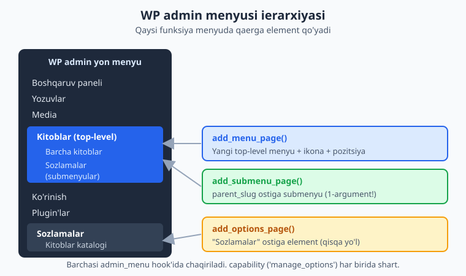
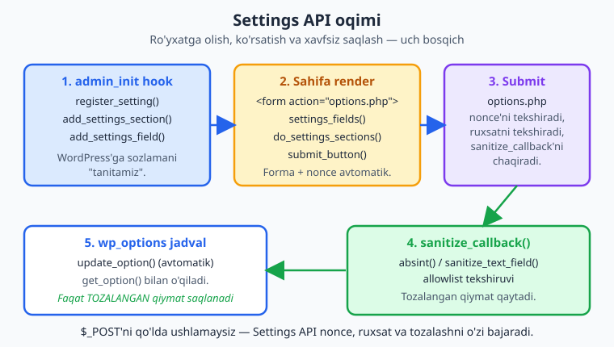
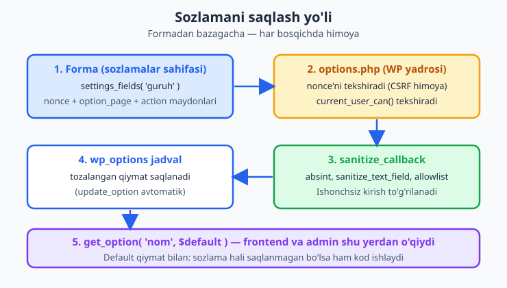

# 06 — Settings API va admin sahifalar

[⬅️ Oldingi: 05 — Zamonaviy PHP: namespace, autoload, OOP](./05-namespace-oop-autoload.md) · [🏠 README](./README.md) · [Keyingi: 07 — Custom Post Type'lar ➡️](./07-custom-post-types.md)

> **Bu bobda:** plugin'ingiz uchun wp-admin'da o'z menyu va sozlamalar sahifangizni quramiz — `add_menu_page()`/`add_submenu_page()`/`add_options_page()` bilan menyu, `register_setting()`/`add_settings_section()`/`add_settings_field()` bilan Settings API, `sanitize_callback` orqali xavfsiz saqlash, `settings_fields()` + `do_settings_sections()` + `submit_button()` bilan forma, va matn/checkbox/select/textarea maydonlarini "Kitoblar katalogi" plugin'imizning sozlamalari misolida (har sahifada nechta kitob, valyuta belgisi, joylashuv) to'liq ishlab chiqamiz — nega `$_POST`'ni qo'lda ushlamaslik kerakligini ham ko'ramiz.

---

## Muammo: plugin'imizga "boshqaruv tugmalari" kerak

`kitoblar-katalogi` plugin'imiz o'sib bormoqda. Tez orada u kitoblar ro'yxatini chiqaradi, lekin darhol savol tug'iladi: **har sahifada nechta kitob ko'rsatilsin? Narx qaysi valyutada? To'r ko'rinishimi yoki ro'yxat?**

Yomon yo'l — bu qiymatlarni kodga "qotirib" yozish (`$per_page = 12;`). Unda har o'zgartirish uchun foydalanuvchi kodga tegishi kerak. To'g'ri yo'l — wp-admin'da **sozlamalar sahifasi** berish, foydalanuvchi tugmalarni bossin, plugin esa qiymatlarni o'qisin.

Buni qilishning ikki yo'li bor:

1. ❌ **Qo'lda:** o'z formangiz, `$_POST`'ni o'zingiz o'qiysiz, o'zingiz tekshirasiz, o'zingiz `update_option()` qilasiz. Ko'p kod, oson xato, xavfsizlik teshigi.
2. ✅ **Settings API:** WordPress'ning standart tizimi. Siz sozlamani "ro'yxatdan o'tkazasiz", WordPress esa forma, nonce (CSRF himoyasi), ruxsat tekshiruvi va saqlashni **o'zi** bajaradi. Sizning vazifangiz — faqat maydonlarni chizish va qiymatni **tozalash** (sanitize).

> 📌 **Asosiy qoida.** WordPress'da admin sozlamalari uchun deyarli HAR DOIM Settings API ishlatiladi. Qo'lda `$_POST` formasi — faqat Settings API mos kelmaydigan murakkab holatlar uchun (va unda ham nonce'ni o'zingiz qo'shasiz — buni 12-bobda ko'ramiz).

Avval menyuni quramiz (sahifa qaerda ochiladi?), keyin Settings API bilan uni "jonlantiramiz".

> ℹ️ Bu bobda PHP `namespace` va funksiya/sinf bilan ishlaymiz — agar PHP zamonaviy idiomida ([05-bob](./05-namespace-oop-autoload.md)) hali noqulay bo'lsangiz, avval uni ko'rib chiqing. Tayanch PHP uchun [PHP — Mutlaqo Noldan](../php/README.md) kitobi bor.

---

## Admin menyu: sahifa qaerda paydo bo'ladi?

wp-admin'ning chap tomonidagi menyu — bu yerga plugin'ingiz o'z bandini qo'shadi. Buning uchun **`admin_menu`** hook'iga ulanamiz va shu ichida menyu funksiyalarini chaqiramiz.

Uch asosiy funksiya bor:

| Funksiya | Nima qiladi |
|---|---|
| `add_menu_page()` | Yangi **top-level** (yuqori darajali) menyu yaratadi — o'z ikonasi va pozitsiyasi bilan. |
| `add_submenu_page()` | Mavjud top-level menyu **ostiga** submenyu qo'shadi. |
| `add_options_page()` | "Sozlamalar" menyusi ostiga element qo'yadigan qisqa yo'l. |



### `add_menu_page()` — top-level menyu

Bizning plugin'imiz kattaroq bo'lgani uchun unga **o'z top-level menyusi** beramiz. Funksiya imzosi (argument tartibiga DIQQAT — bu yerda adashish oson):

```php
add_menu_page(
    string $page_title,   // sahifa <title> tegida ko'rinadigan matn
    string $menu_title,   // menyuda ko'rinadigan qisqa yorliq
    string $capability,   // kim ko'ra oladi (masalan 'manage_options')
    string $menu_slug,    // sahifaning noyob slug'i (URL'da page=...)
    callable $callback = '', // sahifa HTML'ini chiqaruvchi funksiya
    string $icon_url = '',   // ikona (dashicon, URL yoki SVG)
    int|float $position = null // menyudagi joy (raqam)
): string
```

`kitoblar-katalogi` uchun:

```php
<?php
namespace Oqil\KitobKatalog;

add_action( 'admin_menu', __NAMESPACE__ . '\\register_admin_menu' );

function register_admin_menu(): void {
    add_menu_page(
        __( 'Kitoblar katalogi', 'kitoblar-katalogi' ), // page_title
        __( 'Kitoblar', 'kitoblar-katalogi' ),          // menu_title
        'manage_options',                                // capability
        'kitoblar-katalogi',                             // menu_slug
        __NAMESPACE__ . '\\render_dashboard_page',       // callback
        'dashicons-book-alt',                            // icon (dashicon)
        26                                               // position
    );
}

function render_dashboard_page(): void {
    if ( ! current_user_can( 'manage_options' ) ) {
        return;
    }
    echo '<div class="wrap"><h1>'
        . esc_html__( 'Kitoblar katalogi', 'kitoblar-katalogi' )
        . '</h1></div>';
}
```

📌 Diqqat qiladigan nuqtalar:

- **`capability`** — bu sahifa kim uchun ko'rinadi. `'manage_options'` = administrator. ASLO `true` yoki rol nomi emas — bu **capability** nomi (11-bobda chuqur).
- **`menu_slug`** — noyob, kichik harf, defis bilan. URL `admin.php?page=kitoblar-katalogi` bo'ladi.
- **`callback`** ichida ham `current_user_can()` ni QAYTA tekshiramiz — chunki kimdir to'g'ridan URL'ni ochishi mumkin. Menyuni yashirish himoya emas.
- **`icon`** — `dashicons-*` (WordPress ichki ikonalari, masalan `dashicons-book-alt`), yoki `data:image/svg+xml;...`, yoki `'dashicons-admin-generic'`.
- **`position`** — raqam menyudagi joyni belgilaydi (26 = "Comments" yaqinida). Ataylab kasr (`25.5`) berib, boshqa plugin bilan to'qnashuvni kamaytirish mumkin.

> 💡 **Dashicons.** WordPress ichida yuzlab tayyor ikona bor. Ro'yxatni rasmiy "Dashicons" sahifasidan toping va `dashicons-` prefiksi bilan ishlating.

### `add_submenu_page()` — top-level ostiga band

Top-level menyu o'zi bossangiz birinchi callback'ni ochadi. Ostiga aniq bandlar qo'shish uchun `add_submenu_page()`:

```php
add_submenu_page(
    string $parent_slug,  // OTA menyu slug'i — BIRINCHI argument!
    string $page_title,
    string $menu_title,
    string $capability,
    string $menu_slug,
    callable $callback = ''
);
```

⚠️ **Eng ko'p uchraydigan xato:** `add_submenu_page()` da birinchi argument — `$parent_slug` (ota menyu), `add_menu_page()` da esa birinchi argument — `$page_title`. Tartibni adashtirsangiz, submenyu noto'g'ri joyda chiqadi yoki umuman ko'rinmaydi. Imzoni har doim tekshiring.

To'liq menyu (top-level + ikki submenyu):

```php
function register_admin_menu(): void {
    add_menu_page(
        __( 'Kitoblar katalogi', 'kitoblar-katalogi' ),
        __( 'Kitoblar', 'kitoblar-katalogi' ),
        'manage_options',
        'kitoblar-katalogi',
        __NAMESPACE__ . '\\render_dashboard_page',
        'dashicons-book-alt',
        26
    );

    // Birinchi submenyu top-level bilan BIR XIL slug bo'lsin —
    // shunda yuqoridagi takror "Kitoblar katalogi" bandi
    // "Barcha kitoblar" deb to'g'rilanadi.
    add_submenu_page(
        'kitoblar-katalogi',                          // parent_slug
        __( 'Barcha kitoblar', 'kitoblar-katalogi' ),
        __( 'Barcha kitoblar', 'kitoblar-katalogi' ),
        'manage_options',
        'kitoblar-katalogi',                          // top-level bilan bir xil
        __NAMESPACE__ . '\\render_dashboard_page'
    );

    add_submenu_page(
        'kitoblar-katalogi',
        __( 'Sozlamalar', 'kitoblar-katalogi' ),
        __( 'Sozlamalar', 'kitoblar-katalogi' ),
        'manage_options',
        'kitoblar-katalogi-sozlamalar',               // sozlamalar sahifasi slug'i
        __NAMESPACE__ . '\\render_settings_page'
    );
}
```

> 💡 **Birinchi submenyuni dublikat slug bilan qo'yish — keng tarqalgan naqsh.** `add_menu_page()` avtomatik ravishda top-level slug bilan bir xil nomli submenyu yaratadi (yorlig'i `menu_title`'ga teng). Yuqoridagidek bir xil slug bilan `add_submenu_page()` chaqirib, o'sha birinchi bandning yorlig'ini ("Barcha kitoblar") to'g'rilaysiz.

### `add_options_page()` — "Sozlamalar" ostiga qisqa yo'l

Agar plugin'ingiz **kichik** bo'lsa (faqat bitta sozlamalar sahifasi), top-level menyu ortiqcha. WordPress odati: sozlamalarni **Sozlamalar (Settings)** menyusi ostiga qo'yish. Buning uchun maxsus qisqa funksiya bor:

```php
add_options_page(
    string $page_title,
    string $menu_title,
    string $capability,
    string $menu_slug,
    callable $callback = ''
): string|false
```

Bu aslida `add_submenu_page('options-general.php', ...)` ning qisqa varianti. Bizning plugin top-level menyuga ega bo'lgani uchun biz `add_submenu_page()` ishlatamiz, lekin agar siz faqat sozlamalar sahifasi xohlasangiz:

```php
add_action( 'admin_menu', function (): void {
    add_options_page(
        __( 'Kitoblar katalogi sozlamalari', 'kitoblar-katalogi' ),
        __( 'Kitoblar katalogi', 'kitoblar-katalogi' ),
        'manage_options',
        'kitoblar-katalogi-sozlamalar',
        __NAMESPACE__ . '\\render_settings_page'
    );
} );
```

📌 `add_options_page()` bilan yaratilgan sahifa **Sozlamalar** ostida bo'lgani uchun uning URL'i `options-general.php?page=...` ko'rinishida bo'ladi. Top-level menyu ostidagi submenyu esa `admin.php?page=...` bo'ladi. Slug bo'yicha havola yasaganda `menu_page_url( $slug )` ishlatib, to'g'ri URL'ni WordPress o'zi tuzsin.

⚠️ Bu yerda sahifa **ko'rinishi** illustrativ: menyu va sahifa faqat ishlab turgan WordPress'da paydo bo'ladi. Kodni o'z saytingizga qo'yib, wp-admin chap menyusida "Kitoblar" bandini ko'rasiz.

---

## Settings API: nega va qanday

Endi menyu bor, lekin "Sozlamalar" sahifasi bo'sh. Uni Settings API bilan to'ldiramiz. Avval **tushuncha modelini** ko'ramiz — uch atama bor:

- **setting (sozlama)** — bitta `wp_options` yozuvi (bizda butun massiv bitta option ichida). `register_setting()` bilan ro'yxatga olinadi.
- **section (bo'lim)** — sozlamalar sahifasidagi mantiqiy guruh (sarlavha + tavsif). `add_settings_section()`.
- **field (maydon)** — bitta input (matn, checkbox...). `add_settings_field()`.

Bularning hammasi **`admin_init`** hook'ida ro'yxatga olinadi. Keyin sahifani chizganda `do_settings_sections()` ularni avtomatik chiqaradi.



### Bitta option, ko'p maydon

Bizda beshta sozlama bor (per_page, currency, layout, show_author, intro_text). Ularni **beshta alohida option** qilish mumkin, lekin yaxshiroq naqsh — **bitta massiv option**: `kitoblar_katalogi_settings`. Shunda bitta `get_option()` chaqiruvi bilan hammasini o'qiymiz va bazada bitta yozuv egallaymiz.

Avval default qiymatlar va o'qish yordamchisi:

```php
<?php
namespace Oqil\KitobKatalog;

const OPTION_NAME   = 'kitoblar_katalogi_settings';
const OPTION_GROUP  = 'kitoblar_katalogi_group';
const SETTINGS_PAGE = 'kitoblar-katalogi-sozlamalar';

function default_settings(): array {
    return [
        'per_page'    => 12,
        'currency'    => 'so\'m',
        'show_author' => 1,
        'layout'      => 'grid',
        'intro_text'  => '',
    ];
}

function get_settings(): array {
    $saved = get_option( OPTION_NAME, [] );
    // Saqlangan qiymatlarni default ustiga "yopishtiramiz" —
    // yangi sozlama qo'shsangiz ham eski yozuv buzilmaydi.
    return wp_parse_args( is_array( $saved ) ? $saved : [], default_settings() );
}
```

> 📌 **`get_option()` har doim default bilan.** `get_option( OPTION_NAME, [] )` — ikkinchi argument default. Sozlama hali saqlanmagan bo'lsa (plugin yangi o'rnatilgan), bo'sh massiv qaytadi, `wp_parse_args()` esa uni default qiymatlar bilan to'ldiradi. Shunday qilib kod birinchi kundanoq ishlaydi.

### Ro'yxatga olish: `register_setting`, `section`, `field`

```php
add_action( 'admin_init', __NAMESPACE__ . '\\register_settings' );

function register_settings(): void {
    register_setting(
        OPTION_GROUP,                                   // option_group
        OPTION_NAME,                                    // option_name
        [
            'type'              => 'object',
            'sanitize_callback' => __NAMESPACE__ . '\\sanitize_settings',
            'default'           => default_settings(),
            'show_in_rest'      => false,
        ]
    );

    add_settings_section(
        'kitoblar_katalogi_main',                       // id
        __( 'Katalog ko\'rinishi', 'kitoblar-katalogi' ), // title
        __NAMESPACE__ . '\\render_section_intro',        // callback (tavsif)
        SETTINGS_PAGE                                    // page
    );

    add_settings_field(
        'per_page',                                     // id
        __( 'Har sahifada nechta kitob', 'kitoblar-katalogi' ), // title (label)
        __NAMESPACE__ . '\\render_field_per_page',       // callback (input chizadi)
        SETTINGS_PAGE,                                   // page
        'kitoblar_katalogi_main',                        // section
        [ 'label_for' => 'kk_per_page' ]                 // args
    );

    add_settings_field(
        'currency',
        __( 'Valyuta belgisi', 'kitoblar-katalogi' ),
        __NAMESPACE__ . '\\render_field_currency',
        SETTINGS_PAGE,
        'kitoblar_katalogi_main',
        [ 'label_for' => 'kk_currency' ]
    );

    add_settings_field(
        'layout',
        __( 'Joylashuv', 'kitoblar-katalogi' ),
        __NAMESPACE__ . '\\render_field_layout',
        SETTINGS_PAGE,
        'kitoblar_katalogi_main',
        [ 'label_for' => 'kk_layout' ]
    );

    add_settings_field(
        'show_author',
        __( 'Muallifni ko\'rsatish', 'kitoblar-katalogi' ),
        __NAMESPACE__ . '\\render_field_show_author',
        SETTINGS_PAGE,
        'kitoblar_katalogi_main'
    );

    add_settings_field(
        'intro_text',
        __( 'Kirish matni', 'kitoblar-katalogi' ),
        __NAMESPACE__ . '\\render_field_intro_text',
        SETTINGS_PAGE,
        'kitoblar_katalogi_main',
        [ 'label_for' => 'kk_intro_text' ]
    );
}
```

Imzolarni eslab qoling (argument tartibi MUHIM):

```php
register_setting( string $option_group, string $option_name, array $args = [] );
add_settings_section( string $id, string $title, callable $callback, string $page, array $args = [] );
add_settings_field( string $id, string $title, callable $callback, string $page, string $section = 'default', array $args = [] );
```

📌 Ikkita "bog'lovchi ip" bor:

- `add_settings_field()` ning `$page` argumenti `add_settings_section()` ning `$page` va sahifa chizishdagi `do_settings_sections($page)` bilan **bir xil** bo'lishi shart (`SETTINGS_PAGE`).
- `add_settings_field()` ning `$section` argumenti `add_settings_section()` ning `$id`'si bilan bir xil bo'lishi shart (`kitoblar_katalogi_main`).
- `register_setting()` ning `$option_group`'i sahifadagi `settings_fields($option_group)` bilan bir xil (`OPTION_GROUP`).

💡 **`label_for` — kichik, lekin foydali.** `args`'ga `'label_for' => 'kk_per_page'` bersangiz, WordPress maydon sarlavhasini `<label for="kk_per_page">` ga o'raydi. Foydalanuvchi yorliqni bossa, mos input fokuslanadi. Buning uchun input'ning `id`'si shu qiymatga teng bo'lsin.

---

## Maydonlarni chizish: matn, son, select, checkbox, textarea

Har bir field callback'i o'z input'ini **chiqaradi** (echo). Qiymatni `get_settings()` dan o'qiymiz, chiqishda esa **kontekstga mos escape** qilamiz — bu xavfsizlikning yarmi.

```php
function render_section_intro(): void {
    echo '<p>' . esc_html__( 'Katalog frontendda qanday ko\'rinishini sozlang.', 'kitoblar-katalogi' ) . '</p>';
}

// Son (number) — har sahifada nechta kitob
function render_field_per_page(): void {
    $settings = get_settings();
    printf(
        '<input type="number" min="1" max="100" id="kk_per_page" name="%1$s[per_page]" value="%2$s" class="small-text" />',
        esc_attr( OPTION_NAME ),
        esc_attr( (string) $settings['per_page'] )
    );
    echo '<p class="description">' . esc_html__( '1 dan 100 gacha.', 'kitoblar-katalogi' ) . '</p>';
}

// Matn (text) — valyuta belgisi
function render_field_currency(): void {
    $settings = get_settings();
    printf(
        '<input type="text" id="kk_currency" name="%1$s[currency]" value="%2$s" class="regular-text" />',
        esc_attr( OPTION_NAME ),
        esc_attr( $settings['currency'] )
    );
}

// Select — joylashuv
function render_field_layout(): void {
    $settings = get_settings();
    $options  = [
        'grid' => __( 'To\'r (grid)', 'kitoblar-katalogi' ),
        'list' => __( 'Ro\'yxat (list)', 'kitoblar-katalogi' ),
    ];
    echo '<select id="kk_layout" name="' . esc_attr( OPTION_NAME ) . '[layout]">';
    foreach ( $options as $value => $label ) {
        printf(
            '<option value="%1$s" %2$s>%3$s</option>',
            esc_attr( $value ),
            selected( $settings['layout'], $value, false ), // tanlanganini belgilaydi
            esc_html( $label )
        );
    }
    echo '</select>';
}

// Checkbox — muallifni ko'rsatish
function render_field_show_author(): void {
    $settings = get_settings();
    printf(
        '<label><input type="checkbox" name="%1$s[show_author]" value="1" %2$s /> %3$s</label>',
        esc_attr( OPTION_NAME ),
        checked( $settings['show_author'], 1, false ), // belgilangan/yo'q
        esc_html__( 'Har kitob ostida muallif ismi chiqsin', 'kitoblar-katalogi' )
    );
}

// Textarea — kirish matni
function render_field_intro_text(): void {
    $settings = get_settings();
    printf(
        '<textarea id="kk_intro_text" name="%1$s[intro_text]" rows="3" class="large-text">%2$s</textarea>',
        esc_attr( OPTION_NAME ),
        esc_textarea( $settings['intro_text'] )
    );
}
```

⚠️ **Escape — kontekstga qarab.** Diqqat qiling: `value="..."` atribut ichida `esc_attr()`, `<textarea>` ichida `esc_textarea()`, oddiy matnda `esc_html()`. Noto'g'ri escape XSS teshigiga olib keladi. Eslab qoling: **chiqishda har doim escape, kontekstga mos** (12-bobda chuqur).

💡 **`name="OPTION_NAME[kalit]"` naqshi.** Massivli option uchun input nomlari `kitoblar_katalogi_settings[per_page]` ko'rinishida bo'ladi. Submit qilinganda PHP buni `$_POST['kitoblar_katalogi_settings']['per_page']` massiv qilib qabul qiladi va WordPress to'g'ridan sizning `sanitize_callback`'ingizga uzatadi.

💡 **`selected()` va `checked()`** — WordPress yordamchilari. `selected($a, $b, $echo)` — agar `$a == $b` bo'lsa `selected="selected"` qaytaradi (yoki chiqaradi). Uchinchi argument `false` — chiqarmasdan **qaytar** (biz `printf` ichiga joylaymiz).

---

## Sahifani chizish: forma

Endi menyuda `render_settings_page` ga ulagan callback'ni yozamiz. Bu — sehrning eng oddiy qismi: WordPress hamma ishni qiladi, biz faqat **uchta yordamchi** chaqiramiz.

```php
function render_settings_page(): void {
    // Menyu yashirilgan bo'lsa ham, to'g'ridan URL'ga himoya:
    if ( ! current_user_can( 'manage_options' ) ) {
        wp_die( esc_html__( 'Sizda bu sahifaga ruxsat yo\'q.', 'kitoblar-katalogi' ) );
    }
    ?>
    <div class="wrap">
        <h1><?php echo esc_html( get_admin_page_title() ); ?></h1>
        <form action="options.php" method="post">
            <?php
            settings_fields( OPTION_GROUP );        // nonce + option_page + action
            do_settings_sections( SETTINGS_PAGE );  // barcha section va field'lar
            submit_button( __( 'Saqlash', 'kitoblar-katalogi' ) );
            ?>
        </form>
    </div>
    <?php
}
```

Mana shu uch funksiya butun "sehrni" bajaradi:

- **`settings_fields( $option_group )`** — yashirin maydonlarni chiqaradi: `option_page` (qaysi guruh), `action=update`, va eng muhimi **nonce** (CSRF himoyasi). Buni o'zingiz yozishingiz shart emas.
- **`do_settings_sections( $page )`** — `admin_init`'da shu sahifaga ro'yxatga olingan barcha section va field'larni `<table class="form-table">` ichida chiqaradi.
- **`submit_button()`** — standart "Saqlash" tugmasi.

⚠️ **Forma `action="options.php"`.** Bu MUHIM — forma o'z sahifangizga emas, WordPress'ning `options.php` fayliga jo'natiladi. O'sha fayl nonce'ni tekshiradi, ruxsatni tekshiradi, sizning `sanitize_callback`'ingizni chaqiradi va qiymatni saqlaydi. Shuning uchun siz `$_POST`'ni umuman ko'rmaysiz.



⚠️ Bu sahifaning jonli ko'rinishi (forma, "Saqlandi" xabari) faqat ishlab turgan WordPress'da paydo bo'ladi — kodni o'z saytingizga qo'yib sinab ko'ring.

---

## `sanitize_callback`: ishonchsiz kirishni tozalash

Bu — Settings API'ning **eng muhim** qismi. Foydalanuvchi formaga istalgan narsa kiritishi mumkin (xato son, HTML, hatto skript). Saqlashdan oldin har bir qiymatni **tozalaymiz**. WordPress bizning callback'imizni avtomatik chaqiradi va **qaytgan qiymatni** saqlaydi.

```php
function sanitize_settings( $input ): array {
    $input    = is_array( $input ) ? $input : [];
    $defaults = default_settings();
    $out      = [];

    // Son: butun songa aylantiramiz va 1..100 oralig'iga qisamiz
    $per_page        = isset( $input['per_page'] ) ? absint( $input['per_page'] ) : $defaults['per_page'];
    $out['per_page'] = max( 1, min( 100, $per_page ) );

    // Matn: teglarni olib tashlaymiz
    $out['currency'] = isset( $input['currency'] )
        ? sanitize_text_field( $input['currency'] )
        : $defaults['currency'];

    // Select: faqat allowlist'dagi qiymat (eng ishonchli usul)
    $allowed_layouts = [ 'grid', 'list' ];
    $out['layout']   = ( isset( $input['layout'] ) && in_array( $input['layout'], $allowed_layouts, true ) )
        ? $input['layout']
        : $defaults['layout'];

    // Checkbox: bor yoki yo'q -> 1 yoki 0
    $out['show_author'] = empty( $input['show_author'] ) ? 0 : 1;

    // Textarea: ko'p qatorli matn (qator uzilishini saqlaydi)
    $out['intro_text'] = isset( $input['intro_text'] )
        ? sanitize_textarea_field( $input['intro_text'] )
        : '';

    return $out;
}
```

📌 Tozalash qoidalari, tur bo'yicha:

| Tur | Tozalash funksiyasi | Izoh |
|---|---|---|
| Butun son | `absint()` | Manfiy bo'lmagan butun son. Diapazon uchun `max()/min()`. |
| Oddiy matn | `sanitize_text_field()` | Teg va ortiqcha bo'shliqni olib tashlaydi. |
| Email | `sanitize_email()` | Email formatini tozalaydi. |
| URL | `esc_url_raw()` | Bazaga saqlash uchun URL. |
| Select/radio | `in_array(..., true)` allowlist | Eng ishonchli — faqat ruxsat etilgan qiymat. |
| Checkbox | `empty()` -> 0/1 | Mavjudligini tekshiring. |
| Ko'p qatorli matn | `sanitize_textarea_field()` | Qator uzilishini saqlaydi. |
| Cheklangan HTML | `wp_kses_post()` | Faqat xavfsiz teglarga ruxsat. |

> ⚠️ **Hech qachon ishonib qabul qilmang.** `sanitize_callback`'siz `register_setting()` — xavfsizlik xatosi. Select uchun ham `in_array()` allowlist ishlating: foydalanuvchi `<select>`'ni chetlab, formaga ixtiyoriy qiymat jo'natishi mumkin. "Ko'rinmaydigan" maydon ham himoyalanishi shart.

> 💡 **Tozalash mantig'ini alohida sinash.** Diapazonga qisish kabi sof PHP mantig'ini WordPress'siz ham tekshirib ko'rsa bo'ladi: `max(1, min(100, $value))` — `250` uchun `100`, `0` uchun `1`, `12` uchun `12` qaytaradi. Bu mantiqni ajratib `php -r` bilan ishga tushirib, to'g'ri ekanini tasdiqlash mumkin.

### Qiymatni o'qish

Saqlangach, plugin'ning istalgan joyida qiymatni o'qiysiz:

```php
$settings = get_settings();           // default bilan to'ldirilgan massiv
$per_page = $settings['per_page'];     // masalan 12
$currency = $settings['currency'];     // masalan "so'm"

// Frontend chiqishida ham qiymatni escape qiling:
echo esc_html( $currency );
```

---

## ❌ Nega qo'lda `$_POST` emas (anti-misol)

Ko'pchilik boshlovchi shunday yozadi — va bu **xavfli**:

```php
// ❌ SHUNDAY QILMANG — nonce yo'q, ruxsat tekshiruvi yo'q, tozalash yo'q
function kk_bad_save(): void {
    if ( isset( $_POST['save'] ) ) {
        update_option( 'kk_per_page', $_POST['per_page'] ); // tozalanmagan!
    }
}
```

Muammolar:

1. **CSRF:** nonce yo'q — boshqa sayt foydalanuvchini aldab sozlamani o'zgartirishi mumkin.
2. **Ruxsat:** `current_user_can()` yo'q — har kim saqlashi mumkin.
3. **Tozalash yo'q:** `$_POST['per_page']` to'g'ridan bazaga — XSS/keraksiz ma'lumot.
4. **`wp_unslash()` yo'q:** WordPress `$_POST`'ga slesh qo'shadi, uni olib tashlash kerak.

Settings API bularning **uchtasini avtomatik** hal qiladi (nonce, ruxsat, slesh), tozalashni esa siz bitta `sanitize_callback`'da qilasiz. Shuning uchun standart yo'l — Settings API.

> 📌 Agar Settings API tashqarisida forma yozsangiz (masalan AJAX yoki maxsus admin sahifa), nonce'ni `wp_nonce_field()` + `check_admin_referer()`, ruxsatni `current_user_can()`, tozalashni `wp_unslash()` + sanitize bilan **o'zingiz** qilasiz. Buni 12-bob (xavfsizlik) va 15-bob (AJAX) batafsil ko'radi.

---

## Yig'ib qo'yamiz: izchil naqsh

Bizning `kitoblar-katalogi` plugin'ida endi:

1. `admin_menu` -> menyu (`add_menu_page` + `add_submenu_page`).
2. `admin_init` -> `register_setting` + sections + fields.
3. Sahifa callback'i -> `settings_fields` + `do_settings_sections` + `submit_button`.
4. `sanitize_callback` -> har turga mos tozalash.
5. `get_settings()` -> default bilan o'qish, frontend va admin'da ishlatish.

Bu naqsh deyarli HAR plugin'da bir xil. Keyingi boblarda CPT ([07](./07-custom-post-types.md)) va meta box ([09](./09-meta-box-custom-fields.md)) qo'shganda ham shu sozlamalarga tayanamiz.

---

## 06-bob mashqlari

> Har mashqni o'z lokal WordPress'ingizda (02-bob) sinab ko'ring. Slug/namespace izchil: `kitoblar-katalogi` / `Oqil\KitobKatalog`.

**Oson**

1. **(Oson)** `add_menu_page()` ning 7 argumentini tartib bilan nomlang va har birini bir jumla bilan tushuntiring.
2. **(Oson)** Plugin'ingizga `dashicons-book-alt` o'rniga boshqa dashicon qo'ying. Rasmiy Dashicons ro'yxatidan birini tanlab, `icon_url` ga bering.
3. **(Oson)** `add_menu_page()` va `add_submenu_page()` ning **birinchi argumenti** nimasi bilan farq qiladi? Nega bu xatoga sabab bo'ladi?
4. **(Oson)** `get_option( 'mavjud_emas_option', 'default_qiymat' )` nima qaytaradi va nega ikkinchi argument muhim?

**O'rta**

5. **(O'rta)** Sozlamalarga yangi **matn** maydoni qo'shing: "Katalog sarlavhasi" (`catalog_title`). `add_settings_field`, render callback va `sanitize_callback`'da tegishli qatorlarni yozing.

   <details markdown="1"><summary>Yechim</summary>

   `register_settings()` ichiga:
   ```php
   add_settings_field(
       'catalog_title',
       __( 'Katalog sarlavhasi', 'kitoblar-katalogi' ),
       __NAMESPACE__ . '\\render_field_catalog_title',
       SETTINGS_PAGE,
       'kitoblar_katalogi_main',
       [ 'label_for' => 'kk_catalog_title' ]
   );
   ```
   Render callback:
   ```php
   function render_field_catalog_title(): void {
       $settings = get_settings();
       $value    = $settings['catalog_title'] ?? '';
       printf(
           '<input type="text" id="kk_catalog_title" name="%1$s[catalog_title]" value="%2$s" class="regular-text" />',
           esc_attr( OPTION_NAME ),
           esc_attr( $value )
       );
   }
   ```
   `sanitize_settings()` ichiga:
   ```php
   $out['catalog_title'] = isset( $input['catalog_title'] )
       ? sanitize_text_field( $input['catalog_title'] )
       : '';
   ```
   Va `default_settings()` ga `'catalog_title' => ''` qo'shing. `value="..."` da `esc_attr()` — chunki atribut konteksti.
   </details>

6. **(O'rta)** `add_options_page()` bilan plugin'ni "Sozlamalar" menyusi ostiga qo'ying (top-level o'rniga). Qaysi holatda qaysi yondashuv to'g'ri?

   <details markdown="1"><summary>Yechim</summary>

   ```php
   add_action( 'admin_menu', function (): void {
       add_options_page(
           __( 'Kitoblar katalogi sozlamalari', 'kitoblar-katalogi' ),
           __( 'Kitoblar katalogi', 'kitoblar-katalogi' ),
           'manage_options',
           'kitoblar-katalogi-sozlamalar',
           __NAMESPACE__ . '\\render_settings_page'
       );
   } );
   ```
   **Top-level (`add_menu_page`)** — plugin katta, ko'p sahifa/CPT bo'lsa. **`add_options_page`** — faqat bitta sozlamalar sahifasi bo'lsa (WordPress odati). Ikkalasini birga ishlatmang: foydalanuvchi sozlamani bir joydan topsin.
   </details>

7. **(O'rta)** `render_field_layout()` selectiga uchinchi variant qo'shing: `'masonry'`. `sanitize_callback`'da allowlist'ni ham yangilang. Nega faqat render'ni yangilash yetarli emas?

   <details markdown="1"><summary>Yechim</summary>

   `$options` ga `'masonry' => __( 'Masonry', 'kitoblar-katalogi' )`, va `$allowed_layouts = ['grid','list','masonry']`. Faqat render'ni yangilash YETARLI EMAS: agar allowlist'ni yangilamasangiz, foydalanuvchi `masonry` ni tanlasa, `sanitize_settings()` uni rad etib `grid`'ga qaytaradi (allowlist'da yo'q). Render — ko'rinish, sanitize — haqiqiy ruxsat; ikkalasi mos bo'lsin.
   </details>

8. **(O'rta)** `settings_fields()`, `do_settings_sections()` va `submit_button()` ning har biri formaga nima qo'shishini ayting. Birortasini olib tashlasangiz nima buziladi?

   <details markdown="1"><summary>Yechim</summary>

   - `settings_fields( $group )` — nonce, `option_page`, `action=update` yashirin maydonlari. Olib tashlasangiz: saqlash ishlamaydi (nonce yo'q, `options.php` rad etadi).
   - `do_settings_sections( $page )` — barcha section/field HTML. Olib tashlasangiz: forma bo'sh ko'rinadi (input'lar yo'q).
   - `submit_button()` — "Saqlash" tugmasi. Olib tashlasangiz: yuborish tugmasi yo'q (forma jo'natilmaydi).
   </details>

**Qiyin**

9. **(Qiyin)** Bitta massiv option o'rniga **ikkita alohida option** ishlatib (`kk_per_page`, `kk_currency`) Settings API'ni qayta yozing. So'ng nega massiv yondashuvi afzalroq ekanini tushuntiring.

   <details markdown="1"><summary>Yechim</summary>

   ```php
   function register_settings(): void {
       register_setting( 'kk_group', 'kk_per_page', [
           'type'              => 'integer',
           'sanitize_callback' => 'absint',
           'default'           => 12,
       ] );
       register_setting( 'kk_group', 'kk_currency', [
           'type'              => 'string',
           'sanitize_callback' => 'sanitize_text_field',
           'default'           => 'so\'m',
       ] );

       add_settings_section( 'kk_main', __( 'Asosiy', 'kitoblar-katalogi' ), '__return_false', 'kitoblar-katalogi-sozlamalar' );

       add_settings_field( 'kk_per_page', __( 'Nechta kitob', 'kitoblar-katalogi' ), function (): void {
           printf(
               '<input type="number" min="1" max="100" name="kk_per_page" value="%s" class="small-text" />',
               esc_attr( (string) get_option( 'kk_per_page', 12 ) )
           );
       }, 'kitoblar-katalogi-sozlamalar', 'kk_main' );

       add_settings_field( 'kk_currency', __( 'Valyuta', 'kitoblar-katalogi' ), function (): void {
           printf(
               '<input type="text" name="kk_currency" value="%s" class="regular-text" />',
               esc_attr( get_option( 'kk_currency', 'so\'m' ) )
           );
       }, 'kitoblar-katalogi-sozlamalar', 'kk_main' );
   }
   ```
   Sahifada `settings_fields( 'kk_group' )` (har ikkala option bir guruhda). **Nega massiv afzal:** bitta `get_option()` chaqiruvi, `wp_options`'da bitta yozuv (kamroq autoload yuki), bitta `sanitize_callback`'da hamma maydonni bir-biriga bog'liq tekshirish (masalan A tanlansa B majburiy). Ko'p option — ko'p baza yozuvi va ko'p chaqiruv.
   </details>

10. **(Qiyin)** Sozlamalarga "**Admin email**" maydoni (`notify_email`) qo'shing. `sanitize_callback`'da emailni tekshiring; noto'g'ri bo'lsa `add_settings_error()` bilan xato xabarini ko'rsating va eski qiymatni saqlang.

    <details markdown="1"><summary>Yechim</summary>

    Render:
    ```php
    function render_field_notify_email(): void {
        $settings = get_settings();
        printf(
            '<input type="email" id="kk_notify_email" name="%1$s[notify_email]" value="%2$s" class="regular-text" />',
            esc_attr( OPTION_NAME ),
            esc_attr( $settings['notify_email'] ?? '' )
        );
    }
    ```
    `sanitize_settings()` ichida:
    ```php
    $raw   = isset( $input['notify_email'] ) ? trim( (string) $input['notify_email'] ) : '';
    $email = sanitize_email( $raw );
    if ( '' !== $raw && ! is_email( $email ) ) {
        add_settings_error(
            OPTION_NAME,
            'invalid_email',
            __( 'Email manzili noto\'g\'ri — eski qiymat saqlandi.', 'kitoblar-katalogi' )
        );
        $existing             = get_settings();
        $out['notify_email']  = $existing['notify_email'] ?? '';
    } else {
        $out['notify_email'] = $email;
    }
    ```
    `add_settings_error()` xabari sahifada `settings_errors()` (yoki Settings API sahifasida avtomatik) orqali chiqadi. `is_email()` — WordPress'ning email tekshiruvchisi; noto'g'ri bo'lsa eski qiymatni `get_settings()` dan tiklaymiz.
    </details>

11. **(Qiyin)** Sozlamalar sahifasiga **ikkinchi bo'lim** (section) qo'shing: "Frontend ko'rinishi". `layout` va `intro_text` maydonlarini shu yangi bo'limga ko'chiring.

    <details markdown="1"><summary>Yechim</summary>

    ```php
    add_settings_section(
        'kitoblar_katalogi_frontend',
        __( 'Frontend ko\'rinishi', 'kitoblar-katalogi' ),
        function (): void {
            echo '<p>' . esc_html__( 'Saytda qanday ko\'rinsin.', 'kitoblar-katalogi' ) . '</p>';
        },
        SETTINGS_PAGE
    );
    ```
    So'ng `layout` va `intro_text` field'larining **beshinchi argumenti** (`$section`) ni `'kitoblar_katalogi_main'` dan `'kitoblar_katalogi_frontend'` ga o'zgartiring. `do_settings_sections( SETTINGS_PAGE )` ikkala bo'limni ham tartib bilan chiqaradi. Field'ning `$page` argumenti o'zgarmaydi — faqat `$section`.
    </details>

12. **(Qiyin)** Plugin o'chirilganda (`uninstall.php`) sozlamalar option'ini bazadan o'chiring. Nega bu yaxshi amaliyot? `delete_option()` ni to'g'ri ishlating.

    <details markdown="1"><summary>Yechim</summary>

    Plugin papkasida `uninstall.php`:
    ```php
    <?php
    // To'g'ridan ochilishdan himoya — faqat WordPress uninstall jarayoni chaqirsin.
    if ( ! defined( 'WP_UNINSTALL_PLUGIN' ) ) {
        exit;
    }
    delete_option( 'kitoblar_katalogi_settings' );
    ```
    **Nega:** plugin o'chirilganda bazada "axlat" qoldirmaslik yaxshi amaliyot — `wp_options` toza qoladi. `WP_UNINSTALL_PLUGIN` tekshiruvi MAJBURIY: usiz faylni to'g'ridan ochib option o'chirib yuborish mumkin. Eslatma: `uninstall.php` namespace'siz, sof PHP fayl (3-bobda ko'rilgan). Multisite uchun har sayt option'ini alohida o'chirish kerak (11-bob).
    </details>

13. **(Qiyin)** `register_setting()` da `'show_in_rest' => true` qilsangiz nima o'zgaradi? Bu qachon foydali va qanday xavf bor?

    <details markdown="1"><summary>Yechim</summary>

    `show_in_rest => true` option'ni WordPress REST API'da (`/wp/v2/settings`) ko'rsatadi — Gutenberg yoki tashqi mijoz uni o'qiy/yoza oladi (`@wordpress/data` `core` store orqali). **Foydali:** blok muharririda sozlamani JS'dan o'qish (23-bob). **Xavf:** `/wp/v2/settings` ga `manage_options` ruxsati kerak, lekin maydon REST'da ko'rinadigan bo'lgani uchun **schema** to'g'ri bo'lishi shart. Massiv option uchun `show_in_rest`'ni shunchaki `true` qilish yetarli emas — `['schema' => [...]]` bilan tuzilmani aniqlang, aks holda REST uni rad etishi mumkin. Sodda holatda `false` qoldiring; REST kerak bo'lsagina yoqing.
    </details>

[⬅️ Oldingi: 05 — Zamonaviy PHP: namespace, autoload, OOP](./05-namespace-oop-autoload.md) · [🏠 README](./README.md) · [Keyingi: 07 — Custom Post Type'lar ➡️](./07-custom-post-types.md)
